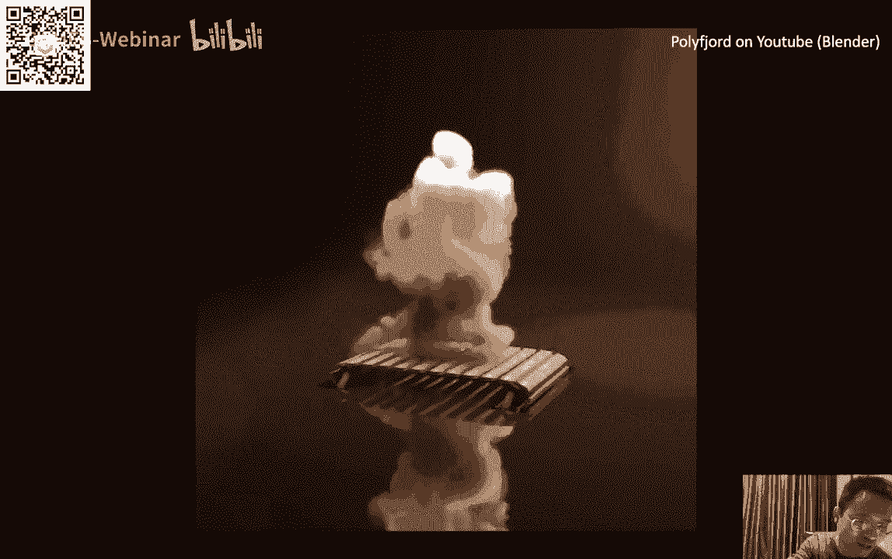

# GAMES103-基于物理的计算机动画入门 - P1：Lecture 01 课程介绍 🎬

在本节课中，我们将要学习这门课程的整体框架、学习目标、课程机制以及基于物理的计算机动画的基本概念。我们将从图形学的基础知识开始，逐步深入到物理模拟的核心领域。

## 课程概述与机制 📋

本课程名为“基于物理的计算机动画入门”。课程主要讨论如何将物理模拟技术应用于计算机动画中，并介绍相关技术的基本原理和算法。课程包含相应的编程作业以巩固所学知识。

我是课程讲师王华明。课程相关问题可以发送至课程邮箱，会有助教或老师解答。课程资料、回放、PPT及作业将发布在GAMES论坛上。

课程时间为每周一16:00至17:30，时长约一个半小时，具体可能根据内容调整。课程后半段会预留时间进行答疑。

从第三周开始，课程将转为线下授课与线上转播结合的形式。线下地点初步定在林地科技会议室（浙江大学紫金港校区附近），方便杭州及周边地区的同学参与。

课程将持续12周，大约到春节前两周结束。作业批改和课程辅助将由助教团队负责。

## 预备知识要求 📚

为了降低学习门槛，本课程仅要求学员具备基础的数学知识和编程能力。

以下是所需的核心知识：
*   **数学基础**：需要掌握线性代数（矢量、矩阵、线性系统、特征值分解等概念）和微积分（求导、积分、链式法则、梯度、泰勒展开等基本概念和计算）。
*   **编程基础**：需要具备C、C++、C#或Java等语言的编程能力。课程作业将使用Unity引擎，其脚本语言为C#。有相关语言经验即可快速上手。
*   **图形学基础**：了解简单的图形学概念（如变换、旋转）和渲染基本原理即可，无需深入复杂的图形学知识。

课程会涵盖数值算法、偏微分方程、有限元分析、流体力学等进阶内容，但即使没有这些背景知识，也可以通过课程学习掌握。

## 课程工具与环境 🛠️

课程作业将使用Unity引擎完成。Unity对学生和个人用户免费，对硬件要求较低，大部分计算基于CPU。

以下是关于工具的重点说明：
*   **Unity版本**：对版本要求不严格，较新的版本均可。支持Windows和macOS系统。
*   **学习重点**：使用Unity主要是将其作为学习和实践的工具，课程核心是学习物理模拟算法本身，而非Unity引擎的使用。大部分作业将替代Unity原有的物理引擎，通过编写脚本来实现模拟。
*   **资源获取**：Unity软件可从官网下载，其官方论坛可以解答通用的引擎使用问题。

## 课程大纲与作业 📅

课程总计12周，涵盖物理模拟的多个核心方向，内容相对独立，便于学习。

以下是课程的大致安排：
*   **第1周**：课程简介（本周）。
*   **第2周**：数学基础回顾，结合图形学实例讲解。
*   **第3-4周**：刚体动力学与刚体碰撞处理。
*   **第5-7周**：布料模拟，引入PBD、Projective Dynamics等算法。
*   **第8-9周**：软体动力学与有限元方法。
*   **第10-12周**：流体模拟，包括表面波、网格法和粒子法。

课程包含四次编程作业，分别对应刚体、布料、软体和流体四个方向。每次作业包含基础任务和可选的高级任务。完整完成所有作业的同学将获得课程纪念品。本课程没有考试。

课程没有固定教材，但每节课会提供相关的论文或文献作为选读材料，建议有精力的同学课后阅读以加深理解。

## 什么是计算机图形学？ 🖥️

计算机图形学简而言之，就是研究如何构建三维虚拟世界，并将其以二维图像形式呈现出来的学科。它与计算机视觉方向相反，后者是从二维图像理解三维世界。

图形学主要包含三个方向：
1.  **几何**：研究如何构造和表达三维虚拟世界。
2.  **渲染**：研究如何将三维世界转化为二维图像并显示出来。
3.  **动画**：研究如何让三维世界中的物体运动起来。

一个理想的实时图形学管线是：几何处理（可离线） -> 动画模拟（实时） -> 渲染输出（实时） -> 显示。帧率是衡量实时性的关键指标，例如电影通常为24帧/秒，而交互性强的游戏可能需要60帧/秒或更高。

## 图形学的应用领域 🌐

计算机图形学技术已广泛应用于多个行业：
*   **娱乐产业**：如电子游戏、电影特效、社交媒体滤镜和虚拟数字人等。
*   **设计与工程**：如计算机辅助设计、建筑设计、时尚设计等。
*   **电子商务与智能制造**：如虚拟试衣、数字产品展示，连接设计与生产。
*   **前沿领域**：如元宇宙、VR/AR/MR，构建沉浸式虚拟世界的基石。

## 什么是基于物理的动画？ ⚙️

动画的本质是在离散的时间点上更新物体的状态。两个时间点之间的间隔称为时间步长 `Δt`。物理模拟的核心问题就是在每个时间步长内，如何根据物理定律更新物体的状态（如位置、速度、形状等）。

基于物理的动画主要模拟四大类物质：
1.  **刚体**：假设物体无形变。
2.  **布料与头发**：属于细薄物体。
3.  **软体/弹性体**：物体可发生弹性形变。
4.  **流体**：包括液体和气体。

相应地，有三种主要的模拟表达方式：
*   **网格法**：用三角形或四面体网格表示物体表面或体积。适用于形态相对固定的物体，如刚体、布料、弹性体。
*   **粒子法**：用一堆离散的点云表示物体。优点是无须处理网格拓扑，适用于流体、碎裂等效果。
*   **网格法**：将空间划分为规则的小格子，在每个格子存储物理量。常用于流体、烟雾的模拟，内存消耗较大。

此外，还有**混合方法**，如物质点法，它结合了粒子和网格的优点，常用于模拟雪、沙等物质。不同物质间的耦合交互也是一个重要的研究课题。

## 本课程涵盖内容 🎯

结合课程安排与讲师专长，本课程将重点讲解以下内容：
*   **刚体**：刚体动力学和碰撞处理，不涉及破碎模拟。
*   **布料**：主要讲解布料模拟，头发模拟暂不涉及。
*   **软体**：弹性体模拟、有限元方法及超弹性模型。
*   **流体**：涵盖表面波、基于网格的不可压缩流体模拟以及基于粒子的流体模拟。
*   **通用技术**：专门讲解碰撞检测与处理，以及基于约束的动力学方法。

## 总结与学习建议 💡

本节课我们一起学习了课程的基本信息、预备要求、工具使用以及基于物理的动画的核心概念。

成功的学习需要做到以下几点：
1.  **做好准备**：掌握必要的数学和编程基础，提前熟悉Unity的基本操作。
2.  **积极参与**：按时参加课程（或观看回放），认真完成编程作业。
3.  **主动拓展**：利用课余时间阅读推荐的文献资料，深入理解算法原理。
4.  **多读多写多想**：这是掌握任何技术的关键。通过阅读积累知识，通过编程实践深化理解，通过思考融会贯通。

希望本课程能帮助大家对物理模拟算法和计算机动画建立一个扎实的基础。未来如果大家兴趣浓厚，我们也可能开设相关的高级课程。

我们下周将从必要的数学基础开始，并结合图形学中的具体问题展开讲解。