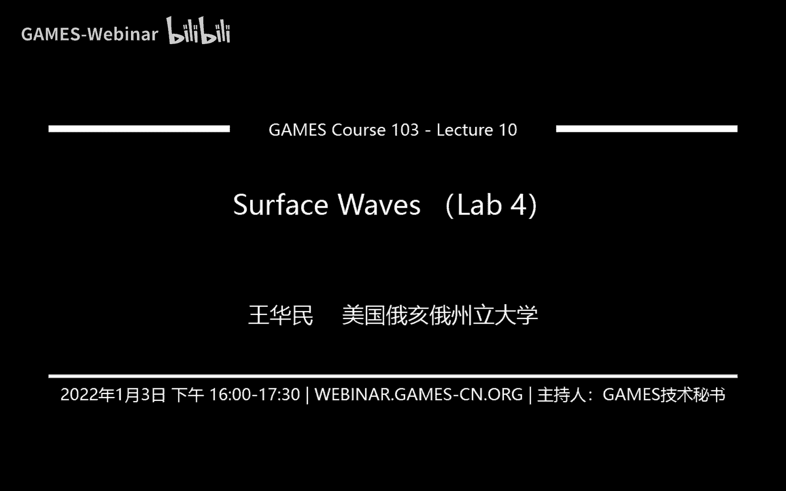
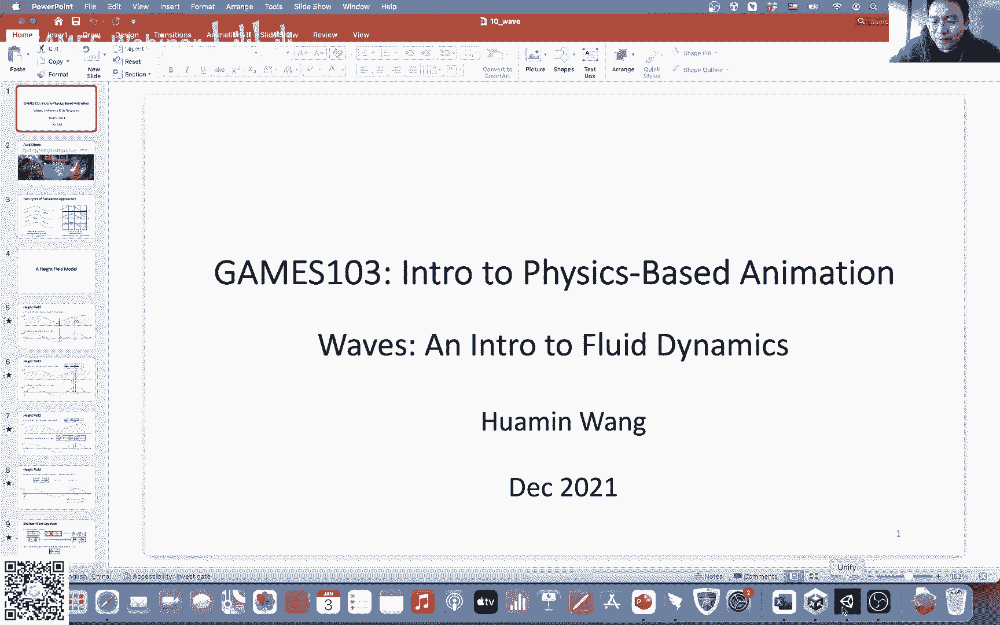
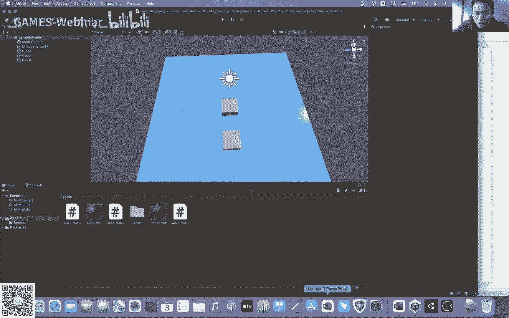

# GAMES103-基于物理的计算机动画入门 - P10：Lecture 10 Surface Waves （Lab 4） - GAMES-Webinar - BV12Q4y1S73g

听得见吗，喂喂喂，行，我今天才我才注意到，我前两天才注意到，今天实际上是放假的，不知道有多少同学今天会来啊，来的同学在的同学扣个一好吗，让我看看大概有多少人在，好吧行吧。

还可以还行吧啊反正不在的同学就回头到时候看录播吧，今天咱们嗯今天咱们算是嗯结束了之前讲那个嗯讲弹性体，讲钢铁的课程，然后今天咱们算是开了一个新的章节，就是来啊讲流体这一块啊。

然后首先给大家看一下作业是什么样子的，我我在我之前在考虑布置作业的时候，嗯其实呃纠结了蛮久的，因为为什么呢，因为unity它这个功能比较有限，呃本来有很多我们可以在比如说c加加。

或者是在别的引擎上比较容易实现的，或者甚至matlab比较容易实现的东西，你跑到unity上写起来，它效率就不是很高了啊，所以说我后来纠结了一阵子，然后最后我决定给大家布置这么一个作业呃。

首先给大家看一下效果啊，就是我们到时候会有一个水面，然后这个水面上呢会有两个方块对吧，大家看到这里有两个方块，然后呢你可以拖这个方块，然后你就可以产生波的效果啊，然后呢你仔细看的话。

它这个方块是浮动在水面上的，如果说我把这个呃挪进了，我让这个波比较靠近这个另一个方块的话，你会看到这个方块会啊会抖动起来，然后你我也可以拖另一个方块，然后产生这个水花的效果。

这个就是其实这个基本上就是咱们作业的内容啊，然后要做这个作业，我把这个作业分成了几个部分啊，啊大家可以随便玩这个玩这些方块，这个作业有几个内容呃，首先第一个呢是我们要简单的把这个场景给它设置起来，嗯。

在我们的那个代码里面，我给大家了一些比较基本的一些操作已经有了，比如说我已经把这个整个水面给它呃，重新recess过了，recess成我记得好像是128x128吧的一个网格啊。

然后呢我这个场景里面这些方块其实也有了，然后大家的任务呢是要把这个math跟我这个模拟里面，所需要更新的高度场联系在一起，这是第一步啊，然后第二步呢是呃要大家学会怎么样去求解这个高度场的更新啊。

利用我们的这个今天我们要学习的这个啊shelter wave的这个模型，去怎么样去模拟这些波波的这个传递过程，这是第二个部分啊，然后第三个部分呢是我们要写学着写怎么样去利用这些方块的运动。

怎么样去产生新的波，那为什么我们挪动这些方块产生新的波呢，主要的原因是因为我们在挪动这些方块的时候，会导致某些地方的水被排了出来，所以说我们要求解就是怎么样把这些排出来的水正确的啊模拟出来。

然后因为这些水被排出来了之后呢，它就会相应的产生的这个玻璃效果啊，然后最后我们有个附加题，最后的附加题的内容，就是怎么样把我们之前学到的钢铁模拟跟这个作业结合起来，就是去模拟把这个方块模拟成一个钢铁。

然后可以看到它在水面上浮动的效果啊，但是我自己实验就会发现这个东西其实并不是很准确，主要是因为我们自己我们这个shallow wave的模拟，这个模型里面是有一些局限性的，所以说这个是大家需要嗯。

就是需要花时间去把这个问题解决掉的啊，当然这个我们里面就暂时就不讲了嗯，需要大家自己去探索一下这个东西，有什么问题吗，关于这个作业，行对这个这个水面它实际上是一个mh，它是一个网格啊。

是一个128x128的网格，我记得好像，然后它我们我们模拟这个水面，实际上就是在修改这些match上的顶点的位置，这个我们等会儿上课的时候会具体讲那个算法，上一次作业是吗。

我们我们所有的作业其实都跟之前一样，就是你可以晚交五天，就是如果说你晚交五天以内的话，就是会有扣分，但是嗯但是你还是可以交作业，还是会有分数的，对f e m那个很卡，这个这个倒还好。

这个模拟起来还是比较有效率，这个我的电脑啊，这个我电脑是好像是去年的mac吧，去年不是最新的一代，不是用他们那个最新的芯片的，好行吧行吧，那就关于这个作业，咱们就先到这里呃。

先先先谈到这里，然后今天咱们来讲流体，然后流体这个东西呢嗯他特别有意思啊，因为他本身流体它能够呈现的形态非常多啊，我这里只是给大家举了一些比较简单的例子啊，就是拿水举例，谁举例子。

就比如说你看水滴还有溅出来的水花，水浪等等等等，它们其实呈现的形态都是非常不一样，而且我这里只是用水做例子，那流体里面其实还有烟对吧，还有各种的烟雾效果等等等等，都是非常复杂的。

所以说流体它跟我们之前所说的一些弹性体好，钢琴也好，它有个很大的不同，就是流体它模拟的方式方法也是非常多样的啊，很难说有一种通用的方法，就是各种各样的都可以模拟，都可以很有效率的模拟，应该这么说。

不是说不可以模拟，但是你可能这种方法在模拟某些情况，他就没那么有效率，所以说今天我们想专门来嗯作为一个相当于一个introduction，我们来讨论一个比较简单的一个模拟水面波的一个效果的方法。

然后呢今天呢我们会讲的比较细一点啊，不只是因为我们今天讨论的方法会用在我们的作业上，同时我们今天讨论的一些话题会延续下去，会到下周，还有下下周我们在讨论嗯，其他更通用的这种解流体模拟的方法的时候呢。

这些相关的概念它其实也会存在在我们后面的这个课程里面，所以说我们今天就稍微讲细点，把一些基本的概念呃稍微讲的细一点，我们回头会继续用到这些东西，那么模拟流体它通常有两种方法。

大家有可能以前听说过一种叫做拉格朗日的方法，一种叫做欧拉的方法，那么什么叫做拉格朗日的方法呢，呃简单的说就是我们把物理的参数，我们把物理的变量定义在随着这个物体运动而运动的，这些物质的点上面。

其实大家就可以直观的就是可以把之前我们做的弹性体啊，还有钢铁的模拟，其实都是这种所谓的拉格朗日的模拟方式，因为为什么，因为我们之前我们模拟的时候，我们是把整个物体用很多点去覆盖嘛，对不对。

那这些点它实际上是随着物体的运动而一起运动的对吧，当我们兔子发生了变形，我们的房子发生变形的时候，我们这些点是随着我们这个物体的变形而一起运动的，所以说当我们在这些点上附了各种各样的物理变量的时候。

这些物理变量也就天然地随着我们物体的形变而运动，这个就是所谓的拉格朗日方法，也就换句话说，我们是把物理定义，物理变量是定义在随物体运动而运动的一些物质的点上的，那么大家可以直观的理解呢，怎么理解呢。

就是可以把大家可以把这些点比如说当做一个物体的一个分子嘛，比如说我有个水流对吧，从左往右这样子流动，那么我可以认为每一个点都是一个小小的小的水分子，然后这些水分子呢它可能有一些物理变量。

比如说它有一定的温度啊，它有一定的速度啊等等等等，那当这些小分子在运动的时候，这些物理变量也就随着这些粒子运动而一起运动了，所以说你不需要去额外的去改变这些物理变量啊，就如果就是正常的随着运动。

它就直接被带着走了，就是这个意思，这个叫做拉格朗日方法，就是物质物物就是物理变量，它会被这些点带着一起走，那欧拉方法呢它有点特殊，他不是去划分物质的啊，它是去划分整个空间的，这个空间呢是固定的。

我把整个空间，比如说我可以划分成很多小格子对吧，那假如说有一些水，一些流体啊，从格子里面穿过，那么我在每个格子里面我都会定义一些物理的变量，比如说我在这个格子里面，我会定一些，比如说密度啊啊速度啊。

温度啊等等，那这些变量它不是定义在物质上的，它是定义在这个空间里面的，而这个空间它是固定的，那么换句话说，当我进行模拟，当我这个呃这个水流在流动的时候啊，我需要去改变这些格子里的值，因为当我流动的时候。

这些东西理论上它会被带到别的地方嘛对吧，那么带到别的地方的过程中呢，这些这些格子里面的值它也就会发生改变了，这个其实这个叫做欧拉的方法，就是我是利用一个静止不动的格子去划分我的这个空间，然后我的模拟。

我的动画是通过我修改每一个格子里面的这些物理变量值而产生的，而左边这个拉格朗日的方法呢，它把这些物理变量的附加在一些物质点上，所以说物质点运动的时候，它就会自然的把这些物理变量跟着带着一起走。

你就不需要再去更新它，这个是他俩的一个区别，一个是啊点是在运动的，而另一个呢它是一个用固定的格子去模拟的，这个大家能明白吗，这个大家以前有听有有有接触，有听说过这个这两个区别吗，可以啊。

反正这个左边这个大家左边这个方法呢大家就是可以想象，就是我们之前的钢铁啊，弹性体的模拟，它都是这种拉格朗日的方法，然后右边呢这种方法呢我们今天就会具体的讨论到用到啊。

那么给大家举一个今天我们想要学习的这么一个例子，就叫做高度场，这高度场什么意思呢，就是我利用一个高度的这么一个函数，我去模拟，我去表达一个曲面，一个平面，一个波的一个平面，一个水面，就像这样子。

我的横轴呢是x是位置不同的位置，然后我的纵轴呢就表示在不同的位置上，我的这个高度是什么啊，然后我通过更新这个高度这个函数啊，我通过我改变我这个高度函数。

我就可以产生这个随着时间这个高度变化的这么一个效果，这个是叫做一个高度差，那么在2d里面呢，我们这个高度场的这个函数它是一个一维函数，它表达的是一个二维的面。

当然这个二维的面它不是一个真正意义上的一个任意的一个二维的面，它其实是一个有局限性的，它是一个函数所能够表达的一个二维的面，对吧，换句话说我没有办法表达这种这种形状，为什么。

因为在某些地方它可能会有多个函数值，那这种情况下，我是没有办法用一个我们这个高度场的这么一个函数去表达的，所以说这种这种情况的水面波我就没有办法模拟了，那我能模拟的就是说这种比较简单的呃。

一个位置上只有一个函数值的这种啊这种水面波效果啊，那这里呢在2d上呢，我们一般来说把它叫做1。5d的一个高度，长在3d上呢，我们把它叫做2。5d的一个高度场，其实都是一个意思，就是说我这个高度场。

它描述的是一个2d空间里的一个啊一个水面的效果，但是这个水面效果它不是任意的，他是有一定的这种limitation的，那么我们有高度场之后呢，我也可以呃进一步的去定义对吧。

比如说一个我们所需要的就是一个速度嘛，对不对，因为我们之前在模拟呃弹性体也好，钢铁也好的时候，我们都需要有速度，那么同样的我们在模拟这个呃高度场的这个时候呢，我也需要有速度，那么手，那么什么是速度呢。

我可以在不同的位置上，假如说在某一个点上，我可以定义一个速度，那这个速度呢就告诉我们说我这个水流，假如说我这个我这我这个曲面下面这个面下面都是水，那这个速度就告诉我说我在这个位置上，在这个点上。

我的水是以什么样的速度去穿过这个面的，那这个速度它实际上可以是正的，也可以是负的负的，也就意味着它是往我们的这个反方向在运动的，也就是意味着它水是从右边流到左边去的，那如果是正的速度呢。

就意味着我的这个水它是从左边流到右边去的，所以说我可以利用啊，它这个正负号我可以来决定呃，速度它的这个方向，水流的这个方向，那么利用这个定义呢，我同样我也可以构造一个速度的一个函数。

它同样也是一个速度差啊，它是一个关于位置的一个函数对吧，然后呢在不同的不同的地方呢，我都会有相对应的这个速度的值，它可以是负的，比如说像这里它就是负的值，它也可以是正的值啊。

取决于取决于我们的水流是呃流向到底是从左往右还是从右往左，那么好了，我们现在有了高度场，高度场实际上就是对应着有点像我们之前做那个弹性体，刚体模拟的时候，我们有一个位置嘛对吧。

它这个高度场实际上就是描述的一个状态，然后速度呢它描述的是这个水流，这个高度场下面的这些水，它流动的一个速度，我们有了这两个东西之后呢，我们接下来需要定义分别定义他们两个的更新。

因为我们之前做钢铁弹信息的时候，我们是有了位置，有了速度之后，我们就会有相应的它们的更新函数吗，所以接下来我们也会来看一看我们怎么样去更新高度场，我们怎么样去更新速度场，我们来看这两个东西。

首先我们来看高度场的更新，高度场的更新可以描述为这么一个偏微分的一个方程，这个方程看起来有点复杂哦，但是你可以看它实际上是由两部分构成的，第一部分呢是dh dx，什么叫做dh dx。

就是高度场随时间的变化，对不对，一个函数对时间的导数，也就是什么意思，就是这个函数随时间它的变化，这个叫做dh dd，那么这个方程说我的这个高度随时间的变化，是由右边这个部分所产生的。

分别是高度乘以速度，对顶点的位置求导，那这个怎么去理解这个东西啊，我觉得可以从导数的定义去理解这个东西，假如说我这个顶点的位置，假如说我这个点的位置在x，我当前的位置是x，然后呢。

我给这个x一个很小很小的一个偏移量dx对吧，假如说我给他稍微的往右挪了那么一丁点，那么根据我们微分的定义啊，dh u也就是上面这个东西，这个分母的这个分子的这个东西，d h x u x啊。

就等于h和u在x加dt加dx的这个值减去x x h x乘以ux在x的值，这个是咱们微分的定义啊，就是当你挪动一个非常非常小的一个无限小的一个量的时候，dx一个很小的量的时候。

你这个d这个d h u就可以由这个东西去近似它，那么这两个东西分别是什么东西呢，h我们知道是高度对吧，相当于是这个面的这个高度，u是这个面上的这个水流的速度，那么换句话说，h乘以u就告诉我们什么呀。

h乘以u就告诉我们在单位时间，在某一个时刻里面，单位时间内流过这个橙色的这个面的水的量，对不对，因为速度乘以这个面的这个高度，是不是就产生了这个流速啊，不不不是不是流速是嗯，逃出去的水的数量。

对不对的速度，那么同样咱们黄颜色的这个部分呢，我的高度是h x，然后我的这个留的这个速度呢是u x，我把这两个相乘，我得到了什么，就是我得到了在单位时间内，我有多少的水从左边穿过黄颜色的这个面。

流到了右边，那么这两个稍微一减，我得到了什么，我就得到了这个这个在这个小的这个区间内，我的水量的变化是多少对吧，一边是橙颜色的呢，是我出去的水，然后右边黄颜色的东西呢是进来的水。

那我总共出去的减去进来的，我得到的是我这个水减少了多少，那么我再用这个东西去剪一剪，因为这个是加号嘛，我把我把这个东西挪到了右边，我就变成了减号了对吧，我这个东西实际上我总共得到的就是单位时间内。

我这个小格子里面，我这个小区间里面，我的这个水量总共变化了多少，我一边是出，一边是进，我就把这减一减，我得到了总共的水量有多少变化，然后我知道有多少变化之后呢，我再除以dx。

我就得到了我的这个高度在单位时间内有多少变化，这个其实就是它一个直观的你去理解这个式子的一个含义，嗯，因为这个h乘以u它其实就得到了这个面上的这个啊水量的进出，这个大家理解吗，ok行行。

那么我们我们我们现在有了第一个式子，我们知道了，说呃我这个高度场可以通过我这个第一个式子去更新，那么接下来我们看看速度差，我们应该怎么样去更新速度差，我们速度长呢更新呢由三部分构成了。

第一部分呢叫做adv呃，但是这个东西呢我想我今天先不讲，我们先留到后面的课去讲，咱们先暂时先不考虑它，但是可以给大家一个直观的概念，就是advice，什么叫做advad，意思就是当我水流在流动的时候。

我的速度也应该随着水流一起流动，因为我这里的速度是定义在固定的x上的，我这个x其实并不发生改变的，因为它x不发生改变，所以说我这个速度在下一个时刻的时候，他应该被跑到别的地方去。

它相当于就是会被被这个水流自身的流动所带着走，这个叫做adv，啊但是咱们这里就先简单一点，先忽略它，先不要考虑它，我们下节课以后会会继续讨论这个东西，然后最后这个东西呢是外部的产生的外力。

那这里咱们也简单一点，不考虑它，因为咱们在作业里面也没有这个外力，就不考虑它了啊，什么时候会产生外力呢，比如说我这个这个水水里面有艘船对吧，然后这个船可能有个螺旋桨，它这个螺旋桨会推着这个水啊。

往某个方向推推，那这就是产生了一个外力了，但是咱们的作业里面是没有这个外力的，所以说我们也忽略它，所以说我们就保留中间，最后保留中间这个东西，那中间这个东西是什么呀，我就得到了一个简化的东西。

中间这个东西是什么呢，肉是密度，p是压强啊，换句话说就是压强对位置的导数除以密度，对有同学问，有刚刚同学有个同学问说箱子在水里移动是不是外力嗯。

我们这里其实不是用外力来实现我们这个作业里的这个波波的效果的，我们在作业里面我们是利用压强来实现的，因为当水当箱子挪到不同的位置的时候，它会把其实把水排出嘛，把水推开。

那这个推开的过程我们是用压强来实现的，所以说在这个作业里面，咱们跟外力没有关系啊，等会儿我们后面会讲到就是怎么样去做这个啊，排出水的这个效果，那么我们来理解一下这个式子是怎么产生的啊。

这个式子其实跟咱们前面有点像，就是我们也可以考虑到，假如说有一个很小的区间，这个区间的左边是x，然后曲边的右边是x加上dx，假如说我这个区间非常非常小，无限的小，那么我们这个dp呢就等于橙色的压强对吧。

在右边这个位置的压强减去左边这个位置的压强，那什么意思呢，你可以这么想，就假如说我这里是一个里面有很多水，有有有水，有个小水，有个小水柱，对不对，那么这个小水柱左边有压强，右边有压强。

那么这个小水柱应该怎么运动啊，它是不是应该根据它左右的这个压强的差来运动，对不对，就像一个东西，它左边受力，右边也受力，那么它怎么运动，它就会根据它左右受力的差来运动，如果说右边的力比较大。

那它就应该从右往左运动，那如果说左边的力比较大，它就应该从左往右运动，所以说我这里是减一减，在前面加个负号，因为当你右边的力比较大的时候，我的p我的橙颜色的力比较大的时候，那么我整个东西是正的。

那整个东西是正的呢，前面加个负号，也就意味着我的这个速度会变负对吧，那变负也就意味着是从右往左流动，那反而言之，如果说我黄颜色的东西大，黄颜色的压强大，那么我的这个压强会把这个这个速度从左往右推。

那么会导致这个东西是负的，而这个负的呢前面再加个负号就变正了，也就是意味着我的速度会从左往右，所以说这个公式其实就是很简单的一个意思，就是说我在某一个很小很小的范围内。

我这个速度的变化实际上是由我左右压强的差来产生的啊，然后为什么要除以这个密度呢，是因为我这个产生的这个速度其实跟会跟密度相关嘛，我这个密度越大，它也就越容易推，我密度越小就越难推嘛。

其实就是这么一个意思，大家明白吗，这里，好吧，然后呢嗯可以看到这个如果说这个dp是正的，我的速度就会减弱而变小，要变负，然后如果dp是负的呢，我的这个速度就会变大增大，那么好了，我现在呃就有两个公式了。

对不对，我们刚才讨论了半天，我们最后就得到了这么两个公式，上面这个公式呢是对我的高度随时间的改变进行更新，我们刚才讲了吗，d h d t，然后下面这个公式呢是速度呃，随着时间而更新的这么一个公式。

我就有两个公式，那我这两个公式它比较呃比较复杂对吧，大家可以看到我这里有两个变量，两个两个厂，一个是高度场，一个速度场，它比较复杂，那么有没有办法可以把我这两个公式进一步的简化呢，搞得更简单一点呢。

那么首先我们对上面这个公式展开一下，我可以展开成两个部分啊，因为上面因为上面这个公式它是d h d u嘛，所以说我可以把它变成u乘以d hd加上h乘以du dx，我就分别对h跟u求导。

我根据我们之前嗯微积分里面学过的链式法则，我可以把它拆成两部分，然后接下来呢我把这个部分给它忽略掉，我把这个部分给它忽略掉，为什么可以忽略掉呢，我实际上就是假设啊，在某一个小很小的范围内。

我的高度跟我的位置的基本上是不发生改变的，在一个很小的范围内，我这个高度的变化是非常小的，我实际上是做了这么一个假设，这个其实就是我们公式名字的由来，叫做shallow wave。

为什么叫shallow wave，是因为我假设我的这个水面的，我这个平面上的这个波它都非常非常的小，它都是很小很小的水面波，那么因为很小很小的水面波，我可以认为随着我位置的变化。

我这个dh dx这个量很小，所以说我就把它给忽略掉，我就得到了一个简化版的一个公式，然后完了之后呢，我对第一个公式呢，我对，他再求一次dt，我再求一次dt呢，我就得到了h对时间的二阶导。

加上h乘以du dx dt啊，当然我这里其实还忽略掉了另一项就是dh dt，就du dx乘以d h d t我这个也给他忽略掉了，啊就是就是这么一个式子，我我得到了这个式子，我这里其实还呃还跳了一步。

就是还有一个dh dt乘以du dx，但这个我也我们也给它忽略掉，我就我就得到了这么一个简化的一个模式，然后接下来我对下面这个公式呢，我对它对x求导，我对x求导读到了什么。

我得到了du对dx dt求二阶导等于负的一除以肉乘以dp，对x求二阶导，我得到了这两，那得到这两个公式，我就会发现什么呀，我发现这里有这么一个东西，然后这里也有这么一个东西对吧，那我把他们两个合并起来。

我就可以得到了一个简化版的公式，我最终得到的就是dh对dt的二阶导，等于h除以肉乘以dp对dx的二阶导，然后这个就是我们最终的方程叫做下落位方程，那这个为什么我们要搞这么一大堆这个倒来倒求导导。

来导数倒来倒去呢，最根本的原因呢是我们可以把这个u啊，把速度这个速度长给它干掉，我干掉完了之后呢，我就不要去关心说我这个速度场是什么样子，我只需要有一个高度场，我就可以进行我的模拟了。

这是一个最大的一个好处，就是我可以把我只保留一个速度哦，我只保留一个高度炒这么一个唯一的一个变量啊，我可以把速度这个东西给它干掉，那么好，我们讨论了半天，我们讨论了这么这么多这个微分的这些方程啊。

我们最终得到了这么一个而微分方程呃，但是我们还没有办法拿它来模拟，对不对，因为我们这个模拟引擎是没有办法直接去处理这些微分方程的，我们所要做的呢就是去对它进行求解，对它进行离散化，然后对它进行求解。

那么怎么离散化呢，因为咱们的高度场是什么，我们的高度场是一个关于位置的函数嘛，那么我们的离散化就很简单，我们就把这个x轴我把它分成很多很多的小区间，每一个区间呢都是一个固定的宽度对吧。

我们叫做delta x一个宽度，一个一个宽度，然后呢对应这个区间呢我都有一个高度的值来描述我在这个位置上，我这个波的这个高度是多少，一个比较直观的理解呢，就是说你可以把这个东西想象成很多很多个小格子嘛。

然后呢每一个格子上呢我都会有一个一个水柱啊，这个水柱的高度呢就是我的hi，然后我们的模拟过程呢实际上就去更新这些水柱的高度对吧，我们如果说这里的水比较多，我就把高度搞搞大一点，如果水比较少。

我就把这个高度搞小一点啊，然后通过模拟这个高度的这个水柱的这些高度的变化，我就可以产生模拟的效果，这个就是我们把一个连续的高度函数转化成我们可以进行模拟的啊，一个方式就是把它转化成一个水柱，那么好。

我们现在有高度了，我们现在有一个离散化的这么一个高度场了，就是变成一大堆水柱了，那么我们接下来我们要讨论的是什么呢，是讨论我们前面的这些微分方程的所对应的微分算子，对不对。

我们怎么样把这些微分算子跟我们的这些高度联系在一起，首先我们来考虑的是第一个东西，就是跟时间的导数高度，跟时间的导数，我们首先想我们在模拟的时候，实际上是用一个固定的时间不长做模拟的，对不对。

我的delta t是我的时间不长，然后我当前的时间比如说是t0 ，那么我在前面一个状态，我的时间是t0 减掉的t我的下一个状态呢是t0 加表的题对吧，我之前啊我们之前做各种各样的模拟。

我们都是采用这样的一个模式，那么假如说我保存了在不同的时间上的不同的这个高度值，同一个格子啊，我对于同一个格子我都保存了它的不同的高度值的话，我就可以对我的时间求导了。

那这个值呢是前一个时刻我的这个格子，我的这个水柱的高度值，这个呢是当前时刻我的高度值，然后这个时刻呢是我下一个时刻就还未发生的这个时刻，我的水柱的高度值我分别是多少，我都假如说我都有这些值的话。

都有这些不同的不同时刻上的我高度值的话，我就可以对它求导，那么怎么求导呢，我们接下来要引入一个概念，叫做final difference，所谓的final difference呢。

就是我用一个固定的一个格子，我用一个固定的区间，我对一个函数的导数来进行近似，比如说我在我的这个时间轴上，我有两个时间，t0 跟t0 加dt t对吧，delta t是一个。

假如说它是一个很小很小的一个值，一个很小很小的是个时间的一个呃小小的时间量，那么在这两个时间我都有相对应的函数值，分别是f0 跟f0 加到了t对吧，那么根据泰勒展开。

我知道f t0 加德尔塔t等于f0 加到达t乘以df t0 ，dt加上后面的一堆东西，所以说我可以做一个近似，我可以利用这两个东西的差除以dt来做一个近似啊。

这个近似的结果呢就是我这个函数值在t0 时刻的一阶导数啊，它约等于前面这个函数值减去后面这个函数值除以dt t，这个就叫做forward difference。

它这个difference的意思就是求差对吧，我求了这两个点的两个点之间的函数差，然后我利用这个函数差我来近似他的这个一阶导数，那为什么是forward，因为我是用前面的这个时刻。

我是用前面的这个函数值来求导的，那有forward自然也就有backward对吧，我可以不用前面的时刻的啊函数值，我用后面这个时刻的函数也是，那么根据泰勒展开。

我们同样知道后面这个函数值等于当前的函数值减去dt乘以一阶导数，加上一堆乱七八糟的东西，那我的这个近似方程呢就变成了一阶导数，约等于当前的函数值减去前面这个时刻的函数值除以二的题。

然后这也是一种啊求近似一阶导数的方式，那这两种近似一阶导数的方式都是一阶的，为什么叫一阶呢，因为我我能够产生的我能够产生的误差是什么，我能够产生的是误差，是这个东西和这个东西对吧。

这两个误差呢都是二阶函数，所以说我们的误差呢是二阶的，也就意味着我们的精确度呢是一阶的，这个就叫做final difference，我们回头我们在我们下节课也会继续用到这个概念，我们会经常用到这个概念。

那么好，然后大家就想怎么样能够把它搞进去更精确一点，其实这个东西跟我们之前说的那个呃一阶的就是forward的，叫什么，forward integration。

forward online integration，很像backward，oled integration很小，那么怎么样把它搞得进清晰精确一点呢，就是我同时用到正的跟负的，我同时用到前面的跟后面的。

我就可以给它搞得更精确一点，那么怎么做呢，我知道我的这个前面的这个函数值等于当前的函数值，加上德尔塔t乘一阶导数加上一个二阶的数值误差嘛对吧。

然后后面的这个函数值等于当前的函数值减去delta乘以一阶函数，加上一个二阶的一个这么一个东西，然后如果说我把这两个东西剪一剪，会发生什么，我会发现这个东西会抵消掉，然后这个东西它也会抵消掉。

二阶的部分它也会抵消掉，因为二阶的东西是一模一样的，所以我就得到了这么一个方程，我怎么样去近似t0 时刻的二阶导数啊，我把前面的这个函数值减去后面的函数值啊，前面的减后面，然后再除以两倍的deltt。

因为我在前面减后面的时候，我整个跨度就不是dt t了，是二dt t对吧，所以我就除以2。22倍的的题，然后这个东西呢就给了我一阶函数的近似了，然后就这个就叫做central defense，它是二阶的。

这个是我们想要我们所要用到的就是二阶的这么一个方式，嗯有了这个central dience difference这个方法之后，呃，我就我们就可以搞各种各样的花样对吧，比如说呃在这里我们做的是一阶导数。

我们刚才算的是一阶导数，那么同样的我们可以把这个东西扩展到二阶导数上去，对吧，比如说我想要知道当前这个时间的h的二阶导数，我该怎么做。

这个因为我们之前的那个shallow wave的公式里面用到这个东西了，所以说我们想要知道二阶导数怎么说，那么怎么得到二阶导数呢，首先我可以利用前面减后面的方式。

我首先把中间这两个位置的一阶导数给它算出来，就是正-0。5的这个位置给它算出来，那么正0。5的这个位置啊，它的一阶导数等于前面的函数值减去中间的函数值除以dt，然后-0。

5的这个函数值的一阶导数的位置呢，一阶导数等于，中间的函数值减去后面的函数值，出一道的题，啊然后这两个正-0。5的这个一阶导数的函数值，它是通过central difference得到的。

因为我们最终给出的是中间的一阶导数，然后有了这两个中间的一阶导数呢，我再做一次，我就得到了二阶导数对吧，那么这个上面这个东西呢是分子的部分呢，是两个一阶导数相减，然后除以掉到t。

然后这个时候我中间的这个时刻刚好是在正-0。5的中间嘛，所以说我也是利用了centre difference，我就刚好完美的得到了我中间的这个位置的二阶导数了，那么我们把前面这个式子分别的带进去啊。

把这个东西带进去，然后我最终得到的是啊t加dt t的函数值，加上t t0 减掉的函数值，减去两倍的t0 的函数值除以得到t的平方是二阶导数，然后大家如果看一下这个式子的话。

其实你会发现其实本质上就是什么，本质上就是对于中间这个点而言，对于中间这个函数值而言，其实就是他的邻居减去了两倍的他自己对吧，就是他的邻居减他自己，它呢是-2，有个-2的系数，然后它呢是有一的系数。

一的系数分别去跟它相减，然后这个东西呢也有一个名字叫做拉普拉斯，来plash，顾名思义呢，其实呃也不是说顾名思义吧，就是直观上理解你就可以理解成我每个人我的邻居对吧，我的邻居加在一起。

然后减去我自己其实就是做了这么一件事情，那么这个就是高度关于时间的函数，对这个其实就是一个一-21，其实就是一个一维的一个拉普拉斯算子啊，我们有了二阶导数，那么同样我有时我有高度对时间的导数呢。

我也可以利用同样的方式呢，我对压强也求二阶导数，因为咱们之前我们的shadow wave里面也有压强跟位置的二阶导数嘛，我也需要有这么一个东西，嘛我也需要计算这么一个东西，那怎么计算呢，我就首先分别。

假如说我想要知道这个这个位置上的这个压强的二阶导数啊，那我首先，在这个位置跟这个位置，也就是这两个中间位置，我分别利用我们之前所说的这个啊删除difference的方法，我把这个正-0。

5的位置的这个压强的一阶导数给它算出来，完了之后呢，我利用我们刚才的方式，同样的方式我这里就不重复了啊，我就可以把我这个压强的二阶导数给它算出来，我得到的就是啊这么一个公式。

简单的说就是两边的压强加起来减去两倍的自己除以dt t dt x的平方，然后有同学问，就是说如果是二维的空间上，是不是就去减去四倍的自己啊，对如果是二维的情况下，就是减去四倍的自己。

因为每一个每一个点都有四个邻居，所以说就减去四倍的自己，但是咱们这里就先不讨论啊，回头给大家看一下四倍的自己的这么一个情况，那么好我们刚才给大家举了central defense的这么一个方式了。

我们接下来就可以把它套到这么一个我们前面的这个公式上了对吧，那么我们前面有这两个呃，离散化了以后的这些二阶导数嘛，那么我把它合在一起，我把这个左边这个东西用这个式子给它替换掉。

右边这个东西用右边这个式子给它替换掉，我最终得到的就是这么一个公式，然后呢我给他再稍微整理整理对吧，因为这因为这个东西呃不是很直观嘛，我给他整理一下，我最终得到的就是这么一个式子。

那这么一个式子是啥意思啊，这么一个式子我什么目的啊，我最终的目的实际上就是要去我更新我的高度啊，那这个东西实际上是我想要得到的下一个时间的高度，对不对，对于这个i这个水柱而言。

这个东西是我下一个时刻的我这个水柱的高度，那么我实际上就可以把右边的这么一个式子给它计算出来，我计算出来完了之后呢，我把它换到左边去，我就可以得到我下一个时间的水柱的高度了，这就是我的这么一个更新函数。

实际上就是我们利用了前面的一大堆啊，这个central的公式我得到了这么一个，最终我得到了一个关于我每一个水柱的这么一个更新函数，这个是我绕了这么一大圈儿，我最终想要做的这么一件事情啊。

有了这个式子之后，我就可以对我这个每一个水柱我都进行一个模拟更新了，那么好这个式子看起来挺不错的啊啊然后似乎也没有那么复杂，呃但是呢我们还有一个小问题需要解决，这个小问题呢其实不只是在这里。

其实在我们整个贯穿整个流体模拟都会出现的一个什么问题，就是体积的问题，什么意思呢，就是我们很多时候在模拟的时候，你会发现这个水它会越来越多或者越来越少，这个就很奇怪了，对不对。

因为在我们在正常的这个真实的世界里面，你不可能说同样的水在没有变化，没有各种各样外在的情况的影响下，它的水会突然变多或者突然变小，但是如果说我们不考虑一些这些特殊的，就不考虑这些呃一些算法的话。

是有可能出现这种变化的，这个就叫做volume preserving，就是我们怎么样能够保证我的一个模拟不导致水，它莫名其妙的变多或者变少，那么换句话说呢，我是想要我这个体积。

我这里面的水的体积是永远都是一个常数啊，在不增加或者减少额外增加减少水的前提下，我这个里面的水，我这个模拟环境里面的水，它始终是应该是一个常数，对不对，那么假设我总共的这个水数量是v。

那么什么是总共的水啊，我把所有的高度加起来，我把所有的高度加起来，我应该是一个常数，那么在上一个时刻，前一个时刻，我的所有的高度加起来是v，我当前时刻我所有的高度加起来也是必对吧。

假设我前面之前我都是满足我这个体积变化啊，体积永远是v的这么一个前提，但是如果说你利用这个公式去进行模拟，会发生什么呢，我们来看一下啊，假如说我用利用前面咱们这个公式进行模拟。

我分别对这个公式的左边跟右边进行求和，啊我这个是得到了，模拟之后的新的时刻的总的体积的速度等于两倍的，当前时刻的体积减去前一个时刻的体积，再加上后面这个一大坨东西，那么前面这个部分实际上就是v。

因为这个部分是v，是两倍的v，然后这个东西也是v，所以说就是两倍的v减去v，那么得到的就是总的体积，然后再加上啊右边这一块东西，那问题就来了，什么问题啊，我没有办法保证这个东西一定是零对吧。

那如果说我没有办法保证这个东西一定是零，也就意味着当我用这个公式去进行模拟的时候，我的体积有可能会变大或者变小，这个具体是变大还是变小就不好说了，取决于这个东西到底是正的还是负的。

但是我这个体积是会随着时间会随着模拟的变化而波动的，那我显然不希望产生这样的问题吗，那怎么样解决呢，有几种方式啊，第一种方式呢是把这个公式修改一下，怎么样修改呢，就是不要用这个hi来作为这个系数。

而是呢把这个东西拆成两个部分，把我们后面这个东西拆成两个部分，分别是pi减一减p i和pi加一减p啊，首先把它拆成两部分，然后拆成两个部分之后，我把这个hi也用这两个东西来替代表，之前呢我的系数是hi。

通过修改呢我变成了hi减一加hi除以二，然后后面的东西呢变成了hi加hr加1÷2，变成了这两个部分，那么如果你对它这个东西再求和，你就会发现我这次呢我可以保证这个东西一定是零的了。

为什么我可以保证这个东西一定为零，是因为你可以做这么一个直观的理解，就是说假如说我这里有两个水柱对吧，假如说我这里有两个水柱，那么这个东西它实际上左边会得到的更新呢是它减它是右边减左边。

而右边得到的根系呢是左边减右边对吧，它分别是左边减右边跟右边减左边来进行更新的，那么我利用这个东西我可以保证什么，我可以保证它们的更新的量都是一模一样的，因为当左边这个东西被右边减左边进行更新的时候。

它乘上的是同一个系数，而右边减左边的时候呢，而左边减右边的时候呢，它也呈现的是同一个系数，直观上你其实可以这么理解啊，就是我这里面的这个东西啊，实际上我换个颜色，我这个东西实际上你可以直观地理解成。

从边上的一个柱子流入的水的量，而后面这个东西呢是从内侧的一个柱子流入的水的量对吧，因为我每个柱子我都有左右两个邻居嘛，那么它左右两个邻居它都会有水分别流入到当前的这个柱子栏对吧，那么我利用这个公式。

我可以保证说我流入的量跟我边上那个柱子流出的量它是等价的，比如说我左边流掉了一个单位的水，那么我右边也会进一个单位的水，那这样子的话我就可以保证我整个体积是守恒的了。

因为我左边流入的流出的量跟右边流入的量它是等价的，所以说这个改动它其实最终的目的是为了保证说我呃每一个格子，它流出的跟每一个格子流入相邻的格子流入的它是等价的，它其实就是做了这么一个改动。

嗯大家如果说想进一步理解的话，可以看一下这篇论文，这篇论文基本上就是把我前面说的这些呃这一大堆话嗯给描述了一下，是还是蛮早的一篇paper吧。

90年的一篇paper叫做rapid stable for dynamics for computer graphics啊，就是啊也是一篇比较经典的关于shadow wave的pap。

那么好我们刚才讲了一种能够保体积的方法，那么还有一种包体积的方法就比较简单了，这个也是咱们作业里面我想让大家尝试的一种方法，就就比较简单了，怎么简单呢，就是我直接简单的粗暴的把这个hi认为是一个常数。

我就直接用一个常数值给它替代掉了，因为如果说我把这个整个用一个常数替代掉呢，你会发现我在对它进行求和的时候呢，它右边呢就变成了这么一个东西，就是压强差的这么一个河了。

那因为压强差左边压强差跟右边的压强差距永远都是左边跟右边，右边减左边嘛，所以说你对它整个进行求和，它最终就会变成零，然后这个就可以保证我整个模拟状态，它的体积是呃不发生改变的。

这个体积是维持在一个常数上，那么好，我们接下来看压强是什么对吧，我们刚才讲了半天压强压强压强，那么压强到底是个什么东西啊，那么压强如果说考虑重力的话，压强等于密度乘以重力加速度乘以高度。

这个是咱们学而物理里面所学到的水的这个压强，密度乘以重力加速度乘以高度，如果说我把这个东西带到我们刚才的这个式子里面，这个模拟更新的式子里面，我们就可以得到啊，这么一个式子。

相当于就是把之前的这些p接下来我全都变成高度的值了啊，然后这个部分呢前面这个系数呢就变成了这么一个东西，那么简单一点，因为这个东西是个常数嘛，我就索性简单一点，我就把它用一个阿尔法来替代了。

啊因为不管什么样的系数，它最后乘出来，最后始终都只有一个值嘛，那我最后就用这个阿尔法去给它替代掉，就变简单了，这是我对呃我的这个模拟公式的又一个简化，好了我们接下来有了这么一个简单的一个模拟公式。

我嗯接下来再怎么给他搞呢，我们在模拟刚体，在模拟弹性的时候，我们有一个单品的一个概念对吧，有个阻尼的概念，流体它同样也有阻尼的概念，只不过流体的阻尼不叫单品，叫viscosity，叫粘滞。

因为我们在真实世界里面，流体它不可能无限制地流下去嘛，它会有一个想让他停下来的趋势，这个趋势跟damping是一样的对吧，那么这里呢怎么样去把这个流动的这个趋势给它停下来呢，我们会发现这个东西啊。

它其实跟动量很像，因为它讲的是当前跟之前的时刻的高度的变化，换句话说它描述的是是随着时间我高度是怎么发，生变化的，所以说它跟我们的动量其实是有很大关系的，所以说这里呢我只要在前面乘一个系数就可以了。

成一个贝塔系数，这个叫做我们这里就把它叫做粘滞系数，然后成了这个粘滞系数呢，我就可以对我整个动画进行一个单品，产生一个单品的效果了，然后大家可以在作业里面也可以尝试一下，通过修改这个系数的大小。

你可以产生不同的这个组组，那个呃年制的效果，如果说是一，如果这个贝塔只是一，那么就没有没有任何粘制，如果这个贝塔是零，那么这个粘滞系数就无限的强，你会发现这个就很不像流体啊，反正大家可以啊尝试一下。

那么好，我们现在似乎把所有的问题都解决了吗，嗯但是还有一个问题，还有几个问题我们没有讨论的，我们还得继续往下讨论哦，什么问题呢，首先我们还没讨论到边界的问题，因为我们整个物体，整个水面它不可能是无限的。

对不对，我们在模拟的时候，它肯定要设定一定的范围，那么它势必就是会有一个边界，我怎么样去处理这个边界呢，啊这是这个算法，那么怎么处理边界呢，有两种处理边界的方式，我们这种处理边界的方式。

我们之后在其他的模拟流体的情况也会碰到啊，那么第一种方式叫做delicate boundary，所谓的ditially的帮助，意思就是说在这个边界外，我假设我的高度都是一个常数，都是某一个常数。

比如说我假设这个地方是我的边界啊，左边的部分边界左边的部分是我正常模拟的区间，正常模拟的的区域，然后我这个边界右边的部分呢是呃这个边界外就是没有定义的。

或者是我可以认为是啊某一个啊某某某一个某一个什么空气墙，你可以这么认为，hi我在这个范围外呢，我假设我这个高度永远都是一个常数大写的hr，那么在这种情况下，如果说我们原来这个式子是啊这样的对吧。

如果大家记得，如果记得这个东西的话，我们之前是呃左边的邻居，这呃加上右边的邻居减去两倍的自己嘛，那么这里就变成了左边的邻居减去自己，加上右边的邻居减去自己对吧。

那么这个邻居右边的邻居呢是大写的h i hi plus one，所以说我就用这个东西替代掉，就变成了这么一个式子，这种边界一般来说是用来模拟开放的一个水面的。

就比如说我现在想要模拟一个很大很大很大的一个海平面海面，然后呢我没有办法去描述这么大一个面嘛，我只能用一个很小的一个相对比较小的一个啊一个范围我来模拟，那么在这个范围外面，我就假设是一个静止的一个海面。

那么这个静止的海面，我假设它的高度就是一个常数，这个就叫做date的bound，这是一种边界条件，然后另一种边界条件呢叫做norman帮主newman帮jy呢。

它的本意呢是说我不去描述边界外的这个高度的值，绝对值，我描述的呢是边界上的一阶导数，什么意思呢，比如说我认为在这个边界上，它的一阶导数是零，换句话说，我认为在这个边界上左右的水面的这个高度是一模一样的。

永远都是维持一模一样的高度的，那么如果说我要维持一模一样的高度，那么也就意味着我hi j跟hi永远都是一模一样的，对不对，因为他俩永远都是一模一样的，那么也就意味着他们就被彻底的永远的抵消掉了。

那么换句话说我要进行模拟更新的时候，我只需要考虑到一侧的邻居就够了，我只需要计计计算这个到hi到一到hi的水流就够了，我不需要考虑啊，从这一侧流入的水，因为这侧是没有任何水流的。

就是嗯就相当于是你可以认为它不是一个空气墙了，它变成一个实体的墙，它会阻碍水流穿过这个实体墙，也就意味着没有水能够啊从这两个柱子之间进行流动，那么因此这是我们帮助，一般来说我们主要是用来模拟强的对吧。

如果说比如说我有个池塘，我想模拟一个小的水池水池，那么这个水池的边界啊，我就可以用诺曼帮主义condition啊来进行描述，那么怎么去实现这个代码呢，嗯我可以这么实现对吧，我可以这么实现。

首先啊我得到了一个新的高度值，我的新的高度值等于hi之前的高度加上beta乘以啊，hi前老的hr，这个老的hr就是上一个时刻的hr，然后呢接下来呢我进一步的对这个新的高度值进行嗯，咱们流体的更新嘛。

但是呢这个过程中呢，我需要把我的边界条件给它加入进去，边界条件呢就是说如果说i减一存在的话，如果这个存在的话，我进行流体的交换，同样如果a加一存在的话，我进行流体的交换。

否则的话呢我就忽略了这个水流的跟某一侧邻居的进行交换了，这个就可以实现我这个诺曼boundary condition，这个就是一个比较简单的实现方式，其实顾名思，其实大家简单的理解就是说。

农民帮助于condition的意思就是我不让我当前的这个高度啊，我不让我这个水柱跟某某一个邻居进行交换，那么如果说它未定义，比如说我这个我定义了一个2d的一个用一个有一个数组来定义。

那如果说我这个访问的时候我越界了对吧，我访问越界了，我就认为这个邻居是在边界外的，那么我自然也就把这个东西给关掉了，那如果说他没有越界，我就进行过相对应的更新，这个是我的一个简单的一个目的。

一个一个简单的一个概念，然后下面的部分呢是啊，就是相当于做一些简单的housekeeping，就是我把这个呃hi当前的高度值付给上一帧的高度值，老的高度值，然后我把这个更新过的高度值付给了当前的高度值。

我就完成了一个更新，好吧，然后有同学问模拟水面附着在球面上，那还有边界吗，这个什么叫做模拟的水面附着在球面上，你的意思是就是这个水面下面还有一个球面吗，还是什么意思啊，这个不太理解。

然后我们接下来看就是我们前面是1。5d的情况，好像地球一样的什么嗯，如果说就如果说你这个水它是完整的覆盖整个球面的话，你是不需要考虑边界的，但是如果说你想要做一个类似地球那样的效果。

就是它会有比如说它会有暗和暗吗，那会稍微复杂一点，因为如果说你要模拟那种情况的话，你需要考虑到在那个边界上，它其实是没有水覆盖的，它实际上是由一个底部所构成的，这种情况它其实并不是边界了。

它是它是额外又需要额外处理的啊，但是我有点有点不太记得他这个处理方式是怎么样的，但是它实际上是会有一些额外处理方式的，你需要你需要特殊处理一下，特需要注意一下，会有点不一样。

因为我们这里的边界实际上是假设，这个边界是一个无限高的这么一个边界，它是水是永远不可能过去的，但是是但是你说的那种是有点像沙滩那种那种边界，它会不一样，然后扩展到2。5d上，也就是扩展到3d上啊。

其实是情况是基本上是一样的啊，只不过我们就不是一个一维的数组，不是用一个一维数组去描述这个高度长了，我们用的是一个二维数组，那二维数组呢我就会有两个index对吧，有i跟j那么同样的呢我会有四个邻居啊。

分别是左右前后的四个邻居，那么我左右前后四个邻居我都都需要进行越界的判断，然后利用这个越界判断，越界判断呢我可以施加我相对应的诺曼帮助，condition。

这个就是把一个比较简单的一个shallow wave模拟的一个框架，是我们这个作业里面啊需要用到的，啊然后这在这里大家有没有什么问题，没问题的话，我们就接下来继续讲，继续讲这个company这个问题啊。

什么叫company caplin的意思呢，就是说当我这个水里面有其他东西的时候，我怎么样处理这个水跟其他物体之间的一个交流对吧，比如说我现在里面有一个有个小方块儿。

我怎么样模拟这个水跟这个小方块之间的这些相互关系对吧，然后这个coupling它其实对于流体而言，它有很多研究的东西啊，它不只是说钢铁，它可以是气泡，比如说水跟空气它也可以有c，然后水跟弹性体。

水跟布之间都可以有company，就是各种各样的卡，然后company呢有有一个有个概念叫做土味卡，什么叫做土味cy，就是说它是这种cy，它是双向的，什么意思，就是我的水流。

我的水会对我这个缸体产生影响，那我们所知的就叫做福利嘛，对不对，我这个东西它会浮在这个水面上，这个就是一个方向的一项的差评，然后另一个方向的company呢是我这个缸体呢会对水流产生影响。

因为当我这个钢铁在这个水里面运动的时候，它会把水给排出去，从它里面的地方排出去，所以说这就是我们想要研究的问题，就是怎么样啊，我们今天所要讨论的问题就是怎么样研究，把水从钢铁所占的这个空间给排出去。

那通过把这个水排出去呢，我就可以产生我们作业里面这个水波水浪的效果，然后福利这个东西呢我们就不讲了啊，我们通过作业里面去，大家会体会一下，就是首先第一个就是你需要知道怎么样进行钢铁模拟。

其次你需要知道怎么样利用我们这个排出去的水，把它转化成福利，这个其实就跟阿基米的定律很像啊，我们后面会有一个小叶来给大家讨论一下，但是我们的关键问题就是怎么样把水从这个空间里面给它排出去。

假如说我知道我这个格子占据了啊这么多空间啊，这个灰颜色的部分是我的这个小方块，我所占用的空间，我想我想要把这个水从这些占用的空间里面给它排出去，排到我这个外面，那么我应该怎么做呢，我怎么排出去呢。

一个简单的想法，一个比较简单粗暴的想法，就说我直接把这个呃格子里的水删掉行不行，那肯定不行，对不对，为什么，因为我如果把这个水删掉了，那我这个总的水不就少了吗，那肯定不合理呀，那不把它删掉。

那我还有一种方式，就是我把它删掉之后，我给它加到周围，邻居的格子上去，这是一个简单的方式，但是呢如果说我这个格子占的空间很大，那么你很你还是很难决定说，我最终我的这个边界上应该加到哪些格子上去。

所以说我们就换了一个思路，怎么怎么来解决这个问题呢，我可以利用我们排开水的这种啊播的这个模拟的效果，我可以来进行一个呃虚拟的一个高度，因为我们之前我们进行这个水流的模拟，我们是利用高度高度差来决定的嘛。

对不对，我们有高度差，然后我们利用这个高度差，我们把这个水从高的地方排到了低的地方，那么我们这里的思路就是什么，我们这里思路就是假如说我有一个虚拟的高度，假如说我这个每一个这个灰颜色的这个上面。

我给它加一个虚拟的高度，不是真的，水啊，我是假设有个虚拟的高度，分别是虚拟的vi跟虚拟的v加一，那么如果说有了这个虚拟的高度之后呢，我进行我正常的模拟，我把这个水排出去，如果说我能达到这个目的。

那么我就可以完成我这个排出，把这个水排出去的这个嗯这个操作了，那么换句话说，我想要知道的就是什么样的这个虚拟的高度，能够满足把定量的水排出去的这个目的，那么首先我假设我想要得到的新的高度是这个东西。

这个东西是什么呢，是当前的高度减去ei，ei呢就是这个高度差啊，然后这个h i real new呢，你可以认为这个东西呢是我想要得到的高度，叫real new，我把它叫做real ne，就是我理想中。

我理想中的这个高度应该是这么高，那么我就得到两个公式，那么第一个公式呢是我这一个左边这一个格子啊，我想要得到的理想高度是这个，那么理想的高度怎么得到呢，是通过我这个更新公式得到的对吧。

因为我们之前有这么一个模拟的更新公式嘛，我把这个公式带进去，那唯一的差别跟之前唯一的差别是什么，唯一的差别是我这里假设我这两个格子都分别有一个虚拟的高度，然后这个分别的虚拟高度分别是vi加一。

就是说hi我假设这个格子我假设它的高度是hi加一，加上vi加一，然后当前这个格子的高度呢，我假设它是vi加上hi，换句话说呢，我是在原来的高度上，我给他额外的拔高了一点，我给他额外的拔高了这么多。

然后呢我想利用这个额外拔高的高度呢，我可以最终产生我想要的高度，那么我把这个公式稍微整理一下，我得到了什么，我得到了新的hi高度，也就是正常咱们做呃shadow wave模拟的新的高度。

加上阿尔法乘以vi加1-2 v，这是第一个公式，是关于i这个位置的高度变化的公式，然后右边那个是关于i加一这个格子上的高度，它呢等于啊把一堆公式带进去，把之前那个公式带进去啊。

然后呢我假设hi跟hi加一都分别被拔高了这么多，所产生的这么一个更新，那么我们再整理整理以后，我们就会发现这个东西等于hi加一六加上阿尔法乘以啊，vi减去两倍的vi加一。

那如果说我们把这两个公式分别进行一些变化，我们把它调整一下呢，我最终得到的呢就是右边这个东西呢，我把它叫做一个边界条件，叫做bi bi加一对吧，就是分别是变成了这么两个公式。

那么这两个公式就形成了一个关于v的一个方程组了，我这里有两个变量，因为我这里有两个未知的高度嘛，虚拟高度吗啊，然后分别是关于vi跟vi加一的这么两个公式，然后呢是这么一个方程组啊。

然后我就可以解这个方程组，我最终把它解出来，那但是呢这里有一个小的挑战，小小的挑战，如果说我们在写这个代码的时候，会有一个小小的挑战，这个小小的挑战是什么。

就是我这个方程组它其实是会随着时间的变化而变化的，因为我这个格子啊，我这个小方块儿啊，它会发生位置的变化，对不对，我的用户，我的这个玩家我可以拖动这个小格子嘛，就是左边右边随便拖嘛。

那我在这个拖动的过程中，我其实我需要解的这些变量也会发生变化，也会有改变，那么所以为了解决这个问题呢，我可以这么假设，我就假设说我这个v i啊跟v i加一啊，它每一个方程啊。

它其实都是用一个拉普拉斯的这么一个算子，就是我们之前说的这个跟拉普拉斯相关的这么一个kernel来定义的，然后呢上面的跟下面的部分呢是已知的，为什么，因为我这里这个柱子对吧。

这个跟这个他都不需要虚拟的高度嘛，所以说他们的值就是礼貌，他们的虚拟高度，他们的虚拟高度v i减一跟vi减二，他们就分别是零，所以说他们就是不需要求解的，不需要虚拟高度，他俩需要虚拟高度，但是没有关系。

我把这四个都作为变量给它扔进去，都作为变量争取之后呢，我这样做的好处在于什么，这样作为好处在于，我这两个方程呢就都可以利用同样的拉普拉斯算子来定义了对吧，因为之前是这里是没有的嘛，这里是零嘛。

但是我这里做了之后呢，我就用同样的拉普拉斯算子来定义了，那么这么做呢就可以让我这个求解方程呢，求解的这个算法可以比较统一，比较标准化啊，这是我们在实现的一个好处，当然可能你做作业。

做作业的时候可能体会不到为什么，因为我给了大家一个库，我给大家，我给了大家一个数学的一个小库，叫做p c g啊，大家如果不知道这个东西也没关系，反正这个东西就是啊传说中的共轭梯度法。

我给大家在在这个代码里面，我提供了这么一个库，然后大家所需要做的是什么，大家所需要做的呢是把边界条件，也就是把这个把这个b给它设置一下，这是大家所要做的第一件事情。

然后大家所说的第二件事情呢是把哪些格子需要求解给它标定一下，这个我把它里面叫做mask，我把它叫做一个mask，在在代码里面叫做一个mask，那这个mask比较容易做。

就是你把这些不需要求解的地方都定义成false，然后你把需要求的地方定义成true就可以了，像这两个格子就是分别是处对吧，因为他们需要求解，它们有相对应的这个呃边界值需要求解，这个是处。

然后其他地方你把它定义成false就可以了，然后完了之后呢，你就调用我提供给大家的这个pc机的这个函数，然后他就会给你返回出这个v的值来，然后返回了这个v的值之后呢。

你就把它带回到啊咱们前面这个公式里面，带回到带回到这个公式里面啊，对这个高度场进行更新，就可以了，然后这里呢我后来发现就是说这里其实是有一个小窍门的，就是这里他其实最好是不要直接把这个算出来的v放进去。

对这个高度进行更新，而是要对这个v乘以一个系数，为什么要乘这个系数，是因为呃如果说你直接模拟的话，它这个你用这个玩家拖动这个小方块特别快的时候，会导致它这个水浪特别特别的大。

为什么会导致这个水量特别大呢，本质上也是因为我们这个求解的这个方式，我们这个求解shallow wave的方式，它是一个显示积分的方式，如果大家看这个公式啊。

我们前面这个公式你会发现其实本质上还是我有一个公式，然后我套公式直接把这个新的高度长给他算出来嘛，所以说它是个显示积分的公式，它不是一个影视积分的公式，那显示积分的公式就会存在一个问题。

就是它会导致它会有不稳定性，所以说如果说你拖动得很快的时候，就会导致它这个水浪水花特别的大，所以说这就是我为什么我这里建议大家，这里在这里算出了这个虚拟的高度值之后，要给它乘一个系数。

成了这个系数之后呢，会让我这个水浪会小很多啊，当然这么做呢它其实并不是物理上并不是正确的啊，但是呢就是这是一个折中的算法，为了能够让我们的效果上看起来更加的合理一点，这个就是我建议大家做的这么一个事情。

好吧就相当于是给我们这个拖动方块的时候产生的水浪水花啊，给它衰减一下，那么好我们前面讲了就是怎么样去模拟这个方块对流体的效果，那么反过来流体对方块会产生一个什么样的效果呢。

我们知道我们这个高度会发生改变，对不对，假如说这个高度这个方块这个格子上的高度，因为方块的变化，方块的影响，这个格子的水变成了这么个高度，变低了，被水被排出去了。

那么我们知道阿基米德定律说阿基米德说这个是物体受到的浮力，等于它排出去水的重量，对不对，那么我知道水被排出去这么多，那么根据我这个高度差，高度的变化乘以这个啊这个格子的宽度，然后再乘以这个密度。

再乘以重力加速度，我就可以得到浮力了，然后这个呢是这个格子产生的浮力，如果说我这个方块儿很大，它可能会覆盖到很多小格子吧，那么每一个格子其实都会对它产生一个福利，所以说大家会考虑啊，就是不同的福利。

不同的格子会产生不同的福利嘛，然后把这些福利都加起来啊，然后呢你也需要考虑到旋转，因为这个这个方块它可能会有旋转，所以说你也需要考虑到例句，这个也是大家在做突围company的时候。

需要考虑到的一个问题，在3d里面，如果说你在做3d的时候呢，这个就不是delta x，它就不是一个格子的宽度了，它是一个格子的面子啊，这个是需要大家稍微做了一个调整呃。

然后我自己在做这个给大家设计这个作业的时候，我发现福利这个东西比较好解决，福利的这个平移比较好解决，但是它的旋转始终始终有一点问题，我没有做得特别好，我后来琢磨。

有可能也是因为本质上我这个模拟的方式是用显示积分所实现的啊，然后一个解决方式呢就是把整个东西改成影视积分啊，这个是可以做的，但是呢我没有做啊，然后大家这个其实也算可能是一个一个bonus吧。

就是说大家如果说有能力呃，去做影视积分的话，大家可以去考虑一下怎么样去做影视积分，关于这个高度场的饮食积分啊，但是反正这个是bonus quit啊，这个反正反正这个是大家探索吧。

我自己也没有把这个东西解决掉，所以说我也不知道大家有没有能力，我希望大家说不定我们中间可能有哪些特别厉害的同学，能够把这个问题解决掉啊，这个反正就是大家自己探索吧。

我自己嗯以前做过一篇关于高度场影视机片的paper啊，所以说我知道这个影视积分是可以做的，然后我在那个paper里面，我有一个demo是做嗯做小船的浮动的一个效果，所以说我知道这个东西肯定是可以做的。

只是这个作业因为我们用了显示积分的，也有可能是因为显示积分的原因，这个效果并不是特别理想啊，所以说反正我把这个东西留给大家去思考，好然后今天我们嗯讲了很多关于呃高度场的这个东西。

然后呢我们这个同时呢我们也讲了这个shallow wave的这个模型啊，他顾名思义呢就是我想要用这个高度场去模拟这个波的效果，然后这个模型它其实是做了大量的简化的。

其实大家呃可以注意到我们在整个课的这个过程中，我不断的做简化对吧，这里也简化一下，那里也简化一下，然后最终我得到了一个非常简单的一个模型，然后呢我们可以做一个相对来说比较简单的模拟。

产生一个水面波的效果啊，但是呢真正的流体力学它其实并不是这么样的，它其实还是有一些比较复杂的内容的，所以说我们之后的课呃，后面的课也会讲，就是我如果说我想要不做这样的简化。

我想要完整完完整整的去相对比较正确的去模拟流体，我应该怎么求解，然后shwave这个模型呢它比较简单，而且它的效率也比较高，大家可以看到在unity，哪怕在unity里面，你也可以很快速的模拟啊。

同样它也可以做copy facts啊，然后呢我记得在游戏里面，在有些游戏引擎里面，它其实也会用到这个方式，如果说大家玩一些游戏，注意到就是比如说你的人物在一个水面上行走啊，它会产生波的效果啊。

这种波很大程度很大概率就是通过shallow wave啊这个模型来模拟的，呃，我记得很早很早，大概十几年前p s的游戏里面其实就用到这个模型了，包括我之前也看过一些p s的playstation上。

他会有有有有，我记得有一个tutorial，他就是也是基于shadow wave做模拟的啊，然后反正这个东西嗯希望大家去实践一下吧，然后我们作业嗯，作业可能迟一点会发给大家啊。

然后大家通过通过作业了解一下shadow wave这个模拟方式，然后我们下周还有下下周呢会讨论呃，更加经典一点的流体力学的模拟方法，当然是反正就留到之后好吧，然后大家有什么问题啊。

我觉得今天的一个课的好处就是在于我们今天讨论的东西，虽然说是简化的，但是有很多概念是可以复制到后面的东西，后面的部分，偷偷拉个lunge，我没有看到，偷偷拉个lg，我这里面有偷偷来个狼，就这个东西吗。

这个有同学问就是说后面有没有时间讲fpm的和神嗯，我估计是没有时间了，我因为我当时做p p t的时候，我我当时做pp的时候没有没有很好地考虑到时间呃，我我也不知道说f e m要讲的多深。

或者是花多少时间，所以说我准备了这个p p t嗯，但是呢我后来发现其实其实没时间讲，所以说所以说就算了，然后如果说以后咱们有时间讲高级课程的话，可能会讲吧，但是这个咱们基础课程就就不讲了。

可能是偷偷拉格朗，这可能要不就是说意思，就是我这个方法就是完全基于拉格朗日的方法吧，因为现在有很多hybrid的方法，就是hybrid的方法，就是想要把这个拉格朗日和欧拉方法相结合嘛。

啊所以说偷偷拉格朗特就是完全基于拉格朗日方法，如果方块的一个角戳入水柱怎么办，因为我们这个东西实际上实际上是一个一个近似的方法，所以说他如果是只是一个角稍微进去的话，取决于我们怎么样去离散。

离散积分这个东西，如果我我们作业里面的做法比较简单，作业里面的做法就是说啊作业里面如果如果没有balance的credit的话，如果你不做boss的话，我假设一个方块就是一个方块。

它是一个横平竖直的方块嘛，然后一个横平竖直的方块的话，你就直接假设我的柱子的终点设一条射线，然后你去判断这个啊这个跟底面的相交的，位置，然后你给它算出这个高度来，所以说不会出现一个角的情况。

如果说正儿八经模拟的话，嗯其实大差不多也是做这种近似，基本上就是因为我是离散化的模型嘛，离散的话的模型我只能说通过采样，我来判断说这个地方有没有有没有被那个东西覆盖，到我们最后一节课会讲。

我们今天我们下节课讲的是那个正常的，我们做欧拉法的模拟，然后下节课讲的是sp，作业可能没时间讲解吧，如果说大家想知道作业的话，可以把那个可以问一下ta，我们的ta会嗯把把正确答案发给大家。

大家可以参考一下正确答案嗯，这种流体跟机械工程的流体力学有什么区别呃，基本上是一样的，模拟的方式基本上是一样的，跟那个跟计算物理里面的用到的流体模拟方式基本上也是一样的。

然后p h还有shwave会不一样，因为据我观察嗯，在工程里面一般来说不太用到这种简化的模型，但是我们下节课讲的那种通用的模型，它基本上是一样的，甚至于早年的时候很多论文都是两边一起的，两边发的。

就这边也发，那边也发，但是这几年因为大家注重的，因为本身流体力学本身也是研究了很多年嘛，所以说大家研究图形学里面，大家研究的重点逐渐转到就是一个是怎么样提高性能。

然后另一个就是说怎么样去模拟一些比较奇怪的一些，我觉得是比较奇怪的一些效果上去了，好吧，那那今天就先到这儿吧，然后咱们下节课会啊，开始讨论，就是讨论一些比较通用的。

包括就是我们流体力学里面的一个经典的一个工程方程，叫做never stop sequation，我们下周会讨论这些东西嗯，可以就是说如果说你要检测方块进入水的时候，你可以用unit可以组建啊。

其实我其实我还是比较建议你们用unity组件的，在这个作业上，但是但是如果说你不做boss credit的话，倒是没有必要，因为你完全可以根据那个方块的位置，你直接把位置减去它的方块的大小。

你可以把这个方块里面给它算出来，会比较简单好吧。

