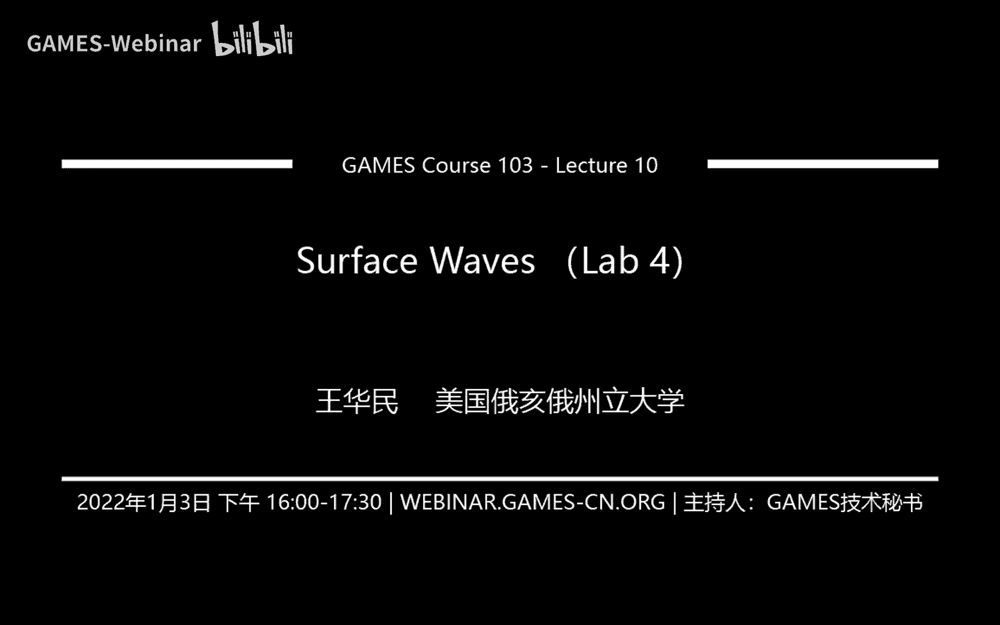
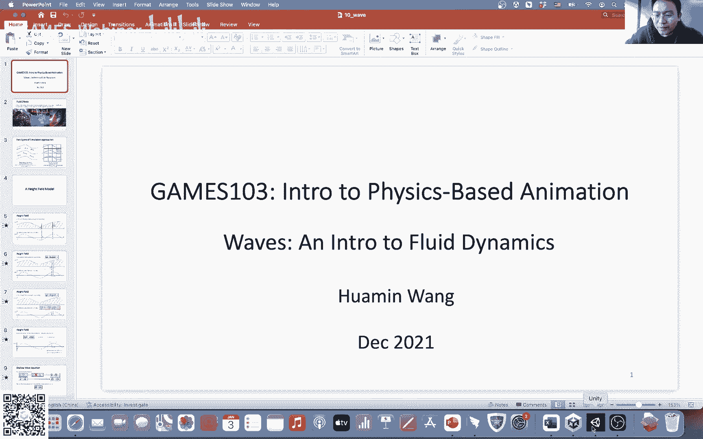
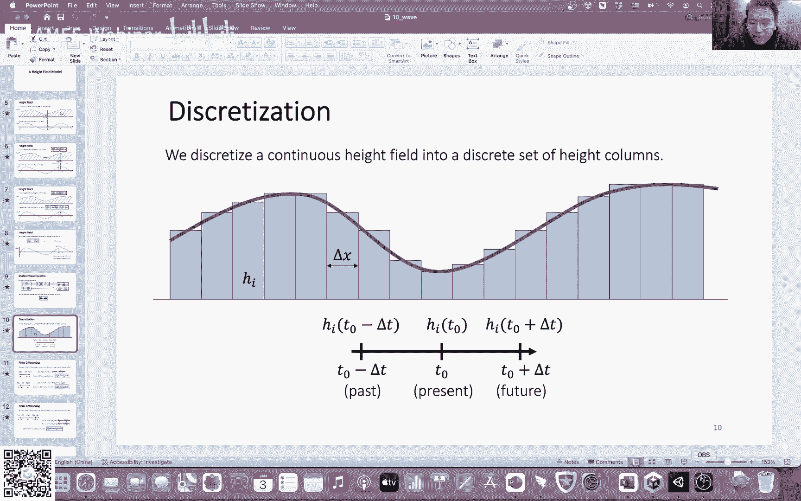

# GAMES103-基于物理的计算机动画入门 - P10：Lecture 10 表面波（实验四） 🌊

在本节课中，我们将学习如何模拟水面上的波浪效果。我们将介绍一种名为“浅水波”的简化模型，它非常适合在游戏等实时应用中模拟水面波动。课程内容将涵盖从基本概念到具体实现的完整流程，并最终与我们的实验作业相结合。

---


## 概述：两种模拟方法

在深入浅水波模型之前，我们需要了解模拟流体的两种基本方法：拉格朗日法和欧拉法。

上一节我们介绍了弹性体和刚体的模拟，它们都属于拉格朗日法。本节中我们来看看这两种方法的区别。

*   **拉格朗日法**：将物理属性（如速度、密度）定义在随物质一起运动的“质点”上。例如，模拟一群水分子，每个分子都有自己的属性，并随水流移动。
*   **欧拉法**：将空间划分为固定的网格（格子），物理属性定义在这些固定的空间位置上。当流体流过时，我们需要更新每个格子中的属性值。

我们今天要学习的浅水波模型，就是基于欧拉法的一种应用。

---

## 浅水波模型与高度场 🌊

我们的目标是模拟一个水面。一个直观的方法是使用**高度场**来描述它。

我们可以把水面想象成一个二维网格，每个网格点都有一个高度值 `h`，代表该处水面的海拔。通过更新整个网格的高度值，就能模拟出波浪传播的效果。这种描述被称为**2.5维高度场**。

除了高度，我们还需要知道水流的运动情况，因此引入**速度场** `u`。它定义了在每个水平位置 `x` 上，水流穿过该垂直截面的水平速度。

现在我们有了描述状态的**高度场** `h(x)` 和描述运动的**速度场** `u(x)`。接下来，我们需要找到更新它们的物理规则。

---

## 从物理方程到更新公式

根据流体力学的基本原理，我们可以推导出高度和速度随时间变化的方程。经过一系列假设和简化（特别是假设波浪很“浅”，即高度变化平缓），我们可以得到一个核心方程，它只与高度场和压强有关：

**∂²h/∂t² = (h / ρ) * (∂²p/∂x²)**

其中：
*   `h` 是高度。
*   `ρ` 是水的密度（常数）。
*   `p` 是压强。

这个方程就是**浅水波方程**。它告诉我们，水面高度的二阶时间导数（即加速度）与压强的二阶空间导数成正比。

在只考虑重力的情况下，水下压强 `p` 可以简化为：**p = ρ g h**。其中 `g` 是重力加速度。代入上式，并合并常数，我们可以得到一个更简洁的、只关于高度 `h` 的方程：

**∂²h/∂t² = α * (∂²h/∂x²)**， 其中 **α = g h**（通常近似为常数）。

---

## 离散化与数值求解 🔢

计算机无法直接处理连续方程，我们需要将其**离散化**。我们将空间划分为许多小格子，时间也划分为小步长 `Δt`。

首先，我们需要用离散的格子值来近似方程中的导数。这里我们使用**中心差分法**。

对于时间的二阶导数，我们有近似公式：
**(hᵢⁿ⁺¹ - 2hᵢⁿ + hᵢⁿ⁻¹) / Δt² ≈ ∂²h/∂t²**

对于空间的二阶导数，我们有近似公式：
**(hᵢ₊₁ⁿ - 2hᵢⁿ + hᵢ₋₁ⁿ) / Δx² ≈ ∂²h/∂x²**

将这两个近似代入简化后的浅水波方程，并进行整理，我们就可以得到每个格子在下一时刻的高度更新公式：

**hᵢⁿ⁺¹ = 2hᵢⁿ - hᵢⁿ⁻¹ + α * (Δt²/Δx²) * (hᵢ₊₁ⁿ - 2hᵢⁿ + hᵢ₋₁ⁿ)**

这个公式非常直观：下一个时刻的高度，由当前时刻的高度、前一时刻的高度以及左右邻居的高度共同决定。

---

## 保持体积守恒与添加阻尼

直接使用上述公式模拟，可能会导致水的总体积（所有格子高度之和）发生变化，这不符合物理规律。为了保证体积守恒，我们需要对公式进行修正。

以下是两种常用方法：

1.  **修改耦合系数**：将更新公式中与邻居交互的系数，从 `hᵢ` 改为 `(hᵢ + h邻居)/2`。这样可以保证从格子A流到格子B的水量，等于从格子B流到格子A的水量。
2.  **常数化处理（作业采用）**：直接将公式中的 `α` 视为常数。这样在求和时，邻居项会相互抵消，从而自动保持体积守恒。

此外，真实的水有粘滞性，波浪会逐渐衰减。我们可以在更新公式中引入一个**阻尼系数 β**（0 < β ≤ 1）：

**hᵢⁿ⁺¹ = 2hᵢⁿ - hᵢⁿ⁻¹ + β * [ α * (Δt²/Δx²) * (hᵢ₊₁ⁿ - 2hᵢⁿ + hᵢ₋₁ⁿ) ]**

当 `β = 1` 时，无阻尼；`β` 越小，阻尼越大，波浪衰减越快。

---

## 处理边界条件 🧱

水面不可能无限大，我们需要定义边界处的行为。主要有两种边界条件：

*   **狄利克雷边界条件**：固定边界处的高度为一个常数值（如 `H`）。这用于模拟开放水域（如海洋），边界外是静止的。
    *   在代码中，将边界外虚拟格子的高度固定为 `H` 即可。
*   **诺伊曼边界条件**：固定边界处高度的导数为零（即边界两侧高度相等）。这用于模拟无法穿越的墙壁（如水池边）。
    *   在代码中，当计算边界格子时，忽略其越界一侧的邻居（不进行水流交换）即可实现。

以下是诺伊曼边界条件的简化代码逻辑示意：
```cpp
// 假设 h_new 已初始化为 2*h_curr - h_old
for each grid i {
    if (i-1 是有效格子) {
        h_new[i] += beta * alpha * (h_curr[i-1] - h_curr[i]);
    }
    if (i+1 是有效格子) {
        h_new[i] += beta * alpha * (h_curr[i+1] - h_curr[i]);
    }
}
// 更新状态：h_old = h_curr; h_curr = h_new;
```

---

## 流体与刚体的耦合 ⚙️

在作业中，我们需要模拟方块在水面移动并激起波浪的效果。这涉及到**流体-刚体耦合**。耦合是双向的：
1.  **刚体对流体**：方块排开水体，从而扰动水面。
2.  **流体对刚体**：被排开的水体产生浮力，作用于方块。

我们重点解决第一个问题：如何模拟方块排水？

一个巧妙的方法是引入**虚拟高度** `v`。假设在方块占据的格子上，我们不是直接移除水，而是临时给这些格子一个额外的虚拟高度。然后，通过求解一个线性方程组，计算出需要多少虚拟高度 `v`，才能使得在下一个模拟步长后，这些格子达到我们预期的“被排空”后的目标高度。

求解这个方程组可以使用**共轭梯度法**等数值方法。在作业框架中，已经提供了相关的求解器（PCG）。你需要做的是：
*   设置好需要求解的格子（`mask`）。
*   根据方块的位置和目标排水量，计算方程组的右侧项（`b`）。
*   调用求解器得到虚拟高度 `v`。
*   将 `v` 乘以一个衰减系数（用于稳定模拟，避免因拖动过快产生过大波浪），然后加入到高度场的更新计算中。

对于第二个问题（浮力），可以根据阿基米德原理计算：每个被方块覆盖的格子所产生的浮力，等于其排开的水的重量（`F = ρ * g * 被排开体积`）。将所有格子的浮力向量相加，并计算它们对刚体质心产生的力矩，即可得到作用在方块上的总浮力和扭矩，进而影响其刚体运动。

---

## 总结

本节课中，我们一起学习了基于物理的水面波浪模拟。

我们从拉格朗日与欧拉两种模拟思路出发，引入了用于描述水面的**高度场**概念。通过物理推导和大量简化，得到了核心的**浅水波方程**。为了在计算机中求解，我们利用**中心差分法**对方程进行离散化，得到了直观的格子更新公式。为了保证模拟的合理性，我们探讨了**体积守恒**的方法、添加了**阻尼**效果，并介绍了两种**边界条件**的处理方式。

最后，我们深入探讨了本次作业的核心：**流体-刚体耦合**。通过引入**虚拟高度**并求解线性方程组，来模拟刚体（方块）排水并激发波浪的过程，同时也简要说明了如何计算水流对刚体产生的**浮力**。



这套基于浅水波模型的模拟方法，效率高、实现相对简单，是游戏中实现实时水面效果的常用技术。希望大家通过实验，能更深入地理解和掌握这些概念。