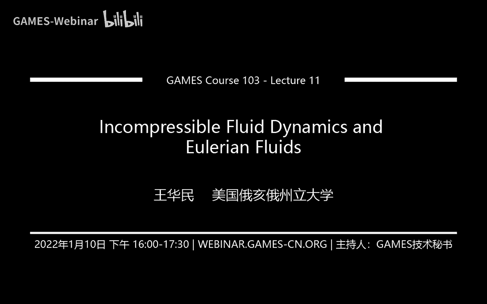
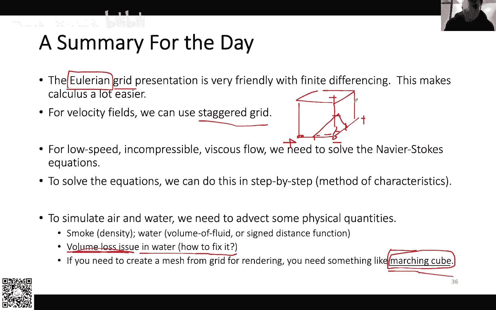

# GAMES103-基于物理的计算机动画入门 - P11：Lecture 11 不可压缩流体动力学与欧拉流体 🧊💨

在本节课中，我们将要学习基于网格（欧拉方法）的流体模拟技术。我们将首先介绍网格的表达方式，然后利用有限差分法计算微分算子，接着讨论不可压缩粘性流体的纳维-斯托克斯方程及其数值解法，最后探讨如何描述流体状态（如烟和水）。

---

## 1. 网格表达与有限差分法 🕸️

上一节我们介绍了基于粒子的模拟方法，本节中我们来看看基于固定网格的欧拉方法。这种方法将空间划分为规则的网格，并将物理量（如密度、速度）定义在网格上。

### 1.1 规则网格与物理场

规则网格（Regular Grid）将空间均匀划分为正方形（二维）或立方体（三维）的格子。每个格子中心可以存储一个物理量，例如标量（密度、压强、温度）或矢量（速度）。整个网格构成了一个物理场（标量场或矢量场）。

这种规则结构带来了一个巨大优势：计算导数变得非常容易。

### 1.2 利用中心差分法计算导数

有限差分法是数值计算导数的核心工具。对于定义在网格中心的值，我们可以使用中心差分法。

*   **一阶导数**：对于函数 `f` 在 `i` 位置（假设网格间距为 `h`）的一阶导数，公式为：
    `(f(i+1) - f(i-1)) / (2h)`
*   **二阶导数**：二阶导数可以通过连续两次应用一阶导数公式得到，最终形式为：
    `(f(i-1) + f(i+1) - 2*f(i)) / (h^2)`

在二维网格中，一个点 `(i, j)` 的二阶导数计算如下：

*   **x方向二阶导数**：`(f(i-1, j) + f(i+1, j) - 2*f(i, j)) / (h^2)`
*   **y方向二阶导数**：`(f(i, j-1) + f(i, j+1) - 2*f(i, j)) / (h^2)`

### 1.3 拉普拉斯算子

拉普拉斯算子是梯度的散度，在模拟中极为重要。在二维网格上，离散化的拉普拉斯算子 `∇²f` 计算公式为：
`∇²f(i, j) = (f(i-1, j) + f(i+1, j) + f(i, j-1) + f(i, j+1) - 4*f(i, j)) / (h^2)`

直观理解是：一个点的拉普拉斯值等于其所有邻居值的和减去四倍自身值，再除以网格间距的平方。

### 1.4 边界条件

与求解其他偏微分方程一样，流体模拟也需要定义边界条件，主要有两种：

*   **狄利克雷边界条件**：指定边界上的函数值为已知常数。
*   **诺伊曼边界条件**：指定边界上函数导数的值，例如规定边界值与内部相邻值相等。

需要注意的是，在求解某些方程（如拉普拉斯方程 `∇²f = 0`）时，不能全部使用诺伊曼边界条件，否则会导致系统矩阵奇异，解不唯一。

---

## 2. 交错网格与散度 🌀

上一节我们介绍了将物理量定义在格子中心的常规网格。但在流体模拟中，对速度场采用一种特殊的网格——交错网格（Staggered Grid）会更加方便。

### 2.1 交错网格的定义

在交错网格中，速度矢量并不定义在格子中心，而是定义在格子的面上：
*   **x方向速度 `u`**：定义在垂直网格面的中心。
*   **y方向速度 `v`**：定义在水平网格面的中心。

这样定义非常直观：速度值直接代表了流体通过该网格面的流量。

### 2.2 散度与不可压缩条件

对于一个格子，单位时间内流体的净流出量可以通过其四个面上的速度计算：
`净流出量 = u(i+1, j) + v(i, j+1) - u(i, j) - v(i, j)`

在物理学中，不可压缩流体意味着每个格子内流体的净流入/流出量为零，即体积不变。这等价于速度场的散度为零：
`∇ · U = ∂u/∂x + ∂v/∂y = 0`

在交错网格上，这个条件的离散形式恰好就是上面净流出量为零的公式。因此，使用交错网格能非常自然且精确地实施不可压缩约束。

### 2.3 双线性插值

由于物理量定义在离散的网格点上，当需要获取任意位置（非网格点）的值时，就需要进行插值。对于定义在格子中心的量（如压强），使用标准的双线性插值。对于定义在面上的速度，插值前需要对坐标进行0.5个网格的偏移，以对齐到正确的存储位置。

---

## 3. 纳维-斯托克斯方程与解法 ⚙️

本节中我们来看看描述流体运动的核心方程——纳维-斯托克斯方程，以及如何数值求解它。

### 3.1 方程概述

对于不可压缩粘性流体，纳维-斯托克斯方程描述了速度场的演化，包含两个部分：
1.  **动量方程**：描述速度如何受外力、粘性、对流和压强梯度影响。
2.  **不可压缩条件**：`∇ · U = 0`，确保流体体积不变。

图形学中通常求解的是不可压缩形式。

### 3.2 分裂法求解策略

直接求解完整的纳维-斯托克斯方程很复杂。我们采用**分裂法**，将一个时间步内的更新分解为几个连续的、更简单的步骤，逐步更新速度场 `U`：
1.  **外力项**：添加重力等外力。`U1 = U0 + Δt * g`
2.  **对流项**：处理流体自身流动导致的速度迁移。
3.  **粘性项**：处理流体的扩散（粘性）效应。
4.  **投影步**：调整速度场，使其满足不可压缩条件。

接下来，我们详细看看每一步如何实现。

#### 3.2.1 对流项：半拉格朗日法

对流项是欧拉方法中的难点。由于网格固定，而流体在流动，我们需要计算流体微团从上一时刻移动到当前位置所携带的速度。**半拉格朗日法**是解决此问题的稳定方案。

其核心思想是反向追踪：要得到当前网格点 `X` 在新时刻的速度，就沿着当前速度场反向追溯 `Δt` 时间，找到上一时刻该流体微团的位置 `X_prev`，然后将 `X_prev` 处的速度（通过插值得到）作为 `X` 的新速度。
`U_new(X) = U_old(X_prev)，其中 X_prev = X - Δt * U_old(X)`

这种方法稳定，但可能引入数值耗散（模糊）。

#### 3.2.2 粘性项：扩散求解

粘性项的形式是 `ν∇²U`，其中 `ν` 是粘性系数。这本质上是一个扩散过程，可以用显式方法求解：
`U_new = U_old + Δt * ν * ∇²U_old`

其中拉普拉斯算子 `∇²` 的计算方法已在第1.3节介绍。若 `Δt` 较大，此步可能不稳定，可采用小步长多次迭代或隐式方法提高稳定性。

#### 3.2.3 投影步：压强求解与速度修正

这是确保不可压缩条件的关键一步。我们引入压强 `p`，并通过压强梯度来修正速度：
`U_final = U_before_projection - Δt * ∇p`

修正后的速度必须满足散度为零 `∇ · U_final = 0`。将上式代入，可得到一个关于压强 `p` 的泊松方程：
`∇²p = (∇ · U_before_projection) / Δt`

求解这个泊松方程得到压强场 `p`，再用 `p` 去修正速度，最终得到既满足动量守恒又不可压缩的速度场。这个步骤被称为**投影**，因为它将速度场投影到散度为零的子空间。

---

## 4. 流体状态模拟：烟与水的表达 🌫️💧

上一节我们解决了速度场的更新问题，本节中我们来看看如何更新流体的可见状态，例如烟的密度和水的形状。

### 4.1 烟的模拟

烟的模拟相对直接。除了速度场，我们还需要模拟一个标量场，例如密度 `ρ` 或温度 `T`。这些被动标量场的更新也遵循类似的物理过程：
*   **对流**：使用半拉格朗日法，让密度随速度场移动。
*   **扩散**：密度自身也会扩散。
*   **源**：在烟源位置添加密度值。

烟的渲染通常使用体渲染技术，将密度场转换为视觉效果。

### 4.2 水的模拟与界面捕捉

水的模拟更复杂，因为水有明确的自由表面（界面）。我们需要额外的方法来刻画这个界面随速度场的演化。两种主流方法是：

1.  **体积分数法**：每个网格存储一个值，表示该网格被水占据的体积百分比。这种方法简单，但界面模糊、不精确。
2.  **水平集法**：每个网格存储一个**有符号距离函数**，其绝对值表示到水面的最短距离，符号表示内外（正为空气，负为水）。界面就是零等值面。水平集函数本身也通过对流方程更新。

水平集法能提供更清晰的界面，但面临一个挑战：**体积损失**。在数值模拟中，水的总体积可能无法严格保持，导致水面下降或上升。需要额外的算法（如粒子水平集法）来进行体积修正。

将模拟得到的水平集场（或密度场）转换为可用于渲染的几何网格，通常使用**移动立方体算法**。

---

## 总结 📚

本节课中我们一起学习了基于欧拉网格的流体模拟方法。

1.  **网格与微分**：我们使用规则网格离散空间，并利用中心差分法方便地计算导数、拉普拉斯算子等。
2.  **交错网格**：将速度定义在网格面上的交错网格，能自然地表达流体的通量，并简化不可压缩条件的实施。
3.  **纳维-斯托克斯方程**：我们学习了描述不可压缩粘性流体运动的核心方程组。
4.  **分裂解法**：通过将方程分裂为外力、对流、粘性、投影四个步骤，逐步更新速度场。其中，半拉格朗日法处理对流，投影步通过求解压强泊松方程来保证流体不可压缩。
5.  **状态模拟**：烟的模拟通过更新密度场实现；水的模拟则需要使用水平集法等技术来捕捉动态变化的界面。

这种方法在图形学中已成为模拟水和气体的标准方案，被广泛应用于电影特效和游戏开发中。下节课，我们将探讨基于拉格朗日粒子法的流体模拟。

