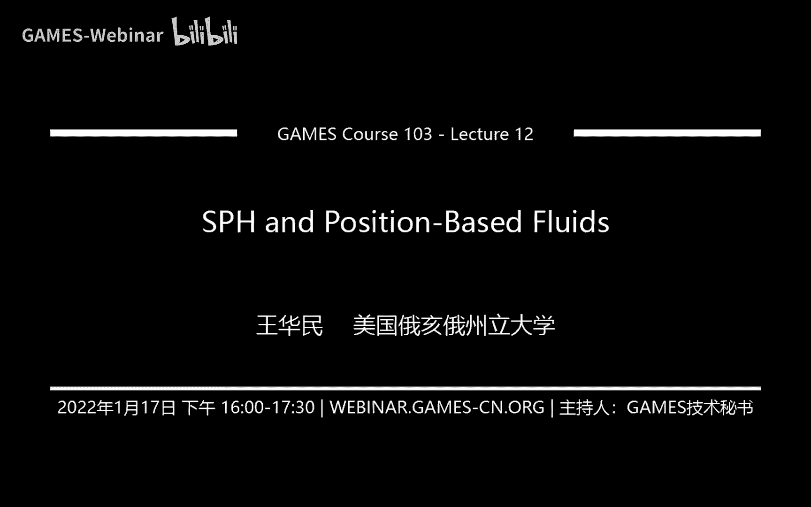
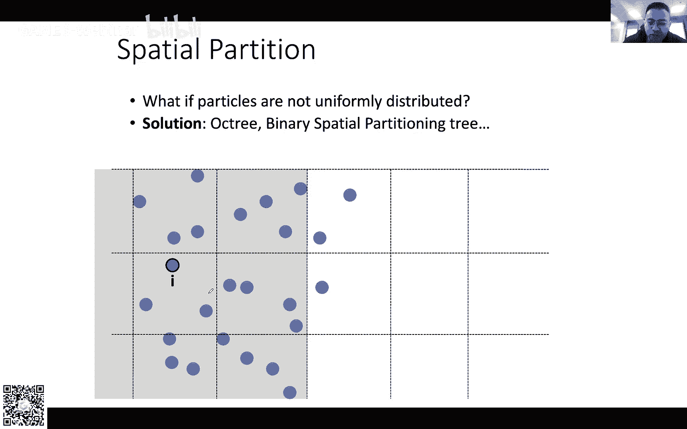
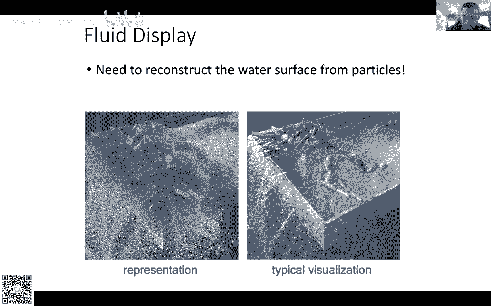
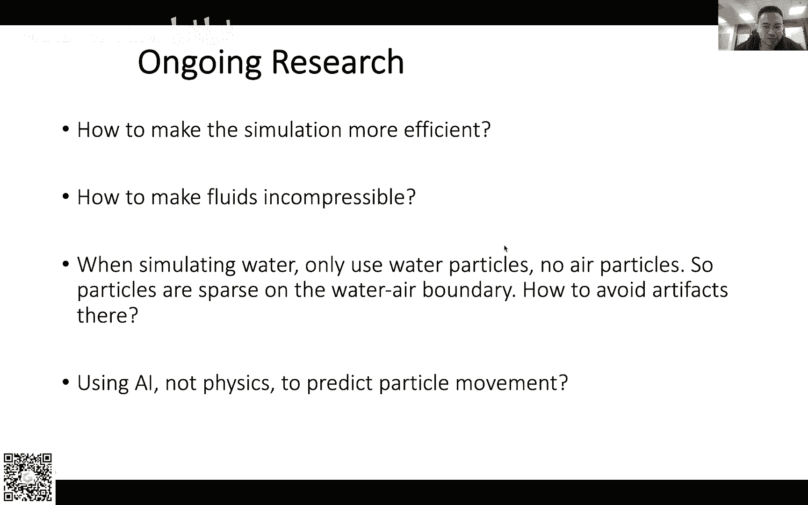
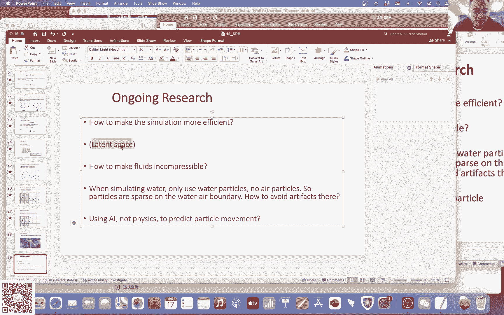

# GAMES103-基于物理的计算机动画入门 - P12：Lecture 12 SPH和基于位置的流体 🧪


## 概述

在本节课中，我们将学习基于粒子的流体模拟方法，特别是光滑粒子流体动力学（SPH）的基本原理。我们将了解如何用粒子表示流体，并通过光滑插值模型来计算密度、压强和粘滞力，从而模拟流体的运动。

---

## 课程背景与安排

今天是本课程的最后一节课。课程作业的最终评分、颁奖和奖品发放将安排在年后进行。如果同学们想在过年期间补交作业，仍然可以提交，但可能无法参与评奖。完成所有作业的同学将获得一份电子证书作为完成课程的证明。

模拟领域涉及面非常广，包括流体、弹性体、碰撞处理等。很少有研究组能覆盖所有方向，大家通常专注于某一特定领域。本节课将讨论流体模拟的最后一部分内容，即基于粒子的方法。

---

## 粒子模拟方法概述

上两节课我们讨论了欧拉方法，它将空间划分为固定网格，通过改变网格内的物理量来模拟动画。今天我们将讨论拉格朗日视角的模拟方法，即使用运动的粒子来进行物理模拟。

基于粒子的流体模拟有多种变形：
*   **SPH（光滑粒子流体动力学）**：最传统的方法。
*   **PBF（基于位置的流体）**：使用基于位置的约束进行模拟。
*   **Peridynamics**：将SPH与弹性体模拟结合，便于模拟破碎效果。
*   **MPM（物质点法）** 或 **PIC（粒子网格法）**：混合粒子与网格的方法。

不同的方法适用于不同的效果，例如MPM常用于模拟血或沙子，Peridynamics用于形变和破碎。本节课我们将从最传统的SPH方法入手。

---

## 光滑粒子（SPH）模型

### 核心思路

我们用大量粒子来表达流体，每个粒子附带着物理变量（如位置、速度、质量）。当粒子运动时，这些变量也随之运动，这是典型的拉格朗日视角。

在图形学中，由于GPU通常无法直接渲染粒子，我们需要将粒子转化为三角网格进行离线渲染，或在游戏中用带纹理的球体或方块来近似表示。

### 从简单平均到光滑插值

假设场景中有许多粒子，每个粒子都有一个物理量 \\( A \\)（标量或矢量）。我们想在空间中某个位置（例如图中红点）估算该物理量的值。这本质上是一个插值问题。

**1. 简单平均模型**
最简单的想法是在一定半径内，对所有粒子的值求平均：
\\[ A\_{i} = \frac{1}{n} \sum\_{j} A\_{j} \\]
其中 \\( n \\) 是半径内的粒子数。但这种方法没有考虑粒子的空间分布。

**2. 考虑体积权重的模型**
我们为每个粒子引入一个体积 \\( V \\) 作为权重：
\\[ A\_{i} = \sum\_{j} A\_{j} V\_{j} \\]
这里假设了单位球的总体积为1。这个模型考虑了粒子所占的空间，但还不够“光滑”。

**3. 引入光滑核函数**
我们希望插值结果能随位置连续、平滑地变化，而不是在粒子进出插值半径时剧烈跳变。因此，我们引入一个与距离相关的权重函数——光滑核函数 \\( W \\)。
\\[ A\_{i} = \sum\_{j} A\_{j} V\_{j} W(||\\mathbf{x}\_i - \\mathbf{x}\_j||, h) \\]
其中 \\( h \\) 是光滑长度。核函数满足：距离近则权重大，距离远则权重小。

---

## 密度、体积与最终插值公式

然而，粒子的体积 \\( V \\) 并非常数，它会随着粒子的分布疏密而变化。我们需要动态计算它。

我们假设每个粒子有恒定的质量 \\( m \\)。这里定义的密度 \\( \\rho \\) 是粒子分布的密度，描述粒子在空间中的拥挤程度，而非水的物理密度。

根据光滑插值公式，粒子 \\( i \\) 的密度可以通过其邻居估算：
\\[ \\rho\_i = \sum\_{j} m\_j W(||\\mathbf{x}\_i - \\mathbf{x}\_j||, h) \\]
直观理解：周围邻居的质量和越大，该处就越拥挤，密度越高。

得到密度后，我们可以计算体积：
\\[ V\_i = \\frac{m\_i}{\\rho\_i} \\]
将体积公式代回最初的插值公式，就得到了SPH的最终插值形式：
\\[ A\_{i} = \\sum\_{j} A\_{j} \\frac{m\_j}{\\rho\_j} W(||\\mathbf{x}\_i - \\mathbf{x}\_j||, h) \\]
在实际计算中，通常分两步：先估算每个粒子的密度和体积，再利用此公式插值其他物理量。

---

## 微分算子的计算

使用光滑插值模型的一个巨大优势是，可以方便地计算物理量的梯度（∇）和拉普拉斯算子（∇²）。

在计算梯度时，我们近似认为邻居粒子的物理量 \\( A\_j \\) 和体积 \\( V\_j \\) 是常数（因为粒子 \\( i \\) 的微小运动对邻居影响较小）。这样，梯度算子就只作用于已知的核函数 \\( W \\)：
\\[ \\nabla A\_{i} \\approx \\sum\_{j} A\_{j} V\_{j} \\nabla W(||\\mathbf{x}\_i - \\mathbf{x}\_j||, h) \\]
由于核函数是解析定义的，其梯度有现成公式。拉普拉斯算子的计算同理：
\\[ \\nabla^2 A\_{i} \\approx \\sum\_{j} A\_{j} V\_{j} \\nabla^2 W(||\\mathbf{x}\_i - \\mathbf{x}\_j||, h) \\]

---

## 核函数示例



常见的核函数使用多项式形式，因其计算和求导简单。例如下面这个函数：
首先计算归一化距离 \\( q = \\frac{||\\mathbf{x}\_i - \\mathbf{x}\_j||}{h} \\)，然后核函数定义为：
```math
W(q, h) = \frac{315}{64\pi h^3} 
\begin{cases} 
(1 - q^2)^3 & 0 \leq q \leq 1 \\
0 & q > 1 
\end{cases}
```
其梯度（一阶导）和拉普拉斯算子（二阶导）也有对应的多项式表达式。在实际代码实现中，直接套用这些公式即可。

---



## SPH流体模拟算法

上一节我们介绍了SPH的核心插值模型，本节我们来看看如何将其应用于流体模拟。其思路与之前讲过的粒子模拟算法相似，主要考虑三种力：重力、压强力和粘滞力。

### 1. 重力
重力计算简单，直接作为外力施加给每个粒子：
\\[ \\mathbf{F}\_i^{gravity} = m\_i \\mathbf{g} \\]

### 2. 压强力
压强力源于压力的不平衡（压力差），而非压力本身。数学上，压强力与压强的负梯度相关：
\\[ \\mathbf{F}\_i^{pressure} = -V\_i \\nabla p \\]
我们假设压强场也是光滑的，利用SPH梯度公式计算：
\\[ \\mathbf{F}\_i^{pressure} = -\\sum\_{j} V\_j p\_j \\nabla W(||\\mathbf{x}\_i - \\mathbf{x}\_j||, h) \\]
其中，粒子压强 \\( p \\) 通常由密度通过经验公式计算，例如：
\\[ p\_i = k ( \\rho\_i - \\rho\_0 )^7 \\]
这里 \\( k \\) 和 \\( \\rho\_0 \\) 是常数。

### 3. 粘滞力
粘滞力的效果是使流体粒子的速度趋于一致，数学上可用速度场的拉普拉斯算子来描述：
\\[ \\mathbf{F}\_i^{viscosity} = \\mu m\_i \\nabla^2 \\mathbf{v}\_i \\]
其中 \\( \\mu \\) 是粘滞系数。利用SPH拉普拉斯公式计算：
\\[ \\mathbf{F}\_i^{viscosity} = \\mu \\sum\_{j} m\_j (\\mathbf{v}\_j - \\mathbf{v}\_i) \\nabla^2 W(||\\mathbf{x}\_i - \\mathbf{x}\_j||, h) \\]
注意速度是矢量，计算时需对每个分量（x, y, z）分别进行。

### 模拟流程
以下是SPH流体模拟的基本算法步骤：
1.  **寻找邻居**：对于每个粒子，找到其周围一定半径内的所有邻居粒子。
2.  **计算密度**：根据邻居粒子质量，用SPH公式估算每个粒子的密度 \\( \\rho \\)。
3.  **计算压强**：利用密度，通过经验公式计算每个粒子的压强 \\( p \\)。
4.  **计算合力**：
    *   加上重力 \\( \\mathbf{F}^{gravity} \\)。
    *   加上利用SPH梯度公式计算的压强力 \\( \\mathbf{F}^{pressure} \\)。
    *   加上利用SPH拉普拉斯公式计算的粘滞力 \\( \\mathbf{F}^{viscosity} \\)。
5.  **更新状态**：根据合力 \\( \\mathbf{F}\_{total} \\) 更新粒子速度，再根据速度更新粒子位置。

---

## 挑战与扩展

### 性能挑战与优化
模拟逼真的流体需要百万甚至千万级的粒子。计算每个粒子的邻居是主要性能瓶颈，穷举法不可行。常用优化方法包括：
*   **空间划分**：将空间划分为均匀网格（Spatial Hashing），每个粒子存入对应网格，快速定位邻居。
*   **层次结构**：对于非均匀分布的粒子，可使用八叉树（Octree）等数据结构。
*   **自适应粒子**：在需要高细节的区域（如水面、泡沫）使用更小、更密的粒子，在内部区域使用更大、更疏的粒子以提升效率。

### 表面重建
粒子系统渲染前需要将点云转换为三角网格表面（三维重建）。简单方法是将每个粒子视为球体，计算其符号距离函数（SDF），然后进行等值面提取（如Marching Cubes）。通常还需对生成的网格进行平滑处理以消除噪点，同时保留细节。



### 研究前沿
SPH及其变体仍在不断发展，研究热点包括：
*   **效率与实时性**：如何在资源受限（如游戏）环境下进行高效模拟。
*   **不可压缩性**：精确保持流体体积不变是一个难点，MPM等方法试图更好地解决此问题。
*   **边界处理**：精确处理流体与固体、空气的交互边界。
*   **AI驱动模拟**：利用机器学习加速或控制模拟过程，但目前尚难以完全替代物理引擎。

---

## 总结与展望

本节课我们一起学习了基于粒子的流体模拟方法SPH。我们从光滑插值模型出发，讲解了如何通过粒子估算密度、体积及其他物理量，并利用核函数方便地计算梯度与拉普拉斯算子，从而求解流体的压强力和粘滞力，最终实现流体运动的模拟。

图形学中的物理模拟，其核心价值在于在**效果逼真**与**计算效率**之间取得平衡，以满足实时应用（如游戏、虚拟数字人）的需求。这与追求绝对精确的科学计算模拟有显著区别。

对于希望深入该领域的同学，建议：
1.  **夯实基础**：理解本节课及本课程系列的内容，是阅读相关论文的坚实基础。
2.  **专注方向**：模拟领域分支众多，建议选择一个感兴趣的方向（如流体、弹性体、碰撞）深入钻研，而非泛泛而读。
3.  **动手实践**：在阅读论文的同时，尝试实现其中的算法，理解会更深刻。
4.  **关注现实问题**：了解工业界（游戏、影视、数字服装等）的真实需求，思考如何用技术解决实际问题，这往往能产生更有价值的研究。

物理模拟是计算机图形学中富有挑战且极具趣味的方向，希望本课程能为大家打开一扇门。祝大家新年快乐，在图形学的道路上不断进步！



