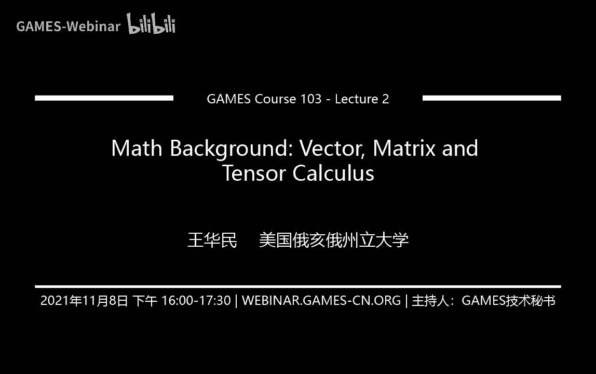
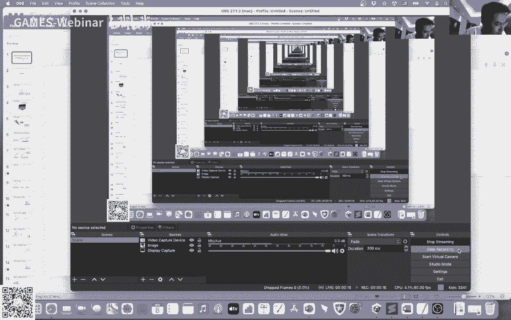

# GAMES103-基于物理的计算机动画入门 - P2：Lecture 02 Math Background： Vector, Matrix and Tensor Calculus - GAMES-Webinar - BV12Q4y1S73g

行我们今天今天主要来讲一下，就是跟嗯物理模拟相关的一些数学问题，然后呢嗯这些数学问题我觉得主要分成三三类吧，第一类是一些基础知识，就是大家可能嗯以前上高中啊，或者是大学本科的时候，就是上一期数学课。

可能就是已经比较了解的一些基础知识，过一下，然后嗯就是确保大家都是能够就是在这些数学基础上都是比较熟悉的，因为我猜测可能大家有的时候上数学课，有的时候嗯逃课啊，或者是什么种种原因，就是有些东西忘记掉了。

然后我这里其实也是帮大家巩固一下概念，然后第二个呢是主要是嗯讲一些就是图形学里所要用到的，然后呢可能呃有的同学不是特别了解的，所以说这里我也想跟大家来介绍一下这些知识。

然后就是帮助有一部分同学就是呃掌握这些知识，然后如果说你嗯可能在这方面可能欠缺的话，可能就是课后需要呃读一些参考资料，然后稍微对这方面了解一下。

然后最后一点呢就是呃有一些东西可能是嗯大家可能在读书的过程中，然后我这里也会简单的介绍一下，当然我们在后面的课程里面也会把这些知识呃传递给大家。

所以说这里相当于是给大家相当于给一个introduction，能够对大家帮助大家有些初步的了解，然后今天的课主要是分成三块，一个是矢量，然后另一个是矩阵。

然后最后我们来讲一些跟矢量矩阵相关的一些微积分的一些东西好吧，然后咱们首先讲讲史料vector嗯，我相信大家在高中里面，中学里面可能都已经有学过矢量这个概念了，那么什么是矢量呢。

嗯最常见的我们大家在日常生活中用的比较多的，就是把矢量描述成一个在二维或者三维空间中的一个几何体，然后这个几何体呢它有方向的含义，同时它也有大小的含义。

就比如说呃我假如说我在空间中有一个坐标系x y z嘛，然后呢我可以定义一个矢量是从原点到某一个点p点的，那么这个矢量其实就是描述了从原点出发到这个p点的这么一个呃，相对关系，我们把它叫做p。

然后呢呃他这个p在每一个坐标轴上的投影，分别就是p x p y p z对吧，三个方向，那么就分别有三个值来表示这个呃矢量，然后呢它这是在三维空间里的，所以说我们这里写作二三，这个二就表示时速空间嘛。

然后三次方就表示它是一个三维空间了，呃相对应的原点它是一个比较特殊的一个矢量呃，它是000，也就是意味着它在三个方向里面，它的投影都是零，它相当于是一个初始点呃，然后大家一般在呃印象中吧。

很多大家手写的时候，一般来说都写矢量，一般来说都会在上面放一个箭头，对不对，一般来说都是这样的写法，我来给大家画一下，一般都是给上面放个箭头嘛，一般都是这么写的，但是这种写法在印刷体里面。

在论文里面一般来说是不是很常见的，为什么不常见，因为如果说你每个矢量都给它写个箭头的话，会导致你整个论文里面到处都是箭头，特别乱，所以通常我们在论文里面的时候，一般来说都用字体来区分矢量和标量。

那么矢量一般来说我们会用黑体来呃表示，然后标量一般来说我们会用斜体字来表示，所以说大家看到一个字母，首先看它的字体是什么，如果是斜体字，一般来说它意思就是标量，然后如果是黑体字，一般来说就是矢量。

然后为了区分矢量和矩阵，我们还用大写跟小写，这个我们等会儿后面会讲，所以说嗯大家都注意一下，就是一般来说咱们在论文里面的时候，就是要特别注意这个字体，就我们一般来说是用字体去区分的。

而不是说用这个小箭头去区分了，然后呢这个坐标系呢有一个特点，就是它其实是有两种类型的，像这种坐标系跟呃如果大家记得右手定则是什么的话，就是如果说大家把这个手呃，让四个手指从x转到y的话。

那么你的大拇指指向的方向就是z的方向，那么这个就叫做右手系统，右手的坐标系统呃，在图形学里面，一般来说我们做研究，一般来说都是利用右手的这个坐标系来定义的。

然后open gl一般来说一般open gl也是用右手系统的，那么左手系统有没有呢，其实也很常见啊，比如说啊就像这里的话就是一个左手系统了，如果说你用左手嘛对吧，你让x y z是四个手指，是x y z。

然后你的大拇指指向的方向就是呃呃z的方向，然后unity是左手的direct x，direct x是微软的一个图形形引擎，它就是左手的，所以说其实呃在图形学里面，左手跟右手的系统其实都有。

所以说大家呃有的时候要比较留意一下，就是不要默认的就觉得好像都是右手或者都是左手，其实不同的系统它其实用的坐标系是不一样的，好吧，在通信学里面，一般来说我们呃设定呃坐标系的时候。

我们会参考这个屏幕空间呃，如果我们观察我们自己的这个屏幕嘛，一般来说我们的右手方向就是x方向，然后我们头顶的方向就是y方向，那么z方向就有两个方向了对吧，一个是往外的屏幕外的。

就是朝着我们的这个是右手系统，然后朝着屏幕里面的呢就是左手系统呃，左手系统它其实有个什么好处，它的好处在于你想象就是我们空间中的物体，是不是都是在这个屏幕后面的对吧，我们有个三里虚拟空间。

那么这个这些物体其实都在屏幕的后面的，那么在屏幕后面，如果用左手系统，也就意味着它的x y z都是正的值，这是它一个好处，就是所有的值都是正的嘛，那么如果你用右手系统呢，你的物体等于就是在负的z的方向。

所以说它其实不是说不能这样子定义，你可以定义是右手还是左手的，这个反正就是大家就是参考一下，那么我刚才讲到了，我们的矢量是一个3d的，一个在三维空间里面描述一个方向，但是在有的时候呢。

我们其实也并不需要说这个矢量就一定需要有什么几何的含义啊，他完全就是可以是一堆呃数字组合起来的一个结果，我举个例子，比如说呃我想要描述一个物体对吧，假如说我有一个闪电，大家可以看到左边我画了一个闪电嘛。

这个闪电它是由11个顶点构成的，012345678 90 十到14，有11个顶点构成的，那么我可以把这个物体用这个11个点的位置的组合来进行一个描述，那么怎么做呢，我其实就把这11个顶点排成一列。

就像左边这样对吧，我把这个x0 x1 x21 直到x 10，那么这整一个大向量，它其实就可以描述这个物体的形状了，那么当我做动画的时候，如果说比如说我要修改某些点的位置。

那么我就相对应的更改这些点在这个大向量里的这个值，那么我就可以去描述这个呃物体的状态了，那么这个这种情况下呢，这个向量它是一个33维空间里面的一个大向量了，它就不是一个三维空间里的一个向量了。

那么它其实也并没有什么几何的含义，因为大家可以说这个33维空间是个什么几何含义啊，这个我不知道对不对，但是我如果把这些点全都合在一起，我其实可以描述这个物体的状态。

我其实可以拿来做一个相当于一个矢量的一个表示，在这种情况下呢，我们把它叫做stack vector，一般来说我们把它叫做stack vector，就是说这些向量其实是叠在叠加在一起的。

它没有什么几何含义，但是我拿来用它来描述这个物体的状态，有同学问就是x0 x一是不是也是向量对每一个点，每一个x它都是一个向量，都是一个三维向量，然后呢我把这所有的这是11个三维向量合在一起。

就是一个3x11维的向量，所以说它这就是33维的向量好吗，然后呢我们有了向量的定义呢，我们接下来可以呃我们可以来进一步的定义一些数学的计算，比如说我们可以来定义加减法嗯，大家可能在中学里面都学过嘛。

矢量的加减法其实就是对于每一个元素做加减法，所以说呃p加减q就分别是p x加减q x p y加减q y，然后pc加减q z这个大家都知道，这个p加q等于q加x的q加p这个其实大家也知道。

然后几何上是个什么含义呢，几何上呢就是说如果说有个p对吧，有个p向量，然后有个q向量p加q呢，就等于我先从原点出发，然后沿着这个p的向量往前走，走完之后呢，再沿着这个q的方向往前走。

然后这两个叠加在一起，我就得到了p加q，然后同样的如果说我先沿着q走，再沿着p走，我最终也可以达到同样的结果，这个我们刚才也看到了呃，类似的减法，如果说我想要做一个减法，那么我有个q，我有个p。

那么p减q就是p跟q之间的这么一个相对位置，我就可以得到了一个呃相对的一个位移关系，如果说大家不记得的话，我相信大家可能大多数同学应该都还记得这个加减法的一些，所以给大家反正先简单的过一遍，好了。

我们现在有这些呃加减法，然后呃的这些定义之后，我们可以拿来用矢量来做什么，我们一般来说可以用这些3d的矢量来描述点速度力，还有一些线，这些跟所有的跟线有关的表达，我们都是可以用矢量来描述的。

呃举个简单的例子吧，就是假如说我现在有一个点啊，我现在有个点叫p对吧，然后呢我有一个向量啊叫v，然后呢你可以认为说这个p呢是一个小的一个例子，然后呢这个例子呢沿着这个v的方向往前运动。

v可以认为是它的速度，那么我怎么去描述这个粒子的运动呢，呃我可以，嗯等一下我可以把这个运动的这个轨迹呢写成一个公式，叫做pet，卡了吗，现在呢，现在，现在是卡顿还是卡我我我稍微看一下啊，把切到5g吧。

可能是因为网络的原因，现在好了是吧行嗯，可能是网络的原因，那么我可以把这个例子的。

什么毛病，现在呢现在好了吗，好吧，我们继续吧，这个我不知道这边的网怎么回事，反正我现在用5g然后看看5g怎么样啊，我们刚才讲到，我们刚才讲到有一个小例子吗，录播吗，对ok我刚才讲到现在现在有个小例子。

然后这个小例子呢呃它的初始位置是p，然后呢它沿着这个v的方向在运动，它沿着这个速度的方向在运动对吧，那么我可以把这个粒子的运动轨迹描述成ppt，等于p加上时间t乘以速度，这个我想大家都知道。

也就是呃位置等于原始位置加上速度乘以时间吗，那么这个公式呢就给了我们这个把这个位置呢写成了关于时间的函数，这个t就是时间，那么t等于什么，t是什么呢，t呢大于零的时候呢，也就意味着这个例子在往前运动。

然后t小于零的时刻呢，就表示我们倒推回去，在之前的时刻，这个例子是什么样的位置，那么整个公式呢就是实际上就是在描述一个粒子，沿着这个速度往前运动的这么一个公式，那么因为这个东西它其实本质上就是一个线嘛。

所以说我们可以利用同样的公式，我们来定义一条线，比如说这里假如说我有两个点，一个是p点，一个是p点，一个是q点，那么我的这个方向是什么呢，我的方向就是q减p对吧，那么我的这个粒子的运动轨迹呢。

就变成了p t等于p加上t乘以q减p了，那么我就利用这个刚才的这个原来是描述这个粒子运动的，我现在把它来描述一条线了，天然的呢我就有三个部分构成，一个是t小于零的时候，这是什么呢。

就是在p前面的那一段就是t小于零的时候，然后呢第二段呢是零跟一之间，当t在零跟一之间呢，我得到了什么呢，我得到了我得到了中间的这一段，就是p跟q之间的这一段对吧，然后最后一段是什么。

最后一段是t大于一的时候，当t大于一的时候，我得到了什么，我得到了q以外的那一段，所以说我同样一个公式，我可以利用这个公式我来描述不同的几何体，比如说线段，如果说我想要定义的是一个线段的话。

那么我用这个公式我再加一个条件，我要求t在零跟一之间，那么我得到的就是一个线段的定义，如果我想要得到一个射线是什么，假如说我想要得到一个射线，那么我就要求t大于零。

那么我得到的就是从p出发的一条射线对吧，那如果说我想要得到的是一整条完整的线呢，那我对t就不做任何约束就行了，那我就直接利用这个公式，然后t可以取任意的时速，那么我得到的就是一整条完整的线了。

这个就是同样一个公式，我根据t的不同的值范围，我可以拿来定义不同的东西，那么这是一种写法，然后还有一种比较常见的写法，是把这个公式稍微做一下变化，我可以把它写成一减t乘以p加上t乘以q。

那这种情况下你就会发现这个东西呢，它其实本质上就是对p分别对p跟q他做了一个混合嘛，对不对，把它混在一起，然后呢它混合的量是多少呢，是通过这个一减t跟t来决定的，这个1。1减t呢就是p的权重。

t呢就是q的权重，也就是说我是有一个根据t计算出来的权重值，然后我利用这个权重对p跟q做一个混合，我可以得到这个p的位置，这个东西呢我们把它叫做差值呃。

然后呢这个一减t还有这个t呢就是它的一个差值的权重嘛，这个t呢有的时候叫做interpret，这个反正呃大家如果听说过的话，就是呃就就了解，如果说没有听说过的话，反正就是知道这个概念就是给两个点。

然后呢我给他一个权重，我可以利用这个混合的线性的这么一种混合的方式，我可以得到中间的一个结果，好吧，这就是一个线，我们刚才讲了啊加法减法，然后接下来我们讲一个也是比较重要的概念，就是矢量的大小。

数学里面叫做norm，它其实的意思就是说给一个矢量，我怎么去计算它这个矢量的大小，对不对，最常见的我们通常比较见得比较多的叫做euclidian norm，也就是所谓的to nor，怎么计算呢。

就是p x平方加py平方加pc平方，然后开个根号，这个就是to norm对吧，那么为什么叫to no，你看大家留意到这个叫to norm，为什么叫to norm，因为这里都是二嘛，都是平方平方平方。

然后最后开根号，所以叫to norm，相对应的呢，我可以任意取一个值叫p，然后呢我做p次方，然后最后呢呃开辟的根号，这个呢就叫pal呃，根据p的不同的值，我有各种呃norm的写法。

比如说呃one norm这种一norm就是它的绝对值的和嗯，在数学里面它其实还有一个另外一个名字叫做曼哈顿，举例叫my heart distance，它其实就是one no。

这个如果大家做一些有些游戏开发里面可能会用到吧，就是利用这个坐标系之间的差，然后求和来算距离，而不是直接拿来做这个ucla距离呃，然后还有一种呢叫做infinite infinity norm，呃。

什么意思呢，就是假如说这个p趋向于无穷大的时候，发生什么，当p趋向于无穷大的时候，这个计算出来的值实际上就是它们的最大值，这种也是一种比较常见的norm，叫做infinity norm。

当然最常见的应该是to nor，很多时候呃大家不写这个二，就是默认的时候呃，就是直接把这个二去掉啊，然后这种情况下，一般来说大家都是假设它是秃脑，一般来说就是大家默认的就是这个。

the norm有什么用呢，呃比如说我们可以拿来计算两个点之间的距离嘛，对不对，呃，两个点之间它的相对位置可以用一个矢量来描述，就是q减p这个矢量来描述，那么这个矢量的norm也就是它的距离。

我们就可以拿来直接拿来算距离呃，然后如果说一个一个向量，它的norm为一，那么我们把它叫做是一个unit vector，就是一个单位向量，然后如果说一个向量我想要把它变成单位向量，我怎么做呢。

我就把它除以它的norm就可以了，呃为什么，因为呃这个除完之后的这个norm就等于norm除以norm，那么自然也就得到一了对吧，这个就其实一个很简单的操作。

这个我想大家可能都是比较呃了解或者是听说过的嗯，这是一个normalization的一个方式，就是把它变成一个单位向量的一个方式，好了刚才我们讲了这个矢量的加法，减法还有矢量的norm呃。

接下来我们来讲乘法呃，我们先讲一种乘法叫做点乘或者叫做内积，一般数学里面叫做内积，但是我们呃如果是做几何运算的话，有的时候大家就喜欢叫点乘吗，那么点成什么意思呢，就是假如说给你两个向量p和q。

如果说我做一个点乘，我就分别的对他们的xy还有z做乘法，做完乘法以后，我们把它加起来就得到了一个什么，得到了一个标量对吧，我们得到了一个标量值，那么这个就是它的点乘呃。

有的时候大家读一些paper会发现它一般来说不用这个点的方式，一般来说他会用这种方式，一个一个尖括号，然后p a q类似这种形式，其实是一个意思，就是做内积，做点乘的意思，然后如果大家读一些论文呢。

有的时候大家会写这种方式，可能也会比较常见，就写p transport kill，什么意思呢，就是我们会把这个p当作是一个矩阵，然后呢它的转置呢实际上就是把p变成了一个从一个额数的向量。

变成了一个横的向量，然后如果做乘法，做矩阵乘法呢其实跟做点乘，它的结果是一模一样的，所以说这个也是一种写法，虽然说我们现在还没讲到矩阵，但是这个其实跟呃其实就是想利用这个矩阵乘法的这种方式来写点乘。

这个好处在于什么，这个好处在于我们可以把所有的东西都写成矩阵跟向量的乘法，而不需要额外的去定义点乘或者是其他乘法，这个以后大家如果说读一些paper或者是我们以后之后的课程，可能会遇到这种情况。

就是如果他说大家看到这种两个向量，然后中间transports实际上就是我们在做点乘好，这是数学上的定义啊，就是呃写法上的定义，那么几何上它什么意思呢，它的几何上他在算一个事情。

实际上就是说假如说我有两个向量对吧，我分别有这两个向量的大小长度，分别写作p的norm跟q的norm，同时呢我还有一个夹角，这个夹角是p跟q之间的夹角，我把它叫做c塔。

那么这个点成就给了我们p的norm乘以q norm，再乘以cos theta，这个实际上就是它这个点乘在几何上的这么一个含义了，那么根据定义我们有一些呃这个点乘的一些特征，比如说p乘以q等于q乘以p。

这个大家蛮容易从这个定义上去理解的，因为a乘以b等于b乘以a嘛，所以说你把p跟q交换一下位置，它这个结果肯定是一样的，对不对，他满足分配率对吧，p乘以q加r等于p乘以q加上p乘以r。

这个反正跟正常的乘法分配率也是一样的，这个反正从定义出发嘛，我们肯定也就可以得到这样的结果，没有什么特别奇怪的，然后还有一种写法，还有一种呢是比较呃有意思的，我觉得就是怎么样去写nm。

你会发现其实p乘以p dot p，他对他自己做点诚，其实就等于norm的平方，to norm的平方，因为为什么，因为p乘以p自己等于p x平方加p y平方加pc平方吧。

也就是它这个two norm的平方，所以说很多时候有的时候大家想做一些呃关于矢量的积分，微分计算的时候呢，一般来说大家都是利用这个东西去写的，一般来说大家就不用norm的这个定义去写了。

然后可以利用这个点乘啊，还有利用这些矩阵乘法的这种写实写法，然后就是可以做一些呃微积分的计算了，回头我会给大家看一个例子，呃然后最后一点呢就是关于ca的，呃假如说p跟q它的点乘是零的话。

也就意味着这个cos theta等于零，因为我假设这个p跟q都不等于零嘛，他俩都不是零向量吗，他既然都俩不是零向量的话，那么他俩唯一等于零的原因就是因为cos theta等于零对吧。

那么cos theta什么时候等于零呢，肯定就是c它等于90度或者是270度的时候等于零吗，那么什么时候是两个向量的夹角是90度或270度啊，他俩必须是垂直嘛对吧，所以说p跟q点乘为零。

也就意味着p跟q是互为垂直的关系，是正交的关系，这个是一个比较，也是大家用来拿来判定的一个一个标准吧，就是拿来判定就是两个方向是不是垂直的一个标准，就是做一次点乘，看看结果是不是等于零就行了。

好接下来我们可以利用呃点成我们来呃搞些搞些事情呃，首先我们可以来定义一个点到一条线上的投影，假如说我有一个点，我这个点叫q，我把它叫做q，然后呢我有一条线分别通过这个点的原点o当然不一定是o啊。

可以是任意的这个点嗯，还有一个方向v通过这两个向量我来描述这个点，我们刚才讲到这个可以通过一个什么公式，反正一个线性的公式，我们可以描述这个线嘛对吧，我想要知道这个q在这条线段上的投影是什么，是哪个点。

同时呢我也想知道这个投影s到这个原来这个点的距离是什么，这个我把它叫做小s，大家可以注意到我这个写这个两个s的时候，我的字体是可以拿来区分这两个值的不同含义的，黑体字是矢量。

然后斜体字表示大小是一个标量，表示它这个距离，那怎么做呢，我首先来计算这个小s好不好，我首先来计算这个标量是多少，计算这个标量，我知道这个q如果说它的投影是s的话。

那么他这个qs这条线跟我这个线跟原来这条ov这条线，他肯定是垂直的嘛对吧，它肯定是一个垂直关系，所以说这个s呢，这个s呢就是这条矢量，就是q o这条矢量，在这条线段上的投影。

那么已知这条线段q o这条线段它的大小是q减o的norm，那么我再乘以一个cos theta，theta是这两条方向的夹角，我是不是就可以得到s呀，这个就是它的定义吗，斜边乘以cos等于底边嘛。

那么如果说我把这个东西乘以这个矢量v的大小的话，上下都乘以分母，我把这个东西作为一个分母，然后这个东西作为分子，我把它前后都乘以vid norm的话，是不影响结果的对吧，我就两边都乘上下两。

上下都乘以这个venom就行了，那么这个东西是什么，我们刚才讲到，如果说两个矢量相做点乘得到的是什么，得到的是这两个矢量的大小的乘积，再乘以这两个矢量的夹角的cos是不是就是完美的典型的定义啊。

所以说我们得到的就是q减o点乘v除以v norm，那么然后呢这个东西是什么，v除以v的norm是什么，是normalization，是把v变成一个单位向量的normalization，所以这个s。

同样也等于q减o点乘normalize过以后的这个v的向量，换句话说，我们把这个v先normalize一下，normous，完了之后呢，我得到一个q减o的向量。

我把这个q减o的向量跟我这个v向量我做一个点乘，我就可以得到这个这个s我就可以得到这个投影距离了，有了这个投影距离之后，我就可以拿来得到大s怎么得到，我从o出发，我根据这个线段的定义出发吗，我从o出发。

我沿着这个i v方向走，我走多少距离，我走s那么我的这个大的s capital s啊，我这个大写我这个黑体字s等于o加上距离乘以方向，就等于它的这个投影点的位置了，这就是我们来计算。

按这个一个点到一条线段的一个呃呃一条线的这个投影的一个方式，我可以利用这个点称来做这样的计算，好吧有有没有什么问题，大家在这里，没有问题的话，我们就继续往下走，ok。

那我们接下来我们可以利用刚才我们讲的这个东西，我们去定义一个平面，假如说我有个平面，平面中有个点，我把它叫做c点，然后呢平面呢我有一个方向，它这个叫做反向，叫做同时这个n也是一个单位向量。

那么这种向量我就把它叫做norm normal，就是它的法向量就是一个平面，我有产品平面上一个点，同时我还有平面上的一个法向量，利用这两个向量我可以定义一个平面，怎么去定义一个平面呢。

我去我可以搞一个公式，我用这个公式来判定，说给你随便给你一个点啊，给你个p点，我来判定这个p点它跟这个平面是处在一个什么样的关系上，它是在这个平面的上面，还是在这个平面上，还是位于这个平面。

还是说在这个平面的下面，我可以有三个不同的位置，那么怎么得到这三个不同的位置呢，很简单，我有这个向量，从c点出发的到p点的向量，对不对，我把这个向量和法向量做一个点乘，我是不是就可以得到一个距离啊。

就是我们刚才讲的这个投影距离啊，那这个投影距离它其实不是一个我们所谓的一个永远是正的距离，它其实是可正可负的，那么它的这个符号其实就是告诉了我们这个p点的关系，跟这个平面的关系，大家看啊。

假如说这个p点在这个平面上面会发生什么，如果说p点在平面上面的话，那么p减c这个向量跟n向量它其实在同一个面上，同一个方向上，同一个半平面上对吧，那么它这个做点成就会是大于零，也就是在这个平面上面。

如果点乘等于零呢，如果点乘等于零，也就意味着p减c跟n跟法向量它是一个垂直的关系，也就意味着它是刚好位于这个平面的，然后最后如果说p减c跟n的点乘是小于零的，那意味着什么，意味着p在这个平面的下面对吧。

因为p减c它跟a an它不是处在一个半平面上的，所以说它是小于零的，这里应该写小于等于小于它在它下面，所以说我就根据这个公式，根据这个点称，我可以得到三个位置关系，那么我们刚刚讲了。

说我们可以利用这个符号大于零还是小于零，还是等于零，我可以来做一个位置上的判定，那么还有一点比较重要的是，这个s它这个s它其实本质上就是这个p到这个平面的距离吗，对不对，他在这个法向上的投影。

本质上它就是到平面的距离，那么这个距离呢跟我刚才也说了，跟我们平常所说的距离不一样，因为平常我们所说的距离它不可能是负的值，这里呢它是可正可负的，它的绝对值表示的是我们传统意义上的距离。

而它的符号表示了到这个曲面的一个位置关系，所以呢这个东西呢我们叫signed distance，就是有符号的距离，这个我们以后也会讲到，就是我们可以利用这个符号，我们可以利用这个距离来做什么。

做碰撞检测，为什么，因为假如说我跟一个物体发生碰撞，我把它我这个东西跑到物体里面去了，它就符号就会变负，所以说我可以利用这些东西我来做一些检测，我们以后我们嗯讲碰撞啊，讲一些碰撞处理的时候。

我们会讲到就是呃利用这些东西，但是这里大家可以留意一下，就是它是个距离，但它不只是一个单纯的距离，它还有符号，然后符号可以拿来做一个位置的一个判定，那这里给大家一个小提问，大家可以回头想一想。

就是说假如说我不是一个面，我是一个一个盒子对吧，一个盒子有六个面构成，那你怎么来判断一个点是不是在这个盒子的里面呢，这个我想大家呃回头可以去思考一下这个问题，好吧，这个给大家留个小的小小的课后作业。

再给大家举一个例子吧，也是呃我们利用点乘来做的，我们来做一个点跟球的碰撞，假如说我有一个点，我叫p点，然后呢他朝着某个方向运动，这个v呢就是它的速度，就是它的运动方向，它的轨迹呢我们前面也讲了。

就是p t嘛，就是一个线性公式嘛，然后我们这个球呢它不运动啊，我们假设简单一点球不运动，球的圆心呢是c求的半径是r那么我想知道什么时候发生碰撞，有没有发生碰撞，什么时候发生碰撞，我该怎么做啊。

我可以利用一个公式对吧，我假设说会发生碰撞，那么假如说会发生碰撞，那么会有一个什么样的现象呢，就是我这个p t对吧，我这个点在t时刻的这个点的位置到c的距离等于半径，然后呢我两边都搞个平方。

他俩也是相等的，所以说这个必然是成立的嘛，假如说碰撞发生了，这必然是成立的，那么norm的平方to norm的平方是什么呀，to norm的平方就是点乘吗，所以说我把它转化一下。

我就可以写成p减c加t乘以v，点乘p减c加上t乘以v等于r的平方了，这个其实就是利用这个ppt的定义，然后利用这个的定义，我给它给它写成这个点乘的形式，把它给整个给展开了，然后我再进一步展开对吧。

进一步展开呢，我可以利用这个点乘的分配率，我可以写成什么，我可以写成，点乘v再乘以t的平方加上两倍的t p减c，点乘v乘以t加上b减c，点乘b减c减二的平方等于零，这个就是一个比较简单的这个呃。

类似a加b的平方的一个展开，a加b的平方等于a的平方，加b的平方加二ab嘛，这个一样的道理，就是我利用这个分配率，我把整个东西给彻底的展开了，就写成了一个这么一个形式，那么这个公式告诉了我们什么。

这个公式其实告诉了我们这个t啊，这个时间呢它是一个一元二次方程的根，这个t实际上就是我们的未知量，剩下所有的量都是已知的，是已知的，v是已知的，c是已知的，r是已知的，所有的都是已知的。

唯独我们这个t是不知道的，对不对，那我最终就是可以把它做这些点乘，然后做这些计算，最后就写成一个一元二次方程吧，然后一元二次方程它的根有三种可能性，对不对，第一是没有根，没有跟意味着什么。

意味着这个点它就不跟这个球发生碰撞，就是零碰撞没碰撞，然后一个根一个根发生什么，一个人发生的，就是说我这个根这个例子啊，他刚好切着这个平面过去，切着这个球面过去，它是这样子的，它就发生了一次碰撞，在这。

然后最后可能也是最常见的可能性是什么，就是两个根，那么两个根呢，为什么会有两个根呢，因为如果这个点继续往前走走走走走走走走，他就会再次跟这个球面发生碰撞，这就也就意味着它其实会有两个根。

所以说我们可以利用这个一元二次方程，我可以把这个呃根找出来，找完根之后呢，我可以检查一下，说诶哪个根是大于零的，同时也是最小的，那么就是我的解对吧，因为为什么要大于零。

因为我要确保我是在前面发生的碰撞吗，我的例子是往前发生的碰撞，我不是之前发生的碰撞，同时呢我也是要最小的，为什么，因为我是想要找到第一个发生碰撞的时刻对吧，我希望找到的是这个点，而不是这个点。

所以说我可以利用这个1v2 次方程，我对这个t求解，我就可以找到这个点跟这个求发生碰撞的这么一个过程了，好吧，这里就是我反正就是给大家举几个比较简单的例子，我们可以利用这个远程。

我们可以拿来做一些比较基本的这些计算，那么接下来我们讲白点车，我们再来讲另一种乘法，矢量跟矢量的乘法叫做cross product，就是差成，那么差成它的定义是什么样子呢，定义是这个样子的。

这个反正大家我相信我相信大家应该呃之前上一些数学课啊，反正会会学到，我也就不重复了，那么它的几何定义我觉得是比较重要的，就是几何定义是什么，几何定义就是说如果说给了你这个p跟q。

然后同样它的夹角是c塔的话，那么我乘出来的这个向量，注意啊，这个叉乘乘出来的是个向量，它跟点乘不一样，点乘得到的是一个标量，叉乘乘出来的是一个新的向量，这个新的向量它跟p跟q都是垂直的，换句话说。

r点乘p等于零，点乘q也等于零，因为点乘等于零就意味着垂直嘛，所以说第一个第一部分，第一个条件就是说r跟p跟q都是垂直的，第二点r的这个大小的是p的大小乘以q的大小，再乘以sin theta啊。

这个就是r的大小，大家可以看到这个其实跟点成稍微有点像，但是又不一样，因为点乘是cosin set，而差乘它是sin the，就是稍微有点小小的区别，然后第二个有意思的点是什么。

第二个有意思的点是插成它跟顺序有关，如果说你把这个顺序倒一倒的话，那么得到的是一个相反的值，为什么，因为你可以从定义出发嘛，你可以定义出发，你可以看到每一行它是什么。

py乘以q z减去p z乘以q y所以说你把p跟q如果倒一倒的话，他得到的是相反的值，也就是说p cross q等于负的q cross p，这个是大家要注意的，就是差乘它跟顺序有关，它跟你先后顺序有关。

然后插成同样满足分配率，这个跟正常的乘法是一样的，然后呢差乘如果等于零，这意味着什么，如果说两个向量非零向量，它的差乘等于零，注意哦，大家注意我这个零是用黑体字来描述的，它不是正常的零，它是一个黑体的。

黑体的零，意味着这是一个零向量，它是一个向量，它是零向量，如果说两个非零向量，它的差乘等于零向量，那么唯一一种可能呢就是sc它等于零，对吧，那sin theta等于零意味着什么。

意味着ta等于零或180度吗，那么c它等于零或180度，什么意思啊，就是说p跟q它俩是平行的，p和q或者是同方向或者是相反方向，总之他们他们是平行的，只有这种情况下，我的差乘才等于零。

所以我可以利用这个cross product，我可以拿来做一个关于平行不平行的这么一个判定，好我现在有插成了，我现在就给大家举几个例子吧，首先第一个例子我来计算一个三角形，它的面积跟法向。

首先假设我们有个三角形，在一个三维空间里面有个三角形啊，然后这个三角形有三个点构成x0 x一和x2 ，然后呢我特别我特地选了两条边，这两条边分别是零一边跟零二边。

我用x10 x20 来表示这个x110 跟x20 就是x一减x0 ，还有x2 减x0 ，就分别用这两个东西来表示这两条边向量，那如果说我要计算它的法向，我其实就想得到一个方向。

他分别跟这两条边向量是垂直的对吧，那么我们记得我们cross product就可以得到这么一个东西，这点这个东西呢就分别跟这个这两个向量垂直嘛，所以说我就可以利用这个cross product这个特性。

我可以得到一个方向，这个方向能够跟这两条边向量垂直，这就是我们norm的计算方式，当然这不够，为什么，因为我们正常情况下，我们想一个norm，它必须是一个单位向量，所以说做完差乘之后呢。

我要normalize一下，我要除以它的这个大小，我就可以得到这个法向量了，好吧，这就是一个很简单的一个计算三角形的法向量的一个方式，我可以通过插成，然后做一个normalization。

做一个normalization，我就可以得到这个法向量，那么我们讲了这个插成我可以拿来利用这个插成的方向，我拿来定义n，那么接下normal，那么接下来我们来讲一讲，就是差乘的大小是个什么东西。

我们先来看看面积吧，这个面积是什么呀，面积三角形的面积等于什么，三角形的面积等于三角形的底边乘以三角形的高除以二，对不对，大家学过初中几何都知道吗，三角形面积等于边乘高除以二，这个h就是三角形的高。

然后这个x10 的norm就是这个底边的时流量的大小，也就是它的底边的长度，最后除以二，那么我知道这个三角形的底边的norm，这个它的这个长度，接下来我们来看看这个高是什么高，我们可以利用这个sa斜边。

我们来找出来对吧，这条边是这个三角形的斜边，这个斜边的长度呢是二零这条边的norm，所以我们可以利用这个斜边的这个大小长度乘以sin theta，我是不是就可以得到这个三角形的高了对吧。

我就得到三角形的高了，然后呢我们就会发现一个很有意思的现象了，就是这个东西啊，它跟cross product的大小其实是一个东西。

product两个矢量的cross product的大小等于这两个矢量的大小乘积乘以sin theta，所以呢这个东西就是等于一零这个向量。

这个边向量cross product x20 这个变向量它的这个norm它的大小除以二，这个就得到了三角形面积，所以我们利用这个三角形两条边向量，它的这个插成这个cross product。

我们可以达到两个目的，我们可以计算边啊，我们可以拿来计算三角形面积，同时我们也可以计算这个三角形的法向量，我们可以一石二鸟，那么这里有几个点是比较有一点是比较注意的，就是说这个跟顶点的顺序是有关系的。

我们这里呢是假设这个是零，这个点是一个点是二对吧，我们是有这么一个顺序，所以说我们得到的这个norm根据右手法则，如果说我们换一个顺序，比如说这个点是x0 ，但如果说我把这个点做x1 。

然后这个点做x2 的话，那么按照右手法则，我们得到的法向量，我们得到的normal是什么呀，我们得到的normal就是这个方向，对吧，所以说三角形当我们用顶点来定义三角形的时候。

我们不光是需要这个三角形顶点的顶点位置信息，它的这个顺序也是非常重要的，在我们来定义三角形的时候，它这个顺序也是很重要的，这个东西呢我们通常叫做它的拓扑顺序或者是拓扑关系啊，大家要比较留意。

就是说啊在给定三角形的时候，就是不光是顶点位置，它的顺序也很重要，好吧，然后还有一个小的问题，就是说给个三个点，你怎么来判断说这三个点是不在同一条线上。

反正我也想给大家就是作为一个小小小的一个课后思考题吧，就是呃可以考虑一下，利用刚才我们讨论的这些东西，好我们刚才讨论了这个三角形，我们接下来继续讨论三角形，不过这次我们搞的稍微深入一点。

就是给定一个三角形，我们怎么来判断说一个点是不是在这个三角形的里面，它是三角形里面还是三角形的外面，那么做这个判定之前呢，我们首先来考虑一条边，假设我们来考虑这条底边吧，x01 好。

然后这条边呢它其实把这个三角形啊，它把这个空间呢分成两个部分，分别是内跟外对吧，这个地方我把它叫做内边内，然后这边就是y，那么我们来看一下，就是如果说p点是在三角形的这条边的里面，它会发生什么样的现象。

假如说我有一个p点，然后这个p点这边的这条边的里面，那么我会有一个小的三角形，这个三角形啊，这个子三角形呢是由这三条边构成的，x0 p还有x1 p这三条边构成的。

那么如果说我利用cross product来计算这个三角形的这个normal的话，你会发现在这个这条边的里面的时候，他算出来的正常情况下算出来三角形整体的normal会是一个方向，大家用右手定则。

右手定则去判断一下，假如说p是第一个点，零是第二个点，x一是第三个点，那么根据右手定则，我从p出发，然后到x0 ，再到x1 ，然后我的大拇指告诉我的这个还是向上的方向，那么换句话说。

x减x p x0 减p cross x一减p这个三角形的这个子三角形的normal，跟我大三角形的normal是同方向的，这就是一个关于p在这条边内部的一个状态。

那我们来考虑如果说p在这条边的外面是什么样的对吧，我们还是这条边嘛，我们还是这条边，这个笔画的真的是不舒服，现在假如说还是一条边，但是这个p呢现在跑到这条边的外面去了，外侧去了。

这个时候如果说我们还考虑个p x0 x一这个三角形会发生什么，我们根据右手定则，我们从我们的我们的手指从p出发到x0 再到x1 ，那么我们的大拇指给的方向是往下的对吧，也就意味着说。

如果说这个p点是在这条边的外侧，那么根据同样的公式，我们计算出来的这个子三角形对吧，这个小三角形normal跟大三角形的normal是相反的，这个事情就好办了，既然说有这个特性，那我就可以利用这个特性。

我去分别检测三条边嘛，我检测三条边，我看看这个p是不是都是在三条边的内侧，如果说这个p它都是在三条边的内侧，那么也就意味着是在这个三角形的里面，那么这个就是一个测试方法对吧，我首先我有这个p点。

根据这个p点的位置呢，我可以把这个三角形分成三个小三角形对吧，下面一个左边一个右边一个，然后呢根据我刚才这个公式嘛，只不过我把这个公式上面的这个顶点的位置稍微做了一下调整，我可以得到三个公式。

这三个公式呢这个这个东西呢就计算了这个三角形的normal，然后这个公式呢x一减p x2 减p呢就计算了这个三角形的normal，然后这个公式呢就计算了三角形的normal。

然后我分别把三个小三角形的normal算出来，然后我去跟m做一个点乘，我来看看是不是都是同方向的，如果是同方向的，也就意味着我这个p点都在变的内侧，那么也就是意味着说我这个p点是在这个三角形里面了。

否则的话就在三角形的外面，这就是一个方便的用来检测我这个p点是不是处在三角形内部的，这个方式，大家有什么问题吗，我想我想稍微停一下，这个以前大家有学过吗，就是说判断三角形是不是在三角形。

然后利用这个normal方向的这个方式是吗，ok，101学过的是吧行那我那那我就继续往下走，既然101学过这个就应该应该ok，有同学问是不是取决于n方向的定义，不取决于，如果说你m方向如果发生变化。

因为n方向的发生变化，取决于x0 x1 x2 的顺序，如果你把x0 x1 x2 顺序，反转过来它这个公式其实还是成立的，所以说所以说只要你遵循同样的其实只要你遵循同样的这个顺序，这个公式就是成立的。

只不过就是你一定要求是一定是要求是那个一定是要求是啊，同样顺序的，对对对，有有有同学问这四个点是不是在同平面，对我们是假设这四个点是在同一个平面的，这个也是一个很重要的假设，我刚才讲了。

说我们可以利用这个东西来判断这个点是不是在三角形的内部，那么我们接下来看看说我们这个点乘乘出来的这个值是个什么玩意儿，对吧，我们刚刚不只是做了一个呃一个方向的判断吧，我们光光有这个正负号不够。

我们还想看看这个值到底有什么含义，那么这里我们把它除个二，出个二以后会看到，就说因为这个东西它本质上是一个法向量嘛，in它也是一个法向量嘛，那么这个法向量它两种可能性，要么是同方向，那是相反方向对吧。

那么如果同方向我们刚才说了，这个p点肯定是在内部的，那么同方向的情况下，他这个normal呢又是一个绝对a呢，又是一个单位向量，那么也就意味着这个东西乘出来就是cross product的now。

也就是这个cross product的大小，如果是在外侧会发生什么，如果是在外侧会发生的事呢，是我们同样还是可以得到这个perfect的大小，只不过我前面多了个负号吧，我前面也说了，如果说他在外侧的话。

那么它会是负的，那么我们刚才讲了，如果说给了两个向量，它的cross product大小除以二，我得到的是面积，换句话说，我可以把这三把这个点所划分出来的这三个小的三角形的面积给它。

算出来x0 这个东西对吧，是x0 ，我这里是啊，我这里好像写错了啊，我回头会调整一下，就是分别是通过这几个点乘得到的这个a a2 是对的，a2 应该是对的吧，对a2 是对的。

a2 是通过零一跟p算出来的，零一跟p算出来的没错，然后零应该是通过零呃，零应该是通过，这里应该是一，然后这里应该是二啊，这里应该是零，a一呢是通过02p算出来的，对a一是通过零二计算出来的。

然后a0 是通过a0 是通过12p算出来的，a一是通过啊a0 a0 是通过12p算出来的，哎我搞得有点乱，反正就是大家理解这意思就行了，就是啊有三个小的小三角还行，这三个小的三角形。

它的面积呢就分别是这三个顶点，根据这个cross product跟点乘，通过这个and的点乘呢，我就可以把它算出来了，注意了它这个面积啊，它不是我们通常意义上的面积，因为通常意义上我们说面积都是正的嘛。

它实际上也是带符号的对吧，因为我们前面也说了，他这个东西有可能正，有可能负，说它可以是正的面积，也可以是负的面积，是什么样的情况，会有负的面积啊，p跑到外面去的时候，如果p跑到外面去的时候。

你就会发现由这批跟这几个顶点构成的这个小三角形有可能是负面积，不管是正面积还是负面积，我最终其实都可以有一个结论是什么，a0 加a一加a2 等于三角形的面积，大三角形的面积。

这个a呢就是x0 x1 x2 的面积，只不过呢在里面的时候，a0 a1 a都是正的，那么p跑到外面去了，那么可能有的面积就变成负的了，当然有的面积可能就会大于a了。

但是保证了它们的总和加起来都等于a这就是一个我们把它叫做sa，如果说我把这个a0 a1 a2 都分别除以a除以a的面积呢，可以得到三个值，分别叫做b0 b1 b2 ，同时呢它b0 b一加b2 。

它们全部加起来等于一嘛，我要满足这个a0 加a加a2 等于a的这个条件吗，这个叫做berry centric位，这个权重有什么作用啊，这个权重它其实可以像我们前面对线段做差值一样。

我们可以对三角形也做一个差值，这个三角形呢假如说我有三个顶点，i x0 x1 x2 对吧，分别把这个权重放在这个顶点的位置上面，我就可以得到它的这个p的这个点的位置。

这就是我所谓的barry centric interpolation，就是利用这个barry centric权重，我可以拿来做barry centric interpolation。

在图形学里面还是用的比较常见的呃，比如说我们我们在做渲染的时候啊，我们假如说我有个三角形对吧，三角形的三个顶点呢就是分别是三个像素嘛，中间有一个点，这个p的这个像素呢，我想要得得到这个p的颜色。

我该怎么做呢，可以分别计算这三个顶点上的颜色，然后我对这三个顶点上的颜色做一个barry centric interpolation，我就可以得到这个中间点的颜色了，就是一个比较简单的一个套路。

叫做ground shady，ground shading啊，就是啊所谓的girl shading就是分别计算点的顶点的颜色，然后利用三角形顶点像素颜色来决定三角形内部的像素颜色。

其实在传统的图形学的引擎里面，有图形学的这个硬件里面是一个很常见的套路，为什么要做这个事情，是因为早年的时候就是二三十年的时候，二三十年前计算机硬件的这个能力是很弱的，它不像我们现在有gpu。

什么gtx啊，什么各种非常的强大，这个显卡它这计算能力很弱，他没有办法对每一个点颜色的计算，所以呢它是通过这个顶点三角形顶点的颜色计算，然后通过这个差值来得到的。

因为差值的计算量比这个颜色计算的计要来的小得多，这个是一个很常见的一个硬件的套路，当然我们现在其实很少见到这种呃着色方式了，这种设定方式了，因为现在的话嗯嫌卡的这个能力已经很强了。

我们完全可以对每个像素啊，光线追踪都可以对吧，我们可以完全可以有能力对每个像素颜色计算，但是早年的时候通常大家都是用这种方式做的，只不过呃在实践里面。

大家通常来说是不直接拿来算berry centric weight的，为什么，因为百30weight对于每一个每一个pixel如果做计算起来会比较麻烦一点，而且计算量稍微大一点。

通常大家做的一个什么样的方式呢，叫做呃扫描线算法，skyline conversion，什么意思，就是我把这个这一行上的像素啊，说这个像素p在这个位置吗，那我把这一行上的像素都可以拿来一起做计算。

我怎么一起做计算呢，我可以把这个点这个像素算出来，然后我再把这个像素算出来，这个两个像素算出来之后呢，我可以在这个上面做线性差值，就是类似就是用几个线性插值的方式来做三角形内部的差距。

就是大概是这么一个套路，如果说大家大家上一些这个呃图形学的课，然后那个教科书比较老的话，尤其是是老的老版的教科书有可能会讲到这种skyline conversion，但是我这里就不具体展开了。

反正给大家传达的意思就是说给你一个三角形，然后利用这个差值，利用bucentric weight，我可以拿来做各种的差值，我们刚才讲了三角形，现在我们搞的啊啊刚才有个同学问。

就是说权重成立的条件是p在三角形内部吗，嗯不成，不需要p如果在三角形的外部，它也是成立的，p在三角形外部的话，它的权重是有可能会是负的，说p在三角形内部的话，它三个权重都是正的值，都是大于零的值。

但如果在三角形的外面的话，就是有的权重会是负的值，所以说这个其实就是刚才我们讲的，就是利用正负号来判断是否三角形这个点在三角形内部的一个条件，就是利用正负号来这点来判断，我们现在呃搞得更高级一点啊。

我们刚才讲的三角形，接下来我们搞得更高级一些，我们来讲四面体这个这个101有没有讲过，什么呢，我们现在搞得高级一点好不好，我们来讲四面体，四面体是由四个顶点构成的对吧，x01 x2 x3 有四个面构成。

四个顶点构成，说跟三角形相比呢，我们就唉我们搞个高级的东西，我们就多了一条边，我们有三条边了，我们现在分别定义三条边，大家看到分别是一零这条边啊，然后呃二零这条边，三菱这条边，我们有三条边。

然后呢我们先来讨论一下，我们来怎么来计算这个三角形的啊，不是三角形，四面体的体积，我们之前讲三角形，我们不是用面积讨论，说了半天面积嘛，那我们接下来我们就来讨论4g4 面体的体积这个东西。

那怎么来计算这个三角形的体积，我们想利用公式公式呢，就是这个公式就是体的体积等于面积的底面积乘以高除以三，这个公式，等于底面a乘以高除以三，底面是什么呀，底面积呢是x10 ，cross x20 。

the magnitude的除以二嘛，我们刚才讲了三角形面积怎么算，来利用这个东西算不算了，三角形面积我们有底面了，四面体的高是什么，四面体的高，这个x3 这个高啊。

就是三菱这条边normal上的投影嘛，对不对，这个normal怎么算啊，这个normal就是x10 cross x20 ，它的大小对不对，这个就是normal嘛，就是利用这个底面算出来的normal。

这个x30 跟他做一个点乘，我就可以得到他的高了，把这两个乘起来，我得到了什么呀，我这个a有这个大小，它也有差生的大小，只不过一个在分子上，一个在分母上，所以他俩就抵消掉了，对不对，抵消了。

然后这里有个1/2，那么这个1/2就乘到前面的1/3，我就得到了1/6，这个体积等于1/6的x30 乘x10 ，x乘x20 ，这个就是四面体，计算四面体体积的公式，这是一种写法哦。

大家有的时候也会看到另一种写法，这个反正我给大家提一下，就是有的时候大家会看到我具体就不展开为什么了，如果说大家做推导，其实会发现这两个是一样的，就是我把这个三个顶四个顶点啊，把它当做四个向量。

然后给它写成一个行列式的形式，第一个列就是x1 ，最下面是一，第二列是x2 ，最下面是一，第三列是x3 ，然后最后是x0 ，这是一个4x4的行列式对吧，为什么，因为有四个嘛，有四个向量嘛。

每一个向量都是一个三维向量，然后最下面加了个一，所以说它的高呢也是四对吧，所以这是一个4x4的行列式，这个4x4的行列式呢十跟这个点乘叉乘这个玩意儿是一样的，最后你如你如果计算，你会发现这两个是一样的。

然后最后前面有个1/6，所以说我要保留这个1/6，所以说这个也是一种计算体积的写法啊，不同的写法反正就是给大家呃提一下醒，就是如果说大家看到这种形式的话，可以呃讲到这个东西其实就是在计算四面体的体积了。

我这里给大家了一个四面体体积的计算公式吗，可以注意到什么，注意到一点是这个计算公式跟我们前面三角形的计算公式，面积的计算公式其实有一点像像的点在哪里啊，有点像的点在于他们都是带符号的。

前面讲到算三角形面积的时候，我可以是正的面积，也可以是负的面积，四面体的体积呢它同样也可以带负号，它可以是正的，也可以是负的，大家会想说哎这个体积是负的，是个什么状况，是是个什么东西啊。

是怎么会有负的体积，那么这个就给大家举这个给大家看一下是什么样，左边是正的正体积，右边是负体积，体积是什么样的呢，就是说x0 x1 x2 x3 嘛，你根据这个底边这个底面积算出来这个normal啊。

这个x30 这个底底面的normal同侧的，我就把它做作为一个正的这么一个四面体，它是一个正体积的一个四面体，那如果说x3 跟这个x0 x1 x2 算出来的这个normal它是方向的。

那么你算出来的这个体积它就是负的了，把它叫做有的时候也把它叫做一个被反转了的四面体，因为我们正常情况下，我们都是假设四面体都是正体机嘛，如果四面体的体积啊变负的了，那么也就是说这个四面体它给翻过来。

他凹了个面，然后还有一种情况就是灵体机，灵体积意味着什么，灵体机就意味着它它是在同一个面上的，也就意味着它是灵体积的，这就是体积的定义，体积呢它是可正可负可为零的，有了这个体积的定义呢。

都可以跟三角形一样，我可以搞一个bl centric weight了，因为我前面不是讲我们说我们有一个面积，然后三角形面积可正可负，然后我可以利用三角形面积可正可负的这个东西。

我可以拿来算每个点的权重吗，对吧，我可以把利用这个p，我可以把这个p我可以把这个四面体分成四个，然后每一个小四面体就对应着四编码四个四个面嘛，因为四面体有四个面嘛。

那么这个四个面呢跟这个p呢就构成了四个小四面体，这个小四面体，四个小四面体的体积呢就是分别是那个计算公式，分别是通过这个0120123跟p搞在一起的，那有这个小的四面体的体积之后呢，拿来做判定对吧。

p什么时候在这个四面体里面啊，那就必然是这个四个四面体的体积都是为正的时候，这个其实跟我们前面讲的这个三角形那个判定方式是一模一样的，一模一样的，同时我们也知道这个四个体积加起来等于什么。

就整个四面体的体积嘛，所以说我们除以整个四面体的体积，我们就可以得到了这个差值的权重，这个by centric weight了，然后这个weight呢我可以拿来对于每一个顶点呢，我都可以加上这个权重。

我就可以拿来得到这个p的点的位置，所以说其实本质上跟那个三角形其实是一回事情，无非就是说呃我对多了一个点，多了一个点，带来了什么呢，带来了我从这个面面几道体积的转换，然后从面积到体积呢。

我就多了一些计算，但本质上跟三角形，我们计算这个bo src weight是一个概念，是一回事情，这个就是一个你可以认为是一个高级的一个三角形差值的一个版本，只不过是我们现在作用到了这个四面体上。

我利用这个东西我来给大家举一个例子吧，什么意思呢，就是一个点跟三角形碰撞的例子，就是我怎么来判断说我一个点跟三角形呃，有没有发生碰撞吗，那所以我假设这个三角形是静止的，这个点在运动。

这个点的运动方式呢是从p点出发，沿着这个速度的方向，然后运动对吧，然后我想知道有没有发生碰撞，怎么做呢，我把它分成两步做，我想要知道说这个点什么时候跟这个面发生碰撞了，就是这个三角形是落在一个平面上的。

那我想要找到的是这个点跟三角形所在的平面什么时候发生碰撞，那么我这个东西呢我可以利用这个公式吗，这个p t减x0 ，假如说这个p是碰撞的点的话，它落在这个三角形的平面内。

意味着这个四面体就是由一二还有p t这四个这四个点构成的，四面体体积为零，那体积为零的体积公式是什么呀，体积公式是点乘再加差成吗，我就x一乘以across x20 ，然后呢我跟这个ppt减x0 做个点。

这个就是它的体积公式，要求体积等于零，也就是告诉了我发生碰撞的时刻，我把这个东西做一个展开，p等于p减x0 加tp减x0 等于p减x0 加tv对吧，那这个东西呢我可以利用这个分配率。

我可以在啊对这个公式稍微做一下整理，最终就得到了这么一个结果，就是t等于p减x0 点成一堆东西，然后除以v点成这么一堆东西，到了这个t了，到了这个t以后，也就意味着我得到了这个p t。

这个点跟这个平面相交的位置还不够，为什么这个相交点它有可能是在这个三角形里面的，也有可能是在三角形外面的，所以我们接下来我们还要进一步的检查，说这个pt是不是落在这个三角形的里面检查呢。

我们就前面这个例子就是利用这个呃这个by central weight，利用这个三角形的这个子面积啊，这些东西检查，这个我就不重复了，反正大家如果还记得这个前面这个三角形内外的检测是什么样子的话。

这个我们就利用这个套路，我们做检查，就是把它分成两个部分，第一部分呢是利用这个体积公式，我可以计算相交的位置，点面相交的位置，然后第二呢我是检测相交的点是否落在三角形内侧，这个大家有什么问题吗，嗯。

写什么，反正今天时间我就是时间不是很充裕，我就想接下来我把这个稍微再讲一讲，然后可能会留点尾巴，到下次再讲，这里面的插成，这个我的小虎牙，这个问的问题，x1 x2 x3 ，你是指这个吗。

这个需要加括号括号，但是我这里不加，因为为什么，因为点乘，因为点乘只能跟另一个向量所啊，所以说这里其实是有个括号的，只是我这里没有加而已，默认这里是有个括号的，是行列式啊，这里你可以把它认为是行列式啊。

不可以变化，如果你顺序发生变化的话，会导致这个行列式变成负的值，你还记得行列式的定义的话，它其实跟顺序有关的，如果说你把那个两列或者两行发生顺序发生改变的话，它有可能是负的。

所以说尽量大家遵循这个顺序吧，如果说你发生呃发行列式的值为负的话，就有可能有可能是你顺序有问题，接下来讲那个讲讲讲矩阵吧，忘光了也没关系，反正就是给大家提个醒，就是跟行列式是有关系的。

那矩阵矩阵这个东西其实就是把矢量叠在一起啊，就是可以认为是我有一堆呃值，我有一堆时速的值，然后把这个时数值分别用行跟列去描，我们在图形学里用的比较多的可能就是3x3的矩阵了。

那么在这里就是a0 a1 a2 ，这样大家可以看就是呃相当于是三个矢量构成的这么一个矩阵，我们通常是只考虑实数矩阵的，在图形学里面，我们虚数考虑的比较少，也许有吧，但是反正我是没怎么见过时速比较多。

有一些比较简单的定义啊，这些大家如果说学过线性代数，学过矩阵的话，应该都是比较了解的，或者是起码是有概念的，如果没睡过的话，呃也建议大家回头稍微在这方面稍微补一补啊，就是确保大家都是记得。

然后呃几个比较简单的定义，一个是转置transport是什么呢，就是分别把这个零跟一零给换个位置，零二跟二零给换个位置，就是沿着对角上面的跟下面的换个位置，这个就叫转制一个矩阵，如果上下它是一模一样的。

那么我就把它叫做对称矩阵，就是沿着这条对角轴上下，这两个是一样的，这两个是一样的，这两个是一样的，那么我就把它叫做对称矩阵，如果说一个矩阵它早上有直，但是非对角上是没直的，这里全部都是零对吧，对角上啊。

对角的地方都是零，那么我就把它对角矩阵，我就把它叫做对角矩阵，一个比较特殊的对角矩阵，就是如果说对角上全是一的话，就叫做identity matrix，我有点不太记得了。

这个identity matrix，大家大家，单位矩阵反正就是identity，然后跟矩阵之间我可以做乘法，矩阵跟向量之间呢乘法，但是我这里就不细讲，不展开了，因为写来写了一大堆公式。

可能大家也不太记得，或者是大家其实都，所以我就不重复了，反正就是如果说你不太记得这个怎么做乘法的话，呃，要回头补补课，就是知道这个矩阵乘法，还有矩阵向量乘法是怎么做的好吧。

因为乘法呢它其实是有一些规律的，就是有一些呃，有一些有一些细节的，比如说矩阵乘法顺序有关的，乘以b它是不等于b乘以a的，这个大家需要特别注意，就是你不能改变矩阵乘法的顺序，a乘以b再乘以一个x呢。

满足结合律的，就是你可以先对ab做乘法，可以先对bx组乘法，这两个最后乘出来是一样的，就是你想按什么样的这个组合去做乘法，这个没关系，ab的转置等于b的转置乘以a的转置，就是你可以分别对a b做转置。

但是呢你要把它的前后顺序给倒一倒，是一个蛮重要的点，然后如果说一个矩阵它不对称，你要想把它变成对称啊，把它乘以它自己的转制，比如说我有个a不是对称矩阵，我乘以它自己的转制。

那么它的转置等于a的转置乘以a也就是意味着说你乘完之后，这玩意就对称了，这是一个蛮有意思的一个方式，就是你可以把这个呃利用这个呃，你可以把a变成一个对称矩阵，还有一个套路，这个套路不太常见。

但是有的时候大家也做什么套路呢，就是a加上a transpose，其实它其实也是一个对称矩阵，这个转置等于他自己，这也是一个套路啊，给一个单位矩阵一个i identity matrix，你乘以一个向量。

等于这个向量乘了等于没乘，这个就是identity的一个特点，如果说你这个t0 mx跟矩阵相乘，那么也是成了没成，就成了等于没成，还有个东西叫什么呢，叫做逆矩阵，就是inverse。

inverse是什么呢，是等于如果一个矩阵它有inverse，那么它这个矩阵乘以它的verse identity，这乘呢可以左乘，也可以右乘，没关系，就是如果说你乘在左边，乘在右。

你都可以得到identity，这就是他举证的inverse的定义，如果说一个矩阵有inverse的话，它是唯一的，a乘以b的verse呢等于b的verse乘以a的verse，这个跟转职有点像，有点像。

都可以分别对ab做inverse，只不过顺序需要倒一倒一点呢，是不是所有的矩阵都有verse的，这个大家也比较容易理解，就是说举个例子嘛，比如说全是零对吧，你全是零，那你怎么算verse，你再怎么算。

他都不可能等于identity，因为零乘以任何数，零乘以任何数都等于零嘛，所以说你不管怎么去构造这个矩阵，乘出来最后都是零，所以说它是不可逆的，它没有verse。

可能如果大家学过线性代数或者是有一定的这个基础的话，应该是都比较了解的，我觉得这里就不展开了，这里有一个跟图形学相关的，我觉得可能是稍微比较重要一点的点，叫做authorial matrix，正交矩阵。

不能一死，就是说给你一个举证，这个矩阵是由正交的单为向量所构成的，有一个3d的矩阵吗，3x3的矩阵嘛，那么每一个a0 a1 a2 都是正交的单位向量，向量意味着什么，单位向量意味着它乘以它自己。

就是当i等于，这时候就是a0 乘以a0 等于一，a一乘以a一等于一，a2 乘以2=1，所以说它是单位向量，每一个向量乘以它自己点乘它自己等于一，正交意味着什么，这个是单位正交意味着什么。

正交意味着跟a一还有a2 做点乘等于零，因为他俩是垂直的，a一跟a2 做点乘也等于零，因为是垂直的，所以说它就是有这么一个关系，就是i和j相等的时候，乘乘出来的是一，如果是i跟j是不相同的时候，做点乘。

做transport乘出来的是零，一个定义正交矩阵的定义，用这个定义啊，我们会发现一个有意思的现象，就什么现象呢，就是我这个a它的转置相乘会发生什么，我把这个正交矩阵跟它的转置相乘，左边会是三行三行啊。

分别是a0 的转置，a一的转置跟a2 的转置，a是什么，是三列是a0 a1 a2 ，分别是三列十辆，那么最终乘出来的呢，线上呢就是a0 a0 a1 a1 a2 ，非对角上呢就是010212对吧。

然后根据咱们之前的定义啊，对角上的都是一对吧，然后非对角上的全部都是零，矩阵乘以它自己的转置就是identimatrix，就是一个单位单位矩阵，也就意味着如果说一个a sogonal matrix。

它是a sogonal matrix的话，那么它的转置就是等于他自己的逆，这个是一个正交矩阵比较好的一个优点，就是我们算逆会比较容易，因为通常情况下算矩阵的会很麻烦，但正交矩阵对于我们正交矩阵而言。

我算逆，我直接对他搞个转置就行了，矩阵我刚才说了，在图形学里很重要吗，那图形学里为什么很重要呢，因为在图形学里，他这种特殊的东西相关就是旋转相关，旋转相关呢，因为我可以把旋转用正交矩阵去描述。

你去理解这个东西，我想是可以通过这种方式去理解，我一般教课的时候，我会通过这种方式去理解，就是说你在这个三维空间里面有一个物体，比如说我有一个方块，一个立一个立方体，这是他初始的一个状态。

它在这个原始空间里的一个状态，我这个原始空间我可以把它叫做局部空间，就是它自身的一个空间嘛，前后就是z它自身的一个自带的一个局部空间，local space，这个叫local，我把它叫local。

通过这个某一个旋转矩阵啊，我把这个立方体做一个变形，我可以得到一个新的状态，之前这个local space跟xyz是重合的，因为我做了这个旋转之后，我这个立方体的前后左右上下就xyz重合了。

它就分别是三个新的方向，分别是uv跟w对吧，这个就是我新的这个我自身的这个局部空间，在中间的这个word space里面这个的一个状态，那么，a有什么关系呢，现a乘以x，因为a是做旋转的嘛。

那么a乘以原来的x就是原来的这个左右，我是不是就得到u啊，a乘以y我是不是就可以得到v啊，a乘以z我是不是就可以得到w啊，x是什么，x是100，是010，z呢是001。

a乘以identity等于u v w，其实成不成无所谓嘛，所以说也就是意味着a等于u v w，v w是什么呀，u v w是坐标系啊，标系是个什么玩意儿，坐标系它是三个单正交的向量嘛，它是垂直。

同时也是单位向量嘛，所以也就意味着这个a它是一个正交矩阵，是一个a soga matrix，那它本质上这个旋转矩阵就是这个局部坐标系在市中的状态所描述的。

所以这个就是实际上就是旋转矩阵跟旋转跟一个关系的，这个大家如果上过呃基础图形学课的话，应该就是会了解这个概念，这个反正就是我给大家重复一下，就相当于给大家一个呃，一个可能是或者是你没听过这样的解释的话。

可以得到一个新的解释，就是你可以通过这个矩阵可以把这个局部坐标给它抠出来，旋转相关的形变的，还有一种形变叫做放大缩小，叫scaling matrix啊，压缩小，比如说我同样一个立方体。

我现在要沿着x y z做缩放，那我怎么做缩放呢，我可以定一个矩阵叫做d，然后对对角矩阵上的值呢分别就是三个方向的缩放量，这个dx就是x方向的缩放量，就是y方向的缩放量，然后z就是z。

所以说这个scaling matrix呢就跟diagonal matrix有关，是举证啊，可以用矩阵来描述旋转和缩放，这个我想大家嗯有没有有没有学过，之前，如果说大家有一点图形学基础的话。

我想可能应该应该学过这些，是不是，好吧，现在我们来接下来讨论下一个东西，刚才讲了旋转是a soga matrix，对角是sky matrix，那么接下来讨论一个点叫什么和特征值分解。

是不是觉得听了觉得特别慌，反正我以前学线性代数的时候，是听了这个特征值啊，什么东西，反正就觉得特别的头大，其实特别有意思啊，就是他在图形学里面其实是有个非常类似的解释的，那我们先来看看。

来看看这个特征值分解是个什么玩意儿，好不好取证，假如说我有个矩阵a是分解是什么意思啊，就是说这个矩阵可以分成三个部分啊，d还有v的转置，dv它有什么特点啊，它是对角，它是一个对角矩阵，这个d里面的值呢。

这个对角上的值呢就叫做特征值，不叫特征，叫奇异值，不好意思，我搞错了，这个是single value，这个是奇异的value，中文是奇异分解，这个d呢是single value，对对对，气质不好意思。

然后uv呢是matrix，是正交矩阵，什么意思啊，对不对，我我反正我以前学线性代数的时候，就是光学数学课的时候就有点懵对吧，这个东西到底有啥意思，可以这么理解，假如说两个形状，你给一个物体。

假如说我有一个方块儿，通过某一种线性的变换，我通过一个矩阵的线性变换，我得到一个方块的一个新的形变的话，value decomposition，它本质上就说了一件事情，什么呀。

这事情是说什么样的线性的形变，它本质上都用三部分三个操作去描述它，三个操作呢分别是旋转，是v transpose做的是把这个方块呢转到一个，至少我要把它转到一个特定的位置上的。

是因为接下来我要做一个缩放，就是由d表示的，为什么要做这个旋转，是因为在做缩放的时候，我必须沿着坐标轴缩放啊，沿着x跟y缩放，所以说我需要比如说我缩放的时候，我想要演某些非主要走方向的旋转呢。

啊缩放呢我就给它做个旋转，我把它做这个v transport的旋转，我给他转到某个位置上，然后我再做说法，比如我举了一个比较简单的例子，假如说我想要沿着对角方向做缩放嘛对吧，就把它先把这个方块转45度。

我给他转到对角上，我让我的对角跟xyz重叠啊，我在做缩放，那么是不是我就可以呃对角方向上做缩放了对吧，然后做做放，然后最后呢一个旋转我把它转到我想要的位置上去啊。

事实上这个single value decomposition，它其实就说了一件事情，就是说线性变换它可以通过旋转缩放旋转来实现，这个核心是什么，它这个核心是这个scaling啊。

它实际上核心是这个东西，就是缩放啊，就是说不管什么样的这种线性变化，它本质上都是缩放嗯，它这个缩放是可以任意方向的，它可以是有的是x y z方向的，就需要对这个物体做一个调整，然后调整完了以后。

我做缩放，缩放完了之后再给他转到想要的方向上去，这个就完成了我整个线性的这个过程了，这个其实实际上就是singular value decomposition，它的本质我们回头会呃，这是一个二维的例子。

但是四面体的例子是一样的，我对四面体它的形变也是这么一回，我也可以用三维的旋转，三维的缩放，三维的旋转来实现，可以做奇异值分解吗，是的，所有的a都可以做奇异值分解。

所有的a都可以做single vaccommodation，然后这是single videcomposition。

然后value decomposition相关的另一个呢就叫做angle value composition，就是特征值分解，刚才是起止分解，然后现在我们讲的是特征值分，然后这里你那图形学里面呢。

我们一般来说会考虑的稍微简单，那么简单一点点，简单的在哪里，简单的点在于我们只考虑对称矩阵的特征值分解，那么对称矩阵的特征值分解呢什么样子呢，就是可以把它分成ud，还有u verse。

把它想象成value decomposition的一个特例，就是当你这个矩阵是对称的时候啊，就之前它是u跟v嘛对吧，value decompetition是左右是u跟v，中间是d and value呢。

你左边呢跟右边就一模一样了，因为是对称的嘛，只不过呢这里是inverse，不过应不应verse无所谓，为什么，因为有矩阵，这个跟single valley competition是一样的。

那正交矩阵的inverse跟他的transport其实本质上是一回事情，所以说我这里写verse，但是我写transport啊，本质是一回事情，是没有区别的，这个就是它的特征值分解分解。

其实我们在数学书上，其实它的定义会稍微有点有，有的数学书上它一开始定义会稍微有点不一样，它不是这么写的，他是怎么写的，他是这么写的，如果说把you把这个正交矩阵写成一堆向量的话对吧。

ui u0 u1 u2 u3 的话，乘以u i等于什么呀，a乘以u i ud u transport chui，这里我用transport，我这个就不用-1了。

这个不用verse transpose乘以ui，然后u呢它又是正交矩阵，所以说一个正交矩阵你去跟他自己的一个向量相乘，你得到的是什么，得不到得到的不就是一堆零加一个一吗，就是一堆零对吧，上下都是零。

然后i的这个位置呢就是一，因为正交矩阵嘛对吧，这个就是一堆0+1嘛，然后再乘以d再乘以u y是什么呀，这个y这个d是什么呀，d呢是一个对称的一个对角矩阵。

那么一个对角矩阵乘以这个0001得到的就是000，原来这个一的位置给他用dt换掉了，然后你得到的是一堆000，然后中间di然后再乘以这个you呢，你等于就是di乘以ui了，这个ui抠出来。

然后再乘以这个df里面呢di呢我们刚才所讲的叫做特征值，我们就不叫奇异值了，叫做特征升值，然后这个ui叫做特征向量，这个是记得印象中是教科书里面比较常见的写法，就是说a乘以矩阵a乘以一个特征向量。

等于这个特征向量乘以某个特征，这是一个比较常见的写法，这个我印象中式教科书里面是一般来说是这么写的啊，这么定义的，这个就是这跟大家会发现这两个东西其实是一回事情，只不过呢嗯这是叫做写法。

然后这个是跟特征值的，跟那个奇异值的写法是比较相近的一个写法，这后面这个后面这个东西其实在图形学里面嗯用得到不是特别多，所以说反正大家听一听就完了，就是如果说大家觉得这个特别很懵也没什么关系。

反正就是嗯就是我其实就是想跟大家说一下，就是这两个其实定义是一一样的，还想提一点呢，就是说我这里是说的是一个对称矩阵啊，是这样子的啊，其实呢对于非对称的矩阵呢，我其实也可以做特征值分解。

如果说非对阵阵的特征值分解呢，它这个特征向量跟特征值和特征的特征值和特征向量，它有可能不是时速，它有可能是虚数，因为我们图形学里面通常不考虑虚数嘛，所以说我们就呃这个我们就不考虑了。

我们通常就只考虑对称矩阵，还有对证据取证相关的这个特征值分解，然后这个是特征值，跟特征值相关的有一个概念叫做对称且镇定，这个为什么重要，是因为这个东西跟我们处理线性问题，线性系统的时候特别有关系。

就是跟矩阵的一个特定的一个性质有关系啊，叫做镇定的对称，且镇定的镇定呢叫d呢，s p d也就意味着对于任何一个非零的向量，这个向量左右相乘，它都是大于零的，不管什么向量，只要它飞零。

这左右乘乘出来的是什么，乘出来的是一个实数嘛对吧，这个时速这肯定是大于零的，那么我就把它叫做是镇定的，是什么呢，对称半正定义是什么呢，当然它要对称啊，意味着它有可能等于零，相乘，有可能大于等于零。

那么这个东西就叫做半整点，这个是它的定义，大家这个教科书的定义，大家懵不懵啊，反正我以前学线性代数，我我中学大学里面学的时候，我觉得还是挺懵的，接下来我想给大家一个一个直观的感觉。

就是说这个玩意到底是个什么东西，对不对，什么叫做一个镇定，这个东西到底有什么用，给大家一个，就是给大家一个思考，就是说，我有一个数对吧，我一个实数，这个实数是大于零的一个正的实数，那么我把它放在中间。

乘以这个非零的向量是不是肯定大于零啊，对不对，为什么，因为你这个东西本质上就等于呃的平方乘以d嘛，然后v的平方就是v的大小嘛，就magnitude的嘛，然后向量的magnet的肯定是正的。

然后d肯定也是正的，所以说这玩意儿肯定是正的嘛，对不对，d它是个数，它不是一个矩阵嘛，那么我怎么跟这个矩阵联系在一起，对不对，假如说我有一堆时速啊，我不是一个时速，我有一堆时速。

把这些时速呢搞成一个对角矩阵，会发生什么，我如果左右都乘以这个向量，是必然大于等于零的，因为把这个东西展开，你会发现这个东西等于什么，这个东西等于d0 v0 的平方加上d1 v一的平方。

加上第2v2 的平方，加上d3 v3 的平方，然后一堆下去平方那肯定是大于零的，d它也是大于零的，所以说最后加起来肯定都是大于零的，一堆正的数加起来，它不可能是负的值嘛，所以说它必然也是。

因为这个东西等等于就是d i，的平方，然后全都加起来，其他肯定也是大于零的，那么换句话说什么，如果说我有一个对角矩阵啊，然后这个对角矩阵它每一个对角上的这个量它都是正的话，那矩阵它必然也是镇定的。

就是满足我们前面说的这个pd的这个定义的，就是这个镇定的定义的啊，我们再往下走，因为毕竟很多矩阵它都不是一个对角矩阵嘛，很多矩阵它都是奇奇怪怪的。

那么怎么我们把这个东西能够跟各种奇奇怪怪的矩阵联系在一起呢，我们可以这么想，我还是有一堆时速啊，还是有一堆d0 d1 d2 ，一堆正的时速，正实数正数啊，不是我还有一个这个you它是正定的。

当然这个矩阵正定的you，它可以是任意的，就是不管什么样的举证，反正我就是有一个举证嘛，会发生什么，假如说我把一个这么一个形式的话，根据特征值分解。

我可以写成you did you transport的话，是我刚才说的这个正交矩阵嘛，然后这个d呢甚至分解它特征出了，分解特征值分解出来以后会是一堆呃对角矩阵吗，如果说这些特征值都是正的话。

会发生什么看啊，我前后都乘以u乘以u transport，这个回影响这个等式，为什么，因为这个东西是identimatrix，因为u是正交矩阵嘛，对不对，是正交矩阵。

所以说正交他自己的transport等于identity，所以说这个不影响对吧，我们前后都分别先搞这么一个东西之后呢，我把这个东西呢给它拆成两半儿，分别跟前后相结合在一起，那又跟前面那个东西结合了以后。

我就得到了you transport v乘以transport，然后you transpose跟后面这个玩意就抵消掉了对吧，他俩就抵消了，这个u呢跟you transpose他俩也抵消了。

然后最终呢这个中间就是个d了，边呢右边呢就是得到了u transpose乘以v，那么你就得到了这么一个共识，因为我是假设它是一个非零向量，然后如果一个非零向量，一个正交矩阵乘以一个旋转矩阵。

它怎么我都不可能等于零吗，因为一个非零的向量，你给它旋转一下，它怎么都不是，可能是一个非零向量，所以说它肯定也是一个非零向量，也不是一个非零向量对吧，然后d是什么呀，一个对角矩阵。

然后对角上的每一个元素都是正的，那么这个东西我们刚才讲了，必然是大于零的，那什么这说明了一件事情，就是说跟前面刚才这个规律，如果说一个矩阵它的对角元素，一个矩阵，它是一个对角矩阵。

同时它对角元素都是正的，那么它必然是一个正定矩阵这个特点，那一个对称的矩阵，我这个对称矩阵根据这个特征值分解分解出来的特征值也都是正的话，必然也是镇定的，那么这个就是下面一个啊。

解释了就是如果说它是正定的，特征值都是正的，这俩是一回事情，是等价的，所以其实嗯我觉得就是从这个方面去理解，就是说如果说你可以想象一个正的数，我们什么叫一个正的数，这个大家可以理解吗，就是一个正的数。

就是它，非零的数的平移，一个非零数的平方，它必然是大于零的，对不对，那么同样的，如果说一个矩阵，一个对矩阵，它上面所有的东西都是正的，那么它就叫镇定的，那么此类推。

如果说我把这个对角上全都是正的一个矩阵，前后都乘以一个正交矩阵，那么它也是一个正定矩阵，因为是做旋转，是不影响它这个镇定性的，那么累我就可以得到了一个正定矩阵的定义，听起来很听起来挺有意思的。

但是呢我们是不会去通过特征值分解来玩正交性的，为什么，因为我们利用数值计算做特征值分解，一般来说是很慢的，计算量是非常大的，我们通常不会直接去做这个计算，我们可以用一些气他的法则来做这些判定。

比如说如果如果一个矩阵它是对角占优的，那么它一定是正定的，什么叫角占优，对角占优的意思就是它对角上的这个值啊，它是大于非对角上的和的啊，我们这里有个例子，就是我有个矩阵459，对角上是459对吧。

那么检查它每一行我不要求说每一行或者每一列呃，我不要求说每一列上都一样，或者每一行都啊，我只要去满足某一个条件，就我只要要求每一行或者每一列都满足就够了，那么那就假设我是按照每一列的方式去检查它。

那是不是大于3+0啊，不好意思，这里写错四，大于3+0对吧，大于1+3，对不对，大于八对不对，所以说这个矩阵是一个对角占优矩阵，那如果说它是对角占优矩阵，那么，正定矩阵。

这个是它的一个呃比较简单的判定方法，就是判断一个矩阵它是不是正定的，当然他不绝对啊，就是说它不是可逆的，就是一个矩阵是正对角占优的，它是镇定的，但是一个矩阵是正定的，它未必是对角占优的。

它是一个啊一个充要条件，明白吗，就是我们可以利用这个东西做判定，但是它不成立，也不代表说这个矩阵它不是正定的，只是相当于有的时候如果说对角占优的，我们是可以得到一个比较简单的结论的，做一个镇定的矩阵。

它必然是可逆的，为什么，因为a它的逆等于啊这个transpose d u的transpose逆嘛，然后这个逆呢是什么呢，这个正交矩阵的逆就是分别就是它的自己的转置嘛，然后一个对角矩阵它的镍。

因为它对角上的元素都是正的，所以说它也是可逆的，所以说一个sp d矩阵它必然是可逆的哦，就是主要是它的定义，然后嗯里面有有什么样的情况下会讨论会用到这个东西，我们到时候讨论有限元的时候。

还有一些矩阵的和弦的时候，就是矩阵的二次倒的时候，我们有的时候会涉及到这些东西，所以说我这里想把这些概念嗯重复给大家，然后也是希望就是在大家对这个东西有一些印象，就是如果说大家很懵的话呢，也不要紧。

然后再回忆一下，然后如果说大家对这个东西没有概念的时，候，概念的话也可以把这个东西稍微再看一下，好不好，我想我想今天就先到这里，然后我们还有一些呃，还有一些东西没讲，然后我们之后会继续讲这个解线性系统。

还有讲这个呃微积分就是tensor calculus这一块，我们下周会继续讲，然后我们下周剩下的时间我们会开始慢慢慢慢讲，缸体的模拟会逐渐过渡到我们实际的模拟的操作中，我想就先到这里，有没有什么问题。

大家，周一哦对了，还有一件事情，就是我们下周一我是想搞成线下课的，如果说大家想去线下上的话，可以通过微信报名，然后嗯我们房间应该是有40个位置，所以说只要不超过40个人，应该是问题不大。

如果说超过40个人，我们可以临时搬搬凳子或者找其他场地，反正如果大家有兴趣想去线下课的话，可以可以报名参加，然后只是在浙江大学紫金港校区校外，大概步行大概也就234百米的距离，反正很近，如果是浙大同学。

反正在紫金港就很方便，如果是杭州本地或者是杭州周边的同学，如果感兴趣的也可以来好吗，没有什么问题的话，我就光速下播了，好那佳佳，大家恰饭吧。

