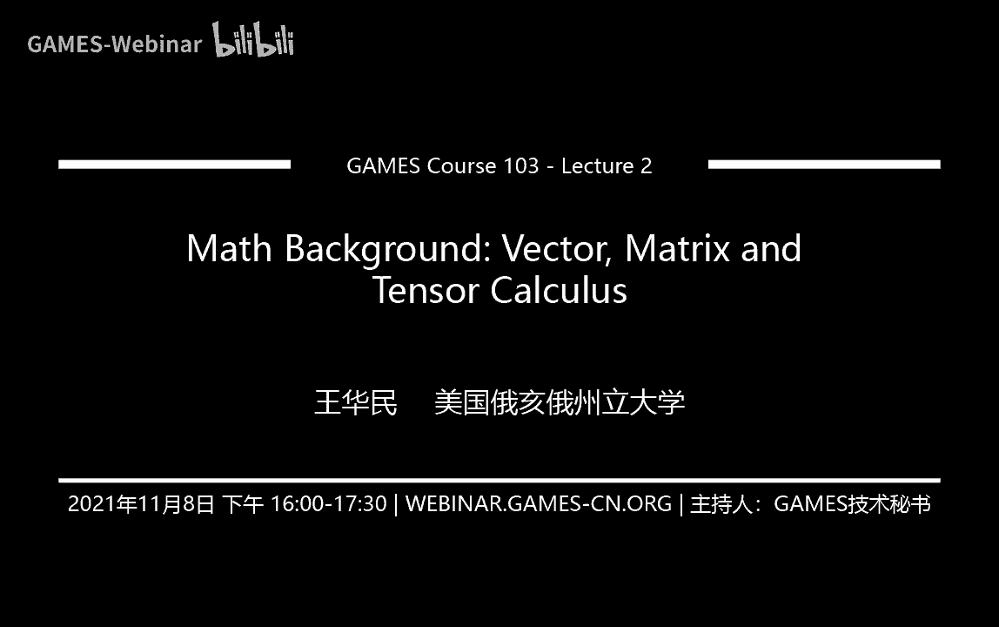
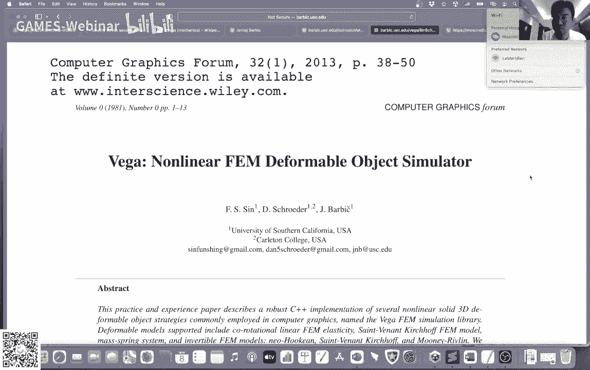
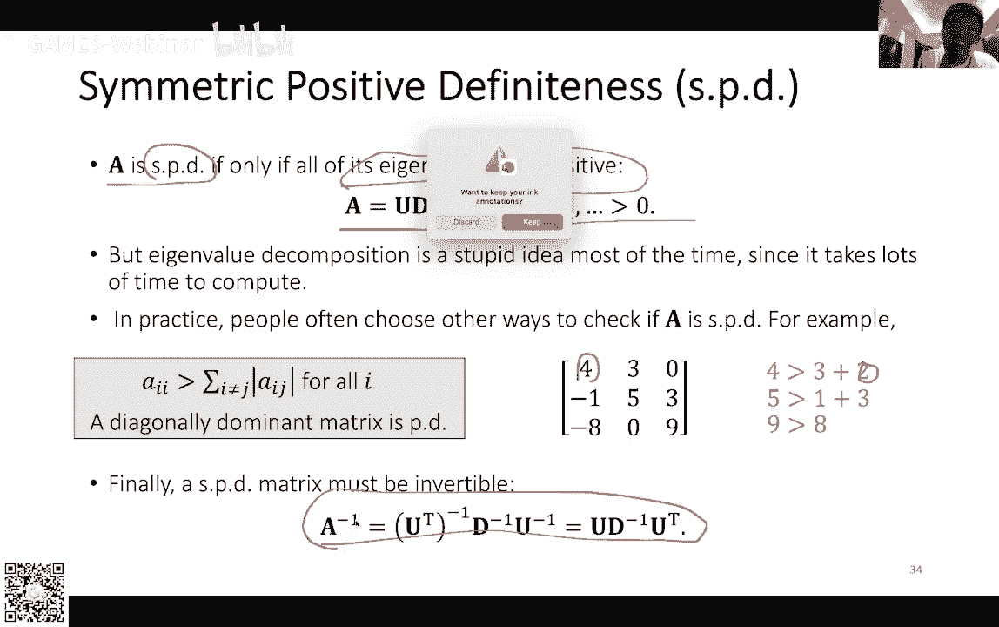

# GAMES103-基于物理的计算机动画入门 - P2：Lecture 02 数学基础：矢量、矩阵与张量微积分 🧮

在本节课中，我们将学习物理模拟中至关重要的数学基础。主要内容分为三部分：矢量、矩阵以及相关的微积分概念。这些知识是理解后续物理模拟算法的基石。

## 矢量（Vector）📐

上一节我们介绍了课程概述，本节中我们来看看矢量。矢量是描述方向和大小的一种数学对象，在二维或三维空间中尤为常见。

### 矢量的定义与表示




一个三维矢量 **p** 可以表示为 **p** = (p_x, p_y, p_z)，它属于实数空间 ℝ³。原点是一个特殊的矢量 **0** = (0, 0, 0)。在印刷体和论文中，通常用**黑体**表示矢量，用*斜体*表示标量，以此区分，而非使用箭头符号。

### 坐标系：左手系与右手系

三维坐标系分为左手系和右手系。在图形学中，两者都有应用。例如，OpenGL通常使用右手系，而Unity和DirectX使用左手系。判断方法遵循“右手定则”或“左手定则”：从x轴转向y轴，大拇指指向的方向即为z轴正方向。

### 堆叠矢量（Stack Vector）

矢量不一定总具有直观的几何意义。例如，一个由11个顶点构成的物体，可以将所有顶点的坐标按顺序排列成一个33维的大矢量 **X** = [**x₀**, **x₁**, ..., **x₁₀**]ᵀ。这个**堆叠矢量**用于描述物体的整体状态，其维度是顶点数与空间维度的乘积。

### 矢量的基本运算

以下是矢量的一些基本运算：

*   **加减法**：对应元素相加减。几何上，矢量加法遵循三角形法则或平行四边形法则。
    *   **p** ± **q** = (p_x ± q_x, p_y ± q_y, p_z ± q_z)
*   **与标量的乘法**：矢量与标量t相乘，表示其缩放。
    *   **p**(t) = **p** + t**v** （描述点沿方向 **v** 的运动）
    *   **p**(t) = (1-t)**p** + t**q** （描述点 **p** 和 **q** 之间的线性插值）
*   **范数（Norm）**：表示矢量的大小。
    *   **2-范数（欧几里得范数）**：‖**p**‖ = √(p_x² + p_y² + p_z²)
    *   **1-范数（曼哈顿范数）**：‖**p**‖₁ = |p_x| + |p_y| + |p_z|
    *   **无穷范数**：‖**p**‖∞ = max(|p_x|, |p_y|, |p_z|)
*   **单位矢量**：范数为1的矢量。任何非零矢量 **v** 可通过 **v** / ‖**v**‖ 进行归一化。

### 矢量的乘法

我们有两种重要的矢量乘法。

**点乘（内积）**
点乘的结果是一个标量。
*   **定义**：**p** · **q** = p_x q_x + p_y q_y + p_z q_z
*   **几何意义**：**p** · **q** = ‖**p**‖ ‖**q**‖ cos θ，其中θ是两矢量的夹角。
*   **性质**：
    *   满足交换律和分配律。
    *   **p** · **p** = ‖**p**‖²。
    *   若 **p** · **q** = 0 且 **p**, **q** 非零，则 **p** 与 **q** 垂直。

**叉乘（外积）**
叉乘的结果是一个新的矢量。
*   **定义**：**r** = **p** × **q** = (p_y q_z - p_z q_y, p_z q_x - p_x q_z, p_x q_y - p_y q_x)
*   **几何意义**：结果矢量 **r** 同时垂直于 **p** 和 **q**，其大小 ‖**r**‖ = ‖**p**‖ ‖**q**‖ sin θ。
*   **性质**：
    *   不满足交换律，**p** × **q** = - (**q** × **p**)。
    *   满足分配律。
    *   若 **p** × **q** = **0** 且 **p**, **q** 非零，则 **p** 与 **q** 平行。

### 点乘的应用实例

点乘在图形学中有广泛的应用。

**点到直线的投影**
给定点 **q** 和过点 **o**、方向为 **v** 的直线。点 **q** 在直线上的投影点 **s** 及其距离标量s可通过点乘求得：
*   s = (**q** - **o**) · (**v** / ‖**v**‖)
*   **s** = **o** + s **v**

**定义平面与有符号距离**
给定平面上一点 **c** 和其单位法向量 **n**，可以定义一个平面。对于空间中任意点 **p**，有符号距离 d = (**p** - **c**) · **n**。d的符号表明了 **p** 相对于平面的位置（上、面上、下），其绝对值是点到平面的真实距离。

**点与球的碰撞检测**
一个沿方向 **v** 运动的点 **p**(t) = **p** + t**v** 与静止的球（球心 **c**，半径 r）发生碰撞时，满足方程 ‖**p**(t) - **c**‖² = r²。将其展开并利用点乘性质，可得到一个关于时间t的一元二次方程，通过求解该方程即可判断碰撞是否发生及发生的时间。

### 叉乘的应用实例

叉乘同样在图形学中扮演关键角色。

**三角形的面积与法向**
给定三角形顶点 **x₀**, **x₁**, **x₂**，定义两条边向量 **e₁₀** = **x₁** - **x₀**, **e₂₀** = **x₂** - **x₀**。
*   **法向量**：**n** = (**e₁₀** × **e₂₀**) / ‖**e₁₀** × **e₂₀**‖
*   **面积**：A = ½ ‖**e₁₀** × **e₂₀**‖

**点与三角形的位置关系（内外测试）**
要判断点 **p** 是否在三角形 **x₀**, **x₁**, **x₂** 内部，可以检查由 **p** 与三角形每条边构成的小三角形的法向是否与大三角形法向 **n** 同向。具体通过计算三个标量值来判断：
*   a₀ = **n** · ( (**x₁** - **p**) × (**x₂** - **p`) ) / 2
*   a₁ = **n** · ( (**x₂** - **p**) × (**x₀** - **p`) ) / 2
*   a₂ = **n** · ( (**x₀** - **p**) × (**x₁** - **p`) ) / 2
若 a₀, a₁, a₂ 同号（通常为正），则 **p** 在三角形内部。这些a值实际上是带符号的面积。

**重心坐标（Barycentric Coordinates）**
将上述符号面积 a₀, a₁, a₂ 除以三角形总面积 A，可得到重心坐标权重 (b₀, b₁, b₂)，满足 b₀ + b₁ + b₂ = 1。三角形内任意点 **p** 的位置可由其顶点插值得到：**p** = b₀ **x₀** + b₁ **x₁** + b₂ **x₂**。这在渲染中进行颜色插值（如Gouraud着色）时非常有用。

**四面体的体积**
给定四面体四个顶点 **x₀**, **x₁**, **x₂**, **x₃**，其（带符号的）体积 V 为：
*   V = (1/6) ( (**x₁** - **x₀**) × (**x₂** - **x₀`) ) · (**x₃** - **x₀**)
体积的正负由顶点顺序决定，为零则表示四点共面。类似于三角形，也可以定义四面体的重心坐标。

**点与三角形的碰撞检测（进阶）**
结合点面相交和内外测试，可以检测运动点与三角形是否碰撞。首先，求解点 **p**(t) 与三角形所在平面的交点时间 t（令四面体体积公式为零）。然后，将交点代入三角形内外测试公式，检查其是否在三角形内部。

---

## 矩阵（Matrix）🔲

上一节我们深入探讨了矢量及其运算，本节中我们来看看矩阵。矩阵可以看作是一组矢量的有序排列，是描述线性变换的强大工具。

### 矩阵的基本定义与运算

一个3x3的实数矩阵 **A** 可以表示为：
```
A = [ a₀₀ a₀₁ a₀₂ ]
    [ a₁₀ a₁₁ a₁₂ ]
    [ a₂₀ a₂₁ a₂₂ ]
```
以下是矩阵的一些基本概念和运算：

*   **转置（Transpose）**：交换矩阵的行和列，记作 **A**ᵀ。
*   **对称矩阵**：满足 **A** = **A**ᵀ 的矩阵。
*   **对角矩阵**：非对角线元素全为零的矩阵。
*   **单位矩阵**：对角线元素全为1的对角矩阵，记作 **I**。任何矩阵或矢量与 **I** 相乘保持不变。
*   **矩阵乘法**：不满足交换律（**AB** ≠ **BA**），但满足结合律。
*   **逆矩阵**：若存在矩阵 **B** 使得 **AB** = **BA** = **I**，则 **B** 是 **A** 的逆矩阵，记作 **A**⁻¹。并非所有矩阵都可逆。

### 图形学中的特殊矩阵

在图形学中，以下几类矩阵尤为重要。

**正交矩阵（Orthogonal Matrix）**
一个矩阵 **A** 是正交矩阵，如果其列向量（或行向量）是两两正交的单位向量。正交矩阵有一个非常好的性质：**A**ᵀ = **A**⁻¹。在图形学中，**旋转矩阵**就是正交矩阵。它将物体的局部坐标系（**x**, **y**, **z** 轴）旋转到世界坐标系中的新方向（**u**, **v**, **w**），即 **A** = [**u** **v** **w**]。

**缩放矩阵（Scaling Matrix）**
缩放矩阵是一个对角矩阵 **D**，其对角线元素 (d_x, d_y, d_z) 分别表示在x, y, z轴方向上的缩放因子。

### 矩阵分解

矩阵分解帮助我们理解线性变换的本质。

**奇异值分解（Singular Value Decomposition, SVD）**
任何矩阵 **A** 都可以分解为 **A** = **U D V**ᵀ。其中 **U** 和 **V** 是正交矩阵，**D** 是对角矩阵（元素称为奇异值）。**SVD的几何解释**：任何线性变换都可以通过三个步骤实现：1. 旋转（**V**ᵀ）；2. 沿坐标轴缩放（**D**）；3. 再次旋转（**U**）。

**特征值分解（Eigenvalue Decomposition）**
对于**对称矩阵** **A**，可以分解为 **A** = **U D U**ᵀ。其中 **U** 是正交矩阵，其列向量为特征向量；**D** 是对角矩阵，对角线元素为特征值。这可以看作是SVD在对称情况下的特例。

### 对称正定矩阵（Symmetric Positive Definite, SPD）

对称正定矩阵在求解物理模拟中的线性系统时至关重要。
*   **定义**：一个对称矩阵 **A** 是正定的，如果对于任何非零矢量 **v**，都有 **v**ᵀ**A** **v** > 0。若 **v**ᵀ**A** **v** ≥ 0，则为半正定。
*   **直观理解**：正定矩阵可以类比为正实数。一个对角元素全为正的对角矩阵显然是正定的。通过特征值分解可知，一个对称矩阵是正定的，当且仅当其所有特征值均为正。
*   **性质与判定**：
    *   正定矩阵必然可逆。
    *   若矩阵**对角占优**（即每一行/列上，对角线元素的绝对值大于该行/列其他元素绝对值之和），则该矩阵是正定的（这是一个充分条件，非必要条件）。

---

## 总结 📝

本节课我们一起学习了物理模拟所需的数学基础。我们从**矢量**的定义、运算（点乘、叉乘）及其在几何计算（投影、距离、碰撞检测）中的应用开始。然后，我们探讨了**矩阵**，包括其基本运算、图形学中特殊的旋转与缩放矩阵，以及重要的矩阵分解（SVD和特征值分解）。最后，我们介绍了在后续求解线性系统中非常关键的**对称正定矩阵**的概念。



这些数学工具是构建物理模拟算法的语言。理解它们将帮助我们更好地学习后续关于刚体模拟、有限元方法等内容。下节课我们将继续讲解张量微积分和线性系统求解，并逐渐过渡到具体的物理模拟实践。