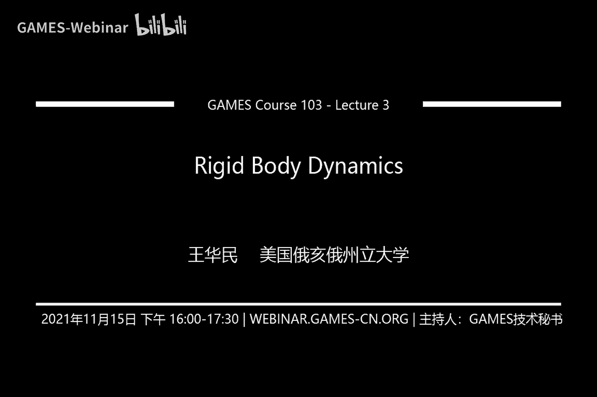
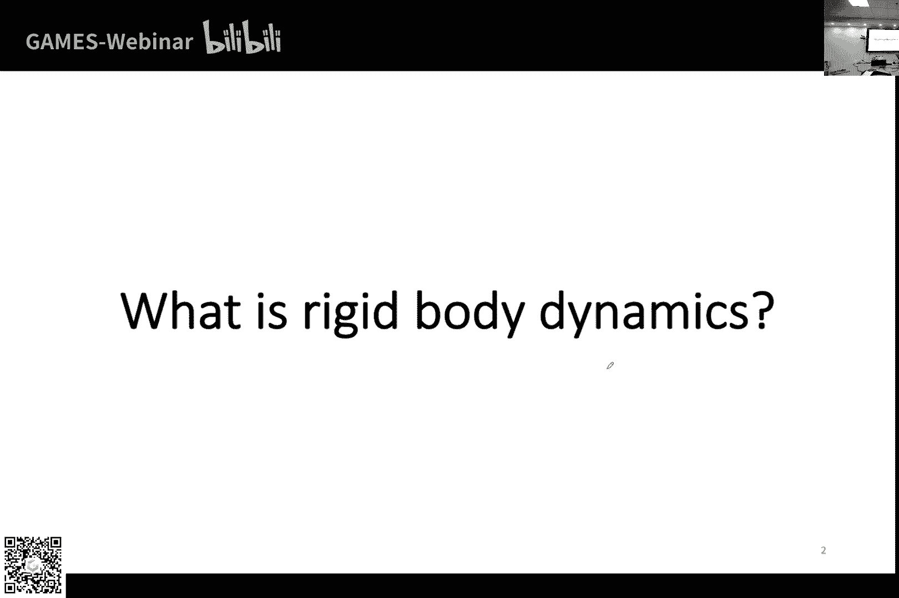
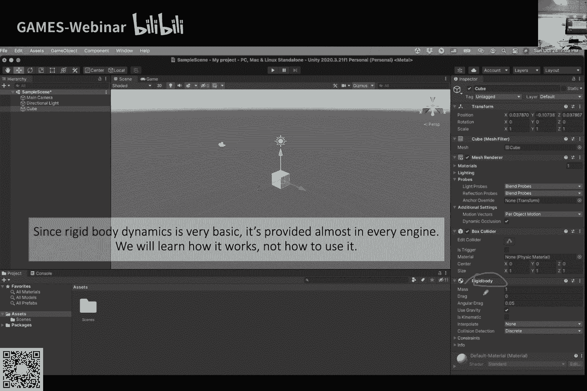
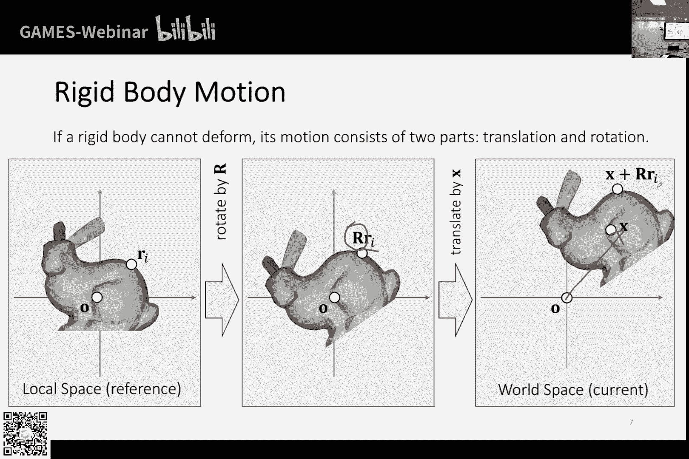
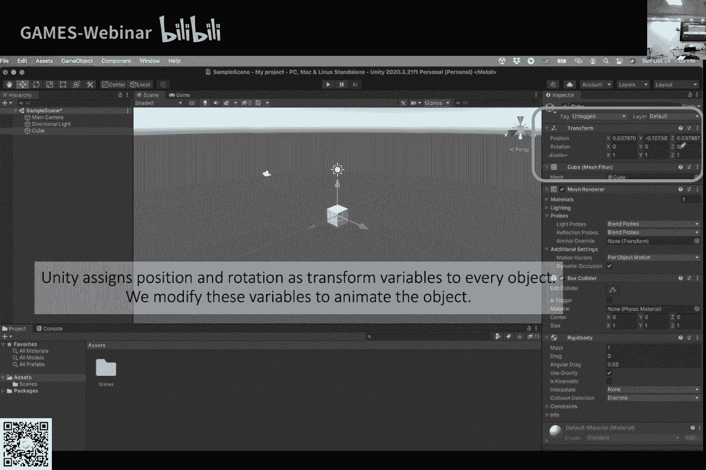
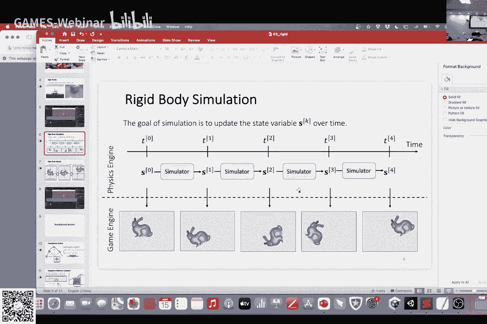

# GAMES103-基于物理的计算机动画入门 - P3：Lecture 03 刚体动力学 🚀

在本节课中，我们将学习刚体动力学的基础知识。课程内容分为两部分：首先回顾并完成上周关于线性代数和微积分的数学基础，然后深入探讨单个刚体的运动模拟，包括平移和旋转。

## 数学基础回顾与补充 📐

上一节我们介绍了矩阵正定性等概念，本节中我们来看看线性系统和微积分在物理模拟中的应用。

### 矩阵正定性示例

以下是一个证明示例：若矩阵 **A** 对称正定，则矩阵 **B** 也半正定。

**B** 的形式为：
```
B = [ A, -A;
     -A,  A ]
```

证明过程如下：
1.  设任意向量可拆分为两部分：`[x; y]`。
2.  根据半正定定义，需证明 `[x^T, y^T] * B * [x; y] >= 0`。
3.  展开计算可得：`(x - y)^T * A * (x - y)`。
4.  由于 **A** 正定，上式恒大于等于零（当 `x = y` 时等于零）。
5.  因此，**B** 半正定。

此结论在模拟中很有用，因为许多系统矩阵具有类似结构。

### 线性系统求解

许多数学问题最终归结为求解线性系统 `Ax = b`，其中 **A** 是矩阵，**b** 是边界条件向量，**x** 是未知向量。

直接计算 **A** 的逆矩阵通常不可行，因为计算量大且逆矩阵可能失去稀疏性。主要有两类方法：

#### 1. 直接法（如LU分解）

直接法将矩阵 **A** 分解为下三角矩阵 **L** 和上三角矩阵 **U** 的乘积：`A = LU`。

求解分两步：
1.  解 `Ly = b`（前向代入）。
2.  解 `Ux = y`（后向代入）。

以下是前向代入的伪代码示例：
```python
# 假设 L 是下三角矩阵，b 是已知向量
y = zero_vector(n)
for i in range(n):
    sum = 0
    for j in range(i):
        sum += L[i][j] * y[j]
    y[i] = (b[i] - sum) / L[i][i]
```

直接法特点：
*   矩阵稀疏性影响分解结果。
*   计算分分解和求解两步，若 **A** 固定可复用分解结果。
*   并行化相对困难。
*   常用库：Intel MKL Pardiso。

#### 2. 迭代法

迭代法通过不断更新 **x** 来逼近解，基本形式为：
```
x_{k+1} = x_k + α * M^{-1} * (b - A * x_k)
```
其中 `α` 是松弛系数，`M` 是易于求逆的矩阵（如 **A** 的对角部分），`(b - A*x_k)` 是残差。

迭代法收敛条件与矩阵的谱半径有关。常用方法包括雅可比法（取 **M** 为 **A** 的对角线）和高斯-赛德尔法（取 **M** 为 **A** 的下三角部分）。

迭代法与直接法对比：
*   **优点**：易于实现、易于并行、适合不求精确解的场景。
*   **缺点**：存在收敛性问题、求精确解可能较慢。

### 微积分基础

本节回顾向量微积分，为后续内容做准备。

#### 梯度

对于标量函数 `f(x)`，其梯度 `∇f` 是一个向量，指向函数值增长最快的方向。
```
∇f = [ ∂f/∂x, ∂f/∂y, ∂f/∂z ]^T
```

#### 雅可比矩阵、散度与旋度

对于向量函数 **F(x)**，其雅可比矩阵 **J** 包含所有一阶偏导。

散度 `div(F)` 是雅可比矩阵的迹（对角线之和）。旋度 `curl(F)` 描述了场的旋转特性，在流体模拟中用于漩涡计算。

#### 泰勒展开

函数 `f(x)` 在 `x0` 处的泰勒展开为：
```
f(x) ≈ f(x0) + ∇f(x0)^T (x - x0) + 1/2 (x - x0)^T H(x0) (x - x0) + ...
```
其中 **H** 是海森矩阵（二阶偏导矩阵）。矩阵的正定性与海森矩阵相关，决定了函数在该点的凹凸性。

#### 实例：弹簧模型

考虑一维弹簧，原长 `L`，弹性系数 `k`。当前位置为 `x`，则弹簧能量 `E` 和力 `F` 为：
```
E = 1/2 * k * (|x| - L)^2
F = -∇E = -k * (|x| - L) * (x / |x|)
```
力的方向沿弹簧轴向，大小与形变成正比。

进一步求力关于位置的导数，可得到刚度矩阵（海森矩阵）：
```
∂F/∂x = k * [ (x*x^T)/|x|^2 + ( (|x|-L)/|x| ) * (I - (x*x^T)/|x|^2 ) ]
```
对于多顶点系统，所有变量和力可组合成大向量和大矩阵，其刚度矩阵具有分块形式，与我们开头证明的矩阵形式相似。

## 刚体动力学 🤖



上一节我们完成了数学基础的铺垫，本节中我们来看看刚体运动的核心原理。



### 刚体状态描述

刚体运动包括平移和旋转，无形状变化。其状态由两部分描述：
1.  **位置** `x`：一个三维向量，描述物体中心的位置。
2.  **旋转** `R`：描述物体的朝向。可用旋转矩阵、欧拉角或四元数表示。

在Unity中，物体的 `Transform` 组件包含了 `position` 和 `rotation` 属性，分别对应位置和旋转（内部用四元数存储）。



### 运动方程与时间积分



刚体运动遵循牛顿定律。我们有两个核心变量：
*   速度 `v = dx/dt`
*   角速度 `ω` （描述旋转快慢和轴）

运动方程（积分形式）为：
```
v_new = v_old + (1/m) * ∫ F dt
x_new = x_old + ∫ v dt
```
其中 `F` 是合力，`m` 是质量。

#### 数值积分方法

求解积分需用数值方法。以一维速度积分 `∫ v dt` 为例，即估算速度曲线下的面积。

1.  **显式欧拉法**：用起始时刻速度估算。
    ```
    ∫ v dt ≈ v(t0) * Δt
    ```
    一阶精度，可能低估面积。

2.  **隐式欧拉法**：用结束时刻速度估算。
    ```
    ∫ v dt ≈ v(t1) * Δt
    ```
    一阶精度，可能高估面积。

3.  **中点法**：用中间时刻速度估算。
    ```
    ∫ v dt ≈ v(t0 + Δt/2) * Δt
    ```
    二阶精度，更精确。

对于刚体模拟，常采用一种“蛙跳”格式，交替更新速度和位置，本质上等价于对两者都使用中点法。

### 平移运动模拟

模拟平移运动的更新步骤如下：

1.  计算所有顶点上的合力 `F_total`。
2.  更新速度：`v_new = v_old + (F_total / m) * Δt`。
3.  更新位置：`x_new = x_old + v_new * Δt`。

常见的力包括：
*   **重力**：`F_gravity = m * g`，方向竖直向下。
*   **空气阻力**：可简化为对速度的衰减，如 `v_new = 0.99 * v_old`，简单且稳定。

### 旋转运动模拟

旋转的模拟更为复杂。

#### 旋转的表示

我们推荐使用**四元数 `q`** 表示旋转。它由实部 `s` 和虚部向量 `v` 构成：`q = [s, v]`。一个绕单位轴 `n` 旋转 `θ` 角度的四元数为：
```
q = [cos(θ/2), sin(θ/2) * n]
```
Unity 内部即使用四元数，可通过 `Transform.rotation` 访问。

#### 旋转运动方程

旋转的模拟需要以下物理量：
*   **力矩 `τ`**：力引起旋转的“推力”。对于顶点 `i`，力矩 `τ_i = r_i × F_i`，其中 `r_i` 是从质心到顶点的向量。总力矩为所有顶点力矩之和。
*   **惯性张量 `I`**：旋转中的“质量”，是一个3x3矩阵。它依赖于物体的形状和质量分布。惯性张量从物体参考坐标系变换到世界坐标系的公式为：`I_world = R * I_ref * R^T`。

旋转的更新步骤如下：
1.  计算总力矩 `τ_total`。
2.  更新角速度：`ω_new = ω_old + I^{-1} * τ_total * Δt`。
3.  更新旋转四元数：`q_new = q_old + (Δt/2) * [0, ω] * q_old`。注意这里是四元数乘法。
4.  对 `q_new` 进行归一化，保持其为单位四元数。

### 刚体模拟器框架

一个完整的刚体模拟器在每个时间步需执行以下操作：

**平移部分**：
1.  计算合力 `F`。
2.  `v = v + (F / m) * Δt`
3.  `x = x + v * Δt`

**旋转部分**：
1.  计算总力矩 `τ`。
2.  `ω = ω + I^{-1} * τ * Δt`
3.  `q = q + (Δt/2) * Quaternion(0, ω) * q`
4.  `q = q.Normalize()`

在Unity中实现时需注意：
*   位置 `x` 对应 `Transform.position`。
*   旋转 `q` 对应 `Transform.rotation`。
*   速度 `v` 和角速度 `ω` 需在自定义脚本中声明和更新。
*   Unity 提供四元数乘法，但不直接提供四元数与标量乘法或加法，需手动对四个分量操作。
*   Unity 的 `Matrix4x4` 类可用来进行矩阵运算，但需注意其是4x4矩阵。

### 实现建议

1.  **分步实现**：先实现平移运动，再实现旋转运动。测试旋转时，可先固定角速度 `ω` 为常数，验证旋转更新正确后再加入力矩计算。
2.  **注意归一化**：更新四元数后务必进行归一化，防止数值误差累积。
3.  **重力与旋转**：均匀重力场中，重力不产生力矩，因此重力不会使物体自发旋转。

## 总结 🎯

本节课中我们一起学习了刚体动力学模拟的核心内容。

我们首先补充了相关的数学基础，包括通过示例理解了特定结构矩阵的正定性、线性系统求解的直接法与迭代法，以及向量微积分在物理公式推导中的应用。


接着，我们深入探讨了刚体模拟。刚体的状态由位置和旋转描述。我们学习了使用四元数表示旋转的优势和方法。运动模拟的核心是对运动方程进行时间积分，我们介绍了几种积分方法及其精度。对于平移运动，我们给出了基于力的更新步骤。对于更复杂的旋转运动，我们引入了力矩和惯性张量的概念，并给出了基于四元数和角速度的更新流程。



最终，我们整合出了一个刚体模拟器的基本框架。掌握这些原理，是编写一个简单刚体物理引擎的基础。在接下来的课程中，我们将探讨刚体之间的碰撞检测与响应问题。