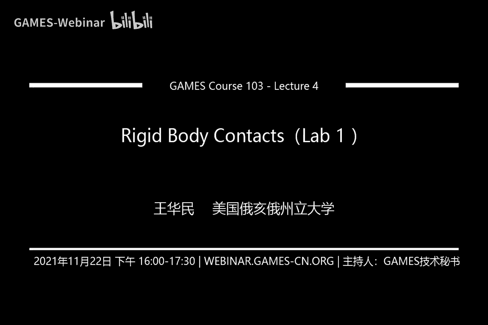
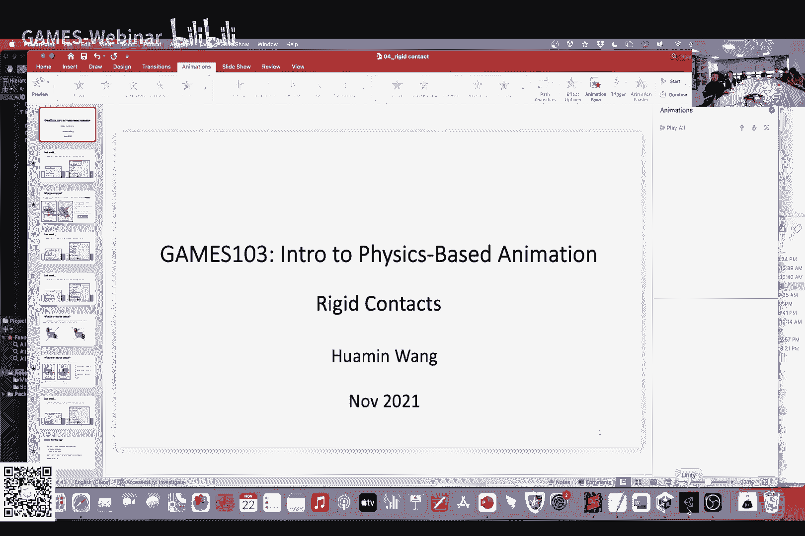
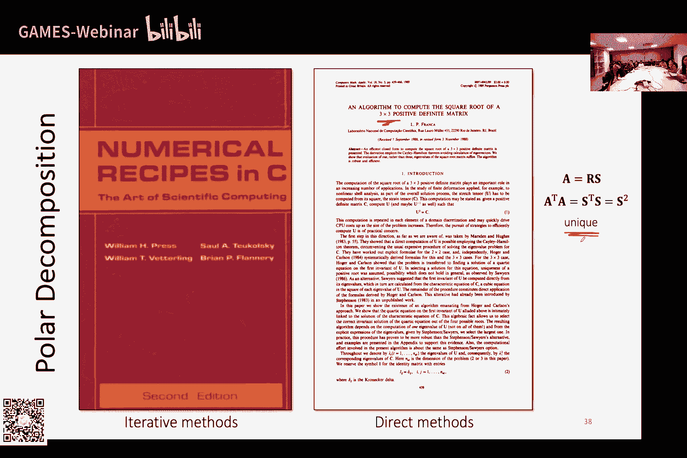
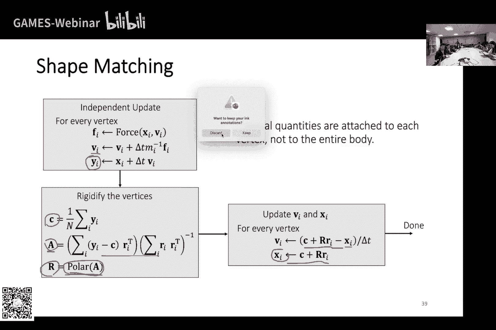

# GAMES103-基于物理的计算机动画入门 - P4：Lecture 04 Rigid Body Contacts (Lab 1) - GAMES-Webinar - BV12Q4y1S73g

行吧，那反正反正差不多我们就先开始吧，然后呃今天反正呃四个事情吧，第一个事情是我们把作业先交代一下，因为今天算是我们的第一次作业嘛，嗯然后第二个事情是我想把我们上次我们讲的那个刚体模拟。

但是讲的比较时间比较仓促，就是尤其是我看到有一些同学呃好像没有上过大学物理吧，所以说我想把呃，但我们肯定不可能讲的很细，但是我想简单的把基本的概念给大家过一下，就是相当于有一个有一个基本的概念。

尤其是没有上过大学物理的同学，然后呢就是我们今天的一个呃话题了，主要就是讲这个呃缸体碰撞，我们今天主要就是呃来设计这一块，然后先给大家看就是那个作业嘛，哦对了，作业奖品大家都知道吗。

就是根据我们我们根据最后那个呃作业的完成度，我们会有会有奖品奖励啊，然后那个应该是在那个微信群里面就有个公告的，大家应该都看到了，然后给大家看一下那个最后作业做成是一个什么样子。

就是嗯到时候从那个从课程的那个微信群里面，应该大家可以下到一个呃小的一个程序，就是一个unity的一个脚本，然后unity脚本的话，如果说你直接运行它其实是没效果的，但如果说你完成了这个作业之后呢。

呃你运行这个呢，你就可以把这个兔子拿去撞墙啊。

就是比如说这样，然后你按l那个兔子就会撞到墙上，然后掉下来，然后你可以再把它继续做再重置啊，然后就继续，啊继续把这个兔子拿去撞墙，就是最后做出来是这样的一个效果，就线上的同学能看清楚吗，这个动画。

可以啊行，然后这个整个作业其实整个大环境unity的大环境都是已经搭配好了的，呃唯一你需要做的就是把这个脚本完成，就是我们这里到时候会有一个叫做rigid body，rigid body的一个脚本吗。

你的任务是把这个脚本完成啊，然后在这个脚本里面呃，其实我提供了一些呃比较基本的功能是需要你用到的，比如说怎么计算那个inertial矩阵，还有几呃，怎么样计算cross product matrix。

就是我们今天会课上会讲到的一些东西，其实这个脚本里都提供了的，所以说你不需要自己写，你到时候可以去看一下啊，这些功能，然后看看怎么样用到你的这个作业里面，当然你不用那个东西没关系。

如果说你自己什么都想自己写，也没有问题，完全可以啊，这是一个呃，这是这是basic task，然后还有一个高级任务，就是我们一个附加题，附加题呢就是呃实现力的呃。

就是怎么用一个叫做shape match的一个方式来做这个呃钢铁的模拟，那这个这个方式有什么特点，这个方式的特点就是它里面没有任何物理，就是尤其是可能对没有学过大学物理的同学，可能这是一个利好。

就这个方式它跟物理一毛钱关系都没有，他完全就是一个基于图形学，然后基于优化的一个方法，我们也会讨论这个方法，怎么样用那个呃呃这个shape match的这个技术来做模拟，然后呢这是一个附加题。

如果说大家完成这个附加题的话，会有三分，我记得好像是就是额额外的会有三分呃，然后你怎么用这个东西呢，就是你可以到这个default，你把你点这个default，这个default是把你的mesh吗。

然后你看现在我们用的这个脚本叫做rigid barney对吧，在这个地方呃，然后我把它关掉，然后用shape matching，你可以看到就是我重新启动一下啊，重新启动一下。

你就会看到就是用另一种方式去模拟的，就是你可以看到它是用另一种方式去模拟，但是你看这个方式它其实是有点瑕疵的，它它不像那个呃前面那种方式，就是它的整个缸体运动，它是比较在地面运动比较自然的。

就是接触的时候比较自然，他有一点轻微的滑动，大家如果仔细观察到的话，可以看到他最后停下来的时候，其实是稍微有点略带一点滑动的，这个本身是因为shape matched的这种方式导致的。

就是他在处理一些摩擦的时候，它会没有像呃直接做基于物理的那种呃接触的那么呃方式那么好，所以说我们其实今天也会讨论到这个问题，然后大概给大家看一个这样的效果，是这样子的，然后作业是呃两个礼拜。

就是大家有两个礼拜的时间去完成，然后呢呃其实总的来说作业的呃工作量是不高的，就是基本上就如果说你是知道怎么写的话，你知道知道答案的话，其实你呃大概知道怎么个做法的话，其实你一个下午绝对得搞定。

但是呢呃难就难在就是可能就是你不知道，就是说大概大概是一个怎么样的流程，然后或者是有些东西你可能想要进一步的了解，那么你可能需要去花一点时间去把这些文献可能都看一遍，这些东西是要花时间的。

然后对于呃就是之前没有接触过unity的同学来说的话，可能是需要花一点时间去把unity怎么操作的，也需要了解一下这个这个也是可能是一份额外的工作吧，就是尤其是可能之前没做过unity的同学。

那我就建议就是最近一段时间，最近几天可以先把unity下载了，然后起码就是把一些unity的简单的一些呃动画的一些脚本啊，它那个场景怎么搭配啊，这些简单的一些教程先给他看一下。

这样子你起码就是不至于说就是完全一头雾水，不知道从哪里开始，然后呢就是对于对于我知道，我知道有的同学可能是零基础嘛，没有任何图形学基础，但是也不用担心，就是无非就是说时间上花的多，花的少的区别。

就是不见得说就是有基础的同学就会相对来说完全更容易一点，零基础的呃更简单更难一点，不存没有这个存不存在这个问题，只不过就是呃时间上需要多花一点，大家之前有没有用过unity，有用过unity同学吗。

我看看不是很多是吧，有有什么问题吗，有作业这一块，我看看线上，线上没有问题啊，呃unity有什么教程，unity有什么教程，我记得你你去啊，你去搜一下，我记得有很多这种各种各样的教程，关于动画的教程。

基本上你看上两三个，基本上就是挺了解的了哦，或者到时候我可以叫助教，到时候也可以发一些教程给在群里面给大家供参考吧，然后有同学问作业可以用open gl写吗，可以用1a real写吗，可以的。

就是说如果说你自己像就是把这个框架自己写，这个完全没有问题，你也可以用open gl或者是unreal写，只不过这个环境什么的都需要你自己去搭配，可能可能花的时间就会更长一点。

这里的角速度是自己初始化吗，可以你可以自己初始化一个角速度，对然后公式都在ppt里，就是理论上就是ppt涵盖了所有你需要完成作业的内容，就是你不需要理论上是你不需要去参考其他的文献呢。

就所有的东西都在ppt里作业，不用约束，不会穿模吗，其实是有一点穿模的，只是不是不太明显，就是你会看到这个兔子跟地面，就是尤其是耳朵跟地面会有一些轻微的穿模，这个其实跟我们的实现方法是有关系的。

我们到时候今天嗯会慢慢会讨论到这些这些问题啊，这个不影响，就是，这个不会有影响，就是只要你完成的效果是一样的，就可以，好吧没有问题的话，我们就继续往下讲了，就第一个就是我呃。

首先我想首先我想把我们上次讲了什么简单的先回顾一下啊，就上次我们就是给了我最后的时候就给了大家这么两个算法嘛，就是分别对应的就是线性运动跟旋转运动的这两个呃方法嘛对吧，然后左边的这个线性运动就是基于利。

基于牛顿，这个其实跟大家高中物理学过的知识是对应起来的，就如果这个都搞不懂的话，我就建议大家回去把高中在屋里再重新看一下吧，呃然后他一个他这个怎么做呢，就是首先我们根据某一些呃模型，我们计算一个例啊。

对于每个顶点可能都有一个力，那么我们把这些例算一下，有重力有有，比如说用户给他砸了一圈，然后撞在这个兔子上，然后有什么有什么各种各样的力吗，我给他立先算一下，然后完了之后呢，我对力求和对吧。

我把总的力算出来，然后有总的力之后呢，我把那个我根据牛顿定律，我把力除以质量，再乘以时间不长，我就得到了对速度的更新，然后我就把速度更新了一下，然后有了速度，新的速度，更新过后的速度呢。

我把速度乘以时间不长，我得到了对位置的更新，我就把位置更新一下，这个其实就是呃基于咱们高中物理所学过的知识，我做了一个呃简单的一个呃兔子的这个平移运动的一个模型吧。

那么上节课其实这块讲的相对右边这块讲的相对来说比较少，因为呃有些嗯因为时间也比较短，然后我注意到可能大家有的同学可能对大学物理这块没学过，所以说我想把这一块稍微给大家回顾一下。

然后这一块其实跟左边这块其实可以对应起来看，因为左边是呃平移的运动，右边是旋转的运动，然后它左边右边其实都有对应关系的，那么首先第一个呢就是力，咱们左边的时候算的是每一个顶点的力对吧。

我们知道这个历是什么，历史实际上是造成这个物体运动的一种趋势吗，那么右边我们同样也有这么一个东西，只不过这个东西它不是力，它是例句，那么它这个例句呢是呃跟力很像，它是造成物体旋转的一种趋势。

那么公式在这里啊，那么什么是一个物体旋转的趋势呢，呃我觉得大家可以这么小，就是说假如说我有一个陀螺，我这边画了一个陀螺对吧，然后这个这个点呢是它的呃志鑫，然后这个呢是一个我施加力的一个位置。

然后假如说我现在在当前的状态上，我给这个点施加了一个这个方向的力，那么我就会把这个陀螺给转起来嘛对吧，就是大家就想就是我这样子从侧面去推这么一个陀螺，陀螺会呃旋转起来，会造成陀螺的旋转。

那么如果看这个图，看这个示意图，这个陀螺会以一个什么样的方式旋转呢，如果说我从陀螺的上面往下看的话，那么他应该会做一个类似这种样子的旋转，对不对，应该是一种逆时针的旋转。

那么在这里我定义旋转的这个例句的时候，也就是说造成旋转的这种趋势的时候呢，我需要考虑到就是它的旋转轴，这个实际上是我们在决定它的这个旋转方式，因为轴是旋转，对于旋转而言。

它的旋转轴就是相当于决定了它的旋转方式，那么这个力矩的大小呢就决定了这种趋势的大小，就是它这个旋转的造成它这个旋转到底猛不猛对吧，我们就我们就用它这个力矩的大小来描述它这个旋转到底猛还是不猛。

那么根据这种情况呢，首先我们可以看就是我们的旋转轴大概是这么一个方向，它是这么一个旋转嘛，逆时针的这么一个旋转模式嘛，那么我的旋转轴就应该是朝着这个方向的呃，那么很自然就大家会观察到。

就是说呃这个例句的方向啊，它跟我们的力，还有跟我们的这个向量，就是从智星到作用点的这个向量应该都是垂直的，这个当然我就不解释了，就是只是给大家一个直观的一个感受啊。

就是说这个旋转轴应该是跟这两个向量都是垂直的，那么这两个向量分别是什么呢，一个是利对吧，我知道是f i，这个就是利嘛，然后另一个是从志兴到作用点的这个位置，这个向量。

那么这根向量就是呃r大写的r乘以ri，那这里的大写的r呢是描述它陀螺当前姿势的一个矩阵，就是一个某一个旋转矩阵，然后我把这个矩阵乘以这个原来在参照物的状态下的这个笑料。

我就得到了新的从智星到作用点的这个向量的，所以说它是tall，是垂直于这个跟这个的，然后呢呃这里我知道了to的方向，力矩的方向，那么例句的大小跟什么有关呢，首先例句的大小跟这两个向量的大小都有关系。

嗯跟这个有关，很显然因为力越大，我的力矩越大嘛对吧，我力越大，那么理论上我这个产生的力旋转的趋势也呃更激烈一点，然后这个呢是从原点到作用点的距离，理论上我的作用点距离越长越远，那么我产生的力矩也越大。

因为这个就跟杠杆原理一样，我就是我我推的那个点，我跟中心的位置越远，那么我产生了旋转的那个效果也更明显啊，有个同学问，怎么理解这个r这个大写的r就是我们描述当前状态的那个旋转矩阵。

只不过之前我们上节课的时候，我们讨论用quaternion去描述这个当前的姿势嘛，然后一样的道理就是我们这两个其实是可以换算的，就是他俩都可以描述这个当前的姿势，只不过这个地方我用旋转矩阵去描述。

然后呢引擎内部呢我用quorian去描述对，就刚才有个同学就也回答了，就是这个ri是固定的，就是我们这个reference状态下的这个是固定的，而这个r呢是随着时间变化而变化的。

因为我们的cortne随着时间变化而变化，所以我们这个旋转矩阵也随着时间变化而变化，所以说这个最终我们这个食量也就随着时间变化而变化，好了我们现在知道了，说我们的例句跟这两个大小有关。

然后其次呢就是说它跟它的这个sin theta，也就是这两个向量之间的夹角，你有关系，就其实大家可以这么想，就是说理论上我的力如果是垂直于这个方向的话，是不是产生的旋转效果就是最最好的。

当我垂直于这个就像我一个陀螺一样，我当时当当我切着这个他的这个作用点推的时候，它是最能够让它旋转的，如果说我是朝着这个至新推的，那我就产生不了任何旋转，所以说我理论上我这个越接近于90度呃。

我越能够产生旋转，所以说它也是垂直于呃，跟这个sin theta是成比例的，所以说最终我们得到的一个公式就是跟他俩的cross cross product相关。

当然这个东西呢其实在那个我们在学大学物理的时候，其实会学到嘛，就是学旋转的时候学到例句，怎么计算例句的时候应该是会学到的，只是我相当于给大家一个直观的感受，跟这些呃跟这些东西是有关系的。

好我们接下来我们现在有了例句，嗯有同学问这个r是由f引起的吗，不是这个r是一个当前的一个状态，就比如说我这个呃陀螺是歪的倾斜的，那么它可能这个倾斜是之前的运动造成的，这个我不知道。

但是反正就是说当前这个状态下，我这个陀螺倾斜了，跟我的这个reference状态不一样了，那么倾斜之后呢，我怎么去描述这个倾斜呢，我就通过这个大写的r跟这个cturnal来描述他这个当前的这个倾斜的。

这个呃这个状态，然后呢我对有了例句之后呢，我对例句求和，我就可以得到总的例句啊，这个跟这个跟力的方式是一样的，咱们算力的时候也可以求和吗，我算例句的时候其实也是可以求和的，就把总的例句给算出来。

然后有了例句之后呢，我接下来就是要对小速度做一个更新了，那我们在算线性的时候，我们牛顿定律是力除以质量吗，对吧，那我们这边其实也很像，我对例句除以这个inertial，只不过这个我不是真的图啊。

为什么不是真的图，因为我这里的initial它不是一个一个常数，它是一个矩阵，那这个问题我在想可能有的同学就会问，就说为什么这里我不是一个常数，而是一个矩阵对吧，这是因为我们的旋转实际上是跟我的方向。

它的当前的状态旋转轴是有关系的，我这里给大家举个例子，就是说其实为什么是inertial，这个inertial其实就是一种对旋转趋势的抵抗，就大家可以想，比如说我施加一个力在这个兔子上。

然后想让这个呃兔子给转起来吗，那么我赢了，实际上就是在阻止这个旋转产生，或者我尽量让这个旋转变弱，那么假如说我现在有这么一个呃一个兔子对吧，呃我有一个例句，同样的是有一个例句。

只不过这个例句呢左边这个情况呢是朝这个方向的，右边这个情况是朝这个方向的，然后呢假如说我现在这个兔子，我在头部跟尾部呢都装两个很重很重很重的砝码，所以说这两个兔子你可以认为这两个东西非常非常重。

头跟尾都非常重，其他的地方非常轻，那么大家注意啊，这个例句首先大小是一样的，那么它们产生的旋转一不一样，就是旋转的这个大小幅度一不一样，大家觉得，那什么样左边的产生的旋转更猛一点。

还是右边的旋转更猛一点，是不是应该是右边的对吧，因为为什么，因为在右边这种情况下，它这个质量都集中在这个轴上面，所以说当我产生这个我施加这个例句的时候，左右边这种情况它产生的这个抵抗是比较小的。

所以说它的旋转会更快一点，更猛一点，而左边呢质量是远离这个旋转轴的，所以说它产生的旋转会更弱一点，所以说这说明什么，说明同一个物体啊，它能够产生的旋转不只是跟tall的这个大小有关。

它其实跟你这个套的方向也有关系，它产生的抵抗是不一样的，他这种抵抗它这个resistance就是我们所谓的抵抗吧，也就是这个ercial它是跟tall的方向是有关系的。

所以这就是为什么我们的这个我们这个eneral这个像他跟质量不一样，因为我们质量当我们在描述这个物体的质量的时候，它其实永远都是一个常数，它跟你这个力的方向是毫无关系的，对吧，而这个地方呢你的抵抗。

因为你的抵抗是跟这个to的方向有关的啊，所以说我们需要用一个矩阵，用一个inal tensor来描述它这种抵抗，这就是为什么我们不能简单用一个常数的原因，跟这个质量跟线性的运动有差异的。

原因就是旋转的一个比较特殊的性质，它跟状态是有关系的，它跟这个啊不是状态，是这个例句的旋转方式是有关系的，那么怎么计算呢，啊就是这么一个公式了，那这个公式来源我就不讲了，反正就是大家如果感兴趣的话。

可以去呃回去看一下大学，大学物理有这个计算公式吗，还是要到，那个上面也没有，大学物理可能没有，还真没有讲过，这个有讲过不同版本是吗，嗯是有可能的啊，反反反正不管了，反正就是如果说大家只要做作业的话。

就是看这个公式就行了，这个公式其实是就是抄照这个公式就行了啊，这个公式什么意思呢，就是说假如说我这个兔子上有一个点吗，那么这个点假如说是个小的一个呃呃小的一个采样点。

然后这个采样点上面有一个是有个什么质量对吧，这个我们叫做m i，然后呢这个点它对整个indual会贡献这么多，怎么算呢，就是首先我在reference状态下，从原点到这个点有一个向量叫ri嘛。

我刚才讲了吗，这个就是点到顶点的一个向量嘛，然后这个顶点向量它自身的长度的平方，这个东西就是它自身长度的平方乘以identity matrix，减去它自身乘以自身的转置，这个会得到一个举证。

然后这两个相减再乘以质量，然后最后呢把所有的所有的点给它加起来，这里可能有很多很多点嘛，我把所有的点根据这个公式全都加起来，我最终就得到了啊。

这个dual刚才我们说的这个indual test就是这个质量质量取胜啊，当然它不是真的质量，它是一个描述，它是跟质量很像的这么一个矩阵，我们拿来做对这个力的抵抗啊，这力矩的抵抗。

那这里大家注意到就是我这里下面有个下标，有没有，这个是r e f，第四个是斜体，嗯，嗯我看一下哦，对的对的是的，这里是一个type，应该是黑体，我这里这里有点小错误嗯，大家有没有注意到这里。

下面我下面给了个下标，reference就表示是在reference状态下算出来的这个inertial，那为什么这么写呢，是因为当兔子发生旋转的时候，这个in的时候其实会变。

这个也我觉得也相对来说容易理解，对不对，因为为什么会变，因为我这个向量的方向改变了呀，我之前我这个点它这个向量是2i对吧，假如说我这个兔子的姿势发生变化了，假如说我姿势发生变化了，那么他就不是r i了。

而是rotation矩阵乘以r2 了，那么因为我这个向量变掉了，如果说我继续按我刚才这个公式推的话，那我是不是我的inertial也也就变掉了对吧，所以说他这个initial举证了inal txl。

它实际上是跟兔子的姿势是有关系的，你的姿势改变，它的赢得时候也会变，那么有同学可能会问了，就是说我这个东西需不需要每次都重新算啊，我需不需要每次都按照这个公式把这个赢的时候重新算一次啊。

嗯好处好在我们其实不需要，为什么呢，我可以根据rotation矩阵的这个定义，我可以把这个公式给它简化一下啊，怎么简化，首先第一步我看这个是个rotation矩阵，这个是个rotation矩阵对吧。

这个是rotation矩阵的转置对吧，所以说中间一层是不是就抵消掉了，它变成identity了，所以我就抵消掉了，抵消完了之后呢。

我可以把这个rotation跟这个rotation transpose乘到左边跟右边去，为什么我可以做这个事情，因为中间它实际上就是一个实数，实数乘以一个identity matrix。

它其实本质上它就是个identity matrix，只不过用时速给放大了一下，那既然如此，我可以把这个时速挪到公式外面去，跟其实是不影响的对吧，公式里面放在外面是不影响它，本质上就是个identity。

那既然是个identity的话，既然是本质上就是个identity的话，那么我左边乘一个r，右边成一个are transport，它本质上还是一个问题，它本质不影响，所以说我可以对于这个东西而言。

我可以先把中间的这个东西给抠掉，因为它本质上就是identity，完了之后呢，我左边右边再乘以r跟r transpose，我保证最后乘出来的还是这个东西乘以identity。

因为这个乘以这个还是identity，这个rotation乘以rotation，transport还是还是identity，所以说我可以做这个事情，然后完了之后呢，我这边有rotation。

这边也有rotation对吧，我这边有rotation，这边也有rotation，然后这边有rotation transp，我这边也有rotation transpose。

那我就可以把这俩玩意儿给分别给抠出来，放到这个括号的外面，所以我得到了r还有r transport，这下我把它放到括号的外面了，然后呢我可以进一步的把它放在更外面，我就会发现这个里面这个东西啊。

再乘以i呀，它本质上就是i reference对吧，就是这个东西就是就是我们刚才提到的这个东西，那是什么意思呢，这个意思就是说，其实当我的这个兔子的姿势发生改变的时候。

我并不需要对于每个点我都还是按照原来的这个公式，我去把这个赢得手给算一遍，因为这样子算可能比较麻烦，我的点可能很多，计算量可能很大，那我可以把哦，对有的同学说这里多了一个r啊，说的没错，我觉得不好意思。

就多写了一个二，我可以把这个reference下的inertial先给它计算出来，然后呢我就把它当做一个常数了，然后当我真的需要用到的inal的时候呢，我只需要把这个i reference左右相乘。

这个这俩矩阵，我就可以得到当前的这个ineral的这个探索了，当然你如果说不怕计算量大，然后你真的就想每个点重新算的话，你会发现其实就算出来的跟你直接做这个简化的这个计算是一样的。

这个只是相当于就是我们有一个比较快速的，计算量比较低的这么一个计算方式，因为reference我可以事先算好，然后完了之后只要我做两次矩阵乘法，就可以把这个当前的这个inertial给得到了。

有没有什么问题，这里，没有问题吗，啊然后这个就是enoch关于inal这一块，我把inox算出来之后呢，就是根据这个公式，我把那时算出来之后呢，我就可以把它当做一个质量一样的，我可以把它求个逆，求个逆。

完了之后我乘以套，我就得到了对角速度的更新了，有同学问为什么把r消掉之后，又要乘在外面，沉在外面啊，因为乘在外面的原因是，因为我这样子就可以跟右边这个部分组合在一起，然后把它提到括号的外面去了。

当我这边成了r跟r transport之后，我这两形式就比较接近了，r transport对是的，因为因为它是旋转矩阵，所以说our transpose是他的逆，他俩是一样的，这个书写起来特别困难。

好然后我得到了这个得到了这个新的角速度之后呢，最后呢我就可以对cturnia更新一下了，然后呢这个更新方式呢跟我们线性的位置的更新也是一样的，呃然后呢就是我看到有的同学问这个东西到底是怎么来。

这个公式怎么来的吗，这个公式其实在我们上周的那个课后阅读的那个附录里面其实是有的，只不过他那个证明过程还是挺长的，大概有半页多纸啊，所以我就不讲了，如果大家感兴趣。

就想知道为什么就是为什么的同学可以去看一下那个附录，但是就是因为他放在附录里，所以说其实他本来那个那个教程，它其实也是假设默认假设大家就是不需要关心这个为什么来的啊，好吧，然后这个其实是我们上周学的。

我花了半个多小时吧，差不多讲了一下，我们上周学的东西，有问题吗，在在做的有问题吗，没问题啊，然后然后我们今天主要讲今天呢就关于碰撞这一块，我其实想分成三块来讲，就第一块我想讲就是说一个点。

假如说我只有一个点，我先不考虑一个刚体啊，最后一个式子的维度吗，这个是吗，这是quaternion，quaternion的话就是四维四元数，就是四个值，就是24的，但它不是真的思维，它是它是一个四元数。

然后我首先想讲那个呃想讲就是说一个点，就是先咱们先不考虑旋转，就只是讲一个点，我怎么去做碰撞，然后怎么去做碰撞的响应，然后我主要想讲分两个方式方法来讲，一个叫做penalty方法。

一个叫做impulse方法，然后呃我们会讲钢铁就是怎么用impulse的方法来做缸体的碰撞，检测跟碰撞响应，这个其实也是我们作业的要求，就是基于impulse的方法来做碰撞，做钢铁的碰撞。

然后最后我们会讲这个ship match的方法，这是一种比较特殊的，就是跟物理无关的啊，对没有学过大学物理的同学特别友好的这么一个方法，我们也会讲一下，然后首先来讲单点我们来怎么做检测和响应。

就这里我想引入一个概念，就是其实我们之前也讲过，简单的讲过一个概念，什么概念呢，就是叫做sign distance function，就是什么意思，就是说我定义一个函数，这个f函数啊。

它这个y函数呢它是一个距离函数，就是对于每一个点x他都告诉我这个点到某一个面的距离，但这个距离呢它不是一个单纯的一个正数或者是一个非负数啊，它是有符号的。

那这个符号呢就告诉了说我这个x他到底在这个面的内侧还是外侧，比如说我现在假如说我这里有个曲面歪歪扭的曲面对吧，那么我默认我假设上面这个部分是它的外面，然后呢下面部分是它的里面，那么对于每个x呢。

我都有个值，根据这个函数的函数值嘛，那么这个函数值就告诉我们他到这个曲面的距离是多少，同时呢我的符号也告诉我它是里面还是外面，比如说我这里这个外面这个点，它这个就是正的，他的距离就是正的。

它里面这个点它的距离就是负的对吧，然后如果刚好在这个曲面上，那它的值就是刚好等于零，所以叫做有很多有一些呃，有些文献把它这个就叫做zero surface，意思就是取零的时候产生了这个曲面。

那么根据这个定义呢，我其实可以用各种各样的数学公式来描述，一些比较简单的一些物体的表面，比如说我们在呃上上周的时候，我们不是讲过一些呃一些简单的物体，用一些公式去描述物体吗，比如说一个平面那一个平面。

我假如说我有一个p点是在平面内的点，然后n点是平面的normal对吧，我怎么用我刚我刚才这个定义去搞一个距离函数呢，而我可以用x减p dot n来描述我的距离函数。

那这个and呢这个normal呢就告诉了我哪一个哪一个方向是里面，哪一个方向是外面朝着这个normal的方向呢，我就把它叫做外面，我把它叫做normal方向，朝里的呢，我把它叫做里面，就是反方向。

反normal方向就是里面，那么对于x而言，如果说我定义一个向量对吧，然后如果说这个向量跟an是同侧的，那么它就是外面如果是非同侧的，就是里面那里面的时候它就是负的值，外面的时候就正在直。

就是符合我们刚才说正正的是外面，负的是里面的这么一个定义了，所以说它的距离函数就是这么写的，然后对于一个圆或者一个球而言呢，我可以计算一下x到圆心的距离，对吧，我口首先距离计算一下到圆心的距离。

然后再减去半径，然后呢这个东西呢其实就是一个到球面或者圆的这边，这个这个圆弧的这个距离函数，为什么呀，因为如果说我的距离是大于半径的，那我是不是就在外侧，如果说我的距离小于半径，是不是就在内侧。

那距离小于半径，那个减出来就会是一个负值，所以说它就在内侧，然后如果大于半径呢，它减出来是个正的值，就是在外侧，然后同时呢这个函数呢，同时这个函数呢也是圆心到这个表面的这个点的这个距离。

实际上也是到这个这个距离，实际上也是我们这个fix，所以说圆心的到这个语言的这个或者是这个球的表面的函数，我可以用简单的用这个距离减去半径的这个公式来描述啊，然后呢我还可以再扩展吗。

比如说这个稍微复杂一点，比如说我到一个圆柱的距离是多少，到一个圆柱的距离啊，我可以用到这个中心轴的距离减去半径来描述，那左边这个这一块，这个就是到中心轴的距离，然后这个是半径，我减去半径。

最后就得到了它这个距离函数，那我怎么计算到中心轴的距离呢，我这里其实我们之前课上没有讲，但是这个其实本质上就是个勾股定理，就假如说我现在写了一个画一个向量，从p到x的这么一个向量。

然后呢假如说这个x到中心轴的最近点在这个点对吧，假如说这是它的最近点，那么这个距离是不是就是从x到这个点的距离对吧，因为它是最近点嘛，那它的距离就是它到它的距离，那么这个是最近距离。

也就意味着是个直角三角形，直角三角形也就意味着我可以先把这个斜边算出来，斜边长算出来，再把底边长算出来，然后斜边长的平方减去底边长的平方，开个根号就可以得到这个直边长了，那么也就得到了这个距离了。

那么斜边长是什么，斜边长是p减x减p的长度嘛，所以就是x减p的长度的平方，然后底边长是什么，底边长是减p在方向上的投影，所以就是x减p dot m对吧，这个是他的投影，所以我就得到了底边长。

然后这个也开个这个也搞个平方，这样也搞个平方，然后最后我开个根号，我就根据勾股勾股定理，我就得到了到这个点的距离，然后最后减去半径，这个就是它的一个流程，这里是吧，哦对对对是对，你说的很对，哎。

这字体老是容易搞错，其实这里也应该是不要黑体字，这应该是斜体字，大家大家很敏感啊，嗯，好这个就是其实就是呃给大家一些基本的概念，就是根据呃各种各样嗯嗯基本的这些几何形状嘛。

我可以根据一些数学的一些解析的方法，我可以把这个函数搞出来，在现实生活中，咱们有很多物体，它不是一个曲面，它可能是好几个曲面拼接起来的对吧，那怎么把这些距离函数搞一个组合呢。

那我这里就需要用到一些布尔操作了，比如说我假如说我有个小扇子扇醒，然后呢，我这个扇形是怎么搞出来的，它本质上就是一个球面或者一个圆，跟两个直线或者两个平面相交构成的，对不对，它实际上是由三个。

所相交产生的，那么这三个面我其实就有三个距离函数，分别对应不同的曲面，就比如说φ零，我就是这个圆，fine一跟fire就对应这两条直线，那么我怎么来把这个组合起来，然后来做这个距离函数的定义呢。

那我可以首先看一下是什么样的情况，这个x是在这个相交的这个状态内部的，因为这是相交，我是不是要求说我这个x必须在所有的这些面的内部，因为它是相交构成的吗，所以说当当我所有的距离函数都是小于零的时候。

对吧，才是在内部的，这就是相交的这个情况，我怎么来判断是内部还是外部，我利用他们用and这个这个条件语句，就是这个逻辑语句，那么我这个距离函数是什么呢，我这个距离函数就是它们的最大值，为什么是最大值。

因为我这个点到本质上就是到这个面的距离，到这个扇形的轮廓线的这个距离，那他到这个表面的距离是不是就是到最近的那个曲面的距离对吧，因为所有的值都是负的，也就是最接近的那个曲面，所以说我就是用max。

我可以来把这几个这三个这个距离函数组合起来，拼成一个距离函数，那么反过来如果说不满足这个条件，他就是在外侧对吧，就是不满足的话，那么就是显然在外侧，那么这个距离函数是什么呢。

有的同学会想是不是还是max呢，其实不一定了，它其实不一定了，其实如果是在外侧的时候，它这个距离函数有可能跟这个甚至跟这三个函数都毫无关系，但是好处好处在于什么，就是如果说我们只是为了做碰撞检测的话。

我其实并不关心这个距离函数是什么，其实只要我知道在外侧，那么我知道碰撞没有发生，那么这个也就无所谓了对吧，所以说这就是一个好处，就是我可以把这个东西忽略掉，当它在内测的时候，我就用max来做这个检测。

这是他的一个相交的一个状态，那么跟香蕉所对应的另一个可能，那就是它的优点，它的它的合并起来的，它叫什么丙级对吧，那么假如说我有两个球，然后呢我假如说我这两个球呢组成了同一个物体，我想要做香蕉检测。

我怎么做，我怎么来判断它是在这个点是在内侧还是外侧的呢，我不用and了，这次我用all对吧，如果说它小于零或者它小于零，那么就意味着x在必定在某一个球面内，那么这个时候呢就是内侧在在里面了。

但这个情况下有一个小问题，就是说什么就是我这个函数就组合出来的这个距离函数，有可能跟这个范琳跟f一都毫无关系，比如说我这里给大家举个例子，假如说这个这个点x在这个相交区域的比较靠中心的位置。

那么这是φ零，这是f1 ，他们的最近点分别是这里跟这里对吧，但事实上最近点是哪里，重点是这里，对不对，所以说有可能这两个值非常小，但是它实际上到表面的距离是非常远，这是有可能的。

所以说这就是为什么我们只是用一个约，等于就是假设我这个点是比较靠近这个实际的外侧表面的时候，啊，啊这个其实还是比较接近的，但是呢我不能说这是一个正确的一个符号。

不能说等于只是说在表面的外表面比较靠近这个，比如说在这里的时候，就是在这里的时候，我可以认为这个是比较接近于它的值，只是一个近似，然后反过来它就是在外侧的情况，这个时候呢如果是用mini的话。

那么它是等于的，在外侧的时候你可以用mini来表示，这就是香蕉，利用香蕉和利用我的这个交集跟丙级，我们可以对这个距离场来进行一个组合的方式，呃，具体的话就比如说给大家举个例子。

比如说啊比如说一个呃一个正方形对吧，正方形它实际上是由四个边组成的嘛，一个立方体它是由四个面六个面构成的嘛，圆锥对吧，它是有一个一个锥的面，还跟那个底面构成的嘛，就是类似的。

就是我可以根据根据各种各样不同的组合，把这个拼起来，然后对于丙级，其实大家也可以这么想，就是说你其实可以把它认为是两个物体，然后呢你分别对这两个物体做碰撞做处理，然后其实也可以认为是一种操作方式。

然后分别做碰撞检测的话，其实本质上也是一样的，然后这个给大家简单的讲一下这个呃碰撞检测是怎么做的，但是这个这个这个这里面的例子都是相对来说比较简单的，我们回头其实还会有1~2次。

就是专门来讲碰撞怎么处理的，就是讲更复杂的情况，我们怎么处检测碰撞，然后更复杂的情况我们去处理碰撞，这个反正的话我们就简单的先给大家给一个粗略的一个概念，就是我们可以利用这个距离函数我们来做判断。

那么好了，就是假如说我现在有了这个距离函数了啊，啊我做碰撞检测也就容易了对吧，我就只要去看一下这个它是正的是负的就行了，负的呢啊我知道它有碰撞，我就知道没碰撞，那么我就ok但如果负的话。

我就需要对这个碰撞做一个处理吧，那么怎么做处理呢，那就有两种两个基本的套路，一个套路叫做pale，这个什么意思，就是说我首先检测一下有没有碰撞，有碰撞，完了之后呢，我就给这个点施加一个力。

我想把这个点从我们这个物体里面给推出来，这就是一个简单的penalty的模型，那么这个力怎么来定义呢，一个比较简单的方式呢，就是像弹簧那样，我认为这个力的大小跟这个就是这个这个这个进去的这个距离有关。

我进去的越深，我这个力就越大，我进去的越越浅，我的力就越小，所以说这个叫做chaotic penalty，因为它的能量是个chrc形式，它这个力是一个一个线性的形式，那么力的方向是什么。

力的方向就是这个距离函数的gradient，其实就是它的normal，就表面的normal，那我们之前讲过点，什么叫规定的gradient，就是怎么样让这个函数变得变大的一个最好的方向吗。

那么这个方向也就是说朝着这个方向，我可以让这个函数最快的变大，那么是不是也就是normal方向啊，就当我沿着normal推的时候，我是能够最快的这个x给推出来的，那就是normal方向。

所以说我这个normal方向也就是gradient，然后我这个力的大小呢是负的，distance函数为什么是负的，因为这是一个在内侧，在内侧的话，它其实这个距离是负的，所以说负的前面加个负号。

就让它整个东西变正了，因为这个距离在内测的时候负，所以说我这个公式写下来就是乘以这个fix乘以n，然后这个k呢就是我的这个我们叫做paly强度。

碰撞强度嘛就是这个弹簧的本质上这个弹性系数把这个塔给推出来了，这个方式它有一个什么问题，他这个问题大家会注意到，我这个力才会起作用，如果这个点在外面，它其实是不起任何作用的，那么如果说掉进去了。

也就意味着它这个碰撞其实这个穿透已经产生了，那么我必然就会有，对不对，我本身就会有穿透的这种这种这种瑕疵，在我的这个动画里面，那我能不能预先对这个点做一个处理呢。

那么一个简单的想法就是说我可以加一个宽度吗，我不要说我穿进去了，我再给他加里，我可以事先设一个距离范围，比如说我这个假如说我这个东西有一个小的厚度对吧，我叫abc了，然后呢。

这个物体只要调到跟表面在abc的距离范围内，我就给他加力，那么我这个怎么来计算呢，我首先怎么来做这个检测呢，我首先就不是小于零了，我是小于s了，只要小于p4 ，我就认为碰撞已经产生了对吧。

那么小于b c之后呢，我其他的东西都一样，我还是说我的方向是这个gradient这个方向没变，就是还是沿着gradient的方向，只不过我这个对于我这个距离函数而言呢，我前面多了个app了。

然后呢这个就是到艾普斯龙这个表面的这个距离就是ap减去fx了，就不是原来的这个负的把x了，而是减了，那么这样子的话，我就相当于我对这个点做了一个预防措施嘛，就说我不要求说它穿透了。

我在家里只要他靠近物体表面，我就给它加个力，把它给推出来，这个就是实操里面一般来说大家会用的一个套路，会会给他一个小的一个缓冲空间，利用这个缓冲空间，我把这个物体推出来，但是即便你这么做还是有问题。

这个有什么问题呢，跟这个k有关，这个实际上是决定了我们这个力到底有多大的一个很关键的一个因素，如果说你这个k小，那么我当我物体很猛地撞进去的时候，我我就没有办法把它给推出来，就是他会还是会继续往里走。

然后直到这个力足够大了，它才会把它推出来，因为我这个k太小，那么有同学想了，既然k太小不行，会导致这个物体走得太进去对吧，太多是不是可以把这个k搞得超级超级大也不行，为什么。

因为如果说我这个k超级超级大，也就意味着当我模拟的时候，可能当前的时刻，假如说我当前时刻在这里没碰撞，ok那接下来我模拟了一下，比如说跑到这里来了，然后因为我这个k超级超级大。

导致我这个产生的力也超级超级大，那么下一个时刻会发生什么，这个点可能就飞到这个屏幕的外面去了，加飞到这里去了，因为我这个k会可能会过大对吧，这个东西本质上是因为我们在施加这个力的时候。

会有一个叫做overshooting的这么一个问题，当我这个力过大的时候，会有这个over shooting，就是说它这个飞得太远，飞太远的问题，那么怎么来避免这个问题呢，就有一个思路是这么想的。

就是说可不可以不要用一个常数的k，我可不可以把这个k也搞成跟距离的一个产生关系，当这个距离越来越接近的时候，我把这个k越来越大，越来越大，甚至于把这个搞成无穷大。

那么是不是我就可以阻止这个这个这个力不足或者是力过大的情况，那么这个思想呢就是这么一个思想，就叫做log barrier function，这个log barrier这个名字呢。

其实大家可以首先看这个函数是什么样，就是这个我就不开，我就不用k表示，就是用这个肉，这个肉是一个也是一个强度函数，然后呢它是肉除以这个fbx乘以n，这个n是方向吗，这个an是方向，方向没变化。

然后强度呢是肉除以发x那么当这个点他无限的靠近表面的时候，也就意味着我这个力无限的变大对吧，因为这个相当于距离无限小，那么总的力就无限大，如果说这个物体这个点没有很靠近表面的时候。

那么这个力相对来说就会缓很多，所以说它本质上就是利用这个距离到这个物体的距离，到这个表面的距离，可以定义这么一个函数来，来根据我这个实际的距离来不断地放大我这个力的大小啊。

不是简单的单纯的用我们之前用一个线性关系，我现在用这个倒数导数的这么一个倒数的这么一个关系，来定义这个函数，lol function为什么叫log barrier呢，因为这个力可以认为是能量的一个导数。

这是一个log函数的能量的一个导数，fx大概是这个样子，前面好像有个负号吧，是有负号吗，啊有的，具体怎么样，我有点不记得了，反正就是你对它求导，你会发现大家记不记得对log求导，它就会变成log分之一。

就是变成这个东西分之一嘛，一个道理嘛，就是你把这个东西对它求导之后，你就会发现它就会得到这么一个力的方向，这就是他的一个基本思路，就是我可以利用利用这个方式啊，利利用这个呃这个这个这个倒数的方式。

我来定义这个力的大小，然后这个其实这个方式呢就是想的挺好的，但是事实上他还是有蛮多问题的，一个问题就是说其实它也是还是会避免不了over shooting的这个问题。

如果说你这个位置很靠近这个点的表面的话，这个力还是会变成很大很大无限大，还是会overshoot，第二个问题，第二个问题是，如果说他真的穿透了，大家想会发生什么，它会越陷越深，它这个力会错误。

他这个力的方向会他反而会往里走，他会越陷越深，所以说这个方式呢它其实有个前提条件，它是假设这个东西是永远不可能发生的，也就是说穿透是永远都不可能发生的，那么怎么避免穿透，永远都不可能发生呢。

那我就需要用小布长，我需要保证每次呢都往前挪一点，每次都往前挪一点，那么每次的点这个量呢不可能产生穿透，那么这样子的话，用这个方式是可以保证它可能穿透的，但是呢也就带来了很多额外的成本。

就是说我需要用利用小步长来实现，有同学问那个强度怎么调参数，一般来说这个就是个常数，一般来说大家不调这个这强度其实跟就是这个力的衰减的速度，这个程度有关，它其实跟那个大小到没有很强的关系。

他只是跟衰减的程度有关，实际操作中呢有啊就是关于paly呢，有一些有一些简单的回顾一下吧，首先基本上你都需要去调整补偿，调整步长有很多目的啊，就比如说你需要避免over书听。

需要考虑到这个你需要避免穿透在log barry，你用刚才刚才这种log的方式的话，你需要避免穿透，然后最近最近这12年其实有有有一些paper吧。

就是怎么样对log barrier方式这种方式再进做一做进一步的改进的，就比如说我跟log barrier再跟一个buffer加在一起。

就是可以让这个log barrier不不需要就是产生无限的赢影响力，我可以把这个影响力稍微限定一下，然后呢如果你做penalty的方式呢，一般来说做做摩擦会相对来说比较困难一点。

这其实也是它的一个呃一个局限性吧，它也有好处，也不能说它完全不好，它一个好处就是它还是比较容易实现的，因为本质上就是你算了一个力对吧，你算了个力，然后再把这个力加在这个点上。

然后呢就利用刚才我们之前讲的正常的模拟方式，把这个力加在点上，然后根据这个力算各种这样的旋转的角速度也好啊，然后最后就产生模拟小度，本质上本质上就是这么一个过程，同学问显示积分跟影视积分哪个方式更好。

肯定是影视积分更好，对于这个问题而言，其实肯定是影视积分而已而言更好，但是有的时候大家不见得一定会用饮食积分来处理这个碰撞问题，一般来说大家有的时候会对于碰撞问题，大家都会用比较简单的显示来来。

所以说就会存在一些不稳定就overshooting，本质上也是因为不稳定的问题造成的，然后这是一个简单的方法给大家就是稍微简单的介绍一下吧，然后呢我想想看啊，然后是第二种方法，叫做in pose的方法。

impulse的方法其实跟pa的方法有一个很大的不同，in完我们刚才讲in penalty的方法呢，就是说发生碰撞之后呢，我给它施加一个力，对不对，大家注意到施加的这个利益，它不是马上起作用。

是要到下一个时刻才起作用的，也就是它这个效果是滞后的，那么in pos的方法就不这么弄，方法就是想说我不希望我这个碰撞是下一个时刻的起作用，我是现在马上立刻我就要产生效果，那么这个就叫in方法。

简单地说就是说当碰撞检测到了之后，我希望速度跟位置都马上更新，怎么做呢，首先我还是做检测对吧，我首先对x做检测，如果说它小于零，那么我知道这个点落在这个表面的内部了，碰撞发生了。

那么我现在呢假如说我现在想要对位置做更新对吧，那么我怎么更新位置呢，想把这个点挪到这里来，表面点，那么这个表面的这个点它没有碰撞，它在这个表面上，这个点也是距离我们原来这个位置最近的这个点。

那么这就是我的目的，那怎么算呢，就把这个x沿着normal方向移动这么多就可以达到了，那么我就做x6 等于x加上距离的绝对值乘以normal方向，这个是移动的方向，是移动的长度，那绝对值是什么，绝对值。

因为它是负的嘛，所以说就是减负x normal方向等于它的gradient，也就是gradient fbx就是就是这个东西就是x减去fbx乘以它的，利用利用方向跟距离，我可以得到这个点的位置的更新。

那么对于点而言，相对来说比较容易处理一点，那么还得处理它的速度啊，对不对，因为当碰撞发生的时候，不只是说我把它推开来就完事儿了，速度肯定也要发生变化，当碰撞产生的时候，我这个冲量。

我这个冲击我肯定会影响它的速度，接下来看怎么样去改速度，尤其是我怎么样把摩擦也给它考虑进去对吧，首先我们要检测一下速度，首先我们要看这个速度是不是还继续往下的，因为有可能速度已经更新过，已经往上的了。

如果说速度已经往上，已经跟normal方向是同侧的，我就不需要再处理了，这里其实是要做一个检测的，就是说我要判断一下是不是速度，还是继续想要让这个物体越陷越深的对吧，那我这里要再做一个额外的检测。

就是v dom小于零的这么一个检测，如果说我速度继续往下走，那么我把速度分成拆成两半，一个是法向上的速度，一个是向上的速度，分成两个部分，那么这两个速度分别可以用v n陈妍。

就是他在normal方向上的投影，然后这个是投影在normal方向投影，然后这个是乘以normal方向，这个就得到了normal方向的分量，v减去van呢就得到了切方向上的分量，就切平面上的分量。

就首先我把它速度拆成两部分，一个是normal的部分，一个是切平，然后接下来假设normal方向上的分量跟切方向上的分量，我都乘以一个系数，这个系数首先这个normal方向的系数是负的。

这个mu呢是这个mm呢是它的反弹系数，为什么加个负号啊，因为当物体撞在一个表面的时候，它会反弹嘛，所以说它产生了新的normal方向肯定是相反方向的，就本来它是往下掉的，产生碰撞之后它会往上反弹。

所以说这就是引入了一个负号，然后mn呢它是一个系数，弹性系数就等于零跟一之间嘛，超过一，因为我希望能量守恒，我不希望他的速度反弹了之后，速度还比原来大，所以说一般来说就是零跟一之间的这么一个弹的系数。

那么a呢是我的摩擦造成的向上的衰减，我先不考虑它，我先假设有这么一个系数，然后我得到了两个新的之后呢，我把这两个分量加在一起，我就得到了新的速度了，这个就是一个简单的流程。

就是先把它拆成两半方向跟法方向，然后分别做修改，然后完了之后重新组合在一起，我得到了新的速度，好我们现在接下来回过头来看这个a这个a应该怎么算，首先我的a是希望它越小越好的，因为对于摩擦而言。

永远都是希望速度降得越大越好对吧，我a永远是希望这个a越小越好，我尽量能够把这个切方向的速度给给它衰减掉，我能够想到什么样的程度呢，这个a我们假设它要满足一个库伦定律，库伦定律说了个什么事情呢。

就库伦定律说的就是说你切方向的改变，一定是你法向上的改变乘以某一个摩擦系数，t6 减v t是什么呀，根据刚才我们这个a的定义，我们就得到了一减a乘以v t的绝对值，然后normal方向上的变量是什么呀。

就是一加mm乘以van的绝对值，根据我们这个vi 6跟这个vn定义前面乘一个系数，那么我把这个公式整理一下，就可以最终得到了这么一个公式，就a等于这个部分。

这个部分是根据我们前面那个胡克定这个库伦定律所得到的，他这个a它最小最小，当我想要这个a足够最小最小的时候，肯定是这两边相等的时候，那么什么时候相等的，就是这个东西除以这个东西在被一减嘛。

所以说这就是他得到的另一方面，这个a不能比零更小，所以如果说这个a小于零的话，也就意味着这个切方向的速度它反转了，我们知道摩擦力它只能让这个速度变成零，尽量变成零，尽量不够小。

但是摩擦力它不会让前方向的速度反转了，所以你说我这里就是有个跟林要取一个最大值，是这个利用这个公式，就这前面这部分是根据我们的这个库伦定律，我们希望a足够小的这个尽量小的这个定义。

我们可以得到这个零呢是根据摩擦力不可能反转前方向速度，我们得到的这个值就我们就得到了，这个a是根据这个公式计算出来的，这两个其实对应两种不同的摩擦形式，左边是就是取左边的值，那么就是动摩擦。

取右边的值就是静摩擦，就是简单的一个呃，根据我们根据物理的一些摩擦的一些公式，我们可以搞到一个摩擦模型，大概就是这么一个形式，大家有什么问题没有，什么叫为什么可以做建模策，你想如果a等于零的时候。

这个切方向是不是就等于零了，那么也就意味着所有的切方向的，就是的时候也就意味着他这个摩擦力其实可以很强很强，但是我们在摩擦力再强，它也只能让物体停下来，也就是意味着我们就最小就只能取零嗯对。

你觉得应该怎么直观的好吧，然后有同学问这个方法还是上一个方法好，这个方法能做什么改进吗，这个impulse的方法它一个比较好的方法，好的点就是在于它可以比较精确地控制摩擦压力和反弹的位置。

就比如说像你看刚才像现在这个公式嘛，我们可以我们可以精确地控制摩擦效果，比如说我想要做静摩擦效果，我想要这个物体，那它就必然能停下来，但如果做penalty的方式的话，你就很难做到精确的控制。

就有的时候你会看到这个物体它会有一些轻微的穿透，因为你很难保证这个物体完全没有穿透，保证这个物体完美地停下来，而硬泡的方法它就比较容易能够确控制，这个是也是它的一个优点，那么经常见到见到第一种方法。

本质上还是因为第一种方法就是penalty的方法，简单的方法它其实呃虽然说对于点而言会比较容易处理一样，但是有很多情况下in pose的方法它其实处理比较麻烦的。

所以说有的时候大家不愿意用in post方法，大家更多的会考虑用penalty方法，这个方法更简单一点，稳定的参数嘛，就是这个参数是吗，这个一般来说是由用户来来自定义的，这个是自定义的。

一般来说是用到哪个，更多的话，一般in pose用的挺多的，我见过挺多的，然后如果是衣服或者弹性体的话，一般penalty方法会更多一点，相对而言，为什么后面要再乘一个n，是因为如果说你点成完了之后。

这个是一个标量，点是一个标量吗，但是我这个vi它实际上是一个矢量，所以说我需要把它的方向再给他乘上去，是的，你是指呃物理世界吗，其实物理世界其实本质上其实还是一个penalty方法。

就是本质上为什么我们会有碰撞，本质上是因为分子和分子之间会有互斥嘛对吧，分子的这个影响造成的，所以说本质上其实是一个py方法，但不不过现在我们在做penalty方法的时候，他其实并没有办法做得特别完美。

它总归会有很多瑕疵，所以说会很来处理，真实是物理的世界里面，摩擦实际上是由表面的不平整造成的，但是我我们在3d建模的时候，我们没有办法考虑到表面的那么多不平整的因素。

所以说我们需要用各种各样的数学模型去近似它，导致物体撞墙面的局部变形吗，嗯你说哪种方法是不是in pose还是，如果是做谁对，我们等会会讲一个shape match的方法。

到时候会会看到这么一个方法会讨论到的，如果是弹性体的话，是有可能的，钢铁的话不会，现在咱们时间也有限，咱们就先先提问的环节先到这里，然后我希望能把讲一讲，因为后面东西很重要，咱们做做作业需要用的。

首先就是先讲一下，还是先讲一下缸体的这个碰撞吧，还有碰撞响应吧，就这块先过，就首先对于我们这个兔子而言，怎么做碰撞检测呢，我们首先可以计算每一个点的位置，每一个点的位置等于它至新的位置。

从智星到这个点的这个向量，就是我们前面也讲到很多次了，就是r大写的r乘以r i这个点的位置啊，每一个每一个表面点点的位置等于加上智星到这个点的向量，所以就得到了x如果说我要做碰撞检测，我应该怎么做。

我需要把每一个点的位置都算出来，然后遍历一遍，看这个点是不是落在这个曲面的内部，就是利用咱们之前那个fx小于零这么一个公式来，我检测就够了就可以了，当然说对于呃平面而言呢，我这个就比较简单了。

我可以根据这个呃平面的这个方法方向啊，还有根据平面上的这个点的位置，我可以把这个很方便的定义出来，然后我可以做检测，当然之后检测方式并不是一个特别完美的检测方式了啊，我们回头会讲更高几点的。

复杂一点的嗯，对多边形多多面体做检测的方式，但是咱们对于兔子而言，我就来一点，我对每个面，每个点我都计算它这个点的位置，然后跟这个公式，我把点的位置算出来做检测就ok了，这个就是检测的部分。

接下来我们来讲这个碰撞响应的部分啊，碰撞响应呢我们首先来看一下这个速度啊，因为我们碰撞响应里面有一块会涉及到它的速度，我刚才讲知道了，就是说这个点的位置是x y嘛，是x加二乘以ri吗。

那他这个速度是什么点的速度呢，至新的速度，这个v是至新的速度，omega就是它的这个旋转的角速度，product cross product这个点到这个点这个质心到这个点的向量为什么是cross product。

omega，change in cross product，这个其实也是大学物理应该讲到的讲到的东西，那他可以其实可以直观地想，就是说假如说我这是我的旋转轴的话，假如这个omega是我的旋转轴。

那么我根据右手定则，我是朝这个方向旋转，那么我会产生我这个旋转，我旋转会在这个点上产生一个朝这个旋转轴，跟这个旋转的这个轴跟这个都垂直的这么一个方向，这个方向它跟这个轴垂直，同时也跟它这个向量垂直。

所以说它就是一个cross product，我没办法讲太细，这个如果说大家没有学过大学物理的话，可以稍微读一些，这能读得懂吗，就参考一下吧，就是就是参考一下有一些教科参考文献吧。

就是基本上反正就是说我这个点的速度，就是可以根据这个东西算出来的好吧，那么好，我现在有了这个点的位置跟这个碰撞点的速度，那么是不是我直接可以用impulse的方式对这两个点做修改，不行。

因为这两个点这两个点的速度跟这个点的位置，它实际上在我们的模拟状态是不存在的，在模拟缸体的时候，记不记得，我们只有四个变量，分别是治心的位置至新的速度。

还有旋转轴的旋转轴的旋转的这个姿势跟旋转的角速度吗，我们对于每一个点而言，它的这个位置跟他的速度其实都是不存在这样的变量的，所以说我这个修改这个值。

我这个刚才前面我讲的这个in pose的方式去修改它俩的值，这是没有意义的，我改了也是白改了，对不对，怎么办呢，那我本质上我实际上我不能够去修改这两个值，我应该去修改我整个兔子的四个变量。

分别是x b q w q omega这四个变量吗，那我就去修改它，这里呢我还想再偷工减料一下，就是说我不想去修改它的位置跟状态，我只是去对不做一个冲量。

然后呢我希望我这个速度的冲量能够让这个兔子最终被推出来，那其实我对这个前面的这个impulse的方式也做了一个简化，这个原因呢本质上还是因为呃对钢铁而言，如果我直接去对x跟q做修改的话。

它会相对来说比较麻烦一点，所以说我对速度来跟速度和角速度做修改，它会相对来说比较容易一点，其实我们后面再讲约束的时候也会讲到，但是现在就反正就假设我现在只想只想修改，跟这个这是我的最终目的，怎么做呢。

我假设我现在有一个我假设现在有个冲量，然后这个j我是未知的，我不知道这个j是多大的，但是我先看一看这个j加了之后会发生什么啊，如果说我冲我施加了这么一个冲量g之后呢，我的速度呢会变成这个新速度。

这个v6 就是我的新速度等于老的速度加上冲量除以质量，这就是牛顿也是牛顿定律嘛对吧，冲量除以质量等于速度的改变量，omega呢也会发生变化。

omega呢新的omega新的角速度等于老的角速度加上inverse乘以，那这个东西是什么，这个东西实际上就是我的冲量造成的力，去根据我们之前我们例句的计算公式，我其实还是做了同样的计算。

就是这个cross product的例句，这个冲量就得到了这个对吧，再乘以这个这个inverse，然后把它加上去，有了这个新的速度跟新的角速度之后呢，我可以把新的这个点速度给它算出来了。

这个这个点上的速度是什么，速度等于线速度v6 ，omega new product这个东西，这个公式实际上就是我们算点速度的公式，就是我前面就是这个公式，我只是只是相当于我把这个新的速度跟新的角速度。

我给它替换掉，我就得到了，我就得到了这个公式，我现在得到这个新的点速度了，我整理一下对吧，我根据上面的公式给它替换一下，那就是v加上这玩意，然后再加上这个东西替换吧，大家大家回头看ppt。

可以自己自己可以看一下，再整理一下啊，继续整理，怎么整理呢，我把这个我这就是v还有这个omega给他合一下，因为这个v加上omega乘以这个cross这个r i是原来的这个点速度嘛。

就是原来这个点速度嘛，原来的点速度再加上这个东西就得到了新的速度，然后我再给他整理一下，我把这个这个cross product这两段换个位置，当你有两个向量，你做cross product的时候。

你把它前后换个位置，它前面等于加个负号，这个公式到这个公式其实就是多了一个负号啊，多了一个负号，然后我把这个位置跟这个位置给他替换了一下，就后面的跑到前面的，前面的跑到后面了，就是我做了一个事情。

接下来还想对这个公式做简化啊，但是我怎么简化呢，首先我不希望出现cross product这个东西，product的这个东西它其实没有办法跟取证啊，合在一起在于什么。

好处在于cross product的东西，它可以转化成一个矩阵，我们叫做cross matrix，就给大家一个，一个新的定义啊，叫做cross product。

就是cross product这个东西可以写成矩阵的形式，怎么写，我有一个向量，我are cross q对吧，那么按照定义它是这个东西吗，prosperate定义吗。

你完全可以把这个r cross这个玩意儿给它写成一个矩阵，你会发现如果用矩阵向量的这个乘法，这跟这个东西是一样的，左边这个东西跟这个东西是一样的，是等价的这个东西，这个矩阵呢我把它叫做二星号。

我就把它叫做cross cross parametrix，本质上就是我用一个矩阵，我去表达一个product，那这样子我就可以把cross product用矩阵乘法的形式给它替换掉了。

这是一个数学里面的一个小套路，这套路我可以把刚才我们刚才我们这里不是有两个cross product吗，可以利用这个套路，我把它给替换掉，我就得到了啊，这个东西保留不变，减去这个星号。

这就变成一个矩阵了，这个玩意儿就是一个cross product，取证了这个东西也是一个举证了对吧，这里就变成了三个矩阵相乘了，就变成了一个矩阵乘简单的矩阵，矩阵乘法的一个形式了，我再给他整理一下。

再给它整理一下，就得到了什么，得到了，就是v i6 减去v h等于一个矩阵乘以impulse，这个矩阵怎么计算啊，这个矩阵计算方式呢就是一乘以identity，这个东西从哪里来，这个东西从这个地方来。

因为原来是除以m乘以，那如果说我把这个东西前面加个identity，本质上是一样的对吧，我把这个一用identity来替换掉，是一样的，后面这个玩意儿是个矩阵，所以说就变成了i除以m减去后面这个矩阵。

那么我把它给它给它取了个新名字，我把它叫做k这个就是我这里这个k矩阵这个东西有点乱啊，就是但是反正就是给大家简单的就是讲，就是通过我最我最终这里的目的是什么，我这里你的目的就是说我告诉大家什么呢。

就是当我有一个冲量的时候，当我在这个点上施加了一个冲量的时候，会从这个点的速度发生改变，对不对，这个速度的改变量，这个点上的速度的改变量是一个矩阵k乘以这个冲量，这个是可以算出来的，是已知的。

因为这些量变量其实都是已知的，这个j呢这个冲量是我们所不知道的，好处在于什么，好处在于，如果说我能够把这个想要产生的这个速度给它计算出来的话，因为我们本身做in house的方式。

做in pose的方式就是想要这个点上的速度，那可以根据我们之前那些in pose的套路，我可以把这个点的速度给它修，我的话我就可以利用这个公式，我就可以把这个冲量给它算出来。

只要本质上就是我之后只要把这个东西前面乘个k inverse，我就可以把这个in pose给它算出来对吧，算出来之后呢，我就可以再分别的对v跟omega做更新了，刚才有同学问，就是说这个冲量呃。

造成力造成例句怎么理解，就是你可以把这个冲量想象成可以想象成某一个时间乘以一个例吗，t是一个是一一个标量，一个一个是一个时速嘛，你这个力会产生例句对吧，力产生的例句不就是相当于这个例在这里吗。

所以说其实就是我们之前我们模拟这个呃，就是计算那例句的公式，我无非就是相当于我把这个力的部分用这个冲量去给它替换掉，就是可以让它产生力矩，但实际上它这并不是真正的例句，它实际上是例句乘以一个时间。

某一个时间量就是在一个很短很短很小很小的时间，它会对这个速度，其实整个公式其实跟我们之前算那个啊啊，这个公式其实跟我们之前算力矩的公式其实是一样的，无非就是把这个j把这个利用这个j去替换掉。

还有什么问题吗，这个推导过程我是希望大家就是课后能够再看一下的，因为这个确实也公式比较多，可能就来不及，就是细看，但是反正简单的意思就是说，冲量的时候我会造成这个点上这个速度的改变。

产生点的速度的改变之后，我可以利用这个关系，我可以把这个j给它算出来，用v和v6 来求j是吗，我有一个g的时候，我会把这个我会把这个相当于我把这个v跟我们一改都更新了，那我omega更新之后呢。

我自然我这个vi也会变新的了吗，i更新了之后呢，我就会看这个到底会产生多少的变化，我会把这个vi你跟这个vi做个比较，然后这个就是它产生的变化，利用这个变化，我会构造他们他们俩之间的关系，这意思。

就本质上就是说我其实并不知道，其实并没有办法去直接修改这个东西，我想要修改这个东西，但是我没办法，那我我要去修改这个东西呢，我利用这个j去修改它，怎么样去找到这个j呢。

我把这个j跟这个他俩的关系我给他构造出来，就是我其实就本质上我推导了这么多，我其实就是想把这个j跟这个i的关系给他搞出来，会发现他这个东西其实就是k乘以j，vi的改变量其实就是做了这么一个事情。

我就发现其实他俩实际上就是一个线性关系，是一个矩阵的关系，就把这个k算出来，我再把这个delta v i算出来，这个vi可以根据我们之前做那样的那个速度的那个公式，我给他算出来。

然后呢我就把impulse算出来，其实就是一个间接，其实本质上这个方法就是一个间接的过程，就是之前我们算方法的时候，我可以直接去修改这个bi，有个小问题，就是我不能直接去修改这个vi。

这个vi是通过跟omega搞出来的对吧，这个是这个vi是通过v跟omega搞出来的，我怎么样去修改vi呢，我得修改v嘛跟omega嘛，那么就利用这个v跟omega呢。

我间接的我把这个j in pose跟vi的关系给它构造出来，其中我构造出这么一个线性关系出来，我我想给他大家看一下算法，因为可能大家这里有点懵嘛，我给大家看一下算法。

这个通过这个流程看看是不是能够把这个思路理得更清楚一点，把这个分成几个模块，首先第一个模块，同学问是先算vi，就我给大家先看一下算法吧，看完算法可能你就清楚了，这个意思就清楚了，先。

那我去对于每一个顶点，我都把每个顶点的位置给他算出来对吧，我去检测一下它是不是有碰撞，我这个三distant function我去检测一下是不是有碰撞，如果没有碰撞，就任务完成，有碰撞呢。

第一步呢去把这个顶点的这个碰撞产生碰撞，这个碰撞点的这个速度给它算出来，然后呢我去判断一下这个顶点的这个是不是还继续，说还是在继续往下掉的，还是想要继续穿透的，那需要进一步往下处理是呢。

我知道说我这个顶点已经想要离开物体表面了，那么我就ok，但还是继续往下掉，就要把这个vi 6给它算出来，算vi 6呢，我根据前面我们算冲量的这个方式对吧，我把这个分成两部分，首先我把它分成法向量方向。

还有切向量方向的两部分，然后呢我把这个a算出来，关于摩擦的这个系数算出来，然后我得到新的这个normal方向，然后得到新的tan的方向的速度，然后最后我这个vi 6给它算出来，这个其实就是咱们前面呃。

对于一个单个质点我怎么记，就算他这个冲量造成的这个v i6 的这么一个方式，然后我现在把vi就算出来了，然后我就用灰灰色的字颜色来表示，为什么我用灰色的，因为这个东西是不存在的，这个只是个中间变量对吧。

它是中间变量，也就意味着我更新它是毫无意义的，实际上应该更新什么呢，我应该更新v跟欧米伽，我应该更新跟角速度，那我怎么更新呢，我用冲量去更新它，前面讲了这个冲量跟我这个v i6 的变化。

实际上是一个这个线性的关系，所以说这个k我先把这个算出来，我根据前面咱们这个公式，我可以把这个算出来，然后k算出来，完了之后呢，我k inverse乘以这个这个点质点。

这呃这个这个小点上的这个速度的变化量，我就得到了这个重量了，所以说这个就是对于钢铁而言，我计算它冲量的方式，重量之后我回到这个v上，然后我这个v呢利用这个冲量除以m呢，我就得到了新的b啊。

我用利用刚才我们之前的那个公式，我就得到了这个欧米伽，就是这么一个过程，就是先把bi 6得到，先把这个中间变量得到，利用这个我们的这个质点的这个碰撞的方式，我把这个东西得到完了之后呢。

我利用我们之前这个冲量跟速度变化的这个关系啊，我把这个冲量给它换算出来，那要冲量之后呢，我利用这个冲量实际的物理的这个公式，我把这个速度跟给它，计算出来，大家听明白了没有，我在想，下下一页会讲。

这个反正就是大家回如果说不明白的，就是大家回头再想一想，就是说这个大概的基本套路是什么，然后为什么我们要算这个东西啊，因为本质上就是这实际上是个中间变量，我们没法没法去修改这个空间变量。

因为改了也是白改嘛，那么我就要利用这个冲量，我去把这个东西给它估计出，然后利用这个重量，我对速度去进行一个修改，回到刚才这个这个同学问的问题啊，就是说这里面其实是有一些实现的细节的。

就比如说假如说我有好多点对吧，我不是一个点有碰撞，我有好多点碰撞，怎么办，嗯，我们这里可以稍微做一个简化啊，就是我要取他们的平均值就够了，我只要把这些点的位置的平均值给它算出来。

然后利用他们位置的平均值，我做碰撞，碰撞处理，就是他们位置的平均值，当然你也可以试着就是说看看，就是所有的点都去做碰撞，但是我这里就不建议，因为呃有可能会导致它那个冲量过大。

这里的话我会建议用他们的位置的平均值，这里其实应该加一个position，啊嗯还有一个小问题就是呃你有的时候会发现它有的时候停不下来，为什么，因为我始终有一个呃重力在这个物体上。

重力会导致它速度永远都是有一个往下走的一个量，那么产生这个量之后呢，我的冲量又永远都会把它反弹一下，所以说当它在这个物体表面，在这个平面上的时候，它会反复地震荡，这个叫做抖动oscillation。

建议就是说呃大家可以做一个判断，就是当你发现这个物体开始就是静止下来的时候呢，你可以尽量的把这个东西变小，就是相当于这是一个小hack嘛，但是大家可以尝试这个东西，就是可以听上去衰减这个抖动。

就是如果说作业你如果不做这个事情也不要紧啊，但是就是从美观的角度来说，大家可以做这么一个小hike啊，来避免这个抖动的这个小问题，同学问，处理这么多点运行是不是会非常慢，其实不会，这个呃。

因为我我们处理这么多点，其实只是为了检测的时候需要处理这么多点，当你计算碰撞的时候，就是前面这个公式，前面这一页的时候，它其实只是对单个点而在处理的，为什么我们想要取平均值的原因啊。

那我们这里啊为什么不去更新位置对吧，因为首先这个对于位置更新而言，它其实这个问题会复杂很多啊，它是一个非线性的问题啊，我们回头讲约束的时候，我们会再会提到这个处理方式，但是我这里就先略过不讲了。

这一页我也不觉得这个稍微有点复杂，就是多个多个物体之间呃，如果说有多个物体嘛，三个兔子的话，那么就有三个接触点啊，也有三个不同的impulse，那么这个它就不是一个简单的问题，它变成一个信息系统了。

但这个我就暂时不讲，给大家有个概念吧，就是当多点有接触的时候，这个问题会相对来说更复杂，因为它彼此之间会有影响，这个我们上次的这个pp，上次的这个课后的阅读也会讲到这个东西，就是大家就继续，反正读上。

如果说上次没读完的话，可以继续往下读啊，会讲的这个这个其实应该是after碰撞会讲，会讲一些就是关于碰撞冲量的东西，还有一点还有20分钟，我给大家简单讲一下，这个就是shape match嘛。

就是这个附加题这个概念前面我们讲了很多就是关于物理的东西啊，对吧，什么例句啊什么的，手转动你的手啊，还有这个什么角速度啊，乱七八糟的讲了很多很多关于物理的东西。

然后呢这个shape match它其实就很简单，就是他换了个思路去考虑这个问题，就是其实假如说我其实对这个钢琴一无所知，我其实根本就不懂大学物理，我没上过大学物理，那我怎么办。

那我是就想一个很简单的事情嘛，就是假如说我有对吧，假如说我一个方块，我是四个点构成的方块，先假设这个点它它这个物体它不是一个钢铁，我就假设他这每一个点它自己都可以运动，它每个点点都有自己的速度。

每一个点都可以跟物体做碰撞，可以跟物做摩擦，那我就之前我们的这个in pose，质点in pose的方式我都可以处理了嘛，那我简单的做一个处理就完了嘛，那在阶段其实我就做一个非常非常简单的呃。

多个质点的一个模拟，一个po粒子系统对吧，我先先给这么个模拟一下，先模拟这么一步，接下来呢我给他变回一个杠七，是不是就可以让它产生一个钢铁模拟的效果啊，简单地说就是让每一个点都自己动，各种各样的。

你自己动，动完了之后呢，我把它这几个点再给它锯回去，给它重新让它组合成一个钢体，这个就是他这个ship match一个思路，就是说我他自己模拟，然后完了之后给他聚回去，就是让它重新变成一个钢铁。

这个过程中呢最重要的是第二步，就是怎么样让它重新回到一个缸体的状态，前面其实就是做一个简单的例子模拟，没什么可讲的，怎么样实现第二点，这个就是shape match的一个关键点来做这个事情。

我有一个点叫why why i，假如说我现在想要把它去回一个方这么一个形状，那么之前它这个位置是y对吧，然后通过我进行这么一个缸体的这个约束，我可以让它变到，这个c就是智星啊，我之前用x。

不过现在我改成c了，智星加上一个矩阵乘以r i嘛，这个r i就是他原来的那个reference下的状态嘛，这个其实跟之前的公式是一模一样的嘛对吧，那么就是我得到了这么一个共识，是什么意思啊。

就是我希望这个进行约束了之后的这个点的位置，能够跟原来的这个位置约束之前的这个位置足够接近，我希望这个点的位置是足够接近的，但另一方面c这个质心的位置跟这个旋转的这个rotation的这个旋转。

这个举证啊，我是不知道的，这就变成了这个跟这个它是它是未知量，它是已知量了，你这么想就是说假如说我这个点每个点都自己动嘛，自己动就变成了这么一个奇奇怪怪的这么一个梯形嘛对吧，那么变成了这个梯形之后呢。

我想把它给收回去，我把它想，我想把它收回一个方块的形状，那么收回的这个方块的形状呢是通过这个c跟这个二去描述的，那么想要找到这个中心点，至心点跟这个旋转矩阵，这俩是变量。

那么同同时呢我希望这个收的过程呢能够让每一个点啊，这里可能有四个点啊，这里所以说这里就是求和，我希望每一个点都能够跟原来它那个梯形的位置足够近，这样子它相当于收的不至于说收的特别的差异特别大。

我还是尽尽量希望这个收能够跟原来这个梯形能够足够接近的，但是我又希望它是一个方块，因为我原来它就是一个钢铁，它本来就是个方块嘛，所以说我胸c跟这个二去描述的，这就是他这个数学的定义是这样的一个形式。

变成了最后就变成了这么一个优化问题，就是我希望找到这个c跟这个二，这是我的变量，那么去怎么去找这个东西呢，对这个问题再稍微做一些放大，就是我希望这个r不要是旋转矩阵。

因为正常情况下我这个缸体是旋转矩阵嘛，我这个r是一个任意的矩阵，这个可以让我的问题简单很多，我就把它放大放宽了一下，就是问题放宽了一下，我让这个这个这个东西变成了一个任意的矩阵，我把它叫做a。

这个目标函数呢就变成了这么一个函数，就是c加a乘以2a减去y算了，那可以利用求导吗，因为优化问题本质上就是要求它的，让它一阶导等于零嘛对吧，对这个目标函数对cc求到了，那么就得到了括号。

把这个求和里面的东西对对这个对c求导，那么就得到了c加，就是括号里面这个东西c加a乘以2a减y，还有其实就是对c嘛，对c自身求导，那么就是identity matrix那个就消失掉了，所以说你对它求导。

就是里面就是这个东西，大家会发现这个东西其实等于零，为什么求和等于零，为什么，因为a是一个常数矩阵，对a乘以2a求和就是对a乘以求和i就是就怎么写，不太好写啊，这个东西求和，我写的比较丑。

等于a乘以2a，等于零，因为这智星是在reference状态下，它的质心是零点，所以说它的中心点是零点，所以说对于所有的点都求就等于零了，所以说这个东西自然就取消掉，对掉了，得到了c减yi dai。

整理一下就得到了c等于yi求和处理比较容易理解，直观上怎么理解呢，直观上理解就是说我之前的中心点，约束之后的中心点应该是同一个点啊，是说它的质心是一样的，大家能理解这个意思吗。

就是我之前比如说这四个点是个梯形中心，至今在这，那我约束之后把它变成一个钢铁之后，它的质心应该还是在这里，执心怎么得到呢，就是对于每一个顶点，我取它的平均值，把这所有的点我对它做一个平均值求和。

再除以它的数量，得到它的平均值，就是它的执行点，算他的志心，我就得到了c，得到a怎么算a呢，我接下来想要对a，倒了对吧，我c已经得到了，我对a求导，那么对a求导d d a对它求导对吧。

那么就是c加上这个东西，减y就是整个东西，然后a求导，那么就是把i transport提到右边去了，等于这个其实都是我们之前讲的那个ta calculus嘛，就是本质上就是对取证或者对向量求导啊。

实际上是一回事情，大家如果这块不是很熟悉的话，其实你可以一个那的方式就是把整个公式展开了，把xy z全都展开了，然后呢你自己去对于xyz就求导，然后看一看推出来，你会发现就是这么一个形式。

但是反正因为咱们时间有限，我也就呃这里就不展开了，就是反正大家回去可以有时间可以去试一试，然后得到这个之后，你再对a整理一下，你最后就得到了这么一个公式，就是可以对a啊，然后a是一个矩阵吗。

它不是一个矩阵嘛，那怎么把这个a变成一个旋转矩阵啊，啊我可以做一个polity composition pol，就是你可以把一个矩阵拆成两部分，左边这个部分是旋转的部分，右边这个部分是一个对称的矩阵。

我们把它叫做形变的部分，那么这个旋转的矩阵就是对应了我们想要的这个旋转矩阵，就是我算出来a之后，我再把这个r当做我们做一个polc competition，我最后就可以得到这个旋转矩阵，为什么啊。

为什么这个旋转是这个意思，我这里给大家一个直观的感受的吧，之前讲过我的一个性格，composition，可以把一个形变，一个线性形变分解为三个部分，这个大家记得吗，就是分别是旋转缩放跟旋转。

里面呢你可以注意到前两个旋转啊啊前两个形变，就这个旋转它其实是想决定了什么，决定了我这个，方向，比如说我这个方块我想要沿着这个45度角做缩缩放，我怎么做，我先把这个45度角转成我的这轴方向。

然后再做分方，我如果说对她整理一下的话，就是我这边回去的话，就是这里乘以v穿这里乘以v，然后这里乘以uv transpose的话，那这里大家可以看到就是中间啊，我乘以transport v的话。

其实是不影响我刚才这个s b d的本质上是一样的对吧，因为中间乘出来matrix v是旋转矩阵嘛，可以看到前面这个部分是什么，这个东西发生了什么，发生了什么事了，就是他在本地做了一个形变，形变是什么。

是沿着我这45度方向做的一个形变，对不对，我是本地，我就实际上对他做了一个缩放嘛，那我我想要的是45度的缩放，那么我这里就是对45的缩放，我先转45，然后缩放转完了，形变完了之后，我再给他转回来。

转回45度，那么这个东西本质上就是在他本地local给他做了一个形变，这就是为什么说我这个s我如果把它叫做s的话，这就是它的本地形变，而前面这个东西呢就是全局的一个旋转。

本地的这个坐标系到这个世界坐标系的一个旋转，这就是为什么我可以把这个s扔掉啊，保留这个rotation的原因，因为我其实做钢铁的时候，我是不希望它有本地的形变的，缸体理论上不应该有本地形变。

所以说我直接把它扔掉，我保留那个旋转的那个部分，我就可以得到它旋转的分量了，意思怎么做polar decomposition这个东西呃挺麻烦的，但是呢这个在我给你给你们的这个就是package里面。

这个里面我给你这个代码了，反正大家用这个函数就完了。

我怎么写的这个东西我怎么写的，我其实是抄了这篇这个paper里面有讲到怎么做这个polar decomposition，怎么样快速的对3x3矩阵做polo，但是我这里就不展开了。

反正就是大家如果说想对附加题比较感兴趣，想要尝试一下的话啊，可以就是用我给给大家的这个代码里面的这个polc composition，来来对他做做一下分解，pol是唯一的，是的是唯一的。

是unique的，我这里写了吗，唯一，我感兴趣可以把这个paper读一下，我觉得还是挺有意思的。

这个流程是什么样子的啊，我用每个点我都让他自己自顾自的模拟吗，我就不管了，我就每个点都自己模拟，我自己有自己的力，我自己也有自己的质量对吧，我根据牛顿定律，我就每个点都自己有自己的速度。

甚至每个点都有自己的速度，每个点都分别对自己的位置做一个更新，我得到了y，之后呢我就根据我这个刚才我们这个公式，我就把这个c给它算出来，这个c跟a分别就对应的这个质心的一向量跟这个矩阵的呃。

相这个线性的变换的矩阵，然后呢我调用我们之前那个函数，我给你提供的这个函数，我做polly competition，我把这个矩阵给它抠出来啊，那我就把速度跟位置做更新，更新回去，那么速度是等于什么。

这里的速度我是用新的位置，这个实际上我是想要更新得到的新的点的位置啊，是这里新的点的位置减去老的点的位置除以德尔塔t新的速度，这个这个我就不细讲了，反正就是我可以利用这个东西做一个更新。

就是根据两个位置的差除以时间，时间的变量，我可以反向的计算速度，然后得到速度呢，我对位置做更新，这个代码呢就是刚才有个同学问，就说你们你写什么，就其实我只提供了这个东西，这个东西是我提供的。

剩下的都得你们自己写，就你们要把你们要负责把这个简单的例子写，然后你要把这个就是这块也需要写，然后这块其实都是需要写，速度不一样，形状不是会发生变化吗，这个同学那刚才没仔细听啊。

就是这个其实就是这个算法的目的，就是我先让每个点自己变，然后形状发生变化之后呢，我再给它把形状给它变回去，就是我把这个缸体的这个啊缸体的质心跟缸体的旋转给它算出来，然后把这个缸体变回去。

就是先让他自己随便形状随便乱变乱变，完了之后我给他约束，给他强扭回去，就这个意思，这个shape match，呃paper的话，这是一个就是它的优点，就是我们来讨论一下。

就是这个方法为什么要用这个方法吧，就他这个方法有一个什么好处，就是它比较容易实现，因为它本身呃里面没有任何物理对吧，大家可以注意到什么力距角速度什么什么这些东西全没有，然后呢。

其次呢就是它跟一些点的模型，它是比较容易能够结合在一起的，比如说衣服的模拟，还有的模拟，还有流体的，甚至那种粒子法的流体模拟，这个其实都很容易结合在一起，这是他一个很好的优点。

因为这些引擎这些模拟方式都是基于点的，所以说只要把这些点都是按照这种点的方式模拟就行了，其实也可以，啊它的缺点在于什么呢，缺点在于你很难严保证一些约束，比如说我摩擦的一些约束，我很难保证。

而且你这这种约束的方式，你很难保证所有的约束都满足对吧，当你进行一个约束的时候，你可能会把前面的约束给破坏掉，所以说你很难能保证大家都满足，你可能需要迭代的方式去反复的去进行约束。

所以说这个东西就是它的一个缺点嗯，一般来说咱们什么时候用啊，就是当你比如说一些碰撞啊，什么摩擦，这种精度要求不是很高的时候，比如说咱们模拟一件衣服嘛，然后衣服的上面可能有扣子。

或者是比如说你模拟一个皮带嘛，那这些东西这些钢体它可能跟其他物体接触，它不是很频繁，他可能就是偶尔会有一些接触，或者是他们这种接触可能不要求很精确，那么你可以考虑用shape match的方式来模拟。

每个顶点都会有自己的位置跟速度，刚才有个同学问每个顶点是不是有位置跟速度，是的，而且他都会有自己的自身的利，这个是shape match它的呃最早的一个论文之一嘛。

然后其实你可以看到它这个paper当当初他其实是用来做形变体的，但是他也提到了说我可以拿这个方式来做刚体模拟，就是这个方法也可以用，大家如果有时间的话。

可以去读一下这个来参考一下这个ship match的方式，然后今天时间就差不多了，有什么问题我看一下，这个附加题嘛，附加题就是如果说大家这里啊尝试，有时间有余力的话，可以去尝试一下这个方法。

就是paper里面就是讲他他如果做软体的话，它可以慢慢的恢复成那个钢，就是那个有目标形状，它可以不一下子恢复，但是我们如果说钢铁的话，就是给它瞬间恢复成原来的形状，就是钢铁模拟啊，咱们是有助教的。

我是想我是下周如果说有时间的话，可以安排一下答疑，就是如果说大家作业上有什么问题的话，可能会可以安排一下答疑时间，但是我暂时还没有定，到时候跟下周大家实际完成的作业，完成情况，到时候再看吧。

的话没有问题的话，咱们今天就到这里，然后大家如果没有碰unity的，或者是就是对unity了解不深的，大家可以先把unity先试一试，然后对作业可以先可以先玩儿起来看看好吧行。

