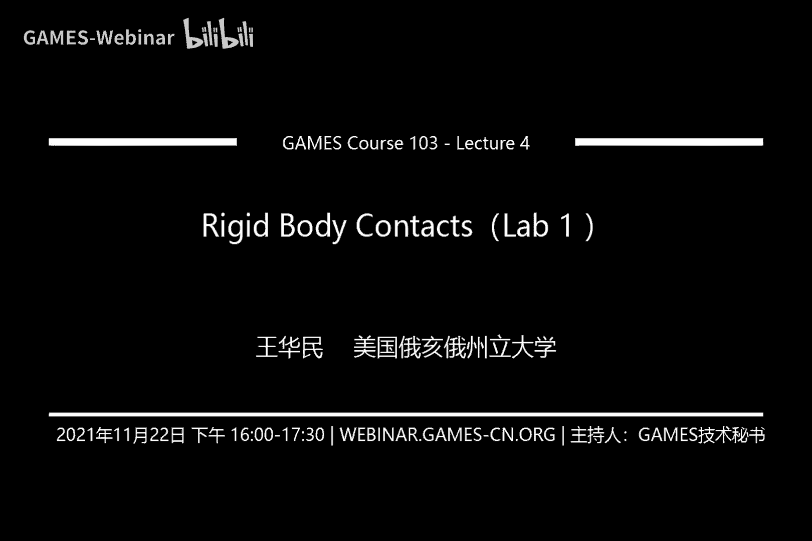
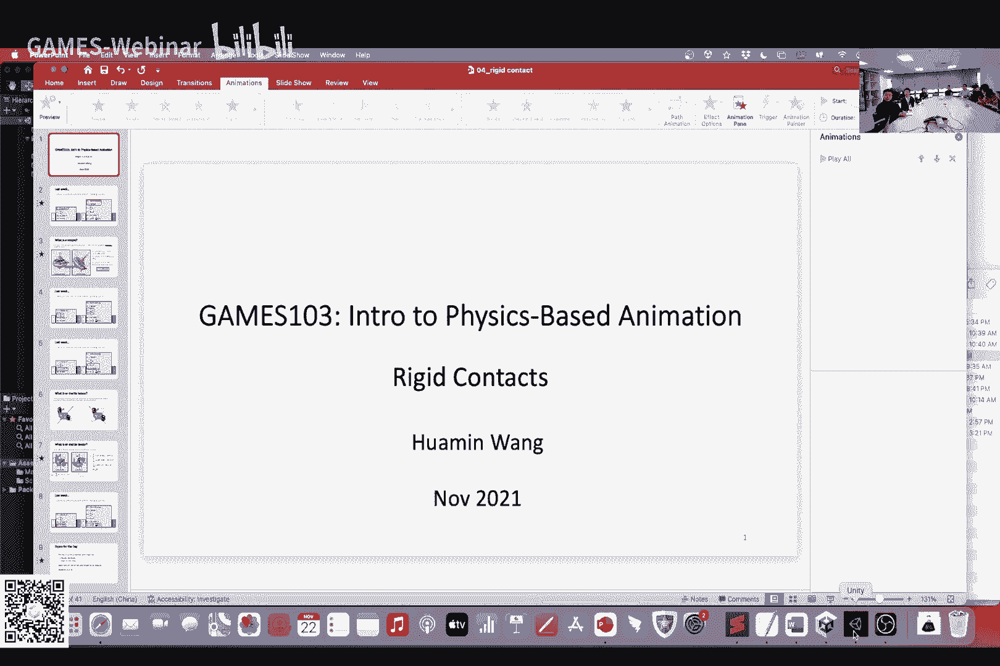
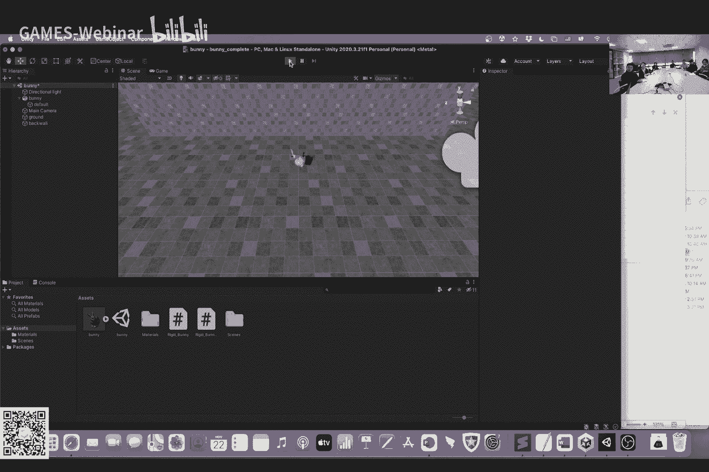
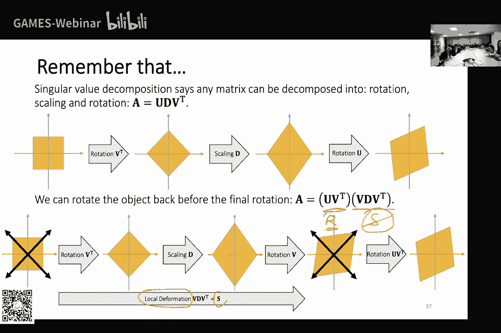
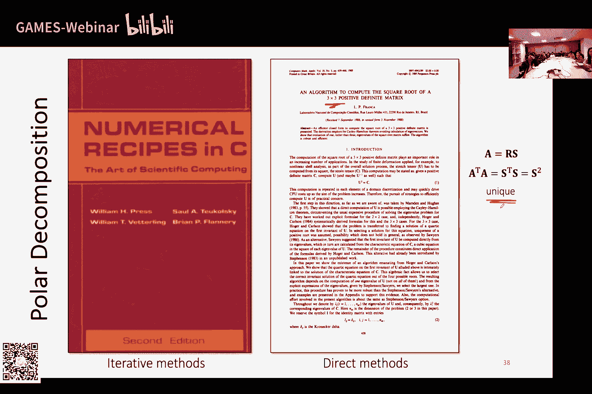
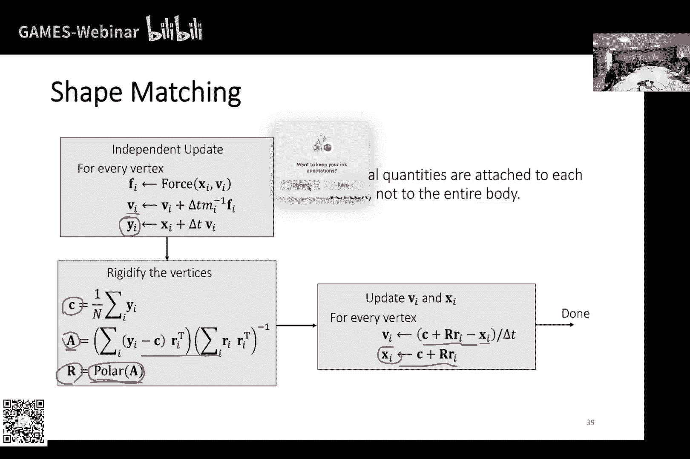

# GAMES103-基于物理的计算机动画入门 - P4：Lecture 04 刚体接触 (Lab 1) 🐇💥

在本节课中，我们将要学习刚体碰撞检测与响应的核心方法，并了解一个无需物理知识的替代方案——形状匹配。课程内容将围绕作业展开，首先介绍作业要求，然后回顾刚体模拟的基础概念，最后深入讲解碰撞处理与形状匹配技术。

## 作业介绍与回顾 📋

首先，我们交代本次作业。这是课程的第一次作业，目标是实现一个刚体碰撞模拟。作业分为基础任务和附加题。

基础任务是完成一个名为 `RigidBody` 的 Unity 脚本，实现基于冲量法的刚体碰撞。脚本中已提供计算惯性张量、叉乘矩阵等辅助功能。完成后的效果是：运行程序，按下 `L` 键，兔子模型会撞向墙壁并反弹落下。

附加题是使用“形状匹配”技术实现刚体模拟。这种方法不涉及任何物理公式，完全基于图形学和优化。在 Unity 中，通过切换脚本（从 `RigidBody` 切换到 `ShapeMatching`）即可看到不同的模拟效果。此方法在处理摩擦时可能会有轻微滑动。

作业周期为两周。对于不熟悉 Unity 的同学，建议先学习 Unity 的基本操作和脚本编写。

## 刚体运动回顾 🔄

上一节我们介绍了刚体模拟，但时间仓促。本节我们首先回顾刚体运动的核心算法，特别是针对没有大学物理基础的同学。

刚体运动分为线性（平移）运动和旋转运动。线性运动的更新基于牛顿第二定律：

**位置更新公式：**
`v_new = v_old + (F_total / m) * Δt`
`x_new = x_old + v_new * Δt`

其中，`F_total` 是所有顶点上力的矢量和，`m` 是刚体总质量。

对于旋转运动，我们需要对应的概念。造成旋转趋势的不是力，而是 **力矩**。

**力矩计算公式：**
`τ_i = (R * r_i) × f_i`

这里，`R` 是描述当前刚体朝向的旋转矩阵，`r_i` 是顶点在参考姿态下相对于质心的向量，`f_i` 是作用在该顶点上的力。力矩 `τ` 的方向垂直于力臂和力的方向，大小与两者模长及夹角的正弦成正比。

将所有顶点的力矩求和，得到总力矩 `τ_total`。

接下来，我们需要更新角速度。在线性运动中，加速度是 `F/m`。在旋转中，角加速度是 `τ` 除以 **惯性张量** `I`。但 `I` 不是一个标量，而是一个矩阵。

**惯性张量计算公式（在参考坐标系下）：**
`I_ref = Σ_i [ m_i * ( (r_i^T * r_i) * E - r_i * r_i^T ) ]`

其中，`E` 是单位矩阵。这是因为物体对旋转的“抵抗”与旋转轴的方向有关。例如，质量分布远离旋转轴时，更难转动。

当刚体旋转后，其惯性张量会变化。但我们可以通过旋转矩阵快速计算当前的惯性张量，而无需重新求和：

**当前惯性张量计算公式：**
`I = R * I_ref * R^T`

得到惯性张量后，即可更新角速度：

**角速度更新公式：**
`ω_new = ω_old + I^{-1} * τ_total * Δt`

最后，使用新的角速度更新描述刚体朝向的四元数 `q`。其更新公式涉及四元数乘法，具体推导可参考课程附录。

以上就是刚体运动模拟的基本框架。接下来，我们将进入本节课的核心：碰撞处理。

## 单点碰撞检测与响应 🎯

本节中，我们来看看如何处理一个单独质点的碰撞，暂时不考虑刚体的旋转。我们主要介绍两种方法：惩罚法和冲量法。

首先，我们需要一个工具来判断碰撞是否发生：**有符号距离函数**。

### 有符号距离函数

定义一个函数 `Φ(x)`，对于空间中的任意点 `x`，它返回到某个物体表面的距离。符号表明点在表面的内侧（负值）还是外侧（正值）。表面就是 `Φ(x) = 0` 的点的集合。

以下是几个简单几何体的距离函数示例：

*   **平面**（平面上一点 `p`，法向 `n`）：
    `Φ(x) = (x - p) · n`
*   **球体**（球心 `c`，半径 `r`）：
    `Φ(x) = ||x - c|| - r`
*   **圆柱体**（轴上一点 `p`，轴向 `a`，半径 `r`）：
    `d = || (x-p) - ((x-p)·a) * a ||`
    `Φ(x) = d - r`

对于复杂物体，可以通过布尔操作组合简单物体的距离函数：

*   **交集**（物体A **与** 物体B）：点在内部当所有 `Φ_i(x) < 0`。近似距离函数取 `max(Φ_i(x))`。
*   **并集**（物体A **或** 物体B）：点在内部当任一 `Φ_i(x) < 0`。在外侧时，距离函数可近似为 `min(Φ_i(x))`。

利用距离函数，碰撞检测变得简单：若 `Φ(x) < 0`，则发生碰撞。

### 惩罚法

惩罚法的思路是：检测到穿透后，施加一个力将点推出去。这个力通常像弹簧力，大小与穿透深度成正比，方向是表面的法向（即距离函数的梯度方向）。

**基本惩罚力公式：**
`f = -k * Φ(x) * n`
其中 `n = ∇Φ(x)`，`k` 是弹性系数。

为了避免明显的穿透，可以设置一个缓冲厚度 `ε`。当 `Φ(x) < ε` 时就施加力，力的大小与 `(ε - Φ(x))` 成正比。

惩罚法的主要问题是参数 `k` 难以调节：太小则无法阻止穿透，太大则容易导致模拟不稳定（过冲）。一种改进是使用 **对数障碍函数**，让力随着点接近表面而急剧增大：

**对数障碍函数力公式：**
`f = (ρ / Φ(x)) * n`
其中 `ρ` 是强度参数。但此法要求步长非常小，且绝对不能发生穿透。

### 冲量法

冲量法的思路是：在检测到碰撞的瞬间，直接更新点的速度和位置，使其立即响应，而不是等到下一时刻通过力来改变。

以下是处理一个质点碰撞的冲量法步骤：

1.  **位置修正**：将穿透的点沿法向推回表面。
    `x_new = x_old - Φ(x) * n` （因为 `Φ(x)` 为负）

2.  **速度修正**：修改点的速度，模拟反弹和摩擦。
    *   将速度 `v` 分解为法向分量 `v_n` 和切向分量 `v_t`。
        `v_n = (v·n) * n`
        `v_t = v - v_n`
    *   计算新的法向速度（反弹）和切向速度（摩擦）。
        `v_n_new = -μ_n * v_n` （`μ_n` 为弹性系数，`0 ≤ μ_n ≤ 1`）
        `v_t_new = a * v_t` （`a` 为摩擦衰减系数）
    *   根据库仑摩擦定律，`a` 应尽可能小，但不能使切向速度反向。其计算公式为：
        `a = max(0, 1 - μ_t * (1 + μ_n) * |v_n| / |v_t|)`
        其中 `μ_t` 是摩擦系数。`a=0` 表示静摩擦（物体停下），`a>0` 表示动摩擦。
    *   合成新速度：
        `v_new = v_n_new + v_t_new`

冲量法能更精确地控制碰撞后的反弹和摩擦效果。接下来，我们将把冲量法应用到刚体上。

## 刚体的碰撞处理 🤖💥

对于刚体，我们不能直接修改单个顶点的速度，因为模拟的状态变量是质心的速度 `v`、角速度 `ω`、位置 `x` 和朝向 `q`。我们需要通过施加冲量 `J` 来间接改变顶点的速度。

假设在顶点 `i` 处检测到碰撞。该顶点的世界坐标和速度为：
`x_i = x + R * r_i`
`v_i = v + ω × (R * r_i)`

我们的目标是：找到一个冲量 `J`，施加在碰撞点，使得该点碰撞后的速度 `v_i_new` 等于用前述单点冲量法计算出的理想速度 `v_i_desired`。

推导表明，冲量 `J` 与顶点速度变化量 `Δv_i = v_i_desired - v_i` 存在线性关系：

**冲量与速度变化的关系：**
`Δv_i = K * J`
其中矩阵 `K = (1/m) * E - ( [R*r_i]× )^T * I^{-1} * [R*r_i]×`，`[·]×` 表示叉乘矩阵。

因此，我们可以计算出所需的冲量 `J = K^{-1} * Δv_i`。得到 `J` 后，再更新刚体的整体状态：

**刚体状态更新公式：**
`v_new = v_old + J / m`
`ω_new = ω_old + I^{-1} * ( (R*r_i) × J )`

以下是刚体碰撞处理的算法流程：

1.  遍历刚体每个顶点，计算其世界坐标 `x_i`。
2.  使用有符号距离函数检测 `x_i` 是否发生碰撞（`Φ(x_i) < 0`）。
3.  如果发生碰撞，计算该顶点的当前速度 `v_i`。
4.  判断 `v_i` 是否仍指向物体内部（`v_i · n < 0`）。若是，则继续。
5.  使用单点冲量法公式，计算该顶点期望的碰撞后速度 `v_i_desired`。
6.  计算矩阵 `K` 和速度变化 `Δv_i`。
7.  计算冲量 `J = K^{-1} * Δv_i`。
8.  用冲量 `J` 更新刚体的质心速度 `v` 和角速度 `ω`。

**实现细节**：
*   如果多个顶点同时碰撞，可以取这些碰撞顶点位置的平均值作为一个代表点进行处理，以避免过度反应。
*   由于重力持续作用，物体在平面上可能持续微幅抖动。可以在速度很小时施加阻尼来缓解此现象。

处理多个刚体间的碰撞更为复杂，需要求解一个线性互补问题，本课暂不深入。

## 形状匹配：一种无物理的替代方案 🧩

上一节我们介绍了基于物理的冲量法。本节中，我们来看看一种完全不同的、不依赖任何物理公式的方法——形状匹配。这对于物理基础薄弱的同学可能更友好。

其核心思想分为两步：
1.  **自由移动**：将刚体视为一堆独立的质点，每个质点根据自己的受力（如重力、碰撞力）自由运动一个时间步。这会导致形状扭曲。
2.  **形状匹配**：将扭曲后的一堆质点，通过一个最优的刚体变换（旋转 `R` 和平移 `c`），重新“匹配”回它原来的参考形状。

**数学描述**：
假设自由移动后，顶点位置为 `y_i`。我们想找到质心 `c` 和旋转矩阵 `R`，使得变换后的顶点 `c + R * r_i` 尽可能接近 `y_i`。这转化为一个优化问题：

**优化目标：**
最小化 `Σ_i || (c + R * r_i) - y_i ||^2`

求解过程：
1.  **计算最优质心**：目标函数对 `c` 求导，发现最优质心就是所有顶点 `y_i` 的平均值。
    `c = (1/N) * Σ_i y_i`
2.  **计算最优变换**：先放宽条件，令 `R` 为一个任意矩阵 `A`。目标函数对 `A` 求导，可解得：
    `A = ( Σ_i (y_i - c) * r_i^T ) * ( Σ_i r_i * r_i^T )^{-1}`
3.  **提取旋转**：对矩阵 `A` 进行 **极分解**，将其分解为旋转矩阵 `R` 和一个对称矩阵（代表形变）的乘积：`A = R * S`。我们丢弃形变部分 `S`，保留旋转部分 `R` 作为最终结果。

得到 `c` 和 `R` 后，我们就可以更新刚体的“质心”和“朝向”。同时，可以根据顶点位置的变化反推出顶点的速度，用于下一帧的“自由移动”步骤。

**形状匹配的优缺点：**
*   **优点**：实现简单，无需物理参数；易于与基于粒子的其他模拟（如流体、软体）结合。
*   **缺点**：难以严格处理摩擦等约束；可能需要多次迭代来满足多个约束；碰撞响应可能不够精确（如出现滑动）。

此方法适用于对碰撞精度要求不高的场合，或者刚体作为复杂系统（如衣服上的纽扣）的一部分时。

## 总结 🎓

本节课中，我们一起学习了刚体碰撞的核心内容。

我们首先回顾了刚体运动模拟的基础，包括力矩、惯性张量和运动更新公式。接着，我们深入探讨了碰撞处理。从单点碰撞入手，介绍了惩罚法和冲量法两种响应策略。然后，我们将冲量法扩展到刚体，详细推导了如何通过施加冲量来更新刚体的整体运动状态。最后，我们介绍了一种无需物理知识的替代方案——形状匹配，阐述了其原理和实现步骤。

本次作业要求实现基于冲量法的刚体碰撞，附加题则是实现形状匹配算法。希望本教程能帮助你理解这些概念，顺利完成作业。

