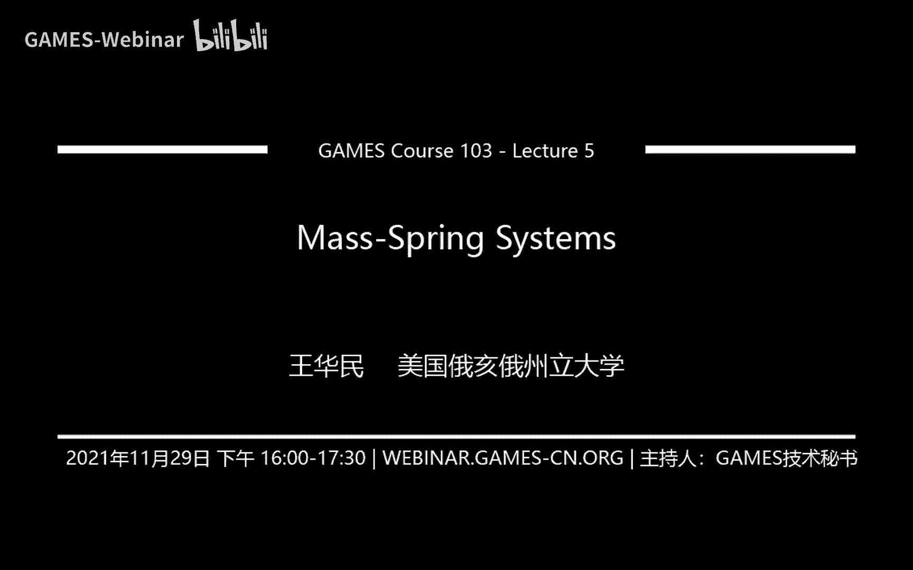
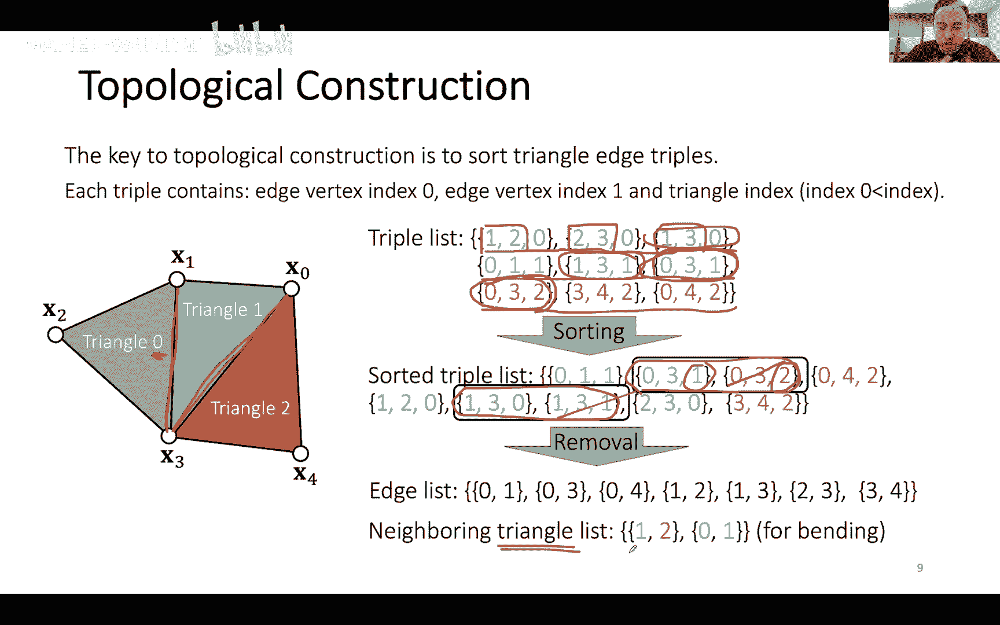
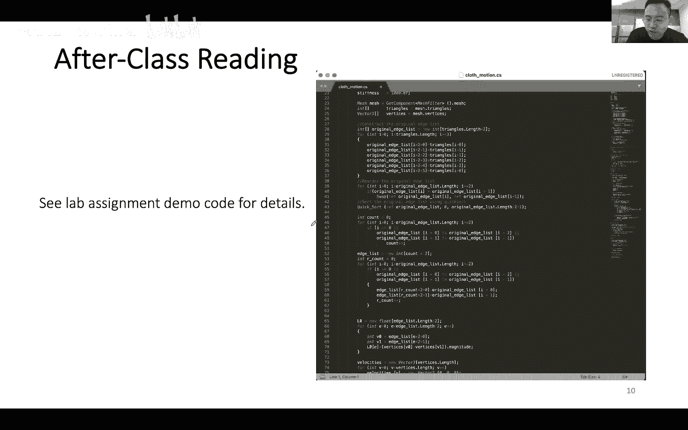
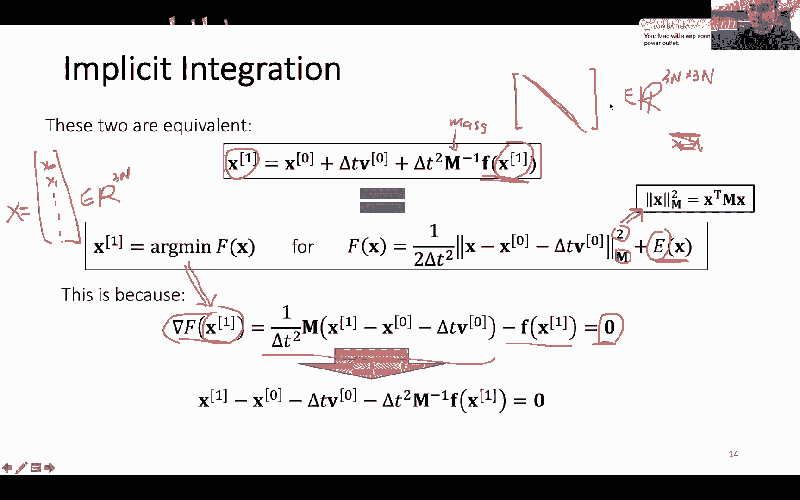

# GAMES103-基于物理的计算机动画入门 - P5：Lecture 05 Physics-based Cloth Simulation - GAMES-Webinar - BV12Q4y1S73g

行我们那个我们就开始吧，今天我们主要讲的就是相当于是一个新的一个话题啊，我们上周还有上上周主要是讲了缸体这一块钢铁的模拟这一块对吧，那我们基本上就告一段落了啊。

其实关于钢铁还有很多其他呃延伸出来的一些话题，比如说我们可以做articulated body，就是类似人体骨骼动画这样的东西，那这个的话呃因为跟约束相关，所以说我们其实也会专门有呃。

有一节课是来讲约束的，但是那个话题咱们就暂时就告一段落，然后呢我们嗯在最早的时候我其实说过嘛，方法上也好啊，然后这个讨论的话题课题也好，所以说呃可能有的同学可能不是很关心钢体这一块，其实也没关系啊。

接下来我们会讨论几个啊，不同的话题，就比如说今天我们主要讨论的这个课题，就是关于衣服模拟这一块，布料模拟这一块，那布料它这个东西它其实跟头发的模拟是有一定的联系的。

因为你可以把布料cross这个东西它想象成因为一个二二维的一个面，在三维中展开的一个状态，那头发是什么样的，头发是一维的一条线对吧，它跟在三维中展开的一个状态，所以说它其实是有一定关系的。

但是头发的模拟它其实又有自己的特点，因为它有的时候他会考虑到自身的一些旋转，就是有的时候它会用那种类似螺旋线的模型，所以说呃相对来说它就比较特殊一点，所以说我们这里其实也哎不往下讨论。

主要还是以呃讨论这个比较通用的这些cross怎么样去model class，怎么样去similate class，那这个class simation其实也是相当于是我的一个老本行。

我做了蛮久的这个这方面的工作啊，然后呢我是想把这个东西分成三节课来讲，三个礼拜来讲，咱们第一天第一天就今天我们主要讲物理仿真模拟，怎么样根据呃能量，然后呢根据这个力的模型，然后推导出呃衣服模拟的方式来。

然后下一周我们会讲约束，就是可能大家比较呃经常听说过的游戏里面用了很多的ppt，我们会下周我们会讨论那个东西，然后我们也会讨论projective dynamics。

就是基于p p t在延伸的跟物理模拟相结合的一种方式，然后我们还会讨论专门一种就是用来处理约束的，叫做constraints dynamics，所以基本上下周我们就是围绕着各种各样的约束来讨论。

怎么样让约束跟模拟相结合，然后最后一周我们会讨论碰撞，为什么要在这个时刻讨论碰撞呢，因为衣服的碰撞其实是最难的，布料的碰撞其实是最难的，你如果能够把cross的碰撞处理好，实际上你做其他模拟的碰撞。

相对来说都会容易很多，所以说实际上我们就这里就我们就重点就想cross怎么处理碰撞的，然后他这些类似的方法你会看到都是可以用在其他的碰撞处理上面的，然后我们会专门讨论这个东西。

当然重点其实关于cross的，我们重点模拟本身呢，我们是头两周，然后最后我们来讨论碰撞好吧，然后今天我们大概是这么一些呃话题吧，但是不一定有时间能够全部都讲完，如果没讲完，咱们就反正就延续到下一周。

首先我们来讲讲弹簧，首先讲假如说我用弹簧去描述一个面料，一个cross呃，我怎么样模拟它对吧，我有两种方式，分别是基于影视的积分，显示的积分跟基于影视的积分，我们来看看这两种方式我们都是分别怎么做的。

然后呢我们来讨论弯曲这个东西，因为对于面料而言，布料而言，它的弯曲非常重要，很多时候我们来判断一个面料它到底是比较挺的还是比较软的，很大程度上都是从他这个弯曲造成的褶皱上来判断的对吧。

那么我们就会讨论到弹簧的弯曲模型，它其实并不是一个很合适的模型，那么还有没有别的模型呃，我们会讨论其他模型，然后类似的我们还会讨论就是弯曲，它在模拟的过程中，它会有一些问题叫做locking。

也是我们也会讨论啊，这些这个问题就是给大家相当于提个醒呃，然后咱们在最后的那就是如果有时间的话，我们会讨论，就是我们上周不是讲了shape match吗，然后这周我们会讲shape match。

就是类似的想法，我们其实也可以拿来做啊，面料的模拟，所以说我也会我们也会简单的讨论一些其他的不基于弹簧的啊，模拟方式啊，其实有很多东西我们跑到后面有限元的时候，我们其实还会讲的更细一点。

但是反正这里就先给大家介绍一个新的方法，那我们先从弹簧讲起啊，呃一个理想的弹簧，这个是咱们在学物理课的时候，学初中物理，高中物理的时候就学过的，就一个理想的弹簧，它是满足胡克定律的对吧。

那么胡克定律他说了一个什么事情呢，胡克定律它本质上就是说弹簧的力它是试图恢复原长的同时呢，它这个弹簧的力跟拉伸的长度有成正比，那么假如说我现在假如说我现在有一根弹簧。

是一个只考虑一个很简单的一维的情况啊，那么弹簧从拴在这个原点，然后弹簧当前的位置是x，那么也就意味着这个弹簧的长度是x对吧，那假如说弹簧的原长是l，那么我这个弹簧的能量。

弹簧的能量就是1/2 k乘以x减l的平方，那这个k呢就是它这个弹簧的弹性系数，这个k然后x减l呢实际上就是我的这个形变的量，就是我这个弹簧被拉了多少，然后我平方一下乘以这个弹簧系数除以二就是能量。

那么力是从哪里来的呢，力是负的，能量对位置的导数，那么能量对未知的导数是什么呀，如果我根据这个定义的话，我会发现我对x求导，那么二跟二抵消掉，我就得到了负的k乘以x减l。

这个其实就是符合我们呃中学时候学物理，它直接给的，一般来说就直接给了这个公式嘛，但是你会发现它其实力跟能量，它其实就是一个简单的啊导数的一个关系，前面加个负号，然后导数的关系，这个是个一维的情况。

那么以此类推，我也可以拓展到二维或者三维的情况，然后这个其实咱们之前呃也讨论过，在我们在第二节课的时候，我们讨论那个数学求导的时候嘛，我们不是用这个东西举过例子吗，啊这里就是给简单简单的给大家回顾一下。

就假如说我有一根弹簧，我连接了两个点，分别是i跟g，然后这根弹簧的原长是l的话，那么我的能量就是二分之k然后这个k呢还是弹性系数对吧，然后乘以呃拉伸量的平方，那拉伸量是什么呀。

拉伸量就是弹簧的长度减去它的延长嘛，所以说这个就是能量的公式，那同样的我的力就是能量对点的位置的求导，那么因为我这里有两个点对吧，我有一个矮点，也有个g点，我有两个顶点，那么也就意味着我分别有两个力。

然后前面加个负号，那么之前我们推过公式，我这里就不重复了，就反正就是负的k乘以这个形变量，然后再乘以这个方向normalize一下，然后也是同样的公式可以推出来，然后呢呃因为牛顿说牛顿他说这个呃。

如果你把这两个顶点加成跟弹簧认为是一个系统的话，它的总的力应该是等于零的对吧，他的这个它是这个作用力跟反作用力吗，所以说f i就等于f j，然后这个大家从这个公式上也可以看到。

这个是刚好是两个是力是相反的，这里我就不细细的就展开这个是怎么过程的，如果说大家呃不太记得这个咱们第二节课的内容，或者是就是呃就是没上第二节课的话，可以回到第二节课的那个最后的呃p p t上。

大家再把这个推导过程再给他看一下，但简单的说就是我把能量有了能量之后，就可以得到两个相对应的力了，就分别作用在i跟j上，这个咱们反正之前就已经讲过了，那么有了这个模型之后对吧。

我们有了这个简单的一根弹簧的模型之后呢，我就可以构造一个呃更复杂一点的模型，比如说我有多根弹簧对吧，那多根弹簧怎么办呢，那么根据物理里面我们所学过的知识，能量和力，它其实是可以叠加的。

那么假如说我这个假如说我这个顶点i它连接了另外四个顶点，然后分别有四根弹簧把它们连接起来，那么我相对应的我就有四个能量对吧，分别是101112跟e3 ，我把它们全部都加在一起，然后呢根据我公司的定义呢。

它这个能量每个能量都是啊他们所相对应的这个能量，然后把它全部加在一起，这个就是d e dx，然后这边有个transport，这个就是梯度的导数嘛，啊这个就是梯度的定义嘛，这个我们之前讨论过。

那么同样的我这个力也可以通过所有的力加合，我把这么多所有的力全都加在一起，那么这个总的合力就是作用在x点上的这个力了，这个就是根据简单的物理加和，我可以把能量和力加在一起。

那么实际的生活中我们是实际的模拟中，我怎么去构造这个网络呢，呃有不同的方式啊，呃有一种方式我们之前也讨论过，就是一个结构化的方式，结构化的方式怎么构造网络呢。

我可以假设说我这个面料这块布它是由方方正正的这些格子所构成的，那么假如说我一个用一个比较正比较一个正规的一个网格来描述的话，那么我分别每一个啊，每一个交叉点就是一个顶点对吧，这个节点。

然后呢我又分别有横的弹簧跟竖弹簧，我有两种弹簧去描述这个面料，它在横向跟纵向上的一个形变，同样我也需要有一些对角上的弹簧，因为这个事我会防止呃，面料它在斜的45度的方向上，它会有一个拉伸。

那么我需要构造类似这种方向上的弹簧，我可以防止斜45度，斜45度上的拉伸对吧，然后两个方向都有，一个是斜45度，一个是斜的135度，我都需要，然后呢再还可以构造什么呢，再还可以构造的一种叫做弯曲的弹簧。

那弯曲的弹簧的意思就是说这个弹簧它有可能会呃翻折嘛对吧，如果说我没有这个弹簧，你可以看到我这个弹簧是可以沿着这个这条线自由的翻折的，那怎么样阻止这个弹簧，这个面料它在这条沿着这条线自由在弯折呢。

我可以在这个方向上再加一根弹簧，同样的我可以在这个方向上再加一根弹簧，我在这个方向上的加一个方向，也就是说对于每一个点我都可以跨过另一个点，另一侧的一个点加一根弹簧，这个就叫做弯曲的嗯。

炭火bending的弹簧，它主要的目的就是防止这个面料，它可以很自由地沿着某一个方向做弯曲，啊这是一种方式，一种结构化的方式，嗯实际中我一般有的时候比较喜欢的就是用稍微简化一点的。

它主要的简化的点在哪里，就是简化一些对角上的弹簧，就是你不需要每一个小格子，你都加两根弹簧，你可以就是形成这种这种网格式的方式，就是每个格子上都是选三四十5度或者135度，就是选选选择一项。

那为什么我不一直都用斜45度或者是斜135度呢，因为你如果是一直都是沿某一个方向的话，容易让你的模拟产生一些偏向性，比如说如果说你一直沿45度，那么它在45度的方向，它的抵抗就会比较强。

而135度它可能就没有什么抵抗，那这种格子的这种错开来的格子的好处在于，它45度跟135度它都能兼顾，它，就是有的时候它它有些格子它有135度，有的格子会有140，有45度。

所以说嗯我是个人比较喜欢这种右右边这种错开来的方式，同时它也让你的弹簧数量减少，当然这是一种结构化的方式啊，还有一种呃也比较常见的就是在可能在很多设计中，我们做出来的mesh。

它有可能不是一个很规则的一个面料的mash，比如说我们在设计衣服的时候，很多它的版型出来的版型它都不是一个规则的一个方块嘛对吧，或者是一个长方形嘛，很多时候它是一个不规则的形状。

那如果说它是一个不规则的形状，那么我很多时候就是要用三角网格，而且是一种非结构化的三角网格来描述它了，那所谓的非结构化就是它是一个很乱的一个，它没有什么结构的这么一个match 3角mesh。

有很多三角形构成对吧，这些三角形就是把这些点都连接在一起，那么如果说我给我的是这么一个三角形网格，我怎么拿来做呃，弹簧系统的模拟呢，那一个简单的思路就是我可以把每条边都认为是一根弹簧嘛，对不对。

那我每条边都产生一根弹簧，那么我把这些边全都用弹簧连接起来，我就构造了这么一个弹簧系统了，当然还不够，为什么，因为我这里其实还是没有对于弯曲的抵抗的，那么怎么样抵抗弯曲呢，其实跟刚才的思路很像。

就是我可以对于每一条内部的边啊，假如说我这是一条内部的边对吧，我都可以构造一根这样子的弹簧，来抵抗弯曲，这根弹簧呢连接了这个内部边所对的这两个点，就分别是这个点，还有这个点，我把它俩连接起来之后呢。

那么是不是也就意味着我这个面料它其实在这个方向上，在这个边的方向上，它就产生抵抗了，他如果想要进行弯曲的话，我就我就会在这个方向上就就有个抵抗对吧。

那么我就可以让这个面料相对来说就是可以由产生弯曲的抵抗，那么这就是在非结构化的呃mesh，非节后的话呢，三角形网格我可以利用内部边所相对的这两个顶点，来构造出一根弯曲弹簧来，当然这根弹簧会很多，为什么。

因为我们有很多内部编码，对于每一条内部边，我都需要加这么跟弹簧，最终就把整个这个弹簧系统，整个弹簧系统的这些弹簧拳都构造出来了，这就是一个简单的一个思路，那么有同学就会问了，就说我怎么样。

假如说给我一个三角形网格对吧，我怎么样去构造这些边呢，怎么样去把这些边从这个三角形网格中给它抠出来的，然后怎么样我利用这些编，我去构造这些弹簧系统的构造，这些弹簧呢这个其实是有一个计算方式的。

我这里就简单的给大家介绍一下，就是在几何上是怎么样处理的，就首先我们来讲一下这个三角形的网格，它是在我们程序里面是怎么样表示的，假如说我有一个非常非常简单的这么一个三角形网格。

我有三个三角形分别连接了这么五个顶点对吧，x0 到x4 ，然后分别对应的是三个三角形，一般来说我最原始的输入啊是由两个列表，两个数组所构成的，第一个数组存的是顶点的位置，比如说我现在有四个顶点。

分别是x0 到x4 嘛，那么我第一个列表我存的就是这五个顶点的3d位置，每一个顶点是一个3d向量，所以说我其实就有五个3d向量存在这个顶点列表里面，这是我的第一个输入。

然后我第二个输入呢存的是三角形的呃，每一个三角形的顶点的索引就什么意思呢，就是我现在有三个三角形对吧，有三个三角形，那么我又分别对应了啊，这个绿颜色，蓝颜色跟橙色的这三个三角形。

然后第一个三角形的是123构成的，只有这三个顶点所构成的分别是一三对吧，那么我在这个列表里面，我存的就是序号一，序号二，序号三，这三个序号就告诉我这个哦，我通过这个顶点的这个位置的信息。

我就知道说它是分别是这三个顶点的位置，然后以此类推，对于蓝色的这个三角形呢是由013构成的，那么我接下来说的就是013，然后橙色的三角形是呃034构成的，所以说我这里存的就是034。

所以说它其实本质上就是每一个三角形，我都存了相应的这三个顶点的序号，在这个顶点列表里的序号，这样子我就知道说他们的3d位置是什么了，这个是一般来说是我们如果给别人给我们数据，给我们三角网格的数据。

一般来说它给我们最原始的数据就是这个东西，那给了这个东西之后，关键问题是我怎么样从里面得到所有的边的信息，我们为了构造这个简单的这种拉伸弹簧，我需要有边的信息对吧，我可以给了边的信息之后。

我就可以用边去描述这些弹簧，但是编得不够，我还需要有内部编的信息，因为我做弯曲的时候，我们刚刚前面讲了嘛，我们如果要做弯曲，我需要用内部边，这样子我可以把呃，比如说我就我就有个内部编对吧。

我可以把这个相相对的这两个顶点给它连接起来，我还需要有内部变的信息，所以说接下来我们就会讨论，怎么样把这些边的信息从这两个数据里面给抠出来，那有一个简单的想法，就是说我每一个三角形呃，相邻的三条边。

那么是不是我直接把这三条边给拿出来，就可以当做三根弹簧了呢，不行为什么，因为对于内部边而言，它是有重复的，比如说我刚才说的这个边对吧，零三这条边它是一条内部边，那么这条内部边它既相邻了1号三角形。

也相邻了2号三角形，也就是意味着，如果说我简单的把每根三角形的三个边全都拿出来的话，那么等于在内部边上我就变成有两根弹簧了，那我不希望这样，我希望内部边上还是有一根弹簧，所以说我这里是需要做一个操作的。

我们叫做呃几何的一些处理，那么怎么做这个处理呢，我先构造一个一个三队，一个一个triple，triple，就是三个数字啊，那么这个triple存了什么东西呢，他存了三个数，前两个数呢是每条边的顶点信息。

然后最后一个数是三角形，就比如说我这0号三角形啊，假如说我0号三角形，它有三条边对吧，分别是1223跟三一，所以说我针对0号三角形，我就分别构造了三条三个triple。

那这个so triple其实你可以认为是一个原始的边，它是一个原始的边，然后每一个边每个三角形呢都会有三个原始的边，所以说你可以看到我这里最终形成了九个原始的变，九个原始的trip。

那么对于0号三角形而言，我就有一二跟零对吧，那么一跟二是它的这个边的信息，就是分别是就是对应的这条边，然后二跟三呢就是接下来是这条边，然后一跟三呢就是内侧的这条边。

然后最后这个数字零呢就是告诉我们这是0号三角形，这个就是对0号三角形，绿颜色的三角形，我就有三条原始的边，然后呢用这个这个这个这样的一个数据结构，我来储存他的信息，那对于蓝色的这个1号三角形。

我也做同样的事情，我有013嘛对吧，然后我就形成了这么一个结构，0113跟零三，然后也是对应的1号三角形，同样的呢我用橙色的部分，我也可以形成这么一个原始编的信息，那有了之后呢，我接下来怎么做呢。

我对他们做一个排序啊，我就对他这些数字做一个排序，那为什么要做这个排序啊，它的原因其实很简单，就是如果说有一条边是内部边，那么它两个顶点它会在这个这个结构里面会重复出现两次，那么我对它进行排序之后呢。

它就会在相邻的位置上，比如说咱们说的这个零三这条边对吧，这是一条内部边对吧，那么它分别出现了两次，那因为开始的时候他在这个位置这里有一个零三，然后这个地方也有一个零三对吧，他出现了两次。

那么我排序之后呢，它就会在相邻的位置出现了，同样的这个还有一条内部边是e3 ，那么他之前呢在这里还有这里对吧，他之前没有香菱，但是我排序之后呢，他就相邻了。

他就在相邻的位置会出现它相邻的位置出现的好处在于什么，好处在于，如果说我对于这些边这些原始边进行排序之后，然后呢我从头到尾检查一次，我就可以把这些重复的边给它剔除掉，因为它永远是相邻的嘛。

我只要往前往后检查一下是不是出现同样的情况，如果说同样的顶点都是一模一样的，我就把它剔除掉，那么以此我就可以把整个边列表给它构造出来，我就把这些重复的部分给它剔除掉就够了，比如说这个我把这个剔除掉。

那么我剩下的就是没有重复的单独的顶点，那么这些顶点就是留下来的，这些顶点呢我就可以拿来当做我的弹簧来模拟了，我就不用担心说在同样的位置，我会产生两根弹簧了，那怎么样得到弯曲弹簧呢。

得到弯曲弹簧的目的实际上是为了有内部的边对吧，怎么样知道内部边其实也很简单，我们刚才剔除的时候，我们会检查重复吗，那么重复的边实际上就是内部边，所以说内部边就是零跟三跟一跟三。

那么有了零跟三跟一跟三之后呢，我就分别通过他的这个三角形的顶点，我再做一次检查，比如说我知道零跟三相邻的是1号三角形呃，和2号三角形，然后我一跟三角形，2号三角形，我就检查这两个顶点哦，分别是一跟四。

那么我就把这个一跟四就连接起来啊，当然你也可以存三角形的信息，比如说我这里存的是三角形的信息，我存的是一跟二相邻，三角形一和三角形二相邻，三角形一跟三角形零相邻，这个也可以。

这个取决于你是想直接存这个弯曲弹簧的顶点，还是你想存三角形的三角形相邻关系，这个都可以，反正就是我这里的话就直接从三角形相邻关系了，这就是一个比较简单的处理，mesh，假如说给了你三角形网格。

你怎么样把这边的信息，还有内部编的信息给它搞出来，然后利用这些得出来的，别的信息我可以构造我的这个整个模拟系统。

那么呃代码大家可以去参考一下，就是我们下次作业的时候，我会给大家，也会给大家一个example的一个代码，大家如果感兴趣的话，可以看一下那个example的代码，就是在这里我就不重复了。

反正就是大家如果感兴趣这个刚才我们前面这个算法是怎么做的，你可以去看一下那个代码。

那有了这个东西之后，有了这些编的信息之后呢，我就可以搞一个模拟系统的啊，怎么模拟呢，首先我是一个做一个简单的一个例子系统，这个粒子系统呢就是对于每个顶点呃，我可以计算每个顶点的力对吧。

每一个顶点i我计算它的力，然后有了力之后呢，我除以质量乘以delta t加上速度就得到了新的速度，然后有了新的速度呢，我乘以达到t加上位置，我得到了新的位置，这个反正就是一个非常标准的一个粒子系统啊。

大家可能之前会看到过，跟那个跟那个我们做钢铁的模拟，其实很像，只不过比钢铁还要简单，因为我这里就没有任何旋转了，我这个每个点它就是一个单纯的一个位置的一个信息，那么对于弹簧系统而言。

我只需要把弹簧系统插入到这个力的计算过程中就够了，那么怎么算力呢，当然这里有很多例了，那我这里再多一个力，就是一个弹簧的力，那么怎么算力呢，对于每一条弹簧，每一条弹簧，这里其实应该叫spring。

不应该叫edge，对于每一根弹簧e呢，我都有一个列表，这个列表呢就是存了这些顶点信息，就是每一根弹簧，每一根边它都连接了两个顶点嘛，那么我就用一个二维数组来定义第一个数字呢。

第一个index呢是它的这个弹簧的index，然后后面的index呢分别就是对应两个顶点，就跟前面我前面给大家的一样，就是这个零跟一对吧，第一根弹簧连接零跟一，第二根弹簧连接了零跟三。

第三根弹簧连接了零跟四，就是这么一个这么一个定义关系吧，每根弹簧都分别连接了两个顶点，那么我首先把这两个顶点的索引给他得到，然后呢我还有另一个列表，这个列表存的是弹簧的原始长度。

一般来说我们这个东西是可以通过预计算给他算出来的，我事先可以把所有的边，所有的弹簧都过一遍，然后呢我把它的初始的这个长度，我假设初始初始的位置是没有形变，是原始位置，那么我把这个初始的长度给它保存下来。

然后保存完了之后呢，我通过这个索引我就可以访问它的原始长度了，然后呢我根据这个咱们这个力的这个公式，我可以把这个力给它算出来，算完力之后呢，我分别加到呃i跟g上面去，那么我就给他算出来了。

这个一般来说就是这么一个流程，当然这个这两个循环它好像有点冲突啊，其实是其实应该是应该是你事先应该定义这么一个数组，你可以事先把这个力定义成一个数组，然后在之前先把所有的力都算出来，就不要在这里计算了。

是先把所有的力算出来，算完之后呢，然后再分批的对每一个顶点进行处理，这样子可能更合理一点，我这样子写可能大家会有些误解啊，其实他应该是最好是应该是分成前后两个部分，第一个部分是历史。

单独先把所有的力全都算起来，保存在一个呃力的一个数组里面，然后算完这个力的数组之后呢，我再把所有的顶点给他过一遍，大概是这么一个流程，我这里回头会把这个p p t稍微改一下，好了。

这个基本上就是一个简单的显示积分，我们做explicit integration呃，进行弹簧系统模拟的一个方式，这个跟我们其实前面的那个缸体其实很像，无非就是多了一个利，多了一个弹簧力。

那么显示积分它其实有一个很严重的问题，就是叫做nerability，然后这个numerical instability，中文就叫做数值上它是不稳定的，那么什么叫做数值上不稳定呢。

我这里给大家这么一个情况啊，就假如说我现在有这么一根弹簧，很简单，一维的情况，非常非常简单的一维情况，不要去想很复杂的情况，假如说我有一个形变，那么我现在弹簧形变了对吧，我根据这个力。

然后我更新他的位置，更新它的速度，更新它的速度，更新他的位置，那么大家想一想，如果说我这个弹性系数非常非常大，如果说我这个k非常非常大，会发生什么，如果k非常大的话。

它会导致我们这个弹簧的利益也会非常非常大，对不对，那么给这个弹簧我施加一个这么大的力，那么会导致什么呢，会导致这个弹簧的这个顶点它会跑得过于远，因为我们正常情况下。

我们讨论弹簧很多都是假设能量守恒嘛对吧，那么弹簧系统理论上这个顶点它不应该它的这个形变的这个长度，它不应该超过原来的这个长度，但是如果说我直接用一个简单的这个显示积分。

我假如说我给它施加一个很大的力的话，那么有可能这个顶点会跑得过远，会跑过头，会跑过跑到另一侧，而且它会跑到更远的一个位置上，那么因为他跑得更远了，我在计算弹簧的力就比原来的力还要大，那么给这么大一个力。

再加上这个顶点的位置的话，那么下一刻呢它又会跑得更加远，那么它有可能就跑到整个跑到屏幕外面去了，也就是说如果说我这么一个弹簧系统，由于我的这个k它过大，由于我这个弹簧系数过大。

会导致我在做影视显示积分的时候，它会反复地超越他自己，它会跑得越来越远，越来越远，越来越远，最终它会跑出整个屏幕，最终它会跑出我们这个整个模拟空间，所以这个问题呢我们就叫做overshooting。

这个overshooting本质上跟我们之前做那个呃，做碰撞的时候产生的overshooting是有差不多意思的，就是当我们这个系数很大的时候，它会跑得过远。

所以说很多时候大家就是为什么不直接用显示积分的原因，就是因为它会产生数值不稳定性，而且呢它一般来说会在两种情况下出现啊，要么是这个stiffness这个k很大，要么呢是你的时间不长很大。

因为为什么时间不长很大也会导致，因为你想看，假如说我让这个位移，就是假如说我让这个顶点是走得更远，我想要模拟的更久，那么在固定k的情况下，它实际上也会跑得更远对吧，那么怎么解决这个问题呢。

一个比较简单的思路呢，就是说呃我可以把这个delta t搞得小啊，有个同学问k大不是弹力大，把他拉回来吗，对是的，就是说你当你k很大的时候，他把它推回来，但是他不只推回来，他还把他推过头了。

而且他不只是推过头了，他还要推得远远的超过原来的位置，他要抄的更过头，对吧，因为这个是一根弹簧，它这个他只是会左右晃吗，那你如果这个k很大的话，他会直接穿过原来的位置，他直接跑到这头去。

它会存在这个问题，那么怎么避免这个问题呢，就是我一个思路，就是我可以把我的时间不长搞得稍微小一点啊，这可以做，但是就是不是一个很好的思路啊，因为你时间不长，搞得越小，你其实整个模拟的效率就会降低吗。

我们一般来说我们还是很在乎模拟效率的，我们希望它这个效率性能上还是要比较高的，所以这就是为什么呃，早年一般来说用显示积分比较多，但是后来用影视积分的相对来说就比较多了。

所以我们接下来会讨论另一种模拟方式，叫做影视的积分，那么影视积分其实我们之前讨论过怎么做影视积分呢，就是假如说我现在有速度跟位置两个变量对吧，那么速度等于这么一个更新的过程。

然后位置等于这么一个更新的过程，然后速度用的是力，位置用的是速度对吧，那么我这里的速度用的力是什么，力是，想要得到的那个新的状态下算出来的力，而这个力呢是我们所没有办法直接计算出来的。

因为它是根据新的时刻，新的状态所算出来的力，它是跟v一跟x一相关的这么一个例，而我们事先并不知道v一跟x一的对吧，所以说它实际上是一个未知的东西，然后x呢是根据v一所算出来的。

那么v一也是一个未知的东西，所以说他俩其实都是未知的，那么怎么来处理这么一个问题呢，嗯我首先我想简单地消一个圆，因为我这里有两个变量，分别是x和v嘛，这两个变量有点太复杂了。

我想稍微把这个问题简单化一下，那么怎么消元呢，首先我这个公式上面这个公式有v1 ，下面这个公式也有v一对吧，那么我首先可以把这个v一先给他弄弄掉，那么第一步我首先把这个v一用上面替代。

如果说我把v一用上面这个公式替代的话，我得到的就是x一等于x0 对吧，x一等于x0 ，加上delta t乘以后面这一坨东西，那么就是delta t乘以b0 ，加上deltp平方乘以m vers乘以2b。

这个角本质上就是这个东西乘以delta t，然后挪到了这边，那我第一个公式我实际上就把v一给消掉了，我得到的只有x一跟f一这两个东西，然后第二个公式呢是下面原来这个公式给他反推了一下。

就是之前我是有了v1 ，我算x一嘛，那么反过来如果说有了x1 ，我怎么算v一呢，我可以用他俩相减再除以deltt来计算对吧，我就得到了x一减x0 除以dl的t这个就得到了v就是反推。

通过这个东西反推我可以得到这个东西，那么对于这这两个公式而言，下面这一步是比较简单的，如果说你已经知道x一的话，下面那个公式很简单，你只要做一个简单的减法，再加一个除法就可以搞定了。

所以说真正的问题就是上面这个公式，就是这个问题，那么这里我要做一个假设，我要假设f这个力呢，它只是关于位置的一个函数，我假设这个力跟速度没有什么关系啊，我假设它只跟位置有关系。

那么什么样的力是跟只跟位置有关系的，比如说重力对不对，重力只跟一个顶点的位置有关系，事实上重力都跟顶点的位置都毫无关系，它跟什么都没有关系，重力实际上只是一个常数，但是我可以认为就是它不依赖于其他变量。

然后弹簧也是这么一种力，叫做holoomic，这种利益就是说只跟位置有关系的利益，就叫做honomic的利益，那么比如说弹簧它也是一种honomic的利益对吧，因为弹簧它只跟这个顶点的位置相关吗。

那么假如说我认为这个力是horroomic的，那么我就变成了这么一个问题了，那么我这个刚才这个例f一啊，我就可以写成一个关于顶点位置的一个函数了对吧，那么这个一呢就跑到这个x一个括号里面去了。

那就是成为了这个x一了，那么这个东西就成了一个什么呀，成了一个一个一个一个公式，一个方程，这个方程呢它是以x一作为未知量的一个这么一个方程，那么我们现在的问题就变成一个解线性方程。

解一个解一个方程的问题了，那么这个方程有什么麻烦的地方在，就是这个力啊，它可能不是线性的，因为我们之前学线性代数，一般来说都是假设一个线性问题对吧，一个线性问题，然后呢我可以利用一些什么消元法。

我可以把这个线性问题解掉，那么这个地方麻烦在麻烦在这个利他可能不是一个线性的力，所以说我们需要有一些特殊的手段去处理这个问题，那么怎么解决这个非线性方程，怎么去解这个非线性的方程啊。

我们首先考虑这么一个事情，我们首先对我们的问题再做一些变换，把它重新给它分装一下，就是之前咱们这个问题就是x一是我的未知量，这是我的未知量对吧，那这个未知量同时出现在公式的左边跟右边，我就没法解了。

那么首先我把这个问题分装一下，我会发现，这个公式呢，它跟这个非线性优化问题是等价的啊，这个是个什么问题呢，就是说我认为x一啊是某一个函数的最小值，那么这个最小这个函数是个什么函数呢。

是二分之l t t分之一乘以这么这么一个东西加上ex，然后这个e呢是这个力的能量，然后呢这个呢用这个下标呢是这个x transport x这么一个形式。

啊我用我用这个形式来啊来来稍微对这个公式做一些简化，就是差不多就是你可以认为这这里面这一坨东西呢就是这个x，然后呢这个符号呢，这这个norm的形式呢就是这个东西乘以m再乘以这个东西。

然后这个m是质量取证，我刚才可能忘了说了，这个是mass matrix，这是一个质量矩阵，一般来说这个质量矩阵就是一个对角矩阵，一般来说它是对角矩阵，然后对角上面就是呃质量的这个值啊，就存在这个对角上。

然后这是一个什么样的系统啊，这是一个三乘n的系统，对吧，你可以看到每一个顶点，每一个每一个x它实际上都是一个三乘以n的一个大的向量，它里面存的就是所有的顶点的信息，就比如说我有很多顶点构成的嘛。

x0 x1 ，然后一直存下来嘛对吧，我们之前不是用顶点列表去存吗，你这个你可以就认为这个x是存了这个所有的这些顶点摆在一起的，这么一个大的向量，然后这个是属于r，然后这个ex就是的能量就是这个力。

每一个力它其实都有一个能量的表达式吗，能量的形式嘛，比如说我这个力有弹簧，那么我这个ex就对应的是弹簧的能量，如果我这个里面有重力，那么我里面就有重势能，我其实就用这个形式就存在这个里面。

然后这个质量矩阵它是一个r3 n的矩阵，3x3，这个大家能理解吗，就是我这里其实是一个线，我这里上面这个公式它实际上是一个一个方程，然后这个方程呢它是一个不是一个方程，它是一个方程组，它是3m的。

它有3n个方程所构成的，因为我里面每一个x它实际上都是一个3n的一个数字，它是一个向量所构成的，这个大家能理解吗，有没有什么问题，我想这停一下，因为我觉得这里还挺关键的啊，对这个怎么来的，我接下来会讲。

但是我想我想确保一下，大家这里其实都都还明白这是什么意思，但是我接下来会讲这个等价是怎么来的，那没问题的话，我就接下来继续往下讲啊，接下来我们就说为什么等价啊，为什么会等价，其实对于优化问题。

只有保守力能用能量对是的，一般来说只有保守conservative的力才能用能量形式，如果是非保守力，比如说摩擦力，一般来说是没有办法用能量来描述的，那我们现在来讲就是为什么这个东西是能力。

是是这两个是等价的啊，对于一个优化问题而言，对于一个这么一个优化问题而言呢，我可以认为x一是什么呀，x一就是当梯度等于零的时候，它的一个解，这个字怎么理解呢，就是你可以想就是如果说我们一个有一个函数吗。

这个函数它一个实数函数，它的最小值就是它的一阶导数为零的时候对吧，如果说我有一个一个函数，它什么样的时候取最小值啊，它的最小值就是一阶导数为零的时候嘛，那它就是没有办法增长。

增长或者没有办法有有有进一步的下降的空间吗，那么一阶函数一阶导数对于这么一个关于顶点位置的而言的，它就变成梯度了，因为梯度本质上就是一阶导数的transport，所以说我就是认为梯度等于零的时候。

就是x一满足这个公式的时候，也就是说x一实际上就是在x一这个位置，在这个x1 ，假如说x一是我这个函数的最小值，那么x一的梯度就等于零，实际上就是这么回事，这两个就是等价的啊，也不是说等价吧。

就是说它必须满足他，如果说x一是它的最小值，那么下面这个条件是必须满足的对吧，那么我怎么求梯度呢，对于这个f而言，我怎么求梯度呢，首先我前面这个部分我要对它求梯度，那么前面这个部分是括号里面的。

这个括号里面的东西乘以m再乘以它自己吗，那么一个东西对它求梯度，那么也就是x穿这个东西求个梯度，哎算了我我就我就我就不写了，这个东西求梯度，那么就是把二放到前面，就是二跟二抵消掉，然后把i放到前面。

然后把这个东西保留，这个是一个简单的求梯度的一个呃东西，反正这里我也就简单的稍微抢一下，大家如果不是很熟悉的话，可以简单的看一下那个calculus这一块，反正就是对前面这个部分求梯度。

我最终就可以得到这个东西，然后对能量求梯度是什么呀，因为能量球气度不就是负的力吗，对不对，因为力是力是负的能量的梯度嘛，那么我对能量且梯度不就是负的力吗，对吧，那然后我再把这个公式稍微整理一下。

我是不是就发现它其实这两个是等价的呀，因为我把这个dt平方乘到这个乘上去，然后再把m inverse乘上去，我其实就等价了，是不是没电了，看一下。

这个插座哦。

就是我利用这个梯度的这个公式等于零的时候的状态，我知道当x一为这个优化问题的解的时候，必然满足梯度等于零这个条件，那么梯度等于零这个条件呢，我对这个f求梯度呢，我就会发现其实最终推出来。

所以公式整理一下之后，你就会发现这两个是等价的，为什么是等于零是吧，因为梯度等于零，你可以一想梯度就是一个函数的一阶导数，我我后面会有，我会给你画个图，我看看能不能理解啊，简单的说我这里做了什么事情。

我就是想把想把这个我们之前的这个方程，这个非线性的方程呢我给它转化成一个优化问题，转化成优化问题的好处在于什么，转化成优化问题的好处在于优化问题，它其实是有很多很多建成的这些数值方法，数值套路的。

我们就可以利用已有的这些数学家给我们提供的这些方式，我们去解这个优化问题，我们就可以就可以把这个优化问题给它解掉，然后这个公式其实我们回头我们讲有限元的时候，其实也会提到，然后大家可以注意到这个东西。

它其实并不限于弹簧系统，其实对于任何的模拟的dynamics，其实都是适用的，如果说你想做饮食积分的话，其实都是适用的，然后有同学会问会不会有多个解是会有出现的。

所以说我接下来会讲会给大家举这么一个简单的小例子啊，然后呢我给大家举一个例子，就是叫做牛顿法，这个牛顿法它全名叫做newton rs the method，但是他们我们一般来说通常见的方法叫做牛顿法。

牛顿法最早发明的原因就是他想要解一个非线性的优化问题，就是x一等于某一个函数的最小值，我想要让这个函数取最小值，我想知道什么样的状态下我能取最小值吗，然后一般来说我们对这个函数是有一定要求的。

一般来说我们是假设它是连续，但是数学家发现其实你不要求他进行满足数学上的那种一阶二阶连续，他有的时候他也可以也可以收敛，它也可以work，可以认为就是lapis continues。

它实际上是一种广义的连续，但是你也可以不用特别纠结说这个什么叫做libertuous continues，反正就是说这个函数的连续，这个也很容易理解，因为它要是不连续，你都你都没有办法求导数。

你都没有办法把这个导数算出来，你后面就没法搞了，那么牛顿法怎么做呢，大家有没有学过牛顿法，我想我想先问一下，以前以前有上过一些数学的课吗，就是牛顿法来解，比如说解一个非线性系统或者是非线性优化问题。

还有下一个，我这里给大家简单的介绍一下，就是这个牛顿法是个什么样的意思啊，就是我这里会做一个一阶的，对于他的一阶导数，我会做一个类似这种近似，就什么意思呢，就是说，对于跟函数而言。

这个其实回答了刚才前面那个同学的问题，就是还是不理解为什么梯度等于零，就是它的最优解了，你可以想象一下，假如说你的函数是fx对吧，那么你的这个函数曲线是这个样子的。

那么它的这个最小值就是它这个最低点对吧，那么最低点它有个什么样的性质呢，就是他这个一阶导数啊，它才是最低点嘛，也就意味着它的一阶导数为零，因为我们一阶导数实际上就是在描述它这根函数的方向。

所以说最小值一个函数的最小值跟它这个一阶导数为零，实际上是一个概念，你可以认为就是一阶导数为零的时候，就是它取最，就是如果说它取最小值的时候，那么你必须是一阶导数为零，那么回到前面的问题。

就是说我们对于一个函数，如果说这个函数它的变量是向量的话，那么我就是不用一阶导数，我用梯度来描述，因为梯度就是它的一阶导数嘛，我现在问题就是变成了我怎么样找到这个阶导数为零的这个解嘛，对吧。

我想要解这个问题怎么解呢，做一个比较简单的一个泰勒展开的一个近似啊，这个x是我不知道的，是我的变量是我的未知量对吧，但是假如说我现在有个当前的位置，我当前在k这个xk是我的当前值。

那么我可以做一个泰勒展开的近似，一阶导数在x的一阶导数等于当前的一阶导数，加上当前的二阶导数乘以x减去当前的位置，就是一个很简单的这个一阶的泰勒展开，那么这个是不是就变成了假如说我要求等于零的话。

那么这个是不是就变成了一个很简单的一个小的方程啊，我是不是就可以把这个x给它解出来了对吧，那怎么解呢，可以分成几步走几，首先我对x有个初始值，我假如说我当前比如说我就x0 ，当前是x0 。

那么我根据这个公式把这个东西，我把它叫做deltx delta x等于零意味着什么，意味着这个东西除以它嘛对吧，前面加个负号嘛，所以就等于负的一阶导数除以二阶导数，如果说你把这个东西。

你把它的一阶导数挪到公式的左边，那么就变成负的一阶导数除以二阶导数，我的改变量我的deltx就是负的一阶导数除以二阶导数，然后再把这个改变量加到这个xk上面，然后再以此做迭代。

我每次比如说我当前比如说初始的位置是，这里是x0 ，根据我这个一阶这个近似的公式，我可以算出一个新的改变量来，新的改变量实际上就是当前这个位置的一阶导数除以二阶导数，前面加个负号。

然后他给我算出来一个新的位置啊，比如说跑到这里来了，然后我再根据这个位置，我再算一个位置，以此类推呢，它最终逐渐逐渐的靠近这个函数的底部，然后找到帮我们找到这个x这个解，这个方法就叫做牛顿法。

大家能理解吗，尤其是没有学过的同学，这个能理解吗，这个地方，就是利用泰勒展开一阶的泰勒展开，可以计算这么一个改变量，然后利用这个改变量来进行一个更新，这个能不能一定收敛，我的答案是不一定牛。

它不保证一定会收敛，但是我们后面我们讲到f有限元的时候，我们会讲到我们可以对牛顿法一些条件上的约束，能够保证他一定会收敛，但之后会讨论到，其实没有学过的同学，我想知道有没有有没有有没有什么问题的，这里。

这是country gradient的是另一种方法，这个我们就暂时这里就不讲contract gradient是吧，实际上就是其实是一回事情，就是你用牛顿法求根跟你做优化是一样的。

因为你做优化本质上就是对它的一阶导数求根，你对一阶导数求跟跟那个跟直接用牛顿法去解线性系统，解解解方程，非线性方程实际上是一回事情，这里就先，x等于argument app是为什么。

你可以认为是他的一个另一种问，就是这个问题的另一种描述方式吗，就是你的优化问题可以是认为他你的优化问题，你的非线性优化问题可以认为跟一阶导数等于零是等价的，然后他一阶导数等于零，就是一个线性的一个公式。

一个方程嘛，那么非线性方程和非线性优化，其实这两个其实你可以认为是有没关系的，就回到刚才前面，前面刚才有同学就问了，就说会不会有多个解，还有就是会不会找到不对的这个问题了，有非线性方程。

然后积分得到f吗，嗯其实我们在做模拟的时候不需要，就是因为我们模拟的时候，我可以直接直接算能量嘛，所以其实并不需要就是说对他做做积分，其实直接就可以写成这个，怎么和从x有关的方式方程变成。

前面这个公式就是回答刚才有个同学问，就是怎么变，就是这两个是等价的吗，说我们之前我们写影视积分的时候，我们是这个共识对吧，那么我直接可以实际上可以把它转化成这么一个写的形式，就是实际上就是同样的问题。

只不过是我换了一种方式，我换了一种表达方式，之前如果说按照直接的显示影视积分的方式呢，我得到的是一个方程组，但是呢我其实也可以把它写成一个非线性优化的这么一个问题，其实就是我只是换了一种写法。

表达式表达方式不明白是吗，就就是就是这个f等于这个，这个是这个其实这样做不是说这样子做能够克服over shooting，而是积分能够克服over shooting。

就是这个方法就是前面这个方法它是能够克服over shooting的，但是你这个前面这个方法呢有存在的问题，就是你怎么样把这个x跟v给他算出来，那后面就是说我们来怎么来把它算出来的。

这个问题其实也是可以解解直接解方程的，实际上是等价的，不过是因为很多时候呃数学家他们在研究的时候就是研究，他们会直接研究就是非线性优化问题吗，很多时候他们都是不是考虑的，单纯的考虑一个解方程组的问题。

解方程组你可以认为是优化问题的一个特例，说我们其实是这里是想把它考虑在一个更加通用，更加广阔的一个数学问题上去来讨论这个问题，当然你如果说解早期的一些论文，其实关于模拟的一些论文。

它其实就是简单那把把他们考作为考虑做一个解方程组的问题的，后来最近几年就是大家因为发现其实更广阔的，我们可以认为是一个优化问题，然后呢我们会有很多优化问题的方式来处理这个问题。

就方法上我们在模拟的方法上，我们就选择就会更多样性了，我还是继续往后讲讲一下吧，如果得不到f的反函数，就没法解，什么叫做f的反函数啊，这里好像没有反函数吧，没有用到反函数，是你对它求导吗。

你只要能对它求导就行，我们要得到f的一阶导数吗，他最小的fx space，我们是我们是不是直接用反函数的求解的方式的，我们实际上你说的那种就是说如果说你有反函数的话，你是可以得到精确解的，它的解析解的。

但是我们这里是用数值的方法，所以说我们是不依赖它的反函数的，我们实际上是把它相当于把它变成一个方程，然后这个方程左右两边都有都有未知量，然后我们是解方程的这种方式来来求解的，我们这里并不需要它的反函数。

我们是通过这种数值方法来求解，明白吗，你是积分的，等cab fx，十积分怎么防止数据怎么证明，这个的话，这个我就我就没法给你证了，这个在那个在一一般来说讲那个数值方法里面。

数值积分里面他们会有更详细的证明的，这个证明证明还挺长的，一般再说它是通过那个物差的衰减来做判定呢，就是为什么会有overshooting，本质上就是误差的误差会越来越大，它会把这个误差放大。

所以说他要证明的就是说这个误差是会长期是会衰减的，x是啥是吗，fx就是这里fx就是这个东西，这个东西是根据我们前面的前面的这个饮食积分的这个公式，所推出来的这个东西，这就是我们的fx，这里。

我最后会给大家一个就是课后的课后的阅读的，可能就是说如果说大家是第一次接触到这个东西的话，确实会有一些有一些就是这里或者那里的问题吧，反正我最后会给大家一个课后阅读的。

这个也是关于呃库拉在那个影视积分里面比较经典的一篇论文，大概90年代一篇论文，大家如果感兴趣的话，可以把那个论文再给他详细的读一下，然后那篇论文呢跟我这里讲的还稍微有点不一样。

那篇论文实际上是以解方程的这种解方程组的这个写法来写的，它并不是能量优化的方式来写的，它实际上是解方程组的方式来写的啊，但是他其实你可以认为是只是做了一次牛顿迭代，因为他把他怎么做的。

他把那个方程给做了一个线性化，对就是buff那个那那篇论文我到时候会给大家呃给大家，然后大家如果感兴趣的话，对一些细节感兴趣的话，可以把这个东西看一下，然后我会把这个数值这里再稍微讲一下，就是。

就是一阶导数等于零啊，它其实导数等于零，它其实既可以是最大值，也可以是最小值，对因为比如说我有一个函数，我很奇怪，等这么一个函数，它在最小值的时候，它的一阶导数等于零，它的切向量切方向等于零嘛。

最大值它其实也等于零，它可能有多个解对吧，那它这个地方它也等于零，我怎么知道说我这个解解出来到底是最大值还是最小值，然后它到底合不合理呢，其实我就需要有一个判定了，用什么东西判定啊，我用它的二阶导数。

我们以前学过，我们在高中里面，我不知道大家记不记得学学高中里面学这个抛物线的时候，阶导数实际上就是它这个二元二次的系数嘛，二阶导数大于零，也就意味着它的开口是向上的，二阶导数小于零。

就意味着它的开口是向是向下的，这个大家记得吗，一个道理就是我们可以用二阶导数，假如说我把这个一阶导数等于零的这个东西给算出来了，那么怎么判断它是最大值还是最小值呢，就用二阶导数。

我看他是开口是向上还是向下的，如果说大于零就是向上的，那么开口向上也就意味着这是一个最小值，然后如果是开口是向下的呢，二阶导数小于零呢，它是一个大致，但这个呢它不见得一定是最大或者最小。

它有可能是一个局部上的一个大值或者局部上的一个小值对吧，比如说两个这个还有这个它都是小值嘛，它都是满足这个条件的，然后这个呢它是满足最大值条件的，所以说很多时候大家一个问题的时候。

有可能你解到的它不是一个最最最最小的值，它有可能只是啊说这个值对吧，它可能不是最小值，这个是最小值，但它是一个local的一个minimal，它是一个小值，但是它是局部的一个小值。

这个东西其实没有一个特别好的方式去处理啊，当我们存在local minimal的时候，其实并没有一个特别好的方式去处理，很多时候大家都是比如说随机扰动啊，或者或者各种各样奇奇怪怪的方式来处理啊。

有的时候我们可以对函数有一些提出一些要求，就假如说我们这个函数满足某些性质的时候还是比较好的，比如说比如说什么呀，比如说我知道一个函数二阶导数永远是大于零的时候，就不管在什么样的点，什么样的位置。

函数它永远它的二阶导数是大于零的，那意味着什么，意味着它就不存在最小值了啊，最大值了，如果说它的二阶导数永远都是大于零的时候，它就不存在最大值了，我刚才说过大值的时候，二阶导数等于小于零。

那如果说它的二阶导数大于零的时候，那它就不存在最大值了嘛，对不对，如果说他不管什么样的位置，它的二阶导数永远都是大于零的，那么它就不存在，如果说它不存在最大值，也就意味着它只有一个最小值。

刚才这个图上画的这样子，对不对，假如说你有两个最小值，那么它中间必然存在着一个最大值吧，它是一个连续函数对吧，它有两个小值，那么中间肯定有一个小山峰嘛，那因为我知道，如果它的二阶导数永远都是大于零的。

那么它就不可能存在一个最大值，那么换句话说永远都是只有一个最小值，它永远都只有一个低谷的，大家其实可以记得这个条件，因为我们回头再讲那个呃，讲我们这个模拟的时候，会回到利用这个条件，利利用这个嗯。

利用这个东西，就是二阶导数永远都是大于零的时候，那它就存在唯一的一个最小值，其实在数学里面是一个比较重要的一个一个信息，我们刚才就讲了一个给大家简单的介绍了一下牛顿法。

然后那我们就可以利用这个牛顿法的思路，我可以扩展到我们刚才这个优化问题上去了对吧，我们优化问题是什么呀，是也是一个函数吗，不过对于这个函数而言，我的变量不是实数的变量，是一个向量了对吧。

我这个x它其实啊这个x它其实是一个一个一个矢量，很多个顶点，很多个顶点所构成的一个矢量，我也可以做一个展开嘛，假如说有当前有一个xk，我就用这个来进四塔，我用的是什么呀。

我是我知道我这个解必须满足一阶导数等于零嘛，它的这个梯度等于零吗，梯度等于什么呢，梯度等于在x点的梯度等于前位置的梯度上，二阶导数乘以它的这个改变量，以此我就可以啊搞这么一个算法对吧，我就不停地迭代。

利用这个公式呢，我可以把这个东西呢也也被这个东西除一除，那么首先我把这个梯度算出来，然后再乘以这个东西的verse，然后前面加个负号，这个东西就相当于就是把整个梯度挪到公式的。

我把整个梯度挪到公式的右边，得到了负的负的梯度乘以这个东西的inverse对吧，那就是得到了这个调查，x dotx就是改变量，然后我把这个deltx加到这个它的这个顶点的位置上。

我就得到了新的顶点的位置，所以说这个东西其实本质上跟我们前面我刚给大家看的这个呃，一维的这个情况是一样的，无非就是说我现在变成了向量的形式，然后这个二阶导数，一阶导数呢变成了一个向量。

一个gradient，然后二阶导数呢它变成了一个矩阵，变成了这个f的和弦矩阵，所以说这个是个矩阵，然后你需要矩阵的逆来把这个问题给他解出来，就是得到我们的解。

这个其实跟我们前面的那个呃一维的牛顿法是一样的，回到模拟问题上去，因为刚才给的大家是一个牛顿法的介绍嘛，那么回到我们前面的那个模拟问题上去，我们模拟问题我们的f是什么，我们的这个f呢是这个公式。

他t平方分之一乘以这个东西加上e e x，这个前面反正我给大家看过了，如果不记得也没关系，反正就是我反正给大家啊，也给大家了，这个就是我的这个目标函数，我想要优化的这个函数。

然后呢我的梯度分别是由两部分构成的，第一部分呢是我前面对他这个求个导，我得到了这个，然后第二部分呢是负的力，这个是呃是能量嘛，是势能吗，主要是能求对x求导，就是得到了负的力，它的和弦又是什么呢。

整个力整个这个目标函数的和也是由两部分构成的，部分其实就是对它求导，对这个规定的求导，那鬼点的求导，第一部分就是要除以deltt的平方，第二部分呢这个合成是能量的合成，这个是它的二阶导数。

是能量对未知的二阶导数，有了这两个东西之后呢，有了这个核实，有了这个二阶导数跟梯度之后呢，我就回到我这个牛顿法上，我其实就把前面的这些东西给替换掉，我就得到了我这个算法。

那我对每个顶点的位置我进行一个初始化，那么一般来说我可以直接就是用一个比如说原来的一个值，或者是原来的值加上一个速度的一个初始速度的一个更新改变量嘛，这个反正就是呃取决于你不同的算法。

你可以对它遵循一个初始化，我需要解这么一个线性方程，这个线性方程呢是我之前那个delta x是我的一个位置的更新的改变量，然后前面的是我这个二阶导数，这个就是我的二阶导数fx 2阶导数。

后面这个东西呢就是我这个fx的一阶导数对吧，这个就是这就是这个东西嘛，这个二阶导数就跑到前面去了，我就把它解解完之后，更新一下顶点位置，最后呢就是把结果传递给呃，然后把这个新的位置跟老的位置的差。

我处理掉，他t得到了速度的更新，这个paper嗯啊我回头再讲那个paper吧，就是那个paper其实beef那个paper呢其实就是做了一次牛顿法，很多早期的论文，他们其实没考虑的那么深啊。

他们一般来说是假设是一个就是一个简单的非线性方程，非线性方程，他把这个非线性方程组呢做了一个线性化之后呢，就把那个线性方程组给它解掉了，其实你可以认为他们这种早期的方式就是做了一次牛顿法，早期的方式。

你如果只是解一次牛顿法，实际上是有可能会出现模拟的很多问题的，它会出现不稳定的问题，是说这里我为什么你们想要讲这个非线性优化，而不是直接讲这个方程，解这个非线性方程也是原因在此，因为化问题做非线性优化。

这种解释它是在一个更高的层次上去理解这个问题，线性方程或者是解非线性方程，它其实是相对来说是一个比较低的层次去理解这个问题，在高层次上理解这个问题之后呢，其实就有助于我们会解释很多模拟中产生的现象。

你的这个方法，这就是为什么我是更倾向于就是呃给大家以这种形式，虽然说会稍微可能就是对于可能第一次接触的同学，在这一块它其实会有点困惑啊，但是我觉得还是有必要讲这个东西的，因为我这里讲的这个东西。

它其实并不只是做弹簧系统，回头如果说你以后想要搞有限元，做有限这种弹性体的模拟，它其实用的方法其实跟这个是一样的，我们回头其实很多物理模拟它其实用的方式本质上都是采用这种方法，无非就是说对于谈光系统。

可能你模拟衣服，模拟布料，那么你这里的e，你这里你的e你这里的f是弹簧的意跟弹簧的f如果做有限元，那么你用到的是有限元的能量跟有限元的这个力，所以说就但是对于不同的系统，相当于你就是采用不同的能量。

采用不同的力，但是本质上你的计算核心你都可可以认为是一个非线性优化问题，是我是我在这里想比较想想讲的一点，咱们咱们作业这一块，因为下次作业这一块呢嗯是分成两部分的，一部分呢是呃p p d。

就是我们下周会讲一个p p t嘛，我们会有一部分作业是用p p t完成的，另一块呢，另一个部分呢实际上可以认为是一个非线性的一个优化，这么一个东西的一个方式，所以说大家到时候大家会尝试着去构造这个。

根据这个弹簧去构造这个gradient，大家会就是说给了你这个假如说你有这么一个弹簧系统之后，你这个鬼一点是怎么算出来的，那我会有一个稍微比较简单的一个方式，来来来做这个迭代更新就不适用牛顿法了。

是一个更简单的一点的方法，到时候反正大家作业里面会尝试一下，然后会对这个会有一个更深刻的体会，因为有的时候其实光是看看论文，我看ppt，看slides，可能就是我猜测就是可能大家有的时候会看的半解。

或者是就是可能只能理解一部分，就是有点似懂非懂的感觉，作业里面反正会给大家就是一个一个实实操的一个一个一个过程，然后大家体会一下怎么去构造这些鬼，怎么构造这个鬼点，然后嗯然后会体会可能会更深一点。

这里呢我是想稍微再讲一下这个东西啊，就是说对于弹簧系统怎么去算喝水，我们之前我们在讲那个调别克的时候，我们其实讲到和神过，就是弹簧系统和神过，讲到和神讲到什么呢。

讲到这个弹簧系统的和声实际上是由所有的弹簧的总的合成所构成的，每一根弹簧呢它都会有这么一个小的子系统对应，其实我这里写的不是很好，就是分别是这里是i嘛，你，可以想象这是个3m的矩阵，横的是有三个元素。

重的也有三个元素嘛，这个地方呢实际上就是一个3x3的矩阵，对应的是i这个顶点所处处在的那三三行跟三列，然后这个呢是对应的是j那个顶点所处在的那个三行跟三列，然后这个呢也是是i跟j这个我其实画的比较简单。

就是我希望大家能够大概体会一下，感受一下这个意思，什么意思呢，因为这个其实写得非常清楚，也是挺公式上写得很很清楚，也是挺麻烦的一个事情，就是反正就是这是一个3n乘以sin的矩阵，我有多少个顶点。

我就是三乘以顶点的数量，然后呢这每一个3x3矩阵就是分别对应i跟g，因为我连接的是i跟g这条边，连接了i跟g嘛，所以说每一个是3x3的，我们之前我们在上讨论数学的时候，我们也讨论过。

就是说这个东西的镇定性啊，是由每一个h的镇定不镇定来决定的，我们只需要看这个h这个矩阵它是不是镇定了就行了，怎么来看呢，就首先h怎么算出来的，是我们之前我们课上第二节课的时候，我们上过的时候。

我们我们我们我们讨论过这个东西啊，但是这里我反正我就直接还给大家，就是如果大家不记得这个h是怎么算出来的话，可以回头看一下，这就是第48页的时候，我们其实之前讨论过这个东西，我主要讨论的不是说这个公式。

我主要是想给大家看一下，这个东西是正定矩阵，那首先公式这个矩阵它实际上是由两个部分构成的，后面你其实可以看到他俩都是镇定的，是一个三维向量吗，你总共有n个顶点，所以是3m吧，它其实是会有。

它是有overlap，就是它会有重叠的，你可以想这个是比如说0123就是0号顶点，345就是1号顶点四五，然后多少，然后678就是3号顶点，就以此这样子排下来，2号顶点就是这样子排下来嘛，能理解吗。

这个矩阵的形式，就是比如说我给大家，我给大家举个简单的例子吧，这是012对吧，假如说我有三个顶点啊，我有一条边是连接零跟一的啊，零跟二的号，假如说我有一条边是连接零跟二的，那么我就是这里有一个东西。

这里有个东西，这里有个东西，每一个都是一个3x3的矩阵，都是一个block，所以说它总共是一个9x9的矩阵，我有很多边，那么就每一条边，它可能都有这么一个东西，然后把它全部都叠加在一起。

为什么是s p d的，为什么是镇定的啊，因为一看就是假如说我有一个v向量，这个向量，也存在这个东西的左右两侧，我假如说我的v存在分别在左边跟右边这里分成了左右边。

发现这个东西本质上就是这个这个norm的平方啊，这个它的x i j的transpose乘以v v transpose乘以x i j，它本质上是一回事情，所以说就是这个东西的平方。

那么这个平方它肯定是大于零的，路边呢如果说你也做同样的事，情，你把v transpose跟v分乘在左边跟右边，你得到的就是这么一个东西，上面这个东西肯定是大于零的，因为有柯西不等式，这也是大于零的。

因为它就是一个东西的平方，所以说这个东西肯定是大于大于等于零的，因为柯西不等式是大于等于零的，这个东西也是s p d，或者是应该实际上应该叫semi positive definite。

不是symmetric，positive definite，这个东西会存在一个问题，问题是什么呀，前面这个系数啊有可能是负的情况下是负的，当你弹簧被压缩的时候，当我的弹簧长度小于圆长的时候。

小于l的时候，也就意味着这个东西大于一，这个东西大于一，那么也就意味着整个东西就可能是负的了，话说呢就是这个弹簧的hash，他说的时候有可能是不镇定的，它拉升的时候，当弹簧拉伸的时候，它是一定是正定的。

但是它压缩的时候就有可能是不正定了，我这里说有可能为什么是有可能啊，因为它其实还是有一些其他项的，比如说我这个a矩阵啊，它其实里面会有一些什么质量的，相对吧，我们之前有个质量矩阵嘛，它其实会有其他项目。

所以说我这里也不能保证它一定是不镇定的，但是它就是有可能会不镇定，刚才说了半天，这个矩阵正定不定，我干嘛要讨论这个东西，费了半天劲，我为什么要讨论矩阵，正定还是不镇定啊。

这个矩阵这个合成矩阵就是它的二阶导数，二阶导数是不是正的，其实跟我们前面讲实数的时候，实数函数的时候，它的二阶导数是不是真的，实际上是一回事情，先讲这个实数函数。

如果说它的二阶导数是它的二阶导数永远是正的话，它存在着唯一解对吧，一个minimal这样的道理，如果说它的二阶导数也就是现在它是一个矩阵了，这个矩阵是正定的话，我的函数也就存在着一个唯一解。

那这就是唯一的了，这其实也是对于弹簧系统来说非常重要的一点，就是如果说他这个呃永远是正的话，永远是镇定的话，又有违姐了，第一项就很大，是不是就可能更镇定啊，是的，这个我觉得这个这个同学问的非常好。

就是说这个如果越小，那么前面就越镇定，这个是不是就更镇定，答案是是是这样的，就是如果说你这个t越小，你就越镇定，可以这么想，t为什么越小t越小，也就意味着你时间不长越小吗，你时间不长越小。

也就意味着它其实每次就动那么一丁点，每次就动那么一丁点，那么跟我做显示积分其实是一样的，就是可以让这个整个系统都会变得更好，那么但是你模拟起来也就会更稳定，其实是只要是一回事情，我们刚才讲了。

就是说嗯如果镇定的时候，它就存在着唯一解，也不能严格的保证，就是他如果不镇定的时候，也未必没有唯一解啊，大家要理解，这个是一个充分，但是是非必要的条件，所以说很多时候我们仅仅只是能够做一个大的判断。

但是也没有办法在实际的模拟中，我能够做什么事情，就是很多时候我做不了什么事情，就只是说简单的我可以做一个判断，但是有一点是可以肯定的，就是生的时候相对来说会稳定很多，而你在压缩的时候。

它会更容易出一些问题，我们刚才讲了，就是说压缩的时候它会有可能会非正定嘛，那么非正定就有可可能会有多个解对吧，那么这个东西怎么用一个现实生活中的一个例子去解释呢，其实我这里可以给大家举一个例子。

可以大家想一想，就是有这么一根弹簧，我给他做一个挤压，我试图的去压他，如果我给他挤压的话，现在什么样的状况，他就会卷，它会蜷起来，对不对，他们会蜷起来的时候，它会他会有两种几种各种不同的可能性吗。

可能性就是它会往上卷起来翘起来，一种可能性它会往下翘起来，其实都有可能对吧，针对着什么，就针对这两种不同的local mini，就是它会有两种不同的状态，模拟状态，这两种状态它其实都是符合要求。

都是符合能量最小化的，我是事先并不知道它会产生是哪种状态的，这就是一个很直观的解释，为什么我们说非正定弹簧系统为什么在挤压的时候会非镇定啊，其实它就是针对的，其实就是这两种状态。

你并不知道它最终会往哪一边翘，也就意味着其实不同的这个方向其实都是可以接受的，这个现象其实在，跟三维里面会出现，但是在一维里面它其实不会出现，因为在一维里面它的导数就是弹性系数对吧，因为在一维里面。

我的这个弹簧能量是这个嘛，它的二阶导数就是k嘛，那肯定是大于零的，所以说一他没有这个问题，但是在二维三维里面，它会有这个镇定跟不正定的一个考量，然后呢就是如果说不镇定怎么办啊，其实镇定其实其实照理说。

如果说你这个呃只是为了构造这个问题的话，其实镇定镇定其实都不是一个很严重的问题，因为哪怕你不镇定，能够解出一个东西来，你总共解出一个东西来的话，你其实对于你整个模拟还是能够有一个结果的。

它其实主要影响的并不是说我们这个解能不能解出来的问题，它主要影响的是对于很多呃算法，很多线性系统就是解方程的这些算法，它可能会有些约束，就有一些线性解信息的方法，他会要求说这个矩阵必须是镇定的。

主要是很多时候他会出于这种算法稳定性的考量，它并不是说这个数学模型上稳定性的考量，它更多是从算法的角度去考虑的，我们比较常见的实操呢就是说我知道说在压缩的情况下，后面这个部分有可能是不镇定吧。

那处理呢我直接把这项给删掉就行了，那我如果说我压缩对吧，我知道这个东西小于零，那我直接把这一项给它抹掉，那么我可以保证前面这个东西肯定是正定的，那么就解决了，当然我说的这个方法是一个比较粗暴的方法了。

然后还有其他的方法，各种各样的方法啊，我这里就不展开了，反正就是大家如果感兴趣的话，可以看一下这篇叫stable，but responsive cross，在这个paper里面其实就讲到了。

就是他还列举了很多各种各样不同的方法，就是说这个矩阵如果不镇定，我应该怎么做，我应该怎么样把这个东西调整一下，能够让他更正定，然后这里我稍微给大家讲一下一些剪线性系统的方法吧，比如说jcb方法。

如果如果说大家学过数值分析的课的话，数值计算的课的话，可能可能有学过啊，如果没有学过也不要紧，因为反正我们作业里面也不会用到这些方法，反正就是给大家简单的呃，就是浏览就大概是这么一个流程。

就是假如说我要解的问题是a deltx等于b结果让dx等于零，我给它一个初值，然后呢我计算它这个recedure，residual是什么，recedure就是b减a x残差，得到之后呢。

我对deltx做更新，就是deltx加上阿尔法乘以啊d然后这个d是a的一脚，inverse乘以recedure，这个就完了，这个反正就是多次迭代，这个就叫做gq币方法。

如果大家对这个东西不是很了解也没关系，反正就是呃把这个算法给给大家看一下啊，大家所学到的教科书里面学到的结构比的方法，一般来说就是阿尔法等于一的情况，一般来说是这样子的，阿尔法等于一的话。

我们一般来说是要求这个是对角占优的呃，然后这个对角占优它其实会存在一些问题，因为很多时候矩阵没有办法保证对角占优嘛，所以这就就是为什么我们一般来说是想要有一个阿尔法值。

因为这个能让我们这个方法能够更多的条件下，更多的情况下有收敛，反正就是我我会比较推荐的就是用一个阿尔法，反正就是给大家简单的了解一下啊，解数值方法啊，之前讲数学的时候也讨论过，就是有两种不同的套路。

一个是直接法，一个是迭代法法呢反正就是对a的约束比较小，基本上能操作，但是一般来说cpu上处理的比较常见一点，迭代法呢就是呃有收敛的问题，而且他有的时候你如果想要得到精确解，它会比较慢。

但是它好在于gpu cpu都能做，而且它实现起来比较容易，所以说一般来说呃如果我自己写，我会比较推荐用用直接法啊，用迭代法，如果说有一些比较现成的数学库的话，那么我会我会建议用啊迭代，我就先跳过吧。

这个这个我会到时候给大家一个作业，这个反正我先跳过了，是这篇paper是我想给大家嗯就是课后阅读的一篇论文，然后这篇论文其实也是对于衣服模拟而言是一个蛮经典的一篇论文。

然后这个是这篇论文是最早用影视积分做衣服模拟的一篇论文，论文它其实没有用弹簧系统，他用的是另一套模型啊，也可以读一读这个paper就是对这个呃稍微有些了解，我觉得这个paper也是挺好的一篇论文。

而且如果说呃你们以后想要做一些衣服模拟的一些呃项目啊，或者改想要进一步了解的话，其实这篇论文基本上也是必读的一篇论文，论文其实就跟我刚才说的前面说的一样，他其实并没有去做，他也没有做非线性方程。

它只是把非线性方程给做了一个线性化操作，其实你读下来之后，你就会发现，它其实跟我做一次牛顿迭代，实际上是等价的，其实这里也说了，他其实等价于你只做一次牛顿迭代啊，大家可以读一读这个paper。

我是比较我比较推荐的，我想先暂停一下，就是大家有什么问题吗，前面我觉得可能，基础比较弱的同学来说，可能会有一些很清楚的地方，后面也是想用作业的方式帮大家把这个就是概念会理一理。

就会把这个嗯这个操作流程搞得更清楚一点，的思路，做钢铁好像不是很常见，好像没有，弹性体有限元，还有这个衣服模拟会更多一点，有解析解对照吗，或者是benchmark嗯，系统应该是有解析解的。

解析解好像没有，如果说一维的话，可能会有，因为一维是一个简单的简谐振动，弹簧的话，它是简谐振动，如果是二维三维的话，它有可能是没有解析解的，同学问，弹簧直线压缩拉伸有可能弹簧会弯吗，弯了怎么计算，嗯。

弹簧是不能弯的，就是它其实没有考虑到任何弹簧的弯曲，我们我们的弹簧系统本质上就是只是考虑两个点相对的位置，所以说我其实并没有考虑任何弯曲，就是弹簧自身的弯曲，我就是假设它永远是一条直线相连的。

这个其实也会导致一些问题，我们其实呃下一次课的时候我会讲，就是如果说嗯就是只是单纯的做这种弹簧的这种模型的话，其实对于弯曲模拟会存在一些很很很大的问题的，泰勒展开线性化，跟这里优化问题是等价的吗。

应对应该是等价的，如果你对影视积分做展开的话，应该是等价的，就是等价到这里面的这个线性方程应该是等价的，通过影视方程回推是通过前面这个就是，回推的吗，是通过这个这个公式得到的，kobe用来计算牛顿迭代。

牛顿迭代的话，其实里面用的方法，各种各样的方法都可以，我这里用jiob只是举了一个例子，并不代表说你就非要用jcb，其实各种各方法其实都是可以的，非线性模型多长耦合，不了解，因为，我想一想。

其实其实你这么想，如果说你所谓的多场是同样都是粒子模型的话，就是类似这种模型，说我模拟呃一块布掉到一个软体啊，那么你完全可以用这个模型来做，如果说你一块布掉到，比如说跟水，比如说跟啊流体相结合。

那么可能你就嗯嗯流体那块肯定就是没法用这个东西做嘛，它它一般来说耦合有很多耦合模型，它是通过分别求解，然后中间加一步耦合过程来实现的，所以说所以说不太一样，我可能没有时间讲吧，那个东西其实。

东西还挺多的，我到时候我怕基础不好的同学可能跟不上，所以说我这里就暂时不抢了，香蕉我其实我没有打算讲啊，我我自相交，我主要还是讲一些比较经典的算法，暂时就暂时不讲了。

讲一些就是适合用来做gpu的子相交的方式，比较基础比较弱的同学有没有什么问题，我也比较担心这个技术稍微有点基础的同学，可能相对来说听起来会嗯，稍微好一点，水拧干是吗。

其实有有不少人做过这个衣衣服吸水拧干啊，就是有一些他们做那种就是衣服的顶点上，它有一些村，比如说假如说你衣服的顶点上，你可以存一些水吗，假如说它像海绵一样，你可以一定的水的量存在那个上面。

然后假如说受到一些什么力什么的，你可以把这些水给它推出来，我我我我我觉得是这样，就是公式太多，有的时候确实会确实会一开始会会会比较懵，所以说可能就基础比较弱的同学。

到时候到时候就是课后把这些公式再给他过一遍，然后大概就是跟着我就是上课的这个讲的流程，然后大概再去理解一下，然后那个然后我前面也说了嘛，反正作业到时候会给大家布置一个跟这个相关的作业。

然后大家从作业里面再去体会一下大概是怎么样做的过程，算是吗，h如果是弹簧系统的话，是是在这里算的，给大家看一下，是，是利用这个东西算的，就是这个弹簧，假如说我有一根弹簧连接两个顶点吗。

然后连接这两个顶点，然后我利用这个公式，我不是可以算出一个3x3的矩阵吗，这是一个3x3的矩阵，3x3的矩阵摆到这个大的这个3x3的这个大矩阵里面去，摆的位置就是通过这个规则来实现的，就是利用这个规则。

你把它摆上去，这样可以不同吗，可以可以不同啊，这个没关系啊，说我们一般来就是对于每个三角形，我对三角形我先算一个质量，因为我三角形的质量我可以认为是跟它的面积相关，然后把这三角形的质量分成三份给它。

分布到那个每个三个顶点上去，然后这样子的话你呃可以得到那个你就可以得到每个点不同的质量了，这个东西是吧嗯不同的方式啊，就有一种方式就在gpu上的话，你可以用解剖比，这就是你可以用直接发帖啊。

反正因为intel的那个mk l的数据库很强大，你可以用直接法解就稍微慢一点，比比你迭代法，这是什么哦，这里给大家写一下，减x j就是这两个点的差，点位置的差，用gpu比较好是吗，都可以。

其实但供了它有一个问题，就是说共轭梯度它的效果其实取决于它的那个preconditioner，如果说你没有preconditioner的话，你用工作梯度它其实效率也不是特别高，如果在gpu上。

你的那个precondition的选择就比较有限了，你在cpu上，你一般来说你可以用那个l会比较常见，就是incomplete lu分解那种会比较常见一点，把求解支持的维度比直接法更大，对是的一。

它有一个内存开销的问题，反的话它内存开销会小很多很多，并不是计算单纯计算量的问题，你还要考虑到内存开销，有解的方程，然后退出fx，然后就转换成数值方法嗯，我这里讲的是一个推导过程啊。

就是你具体你真的模拟的时候，你其实可以完全直接利用这个非线性问题去构造构造啊啊啊，并不需要说真的去，其其其其实其实说的没错，就是说先有解的方程，先有解的方程，然后然后，数学文化数数值优化问题。

而且那个而且我就是这个这个套路啊，它不只限于这个这种饮食积分，因为影视积分也有很多种嘛，我们其实其他的饮食积分也可以利用类似这样的套路，只是他这个是会更复杂一点。

我们这里因为我只是用一个比较简单的欧拉影视积分，所以说它这个这个方程会简单一点，的话会存在无解吗，我觉得不会的，因为这个东西一定是他虽然不一定镇定，但他一定是可逆的，是啊，矩阵就这个矩阵嘛。

因为这个东西它是有这个东西是singular的能量的，喝水是singular的，然后这个这个前面加了一个质量矩阵的话，应该大概率他应该不会是一个singular矩阵，它如果singular的话。

应该就是可以求逆的，求解就是看它能不能求，能不能求逆，就是看它是不是存在呃奇异值为零的情况吗，零的七值的话应该就是可逆的，行了，前面那个，一块是比较简单的，然后到了影视积分这一块。

其实天然的就会更复杂一点，但是也没有办法，因为如果说你是要比较追求高性能的模拟，顶点数量比较多的模拟的话，它就是需要做影视积分的a的对角，a的对角看一下啊，是a的对角。

我有点不太记得半边结构是怎么弄的了，就是你的意思是就是把那个弹簧的系数除二吗，还是怎么样，的时候会用谱衡量吗，我们一般来说不会，因为那个矩阵很大的时候，你其实那个spectrum都没法算算，所以说。

所以说一般来说我们不用那些分析，问你还是很多试错嘛，就是你发现他不收敛了，那么你就把系数相对来说调参就把系数调小一点，然后看它是不是收敛，但是有一点可以肯定的，就是只要只要你不断的调仓。

他肯定是能够找到一个合适的参数，能够让它收敛的，这个还是要保证的，希望就是到时候大家做主，就是有机会的时候把作业做一下，就是第二次作业的时候做一下，然后感受就是这个影视积分大概是一个什么样的一个流程。

其实也并不是我到我到时候作业也并不是真的做影视积分，但是跟影视积分有点像，简单的一种非线性优化的方法，我们回头弹那个有限元的时候，会回来再继续谈非线性优化这一块，对于那种东西而言。

就是有有限元的那个模拟而言，它这种问题会更多一点，所以我们回头会继续弹这个东西的，那那今天就先到这里吧，然后我们下周会把剩下的这些东西讨论掉，然后我们开始讨论这些约束算法，然后那个下周是昨夜。

是下周交嘛，所以说呃我下作业就是衣服的这个模拟的作业啊，也会分配给大家，然后呃反正下然后大家可以开始先把下次的作业给看起来，看看能不能对今天的，因为我知道今天的课会有点难。

所以看看就是呃能不能通过作业把这个东西理解的更深刻一点好吧。

