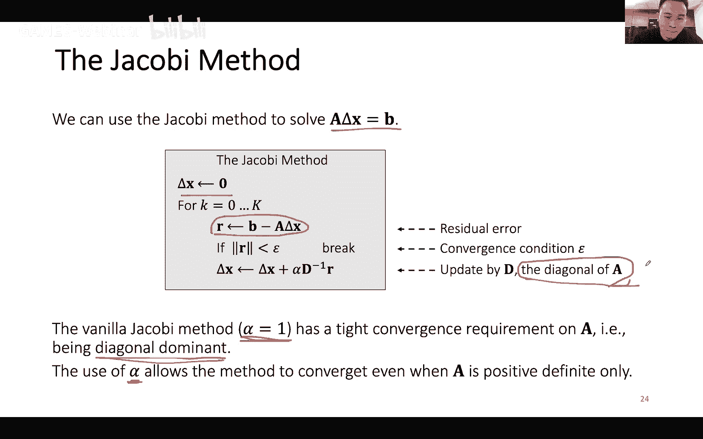

# GAMES103-基于物理的计算机动画入门 - P5：Lecture 05 基于物理的布料模拟 🧵


在本节课中，我们将要学习基于物理的布料模拟。我们将从基础的弹簧模型开始，探讨如何用它来描述和模拟布料，并分析显式积分与隐式积分两种方法的优劣。课程的核心目标是理解如何从物理能量和力的模型出发，构建一个稳定的布料模拟系统。

## 课程概述与安排

我们之前几周主要讨论了刚体模拟，现在将开启一个新的主题：布料模拟。布料模拟与头发模拟有一定联系，但各有特点。我们将用三周时间深入探讨布料模拟。

第一周，也就是今天，我们将重点讲解基于物理的仿真模拟，即如何根据能量和力的模型推导出布料模拟的方式。

第二周，我们将讨论约束，包括游戏开发中常用的PBD（位置动力学）方法、Projective Dynamics以及专门处理约束的Constraints Dynamics。

第三周，我们将讨论碰撞处理。布料的碰撞处理是最具挑战性的，掌握其方法后，处理其他模拟的碰撞会相对容易。

本节课将涵盖以下内容：首先讲解如何使用弹簧描述和模拟布料，包括显式和隐式积分方法。然后讨论弯曲模型的重要性，分析弹簧弯曲模型的不足及其他替代模型。最后，如果有时间，会介绍基于Shape Matching的非弹簧模拟方法。

## 弹簧模型基础

上一节我们介绍了课程的整体安排，本节中我们来看看如何用弹簧模型来描述一块布料。

一个理想的弹簧满足胡克定律。该定律指出，弹簧的力试图恢复其原长，且力的大小与拉伸长度成正比。

考虑一个一维弹簧，其一端固定在原点，当前位置为 `x`，原长为 `l`。那么弹簧的能量 `E` 为：
```
E = 1/2 * k * (x - l)^2
```
其中 `k` 是弹簧的弹性系数。

力 `F` 是能量对位置的负导数：
```
F = -dE/dx = -k * (x - l)
```
这个公式与我们中学物理所学的完全一致。

我们可以将此概念推广到二维或三维。假设一根弹簧连接了两个点 `i` 和 `j`，原长为 `l`。那么弹簧的能量为：
```
E = 1/2 * k * (||x_i - x_j|| - l)^2
```
其中 `||x_i - x_j||` 是两点间的当前距离。

力是能量对点位置的负梯度。对于点 `i` 和 `j`，其受力分别为：
```
F_i = -k * (||x_ij|| - l) * (x_ij / ||x_ij||)
F_j = -F_i
```
其中 `x_ij = x_i - x_j`。这表明作用力与反作用力大小相等，方向相反。

## 构建弹簧网络系统


上一节我们介绍了单根弹簧的模型，本节中我们来看看如何用多根弹簧构建一个布料网络。

根据物理原理，能量和力是可以叠加的。如果一个顶点连接了多根弹簧，那么作用在该顶点上的总力就是所有相关弹簧力的矢量和。

在实际模拟中，我们需要构造一个弹簧网络来描述布料。主要有两种方式：

**结构化网格**：假设布料由规整的方格构成。每个网格交点是一个顶点。我们需要以下几种弹簧：
*   **结构弹簧**：连接横向和纵向相邻顶点，抵抗拉伸。
*   **剪切弹簧**：连接对角线上的顶点（如45度和135度方向），防止布料在斜向过度拉伸。
*   **弯曲弹簧**：连接隔一个顶点的两个顶点（例如，跨越一个顶点的弹簧），用于抵抗布料沿边的自由弯曲，增加布料的挺括感。

一种常见的优化是采用交错的对角线弹簧布局，这样可以在减少弹簧数量的同时，兼顾各个方向的抵抗，避免模拟产生方向偏好。

**非结构化三角网格**：在服装设计等领域，布料的版型通常是不规则的三角网格。处理方式如下：
*   将三角网格的每一条边都视为一根结构弹簧。
*   对于网格内部的每一条边，将其所对的两个顶点（即不在这条边上的两个顶点）用一根弹簧连接起来，这根弹簧就作为弯曲弹簧。

## 从三角网格数据构造弹簧系统

上一节我们知道了需要哪些弹簧，本节中我们来看看如何从给定的三角网格数据中自动提取这些弹簧信息。

程序中的三角网格通常由两个列表表示：
1.  顶点位置列表：存储每个顶点的3D坐标。
2.  三角形索引列表：存储每个三角形所包含的三个顶点在顶点列表中的索引。

为了构造弹簧系统，我们需要从这些数据中提取出所有唯一的边（用于结构弹簧）和所有内部边（用于生成弯曲弹簧）。

以下是处理流程：
1.  **生成原始边列表**：遍历每个三角形，将其三条边（由两个顶点索引表示）与所属三角形索引一起，存储为一个三元组 `(v_a, v_b, triangle_id)`。为确保每条边有唯一的表示，我们总是将顶点索引按从小到大排序（例如，边(3,0)存储为(0,3)）。
2.  **排序与去重**：对所有原始边三元组按顶点索引进行排序。排序后，重复的内部边会相邻出现。
3.  **提取结构弹簧**：遍历排序后的列表。如果当前边与下一条边的顶点索引完全相同，则说明是内部边，跳过其中一条（去重）。剩下的唯一边就是最终的结构弹簧边。
4.  **提取弯曲弹簧**：在第二步去重时，被跳过的重复边就是内部边。对于每条内部边，我们知道它相邻的两个三角形。这两个三角形中，不在这条内部边上的那两个顶点，就是弯曲弹簧需要连接的两个顶点。

通过以上步骤，我们就可以从三角网格数据中构造出完整的弹簧系统。


具体实现代码将在作业示例中提供，感兴趣的同学可以深入研究。

## 显式积分模拟

有了弹簧系统，我们就可以开始模拟了。首先介绍显式积分方法。

一个简单的粒子系统更新步骤如下：
1.  对于每个顶点 `i`，计算其受到的总力 `F_i`（包括重力、弹簧力等）。
2.  根据牛顿第二定律更新速度：`v_i_new = v_i + Δt * F_i / m_i`
3.  根据速度更新位置：`x_i_new = x_i + Δt * v_i_new`

对于弹簧系统，我们只需在第一步的力计算中加入所有相关弹簧的力即可。计算每根弹簧的力时，我们需要：
*   弹簧连接的顶点索引 `i` 和 `j`。
*   弹簧的原长 `l`（可预先计算）。
*   根据公式 `F = -k * (||x_ij|| - l) * (x_ij / ||x_ij||)` 计算力，并分别加到顶点 `i` 和 `j` 的合力上。


## 显式积分的问题与隐式积分

上一节我们介绍了简单的显式积分，本节中我们来看看它存在的一个严重问题：数值不稳定性。

当弹簧的弹性系数 `k` 很大，或模拟的时间步长 `Δt` 较大时，显式积分容易产生“过冲”现象。这是因为过大的力会使顶点位置更新过度，越过平衡点，甚至在下一次迭代中产生更大的力，导致顶点位置发散，最终模拟崩溃。

解决思路之一是缩小时间步长 `Δt`，但这会显著降低模拟效率。因此，在需要稳定模拟或处理“刚性”系统时，我们更常使用隐式积分方法。

隐式积分使用未来时刻的状态来计算力，其更新公式如下：
```
v_new = v + Δt * M^{-1} * F(x_new, v_new)
x_new = x + Δt * v_new
```
这里 `F(x_new, v_new)` 是在新位置和新速度下的力，是未知量。这使得方程难以直接求解。

## 隐式积分转化为优化问题

为了求解隐式积分方程，我们首先假设力是保守力，且只与位置有关（如重力、弹簧力），即 `F = F(x)`。我们可以通过代入消元法，将方程组化简为只关于新位置 `x_new` 的方程。

更重要的是，我们可以证明，求解这个方程等价于求解以下非线性优化问题：
```
x_new = argmin_x { (1/(2Δt^2)) * (x - x̃)^T M (x - x̃) + E(x) }
```
其中 `x̃ = x + Δt * v` 是仅根据当前速度预测的位置，`M` 是质量矩阵（通常是对角阵），`E(x)` 是系统的势能（如弹簧势能）。

这个优化问题的含义是：新位置 `x_new` 使得“惯性项”（粒子试图保持预测运动趋势）和“势能项”（系统试图降低势能）的加权和最小。

通过这种转化，我们将物理模拟问题转化为一个数学优化问题，从而可以利用成熟的优化算法来求解。

## 牛顿法求解优化问题

上一节我们将模拟问题转化为了优化问题，本节中我们来看看如何使用牛顿法来求解它。

对于标量函数 `f(x)`，寻找其极小值点等价于寻找其梯度（一阶导数）为零的点：`∇f(x) = 0`。牛顿法的核心思想是利用泰勒展开进行迭代逼近。

假设当前迭代点为 `x_k`，我们希望在这一点附近对梯度函数 `∇f(x)` 做线性近似：
```
∇f(x) ≈ ∇f(x_k) + H(x_k) * (x - x_k)
```
其中 `H(x_k)` 是函数 `f` 在 `x_k` 处的海森矩阵（二阶导数）。

令近似梯度为零，即可解出下一步的迭代点 `x_{k+1}`：
```
x_{k+1} = x_k - H(x_k)^{-1} * ∇f(x_k)
```
对于我们的布料模拟优化问题，`f(x)` 就是之前定义的目标函数。其梯度 `∇f(x)` 为：
```
∇f(x) = (1/Δt^2) * M * (x - x̃) + ∇E(x)
```
而 `∇E(x)` 就是负的力 `-F(x)`。海森矩阵 `H(x)` 为：
```
H(x) = (1/Δt^2) * M + H_E(x)
```
其中 `H_E(x)` 是势能 `E(x)` 的海森矩阵，即力的雅可比矩阵（刚度矩阵）。

因此，布料模拟的隐式积分牛顿法迭代步骤为：
1.  初始化新位置 `x`（例如用 `x̃`）。
2.  计算当前梯度 `∇f(x)` 和海森矩阵 `H(x)`。
3.  求解线性方程组 `H(x) * Δx = -∇f(x)`，得到位置增量 `Δx`。
4.  更新位置：`x = x + Δx`。
5.  重复步骤2-4，直到收敛（如 `Δx` 足够小）。
6.  最后，用更新后的位置计算新速度：`v_new = (x_new - x) / Δt`。

## 弹簧系统的海森矩阵与数值求解

上一节我们介绍了牛顿法的框架，本节中我们深入看一下弹簧系统海森矩阵的特点和数值求解的细节。

对于弹簧系统，整个网络的海森矩阵 `H` 由每根弹簧的贡献叠加而成。每根弹簧对其连接的两个顶点 `i` 和 `j` 的贡献是一个 `6x6` 的块矩阵，放置在大矩阵的 `(i,i)`, `(i,j)`, `(j,i)`, `(j,j)` 块位置上。

一个重要的性质是，当弹簧被拉伸时，其贡献的块矩阵是半正定的；但当弹簧被压缩时，这部分贡献可能变得非正定。这可能导致整个海森矩阵 `H` 非正定。

在优化中，如果海森矩阵始终正定，则目标函数是凸函数，保证存在唯一全局极小值。非正定则意味着可能存在多个局部极小值（例如，一根被挤压的弹簧可能向左或向右弯曲，形成两种不同的稳定状态）。在实际模拟中，非正定主要影响的是某些线性求解器的稳定性。一个常见的处理技巧是，当检测到弹簧处于压缩状态时，忽略其海森矩阵中可能导致非正定的项。

求解牛顿法中的线性方程组 `H * Δx = -∇f` 是关键步骤。主要有两类方法：
*   **直接法**（如LU分解）：精度高，但对于大规模矩阵（顶点数多）内存消耗大。
*   **迭代法**（如共轭梯度法）：内存消耗小，适合大规模问题，但收敛速度和精度依赖于矩阵条件数，通常需要预条件子。

在实际应用中，根据问题规模和可用硬件进行选择。

## 经典论文与课程总结

在本节课中，我们一起学习了基于物理的布料模拟基础。

我们从最简单的弹簧模型出发，解释了如何用胡克定律描述布料的拉伸行为。接着，探讨了如何将三角网格转化为弹簧网络系统，包括结构弹簧和弯曲弹簧的构造方法。

我们分析了显式积分方法的简单直观性及其固有的数值不稳定性问题，这引出了对隐式积分的需求。通过将隐式积分方程转化为等价的非线性优化问题，我们能够更稳定地求解系统状态。牛顿法为求解该优化问题提供了框架，其中涉及梯度、海森矩阵的计算以及大规模线性方程组的求解。

最后，推荐一篇该领域的经典论文《Stable but Responsive Cloth》，它最早将隐式积分引入布料模拟，尽管其推导视角与本节课的优化视角略有不同，但本质相通，是深入理解布料模拟的重要资料。

本节课的内容，特别是隐式积分部分，是许多物理模拟方法（如有限元法）的核心基础。理解这一框架，对于后续学习更复杂的模拟技术至关重要。



