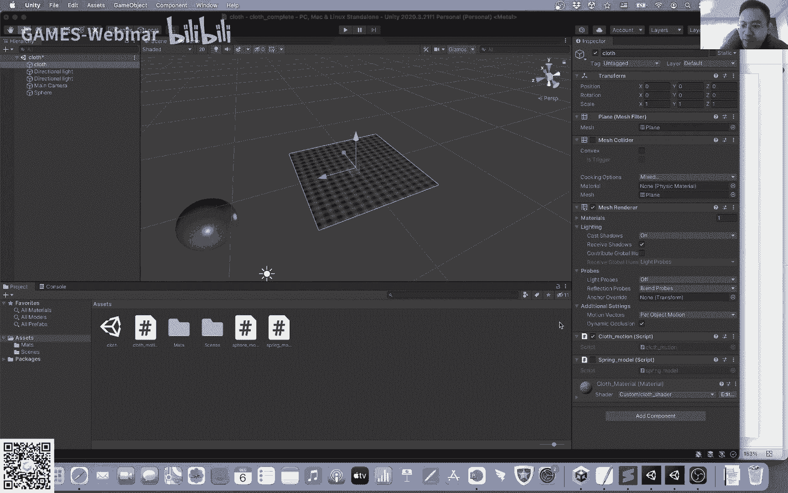

# GAMES103-基于物理的计算机动画入门 - P6：Lecture 06 约束方法：PBD、PD及其他 (Lab 2) 📐

在本节课中，我们将学习布料模拟中的约束方法，特别是位置动力学（PBD）和拉伸限制（Strain Limiting）。这些方法为处理布料等可变形体的模拟提供了稳定且高效的解决方案。课程内容将涵盖基本概念、算法实现及其优缺点，帮助你理解如何在实际项目中应用这些技术。

## 作业延期与提交说明 📝

关于第一次作业的提交，我们注意到部分同学时间紧张。因此，作业可以适当延期提交。但请注意，每晚提交一天，成绩将扣除20%。若延迟超过五天，该次作业成绩将不计入总分统计，但你仍可提交并获得助教的反馈。我们鼓励大家尽量在五天内完成作业。

作业相关问题可以在微信群的小程序圈子中提问。如果是普遍性问题，建议在公共论坛提问；如果是具体代码问题，可以直接联系助教。实践是学习计算机课程的关键，完成作业能帮助你深入理解知识，巩固学习成果。

## 第二次作业介绍：布料模拟 👕

第二次作业与当前课程内容紧密相关，目标是模拟一块布料的动态效果。作业提供了一个名为“Cloth”的场景，其中包含一块布料和一个用于交互的小球。

布料有两个固定点（顶点0和顶点20），模拟时用户可以拖拽小球与布料进行交互。上图展示了使用位置动力学（PBD）技术实现的效果。布料的弹性表现可以通过调整迭代次数来控制：迭代次数越少，布料显得越有弹性；迭代次数越多，布料则显得越硬。请注意，当前模拟未处理布料的自相交，仅处理了布料与球的碰撞。

作业包含两个部分：
1.  **位置动力学（PBD）方法**
2.  **隐式积分弹簧系统方法**

若要使用隐式积分方法，你需要在提供的两个脚本之间进行切换。

隐式积分部分旨在帮助大家巩固上周所学的知识。在实际作业实现中，我们采用了一种近似的简化方法，使用一个对角矩阵来近似海森矩阵（Hessian），从而将解线性系统的步骤简化为一个直接的更新操作。具体的实现公式将在作业描述中给出。这种方法虽然并非标准的牛顿法，但其收敛原理我们将在后续课程中详细探讨。

## 布料模拟中的弯曲模型 🔄

上一节我们介绍了弹簧系统的基本模拟。本节中，我们来看看弹簧系统在模拟布料弯曲时存在的缺陷，并探讨更优的弯曲模型。

弹簧系统的一个主要问题是模拟弯曲抵抗时不够准确。例如，使用连接两个相对顶点的“弯曲弹簧”时，当两个三角形几乎共面并发生轻微弯曲时，弹簧长度的变化极小，导致产生的抵抗力非常弱，这与真实世界中纸张或布料的弯曲感觉不符。

一个更直观的思路是利用两个三角形之间的二面角（Dihedral Angle）来定义弯曲力。这种方法被称为**二面角方法**。

对于一个由四个顶点构成的二面角，弯曲力可以写成一个关于二面角θ的函数。每个顶点上的力 **f_i** 可以表示为：
**f_i = k(θ) * u_i**
其中，**k(θ)** 决定了力的大小，**u_i** 决定了力的方向。

推导**u_i**的过程基于几个合理假设：
1.  顶点1和2上的力应分别沿着各自三角形的法向 **n1** 和 **n2**。
2.  弯曲不应导致连接顶点3和4的边发生形变，因此作用在顶点3和4上的力之差应垂直于该边。
3.  所有弯曲力作为内力，其合力应为零。

基于这些假设，可以推导出各个**u_i**的表达式。而力的大小函数 **k(θ)** 的一种常见形式为：
**k(θ) = k * (e^2 / (|n1| * |n2|)) * sin((π - θ)/2)**
其中，k是常数，e是边长，|n1|和|n2|是两个三角形的面积（即未归一化的法向量模长）。若要定义非平面的静止状态（初始夹角θ0），公式可修改为包含 **sin((π - θ0)/2)** 项。

这个基于力的模型优点是与显式积分兼容，但缺点是没有明确的能量定义，用于隐式积分时求导会比较麻烦。

另一种更简单的模型是**基于余切权重的拉普拉斯弯曲模型（Discrete Shells）**。该模型基于两个假设：布料静止时为平面，且模拟中拉伸形变很小。

它定义了一个能量函数 **E(x)**：
**E(x) = (k/2) * (x^T * Q * Q^T * x)**
其中，**x** 是所有顶点位置排成的向量，**Q** 是一个由余切权重（cotangent weights）构成的常数矩阵。这个能量函数本质上是在计算离散曲率的平方。当布料完全平整时，曲率为零，能量也为零；弯曲时，能量增大，产生恢复力。

该模型的优点是能量函数是二次的，其梯度（力）和海森矩阵都非常容易计算，**f = -k * Q * Q^T * x**，**H = k * Q * Q^T**，非常适合隐式积分。缺点是当布料发生较大拉伸时，其准确性会下降。

## 布料模拟中的锁定问题 🔒

接下来，我们讨论布料模拟中一个重要的现象：**锁定问题（Locking Issue）**。

理想情况下，布料的拉伸和弯曲应该是互不影响的。但在弹簧系统模型中，当弹簧非常刚硬（stiff）时，它可能会阻止布料在某些方向上的弯曲。例如，一个由两个三角形组成的布料，如果沿着对角线弯曲可能很自由，但若想沿着另一条边弯曲，中间的弹簧就会像支柱一样顶住，导致无法弯曲。

这种现象的本质是**自由度丢失**。对于一个流形网格，其自由度数量约为 **3 + 边界边数量**。当网格分辨率较低且弹簧非常刚硬时，约束（边）的数量几乎与变量（顶点坐标）数量相当，导致系统没有足够的自由度来表现弯曲，从而被“锁死”。

解决锁定问题没有完美方案，常见的工程性方法包括：
*   降低拉伸弹簧的弹性系数。
*   允许弹簧在一定长度范围内自由活动而不产生力。
*   提高网格分辨率（让顶点更密集）可以在视觉上缓解问题。

但需要注意的是，这些方法并不能从根本上解决数学模型本身的局限性。有限元方法同样存在类似的锁定问题。

## 约束方法：位置动力学（PBD）🎯

上一节我们探讨了模型本身的问题。本节开始，我们将学习一类强大的模拟方法——约束方法，它旨在稳定地模拟高刚度材料。

首先从单根弹簧的约束开始。我们希望弹簧保持原长 **l0**，即约束函数 **C(xi, xj) = |xi - xj| - l0 = 0**。

**投影函数（Projection Function）** 的目标是：找到新的顶点位置 **xi\', xj\'**，在满足约束 **C=0** 的前提下，使位置变化量 **Δx** 尽可能小，同时保持质心不变。这可以转化为一个数学优化问题。

推导得到的投影公式为：
**xi\' = xi + (wi / (wi + wj)) * (|xj - xi| - l0) * ((xj - xi) / |xj - xi|)**
**xj\' = xj - (wj / (wi + wj)) * (|xj - xi| - l0) * ((xj - xi) / |xj - xi|)**
其中，**wi, wj** 是顶点的权重，通常与质量成反比。固定点可以通过设置极大质量来实现。

对于多根弹簧（多个约束），有两种主要的迭代处理方法：

1.  **高斯-赛德尔（Gauss-Seidel）方法**：按顺序逐一处理每条边，立即更新其顶点位置，然后处理下一条边。处理完所有边后，再从头开始多次迭代，直至约束被较好地满足。这种方法简单，但更新顺序会影响结果，且难以并行化。
2.  **雅可比（Jacobi）方法**：对每条边，计算其建议的顶点位置更新量，但不立即应用。对于每个顶点，收集所有相邻边对其的更新建议，然后取这些建议的平均值（或加权平均）来最终更新顶点位置。这种方法易于并行化，能减少顺序依赖带来的偏差。

基于投影思想，**位置动力学（Position Based Dynamics, PBD）** 算法流程如下：
1.  对所有顶点进行常规的粒子运动更新（如显式积分）：**v = v + Δt * f_ext / m**, **x = x + Δt * v**。
2.  基于当前顶点位置 **x**，通过多次迭代（高斯-赛德尔或雅可比方法）应用约束投影，得到满足约束的新位置 **x\'**。
3.  根据位置变化更新速度：**v = (x\' - x) / Δt**。
4.  用 **x\'** 覆盖 **x**。

PBD的特点：
*   **优点**：概念简单，易于实现和并行化，通用性强（可用于布料、流体、刚体等），在低分辨率模型上效率高。
*   **缺点**：缺乏明确的物理参数（如杨氏模量），材料的“刚度”由迭代次数和网格密度等非物理参数控制，没有收敛到精确解的理论保证，在高分辨率下效率下降较快。

PBD非常适合游戏等实时应用中对低精度可变形体的模拟。

## 约束方法：拉伸限制（Strain Limiting）📏

PBD缺乏物理含义，而**拉伸限制（Strain Limiting）** 可以看作是其与物理模拟结合的一个改进。它的核心思想是：在正常的物理模拟步骤之后，增加一个后处理步骤，将过大的形变“拉回”到可接受的范围内，从而增强模拟的稳定性。

对于弹簧，我们定义拉伸率 **σ = l / l0**。我们允许拉伸率在一个范围内 **[σ_min, σ_max]** 内变化。投影函数的目标不再是严格保持原长，而是将当前拉伸率 **σ** 修正到目标范围 **clamp(σ, σ_min, σ_max)** 内。

修正后的目标长度 **l\' = clamp(σ, σ_min, σ_max) * l0**。然后使用与PBD类似的投影公式，将弹簧长度调整到 **l\'** 而非 **l0**。当 **σ_min = σ_max = 1** 时，就退化成了PBD。

对于三角形面积约束，思路类似：计算当前面积A，将其修正到允许范围 **[A_min, A_max]** 内，得到目标面积 **A\'**。然后通过缩放三角形（保持质心不变）来使面积接近 **A\'**，缩放因子 **s = sqrt(A\' / A)**。

拉伸限制的用途：
1.  **增强稳定性**：防止物理模拟在发生大形变时出现数值不稳定、抖动甚至崩溃。
2.  **模拟非线性材料**：例如某些布料，在小拉伸时很柔软，达到一定阈值后变得非常刚硬。可以在小形变时用物理模拟，大形变时启用拉伸限制来近似这种效果。
3.  **缓解锁定问题**：通过允许一定范围内的形变，相当于降低了有效刚度，使弯曲更容易发生。

## 课程总结 🎓

本节课我们一起学习了布料模拟中的核心约束方法。
*   我们首先分析了弹簧系统在弯曲模拟上的不足，并介绍了二面角模型和基于余切权重的拉普拉斯弯曲模型。
*   然后，我们探讨了布料模拟中常见的锁定问题及其成因。
*   接着，我们深入学习了两种重要的约束求解方法：**位置动力学（PBD）** 和 **拉伸限制（Strain Limiting）**。PBD通过直接投影位置来满足约束，简单高效，适合实时应用；而拉伸限制则作为物理模拟的稳定器，将过大形变限制在合理范围内。
*   这些方法为处理高刚度材料和保证模拟稳定性提供了实用工具。

在下节课中，我们将继续探讨更高级的约束方法，如投影动力学（Projective Dynamics），它们试图在物理准确性和计算效率之间取得更好的平衡。

