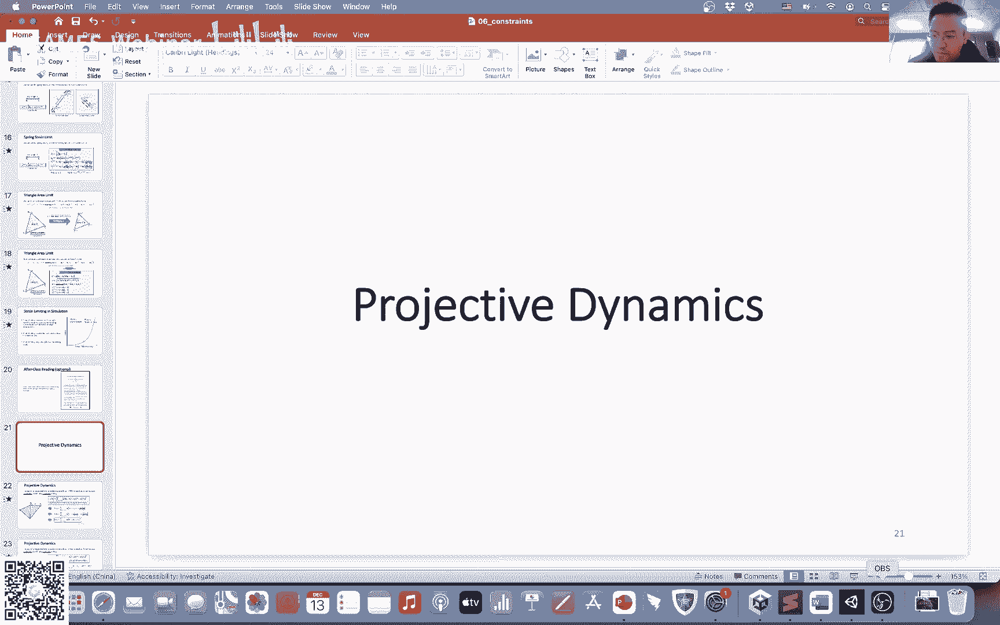
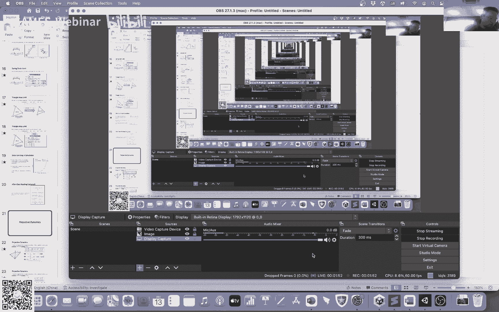
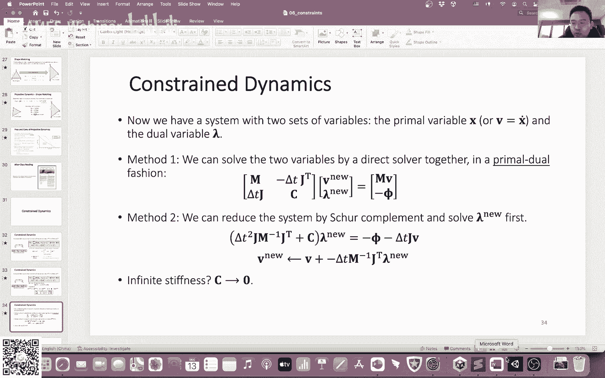
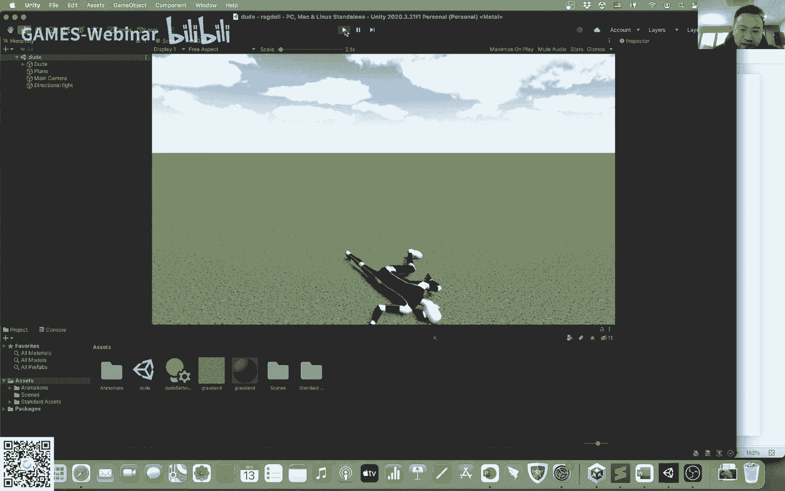

# GAMES103-基于物理的计算机动画入门 - P7：Lecture 07 Other Constrained Methods and Finite Element Method I - GAMES-Webinar - BV12Q4y1S73g

行啊，然后回答一下那个同学的问题，就是你可以可以用其他，可以用其他引擎交作业是可以的，我看到有的同学还用自己写的引擎做了作业，啊有回声是吗，我看看啊，回声，现在呢现在有回声吗，现在应该好了吧。

ok然后那个啊因为杭州这边有点疫情，所以说我本来一直想恢复那个恢复那个线下客的，但是因为有疫情的原因，所以说咱们线下客就暂时可能就呃暂时先都取消掉了，还有回声啊，我看看，怎么会还有回声呢。

有吗回声喂喂喂，有回声吗，ok行呃，然后我今天就是想把那个咱们那个呃计划给稍微改一下，因为我本来是想说我们今天上那个呃讲碰撞那一块，但如果说今天咱们讲碰撞，肯定到时候讲不完。

讲不完可能就会影响到下一次课，因为我下一次课是想啊讲那个有限元的，然后我们下次作业也是关于有限元的，所以说如果说咱们下次有限元这个东西讲不完的话，会影响到大家做作业啊。

所以说我就想把我们的计划稍微调整一下啊，就咱们今天会把啊我们上次的那个约束有个尾巴没讲完嘛，所以说我会把约束这一块啊继续讲完，然后就开始讲有限元啊，然后我们这周还有下周，都会讲有限元。

然后呢呃之后我们再会讲碰撞，大概是就是这么个调整一下，就是要把碰撞相当于挪到有限元后面去了啊，这个呃主要是对这个稍微做一些改变，然后那个我们今天主要是想谈那个约束那一块，因为咱们上周讲了约束。

讲了p p t，还有stray limit嘛，就是我们也谈到了，就是说用约束来啊模拟这个衣服啊，面料或者是其他物体的一些一些一些方法呃，然后呢我们也谈到了p p t它存在了一些问题。

比如说呃他这种模拟方式，它其实没有什么物理含义，所以说这周我们会讨论一些，就是怎么样把约束跟就是怎么样用约束可以呃做一些其他方式的模拟，也是约束，但是呢我们会把整个模拟引擎会写的。

跟ppd那种直接拿约束来修改顶点位置的方法，会有一些不一样的点啊，然后这个东西其实也相当于是给大家一个科普，因为呃我个人觉得这一块可能会有一些超前呃，但是呢有很多新的技术。

新的引擎它多多少少会用到这些方法，他也会用到这个方法，所以说我们会今天会稍微呃把这些简单的方法给大家过一遍啊，这是前半部分，然后后半部分呢我们会开始讨论有限元，然后根据我们的进度。

我们看看我们今天能讲多少算多少好吧，然后今天首先第一个就是给大家介绍一个方法，叫做projective dynamics。

这个projective dynamics跟我们上周讲的用约束做p p t的方式，它其实有很多相同点，但是它的不同点呢也很明显，呃，它的不同点主要体现在哪里呢，主要体现在我们用约束来干什么这个事情上。

因为我们上周讲ppt，还有讲relimiting的时候，我们有了这些约束对吧，然后我们根据这些约束定义了一些投影的方式，就是这些投影方式可以让我们满足这些约束嘛，我们用这种投影方式直接去改变顶点的位置。

这个是ppt，那projective dynamics说呢，我不要去把这些projection这些投影方式拿来直接去修改位置，我用它去定义一个能量，那么比如说啊，比如说我这里给大家举个例子啊，看一下。

比如说我现在有个网格对吧，我有啊五条边，然后呢我这对于这五条边呢，我就分别定义了这个这么一个能量函数，假如说我有一条边，这条e这条边是a到g嘛，然后减去减去什么呀，减去它投影之后的状态。

换句话说我这个投影函数我不是拿来直接去修改顶点位置的，我之前我ppt里面我有了这个投影函数之后，我直接把这两个顶点的位置给修改掉了，我现在不修改顶点位置，我只不过把这两个新的顶点位置给它算出来。

然后我利用这两个新的顶点位置，我去重新构造了一个函数来模拟，这个就是我变成了我的这个函数啊，然后这个函数的里面的这个i i knew跟j new呢，就分别对应着我投影之后。

根据我这个约束更新之后的两个新的顶点位置，只不过我不拿直接去修改顶点位置，我定义的这么一个函数，然后我们可以来检查一下哦，这个能量函数它到底是个什么东西，首先我们看如果我们正常投影之后。

这个东西这个我红颜色方框里的这个东西，它是个什么玩意儿，假如说我投影完了之后呢，那么这两个新的顶点位置，它两个距离就应该是圆长了对吧，因为我投影完了之后，我应该理论上我应该完美的满足我这个原厂的要求。

所以说它长度肯定是l e，然后它的方向呢，它的方向肯定还是在这个i j这条边的方向上的，因为我们上周也讲过，我们对于一条边而言，如果说我们呃满足他这个约束，满足这个投影的话。

我肯定是还是在这个边的这个方向上进行移动的，我只不过挪近一点或者挪远一点，但是我始终是沿着这个i j这条边的方向在挪动的，所以说它的方向肯定就是始终还是i减j，然后除以它的这个长度，然后前面乘以l1 。

那么这是它这个我们实际上我们这个能量其实应该是这个样子，那么我们再进一步修改对吧，我可以把首先把前面这个括号里的这个东西啊，我把括号里的这个东西，我前后上下分子分母都乘以一个啊，这个鱼长度。

那么x减x j的长度对吧，我分子分母都乘，然后完了之后呢，我就可以把这个东西给它这个方向，这个东西可以挪到这个括号的外面去了，挪到外面去之后呢，你会发现因为它这个东西本质上就是一个单位向量嘛。

所以说它就是一，所以说整个东西就变成了长度减去原长的平方，这个大家反正把这个公式给稍微整理一下，就是自己体会一下吧，整理之后就会得到这么一个公式，然后你会发现什么。

你会发现它这个能量其实跟弹簧的能量是一样的，也就是说我们其实绕了一大圈，我们搞了这么一个投影，搞了这个约束，搞了这个投影函数，其实搞出来的这个能量函数跟弹簧的能量函数是一模一样的啊。

只不过我把这个投影算出来的这两个新的顶点位置，我把它相当于作为一个中间结果，然后这个中间结果因为我有了这个中间结果，一个二次函数，那么好，我现在有了这个能量对吧，我接下来看看我的力是什么样子的。

我立呢就对我利用这个能量，我把这个能量对x求导吗，那么好，我现在算力对吧，假如说我现在对这个顶点i我要算他的力，那么它的力是什么呢，这个f i呢等于负的能量的梯度，那么我就分我就对这个东西对x求导吗。

我这里做了一个大胆的假设，我等会儿我们会讨论为什么要做这个假设，这个假设有什么呃，有有有有有什么问题或者是没什么问题，我先假设这后面玩这玩意儿，先别管它，先假设它就是不变，是个常数。

那么就变成了真正的变量就在前面这个地方了，这里是唯一有x的地方对吧，那么我就对整个是一个二次的一个chratic的一个函数嘛，我对这个x求导，我就得到了k对吧，前面有负号，负号是根据我的定义来的。

所以说负号不管它，然后前面有个k，然后后面呢就是x减x j减去啊，这个新的这个呃这个两个顶点的位置，这个就是对这个能量对x求了一个档，那么这个力啊，我们再来对这个力做一些调整。

就首先我们刚才知道这个ex 6跟x j new分别是什么对吧，他俩的差等于l e然后乘以啊，就是就是这个方向嘛，这个咱们刚才也说过了，就是根据投影，投影完了之后，这个东西应该等于这个东西。

他应该是满足圆长的，同时它的方向是在这个方向，然后咱们再把这个东西再整理一下，我得到了什么，我得到了圆长啊，长度减去原长乘以方向啊，你如果把这个沉进去之后，你会发现前面这个东西呢。

前半部呢这个东西乘以这个东西抵消，然后前半部就是x减x j x j，所以说这个东西就是这两个就是等价的，大家如果呃没时间看的话，可以回去慢慢推一下，那么你看看这个力是什么呢，利又是什么呢。

诶它这个力它又是弹簧的能量，也就是说我绕了一大圈，我的能量跟弹簧的能量其实是一样的，我根据这个cdc的这个能量，我去对x求导算它的力，我会发现这个算出来的力其实跟弹簧的力诶也是一样的对吧。

换句话说我这个模型，我这个所谓的projective dynamics的整个模型，其实跟正常咱们模拟弹簧系统的力，跟正常模拟弹簧系统的能量是一模一样的，无非是我引入了两个中间变量。

这两个中间变量是根据我的这个投影，我这个约束的投影，我算出来的这两个中间变量，然后我利用这两个中间变量呢，我去构造了一个新的呃力跟新的能量，然后呢我得到了一个结果。

只不过呢这个结果跟我之前的弹簧是一模一样的，那么有同学可能就会问了，我何必多此一举，对不对，我为什么非要去用这个中间结果去构造这个力，构造这个能量，既然他俩跟这个正儿八经的做弹簧模拟都是一模一样的。

我何必这样做呢，原因在于什么，原因在于它的和声会不一样，我这里给大家举个例子啊，我觉得例子可能会比较简单直观一点，咱们有五根弹簧对吧，从0~101121314有五根弹簧，然后呢我构造了一个能量。

分别呢是由五个部分构成的，这五个部分呢就是针对着这五个能量，我搞了这么一个啊，总的这个能量函数对于整个系统而言，搞了这个能量函数吧对吧。

那么这个是我的projective dynamics的这个能量函数，那我的力呢，我对于零这个点的力啊，这个点的力呢我有三条边跟它相连，分别是绿的这几条边，蓝的这条边，还有橙色的这条边。

所以说我就有分别是由三个部分构成的，这个总的力是由三个部分构成的，分别是绿颜色的部分，蓝颜色的部分跟橙色的部分啊，分别对应了这三个不同的能量，然后我这个力怎么算呢，我就对这个东西求导吧。

因为它是一个二次的关于x关于顶点位置的一个二次函数啊，所以说我求导也变得很容易了，我就直接对它求个导，就等于是把这个括号里面的外面的这个二给去掉吗，二跟这个二抵消求导的时候，我们把二取抵消。

然后把这个中间的部分抄一下就可以了，然后为什么这两个位置改变了，是因为我力需要前面加个负号，所以说我前面加个负号之后，就相当于就是把后面的挪到前面，前面的挪到后面，所以说这就形成了一个力的形式。

这个没什么稀奇的啊，那么我们前面也讲了，这个能量跟这个力其实跟弹簧的能量跟力其实算出来的啊是一样的，结果是一样的，那真正特殊的是什么，真正特殊的是我的举证，那么矩阵是什么呢。

我举证就是能量对于顶点的二次导数，那在这里呢我其实是做了一个假设的，跟我们刚才对力求导的时候的假设也是一样的，我的假设是说我的顶点位置，我后面这个新的顶点位置，这个new啊，就是这这些所有的这些像啊。

这些new的这些项都是常数，都是跟x无关的，我认为它是常数，那么因为它是常数对吧，它跟x无关，我知道我的这个能量是关于x01 和x2 x3 的二次函数，也就意味着什么。

也就意味着我的黑神就变得非常简单了，我给大家看这个合成什么样啊，对于x0 而言，最上面这个东西，是什么，它是d e，对于x0 的二阶导数，他是二阶导数，然后我怎么看我这个二阶导数呢。

我看我这个能量里面x0 总共出现了三次嘛，对不对，绿颜色的一次，蓝颜色的一次，橙颜色的一次，总共出现了三次，然后它的二阶导数就是三乘以k乘以identity矩阵，然后呢第二个1号顶点。

1号顶点呢出现了两次，分别对应的是绿颜色的部分跟黄颜色的部分对吧，所以说这里就是22k i，然后第三个也就是x2 x2 呢，它有啊出现了几次，我看一下蓝颜色的出现了一次对吧，黄颜色的也出现了一次。

然后然后紫色的出现了一次，所以说它就是3k啊，然后其实这个东西啊，这个和声啊从这个图上非常容易看出来，怎么看，你看每一个顶点它领了几条边，它相邻的几条边，那么他这个对角上就是几。

比如说这0号景点它相对的三条边，所以就是三，然后下面的x一相邻的两条边就是2x2 相邻的三条边就是三，然后x3 相邻的两条边，那么就是二，然后非对角上非对角上存的是什么呢，非对角上存的是边。

比如说我绿颜色，绿颜色的这条边相邻的是0号定点跟1号定点，那么我零一跟一零的位置，我就存的是-1，然后呢零二，那么我相对应的零跟二这个零二跟二零的这个顶点位置，我存的是负的。

负的k就是相当于你可以根据这个拓扑，根据整个这个图，这个图你可以把它相当于转化成这么一个合适，而且你会看到这个河神其实跟这个，你把这个e这个能量对顶点求二次导数算出来的结果是一样的，利用这个公式。

也就是说其实你用利用这个projective dynamics，它这个特点，你可以假设说它这个东西就是一个关于x关于顶点的一个二次函数，然后因为它是个二次函数，那么它的这个二他这个二阶的这个举证啊。

他这个合成矩阵就变得很简单了，它就变成了一个常数矩阵了，这个其实是project dynamics的关键，就是他绕了这么一大圈啊，根本的目的是什么，根本的目的就是为了利用我的这个假设。

我假设这个能量它是一个顶点位置的二次函数，我构造了一个常数的一个合成矩阵，这实际上是它的一个根本目的，那么有了这个常数矩阵呢，我剩下的部分其实跟我们正常做影视积分的那个模拟方式是一样的。

无非就是说我前面多了一步，就是计算投影的这一步，我计算一下投影计算投影完了之后呢，呃我根据投影算那个力，这个其实不影响啊，就你直接拿去用弹簧的算力，其实也是ok的。

然后呢你前面呢就是呃我们也是呃经常做的嘛，就是质量，然后这是一个合成矩阵，然后只不过这个合成矩阵跟我弹簧模拟的合成矩阵是不一样的，我们正常我们要计算影视积分的时候，我们那个弹簧的系统的这个合成矩阵。

我需要根据实际的顶点位置计算出来的，而这里呢因为我前面做了这么多的假设之后呢，我就假设这个和弦它就是个常数矩阵了，所以说我这个就变成了一个非常简单的一个常数矩阵。

我把这个常数矩阵作为我的这个呃这个这个问题的这个部分，那么为什么要这么做啊，它的原因在于什么，它这个原因在于当你这个取证这么一个矩阵，它是一个常数的时候，是一个常数矩阵的时候，我就可以用直接法去解。

因为我们做直接法，我们用l又分解或者是用kosity分解直接法去解信息系统的时候，它有很大的一部分计算量是花在分解上的，就是我首先给一个矩阵，我要把它分解成下三角跟上三角嘛。

如果大家还记得我们第二节课的时候，我们讲那个写写新系统的时候，我需要把它先分成上下两部分，分成上下两部分之后，完了之后我再用迭代的一个方式，我分别对l跟u做做求解嘛，对吧。

这里的计算量其实主要在前面那个部分，就是分解这个部分上，那如果说我这个矩阵是个常数矩阵的话，也就意味着我只需要分解一次就可以了对吧，我只要把它分解一次，然后分解一次，完了之后，我这个计算量就省下来了。

之后我在模拟的时候，我只要对分解出来的这个结果我就分别迭代求解，这样子的话我就可以让我的整个模拟可以很快的跑起来，这个其实是projective dynamics这个方法，它推出来的主要原因在于此。

他最终的目的就是想要搞这么一个常数矩阵，然后有了这个常数矩阵之后呢，我可以分解一次，分解一次，完了之后我就一劳永逸的哎，我就可以简单求解了，这是它的一个呃根本目的，那么为什么这个方法可以这么做对吧。

因为尤其是大家就是我看有同学也问了嘛，就是说咱们正儿八经的做弹簧系统，正儿八经地去解牛顿法，我需要得到真正的这个弹簧系统的和声，对不对，这个是我们正经的这个牛顿法吗，但是为什么我不去用真正的喝水。

我去用各种各样假的这种合成这个方法，它也可以work对吧，我们其实前面举了很多例子了，我给大家可以回顾一下，就是比如说我们上上周的时候，我们讲说我们对这个合成做一些修改，我强制的让它变成正定的矩阵啊。

这是一个方法，我们其实谈过，但是我没有细谈，我看到有同学也问了，说哎这个方法怎么也会work对吧，为什么我去修改这个和弦，把它硬给它搞成镇定的，这个方法也能收敛，然后咱们作业里其实也是一个新的方法。

对不对，我们作业里甚至都没有去做合成的计算，我直接就是给了大家一个公式，一个魔法公式嘛，然后大家利用这个魔法公式啊去计算这个deltx这个方法居然也work，对不对。

然后呢刚才我们讲project dynamics，大家也看到了，我搞了这么一个常数矩阵，我利用这个常数矩阵，我去解这个东西，它也work，那么事实上呢这个方法它其实是一系列的方法。

我们其实到讲有些人的最后一天的时候，我会给大家谈一谈这个方法为什么会work的，但是简单的说呃，你可以认为就是说我不需要严格的去计算这个合适，我可以做很多近似，然后只要我这个近似是合理的。

我只要我这个进四是正定的啊，我都可以保证它是收敛的，那么这个收敛其实他其其实他这个收敛好不好，取决于你这个和尚到底近似的好不好对吧，我这个如果说我跟这个和尚长得很像，我跟我有个矩阵，我跟和成长的很像。

那么我近似就会更好一点，我的收敛就会更好一点，更快一点，如果说我进四的完全风马牛不相及的，那么我的这个效率就会更低一点，甚至于如果说你不用合成，你直接用一个identity matrix。

用一个单位矩阵，他也能收敛，只不过这样的效率就会很低了啊，我们回头会进一步的去分析这个方法，但是反正就是给大家提一笔，就是只要你去做一些简单的近似，它其实也是一个能够模拟的一个方法，好吧。

然后这个嗯反正就先到此为呃，反正project dynamics我就先到此为止了，这个我就想我就想先不讲了，大家这里有没有什么问题，我感觉讲的可能有点快，我看看，就是简单的说就是我的力，我的我的能量。

我的力其实跟正常的弹簧系统都是没有区别的，唯一的区别就是我的取证，因为我projective dynamics，我做了很多简化，做了很多近似，不是简化，做了近似，导致我估出来的这个河神变得很简单啊。

然后呢我跟呃，然后我就可以很简单的去模拟这个东西，这个反正大家理解吧，我看大家也是啊，也是要理解一下这个东西，做完投影以后在影视积分求解吗，我看一下啊，这里，嗯对于这个而言，其实都不需要。

就是你可以算完投影以后再算力，但是因为这个力对于弹簧系统而言，这个力跟弹簧的力是一样的吗，所以说你直接算利，也可以，直接用弹簧的力算也可以，那对于弹簧系统而言的话，那就完全不需要做任何投影了。

但是有的东西它需要投影，就比如说呃我我刚才就是给大家给大家讲，就是比如说你做shape match的时候，他需要投影，因为shape match他没有办法直接根据像类似弹簧那样可能算个例。

所以说他有投影那一步，其他的其实跟饮食积分是一样的，就是你其实可以甚至你就可以直接理解成我做影视积分，只不过我偷懒，我不直接去算，真的和审，我搞了一个简单的方法，我去估算这个合成。

然后我然后我让这个我假设这个合成是个常数矩阵，所以说我就把整个东西搞得很简单了，大概是这么一个思路，同一个顶点在不同边的投影不同，对是的，就是同一个顶点在不同边的投影是不同的，就比如说这里嘛。

比如说比如说0号顶点对吧，0号顶点它其实就是有三个不同的位置了，就分别对应三条边了，它有三个不同的位置，我这里其实我的这个下标什么的都搞得很乱啊，其实大家反正就是回头可能有时间再仔细看一下。

就大概能理解吧，就是每个顶点它其实对于不同边都有自己的位置，projective dynamics ppt用的多么，效率多少啊，我先回答前面那个问题吧，前面有个同学问有限元的和神，有些人的和声。

咱们呃下下周可能会讲就是怎么样对有限元算算和审，但是那个东西确实是挺复杂的，所以说可能也是有点像科普那样的性质吧，反正给大家大概讲一下这个意思是什么样的意思。

projective dynamics跟ppt在游戏中用的多，游戏里面一般来说用的是p p t为主，呃如果说你要做模拟的话，一般是p p t为主，然后游戏里面用的更多的是骨骼动画。

就是它其实并不是模拟的，它是根据人体，因为一般来说他们一般模拟就是一件衣服穿在人身上，所以说它是根据人体骨骼，它去驱动这个衣服，然后它会采用一种类似混合式的模拟方式，就是一半它是根据个人体骨骼带来的。

然后另一半它是类似一个p p t的这种，然后呢我其实呃p p t其实没有讲太多，就是说游戏里面怎么搞，其实这里面还是有蛮多细节的，其实有一点没有谈到的，就是我们很多模拟方式，它其实都都不是计算为主的。

就大家可能听了这句话觉得很奇怪，就是说什么叫做不是计算为主的，我们这里不是有好多公式吗，好多计算公式吗，对不对，事实上这些计算公式对于我们当代的g p u c p而言，其实都是计算不了太多时间的。

他真正的计算开销，他真正的时间开销在哪里，在内存访问上，因为我你看我们每一次计算这些每一个迭代，我都需要去访问顶点的位置，所以说他很多时候就是在访问main memory或者是gpu memory。

global memory的这个计算成本上的成本上，反而他这个计算过程它其实是很快的，那么对于p p t而言，它其实它的优点并不在于说它这个精准或者是什么。

它这个p p t它这个最大的优点在于它的内存访问非常的少，因为他没有什么所谓的物理，没有什么物理变量，也没有什么啊，什么速度什么它其实都可以暂时忽略不计嘛对吧，他就是直接去修改顶点位置。

也就是说他唯一需要访问的信息就是顶点的位置，而其他的模拟方式，不管是project dis也好，还是其他的方式也好，你都有一些其他的变量，一些物理的变量你需要访问。

所以这就导致了其他方法它的物理它这个内存开销成本会更大一点，就实际上你在做一些比如说你要非常非常高的性能的时候，你反而是需要怎么样去优化你的内存访问，而不是说简单的去。

比如说呃就是把你这个计算方式给它调整，其实这个带来的提升是很少的，真正带来的提升主要是在内存访问上，你怎么样能够让内存访问的更连续，做这个优化也好，其实是一个蛮大的学问。

但是咱们这个课就不深的往下讲了好吧，然后咱们咱们先继续讲吧，这个咱们时间有限，然后有什么问题，咱们可以课后再继续讲，跳跳跳跳跳，然后我们接下来啊，接下来讲一下project dynamics的优缺点吗。

这个是给大家看了一些一个我从那个project dynamics，那个paper里面抠出来的一张图，然后蓝颜色的跟绿颜色的是是牛顿法，分别是用两种不同的方式去求解啊，呃蓝颜色的是用kosi分解。

也就是直接法解线性系统的直接法，然后p c g是那个一个迭代法，然后大家可以看到大概是这么一个呃效率收敛效率，然后红颜色的呢是project dynamics，然后可以看到什么。

可以看到他一开始的时候其实很快，对对对，对，头上那一点时间其实特别快，但是之后呢它这个效率就其实就不如牛顿法了，而且甚至再往后，如果说你的精度要求很高的时候，其实他这个收敛其实就会逐渐放缓。

它的优点主要是跟p p t比吧，跟p p t比，它的优点在于它其实是正常的弹簧系统是一样的，跟正常咱们做物理模拟的这个整个思路其实是一样的，利也好，其实都是一样的，它是有物理含义的。

在cpu上它这个效率是很高的，因为我可以用直接的解析系统的方法去求解嘛，而且我只需要只需要做一次分解就行了，所以说他在cpu上是很合适的嗯他一开始的时候收敛效率很高，大家可以看到啊。

缺点是及pu上它不太合适，因为直接法这种lu分解的方法在gpu上其实是不太合适的，然后它总的这个收敛其实并不是很理想，一开始虽然快，但是之后就下降了，然后呢如果说约束改变，什么叫约束改变。

也就是比如说我这个网格发生变化了对吧，我本来是呃五条弹簧，我现在变成六条弹簧了，或者是我比如说我想把碰撞也作为一种约束加进去，那么它就比较难处理了，因为我的这个矩阵是由我的这个约束形成的嘛。

那我约束改变了我的矩阵也需要变对吧，那么这个相对来说就会变成一个比较麻烦的一个点，这个反正就是给大家科普一下吧，就是大家有时间的话，其实还是可以呃去读一下这个paper。

这个paper paper讲的比较细，我就我就反正给大家介绍一下这个方法，然后第二个方法呃，我其实也想讲的，但是我可能不想花太多时间讲的叫做constrained dynamics。

这个名字其实听着有点费解，因为我们前面讲的这个ppt也好，project dynamics也是用constrain，这个跟前面那些方法有什么本质的区别啊，这个方法的提出，他其实想做一件事情。

就是他想处理非常非常非常stiff的约束，因为我们前面讲p p t还是讲project dynamics，还是讲弹簧系统的时候，我的约束其实我的弹簧也好，我的这个约束也好，其实都是很难严格的保证的。

那么如果说我想要严格的保证呢，我就需要做很多很多次的迭代，因为ppt project namics implicit，这个做这个影视积分弹簧系统，本质上我都需要做很多次迭代。

我才能够产生step的一个效果，那么如果我做很多次迭代，我就不可避免的，我就会有很大的计算量嘛，那么问题在于我有没有什么办法，我可以不需要做好多好多次迭代，我不需要花这么大的计算量。

我也可以很好的去模拟这些很stiff的约束呢，这个其实就是这个方法当初提出的一个呃思路，而且这个方法其实不只是用在呃我们模拟，比如说衣服啊，或者是其他里面，它也可以用，在很多时候。

它其实是用在刚体模拟上，就是咱们做刚体模拟的时候，有一类缸体叫做articulated body，就举个简单例子，就是人体，我可以把人体认为是好多钢体所构成的对吧，我的躯干，我的四肢，我的手臂啊。

然后我的这个头，我的脖子，我每一个地方我认为是个缸体吗，然后呢我缸体和缸体之间我是用关节所连接的，那么这一个关节它其实就是一个约束了对吧，比如说我的这个上臂和下臂，我的我的上臂跟我的我的这个躯干。

我希望通过肩膀这个关节来连接，那么这个关节是个约束，我要求说这个手臂跟去干，必须在这个肩膀的位置，它是重合的，他这个点的位置必须是同一个点，那么这个约束我其实是希望他这个约束是非常非常强的，为什么。

因为当你在模拟人体动画的时候，如果说这个约束不满足，那他这个四肢岂不是就是跟躯干分开来了，那就一点都不合理嘛，对不对，所以说我是希望模拟这个这种缸体，这种多缸体的这种彼此间的约束的时候。

我是希望这个约束是非常非常强的，就说这个方法它其实更多的时候是用在钢铁模拟上，我等会儿会给大家看一个例子，但是咱们这里我还是用弹簧来给大家展示一下，这个方法的思路是什么样子的，那首先假如说我有一根弹簧。

我这根弹簧的原长是l e，然后呢我有一个约束对吧，两个顶点的差的位置差减去l e，这个就是咱们的约束，这个是其实跟咱们之前讲的这个p p t啊，project dnamics啊，其实这个都是一样的。

约束，其实形式是一样的，没有区别的，那么接下来咱们看能量，咱们之前能量形式是这样子的，就是二分之k对吧，乘以这个长度减去原长的平方，咱们之前是这个形式嘛，那我们现在把这个改一改，我们改成什么呢。

我们首先看到这个括号里面这个东西啊，其实就是约束啊，对不对，其实这玩意就是这个fine嘛，翻译嘛对吧，那我可以把这个东西我把它写成一个关于约束的函数，怎么写，我把1/20，首先1/2写在前面。

然后其次呢我把饭给它写成一个大的向量，这个向量呢有多少行，它有一行，这个e是我们所有的约束的数量嘛，然后每一个约束它都有一个约数值对吧，那么也就是相当于这个东西就是一个大的向量吧。

这个就是分别是对应着这所有的编码，这个是f01 这样子，以此类推，我下来我就有好多好多约束到fn f1 ，这个是我的这个所有的约束，就针对的就是相当于我这里原来我是一个求和的过程。

只不过我原来是求和的时候，我有这我有一个和对吧，有有有一个和，那么我现在就把这个所有的这个每一个值我们都列成一个大向量了，然后这个c呢c是k inverse的一个对角矩阵。

我们把它叫做compliant矩阵，它就不是stiffness了，它不是挺度，它是柔软度，它是软度，我们把它叫做软度矩阵啊，compliant matrix。

然后你会发现这个东西跟前面咱们这个能量的呃形式是一样的，只不过呢我换了种写法，我一利用这个约束的这个向量，我写成了这么一个形式，但是大家如果把这两个东西啊乘一乘，这几个东西乘一乘。

你会发现这个东西其实跟这个东西是等价的，那么好，首先我们把这个能量换了种写法，那么接下来呢我们要对立也要换一种写法，因为我们能量写成这种写法了吗，我力也要换一种写法，那么我来怎么算力啊。

我利等于负的能量的梯度对吧，这个是咱们的定义，这个没别的可说的，就是定义，那么能量我原来是写成关于x的函数，所以就本来就是d e d x嘛，那么现在我这个里面因为我换了种写法。

我这个x变成了我约束的一个变量，我这个约束变成了一个顶点的函数了对吧，那么我就可以用偏微分来写，我就写成d e define乘以defy dx，这个是咱们求导的时候的链式法则。

这个大家应该学微积分应该都了解，dee defi乘以defi，dex相当于我这个five，我这个约束成为了我这个能量的一个中间变量，能量函数的一个中间变量，那么好我再往下走，首先我这有两个部分构成。

分别是这个绿颜色跟蓝颜色的部分对吧，呃我要对它做一个转置，那么转置完了之后呢，蓝颜色的东西都到前面了，绿颜色的都到后面了，所以这个东西没什么可说的，那么defi dx我把它叫做一个其叩变矩阵。

就是我这个约束啊，我这个约束对x求导，我把它叫做结构变矩阵，它是一个e乘以sin的矩阵，那么我这边就是蓝颜色的部分，就是j oia是defi d x那么dee defi是什么呀，根据我前面这个定义。

根据我前面这个关于能量，关于fi的定义对吧，我两边都有fine，我认为这个five是一个向量，那么对它求导之后，我就得到了，因为他这里有两出现了两次嘛，所以说跟这个二对掉了，跟二对掉完了之后。

我把他一个去掉，就得到了c inverse乘以反，就是后面这个东西就得到了绿颜色的部分，然后这个负号是从前面抄过来的，ok那我现在就是得到了一个利益的一个新的形式啊，我本来我这个力呢是啊。

直接根据一个公式算出来的，现在我把它写成了负的j q a乘以对inverse乘以y的一个形式了，那我这里再引入一个中间变量，这个中间变量呢我把它叫做拉格朗日算子，就是负的c inverse乘以负i。

这个就是lab的，这个是我从新的引入的一个中间变量，这个是关于约束的一个拉格朗日算子，但是大家如果不知道什么叫拉格朗日算子也没关系，反正就是我引入了这么一个变量，我把这个绿颜色的部分。

然后跟带着负号的绿颜色的部分，我用这个lambda给它替换掉，那么这个说明什么，这说明力我的力啊，就是我的chopian乘以我的lambda，这个是我想要得到的，那么我有了这个东西之后呢。

有了这个东西之后呢，我就想要做影视，我就想要跟我们之前一样，也是继续做影视积分了，只不过我做影视积分的时候呢，我之前我的影视积分是只有一个变量的，我们之前做影视积分就只有x这么一个变量吗。

我现在呢有了这个lamba之后呢，我就有两个变量了，我有x跟lambda，我是由两个变量构成的，这就是为什么我这里叫door variable，就是相当于第二个变量。

那么我怎么去用两个变量去做这个模拟啊，首先我知道根据影视积分啊，我知道说我这个动量是这么更新的对吧，这是动量的一个动量守恒的公式嘛，就是质量乘以新的速度等于质量乘以老的速度，加上时间乘以冲量。

对吧啊不是不是时间乘以冲，就是等于冲量，然后冲量等于什么呢，冲量等于冲量等于时间乘以力嘛对吧，因为我的这个只扣变an transport乘以lambda，这个是力吗。

所以说这个东西其实就是一个动量守恒的一个公式，就是动力就是动量的变化等于冲量，这个东西大家应该没有什么问题吧，这个就是冲量啊，这个东西就是动量守恒，然后这个这个后面这个部分就是力，就是这个力。

ok然后呢，我知道c乘以lambda等于负的法，为什么，因为lambda等于，因为lambda这个lambda好丑啊，lambda等于负的c inverse乘以φ嘛，就是咱们前面讲了吗，这是它的定义吗。

就是这个这个lambda等于负的c lambda等于负的saver fm，就是它定义，所以说我就照抄了这个定义，只不过我这个定义是在新的状态下，也就是未知的状态下为他写出来的，新的状态下写出来的。

然后呢我对这后面这个东西啊，我做一个泰勒展开负的新的约束，等于负的老的约束，这个是原来的约束减去折扣变乘以位置的变化量，然后这个折扣变呢咱们之前也讲过是defi dx，也就是位置的变化量。

然后这个呢等于负的f减去delta t h h q b乘以v6 ，因为位置的变化量等于速度乘以时间嘛，所以说我就有两个公式了，然后呢我把这两个公式合并起来，我就合成了这么一个系统，就是矩阵。

这边是我的举证啊，上面这个公式是质量，质量乘以v6 减去deltt乘以指扣边乘以lambda，new等于b就是第一个公式，下面这个公式呢就这个第一个公式就是变成了我的第一行。

然后下面这个公式变成了我的第二行，就大家如果把这个这两个公式都整理一下的话，就会得到这么一个结果，好然后我们这个事情其实就已经解决了吗，我们本质上我们就是想要得到一个公式去模拟我的这个位置对吧。

只不过我现在不用用位置，我用速度其实也是一样的，那么我这里呢跟我们之前做影视积分不一样的点在哪，我们之前做影视积分，我只有一个变量，我只有v61 个变量或者是x new一个变量，但是我现在有两个变量。

然后我把这两个变量同时的去解出来，就可以得到我的解，这就是首先第一点就是我有一个系统，我们刚才构造了这么一个系统，这个系统是由两个变量构成的，一个是我的这个主变量，我的顶点的位置或者是顶点的速度。

然后我的第二个变量是我的拉格朗日啊，我我我的这个lambda，然后有两个方法，第一个方法是直接法，直接法怎么解啊，我就是有这么个系统之后对吧，我就直接把这个系统给解出来了嘛。

我有各种各样解信息系统的方式，我就直接把这个系统解了就完了嘛，写完之后我就得到新的v跟新的兰姆达，然后我就根据这个新的v我就可以更新顶点的位置了，然后下一个时刻我就继续模拟。

我就得到了更新的v跟线性的level，我就一步一步地往前模拟，这种模拟方式在数学里面叫做prime do，什么意思，就是我两个变量我是一起去解，我同时求解的，这是一种方式。

然后第二种方式呢是我可以做一个校园，我把这个给它消掉，我只算lamba，我如果只算lamba的话，我会得到这么一个系统，然后呢我就把这么一个小的系统给它解出来，写完之后呢，我把这个v给他更新一下。

根据这个第一个公式，我把它更新一下，我就可以得到啊，结果那么这个方法呢就是分次的分两次来求解，第一次呢先把拉姆达算出来，然后再根据lambda把venue算出来，然后取决于你的不同的问题。

不同的这个呃问题，你这个两种方式都可以，但是取决于你不同的问题，你可能采用不同的方式，然后这里我想提一点的，就是说如果是你采用上面那种方式，第一种方式的话，你要特别注意，就是这个矩阵啊。

他有可能不是镇定的，因为我们之前谈过很多次，就是镇定，其实对于呃线性系统来说特别重要，有很多方法啊，不镇定的时候用不了，因因为它不是正定的，所以说它其实有很多方法用不了，用不了。

你必须要采用一些比较特殊的方法，比如说gm r e s这种方法啊，才能够解解这个问题，像常规的，比如说康熙给的gradient的共轭梯度法，你是用不了的，然后后面这个方法其实也有问题。

后面方法有什么问题，就是他这个校园有的时候不是很容易就前面这个东西，这个矩阵不是那么容易构造的，尤其是你这个举证比较复杂，这个质量矩阵比较复杂的时候，你是没法算这个东西的。

而且它这个东西很有可能这个矩阵它不稀疏，他可能会比较密，这就会导致你其实你用第二种方法也不合适，所以说就是各有各的坑嘛，具体反正要看具体问题具体分析，但是我说完坑啊，说完坑了之后，它有什么好处。

它最大的好处在于我可以处理非常非常强的情况，甚至于我可以假设是无穷大的，因为我们之前我们模拟的时候是用k来表示stiffness的对吧，然后k趋向于无穷大，我就没法模拟嘛。

因为我整个系统会变得很stiff嘛，在这个里面我这个c呀，我这个c其实是k分之一identity，所以说如果说我这个k趋向于无穷大，我大不了把这个c搞成零就行了，那我还是可以模拟的。

所以说这种方法它最大的好处就是在于可以处理stiffness，很大的时候就是stiff越大，它这个c越小，这个c越小呢反而会让这个系统会更好。

所以说其实这个方法最大的好处就是它其实跟stiffness的verse相关，而不是跟stiffness相关，当然这个东西其实嗯，给大家一个思路就是如此，就是为了为了处理stephenness很强的情况。

呃，具体的话呃可能是要看到就是某一些paper或者是某一些方法，大家有可能会注意到这个方法是这个方法我自己也从来没用过，我只是反正就是呃了解过这个方法。

然后反正现学现卖就是呃给大家就是希望大家就是有这么一个概念，就是在处理一些强约束的问题的时候，或者是比如说像articulated body的时候，一般来说是采用这种模拟方式。

是采用引入一个新的这个lambda变量，然后用这个lambda变量呢去进行求解，然后这个这个就可以让你的这个系统会能够处理很stiff的情况，模拟是找量纲相同的式子往上靠。

我这个不太明白你这个问题是什么，什么叫做找量纲相同的式子往上靠就行了，要求解位置，我还是先给大家看一下，给大家看一个demo吧，这个是我上课之前用unity做的。

因为unity就有这个功能，就是做articulated body呀，我这里上面不是有个小人儿吗，对吧，这里有个小人，然后我用这个articulate the body模拟了一下。

然后这个结果就是这个样子了，就duang掉到地上，然后就我就就倒地了，然后这个东西就是利用我们刚才说的这个concert dynamics进行模拟的。

然后这种动画它其实有个名字啊，动画叫做这种动画，叫做ragdoll animation，等一下，叫做ragdoll animation，叫做布偶动画，其实就是假设假假设我这个人体它是以好多缸体构成。

然后缸体和缸体之间有一些约束，然后利用这个约束进行模拟，然后我这里其实就想停到这里了，因为后面其实还挺复杂的，我觉得大家有时间的话可以去读一下，其实后面想讲一个什么意思呢，就是说你对于这个公式啊。

我们刚才讲了可以做高斯消元嘛对吧，你如果把这个v消掉了以后，你会得到这么一个关于lambda的式子，然后如果你把lamba消掉，大家猜会发生什么，如果说你对这个式子进行高斯消元，然后把拉姆达消掉。

你会得到一个什么，大家猜猜看，如果说我把lamba做个高斯消元，没错就是就会得到影视积分的式子了，因为la消掉以后，我只有v了嘛对吧，然后你会发现其实它就变成了一个之前我们讨论半天。

讨论了半天做饮食计分的那个事，那就变成一模一样了，然后有篇论文啊，有篇paper，如果大家有时间的话，可以去读一下的，就这篇paper叫做stable concert dynamics。

他其实就说了一件事情，就是说其实你做高斯消元，你把这个拉姆达消掉，你会发现其实这个跟影视积分是一模一样的，但是有一点稍微不一样，就是影视积分里面它其实有一个有一部分和声在高斯消元之后，它是不存在的人。

然后这个paper说他说把这个消失掉的这个东西加回去之后，会发现让concert dynamics变得稳定，然后他其实就paper就讨论了这么一件事情，然后大家反正有兴趣的时候，有兴趣的话。

可以去读一下这个paper，给大家科普一下，好吧，然后这个基本上就是我想讲的，然后反正简单的总结一下吧，就是我们上次讲的ppt跟stray limit。

他们最大的特点就是我们需要构造一个projection函数，对于每个约束而言，我需要构造一个函数，然后我有几科比跟gsl两种方式，低配低分辨率很快，但是高分辨率呢存在各种各样的问题。

然后他也没有什么物理含义，然后project projective dynamics呢它需要做projection，它跟ppt一样，它也需要做projection。

但是呢这些projection呢是把它放到这个能量里面去的，然后在每一次迭代呢，我需要重新计算这个projection，然后呢把这个projection作为一个常数。

然后呢接下来我就做简单的饮食积分求解了，然后这么做的好处在于我的矩阵变成了一个常数矩阵啊，我就可以事先做分解，事先做分解的好处就是我在cpu上可以特别快，但是它本质上它还是有收敛的问题。

它收敛的还是不够快，跟ppt有点像，它还是存在收敛的问题，最后我们就是简单的简单的给大家看了一下concert dynamics，它就是处理非常stiff的问题，它最大的特点在于它不用一个变量啊。

我之前我们所有的模拟都是只有一个变量，一个顶点位置或者是顶点位置的速度，顶点的速度，这里呢我后面我们引入了一个新的变量，叫做do or variable，lamba，这个do variable。

然后有了这个do variable呢，我还可以进行影视积分，然后带来的就是一个系统，就是由两个变量所构成的一个系统，然后存在两种方式去模拟，然后因为这个系统会不镇定。

所以说我的sov我的求解也会存在一些的一些问题，反正反正今天就是嗯给大家科普一下，我知道这里可能就是数学这东西很多，所以说大家有可能就是回头感兴趣的话，需要到课后花一点时间去读一读这些东西。

反正今天就是给大家那个介绍，如果说大家感兴趣的话，可以回头再了解一下啊，有什么问题吗，我想我想看一下，其实最后面这块concert dynamics，我也是ppt的时候，我也是看了半天才写的。

所以说看的有点懵是很正常的，我自己也是看了看了一会儿，应该不是分开建模的，那个有同学问那个小人的身体是不是分开建模的，这个我还真不知道，但是我想应该不是分开建模的，一般来说是一起建模。

但是他会把身体的一些分块，它会把身体分块，会不会是昨夜那个这个其实很简单，unity里面因为它提供了这个功能，你只要创建一个rag doll的一个object。

然后你把身体的每个部分给它复制过去就可以了，所以unity其实帮大家做了很多事情，吧反正就是反正大家有时间的话就是感兴趣，有时间的话可以课后在嗯把这些东西在呃了解一下，通常的骨骼动画是怎么来的。

如果是人体的动画，一般来说有你可以做动动补吗，做motion capture，然后如果说是动画电影的话，一般来说他们的动画就完全是用美术手工的，用那个关键帧做出来的，有时候是这样子的。

然后游戏里面很多它的骨骼动画都是预定义的，就比如说美术它可以用关键帧线预定义好，然后根据你用户的一些选择，你可以比如说控制这个人体的运动吗，比如说让他跳，那么他就呃进行跳的操作，让他跑。

他就进行跑的操作，一般都是用关键帧给他k出来的，有同学问作业实际上是project dynamics吗，也也并不完全是吧，因为咱们并没有用lex那个方式去搞那个搞这个矩阵。

我们的举证跟project dnamics不太一样，但是这个思路其实是比较接近的，就是我反正就是去做一个进四，我搞了一个，反正搞了一个常数矩阵，我去进四了一把，然后利用这个进四我去进行模拟。

然后这一块基本上就约束这一块就到此为止，然后我想给大家讲一下有限元，有限元其实大家大家知道是一个大坑吗，尤其是比如说学机械啊，学土木，学力学的同学可能要啊学蛮久的。

所以说咱们这个东西其实呃一方面也是科普，会有一部分科普的部分，然后另一方面咱们也有作业的部分，咱们有一个作业就是专门去写一个简单的有限元模拟啊，所以给大家就是一些简单的方法，相当于给大家来介绍一下啊。

然后呢我这一块呢其实会分成分成部分来讲，第一部分是讲fm，就是正常大家所知道的有限元，finite element method，还有一个方法呢是图形学里面也很常用的。

叫做final volume master，对于linear element，也就是所谓的三角形或者四面体啊，这个我们把它叫做linear element，这其实是一样的，大家会发现这两个东西是一样的。

就是说我们的作业里面也会让大家去验证一下，就附加题其实就是让大家去验证一下，这两个方法其实是等价的，嗯同学问就是机械里面的有限元跟图形学的有限元有什么区别呢，如如果是linear element的话。

是一样的，我们的方法是一样的，但是在机械里面很多时候他用的不是linear element，比如说咱们一般来说就是用三角形或者是呃四面体吗，二维就是三角形，三维就是四面体。

但机械里面他们有可能会用先行都有的都有限元，或者是用啊，或者是用立方体的有限元，所以说这个东西就不一样，然后还有就是机械里面它有可能会用高阶的有限元，就是它不是li的i的话。

比如说一个三角形就是三个顶点，一个一个一个平面上的一个element，就是一个三角形，但是如果说是一个这lina，比如说是一个二阶的，它有可能会在边上再加额外的控制点，那么就变成六个顶点的约束了。

就是它的它的这个复杂程度会高很多，如果说咱们只考虑li，那么基本上是可以认为是一样的，最后我会讲一个呃弹性模型，因为有些里面比较涉及的比较多，尤其是我们要模拟一些呃人人体肌肉对吧。

很多时候我们要用一些比较呃复杂的模型啊，当然我们作业里面的模型会比较简单，给大家呃给大家简单的介绍一下啊，一个一个方式，但如果大家想尝试高级的啊，model也可以也可以试一下。

一般来说我们图形学里面一般是lina为主吧，比较少用到高阶的，首先啊首先咱们来讲这个f e m这个方法啊，简单的说这个什么是一个f e m，什么是lini f e m。

简单的说就是说我假设这个三角形在内部的形变，它在内部的形变其实是一个均匀的，那什么样是均匀的呢，就比如说我这里有有一个三角形对吧，x0 x1 x2 这三个三角形三个顶点。

把这个状态我叫做reference状态，也就是它没有形变的状态，它是静止的状态，假如说这个三角形发生形变了，它变成了一个呃新的位置，变x0 x1 x这个时候我用小写来表示它的这个形变之后的状态。

大写表示它静止的时候的状态，那么现在它这个形变之后就变成了x0 x一这么一个绿叶子的三角形，我其实就假设说这个三角形里面的每一个点，它的这个映射都可以用这么一个线性公式来描述。

这个x它其实可以是任意的x，它既可以是顶点的x，也可以是三角形内部的x，就假如说我随便找一个点，就是三角形内部蓝颜色的三角形，随便找一个点，我把它叫做x，它映射到的这个位置啊，就是小x与fx。

我可以用这么一个简单的线性公式来描述它这个形变的映射关系，这就是我的一个有限元的一个思路，为什么叫线性的，因为这是一个线性公式嘛对吧，这就是他的一个思路，首先我们来看怎么样去算这个f。

然后这个f是一个矩阵，c是一个矢量向量，f呢就相对应的是什么，是它的形变跟旋转，相对应的是它的平移，因为它的这个位置也会发生改变吗，所以说我既有平移的部分，也有其他变形的部分。

这个f有个名字叫做defamation gradient，叫做形变梯度，那这个deformation gradient是为什么这么叫呢，其实这个f等于dx dx嘛，小x d大x如果大家做一个求导的话。

你会发现这个就是d x d d大x，所以这个我们把它叫做definition vidi，好我们现在第一步就是我们想要知道说给你一个三角形，然后这个三角形的位置发生变化了对吧，第一步我怎么得到这个f。

怎么算这个f，首先我们会发现一个现象是什么现象，就是说假如说我有两个顶点，中间有个向量，我这个三角形内部会有一个向量，从a到b的一个向量对吧，我把它叫做x b a同样的在形变的状态下，我也有一个向量。

就是x只不过这个是小小x，这个是大x分别对应的是形变前跟形变后的向量，就变形之前跟变形之后的向量小ba等于小b减小，a等于f x b加c减f x a加c对吧，这是我知道我们根据这个形变公式。

这个是形变之后的a跟b的位置，这个等于什么呢，等于f乘以ba大ba这就意味着说对于一个向量而言的话，对于一个矢量而言的话，我这个f就可以描述这个矢量的变化了，之前是大ba，然后我把这个大b a乘以。

前面乘一个f，我就可以得到小b a变换之后的状态，以此我就可以得到我这个取证了，这个f取证了怎么算呢，我构造两个句子，构造两条边也是0~1跟0~2这两条边，根据我刚才的描述。

我知道f乘以大的一零等于小于零，f乘以大的二零等于小于二零，也就是意味着说利用这个f我可以把两条边变化到两个新的状态上去，对吧，我把这两个公式合并一下，我就得到了f乘以一个矩阵，为什么是一个矩阵。

因为这是一个乘二的矩阵嘛，每一个都是一个二维向量对吧，一零跟大的二零，他们都是二维向量，然后我有两条边，所以说我这是2x2的矩阵，等于另一个2x2的矩阵，后面呢就是，边向量我把它搞成两个矩阵。

那如此之后我就可以得到我的definition规定的了，我就是等于我的边向量矩阵乘以大的边向量矩阵的逆，就得到了defamation gradient，我就是把这个大的变向量矩阵。

我把它沉到公式的右边去了，得到了这个，也就是说我这个deformation规一点的，我其实就可以通过我的边向量矩阵，我可以根据边向量矩阵，我可以把这个给他算出来，我们前面也讲到我这个ation规定的。

我这个f其实描述了他这个他这个变化对吧，我描述了他这个形变一个三角形而言，呃，我其实就把这个位移这项给它抠掉了，我这个其实里面就有啊，那跟位移就是无关的了，问题来了。

我可不可以直接用这个f来描述这个形变呢，不可以，为什么，因为这个里面f它不只有形变，它跟形变有关，但是它里面也有同样也有旋转，因为如果说假如说我这个物体，我这个三角形没有任何的形变。

它只是在做钢铁的运动，在做钢铁运动，那么我这个f它其实里面也是有值的，这个就不太理想了，因为我很多是我想要描述形变，我是希望我这个形变是跟缸体的运动无关的，因为我知道钢铁运动是没有形变的嘛。

那换换句话说，前面已经把平移给去掉了，那接下来我怎么样去把这个旋转也给它去掉，这个是我想要得到的一个目的，为了满足这个目的呢，我就来看一下这个f是个什么玩意儿对吧。

之前讲过f通过s v d我可以把它分成三个部分，对应的是位置调整缩放，也就是形变跟旋转，其中那么其中前面这两个部分都是跟形变有关的，第一个部分它主要的目的是为了调整我形变的方向，我想要沿着对角线形变。

那么我就把它转到转45度对吧，第一个部分它虽然说表面上旋转，它其实是跟形变是有关的，第二部分，第二个这个缩放它也是跟形变有关的，它直接决定了我这个形变的大小是什么，只有最后一个旋转是跟芯片没有关系的。

最后一个旋转是已经形变发生完了之后再去调整这个物体的姿势对吧，我所产生的这个旋转，那所以说这个后面这个u啊其实有不有都无所谓，而且它是跟形变没有关系的，其实我的目的就是想要把这个u给它抠掉。

怎么样把这个u扣掉，这个思路是说我去做s v d，我做完这个s v d之后呢，我把这个u删掉啊，这是一个，但是这个思路听起来就不是那么美好，为什么我得我得要做s v d才行对吧。

那有的同学他不会s v d，那那怎么办，咱们数学家又想了个办法，就哎我可以不做s v d，我可以直接做这么一个事情，直接把f我直接在这里哦，直接把f乘以它自己的转置，我如果说我把f乘以它自己的转置呢。

你就会发现它中间的这个u啊就会对掉了，你会发现这里就变成了v d乘以u transpose，e u d transpose，如果说你做f f transpose f你会发现是这样的。

然后中间这个you呢就对掉了，你剩下的就是v平方，再乘以v transport，然后最后减identity，然后前面乘个1/2，这个就是它的这个呃一个思路。

咱们这个东西呢我把它有个名字叫做green street，green rain，那它是一个对称矩阵，你如果去看一下，你会发现它其实是个对称矩阵嘛，所以说虽然说它是一个2x2的矩阵，它只有三个变量。

你分别把它叫做u u u v跟vv，有同学可能不太了解什么叫做string，然后我这里就给大家讲一讲这个简单地讲一讲这个什么叫做，刚才说追就是我搞了一个东西，我搞了一个数学的一个量。

然后我用这个数学的量去描述这个物体的形变，这个量可以是一个实数，是一个弹簧的话，它就是一个实数，可以是个矩阵，比如说咱们这里三角形的例子，它就是个2x2的矩阵，三的时候它就是个3x3的矩阵对吧。

然后这个string它有什么特点呢，就是首先没有形变的时候啊，在没有形变的时候，它应该是零，你会发现如果说没有形变的时候，也就意味着d跟v都是identity的时候，那么这个东西它就是零了。

然后呢这个rain的大小呢它是跟形变的大小正相关的，你形变越大，你的这个rain也越大，其实它是也是满足的嘛，如果说你这个地越大，你这个green stream它也会变大，所以说它其实就是本质上。

它就是一个描述形变有无跟形变大小的这么一个量，咱们也讲了，就是三个不同的变量，最后也是我们刚才反复强调的，就是它是跟旋转无关的，旋转无关，就是说哪怕你之后再施加什么样的旋转。

我这里后面再给这个物体再怎么转的，这这个算出来的这个green rain它也是一样的，说我额外的再加了一个旋转对吧，假如说我加了个旋转二。

我总的deformation规一点的就会变成r乘以f是之前的形变，而是我额外在做那个旋转，假如说我额外的再把这个物体做了个旋转啊，green rain是什么呀，green rain就是1/2。

然后根据这个公式，我得到了f transpose，r transpose乘以二，f减i中间这个r对调发现这个其实跟之前是一样的对吧，也就是说就说旋转不影响string，这是跟旋转无关的。

也就是说它是描述了形变，就是我给大家引入的这么一个新的概念，叫做关于对于二维二维的情况，就是这样子，好了有了greece string之后呢，有了形变之后呢，我我接下来我就想搞能量了对吧。

咱们之前做模拟的时候，一般来说都是要有个能量嘛，咱们做弹簧系统的时候搞个弹簧能量对吧，有了弹簧能量以后，后面的就好办了，我就可以拿去用能量去算那个算力算和选算各种乱七八糟的东西，我都可以算。

有限元也是一样的，我有了形变之后，我就想利用这个形变能量，那怎么搞呢，对于这个三角形而言呢，定义了一个新的函数，我把它叫做能量密度，单位面积的能量，我把它叫做w，这个东西是rain的一个函数。

总的能量怎么算，总的能量就很简单了，我就密度乘以总面积不就得了嘛对吧，我的三角形面积是a吗，这是reference，因为它是静止状态下算出来的面积，那么就叫a reference。

那我面积乘以我的能量密度，我是不是就得到我的总能量了对吧，那然后这个东西呢就是我string所给的三个变量嘛，我是把这个东西写成string的函数，那么接下来我就把它写成string里面三个变量的函数。

对于这个三角形而言，对于三角形而言，因为我的defamation gradient，我的f是，那么我的rain也是常数，所以说在整个三角形内部啊，它这个这几个app啊一模一样。

然后我现在就有了这个总的这个能量了，那么嗯我照理说我就可以再往下推了嘛，但是我这里想提一笔，我想讲一下，就是我们具体里面具体作业里面想用到一个什么样的能量密度函数吧，我们做这里面用的比较简单。

叫做tv k sva curse of model，这个model其实在做模拟的里面用的并不是很多，尤其是在做一些力学啊里面其实用的并不是很多，但为什么我们图形学里面老喜欢用这个呢。

是因为这个模型特别特别简单，所以说作业里面我也就是沿用了这个模型，就是帮帮大家简单一下作业，简单一下这个作业的工作量嘛，咱们就用这个模型了啊，这个模型什么样呢，就是我这个那是关于这三个东西的函数嘛。

对吧，那么分别就是这个东西的平方加上这个东西的平，这个东西的一对和啊，大家看过就有数了，这里呢有两个变量，一个是lambda，一个是缪啊，它叫做lame parameters。

叫lai参数bk的这么一个模型，啊有了这个模型之后可以求导，我可以对dw对g求导对吧，我分别对它求导，我你可以看到这个东西就等于啊这个东西我就跳过了吧。

反正大家如果说呃w分别对这个呃这这几个变量求导的话，嗯反正大家可以推一下，推出来的是这个样子，比如说你对uu求导，你对求导的话，你这个二跟二对掉对吧，那么就是lambda乘以mu u。

所以说就这个加上加上两倍的meal乘以mal absent u yu，所以说两倍的mu乘以absent u，反正这个就是简单的求导过程，我相信大家如果不过学过微积分，肯定会算，反正这个就是给大家看一下。

你会发现这个东西呢，其实你可以直接的利用这个green rain给它推出来，就是两倍的mu乘以green rain，加上lambda乘以g的，就green rain的trace chidentity。

大家知道是什么吗，trace，我不知道叫什么这个trace啊，g trace就是它的对角的和这个矩阵的对角和就叫trace，你反正就是呃你反正就是可以根据这个公式，反正这也给大家了。

然后大家呃反正就是课后可以去推一下，会发现这个东西就是这样子的啊，这个东西我把它叫做s矩阵啊，其实它是有个名字的，它不是它，它它实际上是有名字的，它叫做second second，the pillar。

cash of stress，我这里少写了个s，名字有点绕口啊，我这里就先不解释，咱们其实下节课就有时间的时候，下节课我们在讲fm的时候会给大家解释这个东西，但是这个这东西到底是什么。

我其实给大家一个直观的概念东西其实是你你这么想，这个东西从什么推出来的，是能量密度对于形变的一个导数吗，我们之前知道就是能量对于位移求导是利，能量对位移求导力是力。

那么能量密度对于形形变本质上也是一种位移嘛，也是描述位移的嘛，它其实算出来的也是力，对不对，也是一个什么力的密度，我这里不是力，它是一个相当于是个力的密度，然后它其实也是跟力有关的。

这个其实就是给大家一个直观的概念，就是其实这个这个矩阵它其实是跟一个力有关的一个东西，只不过具体怎么跟力有关，咱们这里就先啊，等到下节课的时候，咱们会具体分析这个stress，他具体做了一件什么事情。

反正就是心里先把这个stress给大家，好我现在有了这么一个能量的定义，我有了对吧，我知道这个能量是面积乘以这个能量密度的函数嘛，然后我们能量密度的函数我已经有了。

然后能量密度对于这个形变这些变量的这些呃，这个string变量的这些导数我也有了，我是不是就可以算力了，我就可以利用这个我的定义来算力了，那么怎么算力呢，我这个力呢就等于负的能量对在求导嘛对吧。

我这个i顶点的这个力就等于能量对于x求导，然后前面加个负号嘛对吧，然后能量等于面积乘以能量密度嘛，所以说这个就是负的能量密度乘以负的面积乘以能量密度，对这个顶点位置求导。

因为我这个能量密度是关这个string里面三个变量的函数，所以我可以用偏微分做一个替代，我就可以分别w对这个每一个app求导，然后我的后半截呢是ap龙对于顶点位置求导，这个就就就是一个分。

就是很简单的一个呃一个一个链式法则吗，前面这部分咱们其实已经算过了对吧，我们前面讲就是我们就是算那个这其实已经算过了嘛对吧，这些这些项其实都有，其就是在这个stress里面，我给了这个stress之后。

我就可以得到了，绿颜色的这个部分其实我们都是知道的，都是可以算出来的，我们不知道的呢是后面这些部分，灰颜色的这些部分，这个是咱们不知道的，那么接下来我们来看看灰颜色的东西是啥，好不好看。

这个灰颜色的东西怎么推，那我们来看这个这个力是什么呀，这啊不是你这个是defamation gradient，我们这个defamation gradient呢是这个矩阵乘以圆边的矩阵的转置啊。

管他我可以先把它假设成是一个a b c d这么一个矩阵嘛，我就假设a b c d是这个矩阵的变量，我先不管它这里面是啥啊，我就先他是a b c d。

我这个deformation规定的本质上就是这个ax 10加cx 20，第一个力，第一个definition规定的向量，然后第二个向量是b x10 加dx 20，这个其实就是我简单的做了一个矩阵乘。

根据我们的这个green rain的定义啊，我们green rage是这么定义的，我就可以把整个乘起来，我这里就做了一个简单粗暴的一个方法，我就把全部都存起来了，然后得到这个样子，这个样子完了之后呢。

就可以分别对x一跟x2 求导了，那么对x1 ，那么这个东西是，是absaloon uu吗，他对x一求导，也就是它对x一求导，那么得到什么，得到的就是首先这个减1/2给他扔求导的时候。

这个常数部分可以给它扔掉对吧，然后其次呢这里有1/2，但是我这里相当于是一个平方，所以说我这里二也抵消掉了，我就得到了后面这个部分，因为前面这个部分本质上就是a乘以x一减x0 ，对x一求导。

那么我就把a留下，那么我前面就留下a，我乘以后面的这个部分就是做一个简单的求导，这里是探测calculus的东西，这个反正大家如果不太熟悉calculus的话，可以课后在自己课后再推一下这个东西。

就是absaloon，这个是absent vv啊，对x一求导也是一样的道理，就是把b留下，然后乘以后面的这个东西，然后啊对角的对吧，对角是，然后我对他求导是这样子，同样的呢我对这个x2 也可以做求导。

所以说其实我完全可以根据我们的这个定义出发哦，我知道这个green rain里面每一个变量，每一个这个u u u v v v它是什么样子的，然后呢我对这个分别对x一对x2 求导，我可以把整个公式推出来。

所以说其实可以做以前的paper也是这么写的啊，就是早早20年的paper都是这么写的，大家有没有发现这个东西特别复杂呀，一大堆公式，一大堆变量，你如果要自己真的去写这个代码的话。

我感觉大部分时间都在debug，因为你很难这里，如果比如说哪里正负号写错了，或者哪里abcd写错了，你可能得花很多很多时间去debug，比较简单，我就不需要用工具，直接就是首推就可以了呀。

因为这些基本上都是一个二次函数，直接可以推就可以了，在你会发现其实这个东西是可以做简化的，我接下来就是给大家看怎么简化这个式子，既然我们的目的是这个东西啊，首先咱们目的没有变，就是我们要算力。

我们怎么算力呢，我求导对能量求导算力，然后能量呢能量对顶点位置的求导就是力对吧，我这个式子没有变，这个东西利用我们刚才推的这些结论啊，我把它带进去之后得到这么一个东西。

这个反正就是我根据前面这一页抄了一下啊，啊反正就相信我这里没抄错吧，就会得到这么一个冻死，反正就抄了一下，你对这个式子你发现你可以做一些整理，你怎么整理啊，发现这个东西可以写成一个矩阵的乘法，左边是。

然后右边呢是这么一个矢量，然后你把它乘起来，你会发现跟上面是一样的，你再对这个式子再整理一下，你又会发现，等于这么一个东西，这边呢是我们刚才前面这个右边是中间是一个矩阵，然后右边是最，右边是a跟b。

绿色的东西是什么呀，是defamation规一点的，就是我们的矩阵，的东西呢就是我们前面算的这个d w d g那个东西啊，就是那个green rain啊，下次就简单了，其实我们没有必要去啊抄那么多公式。

然后利用那么多公式乘来乘去，乘来乘去，那个太复杂了，我完全可以用矩阵的乘法来替代，第一个顶点x一而言，它的这个力我可以做到这样的简化，我对于x2 而言，我也可以做这样的简化，那么以此类推。

我最终就可以简化成这么一个形式，就是两个力，我这个1号顶点的力跟2号顶点的力，我可以用负的面乘以formation gradient，我的second piero cost of stress。

在所以他圆长的那个编的这个矩阵的inverse，我就可以得到了架子，是不是咱们把这个一堆东西都搞得简单了，就没必要去搞那么一堆求导，求来求去求来求去求导，还是很容易求错。

我完全可以用这么一个简单的公式来替代掉啊，然后有同学可能会问说，王老师，你这里为什么只有两个力啊，只有x一跟x2 啊，为什么不算x0 啊，大家想想x0 怎么算，x0 怎么算，咱们可以利用牛顿定律。

牛顿说了，合力为零嘛，所以说x0 f0 就等于负的x一减x2 ，这个就零的零点点上的力就可以直接这样推出来了，嗯然后有同学问就是只有这个模型是这样的，还是其他模型都这样呃，体也是一样的。

四面体其实也是一样的，就是只要是linuf em都是可以采用这样的套路，大家看一下实践吧啊实践这里没写有没有写伪代码是吧，就反正咱们下节课讲那个第二种方法的时候也会提到。

就实践的话就是这篇论文可能是最近的一篇，讲那个用这种这种有限元的方法模拟衣服的方法，但是他这个方法其实也可以做到四面体的网格上，然后呃怎么样做四面体网格呢，其实基本上是一样的。

只不过你需要把所有的东西都挪到三维上，之前是二维的东西，你都挪到三维上，比如说咱们的deformation gradient，green stress tensor，然后呢立的话那就是有四个力了，对吧。

因为我有四个顶点，所以有四个力，那么对应的是我先算三个，然后最后一个顶点的利，我利用这个负的呃，剩下的其他三个力的和我可以把它算出来，然后这里对就同学说这里是算的顶点的力。

对我们因为我们这里模拟都是呃顶点系统嘛，所以说我们算的都是顶点的力，每个顶点的力把它算出来，我下周讲那个fm的时候，我会给大家哦，fbm的时候我会给大家那个伪代码，所以大家照着伪代码会更容易理解一点。

今天反正具体的内容就先到这儿，然后大家看大家有没有什么问题，内部的力是可以插值的吗，其实我们这里没有说内部的力，我们没有算内部的力，我们有考虑内部的利益，我们只考虑顶点的力，那么顶点的力是怎么来的啊。

其实我们讲下节课讲那个呃final volume method的时候，他就会讲解释力是怎么来的，其实力是积分得来的，就是比如说咱们有个三角形对吧，你可以认为这个三角形我把它分成了三块，不0号顶点吗。

它其实就是这里面会有很多力嘛对吧，我会这里面所有的这个力叠加起来，然后施加在这个顶点上，所咱们刚才那些推出来的东西，你会发现其实跟我假如说做这个力的积分算出来的是一样的。

就是我这里其实也是对他做了一个积分，是s是我的second pikof，stress tensor，就是一个是一个stress tensor，顺，有限元其实也是一样的，就是你构造也是构造力嘛。

首先你构造一个stream啊，这个string会比这个要复杂得多，因为我们这里string就是一个简单的举证了，然后你会构造一些形变模式，形变是来描述这个string，然后把这些形变模式啊写成一个能量。

把这个能量这些形变模式的函数，然后利用这些利用这个能量密度在求导，其实是大概是大概是一个思路，这是初始状态，就是它的静止状态，有限元，就咱们今天讲的这个有限元，其实跟我们之前讲那个弹簧系统啊。

还有其他系统是一样的，就是求导，根据我们求导求力的呃，求能量的导数这样子推出来的，我们其实下节课我们讲那个f e m的时候，就是换了个思路，就是我们用积分就不求导了，而是用积分的形式来除。

是无形变的自由状态，就是没有任何形变的时候的状态，很多时候就是推得很复杂，写代码会发现其实很简单，甚至我觉得这是咱们咱们所有作业里面最简单的一次作业，因为基本上就是矩阵乘来乘去，然后就乘出来了。

这个名字怎么来的吗，我觉得因为是因为你这里有很多单，你可以把这个三角形或者四面体认为是一个最小单元，然后这个单元里面你是假设它的形变是固定的嘛，就有点像有点像咱们说的那种，就是最小分割单位一样。

这里就是认为是形变的最小单位，最早年的像比如说我我这里给大家列的这个09年的这个paper，其实它也是就是没有考虑到后面我这个做的一个简化，你如果不做这些简化的话，就是你不做这些啊，这个简化的话。

其实你直接写那个有限元还是挺复杂的，因为里面有好多好多公式，好多好多变量，推来推去的，很容易犯错，但是有而这个公式之后就就特别简单，简化之后就特别简单了，变得。

对这就是为什么我说这个作业可能是咱们做的最简单的一次作业，虽然说听的很难啊，但是这个作业可能是最简单的一次作业，反正我作业里面会给大家就是一个附加题，就是实现两种不同的方式，然后让大家发现。

其实这两种方式写出来的结果是一样的，模拟的结果是一样的，formula是什么，green formula是那个divergence formula，我不太我不太记得green formula是什么。

其实大家看这一页，就如果说这还是二维的情况，如果是三维的情况是真的很复杂好多好多，因为三维的时候你会有六个变量，string是一个对称矩阵嘛，当2x2的对称矩阵，你是有三个变量的。

但如果是一个3x3的对称矩阵，你是有六个变量，你的公式就会特别特别复杂，大家还有没有什么问题也可以问，就上次大家作业都做完了吗，现在讨论了这个整个有限元，还是做做这个exit的积分啊，如果影视积分的话。

会稍微更复杂一点，就是其实跟咱们做那个弹簧系统模拟是一样的，嗯就是你你算力嘛，然后我们一个单元算算了，立了之后，然后下一个单元再算力，然后所有单元算完了之后，把所有的力加起来，然后就就更新定点位置。

其实是一样的，模拟如果你要衣服模拟的话，对就是2d的这个有限元，但是衣服模拟它有一个比较特殊的点，就是是衣服模拟在三维空间里，它其实它的demation gradient，2x2的矩阵。

它是2x3的矩阵，一要把他的那个衣服的reference状态是二维的，而衣服的实际的状态它是三维的，所以说他需要做一个2x3的一个变换，这个对于衣服而言是一个比较特殊的点，其他都是一样的。

你要做衣服的有限元的话，就这里是一个比较特殊的点，大家看一下早期的paper吧，其实就会发现其实呃每个人写法不一样，我这里不出那种力学里面的paper，我就说图形学里面的paper啊。

比如说嗯最早最早比如说james a brian，在20年前，他他的一些有心人的paper，他甚至都没有用矩阵，他用的是类似爱因斯坦标识的那种方式，就是把整个东西搞得特别特别复杂，和这个矩阵形式之后。

就一下子大家觉得这个东西特别简单，然后就大家都纷纷的后，后面的paper就基本上都是采用类似我的这个课里面的，这就就简单很多了，到那个爱因斯坦那个时候还是没有取证这个概念的，然后爱因斯坦怎么做的呢。

就把那个矩阵每一个里面的元素，所以就特别，gpu功率小有什么建议我我没有什么好的建议啊，就移动平台上它的gpu的性能都是不太一样的，就比如说我们正常的家用的gpu，就是一个并行处理器嘛。

也就是说gpu上它表面上是gpu，但是他其实很多时候它都不是真正的并行，它都是更多是串行，它是伪病型一样，主流的布流布料模拟使用project namics，猫没有。

一般来说我个人觉得现在主有的主要都是用饮食积分，然后饮食积分做那个做，就是各种就是像像我们作业里面用到的这种近似嘛，这种是一个是比较多的，然后另一个布料模拟比较多的，就是做那个做p p t啊。

如果说你你想做低分辨率的，比如说游戏开发，那么一般来说就是做ppt，如果说你想做高精度的高质量的，那么就做弹簧系统，饮食积分这种是比较多的，说移动平台的gpu的话，我觉得一般来说就是p bd。

就是大家可以参考一下那个呃，cross这个是nvidia的一个库，这个库他做了里面做了很多复杂的操作啊，如如果说你把这些复杂操作去掉的话，其实它的效率还是比较高的，就大家可以去参考一下那个库。

别的问题的话，咱们今天就先到这里，那先这样。

