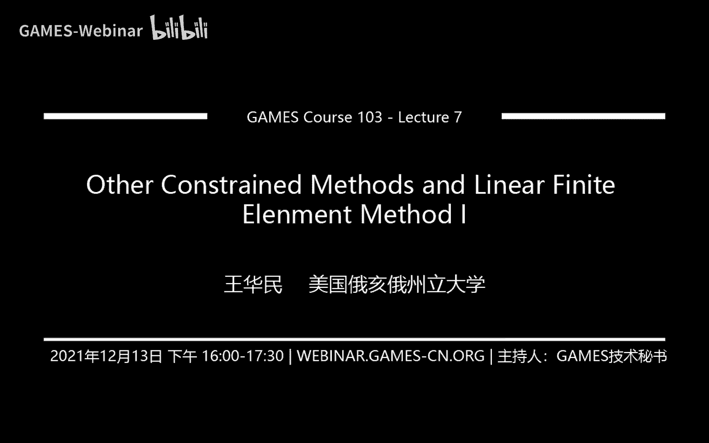
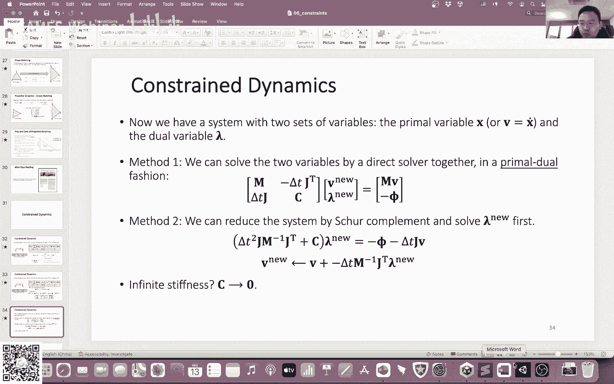
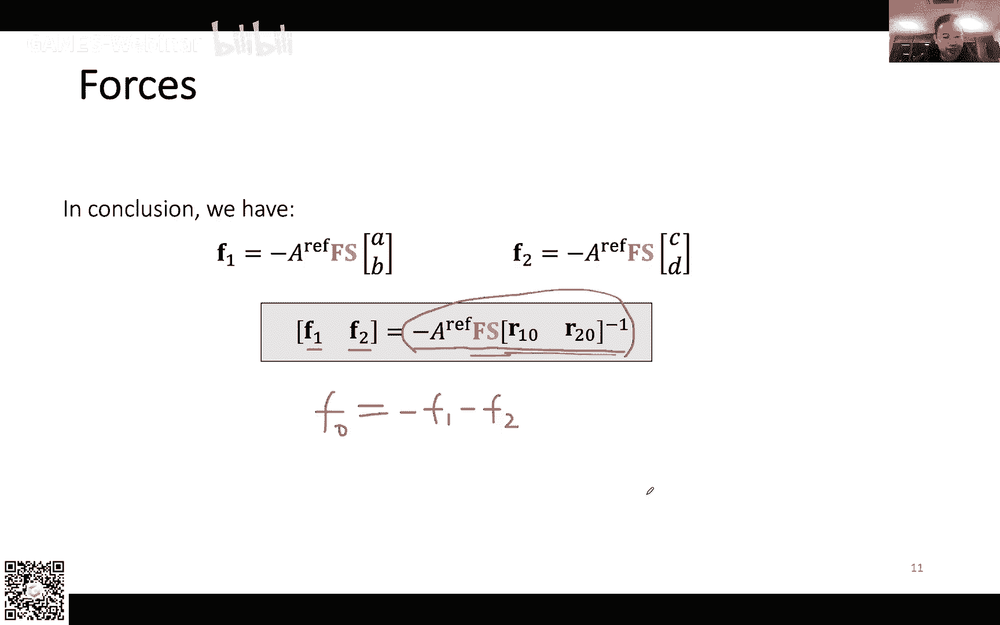

# GAMES103-基于物理的计算机动画入门 - P7：Lecture 07 其他约束方法与有限元方法 I 🧵⚙️

在本节课中，我们将学习两种基于约束的高级模拟方法：Projective Dynamics 和 Constrained Dynamics，并初步了解有限元方法（FEM）的基本概念和线性三角形单元的力计算。

---

## 课程内容调整说明 📅

由于课程计划调整，本次课程将首先完成约束方法的讲解，然后开始介绍有限元方法。碰撞检测的内容将移至有限元方法之后讲解。

---

## 第一部分：Projective Dynamics 方法 🔄

上一节我们介绍了PBD和Shape Matching等约束方法。本节中，我们来看看Projective Dynamics方法，它同样基于约束，但构建方式有所不同。

Projective Dynamics的核心思想是：**不直接用投影函数修改顶点位置，而是用投影结果定义一个能量函数**。

### 方法原理

对于一个弹簧边约束，我们定义能量函数为：
```
E = (1/2) * k * ||(xi - xj) - (xi_new - xj_new)||^2
```
其中，`xi_new`和`xj_new`是根据约束投影计算出的“目标”位置，但我们不直接赋值。

经过推导可以发现，这个能量函数和力公式与普通弹簧系统完全一致：
```
E_spring = (1/2) * k * (||xi - xj|| - L)^2
F_spring = -k * (||xi - xj|| - L) * ( (xi - xj) / ||xi - xj|| )
```

那么，Projective Dynamics的特殊之处在哪里？关键在于其**Hessian矩阵（刚度矩阵）**。

### 常数Hessian矩阵的优势

在Projective Dynamics中，我们做了一个关键假设：投影得到的目标位置 `x_new` 是常数（与当前顶点位置 `x` 无关）。这使得能量函数 `E(x)` 成为顶点位置 `x` 的纯二次函数。

因此，其Hessian矩阵 `H = d²E/dx²` 是一个**常数矩阵**。对于一个由弹簧边构成的网格，其Hessian矩阵非常容易构造：
*   对角元：顶点度数 * k
*   非对角元（若顶点i和j有边相连）：-k

常数Hessian矩阵带来了巨大优势：在隐式积分求解线性系统 `(M - Δt² H) Δv = Δt F` 时，我们只需要对矩阵 `(M - Δt² H)` 做一次LU分解或Cholesky分解。在后续所有时间步中，都可以复用这个分解结果，只需进行高效的回代求解，从而大幅提升CPU上的模拟效率。

### 方法总结

Projective Dynamics通过引入基于约束投影的中间变量，构造了一个具有常数Hessian矩阵的系统。其优点是在CPU上效率很高，且具有明确的物理含义（等同于弹簧系统）。缺点是收敛速度后期可能变慢，且在GPU上直接法求解不占优，约束改变时矩阵也需要更新。

---

## 第二部分：Constrained Dynamics 方法 🔗

接下来，我们探讨另一种处理强约束的方法——Constrained Dynamics。此方法常用于模拟多刚体系统（如人体关节）。

### 核心思路

该方法旨在处理**刚度（Stiffness）极大甚至无穷大**的约束。我们引入一个辅助变量——**拉格朗日乘子 λ**。

首先，将弹簧能量改写为关于约束 `φ(x) = ||xi - xj|| - L` 的形式：
```
E = (1/2) * φᵀ * C⁻¹ * φ
```
其中 `C` 是柔度矩阵（`C = (1/k) I`）。

通过计算力的梯度并引入 `λ = -C⁻¹ φ`，我们可以得到力的新形式：
```
F = -Jᵀ * λ
```
这里 `J` 是雅可比矩阵 `J = dφ/dx`。

### 构建求解系统

结合动量守恒方程和约束方程（在新状态下 `φ_new = 0` 的泰勒展开），我们得到一个包含两个变量（速度 `v` 和拉格朗日乘子 `λ`）的线性系统：




```
[ M    -Δt Jᵀ ] [ v_new ]   = [ M * v_old ]
[ Δt J   C    ] [ λ_new ]     [    -φ    ]
```

有两种求解方式：
1.  **联合求解（Primal-Dual）**：直接求解上述完整系统得到 `v_new` 和 `λ_new`。
2.  **消元求解**：先将 `λ` 消去，得到一个只关于 `v` 的系统（该形式与隐式积分系统等价），求解后再计算 `λ`。

### 方法特点与应用

Constrained Dynamics 的优点是可以完美处理刚性约束（当 `k → ∞` 时，`C → 0`，系统依然可解）。它广泛应用于多刚体动力学模拟，例如游戏中的布娃娃（Ragdoll）动画。

---

## 第三部分：有限元方法（FEM）初步 📐

现在，我们开始进入有限元方法的世界。有限元是模拟连续体（如弹性体、布料）形变的重要工具。

### 基本概念：线性三角形单元

我们以二维三角形单元为例。假设三角形在**参考（未形变）状态**的顶点为 `X0, X1, X2`，在**当前（形变后）状态**的顶点为 `x0, x1, x2`。

有限元的核心假设是：三角形内部的形变是**均匀的**，即内部任意点的位移映射可以通过一个线性函数描述：
```
x = F * X + c
```
其中 `F` 是一个2x2矩阵，称为**形变梯度（Deformation Gradient）**；`c` 是平移向量。

### 计算形变梯度 F

利用三角形两条边的向量变化，可以计算出 `F`：
```
F = D_s * D_m⁻¹
```
其中：
*   `D_s = [x1-x0, x2-x0]` 是当前状态的边向量矩阵。
*   `D_m = [X1-X0, X2-X0]` 是参考状态的边向量矩阵。

### 格林应变张量（Green Strain）

形变梯度 `F` 包含了旋转和形变。为了剔除旋转分量，只度量纯形变，我们使用**格林应变张量** `G`：
```
G = (1/2) * (FᵀF - I)
```
`G` 是一个对称矩阵，其大小与形变成正比，且在物体纯旋转时为零。

### 能量与应力

我们定义单位面积的能量密度 `W` 为应变 `G` 的函数。对于三角形，总弹性势能为：
```
E = A_ref * W(G)
```
其中 `A_ref` 是三角形在参考状态下的面积。

一种常用的简单模型是**Saint Venant-Kirchhoff模型**：
```
W(G) = μ * trace(GᵀG) + (λ/2) * [trace(G)]²
```
其中 `μ` 和 `λ` 是拉梅参数，控制材料的剪切和体积变形阻力。

能量密度对应变的导数称为**第二皮奥拉-基尔霍夫应力（Second Piola-Kirchhoff Stress）** `S`：
```
S = dW/dG = 2μG + λ * trace(G) * I
```

### 计算顶点力

最终目标是计算作用在顶点上的力 `F_i = -dE/dx_i`。通过链式法则和一系列推导（此处省略繁琐的中间步骤），可以得到每个顶点力的简洁计算公式：

对于顶点1和顶点2（以边 `X1-X0` 和 `X2-X0` 为基准）：
```
f1 = -A_ref * F * S * (D_m⁻¹)的列1
f2 = -A_ref * F * S * (D_m⁻¹)的列2
```
顶点0的力由力平衡得出：
```
f0 = -f1 - f2
```

这个矩阵形式公式极大简化了实现难度，避免了直接对复杂能量函数求导的繁琐过程。

---

## 总结 🎯

本节课我们一起学习了：
1.  **Projective Dynamics**：通过约束投影构造能量，得到常数Hessian矩阵以加速CPU求解。
2.  **Constrained Dynamics**：引入拉格朗日乘子处理强约束，常用于多刚体系统。
3.  **有限元方法初步**：介绍了线性三角形单元的基本概念，包括形变梯度 `F`、格林应变 `G`、能量密度 `W`、应力 `S`，并给出了计算顶点力的核心矩阵公式。



这些方法为模拟复杂物体提供了更多工具。下一节课，我们将继续深入有限元方法，并探讨另一种实现方式——有限体积法（FVM）。