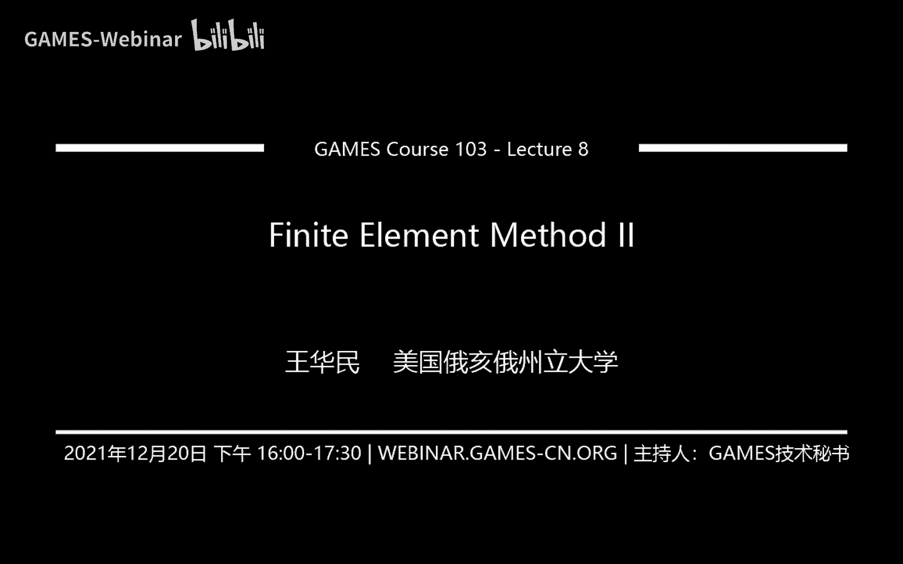
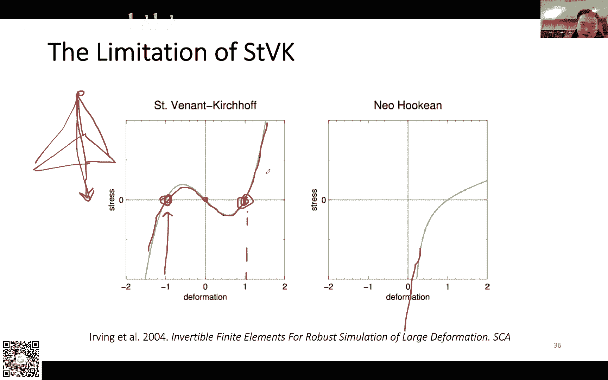
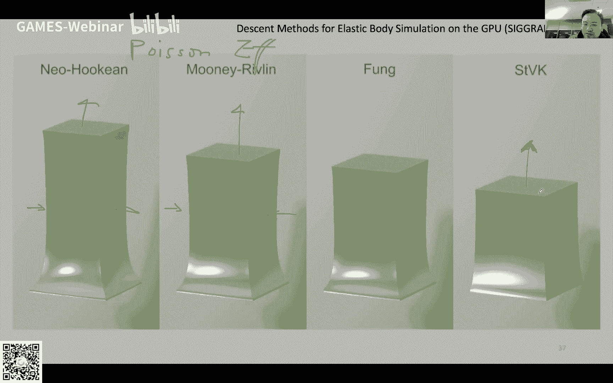

# GAMES103-基于物理的计算机动画入门 - P8：Lecture 08 有限元方法 II (Lab 3) 🏗️

## 概述


在本节课中，我们将继续学习有限元方法，并重点介绍一种与之等价但推导更清晰的**有限体积法**。我们将学习如何通过计算表面牵引力的积分来得到力，并理解不同应力定义（如柯西应力、第一/第二皮奥拉-基尔霍夫应力）之间的关系与转换。最后，我们会介绍超弹性材料模型，并简要探讨非线性优化在物理模拟中的应用。

---

## 作业说明：Lab 3

上一节我们介绍了有限元方法的基本概念，本节中我们来看看如何将其应用于实际模拟。课程作业（Lab 3）已经发布。

作业提供了一个Unity脚本和代码框架。你需要完成的核心任务是：**使用有限元方法计算四面体网格形变产生的力，并更新顶点位置和速度，以模拟一个弹性小房子掉落到地面并弹起的动画**。

以下是作业的关键点：
*   **模型**：使用名为“house”的四面体网格。
*   **材料模型**：采用**St. Venant-Kirchhoff (STVK)** 模型，因其公式相对简单。
*   **积分方法**：使用**显式积分**进行模拟。
*   **注意事项**：
    *   STVK模型无法处理四面体的**反转**（即顶点穿透到另一侧）。如果形变过大导致四面体反转，它将无法恢复。
    *   显式积分存在稳定性问题。如果形变过于剧烈或时间步长不当，模拟可能会“爆炸”。
    *   编程代码量可能是所有作业中最短的，但理解背后的原理需要仔细阅读课件。

**核心挑战**在于如何根据有限元理论计算每个四面体作用于顶点的力。理解这一点是完成作业的关键。

---

## 从有限元到有限体积法 🔄

上节课我们通过定义形变能，并对位置求导来得到力。本节我们将从另一个角度——**有限体积法**——来推导力，这对于四面体、三角形这类线性单元而言，与有限元法是等价的，且推导过程更清晰直观。

有限体积法的核心思想是：**力来源于物体内部应力在边界表面的作用**。

假设一个弹性体被一个界面分割为两部分。该界面上单位面积（或单位长度）所受的力称为**牵引力**。那么，整个界面上的合力就是牵引力在界面上的积分。

如何得到牵引力呢？这需要引入**应力**的概念。应力本质上是一个矩阵（二阶张量），它将表面的**法向量**映射为该点的**牵引力**。具体关系由以下公式描述：
`traction = stress * normal`
其中，`traction`是牵引力向量，`stress`是应力张量，`normal`是表面单位法向量。

因此，一个区域所受的合力，就是其边界上 `stress * normal` 的积分。

---

## 计算三角形对顶点的力贡献 📐

让我们具体到一个三角形单元。考虑顶点 `x0`，我们假设它代表周围的一个区域。那么，作用在这个区域上的合力，就是其边界上牵引力的积分。

对于三角形而言，`x0` 所代表的区域边界由两条从 `x0` 出发的边的**中点**连线构成。我们假设三角形内部的应力和形变是均匀的（线性单元假设），因此应力 `σ` 在三角形内为常数。

根据散度定理，对一个闭合曲线的法向量积分结果为零。因此，计算 `x0` 所受的力，可以转化为计算两条边（`x0x1` 和 `x0x2` 的中点连线）上 `-σ * normal` 的积分。

由于边上法向量恒定，积分简化为应力乘以法向量再乘以边长的一半。由此，我们得到三角形对顶点 `x0` 的力贡献公式：
`f0 = - (σ * n10) * |x10|/2 - (σ * n20) * |x20|/2`
其中，`n10` 和 `n20` 是两条边的单位法向量，`|x10|` 和 `|x20|` 是边长。

**为什么取边的中点？** 这是为了将三角形产生的力平均地分配到三个顶点上，满足动量守恒。

---

## 扩展到四面体情况 🔶

在三维情况下，我们需要处理四面体。一个顶点（如 `x0`）与三个面相邻。此时，力是应力在三个相邻面上的面积分。

与三角形类似，为了将每个面的贡献均匀分配到其三个顶点上，我们引入系数 `1/3`。顶点 `x0` 所受的力来自三个相邻面（如 `012`, `023`, `031`）的贡献之和。

经过推导和简化（利用叉积计算面积和法向量），我们可以得到四面体对顶点 `x0` 的力贡献的紧凑公式：
`f0 = - (σ * (x20 × x30 + x30 × x10 + x10 × x20)) / 6`
其中 `×` 表示叉积。类似地，可以计算 `f1`, `f2`, `f3`。

目前，公式中的应力 `σ` 尚未定义。接下来我们将解决这个问题。

---

## 理解不同的应力定义 🧮

这里的关键在于，上节课有限元法推导出的应力与本节有限体积法直接用来计算力的应力，**并不是同一种应力**。

它们的区别在于所作用的**法向量**和**牵引力**所处的空间不同：
*   **参考配置**：物体未形变时的状态。
*   **当前配置**：物体形变后的状态。

根据法向量和牵引力所处的配置不同，定义了多种应力：
1.  **第二皮奥拉-基尔霍夫应力**：法向量和牵引力都定义在**参考配置**。上节课通过能量密度对格林应变求导得到的就是它。
2.  **第一皮奥拉-基尔霍夫应力**：法向量定义在**参考配置**，牵引力定义在**当前配置**。
3.  **柯西应力**：法向量和牵引力都定义在**当前配置**。这正是我们有限体积法公式中直接需要的应力。

我们需要找到一种方法，从上节课可计算的第二皮奥拉-基尔霍夫应力，得到本节需要的柯西应力。

---

## 应力之间的转换关系

不同应力之间可以通过形变梯度 `F` 进行转换。形变梯度描述了从参考配置到当前配置的局部线性变换。

以下是核心转换关系：
*   第一皮奥拉-基尔霍夫应力 **P** 与第二皮奥拉-基尔霍夫应力 **S** 的关系：`P = F * S`
*   柯西应力 **σ** 与第一皮奥拉-基尔霍夫应力 **P** 的关系：`σ = (1 / det(F)) * P * F^T`

因此，结合两者，我们可以从已知的 `S` 计算出所需的 `σ`：
`σ = (1 / det(F)) * F * S * F^T`

---

## 应用于力计算公式

现在我们将柯西应力 `σ` 的表达式代入四面体的力计算公式中。但直接使用上述转换公式会引入复杂的计算。我们可以采用一个技巧：

观察四面体力公式 `f0 = - (σ * (x20 × x30 + ...)) / 6`，括号内的叉积项实际上与**当前配置**下的法向量有关。如果我们将其替换为**参考配置**下顶点位置 `X` 的叉积，那么对应的应力就应该使用第一皮奥拉-基尔霍夫应力 `P`。

这样做的好处是，参考配置下的顶点位置 `X` 是固定的，因此由它们计算的叉积项是**常数**，可以预先计算并存储，大大减少了实时模拟的计算量。

经过替换和整理（`P = F * S`），我们得到最终用于计算的实用公式：
`f0 = - (F * S * B0) / 6`
其中 `B0` 是一个基于参考配置顶点位置预先计算的常向量：`B0 = X20 × X30 + X30 × X10 + X10 × X20`。`F` 是形变梯度，`S` 是第二皮奥拉-基尔霍夫应力。

类似地，`f1 = - (F * S * B1) / 6`, `f2 = - (F * S * B2) / 6`。根据动量守恒，`f3 = - (f0 + f1 + f2)`。

---

## 算法伪代码



以下是模拟循环中计算一个四面体内力的核心伪代码：


```python
// 预先计算（在初始化阶段）
Dm = matrix(x10, x20, x30) // 参考配置下的边矩阵
inv_Dm = inverse(Dm) // 其逆矩阵
B0 = X20 × X30 + X30 × X10 + X10 × X20 // 预计算常向量
B1 = ... // 类似计算 B1, B2
B2 = ...



// 每帧计算（对于每个四面体）
// 1. 计算形变梯度 F
Ds = matrix(x1-x0, x2-x0, x3-x0) // 当前配置下的边矩阵
F = Ds * inv_Dm

// 2. 计算格林应变 G 和第二皮奥拉-基尔霍夫应力 S
G = (F^T * F - I) / 2
S = dΨ/dG // 根据选定的能量密度函数 Ψ 计算，例如 STVK 模型

// 3. 计算第一皮奥拉-基尔霍夫应力 P
P = F * S


// 4. 计算各顶点力（以 f1 为例）
f1 = - (P * B1) / 6
// 类似计算 f2, f3
f2 = - (P * B2) / 6
f3 = - (P * B3) / 6
// 由动量守恒得到 f0
f0 = - (f1 + f2 + f3)

// 5. 将 f0, f1, f2, f3 分别加到对应顶点的合力上
```

---

## 超弹性材料模型 🧱

之前我们使用的 STVK 模型虽然简单，但有明显缺陷：当四面体被严重压缩或反转时，其产生的恢复力会变小甚至方向错误，导致无法恢复原状，模拟失真。

在图形学和力学中，更常用的是**超弹性材料**模型。这类模型通过定义能量密度函数 `Ψ` 来描述材料特性，应力由能量密度导出（`S = dΨ/dG`）。

对于**各向同性材料**（如橡胶，各个方向性质相同），其能量密度可以表示为形变梯度 `F` 的**主拉伸** `λ1, λ2, λ3` 的函数。主拉伸是 `F` 经过奇异值分解后得到的对角矩阵元素，代表了三个主方向上的拉伸比率。

常见的各向同性超弹性模型有：
*   **新胡克模型**：`Ψ = μ/2 * (I1 - 3) + λ/2 * (J - 1)^2`，其中 `I1` 是主拉伸平方和，`J` 是体积变化率。它能更好地阻止体积压缩，避免 STVK 的反转问题。
*   **穆尼-里夫林模型**：新胡克模型的增强版。
*   **冯·米塞斯模型**：常用于模拟生物软组织。

在实现上，使用这些模型需要计算形变梯度 `F` 的奇异值分解以获得主拉伸，然后根据具体的 `Ψ` 公式计算应力 `S`。这比 STVK 复杂，但物理上更准确、更稳健。

---

## 非线性优化简介 ⚙️

物理模拟中的隐式积分等方法，最终需要求解一个非线性优化问题（即最小化系统总能量）。这里简要介绍其核心思想。

目标是找到变量 `x` 使函数 `f(x)` 最小化。基本思路是迭代：从初始点 `x_k` 出发，寻找一个**下降方向** `d_k` 和合适的**步长** `α_k`，使得 `x_{k+1} = x_k + α_k * d_k` 的函数值减小。

如何选择下降方向 `d_k`？
*   **最速下降法**：`d_k = -∇f(x_k)`，即负梯度方向。简单但收敛可能慢。
*   **牛顿法**：`d_k = -H^{-1} ∇f(x_k)`，其中 `H` 是海森矩阵（二阶导数）。利用了曲率信息，收敛快，但需计算并求解海森矩阵，代价高。
*   **拟牛顿法/投影法**：用近似矩阵 `M` 代替海森矩阵 `H`，`d_k = -M^{-1} ∇f(x_k)`。在收敛速度和单步计算成本之间寻求平衡，在图形学中应用广泛。

如何确定步长 `α_k`？常用**回溯线搜索**：从一个初始步长开始，不断按比例缩小，直到满足函数值充分下降的条件。

在物理模拟中，我们追求的是**总计算时间 = 每次迭代耗时 × 迭代次数** 的最小化。图形学的研究重点常在于为特定硬件和问题设计高效的优化方法，以在速度和精度间取得最佳平衡。

---

## 总结

本节课我们一起深入探讨了有限元方法的另一种视角——有限体积法。
1.  我们学习了如何通过积分表面牵引力来计算顶点力，并推导了三角形和四面体的具体公式。
2.  我们厘清了柯西应力、第一/第二皮奥拉-基尔霍夫应力等不同应力定义的区别与联系，并掌握了它们之间的转换方法，从而得到了实用的力计算公式。
3.  我们认识了 STVK 模型的局限性，并介绍了更通用、更稳健的**超弹性材料模型**（如新胡克模型）。
4.  最后，我们简要了解了**非线性优化**的基本概念，它是许多高级模拟方法（如隐式积分）背后的数学工具。


希望本讲内容能帮助你更好地完成 Lab 3 作业，并加深对基于物理的动画中弹性体模拟的理解。下节课我们将进入一个新的重要主题：碰撞检测与处理。