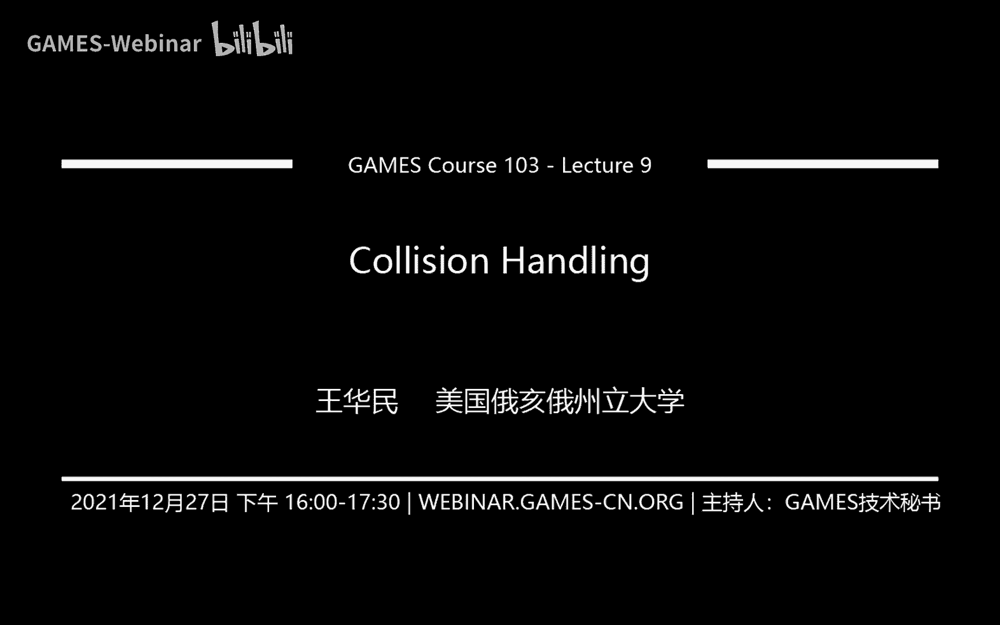
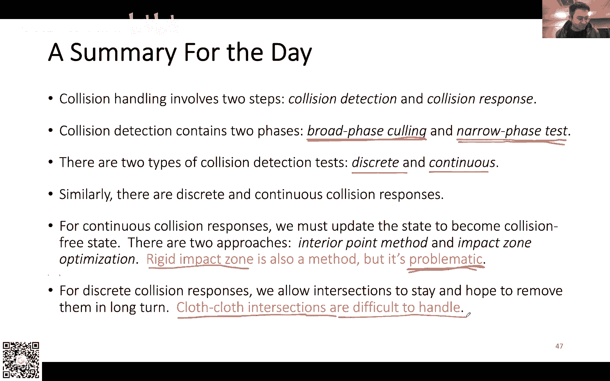

# GAMES103-基于物理的计算机动画入门 - P9：Lecture 09 Collision Handling - GAMES-Webinar - BV12Q4y1S73g

我没有我在我在直播，好那我们就我们就开始吧，嗯因为时间比较有限，嗯就首先我想跟大家说一下，就是我们那个作业的事情啊，因为呃上周布置的作业，我看这个作业可能稍微有那么一点小小的挑战性啊。

嗯然后就是我说一下就是几个嗯作业里面的一个呃一些一些技巧吧，就我给大家的一个那个代码里面是我们有个房子的模型对吧，那个房子模型大概有1000多个四面体，那这1000多个四面体，如果你直接去模拟。

如果你写完代码然后跑模拟，然后就很难debug嘛，因为呃你结果如果不对，你就很难发现问题出在哪里，所以说我给大家的建议就是你可以上来先不要呃去跑这个房子的模型，你可以先试一试。

看看能不能用一个四面体来进行模拟，卡吗，别的同学觉得卡吗，好了好了是吧嗯，就那一个四面体，你怎么测呢，我看看这个网络是应该应该没有什么大问题呃，你那你一个四面体怎么测呢，你首先可以呃把重力关掉。

假设这个四面体在静止的状态下，那如果这个四面体在静止的状态下，他的demation gradient就是identity，因为这个大x和小x是一样的，就是说它这个形变的状态跟参照的状态它是一模一样的啊。

在这种时候，这两个矩阵是一模一样的话，你算出来的这个defamation规一点的就应该是identity，那如果你的deformation规定是identity。

那么你算这个green rain就应该是000对吧，因为这里本质上就是identity，chidentity，你剪出来，但是这个就应该是000，那green rain是000的时候。

你用这个原来的那个公式算算stress也应该是000是一个零矩阵，那零矩阵最后得到的利益，那么也就是零，所以说所有的力都是零，在静止的状态下，这个四面体应该是不发生任何形变的，也没有任何力。

你可以先用这个东西去测试一下，看看你是不是给了你正正常的结果啊，然后如果说这个是ok的话，那么你接下来第二点就是你可以嗯，就是把这个四面体稍微沿某一个方向，比如说你沿x的方向先拉伸一下。

那么我们知道弹性体它永远都是弹性的，力永远都是阻碍形变的，所以说你沿着x方向上拉伸，那么它每个点的力与理论上应该都是想要恢复这个四面体的原来形状，那么视图就是把它缩回去。

你就可以看这几个力是不是方向上是不是有这个趋势，把这个这几个四个顶点都把它缩回去，如果说它不是，那么就说明你的计算有问题，如果是，那么就说明那它的趋势是差差不多是对的啊，然后有同学说这个帧率的问题。

这个其实我我也发现，其实呃unity上跑这个demo其实帧率是比较低的啊，为什么我做这个例子的原因是，因为我以前是用呃，是直接用用用open gl写的，在cpu上写的那个帧率其实很高啊。

但是unity因为它本质是本本身有脚本的问题，所以说他这个帧率帧率相对来说比较低，然后至于有多低，可能取决于你自己的这个电脑的配置，就是我我自己反正总体感觉帧率也不是特别高，呃，远远没有cpu上高。

但是如果说大家以后有机会呃，不用unity写这些模拟引擎的话，你会发现其实效率上可以啊，进一步的提升啊，本身这个呃这个这个这个四面体有限元模拟，它其实也不太适合做游戏开发啊。

或者是就是非常小的分辨率下适合做游戏看法，像1000多个四面体其实可能已经超过啊游戏比较能够处理的范围了，怎么给四面体拉伸，就是顶点啊，就比如说你想象这个四面体有四个顶点嘛对吧。

那么你相当于在x的方向上你缩放一下，其实相当于就是给它拉伸了吗，你就可以给它缩放一下，其实就是给他拉伸一下，这样子就可以给他在在某个特定的方向上做拉伸，嗯然后同学们有什么问题就关于作业，没有问题的话。

没有问题的话，我想呃平滑是怎么做的是吗，嗯其实我上课倒是没有讲，我就是嗯我不知道这个gmc 101有没有讲过这个东西，games 101有讲过这个东西吗，就是做拉普拉斯平滑，放在树嗯都可以吧。

其实就是对速度场做一个平滑，至于说你什么样的时候做平滑，其实都可以，没有1101没有讲过啊，这个怎么讲呢，我我以为101讲过呃，对对一个，比如说你对速度场做平滑，其实很简单，就是你你这么想。

就是每一个点每一个点都有个速度，对不对，那我就对于这个点而言，我就跟他周围的邻居做一个平均值，相当于就是给他做一个平滑，就是我们大家都取平均吗，我跟我的邻居都取平均，那么具体怎么做。

就是我每一个点我都看周围的邻居啊，然后呢我把它们全都和全部周围的邻居的和速度的全都加起来，求和，求完和之后跟自己的速度做一个平均值就可以了，这个有点像咱们之前做那个呃呃做p p t的时候。

大家记不记得我们做p p t的时候，我们每一个点都会有一个速度的，有一个位置的更新嘛，然后我们位置更新把全部都加起来，然后求和是一个一个方式，就是咱们呃先把所有的速度，周围邻居的速度全都加在一起。

加完之后，然后跟自己做一个平均的加权平均就可以了，跟那个跟跟平滑的滤波其实也是一样的，放在之后会崩掉吗，嗯有可能，然后问那个有同学问那个sb d的tv k是不是给错了，我没推过。

因为我这个s d v v k是从我自己的另一篇公式，一篇论文里面抄的，然后我看到那个微信群里面有同学说那个公式他后来推了一下，发现是对的，但是就是前面呃多了个系数还是少了个系数，好像是应该是1/8。

不是1/2，我记得好像大概是这样子，反正就是你做如果做附加题那个作业的话，就就我还是建议就是自己把那个公式先自己推一下，然后确保就是推出来的，理论上应该是一致的，然后再做，好吧。

那你可能平滑的有点过度了，就平滑的目的就是为了让速度均匀比较均匀嘛，但是速度但是它还是会比如说该下落还是会下落，他只是相当于它那个它会平滑一点，作业里的triangular，这我不记得了。

有可能是我之前定义了一个一个三角网格，本来想拿来指示渲染表面，但是我后来好像又没用，可能是那个目的吧，反正如果说没有用的话，就就就忽略它，就不用管它，因为我本来是只想渲染那个，因为它四面体。

然后我直接的每个三角形都是从那个从每个四面体的四个面得到了吗，然后我得到了这四个面之后，每得得到了这些四面体的四的的这四个三角形之后，我就把它搞成一个大数组，然后拿去渲染了。

本身四面体网格它没有那个三角三角形网格可以直接拿来渲染，所以说你需要额外的构造三角形网格去给这个四面体网格做渲染，可能是这个目的吧，好吧，然后今天我们关于有限元啊。

关于弹性体的这个讨论就基本上告一段落了，嗯然后我们今天会讨论一个比较新的话题，然后我们下周开始会讨论流体，所以说我今天想把这个最后一点关于啊这种三角形网格啊，这些模拟的方式给他呃，给大家结束掉呃。

然后我在准备这个ppt之前，其实我想了挺久，就说到底应该怎么来讲这个东西，因为可能就是p p t里面其实会讨论的比较简单，因为嗯碰撞这个东西，它其实很多概念都很简单，但是呢如果说你自己要去做一个碰撞。

想把它做的很好，其实工作量又特别大，因为它里面会有各种各样也需要处理的问题，它不像呃我们写弹簧模拟啊，写有些语言模拟啊，可能理论上会复杂一点，但是只要你懂了之后呃，你写代码相对来说比较容易。

而碰撞呢就是说它可能概念上没有那么复杂，没有那么多很深奥的理论啊，不像这种有限元什么一套一套的，全是公式呃，碰撞碰撞它没有那么多公式，但是他处理起来他的算法复杂度就特别高，特别麻烦。

所以说我今天其实也是嗯想给大家简单的把一些概念嗯给大家呃，先讨论一下，然后相当于大家心里有个数啊，然后以后大家以后如果说碰到有这种开发的需要的时候，会回过头来花时间去读一些其他的论文。

或者是呃或呃或者是自己呃写这方面的代码，就相对来说会好一点，会有一定的基础吧，这是我今天的一个目的，然后我今天会大概分几个方面来讨，来来来说碰撞这个问题啊，首先我会说一下，就是怎么样做碰撞检测。

怎么样去发现碰撞，有没有碰撞，然后呢我会给大家讨论两个方法啊，一个叫做一个叫做内点法啊，一个叫做impact on optimization，我不知道中文怎么说啊，反正就是这两种不同的方法啊。

这两种方法都是我们做连续碰撞处理所需要用到的方法，一般来说大家会用这两种方法比较多，然后我最后呢会给大家说一种就是非连续碰撞呃，就是离散碰撞处理的方法啊，叫做untangling cross。

或者你可以把它简单的认为，如果说不是做衣服的模拟的话，你可以简单的认为就叫做香蕉解除，大家直观的想就是说呃我假如说我这个物体跟其他物体有相交吗，那我怎么样把这个香蕉给它去除掉。

那么就视觉上我就看不出有碰撞的效果来了，所以说就是我们会讨论这么几种方法，然后本来是想把这个东西放在衣服模拟后面讲的，为什么这么做呢，是因为衣服的碰撞，布料的碰撞其实是所有的碰撞处理里面最难最困难的嗯。

如果说你能把衣服的碰撞，布料的碰撞处理好，那么你处理其他碰撞其实也很容易，你可以认为其他碰撞是衣服碰撞的一个简化，所以说我本来是想把它放在衣服碰撞处理后面讲的，但是因为种种原因，我把它挪到最后面啊。

好吧，然后首先我们来讲一下怎么去发现碰撞对吧，我们要处理碰撞，我们要让碰撞消失，那么首先第一点我们得知道有没有碰撞，那么碰撞处碰撞的检测，它其实一般来说会分成两个部分。

第一个部分我们叫做碰撞的calling，叫做broadface，碰撞的calling啊，碰撞的删除，然后第二个部分呢我们叫做narrow face collision。

tt collision test，就是一个是广义的，一个是狭义的，那么什么意思呢，为什么要这么做呢，其实这个想法很简单，就是我们正常时候在模拟的时候，我们想要处理碰撞。

我们可能这个世界里面有很多很多的三角形，有很多很多的物体，有很多很多的例子吧，假如说我这个世界里面有很多很多的元素，比如说有1万个，其实也不算多啊，像我们之前做的那个兔子模型，就已经上万的343角形了。

可能有上万的这种元素，那么如果说我两两之间要做一次碰撞检测的话，它的计算量是很大的，如果说1万，那么你两两做检测就是1万呃，411万乘以差不多1万的平方这么一个数量值嘛对吧。

差不多是几千万的这个凉凉的这个检测你需要去完成，那么如果你这个分辨率更高，你的这个这个三角形更多，比如说几10万几百万，那么你这个两两之间做检测的成本就会更大。

那就是为什么我们需要把碰撞检测分为两部分的原因，因为我们目前的计算能力没有办法去对两两的元素，两两的三角形进行碰撞检测，这个成本太大了，所以我们把它分成两部分，第一个部分呢。

它主要的目的呢就是为了去除一些不可能出现碰撞的peace，我如果有两个三角形，它离得非常远，它没有可能出现碰撞，那我就不考虑嘛对吧，那么如果说我把这些不可能出现的这些呃三角形对或者是点三角形对。

或者是某些元素我不管啊，反正就是一些parts，如果我把这些派去除掉，那么剩下的部分是不是就是有可能出现碰撞的paris对吧，所以说第一个阶段。

我的主要目的就是为了把这些不可能出现碰撞的这些pass给它去除掉，然后我的输出呢就是这些paris candidate，这些呢是我们的呃备选目标，我们不知道他们有没有碰撞，但是他们因为可能离得比较近。

或者是啊他们有一些呃可能出现碰撞的趋势，所以说我们把它呃输出作为我们的输出，这是我们的第一部分，相当于就是把一些呃完全没有可能出现碰撞的，我给它先剔除掉，剔除完了之后呢，我们到了第二个阶段。

第二个阶段呢就是我们要具体做我们的这些碰撞检测了对吧，那么这里呢有两种模式，一种叫做dcd discrete，一种叫做continuous啊，就是根据我们的碰撞处理，我们也会有两种不同的碰撞检测方式。

然后检测完了之后呢，我们会最终知道有哪些tears是真的有碰撞的，然后这个就变成了我们的输出，这个是我们碰撞检测的总的一个流程啊，啊当然检测完了之后呢，我们后面就是我们没有结束嘛。

我们还需要真的去处理这些碰撞，这就是我们走到后面那一步了，但是我们先暂时先不讨论，我们先讨论就是单纯的讨论检测这一块，那么我们首先来看一下这个broadface collision calling。

就是这个碰撞剔除这个第一块板，第一块啊，然后碰撞的这些剔除的它有两种比较常见的套路，在我们图形学里面，一种叫做spatial hash。

然后另一种叫做b b h bounding volume hiarchy，我们首先来看什么叫做spatial harsh，他的意思是什么意思呢，就是我把整个空间，我把整个3d空间划分。

用一个网格给它划分成很多区域，比如说我有这么一个空间对吧，我划成一个4x4乘一个区域，很多这种小区域小格子，然后呢我如果有很多三角形的话，我就把每个三角形都存到这个小格子里面。

根据它们的位置存到这个小格子里面，比如说第0号三角形t0 ，它跟零小格子，0号小格子跟4号小格子，还有跟5号小格子他都有相交吗，所以说t0 它就存在了零四，还有五，同样的t1 ，他跟237有相交。

所以说t一就存到了二七，还有三啊，我当然我这个东西就对每一个三角形都做这样的处理嘛，我就把每个三角形都分别的啊，不一定也不一定是三角形嘛，就是某些物体，反正我就把这些物体都存在。

它们相对应的占有了他们这些空间的这些小格子里面，这是我的第一步啊，就是我做这样的存储，做完存储之后呢，我做相交检测就比较容易了，为什么呀，因为我可以根据这个空间的划分。

我就可以很快的判断出来有哪些三角形是有可能跟我相交的，比如说我想要知道我这个3号三角形t3 ，它跟哪些三角形有可能有相交，那么我只需要检查跟它相交的这些小格子里面还存了什么三角形。

然后我把t3 去跟那些三角形做检测就行了，比如说t3 它占有的格子是五六和九跟十吗对吧，那么如果我检查569 十这些格子，它还存了打c3 角形，我会发现它存了t0 ，他也存了t5 对吧。

因为我看到他这里t0 跟这个第5号小格子，还有t5 跟第十第10号小格子有相交，所以说我知道t3 是跟这些三角形共存在这些小格子里的，那么因此呢我就可以知道说t3 有可能跟t0 ，也有可能跟t5 相交。

那么我就以此我就把这个输出就可以了，我就把t0 t3 ，还有t3 t5 ，我把它作为这个pears的输出，然后呢我让我后面的程序来检测它到底有没有相交，如果说我有其他三角形，我也是同样的操作。

比如说t2 ，那么t2 跟哪些三角形有可能有相交，它跟t0 有可能有相交对吧，因为它跟t0 共存在4号小格子里面，所以说我要跟4号小格子判断出来t0 跟t2 需要做检测啊，所以说就是这么一个套路。

这个就叫做special petition，那么如果说那当然这个情况下是比较简单的了，假如说就是一个三角形，是一个静止的三角形，我需要找到哪些三角形，哪些其他三角形跟这个三角形相交，我可以怎么做。

那如果说三角形在运动怎么办啊，呃也没有什么大问题，我可以把三角形的运动轨迹，把整个东西作为一个物体，比如说t0 对吧，它进行了这么样的一个运动，那么我把整个东西当做一个物体，我给它保存起来就行了。

比如说在这种情况下啊，他原来是比如说045，但是因为它有运动，所以说他跟1号小格子也发生了关系，所以说我对t03 角形而言，我需要保存的格子就是014跟五，只需要把根据它的运动轨迹。

你只需要把它占有的这些小格子的空间给它，稍微进行放大一下就可以了，啊这个就叫做special partitioning，当然说啊这个是比较标准的，比较正常的这么一种regular的这种网格啊。

呃实际操作中的你也可以对这个东西有一定的扩展，比如说你可以考虑就是呃用一些hiit啊来描述，当然我们这里就不进一步的拓展了，就假设是一个比较简单的一种状况，那么这里听着挺简单的。

但是呢我们在实际的操作中呢，你会很快发现一个问题，什么问题呢，就是说对于一个三维的空间，你可能需要非常非常多的小格子来进行这样的存储对吧，因为3d空间，这是2d的情况。

就已经比如说你按1cm来进行定义这么一个小格子，1cm乘1cm，那么假如说你要存1米乘1米的，你就需要100x100的小格子，那么三维的话就是100x100x100，这个这个计算量。

这个存储量一下就下去了，更为严重的是什么呢，更为严重的是，你事先并不知道说你这个小格子里面到底需要存多少三角形，有可能有一个小格子里面存了很多很多三角形对吧，有很多三角形它聚在一起。

而更可能出现的情况是什么，更可能情况出现的是绝大多数的小格子，它里面没有存任何三角形，所以说虽然说你要花很大量的这个内存的存储空间，去定义这么一个格子，然后定义这些小格子里面需要分配的。

这些有可能出现的三角形的这个一个数组来存这些小三角形，但事实上你这个大量的内存的这个存储空间是浪费掉的，因为我们实际上是按可能出现的三角形来进行分配内存，它并不是按需来进行分配内存的。

所以说这就是为什么我们后来就考虑到了一个解决方案啊，就是怎么来解决这个问题，解决的思路呢，就是我可以进行排序，什么意思啊，就是我首先不要去直接的对每一个小格子分配内存，我不不去做这个事情。

这样子分配内存太占内存了，我们换个思路，首先对于t0 而言，我知道它会出现在045这三个小格子里面，所以说我就写成三个，分别写成三个pers对吧，这个每一个前面的这个数字呢表示这个小格子的编号。

后面那个数字表示了这个三角形的编号，所以说这里就是0t04 t0 跟5t0 ，然后t一呢我也做同样的事情，我知道t一它会出现的三角形的小格子是237，所以说我这里就写2t1 ，三体一七题，就以此类推。

那这个操作它其实是相对来说不怎么占内存的，因为这个整个数组的这个序列，基本上就是跟我的这个三角形的数量成正比的对吧，他跟我整个空间其实相对来说没有太大直接的关系。

我哪怕是模拟一个非常非常大的100x100x100的这么空间，我其实里面可能三角形可能只有1万个，那么我只需要跟比如说大概三四万左右的这么一个数组就可以了。

那么首先就是定义这么多这些pass把它全都定义出来，然后完了之后呢，我给他做一个排序，排序的目的是什么，排序的目的其实很简单，就是希望我所有的这些parts都根据这些小格子的编号来进行排列。

那么排列完了之后呢，你就会发现t0 对吧，它首先这个0t0 它是第一个元素，因为为什么他占了t0 嘛，他占了0号小格子吗，然后呢后面一个元素呢是2t1 ，因为1号小格子没有任何三角形，它就直接被忽略了。

因为我之前这个数组里没有存任何三角形，它直接就被忽略了，然后2号小格子存了1号3t1 ，所以说2t一就出现在第二个元素上，然后接下来是3t1 ，然后呢是4t0 跟4t2 对吧。

因为4号小格子出了t0 跟t2 ，然后以此类推，然后经过这个排序之后呢，我就可以很方便地从这个排序以后的数组里面，知道说每一个小格子它里面存了哪些三角形，比如说5号对吧，我想要知道5号三角。

5号小格子他存了什么三角形，我只要去检查这个5号小格子它所对应的啊这个数组的开始，我会我到时候会从一个开始跟结束的位置，对于每一个小格子而言，我都会从一开始到结束的位置。

然后根据t0 这5号小格子的起始位置，我知道t0 跟t3 啊，就是存在5号小格子里面的，那如果我想要得到10号小格子存了什么呢，我就检查10号小格子的初始位置，然后我就知道a分别是t3 跟t5 。

存在了10号小格子里面，啊这就是一个比较节省内存空间的一个方法，因为我并不需要说为这些没有存任何三角形的小格子分配内存了，像比如说1号小格子对吧，还有11号小格子，他们就可以被忽略了。

它不需要从任何人的三角形，我只需要实际的三角形与需要用到哪些小格子，我就根据哪些小格子来进行分配内存，这是一个可以利用排序来节省special positioning内存开销的一个思路。

大家这里有没有什么问题啊，能听明白吗，听明白了吗，可以啊，行，然后呢，大家就想了大家想了这个东西，虽然说我们内存省了对吧，但是我们的内存访问并不是很连续，什么意思，就是大家如果学过计算机体系结构的。

可能知道就是我们在进行内存访问的时候，我们是希望我们的内存访问是比较连续的，所谓的连续内存访问，就是也不是说真的就是按顺序12345这样子访问下来，但是我是希望我访问的时候，我跟上一次访问的地址。

内存地址不要差的太远对吧，我不信，我不希望我内存访问的时候，我是东一枪西一枪的，我希望总归我是在某一个周围进行访问的，那这么做的原因是，因为我们在内存里面我一般是有cash的这么一个呃，一个内存的结构。

缓存的内存结构来优化我的内存访问的，那么如果说我根据我们前面说的这种012345678 90这样子，横着这么一行一行扫过去的话，你会发现虽然说在这个横向上，我内存访问是比较连续的。

但是在纵向上它的内存访问相对来说不是那么连续，比如说我这么一个点，我希望访问这里的邻居的时候，我就跨度就会非常大了，那么更严重的是，如果说你考虑到三维的情况，如果说我三维情况，你是一个三维的网格。

你需要你需要访问垂直于我们屏幕的这么一个方向上，就会就会访问的这个跨度就会内存访问的跨度就会更大，而这个跟我们啊我们这个内存访问的这个这个这个就比较矛盾了对吧。

因为我们访问的时候永远是想访问我们的邻居嘛，但是呢我们只有在横向的邻居，我们会比较访问的比较快，而纵向还有垂直于我们屏幕的这个方向的邻居，我们访问起来就不会有不是很有效率的。

这就是为什么我们科学家后来又发明了一个套路，就是叫做mountain code，modern code，简单的说就是他把内存的这个3d里面的三维空间里面，这个格子的编号顺序啊。

用这种z字型的这种图案来描述，就最开始呢是一个z字形，然后呢你可以对这个z字形进行细分，你怎么细分呢，就是你分别你假设这是一个2x2的这么一个空间嘛对吧，那么也就意味着你先访问这个格子，在访问这个格子。

再访问这个格子，再访问这个格子，那么你对每一个格子呢再做细分，你就变成了这么一个右边这个这么一个图案，这就是一个4x4的格子，那么你对4x4的格子再做细分，你可以得到一个8x8的格子。

那么8x8的格子就是左下这个图，然后以此类推，你可以对整个空间进一步的细分，细分细分你就得到了一个啊访问的一个顺序，大概就是这个样子的啊，这是二维的情况，三维的情况也是一样的啊，只不过稍微复杂一点。

你需要考虑到另一个方向上的这个图案，这个叫做mountain cold啊，具体怎么写，这个mountain cold，反正这个嗯一般来说都有现成的代码，大家可以参考一下，但是简单的思路。

modern code，简单思路就是这么一回事，然后他主要为了达到的目的呢，就是为了能够让我们在访问我们的邻居的时候，可以让我们的这个内存的这个地址会更加接近一点。

嗯然后这是我比较推荐大家如果有时间的话，可以读一下，就是在gpu gm骚，嗯，有一个有一个教程叫做broadfakly with ka，大家可以看一下这个教程看看就是读一下。

就是这个他们这个gpu上主要就是基于这个special positioning，据空间划分的这个思路来进行碰撞检测的，大家大家有时间的话可以看一下这个这个教程。

好了我们刚才讲了special pedition，嗯，然后这个special position呢总的来说它根本思想就是基于空间来划分，对于一个静态的空间我进行划分。

那么第二个思路叫做bounding volume hiit，它就从另一个角度来考虑，就是我不要去对于空间进行划分，我对于物体进行划分，因为很多时候我们的物体它不是一个混乱随机的物体。

它不是一堆毫无毫无规律的点，它实际上是有一定规律的，比如说我的三角形，我的点它一般来说是描述一个物体，比如说一个机器人对吧，比如说一个人体，那么他这些点三角形它其实是有规律的。

我可以根据它这些结构我可以来进行划分，比如说我有个机器人，我可以把这个机器人划分成机器人的身体，划分成几个部分，a b c d e f g对吧，我可以做一些简单的筛选，他俩离得特别远。

那么我就知道说我这个d我这个手臂啊，那肯定不可能就跟这个腿相交嘛，他俩离得这么远，那么它里面的这个所有的一些小色料型啊，不可能跟他相交对吧，所以说我就可以很快的发现，这些不可能永远都不可能。

不是说永远不可能不可能目前不可能出现碰撞的这些元素，那么如果说对这个进行再优化的话，什么叫hay hay，比如说c和d它都属于这个手臂，然后e跟f他属于另一个手臂，我用一个框框给它抱起来。

然后同样的左边这个腿跟右边这个腿我都也用鲍围盒给它抱起来，然后呢我可以再往上推，比如说上面这个身体，就是物体自身的检测啊，举个例子，比如说我这里有一个呃，有一个物体对吧，可能有个球。

我想知道这个球有没有跟这个机器人发生碰撞，那么我可以，那么这个球就必不可能跟这个机器人有相交吗，对吧，那么我接下来再去检查上面的和下面的，看看是不是有橡胶，如果有，那么再往下走，然后如果没有。

那么这个相当于这个呃这个树的这个你可以认为这是一个数码，那么这个数的这个这个便利的这个就结束了，那么我就是朝着这个游客有相交的往下走，直到我达到每一个底层的具体的某一个三角形为止。

这是一个跟外部的物体进行相交检测的一个套路，那么当然说我们事实实际上我们在模拟的过程中啊，这个就是给大家举个例子，就比如说我这个红颜色的三角形，我想知道有没有橡胶嘛，我首先检查跟黄颜色的是不是相交。

然后其次检查橙色的啊，然后直接一个一个便利过来，最后发现他跟b e跟f有相交，但没有相交，那么对于外部物体而言是这么一个套路，那么很多时候我们还需要对自身进行检测。

因为自相交其实也是碰撞检测中很重要的一部分，怎么处理自相交呢，是这么处理的，假如说我当前这是a号节点啊，你可以把它认为这是a，我首先检查每一个a的children，那么他现在有这个a节点，它有两个小孩。

对两个孩子，那么对于这两个孩子而言呢，我都回到这个函数里面，我就递归嘛，我就reaction嘛，我就我就我就回到这个函数，我继续调用这两个孩子而言，我就分别调用这个，重新调用这个函数。

然后检查它有没有自相交就行了，这是递归的部分，因为对于a这个节点而言，自相交有可能在这个左边这个孩子的内侧内部，也有可能发现在右边这个孩子的内部，所以说我就分别对这两个孩子进行一个递归操作。

来检查他们有没有自相交，这是第一个部分啊，这是第一部分，然后第二个部分呢就是说有可能相交会出现在他俩之间，对不对，那么怎么知道他俩之间有没有相交呢，那么它俩也不可能有相交吗。

那么我接下来我要用另一个函数，这个函数是什么呢，这个函数就是检查他们两个的孩子之间有没有相交，那怎么检查呢，对于b的孩子跟对c的孩子，为何有没有想交，如果有相交，那么我递归操作，我回过回过头来。

我继续去检查他们的孩子，这个其实就是我对于bd volume hay，我做橡胶检测或者说自相交检测的一个简单的思路，就是利用我这个树的结构啊，我进行这么一系列的递归操作，进行一些呃递归操作的访问。

然后最终把这个碰撞给他解除出来，我刚刚给大家举了一个比较简单的例子吗，就比如说我这个横向是x，竖向是y嘛，就是它的橡胶检测会比较容易，相交检测，你只需要检查它们分别在x跟y方向有没有相交就可以了。

如果说他在某一个方向上没有相交对吧，你可以检查，比如说这个在x方向上，它其实中间有个缝嘛，那它就不可能有相交，是因为他这种做相交检测会很容易，他不需要做任何的这种数值数值计算，它只需要去做一个比大小。

它比这个比这些香蕉的这个大小就可以了，其他的还有球，如果说你要做线下检测，你就要做一些距离的计算对吧，如果大家记得怎么检测两个球相交，你需要把他们两个的球星算一个距离，然后用这个距离去跟半径的和做比较。

这个计算量就会稍微多那么一点点啊，就是它可以是任意方向的，他不要求就是跟x y对齐的方向，所以说这个实际操作中大家用的也不是很多，就做a b b或者大家以前听说过的话。

这个基本上就是一个bounding volume hacker的操作，然后bonding volume hay，大家其实可以看到，在绝大多数的情况下，能够帮助你剔除相距非常远的区域的一种方式。

比如说我胳膊跟腿嘛，胳膊跟腿他没有可能就是有相交，他们距离很远，那么我一下子就可以把它给踢除掉对吧，它的局限性在哪里，它局限性在对于周遭你是很难有效地剔除的，比如说我有一个三角形吧。

那我这个三角形本来就是处在这个三角形周围的，来很快的帮助我把这个三角形有没有跟周围近邻之间的碰撞，能不能剔除掉，这个就很难了对吧，因为我只有把整个数，我才知道说我这个三角形跟它的近邻之间有没有相交。

呃所以说大家就研究说有没有什么办法来处理这个问题啊，然后有一些的工作吧，啊比如说这篇paper就是叫做energy base self collision carly。

他的一个思路就是说我可以去在对于每一个物，每一个区域，我可以计算出一个能量来，然后我可以根据这个能量的大小，形变能量的大小来判断说有没有可能出现下降，因为大家一个总体思路就是你为什么会有相交。

本质上就是因为你形变过了对吧，假如说它原来的状态是没有任何相交的，原来静止的状态是没有相交的，那么因为你发生形变了，那么就有可能出现相交，形变越大，那么相交的可能性就越大，你形变越小。

相对来说它的可能性就越小，这就是一个思路，就是利用这个定义一个形变的一个能量的一个一个threshold，相当于是一个一个直，然后他利用这个值来决定说这个区域有没有可能出现相交来进行检测。

当然这个方法怎么说呢，就是有些情况还是不太适用的，比如说我们做衣服模拟啊，其实不太适用，因为衣服模拟很多时候它就会出现大型变，大型变，其实它也没有相交，也没有任何的相交，所以说你也没有办法判断出来。

对于衣服而言，这种能量剔除的方式并不是特别有效，对于本身就很少会出现形变的物体而言，这个方法倒是比较有效的，一些弹性体会比较有效一点，可能，好吧，然后反正简单的总结一下。

spatial passions，spiditioning，这种对空间进行划分的方法，它实现起来会比较容易，这个其实我也是比较，如果说大家自己想要写碰撞处理，这是我师比较推荐的。

因为它这个东西特别容易写，然后呢他对gpu上也是特别友好的，你如果要在gpu上写一个special hush也很容易，所以说我们看很多的代码，基本上都是基于这种special hash sp。

它的缺点在于什么，缺点在于它的计算成本会相对来说高一点，因为你需要每次每次物体发生运动，你都需要重新计算这个东西对吧，你需要重新的决定哪些格子存了哪些三角形，存了哪些四面体就需要重新计算。

所以说它重新计算的成本会更大一点，可以把这个成本尽量的减小，这个也是为什么大家依然会考虑使用special peditioning的一个原因，the volume hiking呢。

如果说你自己写这个代码会比较麻烦一点，接下来会挺麻烦的啊，甚至于我自己都从来没有写过这方面的代码，我我我一直以来写的都是special hash，bond volume happy。

gpu上不是很友好啊，因为它整个你需要去构造一个数据结构吧，一个数的一个结构嘛，我们知道树的结构它其实是不太适合gpu进行存储的，gpu是比较喜欢这些简单粗暴的一些结构，结构太复杂了，对于gp而言。

当然也不是不可以做，有很多呃一些一些一些我们一些研究的呃，方向，也也做过一些这方面的研究，但是总的来说跟spatial hush比是不是很gpu友好的，那它的好处在于更新起来会比较简单。

因为你整个树的结构你不需要更新嘛，因为一个机器人的结构，你定你一开始定义好了，你就你就定义好了，你所要更新的是他们的bounding volu volume的。

你可以根据这个数的结构来进行一个便利的一个更新，这个相对来说更新起来会比较方便一点，这是bounding volume hay的一个优点，好了，然后这个反正就是我给大家简单介绍一下。

这两个是两个方不同的方法，然后如果说大家自己想要去实践一下的话啊，就还是需要就是去读一些paper啊，或者是读一些教程啊，然后对这个东西再多聊了解一点，因为我毕竟这个时间也有限。

咱们p p t每个方法差不多也就两三页的ppt嘛，只是把这个思路给到大家，那反正就是这张我们先过啊，好我们接下来我们来讲，假如说我找到这么多的这些对了，这些pe我怎么样进一步的知道有没有碰撞。

这个就是进入我们的narrow face的这么一个环节了，要做实际的碰撞检测了，那么针对于两种不同的碰撞检测方式呢，我的需求是必要的，比如说我连续碰撞，比如说我离散式的碰撞检测。

我需要的是三角形跟边的对，对于连续碰撞，我需要的是点三角形跟边边的对，所以说他们的需求是不一样的，我这个图可能画的有点误解啊。

就是就是这两种spatial passion bonbon还可以都可以作为后面的输入，不是说special passion只能做edge fbi bo，只能说这个continue他们都可以都是可以的。

只不过针对我们后面两种不同的实际检测模式，我的需求会稍微有点不一样，那么我首先说一下什么叫做dcd discrete，它并不能叫city tx，你可以这么认为，它其实并不是tx，它检测的不是碰撞。

它其实检测的是香蕉，它想要知道说我当前这个状态下，我这个物体有没有自相交，或者说我这个物体有没有跟别的物体发生相交，所以说它其实真正检测的是香蕉，并不是碰撞，那么怎么检测相交呢，怎么检测相交。

我可以对于一个三角形网格而言，我可以认为最终我们想要检测的是边跟三角形，对于每一个边跟每个三角形，我可以做一个线条检测，而这个橡胶检测是三角形网格的最最最最基本的一个检测，你你任何的其他的复杂的检测。

你都可以利用这个来进行实现，那怎么检测，那就是我们最最最最早就是第二节课里面我们讨论了很多啊，相交检测方式嘛，这就是其中一种，就首先我对于一个边而言。

我可以把这个边用我这个三角形所在的这个面进行一个橡胶检测，我这样子的话我可以找出啊交的这个时间点来找出这个时间点了，完了之后呢，我就检测说我这个点是不是跟这个点，是不是落在了这个三角形的内部啊。

然后如果是的话，我就知道说我我啊不是时间，不好意思，这个t不代表时间，因为这里没有时间的概念，这个永远都是只有一个状态，是某一个状态下，我想要知道香蕉吗，它没有任何运动的概念，这里面不好意思。

我说你说错了，就是dcd，它其实没有任何运动的概念，它就是在某一个状态下，你想要知道它有没有相交，所以说这个t它实际上不是时间，它这个t代表的意思是这边的这个差值的量就是这条边。

假如说是由两个顶点所构成的，那这个t代表的是相交的位置所需要的这个差值的这个，这所以说先把这个差值的量算出来，算出来完了之后呢，我知道说我这个点这个边上的这个点所在的这个位置了。

然后呢我再检测这个点是不是落在三角形内部，如果是的话，就表示有相交，如果不是的话，就是没有相交，就差不多就这么一个思路，然后这个是一个呃比较简单，比较叫robust的一个方式，对于其他相对来说。

对于连续碰撞而言，为什么，因为我只需要检测，我只需要检测上交就可以了，那么这种检测方式我们刚才说了，它其实并不是真正的检测碰撞，有同学可能就会问说你这个碰撞跟香蕉到底有什么区别啊，这是不是一回事情啊。

事实上并不是，我给大家举个例子啊，假如说我有两个三角形，绿颜色的在上面，蓝颜色的在下面，然后呢我进行一个模拟，我做了一个动画模拟，模拟完了之后呢，蓝颜色的跑到上面去了，六颜色的跑到下面去了。

如果说我进行相交检测，那么我检测的永远都是只检测了这两个状态对吧，进行相关检测，然后呢我回去会发现其实并没有任何相交的时候，他俩是分开来的，t的时候他俩也是分开来的。

所以说我如果光去检测相交这个状态是好的，但是没有相交不代表没有碰撞的，这个就不一定了，对不对，就比如说这两个三角形而言，很有可能这个绿颜色的东西就是绿颜色，那么在中间某一个时刻。

他们是有可能发生了碰撞的，只不过如果说我只是单纯的做相交检测的话，我没有办法去发现这种可能出现的碰撞，这就会导致一个问题，叫做tling effects，就是说物体如果说它运动得特别快的话。

它有可能会穿透另一个物体而没有被检测到，一般来说对于四面体模拟啊，对于钢铁模拟啊，还有对于这种大的物体而言，这种bk的这种比较体积比较大的物体而言的，这种他人fx出现的概率会比较低一点。

因为你一般来说没有办法运动的那么快，一下子就穿到另一侧去了对吧，但如果说这个物体特别的薄，比如说衣服，比如说我们模拟兔子的时候，兔子耳朵特别的薄，特别的细。

那么这种情况下就有可能出现tony artifact，就有可能会会穿透，所以说呃discrete collation detection，它有它的好处，就是它比较高，它比较简单，它比较稳定。

但是呢它也会存在这么一个问题，就是它有可能有他的allig，这个问题不是说不能避免啊，你可以把这个不长时间不长搞得小一点，有可能你会容易发现一点，让它慢一点，也可以发现这个问题，但从根本上呢。

如果说要避免这种他能ing artifacts，那么我们就不应该检测，两个状态的相机我们应该检测碰撞，那么什么是碰撞的，碰撞，就是说，在这两个状态之间有没有相交。

因为离散的检测呢我们检测是这两个状态上有个相交，而连续的碰撞呢，就是说我们检测这两个状态之间只是这两个状态，但是这两个状态之间有没有相交，这个我们把它叫做碰撞，对于一个三角形mah而言。

有两种基本的连续碰撞的元素，一种是点三角形，总是边边，这里给大家举一个点三角形的例子，假如说我有四个点，其中三个构成了一个三角形，每一个点都在运动，你看x0 在运动，它有速度，x一也在运动。

它也有速度x2 x他们都有速，都有自己的速度，每个点都在运动对吧，然后这种情况下，我怎么知道他们有没有相交呢，有没有碰撞的，那么首先我想要知道在什么样的时间，这四个点是在同一个面上的同一个面。

也就意味着这四个点构成的四面体，它的体积为零，然后根据我们之前四面体体积公式啊，我可以得到这么一个式子，30x30 就表示是x3 减x0 吗，然后这个t表示是t时刻的位置。

所以说它是一个关于时间的一个线性函数，同样的x10 就表示x一减x0 ，关于时间的一个函数，然后x2 减x0 是后面的一个，然后每一个都是关于时间的一个函数，然你会注意到它们都是线性函数。

因为我假设啊每一个点的运动都是跟时间的线性关系啊，因为这里我们有三次有两次乘法，一次是一次是点乘，一次是差成，对于线性函数而言，如果说我进行了两次乘法之后，最后得到的会是一个关于t的，关于时间的一个。

一元三次方程，这个t呢是我们的时间变量，时间的未知量，而这个a abcd呢你可以通过我这个公式推导，可以得到，把这个公式展开了之后，你最终就会得到一个关于时间的一元三次方程了。

你就解这个一元三次方程解出来了之后，你就得到了这个相交的时间，然后得到这个香蕉时间之后呢，你就知道相交的位置了啊，然后你就需要检测说这个t3 的这个点是落在了这个三角形的内部，如果是的话。

我就知道这个点的三角形发生相交了，如果不是的话，就没有相交，就大概是这么一个思路吧，具体的公式嗯，大家需要回去自己在呃，但是基本上是这么一个思路，有什么问题吗，有没有什么问题。

可以大家可以看到这个东西会比之前我们dcd就离散的，只是进行这个状态上的检测的，碰撞，相交检测会很多，因为我这里需要解一个一元三次方程，前面我那个t之前以前这个t就比较简单，就是一个线性的关系。

我直接可以通过一个除法就可以得到了，所以需要解一元三次方程我才可以得到，大家会解一元三次方程吗，我问一问，做了点跟三角形的橡胶判断对，因为这个点跟这个三角形都在运动嘛，那么每个点都在运动。

所以说你需要知道这个运动的过程中有没有橡胶，你不需要做三角形跟三角形的判断，你可以把这个三角形跟三角形点个三角形，还有边跟边拆成两个三角形跟边跟边的来做判断，比如说我想要知道三角形和三角形有没有碰撞。

对吧，我首先一个三角形有三个顶点，我把这三个顶点拿去跟另一个三角形做判断，做着做判断，我再把边跟边拿去做判断，这个所谓的basic的意思就是说，如果说如果说你没有检测到这种相交。

那么也就意味着这两个三角形必不可能有相交，然后那个一元三次方程，我不知道大家知不知道一元三次方程和一元二次方程一样，都是有公式解的，三次方一元二次方程，大家的公式解应该都会吧。

这个大家应该应该应该中学里面肯定都学过一元三次方程，它其实也是有公式的解的，这边跟边我等会回家，然后戴士呢，一元三次方程的公式解，我不建议大家用，因为因为三次方程的公式解，他需要开三次方的根号。

开三次方的根号，然后那个开根号大家知道，差会很大，数值误差里面会很大，如果说你开三次方的那个根号，就是那个就是这个，这个数值误差会非常大，大家知道吗，就浮点误差。

大家知道浮点误差大概是一个什么样的数量级吗，用牛顿法，应该用牛顿法，大家尽量用这种数值方法去解，不要用这种，因为求证公式的误差会非常大，对如果是单精度的浮点是1亿的-7次方，如果是一一的单精度。

如果是一的-7次方，你开完这个之后啊，你的数值误差差不多就是这个7÷3，差不多就是1亿的-2，就是1%的数值误差，这1%的数值误差已经相当惊人了，所以说大家所以说我不建议大家用这个，不要用求根公式去解。

尽量尽量用数值方法去解，这个反正如果说你搜一搜的话，你会发现求助公式的，但是我不是很建议大家用，这里给大家看一下边跟边，其实边跟边跟刚才前面那个点三角形非常像啊，就假如说我有两条边，一条边。

然后呢你想要知道有没有香蕉嘛，其实也是一样的套路，就是你首先看一下什么时候什么时候呃，你最后得到的也是一个一元三次方程，解完这个一元三次方程之后，你看一下这两个边是否有相交，如果有相交的话。

你就输出就结束了，三角形非常像，有同学问有没有什么好的库做一元三次方程，我我其实不知道，因为我们一般来说都是自己写的，一般来他说我其实到诶，而且我一般来说不会建议大家用那个牛顿法去解一。

用二分法会比较简单一点，二分法大家知道吗，我以前上过数值分析，数值计算的课，有没有学过二分法，呵简单的说就是说你比如说你想要知道，因为因为我们这里有个特别大的好处在于什么。

最大的好处在于我只需要知道零跟一之间有没有根就可以了，会在零跟一外面的根，我是不需要的，我只需要零跟一之间的根，所以说我假如说我一开始设零跟一，是我的这个段区间，我对它进行二分，首先我给它分成一半。

然后我分别检测这两边有没有跟没有根的意思，就是你判断一下这里是不是比如说都在同一侧，然后中间有没有拐点什么的，然后如果说有根，比如说这个一个点在这个点在这，那么你再对它再做二分。

然后一步一步的这样分下细分下去就可以了，如果需要多个跟多个解怎么处理，我们一般来说会如果说你有多个解的话，你会我们会把所有零跟一之间的解先算出来，然后就是选第一个，第一个，然后看就是一个一个检查。

看看哪一个是满足的，然后找到就是有碰撞的那一个结，这也是做我们做连续碰撞里面一个比较比较麻烦的点，就是这个球根还有处理这些根的问题，然后反正就是给大家简单的，然后我刚说了这个就是c c d这种连续碰撞。

它有浮点精度的问题，这是由于求根公式所导致的，有同学问为什么要做边边，是因为如果说你做点跟三角形的话，呃，会有可能就是两个三角形，它会有边跟边的相交，他点个三角形永远都不发生相交，这是有可能出现的。

这里有个三角形，然后我这里也有一个三角形，这个点往这儿走，这个点往这儿走，这个地方它是不是就发生相交了，但是如果我光是检查点跟三角形，你检测不到，因为它只是在边跟边上发生相交，所以说我既要做点跟三角形。

也要做边跟边，我可以我才可以保证整个三角形是三角形，mash，它是完全没有任何相交的，你就有可能出现这种边跟边发生相交的关系，刚刚说哪儿了，就是我们浮点误差，浮点误差的话呃，有一些解决方式啊。

比如说我一般来说会给一个app solo，就是说比如说我不需要需要严格的保证零跟一，就举个例子，不需要保证零跟我可以说比如说负担absolo到一加absolute之间。

我可以把稍微我可以把我的区间给它放大一下，这样子可以让我的检测会更加稳定一点，但是呢有可能导致false positive，其实并没有任何碰撞，但是我认为他有会有可能有这个问题。

然后游戏里面一般来说用的单精度比较多，所以说这个是大家需要注意的，这个大家都知道吗，就是g p u gpu以单精度为主，说你你在开发的时候，你会你要特别注意这个浮点误差的问题，计算量上来说的话。

它比cd要慢很多，因为你需要做一元二次方，你需要解一元三次方程，你需要做更精细的处理会更慢，当然了，有很多人说就是说其实这种嗯就是这种检测，它其实计算成本并不是很大。

真正的计算的大头在于我们前面的这个剔除的部分，到这里，其实计算成本哪怕你高一点，其实也没什么，因为他这里不是大头，这种观点，ccd呢会比较难以实现一点，而且我自己发现就是我们我自己写也经常有状况。

所以说他是一个比较比较有挑战性的一个事情，就是如果说大家我记得还有个同学不是自己写游戏引擎吗，如果你自己想要写个dcd的话，我是不太建议的，尤其是在对于游戏开发而言。

dc连续dcd离散的这种碰撞检测会相对来说容易很多，这种会比较麻烦，而且而且我自己的经验就是如果说你写这个这种喷撞，分窗处理，一般来说你写一次啊会有一点经验啊，但是呢会有出现各种问题，然后你写第二次。

第三次，第四次，然后你写的多了以后，随着你写的字数慢慢变多，也会变要有经验一点，你写的东西会更好一点，这种东西其实是需要一个积累过程的，为什么我说其实像碰撞，很多时候就是它的概念其实很简单。

但是你要做的好，却没有那么容易，原因，然后关于关于这个连续碰撞，我比较推荐大家读这个论文吧，这是最早的一篇做这种碰撞检测的一篇碰撞处理的一篇论文，02年的一篇paper。

他这个paper比较有意思的特点，就是它模拟倒是很简单，它模拟就做了一个很简单的这种显示积分啊，他很大的精力就花在碰撞处理上，其实也合理，因为如果说你碰撞需要用小布长的话。

那么你模拟本身你处理你的步长大小其实不是特别大，因为你横竖你都还是需要用小步长来进行很精细的碰撞处理的，当年02年的时候的一篇论文，然后接下来我给大家讲一讲，就假如说我们新发现了一堆，碰撞了一堆。

已经发现了一些呃点三角形啊，或者是边边或者是边三角形，反正就我找了一堆pers，有碰撞，有香蕉，我该怎么办，处理这个问题，那么有两个基本的思路啊，叫做interpoint method。

一个叫做impact method，思路是这样子的，就画了一个示意图，你可以认为是我们初始的状态，你可以认为是我们进行了一个dynamics模拟求解之后得到的状态，假如说我初始的时候是没有碰撞的。

可是在这个蓝颜色的区域是安全区域，蓝颜色的下面这个区域就是我们的安全区域，在安全区域，但是我们模拟完了之后呢，我的结果有香蕉，有碰撞，它不安全了，那我应该怎么办，有两种比较标准的思路啊，思路叫做内点法。

所谓的内点法就是从安全的位置出发，一步一步的往前走，给出的位置，我保证我走的过程中，我永远都是在这个安全区域内，直到找到我的最终解啊，我走到我不能再进一步优化我这个位置为止。

那这个位置呢呃理论上也是离我的这个想要这个模拟的结果，最近的这么一个位置，那为什么叫内点法，顾名思义嘛，就是我永远是在我这个安全区域的内部，所以说我叫内点法一种思路，那第二种思路呢就是胆子比较大一点了。

他的意思就是说我其实并不关心我这个过程安不安全吗，我只需要找到我最终的结果就可以了，那怎么找最终结果呢，我就从我这个结果出发，我本来的结果是不安全的啊，不要紧，我他说我本来的结果不安全。

我反复的我优化我优化我这个结果进行一些优化，我进行一些投影的操作，我只要最终我能够回到我这个安全区域就可以了，这个就是一个胆子比较大的方法，就是过程它有可能是不安全的。

但是我只要我保证我的目标能够最终满足我安全的需求就可以了，叫做impact，这两种方法的优缺点有什么呢，大家根据他我这个刚才的这个描述，其实大家可以大概猜得出来他们两个的优缺点是什么。

点法它的缺点在于它慢，它为什么慢啊，因为它需要保证步步安全，对不对，那你要保证步步安全，也就意味着，首先我每每一步很有可能都不能太大，我可能都要很小，都要用小步长来走，很有可能一步就出去了。

第二点他为什么卖，所以我有可能我的这个初始的这个位置跟我这个目标位置非常远，我要走很远很远，我才可以到我最终的目的，到目的地要经历很长的一个过程，它才可以收敛，才可以达到结果，那点反的好处呢也很明显。

就是它永远都是安全的，那么永远都是安全，也就意味着它永远都可以成功，因为我哪怕没有收敛，我只要在中间的位置，我只要结束，可以接受这样的结果，因为我不能结果就是有有碰撞，有相交的结果。

那个是我不能接受的嘛对吧，但反过来说，虽然说我可能没有收敛到位，我可能诶走的比较慢，但是呢我只要中间停下来，那我也可以接受，反正我没有香蕉嘛，我多少没有香蕉，那我反正我可以继续模拟跑下去了。

内点法的一个好处就是他永远都是可以成功的存在，失不失败的问题，那么impact the optimi最大的好处就是在于它比较快，来源于几个方面，首先一般来说，这个点离安全区域都不会特别远。

意味着我可以很快地投影回去，而且呢一般来说一个物体它不可能所有的地方都有碰撞，那样子太糟糕了对吧，一般来说一个物体它只是在某一个小区域上会有碰撞，大多数的地方它都是没有任何橡胶，没有任何碰撞的。

这种投影方式，也就意味着我在进行碰撞优化的时候，我只需要集中优化那一个小区域就可以了，这个名字的由来叫做一tt the operation，什么意思，就是我对对于有碰撞的区域。

我对这个impact的我优化，我其他地方没有碰撞，我就不需要碰一个很大的优点，就是它可以集中我所有的计算力，在这个出问题的区域上，它也可以用很大的补偿，因为反正他胆子大吧。

你只要最终结果能够满足我回到我安全区，我就嗯我就可以，我就接受了，它的坏处在于什么呢，坏处在于它有可能不成功，可能没有办法找到最后的这个安全区域，其实在你不长很大的时候，如果说模拟你时间不长很大。

导致你这个点安全区域特别特别远，那么有可能你就没有办法顺利的回到安全区域，那就这个就没法继续下去了，还有一个缺点，关于一派中的一个缺点，就是它的结果有可能没有办法保证把这个碰撞处理掉，能够回答程序。

那点法一个比较常见的一个例子，就是我们之前呃说过的叫做log barrier function，log barrier那点法就是利用一个log函数你的能量，然后利用log函数的一个能量产生了一个力。

我们来作为一个推迟排斥力，简单的思路就是假如说这个是一个边界的话，这是一个距离的话，那么随着我距离越来越短，我的这个互斥力啊，我这个rog的这个互斥力会变得无穷大，变得无穷大之后呢。

它产生的这个力也会变得无穷大，所以说最终他会把这个物体，只要你采用足够小的步长，它就能够把这个物体给它推出来，但是图形学里面嗯，大家有的时候不太喜欢说你这个互斥力一直都存在。

因为我们原来的log函数是定义到无穷远了，所以说图形学里面就是给可以给他做一个截断，其实在呃最近一些论文里面也用到了这样的方法，就是给它做个截断。

截断的好处在于我可以把它的这个啊log函数的影响力做一个限制，然后怎么实现呢，怎么实现，其实挺简单的，就是啊我可以定义一个优化目标，优化目标就是我想要这个点的位置跟这个目标的位置足够接近对吧。

我需要首先定义一个距离函数，我想减小这个距离，我增加一个log的p t的一个函数，互斥d的这个函数，然后呢我利用比如说梯度下降法或者是别的什么方法，我进行模拟就可以了。

然后那个i p c那个论文我不知道大家有没有听说过啊，就是用不用用这个梯度下，他用别的方法，他用牛顿法这些方法，反正就是各种方法嘛，你用数学方法数值优化的基础的话。

你就可以利用各种数值优化的方法来进行这个模拟，这里面比较关键的一点就是你的时间，你的这个不长，发的这个梯度下降的不长，这个不长，很关键，为什么，因为如果说如果步长太大的话。

你就有可能跑到安全区域外面去了，所以说你在不长，在进行布长的时候，你需要保证都是没有碰撞的，是很重要的，就是你要保证没有碰撞发生，怎么样知道没有碰撞发生呢，你就需要进行碰撞检测了。

所以说啊这种interior point的，它里面的计算量其实也挺大，为什么他每走一次，他每走一步，每走一小步，它都需要反复的进行碰撞检测，所以说它的计算量其实就比较大，复杂我我我不知道怎么讲。

要不就不讲了吧，这个反正比较复杂，就是把它搞成了一个优化问题，跟刚才有点像，但是他他不用能量，他用一个他用一个constraint，然后用这个constraint进行优化。

然后concert优化的话就是有各种套路，比如说有augmented lang langer方法，还有一些各种各样的方法，这个我我我我我就不知道怎么讲了，因为大家如果没有一些呃一些约束优化的基础的话。

这个还是挺比较困难的，但反正就是给大家介绍一下，大家了解一下，就是有有有这么一系列的，有这么一个套路吧，然后这篇paper就是我前面提到的这篇paper，它其实不只是做了，只是做了碰撞，碰撞检测。

它也做了碰撞处理，然后他们里面就用到了一个呃impact operation的一个方法，就是约束来做，然后他们他们的约束就有点像我们之前做p p t的那种约束，就是发现比如说你发现两个物体他很近对吧。

他就给给它一个冲击，把它硬生生地给它呃，拉出一段距离来，差不多是这么一个思路，用这种方式来试图让这个物体没有碰撞，前面说了嘛，就是这种方式就是它使用都是在进行一种尝试。

它不能保证说你最后结果就是真的就是没有碰撞的，它只是根据这种碰撞的趋势，它给这些点啊，这些三角形啊，给给一些施加一些需虚拟的一些冲量，然后试图让这些物体分开，这个这个也过吧，刚才讲了两种方式对吧。

impact mination，还有讲了那个point method，如果说我试了这么多方法之后，我还是搞不定怎么办，是香蕉，我还是有碰撞，我怎么办呢，备选方案就是什么都不做，什么做不做的意思。

不是说我有相交了，什么都不做的，意思是我回到前一帧，就是没有相交的那个状态下，是什么都不做，当我发现有一些物体它有它缠在一起，它有可能有香蕉的时候，我就把这个区域给他冻住了，我把这个去封动起来了之后呢。

这个区域它就没有相对的位置，它没有相对的位移，但是好处在于，因为它整个区域被分动起来了，那也也就意味着它没有办法产生碰撞了，方式叫做rigid impact of method。

就是它把整个区域都当做了一个钢铁，把这个整个区域都给它封印起来了，然后非常简单也非常的安全啊，这个artifect也很明显对吧，因为如果你整个区域给封堵起来了，你就没有相对的运动，对不对。

整个整个区域相当于被锁死了，但是好处在于呃，如果如果说你真的是一点办法都没有，如果说你真的是搞不定这些碰撞，那么这个相当于是你的最后一根稻草，就是你的救命稻草啊，另一种方式，比较现实的一个思路是什么。

就是说我首先做连续碰撞检测，检测完了之后呢，我做impact doination，为什么先做impact of innovation啊，因为这个东西很快，相对来说比较有效率，测完了之后。

然后呢如果说没有碰撞都搞定了，那么就是一个happy ending，我说搞不定怎么办，那么有两种选择，一种选择是我做回到我前面那种方式，我做内点法比较慢，但是比较安全，然后另一种方式。

如果说我计算量不允许我的，虽然条件不允许，那么我就做rigid intel，我就把整个区域，把这个碰撞的这个区域给他锁死掉，然后锁死了之后呢，我碰撞了，这也是一种思路，是关于碰撞的响应的这一块。

碰撞响应呢我给大家再讲一下另一个思路，另一个方法，香蕉解除，解除这个思路就是换了个角度，就是说他不是一个灾难，对不对，虽然说看起来不是很好，但它并不是一个很严重的大灾难，游戏里面更常见一点。

大家可能就经常看到有相交的情况啊，这个很严重的事情，那么如果有香蕉怎么办呢，我只需要把这个香蕉给它去除掉就可以了，我不需要关心关心那么多什么碰撞啊，然后碰撞时间什么解一元三次方程这种东西都太复杂。

对我来说太复杂了，我不了那么多，我只需要关心一件事情，就是我现在这个时刻有没有相交好，我想办法把这个香蕉解除掉，没有香蕉，那么我就ok如果说我有香蕉，我解除了还是没解除干净，不要紧。

我到下一轮我再想办法再解除，这就是一个思路，相交解除，那么它的前提条件就是我不要求一定是没有橡胶的，就可以有相交，但是呢我只要想办法把这个橡胶解除掉就可以了，那个为什么用这个技术，它有很多原因吧。

有的可以有可能是因为本身我前面的这种想要完美的解除相交，完美解除碰撞的这种方案失败了，我这个相当于可以作为一个后续的一个方案，如果说万一我真的是有碰撞，我没办法处理干净，有香蕉，我没有办法处理干净。

这个相当于是一个后续方案，然后另一个另一个原因呢，就是很多时候用户呃，比如说cad设计软件啊，很常见的就是用户它有可能会进行一些非法操作，它可能给你拽着产生相机了，那在这种情况下。

我们需要有这种算法能够帮助我们的这个碰撞给它处理掉，我们来处理这个香蕉呢，嗯，对于volume而言，就是对于有体积的物体而言，这种香蕉处理是这种橡胶处理是比较简单的，怎么说呢。

就只要我们检查一下这个点是不是落在物体的内部，如果是的话，我把它朝着物体的外部推出去就可以了，之前啊做这个模拟，我们这个作业里面做球跟布料的模拟对吧，其实就是利用这个思路，布料也是一样的。

我只要把这个点从物体内部推出去就可以了，那只要对这个物体volume定义一个and distance function，我利用三distance function，我把主体推出去就可以了。

我们之前做的很多碰撞，其实基本上就是基于这种比较简单的橡胶解除的这种思路做的，啊但是如果说是一个布，一块布，它深发生了香蕉或者是两块布之间发生了香蕉。

我就没有办法用三distant function来进行这种处理了，因为它本身并不并封闭的曲面，我没有办法利用封闭曲面来定义一个3d的方式，比如说我给大家举个例子，比如说我有蓝颜色的一块布。

还有绿颜色的一块布，就两块布对吧，怎么样来解除他俩之间的相交呢，没有办法利用3d s function来来推来知道哪边是里面，哪边是外面，因为一个布它的人正反面并不代表里外，所谓的里外这个概念。

在想这个问题，然后巴瑞斯跟韦德，其实我可以利用这个香蕉，我可以对这个布进行一个分段吗，这个蓝颜色这个布它分成了三段对吧，中间然后左右绿颜色的布也分成了三段，其中间，那么我可以利用这个分成的这几段。

我来判断一下，说哪一段大，哪一段小小的那一段，也就意味着是产生相交的那一段，就是这个区域，我这个呃这个区域的大小我来进行一个判断，因为这个区域相对来说跟左边跟右边的区域相对来说都比较小。

所以我就认为中间这个地方是有相交的，那么有碰撞呢，我就想要试图的把绿颜色的点都往下面挪，的点都往上面挪，然后我就可以把这个橡胶给它解除掉了一个思路，当然如果说中间这个区域很大啊。

就有可能是中间这个区域是ok的，而两边是发生相交了对吧，因为你当你发生这个相交的时候，你其实并不知道说到底是这边发生相比较，还是这边左边这个发生相交，还是右边发生相交，其实你是判断不出来来的。

你只能根据这些面积它的大小，你认为面积大的地方就是没有橡胶的，是ok的，是原来的状态，面积小是刚发生，刚刚刚刚发生相交的状态，原来这边paper呢它有个问题，就是他没有办法很好的处理边界内部的香蕉。

它是比较容易处理的，但是它边界上会比较难以处理，1。03年的一篇paper叫做untangling cross，给大家举一个例子，就是他们在pixar他们做的一个动画效果，然后呢他发现了这两个区域。

这两个区域比较小，同时也有相交嘛对吧，所以说他就根据推的方向，他把呃把它推出来，右边的一个可以接受的一个状态，那个方式呢它比较嗯怎么讲它它它它有一些局限性。

他除了那个你需要进行那个他没有办法处理边界以外，它还有一个缺点，就是它比较依赖这个呃，就是这种这种flat field，就是它需要对整个面积进行一个评估，你在gpu上实现。

所以说后来大家又搞了一个另一个方法，另一个方法那就相对来说比较简单了啊，这个这个具体的方式我就不讲了，这个这个图也不是特别直观了，但是大家可以简单地理解成，就是他想要尽量的让这个曲线。

因为当你发现香蕉的时候，你不是会有一条曲线吗，这条曲线是它的这个相交的这个曲线，尽量让这个相交的曲线变短，然后当然如果说这个相交曲线就零了，也就意味着相交解除了，比如说一开始的时候。

比如说曲线是这么一个长度，然后随着曲线越来越短对吧，最终像解除，然后呢嗯就这篇论文他也讨论了，其实可以处理边界的情况，比如说边界上我有我有橡胶，那么通过缩短相交曲线钱的方式。

我也可以把同样这种情况他也可以处理，论文它不是完美的，它有很多呃，它有一些没有办法处理的状态呃，但也需要呃了解，就是这个方法它不是特别完美的，因为它是基于局部观察，局部优化这个曲线的这种方式。

然后这是06年的这篇paper，叫做resuming surface collation，through，infection control lization，它这个标志其实很很明白。

就是他想要他想要让这个相交的这条曲线变短，最小化的这种方式来接触相交，如果对游戏数据gpu上怎么样处理这个衣服的碰撞的话，可以大家可以参考一下这个论文，然后今天差不多到此为止，然后给大家总结一下。

碰撞两个部分构成，分别是碰撞的检测和碰撞的响应，碰撞的处理，这个检测呢又会分成两个阶段，第一个阶段呢是我需要做一些基础的目的，主要是为了提高我的计算效率。

我需要把那些不可能有相交的这些pass给它剔除掉，然后这部分是实实在在地做碰撞的检测，有两种碰撞检测，分别是离散的和连续的，同样的也有两种碰撞响应的方式，叫离散那个连续的。

然后它们的优缺点我们也讨论过了，总而言呢我需要保证，整个状态变成没有碰撞的状态，那么有两种方式，分别是内点法跟impact，还有另一种方式叫做regic impact，肉啊，可以认为是最后一根稻草。

但是它有很多问题，所以说实际操作中，大家啊一些论文他们一般来说用瑞吉林拍动比较多，但是后来近10年近甚至是近20年的论文，大家一般来说很少会采用这样的一种方式，碰撞响应而言呢。

大家的意思就是我只需要把香蕉给它解除掉就可以了，我并不关心有没有碰撞，我只需要把碰撞只需要把香蕉给解除掉就可以了，然后呢甚至于说呢香蕉可以存在我在以后的帧率，我把它解除掉可以了啊。

然后对于呃因为有体积的物体而言啊，这种方是比较合适的，比较简单的，我可以利用我们的sd function来做，但是对于布料的自碰撞啊，这个就会比较麻烦很多啊。

这就是为什么大家又研究了啊啊这些论文在后来处理这些问题，呃然后今天关于碰撞的这个呃话题，我们就先讨论到这儿，然后下周啊，然后后面三周我们会讨论流体啊，也是算是一个全新的一个开始吧，有什么问题。

可以考虑要摩擦，就是一般来说关于摩擦它其实有不同的方式啊，就是比较简单的一种套路，就是把摩擦大家放到后面去做，就是不要在碰撞的响应里面做摩擦，而是把它放到后面去做，就是你先把碰撞全部检测完了。

然后碰撞全部处理完了，然后把摩擦的这个力啊，摩擦的这些东西呢作为后面的一些后处理的一个过程，但这个带来的缺点就是它不都不够精确嗯，然后也有人做，就是把摩擦和碰撞一起进行处理，一起进行优化的那种。

其实优化起来会更麻烦一点，而且一般来说一般来说很少做那种自碰撞的处理，摩擦处理会怎么做，一般来说如果说你跟一些钢铁进行摩碰撞摩擦，一般来说可以相对来说会比较容易一点，的方法是吗。

嗯其实你可以认为就是这些就是这种，因为我们之前谈in pose的时候，并没有谈太多的碰撞检测，症状检测之前很简单，我们就是根据三distance function来做的对吧，事实上对于很多形变体。

你没有办法用3d function，衣服他就没有办法用sdsfunction面料，你没有办法用sdsfunction，症状检测这一块是特殊的，只有三dx function。

一般来说就只有做这种volume的物体，它有体积的物体，它比较容易做pos的这种响应的方式，它其实是一种离散响应的方式，是连续的，就是你可以这么想，就假如说我有一块有个桌子，然后有物体对吧。

他猛地穿过去，他有可能就直接穿到这个桌子的另一侧去了，中间就没有检测到了，那么你用impulse这种方法，你就没有办法处理，本质上就是因为我们用来进行检测，只是检测它这个相交，之前讲的一些方式啊。

碰撞的方式其实都是比较简化的，就是在特殊情况下，我可以用这种方式来做，比如说我这个地面，我这个地面是无限后无限深的嘛，所以说就不存在塔诺尼亚的，不存在穿透的问题，就可以拿来做。

今天的方式你可以认为就是说主要是来嗯自喷状自相交为主的，如果说这个物体不能发生形变，是缸体，或者是比如说地面，或者是比如说我们作业里面签的作业里面的球对吧，球面都是比较简单的，那么他们的碰撞响应。

碰撞处理会容易很多，我说这个物体会发生形变啊，很薄像衣服那样很薄，它这个碰撞处理起来就会很难，会会麻烦很多，我们自己跟我们之前的讨论的这个碰撞的一个比较大的区别，是比较通用的方式。

这个东西我自己感觉就是挺难写的，我自己其实我最早最早开始写这个碰撞的呃，算是大概是在10年左右的时候，然后那个时候写了一版，其实有很多问题，然后后来又写过很多次，然后又推翻再写，推翻再写。

然后后来就慢慢慢就会发现就是有很多坑，你就知道有哪些坑是要尽量避免的，就是有很多时候就是你看别人的论文，你会觉得挺容易的，或者挺简单的，但是你当你实际操作的时候，你就会发现有很多坑在里头。

有限元跟前面的不一样，就是像有限元的话，基本上理论会很复杂，你看我今天给大家的ppt里面都没有什么公式，对不对，为什么没有什么公式，就是因为他们这里面碰撞的这些概念都很容易却很难。

而有限元呢就是概念很难，就听起来学起来很难，但是你自己写代码相对来说就容易很多，这个为什么就是碰撞处理，其实是在我个人觉得是在动画里面最难的一个问题，你看有限元啊，还有衣服的sol。

这些东西其实都是相对来说比较标准的一些套路，都比较标准，所以说这里面其实嗯只要你学明白，数学的基本上都好处理，但是碰撞里面其实就有很多算法的问题，我今天说的这个一元三次方程的坑啊。

就是你们如果没有写过的话，你就会踩到，我说你我我最早就是想1v3 次方程，它是有它是有它是有求根公式的嘛，那为什么不直接用求根公式呢，然后你用你就会发现其实他那个球跟方式的误差会非常大。

不确实是不怎么物理，我说呢这个就是为了这碰撞处理它本身的目的就是为了没有香蕉，没有碰撞，这是他的第一首要目标，物理它其实反而是一个次要的目标，因为如果说你真的要很物理的话，比如说你要真的很物理的话。

理论上你就用很小很小的不长，用很大的repulsion内点法，那样子肯定是很物理，但是那个效率就会非常非常的低了对吧，我们在做，比如说你想写游戏开发，那就没有可能用这样的物理。

没有办法用这样的这种碰撞响应方式吧，用更简单的响应方式，如果大家用过游戏引擎，比如说一个他一般用一个胶囊的形状来实现，车，就用一个一个盒子来说简单的碰撞。

就是图形学就是需要在效果和效率之间尽量保持一个平衡，就是随着我们的硬件能力越来越高啊，这种，效果的要求也会越来越高嘛，那没有别的问题的话，我们就今天就先到这儿吧，我问一下大家有没有以前有没有学过流体。

有没有稍微了解了解一下流体过，这是零基础，因为我们时间比较多，我分三节课讲，所以说我们第一节课讲会讲，然后后面的话会讲两种比较经典的算法，一种是欧拉的那种，欧拉的那这种网格的那种模拟方法。

然后之后s p h就是粒子的那种模拟方法，最后一节课我们会讲例子的模拟方法，记得bullet好像是开源的，我不知道bullet是不是开源的，至于说他写的好不好，我不是很确定啊。

但是我记得好像bullet是开源的，感兴趣可以用一下bullet，但是我不确定他写的好不好，就先到这吧。

