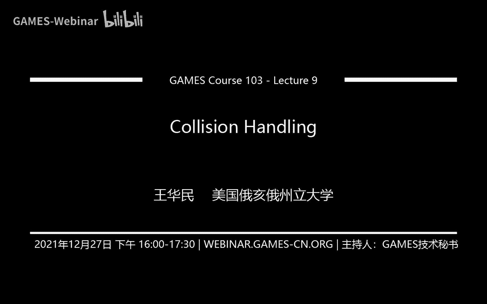
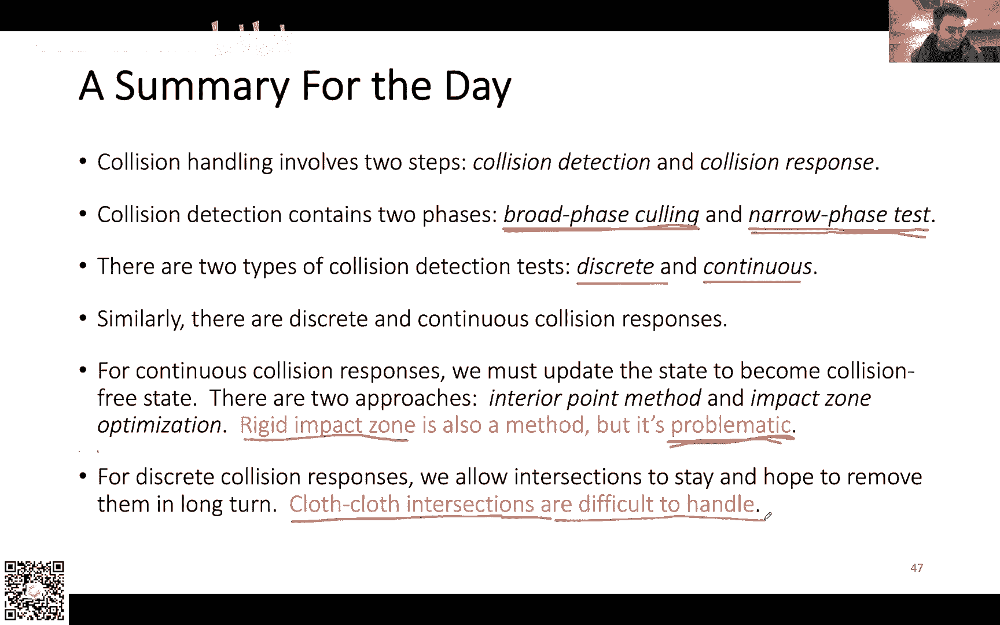

# GAMES103-基于物理的计算机动画入门 - P9：Lecture 09 碰撞处理 🎯

## 概述
在本节课中，我们将学习计算机动画中一个至关重要且实践性极强的主题：碰撞处理。我们将从如何检测碰撞开始，逐步深入到如何处理碰撞响应，涵盖离散与连续碰撞检测、内点法与冲击优化等核心方法，并探讨在复杂情况（如布料自碰撞）下的解决方案。

---

## 作业技巧与有限元模拟调试 🛠️

上一节我们结束了关于弹性体有限元的讨论。在进入新主题前，先针对上周布置的作业提供一些调试技巧。

作业提供了一个包含约1000个四面体的房屋模型。直接模拟整个模型难以调试，因为一旦结果出错，很难定位问题所在。

以下是调试建议：

1.  **从单个四面体开始测试**：不要直接运行房屋模型。首先尝试使用一个单独的四面体进行模拟。
2.  **测试静止状态**：关闭重力，让四面体处于静止状态。此时，形变梯度 `F` 应为单位矩阵 `I`。由此计算出的格林应变 `ε` 应为零矩阵 `0`，进而应力 `σ` 和力 `f` 也应为零。这可以验证你的力计算在平衡状态下是否正确。
    *   **公式**：`F = I` -> `ε = 0` -> `σ = 0` -> `f = 0`
3.  **测试拉伸状态**：将四面体沿某个方向（如X轴）拉伸。弹性体的力总是阻碍形变的，因此每个顶点上的力理论上应试图将四面体拉回原状。检查力的方向是否符合这个趋势。
    *   **操作方法**：通过缩放四面体顶点的位置来实现拉伸。
4.  **关于性能**：在Unity中运行此类模拟帧率可能较低，这受脚本执行和硬件配置影响。纯粹的CPU实现通常效率更高。四面体有限元模拟在游戏开发中通常只适用于分辨率很低的情况。

**关于作业的其他问题**：
*   **速度场平滑**：可对速度场进行拉普拉斯平滑，即每个点的速度与其邻居点的速度取加权平均。
*   **SBD的力公式**：建议自行推导验证，确保公式正确性。
*   **模型中的三角网格**：用于从四面体网格构造渲染表面，若无直接用途可忽略。

---

## 碰撞处理概述 🤔

本节我们将开始讨论碰撞处理这个新话题。碰撞处理的概念相对简单，但要想实现得鲁棒高效，算法复杂度非常高，需要处理各种边界情况。

本节课的目标是为大家建立基础概念，以便未来需要时能更快地上手。课程将分为以下几个部分：
1.  **碰撞检测**：如何发现碰撞。
2.  **碰撞响应方法**：介绍两种主流方法——**内点法**和**冲击优化法**。
3.  **离散碰撞处理**：介绍**相交解除**方法。

布料碰撞是所有碰撞处理中最困难的。若能处理好布料碰撞，其他碰撞问题便可视为其简化版。

---

## 碰撞检测 🔍

处理碰撞的第一步是知道碰撞是否发生。碰撞检测通常分为两个阶段，以提高效率。

### 广义阶段碰撞剔除

当场景中有大量元素（如数万个三角形）时，对所有元素进行两两碰撞检测的计算量是平方级的，无法承受。因此，第一阶段（**Broad-phase Collision Culling**）的目的是**剔除那些绝不可能发生碰撞的元素对**，输出一组**候选碰撞对**。

以下是两种常见的广义阶段剔除方法：

#### 1. 空间划分法

核心思想是将整个3D空间划分为均匀网格。每个三角形根据其位置（或运动轨迹所占用的空间）被存储到与之相交的网格单元格中。

**检测流程**：
1.  对于每个三角形，找出它占据的所有网格单元格。
2.  要判断某三角形可能与哪些其他三角形相交，只需检查它所在单元格内存储的所有其他三角形。
3.  将这些三角形对作为候选对输出。

**优点**：实现相对简单，对GPU友好。
**缺点**：需要为整个空间预分配网格内存，可能造成浪费；物体运动后需要更新网格信息。

**优化方案——空间哈希与排序**：
为了节省内存，不直接分配网格数组，而是为每个“三角形-单元格”关联创建一个记录（如 `(cell_id, tri_id)`）。然后对所有记录按 `cell_id` 排序。排序后，连续且 `cell_id` 相同的记录就代表了该单元格内所有的三角形。这避免了为空单元格分配内存。

**进一步优化——莫顿码**：
在三维空间中，按行、列、层顺序访问网格会导致内存访问不连续（尤其在访问空间邻居时）。莫顿码是一种空间填充曲线，它将多维空间索引编码成一维，使得空间上相邻的单元格在内存地址上也更接近，从而优化缓存访问效率。

#### 2. 包围体层次结构

核心思想是对物体本身进行层次划分，而非对空间进行划分。例如，一个机器人模型可以按肢体划分成多个部分，每个部分用一个简单的包围体（如轴对齐包围盒AABB、球体）包裹。

**检测流程（以BVH树为例）**：
1.  从根节点开始，检查两个包围体是否相交。
2.  若不相交，则其下所有子元素都不可能相交，整条分支可剔除。
3.  若相交，则递归地检查它们的子节点。
4.  对于自碰撞检测，需要额外检查同一节点下不同子节点之间的包围体是否相交。

**优点**：更新效率高（只需更新包围体），适合结构化的、运动连贯的物体。
**缺点**：实现较复杂；树形结构对GPU不友好；对于密集近邻的剔除效率不如空间划分法。

**其他方法**：有研究尝试用形变能量的大小来预测碰撞可能性（形变越大，碰撞可能越高），但对布料等常有大形变却无碰撞的情况效果有限。

**方法对比总结**：
| 特性 | 空间划分法 | 包围体层次法 |
| :--- | :--- | :--- |
| **实现难度** | 较简单 | 较复杂 |
| **GPU友好度** | 友好 | 不友好 |
| **更新成本** | 高（需重建） | 低（更新包围体即可） |
| **适用场景** | 元素分布均匀/随机 | 物体结构性强、层次清晰 |

---

## 狭义阶段碰撞检测 🎯

经过广义阶段剔除，我们得到了一批候选碰撞对。在狭义阶段（**Narrow-phase Collision Detection**），我们需要对这些候选对进行精确的检测，判断它们是否真的发生了碰撞或相交。根据后续处理方式的不同，检测也分为两类。

### 离散碰撞检测

DCD检测的是在**某个特定时刻**，几何体之间是否**相交**（即穿透），而不关心运动过程。

**基本操作**：对于三角形网格，最基本的是检测边与三角形是否相交。
1.  计算边与三角形所在平面的交点参数 `t`。
2.  判断该交点是否位于三角形内部。
3.  若是，则报告相交。

**优点**：计算简单、快速、稳定。
**缺点**：可能产生**隧道效应**。如果物体运动速度过快，可能在两帧之间直接穿过另一个物体，而在这两个离散时刻都未检测到相交。这对于薄物体（如布料、兔耳朵）尤为严重。

### 连续碰撞检测

CCD检测的是在**两个时刻之间**的运动过程中，几何体是否**发生了碰撞**。它关注的是第一个接触点，而非穿透状态。

**基本元素**：对于运动的三角形网格，基本的连续碰撞检测有两种：
1.  **点-三角形检测**：一个运动的点与一个运动的三角形。
2.  **边-边检测**：两条运动的边。

**以点-三角形检测为例**：
假设四个点都在做线性运动。碰撞发生时，这四个点共面，即它们构成的四面体体积为零。根据体积公式，可以推导出一个关于时间 `t` 的**一元三次方程**。
*   **公式推导**：`Volume = ( (x1(t)-x0(t)) × (x2(t)-x0(t)) ) · (x3(t)-x0(t)) = 0`，展开后得到 `a*t^3 + b*t^2 + c*t + d = 0`。
解此方程得到可能的碰撞时间，再验证该时刻点是否落在三角形内部。

**为什么需要边-边检测**？因为两个三角形可能只在边上发生碰撞，而点-三角形检测无法捕捉这种情况。

**CCD的挑战**：
1.  **数值稳定性**：求解一元三次方程时，应避免使用求根公式（浮点误差大），推荐使用数值方法（如二分法、牛顿法），并只关注时间区间 `[0, 1]` 内的根。
2.  **计算成本**：比DCD高，因为需求解方程。
3.  **实现复杂度**：高，容易遇到各种边界情况。

尽管CCD计算更复杂，但在广义阶段剔除大部分元素后，其成本通常可以接受。CCD是避免隧道效应、实现高质量碰撞的必要手段。

---

## 碰撞响应：内点法与冲击优化法 ⚖️

当我们检测到碰撞（或相交）后，下一步就是处理它，将系统修正到一个无碰撞的状态。假设模拟后得到了一个有碰撞的状态，而我们的目标是安全区域（无碰撞状态）。有两种主流的数学思路来解决这个问题。

### 内点法

**核心思想**：从安全区域内（上一帧的无碰撞状态）出发，采取小步长迭代，**确保每一步迭代后的中间状态都保持在安全区域内**，最终逼近模拟目标附近的无碰撞解。

**类比**：小心翼翼地从安全区走向目的地，绝不踏出安全区边界。

**优点**：
*   **必然成功**：即使未完全收敛，只要在安全区内停止，结果就是可接受的（无碰撞）。
*   **数值稳定**。

**缺点**：
*   **速度慢**：需要小步长保证安全，且可能迭代步数很多。
*   **计算量大**：每步都需要进行碰撞检测以确保安全。

**实现示例——对数障碍函数**：
在能量函数中添加一个关于距离的对数障碍项。当距离趋近于零时，该项产生的排斥力趋近于无穷大，从而防止穿透。图形学中常会进行截断以限制影响范围。
*   **优化目标**：`min ||x - x_target||^2 + λ * Σ -log(d_i(x))`，其中 `d_i(x) > 0` 为距离约束。

### 冲击优化法

**核心思想**：胆子更大。直接从模拟得到的不安全状态出发，通过优化或投影操作，**试图一步或几步将其拉回安全区域**，不关心中间过程是否安全。

**类比**：从目的地（不安全）直接跳回或拉回安全区。

**优点**：
*   **速度快**：通常碰撞只发生在局部，可以集中计算资源进行优化，步长可以较大。
*   **高效**：只处理出问题的区域。

**缺点**：
*   **可能失败**：如果初始状态离安全区太远，可能无法收敛到无碰撞解。
*   **不保证严格无碰撞**：结果可能仍有轻微穿透。

**实现方式**：通常构建为一个约束优化问题，使用拉格朗日乘子法、增广拉格朗日法等求解。例如，检测到穿透时，施加一个冲量将物体推开。

### 刚性冲击法

当上述方法都失败或过于复杂时，一种“最后一搏”的方案是**刚性冲击法**。它将发生复杂碰撞的整个区域**锁定为一个刚体**，禁止其内部相对运动，从而从根本上避免继续碰撞。

**优点**：简单、安全、绝对有效。
**缺点**：会引入明显的视觉瑕疵，失去局部形变细节。

**实际工作流建议**：
1.  首先尝试快速的**冲击优化法**。
2.  若失败，且计算资源允许，则回退到鲁棒但较慢的**内点法**。
3.  若仍无法解决或需要实时性能，则对碰撞区域启用**刚性冲击法**作为保底。

---

## 碰撞响应：相交解除 ✂️

对于某些应用（如游戏、CAD软件），目标可能不是物理上精确的碰撞响应，而是**快速消除视觉上的穿插**。这就是“相交解除”的思路。

**核心思想**：承认当前帧可能存在相交，并采用一种后处理技术，直接修改顶点位置来消除穿插，而不严格考虑物理正确性或运动过程。

### 对于有体积的物体

这相对简单。常用**符号距离场**（SDF）来表示物体体积。对于每个发现穿透的点，计算其到SDF表面的最短方向，并将其沿该方向推出表面即可。
*   **之前作业中的球与布料碰撞**即采用此思路。

### 对于布料自碰撞

布料是开放的曲面，无法定义内外，因此SDF方法失效。需要更复杂的算法。

**思路一（2003年）**：将相交的布料区域分段，假设面积较小的片段是穿插产生的“多余”部分，并设法将其移除或平滑。但该方法难以处理边界处的穿插。

**思路二（2006年）**：将布料间的相交视为一条空间曲线。通过优化，**最小化这条相交曲线的长度**。当曲线长度为零时，穿插即被解除。该方法能更好地处理边界情况，但也不是万能的。

相交解除是一种实用的、面向视觉效果的策略，常作为物理碰撞响应失败后的补充或替代方案。

---

## 总结与课程预告 📚

本节课我们一起学习了碰撞处理的完整流程：

1.  **碰撞检测**：
    *   **广义阶段**：通过空间划分或包围体层次结构剔除不可能碰撞的元素对，提高效率。
    *   **狭义阶段**：
        *   **离散碰撞检测**：检测特定时刻的相交，快速但可能有隧道效应。
        *   **连续碰撞检测**：检测运动过程中的碰撞，精确但计算复杂，需解一元三次方程。

2.  **碰撞响应**：
    *   **内点法**：从安全区出发，步步为营，保证中间状态安全，鲁棒但慢。
    *   **冲击优化法**：直接修正不安全状态，高效但可能失败。
    *   **刚性冲击法**：将碰撞区域冻结为刚体，简单粗暴的保底方案。
    *   **相交解除**：以消除视觉穿插为目标的实用后处理技术，尤其适用于布料等复杂情况。

碰撞处理是一个概念易懂但实现艰难的领域，充满了算法细节和工程挑战。理解这些基本方法为应对实际开发中的碰撞问题奠定了重要基础。

**下周预告**：我们将开启全新的主题——**流体模拟**。课程将分为三部分：基础介绍、基于网格的欧拉方法、以及基于粒子的SPH方法。