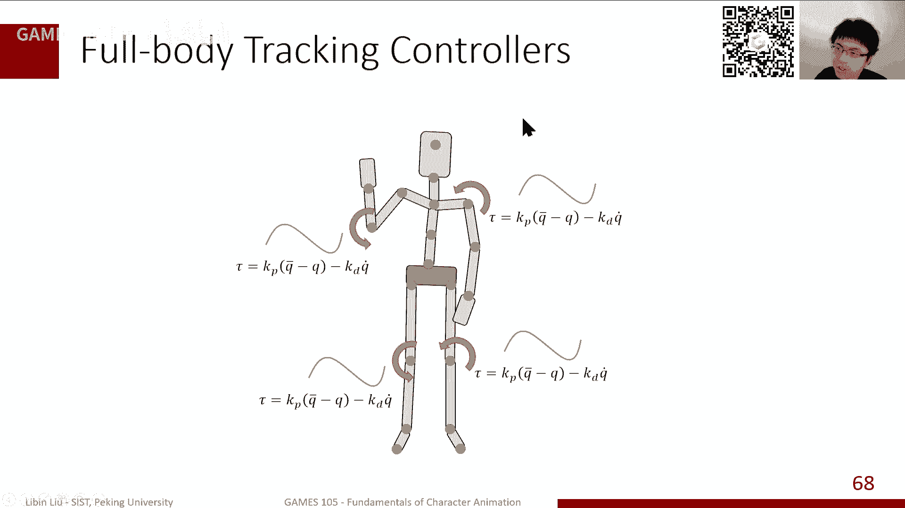
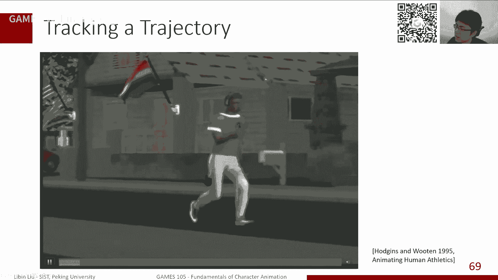
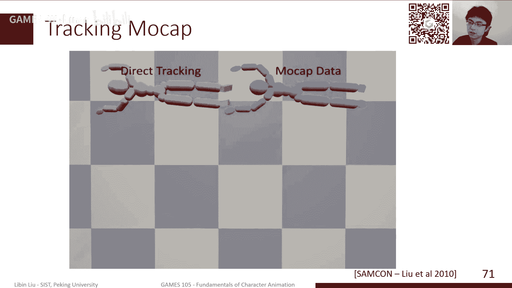
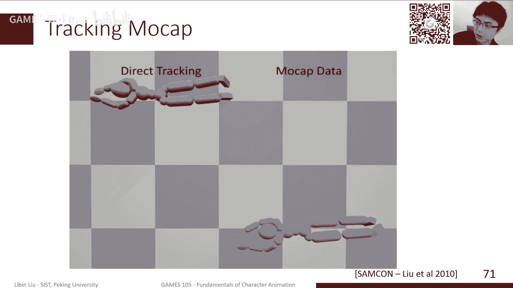
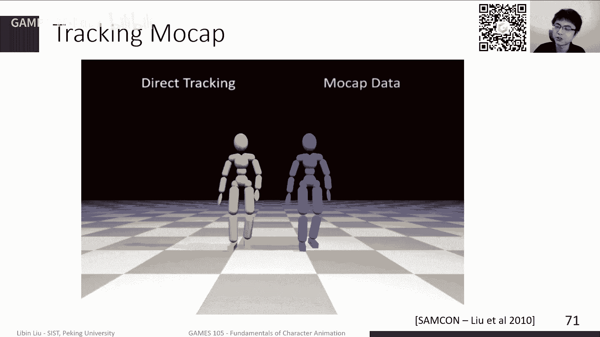
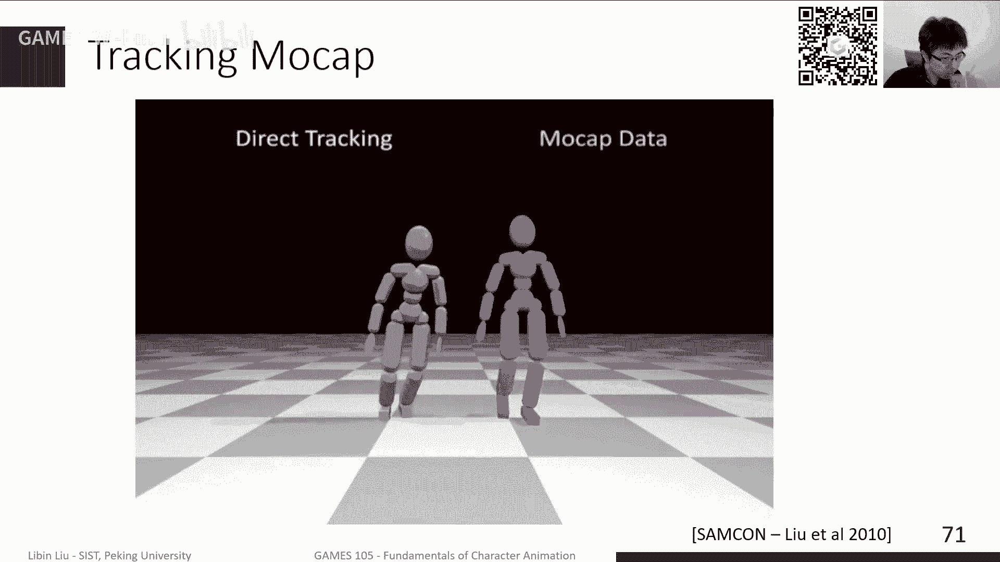
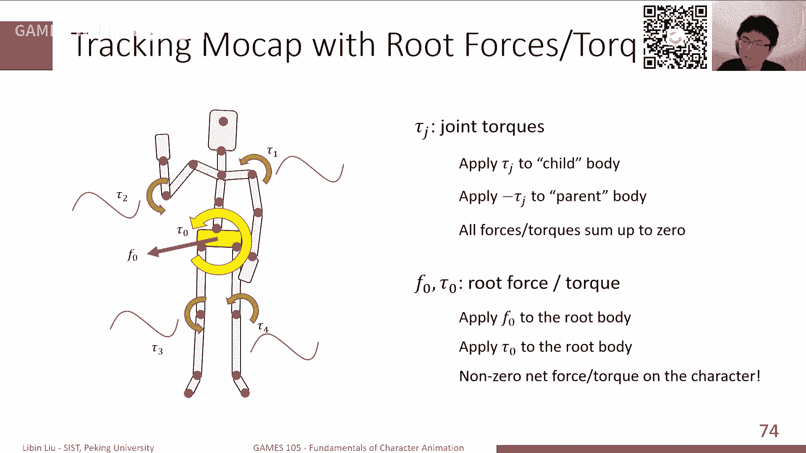
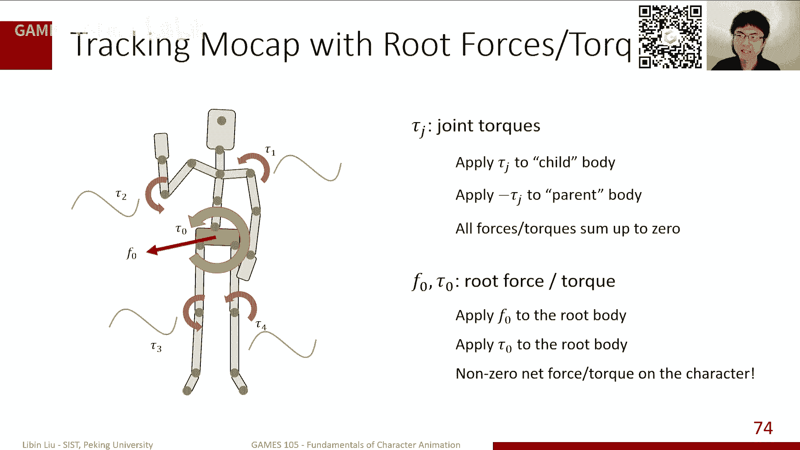
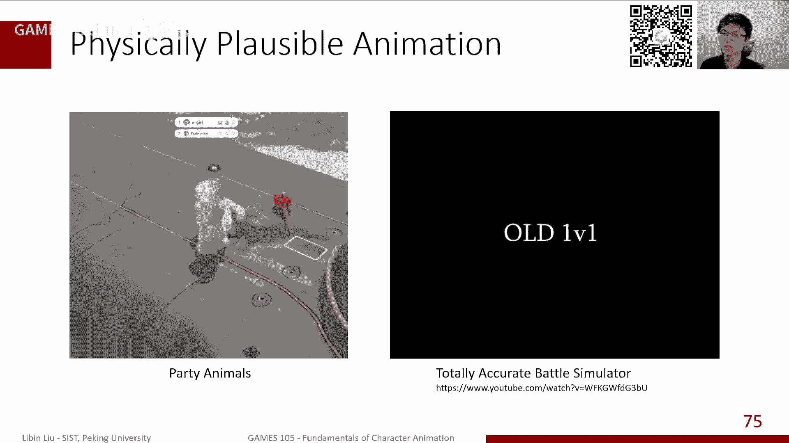
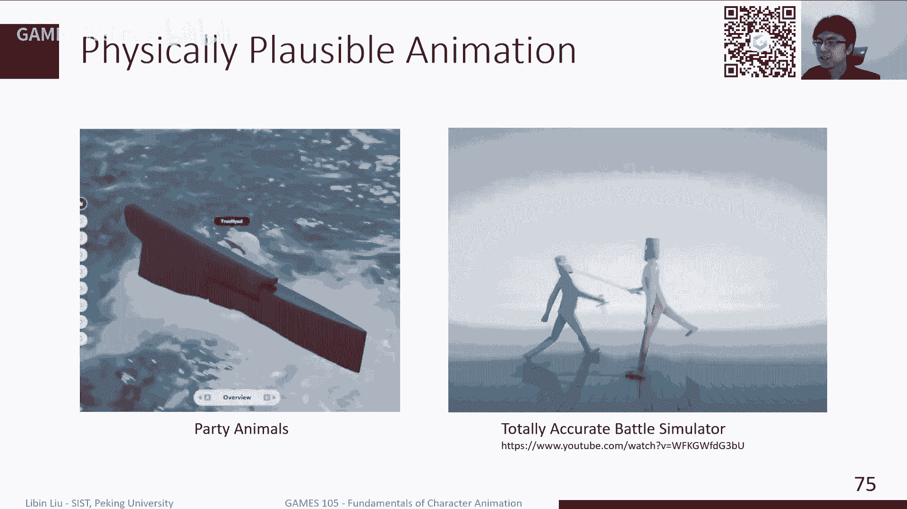

# GAMES105-计算机角色动画基础 - P10：Lecture09 Actuating Simulated Character - GAMES-Webinar - BV1GG4y1p7fF

ok好那我们就开始上课啊，这个非常抱歉啊，因为上周确实这个身体不太舒服啊，我们就又跳过了一周，这样的话实际上我们原计划应该是，今天是这这门课的最后一节课，最后一节课，但是实际上因为我们中间跳过两次课。

所以说我们结束的时间也会相应的延后一下，这个相应的我们的日程上也会有些调整啊，那我们今天的内容其实相对来说会比较简单，因为上节课我们讲的时间比较长，主要是讲了很多仿真相关的东西。

那我们今天其实会继续上节课的内容，但是我们现在在这个仿真之后呢，我们其实还是要讲一讲，我们该如何在仿真的基础之上，能够驱动我们的角色来产生这种动画，因为毕竟我们这门课是这个经济学的动画嘛。

啊那我们今天其实主要还是讲这个如何驱动的，第一个就是最基础的部分，就是我们该如何让这个角色能够动起来，当我们动起来之后呢，那我们后面有几节课啊，其实会讲是更加介绍多一点的。

就是关于我们该如何让这个角色能够，动得更加好一点，更加更加真实，那我们今天是这个game 305的第，应该第十第十次课啊，所以说我们写的是lecture，零九，我们主要是讲讲activating。

simulated character，也就是如何去驱动虚拟角色来产生动作，他们可以先简单回顾一下，我们上节课讲了，不讲了内容啊，我们接着上节课主要是讲的是什么呢，我们如何来进行一个仿真。

如何仿真一个虚拟角色，如何让一个这个缸体，因为我们现在我们角色动画里面，其实我们所处理的这个虚拟角色，大部分其实是这个由刚性的，不会变形的肢体加上关节构成这样的一个系统，那在这个基础之上呢。

我们该如何去嗯，为了让角色动起来呢，我们其实肯定是需要在这个钢铁系统上，那我们如何来计算这样的合力和力矩呢，其实主要是我们控制器需要去完成的内容，好我们今天主要是讲两部分。

一部分是说我们这个控制力是怎么去施加在，这个角色身上的，另外一方面呢，我们讲一讲一个非常简单的这个控，计算控制力的这样的一个模型啊，就所谓的比例微分控制，我们可以简单回顾一下，就是嗯其实我们讲这个仿真。

我们通常来讲是给出了一个比如说一个质点啊，我们一个质点它有一个位置啊，它有一个速度，那在这样的基础之上呢，我们其实可以根据这个速度和它的位置，去不断的更新它的位置，来产生一个这个支点的一个动作。

那这点其实他这个这个因为大家都对这个，牛顿第二定律是非常了解的，那实际上我们如果想让这个质点啊产生，让他产生我们想要的这个运动，我们通常来讲需要在这个支点上加一个，合适的外力啊。

那这个力呢其实会相应的产生加速度，然后这个加速度会进一步的通过积分啊，来更新这个支点的速度以及支点的位置，那最终形成我们的动作，那当然这个其实只是一个支点，支点是在于是一个什么样的。

它是一个非常抽象的一个概念，它只有位置嗯，就是它只有只有方向，只有速度，只有位置，它没有形状，这样的话意味着什么呢，意味着这个支点我不管怎么旋转，它其实这个所代表的这个东西啊，这个状态其实是完全等价的。

但是我们其实在这个动画里边，更关心的是所谓的钢铁，那缸体和质点区别在于哪呢，钢铁之液在于缸体是有形状的，那形状会带来一些什么效果的形状，就是说这个缸体在不同的朝向之下，那它的形状在我们能够观察到的。

这个这个外在的这个这个外观其实是不一样的，从另外一个角度讲说，实际上也是代表了什么，代表了这个缸体它在不同的朝向之下，那其实会代表着不同的状态，这时其实是跟我们讲质点的时候，是完全不一样的。

那这个其实也带来一些什么问题呢，就是朝向或者旋转，那其实是一个非常讨厌的东西啊，它跟我们这个速度啊，这些线性量不一样，它是一个角度的量，而且它是一个非线性的量，那这些其实会带带我们这个我们上节课。

包括我们以前讲各种跟这个关节旋转相关的，这些这些这些操作里边，我们就发现其实这个这个这个非线性啊，其实会带来很麻烦的一些东西，包括比如说i k我们为什么要算jacoby。

因为本质上来说也是因为这个非线性，我们只我们只能通过这种方式来进行处理，那当然这个朝向因为不同的朝向代表了不同的，这个对于钢铁来说，不同的朝向代表不同的姿态，那实际上我们需要去关心手机。

首先我们需要关心它的朝向，其次呢那朝向随着时间，因为它运动过程中，那朝向也会不断的发生变化，那我们知道位置的变化其实带来的是速度，位置的变化率本质上就是速度，那朝向的变化率呢。

我们其实也是提到它本质上就是一个角速度，那其实也是一个速度的衡量，那当然我们其实也是，因为毕竟这是一个非线性的东西啊，所以说实际上r的点比如说是一个旋转矩阵啊，它的这个变化率。

实际上跟我们的角速度还是有一点点区别的，我们上节课其实也讲到了，实际上角速度其实是这个跟跟这个角度啊，就是这个旋转矩阵的这个导数，其实是有一有一个有一个有一个坐标转换的，这么一个关系。

那除了这个速度之外呢，其实我们知道在我们讲质点的时候，质量还是有质量，那质量代表什么，质量其实代表的是一个啊，对于运动的某种程度上，是一个抵抗的这么一个效果，牛顿第一定律说的什么，第一定律说的是。

如果说我们的质量没有变化，哇塞不，如果说我没有任何外力，那其实这个物体会保持当前运动状态，但实际上这个东西保持这种运动状态，的这么一个这么一个趋势，或者这么一个能力，其实代表了这个东西的惯性。

那惯性用什么衡量呢，其实就是质量来衡量它的惯性，那对于角速度来说，对于钢铁来说呢，其实对于限速的，我们是用质量来来去来去衡量它的惯性，那对于这个角色来说，我们其实有一个类似的一个量。

这个量就是所谓的这个惯性张量，那这个惯性张量其实你可以类比于质量，这个变化，就它代表了是，因为质量是代表对于线运动的这样的一个啊，阻碍他改变了这种这种这种能力，而这个转动惯量呢，其实代表的是说。

我去改变一个旋转的这么一个状态啊，然后所需要带来的这个，所需要带来这个这个这种抵抗的一个衡量，当然这样的观念其实跟质量是有很是很相关的，因为本质上来说，它其实是每一个质点的这样一个。

这个每个质点自己的这样的一个角动量的，然后在整个这个缸体啊，它这个上面做了一个积分啊，他最后走体现出来的这么一个整体的，这样的一个效果，才是这个转动惯量，所以实际上一般来说。

这个如果是一个物体的质量更大一点，但通常来讲它的转动惯量也会更大一点，那当然还其实我们上节课，其实这个公式上还是可以比较明确的看到的，实际上转动惯量跟物体的形状，也是有很大的关系的，你看这里。

其实这里这几个球其实质量大小是相同的，但是他们的转动惯量是不一样的，其实一方面是说，如果说这个转动惯量，它这个质量分布的更加接近于这个物体的边缘，那通常来讲它所带来的转动惯量会更大一点。

然后不同的转动惯量，其实它对这个旋转这个角速度变化的，阻碍程度是不一样的，所以说时间可以看到它，就是虽然说我们质量是相同的，我们这个初始状态是相同的，整体运动表现也是可能是完全不一样的。

这其实是一个专栏惯量这样一个过程，那类似的还是我们其实也提到了，对于一个线性，那对于一个质点来说，我们都要加一个力，这个力其实会带来我们的质点的加速度的变化，那同样的。

如果说我们想去带来一个这个角速度的，这个变化，那我们其实需要加一个角，跟角度相关的这么一个力，这个力其实就是力矩，而实际上我们知道力，任何一个外力其实都会有一个力矩的作用。

它的力矩本质上等等价于是这个利弊啊，乘以利差成立啊，得到这个力矩，它其实代表的是一个这个力对这个角度啊，这个物体的旋转上，这个带来的影响，那结合力的这个牛顿第二定律，它其实代表的是这个线性方向上的。

这样的一个力和速度变化的关系，而在角色的方向上，我们也提到了，其实有一相的是欧拉啊运动定律，其实牛顿第二定律也是欧拉运动定律的一个，其中之一啊就是就是欧拉定定律，相当于把这两个定位结合一起。

难道你要嗯欧拉定定牛顿第二定律是说什么呢，是说这个f等于ma啊，或者再进一步的时候，它其实应该是动量的时间变化率啊，等于这个力的大小或者力的大小，带来的这个动量动量的时间变化。

然后对欧拉的这个运动模式来说，实际上是角动量的变化率等于力矩啊，这个其实是这个其实跟牛顿力压力是相似的，但唯一的区别在于呢，就是还是我们这里，其实是要考虑到一个非线性的一个，角度量的变化。

所以说在我们最速度求导，那其实可以直接得到它应该就是这个啊，这个这个就是速度的导数，但如果说我们对角动量求导的话，因为角动量一个这里边这个转动惯量，转动惯量，它是跟物体的形状和物体的朝向同时相关的。

所以说实际上我们的秦老师要稍微复杂一点，这样的话其实可以得到，就像我们这里就出现了这个公式，就除了我们正常的这个角速度的这个加速，角加速之外呢，我们其实当前的角速度也会带来一些额外的，这个力的效应啊。

虽然它是一个它并不是力，但它其实代表了某种程度上一个力的效应，就是我们的差乘，还有我们对这样的一个改一个形式，所以这样那是连在一起啊，首先就是我们的所谓的刚体运动的，这个运动方程。

那我们其实可以把它写成一个矩阵的形式，那我们其实当我们给出了一个外力啊，一个啊这个外力和外力矩之后呢，我们其实可以求解这个运动方程，得到我在这样外力的作用之下，我的这个角速度的加速的变化率。

或者或者角加速度以及我的速度变化率，那通过积分的话，我们可以进一步得到最终的动作，那就是我们这个物体该怎么动，它的速度该怎么变化，它的位置该怎么变化啊，完成这样的一个操作，那这个其实我们是简单回顾了。

上节课，我们讲了这个仿真的这个运动方程的这部分，那实际上这个其实也是告诉我们，比如说我如果说我们需要在一个物理引擎里边，去定义一个一个钢铁，那通常来讲我们需要给出什么样的一个参数呢，就不管什么物理性。

比如说用bullet，用jo或者是用sc或者fsx或者是时间，大家可能就是在游戏见到了一些其他物理，就比如havoc，实际上大同小异，就当我们去定义一个缸体的时候，我们需要给出钢铁的一些参数。

通常来讲我们需要两个有两个参数非常重要的，一个是质量，一个是转动惯量，这个代表了钢铁他的这个这个惯性的部分，那这个其实是不管我怎么动，它都是一个相对来说比较固定的，这样这样一个结，除此之外呢。

作为一个刚体，我们知道它有位置，没有朝向，有速度，有角速度，这个其实代表它的运动的部分，另外一部分呢就是所谓的geimage，就是所谓的缸体的这个形状，就通常来讲，我们知道这个对于游戏引擎。

或者这种这种仿真来说呢，就是钢琴就read about it，通常来讲是，我们可以把它认为是一个，有点类似于一个一个一个一个抽象的，一个一个一个对象，就是它可能本身，我们其实不关心他具体长什么形状。

我们只关心在这样一个这关灯，这样一个质量和战斗惯量之下啊，然后加上一个力之后，它需要它会产生什么样的，这样一个运动上的变化，那相对来说，形状本身其实通常来讲是跟钢铁的定义，独立的一个东西。

那形状带来什么呢，形状带来了两个两三种不同的这种影响啊，一种影响是说外观，那就是我们看到这个物体到底是什么形状呢，它是一个box，是一个sphere，是一个球，或者是一个一个一个立方体等等等等。

或者是我们可能是一个mesh，一个电源啊，或者是一个一个网格，那可能就是一个一个一个人形啊，或者是一个动物啊这些形状，这是其实一方面带来的外观，另一方面带来什么呢，另外带来的是转动惯量。

我们前面提到了这个转灯光亮，其实它的它跟光物理的形状是直接相关的，所以说如果说这是一个bug或者是一个球，或者是一个球壳，或者是一个这个这个时间球，它其实都会带来不同的转观念，另外一方面呢。

其实质量某种程度上也是会跟我的形状相关的，因为人基本来说，比如说我们的这个啊密度，基本都是这个跟水差不多嘛，那实际上你的体积就代表了你的重量，那还有另外一个非常重要的部分。

就是所谓的collision detection，我们的这个碰撞检测，因为我们知道最基本的人能站在地上，那实际上是地面会给人的脚一个支持力，那这个地面应该在什么地方给角的支持力呢。

其实你需要告诉他我这个角的形状是什么，所以说定义一个这样一个这样一个rg的body，通常来讲，我们其实是除了我们的这个，纯粹的物理量之外呢，我们还有相对的这个几何量呢，主要就是这个形状。

这部分不管能有哪一种物理情啊，实际上我们都是要给出像这些这些量啊，这些东西来定义，我们这样一个信这样一个这样钢铁的角色，那咱们只是其实是一个单独的钢铁啊，那对于多个钢铁来说呢。

我们其实上节课讲的部分是说，我们其实可以把多个缸体啊，看成是一系列独立的单独的缸体来进行计算，那在这个过程中呢，因为我们多多样体对一个角色通来讲，我们会有一个关节啊，把这些钢铁给连接起来。

那关节代表什么东西呢，关节其实代表了一种约束，约束是什么呢，就是说比如说我两个物体，它为了在运动过程中不能分开，那这个约束一方面代表了从几何上角度讲，就是说他们俩肯定是要满满足某一个相对关系。

在这过程中不发生变化，另外一方面其实为了能够满足这样的下列关系，我们知道这个像一个关节，比如说抓这个物体往前往这往前扔啊，如果说这个我不想这个物体离手，那我肯定是在运动过程中，要不断给物体加一个力啊。

才能让他不会离开，不会跟我的手分开，那时间关节其实也是一样的，结果这两个两个两个缸体，两个肢体在他们需要分，在他们这个运动过程中，它有分开倾向的时候呢，那这个约束啊它会相应地产生一个约束力。

那这个约束力来保持这个物体能够混合在一起，那如果说我们能够计算出这个约束力之后呢，那实际上这两个缸体其实本质上就是两个，在所有的这些外力之下啊，独立运动的一些钢铁，所以它其实你写成运动方程的话。

本质上它其实就是两个钢铁的相应的部分，然后拼在一起，拼成一个更大的一个方程，那他这个里边我们这个约束，就比如比如说关节约束，其实其实这个方程之外的一个额外的一个，一个方程。

那这个约束力实际上有包邮的约束，这个方程来嗯，来这样的一个给出的，那当然这个方程比较麻烦了，我们其实可以同样把它稍微简化一下，写成一个更加紧凑的一个格式，那本质上来说。

这两个方程这个跟上一个方程其实是一样的，我们只是把这个矩阵用一个简单的符号来代替，那这个包括中间的这个这个求导，得到这个这个差成像，我们其实也是可以用另外一个函数来定义。

本质上来说这俩是同一个同样一个东西，那如果说我们有更多的一个物体啊，就比如说这个正常人，那我们其实可能有十几个不同的关节，不同的钢铁关节组构成，但它本质上来说是一个构成一个更大的，这样的一个系统。

那里边每一个关节带来相应的一行的，这样的一个约束啊，同时也也会相应的产生一个对应的约束力，那整体整个仿真过程呢，实际上就是在构造这样的一个啊运动方程，包括了我们这个每个约束的关节。

约束所带对应的这个约束方程，然后以及我们这个所有的外力和，每一个这个约束力构构成的这样的一个加速度，这样的一个方程哦，就是那最终这个方程去求解，得到我们相应的加速度，那最后通过欧拉积分。

我们可以得到我们这刚体运动这样一个动作，那这个其实我们主要是我们上节课讲的，讲的内容，那同样的我们前面说对定义一个缸体，那我们其实需要给出它的质量，它的位置，它的形状，那如果说我们对一个角色。

通常来讲角色我们知道它是由若干个钢铁啊，然后通过若干个同样数量的这个关节啊，来来连接起来，通常来讲我们讲关节的话，特别是对于一个人形的角色啊，我们通常来讲它的关节总是，每个关节总是连接两个物体。

222个这个缸体，所以说整体来说我们钢铁的数量和关节的数量，是指刚好差一的，就说就是关节的数量，刚好比我们钢铁的数量少一个，因为这样的话可以保证我这样的一个这个连，连接关系，那我们定义一个角色。

那么通常需要d什么呢，首先我们需要定义每个缸体的，它的这个各种属性，包括它的位置啊，朝向啊，转动惯量等等，那另外一方面，我们需要定义这个钢铁本身的这个形状，但通常来讲。

这个形状他可能跟我们这个角色本身的外观，可能不完全一致，因为特别是我们这个角色，大部分情况下，它其实是一个网格啊，比如说一个人形的一个网格，或者说一个比如说一个动物，那我们这个缸体我们在仿真的过程中呢。

通常来讲我们会用更加简单的几何体来代替，比如说有一个capsule，一个胶囊体，或者是一个box，一个企鹅，一个一个立方体，或者一个或者一个这个这个这种这种啊，求这样的之类这样的角色。

为什么我们要做这样的事情呢，其实本质上还是因为我们需要去做，比如说碰撞检测，比如说我需要判断判断检测做的是什么，判断检测做的是说，我们需要判断一下两个几何体，它们之间有没有相交的位置。

然后这个如果有的话，那这个相交的位置在哪里啊，通常来讲，比如说我用碰做一个电源和电源做碰撞检测，这个其实是比较麻烦的，因为这个点位形状不规则，所以说如果说我需要去判断哪两个部分相交。

那我基本来说需要把整个电源去遍历一遍啊，当然我们有些数据结构能够帮助我们去加快啊，加速，那实际上整体来说它是一个比较耗时的，那样一个过程，另外一方面，其实电源其实本质上这个就这个这个网格。

它本质上还是一个比较，是一个比较，可能是一个比较更加复杂的一个东西，的一个近似，那这种情况下，比如说我需要计算我该上哪个方向上去，就是就我这个朝向，他就我这个接触点，我该怎么去把它这个东西分开啊。

在这如果说一个点源的情况下，其实相对来说更加难算一点，因为很多时候比较难判断我这两个相交的时候，哪一个是在物体的这个人的里边，哪一个是物理人的外面，因为我们通常来讲，比如说我要处理这个碰撞的话。

我们是希望他们俩能够分开，而不是能够接进去了，那我希望能够比较准确的判哪里哪是y，那这个其实对于这个对于这个网格来说，通常也是也是一个比较麻烦的一个过程，所以说实际上我们在大门仿真里边呢。

就是这个通常来讲我们还是会用这个，一般来说会用一个简单几何体，给他提高这样的效率，玩实际上这也不绝对了，就是其实很多时候我们也可以用这个，用这个用这个mesh来来完成这样一个工作。

那另外一方面除了我们这钢铁的定义之外呢，我们其实还是要定义相应的这个关节，因为关节本质上，它会变成我们前面运动方程里边的这个约束啊，那其实基本来说我们需要知道什么呢，我们需要知道这个关节在初始化的时候。

它在什么位置，因为我们知道关键，它代表的是说两个这个它所连接的两个物体，在运动过程中，这个是在这个这个这个这个关节的这个位置，是不会分开的，那一，这意味着就是说这个关节的位置。

在第一个物体的这个相对的坐标系下，和在第二个物体的相对坐标系下，他所得这个带来这个嗯，所对应的位置是永远重合的，那这个对应的位置，时间是由最开始这个关节的位置，以及这两个角色这样缸体的位置。

对应的位置所共同定义出来的，那除此之外呢，这个跟这个关节的类型，其实也带来的也会带来更多影响，我们这个运动这个角色的运动，就比如说我们的这个膝盖非常非常典型，它是一个一个自由度单自由度这样的一个关节。

那如果说这个膝盖哎，我突然突然向向向旁边去弯过去的，那这个人多半就是骨折了，那这个肯定是不对的，那这对应不同的这个关节，其实对应的不同的这个约束的方程，比如说一个黑纸状态。

那么除了去那么要求他这个关节不会分开之外，那么其实同样还是要求他在这个hinge冠，就是就是hinge这个自由度之外，另外的自由度，它的旋转应该是两个钢铁的旋转应该是相同的，开机就会带来这样更多的变化。

所以整体来说，比如说我们需要定义一个角色，在一个访整理心里定义这样的一个角色，那么就是首先我们需要定义他每个关节啊，每个缸体的一些性质，以及另一行每一个关节的这样一个性质。

那这样的话我们就可以在一个仿真器里，把这个角色给建立起来，当我们建立这个角色之后呢，其实仿真过程我们大概可以写成这样一个，框图的这样一个形状，因为它整个仿真过程我们最关心的是什么呢。

就是实际上最关心的是每一个在仿真过程中，每一个缸体啊，它的位置朝向速度，角速度等等的变化，这些共同构成了一个缸体的这样一个，整个角色的这样的一个状态，那这里其实有一个问题，就是说为什么我们在这里。

这个关节的位置该怎么处理呢，就是关节的位置，我们其实为什么不考虑其实关节的位置，因为我们前面提到了，它本身是一个约束嘛，它其实代表的是说他总是会满足一个关节，相对于某一个缸体。

它的相对位置的运动公式不会变化的，因为这个约束就决定了这件事情，所以实际上如果说我们知道了钢铁啊，就是每个关节，美国每个这个肢体的这个为这个朝向，这些信息的话，那么其实可以很容易的去计算出。

这个对应的关节，它应该这个相对相关的这些性质，那这个过程中我们其实仿真，我们可以大概的近似的写成的这样的一个，框图的一个形式，那本质上来说，从某一时刻t时刻，我现在知道整个角色他的身体状态。

包括了他的每个关节的每个肢体的位置，每个缸体的位置啊，速度朝向啊，角速度等等这些信息，然后呢我把这些这些信息把它给啊，交给我们的仿真引擎，那这个仿真引擎呢会根据这些信息计算出啊。

或者更新啊这个角色的这个状态，那我们算出下一个t加一时刻的这个每个缸体，它的这个位置速度啊，旋转也还有这个朝向，那这个dynamic simulator，我们这个仿真器啊，他他大概做了什么事情呢。

其实如果说我们把这个整个过程流程，写的更加仔细清楚的话，它大概分成这样几个几个环节啊，首先是说我们需要做这个contact检测，我们需要判断一下哪一个，比如说站在地上，那我需要判断一下我的脚是啊。

哪些部分跟地面是接触的，那地面接触之后呢，我们其实会加上相应的这样的一个呃，这个这个碰撞模型，那我们其实挺讲最简单的碰撞模型，那么就可能是基于这种，所以法向的penalty的这样的这样的模型。

我们可以根据我的跟地面的接触的，这个这个嗯相交的这个程度，不好意思，我们可以相应地计算出计算一个力，这个力可以保证我这个角是用在地面上的，那另外我们其实不能放置模型，其实比如碰撞模型。

他可能是说我可以把这个啊碰撞啊，变成一个额外的一个，类似于关节约束的这样一个约束来实现啊，这个自动的去计算这样的一个力，在我们这个求解的运动方程过程中，那除此除了这些之外呢。

在这个这个碰撞检测完成之后呢，我们其实接下来就是对于关节的约束，的一个建模，以及对于一些其他的这个可能用户，一些其他的一些输入的一些建模，然后把这些共同的变成一个equation motion。

我们的这个运动方程，然后求解运动方程，那给我们是什么，它给我们的是这个加速度，然后对加速度呢我们进行两次的积分啊，这其实是那个这个新欧拉，simpletic欧拉的这个积分方式，首先积分这个啊加速度。

得到我们的速度的这个更新，然后再用速度的更新去更新我们的位置啊，最终生成我们的这个动作，所以通常来讲我们讲仿真，或者我们讲一个物理引擎，它通常来对我们来说是一个黑盒子，那这个黑盒子里边。

实际上它整个的流程大概就是这个样子啊，不管是什么样的物理引擎，大家看到基本来说都是这么一个东西，那当然这在这个过程中，实际上比如说我直接把这个物体，把这个角色建立在我们的这个反弹器里面。

然后哎呦跑一个仿真，那这个我们看到其实只能是这样的一个效果，这是什么效果呢，实际上这个角色他确实在仿真，他这个动作本身是物理真实，它完全满足我们的物理规律，但是这个问题就是说他只会往对象摊在一起。

摊成一堆啊，这个主要是为什么，就是因为我们现在里边实际上没有任何的控制，我们实际上就是让这个角色，单纯的在重力的作用下，它产生这样的动作，那这个就是redmulation啊，其实也是挺常用的。

但我们其实之前也在那个第一节课，我们其实也提过这样的一个概念，我们就说相当于比如说比如说一个角色啊，他如果说被这个失去意识了，那其实他的动作差不多就是这个样子，而实际上这个是其实确实是就是。

哪怕是这个就是真实世界里边，其实我们也知道在人比如被绊倒的那一瞬间啊，实际上就是人，因为人的这个神经的反射是有一定时间的，这个时间大概0。2秒左右，也就是说从我如果说我在这从我被突发事件。

比如说我被绊了一下，然后大概在零点几秒这样一个范围内，我其实是大脑是来不及反应的，那这个时候其实人的动作差不多也是这样的，一个regular仿真，那当然时间不会这么rank的，不会这么完全没有任何理由。

毕竟这病人的肌肉本身还是有一点点，这种这种这种这种反抗的，这个这个这个就所谓的单品啊，然后这种这种弹性的效果它会不会有这么亮，但本质上来说就是在人无法即时反馈的时候，时间大家动作也是。

这也是一个类似这样的一个效果，那当然我们其实主要还是我们其实想要的，如果说只是这样的效果的话，实际上我们这个这个就比较无聊了，因为主要是他不能做出我们想要做的，做出更复杂的动作。

但为了让这个角色或者为了让一个刚体，或者为了让一个物体，它能够让照按照我们想要的方式去移动，那我们通常来讲是需要对它施加一个外力的，就这个实际上说，我们物理仿真跟真。

跟那个前面的关键帧的动画的最大的区别，就是关键帧动画诶，我们想要它能当一个状态，那我们就直接把这个角色的这个状态，它的位置啊，设置成对应的那样一个姿态就可以了，但对于物理仿真的经验来说。

我们通常来讲我们不能直接去做这样的设置，我们只能通过诶我再在每个关节上啊，每一个物体，但这些例和例句，其实会体现在我的运动方程里边啊，它会改变我的这个角色的这个每一个缸体，它的速度，它的加速度。

从而进一步的去影响我这个角色的这个动作，那咱这个力和力矩对于钢铁来说呢，我们通常来讲会把它这个等价的，认为它是加在这个钢铁的质心上的，那不管我就这加了多少力，在钢铁的什么位置加了力。

那最终来说它都会体现成一个再加在质心上的，一个合力，以及在至今啊以执行为轴的这样一个例句，那这样的作用，那当然如果说诶我就是不加在这些上，我就是加在这个钢铁的旁边上，其实也没有问题啊。

唯一的区别就是说实际上这样一个力，它会等价的，带来一个在至新加同样大小的力，的这样的一个效果，同时呢，它会在额外的，在这个至今这个上面产生一个力矩的效果，所以实际上它是等价的。

那另外我们上节课其实也提到了一个现象啊，一个一个情况就说我可能有些时候我没有理，我就单纯只加了个例句，那这个例句其实等价于什么呢，这个例句等价于是说我实际上是加了一对儿啊，大小相大小相反，大小相同。

这个方向相反的力，那这一段力呢因为它大小相同，方向相反，所以他们在质心上的合力是零，也就是它不会产生我至新的这个速度的变化，但是呢它会产生我这个物，让这个物体产生一个旋转的效应。

那这个效应就是力矩的效果，所以本质上我们知道这个如果说我们只加例句，实际就或者再进一步的说，实际上对于一个真实的物体来说，我们是不可能加一个例举上去的，就是例举这个东西。

本质上只是一个数学上的一个一个描述，这所有的力矩本质上都是力力的产生了，这样一个加速度角速度这样一个变化类效果，那我们可以近似的认为例句，它就是一个一对立啊，产生了这样一个这样一个效果。

那当然这是一个单独的缸体了，如果说我们在我们前面下一个角色啊，一个一个人形的角色，那其实有很多钢体，通过我们的这个关节可交叠在一起，那同样的为了能够驱动它的话，我们也可以对每一个缸体。

单独去加相应的力和力矩，那最后整体来说，推动这个就这个这个这个钢铁产生运动，那另外一个角度其实也更加长的方式呢，就是说我为了能够驱动这一个角接的用关节，用关节连接在一起的这样一个一对儿啊。

一个钢铁来运动，我们可以在关节上加一个例子啊，所谓的关节例句，john talk，那这里其实有两个问题啊，就是说虽然说我们通常来讲，很多时候我们会不断提到这个关节力矩，但实际上关节力矩需要搞清楚。

还是需要多讲一句的，就说什么是关节列举，为什么我们要讲，关键是因为为什么我们可以加这个关键位置，另外一个方向就是说这个关节力矩，本质上它是在关节上加一个力矩，而我们运动方程时间里边都没有关节。

关节是时间，只是下面这个就是关于我这个运动的一个约束，它是一个关节，而运动方程里边，实际上我们真正起效果的这些力啊，都是加在缸体上的，也就是说实际上这里有个问题，就是说我说我在一个关节上加了。

比如说一牛米的这样一个例句，那这个例句到底该怎么去加载，它所对应的两个这个物体上，两缸体上，那这其实是另外一个问题，那关于第一个问题，什么是关节力矩啊，这个其实我前面也提到。

它本质上还是一个还是一个近似的，就是说比如说一个机械臂，知道机械臂它其实上面其实是这个运动过程中，实际上我们是有更多的是一些电机，或者是马达啊，他们会驱动这个角色，来这个这个这个机械臂来运动。

那这个一个电机，实际上我们知道它实际上就是基本原理，就是一个一个一个一个电磁铁啊，可以在这样一个这个这个不断变化的，这样一个磁场的，总之下，那个磁场会给我的这个电磁铁，产生一个带来一个力。

然后这个力其实会推动我这个电机旋转，那其实这一对这力，其实本质上来说就是一系列的这个大小相同，方向相反的这个力啊，它它共同的做成共同产生的效应是什么呢，它不会带来这个这个速度的变化。

但是它会带来减速的变化，所以本质上来说它是一个力矩的作用，那所以说实际上当我们想说，ok我在一个关节上加了一个力矩的时候，其实我们可以大概想象出，想象一下，它其实就是一个就是一个电机啊，一个转子在那转。

那个转子它带来一个旋转的效应呢，其实就是力矩，那所以说我们再具体化一点，比如说我这是两个关节，两个缸体啊，两个钢铁中间用一个关节连接它，这个关节我把它放大点了，我们可以想象它其实就是一个电机。

那我们其实知道这个磁场和这个回归，我们这个电机的这样一个这样的一个一个一个，一个一个这样一个电磁铁啊，它是一个线圈，我们会产生一系列的力，那这个力呢，我们之前提到它其实本质上是一个合力等于零。

虽然它在这个力的施加位置是不一样的，但是这个力的大小和方向，当把蓝线零矢量之后，它的和它加在一起的时候应该等于零，然后这样的话，如果说实际上这个力相当于什么呢，我们其实是相当于是其中一个物体啊。

一个钢铁对另外一个缸体所施加的力，它只不过施加的位置是在一系列的这些点上，那所以这所有这些力，每一个力其实都会对这个第一个这样一个缸体，在它的制线上产生一个例句，然后因为我们这个力本身。

它的这个它的大小之和是零，所以说实际上它在这个线上产生的力的，这个这个效应其实也是零，但是列举的下一步是不好意思，但是力矩的效应不吃力啊，我们其实可以很容易计算出来，如果说这个关节相对于第一个物体啊。

第一个缸体它的这个相对位移位移是r1 ，然后我们在这个力上，这个刚关节上这一系列视力点啊，相对于这个关节中心的这个位移是r i，那我们可以很容易算出来，每一个力，比如说fi它相对于这个第一个物体。

它的质心所产生的力矩其实是r一加上ri，x乘以fi这样的形式，那所以说所有这个每个关节上，这些一系列的个例，他们产生了总计局，首先就是每一个力的力矩，这个求和，那我们其实可以把这个物公式稍微整理一下。

因为特别是这个前面，因为r一部分是相同的，我们可以把它提取到外面了，然后再考虑到这个所有的啊求和等于零，所以第一项其实是可以约约掉的，只有第二项是是留下来的，所以这个时候你会发现实际上在这种情况下。

在这种设定之下呢，我这个关节上产生的这些力啊，它所对这个第一个刚体质心产生等效的力矩，实际上跟这个关节的位置，这个是没有关系的，它只会只跟我这个关节内部，这个视力点和这个关节的中心。

这样的一个相对距离产相关，还是说是这样一个作用，那同样呢对于第二个钢铁，我们其实可以做类似的计算，那当然这里其实要注意一个什么事情呢，就是说前面这些力实际上是第二个物体啊，这对第一个物体。

第一个缸体湿的力，那根据牛顿第三定律呢，其实相当于第一个物体也会对第二个物体有一，个相反的这个反作用力，所以实际上对于第二个物体来说，它会产生一个例举，这个例句是什么，这个例句是这些反作用力带来的力矩。

所以实际上你的这个公式，其实我们可以做类似的推导，唯一的区别就是这里的f前面是一个正的，然后在这边的话这个f会变成一个相反力啊，就是反作用力，所以这个负的f最终你会发现。

其实r2 的部分也是可以像r11 样，从这个公式里面被约掉，因为主要是说我们这个咱们的假设，就是所有的这些力的大小车之和是零，所以说实际上最终你会得到一个什么新问题呢，就是说实际上所有的这些力。

它的总和是一个例句，那这个例句其实就是我们讲的是说，在这个关节上施加的力矩，那关节施加的力矩，最终如何去应用到两个物体的两缸体呢，它这个嗯它实际上最终效果等价的效果，就是在其中一个物体上施加了。

比如说关键的就是套，那它实际上相当于在其中一个关节上啊，一个物体上施加了大小为套的这样的一个例句，然后同时他也会在另外一个物体上施加一个，大小为副套啊，的这样一个反作用的这样的一个例句啊。

实际上也就是说，如果说我们说我加了在一个嗯关节上一个角色，那很多关节我说你在你在关节上加了一个例句，那它实际上我是它的效果，就是在这个关节的，比如说在他这个，比如我把关节的远离root那个那个关。

那个对应的那个钢体叫做它的子子啊，child它的这个子节点啊，子子钢体，然后它的这个接近于这个root，这边叫做这个parent的这个副港地，那其实通常来讲我们会子刚提上加一个套，加一个正向的这样例句。

然后在这个副缸体上加一个反向的力矩，所以说随着或者再进一步的时候，当我们说我们加一个力矩的时，候，加一个关节力矩的时候，它实际上是在运动方程里边，对于两个关节啊，对这个关节对应的两个啊。

缸体分别加了一个套和一个副套这样的一个形，构成这样的一个运动方程，ok那这样当然我们前面只是讲了，我们该如何去驱动一个角色啊，驱动一个这个仿真的这样的一个，多缸体的这样一个系统来产生，来来让它运动啊。

我们知道其实很简单的方式，就是说我们可以在每个关节上加一个例句，那个接接下来的问题就说这个例句该怎么加，那我们其实只是我加了一个例句，但是我们其实还没有讲怎么加，那这个怎么加。

这件事情实际上在我们决动画里面，或者是在运动的机器人控制里面，我们会有一个模块来完成这个功能，就是所谓的控制器啊，controller，我们其实可以简单的就是描述啊，什么是控制器呢。

它其实就是这么一个模块，它可以根据我角色当前的性质，比如说我当前它的位置朝向它的速度，角速度等等，加上一些可能一些额外的一些控制信号，比如说我想让他做出什么动作，或者我想他走到什么地方去。

那我根据所有的这些信息，我实时的计算一个关节力矩，对每一个关节计算一些关节力矩，然后把这些关节力矩，教给我们的这个运动方程啊，教给我们的这个反弹器，来，去影响我最终角色这个产生的这个动作的变化。

那这个其实就是我们的这个运动，运动控制的这样的一个一个过程，那么这里其实还有另外一个概念，我们要稍微多讲一点，就是我们一般比如说我们讲到运动方程，但实际上我们前面提到，他其实大概可以啊。

简简单的简化的写成了，一个类似于这样的一个形式啊，这个质量加速度，然后以及右边是力啊，以及这个啊约束力这样的一个方式，那当然这个过程中，那这一部分其实是一个啊速度，带来了一些这个所谓的惯性力吧。

我们可以可以这样理解，那这个是我们的运动方程的运动方程，实际上它代表它是建立对谁跟谁建立联系呢，其实本质上运动方程就是f等于ma嘛，就是速度和加速度和力之间的关系啊，比如像这个方程里面。

v的导数是加速度，然后f是我加的外力，所以它实际上是我的这个加速度啊，加速度和外力之间所建立的连接，那这个过程其实就是两个，就是对于一个运动方程来说，我去一方面我可以给出我家俩所有的外力啊。

比如说关节力矩，或者是这种，比如说重力啊，或者说其他的比如碰撞力啊这些的性质，然后我去计算去求解这里的v这里的加速度，那这个过程呢叫做前项啊，运动前向动力学foredmx，就说我知道的当前的状态。

这是大家总结都是知道的，但是我除此之外呢，我知道我当前加了力之后呢，我去计算我的这个加速度，或者说我给出力之后，我去计算我的啊这个这个motion，我的动作啊，这是前向运动学，那其实想想看。

我们其实其实前面讲i q和f k啊，前向运动学啊，但是就叫前向动力学，我说前向运动学，首先就是说我给出每个关节的旋转，我去计算末端点的位置，那对应的有逆向的运动学，那就说我知道末端点的位置。

我去算每一个关节的长项，所以在我们这里也是类似的，我们知道什么叫前向动力学，就是我知道的每个力我就计算它的加速度，那反过来我们同样的一个问题叫逆向运动学，那逆向运动学做的是什么呢。

就说我知道了一个加速度，我想知道我这个时候我应该加多少力，它能够产生这个加速度啊，这个其实就是逆向动力学，它刚好是跟前线动力学相反的一个过程，但本质上来说，这个不管是前向运动学还是啊。

前向动力学还是逆向运动动力学，它本质上都是运动方程的，就是一个运动方程的两种用法啊，就是说只是说还是一个方程，只不过我给出的我已知量是不同的，我求的，另外我求解另外一辆可也是对应的不同。

所以是这样一个过程，通常来讲我们讲这个屋恋情啊，或者讲这个仿真器，它实际上是一个前向运动学的一个求解过程啊，就是我知道了这个力的大小，我通过求解运动方程得到加速度，那这样就得到速度，进而得到运动。

那反过来呢，这个控制部分我们可以认为某种程度上，它是一个逆向运动学的过程，就是我知道我想要这个角色产生什么样的动作，那我需要去计算出它的力是多少，能够生成这样的动作，但是这些对应是一个逆向运动学的过程。

当然实际上这个更加复杂一点，当然这里还有另外一个概念，就是还是我们这个框图，我们这话筒里面，我们知道我们前面提到这个控制器，它的作用是什么呢，它是根据我当前角色的状态，其实计算。

比如说每个关节需要加多少关节力矩，才让这个角色动起来，那这里边其实我们所计算出来的这个关节力矩，它的总的自由度就是它的这个总的参数的量，跟我这个角色状态，就是定义这个角色的状态，所需要的一个参数量之间。

他们之间会有一个关系，反正都是数量嘛，你可能总有一个大一个小，如果说我们这里的这个驱动力，它的自由度比我的这个关节，整个角色本身的状态的自由度要小，那这个时候系统叫做一个欠驱动的系统啊。

这只是一个概念上的这样一个一个一个，一个一个记录，一个一个描述，比如说再举个具体的例子，什么是一个欠驱动呢，什么是这个good，这个所谓的fully acted，就是完全驱动的，就是通常来讲。

如果说我们驱动力的自由度，比我的这个关节状态自由度要相等或者比较大，那我们其实是一个完全驱动的这个例子，一个非常简单的例子就是机械臂，机械臂是什么，就是说就是我这个当我这个机械臂。

如果它是固定在一个位置上的时候，我通常来讲，我这个关节的每一个自由度，都可以很精确的去控制它啊，当然这里其实有些控制其他控制的问题，但是理论来说，我们是可以精确的去通过这个关键列举。

来控制这个机械臂的这个每一个关节的位置，然后形成一个每一个它生成一系列不同的姿态，但另外一方面，另外一种就是其实人对这样一个人形的角色，是一个非常典型的什么，一个非常典型的这个现驱动系统，为什么呢。

因为主要是这个角色他这根关节是不固定的，不固定的意思是什么呢，就是说我没有办法去直接去更改，根关节的这个性质，我可以通过这一系列的，比如说我们前面提到的，对于这样一个角色。

他的关节的数量比的这个钢铁的数量要少一个，因为每个关节连接个两两个缸体嘛，那在这个过程中，我们知道钢铁它的状态的这个自由度，因为他这个关节的数量少一个嘛，所以说这个关节所能提供的这个驱动的自由度。

一定是比我的这个整体的这样一个啊，钢铁的数量在这状态的自由都要小，那整体来说它是一个欠驱动的这样的一个系统，那这个其实从另外一方面也是什么，就说比如说我们讲一个角色。

我们通常来讲是不能直接去控制这个角色的，全局的姿态，比如说这个人觉得摔倒，比如说我我在地上，就相当于我在水里面游泳的时候，我其实是只能通过或者不是游泳，就比如说像这个大家可能比如说在空间站上。

一个失重的状态，你会发现他这个比如说我们的宇航员，他如果说没有任何的跟这个这个这个太空，空间站这个外壁有任何接触的话，它其实只会在空中漂浮，就虽然说我可以改变我身体的姿态，但是我整体的知心。

那我整体的这个全身的这个位置，他是不会发生变化的，因为这样这个时候我的这个驱动的力，缺少了，对我整个这个全身这个质心这样的一个控制，那这个其实也是一个欠驱动器的一个，非常典型的一个性质，另外一说。

比如说我们在人这个走路啊，通常来讲比如说人在走路的时候，我们其实是要非常小心的去控制什么的，控制地面啊，我给地面一个力，然后我希望地面给我的这个这个反作用力，能够推动我的至心向前移动，同时让我不摔倒。

那我其实这个过程其实也是，因为我是一个欠驱动的一个系统，我不可能直接去控制我的啊，这新的这样一个位置，我只能通过间接的通过对外界加一个影响，然后希望外界能够带来给我们带来一个，反相反的这样一个作用。

所以相对来说呢，一个欠驱动系统的控制，要比一个这个完全系统控制要要难很多，当然这个前面只是一个非常简单的一个描述啊，如果说我们在更加严格一点的说呢，其实就是说对于一个完全驱动的系统。

我们可以对任何一个啊我们的运动目标，比如说一个加速度，我们总是可以去找到一个力，然后使得我这个系统能够产生这样的加速度，那这种情况下，它就是一个完全驱动的一个物体啊，一个一个系统，那另外一方面。

对于我们前面提到这个欠驱动，这样一个这样一个系统，它是对于很多我们需要的加速度来说，我们没有办法找到一组这个力，使得他产生这样的动作，但是这样的它对应的其实就是一个欠驱动。

因为这个我驱动力的自由度是不是不足的，我是无法产生我们所有的想要的，这样想那个力矩的，那这种情况下，对于线性动线驱动这样一个系统的控制，我们本质上来说是希望他不要去落到，我们无法控制的那些状态之下。

因为它总是有些状态我们是可以控制的，那这个其实就是我们这个后面讲到的，比如说我们怎么去保持平衡啊，怎么去走路啊，那我们其实做的主要的目的，就是就是为了能够避免它去掉到一个，我们无法控制的状态。

或者再具体点，比如说我们像人正常走路，我们总是大脑，其实小脑总是会帮助我们保持平衡，其实也是限制我们在这个范围内，能够去始终是可控的，那如果比如说我是被绊了一跤，那为什么会摔倒呢。

因为本质上来说就是我离开了，我能够控制这样一个这样一个状态的范围，那其实除此之外呢，还有另外一个比较重要的概念呢，就是说所谓的这个feforward前向反馈控制，fit forward。

fit forward control，feband control和前向控制和反馈控制啊，只要我们提到了，实际上我们的控制器，我的控制策略他做的事情是什么，它是根据我角色当前的状态。

然后计算出一系列的控制的这样一个信号，比如说这个关键例句等等等等，我们其实可以把这比如我用一个符号来表示，比如说这个肯控制器就是派啊，实际上它是相当于把当前的这个状态，然后以及可能有些时间呢做一个参数。

根据这些参数来计算下意识的力，那这里边其实我以这个控制策略使用哪些信息，其实决定了这个这个控制策略，本身的这样一个性质啊，比如说fit forward的control，在fr forean ro里边。

我们通常是讲这个控制器控制策略，它是没有考虑我们当前的角色状态，他是总是去执行一个预定义好的，这样的一个一个一个控制信号的，这样一个一个一个计划，那这个过程中时间就是所谓的前向控制，那这个过程是说什么。

就说这个计划本身我们可以预先定义的很好的，可以可能我考虑了这个角色的各种状态，我们这个系统的各种状态，但是呢另一方面呢，就是因为他没有考虑当前角色的，这个是真实的状态。

所以实际上如果这个角色这个这个系统，他在某一时刻遇到了一些扰动，这个扰动让它偏离了我原原计划里的那个状态，通常来讲，比如说这个人我就是不停的去向前走，向前迈腿，那玩意儿也没有考虑到我现在是在床上躺着。

那实际上最后产生什么，就我就在床上不断的这个做出卖血的动作，但是但是站不起来，它只能是一个前下控制的一个一个特点，那另外一个非常重要，这个对应的就是所谓的反馈控制，反馈控制其实最基本最大的一个特征。

就是它除了我可能他可能会带有一些时间的，这个嗯这个参参考之外，它最主要的这个特点就是，它会根据我们当前角色的这样一个姿态去计算，去调整我的相应的控制，来使得我不会偏离某一个预定的目标太远。

那这就是一个队员反馈控制，或者实际上在我反应控控制，在这个设计过程中呢，我通常来讲是已经期待，我会遇到一定的这种扰动啊，比如说我可能走路的过程中会被人推了一下，那我其实大概是期待说我可能会被推。

那实际上我在设计过程中就会自动的，根据我被推了之后的这样的一个身体状态，去调整我的这个部位啊，这个步子的大小来保持，我能够保持这样一个平衡啊，所以说这是对应的一个反馈控制。

这样一个这样的一个这样的一个概念，但实际上对我们控制来说，其实很常用的一类控制策略，就是所谓的这个比例微分控制，但本质上来说它是一个反馈控制，但是反应控制前面这个，就实际上这个前面的所谓的这个这个。

前向过程和反控制，实际上在不同的尺度上可能是互相会有啊，就他一个一个控制器，它到底是前向的还是反还是反馈的，这个其实在我们取决于我们的控制目标来说，它可能会有不同的这样的一个，不能不可能不同的结论。

就比如我们这里经常和介绍的这个pd控制，所谓的这个比例微分控制，通常来讲它是一个反馈控制，但实际上呢，我们在用角色动画里使用比例分控制的时候，通常说它它是一个fit forward，就是一个前向控制。

因为他是他所它所反馈的部分，和我们竞争想去控制的部分，其实是不完全一致的，但我们后面会有一个例子会会讲到这件事情，那这里其实说为什么，就是什么是比例比例微分控制，我们其实可以举一个简单的例子啊。

就比如说这是一个这是一个杆，这是个杆，然后上面上面有一个穿了一个珠子，穿了一个物体，那这个物体只能沿着这个杆进行移动，那当然我们是这个杆竖直放置的，所以说它这个物体会受到重力的作用。

如果说我没有任何外力的话，那其实是沿着杆就掉下去了，那在这过程我们希望去设计一个控制器，这个控制器能干什么事情呢，它会计算根据这个这个物体当前的位置和速度，它会计算出一个力，这个力呢。

能够把这个物体拉到我们一个目标的高度，这样一个位置上，那这时候这个力应该是多少，我们该怎么算，当然对于这样一个问题来说，相对来说比较简单的，因为我们可以因为这个我们知道重力啊，我们其实高中高中物理啊。

其实已经算了很多很多很多类似的题啊，我们可以可以可以直接算出一个非常精确的解，但如果说我们这个重力不是一个简单的重力啊，是一个非常复杂的，经常会变化的一个重力，那这个时候其实这个力就不太好算了。

那实际呢这为了解决这个问题呢，我们其实可以有一个更加简单的想法，我们其实压根不用去管这个重力到底是什么，我其实也不，我自己不知道，但是呢我知道这个物体跟我的目标之间差了，有一个偏差。

它不在我的目标位置上，那这个偏差，我可以根据这个偏差乘以一个比例系数，来决定我加该加多少力上去，也就是比如说我现在这个x当前位置，离这个目标位置比较远，那就加一个比较大的力，这个力可以把物理拉了。

拉的更快一些，那如果他俩比较近的话，相当于说我理解放小一点，因为他已经足够好了，那这个东西其实就是一个比例控制啊，这里边其实这个比如x8 ，它是一个我们目标位置，x是当前的位置，他们俩偏差。

代表的时间是我当前位置和目标位置之间，这个这个这个这个这个误差，然后我最终加了力，实际上是这个误差乘上一个比例系数啊，或者叫stiffness，或者这个叫这个像刚度系数啊，来计算出来这样一个力。

那如果说这个物体，比如说它在这个物体的上边，那其实你可以这个这个偏差其实是负值，那其实代表的是一个向下的这个力，也就是说，实际上对于这个非常简单的一个系统来说，我们可以用一个非常简单的比例分控制。

来实现这个物体啊，把这个物体拉到这个点这样一个这样一个功能，但实际上如果说我们就按照这个方式去去控制，这个物体啊，你会发现实际上它不会，这个物体它并不会停在我这个目标高度上，因为主要是说在这个。

比如这个物体在这个摸高度下方的时候，我总是有一个向上的力，那这个向上力总是会对物体进行加速，所以说实际上当物体刚好到达这个高度的时候，它其实是会有速度，达到高度之后呢，因为这个误差是零。

所以说这手没有力的，但它也有速度，他会继续向上方移动，那直到在上方呢，我在上方之后呢，那我其实会加一个相反雷达减速，然后这个过程会不断的重复，所以实际上有这个物体的轨迹。

大概是一个不断的这样一个一个正弦曲线啊，对这样一个类似于这样的一个东西，它会不断的一个震荡的过程，然后为了能够让我们这个物体，停在这样的一个位置，为了能让提灯这个位置。

我们其实是想要把这个节目这个控制加一些改，加一些这个改正啊，改进那个改进是什么呢，就是说实际上因为我们考虑到这个物体，它在向上移动对吧，我们应该对它加一个向上的力，然后来帮助它向上移动。

但是如果说这个物体本身有一个向上的速度，那就表示这个物体我不加力的情况，它也能向上移动，所以相对来说，就是如果说我知道这个物体有向上的速度的话，我这个力应该加的小一点，就可以就可以得到达到同样的效果。

那这个其实表示在公式上就是类似于这种，就是我前面是正常来讲，根据位置算的力，然后利用第二个项呢代表了当前物体的速度，如果这个物体速度已经是在向上的情况下，那我对应的就应该把这个力我需要加大力。

减小一部分，那这个实际上就是一个微分控制，它本质上来说出发点可以想象一下，其实就是因为我希望我这个速度减少，就是当当我这个一体物体，已经有向上移动趋势的时候，那我就不需要加大力了，但从另外一个角度讲呢。

其实这个东西也代表了一种耗散，就说我这个其实相当于，我这个物体本身是受到一些阻力的一些风阻，那这个风阻其实会把我这个物体，它的移动过程会减少它的速度，然后减少减少之后呢。

那我其实可能最终会停在一个这个目标，目标点附近，所以实际上这个就是微分控制这部分，从而我们叫单饼嘛，它本质上是一个等价的，认为它其实是一个阻力，那这个阻力会把我的速度，会把这个能量给耗散掉。

然后最终让这个物体逐渐的可能开始，还是有些震荡，它会逐渐的停在我这个目标位置的附近，所以这两个东西合在一起就是比例微分控制，那其实还是个为什么叫比例微分控制呢，如果说我们把x8 减x就是目标位置。

减去当前位置这个差啊，作为我的控制目标，我们想让它最小，那前面这部分实际上是比例部分，就是e的一个，就是误差的一个正比的这样一个部分，那后面这部分呢实际上是误差的一阶导数，或者误差的微分。

跟这个微分的解结果啊成这样一个正比，所以实际上比例微分控制，本质上来说是前面一项是误差本身的一个比例，后面一项是误差微分的比例，所以比微分控制，当然比微比例微分控制，一个非常重要的一个属性质。

就是实际上你可能这个曲线，我们大概可以也可以看到，就是如果说我这个用这个控制器，我一直加一个力，一直这样的运行下去，你会发现它它最终最终会停在一个位置，但这个位置呢其实并不是在这个目标位置上。

而且是而是这个目标位置稍微偏下一点的位置，它总是有一点点小误差，那这个小误差叫statistic啊，error就是稳定，就是稳态误差，为什么这里会有稳态误差呢，因为主要是在于首先微分控制这部分。

如果说我速度为零，那其实微分部分是零，它是没有任何力的，那比例这部分呢它的大小，它所产生的力的大小其实是由误差来决定的，对于我们这个例子来说，因为我受到一个重力的作用。

所以为了能够让这个物体停在某一个位置，我这个力他一定要跟重力大小相同，才能保证这个物体是停在这里，不然的话它就掉下去了，那为了能够产生跟重力大小相同这样一个力，我这个误差肯定是跟这个重力要满足。

这样一个关系的，所以我们总是会有这么一个这么一个小的偏差，就是特别是在这种情况下，因为我只要需要抵抗重力，当然这个过程中呢，其实大家可以可以看到，因为这个比如像这个重力大小是相同的。

所以这个偏差的大小时间是跟比例tp啊，根据stiffness，参数之间是有这样一个正比关系啊，反比关系有的时候我们可以提高，如果说我们提高这个kp就这steam大小，我们其实是最终会减小。

我们这个静态偏差的这样一个大小，那当然好吃好吃的时候它减小了，我们控制更精确了，但坏处是什么呢，它会让整个这个物体，这个系统表现的非常的坚硬啊，非常的刚性，那另外一方面他会也会带来数值不稳定。

所以通常来讲，这个kp是不可能不可能设的太大的，我们后面会有一个具体的例子，但通常来讲我们设了一个合理的值就可以了，当然还有另外一种方式去减去去掉这个误差，就是所谓我们从小讲堂。

大家很多经常经常听到这样的一个此，就是pad控制比例积分微分控制，那这里面其实这个积分项是我们通常来讲，不会使用的，就是在动画里面，我们通常很少去使用这个积分项，就我们前面提到的比例项目。

是这误差的一个正比关系，微分项是误差的这个导数的一个正比关系，积分项实验室误差对时间的一个积分一个积累，然后对这个这个的一个正比关系，然后因为这个因为这一项这个积累的效应，它其实会带来什么。

就说实际上可以让我最终是没有这样一个，这个这个稳态误差的，但是反过来说，为了能够去记录，实现了一项，因为前面这两项，我其实知道当前时刻的这个误差，以及当前时刻的速度，我就可以直接算出来。

但是最后这个积分项它的历史相关，为了能够计算这个积分项，我其实还要去专门去用一个变量去记录，哎我这我前面这段时间误差到底是多少，我还把它不断的累加起来，那这个其实会带来一些麻烦的问题啊。

从实现上带来的麻烦，另外一方面就是特别是我的这个目标，其实在不断变化过程中的话，那其实这个这一项会带来很多，这个控制上的不稳定的问题，所以实际上对于动画来说，或者对于这个我们常见的这些控制来说。

我们通常是指用会用到这个pd pd的部分，就是比例微分的部分，然后这个积分的部分，我们通常来讲是不会使用的，那回到了这个前面，其实其实是一个非常简单的一个某一个，一个toy model，一个玩具模型。

那对于一个更加这个真实的，比如一个人啊，一个一个物理仿真角色，我们通常来讲呢是通过比例微分控制啊，pd控制去计算我需要在这个角色身上加多少，每个关节上加多少的例句，那在这个过程中，实际上形式上其实就是。

刚才我们这个跟这个这个这个tom猫的，其实是相同的，我目标是计算我的关节力矩，也只是一个关节啊，上面两个两个这个物体，我需要计算这个力矩，使得这个角色的这个这个两个关节之间的夹角。

达到一个目标的这样一个位置，那对应的这个所谓需要的加的关键例句啊，首先就是这个当前的位置和目标位置的差啊，的一个比例，加上当前的速度和目标速度的差，然后乘以一个比例，就是一个比例微分控制。

那当然在这个过程中呢，通常来讲，我们这个目标的速度通常大部分是零啊，虽然是我们的目标速度是零，但是这个运动本身不是零，因为主要是我们的目标是会不断的变化，那所以说通常来讲。

在我们这个角色动画里面用到的这种特别物理，仿真理用的这种比例分控制，其实就是这样的一个形式啊，前面一项是目标减掉当前这个关节的旋转啊，乘以一个比例，然后第二部分是这个一个阻尼项啊。

就是当前这个旋转速度乘以一个比例，然后他们俩之和支和，那其实就是关节力矩，那我们知道算出关节力矩之后呢，我们就可以把关节力矩应用到每一个缸体上，那最后让这个角色产生运动，本来这里是一个例子啊。

就主要是给单代表了，就是我们其实这里有两个参数，一个是这个kp啊，就是stephens就是刚性，这个一这个近代就是这个刚性的参数啊，另外一个是我们的单品就是阻尼的这个参数，这两个参数实际上会对。

我们这个最终的这个动作啊，对这个这个跟踪的这个效果会有很大的影响，比如这类型是一个对比的一个视频啊，比如说最左边这一个它其实是一个，比如说我就随便设了一个比，相对来说比较合理的这样一组啊。

kp和kd steffness和单片的参数，然后我让这个角色他去track，就他去从任何一个状态开始，把这个t pose啊，t pose作为我的一个目标的一个状态，然后他去计算一组合理的这个关啊。

每个关节力力矩，然后把这个关节力矩应用到这个角色身上，可以看到大概是这样的一个效果，但如果说我这个stephen很小，因为stephens很小，它其实大概是什么效果呢，你会发现它其实很难去。

因为我总目标其实还是t boss，但是因为我stephanie不太小，所以它产生的力相对来说也很小，但它其实会带来一个不太容易去达到，我目标位置，这样一个这样一个这样一个效果。

那如果说对应的sten很大，你会发现它其实会非常非常硬啊，就是就表现的非常的一个非常僵硬，他会非常非常快的啊，从一个任何一个姿势，然后谈到我们的这样的一个t pose，这样的一个资质上。

同时整个角色写的非常硬啊，这其实是不同的这个这个stephanie印度系数啊，stephen所带来的这个效果，那另外一个问另外一个参数就是关于这个单品，关于阻尼项啊，当然这个其实跟这个左边这个视频。

其实跟刚才是一样的，我就先调好了一组啊，相对来说比较合理的，这样的一个stiffness和单品的这样一个参数，那如果说我这个单位很小，可以单位很小，你可以发现它会有很明显的这种震动的，这种效果。

因为就相当于这个速度，它这个啊因为本质上来说，我们这个有点像弹簧嘛，我不是正常，如果弹簧我松口的时候，它其实会产生一个震动，那是个近视也类似的，如果说我们这个进度系数比较大，但是我们这个单品比较小。

他这个角色本身，他会在这个跟踪我目标的位置过程中，它会不断的去这个超调，它会不断的去上下震荡，来产生这样的一个效果，那如果说我们对应的，如果说这个单品很大的情况下，单品很大的情况下。

你会发现它其实是还是可以正常的去，正常就跟踪一个姿势，但是呢相对来说，他会花更多的时间才能够到达那个姿势啊，这个其实感觉热爱这个视觉效果，似乎是跟我们前面那个stiffness，小的这个差不多。

但是他跟stephen小的区别在于哪呢，在于stephy小的时候，这个角色是没有办法达到那个姿势，不管我经历多长时间，可能没办法达到，因为他的这个力是不够大的，但是那个单品的情况下呢。

我总我花了很长的时间之后呢，他还是他最终会达到一个t pose的姿势，只不过他这个过程会显得比较慢啊，会显得比较比较这个绵长啊，所以这是一个单品的一个效果。

当然在我们给出了一个pd control之后呢，实际上这里边我们的控制，本质上就变成了去设计这样的一个轨迹啊，设计的我们目标位置这样的一个一个方式，因为我们测算目标位置之后呢。

我们总是可以通过pc control去算出关键力矩，gl是其中一个决策去产生动作，然后对于全身动作来说，前面制止其实是一个关节，我们对一个关节我们可以给出一个轨迹，给出一个目标的轨迹，在每一时刻。

我从这个目标轨迹里拿出一个状态来，然后把这个状态作为我们的目标状态，然后利用这个pd control去算啊，算这个关键例举，那如果是全身的话，比如说我们正常一个人，那我们其实可能身上有十几个关节。

或20几个关节，那么每一个关节，其实都有对应的这样一个目标轨迹，那这个美对应那个空标轨迹，我可以对每个关节要根据对应的目标轨迹，就算出当前时刻我该加多少的这个关节力矩，来驱动这个角色产生动作。

只是一个这一个这个所谓的trickrol，就是这个跟踪控制实验，通常来讲是这样的一个结构，但这跟跟踪控制来说呢，实际上最关键的部分，就是说我该如何去设计一系列这样的轨迹。

能够让这个角色产生我们想要的动作，那这个其实我们之前在一个在第一节课里，我们其实已经放过这个视频了，这其实是很老的。

95年的一个工作，就是说我可以通过手工设计啊，对每一个动作专门做一个手工设计，让这个角色能够用这个对应的跟踪控制，然后计算器关节列举，让这个角色能够产生这样的动作，那当然我们其实也提到了。

实际上手工设计这件事情是非常麻烦的，特别是对于一个控制来说，因为本质上来说我们施加的控制，我们在这里给画了一个轨迹，虽然说我们目标是，让这个角色能够生成这样的轨迹，能够产生这样的动作，但是因为什么呢。

因为我们的这个pd control本身，它会有这样的一个所谓的steady state，就是稳态误差这样的一个问题，一方面是稳态误差，另外我们另外一方面，当我们用pd控制去跟踪某一个轨迹的时候呢。

我们会发现我们生成这个动作，跟我们目标轨迹大概会差一点点相位，就是比如说这个是我的目标，这个人这个手已经抬起来了，但我这个角色我我我其实还是可能会延迟，大概零点几秒才能把手抬起来。

就是因为这两个控制之间它会有多少有一点点，这个有一个相面的偏差，所以所有的这一切都会导致什么问题呢，就是说比如说我这里设计了一个唉，后宫翻的动作，感觉天看着挺不错的。

但是一旦我用运动这个pd控制去跟踪这个轨迹，他所称的轨，他所成的动作，多半来说他是没办法把这个这个后翻做完的。

那比如说甚至另外。

如果说我们直接用这个音这个动捕数据，那就手工设计很忙，那我们就动补一下吧，但动捕数据其实也是一样的问题，就是说如果说我们直接用pd控制。

去跟踪一个动捕数据，那你也会发现它其实跟踪的效果是非常差的。

比如说这个角色大体上来说还是在做那个动作，但是呢因为本质上这是一个欠驱动系统，这个如果说我的跟踪稍微有一点点偏差。

那会到处造造，造成我后面的跟踪无法去准确的。

无法很容易的去修复我们前面这个偏差，因为主要还本质上还是一个欠驱动的问题。

就是主要是因为如果说比如说我的这个知心啊，偏离我的目标。

我其实没有任何一个办法能够，直接去控制我的知心，把他给拉回来，因为这是一个欠驱动的问题。

当然前面有提到了，就是我们pd控制，我没说pd控制时间，它是一个反馈控制，为什么呢，因为我们是根据当前角色，因为我们pd控制那个公式嘛，它是根据目标的位置减掉当前的位置。

然后成为一个比例系数得到的这个例句，所以想想诶，这应该是一个反馈控制，但是对于我们这个走路啊，比如像这种内容来说，实际上它这对于这个对于这样一个问目标来说。

它反而是一个啊这个这个fit forward是前向控制，为什么呢，因为反馈部这部分就是反馈控制，时间是对关节本身的力矩，这部分是反馈，但是呢因为我们跟踪的目标这个力呃，这个这个状态。

我们目标状态实际上是从一个轨迹上面，按照时间去拿下来的，那这个我的目标的位置，实际上是跟我的当前的角色的状态，是没有关系的，那这种从这个角度讲呢，其实是一个是一个fforward control。

就是开环控制或者是一个前向控制，呃，这其实是我们讲反馈和这个前向，其实是在我们不同的尺度之下，它其实是这个嗯所指的这个所对应的，这个这个这个这个类型，是这个或者这个啊分类是不一样的，但是前面我们提到了。

实际上为什么这个绝对会摔倒，因为本质上来说是一个欠驱动系统，或者说我们只用关节力矩去控制它的时候，这个我们是没办法控制一些全局的，比如说这个至今的位置或者关节，关节关节在朝向这些全局的信息。

这个在进本质上来说是什么呢，本质上也是因为我们在去施加关键例句的时候，我们总是把其中一个例句加在这个child的关节，然后把一个反向的例句加在这个power的关节，所以总的来说我们所有关节上。

在所有这个这个这个缸体，它所见到的这个力矩的总和其实是零，那这个其实这个总和是零，这件事情的事情就是带来一些效果，就是说我全身整体的这样的一个比如知心啊，或者就是整体这个角色的朝向和位置。

是没有办法做改变的，因为我们整体的这样一个例举例列举的和是零，所以说实际上如果说我们想要最直观的去控制，这样的一个这个整体的朝向，或者整体的这样一个位置，这样一个信息，我们确实是可以加一些额外的力啊。

就所谓的这个root false我们的根啊，根关节的力矩或者力啊，就是它其实跟我们这个普通的关节力矩，不同的地点，在于哪儿呢，就是说我们可以同样的用pd control，比如说我想要我的这个角色。

他的运动过程中，它的根节点始终满足某一个轨迹，那我同样可以从这个轨迹上拿出一个目标点，然后跟跟节点当前的位置做一个pd control，然后算出线的力来说加来进行施加，但是这个力呢对于根节点力来说。

因为根节点它是一个比较特殊的节点，它只有一个子节点，就是根关节，它只有一个子关节，它没有没有没有腹关节，所以实际上在我施加力的时候，相当于什么呢，相当于是我对整个这样一个角色，我加了一个境外力。

境外的意思就是什么，就是这个外力没有失利者，就是不知道什么东西，什么东西加了一个力，这个力在真实世界里是不存在的，他只是在虚拟过程中，虚拟的世界里我们是可以加这个力的，那它的效果就是什么。

它会它会帮助这个根节点，比如帮助这个角色来保持平衡，但是呢它会带来一些额外的效果，就是说你这个力因为没有真正的失利者，它会让这个角色看起来，好像是一个提线木偶一样。

因为本质上提线木偶你其实是人这个表演者，他通过一个一个线来拽了这个木偶移动，也是可以很明显的看出来这个线的这个效果，那这里全是一样，如果说我们在跟你俩加一个力，我们确实可以帮助这个角色保持平衡啊。

所以说我们去跟踪一个运运动轨迹啊，他那个也可以完成一个比较好的一个动作，但是呢通常来讲人你是可以很容易判断出哎呀，这个动作看起来有点不自然，好像被什么拽着一样啊，所以说通常来讲这个东西。

这个方法我们可以叫什么叫hello god，上帝之手，有知音，是一个一个一个一个虚拟的。

一个不存在的一个人在这个阶段施加一个力，那这个时间我们其实第一集我们之前也提到了，就说这种方法，就比如我直接在根节点上加一个力。

因为比如我可以用pd控制pd control来加这个力。

那这个其实对应的是一个所谓的fisical，plausible，是不是不是物理准确的，而是物理，可接受的啊，就是这么一种动画，就我们之前看到的一些，比如说物理仿真里边呢就是使用了物理仿真。

大量使用物理仿真的这些游戏啊，比如像这个party animal啊。

还有这个像这个total accurate啊，bottle simulator，这个其实也是一感觉，就是一些这个效果还是蛮有意思的一些游戏，那他们其实主要仿制这个过程。

都是在这个root上多少会有些控制，那这样可以保证这个角色总体来说是可控的啊，当然是你可以看到明显这个角色，你感觉他运动过程中好像是被谁拽着腰上，有人有人拽着它，让它往前移动。

但本质上来说就是因为我加了一个外力。

那这个外力时间是没有任何失利者的，它会带来一些物理上的一个。

感觉上的这样一个一个一个问题，但是我们其实下节课我们会讲到一些技术，这些技术就是我们在没有这些外力的情况下，我们该如何去让这个角色来做出这样的动作，那当然这些最简单。

这种仿真其实也有一些其他的作用，就是最简单的，比如rag doll啊，我们可以可以让这个角色摔倒，但是我可以让他这个这个在仿真的状态下摔倒，那另外那些其实我们也是可以。

比如说我们可以跟这个跟这个普通的啊。

这种居关键帧的技术进行混合啊，其实这也是很老的一些一些一些工作，而且实际上在我们其实很多游戏里面，也很常见了，就比如说像这种我这个出现想做一个拳击，一个击倒的这样一个动作。

那实际上我们可以有一部分是仿真出来，一部分是这个关键帧，关键帧的部分，然后呢我们在这两个之间呢做一个有机的根据，比如说根据我当前的状态进行一个混合，比如像这个状态，就是这个角色被i t的时候。

我切换了一个仿真，一个rag doll仿真，然后我就track一个摔倒的这样一个，轨迹的动作，它会生成一个物理合理的这样一个，一个一个一个仿真的一个动作，那这个仿真动作呢我再去跟一一段关键帧。

比如说站起来啊，比如说前面这种这种这种击打击打，我就把这两个动作进行进行混合，用一个用一个时间参数去控制它，那其实会产生一个就是，同时又有一些物理仿真的反馈，然后又有一些这种可控的这种这种角色的。

这种这个啊阅读学动画的这样的一个效果啊，这其实也是一类另外一种这种所谓的混合的，这个仿真动画的这样的一个一个一个效果。

所以简单回顾一下，我们今天其实讲的还是比较简单的，主要是我们回顾了一下我们这个物理仿真啊，特别是刚体仿真里的一些基本的，我们的这个公式，我们的运动学，运动学的方程，然后另外呢其实也是稍微讲了一下。

我们在这个对这个角色啊，进行这个控制的过程中，我们可以通过比如说通过pc control比例微分控制啊，去计算相应的关节力矩，然后这个关节力矩啊，其实是如何去加在我们这个角色身上，钢铁啊。

角色的每个钢铁之上，然后产生这样的动作，那当然我们也特别强调是对于一个人形啊，或者一般的这个会动的，除了机械臂之外的所有的这些动这个角色啊，通常来讲它是一个欠驱动的系统，那欠驱动系统来说，我们要不。

或者我们加一些这种这种没有失利者的，这种这种root force，它可以帮助我们去让他去这个帮助这个角色，能够跟踪一个动作，产生一个动作，那当然缺点就是效果会差一点，那另外就是说我们该如何去控制。

我们全身的这样一个力，能够让我们不再额外的外力之下，能够保持平衡，能够做出动作，但这其实是我们下接下来会需要研究的内容。

ok，那以上就是我们今天主要的这个需要讨论，这个话题，那我们今天的课就到这里。