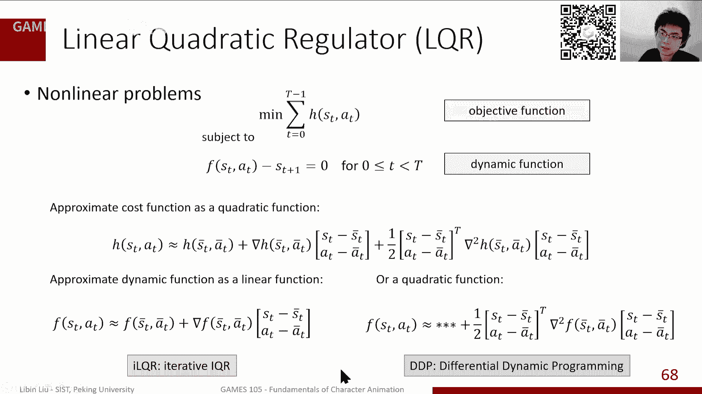
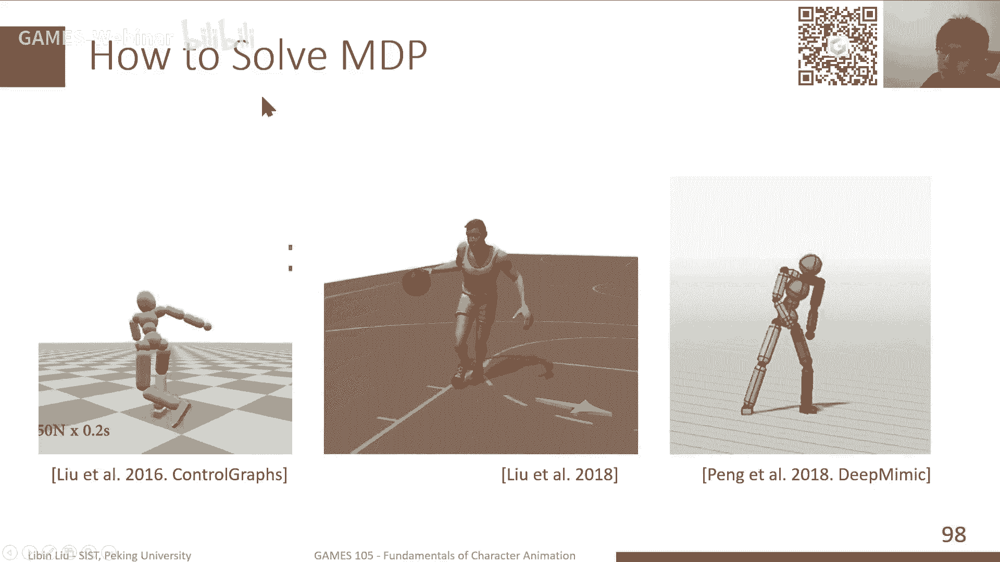
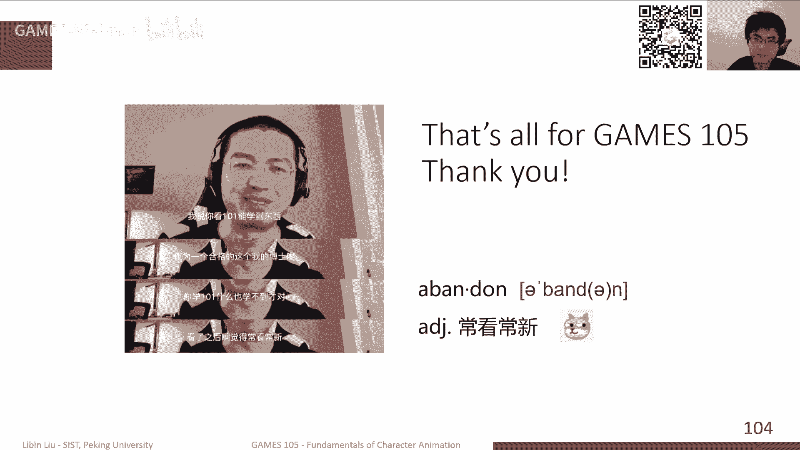

# GAMES105-计算机角色动画基础 - P13：Lecture12 Optimal Control and Reinforcement Learning - GAMES-Webinar - BV1GG4y1p7fF

好的啊，那我们就开始上课了，也是非常感谢大家来参加我们这个games，105的最后一节课，是我们今天是首先从跟强化学习非常相关的啊，这么一个啊控制领域的一个一类技术，一类理论叫做最优化控制，从这出发。

然后来进一步来讲解一下我们这个强化学习啊，和这个一些传统的一些方法的，这样的一个一个啊一个区别，那就让我办公室的，实际上我们今天最首先是先讲一讲，关于这个自化控制的一些基本知识，因为最优化控制啊。

其实也是在我们这个决斗动画啊，就特别是基于物理的决动画发展过程中，其实也是有相当的一些比较好的工作，是基于这类方法的，那我们其实后面也会介绍一些关于这个啊，还有就是通过优化的方法啊。

来得到一个比较简单的这样一个控制策略的，这样的一类一类工作，然后最后呢，我们其实回顾一下，这个强化学习的一些基本知识啊，当然我们可能无法去准啊精准确的去啊，去比较细节的描述。

想要就去的一些算法的一些细节啊，当然我们只是大概的给大家提啊，提一些这种啊概念啊，或者方法呀，一些关键字啊，如果大家有兴趣的话呢，可以在后面的这个，在这个我们的这个课后的其他时间呢。

可以自己去去去了解一下，ok那我们其实回顾一下，其实我们前两节前面几节课不停的在讲控制啊，从开环的控制讲到闭环的控制，讲到我们用简化模型来实现一些对这种比较啊，基础的这种运动，比如说这种原地走啊。

走路啊，这其实是一个非常经典的，也是非常基础的这种这种运动形式，来对他们实现一个控制，那其实我们这里回顾一下啊，其实我们前面讲这个我们实现一个，我们如何去实现一个控制。

我们只能是通过在这个角色身体上施加力啊，实力和力矩其实主要是关节力矩，然后来实现这个对这个角色的这个驱动，那当然这个过程中我们如何来去计算这个例句，一方面一种方法是说，我们其实比如说我就想做一个动作啊。

比如我一个轨迹，我有一个这个一个后空翻啊，我想做一个后空翻，那么我希望去自动去找到一系列的这种控制的，这种策略，一般来说可能是一个pd的target，然后呢我去执行这个pk target。

他可以去让我的仿真的这个轨迹啊，跟我的这个运动轨迹是相同的，那我们其实前面讲到了，为了能够找到这一系列的轨迹，我们其实是可以把这个控制，把它给啊建模成一个优化问题，那这个优化问题实际上我就是在每一帧啊。

每每仿真一步，我都可以计算一下，当前这一步和我的这个参考运动数据的偏差，那这个偏差啊按照这个仿真步长，按照这个轨迹的长度把它加起来，那就构成了一个优化问题，优化的对象是什么呢。

优化的对象呢其实就是我每一步的这个啊，所金世佳这个力，那当然这里其实有一个非常重要的一个问题，就是优化的时候，我们需要去满足我们当前的物理规律，那对于我们来说，其实在仿真里面它并不是真的物理规律啊。

它其实是物理规律的一个简化，但它本质上还是一个物理规律，那其实我们那这个固定规律本本身呢，我们可以把它写简啊，简单的写成抽象的，写成这么一个一个函数的形式，那当我们前面这几节课其实也介绍过。

其实如果是一个刚体的仿真的话，那我们其实可以通过一系列的这种带约束的啊，这样一个方程来进行进行进行描述，那另外一方面呢我们前面也提到了关于feedback，就是前面如果说我们只是优化轨迹的话。

那他其实拿到的是一个开环控制啊，或者是叫这个前馈控制，其实开环控制跟前后控制，还是从细节上来还是有一点点区别的，就是开环控制之说，我完全不在乎我的这个输入的变化，我就只是单纯的在执行我的控制。

但前馈控制呢其实稍稍有一点点的改变，就是说比如说我这个加了一个扰动，我这个状态加了一个扰动，那这个扰动肯定会带来我这个角色这个状态啊，发生这个一定变化，如果说我们直接去执行这个，前这个开放控制的话。

那他其实也会直接去，由于你原来的这个执行的目标，其实已经变化掉了，那前馈控制呢其实稍微多一点点啊，前馈控制其实理论来说是，它是会根据我的production啊，根据我的这个扰动来改变一点点。

我的那个开关控制的那个控制器，但是实际上呢因为它是基于这个prevation的，就是他其实并没有去根据我的状态的改变，而改变，所以说其实本质它所带来的变化，我们的这个这个角色本身的变化。

当然我们前面其实是把这两个，把这两种就是开环控制和乾坤控制，把它混在一起去去描述，但实际上他们相当于，他们是不根据状态本身来进行改变的，但他其实还是根据一些预定义的一些一些策略。

去进行进行这个进行这个控制信号的修改，那我们前面这个为了能够去尽可能的去解决这，个啊扰动带来的问题，那我们其实还是需要引入所谓的反馈策略，那这个反馈策略呢，他就根据我们当前角色受到扰动之后的。

这样一个状态，他去去更新啊，实时的去更新我的这个控制的策略的变化啊，控制信号的变化，从而保证我在整个运行过程中，不管我是怎么去对这个角色啊，对我们控制的对象进行干扰。

那他这个控制对象总是能够保持这样一个动作，那当然这个开关控制啊，就是闭塞，这个反馈控制，其实也是可以描述成这样的一个优化问题，那唯一的跟前面那个轨迹优化，其实是呃形式是非常像的。

那唯一的区别呢就是说轨迹优化里边，我优化的是每一个时刻啊，所对应的这个这样一个啊控制信号，但是对于这样反馈控制来说呢，实际上优化呢是这样的一个控制策略啊，控制策略本身，那这个控制策略。

它其实是一项可以认为是一个函数，那这个函数根据我当前角色的状态，来计算一个这个控制信号，所以实际上这两种方式啊，不管是轨迹优化还是我们的这种闭环控制，这种优化啊，其实他们统计来说。

我们都是属于这种最优化控制的，几个不同的这种类型啊，其中一种类型就是前面所说的这种轨迹优化啊，或者我们叫开环控制，它的一个更加准确的定义，就是说当我们给出一个起始状态，然后呢我给出一个目标状态。

那我需要去根据这个起始状态，就直接计算出一个轨迹啊，一个控制信号的轨迹，那沿着这个控制信号轨迹进行执行的话，那我就可以从一个点起始点到目标点，那当然这个好处是什么呢，就是说我只需要计算控制信号。

相对来说这个问题是比较简单的，那坏处呢就是肯定是，如果说这轨迹中间受到任何扰动，那很大概率的话他就无法继续执行，他会离开离开这个目标点越来越远，那另外的反馈控制呢实际上是计算了是一系列。

有点像计算了一个厂啊，就是我在对空间里每一个状态，空间里，每一个状态我都会有一个相应的控制信号，那这个控制效，总体上会把我不管从哪个状态开始，它会逐渐的把我推到我的目标状态身上，那当然想象一下。

这个问题，肯定是比前面这种开关控制要难一点的，因为理论因为你需要考虑空间里边所有的状态，这种状这个这样一个情况，所以这是其实是两种不同的这样一个问题，那当然就是左边问题其实是主要是这种啊。

这个这种轨迹化，那六边呢其实我们讲的，其实我们讲这个最优控制，其实大部分情况是处理的右边这种情况，而右边这种情况，它的理论基础呢其实是来自于这个dynamic program。

就是这个这个动态规划的这样算法，那当然大家可能学过编程或者刷过题的同学，大概是对这个这个词是非常不陌生的啊，这个动态规划啊应该是一类算法题，还是挺常用的一个算法题，那大家回答我们前面这个问题。

就说我们其实主要是为了去求解，这样一个优化问题啊，我们可以先看一下这个简单版的就是鬼泣优化，那这个问题该怎么去求解，我们前面其实铁蛋非常简单啊，我们这今天会稍微再多讲一讲，就这个问题这个该去怎么去。

怎么去怎么去这个啊分析这样一个问题，那当然这里其实我们要不得不先提到一件事情，因为这是一个有约束的优化问题，就说我是要优化这样一个函数，同时呢我有一个约束，那当然这里我们为了简单起见。

我们只考虑这样的一个等式约束的一个情况，那在有约束的一个优化问题，其实是一个一大类啊，我们这个非常常就是常见的优化问题中的一类，比如普通的优化问题，如果说没有约束，没有约束。

我们想想我们i k其实ik的问题的话题很多，也是有约束的，只不过我们在讲ik的时候，没有提约束这件事情而已，如果没有i没有约束的话，那么其实一个优化问题，我们可以通过一些比如说梯度下降的方法。

去找他的解啊，虽然说只能找到一个局部最优解，也就是说我计算出f啊这样一个优化目标，它的梯度梯度代表了这个函数值啊，下升至那个增长最快的方法啊，方向那就是你沿着那个相反的方向去移动。

那你其实就会越来越小了，所以说这是一个梯度下降的方法，但如果说我们有个约束，这个约束会带来什么，带来什么不同呢，就是说比如说我们这个函数本身啊，我们简单画一个函数。

比如说这个fx就是一个二维平面上定义的一个，比如说这个圆周啊，就是fx啊，sfx y我们可以写，比如说x平方加y平方，那它其实它的值就是这个与这个每一，每一点的值啊，就是这个点到原点的距离。

所以这个函数的这个曲线画出来，大概是这个样子，一圈啊，大概就这种一圈一圈一圈一圈上来的，这种这种函数，那另外一个函数，那这个g啊它是一个约束，那约束其实在r平面上会呈现出什么呢。

一般来说我们比如说它比如说它是一个啊，就是一个一个一个算一个方程，那它其实应该是二，对应二维形平面上的一个曲线啊，构成这样一个曲线，那在这个过程中呢，其实我们目标是站在这个曲线上啊，这个约束的意思代表。

我们这个解必须在这个曲线上，所以实际上我是要找这个曲线上的点，使得fx最小啊，这是我们这个带优化的约束目标，当然这个问题我们现在提到了，其实有约束的问题不好解，那我们其实可以把它转成一个硬约束啊。

转化成一个软约束，那软约束意思就是什么呢，就是说我其实可以把g啊加上一个系数，然后加到我们的这个优化目标里面去，那这个时候如果说我从这个优化到最优的时候，那其实一方面fx本身要很小。

另一方面gx也要很小，但是因为js等于零嘛，所以说也说他他虽然可能不在这个线上，但是也离这根线不是很远，那当然确实一方面他还是那个问题，变得好解一点，因为没有约束了，另一方面呢就是说解的啊。

他这个问题的解跟原来那个问题解释不一样的，它可能会他的最优解有可能是不满足，不在这条线上啊，刚才我们说他其实有可能是在这线附近，那我们其实还是希望，如果说我们不用这种soft concern方法。

我们还是希望能够去直接去保证，我这个解是有的，只是在这个曲线上的，我们该怎么办呢，那其实这个过程中我们其实也是可以看一下啊，就说分析一下，因为这个比如像这个特例，这个f x它总是越往里越近。

圆点这个值越小，然后呢，我这个点我所能够满足约束的点，一直是在这条直线上啊，在这条曲线上，所以说我们可以知道这个曲线，如果它越沿着曲线越接近我这个圆圆心，那肯定它的这个f的值，就这目标函数的值就会越小。

那我们其实可以计算一下，就是说实际上目标函数的值，如果说我对目标函数做做一下梯度，那其实每个点空间里，每个点这个目标函数的梯度方向，其实都是指向啊，或者梯度的反方向，都是指向它那个值下降最快的方向。

然后呢，他这个如果说是沿着这个嗯约束上进行移动，我们发现如果说因为我移动的时候的速度，始终是沿着这个约束的这个曲线的切线方向，也就是说如果说这个切线方向呢，跟我这个当前这个点。

就是f的这个gradient的方向是夹角，是小于90度的，那就说明我接下来这个移动的方向，是跟我这个f下降的方向是相同的，所以它会这样的话呢，我你随着我的移动，那f的值会逐渐变小，一直移动到什么时候呢。

一直移动到这个切线的方向，跟我这个f的梯度方向是垂直的时候，那这个时候呢我这个只要我不管怎么移动啊，它都不会改变f的值，如果说我继续移动的话，那可能这个这个切线方向跟f方向相反了，那我就越移动。

这个f2 要变大，那其实就也就是说，其实我的极值点是出现在什么情况呢，是出现在这个切线啊，跟这个f是垂直的这样一个情况，那时间切线垂直，但这对于二维进二维的情况来说，它是一个切线，那对于三维的情况。

那可能就是一个切面了，那这种情况其实等价于说什么等价，于是说我这个g作为一个函数，它的梯度的方向，其实他梯度方向肯定是，我跟我切线方向是垂直的，他跟这个垂直，它跟那个也是垂直，所以时间等价于说什么等价。

就说如果说x是这个整个这样一个，优化问题的啊，带约束优化问题的一个极值点，那它肯定能够保证什么呢，这个f也就是我们的优化目标，在这个点的导数方向跟我们的这个约束啊，约束函数在这个点的导数方向啊。

他俩应该是平行的，其实是说就是因为是这个方向的切线方向，跟他跟那个f的导数垂直，而切线方向又跟这个g本身的导数是垂直，那实际上最后导你可以推导出这两个东西，他俩是平行的，当平行呢意味着他俩是共线的啊。

平行就是共线的，那其实也意味着什么呢，意味着fx和gx啊，他俩有这样的一个关系啊，就是我们可总是可以找到一个一个一个标量啊，一个数这个数呢乘上gx的导数，这是这个js导数的方向啊，把它成了一个系数。

那它可以得到f x的方向，这是我们共线的一个基本定义，所以这个其实就带来了什么呢，就是从这样的一个关系呢，我们可以得到一个这个，所谓的拉格朗日乘子法啊，当然这个条件本身是一个必要条件，不是充分条件。

也就是说只有说x是最优点的时候，它能满足这样的条件，但是反过来满足这样条件时候，f不一定是最优点，它有可能是一个局部最优，或者是一个暗点啊等等，这个这个问题会比较复杂，但是不管怎么样。

从这个地方我们可以得到一个，就是拉格朗日乘子法，其实大概是可以解释成这样的一个方式，就是说比如说我我的优化了，这个得到极值点的一个条件，就是说我的两个函数啊，f和g它的导数是这样一个这样一个。

贡献的一个状态，那我们其实可以定义一个拉格朗日函数，那这个拉格朗日函数呢，是首先是包括了我的这个目标函数，还是然后呢加上一个lambda啊，作为一个拉格朗日橙子，他其实对应的差不多就是这个狼的。

就是说大概是我贡献之后呢，他们俩的这个这个标量差变量系数，然后呢lambda乘以g啊，加在一起构成一个拉格朗日函数，当然有这样的定义之后呢，其实我们可以直接把这样的一个优化的，这样的一个条件啊。

把它转化成导数啊，就是实践，我发现如果对这样的一个，如果说我们拉拉还是直接是这样定义的，那么对拉杆式函数l去进行求导，对x求导，那其实可以得到这样一个公式，它其实就是前面我们的这个这个平行的。

这样的一个条件，那同样的同时如果说我们对lada进行求导的话，它会得到g啊，就是这个原来的这个原来的这个这个这个啊，约束约束函数，然后如也就说让在这种情况下，让这个拉格朗日函数取得极值的x和ld。

就刚好能够，特别是那个x，就是使得原来这个优化问题，取得极值的那个x啊，这其实是因为本身，因为本质上是来自于这个优化的这个条件，我们其实把它对应到拉格朗日函数，拉格朗日乘子法这样的一个条件。

也就是我们前面说的第一行啊，这是一个平行于g的这样的一个啊最有条件啊，另外一个就是说我们这个第二行，其实对la进行求导，其实得到的是gx，就是我们原来的这个这个约束约束函数，那这个其实就是啊。

我们在求解一个等式约束的优化问题的时候，常用的一类方法啊，拉格朗日乘子法，那当然如果说其实我们前面提到了，因为比如说我们在建模这个运动方程的时候，这个摩擦啊不是那个那个支持力和摩擦力。

这两个通常来讲不是一个等式约束，而是一个不等式约束，那这种情况下，其实拉格朗日乘子法就会变成了kkd条件了，那个其实会更加复杂一点，我们这里就不再多介绍，那其实回到我们前面这个轨迹啊，轨迹优化问题。

这是我们的优化目标啊，这优化目标函数，它是一个沿沿着时间进行积累的啊，其实理论来说，如果说我们是一个连续时间的问题的话，那这里其实应该是一个积分，当然我们这里其实这个因为我们前面提到，在仿真里边。

我们通常会把它离散化，所以这里其实是一个就是一个求和号啊，但是本质上这俩是嗯嗯是非常有相关性的，然后呢，我们其实有有，我们前面提到的这样的一个运动方程啊，作为它的约束，那这两个就是一个优带。

有约束的一个优化问题啊，那我们其实可以很容易地写出它的，拉格朗日方程啊，其实就是上面这一行加上lambda的转置，乘以下面这行啊，这就是拉格朗日方程，看着比较复杂，但其实跟前面这个是一样的。

一样的一个一个一个结构，当然在这种情况下呢，其实我们前面提到了就是拉格朗日方程，它的极值点，也就是分别对x和拉姆达分区去求导，然后让这个求导数等于零得到的那个解啊，其实就是原函数那个解。

所以说我们写出拉格朗日方程之后呢，我们可以计算出他对于这里每一项啊，这是哪一项呢，比如说因为我这个轨迹我优化的目标是轨迹，以及我的这个action啊，以及我的这个这个控制信号的这样的轨迹。

所以说实际上我要求导数的时候，我需要对里面每一个变量啊，包括了所有的轨迹里，每个状态以及轨迹里，每个这个action就是我们的这个控制信号，然后以及对lambda进行求导，那这个求导过程稍微看起来有点。

但实际上因为这个求和号，你会发现它其实只跟当前时刻，t时刻和t加和t加一时刻相关，那其实它只会有两项啊，就是主要就是当前当前时刻的这一项，和他上一个时刻那一项，所以说其实求导过程也是相对来说比较简单的。

它会大概得得到这些性质啊，首先对x t求导，后面这项求和是没有的，因为它是s t是最后一个啊，当然对蓝t是有，然后对对前面的这个每一，中间的每一时刻进行求导，它会多出一点，多出一项。

然后对a求导有这样的公式，然后对拉姆达求导，其实就是原来的运动学方程啊，这个其实是可以表明验证的，那这样的情况下呢，实际上我们可以把下面这些求导得到的功，得到的积分啊。

这个因为本质因为我们需要求最优解嘛，我们肯定是需要让他这个拉格朗日方程，对每一部分的导数等于零，那我们其实可以把右边这个做一下，稍微整理哈，把可以相当于把我们需要求的这些变量，给求出来。

那我会得到一些什么禁止呢，首先最下面这一行啊，他就是我们其实把这个s t r e，挪挪到左边去啊，挪挪到右边去，然后换个位置，那其实得到了这样的一个公式，那其实这个就是我们的运动学方程啊。

他根据当前的时刻的状态加上控制信号，计算下一时刻的状态，那上面这一项呢其实可以也可以直接写出来，我们可以得到lambda的最后一项啊，就就这个轨迹结束的时候，它的值啊应该是h，这是什么。

这是我们那个优化目标函数的每一时刻，里边的一个子项等于它的导数，对x的导数，我这里其实简写了一下，就是把这个d h d s写成hp s，这个其实是一个简写，然后呢这个对应的lambda t。

当我们算出最后一帧的t的时候，实际上我们可以用最后一帧从后往前去迭代，去计算前一帧的拉姆达提，因为你看这里，拉姆达t其实是一个递归递推公式啊，就是首先这个h这部分，我们其实求导可以算出来。

然后拉姆达t减1t加一啊，y s首先lt lt的最后一项就是lg的大t啊，它是一致的，所以说luna大t减一的话，可以用这个递推公式算出来，然后呢再往前推进，机器就可以不断的调用这个dj公式。

进行进行求进行求解，所以然后这两个landa啊，其实通常我们也会把它有另外一个名字，叫做cost state啊，就是他其实表现上有点像一个state，就是比如说正常来讲，我们这个状态在控制信号过程中。

不断向前去改变啊，就是一个正常的仿真过程，那这个ladder其实是有点像反逆向的过程，我其实在做一个逆向的仿真，然后最后一个公式，这个公式是稍微复杂一点，就是你可以看到，其实为了能够找到l的极值点啊。

他对a求导之后是这样的一个公式，那这个公式里边其实你可以看到前面这一项，我对a的求了一个偏导，后面这一项呢我也对a求了一个编导，如果说我认为我认为这个h，h是这个a的函数啊，后面这个f也是a。

它就是在我确定在s t是确定的情况下，那我们其实这可以看作是a的函数，然后f可以也可以看作是a的函数，那所以这一项呢其实有点像什么呢，有点像是说如果把这个我把h加上f啊，整体看作一个a的一个函数。

那这个函数我认为它是一个优化函数，我就求它的极小值，那为了求它的极小值呢，我肯定是需要计算它的导数，那它的导数其实刚好是等于这边的右边的部分，所以实际上是什么意思呢，就是说实际上这一行所代表的这个。

为了能求从这一行里求解出a来，我们本质上来说是可以认为，我们是在做一个优化问题啊，其实求解的是这样的一个优化问题，优化对象呢就是h的导数和f的导数，我们把它认为是a的函数，就是我认为xx是不变的啊。

它是一个a的函数，那当整个这个过程呢我们可以把它整理一下，就是右边这四个条件啊，右边这四个条件，但是我们通常来讲会把它稍微转化，变化一下顺序，那第一项啊，是我们这个运动这个状态的运动方程啊。

系统了这个动力学方程，然后中间这一项呢其实是我们的cost state啊，就是这个lambda的运动学方程，然后最后一项呢是我们去计算啊，去根据landa去计算a啊，就是我们最终优化的目标的这样的。

一个一个一个一个求解问题，那当然这一切这几个这些项目合在一起啊，其实是一个叫做庞特里亚金最大化原理的，这么一个或者叫pmp啊这么一个公式啊，就是其实是应该是说在最优化问题，最优控制理论理理论里边。

我们在解决这个开环控制的时候啊，开环控制的那个控制是最优的，这样一个必要条件啊，其实就是个p m p的这样一个条件，那他是这个彭德里亚金啊，一个俄俄国的科科学家，数学家啊，提出的这么一个这么一套理论。

那当然这个很老了，所以这个最早是为了大家，是为了研究这个火箭的这个控制，然后来发出了啊，这开发了这么一套理论，那当然其实相对来说呢，也是对于一些比较简单的系统来说，还是比较方便的一个分析的一个工具。

那当然对于这个p m p啊，其实就是一个非常就是所谓的shooting method，就是可以去求解p m p啊，就是用利用p m p来实现，对轨迹的这样一个优化。

那其实这个过程就是一个前向过程和两个反啊，和一个后向过程加上一个更新的过程，就像我们前面说的，首先为了能够去计算，因为目标来说，我们是不断的去优化我们的a，最终是我的轨迹能够满足从这出发到这结束。

那所以说我可以去有，但我一开始不知道我怎么用啊，我应该取什么值的时候，那我可以有一个某种某种方式的一个估计啊，猜测我就先猜测出我要执行一系列的a，那当然执行了之后，他肯定离我的目标比较远了。

然后目标但是这个但目标我可以先执行一遍，这样的a那执行过程中呢，我可以记录每一次执行a得到的那个状态，就a啊，从s0 这个发直线a0 得到s一啊，类似的得到s2 ，s3 ，我可以记录下来，那这样的话。

其实这个执行的过程，实际就是调用这个前下方程函数啊，进行不断的这个计算，那接下来有一个后向的过程，那其实就是用我记录下来的，这样的s和a来调用，我们这个cos state的这样一个方程啊。

从最后一帧先计算兰姆达t，然后依次往前去调用，然后回到s0 啊，其实就得到了对应每一个状态下的兰达，那其实是一个后降过程，其实这个有点像那个像那个链式法则啊，就是我们求解这样一个这个啊。

神经网络的时候啊，所需要这样一个都用了这么一个东西，那最后呢我们得到了所有lava t和s t之后呢，我们其实就可以去用这样的去去求解，这样的优化问题，那当然实际这个优化问题。

我们通常来讲不用去找到它的最优解，我们只需要计算一下它的这个梯度，然后用这个梯度更新一下t就完成了一步迭代，那实际上我们这时也不断的迭代，才能找到最优解，这是一个非常简单的一个，一个这个轨迹优化的方法。

那当然我们前面提到了，就是对于这个优化拍这个最优控制里边啊，当我们去需要去求解这样一个，最开环控制的时候，那我们其实可以就是它达到最优点啊，其实对应的就是这个庞特里亚金的最大化，最大公式啊，最大化原理。

然后呢前面我们提到这个shooting method的啊，他其实是这个p m p就这个帕拉利亚啊，maximum principle的一个直接应用，当然缺点是什么呢，就是实际上这个分析啊。

其实它首先要求呢就是它本质上来说，这个跟我们前面提到的这种优化的这个啊，对于复杂问题的这个优化，目标函数的这个这个性质也有关，那就是我们前面，如果我们前面在讲到这个这个轨迹优化的时候。

我们当时有几个图片啊，就是给大家看了一下，特别是比如说对于一个人走路或者跑步，这样的一个优化，他的这个目标函数是非常非常差的，就是它会有很大量的这种局部极值点啊，它会让我们这个优化变得非常难，非常难做。

而这个shooting method其实也是有这样的问题，就是说对于这种复杂的函数，它通来说表现是比较差的啊，所以通常来讲，它也是需要去根据一些其他的方法。

比如说像这种collocation method啊，像这种multiple shooting啊，这些技术来进行回合合在一起来进行使用，或者呢其实我们可以把它作为一个分析的方式。

但实际上真正我们做优化的时候呢，其实还是很多时候我们是需要用这种啊这种啊，比如梯度dirty free的这种方法来进行优化，ok那前面这里其实是一个开环控制的，一个一个一个理论上的一个一个分析。

那对于闭环控制，我们闭环控制我们前面提到，其实我们目标是什么，我目标是对于任何找到这么一个策略啊，派它能够对任意一个state啊，可能也许可以加上一个t作为这个输入，能够去计算一个合适os。

一个合适的这个action，一个控制信号，它能够让我最终达到我的目标，那这是我其实这样一个一个闭环控制的，这样一个优化问题，那当然在这个过程中，就我们可以从一些非常简单的一个例子来进行。

进行进行考虑这件事情，这个其实是一个非常经典的这个算法题啊，就是所谓的这个最近最短路问题啊，就是我从一个我有这么一个图，这个图上可能两个节点之间有些方向，有个方向的路径，这个路径呢有各自的代价。

比如可能是距离这样的一个函数，然后呢我们总是希望能够从一个点出发，我们希望能够找到一个最短的路径，到达另外一个点，这是一个非常经典的一个最短路径的，最短路径的问题，当然这个问题其实有很多种不同的解法。

就是一类方法，就是所谓这个动态规划的方法，那当然这个问题本身呢，我们其实他从数学描述来说，其实我就是希望能够找到这样一个路径，它就是一系列状态的这样一个轨迹，那这个轨迹上我可以把路径任何两个轨迹之间。

这个这个编啊，它的这个代价定义为一个一个优化目标函数，然后我们最终的优化目标，其实就是找到一系列这个这样一个轨迹啊，它能够使我的这个总的边的长度啊，边上的这个这个代价最小，那其实另外一个角度。

我们其实也可以认为，这个比如说从这个点这样一个状态，这个状态出发，它可以选择沿着三个不同的方向去移动，因为它有三个出点，那我们可以认为这三个不同的方向呢，对应的是三个不同的控制信号。

那所以实际上我们前面那个优化问题呢，我们也可以认为是什么呢，就是说我需要去找一系列的这个控制信号啊，它能够使得我靠前面那个最优化问题，使得最他妈这个最小化，那同时当然这个控制信号呢。

它会带来一个我们的这个运动方程的，比如说这个运动方程，就是说根据当前的这个状态，加上我的控制信号，我可以得到下一时刻的状态，就是因为我比如说在这个状态下，我选择了a2 。

那我自然我下意识就是就是s t r e啊，这样一个空这样一个位置，那再进一步呢，我们前面讲的反馈控制，实际上我们目标是找到这么一个控，一组控制策略，这个控制策略是说，我不管我从哪一个state的出发啊。

我们当然可以简化一下，我们可以认为这里t是不在里边的，就是我只考虑值，它跟s直接相关，而不考虑我时间这样的一个关系，他这个空中目标，就是说我可以从这个图里面的任何一个状态啊，任何一个位置，任何一个词呃。

这个节点我可以自动地计算出，我该去执行哪一个边，可以使得我沿着这个一支烟，一直不停的执行这个控制信号，它能够得达到目标，同时我的这个总的这个值是基本的小，那这其实是我们的这样一个最短路问题。

下面的这样一个控制策略问题，那在这里边其实会有一个非常重要的一个，这个这个必要条件啊，就说什么情况下我这个策略才是最优策略，那这个其实就是这个bman啊。

principle of optimioptimality，就是这个啊贝尔曼的这样的一个自由控制，一个一个就针对于控制策略，而不是前面提到的这个控制的轨迹啊，绝对控制策略的这样的一个最优的条件。

那这个条件是怎么说的呢，就是如果说这个派他是我，他是一个策略，如果说他是在这样一个问题上的一个最优策略，它会有一个性质，这个性质是什么呢，就是说我不管我从这个图里边哪一个状态开始，我不管在这个状态下。

我执行了哪一个action啊，一个运动难以控制，他都他会他肯定会到一个新的状态，然后在这个新的状态下，我可以不断地执行这个派，那他最终可以达到达到我的目标，然后同时呢通过执行这个派得到的这个轨迹。

刚好是从这个把这个状态作为初始状态，能够找到的最短路的这个最短啊，就是能够找到那个最短路啊，这是这个这样一个有用，这样一个啊优化的一个一个条件啊，就是这个取得最是这个派是取得最优化的，这样一个条件。

那当然时间这个也跟问题相关，就是有些问题可能是有没有这样的条件，有这样的，有这样就能够满足这样条件的问题呢，我们可以认为我们可以有一种描述，就是说这个问题是有这种optimal。

substructure啊，这个其实也是那个dynamic program，就是我们这动态规划能够成立的那些问题，所具有的性质啊，其实这两个差不多是同样的东西。

就是说什么叫optive subject structure呢，其实就是说我从任何一点出发，我就是如果说这个点啊，他在我的某一个的这个最优的轨迹上，那他肯定是从这出发到达最终点。

得到那个轨迹肯定也是最优的，那当然从这个bman这个自由化定理啊，自由化原则，我们其实可以得到一个可以定义一个函数啊，那这个函数叫什么，这个函数叫value function啊。

或者叫value state，它是可以在每一个状态下去计算一个值，那这个值代表什么呢，这个值代表的是从这个点出发，从这个节点出发，到我的目标所经历的所有轨迹里边，最短的或者最优的那条轨迹啊，它所的代价。

它所那个得到的那个代价的值，或者另外一个角度讲说，如果说这个派是一个最优的策略，那么这个v就代表什么，代表是从这个节点出发，他不断的执行派得到了一条轨迹，那这条轨迹上所有的这边的这个代价的和。

那其实就是这个点的这个v value的值，那这是value function，不好意思，那是什么，value function，很重要的就value function会告诉我什么呢。

比如说我想计算从s0 出发，我需要在这个时刻去计算我该选哪一个action，如果说我们已经有了value function了，比如说而且我们知道比如说在这个节点上，这个状态的one 6是30。

就是说明从这个节点后面，可能不知道有什么轨迹，它会到达目标，然后整体的这个最优的，最小的这样一个代价是30，然后呢这个节点是25，那这个节点是22，然后从s0 出发呢。

分别到这三个节点的代价是51和12，那我们可以直接得到一个什么结论呢，就可以直接得到，我们只要计算一下这边的代价，加上这个点的value function，那他得到的值就是说我从这出发沿这条轨迹走。

我能达到最小的一个值，所以实际上呢我们可以直接得到，从这个结论来说，我们可以给他从s0 出发，想要得到目标，最快的达到目标啊，或者说我是16的优化函数最小，那么就肯定是我可以直接去得到。

我只要执行这一条啊，沿着这条轨迹走，或者执行这个action就可以得到了，比如说再进一步的时候，就说如果说有质量value function，那么我们在这个时刻选择action。

就只需要计算一下每一个action加上下一节课的value，function的值，然后这个值最小的时候对应的那个action，就是就是我想要选择选择的action，那这样通过这样方式去解。

去选择action的这样的一个策略，那对应的就是我的最优策略，ok那其实回到刚才那个问题啊，就是还是回到这个盾最短的问题，但是我们其实只用它来做一个例子，我们的目标啊。

其实是就是在这样一个最短路问题里边，其实我同样的可以定义一个value function，那这个value function实际上是会对每一个节点有一个值，每个值，那这个值呢就分别是从这个节点出发。

到目标节点所需要经历的最短路啊，的这个长度就是这个这个value function，那实际上这个方式呢，我们可以稍微把它变形一下，因为其实是这是我需要对后面每一个系列啊。

就是得到一系列的这个action的去求最小值，那我们其实可以把这一系列action把它拆开，我们可以写成，比如说这个对于第一个action求最小值，然后里边是对剩下的action啊求最小值。

就注意下标从一开始和下标从零开始，我可以写成这样的一个形式，我可以证明它其实是两个等价的，那接下来呢我们其实可以看到，就是原来这个vs的定义啊，是这样子写的，然后后面这个如果说我这样把它展开一些。

他们发现后面这一半的这个定义，跟这个原来这个定义其实是很相似的，所以时间确实他俩是相是等价的呃，所以是同一个东西，只不过就是说后面这个action，我们可以把它写成一个value function。

在s一就是新的这个位置进行计算啊，得到了这个完了完了function的值，所以实际上我们这个value function本身就是相邻两针的，value function，它其实是有这样的一个关系。

那这个关系呢就叫做这个bincreation，就是说如果说我有一个最优的策略啊，最优的策略在这个最优策略下，我得到了每一个点，它的value function，然后这个value function。

它其实肯定是一定是满足一个这种迭代的公式，那这个迭代公式就是说我从一个状态，任何一个状态出发，他这个任何一个状态的value function，等于我沿着某一个action进行执行一步啊。

首先这action本身带来一个带了一个object，带了一个loss，带了一个cost，带来一个代价，然后呢沿着这个action移动到下一个状态，就是通过这个运动方程达到下一个状态。

那个状态呢同样有一个value，然后这两个y的和在不同的a之下，会有不同的值啊，因为我达到了不同的状态，然后所有a的最小值啊，其实是等于等于我当前这个状态的value function。

这就是bellman equation，那当by man equation有什么，就是它其实代表了什么，代表了说我这个value function达到最优的时候，如果它是一个最优的。

一个一个一个一个一个value function，一个值价值函数，那么其实它会满足这样的要求，那同时呢我们其实也可以得到，如果说我们已经得到了这样一个，最优的价值函数，我们的这个最优的策略啊。

不管它是什么，它是什么形式，我们总是可以写成这样的一个优化问题啊，就是根据就是前面我们说的，就是我们总是会选择一个action，它使得我后面这个大家函数，加上当前直接的代价啊，这样一个求和是最小的啊。

这是我的一个控制策略，但另外一个方面，我们其实也可以把它稍微转化一些形式啊，我们可以把后面这一这一这一片，这两个东西求和，把它记成q，一个叫一个q函数啊，用这样q来表示，它。

其实本质上就是我取在装当前状态下取一个action，得到的，这个当前就不管当前这个action的这个代价，以及我转移到新的状态下之后，那个状态下的value function。

那就是所谓的q function，那这个就是就是其实我们后面讲很多时候，比如讲q learning，就是或者reinforcement里面，其实我们经常会用到这个这个q learning啊。

这个q函数或者它另外一个名字叫state action value function，那其实都是一个东西，然后呢当我们知道q function之后呢，其实我们的派我们的pos控制策略。

其实也是可以写成这个这样的一个，优化的一个问题，所以说这个整个这个里边我们发现value function啊，或者是q function其实是很重要的一个一个点啊，一个一个一个这个啊一个这样一个概念。

就是我们很多这种优化，那最优化控制啊，或者是强化学习的这个好，这个算法其实最主要的目的就是学习这个啊，q v啊，就是value function和q function，因为我们知道他们之后呢。

那其实我们计算这个policy，就是相对来说比较容易的，那另外一方面呢，这个问题这个其实是一个优化问题啊，就是当我们得到v的这样一个函数表示之后呢，我们其实可以求这样的一个，整个这个函数的最小值。

但是呢这个最小值如果说a是离散的，就说如果说只有有限个a，那这个这个求解求解这个问题其实很好解的，我只需要去做一个什么，做一个所有状态下做一个线性搜索，那我们就可以得到这样一个v的值。

但是如果说这个a是一个连续的啊，就是这是我们的状态空间啊，我们的控制是一个连续的，就比如说非常典型的例子，离散的情况是什么呢，比如说我下围棋，但是围棋其中的风险非常大，我们可以稍微显简单一点的例子。

比如说这种，比如说下一个下一个猜拳吧，猜拳可能是双人博弈，哎呀这个例子就像他不太想，就比如说是一个非常简单，有少数控制策略，就比如说啊比如说玩游戏，玩游戏，大家手柄上是有有限个按键的。

或者你的键盘上是有限个按键的，那这种情况下你是可以比较容易的，只要我只要计算出value function，我就可以通过这种方式去得到我的action，但如果说我是一个连续控制啊。

就比如说就比如说我们在做这种啊，人体运动控制诶，怎么好像今天网络不太好，比如说我们在做人体人体运动控制，那其实人体运动控制会会比如我们运动的时候，我们加的力啊，他肯定是个连续变化的力。

而不是一个固定的力，那这个其实会带来一个问题，就是什么呢，对于a是一个连续的情况下，那这个优化目标可能是不好解，诶今天好像又是老是断线啊，行那就我们就我就尽量讲吧，那在这种情况下呢。

其实这个优化问题不好解，所以说我们通常来讲也是需要用其他的方法啊，去去去去定义这样的一个policy，ok那回顾一下，其实我们前面讲这两个，主要是讲了一个我们的这个最优控制的两类啊，比较比较基础的。

就是比较就是两类这个自由控制的问题啊，一种是我们的open开环控制，一种是这个反馈控制啊，对于开环控制来说，它它所对应的就是我的pmp啊，所以作为我的最优最优化的这样一个条件，而对于反馈控制来说。

这个bman equation啊其实是非常重要的，我们在求反馈控制的这样的一个过程啊，这样的一个这样一个基础，那当然我们比较关心的其实还是反馈控制，但实际上反馈控制里边这个v啊，和这个h大概就是v和派。

我们通常来讲想要去找到一个比较简单的解，或者说这种close form就是有确定明确的这种公式的，这种解是非常困难的，就是说其实对大部分的我们的这种机器，最优化和控制问题，我们都很难去找到这样的一个。

就是我们可以有显示的，可以比较比较比较容易地写出公式，去计算这个v的这样的一个一个方法，但是对于一些特定的问题啊，我们也这种一些简单的特定的问题。

我们确实是可以有这样的一个closed form的solution，就是一个呃有明确公式的这样的一个解，就比如说一个非常经典的例子呢，就是我们的l qr啊，就所谓的线性linear gradic。

regular regulator，这r q r问题，这也是控制领域一个非常经典的一个，一个一个弄一个一类问题，虽然说它是一类问题，但其实它能够解决的问题的范围啊，其实也是比较大的。

那我们说这个l q l有什么性质呢，它是一个特殊的啊，我们的这个最优控制问题，那特殊在哪里呢，首先对于这个object function，就一般来说。

我们其实没有没有对object function有任何的约束，但是对r qr来说，他会约束他认为这个object function是一个二次函数啊，单是高维的二次函数。

另外一方面它要求我们这个运动学方程啊，这dynamic function它是一个线性函数，感觉好像这个约束很很很大，但实际上比如我们之前有一个非常简单，非常提过的一个例子，就是我们在讲轨迹化的时候。

我们有这样一个例子啊，就是这个滑块他在放在放在这个，吊在这个数值的这个轨道上，然后呢我可以用一个力啊，用一个这个pd控制去控制它，然后我希望找到这么一个策略，它使得这个控制出来的结果是一个。

比如说某个曲线，比如正弦曲线，那当然我们其实可以推，我们当时是推过的啊，对于这样的一个pd控制，然后加上我们的欧拉的啊积分，实际上你得到的这个系统，你可以看到这个状态v和x速度和位置。

整体如果作为一个状态变量的话，你会发现这个状态变量在不断更新的过程中，它是一个跟我的这个上一帧的状态，以及我的控制信号是一个线性关系，然后下面这个优化目标呢，其实可以很明显看到它是一个二次函数啊。

这个sign呢其实无所谓的，因为sin是一个是一个参数，它是它是在整个过程中是固定不变的，不是我的就画对象，所以整体来说它是优化对象的一个一个，二次函数，那这个其实就非常典型的一个qr问题了。

那l qr问题就刚才我们就其实我前面说，因为它是可，首先它的目标函数是可以写成一个，二次函数的形式，那二次函数对于这个高维来说呢，其实就是就是类似于这样的一个，二次型的一个形式，同时呢我的状态转移啊。

我的运学运动学方程是一个线性方程，就是我下意识的状态，是上一个时刻状态的一个线性乘，一个系数乘一个矩阵，然后加上我控制信号乘上一个矩阵啊，得到了这么一个东西，那这个就是r q r，那其实回到我们前面的。

因为我们去如何去求解这个l q r呢，其实想一想我们前面提到这个bman quation啊，bin这个principle of optimial optimality，我们其实就提到了。

如果说我要想找到一个最佳的策略，那我其实这个最佳策略是，我只需要计算上一时刻就是下一帧啊，就下一个状态，所有可能性里的，这个就是所有在所有的下一个可能的，下一个状态，每个状态的这个这个这个value。

然后计算这个value呢，因为根据这个about my creation的这样的一个迭代，我们其实需要这个从这个状态出发的，下一个状态，它所对应的value，所以说我们可以不断的进行这个迭代。

所以说为了能计算s0 的挽留，那我们其实相当于我不断挤待下去，我需要先计算目标点的value，然后从目标点往回倒啊，依次计算目标点减一啊的那那些状态的value，然后再往前到再上一个目标点。

每一个状态的value啊，依次这样的迭代，那这个过程中实际上我们可以看到，就是我们可以进一步的看到，就说比如说对于我们前面的这样一个l q，r的一个优化问题，那它的优化目标是函数，是这样一个东西。

好或者这么写的优化目标是这样一个东西，它在最后一个时刻，也就是s大t在最后一个时刻，他的value function我们其实本质上也是需要去优化a t，然后呃对a t进行优化。

然后得到了这样的一个得到这样一个值，但是因为我们最后一最后一个状态下，它的value function or它的这个cos方式里面是没有a的，所以说实际上我可以直接得到对于目标点来说。

它的value就是就是我这个模呃，目标函数里边这一项在我知道这一项之后呢，比如说我现在往前看一步，我就看这个目标点，前面一步也就是第体检一步，那这个时候呢我的q function。

按照我们的那个bb quation的话，q function应该等于我执行at之后，我得到了一个下一个状态的德，然后呢，以及在t和t减一和s。一下，我的这个value function值啊。

这个object function的值，那这个该方式值在t减一的时候，时间只有中间这一项啊，只有中间这一项可以写成这样的一个形式，然后v s t我们刚才已经算出来了，他应该是这样的一个形式。

它就是s t啊，q s t，那其实对应这个技术，就是直接应用bmacquation，我们可以得到q s t一和s t演绎，这样一个表达，那接下来呢我们可以根据我们的运动学方程啊，这个可以告诉我们什么呢。

告诉我们s t s大t等于a啊，t减一乘以x减一，加上b t减一乘a t1 ，所以我们可以做一个代换啊，就是我直接把这st代换程度的，运动学方程的对应的项，那可以得到这么一个非常复杂的公式啊。

但其实本质上来说就是把sd展开成这样的形式，那就是得到家人，当然加上下坡有点长啊，得到这样一个形式，那这个形式下呢我们其实可以看到呢，这里面只有s t s t一和t减一，然后去加一些系数。

所以我们可以把它稍微整理一下，把那个s t和a减，s t减一和a点击分别合并同类项，然后大概得到了这样的一个公式，这是我们的q function，那我们接下来做的是什么，我们接下来是想。

比如说我们要求a按照我们前面的这个，bomequation的那一部分，这个这个定义啊，或者一个计算，我们知道a它是就是最优化的这个policy啊，最优控制的，下面这个得到这个就是最优的这个控制信号。

他应该是对q function啊，在对a去求一个最小值，那这个最小值其实对于一个二次函数来说，它的最小值是比较好求的，它最小值实际上就是我因为我对a，它对a是一个二次函数。

所以我只要把二次项的系数求一个，逆乘到这个一次项的系数上，那得到的值啊，那就是我的a的最小值，那其实可以得到什么呢，可以得到a的极小值，就是说使得q最小的，就说我那个a换句话说就是一个最优的a。

他需要满足这样的条件，那这个公式呢其实前面这一项都是固定的啊，就是都是一些确定的值，当然这s t加一是跟当前状态相关的诶，sorry，所以实际上我们可以把前面这段和起合在一起，写成一个。

因为它就是一堆一堆矩阵计算，我要把前面这一段写成一个，用一个矩阵来表示啊，就是一个k，然后你会发现呢，其实最优的这个策略跟我当前的状态的关系，刚好是用k啊这么一个线性函数啊。

这么一个矩阵乘上当前的状态计算，所以它其实就是一个先进的反馈控反馈策略，当然k本身的表达方式稍微复杂一点，但是这样的一个公式，这是我们得到了最取得极值点的时候a的值啊，当然如既然能算出a的话。

那我们自然可以得到这个v啊，v是什么，v是q在所有a上的最小值，那当然其实就本质来说，就属于当a取这样一个值的时候，它的最小，它得到最小值，难道这个公式会比较复杂，因为这个项数太多了。

但最终呢我们可以整理出这样一个情况，就是v t减一刚好是一个二次函数的一个形式，而且它跟前面的v t形式是相同的，唯一的区别，就是，中间那个p是需要根据这个qt进行计算的啊，这公式会很复杂。

但是我们可以确定的是，它它会满足这样的一个形式，所以就带来一个带来一个，非常有意思的一个过程啊，就是因为每一次我进行迭代，首先在t的时候，它是一个二次函数，非常简单的一个二次函数的形式。

在t减一经过我们一系列的计算，我们同样可以得到它是这样的一个t减一的，这样一个二次函数的形式，有这样的话我们其实可以进一步的类推，比如说在t减二的时候。

我们同样的类似的那个value function的值啊，其实也是这样一个二次函数的形式，所以说这样的话，我们其实构成了这样一个从后往前的这个，倒推的这么一个公式，在这个倒推公式过程中，我们会发现。

首先对于我们这个控制策略，就每一时刻，对于每一个t它的控制策略是kt乘以，然后这个k t是一个反馈系数，也就是说，实际上这一个这一个线性的一个反馈策略，然后这个线性反馈策略。

当然每一个时刻都是不同的这个系数，但是呢他在每个时刻下都会根据我，比如说这个s发生了一点变化，那我的a自然也会最优的，这个a自然也会发生变化啊，所以它其实是一个犯规，建议反馈控制。

然后同时呢这个建议反馈控制的计算呢，需要一些参数，这个参数比如说需要一个p这个参数，然后这个p呢其实是这个每一帧，每一个t所对应的这个value function，里边的这个二次函数啊。

的这个中间的这个二次型的矩阵，然后这个矩阵呢我们其实是可以得到，但是公式很复杂，我们总是可以从这个从最后一帧往前计算啊，得到这么一个递推公式，计算出每一个时刻下这个p的矩阵。

所以说也就是说这个l qr啊这样一个特例，我们是可以非常容易求解的，然后他求解的结论是，得到了一个每随时间变化的这么一个啊，线性反馈参数啊，所以它是一个线性反馈，也就是什么呢。

就是说比如说回到刚刚才我的问题，就是说那个我们那个那个那个pd控制的这样的，一个滑块的这样一个问题，在那个文里边，如果说我们要想这个滑块去沿着我的轨迹移动，然后同时呢比如这个滑块可能会有些扰动。

比如说我偶尔滴滴个滴个水上去用手拽一下，然后我还是希望这个滑块呢能够尽可能的回，尽快的回到我那个跟踪那个3d轨迹的，那个条件，那个程度上，那么我们就可以直接去施加啊，这样的一个线性反馈控制。

通过r qr去计算出来的，那这样的话，它这样可以保证我的滑块在扰动之下，能够始终满足那个跟踪我的轨迹，那当然确实这个l q r它的条件是什么呢，就是它是它能够成立条件。

比就是要求我首先我的这个运动方程是线性的，同时呢我的这个project object function是一个啊二次函数，那对于简单的，比如刚才那滑滑问题是非常容易的，甚至可能再复杂一点问题。

可能就比如说发射火箭，我该怎么去控制这个火箭的速度，那其实很大程度上它也是一个线性，你可以把它这个某种程的线性化，但是呢我们该如何去处理一些更复杂的问题，比如说人体的动作，我们不断的强调人的动作。

因为它涉及三维旋转，它是一个非线性的一个问题，它的这个运动学方程是非线性的，就是其实速度的部分是线性的，但是从速度到这个角度的这部分是非线性的，另外一方面呢，其实我们很多时候。

我们会定义一些更加复杂的函数啊，大部分情况下它是一个不是二次曲线，而是一个更加通用的一个函数，那这种函数该这种时候该怎么办呢，那这个就是我们一个都更通用的一个，非线性的问题，就是我们前面提到的。

我们要优化一个这样的一个求和啊，随时间积累的一个优化目标，同时呢要求他满足我的运动学方程，那为了能够让这个因为我们l q l，我们知道它是一个比较好解的一个问题，所以实际一种思路呢就是把这样一个问题。

把它给线性化，把它近似的变成一个l qr问题，那在这个过程中呢，首先啊h啊h是一个非线性的一个函数，很复杂的一个函数，那当然我们其实还是有些晕，有些这种假设的，我们就假设这个h它是性质比较好的。

它可以它的展开，那我们可以在h在某一个点附近的，某一个初始解附近把h进行展开啊，展开二次项，那就得到了一个这样一个quetic的一个，二次函数的这样一个优化问题，同时呢进一步的f也是一个非线性的。

也是一个这个非常复杂的函数，再如果说我们依然也是，假设它的性质比较好的话，那我们可以啊既同样用同样可以对f进行展开，比如斩到一次项，或者是可以展到二次项，取决我这个f的形式，如果斩了一次项呢。

其实它对应的一个算法叫做iterative i l q r，不是q r s iterative l cr，讲到二次项呢，其实对应另外一个算法叫dynamic programd d p啊。

那这其实也就是说我们在求解非线性的这种呃，最优化问题的时候，最优控制问题的时候，我们可以做的一些一些一些策略。

当然使用最优化控制啊，来实现全身的动作，其实这个也是嗯在就是之前很久之前，也是有一个非常好的一个工作，但是2011年，其实这是在2009年，他们有了第一篇工作，后面1年的时候就做了这个稍微做了一些改进。

那其实从当时来看，这个效果还是相当不错的，就是我们通过这个最优化控制的设计，可以让这个角色能够在我们外界的控制之下，进行走路啊，那同时其实也可以有一些扰动，能够让这个角色能够做出回啊，做出这个反应。

那当然最优化控制一个最大的问题是什么呢，就是说，他的这个表现。

随着我前面这个优化问题的这个嗯，函数就q和r其实是影响比较大的，所以说实际上选择这个比较好的科幻，而能实现一个好的动作，其实是一个需要一点工程上的一些一些技巧，另外一方面为了求解这个问题的话。

其实我们是需要去显示的，去建模我们的这个用方程的，那这个其实就涉及到这个所谓的model base的方法和，model free base，model free的方法的这样的一个区别啊。

其实我们前面本来说这个有最优控制，最后控制一个最大的特点呢，就是说我们其实所有的控制，我们都是假设这个运动方程是知道的，如果不知道的话，那我们前面最后控制那些推导，其实是没法推下去的。

那这种方法基本基本都是所谓的这个model base的方，法，就是我们知道我们这个运动方形的模型，我根据这个模型来进行，我这个运动控制的这个计算，但是其实model base方法在很大程度。

很多时候是有一些局限性的，就比如说我这个model这个函数啊，在很多时候首先他可能是不知道的，其次呢是这个函数本身可能是不精确的，其实最简单的这两条，其实都是对我们这种人的仿真，或者是这种一般物理动画。

都是非常非常呃成立的，就是说什么呢，就比如说这个碰撞的模拟，碰撞的仿真，我们通常比如说我之前讲到了，我们可以把它描述成一个penalty，描成一个pd控制，或者说描述成一个l f q r问题。

一个线性互补问题，或者描述成一个约束，但不管哪一种，其实都是对一个真实的碰撞过程的一个近似，那这个近似很多时候是不太准确的，就比如说非常比如说我们常用的所有l q啊，l c p，不好意思。

l cp就基于约束的这样一个运动方程啊，这样一个碰撞方程它会有什么缺点呢，就是它比如说它不太会容易反弹，所以正常来讲我扔一个东西掉地上，它其实会弹起来，但是基于约束的话。

它是它是这个反弹的效果是不大容易去实现，还有比如说像摩擦力的这种这种仿真，其实不同的这种这种模型也会带来不同的效果，所以总体来说呢对于一个真实的问题，或者对于一个真实的这种机器人，对于真实机器人来说。

首先你的测量是不准确的，你总是会有误差，其次加上我们这真实在仿真里面的建模，跟机器人之间建模之间的这个真实世界，这个区别啊，其实会导致我的仿真里边我不管怎么样去建模，这他都跟我真实的世界是完全不一样。

那除此之外呢，其实这个整个过系统过程中可能有些噪音，这其实对于真实机器人很常见的，我运动一下，不管我的控制方面，还是我的这个传感器都会有噪音，然后以及比如说这个问题本身是一个非常高。

highlion linear的，比如说我们前面提到的运动，那这种情况下，比如说我先计算它的这个梯度的各种技术，或者计算前面的这种，比如说这种泰勒展开，那你会发现我需要算梯度。

如果这个f的性质很差的情况下，你的梯度基本来说是这个很难，基本来说不会给你带来非常有用的信息，所以在很多时候的话，我们可能model base方法对于复杂的系统来说，可能有时候是很难去使用的。

但是对于简单系统来说，model的话其实会比说是一个非常高效的，并且非常呃有效的，就是这个就是可解释可分析的这么一类方法，那就回到这个，其实后面我们很多方法都是所谓的，model free的方法啊。

包括这个其实我们前面已经用过了，像这种cma啊，用这种啊基于采样的方法去做轨迹优化啊，包括后面我们稍微提到的，这些基本都是model free的方法，就是我们在不知道model的情况下。

我只知道我的优化函数我该怎么优化，当然这里不知道model，是只是说我并不知道model这个，我这个动运动方程的一个准确的表达，但实际上呢我还是需要能够去仿去聊，去使用这个运动方程。

就是我总是需要能够从某种方式，用仿真的方式来计算出下一个状态的state，那在下一个时刻的这个这个状态，那这种情况下，虽然说我不知道这个方程它是一个黑盒子，但它总是会告诉我下一个状态是什么啊。

这是这个model free方法的一个基本要求，那当然回到我们前面这个问题啊，就是说实际上一个非常常一个非常常用的一类，这个model free的方法呢，就是比如说我就基于采样的方法，来进行这个优化。

那我们其实讲轨迹优化时候提到这件事情，就是说我们是可以用比如说sam啊，sam e s，这其实是一个非常经典的一个基于采样的一个，优化方法去优化我们的这个控制轨迹啊，或者去优化一个开环这个轨迹。

但这里呢其实我们可以同样用类同样的方法，来实现对于控制策略的一个优化，那当然其实跟前面相同相似，只不过我们目标变成了一个控制策略，那整个过程也是，我首先是对这个控制策略进行参数化。

比如说它可能是一个一个，比如说一个线性函数啊，比如那个矩阵，那就是那个线性函数里边，这个这个矩阵就是我的化目标，那当然也可以更复杂一点，比如他一个神经网络，那神经网络的系数，那也是可能是我的优化目标。

那这个优化目标在这个u是，他这个给出这么一个policy，这样一个目标函数之后呢，我们是希望能够去找到最优的这样一个参数，它使得我的前面的这个这个加和，求和的这样的一个啊优化目标能够最小。

那当然这个优化过程，就首先我可以初始化这样一个sea啊，然后接下来呢我可以去不断的产生若干个，对这个theta做一点扰动，产生若干个，这在这个thea附近找一些可能的更好的theta。

那接下来对于每一个这样的一个策略，对于failed i的这个策略进行一次一些仿真，仿真，完了之后呢，对于每一个仿真我都会产生一个轨迹，一个仿真的轨迹就在这个仿真轨迹上，我们可以去计算我们的优化目标函数。

那接下来呢就是根据这个计算得到的结果啊，我们去更新这个theta，那怎么更新呢，其实不同的方法也不同的这个更新策略，比如c m e s，那本质上就说把认为这个fa是一个高斯分布啊，是一个正态分。

高维的正态分布，我每次更新的时候，我是更新这个正态分布的平均值和方差，然后让它逐渐的移动到我们最终的那个目标值，的这个目标解的附近，当然这个是我们以前的一个工作，就是我们可以通过这样的一个直接去优化啊。

用cmc进行优化，来实现一个比较复杂的一段动作，当然这个过程其实我们可以稍微多练多讲两句，就说这个我们该怎么去实践，这么复杂的一个控制来，首先就是大概是三步走啊，首先是我们先要找一个开关控制。

因为这个本质上来说是，因为我们这个使用了一个线性反馈控制，所以他要求线性反馈，控制线性的东西就说明什么，他不能离不能离开太远啊，就离开太远的话，就是因为很多时候，我们需要在一个函数进行线性化。

那信息化肯定是离这个函数越远越不准，就是泰勒展开的这个这个，这这些得的给我们的一些基础基本这样一个词，结论，我们首先可以通过一个开环的一个轨迹优化啊，比如说用三卡来得到一个开环控制轨迹。

那开关控制轨迹是好处是什么呢，就是说我直接执行这个控制的这个轨迹，这样一个action系列，我大差不多是可以得到一个相似的动作，那当然缺点是什么，缺点是如果说我这个状态被加了一些扰动。

扰动了另外一个地方的话，我那个开关策略是不能去更新它的它的位置啊，它的控制信号的，那这个时候呢我们需要反馈控制来去更新一下，我的这个控制信号，使得我这个被反馈sorry被干扰过的这个状态呢。

还是能回到我的目标状态附近，那在这个里边呢，其实我们会非常简单的就认为我的这个目标，这个干扰所带来的状态偏移，跟我所需要施加的这个控制信号的拼音，他俩之间是一个线性关系，就乘上一个系数就得到了这个值啊。

当然这也就是说这个前面是这个线性关系，这个它代表了这个状态的变化和，控制信号的变化之间的关系，当然了，其实我们也可以进一步的把m做一下分解啊，我们可以把m写成两个更小的矩阵的乘积啊。

这两个小矩阵是什么呢，就是首先一个是把从一个比如，很高维的一个状态表示，把它映射到一个低维的状态表示啊，我乘上一个一个扁的矩阵，然后呢再把再把这个扁的这个小的表示呢。

再映射回一个完整的一个控制信号的表示，就成了一个高度矩阵，这样春节的好处是什么呢，分解的好处是说我可以首先它的这个参数量啊，它是一个矩阵嘛，所以它它是它的整所有的参数量是长乘以宽。

那长城宽带其实有些时候它数量会非常大，其实对我们的优化来说比较困难的，而如果说我们选择一个比较好的中间这个p啊，这个这个小的这个值，然后这两个值一个是瘦高了，一个是矮胖的，他们整总量的这个参数。

会比原来这个m要小很多啊，其实这也会让我们的优化更加简单一点，当然另外一个角度讲是什么呢，就是实际上也是通过这种变换的，我们其实可以强制的把我们这个状态里边，不需要的信息啊，从我们这个控制里边去拿掉。

那当然为了实现这个控制的话，我们其实还是加了一点工程上的一些trick的，就比如说我们的这个state表示，通常来讲我们讲一个state，一个角色的状态，那它其实你可能包括包括所有的关节的旋转。

包括所有的这个钢铁的位置等等等等啊，那但是实际上为了能够实现这个线性函数啊，能够工作的更好，我们其实还是手工挑了一些，这个非常有效的策略，但是实际上这个也是非常有有这个道理的。

就比如说我们这个状态表示包括了什么，包括了这个包括了至今位置啊，包括了这个这个最近的速度啊，包括了根节点的这个旋转，包括了这个根节点啊，就至今到这个支撑脚的位置，其实回想一下我们上节课讲这个走路啊。

我们知道其实这个质心和这个支撑脚啊，ort polygon这个相对关系，其实对我平衡是非常重要的，那其实相对来说呢，反过来这个控制我们其实也不是，也是通过一些挑水就是选择出来的这个关节。

就比如说我为了能够实现跑步，实际上我们只需要在少数几个关节上，加上反馈啊，就可以让这个角色能够比较稳定的奔跑啊，并且这个能够承受一定的这种扰动，那这个其实主要就是对于平衡来说。

一般就是hip就是两个髋关节，还有腰部关节就可以实现这样的跑步了，那剩下的其实主要就是优化了，如果说在我们如果说我们认为好经理，好这样的一个线性模型之后呢，我们其实可以直接用cma啊。

按照我们前面提到的这种基于采样的这个，优化过程来实现一个对这个优化目标，就是我们这个中间这个线性的反馈函数啊，反馈的这样一个系数，但实际上呢，这种优化其实比我们现在常见的那种强化学习，要快很多。

因为确实因为这个策略本身是比较简单的，而且呢这个参数量也是非常小的，所以实际上大概十你跑个几分钟就能跑出来，只能实现一个类似于这样的，当然这个效果其实本最主要的还是，因为我们首先有一个开关控制。

在这个基础之上呢，我们再去做这样的一个线性反馈，它就能实现这样的一个比较复杂的，这样一个一个一个运动啊，当时看起来还是比较复杂的，现在感觉好像是一个比较简单了哈，大家随随便便用这个强化学习。

就可能实现这样的一些动作，但是非常有意思是说，它只需要这个线性控制，而不需要更复杂的，像这种这种这种这种神经网络，就可以实现这样的效果，ok那我们其实前面讲的都是这个自由控制啊，但自由控制。

但是呢我们后面就是现在大部分的情况下，我们这个新的一些更好的工作，更高效的工作大部分都是用的这个强化学习，但实际上最优控制跟强化学习之间，是有非常强烈的这样的一个关系的，实际上你要是了解更了解的话。

我们可以发现，首先这个强化学习和自由控制，他们是有共同，差不多相同的这样的优化目标的啊，基本来说都是一个每一个时刻，我会算一个代价函数，然后呢这个代价函数在所有时间上，这个轨迹上啊进行求和或者积分。

然后在这个基础之上呢去，比如说有这control，可能我求的最小值，这当然只是属于这种问题本身的一个啊，就是一个通用的这样的一个写法，但实际上对于这个最优控制，或者或者最详细来说，我是求最大值和最小值。

其实都是无所谓的，关键是我要求这样的一个最极呃，呃一个最优质啊，但是对于一般来说，对于强化类学来说，可能就一般求最大值，是一个比较常见的这样一个写法。

ok这首先首先reinforce learning和optimal control，他们的这个首先研究的目标是相同的，基本来说，但是呢最优控制我们前面提到了，它一般是一个基于模型的方法。

就是它是要求我们知道，这个系统的所有方方面面，我们可以非常精确的写出，这个这个这个系统的运动方程，但是强化学习呢，一般来说我是不要求我知道精确的，这个运动方程的它是完全是通过什么。

通过我不断的跟世界进行交互，进行采样来去更新我的策略，使得这个uri函数的这个区的机制，虽然说这个rl啊就是我们强化学习呢，不要求我一个非常准确的一个系统描述，但是呢他还是可以利用一个一个比较好的一个。

系统系统模型来帮助他进行学习，那当然这种新的模型，一般来说通常来讲我们是不是指针的系的模型，我们可以通过数据来进行学习，然后学到一个模型，然后再用那个模型来去指导我进行更好的爱。

那当然这是也是一大类这个强化学习的方法，叫model basil，就是他其实是说我该怎么去学习这样一个模型，然后以及怎么用，怎么利用这个模型去帮助，更有效的去学习这个一个控制策略。

那当然我们可以再稍微多讲一点，那就更详细的介绍一下rl的一个基本知识啊，我们前面提到的就是i l rain f，reinforce learning或者强化学习，它实际上是在求解一个什么问题呢。

实际上一个叫mark decision process的这样一个问题，马尔可夫决策过程，那这个结果呢我们大家可以简单的描述一下，就是说我们这个系统整个这个环境里面，整个这个系统里边有有有两个主要的对象。

一个是以我们的这个agent啊，我们的这个优化了这个，执行我们这个策略的这么一个小机器人，然后另外一部分呢是我整个外界的一个环境，那这个环境可能是很复杂的一个环境，那在整个这个过程中呢。

我这个小机器人它根据某一个控制策略去执行，去用这个控制策略，会根据当前这个小机器人的状态呢计算一个action，计算一个控制信号，然后那小气人在这个环境里边，去执行这个控制信号，会让我这个机器人。

它的状态呢更新到下一个状态，那同时呢这个这个环境也会告诉我机器人，你在执行这个东西过程中，我获得了什么样的代价，或者我获得了什么样的这个奖励，那我最终的这个整个，比如说我可以不断的执行这个循环的。

what，我从s0 开始直接嗯取得s a0 ，然后得到到达s1 ，然后取得a1 ，到达s2 啊，直接是得到了一个很长很长的一个轨迹啊，我会我们之前一般一般来说，我们叫它仿真轨迹啊，或者叫这个控制轨迹啊。

都可以，然后在这个轨迹上，我可以把每一个时刻的状态积累下来啊，那最后得到积累一个值，其实就是状态在s0 时刻的return，就是在从s0 出发执行一系列action。

执行这个不断的执行这个policy的轨迹，轨迹上的这个求和就是这个这个这个点的turn，当然这个rl 0里边，就是我们后面很多研究的很多问题呢，都是一个假设这个轨迹是无限长的。

那当然无限长其实会带来什么问题，就是如果说像我们这个最优化控制里边，我们直接求和，那如果是一个无限长的轨迹的话，然后如果每个轨迹的这个每个点，它的值都是大于一个，有一个有一个下限的话。

一个非零的下限的话，那你会发现这个无限长的求和之后，这肯定是无限大，那这个问题就没法解了，所以通常来讲呢，我们是说我们会考察的是一个discounted啊。

就是一个就是卖这discounted这个这个reward，就说其实我每一帧上revert，前面我会加一个系数，这个系数gm是小于一的，那通常来讲我们会取很相对来说很接近一的值，比如0。9啊，通常点0。

99啊，有些时候还0。999，但是它的效果就是说我随着的轨迹越往后，我认为后面的状态，受到当前这个状态影响会稍微小一点，因为中间有很多各种干扰，然后同时呢我在这个状态所能获得的，这个就说或者另外一方面。

我可以认为离我这个当前状态非常远的，那些状态呢，它的好坏是不影响我当前这个状态的判断的，所以是这样的一个reward，那就是一个非常典型的例子啊，就是说我们其实是可以把一个跟踪问题啊。

其实本质上是一个轨迹优化问题，我们其实可以把它变成一个m m d p问题啊，其实主要就是reward这部分，我们不就是像我们这个用这个啊，做轨迹画的时候一样啊，我只要去用我的仿真的结果。

剪掉我的参考数据的结果做一个差啊，作为我的reward function，那这其实就是相当于用一个i l，用一个强化学习来实现一个跟踪控制啊，这样的一个效果，当然从数学描述上来说呢，一个md p问题。

那他其实可以更加数学上描述，它是一个离散时间的一个随机控制问题啊，一个随机控制的一个过程，但是整个整个m t t就包括i l，它其实是一个非常好用的一个framework。

就是我们可以用它来去做一些非常复杂的一些，问题的训练，男人最基本的一个要求，最基本的一个条件，就是说，首先它不假设我的这个probability是知道的啊，当然是我是要求这个系统是有的。

所以说我可能会不知道他另外一个呢，就是它是一个mark，一个马尔可夫的一个角色过程，什么是马尔可夫呢，他就是就这他肯定是要有马可马可夫斯property，就一定要马可夫，马尔可夫性这个性质说的是什么呢。

就是说实际上我们其实前面一直在讲了，他只是没有显示的把它说出来，就是说我们这个状态下，意识的状态只跟我当前时刻的状态相关，就如果算就是在我知道当前状态之后呢，我下一时刻的状态只跟当前状态相关。

而不会跟我之前所有的状态，任何一个时刻的状态相关啊，这其实就是就是马尔可夫信，那更加这个这个精确的这个mdp的定义啊，时间通常来讲是给出一个四元组，那这个四元组里面。

首先是我所有可能的action的集合，那它可能是一个连续的空间，也可能是一个离散的空间，然后a是一个所有可能的控制信号的，这个action的空间，那这个p其实是一个状态转移的这样一个概率。

不是其实也就对应的我的音乐学方程，但这个运算方程呢就虽然我是形式上写在这里，但是我们可以是可以，它可以是不是大的，然后r是我的这个reward，就是这个代价函数o那我求解mdp问题。

我们其实是要干什么呢，我们其实是去寻找一个policy pie啊，跟我们前面的这个option control是一样的，然后呢他去优化一个expected return啊，这个其实是有点不太一样的啊。

就是说在我们前面所讲最优控制的时候，我们很多时候是就是直接找最优解，就直接优化那个这个方程，但是我对于这个mt问题来说，其实mtv为什么我们去找这个expected return。

其实本质上还是因为这个派在前面我们讲一哈，但是这个我们前面只是讲了一个所谓的这种，deterministic object object，说。

就我们假设那个派是一个是一个deterministic function，就是一个确定的函数，那实际上我们在这个mtp问题里面，我们会需要假设这个派，包括我们所有的状态转移，它都是有一些噪音的啊。

就是比如说这个控制噪音，和这种这种传感器的噪音等等等等，这些噪音会带来什么呢，就会带来我这个控制这个实际世家这个控制，还有我这个状态转移都是一个概率，我会转向哪个状态下。

都是一个都是在一个随着概率去进行进行变化，那当然时间有些人可能不一定是噪音，就可能这个系统本身就是随着概率变化的，比如非常简单的一个例子，就是那个薛定谔的猫吧，它是随着概率去进行变化的。

你看在这种情况下呢，我们其实去找这个，我们通常来讲会把它定义成啊，去使得我的这种所有状态下的这个期望值啊，得到最大，这是我的优化目标，那这个状态就是就是，首先嗯这个期望是在哪算的呢。

是说我通讯从任何一个状态出发，然后用我执行我这个派啊，不断的执行过来，派得到一个轨迹，得到一系列的轨迹，然后在所有的这些轨迹上，所有可能的轨迹上，因为每一条轨迹会给我一个这个return。

在所有可能轨迹上计算这个return的这个期望啊，那它其实就是我的优化模优化函数，那其实可以稍微再比较一下，其实在我们讲这个optimal control的时候。

我们讲value function是这样的一个形式，是一个about my equation，然后这个其实q function或者state action。

one function其实也是一个ban equation的形式，在我知道湾流方式之后呢，我的派其实就是求这样的一个最优解啊，这么一个函数的这个自由值，可以得到我的控制目标啊，控制信号。

那l里面呢其实在特别对连续的l，其实对于这种离散的l，其实我们同样其实也是可以用前面证方式的，对于连续函数，就是连续状态空间和连续的这个控制信号下的，i o的话，我们大部分情况下是我们这个定义。

value function呢是通常来讲是定义到一个派，就是针对某一个派某一个控制策略，而不是最优策略啊，比如control里面这几个其实对应的是最优策略，而对阿里，阿里边，我们很多时候是说。

我们这个value function是根据当前某一个策略，定义了一个value function，他是说他是在这个策略下，在这个policy下我执行的所有可能的这种轨迹，仿真轨迹啊。

所计算这个return的值啊，这是value function，那q function也是类似的，同时他们也是可以满足我们前面的这个，bincreation的这样的一个迭代的一个形式。

那这个其实也是在我们这个强化学习里面，非常重要的这样的一个相对关系，因为为什么，因为我们后面很多强化学习的方法，很多都是基于这样的一个嗯，government equation进行设计的。

就比如说这种常见的value base的方法啊，value base方法其实基本思想啊，就是其实我们就是说我们去计算啊，这个value function或者q function。

它其实q方式本质上也是一个value function，然后在这个过程中呢，我们去不断的产生新的这种trajectory，然后在这些新的trajectory上，我们可以前前后两帧去计算。

这个利用这个迭代公式去计算我的value function，去期望的value function的值，然后呢，再让我这个当前value function，去跟我期望那个直径可能接近啊。

通过不断的优化这样的一个一个代价函数的，这样一个表示，来最终得到一个最优的一个代价函数，那我得到最优大函数之后呢，那其实我们要对应对应得到那个控制策略。

就是最优代价函数的最优的这个q value function啊，对每一个action取最小值或者最大值，包括这些法，那就可以得到这样的一个控制策略，那这种value based method。

value based的方法，很多时候是使用在这种所有离散控制信号的，这样的一个问题里边，有一些非常经典的一些算法，比如说valuation，比如说q learning啊，比如说d q n。

其实dq n是一个非常有意思的一个工作，就是应该说怎么说呢，就是说d q n是首先这是发表在nature上，natural nature上的一个工作，应该说某种程度上，它开启了一个强化深度。

强化学习的一个一个新的，这样的一个新的几个时代，或者说就是实际上一方面让这些东西变成了，一个大家都知道的一个问题，另一方面经常提出一系列方法呢，也推动了我们后面强化学习啊，包括强化学习。

在这个解决动画还有很多其他领域的应用，他实际上说什么，就是它是通过q learning去控制这样一个摇杆去移动，当然摇杆其实你想一下，好像摇杆是一个连续的空间，但实际上他是把这个摇杆的可能的。

用这个控制方向做了一个离散化啊，所以他最终只有十几个啊，不同的这个控制策略啊，控制信号，那实际上最终他是去通过这个value方程的学习，找到在当前某一个状态下，比如这一帧啊，这个图像状态下。

我们每一个摇杆移动的方向，所对应的这个这个q36 ，那得到这个之后呢，我其实可以去找最大值嘛，因为只要做一下所有所有可能性的便利，找了个最大值，那就可以去控制这个脚本移动。

当然这个工作是他实现当时那个论文啊，它就相当于我通过这种简单的策略，简单的这个代价函数加上训练，我就可以实现一个人去玩这个游戏，所能够达到这个平均分数啊，甚至比人的平均分数还要高啊，这是这是2015年。

这个工作其实也是非常经典的一个工作，deep mind，其实从这开始，人蒂姆曼呢，其实后来变成了一个非常知名的一个。

这么一个这么一个学术机构，那当然在决斗动画里面，我们其实也同样的，可以用这种d q n来进行一些，比较复杂动作的控制，当然地科前面也说到了。

他这就是这种value from sorry value方程的方法呢，它一个非常基本的要求，就是我的状态空间，不是我的这个控制空间是离散的，就是我状态空间可以是连续的，但是我的控制空间是离散的。

所以实际上我们是可以用它来做什么的，可以用它来做一些高阶的控制啊，就比如说这里面我们这是我们之前的一个工作，他做的是什么，就是我其实先学一个控制器，那这个控制器里可能是这个人在在这个玩滑板。

但是玩滑板的过程中呢，其实比如说这个角色，他比如说撞到的物体，撞到物体，他如果继续去执行之前那个玩滑板的动作的话，那可能就摔倒了，而使用，所以实际上为了能够能够去不摔倒。

他需要去跳转到某一个滑板的技术上，然后在这个基础上上，他可以去比较好的，比如用过这个坡，那这种情况下我们该怎么去选择哪一个节，哪一个时刻去进行跳转或者跳转的哪一个，这个这个控制器的哪一部分。

那我们其实可以通过这个d q n来进行实现啊，就是本质上我们把这个把这个我所有的控制嗯，整个控制策略给切成片儿啊，切成按时间进行切片，然后它就是一个离散的一个状态空间，那我们就可以用dq n来实现。

这样一个完整的控制，然后当然另外一类啊就是强化学习的方法呢，就是所谓的policy gradient approach啊，其实policy green呢其实还有另外一个。

就跟那个value方式合在一起的，叫after critic，其实本质上来说，它是policy gradient跟那个value function，base的方法的一个结合。

那policy gradient的方法，其实跟那个前面的这个value function，那基于value function的方法其实是啊第一步是一样的。

就是我其实最终还是需要去学习一个value function，但这个value function我们还是需要通过比如ban equation，或者说如果说我可以得到长序列的话。

那我当然可以直接对长序列直接去计算，那就不需要把我们equation了，我总是需要，但是不管怎么样，我总是需要这么一个东西来去近似的去学习，value function的一个表示。

然后有value function之后呢，那我们就可以通过我在仿真，得到的这些仿真的样本点，通过这些样本点利用这个蒙特卡罗法啊，去一个进去计算一个近似的一个policy gradient。

想一想我们前面讲这个啊优化一个函数，那我们其实求的是这个函数本身的gradient，对于pology来说，其实我们也是为了能够优化他，为了能够让他调那个呃，因为本质来说我们去优化一个policy。

我们是希望他能够优化我整个的value function，所以实际上我们需要计算什么，我们最终计算policy gradient，它实际上是value function。

对我们policy的参数进行求导得到的那个gradient，那当然当然这个直接计算是没法算的，因为因为仿真的这个模型我是不知道的，所以你没法算，所以说这种policy green的方法。

一般来说是通过一些统计的一些技巧，把我们不能算的部分从我们的公式里去掉，那他得到一个对policy gradient的一个近似，那得到这个policy gradient之后呢。

我们其实就可以直接可以用gradient decent，gradient ascent去更改为pc值，但这种好处是什么呢，就是说实际上在这个整个计算过程中呢，我同时有两个函数在进行更新。

一个是value function，另外一个是我的policy，是一个显示的定义好的一个policy，它可能是一个神经网络啊，可能是另外一些奇奇怪怪的一些表示。

而前面这个value function的方法，这个value function其实里边它policy是没有显示定义的啊，它它是它只有value function是是显示定义的啊，所以这是这两种方法。

两类方法的一个非常大的区别，那当然既然我显示的定义了ctrl policy的话，那我就不需要去求解那个优化问题，去找到下一个action，我只需要直接去啊对这个policy的函数进行求职啊。

就可以得到我需要的action，所以他对于这种连续的问题呢会更加有效，那其实非常经典的一些方法，比如rain false，比如说这个t r p o，比如p p o其实差不多都是这类的方法。

那当然这方法这类方法其实特别是p p o啊，应该说是在这个角色动画领域，特别是物理学的动画应用，是非常非常广泛的一类一个方法，但这种某种程呢也是因为什么呢，就是说rl的方法其实蛮多的。

但是实际上就是特别，但是很多时候包括啊一些这种新的方法，因为本质上来说它是最关键的一步是什么，是这个计算这个approximate policy gradient，这一步是比较关键的一步。

然后很多我们现在常见的这种强化学的方法呢，它都是基于一个假设，这个假设是什么，我假设我踩了无限多的样本，然后在这无限多的样本点下，我用这个求这种求这种期望的方式，去计算这个progreate。

但是在真实的这种场景里面，我们是不可能采无限多的sample，而且实际上对于比如说我们人人的控制啊，角色动画的控制，我的整个状态空间的维度是非常高的，那在维度非常高的情况下呢。

我其实撒上几万个点在里面踩着几万个样本点，比如对于一个100维的空间来说，它其实也是非常非常稀疏的，所以实际上这种情况下，就是很多时候方法来说，他所得到的效果，可能跟理论分析上多少会有一些出入。

所以实际上我们大家很多时候用的方法，都是说什么，都是我们这个方法本身，就是说可能在大家很多人用了之后，发现他这个这个实际的这种鲁邦信啊，或者有效性啊会相对好一点，所以大家都得用，那当然确实为什么。

就是这个这个pu大概这么多，因为确实pu它这个实际效果还是蛮好的，当然一些很多其他的方法可能效果更好，那当然只是说这个我们现在这个，大家在使用上来说还没有这个注意到，但是不管怎么样。

使用这个reinforce learning，加上一点点的这种轨迹优化的控制，我们就可以实现非常复杂的动作，比如说其实现在应该说比如说用用这类的方法，只要我有一个动捕数据啊。

当然只要当这个动捕数据可能只要要代价，这个质量不要太差，只要这个动作数据不管什么动作，我们都可以去学习一个控制器，使得我这个物理仿真的角色能够做出这个动作，而且时间在这个过程中。

我们其实可以调整很多参数，比如说我们可以调整一些，比如这个角色运动的速度啊，比如只要调整一些这个角色的这种高矮胖瘦啊，把这些东西作为额外的参数给我的这个控制，控制控制策略。

它就可以让我的这个得到这个反呃，运动控制，能够自动去适应，这不同的角色和不同的控制信号，所以这其实是就是强化学习带来的，这个我们觉得动画里这个物理学，动画的一些一些这个非常大的一个进步。

那当然其实可以有一些更加有，稍微在这个基础上可以做一些应用啊，就比如说我们可以根据更多的这种，那我们把大量这种控制器控制，不同不同的这种控制策略啊，放这个把它结合起来。

比如说像我们motion graph一样，我们可以做一个control graph，然后用状态机的方式来实现，对一个角色的一个访客控制，另外一方面呢，就是说其实前面我们这这几种常用的这些。

比如这种跟踪控制，我们通常会把这个角色啊控制性策略，sorry，我们在控制我们的这个这个control policy，我们的控制策略呢，通常会把它建模成一个神经网络，当然神经网络这里其实从结构上来说。

可能有就有很多很多不同的这种技巧了，比如说非常我们前面提到的，在我们讲这个这个运动学的生成啊，基于学习的这种运动学学动画方法的时候，其实我们也提到了，我们其实后面有很多方法是利用各种，比如说生成模型。

来实现对这个不同可控的这样的一个，角色动画的生成，那这些生成模型比如说包括什么呢，像是auto encoder啊，vae啊，包括gun大家非常熟悉的这种对生成对抗网络，包括我们的这个就这个标准化流。

包括在今年特别火的这种啊，diffusion model就是扩散模型，其实这些生成模型带来的就是，从这个网络结构上的这种新的设计，同样的是可以使用在我们的角色动画里边啊。

sir物理角色动画里面使用在我们这个reinforce learning，强化基于强化学习的这些控制策略学习里面，就是我们需要把这个控制策略的部分，换成相应的这种强化学习的网络。

surprise生成的网络，那当然这里带来一些问题是什么呢。

就是强化学习其实非常大的一个问题呢，是他经常来说它不是非常稳定，就是我们前面讲的，比如运动生成模型里边，我们其实是可以直接的去通过这种啊，所谓的supervised learning啊，就是这种这种呃。

这种监督学习来实现发这个学习，但这个相对来说，监督学习是一个非常稳定的一些学习方法，就是我可以每次运行啊，可以不用怎么调参数，就可以得到一个相对来说还可以的结果，但是那个前面几种方法里边干啊。

就是对抗生成网络，其实是一个也是一个非常典型的一个不稳定的，一个也不是很稳定的一个训练过程，就是说因为本质上来说，它其实那也不是一个非常直接的一个阶段学习，还是通过得那个一个判别器来进行这个。

这个这个监督，所以对于rl来说，其实虽然说我们可以换成不同的这种生成模型，网络来实现一个类似于我们前面提到生成的效，果，就是生成效，其实这里就是一个非常生成模型的一个例子。

其实我我可以去随便给一个随机的一个噪音，它会通过仿真得到一些完全不同的动作，那这其实是生成模型带来一个非常好的效果，但是学习这样一个生成模型，通常来说相对困难一点，一方面是rl的这个这个不稳定的问题。

另外一方面这个生成模型本身啊，不同的生成模型可能也有相应的不稳定问题，所以说其实解决这些问题呢，也是我们这个最近一些工作的一些，一些一些重点。

当然现在其实觉得模型其实也是做到了一个嗯，就是也是到了一样一个状态，就是我们其实我经常跟别人提到，我们角色动画领域的这个好多不同的这个呃，技术的这个发展过程嘛，其实我们前面也提到。

像是这个最早的动状态的这个状态机模型，到motion machine，到最近大家看到的这种基于学习的，各种运动的生成方法，其实代表了这个基于状态，基于这个橘子，就是基于运动学方法的一个。

这么长时间的这么一个一个一个发展过程，然后呢实际上今年继最近一段时间，我们看到的，包括从这个基于强化学习啊，的这种大量的比较容易去训练很复杂的动作，这样的一些技术，包括我们这2年大家也是。

包括我们我们这边也包括这个很多研究，很多这个研究这些大学啊，还有一些研究机构提出了各种方法，就是可以做这种可控的运动，控制是这样生成，它其实是给带来一些新的一种。

我其实个人是觉得这些其实带来一种新的一个，新的一种可能性啊，就是我们前面一不断的提到物理动画啊，我们总是说物理动画是说是一，是未来的动画技术，它可以完全代替，我们这个就是关键帧的这一类的方法。

包括我们这个基于运动学的这个方法，因为它可以提供更真实的这样的一个体现，那当然我们前面也提到了，因为这个运动控制上的难度，这个可可编辑的难度，可可这个呃这种风格化的这个难度。

其实都会给我们带来很大的这个，这个实际应用的挑战，但是近2年的发展其实也是让我们看到诶，好像这个方法真的是有可能，在一定在比较近的时间内能够使用，在我们查这个真正的这个，这个工业场景里面去了。

这是一个非常非常有意思的，一个非常有可能的一个方向，那当然我们前面提到了这个学习，大家学习的时候，很多就是我们现在角色大部分情况下，我们还是去一个动作，一个动作的去学一个新的动作。

那当然我虽然随着我们这个基于学习，就是这种生成模型啊，运动生成模型的控制，生成模型这一类的这个方这些技术的发展呢，其实大家也开始变得，我们可能我们以后就不再学一个动作。

那这个其实我们可以进一步的扩大化啊，其实现在大家讲比如像是图像啊，或者是像是音频加语音啊，我们其实可以看到大量的这种，大规模的预训练模型啊，它可以在dancing task上。

在我们的下游任务上完成更好的一些一些操作，一些这个效果，但是对于运动来说呢，相对来说特别是对控制运动控制来说，我们其实现在另外一个非常有意思的一个，一个一个能一个未来，就是近未来可能很快就会有人做的。

就这样一个方向，就是说我们是不是有可能，从大量的这个运动控制里边，能够学习一个这种大部分的预训练模型，有点像人的小脑一样，就说因为大脑人知道，人的大脑是用来做认知的啊，做一些高级的决策功能。

但是人的移动啊，协调全身的动作很多时候是来自于小脑，那实际上我们可以大概说，我们其实可以，是不是有可能把这些所有的大量动作合在一起，构成一个人工的这样一个小脑的一个功能，它为我们更高级的这种人工智能。

来提供一个可移动的这样的能力啊，这其实是非常有意思的一个一个一个一个方向，另外呢就是说包括我们今天也看到了，就是这种跨模态的学习和生成啊，其实这也是非常有意思的一个1米特一些方向。

包括这2年啊最近非常火的这个chat gp d啊，其实大家可以玩，可以试着尝试一下这个chat jb，他其实可以给我们带来一些非常不一样的，这样的，就非常以前完全想不到的，一些这种这种这种特性啊。

就是说实际上比如说语言，通过大量的语言进行学习，我们比如说我可以做聊天，但是聊天这其实相当于是有点大材小用了，就是实际上你会发现，它里边会隐含了很多新的知识啊，隐含了很多这种语言里可以挖掘出来的知识。

那这些知识其实作为一个新的模态啊，它可能给我们在运动生成的时候，可以帮助我们去做一些事情啊，当然最直接的应用可能就是说我可以，是不是有可能通过这种语言模型和这种音乐啊，外就是声音啊。

各种跨模态的这种共同学习，能够让我们得真的去生成一个这种啊，属于数字演员啊，就是真正的数字演员不是那种皮套人，而是完全是靠比如语言，或者说这种某些任务驱动啊，它能够自动做出合适的动作。

然后通过仿真能够驱动环境做出，更做出非常敏真的这样的交互啊，这也是一个非常有意思的一些方向，当然还有一些其他的，就我们这里其实就放了一些空白了，其实可以有很多很多可以想的，就是在动画方面。

我们其实有这些技术，新的技术之后，我们可以做什么事情，当然还有一些这个像是一些基础的一些问题啊，包括比如说我们前面一直做的决动画，通常来讲我们做仿真的时候，我们都是用这种关节力矩来控制啊。

当然但是针对于真的人来说，你通常是通过肌肉来控制，你，不是你，因为人是不可能产生关节力矩的，你都总是通过肌肉收缩来进行控制，当然我们其实特别是对一些更加，要求精度的场合，这些其实还是蛮重要的。

就是我们是不是能够通过更复杂的这样一个，肌肉的一个方针，实现更真实的人的动作，那另外还有其他的一些相关的领域，比如说crowd simulation，我们其实基本game相关。

因为时间关系我们其实没有涉及到，就是像这种大型的人群啊，大家可以想象一下，比如说春运啊这种这种人群的互相互相移动，然后其实也不一定人群有可能是像比如少数人，比如两个人合作，比如摔跤。

然后比如说这个我们要合作，比如说我们要把这个家具装起来，那整个这个过程中，人的行为该怎么生成啊，该怎么去建模，这些其实都是一些非常好玩的，一些一些一些方向和领域。

ok然后那其实这也是最后我们这个这节课的，这门课的最后一页ppt了啊，我们也是非常今天呢今天到今天为止呢，就是我们所这个game 4105啊，所涉及到的这个所有的内容啊，但是其实整体来说可能有些部分呢。

这个轻重缓急啊，你开始预想的不太一样啊，包括这个内容的这个，实际上我会发现这个其实想讲的有很多啊，其实还是有相当的一部分这个没能完全讲到，当然我也希望这个大家能够在这个学习过程中，也是多少有一些收获啊。

然后这个另外一方面呢，也是这个再去借用一下，我们这个颜林奇老师的这样一个精华，经典的那个金名言啊，这个常看常新啊，就是虽然说我们这个课程到此为止了，但是呢也欢迎大家多多去，你可以回那个回顾一下，然后呢。

也是希望大家能够继续在我们这个微信群啊，不是这个qq群里面和各种方式，我们可以进一步的交流和讨论好的，那以上就是我们今天的主要内容啊，啊也是希望在将来能够再跟大家进行交流啊，那我们今天就到此为止。

