# GAMES105-计算机角色动画基础 - P1：Lecture01 Introduction to Character Animation - GAMES-Webinar - BV1GG4y1p7fF

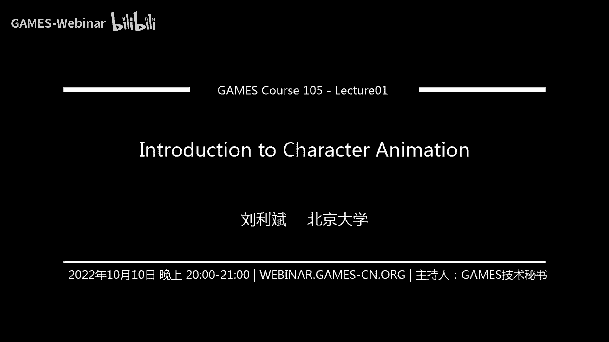

好啊，那我看时间也差不多了，那我们就现在开始我们今天的这个课程啊，那首先也是非常啊，欢迎大家来这个参与我们今天games 105的这样一个课程的这个啊，那个当然我们game cn 5。

其实大家在呃可能在我们前面这个宣传上也可以看到了，其实我们这个课的名字叫fundamentals of conomation，计算机角色动画啊基础，但其实也是跟其他的games的课程相类似啊。

是因为我们主要做的部分还是剑姬三维角色动画，而不是这个二维，或者是就是我们会是在可能会涉及二维的内容，但是我们主要的研究对象其实是三维的角色动画，这样一个这样一个呃目的啊。

当然我可以先来简单的简单介绍一下我自己啊，我叫刘立宾啊，现在是北京大学智能学院的助理教授，然后这个是我的个人主页，大家有兴趣可以去这个关注一下，然后这个我其实也很长一段时间都是在做啊。

计算机角色动画这样一个方向，但主要是基于物理的角色动画，其实很长一段时间都是在做这种怎么去控制啊，其实这个是非常困难的一件事情，嗯当我是其实我在北来北大之前，我其实也在迪士尼research啊。

迪士尼幼院待了一段时间，那这个照片实际上是我当年在迪士尼研究院的时候，去这个卢卡斯影业的啊，当然可能有些人，也许有些同学知道这个卢卡斯影业是拍星战的这样一个公司。

然后这个其实这个里边那个那个人物其实是达斯维，达，是那个星战的经典反派，当然我觉得非常有意思，是说在这个在这么一个角度看，他好像在笑，而是一种非常诡异的在笑，所以说我觉得这个还是挺好玩的。

一个一个一个这么一个照片，然后右下角这个二维码是我们啊v cl实验室，就是我们在北大的这样一个可视计算实验室的一个二维，一个公众号的二维码，但是大家有兴趣的也欢迎关注我们的公众号。

我们以后有各种这个啊活动啊，我们也会在公众号上进行啊，向大家发布，嗯，当然这门课其实这个主要的信息我们也都是放在了啊，我们的这个课程的主页上，那我们现在课程主页是现在是放在github上。

有这样一个链接呃，我们上课的时间其实就是从今天晚上开始，每周一的晚上八点到九点啊，大概是半年到九点，因为结束时间可能有些时候早，一些时候晚，取决于我们的这个课程的内容。

那总体来说我们希望这个课程其实也不是很长，大概12个星期的时间，从今天一直到大概12月，12月底应该是1月份之前就结束，那总的来说课程前置要求，因为毕竟是一门基础课程。

所以我们就是还是当然也有一些基本的要求，就是说大家还是需要了解线性代数啊，微积分，然后还有一些基本的编程的这种技术技巧啊技术，那当然我们今年我们这门课其实后面有一些作业啊。

其实主要是python基于python来写，其实这个只有我们之前也也讨论过，就是到底用哪一种方式，其实也是有些选择都会觉得可能python是最比较合适的，因为这个我们也不会讲非常复杂的这些啊。

不会社交非常复杂和非常具体到这个生产环境的一些技术，所以说我们居然还是用python，我们到时候会提供一些简单的这个框架来让大家来使用，然后我们现在cold base也在github上。

但是现在大家去看的话，现在是空的，上面什么都没有啊，当然我们从后面开始留都留作业的时候，我们会把一些这个代码框架放在这个这个地方，但是这个地方大概只有只有只有这个克隆的权限，就是大家交作业的时候。

这个我们还是按照我们以前其他的games的这个课程的要求，我们会有一个交作业的网站啊，大家可能有就可以去这个注册一下，然后我们这个课程本身有一个邀请码，就是现在是写在这个屏幕上。

然后另外我们课程有一个有一个微信群啊，不是微信群，不好意思，首先这个人数是基本是没有上限的，其次是这个二维码是不过期的，所以说这个还是挺不错的，我其实看了看，我觉得现在这是关注这个方三人还是相当多的。

其实我现在那个群里面在潜水，大家可以猜一猜哪一个数，哈哈啊，当然这个这个当然你要猜对了呢，这个我也不会承认的，就是这样一个群，这样一个这样一个基础课程的基本信息。

那当然这个既然我们这门课叫计算机学的动画，那么其实第一个问题就是什么是计算机角色动画，或者是我们关注的是计算机角色动画里面的哪些内容，其实我一说计算机角色动画，大家可能想的都是动画嘛，动画电影。

就是大家都做的非常，大家可能都，这个这个zofia这个疯狂动物城，然后像是这个coco，那我觉得coco这个电影当时还是拍的相当不错的，当然还有一些其他的，我这就没有放了。

比如说我那个学了3年动画的同学，然后做了一系列的东西，其实都是动画电影的东西，那当然其实虽然说动画电影是动画的，就是这些组合动画的这么一个非常重要的一个一个motivation，或者一个应用领域。

但实际上角色计算决算角色动画里边的这些技术，在电影里边的所占的比例是非常非常小的，其实可能只是我们今天讲的大部分内容，其实至少在目前的电影里是没有出现过。

但是未来我们相信其实随着我们现在这种ai生成的技术的这个提高，我其实觉得可能在电影这方面还是会有更多的这种应用的，那要说到角色动画技术，其实应用最多的在很长一段时间里，大量的应用的范围其实是游戏。

因为为什么，因为游戏我们是需要根据用户的输入去不断地生成新的，这种可交互的这样一些内容，这个其实跟电影是不一样，电影基本就是一次性的，而在这个里边，其实角色动画大部分技术是有这样的。

这个就是它是直接直接去推动了我们角色动画技术的这个这个，这个进步和发展，因为这个是因为这是一个真正落地的一个一个一个方向，那其实随着这2年我们也看到很多新的这种，其实也就是也不一定是新的了。

但是一些这个变得越来越啊多的一些应用，比如说这个现在这种虚拟的虚拟的偶像，虚拟的主播，这里边其实肯定有一些动画呃，这个决策化的技术，就数字人我们大部分大部分时间看的都是比较让我们惊艳的。

是这种比如说它的外表，这种渲染技术建模技术现在做得非常好，但是从我们这种其实大家自己可以仔细看一看，因为就是从动作的角度讲，这个它的成熟度还是非常之低的，另外还有像比如说我们vr的社交，vr的应用。

vr的游戏，当然还有一些稍微严肃一点，比如说像是这种呃大场景里的这种人群的这种仿真，但人群仿真其实赛事相关的方向，但是也不是完全的一致，因为他们关注的可能更多的是一些啊一些这些。

比如粗粒度的这样一些动作，但是从细度的角度讲，我其实觉得动画还是会有一些相应，有些应用的这个这个相关的地方嗯，其实也是计算机图形学的这样的一个一个这样的组成部分，好多不同。

这个主要的这种这种这种topic，那其实里边我们知道，如果我想把一个比如电影里面看到一个一个一个一个角色，他在运动，那这里面其实涉及至少有三个领域的啊，内容一个领域是建模，一个领域是动画。

另外一个是渲染，虽然跟建模主要还是涉及是一些静态的，或者说我可以是固定在某一帧上，怎么把它去啊，外观给表现出来，怎么把这个外观给渲染出来，可以展示出来，那动画其实是解决的是什么问题呢。

解决的是说我在这个每相邻帧之间的，或者说每一帧下一帧是该怎么生成的这样的一个关系，所以它他是去建模的，是一个时序上的这么一个规律，所以这是计算机动画跟其他的这个卷机，其中一个方向是物理仿真。

就是大家讲的非常好的一些一些这个这个入门的一些基础知识啊，打通这个仿真来说啊，其实就是仿真跟动画其实有很大的一点，就是跟角色动画其实有很大的不同点，仿真通常来讲我们是目标是一些物理的客观的物理现象。

比如说呃比如说这种缸体的仿真，比如说这些这种软体或者流体水流这样的仿真，还有烟呀或者是火呀，这些这些仿真，它其实主要是一些自然规律的一些这个这个这种这个时间演变的，这个推演。

那角色动画其实是更加关注于行为上的一些啊建模，比如说人的动作，动物的动作，比如说一些比如说一些虚拟角色，或者说比如说这个侏侏罗纪公园，这个恐龙该怎么动，其实都是一些行为上的这个这个这个啊展示。

当然这两个之间其实比如仿真和动画其实还是有些联系的，这些联系是什么呢，但这是我自己的一些一一个看法，就是说实际上仿真加上一些控制，就是动画，因为纯粹的物理仿真，它是一个完全的一个被动的东西啊。

现在没有声音吗，ok我看一下，应该是我这边是可以的，好ok对，那就是说我们的一个物理仿真，一个纯粹的东西加上一些控制，那就产生了相对的行为，那这里控制其实带来了什么呢。

其实在我看来可能带来的是一些主观的一些啊，就是就是这个主观的意愿上的一些一些一些东西，当然这个跟物理仿真其实有很大的不同，点在于什么呢，就是说物理仿真是纯粹的客观的，而且实际上物理仿真我们大部分情况下。

我们是有一些非常精确的数据的描述，然后我们可以完全按照这个数学描述，把这个仿真的现象给给给建立起来，那当然我当然这个描述本身可能是有些不精确的地方，但是总体来说它是一个可描述的东西。

但是对于法这个动作来说，对于行来说相对来说是就这个东西很难，你通过一个数学建模的方式，就是比如说我可以用这个数学公式，用原方程把它给给给算出来，很多时候我们的使用方法其实还是通过大量的这种大量的观察。

来进行一个统计上的一个建模，所以说实际上其实很长一段时间我们当然都是找各种统计的方法，可能是把这个模型给建出来，其实为什么，其实它带来一种新的这种对这些非常复杂的数据进行建模的方法。

他其实也是反过来也是进一步的，也不是反过来，其实正向的也推动了我们今年角色动画在很多方向上的，一个一个一个扩展，那当然从角色动画的角度讲来说，其实其实可能跟物理仿真还是有很大的不同。

点在于角色动画他所关注的对象是一个角色，一般来说我们看到的角色，因为像人，其实人的关节处是没有那么多的，然后我们大，部分的角色其实可能关节数也就是几12 30的这样一个关键数。

整体上来说可能到50~100个，这样的参数听起来好像很多，但其实也没有非常多，或者是其实理论上就是或者再进一步说，我们能看到的，我们能想到的绝大部分的动作，我们都可以找动画师来k出来。

就他可以一帧一帧的把这个pose给做出来，然后实现一个非常好的动画，其实大部分就使用这样的技术，因为就是我就要非常好的结果，我就是要当我可以投入很多的人，很多人很多，的这个人力去做这件事情。

那当然其实这也是从某种角度来说，是把这个角色动画变成了一个劳动密集型的这么一个这么一个技术，那当然这个特别是对我们有些游戏啊，这些方面我们需要做interaction，需要做交互的这样场景里边。

这种方式其实是不适合的，那这段就觉得动画其实我们研究的对象其实并不是说我们去怎么去把，怎么去用手去调这些参数，我们其实是想要去理解我们人和动物在做这些动作的时候，我们到底发生了什么事情。

然后希望能够把这件事情给建模出来，这个一，方面能够帮助我们提供一些更加更加更加smart，就更加更加便利的这种编辑动画的一些工具，另外方面其实也是允许我们可以根据我们的需要。

生成一些无中生有的生成一些新的动作，或者再具体一点，我觉得其实我们计算机学的动画研究的目的，就目标就是说把一个劳动密集型的一个民工活，变成一个这个计算密集型的。

这样的一个让计算机干活的这样一个这样一个方向，这是一个计算机的动画的，我自己写这方面的一些想法，那当然具体来说，或者说我们这门课会涉及到的内，容其实主其实这张图其实呃是描述的比较完整的啊。

就说我们一般来说我们怎么来生成一段动画，或者怎么怎么让一个虚拟形象动起来，那首先我们要有一个虚拟形象的，那这部分是主要是关于几何建模的那边的啊，一些技术，那比如说我我确实比如说可以让动画师。

让建模师给我雕刻出一个三维模型，当然我们现在有很多技术，我们可以通过三维扫描，把我一个人把我自己的形象扫描进来，但是我拿到这样一个模型之后，我首先要做的一件事情，就是要把这个模型给绑定到一个。

骨骼上这个绑定其实涉及两个部分，一个是怎么去设置这个骨骼，另外一个是怎么去计算这个我的这个模型蒙皮跟这个骨骼的相对关系，那这其实是也是一个非常非常重要的一个一个研究方向。

那另外一个方向其实也是我们这门课会主要着重关注的一个方向，就是说等我绑定完骨骼之后，那么这个骨骼本身的运动，就会带动着外面这个模型或者皮套去进行这个形变，去进行这个运动，那这个骨骼本身它到底应该怎么动。

我们该怎么去生成它的运动，这其实是我们角色动画会主，要研究的内容，那当然实际上我们可以想象一下啊，就是我们一般这个呃真实世界里边，比如说我去做一个动作是怎么做的，那首先我大脑其实有些想法。

ok我要是伸手了，我把手伸出来了，那这个大脑这个想法会变成一系列的神经信号，然后这些神经信号会变成我的肌肉的一些这个这个肌肉的脉冲，肌肉的信号，然后肌肉信号呢又导致我肌肉的这个纤维的收缩。

然后最终给我的啊肌肉骨骼系统上面增加了一些这个力和力矩啊，这样的一个这个一些这个外力，然后在一个物理的这，样一个机制之下，我们知道牛顿这个我们的世界本身其实是要符合物理规律的。

然后最终这些立刻例举来推动我的身体来产生运动，那当然这里其实有一部分是我们无法人工干预，就是这个物理，所以说实际上我们可以根据就是很多计算机学的动画的技术，就是可以根据我是否使用了这个物理。

是否对物理这部分进行建模，来区分我们这些角色动画的方法，那么其实有一类或者我们其实在我们常见的啊，非常非常就是在工业界非常大的应用的一类方法，就是所谓的这个基于运，动学的方法。

或者他其实也是基于关键帧的方法，就这类方法它是不需要经过物理，它是完全的把我这个动作生成过程中上面这一部分给把它隐含掉，所以说并不是说忽略掉，而是把它隐含掉。

那这个时候下我们其实做的事情就是直接去更新每一个角色，他的状态，比如他的姿势，他的速度，这些是可以直接更新的，那就是其实这里另外一个方面就是说我我这个角色他可以做什么事情，他可以做一个，比如说瞬移。

我可以从a的地方，从a位置，从直接瞬移到b位置，那，这是当然这部分其实这不符合物理规律，但是这个只是基于这个啊运动学的决斗动画，它是可以做到这件事情的，那反过来就是另外一个思路。

就是所谓的基于动力学的决策，或是基于物理的角色动画，这个的速，通常来说我们是希望能够完整的复现我们这个真实的这个物理，就是人产生动作这样的一个物理过程，但实际上这个完全复制这个副线其实也是非常困难的。

所以实际上我们大部情况还是会把它简化一点，但是总体来说我们还是最关键的部分，就是我们其实还是会对物，理仿真来进行对物理这个过程来进行建模，通过物理仿真的方式来生成最终的动呃，最终的动作啊，在这个过程中。

我们是不能直接去干预这个角色动作的，角色这个姿态，所以说像比如瞬移这种事情是基本基本来说是呃，虽然说我们可以实现，但这个并不是这个基于物理仿真的方法的一个目标，所以总的来说，我们刚才刚才说的。

我们其实我们角色动画的方法大致可以分为两类，就是刚才说的一类是基于使用物理仿真的，就是叫做基于物理仿真的角色动画，另外一类是不使用物理，仿真的直接改变角色姿态的方法，那就是基于运动学的方法。

或者说基于关键帧的方法，当然从另外一个角度讲，其实我们控制一个角色的这个动作，或者还有角色的姿态，我们其实也是从两种不同的这种这种维度，这种高度来进行控制，一种方式说，比如说像我们做动画师。

可能是他会每一帧每一个姿态去进行调控，比如说我告诉你，你的肩膀需要转多少度，你的手需要转多少度，那这种是一个非常low level的，非常低维的啊，这样一个控制。

那好那好处就是说我们其实可以通过dv的控制精，确的控制动作的每一个细节，那当然缺点就是因为我需要每个细节都要去控制，所以他就非常非常非常的呃，这个低效也非常的好，非常非常的昂贵。

那另外一方面其实也是我们通常想角色动画想要实现的目标，就是我最好是能够给这个虚拟角色一个非常高级的这样一个呃目标，比如说我跟那个角色说，你去那边拿杯水过来，那它会自动的生成，它可以走过去把水拿起来。

然后拿过来，那这样一个完整的过程，当然这是一个总体来说，你这个控制可以，我们可以用很小的一些这个信息，可以可以生成一个很完整的一段动画，但是相对来说的细节来说就不可能去准确的控制。

那这个其实也是说就是理论上我还是可以完全控制，比如说我可以准确的说你去那边拿水，用右手把水杯拿起来，拿多高，然后怎么怎么回事，就这样，其实理论来说。

其实某种生态我觉得这可能跟信息的这个信息熵还是很相关的，就是你要完成你要对这东西定义的资格进去，你还是要提供足够的信息，但不管怎么说，我们总是其实总。

是从这个low level control一直是逐渐的向clevel control去进行过渡啊，这个是我们这样一个过程，那接下来我们稍微简单介绍一下我们这个角色动画。

每一个方向的一些基本的这个这个技术，那么首先还是从这个基于关键帧的，或者是基于这个角色，至于运动学的方法这个角度来进行这个来简要回顾一下，当然说到基于是基于基于关键帧的技术嘛。

那其实关键帧的动画这个其实是应该最最最基本的这个动画的技术，因为其实际上你们知道他其实动画是出现在读书读文学之前的，因为你想想猫，和老鼠是哪1年的黄鹤老鼠大是二几年，一几年，1917年的。

这么这么一个这么一段时间，等会而计算机图形学出现的时候已经很晚了，所以很长一段时间里，经济动画我们其实都是靠动画师一帧一帧的画出来的，那当然这个过程时间动画师他们也也总结了一些很非常有这个哎呀。

不好意思，他们总结出了一些很多的这个这个经验啊，这个是非常有特点的。

就是这个所谓迪士尼的12啊，动画12准则啊，这个具体内容我就不讲了，大家有兴趣可以自己去了解一下，但总体来说就是说实际上我们虽然说没有经过物理过程，就是刚才我们说的，其实基于运动学的方法。

它是把前面的物理过程给给隐藏掉，但实际上这个过程是由动画师本身来完成的，而它就比如说这里的很多准则，一部分是在去模仿真实的物理的过程，另外一部分当然是有些艺术化的这种夸张。

有些可能是跟叙事啊或者表现手法相关的一些一些内容，那在我们到了这个计算机图形学的年代，到了这个三维计算机图形学的年代，那我们其实可以同样的技术可以应用在三维领域。

那其实是在二维上来说，我们其实是一帧一帧的去把关键帧画出来，那到了三维的情况下，那我们其实是通过一些软件，比如说玛雅，比如说blender，比houdini，还有很多其他的软件，我们其实是一个关键帧。

一个关键帧去调这个角色的姿态，那当我写好了一个姿态之后，我一重放，那么其实就形成了一个完整的这样的一个角色的，这样一个这样一个动画，那这个过程实际上就是比如做电影呢，其实我们需要很多时候要做这件事。

然后另外一方面就是其实他很难，就是你要能做得好，其实也是比较困难的，就我其实也有一个同学之前也有跟一些动画师也有一些合作啊，就是当时我们要做一个武术的动作，这一段太极拳的武术。

实际上他花了大概两个星期的时间，他们调的非常漂亮，我觉得这个其实是也是一个有点像绘画一样，你是需要一些训练的，需要一些技术才能达到这样的效果，那当然这里面从这个技术的角度讲，从这个算法的角度讲。

其实有两个非常重要的技术，其中一个是这个所谓的前项运动学，就前面的其实非常简单，所以理解啊，简单理解就是说当我可以给出，比如说角色是有很多关节身上，我给出每个关节的旋转的角度。

我需要去计算每个就是末端点，比如说每个骨骼，每个比如说我手的位置，我知道我从我从腰到胳膊到是到到手，每个关节的旋转之后，需要在手的位置，那需要这样一个计算，就是前向运动学，那反过来其实是叫逆向运动学。

因为实际上我们在调整这个角色的姿态的时候，我们直接去控制角色的这个关节旋转是非常不方便的，大家其实可以啊，可以后面试一下，实际大部分情况下，我们是希望能够直接去，比如说我用手让你需要把手往前伸一段距离。

那我希望我的这个角色能够自动去计算，我需要把我身上每个关节它的旋转角度改变多少，那这个计算过程就是所谓的逆向运动学，这也是非常关这个角色动画，那还有一个技术就是说我们在做制作关键帧动画的时候。

时间我们通常只是出于制作一些关键帧，就比如说像这个一个弯腰走路弯腰这样一个状态，我们通常来讲可能只有几个关键帧，然后在这几个关键词基础之上呢，我们是希望通过算法来自动的生成所谓的补间动画。

那其实一些基本的思路就是所谓的差值，我们有很多不同的插值的方法来帮助我们生成比较光滑，比较完整的这些动画，那不管怎么样，我们这个基于关系链的技术，我们知道它是因为我们需要每一帧每一帧去，控制角色的姿态。

它其实是一个非常low level的一个control的一个方法，另外一个刚才就是刚才我们所说，它可以保证所有的细节，但是会非常非常的非常非常慢，非常非常昂贵，所以时间为了解决这些问题。

我想大家都是非常了解的，就是我们现在做电影的时候，一方面是绿幕抠图。

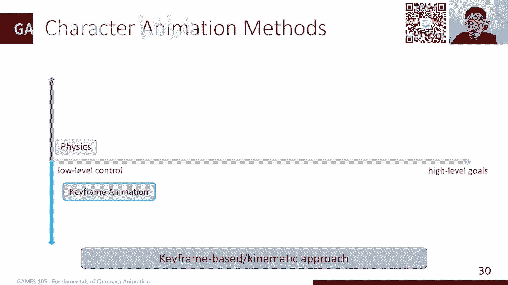

另一方面就是动捕，其实大量的使用动作捕捉技术来生成一些，比如说长得不是很像人的这些人，他们的这个这个角色，他们的运动是这样突然传来，同样是通过这样方式，实现，但当动捕来说，我们大家也是通常来讲动捕。

如果说我们想要做非常高质量的动捕，我们还是需要一些非常专用的设备，比如说呃这个这个业内非常这个常用的，像是y看啊，像是这个这个caus啊，这些方法都是比如说身上贴上一些这种标记点，反光的标记点。

然后就通过这种啊多视角相机的捕捉的方式来实现对这个动作的捕捉。

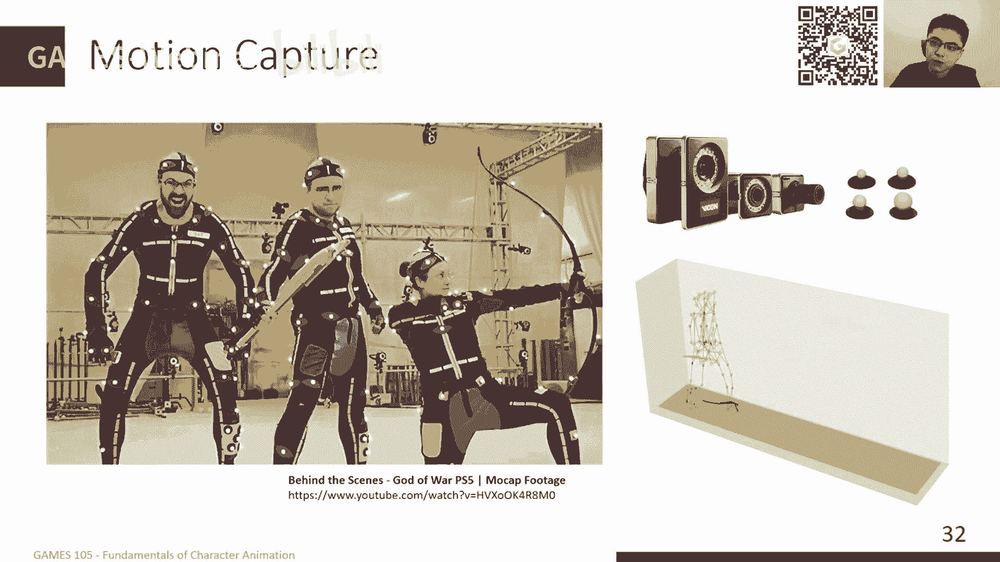

但它实际上现在在直播领域，大家也看到，可能有些很多相对来说比较更加便携的，更加这个亲民，价格比较亲民的这种各种设备，大部分来说可能是通基，于这种惯性动捕的方法，然后通过这种方式。

我们其实就是我们看到看到一些比如说这种虚拟偶像啊，他在表演的时候，其实背后可能是真的是一个对啊，一个一个不知道什么人在穿着这么一套动捕设备，来进行这个来进行表演，当然还有另外一个，其实不管哪一种设备。

我们总是要提供一些要要花一些钱，要花一些这个这个呃要去购买一个专用的设备，但是现在很多的一些研究的方向，其实是想。

既然这个我我们其实可以很容易用手机，比如说拍一段我自己的动作，那我是不是可以，从这个手机从这段视频里边把这个动作给估计出来，那这其实是所谓基于视频的动物的方法，那这个单虽然说这种方法使用范围比较广泛。

但是这个现在目前来说，这个质量上还是可能很难跟前面几种方式进行就进行比较，但不管哪一种动物，我们其实会面临同一个问题，就是我们需要把动物的这个动作。

把它给映射到一个具体的虚拟角色身上，那这个角色可能跟我动捕的这个人，那我可能有完全不同的大小，可能完全不同的这个骨骼的数量，或者说我这骨骼的这种这种拓扑结，构可能是不一样的。

比如说这个这个这个这个这个这个腿可能是反着，反关节是这个呀，不好意思，反关节构造的，那这个时候我们就需要一些新的技术，叫做motion retargeting。

这个我是把一个动作给重定向到一个新的一个虚拟角色之上，那这也是一个角色动画里面的一个非常重要的一个技术，那总体来说因为有动捕的动作捕捉的这个技术的出现，但实际上动捕做的事情是什么呢。

本质上还是说我就只是把动作捕捉下来，然后，把它重放一下，那其实并不能产生一些新的动作，那为了能够产生新，特别是在游戏里边，我们该怎么使用这些数据呢，那其实一个很非常容易想到的一个想法，就是所谓的状态机。

就是说比如说我我采了一些数据，我一些动作是说我是向前跑的一些动作，另外一个动作是说我要攻击敌人的动作，那我其实可以通过一个状态机，比如说用户按了一个按钮，比如说点一下鼠标。

那我会自动切换到一个攻击敌人的这样一个动作上，然后打打完之后，那我再回到正常的走路这样一个一个状态，里面去，这其实我看到大部分这个我们看到其他的这个所有的这种物理引擎，不是物理器，不好意思啊。

游戏引擎其实多多少少都会支持不同种类的装载机的这样一个模型，那当然状态机的这种方法，这个技术其实从学术上来说，我们可以其实可以找到这个02年。

就是叫motion graph的这样一个一个论文，其实回想一下motion graph那年其实有大概同一年，有三篇论文是大概提出了一个非提出了就是非常类似的同一个方法。

那为什么motion graph大家总是总是拿来提呢，因为他这个名字非常短，所以其实，也是告诉我们这个大家写论文的时候，这个起个名字还是非常非常重要的，那当然莫属古拉，好好多金的一些一些这个技术的细节。

比如说我们怎么给一段任意的动作，我们可以从里边去找呃，能够去构建这个状态机的这个切换的位置的这样一些技术，那这是呃motion graph的这个的一些工作，那当然后面其实很长一段时间。

我们都是在陌生graph的基础上进行进一步的改进。

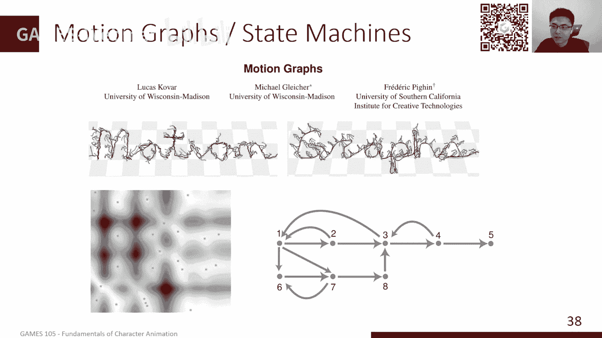

比如说我们可以在把很多动作就一个一个节点，一个状态节点，节点可能里边有很多动作，我，们在这些动作之中进行插值，来完成更加精确的一些控制，那这是其实也是一些对陌生国家的改进。

那另外就是说其实motion graph它提供了一个运动的这样一个。

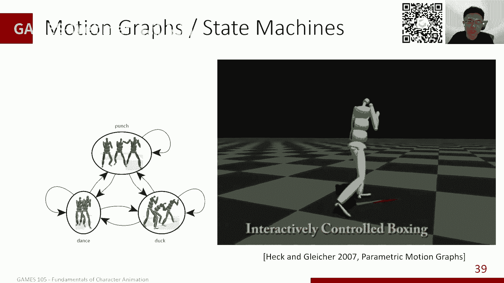

就是会这个底个底层的运动模型，他可以在这之上我们可以完成一些更加高级的这个控制，比如说我可以训练一个ai，他去使用陌生graph，它在这个graph在这个运动图里边去选择合适的编去进行进行执行。

那它就可以完成，比如说跟人对战，或者说比如说一个一个群体的这样一个仿真这样的一个效果，但总体来说motion graph带来的是什么，呢它带来了一种能够重用已有的运动数据来生成新的运动。

运动的这个就可以在交互的情况下生出新的运动，去完成一些这个下游任务的这样一个技术，当然缺点是什么呢，就是其实陌生古up构造是非常复杂的，特别是状态机就是给我们动作很多的情况下，其实大家可以想一想。

比如说我要我要走。

我大概我一个人可能他会学会，比如我从站立到走，然后到跑，然后再站立，那这里大概会有多少个多少种不同运动，其实最基本的我需要站立是一个动作，从站立到走到启动是一个动作，再走这个走的这个循环是一个动作。

然后从走到跑是一个动作，然后从跑再到站立也是另外一个动作，所以说其实这个复随着我动作增多，会变得这个这个这个动作图会变得更加非常非常复杂，甚至非常非常复杂，其实我都觉得可能有些游戏。

特别是像比如说nba篮球游戏，我觉得这游戏可能它最终它的动作会成动作的图的呈现，可能是非常非常复杂的，而且非常容易出bug，所以后来其实有很多这个有一些新的思想，如果怎么去改进这件事情。

因为动作图本质上还是去在每一个动作，片段这个动作片的本质是一个完整的动作，来对这些完整的动作之间进行切换，那其实一个想法就是说那我是不是可以把这个动作再切片一点。

比如我真的是欺骗到这个每一帧去进行控制的情况，那这个其实技术就是一个就就motion matching，motion matching，时间是啊，应该是玉璧在2016年左右提出的一个技术。

这个就我当时还是跟他们这个人，跟他们组的这些人聊过，那这个技术实际上最早是应用在那个for honor里面，就是啊我不知道中文这个名字叫什么，凡事也是b的一个游戏，然后就是产量比，较比较不错的效果。

但它的基本技术基本思想就是说我我不是去完整的播放一段动作，而是说我可能在更加细腻的，这比如说每一帧结束的时候，我通过一个呃，最近您搜索就找到一个新的姿态。

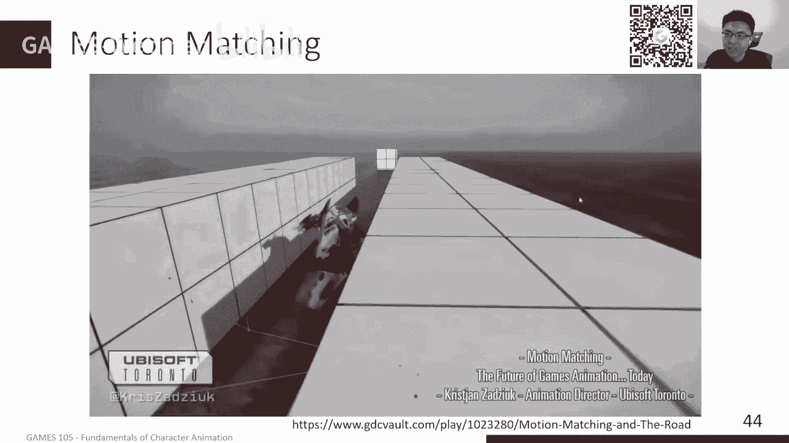

然后这个姿态同时满足我要控制的目标，比如说我要不行了，我方向去移动，另外同时也要满足，比如说跟我当前的角色不能状态不能差太远，然后保持这个动作是一个连续性，所以这个工作其实很长。

很大程度上是一个工程上的一个实现，就是说我怎么去设计这样的一个具体函数，怎么去设，计我的这个啊动作的这个库来达到最好的效果，但是但是好处是说这个方法非常简单，而且其实也非常实用。

其实我们也看到近年在很多一些这个游戏引擎上，其实也提供了啊，比如什么是matching类似的这样的一个技术的知识，我觉得其实现在游戏用的也就也开始越来越多了，当然这个其实当时也是他们有一个有一个。

观察吧，就是说虽然这个技术看起来是非常非常好的，非常非常fancy的，但是把这个技术应用到游戏里面，其实阻力是非常大的，为什么，比如说状态机模型这样的这样的papi。

那如果说我们给他一个新的这样一个技术，他们很难去，就是你需要花一点精力，才能把这样的一个新的技术给集成了，那个那个原来的这个这个这个管线里边，这个引擎里面。

所以这个其实也是我们每一个新技术要通过一段时间才能才能进步的，这样一个你这个一个问题，ok那其实motion martin其实也是一定程度上解决了motion graph的这个难点啊。

所以说他在而另外一方面它也可以提供更同样的跟motion graph一样，我们也是允许我们用一些更高level的，更高级的这种运动信号来控制角色的生成，那当然实际上随着就是其实其实我们也提到了。

我们大部分我们其实角色动画的目标是说，我们希望能够对角色本身的它内在的一些规律进行进行理解，进行建模，这样的一个统计规律，其实有很多这种所谓的生车模型，其实也是给计算机学动画带来了非常大的一个进步。

那所谓生成模型是什么呢，就是说我们可以把比如说有很多很多动作，我们把很多很多动作里，那这个网络它可以通过根据用户的这种不同的输入信号，来自动的计算下一帧的这个角色的姿态。

那这个其实有非常有代表性的一类一系列的工作。

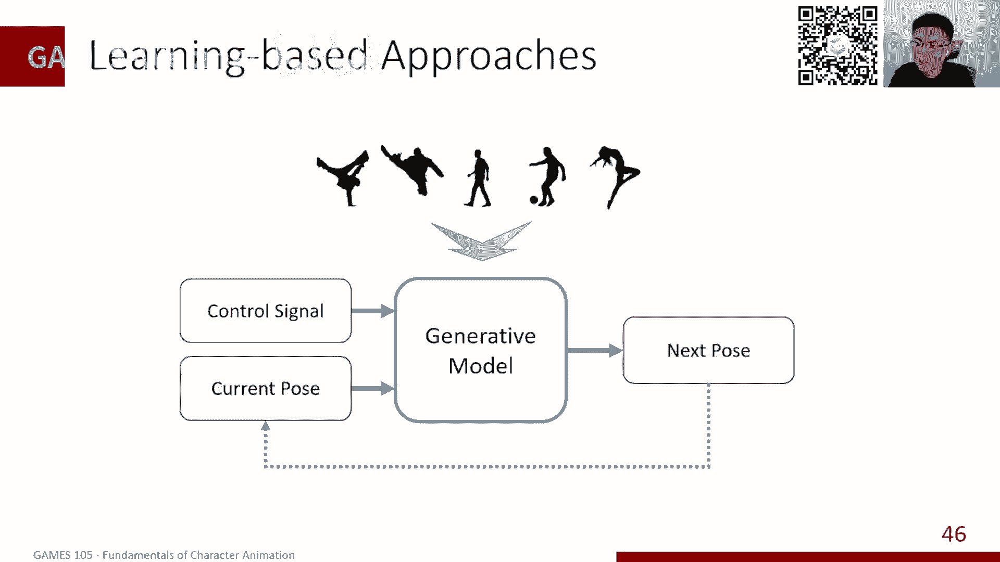

其实是这个就是taco camera，就是他们以前在爱丁堡大学，英国爱丁堡大学，他们是做了一些相对很多的工作，就是说我可以从数据里面去学一些，比如说控制方向这样一个指令，跟我真正做的动作。

他们之间的这个这个关系，当我学好了之后呢，我们其实可以拿到一个新的指令，比如说用用户用摇杆遥感啊，输入一些新的指令，它会输出新的这些动作，但另外一些技术就是我们去真的去学一些生成模型，你知道生成模型。

比如说像是大家常见的像gan，还有像现在非常有名的像是daily to，可能大家有一些东西可能可能了解过，就比如说我可能输入一段文字，我可以自动生成一个一个非常漂亮的图片。

那这个方法时间也可以应用在动作里边，比如说一些早期点的早期一些的工作，比如说我可以训练一个啊v e变分自编码器模型，那后面有一些新的工作，比如比如说用干，比如说用这个呃标标准化流。

但是最新的有些工作也比这2年这个扩散模型很很有效嘛，所以其实有新的新的工作来尝试使用扩散模型来生成动作，但总的来说这种生成模型的技术考试在哪里呢，就是说我们其实不需要去。

我们通常来讲对于生成龙的心，我只需要比如说我随便让一个人在场地里去走来走去，大概踩两个一两个小时的动作，然后丢给模型，它是怎么生成的，而以前的技术，比如说魔术graph，他是不能做这件事情。

我必须手工具做这样一个切分，做这样的一个状态机才能实现这件事情，而motion matching时间也是同样的问题，就是说如果动作库很大的情况下，它其实效果也是会变差的。

这是这是这种比较传统的方法的一些局限性，那当然现在还有一些新的一些，因为大家发现啊，我们只是生成动作这件事情本身，这个因为我们最终目标还是希望能够通过一些高阶的这种语，言的这种类似。

比比如说可以通过语言来控制角色的这个动作，随之前现在很多新的新的这些研究方向，都是说我们是不是可以实现这种跨模态的生成，比如说从一段音乐来生成一段这个舞蹈，这是一种非常典型的com它的动作。

然后还有一种比如说我们在数字人里面也经常用到的，就是说我给角色一段，比如说我说一段话，那我其实我希望我的虚拟角色能够做出相应的动作，那这个其实我们今天有一些有一些工作，就是这个我今天发的信息。

i am here with students at wait field high school in arlington virginia。

and we've got students tuning in from all across america，from kindergarten through twelfth grade。

and i am just so glad that all could join us today。

and i want to thank wakefield for being such an outstanding host，give yourself a big fat tac。

他们说的前一段演讲来自动生成的，狂魔太深了不，那另外一方面，其实我们有一些新的看到一些新的今年一些新的进展，有点像我们生成这个图片一样，其实我们可以给他一句话，它自动生成跟这句话相对的这样的一个动作。

就比如说这个这个非常典型的一个工作，就是这个motion clip，就是今年年初的时候一个工作，当然今天我也，但是其实这2年我看也看到一些公众号的推送，其实也有一些新的工作，可以动作效果更好一些。

但基本思路其实是一样的，就是说因为我们刚才提到了，我们觉觉，动画我们是学到了动作的一个这样一个统计的一个模型的表示，那我们知道语言其实有类似的问题，就是我们其实语言的这个我们怎么说话。

其实它也是一个统计的模型，我们通过把这个统计模型之间建立一个关系，那我们可以实现这种跨模态的语言的生成，所以实际上对于这个矿工太原来说，实际上我们已经非常接近我们原始的目标。

就是我们希望可以通过一些高high level的这样一个控制，来实现了一些非常复杂的动作，那接下来其实我们还有可能有更多的一些技术，比如说我，们是不是可以给一段剧本，让这个角色自动完成表演。

其实我觉得这个其实是反而会就是跟我们前面提到的角色动画啊，动画电影这个其实是更加相近的一个方向，但是前面说了这么多啊，但是实际上我们说的这个角色啊，基于运动学的方法。

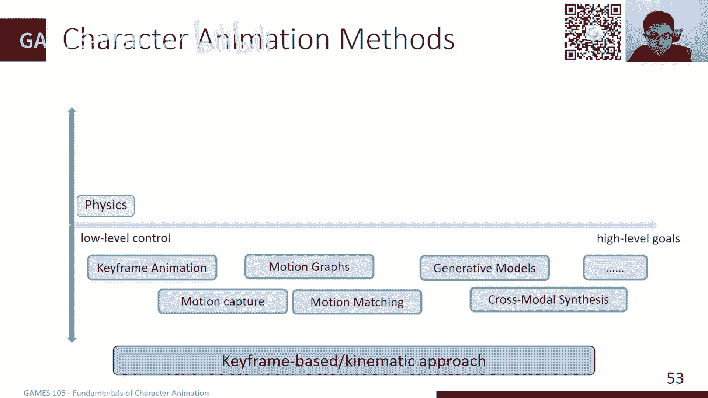

其实还是有相当大的局限性，其中一个非常重要的局限就是说因为他还是把物理过程给隐藏掉，那其实他就说很多时候我们深空动作是很难去完整的，完全的满足我们的物理的准确性，比如说我们常见的像穿模。

还有比如说这种这种脚上打，滑也就是说非常非常常见的基于运动学方法会出现的问题，那另外一个问题就是说其实运动鞋的方法本质上来说。

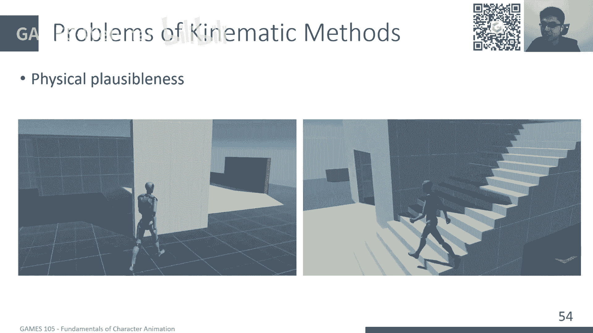

我们还是一些还是一些这个对现有动作的一个一个重放，或者是一个组合，嗯，但是如果说我们就比如我们环境里有一些新的变化，我们需要跟环境互动，可能产生一些新的状态，比如说像这个人被摔倒了。

或者像这个人他去踢一个狗，但他反而自己掉下去了，这种情况下，我们动作库里边是很难去踩到这样的动作，比如说有些动作可能过于危险了，比如说像成龙的很多，特技动作，比如从这个高楼上跳下来。

那这种动作其实我们是很难采集的，我们其实没有，如果没有采集到的话，我们靠基于运动学的方法是很难去生成这样的动作，而为了解决这些问题呢，实际上我们还是要回到基物理仿真的方法来完成一个啊。

就是更加物理准确的，更加可交互的这样的一个角色，动画的生成，就是刚才我们所提到的，其实我们做所说物理仿真的方法，实际上我们是希望能够完整的把我们真正的这个人再怎么生成，物理的啊。

人再怎么做出动作这样一个完整的过程，能够给在虚拟世界里给凸显出来，当然其实回想一下，我们前面说这个基于运动学的方法，我们是说给一些输出信号，给一些当前角色的这个姿态。

然后我们运动的模型会计算出下一个角色的这个姿态，从而完成这样一个动画，那基于物理方法实际上是稍微多了一步，就说我这个运动模型本身输出的结果并不直接是角色的呃，角色的姿态，而是一些控制控制量，比如说利。

然后这些利益和力矩通过物理仿真才能真正的去改变角色的姿态，实际及物理的方法其实已经其实我们在过去，的这个比如说游戏啊，电影里边可能还是其实已经有一些应用了。

其实最基本的一个应用就说我们可以把控制这件事情给暂时忽略掉，我们就只是考虑这个动作本身这个状态在物理规律下的一个动作，那这个结果就是一个所谓的redm remastation，在哪里。

常用的就是我们其实很多游戏都会用到的，比如说这个人，他这个这个这个死掉了，那他其实就是身体，就其实他就失去了对身体的控制，而实际上rag doll动作的仿真其实也不局限于这个死掉啊。

或者是失去意识这样的角色。

实际上我们正常人，比如说人遇到突发事件的时候，比如说你被石头被一个这个门槛绊了一下。

其实因为人的反应神经是有一个时间的，比如0。2秒左右，在这段时间里，其实你的动作本质上也是一个rap down，所以说就是这个其实rap仿真在一些场景下还是很还是很很现实的。

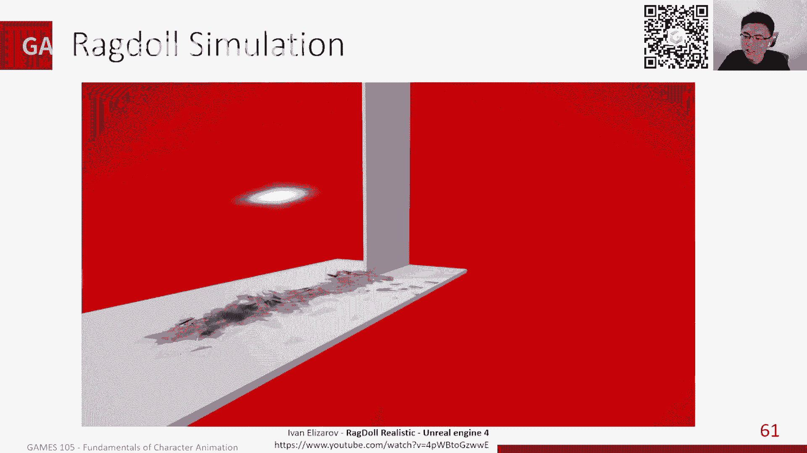

但是这个问题是什么呢，就是因为我们把控制给完全给关掉了，所以实际上他能做的事情也就只是说生成一些无意识的，或者短时间这个身体无法控制的情况下。

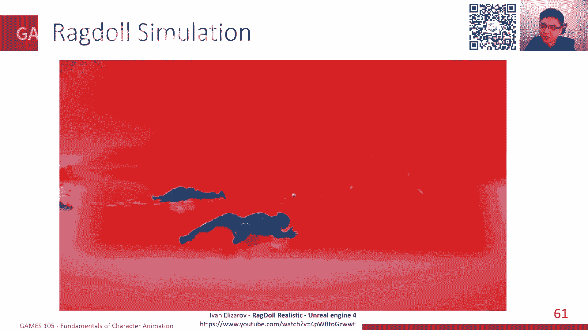

我们给我们生成的，动作，而为了实现更有意义的动作。

然后呢能让我们产生这样的动作，那比如其实这也因其实这个方面也是有一些。

这个我们虽然不是很多吧，但是我们也看到一些这个有意义的尝试，一些非常有意思的游戏，比如说克莱姆斯宁讲，当然其实在前几年，有几年有一段时间还是挺火的，然后他解释主要是一个特点。

就是说这个角色其实有相当一部分动作是基于物理仿真生成的，所以他其实每次你跟他去做交互的时候，这个反应都不完全一样的，然后，这其实国内一家游戏公司做的，好像在steam上排的排名还挺高的。

还有一个特点就是它是其实这个不完全是物理准确，但是至少是物理这个faysical plasible，就是这个物理可行的，就是他是说我其实我可以这个角色之间的互动，并不是预先给定的一些状态记忆。

而是说我真正是根据我当前的这个角色互动啊，这个碰撞啊，产生完全不同的这种这种这种角色，那当然我们自己也我之前在那个我们之前也做过一些实验，就是说我们可以比如在一个a r环境下，其实。

我觉得这种物理仿真的动画，其实对于vr或者a r的这种场景是非常非常合适的，为什么呢，因为像比如说我要是做一个基于手柄的一个格斗游戏，那我其实每一个命理论的时候，我都是可以预先设置的，但是vr环境不同。

比如说我戴一个头盔，我前面一个人，那我比如说我跟他做一个拳击，做一个打击打的这样一个游戏，那我用什么方式，用户用什么方式去击打这个角色，其实这个我们是完全无法控制的。

因为因为我可以从任何方向去打这个角色，那这种情况下时间我们只有通过物，理仿真才能真的是生成完全还原的这个物理物理的动作，当然物理仿真还有一些其他的一些用处，比如说vr的一个社交。

我们知道去年其实也是今年，比如说mata，比如说facebook，他们也出过一些vr社交的一些应用，比如说这个我可以戴上头盔，我可以看到我的一个个人形象出现在虚拟世界里。

但是当时我就觉得当时我看到这个video就觉得特别搞笑，为什么呢，因为它只有上半身，没有下半身，这个其实也是一个非常典型的一个应用，就是说因为vr头盔来说，我们有一个头盔，还有两个手柄，那其。

实我有三个点在这三个，来算出上半身的姿态，但是下半身比如往前移动，我的脚不该怎么移动，这件事情是非常难去从只有这三个信息来来实现，但是如果说我们有了物理仿真，那这件事情就变得可行了。

因为最基本来说我因为我们前面提到物理物理过程，我们在物理仿真里面一个角色他是不能瞬移的，我们只能是从一个地方，为了能从比如说我这个角不我我戴着头盔之后，我这三个点的头盔向前移动。

那我的吸引角色也需要向前移动，然后为了能够实现这个情况，他必须要生成用满足物理规律的这样一个脚步，才能带来这个向前的移动，所以这也从另外一个方向，就是我其实通过这种方式估计出了我的角色该怎么动。

这是一个非常有意思的一个应用，那当然我们其实也可以进一步的。

让这个动作看起来更加真实一点，那另外一个方向就是说，其实物理仿真会可以帮助我们抓住一些非常非常这个细节的，一些一些操作，比如说筷子我们正常做做这个运动学的方法，那可能我这个筷子它怎么动。

就是我可能就直接把这个物体粘在快餐就可以了，但实际上我们知道人家用快的时候，它有一些细节的这个小的一些动作，比如说手指要有一些动作才能把这个筷子给动起来，那我们通过物理仿真的过程。

为了能够实现这样一个这样一个这个这个这个操作，那我们其实必须要产生这样的细节，所以这个也是物理仿真能带来的一些一些这个啊一些情况，那我们接下来其实还提到了。

我前面都是我们在物理仿真的一些物理及物理仿真的举动，画的一些应用啊，其实类我们接下来可能我们会介绍一些关于物理仿真，觉得动画的一些基本技术，当然了，最基本的一个问题就是说我们该如何。

我们该怎么建模我们的角色，其实我们最理想的状态是说我们完整的把一个人建出来，我们建立完整的这样一个神经系统，完整他的肌肉系统，但这个通常是非常困难的，一方面来说这个这个原始的作用机理。

我们其实这个学术上也没有完全搞得很清楚，另外一方面这么建模，比如说肌肉大概有几百条肌肉，上千个自由度，那这种情况下这个仿真的效率也是非常低的，所以实际上大部分呢我们做物理角色动画的时候。

我们还是会把这个角色进行简化掉，我们并不是直接用这样一个肌肉骨骼系统来进行操作，而是通过比如说比如说这个关节力矩来来去驱动这样一个角色做动作，那当然为什么可以用关键词例举呢，其实想一想。

因为人的肌肉本质上来说，我们是肌肉是通过这个基建会连接到骨骼之上，然后其实每一个肌肉都会给我的骨骼，在运动的时候都会给我的对我的骨骼产生一个力，那大家从物理这个大学物理啊，或者高中物理。

其实也知道每一个例都会给我的等价的，在我的这个关节上产生一个力矩，所以实际上我们完全可以通过关节力矩来仿真我们真正的骨骼，肌肉这个过程，但在实际的这样的这个物理仿真里边，就是基于物理学的动画里边。

我们通常是就是有一类方法是非常常用的，就是所谓的pd控制，就比如说我想把我的手从这个高度举到这个高度，那我需要给我的关节上加多少力呢，那我首先知道我这个这个关这个高度是我想要达到的位置。

而这个高度是我现在的位置，那这两个高度就差乘以一个系数，其实就是我需要加的力的这样一个大小，那当这是一个非常粗略的计算，但实际上还是非常有效的，通过这样的计算，好处是什么呢，就是说比如说我想做一个动作。

我其实可以给出一个目标高度的这样一个轨迹，然后采用pd控制，那我就可以生成一个啊对每个关节的这样一个例句，然后他大概能让我产生我想要做的这样一个动作，那他这个其实也是很早，也就是计算机学的。

就是基于物理的动画里边，其实很长一段时间大家使用的这类的方法，其实可以找到这种。

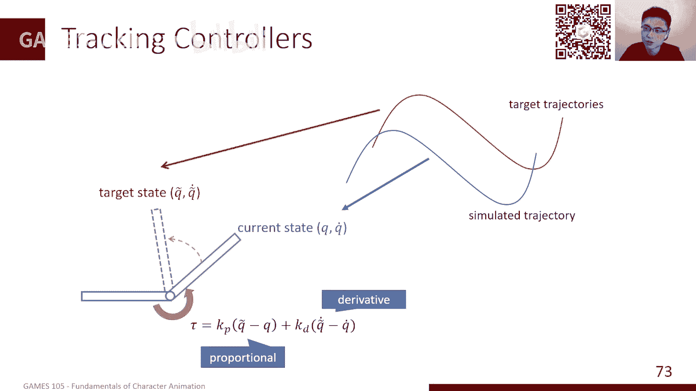

但这个工作其实就非常早了，这大概是1995年的，我们一般比如说我们做角色动画的paper的时候，大家还是会把这个论文引一下。

因为这差不多是最早的时刻，其实在可以看到1995年的时候，我们用物理仿真的方法就能做到这样的动作啊，这个这个其实是那个just blog做的功能。

而是全是为了给亚特兰大奥运会做了一份这个这个应景的中间。

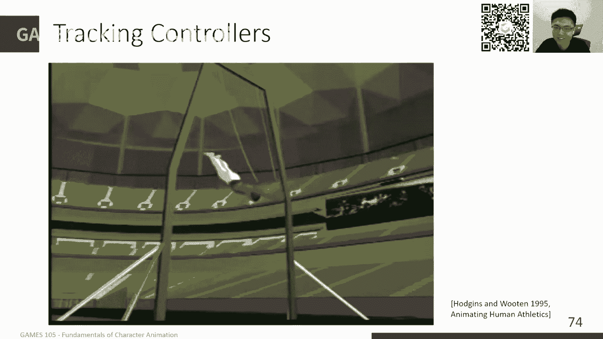

但是实际上这个技术虽然在那个时候做做到这个程度，但是后面从95年到二零。

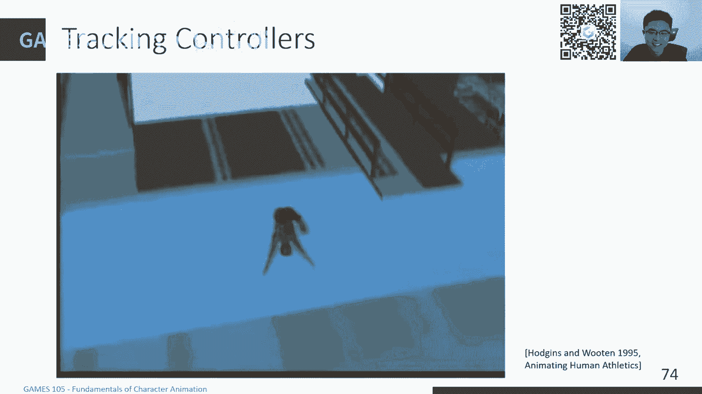

现在到20225年，差不多30年。

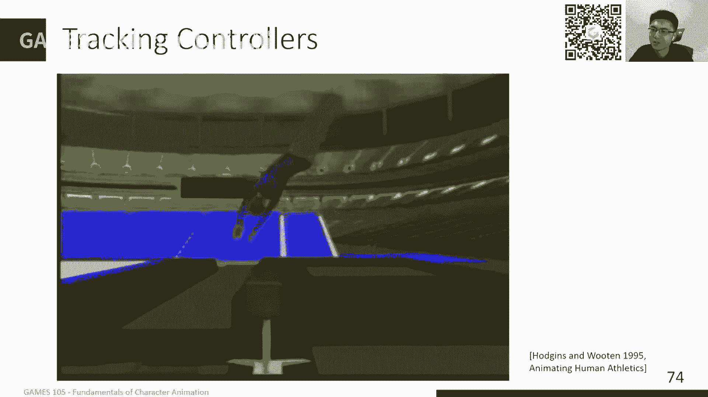

我们其实还是没有在真的这种游戏里面见到这个事实。

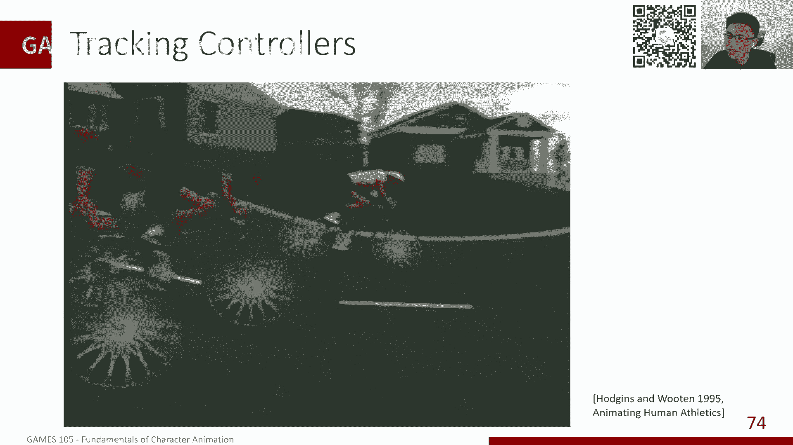

其实最大的原因是什么，那原因其实控制是非常非常难的，大家可以有，其实这也是一个就是非常有意思的一个游戏，大家有兴趣可以去玩一玩，就是那个叫q w o p这个网站，广告有点多，但是是一个flash小游戏。

这游戏还是挺还是挺有名的，就是你可以通过q w o p这四个键去改变，增加在每个腿上，它主要就是下面下肢每个腿上的失利，然后目标是你希望这个角色能够能够跑1百米。

但实际上当然这个video这个视频其实是一个玩的非常好的人了，如果说你是第一次玩这个游戏的话，那其实你这个角色可能往前一步都走不了，因为这个实际就比我非常简单的一个问题，比如说我要问你，你是怎么走路的。

你其实很难去通过语言进行描述，但这个技术其实你是很难很难去用用这个公式啊，或者去通过一个教学的方法，教另外一个人学会这个动作，当然实际上很之前有一个公司叫叫natural motion。

他们其实就是就觉得这个角色动画基于物理仿真动画，是一个非常好的方向，所以说他们其实在这方面投入了很多的一个努力，因为前面提到了，为了能够实现这样一个为了设计这样一个目标轨迹，我们需要在为了实现一个动作。

我们需要需要去设计这样一个目标轨迹，但是这个木甲鬼应该怎么实现呢，其实他们还是借鉴了一些玛雅，这是这些动画软软件的这个技术，就是我们专门做一个软件，这个软件目标就是设计这样一个控制轨迹。

然后我再用pd控制或者其他类似的控制方式加呃，来计算这个世界带去色散的力，然后用这个力来驱动角色进行运动，那这个人其实做的还是比较看着还是比较不错的，而且这个功能也是比较完整的，但是问题在于哪呢。

在于这个他跟玛雅之类的这种基于关键帧的方法不同点不同，基于观战的方法，比如说我把一个角色设置成某个姿势，那他就是某个姿势，但是基于物理仿真的方法，按照我们刚才其实介绍了。

我们其实是没办法直接去设置这个姿势，我们只能说设了一个姿势之后，我希望他计算的力差好，能差不多能够完成这样的姿势，但实际上这个过程是非常就是这两个并不是完全相同的。

所以说实际上比如动画师做了一段后空翻的动作，他跑一边仿真，发现这个角色做的完全不是后空翻，或者一下就翻，一下就摔倒了，那这个时候你就需要不断的调整，不断的调整。

这个调整的过程是比我们关键帧做动画的时候要要要难很多的。

这样一个过程，所以说这个软件，所以说这个虽然说这个natural motion算是这个领域的先驱啊，但是怎么说呢，这个方法这个这个软件其实还是很很少，能够在我们真实的这个场景里能够见到。

但nh motion后来也是也是有一个比较好的一个结结局了，因为他做了一个非常有名的这个游戏，就是我们刚才前面提到的那个肯莱姆森金甲，然后他后来被一个游戏公司收购了，但是也算是这个。

因为克莱斯i大家也看到他其实基于物理仿真的角色动画，所以这也算是他们的老本行，但问怎么说，我们前面提到这种方法就是最基本的一个实现运动控制的方法。

就是所谓的control控制的一个关键帧技术，那这个比较加引号了，但实际上它并不完全是像角色动画啊，像那个基于关键帧或者基于运动的方法那样，这个这个我们是真的可以控制关键帧的，然后因为这个控制关键帧。

或者是去控制一个角色生成某种动作的这种方法，这样的难度呢，那实际上我们其实后来有很多新的方法。

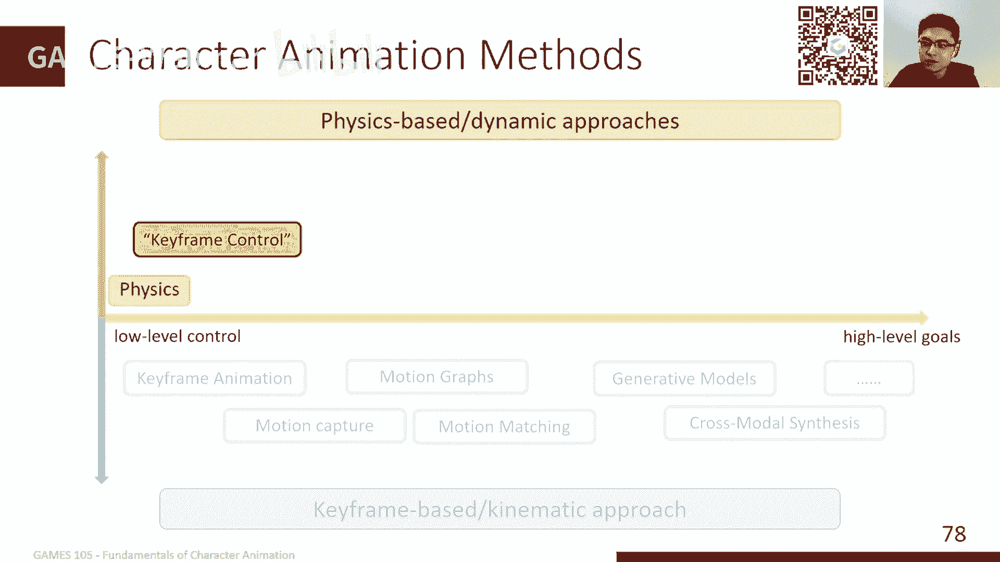

比如说我们可以通过优化的方式让这个角色我们去像我手工设置。

不会这个很难，那么就通过优化，让计算机通过运算的方式来算出比较合适的关这个这个控制的轨迹，那当然这个过程其实我们可以加一些其他的变量，比如说我可以把这个动作去映射到一个新的虚拟角色身上。

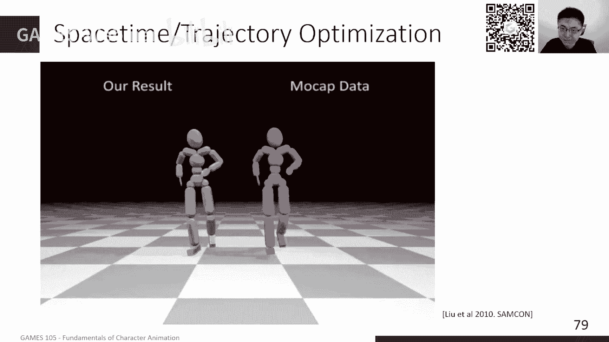

实现这样一个重叠线，因为我们在这，因为整个过程是物理仿真的，所以我们可以保证这个重叠线过程是一个生成动作，还是一个物理准确的，那么他也可以做一些其他的扩展，比如说放在一个不同的环境下，比如放在月亮上。

那他这个在不同重力环境下，他的动作会有相应的变化，那当然这种关键是这个，有基于优化的技术，其实也是允许我们做一些a simple input，this optimization for moniz。

做一些其他的一些这个更高级的这种输入，比如说像这是一个09年的工作，他们当时就是说我其实可以告诉我这个角色，你再比如说你的这个脚的落点是什么样子，那我可以动画的，基于仿真的，也算是基于这个优化的方法。

我们可以自动生成一个合理的动作，它能够满足我对落点脚的这个脚步，落点这样一个这样一个啊输入，其实生成动作还是看起来比较比较不错的，但这类方法其实有一个非常大的问题，就是说实。

际上我们需要解决一个非常高维的，然后他的这个这个这个函数本身就是非常非常非线性的，这样一个优化问题，所以说这个优化是非常难解的，而且非常非常的慢，所以实际上我们能用的范围也是比较比较新。

但总体来说基于呃这个轨迹优化的方法，或者基于时空优化的方法，也是给我们一些新的思路，允许我们提供一些更高维的，更高级的这样的一个输入控制，而不是说我去真的去去调整每一个角色，每一个状态，他应该去怎么动。

他都这样，虽然但是它也本身也是有相当的局限，性的让我们实际上用起来很难去把它给放，换到一些比较比较比较复杂的动作，比较困难的一些场景，那后面其实我们接下来就是说其实我们大家可能有了解到。

比如说这个机器人领域，我知道这个有一个大家可能现在都了解的，比如说boston dynamics，这个不是那动力的这个机器人机器狗，然后其实在在之前，比如说大家可能也知道，也许了解那个宏达。

宏达就是那个本田的阿西莫机器人，就是这一类机器人技术，它其实就是比如说issm是一个非常典型的一个，这个就是用就是它的使用的技术，就是说它是使用一个非常的一个简化的，因为我知道人是非常复杂。

我们身上有很多这个关节，很多很多这个骨骼很多关节，然后我们可以通过一个简化模型来把我们想要做的动作给描述出来，然后利用这个简化模型来指导我们这个角色该怎么控制，那其实是借鉴于这样的思路的话。

使用节奏动画，这边我们其实当时也是有一些呃工作，就是尝试用简化模型来实现非常稳定的，非常这种多种技能能都通用的这样的一个控制策略，但是你看，看是现在f s f u那做了这样一个工作。

其实这个这个角色非常稳定，就是跑起来可以，我们可以甚至可以给他一些这种外力的外地的这种干扰，他依然可以能够走得非常非常稳定，并且能够产生香的这个动作，但是期待是什么呢。

就是这个思路其实是因为它是来自于机器人嘛，所以说他的这个控制是非常非常这个怎么说呢，非常简化了，非常这个是缺少细节，那其实带来很大的问题，就是说他就走路像机器人一样，所以这也是一个问题。

然后后面其实有一些新的一些改进，比如说我，可以用一些非线性的模型。

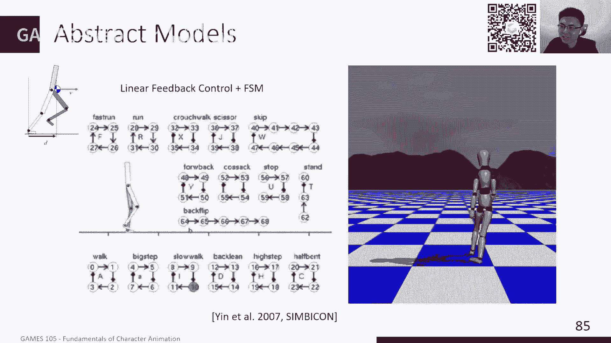

比如说刀a版模型来实现一些非常啊鲁棒的，或者可以可以分化的这样一些动作，但是不管哪一种，其实我们常见的这种所谓的简化模型，因为我们很多时候，比如像机器人领域，它是对走路这件事情研究非常久的时间。

所以很多减化模型都是只针对于走路来进行控制的，然后另外一方面就是走路也是一个有一个非常大的特点，就是走路的速度比较慢，在速度比较慢的时候，我们可以很容易地把一些这个问题给线性化。

其实也是让我们的问题变得更加容，易解决，然后当我们如果说更发达运动，比如说我想做一个后空翻，那这种模型就非常难以实现了，当然也是有做的，比如说我们这前2年也还看到一个工作，它是能够实现口供番的。

但是这个整个的这个设计是非常非常复杂的。

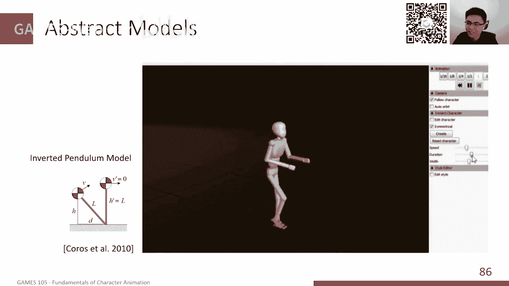

就所以说也是非常难的一件事情。

但是不管怎么样，我们的简化模型的方法给我们提供了一条思路，就是说我可以通过简化模型来实现对一些对一些动作的这个控制，而且这个我们不需要，而且这个过程还是比较鲁棒的，我们可以去控制，比如说允许我去通过。

一些比如说外力啊，然后来产生来跟对这个角色进行进行相应的交互，但总的来说缺点就是很明显，我们只能控制非常只能基本上只能做走路，而做复杂动作基本是做不了，而这个现象这个过程其实也持续了很多年了。

就是说他做的事情有点像，就是我可以我一个角色，我一个这个一个agent，比如说个机器人，它可以不断的跟环境进行交互，比如说我迈左腿，我发现我摔倒，了，那我摔倒了之后呢，环境会告诉我。

你这个地方你迈左腿这件事是不对的，那我下次再卖左腿的时候，我就要考虑考虑，可能就不要卖左腿或者卖左腿的时候要少卖一点或者多卖一点，然后才能保证我不摔倒，他就会通过这种不断的跟环境进行交互。

来更新自己的运动策略的这种方式，来最终学到一个一个一个一个一个动作，或者会学到一种控制的方式，当然这个方向其实火起来是大概哪1年，大概是在这个2015年左右。

当时这个deep mind那会儿还没有被google收购，但是他们出了一，个在nature上发了一个发了一个工作，就是叫human level control，就是他们在一个雅达利的这样一个游戏机。

实现了超过人玩这个游戏时候的那个那个那个这样一个得分，所以这个其实是非常有非常有鼓舞的一件事情，就是其实也是告诉我们，都是一些在一些比较简单的这个toy model，身材是word。

但是后面其实就有很多这个方法来尝试，不断去更改他自己的这样的一个运动策略，比如说我们可以做这种跳舞动作，我们可以做打篮球，还有这个我们可以做更更复杂，其实理论来说，我们任何一段差不多任何一段动作。

只要是我给他一个参考的运动数据，他就可以学到这段动作，其实这个大家非常有名的demimic，那当然就在这样一个基础之上，因为，我们最终学到的还是一个所谓的tracking。

所以一个跟踪控制就是它目标是说我要实现一个在物理仿真的环境下，实现对某一个运动数据的一个完全的复现，那类似于我们其实可以认为这个输出结果就是一段护理的运动数据，那在这基础上，我们其实可以进一步的。

比如说把motion graph给引入进来，使用状态机，用状态机的方式把编码很多，把很多不同的这个运动，它的这个物理控制可以放在同一个，这个用这个状态机协调完成一些更加复杂的动，作啊。

或者说我们其实也可以类似于比如说像类似于motion matching，我们可以把这个控制本身拆成更细的一些一些片段，0。1秒，乃至这个在这个片段之间进行这个切换，那么其实也可以反正一些比较复杂的动作。

比如说像滑板，那比如说碰到这个障碍物之后，它可以去自动地调整自己的平衡，来实现这个更加这个物理准确的这样的滑板的动作，其实给我们角色动画就是基，于物理动画带来很多新的这种啊很好的一个工具。

像是这种啊层级化的这个控制策略，让我们角色能够完成在我们比如说一些高级的指令之下，完成一些更完就是综合的使用这些动作来完成完成某些功能，那接下来其实还是在使用。

随着我们现在可以很容易地被每一个动作去进行控制，在这样一个基础之上呢，其实我们可以回想一下，我们在基于呃运动学或者基于关键帧的方，法那个领域里边，我们其实提出了一个特一个一类方法。

就是所谓的这个运动生成，基于生成模型的方法，去找到它里面内部规内部的规律，然后这样的话我们可以在新的命令之下来生成新的动作，但是在物理仿真的情况下，其实我们可以做同样的事情。

就基本来说我们可以把这个东西叫做什么呢，我们把这东西叫做运动运动啊，控制生成模型，但是跟运动生成模型的不同点在于什么呢，因为控制我们是不能直接去改变，角色的姿态，所以说实际上控制生成模型。

该我去猜测我在这个角色在在做这样大量数据的时候，它有一个什么样的规律，他怎么去控制我的身体，他怎么去输出一个力或者例句来让这个角色能够动起来，那只是运动生成模型，但是这个我们今天今天也是做过一些工作啊。

比如说这个我们可以很容易地学到这个生成模型。

在这个生成模型自己的这个状态空间里边，我们可以做随机的采样，那这个每一个采样都会生成一个不同的这样，一个动作，而同时利用生成模型的这样一个基础，我们也可以很容易地实现更高阶的这样一个控制。

比如说我可以控制它的方向，可以控制角色的这个运动的这个类型，然后同时实际上因为整个整个这个过程是物理仿真的，我们也可以很容易的，比如我对对这个角色，比如扔一个球过去。

或者我在地上放一些这种不同的这个物体，它其实会很明显的影响这个角色的动作，而且角色可以生成准确的合理的这样的反馈，就是这样的，也是有机物理仿真的方法的一个特点，那当然接下来我。

们这基于生成模型其实已经是逐渐的把我们这个整个的角色动画。

其实物理角动画推向了我们的目标，就是我们目标，还是说我们希望能够通过一个高阶的控制来实现对动作的生成，那接下来我们会做什么事情，其实这里还有其实很多很多，比如说我们从这个基于运动学的方法那边。

我也看了一些一些工作，比如说我刚才说到的，我可以说一段话，通过这段话我来生成合适的这个动作，那当然基于运动学的方法，按照我们其实刚才我们也提到，他很容易生，他很难去完全的去满足一，些物理的约束。

而反过来基于运动学的方法，基于基于物理仿真的方法，其实可以很容易实现这件事情，随着时间，现在我们也可以期待，可能很快就会有一些工作，他能够把语言或者是其他的模态，比如说音乐。

把这些的方法应用到我们这个控制的生产领域，来完成这样的一个运动生成的一个过程，ok那我觉得其实前面我们这整个前面这一个小时，我们主要是大概回顾了一下计算机角色动画这个领域，我们在过去30年。

我们在这个领域的一些主要的研究方向，但是很多时候很多方，向其实我们已经看到了在啊，特别是比如基于运动学的方法的一些新的这些技术，其实我们已经逐渐的发看到他们在真实的这个场景里面落地使用，然后基于物理学。

物理学啊，基于物理动画的方法，其实我们从30年前都一直在说，ok我们物理基于物理动画是有潜力能够替代角色动画的啊，就替代这个基于关键帧的方法的，当然这个是我们说了30年，永远都是有潜力，但是不管怎么。

特别是现在我们最近的一些看到的，一些工作，比如说啊基于生成模型的运动控制，这些工作出现之后，我现在我们现在其实有一个想法，就是说可能现在真的是到了一个这样一个点，我们这个基于物理的方法。

或者我们真正的把一个真正在虚拟世界里还原真实世界，动作产生过程，这样一个方法真的能够把它变成现实，变成真正可用的一个状态，这是我们所说也是角色梦幻，我们现在觉得非常好玩的一个地方。

ok那关于前面的一个介绍，就是大概就讲了这些，那最后还是一点关于我们这个课程的一些一些内容，首先呢，我们其实可能之前也这个我看到微信群啊，有人问我们是会不会讲这个。

比如说这个unreal engine怎么用啊，但我觉得很遗憾的是，就是我们涉及的内容，主要还并不是说我们怎么去用一个具体的软件，比如说怎么用麻呀，怎么去motion，motion builder。

怎么去用用unity啊，怎么去unreal啊，这个其实并不是我们这门课主要的目的，那另外一方面，我们也不是说去教大家怎么去做一个动画师，因为我们主要还是从这个计算机角色动画的一，个学科的这个作为科学。

作为一个技术点方向来进行这个探讨，所以我们主要还是会关注于每一个计算机工具，它后面的方法，它后面的理论，它后面有什么技术，特别是比如说角色的动力学，角色的啊，运动学特这个过程，角色动力学过程。

然后怎么去做物理仿真，怎么在物理仿真下实现对应用的控制等等等等，但最终目标是什么呢，是说大家学完这个专门课之后，能够自己实现一个可交互的虚拟角色，那可能是，一个一个一个游戏里的一个角色。

那我希望这个这门课能够给带来给大家带来足够的知识，能够完成这件事情，那最后再回顾一下，其实我们刚才也提到了，这是我们这个课程的一些基本的安排，然后和这个交流和交作业的这个这个啊网站啊。

总体来说我们是12次课，那今天是第一次课已经完成了，从后面的话我们是从这个基本的数学开始，然后先讲先主要是介绍基于运动学的方法，基于关键帧的方法，然后中间我们也会涉及到一部分。

就是这个因为是跟前面那些相关的，就是蒙皮，就是角色的蒙皮绑定的一些基础基本知识，然后后面就这门课的后面一半，主要是一个关于物理仿真和基于物理的角色动画的一些知识。

总体来说这个啊内容还是比较比较比较丰富的啊，当然这个这个大纲我们也是这个可能后面随着我们的这个课程进展，随着大家的反馈，我们也可能会稍微调整，那总的来说呢，当然具体的信息的话，我们会在那个当。

那我们大概大体上来说，我们会这个课程会有五个小的project，其中有四个是跟是关于这个角色，就是这个关节角色动画的，就是大概是两周到三周这样一个一个一个项目。

然后还有一个是关于我们这个模型绑定的一个小的一个小的一个project，所以这个我们后面会有进一步的这个说明，那总的来说我们这个刚才就像刚才我们说的。

实际上我们所有的这个项目其实主要还是用python来实现，因为后面会是大物理仿真，所以我们会有一些呃，比如说python下面一些物理简单常用的物理引擎去怎么去使用。

然后在这个物理琴物理引擎上实现我们的一些仿真和一些控制，和一些动画的效果，那总的来说我们这门课还是一个105嘛，我们还是个幺的课程，而且是105已经是第五games的第五个这个基础课程。

实际上我们前面有很多，前面已经有四个非常非常好的一个基础课程，但总的来说呢，我其实对这门课的一个想法，而是一个所谓的这个self content，就说我是课程内容还是能够自呃自洽的自融的。

但是也是大家如果有时间有兴趣，当然也是非常建议大家去学前面几门的课程，首先计算机同学入门，因为这个语音系老师他可能是做渲染方向，所以这门课渲染的内容讲的比较多，而这门课比如105这门课。

实验室里边只涉及一点点的这个集资动画的一个晚常大的一个扩展，然后几何与建模处理相对来说给我们稍微远一点，但是呢我们后面会讲到关于差值的部分，其实是跟几何几何建模很相关的，蒙皮绑定。

其实里面有些技术也是来自于几何建模也处理的这这部分内容，然后我们后面其实很长一部分是在讲仿真，当然这个跟前面103的仿真有一点点不同，是103其实很大一个厂部分是在讲，首先它可能讲钢铁的时候。

直接讲单缸体，其次呢就是说它可能很差异很大幅篇幅在关于这个流体和软体的方针，那对于我们来说，实际上我们讲仿真，我们是专注于多缸体仿真，因为人嘛一个角色，我肯定是一个多缸体脚接在一起来实现一个仿真。

所以说这个是我们在跟他们稍微有点不一样的地方，但是总体来说仿真的一个基础是103这门课会提供给大家，另外其实我我其实之前也看了看，104讲游戏引擎其实很很大一个篇幅，就是关于里面的动画。

因为我们知道角色动画其实是所有游戏引擎里非常重要的一部分，所以实际上我们这门课很多很多的这个就是164，其实给我给我们这门课提供了一个非常好的这样一个，就是大概的一个技术的一些一些介绍。

但是我们从这些课本身来说，我们是相希望在每一个点上会把它更加深入的了解，能够把这些事情让大家更加的深入的理解这个这些技术的实现过程，能够真的把这个技术给学到。

ok那我们今天这个主要的介绍部分就就是这些大家有什么问题，当然有什么问题的话，我们可以通过弹幕来进行来我们来交流啊，但另外一个问题就是说实际上我们还是大概有几秒的延迟的，所以说大家如果发完弹幕之后。

看到我没有回答，也不用太着急，我当时看到了就会有机会放啊，这门课实践这门课是没有参考书的，就主要是我的课件，还有大家上课的这个这个这个，就是我们课上的这些这个p p t，还有这个课件。

但如果想要去了解的话，其实我觉得可能有些发现有些领域是很相关的，比如说物理仿真呃，比如说这个前面那个game小量级的腰腰games一的这些课程，比如说可以了解一下，比如机器人领域的一些基本技术。

这些可能都是跟我们相关的，嗯关于python的绑定，我们是不会用玛雅的，我们当时就是一个单独的python环境，但是我们会提供一些基础的代码，有两种方式。

一种方式可能是比如说python其实有一个非常好的游戏引擎，可能有些同学有些人不知道，就是叫panda 3 d，这个其实还是非常非常不错的一个一个信心，所以说我们其实也在考虑是不是可以跟那个戏子做结合。

但是我们在后几周会把这个具体的这个内容给放出来，ok简化模型，这个简化模型其实主要还是呃刚才提到就是我们做减号模型，这个它通常来说是对走路这件事情，就因为走路我们是分析的比较透彻的。

所以说我们其实很多简化模型都是针对于走路进行设计，而且走路也是最常见的一种动作，所以说这个其实也是说我们要学学好这个，做好了自己和魔晶之后，那我们其实就是把至少把移动这件事呢可以至少能够完成。

但是比如说其他的，比如说想做一个空翻红方，其实我是可以理论时，我是有可能做一个假号模型，但是这个研究是非常复杂的，就是我们需要把这个空翻这件事情给分析的很透彻，但总体来说虽然能做。

但是比如说我要再加一个新的动作该怎么办，所以这个其实意思是也是讲模型方法的一个局限性，前置数学我其实前面也提到了，可能我们会问用到的时候，我们会多少会稍微介绍一点内容，我觉得这门课我开始也是想过。

就说是不要求大家能不要求大家有一张非常好的，比如显卡，非常好的机器啊，非常好多的训练就是我们的我们这个实验的设计，其实是可以对我们的所有的所有的作业都是可以通过这种经典的方法。

就是单纯的这个比如说比如说我们前面提，我们后面有一个工作是关于比如说这个简化模型，其实可以通过手调调参数的方式来实现这样的控制，但数据方面其实我刚才也提到了，我们主要是会涉及到这个线性代数。

因为比如说我们后面讲到物理仿真的时候，其实大部分我们会从头给大家讲一遍，这个为什么来的，但如果大家有兴趣的话，可以去了解一些，因为这个多元的仿真是很多概念，就是跟比如说力学。

特别是理论力学这边是直接相关的，因为多巴胺反正我们会涉及到，比如说拉格拉格朗日力学的一些基本基本的一些一些概念，大家如果说有了解的话，可能会那个地方会比较容易过。

我觉得人机交互其实可能是这个更大就是可能不一样的一个领域，人机交互主要是说我通过什么方式，可以更好的让一个机器更好的跟人进行交互，那其实动画是这样，人际交互里边的一个一个手段。

就确实比我觉得其实有一个例子啊，就比如说现在直播带货了，所以这个严格来说不是人机交互吧，但是直播带货就是说你有个人有个人的形象在那里说，其实会给这个你的受众，你的交互的对象会带来完全不同的这个这个感受。

所以说应该说是动画的一部分技术，我们是可以跟在人机交互里使用的，那当然这人机交互，它其实里面其实研究的是另外一个一个一个范畴的问题，所以说虽然说有关系，但不是一个问题。

我觉得动作生成可能短期内还是不可能代代替动物，因为我们现在动作生成还是就是他的这个输入还是来自于动捕数据的，比如说ai作画，ai作画其实也是一个例子。

就是它其实本质上来说它还是只能生成他见过的那些画的风格，那些种类，但你说你要我做一个完全没见过的，这个其实还是挺难的，耳洞的生成其实也一样的，我觉得最终的实现我们其实一直强调物理仿真是future哈哈。

但这个future还是可能还是需要若干年才能实现的，就是如果说我，们真的是把一个人，比如说我的肌肉很准确，它这个响应真的能把它建模出来，那这种情况下。

我可以保证我可以通过另外一些方式生成比较真正合理的动作，那现在其实是不行的，现在因为我们这个模型是简化过的，他比如说他可以跳2米高，这是没有问题的，但是但是生成人是不行的，因为你跟他是简化过的模型。

它的这个约束也是简化过的，所以总体来说我们还是需要一些运动数据来帮助我们去限制，去约束我们能够生成的效果，这个其实短时间还是很难去替代的，哇塞这个现在都是越来越学术的问题，哈哈对动作预测。

其实我觉得这也是一个，因为我觉得其实我们做生成的时候，其实很大程度也是在于做预测嘛，因为因为厕所的事情就是你判断一下我接下来生成的动作是什么，所以说比如说我们用cv应用这个生成模型来做一次。

其实我觉得是问题不大的，但总的来说你肯定是不可能准确的预测下面要做什么事情，因为这个跟我这个做动作的这个人，他的想法是直接相关的，比较炫酷的动作有哪些，动作生成算法，这个我们后面会讲到一些会讲到。

基于这个征程控制模型的一些方法，我觉得都是有可能生成比较羡慕那种动作，但这个还是取决于我们训练的时候，他见过什么样的动作，所以你是想要做胸口的动作，其实你还是需要一些好的动作作为输入的，啊衣服的动态。

我觉得衣服动态其实大部分情况下，我们是把衣服作为所谓的second emotion，就是其实人的动作之后依附有些随动的这样的一个效果，但实际上也是有一部分问题的，就是说实际上比如人的姿势，人的有些动作。

比如说裙子，那其实比如我走路的时候，这个这个脚要移动就受限制，那会带来一些完全不同的这种运动风格，还有另外一种，比如说这个像女士穿高跟鞋，那其实这个这个高跟鞋它所带来的这个对动作的约束。

它也会影响我这个动作的形态，所以这两个其实是互相互相关注的，然后这个但是怎么去生成，我觉得这其实也是一个非常好的问题，但是我们如果有兴趣的话，我们可以进一步到后面探讨，国内做模拟或动画研究组。

那我觉得就是关注我们就好了呀，哈哈哈哈哈，关注这个北京大学可视计算研究室研究实验室，当然国内还有很多的，比如说浙大，还有这个山大，还有这个，当然深圳那边还有清华，其实好多组都是在做相关的内容。

我觉得大家有兴趣可以多关注一下c graf啊，各组化的工作，特别是今年西瓜va我们有两边工作，还是还是做的非常不错的一些作，ok好我觉得这个呃那我们时间关系啊。

我们就这个在课上就我们就不再做更多的讨论了，大家有什么想法有什么意见呢，那最后呢就是送给大家一句话啊，这个常看常新，那这个是来自颜林奇老师的这个这个这个这一段话，但是我觉得确实就是很多时候。

然后他发现有些东西其实也是诶好像有段时间没有见了，都已经经常会遗忘掉，或者有些东西其实，也是第一次，就是可能以前看过，但是再看一次翻，果然还是新的，所以说这个常看常新啊，其实我也学到一个新的词。

abandon，大家都知道abandon是什么，abandon意思就是常看常新，每次我翻g r e的时候都发现哎呀这个词是新的，哈哈哈，ok好的好的，谢谢大家，我们那我们今天的这个课程就到这里。

然后也是希望，然后我们下周再见啊，希望下周还能再跟大家做进一步的交流，那我们下周还是从这个一本基础开始，从我们的这个数学和前向动力学的相关内容，好的那我们今天就到这里。

