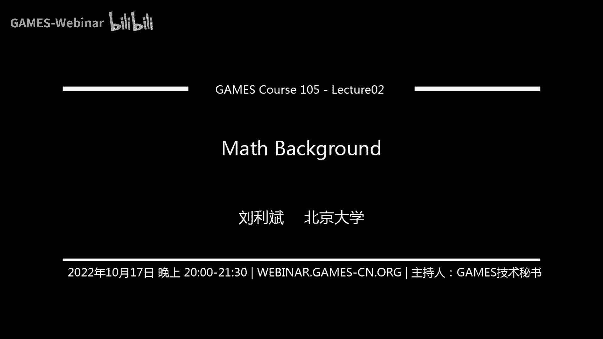
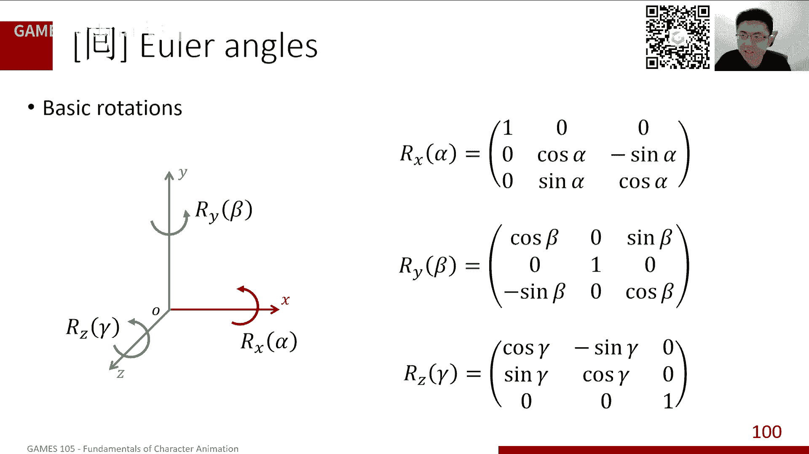
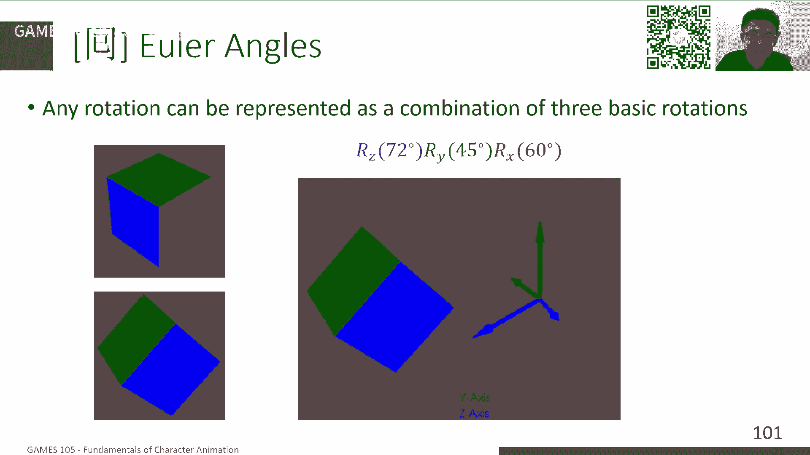
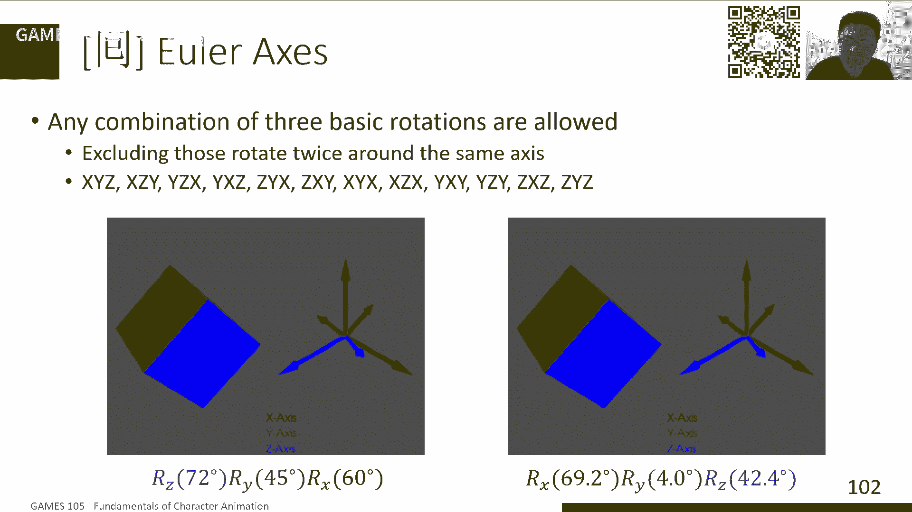
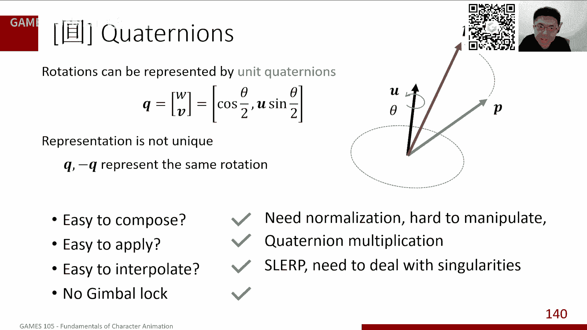
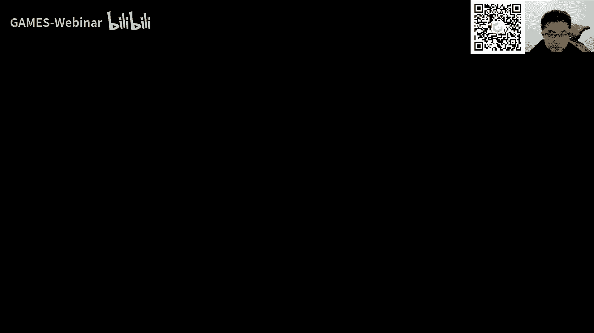
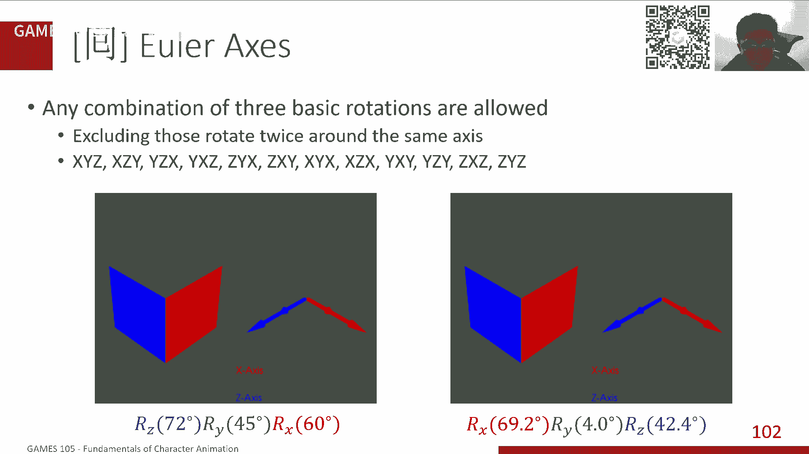
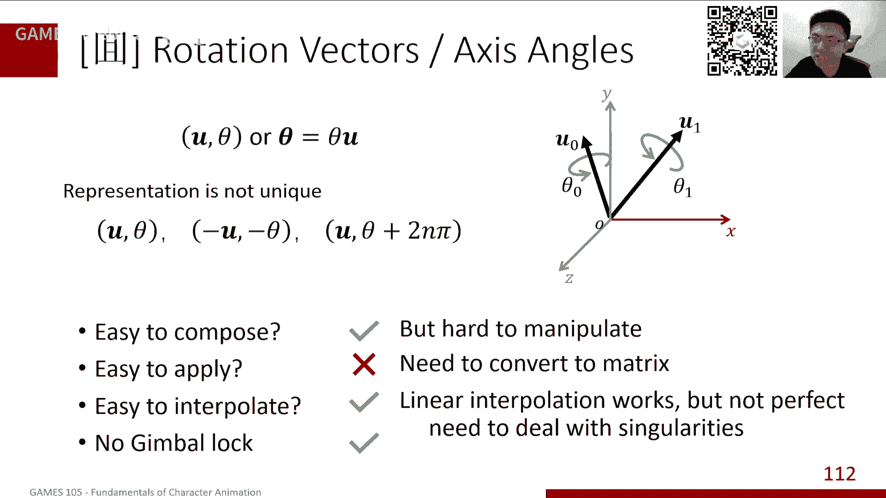

# GAMES105-计算机角色动画基础 - P2：Lecture02 Math Background - GAMES-Webinar - BV1GG4y1p7fF

啊那看起来没有什么问题的话，那我们就开始上，今天就开始上课，ok对我突然看了一下上次这个录的视频啊，就是其实我发现很多同学这个有有一个建议啊，好像是上周我们视频里的这个啊，就是我放的那个视频。

就是p p t里面是用好声音太大了，所以说加上我这个话筒声音不是太不是太理想，所以说可能有些同学在那个放视频的时候，会好像好像受到了一定的惊吓，这个这个这个这个我只能说很抱歉啊，这个下次我会注意一点嗯。

那当然今天这个我可以保证的是我们今天的啊pp里边是没有视频的，所以大家可以放心的把声音调大一点，因为我发现我的这个话筒好像调到最大，也就是这样一个状态了啊，所以说大家如果实在听不清呢。

可以这个把那个声音调大一点啊，然后那个等我们上传视频的时候，我再试试想办法去把那个整个视频的声音再去调整一下，ok那我们开始今天的这个课程，当然今天实际上我们按照大纲的话。

一个部分是这个动画里边的数学的background，然后另外一部分会简单讲一点关于浅项运动学，角色前向运动学的这个内容啊，当然这个我其实做这个准备ppt的时候也是做了一些调整啊。

然后也是觉得这个数学的部分还是比较多的，然后呢我觉得还是把这个极限运动学的部分跟放到下节课，就是跟我们这个逆向运动学放在一块讲，整体来说这个也是更加完整一些，所以说我们今天的主要内容啊。

其实是首先是一个对线性代数的一个简要的回顾，那当然我们不会回顾这所有线性代数中的部分呢，我们只会简单的回顾一下，就是跟我们这个角色动角色动画相关的一些内容，另外一部分呢其实可能是比较重要的一部分。

就是说我们会比较详细的讲一讲这个在动画里边，或者其实在图形学里，in general图形学里边用到的这个三维旋转的不同的这种表达方式啊，其实回字有四种写法，其实这种常用的三维旋转其实也至少有四种。

其实还有更多一些，我们可能有时间的时候，也会在更多的介绍一些，ok那我们就是回到我们的这个线性代数的基础部分，那这块的话我们会稍微过得快一点，因为属于大家都比较熟悉的部分，但是如果大家对这不熟悉呢。

那我其实也是建议大家这个我就再去翻一翻书啊，这个应该是这个大学1年级上半年就开始讲一些内容嗯，那当然为什么我们还要会讲一下，这也是因为就是这门课本身。

我希望还是能够把它变成一个所谓的这个self content，就是我们所有的内容都可以在这个ppt上找到，那当然我们也前面一部分有一些ppt呢，也是这个就是参考了game 201和game 103。

就是这个颜林奇老师和王浩敏老师的这个非常好的一个课件，ok那我觉得实际上最关最基本的一个概念吧，从线性代数里面概念，因为线性代数我们学的是什么，我们其实叫线性代数使用，我们学的都是线性空间里的各种量。

那这里边其实最基本的一个量就是vector，就是向量，那对于我们来说就是一般来通常的定义就是说向量是什么，向量是一个同时具有大小和方向的量，那当然在我们这个这门课里边。

我们会用这个粗体字来表示一个向量啊，那当然这个向量的长度或者向量的膜或者向量的这个大小，还是用这样一个这个这个双双线的符号来表示，那向量的方向其实也是在我们可以对应一个限量进行正啊，normalize。

对它进行这个归化来得到它的这个向量的方向，那当然对于向量来说，我们其实有一些特殊的向量，就是它的模等于零的时候，它是一个所谓的单位向量，那当然如果大家发现我ppt里边，比如说有些这个项链没有标出。

大家就是这个就理解一下，因为我这个也比较多了，有时候可能确实会确实会容易忘掉，那向量其实在图形学里其实可以表示很多东西，其实不只是图形学，那首先现在我们可以用来表示一个位置，我们可以用来表示一个速度。

我们也可以用来表示一些其他的一些更高维的特征，比如说运动的一些啊，比如神经网络，我们可以提取的一些英雄特征等等等等，那这里面其实向量本身我们并没有要求它是一个，比如说是不一定是一个三维的量。

它也可以是一个可以是个高温的量，那当然这里其实通常来讲我们讲用向量来表示位置的时候，我们其实还是假定了一个事情，我们是假定这个这个向量本身代表了从一个坐标的坐标系的原点。

指向这个点的这样一个这样一个向量的值，那当然向量其实有些一些基本的这个加减法运算了，大家都知道的这个两个向量相加呢，其实就是沿两个向量的方向分别移动一下呢，得到一个新向量呢，就是两个相加相加的值。

那当然向量本身是满足这个交换率的，就是a加b和b加a其实是得到的值是相等的，那类似的我们可以对向量进行数乘，那其实就相当于把向量的长度增加一些，然后以及可以更加复杂的复合的各种呃计算。

我们可以竖成一个各加减法合在一起，那在我们通常来讲，我们一个向量可以表示成一个啊一组数，就是一个一个数的一个一个一个数组，那对于我们这里来说，我们其实会把向量表示成一个列向量。

反正就是一个一个一个列的这样一个数字，那在这种表示情况下，当然对于一个n维向来说，那其实里面就n个数，从a一到a n，那对应的它的这个长度或者它的膜。

其实就是每一个每一个组成圆的平方的一个平方和再开根号，那当然实际上在对于三维来说，实际上我们可以这三个数其实就代表了在这个三维笛卡尔坐标系下的，这个坐标值啊，其实呢这样的话其实我们也可以很容易写出来。

对于三维一个三维点或者对一个三维向量，那我们可以找到它的位置或者找它的长度，那当然我们这个很多时候我们也去，虽然说有些时候写a x a y和ac，但我们就是经常也是会把它写成a1 a2 a3 啊。

来代表x和y和z这三个三个轴的这个这个坐标，当然在这样一个坐标的表示之下，我们前面的对于向量的计算，我们可以很容易地写成对于向量里边每一个啊，每一个分量的这这这种加减乘除的运算，但对线来说。

我们其实可以定义一些其他的运算，比如说点乘，其实我觉得点乘这个定义还是比较容易想到的，因为你想如果两个两个向量分别是有n个元素，那么除了前面的加减乘除运算以外，那么很自然的会想到一个运算。

就是说我会把两个向量分别对应那一啊那一个分量把它相乘，然后再加起来，那这其实也是也是这个所谓的这个点乘的定义，那点成为我们通常也是可以也会把它叫做内积或者叫叫标量级，因为它乘出来的结果是一个标量。

那同样我们大家从这个新代数也，是了解到这个点乘实际上会何为，这个首先满足这个交换率啊，同时也满足集合力量，然后另外还有就是点乘的每个向量对于他自己的点乘，其实得到的是它的这个模长的平方。

当然对于这个在欧式空间，其实通常来讲，这个这个点乘具体代表什么含义，其实不是太容易这个说明，但是对于欧式空间，就是欧式空间，就是我们平时这个遇到的这个三维空间，二维空间或者更高为扩展的这样一个空间。

在欧式空间里边，其实点向量的点乘它的几何含义，实际就是代表了这两个向量之间的角度的关系，特别是来说时间，就是说比如说a的a乘b a和b的点乘，那么他的所得的值其实是他们俩各自的长度的基因。

然后乘以它们俩夹角的这个coser，那这个其实是通常来说我们会用它来去寻找两个向量之间的这个啊，这个角度，其实我们刚才也提到了，因为一个向量可以表示一个高维的一个特征，那比如说我们很多时候。

比如说想想要做一些像是风格转换，那我们其实就是一个非常重要的一个特点，就是非常重要的一个问题，就是说我们如何来用一个把风格描述成一个高维的向量，那我们在做风格迁移的时候。

实际上我们是想要让迁移出来那个动作，它所生成的这个特征向量跟我们某一个以动作的分隔线缆，这个尽可能的接近，这个接近，其实也是用这个用这个内积或者他们俩之间的夹角来进行衡量，那当然有这样的定义之后呢。

我们其实计算这个夹角就是比较容易的，就是他们俩的点乘，当然我们要特别注意的是夹角其实我们是要求他应该是一个单位向量，那我们其实可以把每个向量进行这个单位化。

然后再去算一下这个它的这个cos 2 cos的值，那对应的如果a和b是垂直的，那其实对应的它那个点点击也是零，那他cos theta也是零，那同样的我们其实也是就是点成了另外一个含义。

也是我们可以找到其中一个向量在另外一个向量方向上的投影啊，比如说a在b方向的这个投影值其实就是a点乘b的方向，那就b的方向是什么，b就是b的方向，就是b除以b的这个模长，得到的就是这样一个方式。

类似的b在a方向的投影也是可以这样计算的，那其实有点成也相关的一个这个物理量，就是所谓的这个差成，当然跟点称不太一样，就是说因为点击我们是可以定义在任何任意高的维度上。

而插成其实差成一个will def，差乘时间就只只考虑三维，那剩下很多时候我们就是很多问题，就是说我们偶尔会遇到一些情况，我们可以把三维的这个叉乘的定义去扩展到更高维度，但是很多大部分情况下。

当我们需要用的时候，它其实就是三维向量之间的差乘，那当然现在的差乘有好几种定义了，其中一种定义就是说我直接写成这样的一个component，就是这个分量的这个乘积，然后做差这样的形式。

就是当时看起来是非常非常这个没有什么规律啊，但是就是还是有规律的，但是只要说可能一眼看上去感觉比较乱，那这个其实我一般来说还是会有一种比较简单的技法啊，就是因为我们把它因为插成出来的是一个向量。

然后向量的每一个分量，比如说x分量，那它对应的这个就是每一个项，其实都是以就是两项的两个乘积的差的形式，那对于x分量的这两项分别就是y和z的分量做乘积，然后做差，然后对y一行，那对应的就是z和x。

其实它对应的是x y z z和x z x y这样，的一个这样一个比较呃循环的这样一个顺序，这样其实也是比较容易记的，那当然另外一种定义向量的方式，就是说我们知道两个向量的啊，定定义这个插成的方式啊。

就是两个向量的叉乘，那其实它生成了一个新的向量，这个向量是跟前面两个向量都垂直，然后同时这个新的向量的方向是由这个右手定则来决定，比如说我从呃。

比如说a差b a差成b那么这个从我用右手从a向b的方向抓过去，然后大拇指指的方向就是这个生成它得到了这个结果的方向，当然虽然说这是一种，定义了就是它其实也是代表了这个加量差成的一些几何的特征。

那当然这里其实有一个问题啊，我其实个人觉得其实这个定义反而是不是那么直观，因为这里边你看还出现了cos，还出现了sn，还出现了三角函数啊，这个其实是挺容易想到的一个一个定义。

其实这个关于这个插成定义是怎么来的，我其实还稍微查了一查，但是我比如说这个维基百科上其实提到了，就是说差成实际上是四元数运算的一个副产物，就是这个哈密顿当年发发明四元数运算的时候，他发现里面有个差成。

然，后这个这个这个这个运算结果会把后来被单独拿出来，然后变成了一个专门的一个定义，当然这个是不是最早的，我其实也不知道了，但是大家如果有了解更多的话，也欢迎这个可以在我们这个群里啊。

或者在哪可以可以可以发给，但不管怎么样，我觉得从定义来说，可能这样一个直接从分量去做定义的话，这个可能是感觉更加自然的一种方式，但不管怎么样，这两种方式就是差乘和叉乘的这个几何含义其实是一一对应的。

那当然差乘有它自己的一些这个运算规则，其中最基本的就，是差乘得到的结果是跟差成的两个量就是是是互相垂直的，那这其实也相当于得到了，比如说c点成a就是c是a h b的这个结果，那c点成a和b都是零。

然后另外一个是插成的，但是它是在交换了之后，它是符号是相反的，然后还有另外一个非常重要的，就是它是非常非常跟其他的一般预算很不相同的一点在于，差成是不满足分配率啊，不满足结合律的。

对不满足结合律由是a差成b差成c和先算a hb再算结果的差，c这个结方向是不一样的，所以说这是，一个不同的查证结果，那通常来讲我们会用这个插上做什么呢，其实非常重要，非常常用的一个应用。

就是说我们用叉乘来寻找与跟a和b都垂直的一个一个方向，或者来或者另外一个角度上，也是说我们其实是找，因为a和b是两条直线，两条向量，我们其实a和b是可以扩张成一个平面。

那我们其实可以用叉乘来找到这个平面，它的法线的放量，那当然其实我要写成这个，我其实想一想，a a a也就是方向的差生，那得到的应该也是个方向，当然这个是不对的，其实你要是仔细想一想。

因为那个插成插成的那个计算其实是是两个向量相差啊，趁这个长度相乘，然后还有一个sz的，所以实际上如果这么算的话，其实得到那个n并不是一个方向向量，所以说这个其实还是要特别注意一下。

有时候确实有时候脑袋不带脑，脑袋迷糊的时候很容易就搞错了，那正常来讲，我们做叉乘，我们要寻找一个方向向量的话，其实应该是a乘b的a a叉乘b，然后再对这个结果进行规划，但这里就有一个要求啊。

就是说a和b肯定是不能是零啊，首先它不能是零，其次a和b是不能平行，的为什么呢，因为如果a和b是平行，我们可以证明可以很容易证明这个它们的差乘的值啊是零，比如说当a b都不等，都不等于零的时候。

a叉b等于零，其实等价于是说a和b是平行的，a和b的平行是什么意思呢，就是a等于一个标量乘以b那这个标量可能是正的，也可能是负的，那当然插上有很多常见的应用啊，比如说一个非常遇到的一个经常遇到的问题啊。

就是说我们如何去找到一个旋转，其实这个在什么地，方经常会用到呢，比如说我们做一些，比如说我知道这个人的腿和脚的位置，然后我想知道他腿的这个比如他大腿的旋转多少，才能把这个腿转到那个地方。

这其实是经常遇到的一个问题，那当然这个问题其实实际上这个问题其实想想是多解的，并不是只有一个解，不是理论上来说，我们可以对这个a和b之间做一个角分角平分面，然后在理论上在这个评分面上，所有的方向。

所有的一个向量都是可以作为这个旋转轴，然后绕这轴一转就可以把a转到b的这个位置，其实可以最简单，的想一想，比如说这个位置是一个a和b的这个啊角角平分线，就是比如说是是这样一个轴a和b的角平。

大家可以看到鼠标了，我也可以看到a和b的角平分线，那这样的话实际上我可以验证这角平分线转180度，那时间就把a一当成b了，但实际上通常来讲我们想要的是什么，我们是想要找一个旋转最少的一种一种一种旋转。

能够把a选了b，那这种情况我们就需要用到叉乘和点乘，因为这个点点击a。b，它其实给我们的是说a和b之间的这个夹角，然后这个角其实是，我们所有能够做的旋转里面最小的一个角，那为了能够把a旋转到b。

那么其实可以把a。b做一个a和b做一个差乘，得到的这个方向就是我的旋转轴，有时候我把a到b能把a旋转到b的一个这样最小的一个旋转，就是把a叉b的这个方向作为旋转轴，然后旋转飞度。

那得到了这样一个两个旋转，那另外一个问题，就如果说我们知道一个啊向量a然后我想把它沿着某一个轴，这个轴是用u来表示，又是一个方向，沿着一个方向旋转飞，do，然后它旋转到了b，那在这种情况下，b应。

该是b是多少，但这个其实乍一想好像很难计算啊，就是不知道怎么算，但其实想一想，就我们这里其实也是不会做更多的这个证明，我们就直接用到一些结论，其实可以很容易地想到。

因为这个如果说我把a沿着这样u这样的一个旋转轴进行旋转，那么a所经过的轨迹肯定是在一个跟u垂直的一个平面上的，其实是这样的一个大概是这样的一个平面，那当然在这个平面上，实际上我转的这个角度。

就是这个a和b分别和这个u垂直线的这个夹角，那其实就是我这个u的一个旋转角度，那为了能够计算这个实际的这个a到b的位置，其实我们可以把这个这个位移做一个拆分。

就是可以想象就是我们可以把它a到b这样一个位移拆分成，首先沿着一个垂直于u的方向，同同时垂直于u和a的方向进行一些位移，然后再沿着同时垂直于这个u和刚才那个位移的方向再反了一个位移。

那么这个方向是怎么定义呢，一个方向前一个方向就是u差成a，那我得到的是一个其实大概是说是沿着这个这个这个这个里边这个圆，它的切线方向进行一个位移，然后另外就是说沿着这个切线相垂直的方向再做一个位移啊。

这这两个位移的方向一个是u差a这是切线方向，另外一个方向是这个u差成刚才这个切线得到一个新的方向，那这个方向也是跟u和这个同时垂直的，那其实我们可以把它写成u差乘u差乘a，因为这个v是等于u差a的。

那当然其实这里还是特别注意的是，因为这个东西是不满足结合律的，所以说我不能写成u x u再查a，因为u x u本身是零嘛，其实就不再是一个正常的值了，那当然这里其实我只是定义了方向。

那接下来其实问题是说我到底应该沿着两个方向移动多少，那我们其实可以把这个就把这个因为它这两个构成一个平面嘛，我可以把这东西直接画在平面上，就这里其实这个蓝色这条线。

这个a其实是a向量在这个平面上的一个投影，那类似的b其实也是在b向量在这个方向上投影，那这样v和t实际上是我需要走的这样一个长度，那这里有一个c下角时间是我这个整个这个旋转的转轴。

那这个其实就可以比较容易看出来了，就是说因为我们知道这个沿着垂直的方向，在这个中间这个加点是c的情况下，那我沿着垂直方向移动的距离，那应该就是啊这个这个线段的长度乘以coffee飞的。

当然这个线段的长度，因为它是在这个点上的，projection在这个投影的长度，这个投影的长度我们其实可以看到它其实是a和u夹角的sin值，然后乘上a的长度，其实他就是刚好就等于这个差乘的这个这个长度。

那同样的沿着这个方向移动的距离，其实这个前面这一小段这个距离是可以看到的，它其实是应该是a的长度，因为a b和b长度是相等的，这个这个长度乘以cos theta是得到了这一小段的距离。

那所以说我需要移动的距离就是一减去cos，然后乘以这个前面的一个系数，所以总的下来的话，我们其实可以很可以最终可以得到这样一个阶段，就是v移动的距离。

其实sin c的乘以u叉a那t的话移动的距离是一减去cos c的，然后加上这个方向，那整个把它放在一起，其实这就是罗德里格旋转公式，就是看起来很复杂，但实际上我们推一推，发现机制还是比较容易推出来的。

那其实最终我得到b和a是有这样的一个关系的，就是b的位置其实是a加上一个沿着切线方向的位移，位移的大小是三in sa，但是还要承担一乘上这个u和u差a的这样一个长度。

然后另外一个就是沿着这个垂直于切线方向再做一个位移，大概是得到这样一个公式，那当然我们前面提到了，就是说我们可以在一个把一个三维的一个点，或者三维的一个向量表示成一个三个坐标的形式。

那这里其实我们隐含的其实怎么呢，我们是把一个把一个其实我们是隐含的，我们定义了一组正交基，那就分别是沿着x轴方向和y轴方向以及z轴方向，那当然对于这个自费者来说，特别是其实我们是有这样一个作为蒸汽机。

我们是有一些基本的要求的，就首先每个机向量它的这个长度应该是一，同时这三个正交基它的每两组之间的差额点乘应该是因为互相垂直的，所以说它点成应该等于零，然后另外其实还有额外的一个限定，其实也是要求。

也也是这个右手系的一个基本要求，就是说x差成y等于z，那其实其实也是刚才那个循环规定，就是y x上z等于x等等等等，当然在这样的正交基表示之下，那我们其实知道一个向量。

它其实就是这一组正交基的一个线性组合，我们可以用这个那这个线性组合的系数，那其实就是我们的系，这就是啊就是我们这个向量的这个这个这个这个坐标值，那在这样一个定义之下呢，我们知道a。

b其实我们可以直接写成这个两个啊向量，这个就是坐标表示啊，就是两个向量的这个这个向量表示，然后进行点乘，那这个我们再把它展开之后，我们可以得到一些这个ex。一。

ex就是自自呃自己和自己做点击的这样一个组合，以及一些这个自己不跟自己做点击，就是x。y或者是y等于z这样的组合，那这里其实可以很容易的，因为前面我们有这样的定义，我们可以知道这个后面。

这一项其实它应该等于零，因为它是正交的，那直接就这样就直接得到了我们这个点乘的这个这个对应的公式，时间叉叉也是类似的，就是我们其实前面插成很多时候，其实我自己也是有好多人记不住，那技术怎么变怎么办呢。

就先推一遍啊，因为确实这个按照我们只要我们大概了解一下这个插成的基本规则，就是说这个满足分配率呃，但是不满足结合律不是满足对满，但是不满足结合律，然后以及这个x差自己差自己等于零。

然后这个x x y等于负的x y x x等于它就等于等于，z那其实我们可以最终得到的这个其实可以回到我们前面啊，所遇到的那个那个那个量，那个查找的公式，ok那前面讲的是向量。

那么还有另外一部分就是关于矩阵，其实我觉得现在可能跟很多人很多，这个因为我现在也在学校上课嘛，我发现跟这个现在的这个大一的新生有很已经开始有代沟了，每次我说矩阵，其实我想到的是什么，我想到黑客帝国。

但是发现这个现在这个大一的这个学生，因为都已经0304年出生，都没有看过黑客帝国，哎呀这确实有点代沟了，那当然这个矩阵这个黑客帝国这个电影还是挺不错的，大家可以建议还是有时间可以看一看。

当然矩阵并不是黑客帝国了，他也用了这个matrix这样一个名字，当矩阵我们其实在定义上来说就是一个二维的一个数组，那当然二维数组我们其实，就是就比如三维的一个三维的一个矩阵呢。

其实就是一个3x3的这样一个数组，那我们可以把它写成三个列向量，就是每一列我可以把它认为一个向量，那类似的我们可以把每一行也可以作为一个向量，那其实可以写成这样的形式。

那此外呢我们知道这个向量一个三三维的向量，一个n维的向量，它本身也是一个数组啊，sir它本身也是一个矩阵，只不过他的这个只有一列的这样的一个矩阵，那当然矩阵有一些我们就是有一些特殊的一些形式。

比如说这个单位阵，那就是对角线只有对角线上有元素，然后是一，然后以及像是对角阵，然后比如说对称阵，然后另外还有一个比较特，就我们也经常会遇到的，就是所谓的反对成整形式，大概是大概是这个样子。

就首先对角线上是零，然后其次就是次对角线和这个是互相，就是和他的对对对称的位置其实是取相反数的这样一个这样一个关系，当然矩阵有一些基本的运算了，其中比如说最基本的是这个transpose，就是转制。

其实就是把行和列做一个交换，或者把下标做一个交换，那对于这个特殊矩阵来说，因为前面三个对于这个其实都是对称针，那对称阵基本的这个性质就是转它的转置率。

它本身那对于反对战争这个skill symmetric就是他的转职，其实是它的相反数，这个是一个挺啊稍微不太一样的一个点，那矩阵的乘法是稍微有一点点复杂的，我们知道这个啊矩阵就是乘积的一举乘积。

它们两个矩阵的乘积肯定还有一个矩阵了，那这个矩阵里的每一个元素，其实是这个a矩阵的某一行和b证对应的列做点击，然后得到那个数其实会放到这个乘积矩阵的这样一个位置上，那矩阵有一些基本的计算性质。

也就是a b和b a做成分别做的是他俩这个得到的结果是不一样的啊，不同的矩阵，但是呢矩阵的乘法是满足这个结合律的，也就是a b c a乘b乘c，我可以先算任何一个。

然后除此之外转制对于矩阵来说是a乘b的转置，等于b的转置乘以a的转置，哎我发现这个其实我发现之前还面试过一个人，这个他居然连这个都都都都都会忘掉，也是也是比较不应该，然后对于矩阵来说。

我们可以定义它的逆，这个逆就是说如果两个矩阵的乘积是单位整，那么这两个矩阵互相为对方的逆，同样来说对于矩阵来说，a乘b这个g的逆等于b的逆，乘以a的逆，就当然它要求是a和b都是可逆的。

那这样矩阵的这样一个运算的情况下，我们其实可以很容易地把，比如说点成比如说这个差成我们可以写成矩阵形式，那点乘的矩阵形式，其实因为每一个向量我们都把它写成一个列向量。

那么它的点乘其实就是列向量的转置乘以另外一个列向量啊，类似的，因为这个点乘是可交换的，那么其实可以写成那个b啊，b的转置乘以a的这样一个形式，那对于这个叉乘来说，因为插成我们当时定义的时候。

它其实是一个g一减掉另外一个g，然后这一个向量的一个形式，那这个其实我们可以整理一下，我们是可以把它写成一个一个这样的一个矩阵，乘以这样乘以另外一个b的一个向量形式，这样一个形式。

前面这个矩阵其实可以很容易看到，它是有一个非常明显的一个结构化的特征，那它是一个反对真正那前面我们提到反对反对真正的一个结构，就是它的转置是它本身，那在这个结果我们其实经常会做一个简单的写。

就是简化了写，就是这个反对阵，我们可以因为它本身是a的三个，它本身是a的差乘所对应的法律，真正并且它里边的这个三个，因为这里是有三个呃非礼的量，这三个量是a的三，刚好是a的三个三个三个分量。

所以说我们可以用一个符号，但这个符号其实每个教材啊或者是课本其实肯定用的不太一样了，但是我们这里其实简化一些，就把用这样一个监控号，然后下下面有一个差，那不代表它是a的一个差乘矩阵这样的一个形式。

那当然在这个矩阵的形式下，比如说a叉乘b我们可以写成a的叉乘矩阵，乘以b得到这样一个形式，那类似的a叉乘b呃，呃先b差成c，然后再用a去查成那个结果，我们可以写成a的查成矩阵。

然后括号里边是b的长成矩阵，然后查成c，那其实还是可以的，因为是有考虑到这个矩阵是有结合律的，那它自然就等于a叉乘b乘c，我们可以写可以这样的一个运算，那其实预算也算实际。

我们可以写先算a的差生局乘以b的差乘值，再乘c再乘上c，那得得到这样的一个结果，那特别一个特特例，就是如果b跟a是相等的情况下，那么其实可以这样的一个运算，a叉乘a叉c。

那它其实等于a的差乘矩阵的平方乘以b，那这里其实大家可以想到，可能有些同学有些同学已经想到了一个问题啊，就是说其实我刚才也是提到了，差成其实是不满足这个结合率的。

也就是说那这里其实如果我算a差成b插成c，那他是是不是也是就是从前面这个这个这个推导来说，如果说因为差成矩阵是满足集合的啊，分分呃算结合律的，那是不是说a长成b长成c。

它也等于a的差乘矩阵乘以b的长成长成c呢，那当然这个乍一看好像好像是这么回事儿啊，但是你仔细想想其实是不对的，为什么呢，因为这个叉乘矩阵是代表了前面这东西作为一个向量的时候。

他写成矩阵形式对应的这个这个这样一个矩阵，所以实际上如果是a查成b插成a先查成b，然后结果他成长成c，它所对应的这个查成矩阵应该是什么呢，应该是hb得到一个向量，而这个向量再写长生就这样形式。

所以这个跟前面这个跟前面的这个这个这个值是其实不一样了，所以说其实这个并没有，就并没有说我们前面结合率是不对的啊，这个其实还是还是依然是不满足结合律的，那当然在这样一个拆成矩阵的这样定义之下呢。

那我们其实再回顾一下，我们刚才这个沿着一个轴就把一个向量沿着某一个轴旋转飞他脚，那这个过程实际上我们前面是它是表示成一个叉乘啊，和一个sign的一个形式，我们可以把它写成，把这个把这个矩阵提出来。

把这个叉乘写成矩阵，然后把这个整个这个a的这样一个位置给提出来，那么其实可以得到这样一个公式，那这个公式实际上还是这个罗德里格全战模式，难道只是写成一个矩阵形式了，或者再进一步的，如果说我们再说。

更清楚一点，其实它是一个旋转矩阵，它代表了什么呢，它是代表了我沿着空间里边任意一个轴，这个轴的方向是u，然后旋转一个角度sa，但这要求这个这个这个u本身是一个单位向量，然后在这样的情况下。

它所对应的旋转的旋转矩阵其实是可以用这样的公式来算出来，其实是这样子，其实这公式看起来挺复杂，但其实也是这么来，那这个矩阵我们其实还有一些特殊的矩阵，比如说这个最我们最常用的，我们这门课经常会用到。

就是所谓的这个正交阵，那这个这页ppt其实是他可能上过其他的课，可能会比较熟悉，当我们一般说正交战它带了它的定义，其实它的定义本身应该是下面这一列，就是说它的正交阵是什么，正阳镇是说呃，首先它的每一列。

它的这个所有列是互相正交的向量，构成正交的向量，那当然正交的时间每一行也是这样的向量，然后在这样一个定义之下，那么其实可以得到最下面这个这个性质，就是说这个正交阵它的转置乘以它自己是一个单位针。

或者再或者说就是这个正交阵它的逆等于它的转置，这是其实正交正一个非常常用的一个性质，然后另外一个就是说这个矩阵的一个运算就是求它的行列式，那这个具体行列式其实这个定义是比较复杂的。

当然这个可能我们这里就不做赘啊，不做这个更多的介绍了，我们只是对一些比如三维的这样一个这个矩阵，那它的行列是相对来说比较容易计算的，对于三维的矩阵呢，想列式来说，它其实因为行列式是一个数值。

是这个在这个矩阵上进行一系列运算得到这个数值，对于一个三维矩阵来说，这个元素的乘积的和，那其实这个得到这个值就是它的行列式，那行列式本身也有一些呃，非常常用它的性质，比如说单位间的行列式是一。

然后两个方矩阵的乘积，那它这个它乘积的行列式应该是等于每个行列式啊，每个啊矩阵的这个行列式的乘积，然后以及一些这个比如转制本身是转制和他自己的行列是相同的啊，然后以及逆的行列式等于行列式的逆。

那这对于我们这来说，其实有一个非常重要的一个性质，就是说一个正交正，它的行列式是正-1，他可能是正一，可能是-1，但是不可能两个都是了，就是我随便拿一个正交正，那它要么是一，要么是要么是-1。

但为什么什么时候正一，什么时候-1呢，这个取决于我的向量的顺序，也就是说实际上对于我们刚才提到的这个正交机，就是在满足这个右手定则的情况下，那它的这个先行列式应该是正义，那否则应该是-1。

然后另外就是说还是刚才回到了，就是这个这个插成我就插成，经常是有好一种方式来帮我帮人记忆，还是怎么怎么做的，其中另外有一种方式就是来把它用行列式的计算来来把它写出来。

其实我可以把这i j k就是它对应的是三个啊，xyz 3个轴上的这个正交基，那我可以把它写成一个3x3矩阵的形式，那么可以做一次，按照我们这个行列式的运算规则，那么其实可以得到前面同样的一个公式。

就是差成了每一个component，每个分量，分别是什么，那我们最后一个关于这个啊矩阵的一个性质，或者一个特这个这个这个运算就是它的特征值，那我们知道这个一个矩阵对于一个方阵来说。

如果说我们有一个非零的向量，它满足a乘以x等于lx，或者说a乘以x跟x是共线的，那么我们在这种情况下，我们知道这个lambda这个lamba是a的一个特征值，并且对应的x是这个a的这个特征特征向量。

那当然怎么算的，lana和ex的话，那我们大家这个我们就大家可以去找，去回忆一下当年这个新年代数的课本，其实对于一般的矩阵来，说其实算这个拉布拉和这个其实挺麻烦的，因为它需要经常会解一个高高于方程啊。

其实也就是说其实对于这个大于三阶的矩阵来说，基本手算是不大现实，除非这个矩阵本身是有一些是一个点赞，是一个有经过设计的这样一个这样一个形式，但对于我们来说，其实有一个结论是比较重要的。

就是对于一个3x3的正交阵来说，或者说其实不一定3x3的，或者对于任何一个鸡刺鸡刺的这样一个奇数阶的这个正交阵，那么它一定会至少有一个十的特征值，那这个特征值是什么呢，那这个增值它的它要么是一。

要么是-1，然后但这个正-1是就是跟他的这个这个行列式的值是相同的，这里是一个具体这个结论啊，但是这个具体证明我们这里就不就不展开了，其实也是很容易可以大家可以可以可以在那个信息代数书上找到。

ok那前面我们就再简单回顾了一下，我们需要用到的一些线性代数的基本知识，特别是这个向量和矩阵的一些基本运算，那我们接下来第二部分呢，我们来回顾一下关于这个transformation。

就是变换的一些一些内容，当然我们这里其实关注的主要还是刚性变换，那什么是变换呢，其实我们是了解其实变化就大概我们可以分成三种类型，一种飞行是平移，一种类型是旋转，还有另一种，还有另外一种类型是缩放。

其实我们所有的变化都是可以通过这三种子，就是单独的变换进行组合来完成，但这里，其实有一个问题，就是说平移和旋转是不会改变一个物体的形状和大小的，但是这个缩放，因为它顾名思义嘛。

它其实是会改变我这个形状的这个比例和大小等等，那对于我们一般的人来说，其实比如说我们动物啊，其实我们的骨骼是一个刚性的，我们在运动过程中，实际上我的胳膊是可以旋转的，可以平移的。

但是唯一就是不能不能缩放了，你让我给我发生缩放了，那估计是这个事故就比较大了，也许也许是也许是出车祸了等等等等，那所以说我们这里其实主要还是关心两个部分，一，个是这个平移和一个是旋转。

那当然其实缩放我们也是实际在定义上来，就是计算也是比较简单的，因为我们知道这个把一个物体沿着三个轴进行缩放，那其实它对应的这个运算等价于我把这个点这个向量乘以一个对角阵。

那对角阵上三个元素对应的是我的这个呃，在每一个轴上的缩放的这个这个大小，那对于平移来说，首先是非常简单的，因为它就是线性的，就是我如果说把一个物体把它加了一个平移，挪到另外一个位置上。

那这个物体上的点的位移啊，在新位置上，这个物体的，点的位呃，这个这个向量那其实就是它原来的向量加上这个平移哎，等于t那同样的，如果说我们有多个平移，得到一个新的位置，a撇撇a两撇，哈哈哈。

然后它这个其实这个得这个总的这样一个平移，其实是前面两个平移的一个和，这是平移的一个性质，因为平a非常简单，就是一个线性的，所以说我们其实也不用多，不用不用更多的进行讨论，那另外一个方向就是旋转的。

其实我觉得这个三维途径学故事，三维，动画其实我觉得很多时候大家搞不搞，搞不定的地方，其实主要还是旋转，因为旋转是非常讨厌的，因为首先它是一个非线性的东西，其次呢。

它这个他在这个这个这个就是这这这有限旋转和无限性和非常无限，小旋转，其实它的性质还不太一样，那当然旋转来说，比如说我就是直观来说，比如说我一个有一个box，有一个这个方块，我把它做了一个旋转。

那它这个方块上的一个点被就是被这个旋转带着走了，那这个得到一个新的位置，那这个为新的位置坐标和原来的位置坐标，其实它是可，以用一个旋啊，用一个旋转矩阵做这个矩阵乘法的了。

那其实是一个基本旋转的一个一个性质，那当然旋转矩阵有一些基本的性质了，首先旋转矩阵一定是一个正交阵，那满足正交阵的性质，也就是它的逆等于它的转置，然后同时它对于它的转置应该等于单位阵。

另外一个就是说作为正交阵，它的行列式要么是一，要么是-1，那对于这个旋转矩阵来说，它一定是正一，然后但其实这也是说明其实是旋转矩阵是不会改变，所以轴的顺序，另外就是说旋转矩阵本身是一个刚性变换，就是它。

是保持这个旋转前后的向量的长度的，就是r乘以x，它的模长应该等于x，这个其实也很容易证明了，因为把你把这个模长写成这个转置相乘的形式，其实可以很容易得到这个结论。

那另外一个就是说我们如果需要把两个旋转进行这个组合，就比如说我这个物体，我首先用r一来把它旋转，得到中间的这个这个这个形状，然后在终端形形状的基础之上，我再把它旋转r a2 ，然后得到一个总的旋转。

那这个总的旋转应该多少，那是等于r一乘以r吗，那这个显然是不对的，但是也不是，这么显然，但这个很多时候我们说他对或不对，可能就是很多时候是一个语言上的，基本上是一个阅读理解题，从我刚才这个描述来看。

其实r一乘以二是不对的，那应该是反过来，应该是r2 乘以r1 ，为什么呢，因为r2 的这个旋转是在r一旋转完之后进行的，所以说它其实是r2 要成叠加上r一的这个旋转的这个这个效果，所得到的是这样的一个。

所以说对于旋转来说，它的combination，它的这个组合时间就是旋转矩阵的乘积，那当然要注意一下顺序，那对于我们常用来这个旋转来说，我们，其实有一个最呃，因为我们这个这个对于一个正交值啊。

对一个比如三维空间来说，那其实我可以很容易地定义沿着坐标轴的旋转，那它是可以写成一个类似于这样的一个三角三角函数的一个形式，当然这里其实因为比如说沿着x轴旋转的话。

那其实旋转之后这个向量本身的x的坐标值是不会发生变化的，那对应的这个x这一项呢其实就是一，那其他那两项就是就是sin和cos的一些组合，那如用这样的一些基本的这个旋转矩阵。

那我们其实可以构，造更加复杂的一些旋转矩阵，比如说这里就是说我可以把一个还有一个方块，通过沿着x轴转60度，再沿y轴转45度，再沿z轴转72度，那就会得到一个新的一个位置。

其实是从这个位置转到下一个位置，所所需要经历的这样的一个一个旋转组合。

那当然其实我们前面这个旋转组合就是它虽然是做的很复杂了，做了三次旋转，首先转了60度，再转45度，再转72度，它的结果其实等价于什么呢，等价于我在我是沿着某另外一个旋转轴，就是这样一个u，但这个旋轴是。

计算出来的五沿这个这个轴转81度，它得到的这个旋转跟我前面这个转三次的，它旋转是完全相同的。

那这其实也是代表了什么问题，就是说诶不好意思，其实这个说一个这个旋转的一个旋转轴的概念，为什么我们刚才不断提到，我们会为什么会回顾到这个矩阵的特征值和特征向量呢，其实而且我们也提到了。

对于这个智能家政来说，它总会有一个特征向量是一啊，对于旋转矩阵，但是一但是一般矩阵可能有-1，那我们其实可以知道，至于因为对于特征向量是啊，特征值是e的，特征向量。

那它所对应的这个r比如u是一个向量的话，那这个r u一定等于u，也就是说明什么呢，说明这个向量或者这个方向在我们在旋转的过程中，它是不变的，所以这个不变量其实我就对刚好是对应于这个旋转的旋转轴。

所以说其实另换一种说法，就是说实际上这个旋转我们是可以把它认为是一个，就不管前面这个旋转是怎么来的，我可以转多少次，最终得到这个总的旋转，它总是可以表示成沿着一个坐标轴旋转一个角度这样的形式。

但这个坐标轴本身一定是这个旋转矩，阵的这个对应于特征值是等于一的这样一个特征向量，这是一个旋转矩阵，那当然一个问题就是说当我给了一个旋转矩阵之后，我该怎么去找一个这个旋转轴以及这个旋转角度。

但这也是很多方法了，其中一种方法就是可以简单推一推，比如说我们这r u乘以等于u那么其实因为这个r是旋转矩阵，所以它的逆就等于它的转置，那么其实可以把r的逆乘乘上两边，得到右边这个公式。

然后这两个东西这两个方向就是互交换一下位置，做个差，其实可以得到r减去rt乘以u等于零，这样一个形式，那r减r t a得到了这样一个这样一个矩阵，那这个矩阵我们已经很熟悉了，前面已经见到好多次了。

他是一个反对任，那我们知道一个反对称阵总是可以跟一个正啊差成建立关系，所以说其实我们可以把它写成一个差乘等形式，那我们知道两个两个向量叉乘等于零，那代表什么，代表如果是这样。

或者是在这两个向量都不等于零的情况下，这个差乘等于零，这件事情就代表了这两个向量是共线的，那这里其实u肯定是不等不等于零的，因为u在我们定义定义里边，它，应该是一个单位向量。

那这个u p如果在它不等于零的情况下，我们其实是可以认为是啊，就他跟u是同一个方向，那我们其实可以进一步的就是说从u撇，我们因为他们的u是从一个方向的，那么其实可以把对u对进行一个正加了单位化。

把它这个单位化之后能得到这个向量其实就是我们的旋转轴了，咱这有个要求，就是说u p必须是非零的，那什么时候是零呢，就是r和r就是旋转矩阵本身是一个对称阵的时候，它这个对应的优撇是零。

那学生组织什么时候是对称，真的，其实这，个旋律里面大部分大部分情况是不是对称，真的只有在一些特殊的情况，这个特殊情况就是说当我沿着某一个轴转了0度，那转0度其实它就是一个单位证了，或者转了180度。

那这个时候他其实得到的是一个对称轴，那大家自己可以验证一下，但这个结论其实我们也可以从前面的这个罗德里德公式，罗罗德里格公式可以也可以很容易地得到，因为我们知道前面已经推了半天，其实已经推到了。

如果说我沿着某一个轴优旋转c的角度，那我其实得到那个旋转矩阵应该是有这，样的一个形式，它前面这一半是一个反对，是反对称阵，后面这一半其实是一个对称针，那我其实可以很容易得到r加减掉r的转置。

那其实可以得到这样的一个形式，那同样呢我们其实可以进一步得到从这个r减去r的转置，我们可以得到两个sin对的，所以说实践可以得到这个u的，其实这个u的长度就是两倍的sin c的，那会进一步的话。

我们说c的是多少，那c的就是1/2这个长度，然后这个它的arc那个ark sign，ok那这其实我们可以得到一个旋转，这个，旋转轴和旋转角度，那这个基础之上呢也不是这个基础上。

就说我们其实是从另外一个角度来看啊，就是说实际上一个旋转它代表什么东西呢，就如果说一个一个方体，它被一个旋转r转到了现在这个状态，那么这个方体上正方体上一个坐标在原来的没有旋转的时候。

它这个坐标是x撇y撇c撇这样一个点在学生之后，就他在这个随着钢铁呃，这个这个立方体一块动的这样的一个局部的一个正交基的表示一下，它的表示还是不变的，它还是x撇y撇c撇，那当然这个点在于在整。

个世界坐标系，或者说在原在这个原来的这个标准，真压器的表示其实是x p发表和c表，因为他们的表示其实代表同一个向量嘛，所以它只是表示着这个方法不同，那所以我们其实可以得到这个可以把这个正压机。

这个把它写成一个矩阵，然后进行一个做一个做一个平移啊，再做一个这个这个这个这个球逆，那其实得到了就是我们旋转矩阵，或者说我们旋转矩阵代表了什么呢，我们旋转矩阵代表的是说从一个局部坐标系。

由这个随着物体一块动的这样一个局部坐标系，它上每一，个点的坐标值，把这个最高值转化到全局坐标系下的时候，所需要的就是全局坐标系的那个坐标值，和这个原来的坐标值的一个可能关系。

就是这样一个旋转矩阵来给出的，那如果说我们这个里边这个这是一个transformation，这是一个变换，它里边同时有旋转和平移，那这种这种情况下，我们其实可以我们做做作为变换。

其实从这个啊物体坐标系的一个点转移到全局坐标系的时候，我们其实是需要考虑到平移的过程，那他说反过来我们需要把一个点从一个全指标系转移到局部坐标系，那我需，要把那个点先减掉这个平移。

然后再乘上这个相应的这个啊旋转矩阵的逆就是就是就是它的转置，那这个关系其实是我们会后面会经常用到的，为什么呢，就是因为我们做的这个特别做前向动力学或逆向动力学啊，这个局部到全局或者全局到局部的转换。

而且实际上我们是在一个change一个链，就是一个一个骨骼，这个这个这个这个这个链式结构上进行做的，所以说实际上我们要不断要做很多次这样的转换，才能把一个点转换到，一个全局坐标系的表示。

好那我们到现在我们前面主要是回顾了一下关于线性啊，现代数以及我们坐标纸纸啊，以及这个这个变换或者刚性变换的一些一些内容，因为前面也提到三维旋转，其实是就是整个图形学或者是我们在动画里边非常麻烦的一个量。

因为主要原因是因为它是非线性的，那对于三维矩阵来说，三维旋转来说，实际上我们也是有很多呃，发明了很多不同的方法去表示它，就是说回字有四种写法，其实这个我自己找了找，其实第四种写法是比较难比较罕见的。

以至于好像好多这个这个这个字体都没有，只有宋体才有这个字，所以说这是但是我们这个只是用它来做一个做一个做一个做一个标记，那我们还是回到前面那个问题，就是我们前面一直提到旋转可以表示成一个正交矩阵的形式。

对于一个一般的矩阵，我们知道3x3的矩阵，它是一个它有九个元素，那对于这个郑家镇来说，因为郑家镇其实有额外的要求，他是要求呃矩阵本身乘以它的转置等于单位阵。

那实际上这样每一个这样其实是我把这个因为矩阵乘矩阵得到，是另外一个矩阵嘛，所以说这个美生成的矩阵也是一个3x3的矩阵，它是九个量，所以每一个量其实对应一个方程，那这个方程里边，那这些又代表什么。

代表实际上我们虽然有几个参数，是由其他参数来决定的，或者说再进一步的具体一点，就是说啊在这个正式一点，就是说这个我们的自由度，我们的degrees of freedom，它就是三。

那这个其实自由度就代表了，我需要多少个参数才能描述某一个某一个某一个物体或者某一个东西，那当然其实我们想想，其实前面还提到，我们还有一个另外的一个性质，就是说对于旋转相对来说，对于一个旋转矩阵来说。

我们还是要求它的特征值啊，sorry他的那个行列式应该是正义，而不是-1，那当然这个行列式这个事件并没有引入这个，虽然它引入了一些约束，但他只是说让我的解空间从两半变成了一半。

所以它其实并没有进一步的减小我的自由度，所以说这个我们整体的自由度还是散，当然我们这里还有另外一个问题，就除了前面这个啊啊这个这个向量的问题，我们其实我们经常在动画里边，我们还经常会遇到一个问题。

就是差值，就比如说对于一个平移的差值，比如说我在t0 时刻，我在零时刻的时候，我这个方块的位移是x0 ，我在一时刻的时候，方块的位移是x1 ，那我们其实经常会需要做什么事情呢，我们如果说我们只有这两针。

比如我们在动画里面只有这两帧的这个位置，那我们需要算一个补间动画，就是从从0~1这段时间内，我需要计算一下这个这个方块在哪里，那这个时候我们就需要用到差值，那对于这个平移的差值其实是比较简单的。

我们其实可以很容易用一个线性差值来进行实现的，那这个差值我们可以看到它有一些一些基本性质，首先对于任何一个t来说，x t肯定是一个合法的平移，其次呢对于这个线性差值来说，我们其实可以很容易地证明啊。

它的这个速度就对t的导数就是它的速度是一个常数，当然常数有些时候可能不是最好的，所以我们想要的，但是对于常数，如果他能是常数，其实说明至少我们是可控的，所以这是这个对于这个平移的差值的一些这个特点。

那类似的，比如说我们有两个旋转，我在这一时刻它的旋转是二零，在啊在零时刻旋转是r0 ，然后在一时刻它的旋转是r1 ，那这种情况下，我们其实也是需要做一个差值，但这个差值就更加复杂一点。

就这个差值也是说我们对于t时刻在零和10~1之间的一个t时刻，我们想要去计算一个合适的这个旋转，然后这个旋转刚好是r0 和r一中间，这个二零旋转和r一旋转中间的某一个值，当然这个。

时候我们会发现线性差值就就大概是不work的时间，我们试了一下，它就是不word，我们可以举一个非常简单的例子，就是说比如说我们可以写一个旋转矩阵，是沿着y轴旋转-90度。

那大家如果其实回忆一下刚才我们那个三个基本旋转矩阵的那个公式，那它写成是大概是这样一个形式，那对角线它就是一个不是调夹，是在这个另外一个对角线上的一个一个一个矩阵，那同样的。

如果说我们把这个r一是一个沿着y轴旋转正90度，那其实对应的这样一个矩阵，其实可以发现这两个，矩阵其实刚好是反对称的，所以在这种情况下，如果我们直接对这个矩阵的这个单位进行差值，会发现一个什么事情呢。

就是比如我们取0。5，那会我们会发现0。5的两个的差值刚好是等于这么一个矩阵，那这个矩阵首先他肯定不是一个，它肯定不是一个正交阵了，而且是就是你就可以看到，其实他因为零零非常多嘛。

它本身其实是个不可逆的了，所以都不用去提这个正交阵的问题，所以实际上如果说我们用线性差值去旋转，用差值出来得到这个矩阵乘以这个这个这个这个box，这个立方体的话，你会发现这个地方体它会一边转一边压扁。

因为本质上来说，这个这个矩阵其实就是一个缩放矩阵，而且其实是在x和z方向缩放，是缩放是零，那其实它就是会会会压扁成一根，应该是会压扁成一根线，然后再再又呃放开变成一个变成一个矩阵来变成一个正方体。

所以这个其实就不是一个非常好的一个一个差值的形式了，那么其实我就说到这件事，就是回到了我们什么样的一个差值方法是一个好的插值方法，那首先我们是希望这个差值的这个过程在每一时刻。

都应该得到的是一个合法的旋转，那当然许攸没有什么表示了，他可能是一个不同的这个合法形式，合法的定义是不同的，但是我们希望它的每一时刻都是合法的，就不会出现我这个转着转着这个就就就变形了。

然后又变回来这种问题，另外一个就是我们也还是希望这个旋转，它是比较以一个定啊常数的一个旋转速度来进行完成的，就这个差值也是最后最好不要说，比如前面转的快，中间转的慢，然后后面又转得快啊。

这其实是一个不太好的现象，就虽然还是那句话，虽然说常数不一，定是最好的，但至少它是可控的，就说明我们想要实现某些效果的时候，会更容易实现一些，那这样我也回顾一下。

对于一个直接用旋转矩阵来啊来表达一个旋转的，这个其实有很多问题，首先这个旋转矩阵本身是很难构造的，因为它是首先它有九个九个完全没有什么意义的参数，就不能没有直观意义的参数，其次在构造过程中。

我们还是要求它是一个啊，要是一个正交阵，那其实我们每调一个参数，其实我其他的参数也要相应的变化，所以整个来说构造起来是比较有难度的，当然对于，旋转角来说。

我我把这个旋转矩用这个旋转矩阵的表示去旋转一个向量，那是非常容易的，因为本质上旋转就这么定义的，就是矩阵乘以向量就得到了一个旋转，另外一个就是这个用旋转矩阵直接进行这个旋转的差值是不太容易的。

至少线性差值是没有什么好办法可以把它插的比较呃，比较漂亮的，所以这是旋转矩阵的一个基本一些基本问题，但实际上后来我们很多这其他的几种啊旋转的表达方式，其实都是在去解决这个旋转矩阵这个问题。

就是旋转表示的一些问题，比如最常，用的一个就是所谓的欧拉角，我们刚才也提到了，其实对于我们三维旋转，我们可以定义一个所谓的基本旋转，就是沿着x y z3 个坐标轴分别的这个旋转。

这个旋转矩阵我们可以很容易很容易的把它写出来。

那其实可以证明就是说任何一个旋转，我们都是可以把它表示成三个三个不同的这个基本旋转的乘积，或者说其实刚才我们已经举过这个例子，就是说我们要实现从上面一个方块选择下面的方块这样一个旋转。

我们其实可以通过沿着x轴转60度，再沿着y轴转45度，再沿着z轴转72度这样一个方式来实现这个旋转。

那当然实际上这个旋转的这个方式是有很多种，实际上对于欧拉好拉角来说，实际上它是允许任何一种，其中不是连着两次沿着一个方向旋转就可以了，就什么意思，就是我连着我不能先转x再转x，然后再转z。

那这其实我前面两次转x是，其实等价也是一次一次旋转，所以在这样的一个约束之下，实际上我们可以找到12种不同的旋转方式，比如最常用的x y z，然后x y这个y减，x等等。

然后它其实也是允许问我在这个过程中绕着某一个周转两次，比如说绕着x转两次，但是这里要求是啊，这两次旋转中间要隔着另外一个轴，那所以说刚才那个旋转我们先沿着x转60度，再沿着y转45度，再沿着z转72度。

那我们其实可以等价的变成了先沿着z转42路，然后沿着y转4度，然后再沿着x转转62度，当然欧拉角其实有一个问题是什么呢。

就是说实际上好像很多人就是很多不同的地方，不同软件它可能会follow不同的convention，就可能有不同的这个对，于jo呼拉角定义，因为我们前面提到，比如说先沿着x轴转多少，再沿着y轴转多少度。

我们沿着到底沿着哪一个x轴，因为这里随着物体的旋转，其实它也会它，因为一开始物体它的x y z，它局部的x y z的轴跟世界坐标是重合的，但是随着我的旋转，这两个就变得不重合起来，随着对奥拉甲来说。

实际上我们常用的也不是常，它就就就就有两种convention，一种是说我是在每次旋转的时候沿着那个旋转轴，这个旋转轴是物体局部的旋转轴，比如说比如说我先着，先沿着x转，再沿着y转，再沿着z转。

其实对于左边这个视频来说，它其实是每次都是在这个局部坐标系，你可以看到这个这个旋转的方向，然后另外一种就是所谓的这个定固定固定旋转轴模块叫ring rtation，其实是一样的，就它是每次旋转。

当我当我说沿着某个轴旋转的时候，实际上我是沿着世界坐标系的某一个轴旋转，那这其实我也是同样的做了一个先沿着x轴旋转，再沿着y轴旋转，再沿着z轴旋转，让大家看到第一次做x轴旋转的时候。

它其实是因为两个轴重合，所以它其实旋转是，相同的方向，但是沿着y和z旋转的时候，它其实是并没有沿着这个里边这个小的这个小坐标轴，它的旋转进行这个它的嘴巴轴进行旋转，而是沿着这个世界坐标系的这个旋转进行。

当然对于这两种方法，其实它旋转的效果其实是就是说我们都同样还是能实现相同的，这个就还是能实现所有的这种这种旋转的表达，那对于这种第一种就是当我比如说先沿着x再沿着y，再沿着z进行旋转，诶这是不是写反了。

哦对没错，就是先进的x再沿着y z沿着这z旋转，它所对那个旋转矩阵其实是rx乘以r y乘以r z这样的顺序，然后对于右边这种它是反过来的，其实回想一下我们前面那个combination。

就是那个旋转组合的时候，就是我们那个r为什么是r乘r1 ，而不是r一乘r2 ，所以这个地方其实对于这个固定的旋转轴，固定的实际坐标系的旋转轴，实际上当我说沿着x轴转，再沿着y轴转，再沿着z轴转。

那时候他所做的这个顺序其实是rz乘以r y乘以rx，所以大家有时候在看到一些软件的时候，比如说玛雅，比如说玛雅，其实就是说它的x y z是指的是前面这种，然后unity unity其实有点怪啊。

就unity其实你是当你它有一个选项了，就是你可以选local或者global，那对应的是一个固定坐标轴，或者是一个随随物体动的这样一个旋转轴，那当然unity本身的x y和z就是你看到它的unity。

比如说我去调一个物体的这个奥拉角x y z，其实那个xyz并不是x y z这样的顺序，如果没记错的话，他好像是y y x z的这个顺序，就是这个其实也是要注意一点的。

是a real是啥样，我就不知道了，因为我不太熟，当然这个欧拉角其实有一个非常重要的问题，就是所谓的这个万向锁，这个万向锁其实就说因为我们三个轴可是随着物体进行转的嘛。

那么其实在某一个方向上其实会出现一个什么问题呢，就是这两个旋转其中两个旋转轴会贡献，那在贡献的情况下会出现什么问题，就是说我们会丢失一个自由度，就是其实这两个图都是那个维基百科上这个这个摘下来的。

其实右边这个就是一个万象万象锁的一个例子，就是在这个半箱锁的情况下，其实如果说我这个飞机想要让它这个顶上，那个方向进行自转，你会发现它是转不了的，因为这个时候他缺少一个自由度，但本质上来说。

万象所只是在这个只是我我想要真的去动它的时候，才需要有才有这个东西，就实际上如果说我真要让这个飞机这个在外面旋转，我们可以是确实可以直接加一个全局的一个一个一个旋转矩阵上去，那他还是能够转的。

他只是在当前这个机械铁战线还是转不了的，那就是另外一个角度，就是说万向锁会带来什么问题呢，因为它有两个轴是重合的贡献的，那么就意味着什么呢，在这种表示之下。

这两个轴只要这两个轴它们的这个旋转角的和或者插满足某一个量，就可以实现这个旋转，而这两个轴本身是赚这个数值是多少，其实是可以随意变的，那这大概是什么问题呢，就是说实际上在这一瞬间。

我的这个旋转的表示是不唯一的，就它还不是那种x2 派的，是相同的这种不位移，而是它可以是随便一个值，这种这种不为一，那其实也是带来什么问题，就是说当我们去把一个矩阵，把它转成一个欧拉角表示的时候。

你会发现在这个地方它会碰到一个齐一点，所以说这个是就是其实也会带来一个表示上的问题，这是一个跟blog就是万象解锁的一个茂名，所以回顾一下欧拉角其实是我们最常用的一种，或者实际上就是在我们大部分软件里。

其实我们去调一个物体的这个旋转，基本来说都是极优拉角的，那当然我们欧拉角因为我们知道它一个旋转我们至少需要三个两，那其实我俩就刚好有三个参数来进行表示，那跟王老角当我们只定义角是不够的。

我们其实还要定义是每个角度它所对应的这个旋转顺序，对欧拉角来说，我们其实有12种不同的旋转顺序，以及两种不同的convention，然后这是这个欧拉角的定义，当然对于欧拉角来说。

首先我们是比较容易去用拉角来实现一个旋转的，特别是我们其实可以很容易地在那个ui界面里去进行调整，另外来说实际上欧拉角，因为它刚好每个欧拉角都是对应一个沿着某一个坐标轴的旋转。

所以说我们其实把它用这个欧拉角去旋转一个物体啊，算去旋转一个向量，相对来说也是比较容易的，当然我需要做三次这个这个矩阵乘法，那另外一个问题，就是说我们可以很容易地在欧拉角的表示之间去做这个差值。

我就直接三个三个坐标值进行差值，就就就做线性差值就可以了，那当然这个当然首先是这个差值本身是可以保证我生成的这个旋转，还是一个合理的旋转，因为他还是一个，因为奥拉教理论来说。

这三个角的取值是这个可以是这个正正负无穷，都是在这个实数集上取值，那哪有一个问题，就是说我们在做差值的时候，还是需要去处理所谓的基点问题，基点问题是什么呢。

就是因为欧拉角它是来自于三个对三个这个旋转轴对三个分量的旋转，所以说实际上我们可以看到这个啊，比如说阿尔法加上阿派还是对应的相同的旋转，也就是说对对这个旋转来说，我们至少阿尔法和阿尔法加阿派加。

或者阿尔法加2n派都是相同的旋转，那这个时候你做差值的时候要特别小心一点，因为有些时候比如说一个人他在不断的这个原地打转，他转一圈之后，你会发现你做差值的时候尾，其实你如果处理不好的话。

你会发现你的人在转转转的时候，他突然就反向转了一圈，然后再继续转下去，这是为什么呢，就是因为欧拉角在你在某一时刻，比如它是大于大于零，接近于pad，但是在某一车它超过派了之后。

它的表示可能会直接变成了复牌，那你如果在直接在派和复派之间做一个差值，你会发现这个人就瞬间反着转转了一圈，然后再继续往前走，所以你的差值的时候需要处理一下这个问题，而另外一个问题就是说。

欧拉角它其实有一个所谓的这个万向锁的一个问题，那除了欧拉角以外，另外的还有一些，还有一种就是常用的这个常见的，毕竟是常用的，常见的这个旋转表示就是旋转矩阵啊，sorry轴角表示或者叫其实对应的也是。

其实也是对应于这个旋转向量的这样一个表示，我们刚才其实已经提到了，就是任何一个旋转，我们总是可以把它变成可以把它分解成，或者把它提取出一个旋转轴和一个旋转角度，那这种情况这个旋转轴加上旋转角度。

那自然就形成了一个轴，一个表示这个轴表示就是轴角表示，那或者再进一步的，我们其实可以把这个旋转轴，因为它旋转轴是一个向量，是一个单位向量，然后角度是一个啊一个实数，那么其实可以把他俩乘起来。

得到一个得到一个向量，这个限量其实就是所谓的rotation vector，就是这个旋转向量，其实旋转下面和旋转这个主角表示其实可以很容易互相转化的，我只要去求一个模，然后做一个正确的。

所以做一个这个单位单位单位化就会做到这件事情了，那当然我知道一个轴角表示一个u和fa，我去旋转一个向量，其实不是那么容易的，我们其实是没有办法，就是我们其实，是需要做做这个变化的话。

我们是需要把这个旋转首先转化成一个旋转矩阵，会用这个罗德里格斯啊，罗德里格公式，罗里科罗德里格旋转公式，或者是把它转化一个旋转矩阵，或者用这样一个插针点乘的方式才能去把它进行运算。

所以这个其实在运算上来说还是有一定的这个复杂度的，另外一个问题，就是说旋转向量加上旋转向量得到的那个值，并不等于这个两个旋转的组合，这也是特别注意的地方，就是就是它其实这个组合本身是不容易算的。

比如说比如说我有一个旋转a比，如说一个旋转，一个旋转b分别表示旋转向量的形式，我要想找到一个旋转向量c，然后它对应于这个a和b的旋转的组合，那我其实能做的方式也只能是说把它们分别转化成旋转矩阵。

做一个乘法，然后再转换回来，只是基本基本是唯一可行的方式，所以说对于旋转矩阵来说啊，对对旋转向量或者主角表示来说，我想做这种啊旋转组合其实比较困难的，但是另外一方面，其实旋转向量是比较容易去做差值的。

比如说我有一个旋转a，我可以把它这个第一个选项，这个这个旋转向量c，零和另外一个选项c1 ，那我们其实可以直接做一个线性差值，那这个线性插值结果首先他得到的还是一个合法的旋转向量。

因为旋转性本身我任何一个向量都可以表示一个合法的旋转，不管它是零或者是什么一个奇怪的值，但是有一个问题就是说什么呢，如果说我只是简单的做这样一个线性差值，它其实是不保不保啊。

不保证我的这个旋转速度是恒定的，那这个其实证明起来就比较复杂了，我们这里就不讲了，但是确实是有这样一个结论，但是如果说我们想要为了实现一个这，个这个固定速度的这样一个旋转。

那这个其实计算起来就比较复杂了，其实还是可以通过旋转矩阵，旋转向量来实现，当然我们需要怎么做呢，我们首先先计算一下旋转向量零和旋转向量零一之间的差，然后把这个差转化成一个旋转向量。

然后再去做这个在这个差的旋转向量和零之间做一个线性差值，然后得到了其实是一个新的新的这个旋转，那从这个新的旋转我们可以进一步的得到我们所得到的差值，这个旋转，那这个其实是可以保证它这个旋转速度是恒定的。

那这个计算就，比较复杂了，所以总的来说呢，我们其实旋转向量也是可以很容易地表达一个矩阵旋转的，因为我们也知道一个旋转其实它就是一个旋转，沿着某一个轴旋转某一个角度这样的形式。

所以旋转向量和轴角表示其实也是很自然的，但是对于这个表述来说，同样的它表示不唯一的，首先这个轴角和我轴和脚分别取负取相反，是同样一个旋转，另外就是让这个这个角度本身加上2n派，它也是对应相同的旋转。

所以实际上这个首先旋转矩阵啊，就这个旋转的主角表示或者学生向量表示它，其实是比较容易构造的，因为我随便拿三个数过来，它就是一个合法，不好意思，他是一个合法的旋转，但是相对于奥拉甲来说。

这个我这个旋转矩阵其实是不太容易去去这个去去创建的，就是虽然说我随便找三个数，就是一个合法的旋转矩阵，但是如果说我想让某一个物体旋转到我想要的一个角度上，我靠旋转向量或者主角表示是非常困难的。

然后另外就是说这个旋转向量它本身是没办法直接去旋转一个啊矩阵，一个一个向量的，我们总是需要把它转换成一个旋转矩阵才能去做，这件事情，然后另外对于旋转向量的线性差值是可以实现一个旋转的一个差值的。

那当然它并不是完美的，就是特别是首先我需要去处理这个几点问题，就是前面这个特别是说这个因为在加二派的时候，我们需要处理一下我们到底是在哪一个二派范围区间内进行插值。

另外一个问题就是说它的这个就是直接我去做一个线性差值的话，它其实并不能保证啊这个旋转的速度是恒定的这样一个性质，那最后呢其实是我们也是非常重要的一部分，就是这个cturning就是我们的四元数。

这个四元数就是实际上其实其实我们很多时候也是拿来用一用，但是我们其实还是会最好稍微了解一下，关于四元数的一些定义和基本计算，虽然说怎么来的这样一个问题。

当然四元数其实它的出发点就是来自于是对二维旋转的一个扩展，因为我们知道二维旋转我们是可以很容易地把它表示成一个负数的，就特别是比如我在把负面认为是二维坐标啊，坐标系。

那么这个负面是复平面上一个限量的啊旋转，那其实刚好是对应一个单位负数，那这如果就是因为这样的话，其实我们可以只付出了很多计算，我们可以很容易的就是可以进行进行计算，那如何把这个东西去扩展到三维。

其实这个就是非常难的一个问题了，这个不是那么直观的，就是二位是比较紧的，三维就就一下子变得难了很多，所以实际上之前有一个人，有一个科学家，一个数学家叫哈密顿，我们后面会提到，其实哈密顿还是做了很多事情。

他就花了很多时间来干这件事情，那段时间我们可以其实在我们知道答案的情况下，我们就可以简单回顾一下，那首先一个复数我们通常把它写成a加上b乘以i，还是一个负数的一个标志，一个单位。

那他基本一个性质是i的平方等于-1，那为了把它扩展，那我们其实可以很显然我们可以再加一个，再加一个量，再加一个g我们可以要求这一类的平方也等于-1，但是这和i是不相等的。

那其实我们就把这个负数稍微扩展了一点，那类似的其实我们可以进一步的扩展，比如说再定义一辆k，那这个k的平方也是-1，同时k的i和j也是不相等的那一类，我们可以定义无限的定义出去。

那当然对于这个cturning，对于四元数来说，实际上我们就就是形式上来说，差不多就是负数的这样的一个扩展，但它是i j k有三个复数的这样一个机理，然后这个辅助基地本身是满足一些性质的。

首先每个的平方等于-1，其次三个系列的乘积合成一起也是-1，但这个其实就是我们定义了，就像那个负数单位一样，为什么i的平方等于-1，没有，为什么他定义就是这样子，那当然它带来一，些很好的性质。

这是我们比较喜欢的，那另外就是说我们它是满足一些，这类似于这个坐标轴差成的这样的一个一些性质，比如i g等于k那反过来j乘以x等于负k的这样的一些关系。

当然前面提到的这个哈密顿其实是是一个非常有名的数学家，物理学家，就是这个大家可能我们这门课后面会涉及到一点这个啊拉格朗日力学，但是这个哈密顿其实是后面他还有另外一套方法，就是去去重新用哈密顿量。

它定义就是提出了一组哈密顿量来重新定义这个啊，重新把这个力学体系，给公理化，当然哈密顿量如果大家学量子力学的话，会经常用到的，因为在那边是那边一个非常常用的一个工具。

但是哈密顿花了很长时间来想这个三维的旋转该怎么表示，因为就是怎么去把一个二维的负数给扩展到三维旋转上，直到有一天他在一个桥上散步的时候，诶突然灵感爆发，然后想起了这个这样一个表示。

那最后把他就是为了纪念这件事情，他把这个这个这个东西刻成一个扁，还踢的那个小声，所以这是这个也是他自己认为这是他最大的贡献哈，那当然这个，但其实这个，前面这个定义。

前面i j k的这个定义其实就已经定义好了，我这个次元数他的各种计算的一些规则，比如说对于四元数来说，类似于负数，比如复数有共轭，那四元数其实也是有共轭的。

因为复数的共轭就是它虚部的负号取负号得到的共轭，对于四元数来说，因为有三个西部，那么实际他的工作就是三三个西部分别取符号那类似的，比如说做这个啊，现在这个这个标量的乘法或者加减法，或者是点乘。

或者是这个这个啊nb这个这个发型啊，这个这个叫什么来着，范数其实都是类似于我，们的那个复数的定义其实都是这样一个啊，其实可以就是一些线性向量的一些计算，那这里其实稍微有点麻烦一点是什么呢。

是这个四元数的乘法，因为四元数的乘法，因为每个四元数都是写成a b c d，然后乘以i j k这样的一个形式，所以说曲线我们可以用分配率，然后加上我们前面提到的对于i和j和k这几个复数啊。

标记在这样一个这个运算关系，我们是可以最终得到它的向量差，两个向量对两个四元数分别是a b c d，它乘乘积还是个算数，那这个四元数其实是比较哎，呀写的比较比较乱了，大概其实是每一项是这样的一个形式。

那他这个结界比较乱了，所以说实际上我们经常来说还是会把它这个四元数稍微剪辑一点，因为我知道虽然数是x啊，w前面是一个标量，加上x y z分别是对应i j k上的一个坐标值。

那我们实际上可以把q把这个这个算数，我们就直接写成一个一个标量w和一个w呃，这个这个xyz方向它认为是一个三三啊，三维的一个一个单位，一个向量写成这样的一个形式，那在这种情况实行之下呢。

其实我们还有一些扩展，比如说，一个标量本身它其实也是一个四元数，只不过它里边这个向量的部分是零，然后类似的一个项链，我们也可以认为它还是它也是一个四元数，只不过它的标量部分是零。

或者这东西也叫一个纯四元数，那在这样的基础定义之下，那么前面那堆东西可以重新再写一遍，就是这个比如说共轭，那我其实只有向量部分去取复，然后这个标的部分是不变的。

然后其他的其实计算其实就是非常非常简单的向量运算，然后在这种情况下，我们可以看到乘法乘法它其实前面那一堆很复杂的公式，其，实最后变成了类似于这样的一个形式，看起来比较简洁了，那这里其实可以发现。

其实这个这个向量的部分的，在成绩里边解呃的值其实是前面部分加上一个插成，所以说就是为什么插成其实为什么插成是从这儿来的，就是也是因为前面那堆奇怪的公式推一推。

最后发现其实这个对应的这部分其实刚好对于差成为形式，那当然其实他就是四元数的很多性质其实跟矩阵是相似的，就是这个q一乘q2 是不等于k2 乘q e的，但是呢它是满足，结合律的这跟前面差乘是不一样的。

这是跟矩阵的乘法是相同的，就是我q a乘q2 乘以q3 ，我们是可以可以随意去结合来进行运算，那类似的就是类似于这个转制，这是机人的转制，我们知道这个嗯溯源数的这个共轭。

比如qq乘q2 的共轭等于q1 ，q2 的共轭乘以q的q一的共轭就刚好反过来，然后类似的这个像是啊就是它的这个这个范数的平方，其实也是这个每个点就是q的啊，共轭乘以q本身。

那另外一个就可以类似于这个这个相反呃，逆袭阵我们其实也可以定义一个，一个四元数的倒数，四元数乘以它本身等于一的时候，这里两个四元数相乘等于一的时候，那这两个数互相互相等于倒数，那对于四元数来说。

q的倒数等于q的共轭除以q的长度啊，平方就是这个就是说其实这也很容易可以从前面的四元数的运算，乘法的运算规则里得到，那这些在这些定义基础之上呢，我们其实更关心的是什么呢，更关心的是所谓的单位四元数。

也就是它的模长，它的长度等于一等这样的四元数，那但对于任何任何一个非零的四元数来说，我们是可以同很容易的，把这个它它本身除以它的模长来得到一个单位四元数，单对单位四元数来说。

其实它有点类似于我们前面学的正交阵，单位四元数的逆等于它的功，或者它计算是非常简单的，就是这个把它的向量部分取一个负值，那只是单位算出一个非常好的一个性质，那其实我可以回顾一下，我们其实对于负数来说。

一个负数，它其实单位复数就是模长等于一的负数，它其实是构造啊，会分布在这个复平面上的一个圆环上，就这个这个一个一个一维的圆环，在二维平面上，那当然他可以写成一个sin。

和cos sin函数的形式把它写出来，那类似的对于一个单位四元数，一个单位四元数，因为它是一个四个啊，它具有四个四维的一个量，因为v是v是一个向量，是一个三维向量。

w本身有额外一位是他是一个四维的一项单位啊，单位单位的点，所以实际上所有的单位四元数如果把它看成点的话，每一个看成一个点的话，那它其实构成了一个四维空间上的一个单位求和。

所以这是一个单位四元数的一个一个就是跟那个一个平面，这个选这个圆环的一个类比，那类似的我们其实可以把单位，岁数写成一个类似于这样的形式，相对于cos 2分的fa，它是一个对角数啊，sorry。

这个这个这个三角函数以及一个向量部分是一个u这样的一个方式，那为什么这么写呢，我们后面大家可以看到，那回到其实我们对于任何一个单位四元数来说，我们总是可以写成这样的一个形式，其实主要还是因为什么呢。

因为w的平方加上v的长度的平方等于一，这是这是由我单位这个单位长度决定的，所以我们其实这样它的平方的和等于一的话，那我们其实可以一部分是cos，不是sin，我们，总是可以把它写成类似于这样的形式的。

那这里其实有几个量，首先是sa，另外是u，这u是一个单位阵啊，sorry是一个啊单位向量，然后fter是一个类似于角度的一个东西，所以我们可以看到它其实是跟我们的轴角表示有相同的数量的信息。

我主角表示也是一个向量代表轴，一个单位向量代表轴和一个fa代表的角度，所以实际上他俩他俩共用的真心，所以啊涉及到的信息是相同的，并且但是唯一的不同点就是优势，在不同的形式上，主角表示就是轴夹角。

那四元素其实是cos，然后这样一个，乘积的形式，那实际上这样一个对应其实也是带来一个结论，就是说我们任何一个三维的旋转，那首先我们能把它变成一个轴角表示，其次我们可以把它对应到相应的单位四元数。

就可以直接把一个轴角表示转化成对应的四元数表示，那这里就是sa，但我知道四元数时候其实可以这么c他啊就是或者反过来的，我知道这样一个四元数他写成w和v这样的形式之后，我其实可以得到它对应的轴角表示什么。

它fa是可以通过这样的方式进行计算，然后u其实对这个v做一个这个这，个这个单位换啊，其实可以得到，所以说实际上就是任何一个轴角，任何旋转，它所对应的轴角跟一个四元数是可以对应的。

当然这个对应并不是一一对应的，但是它是一个满射，那接下来呢就是说如果说在这样一个表示之下，我希望我有一个单位的单位四元数，然后它所对应一个轴角，我希望对于这个轴角表示的对应这个旋转。

把一个向量p做做一个学生之后得到了一个p撇，那么p p和p之间是什么关系，这个其实是可以直接有一个结论的，但是这个推这个推的过程我就不讲了，这个结论就是说p因为首先它是一个向量，作为一个三维向量来说。

我们可以认为它是一个纯四元素，也就是说它的这个标量部分是零，那对这个旋转本身的作用其实可以写成这样的形式，也是q是我们的这个旋转所对应的单位四元数，乘以我这个纯四纯四元数。

就是这个位置这个三维向量所对应的纯四纯四元数，然后再乘以q的这个共轭，或者等价来说，他也是q的逆，这个其实可以证明的这个乘法，四元数的乘法所得到的值对应的标量部分肯定是零，然后这个对应的这个向量。

部分它刚好是等于我做按照这个轴角进行旋转之后，得到那个限量它的值，所以说再进一步，就是说实际上我如果说我需要用一个四元素对一个向量进行旋转，那其实是只要做一个这样的一个夹心三明治的乘法。

一个类似于这样的形式，其实也回答了为什么我们前面这里是一个二倍的，是一个二分之c，实际上我们可以大概某种程度上可以认为他做一次乘法，是把这东西转了20只c的，然后因为这里做了两次惩罚。

所以实际是做了两个4/2项，所以最终是赚了一个c的大，概是这样一个这样一个这样一个理解，那当然从这个公式我们可以进一步得到，如果说我这两边各成一个符号，我们其实可以知道这个它所对应的是同样一个旋转。

这就是说对于四元数来说，它的表示也不是唯一的，就是一个四元数，一个单位四元数和这个单位四元数的负号就是相反，方向所代表的是同样的一个旋转，这是四元数的一个性质。

那同样的类似于我们这个啊三维旋转矩阵的这样一个这个组合，我们其实可以很容易通过一些简单的推导，我们可以得到对于两个四元数，两个单位四元数，每个四元数代表一个旋转。

它们所组合的那个旋转其实刚好是这两个四元数的积，所以这个其实是为什么四元数大家都比较喜欢用呢，因为首先它的数量这个参数比较少，而且我们刚才提到的，比如说轴角表示，如果我想把一个主角和另外一个主角。

它的旋转进行组合，我们是没办法非常简单的通过主角运算来实现的，类似的对于一个这个欧拉角来说，欧拉角相对比较简单一点，因莫拉角我们可以总是可以把它变成一个矩阵，因为他每一个角对应一个矩阵嘛。

但是这个主角对于奥拉脚本身的表示来说，我们是没办法，比如说把这个三个角度三相加减来实现这样一个运算的，所以只有算数在这个方面是比较有优势的，那对于四元数来说，我们同样面临一个问题。

就是说我们还是对消对旋转进行插值，比如说我有一个在零时刻，我，有一个旋转对应四元数q01 时刻有一个旋转对应，虽然q一那中间时刻我都能旋转，应该是多少，其实还是回顾一下。

其实我们还是提到了我们一个单位四元数，它最终表现出来是一个四维空间上的一个球壳，然后我们其实需要插值的两个四元数，q一和q2 或者q0 q一吧，然后它其实是这个求求和上的两个点，那我们想要做差值。

实际上我们是希望能够在求和上找到一个轨迹，然后这个轨迹对应的是我的一堆差值点，为什么要在，为什么要在球球和山找，因为我只有求可山的，点才是单位四元数，只有单位四元数才是对应于我们的一个旋转矩阵。

它它是一个对应一个旋转，它它是一个合法的旋转，所以这是我们的一个要求，那当然我们其实可以稍微把它简化一下，就是从这个理解方面，我们还是把它画成一个二维的，就比如说我是沿着就是沿着前面这个q1 q2 。

然后还有中心原点，我可以把它挂在一个平面，然后把这个平面切一下这个球，那么其实得到了一个二维的一个一个这样一个表示表示，那当然其实类似于前面的，比如说轴角表示啊，或者是比如。

说欧拉角表示我们其实也是可以直接做一个线性差值的，当然线性差值的最大的问题就是说，这个因为我们要求是只有在这个求格上，它才是一个合法的资源数，而在这个情况下，我们信差值得到这个点。

他其实是不在这个这个求这个这个这个呃求和上面，所以它不是一个合法的这个四元数，那为了能把它合法化，那我们其实知道任何一个算数，我们把它做一次这个啊单位换，那其实对应的一个单位四元数。

那这就是一个合法的四元数了，那这种情况下就是首先这种这种差值加上，线性差值加上这个映射得到的这种方式，首先大家确实是一定程度是work的，首先为什么呢，因为首先得到这个值它是一个单位四元数。

我们知道单位四元数就是一个合法的旋转，所以说至少这个插值方式它是能够实现合法的旋转的，当然缺点是什么呢，缺点是这个旋转速度并不是恒定的，因为这个可以大概看出来。

我们虽然我们在这个直线上取取了间隔相等的四个点，然后这四点分别做这个做这个production，做这个投影，可以发现它前面这段是比较密的啊，比较密的，后面一段比较基础的。

然后因为这四个点我们可以认为相同时间，所以它时间次效果就是前面会转的慢一点，然后中间会转的快一点，然后再转的慢一点，所以这实际上也是，但这也是一定程度上会有，它不是一个不是一个恒定速度的一个差值。

但是对于四元数来说，实际上这个实际在使用过程中，它的这个可能其实变化不是那么明显，为什么呢，因为主要是说我们在做四元数差值的时候，我们最远最远会差多少，实际上我们在四元数插值，我们不会差得非常远的。

就是如果说比如说正常，也比如cm差值，其实还回到刚才的问题，其实现在差距有，另外如果说我这四元数在这边，他是零，那这个时候我做这样这样一个正交化啊，这个这个单位化是不对，是没有。

而是不能做这个正单位化的，因为这个模长是零，但是对于四元数来说，其实有一个刚才也提到，它有一个特点是说对镜点是代表相同的旋转，所以实际上我做插值的时候，我其实碰到这种情况。

我完全可以把这个点就直接把找他的在这个上面的对应点，所以实际上我是做了一个非常近的一个差值，反而它其实是没有问题的，所以这四人数来说，其实如果说我们正确的判断的这个最呃最近点，我们总是去做在这两个。

就是在这两个差值点所对应的那个最近的那一半那个半径上进行差值，我们是可以保证这样一个线性差值加上这个映射这种方式，它永远是能够给出一个合法的四元数的表示，但是缺点就是说它可能是这个速度是不恒定的。

当然实际上我们还有一种想法，就是我们如果说我们想让这个速度恒定，我们该怎么办，那这种其实就是引入一个技术，叫做snp。

就是suspherical spherical linear interpolation啊，这个好像被我的这个相机挡住了，那这种情况就是说什么呢，我们其实还是一种某种程度上还是一个产线性差值。

或者不是检查，我们是一个差值，我们知道差值就是说我需要计算a和b的两个系数，用这两个系数分别乘以我前面的两个这个两两端点的这个位置，那那得到这样一个差值，那a和b应该是一个什么样的一个什么样的形式。

才能实现一个常数速度的差值呢，那当然这里其实有些推导啊，就是说实践是我们可以把这样假设它是一个旋转之后，我们可以通过把a和b分别点成两边的这个p和q，就是两边的端点的这个向量，我们可以进行求解。

那这个推导过程我们就不仔细讲了，但最终结论就是说我们可以得到这样一个形式，就是a和b分别是这样的一个三角函数的比值，和这样一个三角函数的比值，其中这个sa是两端点作为向量，它们之间的夹角。

那这样一个这样一个差值方式得到的就是把a和b作为系数，形成了这样一个差值方式，得到这个这个这个这个差值就叫那它实现的是什么呢，就是它是可以实现在插值过程中，我的这个角速度是恒定的，这是这是一个基本形式。

所以说对于这个cturning，对于这个四元数差值来说，通常我们用两种方式，就是前面首先前面的线性差值加上映射，虽然说他有时候会有这个速度问题，但是其实很多时候也也是能用的，而且好处是说什么呢。

它不需要进行sl函数计算，它的整个计算量是比较小的，另外说如果说我们对这个速度非常敏感的，那么是可以用这个slab插值，插值的方式就是稍微复杂一点，我们是先计算一下两个向量之间的这个夹角。

那其实这个对应的在每一个插值点上，它所对应的这个差值系数其实是这样的一个形式，ok那我们最后总结一下我们这个旋转矩啊，cturning，那我们知道其实query是一个对一个负数的一个扩展。

那当然它满足一些复数的一扩展出来的一些一些运算的规则，那么首先我们知道对于任何一个旋转，任何一个三维旋转，我们都可以把它表示成一个单位的四元数，那这个单位四元数我们可以对应主角的方式。

就是刚好是写可以写成一个cos arm thea和u乘以sin，二分之thea这样的一个形式，那当然虽然只有一个特性，就是说它的表示也不是唯一的，就是q一个四元数和它的这个负数是表示的是一个相同的旋转。

大家好，这是说什么呢，就是说对于一个四元数来说，我们其实可以通过四元数的乘法，比较容易的对一个三维的向量进行旋转操作，当然这个对于虽然说来说，虽然说它有四个量，所有四呃，四个变量。

但是我们去构造它也是相同的，是比较容易的，我们其实可以随便找四个数，然后把它做一次单位化，那其实就得到了一个单位四元素，那它其实就对应了一个旋转，那当然类似于主角其实是同样的问题。

就是如果说我们想要实现某一个特定的旋转，就是就是它其实每个变量的值跟它有具体的某一个旋转，其实是没有直观的映射的，现在这个里边其实只有欧拉角才有这么一个相对来说比较直观的映射，另外就是跟主角不一样。

这个四元数用四元数来去旋转一个啊向量，那相对是比较容易的，可以很容易实现另外四元素的这个在四元数表示基础之上进行插值，我们可以slap来来实现一个这个长速度的这个这样一个差值，那当然这里还有一个问题。

就是我们还是需要去处理一些这个界面点问题，就是这个起点问题主要来自于什么呢，是来自于这个q和副q代表相同的旋转，所以说我每次插值的时候，我们其实是需要做一些，比如q一和q2 做成差值。

我们通常是需要把其中的一个判断一下，他跟q一的夹角是不是是不是大于100，大于90度哎，大运玩动算应该大于90度，然后如果不是的话，我们举一个相反数来把它变到同一个半球里面，那这样的话我们可以插值。

可以至少可以这个计算起来，其实更加通常来讲是我们想要的方向，而这个slop实际上也是说它代表的是一个什么产值，代表是说从一个旋转a到一个旋转b之间最短的这样的一个差值过程。

所以这也是一个stop或者四元数。

能够提供给我们的一个非常好的一个性质，ok那其实我们这节课也是讲了很久了，我发现这个直接讲了，发现比我预期的还要久一些，那总的来说我们今天主要内容就是回顾一下我们的这个在这个方向。

我在角色动画里边我们会用到的一些线性代数的知识，特别是这个旋转的一些表示，然，后另外我们这后面也提到了很多关于关于四元数的这个旋转轴角，虽然数和欧拉角还有个旋转矩阵的各自的性质。

还有特别是我们在插值的时候需要注意的一些问题，那当然这个下节课呢我们就是还是在记在这个，今天这节课呢就是呃内容之上呢，我们会进一步的往后面去介绍，首先是比如说我们怎么去在这个基于坐标转换。

来实现一个项运动学的计算，然后另外其实有两个非常重要的内容，其实也是可以给大家做一个思考题啊，就是说其实在那个旋转啊，在这个角色动画里，面其实有一个非常重要的问题，就是重定向，首先象征题是什么呢。

就是说我一个角色它的初始姿态是teapos或者a pos，这两个之间的动作，我们是不能直接把它旋转给拷贝过去的，那这个过程中我们是需要做一点运算，才能让这个这个程序它是正确的，那这东西怎么做。

那我们下节课会做进一步的介绍，那除此之外，现在我们也会涉及到关于这个逆向动力学的内容，好那我们今天的这个主要的讲课的部分就就就就到这里，然后看大家有什么问题，当然今天来说还是比较简单的部分了。

因为都是学过的一些先行代数的内容，哇这个东西比较多，首先这四个旋转方法在哪，哪个在科研用的比较多，其实怎么说呢，我觉得哪个方向哪个都有用的，就是说其实最近也是各种讨论到底是哪一种方法。

哪一种哪一种表示会更好，就是说其实我就是一些实验啊，有些人是觉得可能用这个啊旋转矩阵或者更加具体来说，其实是旋转矩阵的前两个，前两列其实是六个六个变量，就是所谓的6d vector来表示一个旋转。

可能这个好像更好一些，但是我个人觉得其实可能这个区别比较不是那么大，就说你其实理论上你用任何一个表示都是都是有可能的，当然比如说你要用这个四元数，其实你要面临一个问题，做一个这个单位化，但实际反过来。

即使你用stud vector他得到，另外说你是希望这因为你是输出的是这个啊矩阵矩阵的前两个轴啊，前两个列你是希望这两列首先它是一个正交呃，首先他们这两列是互相正交了，其实他们是单位向量。

那这个过程中实际你还是要做做做这个对角化，其实我觉得可能从效果来说，这个不是最关键的部分，说实话他只是说你可能主要算法完成了之后，你再去挑一条哪个更好，那可能就只是实验上觉得哪个好一些。

考虑到缩放的transform，其实这个其实我们今天主要还是其实还是稍微提了一下，就是说我们一般做这个transformation，比如说在软件里面常用的一些方式，都是说可能是先做缩放，再做旋转。

然后再做这个平移，大概这样一个性质，但实际上我们任何一个其实本质上如果是加了缩放之后呢，这个这个transformation这个变换其实是就不再是一个正交变换了，而是一个随便一个矩阵的这样一个变换。

但我们其实可以总是可以把它分解出来，分解成一系列的旋转，加上缩放，加上平移这样的一个组成形式，所以说实际上这个呃用什么样的表，就是就是就是这个这个过程其实是可以很容易实现的。

就什么样的组合其实都是可以都可以都是可以实现的，然后欧拉角的12种顺序找一找，ok这里其实就是说比如说第一种诶，不好意思。

比如说第一种顺序x y z取决于我是用哪一种，哪一种convention，就是哪一种方式，比如说我说是固定固定旋转轴的，就是跟世界固定的旋转轴的这样一个x y z，它是代表什么呢。

它是代表我是先沿着z轴旋转，再沿着y轴旋转，再沿着x轴旋转，都是在世界这样一个范围内，那类似的，比如说x z x他表示我首先沿着世界的x轴旋转一下，然后再沿着世界的z轴旋转一下。

然后最后还是沿着世界的x轴又旋转了一下，那得到了这样一个顺序，那如果说我们是表示一个浮动的，就是这种就是，在这个物体空间的这样一个旋转轴的话，那其实x x x都是也其实同样的也是先进的x轴转。

转z也是z轴，转z也是x轴转，只不过每次旋转的时候，对应的那个旋转他是在用的是这个局部的一个坐标轴，当然局部坐标轴我们其实是实践在计算的时候，我们还是需要把它转化成全局的坐标轴才能去计算呢。

那这怎么转换，其实只要把轴转换过去之后，我们其实可以用轴角表示转化成旋转矩阵这种方式来去计算这个旋转，所以这是这个这个这个欧拉角这个顺序的问题，但实际上，我们常用的一般就是x y z和z y x。

然后可能有些时候会见到y z x这样的一个选项，但是这个其他的可能都不是那么常用，啊为什么正确判断最近点可以线性插值映射，这个应该说的是四元数啊，我们前面其实也提到了。

就说四元数，找一张就算。

是。

对这个就是刚才我们提到了，就是说如果说是一个线性差值，比如说我这个点虽然数分别在这个直径的两边，就是因为每个球馆上每一个点都是一个合理的旋转，所以说他有可能是说q0 是在这边，q一是在这边。

那我们直接做一个线性差值的话，你会发现在中间这个点的时候，它的这个差值的这个资源数变成了零，然后它这个首先这个零本身不是一个合法的旋转，我们需要把它变成这个映射到这个单位球上，才能是一个合法旋转。

但是零这零长度的一个四元数，我们是没有办法把它映射出去的，因为它的模长是零，所以说这个除法是做不了的，所以为了能够做到这一点，因为还是考虑到四元数在次元四这个这个次元求和上的一个特点。

就是首先四元数它和它的相反数是同样一个四元数，所以说当我这个点出现在这边的时候，比如咱俩这个他俩的这个差实际上超过了多少呢，其实可以想象一下，如果它超过了二分之派，实际上就是这两个的距离超过了二分之派。

我们总是可以比如在这个点，比如说q0 q一在这里，然后我q2 q0 在这里，然后他们俩之间的夹角超过了二分之派，那我们其实可以把q0 直接取它的相反数，直接相反数在这边了，那这边的时候。

它其实跟这个克零是在同样一个二分之派的一个范围内的，那这个时候我们是可以直接去做这样的一个做这样一个差值，那做这样一个线性差值，它就不会过零点了，而实际上我们在这里举这个例子也是同样的。

其实你会发现q0 和q一它们的夹角其实是大于20派，所以实际上我是可以把q0 我不做，不做这个q0 ，q一的差值，我可以把q一找它的相反数找到这边来。

然后这个点和这个q0 这两个之间的夹角是小于小于二分之派，所以实际上来说对于我们这个差值加映射啊，加加这个投影这样的方式，你会发现我这线性线性差值的时候，我是从来不会差值超过二分之派的这样一个角度的。

所以这是可以保证，我这个差值总是可以去被映射到这个这个单位球上的，所以它这个差值总是一个合法的一个差值，哎呀还有万象锁，万象锁这个我我其实刚才已经解释了一下，我不知道那个你你就是你那边还是什么问题啊。

但万象所这个问题在于，我觉得对于我们常用的这个常见的情况来说，它最大的问题就是在万向锁的时候，他的表示是不唯一的，这个其实是比较严重的问题，就是在这个时候你会发现，因为这两个轴是平行的嘛。

所以这两个轴比如说外面的轴可以增加10度，里面那个轴轴减少10度，那它对应的这个旋转是一个相同的旋转，所以这种情况下其实它表示是不唯一的，那其实表示不唯一，其实也是对应的，他其实肯定是一个没有解的点。

就是就是我把这个这个旋转转化成这个三个旋转的表示的时候，这个解可能是也是不唯一的，那这个时候你可能会遇到一些数值上的问题，所以这可能是外向解锁，对我们这个这个比较比较难比较难受的一个情况。

那当然还是那个问题，就是虽然说他确实在这个时间上，他不可能靠这个结构本身产生一个另外一个自由度的旋转，但是我在外界依然可以加一个就是在这个结构之外的旋转，来打破这个完全解锁，所以这个其实是没有问题的。

他只是在这个瞬间，我靠结构，比如这是一个机械臂，或者就是这么一个就是这么一个这个这个陀螺仪，我在这个瞬间，其实图里本身它的物理，它的这个结构已经就不允许我在某一个方向上进行旋转。

致使这个万劫所带来的问题，ok转两圈以上怎么表示，就转两圈，其实你转一圈跟跟没转是相同的，所以转两圈以上，本质上来说你可以减掉，减掉若干个二派，那最后得到的其实是相同的旋转，但这里其实有一个问题。

就是说我们其实后面提到的几种几种这个啊旋转表示，比如说像是轴角表示，主角表示其实有一个特点，就是说它是呃theta是可以任意取值的，诶，哪里去了，不好意思，对现在可以任意取值的，就是我也来说。

比如说我转两圈，我觉得可以从零开始始终往上涨，不断的往上涨，然后我都说我在做插值的时候，可以只是就是就在这个连续的这样一个theta的范围内进行差值，那其实可以保证我这个人一直在那一直在那旋转。

这个是没有问题的，对于query来说，其实也是一样的，但是我们需要额外处理一下，就是我们始终保持差值的时候，他都是在相同的1/4半球，这样的话我们可以让那个差值出来的结果还是一个正确的。

但如果说你要是从这个等价性来，说那确实是说我转两圈和转一圈没有本质区别，它它它其实是同样的一个旋转，就是这样一个问题，多个四元数差值有什么办法，这个其实我们这里没有讲了。

但是这个其实有些工作是做这件事情的，就是比较老的一些工作，我们可以回头这个我们可以提一些啊相关的论文，就是实际上比如说对于线性的点，我们比如说可以我后面会讲到这个关于差值的问题。

就是这个就是关键帧怎么做差值，就比如说我们线性插值是一种方式，我们可以比如说四个点，我们可以做一些splg，做一些这种样条插值，那对于这个嗯四元数来说，其实也有对应的这样流差值的方法，但是会非常复杂。

但是它，也是可以查的，ok行我觉得这个时间也差不多了，那个我们其他的问题可以，大家可以在我们这个微信群，然后我们会有助教，然后我自己也只会尽量给大家进行解答，那我们今天的课程就到这里了。

那时间也是有点超时，也是非常感谢大家一直这个听到最后，那我们这个下周啊同一时间再继续啊。

