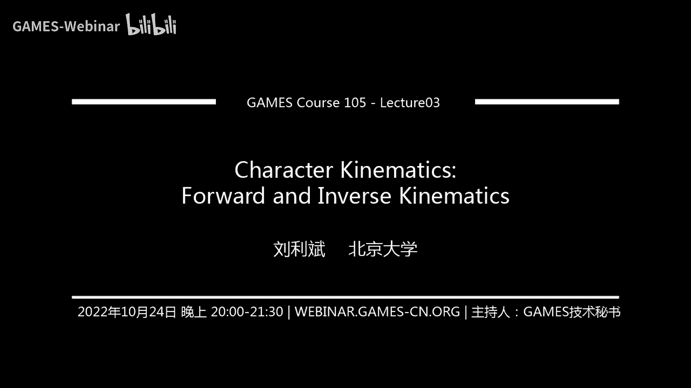
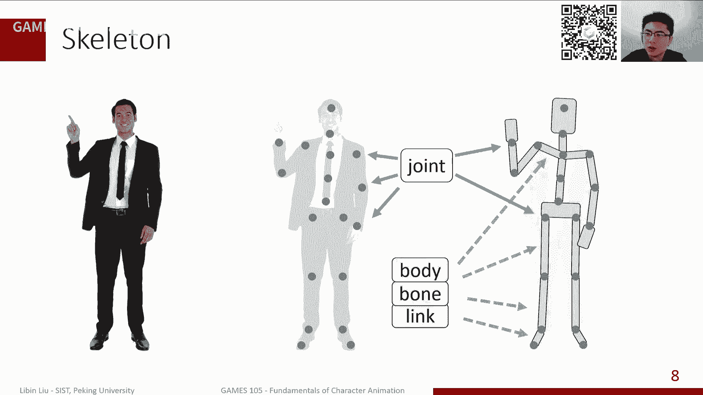
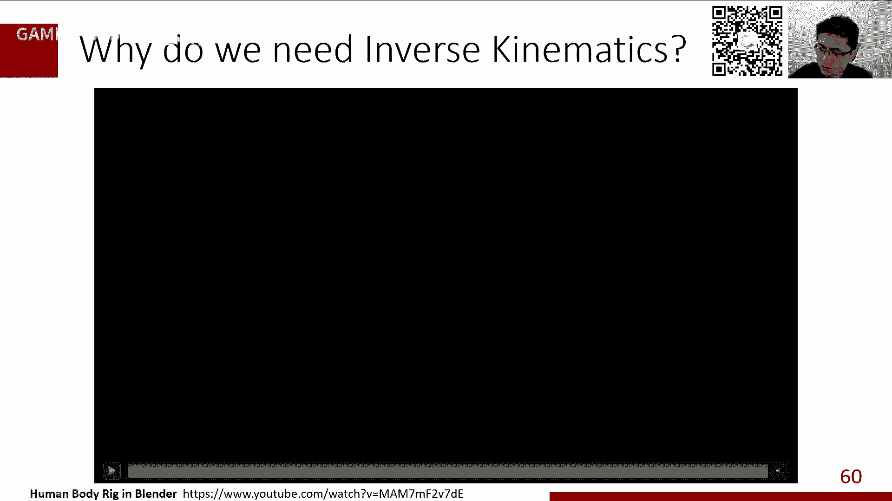
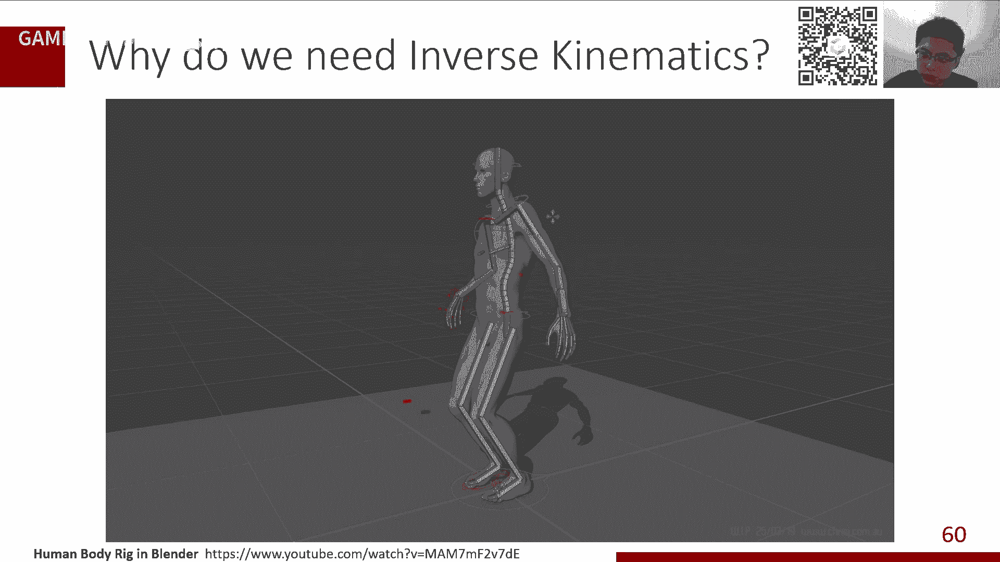
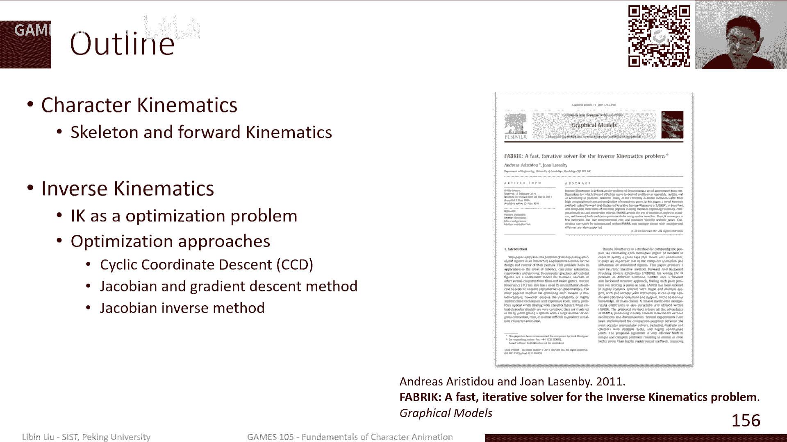

# GAMES105-计算机角色动画基础 - P3：Lecture03 Character Kinematics： Forward and Inverse Kinematics - GAMES-Webinar - BV1GG4y1p7fF

ok啊大家晚上好，那我们开始上课啊，非常欢迎大家来参加，我们这个是games 105，也就是计算机角色动画基础的第三节课，其实第一节课我们讲的比较简单啊，主要是计算机角色动画里面的一些主要的一些技术。

然后还有近2年的一些进展啊，然后第二节课呢主要是一些关于线性代数的回顾，那其实数学对于我们觉得动画来说也是非常重要的，我们其实在后面的不断的讲课过程中。

我们会经常的会把这个一些用到的数学知识逐渐的给介绍出来，那另外一部分其实比较重要的呢是我们在三维旋转，其实我们这个三维旋转其实比二维旋转要复杂很多，我们有很多种常用的不同的表示方式。

那就是随着回字有四种写法呃，比较常用的像全程矩阵表示，向资源数表示，这其实是在我们大部分的这个物理引擎啊，大部分的游戏引擎里面会经常用到，然后一些其他的表示方式，比如说轴角表示。

我们其实也会经常用到一些，还有一些其他的这个可能我没有完全介绍的这种表示方式，那我们今天呢是稍微讲一讲，就是我们第三节课主要内容就是关于这个运动学，那相当于前两节课呢，这节课的内容稍微有点难度啊。

所以说我们我还是将能够尽量能够把它讲清楚，那我们这门课我们之前也提到了，从第三节开始，我们有一个a boys，第三节开始我们有这样一个课程作业，那这个现之前有同学说这个这个作业提交网站现在打不开。

那我现在已经把它已经把它打开了，大家可以去注册一下，注册的时候你可能需要这个需要这个注册码啊，那当然这个现在这个cold base就是我们的作业会放在我们的这个githu，现在可能跟大家上去看是空的。

那我们会在本周内啊把这个作业放出来，然后这个整体来说那不会太难的，就主要是关于我们今天讲的部分，当然有一部分可能今天讲不到，我们也会涉及到，我会放在下一节课啊，进行这个进行讲解，那是因为不是特别难吧。

所以说我们也就时间短一点，我们大概给啊2~3周的时间，那我们可以去让大家提交，然后我们当时助教会给大家做一个简单的评分，ok那我们今天的主要内容刚才已经提到了，我们今天主要是讲这个运动学的基本知识。

也就是前线运动学以及逆向运动学学的基本知识，那关于选项运动学啊，我们主要是讲这个所谓的运动学是什么什么意思，其实我之前也是之前查了一下这个这个这个英语词典啊，其实解释还是非常清楚的，运动学就是研究身体。

研究多这个物体运动的这么一个学科，但是呢它有一个前提条件，就是说我不考虑物体的质量和力，这样这样一些这个外来的性质，并且这个跟一些性质，那这个时候这个其实如果说我们考虑这些性质的话。

那其实就不再是运动学了，那个叫动力学，我们后面很大一部部分，这个篇幅其实会涉及到基于动力学或者基于物理仿真的角色动画，我们该怎么实现，我们该怎么去去控制，那我们其实有很长一段时间会涉及到这些内容。

那当然在前面这下班时间，我们其实是不用考虑这些内容的，那其实主要是关于物体的运动这方面的这个这个这个啊这些知识，那当然这个角色因为我讲解说动画嘛，其实这个角色是范围是非常非常大的。

人其实是一个最常用的一个角色，然后另外其实像机器人，这个像这个比如说这个bodynamics，这个这个这个阿拉斯，然后一些机械臂其实他都可以认为是一个角色，那这些角色啊。

这其实我们应该说角色动画跟机器人领域，在这方面其实有非常大的这个共享的一部分的这个技术，所以实际上我们也是经常会关注一下那边的一些进展，那当然记起来，其实这些角色对于我们通常可以找到一些比较共性的部分。

公共性的特点，就是说我们一般来说是认为是研究什么样的一个东西，一个角色呢就是他的身体本身是刚性的，然后他只会这个它只会产生这个这个这个沿着关节进行旋转，那当然说如果当时我也看到很多这个血角色。

他其实是这个是这个这个非常性的，那这种其实我们可以把我们这个抗性这种这种描述进行扩展，其实也是可以实现同样的效果，那具体来说我们其实可以把这个人的建模型给抽象一下，我们知道他这个一个人。

那么其实我们这个在做动作的时候，我们其实身体的啊移动是围绕着我们的身体的一些关节进行的，比如说我转一下胳膊，那其实我这个胳膊的旋转，其实我们的关节保证了我的这个身体。

我的这个大臂和小臂在移动的过程中不会这个分开，那它只会沿着围绕这个关节进行旋转，那它这个模型里边我们的关节之间其实就是它关节是连接的啊，每个关节是连接的两个boarding。

但其实我们在不同的领域和那个不同的名字，比如说也可以叫bb叫骨骼，也可能叫这个link，也可能有其他的名字啊，但总体来说呢，我们其实是一我们在这个建模里边，就是整个身体我们可以抽象成若干个骨骼的组合。

然后每两个骨骼之间会有一个关节进行连接。

这是我们一个常用的抽象，那当然比如说在一个真正的在一个常用的这个这个这个软件里边，比如说这个blender，我看到要一个一个例子，那么其实是用了一个虚拟角色，其实它内部都是有若干个这个关节系统。

那当然其实对于这个动画来说，那其实很多时候可能我们不会被特别关注啊，这个这个骨骼或者是这个bb的它的它的形状或者它的这个什么参数，那我们大部分情况下只会关心一下关节的位置。

以及关节的旋转所带来的这个角色姿态的改变，那先就说到这件事情，如果说我们把这个先把这个角色定义成一个关节和构成的，这样的一个系统，那么我们需要创建一个角色啊，创建一个姿势。

那我们实际上就是去旋转某一个关节，旋转每个关节，把它摆动到某一个姿势，那当然实际上我们一说到关节，它的作用是什么，它的作用是连接两个啊，两个物体，两个两个肢体，两个两个骨骼。

使得它在旋转的过程中不会分开，但实际上如果说这个，但这个事本身是不能直接满足的，就是为了能够让我们整个姿势，这个角色在我国呃产生一个资质的过程中。

它不会发生这种这种这种这种这种分开的立体的这样的一个现象，那我们其实是要非常准确的计算我每一个关节在某一次旋转过程中，它的这个带来的影响，就是它它就每个关节在旋转之后，它的位置和它的朝向。

那这里其实这个整个这个计算过程呢，就是所谓的前项运动的前向运动学的这样一个过程，当然我们可以这个更加简单的举一个简单的例子啊，就是说比如说这是一个机械臂，那当然是一个链条了，它有若干扇没有。

比如说这样有四个关节啊，五个关节，那每个关节其实我们可以认为就是他每个关节会连接一个一个一个，一个物体，一个肢体，我们可以认为这个肢体上，所以这个关节我们可以绑上了一个坐标系。

那这个坐标系在我旋转过程中，它的朝向，或者说我这个这个坐标系的这个这个在于世界全局坐标系里的，这个这个方向，那其实可以定义为是这个关节的朝向，那我们就在前项运动鞋的其中一个很重要的部分。

就是说我们在摆一个角色，摆到某一个姿势之后，我需要知道每一个这个关节或者每一个肢体，它的去这个局部的这个坐标系，在全局坐标系的朝向是多少，那这个其实我们需要做这样一个计算。

那我们可以简单的这个这个这个图简简单的计算一下，比如说我们一开始的时候，这个角色他的这个坐标系表示是跟世界，是跟世界坐标系是从呃是平行的，是重合的。

那么其实我们知道他的这个这个朝向呢应该就是就是就是啊单位旋转，那如果说我们比如说我们把这个最后一个关节把它旋转了一下，我们在旋转最后一个关键的时候，其实前面的关键是不是不会受到影响。

所以它只会影响到最后一个关节，它本身的这个局部坐标系的这个这个朝向，那么这个朝向变成了比如q4 的这个朝向，就变成了这个r4 这样一个旋转，那我们接下来如果说我们往前走一步，我们去旋转r 14的呃。

这个副关节就是r3 啊，在这个选项过程中，这个r3 实际上它同时会旋转，它带来的影响是同时旋转了这个第三个关节以及第四个关节，所以它会把首先把r3 自己的这个朝向啊变成了啊。

就把这个第三个关节的这个朝向变成了r3 ，同时把第四个关节朝向它也同时做了一个旋转，我们其实回想一下我们上节课讲到的啊，这个这个旋转的叠加旋转的组合，那么其实可以得到它最终是一个就是r 14的选项。

现在变成了r 13乘以r4 这样一个这样一个结果，那类似的我们可以继续不断的往依次往前去旋转它前一个关节，那每次旋转其实都会带来后面就是每一个字。

它会会带来比如后面每一个子关节的这样一个啊朝向的一个变化，那最终我们其实如果旋转完整个这个机械臂之后，那我们得到了一个这个姿态，那这个姿态里边每一个关节的朝向实际是他父节点，所有负极点到祖父节点。

整个这一条链条下来的这个朝向的乘积的总和，这是一个前向的那个朝向的一个计算，那么这里我们其实也可以看到，这里有一个规律，就是说实际上每一个关节它的朝向，或者说它的一个局部坐标系的一个方向。

都是在都是等价于它负关节的局部坐标系的方向，乘以这个当前这个关节的旋转，那其实也是反过来，如果说我们知道负极点的朝向呃，副关节的朝向，知道这个当前关节的旋转，那我们可以直接计算出这个当前关节的朝向。

那如果反过来，如果说我们知道当前关节的朝向以及腹关节的朝向，那么也可以计算出啊这个关节的旋转是多少，因为我们只需要这个副关节求一个逆，然后乘以当前关节，就完成了这样的一个这样一个转换。

啊另外呢如果说我们是想要继续，比如说可能想要计算当前关节朝向，相对于他前面某一个关节的这个朝向，这个相对旋转，那我们其实也可以通过这样的计算，可以很容易得到。

他其实就是说从前面那个关节到当前关节这一路上，所有关节的旋转的生机，那就该得到的是我们这两个之间的相对旋转的值，我们可以从另外一个角度来看这个问题啊，就是说我们可以假设前面我们提到。

我们假设每一个关节上都连接了，都绑定了一个坐标系，那我们可以进一步假设说这个坐标系的原点，那就是刚好是落在我们每个关节的这个旋转的这个点上，那在这个过程中呢，我们可以如果说每一个关节，比如说第零个关节。

它跟第一个关节之间的这个或者第一个关节的，第二个关节的这个相对相对距离是l0 ，那其实等价于数是什么呢，它是等价于是说第一个关节的位置在地理跟关节的局部坐标系的表示，这个坐标就是二零那一次。

那一次后面是类推的，那这种情况下，比如说我把第一个关节旋转了一个角度，那时间它会带动整个后面所有的关节发生旋转，而在这个过程中，因为这个第一个关节，第一个关节的位置在这个第零个关节坐标系里的。

相对的这个这个局部表示局部坐标是不会发生变化的，那么如果说我们需要去计算第一个关节所对应的这个坐标系，或者它的朝向这个坐标系的原点的世界坐标系的位置的话，那我们其实是等价于是要做一个变换。

就是把第一个关节的在第零个关节的局部坐标下的那个那个坐标，转化成在世界坐标系的坐标，那这个过程实际上我们就是一个简单的坐标转换的过程，我们需要用第零个关节的这个这个啊朝向啊，乘以这个局部坐标的这个向量。

然后再加上地理关节的位置，当地灵关节曲我们怎么设定了，它可能在原点或者可能在一个p里的这样一个位置，那类似的，如果说接下来我把第一个关节旋转了一下，那么得到了那么同样的对应的第二个关节它的坐标啊。

这个坐标原点的位置其实也会同样发生变化，那这个过程中，实际上我们也可以同样的用这个坐标转换来计算出第二关节，它的坐标原点的位置应该在哪里，那意思我们可以不断的这样的这个以此类推。

那当我们把这个角这个角色姿态，从第零个关节前向传播到最后一个关节之后，那我们就可以计算出每一个关节所它所对应的这个坐标轴啊，这个这个坐标系的朝向以及坐标系原点的位置。

那么接下来一个问题就是如果说我们在这个坐标系里边有一个点x0 ，那我们该怎么计算它的全局坐标系下的位置呢，那其实这个非常简单的，这就是这就是一个坐标转换，我们可以用啊。

q4 也就是它的第四个关节的朝向乘以x0 ，然后加上p4 ，那得到这样一个全球最大的位置，那类似的，如果说我们知道了第三个关节，它的朝向它的这个坐标原点的位置。

然后我们又知道q x0 在q4 在第四个关节里边这个局部坐标，那我们可以怎么算呢，那么同样我们还是也是可以去计算这个x的在全局坐标系里的位置，那这样当然这过程我们需要去做一部的这个这个代入啊。

我们就是把q4 的这个和p4 的计算改代入到这个p3 的呃，这个第三个坐标轴坐标系的这个计算里面去，那在这个过程实际上我们可以同样的可以通过这个通知公式中，我们可以推导出x0 。

那他这原来是在q第四个关节的局部标系，它在第三个关节的局部特系局部坐标系下的这个坐标表示，实际上也是可以啊，通过这样的方式来进行计算的，那类似我们可以继续往前推。

首先可以得到这个x0 这个关这个这个点在前面每一个局部都系下，它的表示应该是多少，所以总结一下，就是我们在计算这个前向坐标前项啊，运动鞋的过程中呢，我们其实是要有前线的。

其实可以做一个从根节点到目标节点，那末端节点这样一个前向的一个迭代，那我们可以在这个过程中可以去逐步的更新每一个坐标的位置，有一个啊每一个坐标系的每一个关节所对应的坐标系的这样一个位置，和它的朝向。

然后当我们整个啊前向的这个这个，当我们完成一遍这样的一个前向的运算的时候，我们其实就更新了每一个关节的朝向和它的坐标位置，那相反的我们其实也可以反向来对它进行计算，比如说我们可以从一个目标点开始。

那这个目标点我依次的把它转换到它的负节点的这个局部，坐标系里面去，那么知道每次转换我需要用这个当前坐标系，比如说刚才是在q4 ，那我先用q4 的呃，在q3 里面的局部坐坐标，那就是比如说它的局部坐标。

它的圆顶的局部坐标是l4 l3 ，那它的这个朝向的局部坐标，应该是刚好是等于我的这个这个关节的旋转也是r3 ，那r4 ，那我们可以把这个每个点，这个转换到它的这个复节点的这个坐标系之内。

然后我们依次做这样的转换，我们也可以同样的计算出啊，每个点在就当前这个点在全球数字游戏的表示方啊，这个这个坐标表示，那其实我们如果说我们不是从根节点开始，我们就是想要计算一个相对的位置。

比如说我想计算l0 在看某前面某一个关节局部坐标系，比如说r一或者q一这样一个局部坐标系下的坐标表示，那我们其实可以同样的做样这样的一个前线运动学计算，就是通过这样一个啊一个便利的一个迭代的方式。

但我们可以不不是当这次我们不是从根节点开始，而是从我们的这个比如说r一这样的一个环节开始，那我这样计算得到的结果就是我们的末端点就是x0 ，这个点在r一下的这个坐标表示，那同样如果说我们不关心朝向的话。

其实我们可以做一个逆向的迭代，然后我们也是一逐次的把r2 s0 逐次地转移到啊它负节点，或者他的在主副节点的每一个关节的局部坐标系统之内，那这样的话我们就完成了一个减项运动学的这样一个计算，ok啊。

那我们前面主要是介绍的是关于这个单链条的非常简单的一个例子，就在这个单链条的一个情况下，我们如何去进行前线运行计算，那对于一个角色来说呢，我们其实可以把它建建模成一个啊。

由多个链条连接到同样一个根节点构成的这么一个树形的一个结构啊，通常来这是一个我们对这个角色的一个抽象进抽象模型，你在这个过程中，我们这个角色有一个也只有一个根节点，然后除此之外呢。

比如说我这个从根节点到手，它会形成一条一条链，一一个一个形象链条，然后从根节点到腿，这是另外一个倾向链条，那当然这个过程中，实际上根节点的选择，我们通常来讲根节点会把它放在这个角色的腰的这个位置。

因为本质上它带来的是我们这个整个角色的一个啊，整个角色的朝向和这个位置的一个信息，那这个不同根据点的选择其实也会带来不同的这个旋转效果，就比如说我在这个在跟你脸是在腰部的时候。

如果说我要求我的腿旋转一个角度，那其实就把腿抬起来了，但如果说其实我对角色来说，我完全可以选择另外一个关节作为我的根节点，比如说我选择这个右脚作为它的根节点，那这个时候他用同样的方式去旋转它的这个腿。

他的这个右腿，你们看这个角色它的旋转方式会发生一定的变化，但本质来说这个他俩的这个姿态是完全是其实是相同的，只不过只不过是这个整个身体的朝向随着使用，因为它优势跟随我的根基点来决定的。

那么它其实会带来不同的朝向化的变化，那其实我们说到这个人嘛，其实我人的从解剖的解剖学，这个生物解剖学来说，实际上我们每个关节会有不同的这样的一个性质，就比如说这个比如说最简单的。

比如说我们的这个胳膊或者我们的腿，其实我们发现它只能先一个方向去旋转，它不能像先另外的方向去旋转，因为就是如果发生旋转的话，多半是这个人可能是是是是是有点问题的，比如他把他骨折了，但其实这个整体来说。

人的旋转，每个关节这个旋转的这个方式，但是由这个关节和这个就是一个骨骼的这个具体的呃结构，和它的这个形状来共同确定，那当然实际上对于人体来说，对一个非常精确的人的模型来说，其实这个关节的种类是非常多的。

就是不同的，甚至可能每一个关节都会有不同的这个旋转方式，那当然在结合动画里面，我们通常来说不会做这么复杂的一个建模，我们可能会把这个模型建的稍微简单一点，我们可能只会考虑几种比较常用的比较。

就是这种这种关节的表示方式，那当然比如说我们查了几只有几几种，比如说这是其中的两种，一种是所谓的hinge drt，我其实也是叫也经常也会叫做云啊，revolua revud。

它是一个单自由度的一个旋转，其它其实它刚好对应的是，比如说胳膊，就是这个手肘，然后还有膝盖，那他只能沿着一个方向，它有一个确定的一个坐标，一个旋转轴，它只能沿着这个轴进行旋转。

然后另外一个也是很常见的一个关节，就是像比如说我们的这个这个这个髋关节，然后还有这个这个肩关节，它的这个从解剖学上来说，它其实就是一个碗的洗个形状，然后另外一个是一个骨头。

然后这个骨头和在这个碗里边可以进行这样一个旋转，那这个学生呢还是没有一个确定的旋转轴的，就是他其实可以在这在整个这个范围内可以任意的进行旋转，也可以这个这个朝向的一种发病啊，这个转换。

那这种关节呢一般我们叫burant或者叫bsocket dt，其实是比较形象的描述的这个关节的这个这个状态，那当然对于不同的关系来说，我们或者说对于整个不同的系统来说。

我们其实是有一个非常重要的一个性质进行描述，它就是所谓的自由度，那从严格定义来讲，自由度表示什么意思呢，自由度是说是一个物理系统，我需要多少参数可以唯一准确地描述它当前的状态。

那是代表这个东西的这个物体的自由度，那么对于我们来说，实际上更加直观的想法，就是说这个动物体它可以在多少方向上进行移动，代表它的自由度，就比如说这样一个立方体放在这个空间里，什么都没有，没有任何约束。

那首先它是可以沿着空间的x y z，因为我是一个三维空间，它可以沿着x y z3 个方向分别移动，除此之外呢，它还可以沿着x和y和z这三个轴发生了旋转，其实回想一下欧拉欧拉角，欧拉欧拉表示还有他。

那有人说诶，我是不是可以沿着另外一个随便的一个轴，不一定非得沿着x y z，这个也是没有问题的，但是回想一下我们坐标，而我们三维旋转的几种表示，其实我们会任何一个旋转。

都可以把它分解成沿着坐标轴的旋转的这样的一个组合，所以总体来说呢，这个物体它的自由度，因为它可以沿着六个六种不同的方式进行进行移动，所以它自由度等于六，那我们其实可以比如说我把这个屋方体。

这个立方体放在一个平面上，我我跟他说，你只能在这个平面上移动，那这个时候其实平面就约束了这个立方体它所能够移动的方式，以及沿着这个xz方向的平移，以及沿着沿着竖直方向，就是y方向这个旋转，那这种情况下。

我们知道它只有三种旋转移动方式，那它的自由度应该就等于三，那就是还有一些更更加在另外一个例子，就是说比如说把这个物体这个立方体穿在一个轴上，那只能沿着轴上下移动，以及沿着轴进行旋转。

那这个时候它自由度就应该就等于二，所以说对于刚才我们这两个关节来说，首先这个hd它的自由度等于一，因为它只能沿着一个确定的轴进行旋转，而一个爆炸它其实是自由度就等于三了。

那么这里其实这个对于我们关节来说，我们知道关节一个最基本的性质，就是说我们关节需要保证两个物体不会分开，所以它其实相当于限制了我这个物体不会发生水平的，这样的一个就是位移方向的移动。

因为如果说我发生了位移平移的话，那么这个这个关节其实就分开了，所以说对于关节来说，我们自由度至少是就通常来讲，比如说就是就是最最最多也就是三，因为我们这只考虑旋转的情况下，他它是有这样的一个约束的。

那当然其实想一想，我们是为了两个关节的，这个这个就是两个自由的关节，其实两个自的关节就好几种不同的形式，其中一种形式是所谓universal j，它是两个轴，在工位，两个轴可以是垂直的两个轴。

然后我可以沿着这个分两个它的两个关节啊，两个肢体可以分别的沿着这两个轴进行旋转，那这个环节其实在我们的这个机器里面用的还是挺多的，因为它可以用来作为一个传动的一个转向，的这样一个功能啊。

另外其实在身体上来说，这你可以想象一下，比如说手腕手腕差不多是一个universal转的这种抽象，就是你可以沿着沿着这个手腕的这个轴一个轴发生转动，同时也可以沿着另外一个轴发生转动。

所以它差不多是一个啊原veral转的，那除此之外呢，其实我们还有另外一个性质，就是所谓的这个关节的一呃极限角度极限就是glimit或者angle limit。

就比如说其实最典型的我们知道我们的膝盖是不能向反方向移啊，旋转的，所以它就决定了我的膝盖的旋转范围应该是比如从零到，比如，说70度80度这样的一个范围，但是我膝盖想反方向旋转，那那其实这个人也不对了啊。

另外就是说像集市，像是爆炸，就是它也是有相应相应的极限的，就是这个可能很多时候是取决于我身体的这个柔韧性，就别说我可能这种韧性比较差，那我可能抬腿只能抬90度，那有些人人气很好，我可以抬个70度啊。

sorry，他抬个150度可能更高，所以这个其实也是我们在做这个在做这个角色，这个运动的这个动作生成的时候，其实也会需要经常，考虑的这样一个问题，ok那我们其实前面也提到了，我们在每一个关节。

就是我们这个角色，我们可以把它表示成一个树形结构，那这个树形结构里边每一个就整体的这个角色的姿态，我们可以利用根节点的位置和朝向，以及在这个树理树形结构里，每一个关节的旋转，把它放在一起。

这样就构成了对这一个某一个姿势的这样的一个一个参数化的表示，你看他这个参数化表示里边我们可以简这里我只是简单写，把它写成了一个旋转矩阵的方式，但实际上因为考虑到我们每个关节可，能它有不同的这个自由度。

比如说一个指关节，对于一个指关节来说，其实我表示它的旋转我只需要一个参数，也就是它沿着那个旋转轴的这个转角，而对一个bl一个球形关节，那么至少需要三个选择，三个参数去把它表示出来。

那整体来说它它因为它自由度是三嘛，所以说整体来说我这个人的自由度是由每一个关节的，就就是表示美表示整个人的他的姿态所需要的参数，其实也是首先是由root关节的这个位置和朝向这六个自由度。

加上每一个关节自由度的总和，能得到我们整个整，个角色的自由度，那这个关节表示实际上就是我刚才说它其实分为两部分，一部分是这个root，也就是说根节点的位置和朝向，他确定了这个角色整体的位置和方向。

然后再加上每一个关节的每个内部关节，它的旋转的表示，那共同构成了对一个姿势的一个参数化，那当然在这个过程中，我们通常还是会做一些啊，就是为了计算的方便，我们通常还是会要求这个顺序是有一点点有一点要求的。

就是说它通常来讲我们会要求一个关节在这个表列表里的顺序，是比它后面所有的子关节都，要靠前的，这又带来一个什么好处呢，就是说实际上回想一下，我们在做前项运动，前项运动学计算的时候，我们是需要从根节点出发。

沿着每一个这个运动学练去依次更新每链上每一个关节的位置和朝向，那如果说我们在假定父节点永远是在子节点的前面，这样的一个顺序的情况下，我们其实只要病历一遍我们这个这个关节的列表，那么就可以完成整个的更新。

那这个其实也是这个编程里边非常也是这个数据结构里边非常有非常，但可能大家都已经了解过了，一个就是树数的这，样一个数据结构，它表示成它的一个实际的实现方式，那这个时候我们其实有两个问题。

第一个问题就是说如果说我们知道了每个关节，或者说每个肢体它的朝向，我们该如何计算每个关节的旋转，因为前面我们前运动学是说我知道了每个关节的旋转，我需要去计算整个关节的长相，那他这个其实我们也非常简单了。

我们其实只要是用这个副关节的朝向，然后去求逆，然后再乘以子关节的朝向，就可以得到这个关节的旋转，那另外一个说实际上我们这里是前面是假设说这个关键是，刚体的刚性的，它不会发生这个伸长，不会发生拉伸。

那如果说我们需要这个结果的发生拉伸怎么办，其实可能其实从其实一般来说生物来说不会有这个问题，但是机械机器人经常是有这样的问题的，就是我可能有一个只有一个线性的一个关节，就它是会连着某一个方向进行移动。

那另外或者说比如我可能有一个所谓的这个平面的一个约束，这个物体可能在平面这个关节可以在一个水平面上进行移动，那这种情况下，我们其实只要把我们的这个关节的参数化的方式稍微改变一。

下比如说我们可以加上一个额外的参数，就是不会美，除了每一个在每个内部关节之外啊，旋转之外，我们可以加上每个内部关节它的平移，那作为一个坐标，其实可以很容易地实现我们前面这个啊。

对这个可变形关节的这样的支持，那具体来当我们这个前面只是说每一个姿态它的参数化的一个表示，那然后通常来讲我们会就比如说我们一个动作，有可能它是有很多姿态进行构成的。

我们可以把这样一个姿态放到一个文件里面去，那这个文件其实有很多种不同常用的格式了，其中，一种比较长了格式，就所谓的b位置文件，那其实还有些其他的格式，比如说a f c啊，a m c。

然后还有比如说像是这个fbx，这都是一些比较更加复杂一点的格式，因为什么文件其实是就是说我们见到了很多这种常见的这种开源的啊，动作动作捕捉的库，他会他会基本来说都会提供一杯瑞士格式。

这是使用非常广泛的一种呃角色动作表示的一个格式，那实际上不管哪一种都能格式，我们都会如果说我们仔细研究它的方式，它的这个表达方式的话，它会有两部分，其中一部分就特别就，是以这个b位置文件为啊作为例子。

他这个比如说你打开一个变为必备的是文件，它的开头的一部分，它会先定义一个角色，就是定义什么，就是这个角色在旋转，在每个关节旋转等于零的时候，其实我们通常也会把这t po这样一个零的时候。

它每一个关节和它的腹关节之间的相对和相对位置关系，那其实我们可以当我们读完前面这个之后，我们首先可以再建立一个建立一个虚拟角色，然后接下来会有一部分会会描述在前面这样定义好的这个角色之上。

我每一个关节的旋转应该，是多少，当然每一个关节的旋转我们定义好一系列旋转呢，其实是定义好的一个姿势，那我们如果说比如说这个动作可能有有有有，比如100个不同的姿势构成。

那么其实可能有100个这样的这个这个旋转的表示，那对于b位置文件来说，其实大家这个这个非常简单的例子，就是上面这一块，它其实定义了我的这个角色的这个形状。

是通过我们每个关节和它父节点这个相对的位置来定义出来的，然后另外的话其实并非成文件，它有另外一部分，就是说他还同时因为并非成文，它是用，这个欧拉角来表示一个关节旋转的。

所以因为欧拉奖我们知道它是有一个旋转顺序的一个问题，所以在编文编位置文件的这个角色骨骼的定义里边，我们其实也会额外的同时也会定义一个奥拉雅的顺序，那当然这里比如说我这里显示z y x。

那其实它对应的欧拉角的顺序是r x，r z乘以r x乘以r y这样的一个顺序，那实际上并为这些文件下面的这个病，它每一行代表了一个姿势，那其实每一行是以刚好是按照我们上面定义好这个顺序的。

这个每一个每一个轴的这个旋转，表示的这样一个啊这个这个这个参数那只是一个b文直接文件，但如果这个关于这个文件的更多的一些信息呢，大家可以去，比如说其实可以看，比如说是一个呃比较比较简单的一个介绍。

那其实我们可以找到很多的，大家可以很容易地找到一些其他的关于b维持文件的这个这个文件类，型，文件格式的一些介绍，介绍的这个文档，ok那我们前面其实简单回这个介绍了一下。

关于这个角色的前项运动学的计算的公式，那总体来说减项运动学是一个非常简单的，其实本质上就是一系列的坐标转换的这个这样一个组合，那其实我们比较重要的或者比较关心的一部分，其实是所谓的逆向运动学。

那当然这里也是这我这里有一篇文章啊，这是我最近也看到的是一个关于逆向运动学的一个方法的一个啊，一个sv啊，但是也是大家有兴趣可以去参考一下。

那什么是逆向运动学，其实逆向运动学相对于前项运动学来说，因为在这个实际过程啊，使用过程中应用的还是更加广泛一点，因为主要是呃就比如说我们做一个角色的这个啊所谓的这个绑定。

那么通常来讲会建立若干个逆向运动学的这样一个控制器，那这样的话我们在这个动画师，他主要还是通过这样逆向运动学的这样这样一个控制器，来去改变这个角色姿势，因为这为什么要为什么做这样的事情呢。

因为主要是说大家如果说自己试过啊，在软件里面通过比如说去旋转每一个关节的角度去调姿势，你会发现这个这个这个过程是非常非常非常麻烦的，因为主要是说比如说我们用奥拉角，虽然说我们知道奥拉角。

我们可以很明确的知道每一个旋转，每个轴的旋转代表了什么样的一个，大概代表什么样的一个一个一个一个旋转，但是我把它组合起来，想把一个角色姿势摆到某一个状态下，你会发现这是非常非常困难的，因为我稍微调一调。

就是主要是说我们很难去有一个非常直观的方式能够告诉他，我就是想要转到某一个角度去，而这个逆向运动学其实是反过来的，就是说我可以通过直接指定我末端点的位置和朝向。

然后让我的这个逆向运动学算法去自动计算出我每一个关节。

它的朝向应该是多少啊，它的旋转应该是多少，那这样的过程时间会比如我直接去调每一个关节的长相，要更加简单一点，而且同时结果也更加直观一些。

其实我们前面讲到这个逆动力学i k问题啊，其实是一个更加通用的，更加广泛的逆向问题的一个一个特例，那我们知道什么是逆向问题或者什么是前向问题，就是说我们当知道一个系统，比如说一个人一个角色。

我们知道这个系统的一些参数，就比如说我知道这个角色的每个关节的旋转，那我们想要去计算它某一个关节啊，某一个这个关节点的位置，那其实代表了这个现象的一个属性，从这个关节的参数，从系统的参数计算某一个属性。

这个过程实际是一个前项计算的过程，那当然这个角色角色这个前运动学是一个例子，另外还有一些其他的，比如说我知道一个软体，一个可以变形的一个物体，它的刚性刚度以及它的这个不同系数。

那么可以通过前向仿真的方式得到这个软体，它在于某些外力条件下，它的形变的这个过程，但总体来说呢，我们这个前项的计算或者前项的仿真是一个比较容易的过程。

因为本质上我们我们在知道这个确定的这个这个这个函数的形式之后，那我们只要计算一下函数的值，就可以得到前前前前下中学的解啊，然后在这个过程中，通常来讲我们的目标的这个属性。

它的这个维度会远远的小于我的这个参数的维度，就比如说我们的关节，它这个整体的旋转的自由度啊，通常是比较大的，然后呢我们如果说我们只用来控制一个末端点的话，那这个末端点通常它只有三维嘛。

所以它的这个自由度会相对相对较低一些，那反过来如果说他的逆向问题说的是什么，逆向问题，就是如果说我知道这个我要求的这个目标参数的一个目标值，那我需要想去计算一些系统参数。

使得这个目标使得这个目标属性它达到我想要的那个值，就比如说在i k里边，我们是想要让一个末端肢体的位置达到我的一个想要到的一个目标点，那这个过程我们如何去计算每一个关节的这个旋转，是让它达到这个位置。

那这样通常来讲这样一个逆向问题是会比前面问题要难很多的，因为主要最主要的原因是什么呢，是这个前项问题所要去，它只要去计算这个函数的这个值就可以了，而这个函数本身呢又是一个高度非线性的函数。

那我们在求解一下有问题的时候，我们其实要求解一个高度的非线性非常复杂的函数，它的根是多少啊，这是一个通常来讲是非常非常困难的问题，而除此之外呢，因为这个函数通常来讲它还有很多通常来讲不是单节的。

他可能有很多，它会有很多这个不同的额外的呃，不同的不同的这个这个这个这个组合可以完成同样的目标，那这个工程我们该如何选择这个组合，使它能够达到我们想要的这个效果，这其实也是另外一个比较难的问题。

ok那具体到我们的这个逆向运动学这个问题呢，我们其实可以知道我们想要去求解的是一个知道末端点的位置去，我需要反推出每一个关节的旋转的这样一个问题，那当然因为我们把每个关节的这个旋转。

我们会有相应的这个旋转表示，那把它参数化成不同的这个比如说可能欧拉甲呀，或者是轴角表示，或者是四元数表示，我们实际上的计算应该是说我们在知道目标端点的目标末，末端点位置的情况下。

我需要去反算出我的每一个旋转坐标，表示的是那个参数的值，但对于i k问题来说，我们其实有很多要注意的，要注意到一点，就是说i k他可能有在一些听力情况下，它可能有解，可能没有解。

然后甚至大部分情况它应该是一个多解的问题，就是在这个例子里边，我这个机械臂有一个长的和两个短的这样一个这个关节构成，那么当这个如果说我们目标点超出了整个这个机械臂的总长之外。

那这个这个问题其实是没有解的，然后如果他小，他在里边这半圈其实也是没有解的，其实可以看到，其实我不管怎么选择我的专辑，我应该是不我没有办法去啊，到达里边这圈的位置啊，而这是中间这部分。

其实我们会发现它其实任何一个点我们都至少有两种，至少两种以上的这个这个方式能够去到达同一个点，随着时间对ik问题来说，我们可能很多情况下是一个多解问题，那一个最简单的1i k问题就是所谓的秃顶。

i k就是两关节或者叫两个物体，两肢体的这样一个ik的一个这个这样一个问题，但这两关节i k问题，其实在我们的这个角色动画里面也非常非常重要了，因为我们很多情况下，对于一个人来说。

比如说我们的胳膊或者腿，它其实就是一个两关节的一个两关，两个关节构成的这样一个一个指令，一个直体，那这种情况下，我们其实比如我们想要一个手去伸到前面去，然后去碰到一个物体。

我们很多时候只需要去解一个两关键i k的问题，就可以就可以完成这件事情，当然两关两关节i k为什么他就是帮他把它单独拿出来说呢，因为主要是说两关加i k，它是一个非常简单的一个i k问题。

我们可以用很容易的方法去算出这个ik问题的解，就比如说我可以简单的说简单的想象一下，比如说我想让这个关节这个关节二移动到我这个目标点的位置，那我其实我可以完全可以沿着关节零做一个半圆。

然后沿着关节二就是用这个关节1~2的这个关节的长度做一个半圆，那这两个圆的交点，那肯定就是这个关节点的这个一的关节点一的位置，然后我们可以根据这个相对关系，计算出我这个每个关节的旋转应该是多少。

或者说我们有另外一种非常更加简单的算法，比如说比如说我是想还是刚才那个问题，我有一个两关节的一个节臂，我想让这个关节点二旋转到啊，移动到我这个目标点x这个位置，那这个过程我们该怎么实现呢。

那我们其实有两个，第一步我们旋转一下关节点，一关节一使得零和二的距离等于零到x的距离，这该怎么算呢，其实这个非常也非常简单哦，大家可以回想一下这个呃所谓的余弦公式，我们知道三角形的两个边的长度啊。

以及第三个边的长度，那我们是可以通过余弦公式计算出这个这个中间的夹角应该是多少，那我们就可以相对来说计算出了这个关节的旋转应该是多少，那在完成这一步之后，我们知道零和二的距离等于零到x的距离。

那我们其实在想要把二移动到x，其实我就只需要再做一次旋转，我们旋转一下啊，关节点零使得二跟x重合，那这就完成了这样一个ik的计算，那这个旋转其实我们前面已经已经已经啊提到了，我们当时怎么算呢。

因为这是两个相，它等价，于是我需要把向量零二移动旋转了，现在0x这个位置，那我需要加一个旋转，这个旋转它的旋转轴是零二和0s做一个插成，然后它的旋转角应该是这两个啊，这两个轴这两个向量做一个点乘。

那其实这个很容易的计算出我这个旋转矩阵是多少，那在这基础在这个基础之上呢，因为我们只考虑的是一个三维的旋转，三分的旋转，我们在中间这个连线的这个平面上，所有的旋转都是满足条件的。

那我们其实可以进一步的再沿着0x再做一次额外的一个旋转，把这个把这个轴啊选择了我们需要的角度，就比如说我们在做一个呃这个比我想象的那个角，把我的手或者我把我的脚伸到某一个位置，那么其实膝盖的朝向。

我们通常来讲还是希望他能够朝向一个比较舒服的一个方式，那么其实在前面完成这个一和二的这样一个操作之后，我们可以再加额外的加一个，沿着沿着这个宽到脚站的连线的这样一个旋转，来把这个膝盖旋转。

我们需要的需要的角度，所以总体来说只是对于一个to link i k就是一个二关节的一个选呃，i k问题我们可以有非常简单的这样一个求解方式，但是更加通用的一些问题，比如说一个机械臂。

那可能有只有四个四个五个关节，我们的iq问题是说，我们是希望这个最终末端点这个关节，它的位置能够能够被移动到我的一个目标位置，同时这个末端点这个朝向也是能够达到，我希望那个朝向。

就是我们一般需要去求解一个ik问题的这样一个基本的定义，本来当这个过程中这个朝向来说，如果说我们考虑要求这个末端点是一个是一个抱枕的，那其实朝向我们这这个修改朝向是一个比较容易的一个问题。

那修改这个位置是相当于比较难的，那这里我们先暂时先忽略到朝向这个这个问题，我们只考虑这个位，置就是像让这个末端点的位置跟我的目标位置及，这个达到我的目标位置啊，去去求解这样一个i k问题。

那这个这个那在这个里边，因为我们对这个每一个关节的旋转，我们把它参数化形成一个，比如说可以用fate来表示这个参数，那这个末端点它的位置整体上我们可以写成是一个函数，这个函数的参数是这个我们每个点啊。

每个关节的旋转，这个参数的这个放在一起，然后它的这个函数的值是这个末端点的位置，就说我们这个iq问题等价，于是说我需要去找到这么一组参数，theta，它，使得我的这个末端点的就目标点的位置减掉fx呃。

它的值等于零，那其实就是这是一个求根问题，当然我们知道这样一个求根问题，我们可以等价的把它转换成一个优化问题，我们知道这个当这是一个二次函数。

我们其实可以很容易很容易很容易的这个知道就是这个优化函数的啊，这个函数的最优最极值是刚好是等于零，也就是说当f x但末端点跟x重合的时候，那这个优化问题取得取得极值，那这个优化问题呢。

其实如果说我们把它写这个形式化的，把它这个画出来，比如画出，函数图像它可以描述成这样一个方式，这样这样一个形式，就说比如说我这里有两个参数，就要连个c才一，然后我们可以把这个y轴关于函数值。

那它大概是这样一个形状，当然实际上这个只是一个解决一个失意时间的形状，可能是一个非常复杂的一个函数，那对于k来说，它本质上它的它这个函数目标函数值，其实是大概可以写成这样的一个形式。

那当这个图像这个三维图像不太好看了，我我我们会我们为了简单说这个描述一些来简单，我们可以把它做一个正向的，这从上到下，来一个投影，投影了一个二维平面，这样的话我们在这个这个描述的时候会更加容易一些。

这里每一个圈其实对应的是这个目标函数的一个等值面，然后越往里这个目标函数值越小，这是我们的这个函数图像的一个假设，那我们为了求解这个优化问题，通常来讲我们是从一个初始状态开始。

就比如说我现在关节这个角色已经有在一个初始姿势了，那从这个初始姿势开始，我们需要去寻找一个目标姿势，就这个优化的中心点，优化的这个最优点，它能够使得我的ik问题有解啊，得到i。

k问题的解也就是我的目标点达到了我的目标位置，那通常来讲这个优化问题对于因为这是这个目标函数，是一个非常是一个高度非线性的问题，所以说我们很难去进行，去找了一个算法，它能直接就得到。

直接就计算出最终那个中间点的位置啊，最优点的位置，所以大部分情况下我们会使用一个迭代求解的一个方法，那迭代求解它其实是一个是一大类的方法，那从简单来说他的他的这个这个这个迭代过程。

这是我从一个初始点位置，从这个c0 开始，我首先去找到一个方向，那个，方向就可能是最有最有希望来提高我的目标啊，目标函数的这个值的这样一个方向，那接下来呢我沿着这个方向移动一个距离。

移动一个合适的距离啊，这不合适的距离是多少，不同的方法有不同的这个不同的计算方式，然后计算完之后呢，我们一定把这个参数更新到一个新的位置，然后我们再继续重复上面的过程，也就是说再去找一个新的方向。

然后再沿着新的方向进行移动，然后来实现我们这个来来来来来，继续来进一步的更新我们这个目标参数的值，然后我们可以不断的重，复这个过程，直到我足够的接近了我这个最优点，那这个足够的接近。

我们当然有也有相应的这个判别方式来决定我是否已经足够接近了，那当然很多情况下，因为这是一个非线性函数，我们其实使用不同的不同的算法的情况下，我们会发现可能它经过很多次迭代之后，他还是没有足够接近。

那我们还是需要在在一定的这个循环之后，一定得迭代次数之后，我们需要停止我们的这个迭代，然后返回当前的值，我们可以认为它是一个坐标值啊，最优值，或者说我们也可以认为可能这个方，程就是没有解。

那其实这个迭代方法有很多种不同的方式啊，就是我们就是关键，就是说我们需要去如何去找到一个比较好的这个方向来更新我的参数，另外一个问题就是我们如何去找一个比较合适的距离去更新的参数。

那这个方向首先有很多种不同的找法，其实最简单的找法就是因为考虑到我们这个实际上每一个，比如说我这个这个目标函数，它是由啊若干个，比如说有两个参数来互相定义的。

那我们其实完全可以就认为这个参数所对应的一个坐标轴的方向，就是我去更新，我的这个旋转啊，更新我这个参数的方向，那这个对应的方法就是所谓的坐标下降法，他过他的做法就是说我每次是沿着这个坐标轴。

沿着某一个坐标轴去更新我的参数，也就是说在这个更新过程中，我是沿着这个坐标轴去做一次查找，我更新的距离，是是是使得我更新之后，这个点在这个坐标轴这个方向上所对应的这个目标值最小的那个点。

那我当时完成这个更新之后呢，我可以换一个坐标轴，沿着另外一个方向做同样的这样一个迭代的下降，那我们可以不断的做这样一个不断，的交换我这个坐标轴，然后最终逐渐的我这个因为我每次都是保证这个是一个新的点。

新的坐标点是比我之前那个坐标点，它所用的这个坐标啊，目标函数的值要小，所以可以保证每一次坐标下降的过程，我的值总是在不增，至少是在不增加的，虽然他可能不一定真的减少，那至少是在不增加的。

所以说和不断的这样的代，我最终会得到一个点，那这个点它的它的这个对应的这个坐标值，对应的这个这个目标函数的值应该是一个最优的，至少是一个局部最优点，那当然我们这个过程中。

我们需要去不断的切换我们的这个呃下降的这个坐标的方向，那如果说我们只有两个坐标值，只有两个参数，那这个其实比较简单，但如果说我们有若干个，比如说大于二个，比如有三个，或者是比如有十个不同的参数。

那我们其实有十个不同的坐标轴需要进行选择，那如何进行选择呢，其实最简单的一种方法就是说我们可以循环的依次的去去，去用每一个轴进行下降，比如说第一次沿着第一个轴下降，第二次沿着第二个轴下降。

和第十次沿着第，十个轴下降，然后第11次我们就循环回来，再次沿着第一轴进行进行这个坐标下降，那这个对应的方法就是所谓的循环坐标下降法，用ccd的方法，那这就是我们cc用cc的方法去计算i k。

去求解这个ik的这个优化问题，那其实就是ccd ccd i k就是我们循环坐标下降的啊，这个还可以方法，那具体来说呢，就是说比如说我想去把这个坐标轴啊。

这个机械臂我想让他这个末端点移动到我的这个目标位置，那我们可以通过什么，通过一系列的这个这个坐标下降来完成这一点，但比如说首先，我为了能够把这个x第四个点啊末端点移动到目标位置。

我们首先旋转一下第三个啊关节，然后选择第三关节，使得我这个末端点就是第三关节和第四个末端点的连线，跟我们第三关节和目标点的连线重合，那样就完成了一次这个这个坐标下降。

其实感觉这好像这这这跟坐标它有什么关系呢，其实可以想象一下，因为第三关节它的这个参数本身它就是带这个，它的旋转本身是一个参数，所以实际上我相当于是沿着这个参数这个所有的取值范围。

就是它这个坐标轴去寻找一个点，这个点使得我的这个目标点的位置啊，末端点的位置跟这个目标点的位置尽可能进，那我们知道这个参数取值，比如把这个在整个取值范围内，每个点都取值之后。

我们可以看到它这个末端点的末端点的位置其实是落在一个圆圆周上，那这个圆周上跟这个目标点最近的那个点的位置，肯定是这个目标点跟圆心的连线和这个圆周的交点，那其实我们前面这个移动的过程。

旋转的过程其实就是刚好是找到了这个点，所以它对应的就是说我沿着这个第三个关节这个旋转参数，这个坐，标轴的一个下降的一个结果，那做完这件事之后呢，那我们可以选择下一个坐标轴，比如b对关节三做完旋转之后。

我们对关键二左右旋转，那同样的我们会把这个坐标轴的啊旋转目标，这个选这个旋转的这个目标，就是把让这个关第二个关节跟末端末端点的连线，让它重合于呃，第二个关节和我这个目标位置的这样一个联系。

那当然这里其实还有另外一个问题，就是这个旋转，比如一开始这个旋转我们该如何进行，其实这就是我们不断提到了好多次的这种如何把一个向量旋转让，它跟另外一个向量重合这样一个问题，我们其实已经出现好多次了。

那我们可以做一个插成，得到它的这个旋转轴，再做一个点乘，得到它这个旋转角度，那我们就完成了这样一个旋转，ok那我们依次对从第三周开始，第三个关节开始旋转，第三个轴啊，关节旋转，第二关节旋转。

第一个关节在旋转啊，不好意思，在旋转第零个关节诶，那我们就完成了一次这个啊坐标下降的这样一个循环，那接下来继续，我们回到了第三个关节，我们的记，然后再进一步的进行后面的旋转，首先来说这个ccd这个。

方法呢就是我们可以描述成他就是说依次从某一个顺序开始，从第三开关节开始，也可以比如说从第零关键开始，按照某一个顺序进行依次去循环去旋转每一个关节，然后每次旋转都使得我这个关末端点的位置。

跟我这个对应关节和那个目标点的这个这个连线是重合的，那就完成了一次下降来完成，这个整体来说每次旋转，因为它就是一个差成和一个点乘来完成，所以它整体来说计算量是非常非常相当于是非常小的。

而且实现起来也非常容易，而且实际上运行起来也是非常快，的，那当然它有一些特点，可以可以说是可以说是you，可以是feature，也可以说是bug，就是说他总是第一次移动。

那个关节相对来说会比其他关节移动的更多一点，然后另外这个坐标下降，循环坐标下降，本质上来说它是不会考虑我这个函数本函数的性质，我们目标函数的性质。

它就完全是基于一个这个啊坐标纸的坐标方向来进来进行这个更新，所以有些时候他可能这个在这些特定的情况下，他是这个他的这个收敛速度会比较慢的，你可能需要很多次礼贷才能得得到解，甚至可能很多次迭，代都没有解。

然后另外就是说你会发现，就是他最终那个输出这个这个因为我每次迭代之后，所最后得到的这个关节这个角色，他的姿势可能并不是一个非常稳定的这个状态，就是什么意思呢，就是说比如说我这个末端点不能点。

我从一个位置逐渐的向另外一个移动，然后我在每一然后在移动过程中，我不断的求解这个c c d，然后可能会发现这个ccd求解，说这个解它可能不是一个非常稳定的一个姿势，它可能会在不断的抖动。

那这个其实也是ccd的一点一点问题，那当然c d我们应该也提到了，就是说它可以从你可以选择任何一个方向，比如说我可以刚才刚才这个过程，实际上我是从3210这样的一个顺序去依次去一旋转每个关节。

那反过来其实我可以连着另外一个方向，0123这样的顺序进行循环，其实它也可以得到另外一个也是都可以得到ik的解，那当然还是我们现在这个就提到了c d的性质，他总是第一个关节相对来说会移动的多一点。

但是其实在我们实际的实现过程中，我们会根据一些我们的这个这个这个关节，就这个这个这个这个机械臂或者这个链，这个链条的细这个性质来选择一下，到底应该到底应该怎么去旋转，就比如说当然对于人来说啊。

比如说我移动，比如我伸手去够一个物体，那我可能我的肩膀的移动的范围，肯定是比我这个这个手的移动范围要小一点的，那我实际上我在做这个ccd的过程中，我其实应该从先先旋转肩膀，然后再旋转手肘。

然后依次这样的一个循环方式，那这是一个啊ccd的一个具体实现的问题，那当然前面提到了，其实ccd做的这个循环坐标下降的方法，它其实是没有考虑到我的目标函数的一个性质。

那其实如果说我们考虑到目标函数的性质，我们其实可以实现更加快一点的，就是更加有效，更加这个效率更加高一点的这种啊优化方法，比如说一个最简单的优化方法就是所谓的梯度下降法啊，这个梯度下降好。

可能大家在其他地方，就比如说我们现在这个目标函数是这样一个形式，那么可以计算它的梯度，那他梯度是什么呢，他梯度就是说这个目标函数它是一个标量，它是一个数，那这个数这个标量函数啊。

对这个参数里边的每一个分量进行求导，然后把这个导数值写成一个列向量的形式，那就对应的那个就是这个目标函数的一个梯度，那当然其实我们可以写成这样，这这个从形式上来说它是一个类型啊。

它其实也可以写成这样一个jcb，我们后面可以会进行问题啊，这个假发比矩阵的转置这样一个形式，那一个函数的梯度代表了什么呢，这个它是代表了这个函数，这个函数增长最快的那个方向，就是在某一个点。

我沿着梯度向方向移动，那我这个，函数只是增长最快，所以说梯度下降其实是反过来的，就是说既然你是增长最快的方向，那我就沿着你的反方向移动一下，那就因为本质上我是想这函数变得更小。

所以我其实沿着的反方向移动一下，那样的话我期待我的函数其实是在变小的，那当然在这个过程中，我们其实这个不长，我们前面这个这个gradient就是这个梯度方向，梯度只是给了一个方向，我们需要确定一个不长。

我们不但要提到，那我可能会越过，会错过我的这个极值点，那甚至说我可以如果是听这个几率很大的话，是可以不断的在这个节点之间之间反复横跳，那最终还是不能找到这个这个不能落在这个节点位置。

甚至原来说如果说这个函数性质比较差的话，那我可能会可能会这个一次走的太远了，跑到一个啊，跑到一个非常不好的，地方去了，那这种情况下可能会导致我整个优化过程会会崩溃。

所以说通常在我会选择一个相对来说小一点的啊，能保证我这个这个算法是收敛的，所以总体来说呢我们这个所谓梯度向量法，就是说我们更新每次它是一个迭代方法吧，我每次迭代都是把我的当前的这个参数值。

沿着我的梯度方向的反方向移动一小段距离，那当然这个梯度对于这样一个函数来说，对我们i k这个函数来说，如果对这个函数计算它的梯度，它刚好是等于里边就是这个我们前向运动学这个函数。

前向运动学函数对于每一个旋转参数的导数，然后乘上当前的这个位置，当前这个位置跟我目标位置的这个距离差，他就定义了好这个方向，那前面这个导数我们通常可以把它写成一个矩阵的形式。

就是就是所谓的夹克雅克比矩阵，所以总体来说呢这种计算方式就这种更新方式，其实我们也通常会把它叫做叫做jacobin transpose method，就是雅克贝学院的这个转制这样的一个方法。

那就是它本质上等价于是我们的这个规定的方法，他俩是一个等价的方法，那当这里有一个问题，就是这个亚克比矩阵啊，就是刚才说的它其实是每一个函数，那这个时候就因为这个f我们知道它是一个前向运动学的函数。

它的输出是一个点，那这个点对我们前面这个定义来说，它其实是一个三维的一个末端点的坐标，那他的雅克比矩阵其实就是真的是一个矩阵，比如说对一个如果他说是一个点的话。

那这个亚克比矩阵应该是一个三乘以n的一个矩阵，这个n代表的是我这个整个这个机械臂上所有参数的这样一个数量，然后这里的每一列每一列，比如说第i列，那它对应的值应该是f f就是这个坐标值的三个参数。

fx fy和f z分别的对这个对应的这个thea进行求导，那其实它它也刚好是就是正好是三个值对应的这一这一列的三个数，就是牙科牙科比矩阵的这样的一个一个一个定义，那这里相当于有一个问题。

就是说在我这样一个定义的基础之上啊，情况下，我该怎么去计算我的雅克比矩阵，或者说我该怎么计算出我的梯度，其实最简单的方法就是说也不是最简单的方法，就是其实因为我们现在有很多比较比较方便的。

其实我们可以比较容易的用这个框架来实现一遍，我的这个前项运动学的计算，那接下来实现完之后呢，我们其实可以利用这个框架，比如ptouch或单词flow，用这些框架本身自带这个自动求v的。

自动求求积分微分的这样的一个方法来计算出我的这个梯度，或者说我的压力比矩阵，那接下来建这个之后呢，我们只要要比人之后，那就只要去做这个啊t t下降了哎，就是完成了我们这i k的计算。

那这是一个非常简单或者非常偷懒的方法，那实际上也是对于更加可能一些很复杂的系统来说，其实这种方法反而是更加更高效率的方法，比如说sim link，它是可以自动的根据比如设计一个c之后。

它可以自动的生成一个比如c的c加加的代码，而这个代码就刚好是可以计算出我的这个亚比矩阵的值，其实这个我们其实一直都是都是用这些这一类的工具来实现的，但如果说我没有这样的工具，在这情况下我们该怎么算呢。

当然另外一种计算方式呢，就是用所谓的有限差分的方法呃，完成这样一个计算，那具体来说是怎么做呢，就是说如果说我要计算这个f跟这个某一个参数，比如非得一这个参数，它的导数我们可以先做一遍前运动学。

用当前的参数值做一遍前线运动学，然后呢我把这个c t一加上一个很小的一个偏移，然后再做另外一篇前言导学，那这个时候我们知道它的导数的值大概是等于，大约是等于二次函数值的差，然后除以我加了这个偏移。

也就是说其实对应的就是两次，我在这次计算模拟脸的位置是x，然后加上点偏移之后，我计算一个新的模拟点，位置是xp 2，那这两个之间的连线啊，这两之间的差，然后除以dbc。

它其实刚好也是对应于这个ab矩阵的这一列，那这个上的所有的值，那当然对于前向前这个呃有限差分来说呢，实际上我们是需要依次对每一个关节，每一个参数去做一遍这样形象的这个做一遍前一同学，然后做一遍差分计算。

然后逐渐的把这个夹克比矩阵每一列给填起来，那当然整个这个计算过程是相对来说还是比较大的，那另外一个就是说实际上对于i k问题来说，我们其实还有另外一种简单的计算。

我们这个甲比真的方法就当这里我们先举个简单例子，就是我们假设这里的所有的关节都是转的，就是一个单字由度的关节，它只能沿着某一个轴旋转，那比如说在这样一个状态之下。

比如说这个关键一它的旋转轴在世界坐标系下的这个随便转轴是a1 ，然后然后我其实我会沿着这个轴进行旋转，那么接下来呢就是说因为这个1k转的嘛，那我对一的这个旋转就是关键一的旋转。

它的参数其实就是沿着这个轴的旋转角度，那在这样的表示之下，这个雅克比对这一列有说末端点的位置，受这个旋转在这个旋转之下产生的这个位移是多少，我们其实可以怎么计算呢，其实回想一下。

比如说我们想要做一个旋转，比如说我在这样当成一个状态下，我把这个a我沿着这个坐标轴，沿着这个旋转轴转了一个非常非常小的角度，一个dfa，那我会把这个末端点其实在这个旋转过程中，它会移动到一个新的位置。

x撇其实回想一下，上节课我们讲这个旋转公式啊，就是这个罗德里格旋转公式，我们可以知道这个x撇的位置差不多，它等于是说差不多是跟着我这个呃ai这个旋转轴x乘x，它给出了一个方向。

差不多是跟那个是跟那个沿着这个方向移动一点点距离，跟着是是是是是是差不多的，所以实际上我们可以直接对这个楼里格斯公式进行这个做一次做一次，这个就把它处就是首先把这个差值除以除以我这个旋转的一个角度。

然后把这个旋转角度让让他这个取对领取极限，那么其实可以很容易得到说是什么，就是说这一点对应的这个偏导数，也就实际上就是说我这个轴啊，整个这个旋转位置对我这个选这连着这个轴的旋转，求这个偏导数。

或者说我们讲牙背矩阵这一列，他刚好就等于这个坐标轴全局的位置啊，全局的这个陈述向量叉乘以我这个末端点到这个关节点的连线，这个向量就这两个向量做一个插成，就刚好是说我这个啊这个牙比矩阵的这一列。

那对应的其实我们这只是计算比例了，对于另外一个关节，比如说对于二这个关节，我们需要同样做这个计算，只不过这个时候我需要用这个关节二，他的这个啊旋转轴在全局坐标系下表示。

然后叉乘上关键二到这个x到我目标目标点啊，这个末端点位置这样的一个这样一个向量做这样一个差长来进行计算，所以总的来说这个对于这个呃ik问题，我们知道就是在这样一个性质状态的表示之下。

我们可以逐次的对每个jt计算这个插成，然后完成对这样一个夹克比矩阵的每一列的这这个这个这个计算，那当然前面那个一只假设说我是每一个关节是一个性质状态，它只有一个旋转轴，但如果说我是一个爆炸的。

比如说它是一个爆炸，它其实它是有三个选择的，它是有一个三个参数的，灵安说我们可以它旋转轴是不固定不确定的，那在这种情况下，我们该如何去计算这雅克比矩阵的每一列，但这个计算其实我们还是有些要求的。

就说我们是只能是如果说我们在假设我这个旋转，那这种情况下，我们其实可以用我们前面的这个关于根据性质照用插值的方式计算，压压压v矩阵的方式来进行计算，就比如具体来说。

比如说我我把这个我我是这个爆炸这个旋转的参数表示是一个欧拉角，它是一个x rx乘以r y乘以r z这样顺序的一个欧拉角来进行表示，那这种表示我们可以近似的，我们可以等价地认为是说什么呢。

是说我有一个三个hd，这三个性质上它的这个重合在同一个重叠，在同一个位置，都是重叠在关节，重叠在关节一的这样一个位置上，然后在它分别旋转带来带来了我整个这个关键一个旋转，那他这样的基础之上呢。

我们知道因为这个欧拉角有三个坐标嘛，所以说我对应的其实是我雅克贝整理的三列，就是分别对f分别对这个cx fy和fate z分别求导，那对应的是这个贾克比真的三这个三列，那每一列其实都是对应的这个坐标啊。

这个这个欧拉角这个旋转的坐标轴，然后叉乘上我的这个目标点位置，减掉当前位置就是r这个距离，然后得到的是我们这个末端点这个这个牙比矩阵这个坐标值，或者我们显示器这个公式的话，其实就是这样子。

就说push f就是我的末端点位置对我这个某一个欧拉角，某一个欧拉角的导数应该等于对应的欧拉角的轴差，乘上我这个末端点到这个关节点这个这个距离这个向量，那得到的是我这个对应两个比矩阵那一列。

那么这里需要注意的是什么呢，就是说我们这里这个插成计算，我们其实是要求这个坐标轴是在世界坐标系下的这个这个向量表示，那对于我们这样一个欧拉角表示来说，我们其实比如说第一个旋转，我们分别是沿着x轴旋转。

再沿着y轴旋转，再沿着z轴旋转，这个旋转过程中，我们知道第1x的旋转轴，第一个坐标轴它在世界坐标系来表示应该是x轴，然后因为s是一个局部的，它其实是一个局部的一个坐标轴，我需要把它转换到世界坐标系。

我应该用它乘以呃，我这个当前关节的腹关节的这个这个旋转，那这个朝向，那这个选这个，那y轴呢，其实y轴我们并不能并不是直接把y轴旋转过去，因为在我们这个欧拉表示里边，y轴实际上是在x轴旋转的内部。

就是局部进行旋转的，所以说是这个y轴旋转时候，它的坐标轴的这个在全局坐标系的这个向量表示，应该是它的副节点负关节的朝向乘以x轴的旋转之后得到的这个方向，那其实是对应的我y轴这个y轴这个旋转方向。

那类似的z轴，因为它是最后一个旋转的轴，它应该是它的最大负关节乘以x的旋转，那乘以y的旋转，然后它的再乘以z轴，那其实这个才是我的最终的z轴的方向，所以实际上有这样一个表示方式，我们其实是要特别注意的。

就是它跟微有点不太一样，我就不能直接的简单用x y和z3 个轴距差成我的这个r的方向，而是我需要分别把x y x z转换到选角坐标系，那这个时候排在后面的这个轴，其实它会受到前面两个轴旋转影响。

那当然这个欧拉角其实有不同的表示方式，如果说欧拉欧拉角的表示方式是这个r x r y，然后又沿着x另外一个i就就进行旋转，它实际上这三个坐标轴计算也是类似的，只不过我们比如第三个是x。

那我们其实这里就是把x做了一个做了一个这个坐标，变换到一个新的坐标轴的位置，ok那我们当我们计算完这个雅克比矩阵之后呢，我们其实前面提到了这个实际上我们的这个计算过程，我们的这个呃作为梯度下降。

那其实就等价等价，于是说我沿着雅克贝矩阵的转置，然后乘以当前这个摸都摸到脸跟摸点和目标点之间的偏差，这样的算出来这个方向进行这个去移动我的参数值，那整体来说呢它是一个一阶的一个优化方法。

首先它肯定它从效率上来说，它还是会比啊，就迭代次数来说，它还是会比那个通常来讲会比ccd的方法要快一点，但是呢缺点是说他毕竟还是还是本质上是一个一阶的方法，就是它的呃收敛性还是相对来说不是非常快的。

另外就是说每次迭代我都需要重新计算一下你这个牙比矩阵的值，所以实际上整体算计算量会比c c c c d的方法要大很多，因为我们知道每次计算雅可比矩阵我至少要算一遍，对每一个轴计算一遍，这个差成整体来说。

这个计算是相相对来说比较大的，但是好处是它收敛会快一点，ok那其实我们前面也提到了，就说我们知道这个对于一个目标函数来说，它的梯度的方向对应的是说它增长最快的方向，或者在再放再透一点。

就是说我我是说但它代表的是一个做这个变化最快的这样一个方向，所以说如果说我在某一个位置，在某一个参数，比如说这个c2 星的一个位置，我们发现它的它的梯度是零，这个代表什么，代表在这个位置上。

我不管怎么移动，我的这个函数值都不会发生，都不会发生变化，那它对应的是一个局部极值点，那当然不一定不一定是最小点，那至少是一个局部极值点，那这个局部极值点这个条件也就是这个green这个t等于零。

其实是对应的是这个极值点的一个一阶的这个这个最优条件，那就是比如说这个一个非常简单的例子，我们的所谓的二次二次规划问题，就是说这create procreatic program没问题。

就比如说我这个目标函数是一个二次函数，就可以表示成一个c和t乘以a乘以fa，然后乘以这样一个形式，那这里我们就对a有一个基本的要求，就是我们要求a是一个正定的，那正定有什么，要什么什么什么意义呢。

回想一下，其实a是正定的表示，首先它是一个对称阵，其次对于任何一个thea，我的这个二次形式是指大于零的啊，应该是大于零，不是大于等于零啊，对大于零，对任一个它应该是大于等于零的重开。

那这样一个这样一个目标函数，实际上我们可以计算一下它的这个啊这个这个梯度啊，其实可以可以算出他应该等于a c a加上b，所以说再叠加上我们的这个最优条件，我们要求这个梯子等零。

那么可以很容易地计算出对于这个目标函数来说，它的极致，它的最优最优的值，所有的参数应该是这个a a a a a加b等于零，求解一下，其实它应该是a的转a的逆乘以b啊。

其实这个这是一个二次函数的极值点问题，那对于我们这样一个i k问题，我们这个这样的一个函数来说，我们其实也可以把它转化成一个二次函数的这个这个急求极值的问题。

那这个求极值的方向其实也就代表了我的一个更新，我这个参数的方向，就比如这在这里边我们其实也用了一点一点点这个呃微积分的知识，就说我们对于一个f这样一个前向运动学，我们知道它是一个非线性的函数。

我们可以把它在当前点就四点附近作为一个一阶的泰勒展开，那大概可以写成这样的一个形式，那对应的是应该是f在c的点，当前点的位置加上亚克比矩阵乘以一个一个偏移的这样一个方式。

然后把它带入到我们的这个目标函数，那其实可以得到我们的目标函数其实是可以写成这样一个形式，它是一个近似，然后呢在如果说我们要求这个根据我们的第一集的这个最优条件，我们要求这个这个梯度应该等于零。

那在这种情况下，如果说啊我们也他t6 点，我们可以把它简写一下，简写一下，因为这个文明这个delta我们一直用它来代表当前这个目标点的位置，跟这个这跟这个当前末端点的位置跟目标位置的差。

然后在这样一个条件下，如果说这个gt乘以j它是一个可逆的矩阵，那我们其实很容易可以很容易得到我们c的更新方式，应该是沿着这样的一个矩阵，这样的一个计算所得的方向进行更新。

你就可以可以可以找到一个很快的找到一个更最新最优解，那这个问题就是说这个这地上你这是不是可逆的，实际上对于我们这个一个点一个末端点的这样一个问题来说，我们会发现它的牙科比矩阵是一个是一个变胖的一个矩阵。

那这个变胖的矩阵你会发现j t乘以j，它是一个更加一个大的一个矩阵，然后他本身肯定是肯定是不可逆的，因为这个我们知道一个矩阵是可逆，你知道他的这个他是满制的。

然后这个矩阵本身它的它是它是它是只有航班成没有列满值，他乘起来之后，我们会发现一个变成更大的矩阵之后，这个矩整个矩阵的秩应该是不会比这个这个贬矩阵的值要大的，所以他肯定是以不满值的矩阵。

所以说整体来说是不可逆的，但是怎么办呢，但是其实我们想想，如果反过来啊，其实虽然他是个变胖的矩阵，所以g1 t乘以g也是一个更大的矩阵，这个矩阵肯定是不可逆的，但是如果说把如果。

但是如果计算g乘以g t，我们会发现他其实乘车结果是一个3x3的矩阵，这个矩阵是有可能是可逆的，所以如果说我们在假设这样一个矩阵是可逆的情况下，那我们可以把这个上面的东西稍微做一个变换。

我们两边都乘以j，然后对应的左边j乘以g t和右边的j乘j t，我们就可以把它约掉了，那其实他最终得到一个结论，就是说这等价于在这种情况之下，他这个前面这个东西等价，于是说j乘以c的减c的零。

然后等于我的负的dota这样的一个方式，还记得这个c减c0 是我的更新方向，然后delta是我当前的目瞪眼的位置和目标位置，这个差，或者说我们再具体点，其实对于对于比如说回到我们前面那个问题的定义。

其实刚刚我刚才说的，实际上c的减c的零代表了我的这个参数应该向什么方向去更新，然后右右侧时间是我当前就这个机械臂末端点的位置，跟我目标点位置，这个差是我的，这个是我右边的这个右边的值。

那么这个其实我们我们其实需要去做一个计算了，我们就需要去找这样一个方向，怎么找这个方向呢，实际上我们可以使用这个伪逆的方法，因为j因为这个旋转矩阵啊，这个夹克比矩阵是一个不是一个方阵。

它是一个长方形的正，那我其实对方面来说，我可以把它求逆，然后算出这个方向来，对于不是一个方阵的情况，我们可以用尾翼违逆它的定义，其实是可以写成g t，然后里边是j j t的逆，然后形成这样的一个形式。

当然这是对于对于一个扁胖的一个举人来说，他的伪逆是可以这样实现的，那算出这样违逆之后，实际上我们就可以得到一个啊更新的方向，那得到一个更新的距离啊，这个这个过程因为我们使用了这个雅克比的女呃伪逆。

所以实际上我们通常会把这个方法叫做这个雅克比啊，甲亢病verse的方法，那回到我们前面这个问题啊，就是啊这是我们的更新方式啊，我们刚好会把它交到这个亚克比扎克病verse的方法。

那回到我们前面这个这个这个这个这个方法，这个就是这个前面这个问题，就是我们前面这个推推高斯牛顿法这个地方，我们是要求他这个gt乘以j是可逆的情况下。

我们可以用这样的一个方式来计算出我们的这个这个更新的方向，刚才我们提到，对于我们单单点的这i k问题来说，它这个东西肯定是不可逆的，但是他在什么情况是可逆的，就是我们对单比来说，我们知道这个是这个矩阵。

是一个比矮胖的矩阵，所以他肯定j t乘以j是一个不可逆的矩阵，但如果说我这个i k是又是一个多点的i k问题，比如说还是个机械臂，我想要末端点到一个位置，我想中间第三个关节到另外一个位置。

然后同行第二个关节到再到到到到x2 这个位置，然后在这个基础，在这个同时呢，我们用这个每个机械臂，每一个关节又是一个hinge转，它只能沿着一个字为轴旋转，那在这个情况下。

我们可以定义一个f就是前向运动学的函数f的，它计算出三个末端点的位置，那它是一个久违的一个向量，但是我的这个整个的参数范围，参数空间只有四，因为只有四个关节，只有四个关节，然后每个关节的这个作为停止转。

它只有一个旋转自由度，所以说他最终的这个雅克比矩阵其实是一个9x4的，一个一个高寿的一个矩阵，那这种情况下gt乘以j大概是一个可逆的状态，所以总结一下呢，这那这就是在这种肯定状态下。

其实我们可以用这样的方式来更新它的这个这个位置，但实际上这种方式但对于一个高胖的高射的一个举证来说，j t j t j乘以-1啊，对这逆，然后乘以这个g的转制。

这样的一个这个计算其实也是这个两个被矩阵的一个尾逆，所以其实lv矩阵伪逆其实对于有这个亚比矩阵的大小的形状，它会有不同的形式，也就是说对于一个矮胖的矩阵，那其实是前面这种形式，对于高数的矩阵。

它其实是后面这种矩阵啊，这种形式，而且ipad矩阵其实对应于是说我一个啊就是一个单点的一个，一个ik问题，或者说一个这个这个欠约束的一个i k问题，然后对这个高效的一个矩阵。

其实对应的是我们可能有很多点，但是我这个约束过多，以至有可能没办法达到每一个点，我需要去找一个最接近某一个点的这个这样一个ak，就这样一个姿态，他对于这个高寿的问题，然后但实际上通常来讲。

因为这个通常一个伪逆计算，我们得到了一个更新的方向，然后我们可以更新我的这个参数的值，使它达到了我们这个最优点最优最优的方最后的位置，但实际上因为我们前面这个算法过。

程中我们其实是本质上是对于一个高度非线性的函数，把它线性化了，线性化通常来讲其实只是在这个函数附近才是有效的，然后如果离得很远的话，那个线性化误差会非常非常大的。

所以从此所以实际上我们其实可以在这个基础上再加一个learning rate，来避免我一下走的太远，然后导致我这个这个解围崩溃这样的问题，那总体来说呢，其实这种方法就是就是就是从从优化的角度讲。

他其实对应的是所谓的高斯牛顿法，那通常来讲，因为我们考虑，的这个一接近四，它会比我简单的green descent，就是梯度下降法或者甲和平transpose方法要快一点。

当然有一个问题就说我其实是要计算一个矩阵的逆的，不管是j乘以g t的逆，或者是gt乘以j的逆，它总是要计算一个逆，那这里就是一个问题，就是说这个矩阵我要求逆的这个矩阵。

其实我们还是无法保证他就一定就是可逆的，甚至他有可能是可逆的，但是他是接近于不可逆的，在这种情况下，我对他求逆或者是这个球逆本身是没有意义的，或者是说这个球你会给我一个非常非常巨大的一个一。

个矩阵就是每个数都会有很大，那它会对应的什么呢，它就对应一个非常大的一个移动，那他会带给我整个优化带来一个很不稳定的效果，所以说呢为了解决这个问题，我们其实可以在这个球逆之前。

在里边再加上一个所谓的阻尼项，那构成的这个方式，就所谓就是就是就是叫dt这个java verse方法，那这个阻击下的存在其实保证了我这整个这个内部这个矩阵是可逆的，而实际上我们其实可以简单的推到。

我们其实很容易的证明，其实在有阻尼向存在的情况下，这两种这两种尾音的方呃，情境的结果应该是相同的，然后这种方法加上阻尼，像这种方法其实也有另外一个名字叫叫lemon book macqua的方法。

但是这个number看还有另外一种形式，就是这个这个总结下来后面的成绩不是一个单位者，而是j乘j t这样的方这个这样一个形式，但总体来说我们知道其实这是一个它也是一个常用的一种优化方法。

它会首先它避免了这个啊高斯牛顿法，在这个中间这个矩阵不可逆的情况下，它会带来不稳定的问题，另外呢其实相当于在狼在这个单品相非常非常大的时候，实际上这个方法。

等价于是一个qq下降法的只是一个也是我们的一个改进方式，从另外一个角度讲，我们加上这个阻尼线等价于什么呢，等价于说我这个函数，我的目标函数后面我加了一个约束项，加了一个正则项，这个正则项的效果是什么呢。

就是我知道我想把这个角色这个x这个目标点位置移动到一个目标啊，末末端点的位置移动到一个目标点，在这个过程实际上我每个关节都会发生旋转，但是这个正则项目要求是什么呢。

是要求我这个每个关节它用最可能少的这样一个旋转来实现这个移，动他实验室时间体体现了这样一个效果，但这个政策下我们其实可以做进一步的这个可以用它做很多的事情，比如说这就是在前面这种方式里边。

其实我这个每一个关节它的这个权重是相同的，意思是什么呢，就是我每个关节可以用相同的这样移动，就或者说我尽可能让每个关节使用相同的移动去，就去实现这样的一个目标点，呃，这个ik问题就解决解这个iq问题。

而实际上我们可以给每个关节以不同的选中，比如说我就想让他那个我不想让他这个髋关节移动很多，就是root关节，移动很多啊，但是我想让他的手部或者胳膊移动多一点，那么其实相当于我们其实可以给这个末端点啊。

root关节给一个很大的一个权重，可能一个很大的w0 ，然后反而是给这个中间，比如第二个关节一个很小的ww 2，那它其实最终的结构效果就是说我的这个拉布林，就是第零个关节会尽可能的少一动。

而尽可能多的用这个w2 ，这个就用这个第二个关节来实现来进行旋转，来完成我的ak问题，实际上其实可以某种程度上控制我的这个旋转过程中的这个实际效果，那前面我们其实还是简单，就是以一个链条。

一个机械臂为例，我们讲了几简单简介绍了几种这个ik的算法，那实际上对于一个全身这样一个来说，我们通常来讲对一个整体的一个角色，因为我们知道它是一个树形结构，多个链条构成放在一起，组成了这么一个角色。

那这个艾克在这个上面，其实我们的iq问题通常来说可能经常会比较复杂，就是我们可能同时需要这个手移动到一个位置，然后另外一个胳膊移动一个位置，然后另外一个角移动到某一个位置。

那共同构成的这么一个act的问题，那实际上这个问题来说，我们同样是可以写出它的，这个把它写成一个一个一个一个优化函数的角色，一个优化问题，它就是那每一个优化问题，它是由若干子问题构成。

每个子问题都是一个啊前向运动学函数，减掉我的目标目标点的位置，那这个叉我作为我的优化目标，比如说我这有三个目标，那么其实这个三个这个啊优化问题，这个这个形式。

那其实就是前面有三个这个x的平方模的平均长度，平方距离平方，然后最后加一个正则项，类似于这样的一个形式，那当我有时有了这样一个用函数之后，其实我们可以加一些其他的约束。

比如说呃可能我想让某个关节用的用的更多一点，或者说想让某个关节这个就是基本不动，那么其实可以解除同类似的这样一个优化函数，那在有这个优化函数之后呢，那我们其实可以计算它的牙科比镇，我们可以使用雅克比啊。

in贾克比，inverse that jacobin，这个呃just pose这样的方式来我们计算出整个角色的这个姿态的变化，那当然这里面参数对于整个其实这对于整个这个角色来说。

我们就让它其实参数这里fa其实代表了整个这个这个啊姿态的一个，参数化的一个方式，以及每个关节的旋转，那当然其实如果说其实我其实我们在实际的这个一使用过程中，通常来讲。

我们可以可以一次可以不用一次考虑所有的这个这个这个约束，我们很可能只有一次只考了一个约束，就比如说我可以实现这样一个i k，我可以旋转我的胳膊，是让我的胳膊去移动到这个点，那在这个过程我们通常来讲。

我们会选择一个根节点和和一个末末端节点，就比如我把根节点选在这个位置的话，那么实际上这个这个ik的过程会会会带来什么效果呢，就是说我会不好意思，就是说我的这个胳膊它的移动手的过程中。

它同时会移动整个上半身，就形成一种向前伸的这样一种效果，这样完成，因为如果说我们不加热其他约束的话，实际上他是想要用尽可能用每个关节用差不多相同的旋转啊，这个这个旋转实现这个i k。

那其实就相当于我这个整个身体，其实可能会向这个ik的方向去进行清洗，来完成这个这个这个目标的操作，那另外呢如果说比如说选择这个根节点，我不是选择这个这样腰的位置，而且选的比我选择一个角的位置。

它会实现一个节目效果了，就说我其实还是用同解去求解同样的一个i k目标，但这次的话因为我会用到整个这条链上所有的关节，那其实它就相当于是说前面这个问题是我只有上半身向前倾斜。

然后后面这种问题就是说我其实和整个身体都会向前倾斜，去实现这个目标的位置，那反过来如果说我只想让这个胳膊会发生旋转，我不想让其他身体发生旋转，那我可以把我的根管根节点选在比如说这个肩膀那个位置上。

那它其实就只有前面这个发生移动，然后实现我的这个呃ik的这个目标，ok好，那我们其实到现在就主要是简单回顾一下，我们其实这节课主要是讲了，我们第一部分是关于前线运动学的这个计算。

我们主要是一系列的做标转换，通过一个迭代的一个更新，可以是可以从一从当我给出每个关键的学生之后，我可以计算出相应的每一个关节的朝向，以及每个关节的位置，就是我倾向运动学计算的过程。

然后同样我们做更加常用的一类方法，或者更加有用的一些方法，是所谓的逆向运动学计算，就是我们给出目标点末端点的位置和朝向，我们希望通过一个i k来去反求解每一个关节的旋转。

来使得我这个末端点能够达到那个目标点的位置，然后这里这里我们其实说i k问题，我们是可以把它写成一个优化问题的，那优化问题的不同解，不同方法其实也对应于i k问题的我们常见的几种啊。

这种算法比如说有祈求解优化问题的这个循环，循环坐标下降法，其实就对于ccd的i ik的c c d方法，那求解优化问题的这个梯度下降法，其实就对于求解i k问题的啊，甲亢病transpose方法。

然后比如说对于这个求解优化问题的这个高速运算法，或者说leon leon bug mrt的方法，其实对应于我的这个求解i k问题的啊，贾克病inverse方法。

这其实也是我们一些很常用的一些常见的一些算法，但实际上我们还可以对另外一种分类，就是说这是前面这几种方法都是基于优化问题的这样一些i k方法，他们还有一些其他的方法，就是所谓启发式的方法。

就是说我们先不去考虑这个具体优化函数的性质，我们可以通过设想，就是拍脑袋拍出一些想法来，然后按照这个方法可以实现对x问题的求解，比如说c c d，如果我们不考虑他跟优化问题联系的话。

它其实那个每一步优化的过程其实是一个启发式的一个过程，那其实还有现在还有还有另外一种非常常用的启发式启发式的方法，就所谓这个这个february的方法，f a b r a k，那这是111年的时候。

一个一篇一篇论文提出的方法，其实现在很多我们常见的这个物理引擎和游戏引擎，其实也都支持这样的方法，那这个方法我们在这里就不多介绍了，大家有兴趣的话可以去看这个相关的论文啊，当然其实也可以。

但很容易在很多地方找到这个中文的一些啊。

对这个方法的简介好，那我们今天的这个内容就到这里，然后我们这个对跟现在不太说了，其实我们这个第一次的这个作业，我们很快就会放出，放在我们的这个啊，我们的这个网上，我们这个这个github上。

然后然后大家欢迎大家进行参考，然后来来这个来做这个作业，然后提交好的，那我们今天的课程呢就到这里啊。