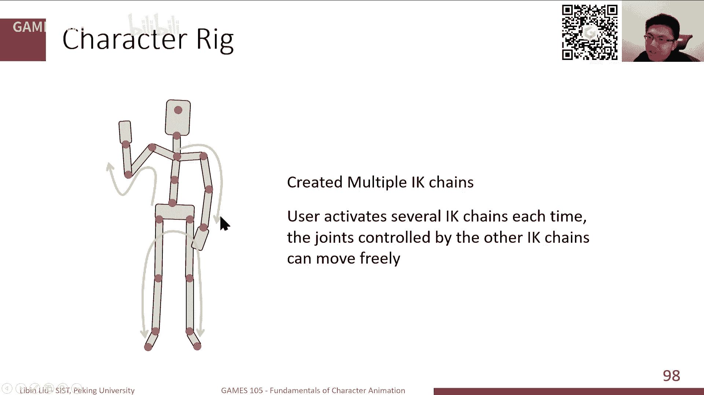
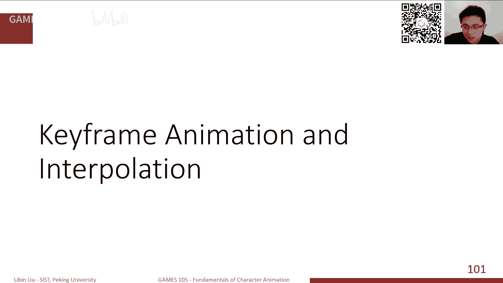
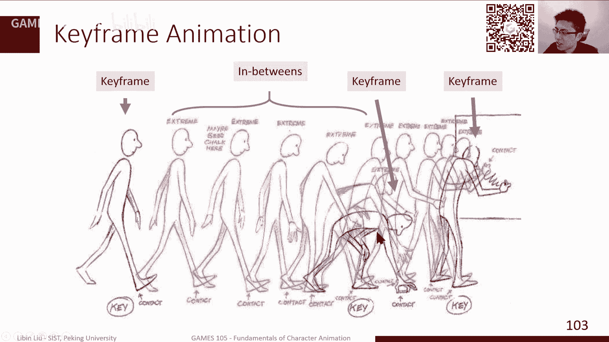

# GAMES105-计算机角色动画基础 - P4：Lecture04 Character Kinematics (cont.) & Keyframe Animation - GAMES-Webinar - BV1GG4y1p7fF

我们就开始上课。

非常高兴啊，大家第四次，今天是我们Game305计算机角色动画基础的第四节课，当然前面几节课可能上一课内容稍微有点难度，可能有些同学听起来稍微有点麻有点废，就是遇到一些困难。

当然我们今天可能会稍微再把上节课的内容再重复一下，当然我们额外的加了一些新东西，然后后面再讲一讲有关Keyframe Animation，就是关键帧角色动画里边一个关键技术，就是关键帧差值的技术。

我觉得整体来说今天的内容应该比上节课稍微简单一点，当然有什么问题的话我们课后还可以继续的交流，OK，上周我们一直也在说，就是我们的Game305，sorry，我们的第一个Lab。

就是关于潜向运动学和逆向运动学的这样一个Lab，我们总算是发布在了我们的GitHub上，当然大家现在可以去看一下，其实现在已经在上面了，如果大家有时候可以看一下，就是在我们的网站GitHub。

然后Game305，然后Game305这样一个Repo里边，我们现在有一个Lab，Lab1，如果大家打开Lab1的话，你可以看到这是Lab1里边的一些文件，然后还有一些基本的介绍。

整体来说这个Lab我们需要用Python来写，当然时间也是为了助教评分方便，我们对大家可以用的Python的库，这个模块我们还稍微做了一点限制，我们尽量大家只用Numpy和Scipy。

然后还有我们显示的Panda3D，这样的一个框架来写，如果大家有用的其他的比较少见的依赖库的话，可能我们在这个评分的环境可能没有装，可能大家的交上来的作业就没法运行，这可能就不通过了，所以大家还是尽量。

当然也是最后练习，因为我们毕竟还是上这门课，就还是尽量的用一些我们指定的这些Python的库，来完成这个作业，当然作业的最后的提交，我们其实是我们之前已经发在网上了，我们是用的Games。

以前一直用的这样一个作业提交系统，大家只要按照要求提交一个Python文件，提交OI的一些文件，如果你做了我们的选作的那部分内容的话，大家可以这样提交，然后总的时间我们是三周，从今天开始三周截止。

然后截止之后我们的助教会进行评分，当然实际上这个作业相对来说不是那么难，如果说你是做基本内容的话，所以说我估计可能两周也就差不多了，所以我们两周之后其实会有第二个作业，就是Lab2的那种。

然后我们可能中间会有一些重叠，但是这个也是希望大家能够多多参与，这个是一个挺不错的一个，但是助教也是花了不少功夫，在这个Lab环境的搭建上，OK那就刚才我们说的，其实我们这节课主要两个部分。

一个部分是简要的，回顾我们去年，上节课感觉好像是过了很久一样，上节课我们讲的，关于角色运动学的两个主要部分，一个是前线运动学，一个是逆向运动学，当然我们会额外的讲一点，我们其实一直就提到了。

这个motion returning的一些内容，另外第二部分主要是讲一讲，一些差值的常见的一些差值的算法，那当然首先就是回顾一下，我们上节课讲的内容，一个角色运动学，主要是前线运动学，是从知道pose。

知道每个关节旋转，去计算每个关节的位置，还有逆向运动学，我们知道末端节点，比如手的位置，我们想去反算出每个关节的位置，这是我们上节课主要讲的内容，那当然我们简先简要回顾一下，我们的前线运动学的部分。

我们知道我们对于任何一个角色，比如说这样一个人形的角色，我们通常来讲会把它抽象化成，有若干个关节和若干个骨骼，构成的这样的一个模型，当然骨骼总是围绕着关节旋转，并且在我们常见的角色里边。

一般来说我们关节是不会分开的，分开了有些特殊的角色，它是会分开的，但大部分情况下，骨骼只会围绕着关节旋转，而不会让它分开，当然这样一个结构的话，我们之前也说过，我们可以把它给表示成，一个竖形的结构。

从根基点开始，根基点通常来讲，我们会把它放在腰部宽部，然后从根基点开始出发，我们有若干条这样的一个运动学链，从根基点到脚，从根基点到手，从根基点到脑袋，这样子每一条链构成，就是这些链合在一起。

构成一个竖形的结构，在定义的时候，我们其实这个角色，它有一个初始化的一个姿势，然后在这个姿势里边，每两个关节之间，就是每个关节到它的副关节，它们之间的一个距离，其实是一个，相对来说是一个。

在这个副关节局部，要写的这样一个坐标表示，在这样的定义之下，如果说我们每个关节，加上了一个旋转，其实这个角色，就会被旋转到一个新的姿势，这个姿势下，我们的前项运动学FK，做的事情就是说。

当我给出了这样一个姿势之后，我们需要去计算，每个关节的朝向，每个关节的位置，当我们说朝向的时候，实际上是说，假如说我们有一个坐标系，它粘在对应的关节上，当我旋转完之后，这个局部的坐标系。

在世界坐标系它的方向，它的旋转，我们通常会把它叫做朝向，当然这个过程中，我们前项运动学计算，基本来说是一个迭代的过程，我们从根据点出发，沿着每一条运动学链，去依次积累，我们每一个关节上的旋转。

然后同样的，其实我们如果说，计算出了它的负节点的旋转，负节点朝向，我们把负节点的朝向，乘以当前关节的旋转，其实也就得到当前关节的朝向，类似的关节的位置，我们其实也可以，同样的通过这种迭代式的。

计算来进行完成，当然这里需要注意的是说，如果说我们知道了，每一个关节的朝向，我们知道朝向是什么，朝向是全局的一个旋转，代表了每个关节，它自己内部坐标系，在世界坐标系的位置，如果说我们知道。

每一个关节的旋转之后，每一个关节的朝向之后，如果说我们想计算，每个关节的旋转，这个其实相对来说，是比较容易的，我们只需要用负节点的旋转，sorry 负节点的朝向的逆，比旋转矩阵来说，它的逆就是它的转制。

用负节点旋转的转制，乘以当前节点的旋转，得到的就是关节的旋转，这是一个非常简单的这样一个关系，当然我们上面也提到了，其实我们的，包括我作业里面也用到了，就是我们一般来说很多的动作。

我们可以把它存在文件里，你们来说一个动作，它是有多个姿态，多个姿势来构成的，每一个姿势可能就是代表了，若干个参数化的参数，BWH文件，其实我们作业里会用到，它是一个非常常用的。

这样一个动作捕捉的文件类型，BWH文件具体的文件格式，大家可以去看一下，我们的就是这里的链接，其实我们作业里面，也提供了一个中文的链接，也是我们一个助教写的，一个简单的文档，大家可以去作为参考。

大概来说，其实对BWH文件来说，或者是对于任何一个动作捕捉，或者动作的一个文件类型来说，它可能不是BWH，哪怕是FBX，哪怕是比如说AMC，AMS，AMF，对这样的文件来说，它大概来说都会分成两部分。

其中一个部分，就比如BWH文件来说，它的这个文件的一开头，它会定义一个角色的模型，其实就是这个模型，它怎么定义这个模型，它是通过每个关节，相对于它附节点的偏移，它是一个三维的向量，通过这个偏移来告诉你。

这个模型长什么样子，就比如它会告诉你，这个肩膀的这个关节，到这个中间这个脊柱的这个关节，它的偏移多少，一般来说可能是一个X，方向的一个向量，然后类似比如腿膝盖的关节，在这个髋关节的下方多远。

它会给出你这样的一个偏移，来定义这样一个角色，那接下来一般来说第二部分，对这个文件来说第二部分，它一般来说会有若干行，或者若干个区块，那每一个区块，它会定义一个姿势，那怎么定义呢。

因为上面这个角色的这个关节，其实已经在上边，文件的前方已经定义好了，那我们接下来其实是后面，只需要定义每个关节，它的旋转，以及根节点的位置和朝向，那其实我们就已经定义好，这个角色的姿势了。

那我们把一系列的角色姿势，放在同一个文件里面，它就是定义为一个动作，那这是一个常用的，一个这个文件的一个表示，那当然这里就是一个问题，就是说对于我们一个角色来说，通常来讲我们有这样一个。

初始的这样一个姿势，然后把每个关节加上旋转之后，然后它会变到一个新的姿势，那么在这个初始的姿势，其实我们认为，它的旋转应该是等于0的，或者说它的这个，每一个关节的旋转，或者每一个关节的朝向，都等于这个。

如果用矩阵表示的话，都等于单位阵，那这样的一个pose，通常来讲，我们会有一个专用的名字，我们叫它T pose，那有些时候可能也叫它，Bend pose或者叫Reference pose，总而言之。

不管它这个pose是什么形状的，它总于就是我们讲这个，Reference pose或者讲T pose的时候，我们总是认为，我们总是指的是，就是说这样一个，所有旋转都等于0的，这样的一个姿势，OK。

那其实比如说这样一个，具体的一个角色，比如把它绑到一个，这个三维的角色模型之上，其实这个T pose，大概是这个样子，那当然实际上我们常见的，除了T pose之外，还有另外一类，叫做A pose。

其实A pose有很多种，非T pose就是A pose，就A pose一般来说，常见的这种常见，就是说这个手，不是水平举起来的，因为水平举起来，就是一个T，像一个T，对一个字母T，那这个它一般来说。

我们这个手可能是，一点向下半举，这样一个状态，然后这个看起来，好像是一个A字，所以它一般来说，本来叫做A pose，那实际上比如说，在我们的很多，见角色模型的时候，我们有时候会见到一个。

见到T pose，有些时候会见到A pose，那这个其实用哪一种pose，对于我们做动画来说，其实关系，如果说我们只关心，骨骼的移动来说，这个其实关系并不是很大，但是实际上呢，就是说可能。

如果我们有听众里边，或者我们的学生，大家有做过这个，有做这个动画方向的，比如说做过建模的，可能你可能有些经验，至少我的了解，就是说这个动画师，他在做绑钉的时候，他会比较喜欢A pose。

这个原因其实有两个吧，一方面是说，比如说我从一个正常的姿态，因为我正常人站起来，站着的时候，我的手是下垂的，这是一个比较，比较自然的一个状态，那如果说我要把手举平，那这个时候我的肩膀。

肩膀附近这边的肌肉，和这个皮肤，它会有一个比较大的形变，那这个时候，我如果把它绑在这个，一个3D模型上，那我做其他动作的时候，这个形变有些时候，有些时候会带来一些artifact，会带来一些这个。

一些走样的问题，那另外一方面，其实也是，就是不知道，有没有注意过，就当你把这个手抬平，做出这样一个T pose的姿势的时候，实际上不止你的肩膀，这个关节会旋转，其实你的这个，这个叫clavicle。

应该叫锁骨，就这一带，其实也会往上移动，就是整体来说，这个其实也是，给我的绑定带来一些难度，就当我做其他姿势的时候，你会感觉这个，这个角色看起来就不自然，所以很多时候，大家做动画时绑定的时候。

他会喜欢用A pose做绑定，那这样就，形成带来一个什么问题呢，就是说我们动捕这边，就是大家做动作捕捉的时候，大家都是一般来说，标准都是做T pose，然后你的角色，其实反而是A pose。

所以这经常有时候，会带来一些问题，那当然实际上A pose，T pose大家都可能比较标准了，我们说T pose，基本上就是这种，两臂平伸，两脚竖直站立，这是一个T pose，那A pose呢。

就这个种数就很多了，比如说这是一种A pose，这样也是一种A pose，你看这个脚会分得开一点，那当然这个也是一个A pose，你这个手可能在，分的角度不一样一点，那当然这个也是一个。

当然不是A pose，反正是某一个pose，那这个pose在什么时候会出现呢，其实有时候也经常会看到，特别是有时候，比如说我以前经常，比如从动画师那边，拿了一个绑定的模型，然后我把所有的关节。

设成0之后，哎呀那个角色就变成，这么一个奇怪的姿势了，那为什么是这样一个姿势呢，其实这个可能，我觉得某种程度上，也是可能跟动画师的经验有关，就是说通常来讲，比如说你在Maya里边，比如说这个软件。

我是怎么建角色的呢，我通常来说是，先建好一个胳膊，然后把这个胳膊复制一份，做一个镜像，然后再跟另外一个胳膊，拼在一起，然后腿一颗，甚至可能都跟胳膊，是同一个地方来的，然后最后建成这么一个pose。

那它这个过程中，其实Maya，比如像这种软件，它做镜像的时候，它会把那个镜像，对应的那个transformation，应该叫什么，叫那个变换，其实是会记录下来的，那这个transformation。

其实会带来的，什么问题呢，就是它会，它是一个非0的旋转，把它变成0之后，它就从transformation，就会旋转到原来，这个没有变的那个状态下，那就可能会出现，这样一个姿势，那当然可能比如说。

有些这个建模师，他有经验的话，他可能会做，做完这个建模之后，他会先做一步，这种清零的操作，比如让软件自动的，这个重置一下，每个关节的相对位置，这样的话可以保证，我这个姿势是比较正确的，那否则你会出现。

这种问题，那当然A pose和T pose，当然这个只是一般来说，只是这个两个reference pose的问题了，当然这里有一个，非常重要的问题，就是说比如说，我这两个角色，一个是T pose。

一个是A pose，对吧，那如果说我让这两个角色，同时把两个胳膊，向上旋转90度，那会发生什么事情呢，我们一看到，就是同样旋转了90度，这对T pose来说，它其实是做出了这样一个，类似于欢呼的姿势。

那对A pose来说，因为它开始的时候，手臂垂得更低一点，所以说向上旋转90度之后，它会变成这样一个姿势，就是没有前面那个T pose举得高，或者是反过来，比如说我让它们同时向下旋转90度。

那对于T pose来说，是一个比较正常的姿势，而对A pose来说，它其实旋转的感觉，明显过头了，变成另外一个姿势了，这样就是说，对于这个参考姿势，其实对于我们，就用相同的这样的一个姿态参数。

比如说每个关节旋转多少度，用相同的这一套姿态参数，放在不同的reference pose下，就是放在T pose下，或者放在A pose下，它所能呈现出来的。

这样的一个姿态，其实是不同的，比如说这是一个，我就是找了一个非常简单的例子，其实左边这是一个T pose，右边是一个A pose，但是我把T pose的每个关节旋转，让它去放在右边。

那个A pose上去进行播放，你可以看到对于同一个动作，对于这个T pose看起来，是一个正常的人在走路，那A pose这个人感觉是，稍微有点不太正常，就是这个手指总是会放开，OK。

所以这是一个非常典型的，这个A pose和T pose的一个问题，所以说这里我们需要解决什么问题，如果说我们想要用一些，比如说我们的角色就是A pose，我们接好的，它就是按照A pose绑定的。

但是我们的动作，比如说我们的动物数据，它是一个T pose采的数据，那我们该怎么把一个T pose的数据，映射到A pose，让A pose的这个角色，能够使用T pose的数据呢。

那当然这就是一个，所谓的retargeting问题，再讲具体一点，比如说我有一个骨骼，一个Skeleton，它的pose，它是用A pose来定义的，也就是它旋转，所有的旋转都等于0的时候。

它是这样一个姿态，然后在这个骨骼上，我摆了一个姿势，是这样一个姿势，然后我假设这里边，每个关节的旋转，分别旋转了一个角度，那个角度我整体来说，计为一个RA，它是一致的，那这个动作。

可能是来自于我们动物数据，那另外一个，比如说我有一个A pose，这是我绑定好的角色，绑定好的角色，那我也想站上这个角色，它也做出同样的姿势，那我这个旋转对应的是RB，那对于这个情况来说。

RB我是不知道的，我是想要计算的，那接下来的问题就是说，我能不能从RA算出RB等于多少，那这个就是Motion Retargeting问题，就是我们的动作重定向的，一个非常基本的问题。

那当然这个前提条件是说什么呢，就是我们只考虑，关节旋转带来的问题，但动作重定向，还有很多其他的内容，比如说关节的长度变化，那可能会带来一些，比如说穿模呀，比如说动作奇怪的这些问题。

那个其实是不是很好解决的，那个不是我们今天会解决的问题，OK，OK那回到这个问题，这个事情该怎么做，那我们可以从一个，非常简单的任务开始来看，这个比如说我现在有两个物体，就两个钢体，两个物体。

那一开始的时候，这两个物体其实开始的，处理状态是不一样的，就是说我们认为这个，比如这个物体，它是在旋转等于0的时候，它是表现出一个，横放的一个姿态，然后这个物体，它一开始的时候是斜着放的。

然后它也是这个旋转等于0的状态，就这两个物体我在创建的时候，就创建成这两个，这样一个姿势，然后一个，它们俩都是在这个旋转等于0的时候，是表现出这样的姿势，那如果这个A物体，比如说A物体。

因为这两个物体是，如果它们大家相同的话，那实际上我们总是可以把A物体，按照某一个方式旋转，让它跟B物体是方向相同的，就是能够重合的，那假如说这个旋转是RA到B，就用这样一个旋转矩阵来表示。

也就是说这个RA这样一个物体，当它的旋转是RA到B的时候，它所呈现的这个形状，是跟B完全重合的，就朝向和位置，其实是完全一样的，OK，那我们可以剪，就是我们就是稍微剪辑一下。

就是RA到B是把这个物体旋转到B，这样一个位置的时候，它所对应的朝向，那特别注意到这个B本身，它的旋转是0，所以说这是两个不同的物体，那接下来，比如说我有一个目标的一个姿势，目标的一个朝向。

我把这个A物体，经过某一个旋转，已知的旋转RA，旋转到了这样一个姿势，那接下来我想问的是说，我该如何旋转B物体，使得B物体能够到达这个姿势，其实这就是一个retarget的问题。

但是我们的retargeting是，针对一个物体来做的，那这个过程怎么做呢，其实我们知道从A物体到B物体，从A物体让它旋转到跟B物体重合，是需要做一个RA-B的这样一个旋转的。

那反过来如果我想把B旋转到跟A物体重合，那我需要做什么旋转，其实非常简单，我们就只要把RA-A到B的旋转，把它做一次逆变换，就可以做了，那当然这个逆变换，就RB到A，那应该就是RA到B的转制。

因为旋转矩阵嘛，逆就是它的转制，那我做完这件事之后呢，那这时候B物体的旋转，就跟A物体的重合了，那接下来因为我们目标的姿态，是A物体这样一个姿态，就通过RA旋转得到了，所以说为了把B物体旋转成这个姿势。

我们首先把B物体旋转的跟A重合，然后接下来再用A物体的旋转，去旋转这个旋转这个时候的B物体，那总的旋转应该是多少，那其实它是做了两次旋转，B物体首先做了一次B到A的旋转，然后再做了一次RA的旋转。

那随着我回想一下，第二节课讲的这个关于旋转的combination，旋转的组合的这样一个过程，我们可以知道为了把B物体旋转到这样一个姿势，那它需要加的旋转是什么呢，它旋转是RA。

这是后旋转它应该放在前面，然后乘上RA到B的转制，RA到B的转制其实就是往回走的这样旋转，那这个其实就是我们想要的关系，就是说当A物体和B物体只有单个物体的时候，我们知道A物体到某一个姿态的旋转之后。

那B物体到这个姿态的旋转，是可以通过这样一个公式直接得到了，OK，OK那前面我们这其实是提到是一个单个物体，那我如果说我们这不是一个单个物体，而是一个两个关节的这样一个链条，或者一个角色。

那当然我们为了标记简单，我们假设其中一个前面这个是一个副关节，那前面肯定固定不动的，也许是动的，这个我关节要了，就是它是一个副关节，然后这个右边这个关节是一个子关节，那同样的B它也是一个两个关节的。

一个跟A是完全相同的一个角色，这么一个角色，这么一个链条，那当然它在初始化这个旋转等于0，所有的旋转等于0的时候，它跟B的位置是不一样的，它是斜着的，然后A是直着的，OK，那同样的它是一个是负节点。

用PI表示，一个是子节点，用I表示，那我们进一步的假设，假设我们是知道的，我们是知道，从就是从A物体的这个子关节，它的全局的朝向，跟B物体的子，这个作为子关节的这个关节，它的全局朝向之间的差。

是用QI A到B这样的一个矩阵表示，那副关节，我们在全局的这个表示之下，它也是QI的PI A到B，这是我们的这个假设，这是我们知道的部分，然后另外呢，比如说我有一个这样一个姿态，目标的一个姿态。

从这个A物体旋转到目标的姿态，我分别需要把P的旋转，或者P的朝向变成RPA，然后它PI和P之间的这个关节，它的旋转应该是RI*A，这也是我们知道的，那接下来时间我们可以很容易计算出。

因为我们知道这两个是关节的旋转，所以我们可以很容易计算出，这两个关节在这个姿态下的朝向应该是多少，分别是QPA，是这样算出来的，然后QIA，这是子关节，它应该是副关节的朝向乘以关节的旋转。

得到了这样一个关系，OK那接下来我们对另外一个方面，比如说从B，如何能够得到这个关节的旋转，那首先副关节，因为这是我们要求的，假如说我们知道了，就是那副关节，它的旋转应该是RBPI，那子关节的这个旋转。

就是中间这个关节的旋转应该是RBI，就是这两个量是我们需要求的量，那假如说我们如果说这两个东西是知道的情况下，那我们其实可以算出来，在这个从B看来，这样一个姿势里边，P就是它的副关节的朝向。

应该是这么应该是RPI，然后子关节相对于这个，这个B链条的I，它的朝向应该是QBI，它其实应该是副关节的这个朝向乘以，这个后面这个关节的旋转，OK所以整个这里边，这部分是知道的，这个也是知道的。

然后两个R是知道的，RA是知道的，然后这个所以说整个RA的这个朝向我知道，然后RB这边朝向和旋转，我们都是不知道的，是我们需要求的，那我们应该怎么求呢，其实回想一下，我们当刚才讲。

当个钢体的这个旋转的时候，我们知道B的旋转，B的朝向，因为单个钢体来说，我们没有旋转，我们每个钢体的旋转就是它的朝向，它的朝向等于A的朝向，乘以A和B的朝向的差的这个逆，这是我们对于单个钢体这个。

单个物体，单个链条的时候，它的这个这个计算方式，那同样的其实前面我们把它所有的这个，关节的旋转，转成关节的朝向之后，那我们其实可以把每个关节的，副关节和子关节分别单独去处理，对于副关节来说，我这个变换。

其实是可以写成这个，副关节在A下面的这个朝向，就A的副关节的朝向，乘以两个关节，A和B两个两个Skeleton，两个链条，它们之间副关节的这个朝向的差，那子关节也类似的，我们可以做出这样的计算。

那接下来实际上我们对，我们其实这个时候已经知道了，在这个B这个Skeleton B，在五个B这样的一个条件下，它的这个旋转，就旋转到同样的这样一个姿势的情况下，的这个副关节的朝向和子关节的朝向。

我们都知道了，那这个时候我们想要去求这个B的中间，这个关节子关节的旋转，那么它应该是副关节的朝向的逆，乘以子关节的，乘以子关节的朝向，那得到应该是子关节的旋转，那我们其实可以把它展开，因为这里我得到了。

这他们两个用A和A到B表示的一个形式，那么可以把它分别展开，注意到中间这一块，中间这里中间这里其实是A关节，A骨骼的副关节朝向和子关节朝向，所以说这两个东西其实可以算出来，它刚好是等于A里边。

就是骨骼A里边，它所对应的这个关节的旋转，其实就回到我们刚才这里边，就是说实际上对于这个这两个，A关节A骨骼和B骨骼，就是A链条和B链条，如果说我们知道他们每一个链条的这个节点，副节点和子节点。

分别在全局下的旋转的这个位移旋转的偏移，以及A旋转到某一个姿势下需要做的这个旋转，那么B旋转到同样的姿势，那这个关节所需要做的旋转，其实是可以通过这样的一个表达能够算出来，就是副节点的全局偏移。

乘以这个子节点的在A下面的这个旋转，然后再乘以子节点的全局偏移，然后再转至这样一个形式，那当然这里对于副节点来说，因为副节点它没有副节点了，所以说前面这个是没有的，所以说对于副节点的这个计算。

我们只需要考虑后面这一半就可以了，OK 所以这其实就是两个链条，两个关节的链条，我们其实可以通过这样的方式，实现两个这个骨骼旋转T pose和A pose。

如果是A pose和B pose之间的这个动作的迁移，那类似的如果说我们把它再复杂一点，其实两个链条再泛化，其实就是我们正常的一个角色的这个迁移了，就比如说还是回到我们刚才那个问题。

我们有一个A角色它是T pose，有一个B角色它是一个A pose，然后A角色做出这样一个姿势的时候，它需要做RA的旋转，然后B角色做出同样的姿势，它需要做RB的旋转，所以这两个旋转一般是不同的。

那RB跟RA是什么关系，其实根据刚才我们的这个两个链条的旋转关系，其实我们可以很容易就得到，对于任何一个关节就内部的关节，我们可以知道它的对B关节，摆到同一个pose的情况下。

B的角色它每一个关节所需要的旋转，和A的角色每一个关节所需要的旋转，有这样的一个关系，那这个就是我们的motion targeting，一个最基本的一个这样的一个旋转关系，所以说就是其实你不需要用IK。

不需要用什么特别奇怪的一些，不知道什么的方法，其实如果说只是关节T pose和A pose之间的转换的话，我们可以很容易地通过这种方式来进行迁移，OK 当然还有一些其他的问题。

就是说比如说这两个pose，比如说A的角色和B角色，如果它的骨骼数量不一样该怎么办，那这个其实是稍微复杂一点，主要是说骨骼数量不一样的情况下，我们需要决定我们把哪一个关节的旋转。

映射到另外一个角色的哪一个关节上，这个其实是经常出现的问题，而且有时候不一定是骨骼数量不一样，可能骨骼名字都不一样，所以你可能需要手动做一些映射，当然好处是什么呢，如果说我们这两个角色，为什么黑掉了。

大家能看到吗，OK 好的 不好意思，我的B站的播放好像刚才出了点问题，OK 好的 如果大家没有断就没有问题，好的 那就刚才我们就说到，其实我们要做的这个retargeting。

就是说一方面是说我们每一个关节，我们需要把名字，比如一个角色的关节多，另外一个关节少，或者反过来，或者是名字不一样，我们通常来说需要做一些手动的映射，那当然来说对于人来说，比如说都是人形角色。

那我们可以期待，比如说他们俩肯定都会有相同数量的腿，腿上有相同数量的关节，然后身上胳膊上有相同数量的关节，所以说我们总是可以，一定程度上建立好这个映射，那建立好这个映射之后。

我们进一步去处理A pose和T pose之间的关系，或者说T pose和一个奇形怪状的一个pose之间的关系，那我们就可以比较不错的，让一个动作能够在一个角色身上能够展示出来，OK。

那前面主要是我们对一个前线运动学的一些回顾，但是我们稍微补充了一点内容，就是retargeting，那我们接下来讲一讲，还是回顾一下我们逆向运动学的部分，但是逆向运动学是稍微比较难一点。

因为主要是说通用来说，一般来说这个逆向问题总是会比前线问题难一些，当然我们前面也提到了，对于逆向问题，什么是逆向问题，或者什么是逆向运动学的问题，它其实是可以表示什么呢，OK 不好意思。

就是说我们通过前线运动学，我们可以计算出每一个关节的位置，特别是我们可以计算出末端节点的位置，但这个末端节点不一定是最后一个关节，那可能是中间的某一个关节，只要是这个链条上的最后一个点。

我就认为它是末端节点，OK 那这个节点，这个整个计算过程，我们总是可以写成表达成一个函数，那具体形式我们就不管了，我们可以符号上把它表示成一个函数，那x=fθ，fθ其实就是每一个关节的旋转表示。

那可能是欧拉角，可能是肘角，可能是Coternin，这个其实无所谓的，然后对于这个末端关节来说，我有一个目标位置，x波浪线，xτ，然后这个我是想要把这个点，它的末端点挪到这个位置的时候，我需要计算。

对应的θ应该是多少，实际上我这个其实我是求解一个方程，因为方程最终我的目标是想要，fθ的位置跟x的波浪线相同，那其实就是相当于，我需要去求解一个方程，这个方程是xτ，x波浪线减去fθ，那等于0。

那我们上节课也提到了，其实这个方程，我们可以等价地把它写成一个优化问题，那就是大概形式上写成这样一个形式，那当然有同学也问了，我刚才群里也问，说为什么这里是1/2，那为什么这里是平方。

这个其实完全就是为了我们后面求导方便，我们只是把它写成这样一个形式，因为我们求导之后，这个1/2就可以直接被消掉了，要不然这个总是带着2就很麻烦，那当然这个优化问题，有好多种不同的解法，其中一种解法。

就是所谓的循环坐标下降方法，因为我们这个坐标，这个θ它是一个向量，比如说对于这个观念来说，它至少有四个，有四个参数是我需要优化的，所以说对于每一个参数来说，循环坐标下降的做法。

就是说我分别沿着每一个参数，所对应的那个坐标去做搜索，然后搜索到某一个值时候，这个值对应的能够把我，沿着这个坐标上的所有的，这个目标函数的值变得最小，那我就认为我下一次deadeye，就从这个点开始。

所以说每一步我都在解一个优化问题，只不过这个优化问题是一个，是一个我只去优化这个函数的，一个变量的这样一个优化问题，所以它是一个循环坐标下降的方法，那当然表现在IK这个问题里边。

其实我们上一课也给大家提过，它其实是一个非常简单的，一个有点像启发式算法的这样一个过程，就是我每次旋转一个，依次旋转我的这样一个关节，按照某一个确定的顺序，然后每次比如旋转关节3的时候。

我会把关节3旋转，使得这个末端节点和这个目标点的连线方向，跟关节3跟这个目标点连线的方向是相同的，那依次的比如说关节2，我们也同样的做这样的旋转，然后关节1做这样的旋转，关节0做旋转，然后依次略退。

直到我们旋转的足够近，那当然我们上期可以提到，就这个为什么我们要做这样的旋转呢，或者我们为什么要把它旋转到跟这个，跟这个3到X之间的这个距离，这个向量平行呢，或者重合呢，那它主要是因为。

本质上我们是要在求解这样一个优化问题，而这个为了让这个，它本质上优化问题上，它的优化问题本质上是想让这个4的这个节点，跟X基本能近，然后在我旋转3的时候，如果说3旋转一圈。

那它所对应的这个4所划过的这个空间，就是一个圆球，一个圆周，或者一个圆球，那这个圆周上呢，离这个X最近的那个点，肯定是3跟X连线，跟这个圆周的交点，那这个具体证明，大家可以自己去证了，这个很容易证明。

所以说，这也就是说，为什么我们要把4旋转到这个点，就是因为这个点，其实是这个函数，在指优化3的时候，它的最小点，那如果说我们有另外一个问题，另外一个问题，比如说还是这样一个。

类似于跟刚才的连线很像的一个连条，但是唯一的区别呢，这里关节2不再是一个旋转的关节，它不能转，但是呢它是可以伸长的，那对于这样一个关节来说，我们该怎么做这个CCD呢。

其实做第一次这个阻压下降是没有问题的，因为3是一个可旋转的关节，所以我们其实还是一样，把3旋转到这个重合于这个连线的方向上，那接下来2该怎么办，那2它现在我说它是一个可以伸长的关节。

这个伸长关节可以表示，类似于什么，类似于一个，比如想想打气筒，打气筒就是一个可以伸长的关节，它不能旋转，它不能沿着那个打气筒这个位置旋转，假设这个2，3是一个打气筒，那我们在这个打气的过程中。

这个我们去把它伸长缩短，那这个过程中你会发现，这个随着我3，4这个关节，沿着2这个方向去移动，这个4所走过的这条线，其实应该是沿着跟2，3这个关节方向，所平行的一条直线，OK。

那接下来按照CCD的这个基本算法，我们其实目标是想要去找到一个长度，对于2来说它的参数就是这个伸长的量，想找到这么一个长度，使得我这个4的位置跟x尽可能近，那问题就来了，这个最近的这个点在哪里。

当然我们以前前面也说了，就是如果说3，4沿着2的这个方向随便移动的话，它是会形成一条直线的，所以说这个最近点，应该是外面这个点到这条直线的距离，这个具体是什么，是这个点到这个直线的垂线的距离。

所以实际上就是说，我其实可以沿着x向这个2，3这条D方向做一条垂线，那这条垂线上这个点跟这个4能够达到这个点，就应该是我对应的那个点，也就是说我其实会把3，4，就把2，3伸长。

然后直到伸到4跟这个垂线重合的时候，那它应该就对应到这个极致点，所以这其实也是最高限，就是实际上如果说你知道了坐标情况下，它本质上就是一个优化问题，那其实对于一个更加奇形怪状的一些关节。

我们其实可以有同样的思路去分析它，然后可以去找到一个合适的解决，OK那类似的我们可以不断地做，剩下的关节就是旋转关节了，我们可以继续这样的循环，那其实可以这样继续拉长，然后这样做，OK行。

这就是循环坐标下降，那当然我们前面也提到了，循环坐标下降不是一个非常快的方法了，想要再快一点的，那我们需要用一些雅克比矩阵的方法，那雅克比矩阵有两种，我们需要用的是什么呢，就是说这个前项运动学。

它把它写成一个函数之后，它应该是它的对这个，它每一个参数的导数，对每一个，因为F本身是一个三维向量，是一个三维向量，是一个高维的函数，这个函数对它每一维的这个参数做偏导，然后把这个偏导。

每一个偏导写成一列，写成一这个矩阵之后，那这个矩阵叫做雅克比矩阵，但如果大家对这件事情搞不清楚的话呢，我建议可以去去看一下大一下半年，可能是大一下半年，这个新生态数有关多元微积分的，多元微分的部分。

那里会比较详细的会讲这个，这个导数到底是什么，在我们知道雅克比矩阵之后呢，那我们其实可以做两种不同的方式去进行迭代，一种方式是这个雅克比转制的方式，它其实是实际上是说。

我们知道当前这个莫德纳位置和目标点位置的偏差，比如我们叫做delta，那这个雅克比转制的方法，实际上我会用这个delta乘以，雅克比矩阵的转制，它给出了一个方向，那这个方向是我更新这个参数θ的方向。

那另外一种方式呢就是雅克比，雅克比inverse就逆雅克比矩阵这样一个方法，其实跟前面这个形式是非常相近的，唯一的区别就是这里不再是转制了，而是一个雅克比矩阵的尾逆，那当然我们上一节课也提到了尾逆。

为什么要做尾逆呢，因为雅克比矩阵不是方阵，然后对于不是方阵的情况下，我们只能去做它的尾逆，那这是我们上节课讲的内容，当然这里非常重要的就是说这个雅克比矩阵怎么算，那我们也提到了，很简单的方法。

你用这个πtouch实现一遍forward kinematics，实现一遍fk，那对那个方程进行求导，那你就得到了一个雅克比矩阵，那如果说你没有这种方式的话呢，其实只是对一些特定的问题。

比如说我们如果这个所有关节都是hinged joint，那我们可以通过差乘的方式来计算雅克比矩阵里的每一列，那当然我们也提到了，雅克比矩阵的每一列，对应的是其中某一个关节的旋转参数。

那如果是所有都是hinged joint的话，那其实就是一个hinged joint的旋转角度，那这个时候呢，它这一列的竖直应该是这个hinged joint，这个旋转关节的旋转轴。

差乘这个关节点到末端点的位移的这个向量，那这是每一列，我们需要对每一列分别去做这样一个计算，那当然上节课有一个一流问题，就是说如果说我们不是一个hinged joint，而是一个ball joint。

那该怎么办，当然我们是当时直接给出了结论了，就首先ball joint来说，一个ball，它其实可以有三个自由度的旋转，那对应的话我们需要用三个参数来表示它，其实本质上就是一个正常的旋转表示，然后对于。

如果说我们把这个旋转表示成一个欧拉角，那欧拉角是三个旋转的叠加嘛，那么它其实这个欧拉角你可以等价的认为，它是三个hinged joint，集联，就是一次连接，但是它们连接之间的关节是长度是零。

所以它们三个点在同一个位置，然后我们这个对应的雅赫比矩阵应该是对应的三列，然后每一列分别对应于欧拉角的三个角的这个偏导数，那当然我们也直接给出了结论，就是说OK这个每一列它应该是这个轴乘以我的这个r。

然后这个轴是这样的一个形式，看到有朋友也在问，为什么这三个轴要这么算，当然上节课我们其实这个地方讲的不是非常的仔细啊，我们再稍微都补充两句，就是说实际上对于这样一个欧拉角，假如说我们现在就是先不管z吧。

我只管rx*r，ry它对应的是什么旋转呢，它是说我先把这个坐标轴这个这个实心的这个坐标轴，沿着x做了一个旋转，沿着x做旋转，x轴是不会变的，那y和z轴会稍微旋转一点，转到这样一个角度上。

那然后再做r的旋转，它是沿着这个旋转之后的这个坐标轴，它去旋转的，其实你是这样的表示，这是intrinsic的表示，你总是可以，总是可以理解成这样的旋转，就是rx*ry。

我说先沿着x轴没有变过的x轴旋转，然后再沿着变过的y轴旋转，那我做了两次旋转，所以说对于第一次旋转来说，对于x的参数来说，我们如果把它假设成一个hinger joint。

它的旋转轴应该就是世界坐标系的x轴，那在这个后面做y旋转，它的旋转轴是哪一个，它旋转是局部坐标系的y轴，那局部坐标系的y轴，实际上它是通过rx轴旋转之后得到的。

所以说它对应的是四次世界坐标系的rx*y这样一个轴，OK，那当然在此之外呢，其实因为这不是第一个关节，不是根关节，所以它其实它的副关节也带有，本身也带有一些旋转，所以说这个一开始rx的旋转。

它其实是在副关节旋转之后得到了，所以说它在世界坐标系的表示，应该是副关节的旋转，副关节的朝向乘以这个轴，得到的是这个x轴，那对应的y，其实最前面还要再乘以一个朝向，所以说就回到了我们上次的这个扇子。

得到的这块，为什么三个轴是这样的方式，实际上是欧拉角得到的这样的结果，OK，那这还有一个非常自然的问题，我们是否，因为我们知道前面提过的，我们的这个参数，旋转的参数表示有好几种，其中一种是轴交表示。

轴交表示好像非常自然，因为我们前面一直说都是轴，轴的方向差成这个距离，那我们如果说我们把它表成轴交表示，我们这个甲和壁矩，是不是也可以这么算呢，那当然结论是不可以，因为主要是说，对于轴交表示来说。

你的参数是每个这个轴交表示的三个变量，然后这个三个变量，它在改变的时候，它是同时改变了旋转角度，并且改变了旋转轴的方向，大家要理解这件事情，所以说如果说我们用轴交表是一个旋转的话。

如果用轴交表示来参数化一个暴撞的话，那它的甲和壁矩这个计算是非常，相对来说会复杂很多，这个公式我就不写了，但大家只要知道这个东西就复杂很多了，如果真的说你需要计算的话。

那我其实很建议你用拍套子自己写一遍，然后用拍套子来算，这可能还更准确一点，更不容易出错，OK。

那回到上一站我们讲的这个，其实我们上一节放了一个video，就是这个video，看起来非常fancy的一个Character Rig，就是这个我们可以随便去调这个Character。

然后这个它里面有很多很多不同的关节，我们可以去改这些关节。

然后去调一个关节的姿势，那当然这里就是说我们前面提到，这个所谓的Character IK，就一个链条来说我们可能可以，就一个末端点就能解决问题了，但对于一个这个角色来说，那它的关节点关节很多。

而且实际上同时我可能会要求，比如说我讲你这两个脚不要动，然后你身体动，然后你的手可以动也可以不动，然后类似于这样子，然后每一条这个要求，其实都会对应于一个优化问题，那我总的这个姿势。

其实是所有这些优化问题的这个，优化问题的总和，那最后我们可以加一个，正则项来避免我旋转过多，那当然这个其实你，如果你建立好这个优化问题之后呢，那你自然可以算雅克比矩阵，然后用雅克比矩阵去做这个。

Jackie Bean Transpose也好呀，去做Jackie Bean Reverse也好呀，那都是可以做的，那实际上还有一些其他的方式啊，就是比如说更加heuristic，更加这个启发制的方法。

就是通常来讲，比如说我们知道这个角色，它总是会可以抽象来说是，由若干个这个链条来构成的，每次都是从根基点开始，比如说我要移动这个手的位置，那我要是根基点不要发生变化，那我其实可以只需要把这个。

这是一根链条了，我们前面讲IK的时候，我们一直都是用一根链条来做，做展示的嘛，所以从这个根基点开始，做这一根链条，那可以非常简单，我们前面的IK的算法，都可以直接拿来用，包括你怎么算，你雅克比矩阵。

你也可以用的，那当然另外一个问题，稍微复杂一点，就是说如果说我做这个链条，移动的时候，做这个IK的时候，我想让手移动到这里来，但是我要求你的脚不要动，那这个时候其实从这个脚开始，从脚到腿。

小腿大腿到根关节点，然后到我的这个躯干，然后就到手腕，这一整条是一个链条，那这个链条本身，我们其实也是可以去，使用我们这个IK的，那当然这里需要注意一个什么问题呢，就是说这个链条，跟刚才这个问题。

跟前面这个问题，不同点在哪，在于它是穿过了根结点，而我们一般的角色的姿态，的这个表达来说，它是根结点，给出根结点的位置和朝向，加上每一个关节的旋转，那这里根结点是比较特殊的，所以说为了做IK。

我们大概可以做什么呢，大概是两步走三步走，首先我们先不管根结点，我就是用这个链条，上的每一个关节，我先去算一遍IK，那这个IK会给我什么呢，其实会给我每一个关节的旋转，那给出每一个关节的旋转之后呢。

我再做一遍FK，但实际上你做IK的时候，你其实已经在不断做FK了，所以说实际上你就用，最后一次FK的结果，那这个FK结果里面，其他关节其实不关紧要，但是根关节的位置是比较重要的，从这个点假设点不动。

你从这个点，沿着这个链条做一次FK，你会算出一个新的根结点的位置，然后你就把根结点位置设置成，你算IK得到的这个位置，那朝向也设置成，这次IK得到的朝向，那接下来还需要做一件事情，就是从这个关节出发。

如果从这个关节出发向上走，你比如说这个膝盖这个关节，你算出来这个旋转，其实是把这个，从子关节看来去旋转，副关节的一个旋转，但实际上我们参数化的时候，是从这个根结点开始，从宽关节开始，它实际上是要求的是。

从副结点看来去旋转，子结点的旋转，那其实这两个是刚好逆过来的，所以说实际上，从这个结点出发到上面去，我算出这两个关节，这三个关节的旋转，那我当我把它转化成，从root出发的这个，正常的姿态表示的时候。

这三个关节的旋转我需要求反，因为它是对于这个，对于条来说，我其实是旋转了副结点，而对于这个根结点来说，我其实是旋转的是子结点，所以它俩是相反，这个其实也是需要注意的地方。

那类似的如果说有两个constraint，那比如说我要求，sorry，好对这是另外一个，如果说我还是刚才那个问题，前面是我是移动手，但是呢其实另外一个问题，就是我移动这个root。

其实想想前面那个video里边，其实有很多这样的例子，就是两个脚不动，我一下挪动一下躯干，那其实就是腿会在，其他地方发生变化，然后这个躯干位置会发生移动，而这个脚位置是不变的，实际上这个问题。

跟前面问题是一样的，其实比刚才前面问题，还再简单一点，因为前面这个问题，我其实是要算手的，这个问题我只要算到root就可以了，所以说本质上它是，常常的方式可以解决掉，但另外一个稍微复杂一点的问题。

就是说我同时要求两个脚都不动，然后去移动这个根结点，或者移动上面的，比如头的这个关节，那这个时候该怎么办呢，这个就稍微复杂一点了，就是说两种方式，一种方式说我还是，去构造一个更加复杂的。

就更加通用的这样一个优化问题，那我其实可以继续算甲隔壁枕，算这个甲隔壁枕的转质之类的，去算这个优化，另外一种方式也是启发式的，就是说我们其实可以，比如说先从左脚开始，先算这个链条，把右脚先忽略掉。

它怎么动我们不管，这个电条移动完之后，那这个时候我发现，这个左脚已经偏移我原来的位置了，然后再把它拽回来，所以大概是这么一个，Horizontal的方法，其实也可以实现类似的效果，那当然实际上。

包括我们前面那个video里边，我们这个视频里边，那个角色的这个模型，它的这个IK，实际上是多个IK的一个总和，就通常来讲，比如说我这个角色，可能会见很多个IK，比如说从根结点出发，到两个脚。

分别是两个IK，两个IK的链条，然后到两个手，是两个IK的链条，到头是一个IK的链条，可能还有很多，其他的复杂的更复杂的链条，这个系统，然后每次我用户，比如说我需要挪动，这个根结点的时候。

那我其实可能是同时去，让这个，所有的这些链条都启用，然后来实现，它不要出现这个移动的问题，不要让这个，就是我在这个计算过程中，可以同时可以保证，每个手的位置和脚的位置不变，那如果说。

比如说我只移动脚的时候，那可能其他的链条是不变，是不会被启动的，那我就是这样的话，我只会影响这个，只会通过去求解，这一个IK链条，来实现对脚的移动，然后在这个过程中，比如说有些链条，可能它是不起用的。

那比如说我可能自由的，我可能用IK来移动手，那可能它可能会带到，我上半身发生一些移动，那这个过程中，实际上其他链条是说，我在去求解，一个下一个问题的时候，我会用这个，上一个问题的那个。

已经解出来的那个位置，作为一个初始解。

来进行求解，那回到刚才这个video，其实这个，其实中间有好几个地方，是展示了这种效果，就实际上这个video，其实它就是好多个，这个IK的这样一个设定，就比如说我在移动手的时候，实际上我可能会把。

整个胳膊会发生移动，但是我在移动另外一个，比如在移动胳膊的时候，这个手的位置，会自动固定到，这个刚才移动过的位置上，那这样的话，它会这个让我的这个，整个这个条的这个过程，是比较符合直观的。

比较符合自然的，行OK，那我们其实就是相当于很快的。

也不算很快，大概已经差不多一个小时了，我们就回顾了一下，前面IK的，FK和IK的主要内容，然后这个，然后我们有稍微多讲了一点，关于这个retargeting，关于这个动作的重新线，然后还有IK。

这个Full body IK的，一些额外的一些内容，当然时间关系，我们这个question先不讲了，我们到最后再一起来问问题，好的，那我们接下来是我们这节课的，第二个部分，就是关于关键帧动画。

以及这种关键帧插值，那实际这个地方，最主要的是关键帧插值，因为关键帧动画，我觉得这个非常非常简单。

非常简显易懂，当我们知道这个，一般我们说动画嘛，其实它的起源，或者它很早期的动画，就很多种不同的形式，比如说这种，这种就是在叫一种，其实它也不是走马灯。

因为走马灯一般说的是那种，在灯外面画一圈，然后这个灯会不断转，那个东西叫走马灯，这个东西，其实好像没有中文的名字，我不知道它应该叫什么，但大概就是说，你其实这个，它是一个你可以从这个上方的。

这个孔洞去看里边这个画。

那这个孔洞，它不断会挡住这个光线，其实可以给你造成一种，这个画面，就让你看不到画面切换的过程，那因为视觉暂留，这个效果嘛，所以你就看起来，这个动画，这个画是会动起来的，其实我们知道现在电视。

我们一直常说的，这个电视它基本原理就是这样子，你在两帧之间插一帧黑帧，然后你看到的动画，就是动作是连续的，那如果你插的足够多的话呢，整体来说就是连续的，OK，那这样的话，我们看到的这些帧。

其实就是所谓的关键帧了，就是我们看到哪一帧，然后这个它们会动起来，它们连接起来，会形成一个动画，那当然现在我们一般，做一个动画的时候，实际上我们会做的更加这个，就是比如说，作为一个手工设计。

手工绘画画这个动画，那我们通常来讲，动画师他会先把一些，一些这个动作的，一些重要的一点，比如说这个走路，然后捡东西，然后再站起来，放在那儿，然后这个过程中，其实比如走路，开始这个姿态是比较关键的。

然后蹲下来，这个姿态是比较关键的，然后这另外一个姿态，是比较关键的，然后这些其实是，所谓的关键帧，然后从两个关键帧之间的过渡，那所谓叫这个过渡帧，这个叫in between，所以说这是关键帧。

当我们知道关键帧之后，我们如何求过渡帧，这样的一个过程，实际上就是我们这个绝对动画里边，做差值的一个，非常重要的一个问题，那当然我们大部分情况下，我们过渡帧不会有这么长，因为当然，因为现在有一些技术吧。

比如说一些新的，绝对动画方面领域的这个研究，它也会做一些，一些探索，就是说如果说，这个关键帧之间离得非常远，比如说这个人在门口，另外那个人已经坐在椅子上了，那中间我这个人需要，我怎么去生成。

从门口到坐到椅子上，整个这段动作的这个流程，那其实现在一些新的研究，是在做这些事情，那当然对于我们，这一般3D动画来说呢，我们通常来讲，不会有这么远的过渡帧，就是通常来讲，这两个过渡帧之间。

还是相对来说比较近，那在这种情况下，实际上我们就是说，做了一些过渡帧之后，我们是希望把这个，把这个关节，我们是希望把这些过渡帧，我们把它平滑地连接起来，比如过渡帧，不好意思，或者关键帧。

比如说我可能每隔一秒，做一次关键帧，或每隔半秒做一次关键帧，然后但是我整个视频播放的频率，可能是60fps，或者是比如说30fps，那从这个，从两个关键帧之间，可能就有若干帧，是我没有给出的。

那我们这个关键帧的插曲技术，就是需要从我给出那几帧里面，去把我没有记录的那个关键帧，把它给算出来。

是这样一个过程，sorry，那当然来说，我们这个关键帧插指的技术，我们可以更加抽象起来，它其实就是一个，一个就是数据点插指的一个问题，就比如说我给出了若干个点，这个data points。

比如说这里x是一个横坐标，当然我们可以认为它就是时间了，然后y是某一个参数的值，那可能比如说是，比如说一个，比如说我的一个肘关节的旋转，那可能对应的是y，那我给出了若干个关键帧上的，对应这个坐标的旋转。

它的值，那接下来的问题就是说，当我给出这些离散值之后，这个插指问题是说，我想去找到一个函数，这个函数是我的横坐标，这个时间或者是x的函数，它首先满足在所有的这些点上，在所有的给出的这些点上。

这个函数的值跟y是相等的，然后除此之外呢，我还需要去计算，这个一个新的点x，这个点可能是我们从来没有见过一个点，在这个点上，我需要去计算一个合理的，对应的这个参数的值，y的值或者fx的值。

就是一个插指问题，那当然我们插指啊，就我们一般说插指，其实有两种不同的插指方式，一种是所谓的内插，一种所谓的外插，一般来说我们做动画领域，我们常用的都是内插，就是说我要查询这个x的位置。

是在我整个给出的数据点的x的范围内，那如果这个x落在范围外呢，那这就是外插了，通常来讲外插会经常会有些问题，一方面它不准，另一方面它有可能会出来，比如说出来一些非常奇怪的一些值。

但是主要原因也是因为外插，我们缺少了一边的约束，就是我们不知道外插，比如说x在这里的时候，x在左边我们是没有任何信息的，那这种情况它应该取多少，我们是不知道的，其实就好像就是我们经常以前做的一些。

所谓的质类题，比如说给你四个数，第一个数是1，第二个数是2，第三个数是3，第四个数是4，然后你第五个数是多少，那这里就没有任何保证，你也不知道第五个数是多少，按照规律可能是5。

但其实我说100也没有问题，反正我只要找到一个函数，把它给拟合上就没有问题了，所以说实际上这个对于内插来说，其实就是我们说的函数拟合问题，或者函数叉值问题，就是我们下去算一个函数。

它能够去首先在每个点上，达到每个点的这个函数值，同时在一个新的函数点上，我们能够计算这个新的函数，新的这个值，那这个所谓拟合函数，所谓叉值函数，当然有很多种不同的方法了，比如最简单的。

这种所谓的这个t度函数，就是如果只要我没有遇到下一个x，那我就保持当前x对应的y的这个值，这是一个非常简单的t度函数，那对这个t度函数来说，实际上这个fy就在这个点的值，它应该就是它前面这个y的值。

当然t度函数有很多种不同的定义方式了，这是其中一种定义方式，还有些其他定义方式，比如说我可以定义成，当前x的值是多少呢，它是离这个x最近的给出的那个x，所对应的y的值，其实是类似于这样的一个曲线。

那当然集体函数也非常不好，因为它不连续，看起来就是总是蹦蹦跳跳的，所以说我们跟查查用的，也是一种常用的方式，就是所谓的这个，就是所谓的这个线性查证函数，线性查证函数其实非常简单。

就是我把这些查证点画出来，然后那两个点之间做条直线，当我要查询一个新的点的时候，我就把它落到这条直线上，然后查一下这个直线上，当前这个值是多少，所以说这个值，因为我们知道直线的方程，我们可以很容易。

首先我们可以算出斜率，然后可以很容易写出直线的方程，那最近的这个x的位置，它所对应的值，应该是大概是这样一个形式，那当然我们可以稍微把它变一变形了，其实我们可以把x写在一块，然后y写到另外一边。

那我可以把前面这个x，可以用另外一个符号来代替，比如我改成t，用t来代替，那么其实我们通常讲，t取值范围是从0到1，那0的时候是代表前面这个值，1的时候代表后面这个值。

然后f2是中间t等于某一个数的时候，这样一个值，这是一个线性差值的一个表示，那当然线性差值，我们也可以把它再变形一下，形成这样的形式，它类似于是说，我用t是一个混合的一个参数，我用t这个参数。

去把两端y1和y2，就是x1和x2之间的这个两端的值，做一个混合，得到当前的这个值，那这也是线性差值的另外一种形式，当然这个时候我们其实有一个非常重要的性质，就是我们需要注意，想要我们差值方式能够提供。

就是所谓的平滑性，或者说它的连续性，就比如说一开始我们的阶梯差值，阶梯函数，它有一个非常重要的问题，就是说它是不连续的，就是它在某一个点上，它是间断的，就是这两个点属于同一个x，但是它的值是不同的。

然后类似的比它平滑一点的，就是我们所谓的这个线性差值函数，它实际上整个这个函数值，是不会发生间断的，但是你会发现它是一个间间的形状，它的这个速度是不连续的，那类似的我们可以进一步的要求它，再平滑一点。

再光滑一点，我们可以进一步要求它在中间这个连接点上，它的速度也是保持一致的，那看起来再平滑一些，那可以再进一步的，我们甚至可以要求在这个点上，不只是速度一致，我们要求它的加速也是一致的。

那就是适应的这个所谓的C2平滑，但实际使用过程中，其实我们肉眼能够看出来的范围里边，其实C1平滑和C2平滑的效果其实差不多，就是你经常还是看不出来，它们到底有多大的区别，当然这可能是在那个建模领域。

比如说这个几何建模和制造领域，可能它有比较大的区别，OK，所以我刚才提到了，比如说这个线性函数，虽然说它是连续的，但是它不光滑，它不光滑还体会表现什么效果呢，就比如说我看到这个角色，会有一个很奇怪的。

就是先往一个方向动，然后突然就开始转向，下一个方向动，这样的话就有一个非常明显的，就是这个顿挫感，所以实际上很多时候，我们还是希望缓震的技能光滑一些，那这个时候就需要一个。

非线性的产生函数来帮我们做这一点，OK，那实际上我们最常用的非线性函数，其实就是所谓的多项式，OK，不好意思，我们多项式，其实可以写成x的若干次方的，这么一个集数和的这样一个形式，那如果说我们假设。

我们是要用一个多项式去做差值函数，那么该怎么去，因为这里多项式来说，我们定一个多项式，需要知道每一个项的系数，那么该怎么求这些项的系数，那首先我们其实已经给了，有这样一个数据集了，里面有比如说n个点。

n+1个点，从0表号0到n，那这n+1个点，那对第一个点来说，对x0来说，我们可以写出f(x0)，在这个多项式表达之下，它的值应该是多少，它应该是这个，我就直接把这个s代替成x0就好了。

然后根据我们差值的要求，那肯定f(x0)它应该等于y0，这是我们的差值的要求，那接下来对于我们这个多项式，这个数据集里面的每一个点，我们都可以，我们都可以列出这样一个方程，x0是一个方程，x1是方程。

一直到xn也是一个方程，那这些方程，那每一个的都是，就这里边位置量，其实是所有的a，这里x其实都是已知量，那么可以把这个位置量，写成一个列，然后已知量写成一个矩阵，那其实构成了类似于这样一个矩阵的形式。

那我知道得了一个矩阵之后呢，那我如果想要求这个方程的系数，那其实只要把右边求个逆乘到左边就可以了，其实可以得到这样的形式，那当然这里有一个前提条件，就是说这个方程必须是可逆的，那什么时候可逆呢。

首先它必须是一个方阵，那什么时候是一个方阵呢，因为我们这里有，因为整体来说这里是n个方程，我们有n个点嘛，n个点对应n个方程，那有多少个未知数呢，这是一个n阶的一个，小n阶的这样的一个多项式。

那它的未知数是n加1个，所以说我们至少需要一个，大n-1阶的一个多项式，才能保证它是方阵，才能保证我这个差值这个函数这个方程是有解的，OK，那当然这就是说，比如说我有10个点。

比如说这个差值函数有10个点，那我就需要一个9阶的多项式，那比如说我差值函数有100个点，那我就需要99阶的一个多项式，才能把这个差值函数给算出来，那当然这里有一个非常重要的问题，就是所谓的笼格现象。

笼格现象说的是什么呢，就是说一个高维的高阶的多项式，比如说一个10阶15阶甚至20阶的多项式，比如这是一个15阶多项式，如果说这个15阶多项式去，去拟合一系列的点，它可以拟合的非常精确。

但是呢在这个点靠近边缘的地方，在这个范围靠近边缘的地方，它会出现一个非常巨大的震荡，因为这个其实也很容易理解，因为这个Rx的15次方，当Rx大于1的时候，这个15次方会把Rx变得非常大，比如说2。

2的15次方是一个非常巨大的数字，所以说不管前面这个a15是多少，它总是会把这个，就是边缘的地方会变得越来越大，越来越震荡，变成这样一个形式，所以实际在差值里边，我们总是不喜欢这种震荡。

这种震荡呢我们是不可控的，所以我们是总是希望，我们能够尽可能用一些低的多项式，来去做这个拟合，来去做这个差值，但是我们前面也提到了，因为如果我们用多项式的话，那不管用多少个，就是如果说我们有N个点。

大N个点，那我们一定这个接触是不能小于大N减1的，不然的话我是不可能满足，我的差值的这个点上的要求的，这时候该怎么办呢，其实一个想法就是说，我一次去拟合所有的点，是不好的，那我们可以一段一段的拟合。

每一段我只拟合几个点，比如说我每次只拟合三个点，只拟合四个点，那我可以只用一个三次多项式，就可以完成了，如果每次去拟合两个点，那就是一个一次多项式，那这就所谓的这个样条差值，或者叫分段差值。

那基本思想就是说，我用一系列的低阶的，这个分段的多项式，去拟合我给出的一大堆参数，去做这个在对大参数之间做差值，那刚才我们说的，其实一开始我们给出的这个线性差值函数，其实就是一个分段线性的一个样条函数。

它做的事情就是说，我每次去在两个点之间做一个差值，做一个拟合，然后它只需要一次多项式，那一次多项式就是一个线性函数，其实可以这样的形式，那实际上用了更多的，用了很多的一种方式，就是所谓的三次样条函数。

三次样条函数是什么呢，就是说我是把每一个，它是一个分段的一个函数，然后每一段是一个三次多项式，就S立方加上S平方，加上X加上长数项，构成这样一个函数，然后我每一次其实是，就这里每一段。

都是一个小的三次函数，然后它们是首先是保证连续的，其次还是可以保证，一定程度上可以保证平滑性，当然样条嘛，其实一般来说我们讲。

一般来说我们讲一样条，大部分来说都是说这个，所谓的三次样条，就是这个这个，因为为什么呢，就是说样条是什么东西，如果你去查一查Spline这个词，它其实是代表是这么一个东西，就是说我们在做图的时候。

以前大家没有电脑的时候，我们其实工程师要画图的嘛，那画图的时候直线比较简单，都是直尺了，那我如果想画曲线怎么办，那曲线其中一种方式，就是用这种的曲尺，它本身不是曲，它本身是直的，但是我可以。

因为它是一个有弹性的钢尺，或者塑料尺，我们可以把这个加成一些固定，比如把两端固定住，然后把中间拉起来，它就会变弯，甚至有可能这个两，可以中间加两个点，然后把它变成一个S型，那在这个过程中。

这个东西就会呈现出，一个曲线的一个形状，但实际上我们其实可以，可以可以做一些这个证明，就是这些是有一个结论，就是说对于这样一个薄型的，这样一个薄啊，如果说我在两边加一个点，两边固定住。

然后中间从两个点去固定，那我们其实可以得到，它这个曲线，其实刚好是一个三次多项式，所构成的曲线，所以这个其实Spline，为什么大家三次，其实这也是跟三次样条，是直接相关的，OK，但怎么证我就不知道了。

我就只是看到了一个结论。

所以说呢，就是我们回到现在的问题，就是我们其实，我们的这个所谓的三次样条，所谓这个Cubic Spline，就是我们目标是说，给出了这样一个数据集，它里面有大N个点，然后我们想要用若干个。

三次样条去分别连接，任意两个点，然后构成一个完整的曲线，然后每一小段都是一个，三次多项式，那在这个过程中呢，首先我们可以看到，这里有N个点，从X0一直到X5，或者到XN，那我需要多少段，样条函数呢。

可以查一查，1，2，3，4，5，也就是说，N加一个点，我们需要N个样条函数，所以说就是刚才这个问题，对于N个数据，N加一个数据构成的，这样一个数据集，我们有N个段，N段函数，就是N个这个三次样条函数。

然后每个三次样条函数，有四个参数，分别是X1，X2，X立方，X平方，X，还有常数项它的系数，有A，B，C这四个系数，所以说我们总共有N段，这样的一个样条函数，我们就需要4N个，未知的参数。

需要从所有的数据里面，去估计出来，OK，回想一下，其实我们前面讲，多项式差异的时候，我们当时就是已经用了，这个方法，这个方法叫什么，代定系数法，就是说我们这里有四个代定系数，我们可以分别把一些方程。

根据这四个代定系数，列一些方程，然后从这个方程里去解除，这些代定系数，对于三次样条函数来说，我这个方程要怎么列呢，这个方程我就具体就不列了，但是我可以写一些基本的关系，就是说首先差值，因为首先我知道。

虽然我用了三次样条函数，但是我知道它本质上，还是一个差值，差值有一个基本要求，就是说它在，这个样条函数在每个点上，在给出的每个数据点上，应该跟这个数据点的值是相同的，你要说比如说，对于这个I段。

对于这个X1，X2之间，这一段来说，首先它在起点这个位置的，因为这是一小段样条，这一小段样条函数，它在起点的位置的值，应该跟起点的这个数值是相同的，而在终点的值，应该跟这个给出数据集里边。

那个终点值是相同的，这是一个差值的一个条件，其次呢，因为这个实际上还有很多参数，我还不知道，我们可以额外地加一些，更多的约数，这个约数来让我的平滑性，会变得好一些，比如说我要求它是C1连续的。

就是一阶平滑的，一阶平滑是速度是相同的，也就是一阶导数是相同的，那这个我要求是，从这一段样条，在起点，也就是X1这个点的导数，应该跟它前面这一段样条，在X点这个导数是相同的，那其实就是这样一个方程。

类似的我对每一个点，每一段我都有这样的关系，那类似的，同样的我们还需要一个C2连续的，我们可以进一步地要求，它是C2连续的，那其实就是每一个端点，它的二阶导数也是相同的，那当然算一算这个方程还是不够。

那我们还需要一些额外的参数，这个参数就是什么，我在最端最外面这个点，最外面这个点，这是端点，这个边缘点，我们会额外地加一些条件，比如说这个边缘点等于0，这后面这两个导数等于0，那这个时候它会也是。

给我一个额外的条件，所有的这些方程放在一起，我们就有4n个方程了，那这4n个方程，因为它是，它本质上来说是，所有的差值函数，4n个未知数的一个方程，所以你是可以把这个4n个方程，写成一个什么呢。

写成一个4n乘4n的，一个大的矩阵，乘以4n个未知数的，一个列项量，等于右边的一个常数，这样一个形式，所以为了解除，所有4n个系数，你需要把那个4n乘以4n的，这么大一个矩阵求个逆，然后再去做这个计算。

所以这个会很大一个问题，就是带来一些什么问题呢，就是首先这个矩阵，这个矩阵本身是不分块的，不分块的意思就是说，我每一个点，每一个数据点，它的移动都会带来，整个曲线形状的变化，当然这个形状变化。

可能有大有小，但是整体来说，它是会发生变化的，所以它没有一个，很难去实现一个局部的控制，另外一方面呢，就是它整体来说，这个求解还是相当来说，比较昂贵的，就是说我们，因为我们要，基本来说要求解。

一个4n乘4n的，这么一个大叙数，大矩阵的一个，一个界限方程的求解，虽然说这个矩阵，本身是一个西数矩阵，所以说这个矩阵的求逆，并不是那么的，并不是这个立方的，这样一个数量级，这样一个复杂度。

但实际上在总体来说，它也是非常非常昂贵的，所以实际上我们，后面我们就是，至少来说，我们常用一些性质，就是首先我们先解决，这两个问题，就是首先我们是希望，这个我们的差值函数，是有局部性的。

就比如说我在Maya里边，去调一个动画，我就调一个动作，我在调后面的，某一个点的时候，我不希望前面的，这个人的姿势发生变化，因为这个东西，我前面已经调好了，我不想再动了，所以我要求至少，它有局部性。

我调一个点的时候，它只会在局部改变，我这个曲面的形状，其次我还是希望，我们这个差值方式，差值计算是比较，怎么说呢，计算量不要那么大，就是我在做，矩阵求逆的时候，不要做那么大的矩阵求逆。

所以这个我们更加常用的，一类差值方式，就不是Qubic差值，不是这个三次样条差值，而是要三次厄米特差值，Qubic Hermite Spline，当然我第一次，看到这个词的时候。

我说为什么叫Hermite，不叫Hermite呢，因为这是个法语词，法语词的时候，这个H是不发音的，所以这是三次厄米特，这个样条，它其实实际上是说，在三次样条的情况之下，我希望我前面，每一小段。

这一小段，它只根据两个端点的，信息就可以求出来，那当然前面这个，现在这个下面写的，其实还是我们三次，样条差值的条件，对于这个厄米特差值来说，厄米特这个样条来说，因为我们要求，它只根据前后，这个每一段。

起始和结束两个点的信息，来进行计算，所以说就它不会涉及到，前面那一段这个样条的形状，所以说后面这三个，这个条件，我们是不能用的，那这时候我们会发现，这个我们条件不够啊，我们有4n个位置数。

我们只有2n个，只有2n个这个方程，2n个这个这个约数，那我这个方程是不够的，所以说厄米特这个，就是厄米特的样条，其实进一步的假设，我们提供了更多的信息，就原来的差值，我们只要求你提供，每个点的值。

x在每一点的值y，对于如果说我们想要用，这个三次厄米特差值，我们需要同时知道，每个点在这个，就这个样条，就是我们的每个，每个数据在每个点x上，它的这个导数是多少，就一阶导数m值，或者说我进一步的。

或再具体的说，比如说这个，当我给出数据的时候，我除了给出这个数据的点的值之外，我还需要告诉你在这个点，它的速度是多少，这才能实现我们的，这个厄米特差值的，这样一个要求，当我给出这样信息之后。

厄米特差值实际上，它是要求我每一小段，我只需要考虑这一小段就可以了，其他点跟它是无关的，都是独立计算的，那么就这一小段，它在这个前后两端，在这一端的值，跟这个y1相同，这一端的值跟y2相同，那对应的。

这是因为它是一个三次函数，我要这个三次函数的导数，在x1点的时候，跟这个值，跟这个给出的速度相同，m1的速度相同，然后另外一端跟m2的速度相同，那就是厄米特差值，或者说我们再具体一点。

再简化再稍微解释清楚一点，就是说当我们给出，就其他点都是无所谓的了，我们只给出，比如说x1，对应的y1和m1的值，m1是速度，然后以前x2，对应的y2和m2的值，我就要去计算一个三次曲线，三次函数。

这个三次函数，满足我们的差值条件，就是说这个三次函数，在x1的点值是y1，在x1点的导数的值是m1，类似的在x2点的值是y2，在x2点的导数是m2，当然如果说，既然我们只考虑这一个片段。

我们可以再把它稍微简化一点，比如说我可以把x，我就用t来表示，从t去0的时候是起x1，t等于1的时候对应x2，那我其实可以，类似的就是刚才，比如刚才是sx1，那我现在就是s0，然后sx2就是s1。

t等于1，但严格来说这里m1和m2，跟前面这个m1和m2是不相同的，因为我这做这个代换的时候，它是这个t，其实是有一个尺度，有一个这个长度的变化的，所以严格来说，其实m1应该。

这里的m1应该是前面m1的这个，应该是x2-x1的这个差的倍数，但我们就不严格了，这我们就只是为了简化起见，我们还是用m1和m2，来代替这样的一个，这样这样一个速度值，OK，那接下来呢。

我们就拿回到我们前面的，这个代定系数法，那怎么做呢，我们知道把0代进去，对应的应该是y1，那0代进去之后，你可以得到它前面，含t项都是0了，所以只有d，那类似的1代进去，然后就可以做这些计算，然后导数。

其实因为这是一个，三次多项式嘛，我们三次多项式，多项式的导数，这个非常容易计算了，这个大家这个大一的时候，应该是练过无数次了，那这个时候，其实我们可以，很容易地写出来，不好意思，我们可以很容易地写出来。

刚才这个前面，这个约束条件，它所定的方程，应该写成这样的形式，s0没有没有这个t项，只有d，那s1就是，每一项的系数，应该都是1嘛，a+b+c+d，然后类似的导数，只有c，然后1的话。

其实是这样一个方程，我们把这个方程，可以还是类似的，我们可以把它写成，一个矩阵的形式，这样看得比较清楚，那其实我们的未知数，是a b c d这四个数，那前面的系数，是一个4*4的矩阵。

那这个4*4的矩阵，我们可以非常容易验证，首先它是可逆的，其次它的逆是非常好求的，如果是，我觉得相信大家这个，以前在新生代数考试的时候，应该都算过类似的题，这个还是，应该算是还比较痛苦的。

但这个矩阵相对来说比较容易，就是我们可以解出来，它的值，就是这时候，我们可以解出来，a b c d，就是这个三次多样式，它的系数，可以写成这样一个矩阵，这个矩阵其实就是，前面这个矩阵逆，这个矩阵乘以。

y1 y2 m1 m2，就是这个值和速度，的这样一个方程，OK，所以说这时候，我们其实就已经构建好了，这样一个，三次Omega叉值的，这样一个方程，就是当我们给出，这个一个小片段里边，两个端点的值。

和两个端点的速度，y和m来表示，那这个函数，我们可以构造一个三次函数，这个三次函数，它每一个，每一个项的系数，是可以通过这样的方式，通过这样的矩阵，乘以我这个点的这些，这些信息得到这个，这个系数关系。

就是Omega值，那当然我们可以进一步来看，这件事情，就说我们是一个三次函数，对吧，三次函数，它本身是at+bt^2+c+d，那其实看起来，这好像是一个，跟点乘的形式很像，所以实际上我们可以把它。

写成一个点乘的形式，那点乘里的前面一部分，是t的每个幂次，包括乘数项，那右边这个部分是abcd，就是我们四个系数，然后因为我们前面，因为我们前面已经得到了，abcd跟y1，y和m的关系。

可以是这样一个关系，所以把它代入到后面，我们可以得到st，就是我们这个三次函数，它其实是t1t2t3t4，乘以我中间这个系数矩阵，再乘以y和m，这个信息的形式，那进一步的，其实我们可以。

因为这是一个三个矩阵的乘法，因为矩阵是满足，是可以做结合的，所以说我可以先，本来我原来是abcd的时候，我先算到后面这一半，但我们可以反过来，我先算前面这一半，我们先把t乘到这里的每一列上。

那我可以得到这样一个形式，就是第一，首先这个t的这个函项链，乘上第一列，其实得到一个多项式，一个三次多项式，乘到第二列，得到另外一个多项式，然后一字累堆，随着最后的一档形式，随着最后这个形式。

其实我会进一步的，写成这样一个形式，就跟前面这个，其实是等价的，就是说我其实是四个多项式，分别把它写成，多项式的值写成一个函项量，然后它跟一个类项量做点乘，然后得到的那个值，就是我的这个亚当函数的值。

那这个时候，这个四个多项式，形式是非常规律的，看起来好像不规律，但实际上我画出来，你会发现它是非常规律的，是一个非常对称的，这么一个图像，那这四个多项式，其实就是三次亚当函数的，这个厄米特基函数。

就本质上来说，当我给出两个端点的这个值，y和它的速度m之后，我所需要的求得的，这个三次亚当函数，它其实就是四个，厄米特多项式，厄米特基函数，在这个我给出的这些值上，做的一个，做的一个加群平均，加群求和。

这就是这个三次亚当，三次厄米特差值的，这样一个基本方式，那类似的，实际上我们前面这东西是可以，前面我们都说的是一维的，就是只对一个参数，y是一个一维的量，那实际上，我们可以很容易的把它扩展到。

一个高维的一个函数，就高维限于空间，或者高维的，比如三维空间，那其实这里原来是，ABCD是三个，三个，原来三个数，那现在变成，四个数，现在变成了四个向量，那对应的我们前面是，写成这样的形式。

我们可以把它稍微改改形式，只是对于一个一维的，一个问题，一个信号，一个量，我们写成这样的形式，对高维来说，比如说y和m，这时候给出的，就不再是一个数了，而是一个向量，首先y代表一个点的位置。

m代表了这个点的速度的方向，这样的一个式，那这个时候我们三次样条查试，其实同样的，少一个图，其实同样的是，四个样条查试函数，四个Omega的基函数，然后用这里的，y和m的每一个分量去乘它。

然后得到对应分量上的，这个查试函数，对，当然这里就是有一个，非常有意思的一个，其实我们知道，三次样条，其实在很多地方都有用得上了，比如说一个非常简单的例子，就是我们大家平时用这个，PowerPoint。

用PPT，其实非常常用的，这样一个曲线的，这样一个函数，曲线的这样一个工具，比如说我们可以知道，这个对于曲线来说，我们可以去更改，比如我去改一下，我去编辑它的顶点，你会看到实际上，这是这个曲线。

比如我随便画了条曲线，它有四个点来构成，然后这里每一段，其实是一个，当然严格来说，我们其实不知道，它是用什么函数了，因为这属于这个PowerPoint的，内部的一些信息，但是从它行为来看。

它其实跟三个函数比较像的，比如说这个点和这个点，我们知道这两个点的位置，然后这个曲线本身，又穿过这两个点，它其实就是一个，本质上就是一个差值函数，然后同时这两个点，我同时还给出了这两个点，这个导数。

这个导数是用这样一个，这个方向和这个长度，来代表它的方向和大小，我可以看到，其实我给出，我如果调整这个导数的位置，其实它所对应的中间，这一段的函数的形状，也会发生变化，然后类似如果说，改变这个点的位置。

其实也会带来，这个曲线的形状的变化，所以实际上就是说，为什么我们前面要，论辨的函数，它需要给出，给出两个点的位置，两个差值点的位置，然后以及两个，另外这个两个差值点的速度，那我们如果给出，这些信息之后。

那我们其实就可以，直接算出这个曲线上，每个点的位置，OK 不好意思，当然这个三次，厄米特差值，其实有一个，有一些个特例，就是说也是一个，很常用的一种差值方式，就是所谓这个。

这个Kalman Ruhm Spline，就这个差值，它其实是这个，为什么说是特例呢，因为说我们一般，给出这个三次厄米特差值，我们需要给出两个点的值，以及两个点的导数值，那这两个点的值，是比较好给的。

但是导数值不太好给，比如说你像刚才那个，PowerPoint的曲线，那个例子，你是可以通过一些，其他的方式给画出来，当然还有另外一种方式，就是说如果说我们认为，比如说P1点，它的导数值。

是P0和P2点的这个差，这个方向，是它的导数值，然后类似的，P2这个点的导数值，是P1和P3的，这两个点的这个方向，它们的差，那我们其实就得出了一个，一个新的这种差值方式，就这个差值。

其实这个厄米特差值，一个特例，就它叫Kalman Ruhm差值，就这样的话，时间我还是有四个控制点，那我其实是，不是直接去控制，这个点的这个导数了，它的这个方向，而是通过额外的一个控制点。

通过这个控制点的方向，来控制这个点的方向，那这个其实也是，非常常用的一个，一个差值方法，那为什么要提这个差值呢，首先它常用了，这个大家也是，非常需要了解的，另外一个就是说，实际上我们要说。

首先这两个作者，就是它是Kalman Ruhm，Kalman和Ruhm是两个人，其中第一个人，是这个Idovan Kalman，第二个人那个Rafael Ruhm，这个就是我们就不放图片了，这个因为他。

这个首先这个Idovan，其实是非常有名的，就是这个大家可能，比如说我们以前，就是大家可能知道Pixar，这个Idovan就是Kalman，他是Pixar的创始人之一，然后其实还有另外一个。

也是非常著名的，就是说2019年的，ACM的图灵奖，是发给了两个，做图形学的这个，开山的人物，就是其中一个是Idovan，一个是这个Pan Hanrahan。

那当然我们是，直接摘了一段，这是ACM的，关于这个他们俩，这个评选评奖时候，这个介绍，其实大家可以在网站上，直接看到，这其实就是第一段，那当然实际上就是，主要是表彰他们，在这个三维计算机图形学。

然后还有计算机生成影像，这个领域的，一个非常重大的贡献，OK那我们前面其实讲了，都是非常简单的，一些这个点的差值，就是一些平移，一些位置，一些线性的量的差值，那我们其实前面也提到了，就是说在我们讲。

旋转表述的时候，其实我们已经稍微提到过了，就是说我们做，很多时候我们需要，做旋转的差值，比如说我知道两个物体，一个物体在零时刻的旋转，是这样子，在一时刻的旋转是那样子，我现在计算零到一中间，每一时刻。

它的旋转应该是多少，那当然这里我其实，前面讲完了，我们这些差值方式之后，这里其实就是需要讲的内容，就不是很多了，那我们就回顾一下，我们的这种，我们的旋转表示有哪几种，比如说首先，基本的旋转矩阵表示。

然后比如说这种，欧拉角表示，欧拉角表示是三个参数，分别是代表连续旋转了，三次坐标的坐标，分别连着，连着三个不同的坐标轴，它的旋转的这个角度，然后还有轴角表示，它代表了一个旋转轴的方向，和一个旋轴的。

沿着这个轴旋转的大小，这个角度，然后最后也是非常常用的，所谓的这个，四元数表示，就是我们最常用的，这种四元数表示，其中对于这个，欧拉角表示和轴角表示，它们有一些，它们有一些，有一个好处，好处是什么呢。

就是说我其实，不管这个参数怎么设，它总是会得到一个，合法的旋转，所以实际上就是说，我们可以直接的，把我们前面，对于一个平面点，或者对于一个立体点，或者一个三维点，对一些高维点的，这样一个差值。

我们可以很容易的，把它扩展到，对应的旋转参数上，或者说比如说，我们的线差值，我们的三次两条差值，我们的三次恶名特差值，我们可以把，用这些差值方式去差值，就是我们把每一个旋转的，关键帧把它表示成。

对应这个，比如说用表成欧拉角的一个点，或者表示成一个，这个修标表示的一些点，然后把这些点，用这个把它看作，一个三维向量进行差值，它总是得到一个，合法的一个旋转，但实际上这两种方式，它是不一样的。

但实际上世界效果来说，可能差的不是那么多，你可以看到这两个，其实我是从，做了差值相同的点，你会发现它其实转的过程中，有一点点偏差，但是整体来说，可能差偏差没有那么很大，当然这里前提条件是什么呢。

就是说你在做差值的时候，你要正确的处理了，这个起点问题，起点问题是什么呢，就是说比如说我在，一个人原地转圈，那它可能你会发现，它的轴角表示，不管是轴角表示也好，还是欧拉角表示也好，它的旋转的角度。

都是先从零开始，比如说涨涨涨涨涨到π，涨到180度，或者涨到360度，这时候它会突然变到零，或者变到负π，这样一个形式，就是它会有突然一个突变，这种突变实际上，在我差值的时候，它会带来什么问题。

就是这个东西，它会先往一个方向转，转着转突然它会，有非速的反向转，然后再去往正确方向转，就是说你没有处理好，极致点的话，你会带来那个问题，但如果说你正确处理，极致点的时候，实际上效果上来说。

都是看起来差不多的，就是基本上是跟我们，想象的类似的，当然一个问题就是说，它其实这两种差值，都是不能保证，我在两个点之间的速度，是连续的，是一致的，是相同的，就是说它可能这个旋转，是忽快忽慢的这种情况。

那如果说我想让，两个点之间，它在旋转的过程中，这个角速相同，角速不变，那我们其实可以用什么，我们可以用SLURP，用这个，对于这个四元数的，这样一个SLURP运算，那这个上节课，其实我们也讲过了。

不是上节课，第二节课我们其实，也讲过了它的公式，大概是这样一个形式，那SLURP本质上来说，它只是一个线性差值，那线性差值，其实带来一个问什么问题呢，就是说，比如像这个视频里边，左边这一部分。

你可以看到它其实是，比较死板的，先往一个方向转，然后倒头，然后再往另外一边转，它会有很明显的，一个线性的，一个效果，但如果说非线性差值，比如说我们把它变成，一个三次Omega差值，你会感觉它是一个动物。

虽然做同样的动作，但整起来会平滑很多，那咱如何对Coterni，去做一个非线性差值，比如三次样条，那这个其实就不是，不在我们这节课，我们这门课会需要讲的内容，大家如果感兴趣的话，但这有篇论文。

这比较老的一篇论文，它其实是当时讨论的，如何对这个，这个四元数去做这个差值，那基本思路来说，我可以稍微讲两句，因为我们其实今天，没有讲的一个东西是什么呢，是Bezar曲线，大家知道，如果大家有兴趣的话。

可以去看一下Games102，Games102其实，就是讲几何建模的时候，它有专门一部分，去讲这个Bezar曲线，那这个Bezar曲线，其实有一种构造方式，就是我可以通过多次迭代的。

进行线性差值来构造Bezar曲线，那同样的，我们可以把这个线性差值的，这样一个过程，去把它放到，用这个Slurp来代替，我们的线性差值，我们就可以实现一个，四元数的这样一个Bezar曲线。

那当然这个条件是，那这个问题是什么呢，就是说这个，有点卡壳了，对 当然这里有个问题就是说，实际上我们前面讲到了，比如说三次元量差值，或者说比如说这种线性差值，所有这些差值方式，其实我们都要求。

我们要过这个固定点，那Bezar曲线，其实我们知道它一个性质，就是说它只有端点的时候，是通过的，然后不是端点的时候，是不会通过的，那这个时候实际上，我们知道对于三次Bezar曲线，和三次Emmy的差值。

其实我们是可以建立一个等价关系的，就是我们可以找到一组Bezar的控制点，让它实现的曲线，跟我三次的Emmy的差值形状是一样的，那我们其实就是说，比如我们构造一个Spline的一个。

用刚才我说的Bezar曲线的这种方式，去做Spline的这个非线性差值，我们可以说，比如说我可以做一个转换，把那个按照我们，比如说按照这个，三次Emmy的差值，和Bezar曲线之间的转换。

关系做一个转换之后，再用这种Bezar曲线的，线性迭代线性构造，来实现来用Slope来构造这样一个曲线，当然不管怎么样，就是不管用哪一种方式，实际上，虽然即使我们用使用了Bezar曲线，其实你会发现。

如果是你真的是去，实际去计算一下，这个你的速度和你的加速度，你会发现它也不是一个常数，它有可能就，比如说加速度，你会发现它这个加速度，有时候会抖动会非常大的，其实这个加速度，其实你可以认为它对应于什么。

对应的是你的这个在球面上的曲率，球面上的curvature，所以实际上这个如何去让我的曲率最小，其实不是一个简单的问题，其实这个优化是很难解的，所以说这个总而言之，就是我们大部分情况下。

实际上就是我们试一下，比如说我们这个这些样弹函数，不是样弹函数，我们不同的这种差值方式，比如说是用Ology来表示，用Ology来表示，用Ascend Angle来表示。

用这个Quaternion来表示，后面两个是Quaternion，然后不管是用线性还是用非线性，其实你可以看到，如果说我们在正确处理边界条件的情况下，实际上效果不会特别的，差的不会特别大。

除非说我这两个差值点之间隔得非常远，那这种情况下，比如说我们为了，我们其实可以用，加一些更密的这种关键帧，来实现更好的效果，而不用特别去关心，我到底用什么方式去把它差值的。

所以这也是一些实现上的这个方式，OK，那我们最后再回顾一下，其实我们讲了非常非常多，我本来还想可能一个多小时能讲完，发现时间还是花了讲了一个半小时，总体来说，我们今天还是两部分。

前面一部分花了比较长的时间，就是还是在重新回复了，回顾了一下，我们前上节课讲到的角色动画的，这个角色运动学的部分，然后特别是我们又额外的增加了一些，关于运动重新项和全身IK的，这样一些内容，另外一部分。

就是说这个关键帧动画，但我们最主要的是说，我们讲了如何去进行关键帧之间的差值，那差值在什么地方有用呢，比如说在Maya，或者其他各种软件里面，我们做动画的时候，我们会需要用到差值。

因为我们一般来说只会给关键帧，另外还有什么地方管用，其其作用呢，比如说我生成动作，比如我动捕数据，比如说我动捕数据，也许是比较低帧的帧数，比如说是或者是比如说50帧，比如有些动有些这个并非这文件。

它是50fps的，就50帧每秒，但是我实际的播放的时候，我需要60帧每秒，那我该怎么把一个50帧每秒的动作，变成60帧每秒呢，那我其实需要做一个差值，然后再重新采样来得到这样一个一个映射。

OK好那这个就是我们今天的主要内容，看看大家有什么问题，那可以在这个现在可以这个在我们的这个弹幕里，可以可以发这个问题，我们大概可以有几分钟的时间来回答来回答一下，惯性化差惯性差值。

这个我还真是第一次听到这个词啊，你说的是基于物理的差值吗，这个基于物理差值，其实我们就没讲啊，这个看了一下，我还其实之前我还稍微看了一眼，好像是Unreal他们最近的一些新的方式啊。

我就是具体公式我就没仔细看了，但是大概思路是通过那个翅膀的XPPT，XPPT就是这个基于位置的这个物理仿真里边的这个去求解，去求解这个这个约束的方法去代入了进来，用那个东西来去做做这个IK啊。

他这个我就我们我们这门课就不讲了，就是那我觉得你如果真有兴趣的话，我觉得你可以去很容易的，你可以在网上找到一些这种这种啊，比如说博客呀，或者是一些一些这个论文，各位就会关于这个方向。

对这个Daniel Holden他应该他有一个博客是讲这个的，有兴趣可以去看一下，啊，四元数线差值这个我们就刚才提到了，其实可以证明的就是在我们用slurp，首先用slurp的时候。

我们可以证明他的在这一小段，做线差值的时候，他的速度是恒定的，但是如果说我们是线性差值，然后再把它因为线差值，他是不再是一个因为slurp是单位阵嘛，单位四元数嘛，我们线差值，如果只是线性差值的话。

他他会变成一个非的非单位四元数，我们需要再做一个projection，做一个normalization，把它变成一个单位阵，那这种差值方式，他是不连续的，速度是不恒定的，所以稍微会有一点会有点落差。

那slurp是不是保证他一个这个过程中，他的速度是恒定的，这个关键这个关键是相差较远，这个过渡针啊，这个我建议你可以去看一下，see graph去年和今年的一些工作，啊包括前年吧。

就这两这几年出了两三篇工作了，see graph就是最早有一篇叫robust motion in between，啊，好像是于毕的两个人做的，然后今年see graph有另外一篇文章。

是那个浙大的金小刚老师，还有反正浙大的几个学生，就一分一分，我记得是浙大的，但我当我不是很确定了，然后这个他们他们做的一个工作，就是效果也是挺不错的，就主要的方法，基本来说还是需要数据驱动的方法。

我们后面再下两节课，下一课我们还讲不到，在下一节课的时候，我们会讲到一些关于学习的方法，就基本来说思路，还是说我去学一个啊统计模型，那这个在这个模型之下，我们告诉你从这里到那里。

他做什么动作可能是最大概率的，那我们其实可以通过这种方式去，不好意思去寻找一样一个动作，就生成一个动作，他有最大的概率，在我们数据集里面有最大的概率，能满足开始和结束这样的姿势。

那这就是我们生成这个啊in between，就是补肩超远距离补肩的一个基本思路，啊，a pose和t pose，就是刚才我们其实也提到了，就是说实际上他是都是初始姿势，只不过是两个不同角色的初始姿势。

我看看能不能找得到，对实际上我们是他是两个不同的角色，他不是同一个角色，他是两个不同的角色，只不过其中一个角色，我在刚创建好之后，他没有旋转的时候，他的他的字看起来，若眼看上去他是一个t pose。

然后另外一个角色，他的刚建出来之后，他若眼看上去是一个a pose，他就是两个不同的角色，所以实际上我们前面说的这个动作重新下，Motion Targeting，本质上我们是在从一个角色的动作。

我怎么让另外一个角色能够重复出来，那我们需要做一些数据运算，其实是干这个事情的，当然还有另外一个问题，就是说这个啊，实际上我们前面说的这个绑定啊，就是这个绑定，就很多时候时间里，比如说你在Maya。

或是很多软件里面，但我对Maya比较熟悉啊，所以我举的都是Maya的例子，比如你在Maya里边绑定，通常来讲我可能，也许我建立时候这个角色是一个t pose，但我绑定的时候。

我把它转到一个a pose的形状，然后再绑了这个角色的这个外，这个这个蒙皮，蒙皮的模型之上，那这个时候这个角色本身，他的初始的姿态其实还是a pose，sorry还是t pose，所以实际上我。

比如我给一个旋转的话，其实对应的是这个pose的旋转，所以这个时间是啥，也是一个需要处理的一个，所谓的这个重新下问题，如果说有一个另外一个姿势，可能是a pose，那我过来就重新下，哎呀ok好吧。

我这个一方面时间的关系，另一方面我的这个，放在旁边这个iPad没电了，我看不了弹幕了，所以说大家有人有进一步的问题呢，那欢迎大家去我们的这个，我们的这个这个这个，QQ群和我们的这个论坛。

我们论坛其实之前很抱很抱歉，我之前一直没有注意论坛，因为好像一直没有人，很长一段时间好像都比，没有收到通知，我不知道有人在上面发帖了，那我们现在最近也看到，有几个人在论坛里，这个有些问题。

我们也会尽快地把它回答掉，那如果大家在这个听课上，还有什么其他的问题呢，那也欢迎在我们的这个，QQ群和论坛上，做进一步的交流，我们有助教会在里边，会跟大家做交流，好的那我们今天的课程，就上到这里。

那非常感谢大家，今天来跟我们一起来学习。

我们下周再见。