# GAMES105-计算机角色动画基础 - P5：Lecture05 Data-driven Character Animation - GAMES-Webinar - BV1GG4y1p7fF

ok好那个很抱歉啊，稍微晚了一分钟啊，这个直播间开的有点晚呃，那不管怎么样，还是非常欢迎大家来参加我们这个game，4105，也就是计算机角色动画基础的第五节课啊，当然前面几节课，特别前面两节课吧。

这个数学讲的有点多啊，还是主要是简单回顾一下，我们或者说在这个基于呃，数据的角色动画的这样的一个呃方向上，我们的一些非常基本的一些技术，那当然今天主要讲两个部分了，就是可能。

首先我们说是基于数据的角色动画，那么主要是两个部分，第一个部分是数据从哪里来啊，那主要是讲讲motion capture，但是motion capture，我们也只能说是大概两说一下。

介绍一下motion capture，就是动作捕捉里边，我们可能有几种不同的捕捉方法，但实际上这个动作捕捉，里边有很多工程问题，这个很难去一一的讲清楚，那另外一部分呢，就是说我们得到数据之后怎么用。

那我们会稍微讲一讲，从这个嗯大方向上，就这个这个idea上，从这个这个基本的思想上来讲一讲，关于这个动作重叠项，关于动作这个转移和这个呃混合，然后关于这个用动作图，要motion graph来实现啊。

可交互的这个角色，动画的一些基本基本概念，基本方法，那主要是今天我们这样的一个内容，那第一部分呢就主要是motion capture，或者说我们如何来获取总啊，获取一个运动数据。

当然基本来说我们在做动画的时候，大部分比较呃就是最直接的一种方法，那肯定就是关键帧技术了，我们上节课也稍微提到过呃，我们总是会有动画师，他去一帧一帧的，或者说一个关键帧，一个关键帧的。

去把我们的整个的动作给建立出来，那当然在这个过程中呢，我们通常来讲还会需要用到一些差值技术，因为关键帧我们不可能，比如说这个这个动作可能是呃30帧，32vs 30帧每秒，那我那我去画30帧的话。

其实还是比较困难的，我最好还是说能够去少画一些，然后靠差值来产生这些这些动作，实际上30帧应该是说我们做动画的，是比较应该是最低限度了，但是很多时候我们需要的这个动作会更高，需要帧数会更高一些。

比如说这个像是一般游戏，我们最后都说最好是60帧，60f ps才能比较啊比较流畅，那其实还有像比如说vr啊，或者一些其他的这个特定的环境里边，我们可能还需要120fps，那这种情况下。

我们只靠关键帧的话也是比较难去实现，这个就整体来说这个代价会比较高嘛，但是不管怎么样，靠关键帧来形成的动作，总而言，这是一个非常非常劳动密集型的，一个一个工作，就是我们需要很有经验的一个动画师。

他可能他才能做的比较好，所以说我们大部分情况下，比如说在电影里边，而且游戏里边我们需要用大量的，比较自然的各种丰富，非常复杂的动作的时候，就是现在其实动作捕捉技术是一个，非常重要的一类这类的方法。

动作捕捉，其实除了我们一般来说的这种电影，游戏里边，我们就用它来产生来收集大量的动作，另外的话其实现在实时的动作捕捉，在很多方面也也有一些新的应用啊，比如说这种虚拟偶像。

那么像之前我们也看过一些这个视频，一个比如说一个一个一个，一个人穿着一个啊，这东西叫中之人，对他们叫中之人，就是说我可以穿着一个实时动捕设备，然后去驱动一个虚拟偶像，去跳舞或者去唱歌。

那当然还有这种元宇宙，其实现在ma他们做的事情，其实本质上是想要把我的动作，能够把它采集到这个虚拟世界里边去，那我们在社交场合，可以让另外的另外的人可以看到我的动作。

那另外还有像比如说专业体育体育训练啊，其实他们可以通过采集来收集他们的，这个呃动作，然后来分析动作的这个这个这个这个程度，你其实也可以帮助他们提高自己的成绩，我就想今年奥运的时候。

还当时他们还有一个有一个例，有一个这个新闻呢，就说其实今年奥运军团也是用了很多，类似的设备啊，类似的这个技术，来帮助体运动员来提高成绩，这样的技术，那另外其实也像比如像这个医疗领领域，那其实可以用动捕。

一方面我来帮助医医生去诊断，像是这种啊，比如说跟运动相关的一些疾病，还有像是比如说这种呃，附件就是受伤复健时候，可以帮助医医生来做一些诊断，做一些治疗的工作，还有比如像机器人领域，其实我用的还是蛮多的。

哎呦不好意思，像比如说我们可以用动捕来去实现，比如说无人机的这个跟踪，然后比如说机械臂的跟踪，然后定位这样的一些各种信息，各种方式就各种应用嗯，那当然动捕其实也是一个怎么说呢。

其实虽然说动捕本身的这个呃，历史不是非常多啊，但是实际上我们对动作的分析，其实可以可以追溯到比较老。

比较早期的一个时间，一个时间，就比如说早期，当这个摄影术刚刚兴起的时候，其实就有一些人尝试用摄影术来对动作，进行采集，进行分析，比如这个和这个非常经典的，这个非常有名的这个人。

这个edward my bridge，他们以前当当时就就是做出一些方法，可以用连拍的方式来记录这个动物，或者人的各种动作，那当然这里有一个非常有经典的一，个结论啊，就是说他们通过这个方式发现。

其实马在奔跑的时候，他确实是有一个瞬间是四个角，都是离地的，那这些现在也是涉及到我们经常来说，比如说我们什么样叫走，什么样是跑，我们知道竞走，大家知道是不允许两个脚同时离地的，不然就违规。

因为这两个脚同时离地就变成跑了，所以这个其实是指这个动作分析上的一些。

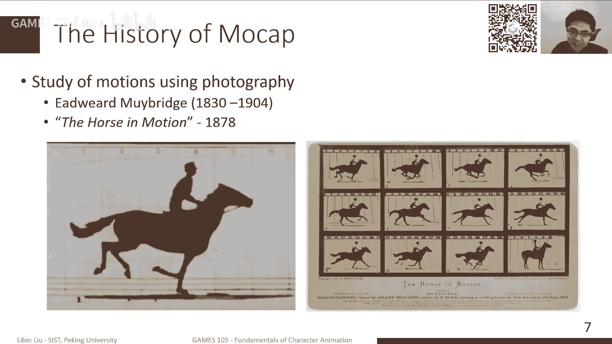

一些很有意思的结论，那当然其实这更加接近于动物的，其实应该是叫这种叫转描技术，就是以前大家在做这个，特别是在做动画的时候啊，很多时候我们直接靠动画师去画，它，有时候需要一个动画师有非常好的技术。

才能保持我这个这个不会出现这种呃，就比如说人体走形啊这种这种这种问题，那其实这种动画师一般是很难去这个训练，是比较困难的，所以说实际上，最早我们其实可以用另外一种方式。

其实可以通过把一个人真的人动作拍下来，然后拍下来之后呢，我们可以通过一种把它算，把它这个转描的方式，然后把它转化成一个卡通角色，或者转化成一个数字角色，首先这个技术很早就是在很多电影里。

就得到了很多使用，比如特别有名的，像是这个迪士尼的早期的一些电影，比如说像是白雪公主啊，像是这个爱丽丝梦梦游仙仙境，其实当时这也是一个说法，就是说实际的这个，当时迪士尼也是刚刚创建嘛。

所以说实际上确实他也缺一些，非常有经验的这种动画师，然后他其实用这种方法，可以很有效地，降低它的这个动作的制作成本。

那其实也可以保证我的这个作画的质量，但实际上就是你会发现，其实提醒你的有些动作片段，它会不停的转描到不同的这个电影里面去。

然后另外其实也是我们在备课的时候，也是突然也发现一件事情，就是说我们在那个其实我们国内，我国的最早的一部动画电影，其实也是整个亚洲最早的一部动画电影，这个是1941年的这个铁扇公主。

然后在这个b电影拍摄的时候，其实大家也知道，是在在这个这个这个战争年代啊，所以说其实拍的也是非常不容易，然后在这个电影里面呢，其实他们也是大量的使用了转描的技术，来降低我们这个设置的成本。

那当铁人公主呢，他的一个制作商是这个万氏兄弟，那其实万事群里必是这个，其实几个姓万的这个人，然后他们组成的这样一个动画公司，然后其中有一个非其中之一啊，这个叫做万籁鸣先生。

他其实后面拍了一个更加有名的电影，叫做大闹天宫，我想大家应该都看过，所以说实际上这个也是我们这个国内的，这个动画人的一个呃，非常有非常非常有，非常有这个热情的这样的一个故事。

那当然是在这个基础之上呢，比如前面都是二维的所谓的转变，我们其实之前也放过这个这个视频，就是实际上我们在做三维的动画的时候。

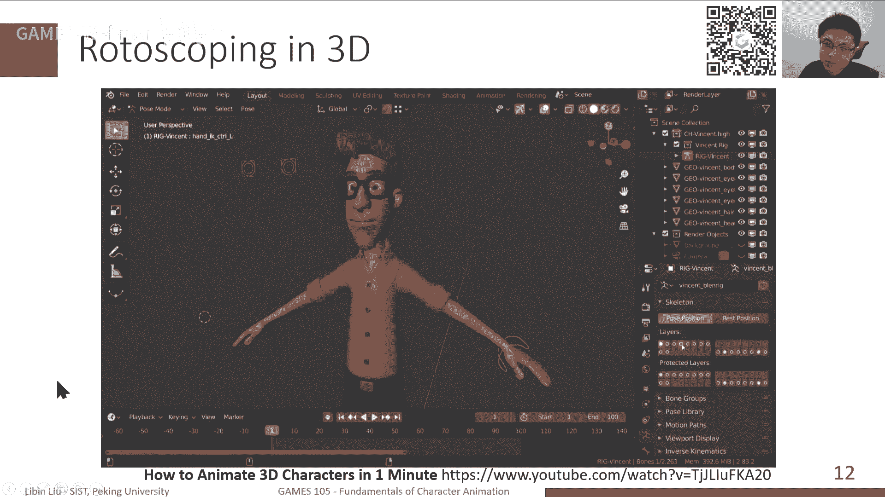

我们很多时候也是可以，利用转描技术来实现，就比如说我，我其实不是一个非常差的动画师。

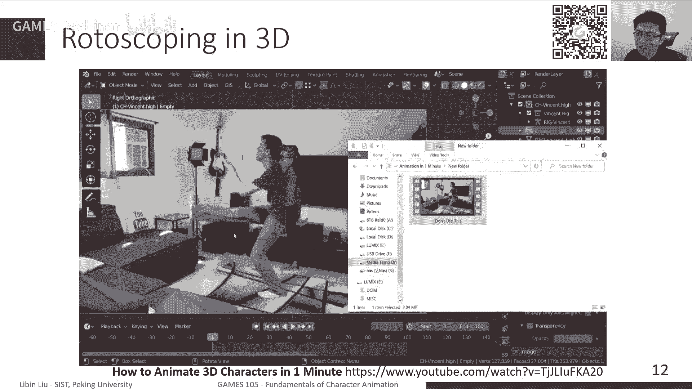

我其实也说我可能用玛雅来说，我就只能简单的用一下ik啊，然后随便弄几个动作，但如果说想要我要去做一个非常复杂的，一个人的这个这个动画的话，那我其实也可以使用类似转描的技术。

就比如说我可以从我从网上找一段，比如说武打的视频，那我其实可以照着这个视频，然后把这个角色的姿势，那这个实现其实际上本质上也是一个转变，要的技术，只不过我们是在三维场景里把它实现的。

那当然这个过程时间本质上还是手动的。

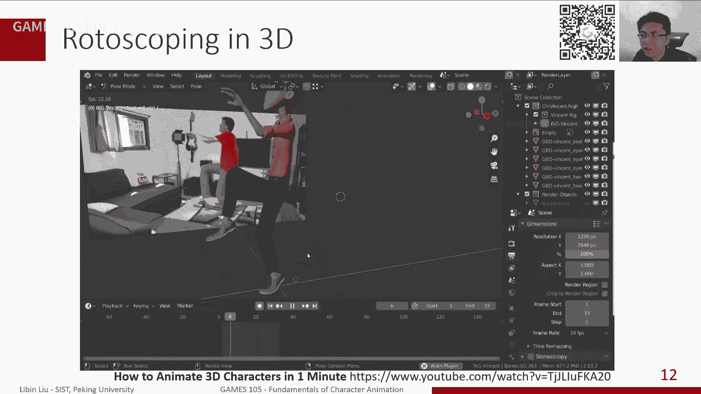

那如果说我们把它自动化，我们就靠这个计算机的技术，靠这个这个图形学的技术。

我们把这个动作，能够直接从我们的输入的图像，或者是相关的一些呃信息里面，把它重建出来，那其实就是我们现代的这个动捕设备。

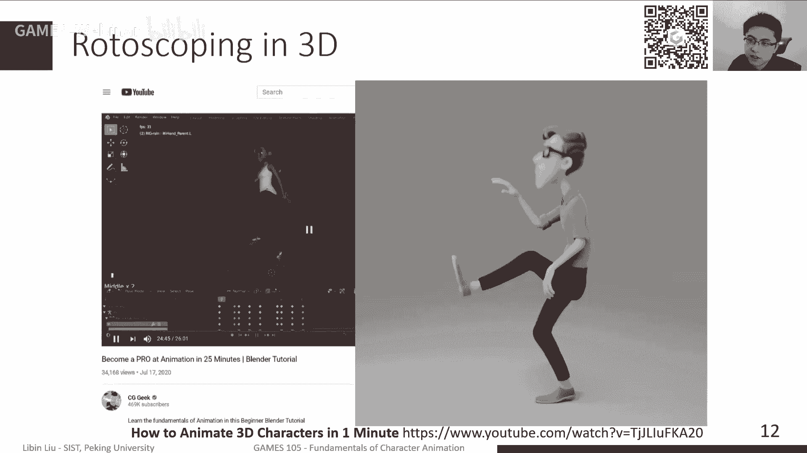

就是我们现在这个动捕系统，当然我们在动作系统其实有很多不同的，这种类型的，主要目的，就是说可以通过各种各样的传感器，然后把我们的动作，把我们的动作里的信息，然后把它重建出来，然后并且把它转化成我们数字。

能够存储的一些格式，那当然不同的这个动捕设备，当然有不同的优缺点，它也使用在不同的这种这种场合之下，那我们这里可以介绍几种比较简单的呃。

比较常见的这个动捕设备，但其实比较早期的，就是所谓的这种基于外骨骼的动捕设备，对像基于外骨外骨骼的设备，其实是这个是这个原理上是非常简单的，因为我们可以穿上一个外骨骼，然后这个我们在身体移动的时候。

我们自然会带动这个外骨骼来移动，那么我们可以测量外骨骼的，它的比如说每个关节之间角度啊，其实就刚好对于人的关节上的角度，那当然外部基于外国国的这类增补技术呢，其实最主要的原因，最大的一个问题就是。

所以实际上，比如说我们做一些比较难的动作的时候，或者比较危险的，比如躺在地上，那我其实穿着外骨骼基本是很难去实现的，但实际上我们但是另外一方，比如说我们做手部的采集的时候。

其实我们现在看到手的采集的时候，很多时候还是会需要一些这种手套啊，这种基于外五格的这种方式，因为相对来说，首先手的动作，可能对身体的影响没有那么大，其次我们对于手的采集，因为手枪来身体来说其实比较小的。

采用这样一个设备的话，其实可以针对性的把手动作，踩的更准确一点，比如说但是现在来说，我们其实基于外国的这个这个解决方案，相对来说不是那么多，不是那么不是那么多箭啊，那当然对于手来说。

还是比较常见的一类方法，那么另外一方法就是所谓的，基于这种惯性传感器的这个动作捕捉技术，那就是观察mu嘛，就是这个惯性测量单元，一般来说是所谓的六周六周六轴传感器，然后通过这三个传感器的信息的话。

我们可以得到，比如说我把这个一些传感器，绑在我的胳膊上，绑在我的腿上，那我可以通过这些传感器来计算出，我的胳膊和我的腿的相对运动，那既然这些这些运动之后呢，我们可以用i k。

然后或或或者优化的方法来去求解，每个关节的旋转，那当然这里其实有很大的问题，就是说所有基于惯性传感器的方法，总是会不可避免的遇到一个问题，就是漂移啊，就是这个传感器的漂移。

因为我们知道所有的测量都有误差的，而我们惯性传感器，或者是一个速度，那为了能够得到我们的位置的话，速度再积分是位移，然后位移加上我们当前的位置，那才能得到我们这个新的一个位置，所以总体来说。

我们其实是在用惯性传感器来说，我们是没有很难去得到一个全局的，呃位置的，那在这过程中我们会出现什么现象呢，就是说其实你会发现，可能每次我加了一个数，这个数大概是差不多，没有差很多的。

但是如果说我连着加加了很久，这个误差就会带来就会积累的越来越多，可能这个人在做着做着动作，它就会飘起来，或者现在地面下去，所以实际上这类方法的话，大家总是用一些其他的方式来帮助我们。

去减少这个漂移带来的影响，就比如说我们可以加c这种，加一些这种这种启发式的，这种这种啊辅助措施，就比如说我们知道人做动作的时候，我们其实脚应该是踩在地面上的，那如果说这个人飘起来的话。

那我知道他肯定是有什么漂移，有这个漂移了，那我可以根据比如说这种脚在地上，这样一个鲜艳，那另外一方面的话，我们可以用更加准确的传感器，那可以允许我们去做更长时间的，这样的积分。

然后也不会带来非常大的问题，那另外一方面，我们可以可能也许会加一些更多的传感器，就比如说可能有些比如说这种重力传感器，因为重力因为对我们来说，重力的方向总是固定的，还是一个向下的方向。

那这样的话其实这是一个全局的信息，可以帮助我们在这样的一个动捕过程中，来避免在这个方向产生过大的漂移，那类似的还有一些其他的，比如说这种磁场传感器，那我们其实知道我们的这个磁场的方向。

地磁场的方向在某一个小局部里，它是不会变的，那这个时候的话，其实你可以通过磁场的方向来帮助你，去，确定一些这个这个全局上的这种方向信息，然后lisa还有其他的，比如说光流传感器。

比如说我们可以判断一下这个我的视觉，我的这个拍摄的视频，他的这个动啊移动的方向来判断，我这个啊传感器带来这个偏差，但总的来说，这个基于对这个光线传感器的方法就是好，处是说什么呢，它是不需要。

一般来说它对场地的要求会比较低，就是说我其实可以穿着它跑步，可以跑的，但只要是在我信号能够收到范围内，我其实可以跑的比较远，另外就说我这个范围可比较大，可以跑，可以爬高，可以去做各种动作。

那缺点就是这个漂移问题，你总是需要想办法去解决啊，不然的话这个动作，其实漂移带来的这个这个误差，因为主要是说他飘的方向是不确定的，甚至你如果你修的话，你甚至有可能需要去每帧去去单独处理。

才能把它修到修的准确，所以实际上现在应该说事实上的标准啊，应该还是这个基于光学的这种杜补设备，那基围观的动物是个基本的配置，就是我们就是他会在这个人身上，然后去穿戴一些反光的这种这种标记点。

那这个不一定是反光，也许它自己会发光，然后在这接下来呢，我们会有一些这种，在一般来说可能有若干个镜头，若干个相机，可能6~8个或者更多的一个相机，然后分布在整个这样一个空间范围内，那这样每一个相机。

比如说对于反光的这种动物解决方案来说，这个相机一般来说它是一个呃，是一个这种红外线相机，就是它可以发出红外线，其实我们这个肉眼是看不见的，然后这个红外线打到我们这个标记点上，它会反光。

一般来说该点它是一个非常反光的，是一个漫反射的一个一个一个一个标记，一个球体啊，或者是一个一个一个点，然后他会把这个关系部分，光线反射回我的这个相机，那这个相机就会看到，在这个在这个二维平面上。

二维图像上会有个点，那接下来我可以通过若干个相机，来重建一个三维坐标的位置，那接下来我如果说我们，比如说我们在全身上，每个班每个关节，就是每个身体上我都放了若干个点，那么可以通过这些点的三维位置。

来反推出每一个关节的位置，每个关节的这个位置和朝向，那这既是我们的这个关键，传感器的一个基本原理，那咱这里用了一个最基本的技术，就是这个所谓这个多视角几何的一些技术，就是如果说我们有相有热巴的相机。

然后这些相机我们都是已经标定好的标的，好意思说什么呢，就是我们知道每个相机的三维位置，以及每个相机的这个内参和外参，就是它的朝向，那我们实际上就知道，如果说我们当知道所有这些信息之后。

如果我们说我们看到这个屏幕上有个点，那我们是可以知道这个点，比如从相机的这个传感器处罚它，像这个点可以做一条这个向量，可以做一条直线，那这条直线对方程我们是完全可以知道，那另外一方面，我对另外一个相机。

我们其实可以同样的做这条直线，那这样两条直线的交点，其实对应的就是我们这个发光的这个点，它的三维坐标，当然这是一个最基本的，最简单的一个一个一个模型，但实际上我们通常来讲，两个相机是很难去准确定位的。

因为主要原因是说它会，它还是会有测量误差，一般来说我们至少会需要三个相机，看到一个点，对于大部分动物兽来说，两项大部分论说，我还是需要三个相机能看到它啊，当然也是越多的话。

我们可以把这个误差降到更低一点，所以总体来说是，那比如说这一般大一点的都不是为，或者说比方说我们做一些呃比较，比如说多人的动作，那么可能需要更多的相机，因为它总是会有谁知道。

这样的话我一方面一个方向角度未知道了，我可以从另一方面看到这个同样一个点，那可以避免我们的这个啊测量的误差，但实际上这个光光学动捕，其实很大的一个问题在于这个场地啊，就是说因为我每一个相。

因为我前面提到每一个相机，就是每一个点为了定位它，我至少要保证有若干个相机，能够同时看到这样一个点，然后每个相机实际上因为它有，它会有一个朝向，会有一个视角的一个方向，那这样的话。

我们需要在若干个相机的这个，所有的这个视角方向的，这个他能看见这个范围的并集，在这个范围区采集，才能保证我这个相机是，他能保证我这个这个这个重建是准确的，所以实际上对于一般来说。

比如说我们想做一个8x8，8米乘7米乘7米这样一个空间，我们可能就需要12个相机，才能保证这个效果比较好，而且更大的一些场景，比如说像是这种我之前也见过，也去参观过一些大型的这个动捕。

这个场地他可能放了100 100多个相机，然而场地非常巨大，可以有几十米乘以几十米，然后可能这个高度可能有有有有，有好几层logo啊，这种这种场地的话，就说他可以做很多事情，比如说一般我们做这种。

比如说武术啊，这种就比较容易做的，他甚至可以比如说我可以采集一些动物，比如说马匹在里面跑，我可以把整个动作给踩下来，那当然缺点就是说这种场地，那当然非常贵的了，因为这也是这个这个。

因为毕竟一方面相机很贵，因为后面这个场地很贵啊，所以说实际上这个一般一般人，我们要想用这个技术，用这种设备的话，还是需要，还是需要点这个这个这个这个经费知识的，那当然还有另外的其他问题啊。

就是说我们一般来说做这个动捕设备啊，光学动捕，那其实我们需要这个非常重要的部分，就是这个标记点，那我们其实比如身体上，我们一般来说会放上，比如说40多个或或者50多个标记点。

然后通过这些标记点来重建这个人的位置，来重建人的这个整体的这个这个姿态，那当然对于不同的部位来说，我们可能有不同的标记点，这个这个呃，不同大小的标点和不同表演点配置，就比如说做手做手的这个采集。

那你可能需要稍微小一点点标记点，或者对于脸来说，其实标记点会更小一点，就可以看到，这里其实是非常典型的，这个踩这个脸的表情的时候，我的表弟点的数量，而这个世界还有另外一个问题，就是说就是动补。

就是本身来说，我每次测量我总是会误差了嘛，而且随着我的距离增大，这个误差其实会变得更大一些，所以说你会发现，比如他如果说我需要踩脸的这个表情，这样动作的话，通常来讲它会再额外去带一个摄像头。

这摄像头是直接对着脸的，不然的话我只是靠外面，就是刚才像这种场景，外面这一圈摄像头它就拍脸的话，基本是拍不到的，就算能拍到，但是会非常非常不准确，当然另外还有一些问题，就是说我们在做这个动捕的时候。

其实特别是做一些比较复杂的动作的时候，你会发现这个标题点经常会丢失，这丢失是什么意思呢，就是说比如说我可能在做动作的时候呃，会遮挡住我一些表格点，比如我趴在地上，那我胸前的标志点全都看不见了。

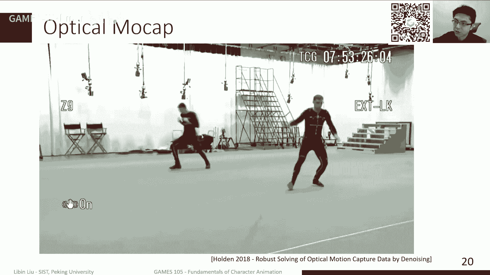

那或者说比如说我做一些这种这种这个啊。

比较激烈的动作，比如说在这爬，那这种动作很有可能会把我的标记点，就是给蹭掉了或者蹭歪了，然后这些其实都会对我们这个光纤动物，带来很不利的影响，就主要说我们因为本质上，因为我们需要做的事情。

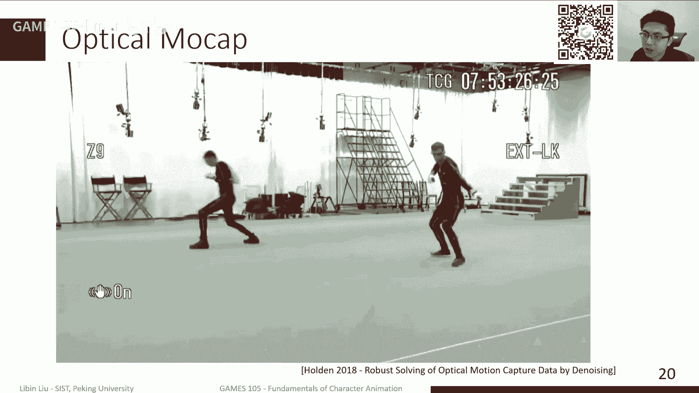

是为了能够求解关节的位置，我们需要知道哪一个标记点，就我看到的是完全是分不开的，就是一堆白点，我需要知道哪一个白点，对应的是哪个标记点，然后这些标记点如果它丢了之后呢。

我们需要怎么去把这个丢失的这个决定，把它给补回来，所以实际上动捕里边非常长的，一个非常麻烦的一个一个过程，就是说我需要去补点补点意思就是什么呢，我采集的时候丢掉的那些标记点，就比如说被遮挡了。

或者是掉了，或者说比如说他有些标记的时候，他去这个认认错了。

比如说应该是腿上的标记点，我认成手上了，这个其实也经常发生，为什么呢，比如说我可能这个人他会做一个做一个。

比如说手摸膝盖的这样一个动作，那这个时候比如说手上的标记点，你会发现它会膝盖的标记点，会在某一时可能会重合。

那重合之后又离开了之后呢，那其实有些时候他会用这个系统做不出来，这个到底这个标题原来是在手上，还是在膝盖上，所以这时候他也会会出错，所以总的来说，你会需要做很多很多这样的后处理来完成。

这个比较好的这样的一个一个啊技术，这样一个一个动物动物的过程。

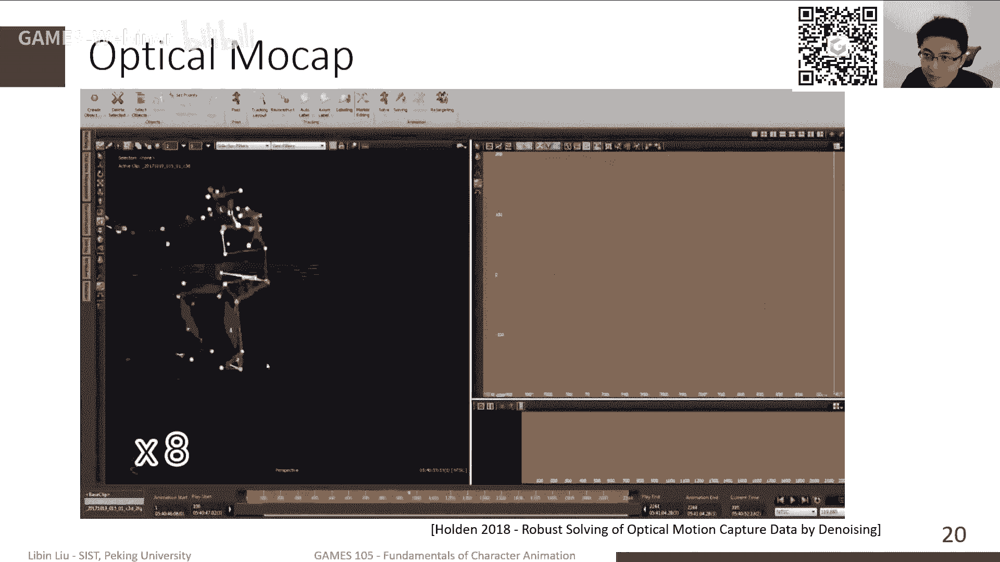

其实我们之前也跟那个，东北的一些公司聊过，就是他们对这个后处理，基本来说是按秒算钱的。

是按照这个我采的数据的，这个这个这个这个时长来来进行，就是处理的这个动作的时长来进行，算起来，这还是很高的，可能大概有个几秒钟，你就就就就就要几百上千的这样的废物，当然这个one。

其实我们这前2年也是有些工作的，就不就是在这个同行学领域啊，就是说比如像丹尼holon，他们在e b做过一些这种。

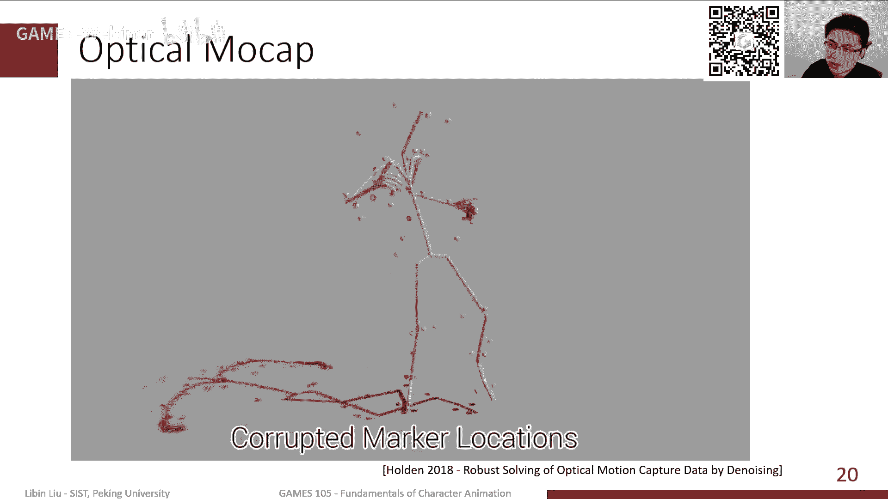

来简化这样的一个标记点标定的过程，那这个其实国内我们这也看到一些工作。

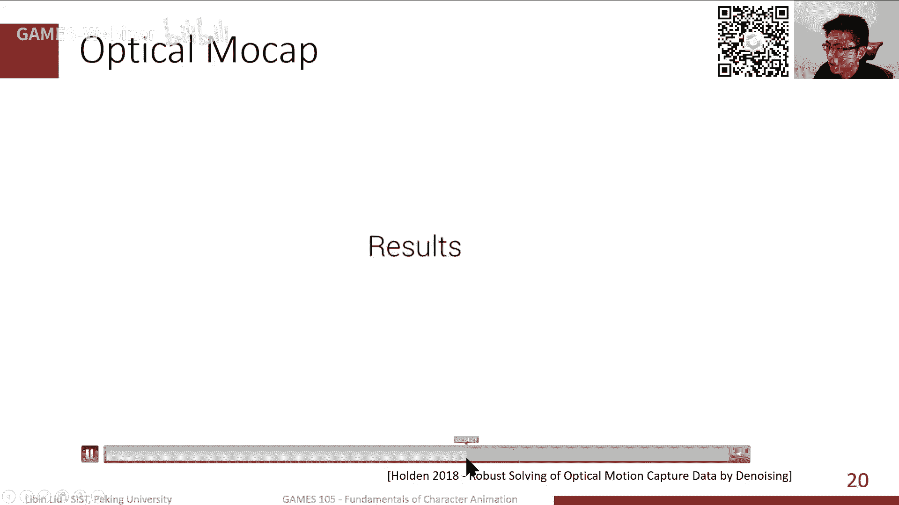

好像是清华的这个团队，也做过一个相关的工作。

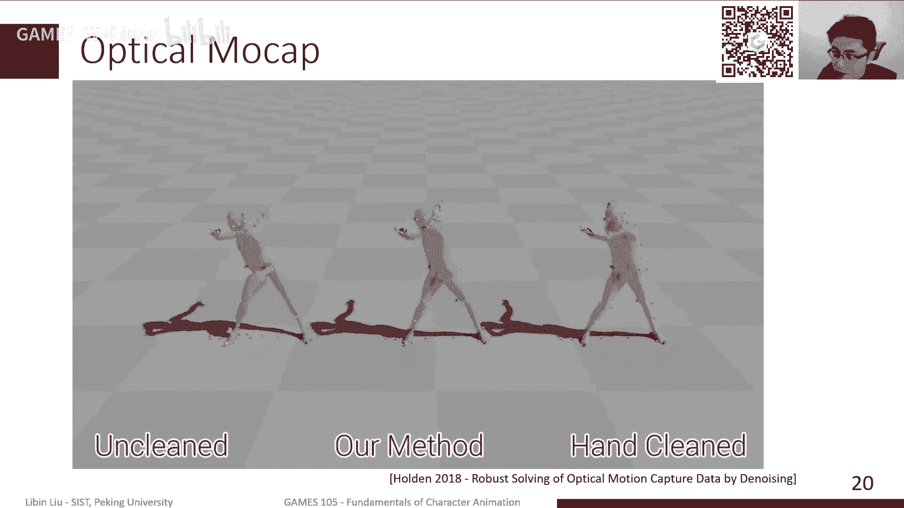

但这是动补的一些这个光学，动捕的一些是一些一些一些问题，那除此之外呢，就是除了这个标记点这个位置问题啊，其实还有很大的一个问题，在于标记点本身它是有体积的，这个体质会带来一些什么问题呢。

就是说比如说我想我们之前也踩过一些，我们当时想上一个动捕去动捕的演员，我说我们想采一段这个钱果番哎呀，那这个动物园就非常非常辛苦，因为比如他的身后是有很多这种标记点，然后他做一个前滚翻。

这些表演都很个人，所以你会发现其实就穿这种衣服的话，你的这个首先这个标题点本身，会影响这个你的动作，它会带来一些，可能会带来不必要的这个这个受伤，另外一方面呢，比如说你要有要去采动物，就采动物。

其实我们之前看过一些视频，就是说采这个猫啊，才不狗啊，这些动物其实还好一点，就是你可以它如果训练的比较，比较比较那个呃比较好的话，那他其实可能还是会比较配合，但总感觉他也是不太舒服的。

因为本质上它身上有东西，你会发现这猫和狗它会不停的抖，要是更其他的动物的话，你就是靠标记点来标来踩，还是更加困难一点，所以时间还有很多，其实也是一个非常热点的研究问题啊，就是说我们如何能通过。

无标记点的动作采集来实现一个动作捕捉，那其实最最常见的，或者说现在也是比较常用的一种方法，就是这个基于多视角相机的，这种无标节点的动捕，其实本质上来说，跟我们有标记点的这个关节动物，其实是差不多的。

就是说我其实也是通过若干个，已经标定好位置的相机，而这些相机都是同时拍同一个场景，那这样的话在这个过程中，其实还是通过识别这个图像里边的，人的这个关节啊，人的这个位置，肢体的位置。

然后再利用我们这个都视角几何，来重建出每个关节，每个点的位置，那这个其实这类方法相对来说还是，怎么说呢，就是其实嗯但是我不是做广告了，我就是随便网上找了一个，找了一个视频。

但是这个从当这个作为他们宣传视频来说，应该还是还是会弄得不错的，但实际上因为这个光学，都用这个标记点呢，然后为什么大家都用这个呃，就是这种红外线，这个这个这个作为作为输入呢。

就是主要是说我这个标记点它是非常亮的，反光嘛，我可以非常准确地定位它，在图像里定位它，但是如果说我们没有这个标的点，我们只是纯粹靠视觉的输入的话，那你很多时候你是很难有些时候很不准的。

就他会受到光线的影响非常大，另外说比如说这人穿的衣服啊，穿的衣服的颜色啊，其实有时候也会带来一些影响，然后还有就是可能有些关节，比如说我们我们其实之前也试过一些，这种啊，基于光学动捕的。

就是基于这种多多多试讲动捕的这些设备，就是就是有几个关节，特别是比如说踝关节和脚趾，还有手的位置，其实很难踩到整，就是因为像大关节，比如说膝盖和脚脚踝的位置，我们相对来说比较容易确定的，但是再细一点。

比如说我想需要去确定角面的方向，但是脚面的方向我需要知道脚趾的位置，这个时候其实很多说，它是很不太容易踩得准的，当然这个技术还在不断的发展，不断的迭代了，我们当时也是可以逐渐的看到，一些新的技术。

能够把这个问题逐渐解决掉，那他还有些其他的方法，比如说这种以前大家可能有些同学知道，像这个xbox当年出过一个呃，非常便宜的深度深度摄像头，就是叫connect，但是现在connect已经已经停产了。

如果没记错的话，那其实深度摄像的时候，其实给我们一些信息，因为我们只是靠这个视频的话，我没有深度嘛，我们只能知道他的这个二维的位置，那深度其实给我们一个三维的一个，一个位置。

那其实从这个通过这个信息的话，一方面我们其实可以重建出这个人的这个，表面的这个mesh表面的这个这个这个形状，另外一方面，我们其实也是可以去重建这样的，一个人的姿态，所以其实knight当时出来的时候。

其实他的打的卖点就是说，他其实可以实现这个实时的人，姿态的一个动捕，然后其实允许你去跟用一个你的虚拟形象，在这个这个这个游戏环境里去去互动，那其实猫现在大家玩switch。

switch有一些这种像是健身类的，像健身环啊，还有一些这种，比如说有啊一个拳击的游戏吧，就是它其实本质上还是通过两个传感器，就是你放在手柄的传感器去踩动作，其实knap其实非常超前。

当年就是说我们可以直接踩这个动作，但是但是技术上来说，其实还有相当大相当大的难度的，因为主要是说我们这个深度相机，其实它提供的信息相对来说还是偏少的，就是说比如说首先遮挡的时候。

我看到深度就是混在一起了，那这个时候你怎么分辨哪一部分人，前面哪哪一部分人使用哪一部分是腿，或者说比如说我身转个转个转个身，那我怎么分辨哪个是哪边是左边，哪边是右边，那这里其实还有很多技术上的问题。

那这个其实也是一个，就是现在当然大家不用connect，但是也有一些新的这种基于这种rgb d相机，一般都是就是这个，它会提供一个非常比较准确的，然后这个深度信息来帮助我们去做这种，三维三维动捕设备。

但相对来说这种这几种方法的，所以market list的方法就是从精度上来说，还是比起现在这个，就是这种基于光学动捕的这种方法，就是从精确度上和这个鲁棒性上，还是稍微差一点，这个确实也是必须要承认的。

这样的一个差距，那除此之外还有一些其他的方法对，就是这种方法我们应该是从我的角度讲，我觉得应该不能叫做动捕设备，动捕风，不好意思，应该不能叫做动物方法，这种方法，一般我们应该是叫做动作估计方法。

或者运动估计方法，就比如说最经典的最近这个问题，就是说这种单镜头相机的这个动作，估计为什么这是一个叫动作，姑且不叫动作捕捉呢，呃动作捕捉呢，因为我们知道这个单进单视角啊。

其实它是一个啊信息不全的一个问题，就是我们其实把一个三维的姿态，把它映射为二维，其实我们会遇到会碰到一个歧异性问题，就比如说我同样的一个因为有视差嘛，所以说我可能会有很多姿势。

在这个投影之后看起来是同一个姿势，那这种情况下我怎么重建呢，我其实无法判断哪个是对的，那通常来讲，我们还是需要一些额外的一些信息，比如说我看过很多很多动作之后，然后用这些动物做的这个相似性。

来帮助我们确定应该是哪一个姿势，那这种情况下，他并不是真的就是就是准确的估计，他只能说是呃，并不是真的一个准确的动作，而只是说我在一些最最大的可能。

基层基础之上，我做了一个估计，那与此相关的还有一些其他的，就比如说用一些比较啊，sparts，就是说比较少少量的传感器来进行，动作捕捉，就比如说我们前面讲这个惯性动捕，或者说我们前面讲的这种光学的。

这种基于标记点动部，我们通常来讲，需要全身每个关节都绑上，至少一个这样的标记点，那我们可以确定这个点的位置，那其实如果说我们可以用更少一点标记点，来实现这件事情，就比如说比如说我们只有五个标记点。

或者六个标点，我们只在手和脚上榜样这些动啊，这些这些标点的位置，那我们其实以某种程度，也可以估计出我们全身的动作，比如说最简单我可以做i k嘛，当然i k其实你需要解决，解决一些像是这种这种姿态。

方向不合理的问题，你还是需要解决这个这个飘面的问题，所以这个其实虽然说这个，这个其实本质上也是一个需要解决的问题，那咱可以再进一步，比如说我们前面都是六个，至少六个标记点或者五个标点。

我们至少知道手和脚的位置都是知道的，那其实还有更更更进一步的，就是说我们只有三个标记点，或者只有一个标记点，这是什么情况呢，就是vr的场景里边，比如说我只有vr头盔，就vr头盔。

那这个时候我只有一个标记点的位置，那通过这个标记点的位置，我们怎么去重建全身的动作，那这是本身也是一个非常非常去这个，去这个信息不足的一个问题，另外比如说像三个标点，就是我头有头盔和两个手柄。

像比如说我带一个这个这个htc wife呀，或者是那个这个oculus，那其实他可以给一个比较精确的，这两个头盔和手的位置，那这个时候我上半身动作相对是比较简单，我可用i k，那这个时候腿怎么办。

所以其实你看到最早的这个meta就是facebook，他们以前这个demo是没有腿的，那没有腿，这个其实糖尿特别诡异啊，感觉好像一堆人在那飘着，好像鬼魂一样，但是后来他们今年啊就是长期。

上个月放了个demo啊，上上个月哎呀说终于有腿了，然后这个感觉好像这个进这个，进步了很大一截啊，当然这个后来要也是有人这个问了一下啊，还问了一下他们这个，这个他们公司的这个啊公关人员。

就是这个公关系的这些人，好像说这个至少这个弹幕本身并不是，并不是真的重建出来了，这个demo还是动捕出来的这个结果，但他们只是说，ok，我们我们现在展示的是，将来我们会实现的效果，那这个能不能实现。

我们也不知道，但实际这个技术实际上当年也是，其实以前有一个公司叫做那个kia，我不知道，可能有些这个这个业内的这个人，大概听过这个公司，就他们当时主打的就是以其中一个产品，就是说我可以通过三点来。

去重建全身的姿态，当然这个公司现在那个网站已经没有了，那公司这个公司被苹果买了，所以说可能这个也许苹果的vr，可能会用上这类似的一个技术，所以说到底跟my time跟facebook哪个会先出来。

我也不知道，当然这个问题本身确实还是一个iphone的问题，我们在这个第一节这个introduction，这个就是概论那一节课上，其实我们也提到嘛，就是说你你总也是就是靠纯靠给matic，方法的话。

你还是很难去完整的重建，我的这个这个比较准确的，比较物理准确的这样的动作，那时间如果想要做的更好的话，那我们其实还是需要一点无理仿真的方法，那这个其实我们之前做过一些工作，但是总体来说。

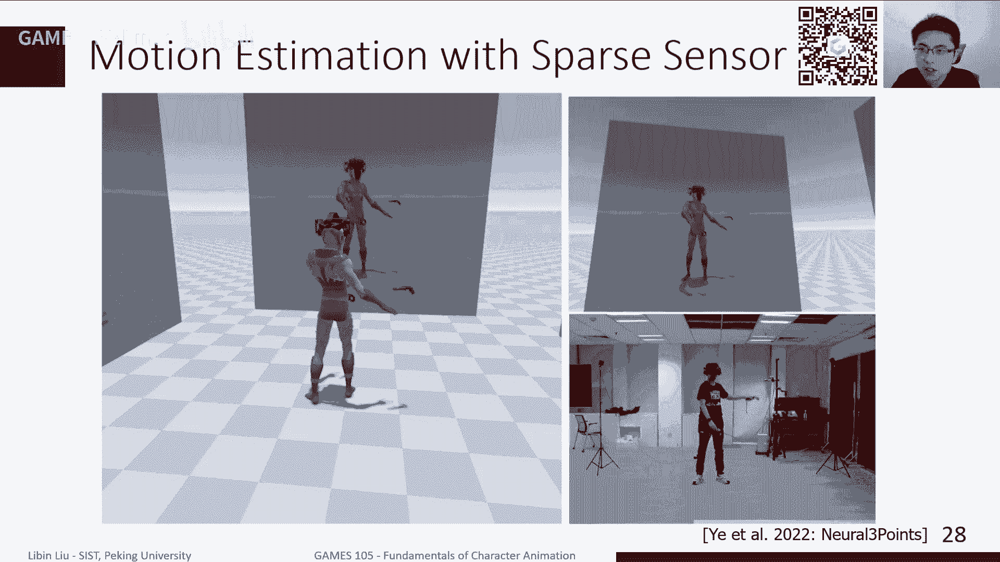

现在还是离这个真正的使用还是有点距离，虽然说还是有点效果，但是从稳定性上还是有需要进一步的提高，ok那我们其实前面主要是简单回顾了一下，我们这个动捕这样一个，其实动捕是一个非常大的topic。

就是除了简单的这个，像比我之前前面提到的这些问题之外，还有像比如说怎么做retargeting啊，怎么去，就是就是比如说像这种这个设备，本身可能是这个比较廉价的，那这种情况下。

我们怎么去同样实现高质量的这个东部，所以这其实还是有很多问题需要解决的，那我们接下来再做下一个问题，比如说当我们假如说我们已经得到了，非常好的动捕设备和动捕的数据，那当然这个动捕数据实际上就是说。

比如说我们如果想平时常用的话，就是我们只是想用一下，想想想想玩一玩，那实际上现在有很多开源的动捕的数据库，我记得好像之前忘了哪一节课，我好像已经提过几个，就比如说非常经典的c mu。

就是凯南基贝隆大学的这个动物数据库，一个非常老了啊，也对，但是非常非常的大，就非常非常的全嗯，当然缺点就是这个动捕的这个质量，稍微差了一点，因为这个实际上其实我觉得可能有一部分，可能是。

但当时他们的学生，所以说有些质量不是特别好，然后还有一些新的，比如说像是you be s ub，他们当时也供公开了一个数据库，叫了fn，然后这个数据库其实比较全，然后动作这个内容也比较多。

所以其实这现在公开的一些数据集，也是有的，其实我们也逐渐看到一些新的数据，再在公开出来，然后这些时间，如果说我们平时想要去尝试一下的话，其实可以拿来用嗯，但不管怎么样，假如说我们有这个动作数据之后。

我们该怎么使用呢，那当然我们其实我们上节课也是提到了，像这个b位置在这个动捕文件啊，就是一般来说当我们动捕之后，一部分是说我这个角色动捕的时候，使用的这个角色，它是什么样的一个大小，什么样一个姿态。

那就是它的teapot是什么样子，其次呢那我们接下来会有一些数据，那一般来说我们会表示成，比如说关节旋转或者是关节旋转，加上这个关节的位移，或者是类似的这样的一个输入，总而言这是一大批一堆这样的动作。

那为了能够把这些数据能够用起来呢，通常来讲我们还是需要若干个环节，那首先来说我们需要做这个动作重叠项，因为我们动捕的人，因为我总是从人身上踩的嘛，我们想要把它变成一个虚拟角色身上，那我们需要一些重定向。

重定向基础之上呢，我们可能需要对动作进行一些编辑，然后呢我们需要对工作进行连接啊，或者混合，然后最终就是就比如说放在一个动，动作图里边，让我们能够实现这种可交互的，这个动作的这个组合和生成。

那当然第一步呢其实就是动作重定向了，那我们其实前面上节课稍微讲了，讲这个非常非常简单的动作重叠项，但动作重叠项本身是一个非常大的问题，就是说因为我们面临着什么问题呢，是我们痛苦的时候是一个人。

那这个人他的骨骼上，可能就是可能是十几个关节，或者22 20 20多关节，但我们的角色可能是非常复杂的，就比如说我们很多很多角色，比如说我们的这个比如动捕的时候，我们这个脊脊柱上。

一般来说可能就2~2个或者三个关节，就是最多了，但实际上我们在真正的角色里边，可能脊柱场景会有就七八个关节，那类似的，还有一些，比如说我们在真正角色上，我们可能会有这个比如说有他有衣服，有这个袍子。

有斗篷，那这个斗篷，所以我运动它会它会，我希望它会产生一些这种形变，产生一些移动，那这些很多时候我们可以通过一种额外的，这种啊随动的这种骨骼来实现，所以谁就算真的逊角色身上的话，你会发现这个骨骼的数量。

骨骼的名字，骨骼的这个长短，然后甚至骨骼的这种这种这种突破结构，那都可能跟人不一样，就比如说有些时候，我们可能需要用一个人的动作，去驱动一个人马啊，这人马那其实是六条腿的，哈哈那这种事该怎么办。

所以说实际上这是一个很复杂的一个问题，然后我们通常来讲，比如说如果retirement做的不好的话，那基本来说常见的几个缺陷啊，就比如说这种浮空，比如说脚，那就这个重庆向之后，这个这个人就飘在天上。

或者说脚在地上打滑，或者是比如说这种穿模的问题，就比如说这个一般来说会出现在，比如说这个一个瘦人嘛，然后放在一个非常卡通的一个角色身上，比如说这个角色可能有个大脑袋，那你可以很容易的想到我做周末的时候。

我一伸手，那肯定我就穿到脑袋脑袋里面去了，但这个整体来说，这种方这种这些问题其实都不好解决啊，就是现在大部分能够比较好的实现的，方法呢，应该主要还是靠一些手工的方法，去去单独去处理。

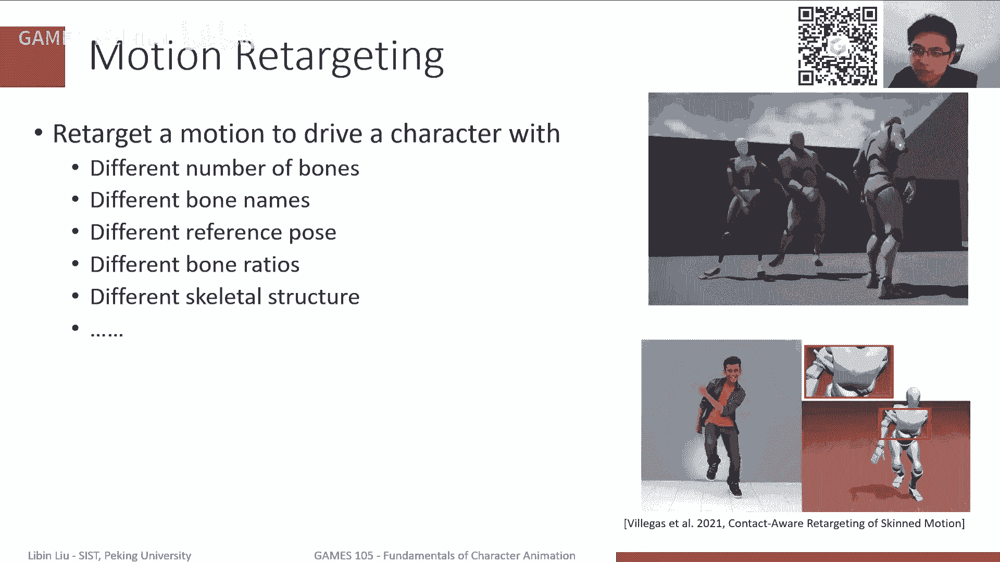

那当然这个整个动捕的这个重叠，像这样一个流程啊，大概就只是写着写啊，就是拍脑袋拍了一些，就比如说我们首先因为这个名字不一样嘛，我们首先就建立一下，这个从动捕的数据到虚拟角色的这个关节，它需要做一个映射。

然后需要去调整一下我们这个动捕的大小，因为是很多时候，比如我们动武他的这个单位可能是米，或者是有些时候英寸嗯，但是我们这个虚拟角色，他单位市场我不知道了，有时候你可能导进去之后。

你会发现这个角色跟我们东部的骨骼，差的这个体积差了很多，但通常来讲的话，我们会需要，比如说我们知道，这是一个走路比较多的动动作，那么通常来讲我们会把这个根关节，因为主要是根关节这边的这个位置。

它的位移比较重要，我们可以把根关节的位移，我们整体上加一个加一个这个缩放，比如说把它至少缩到，比如说腿的长度，跟我们的虚拟角色长度差不多，那胳膊什么的可以不用先不用管，那这样的话。

至少可以保证我们在走路的时候，他脚不会飘在天上，那除此在此，在此之外呢，我们还需要去处理一下，比如说这种关节t pos的这个区别，那我们之前上节课其实讲了一下t pose，但是大家很多同学在在做。

我们的这个lab一啊，就是实验一的这个这个，第三个就是第三个部分啊，就是关于这个t pose和apples之间转换，那你需要做一些计算，其实那个是非常简单的，就是所以说我如果只有t pos和a的区。

转这个区别的话，我觉得这个其实是非常简单的问题，但是一旦说我这个身体长度不一样，或者说是骨骼数量不一样，那这个就就变得复杂一点，那么这里其实有些有些非常简单的这个嗯，启发性的一个启发式的一些规则啊。

就比如说我可能有些关节在，在我的仿真角色啊，在我的新角色里有，但是在我的那个动物数据里没有，那我们其实可能有些处理，比如说是不是把这个旋转设成零啊，或者是不是这个旋转，应该是前后两个关节的平均值啊。

那这个其实有很多你需要去调整的部分，那除此之外呢，其实最终我们还是需要去解决，这种穿模的问题，那这种时候我们一般还是需要用i k，来做一下这种，比如说foot skating或者floating。

这是其实i k总是不可避免的，所以说我们上节课讲i k，我是上上节课讲ak，实际是就是ak对于整个动画，就是基于这种运动学的动画来说，是非常非常重要的一类方法，对，然后那个其实还有另外一种方法。

就是说我们下面这种动作捕捉啊，就是其实我们本质最终还是记录的，是关节的旋转，那我们发现在我们动作重温下这个过程中，时间很多时候，我们是因为我们直接copy了关节的旋转，所以说可能会带来一些穿模的。

因为穿模问题本质上它是位置带来的问题，而不是这个就是只靠旋转去直接解决，它还是相对比较困难的。

所以时间还有一些新的一些提法，也不是新的了，就说有些这个业界的人才，能够提出一些新的这种说我们表示方式，如果我们可以不用记录关节的旋转，那我们可以反相反的，我们还是有点像我们前面提到的。

像这种六个六点追踪这种，我们只需要去记录像，比如说手的位置，脚的位置，还有比如说关键关节的位置，比如说根关节的位置，还有比如说这种啊髋关节的位置，然后我在做重定向的时候。

我只需要重定向这个相应的这个位置，然后之后呢再在新的角色之上做i k，其实也就是从从实践上来说，其实可以实现比较好的效果，但这个其实但总的来说，如果说你要达到这样的效果呢。

你还是需要相当多的这种工程上的这种，这种这种处理的嗯，但这是育碧的，育碧，当时那个放了一个非常非常专业的一个，一个一个demo。

那其实也是现在一些新的软件，一些软件，比如说unreal啊，real其实是支持这种i k rig，就是当你需要手工去创建所谓的i k，i k的这个retark的链，然后我再去retara的时候。

相当于把retara练这个这个这个关键位置，这个冲电线过去，然后再去这个求解i k来还原这个动作，ok然后对这只是关键重定向的问题。

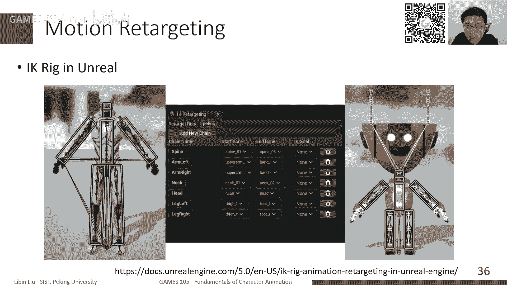

那如果说我们已经重叠很好了，我已经有一些动作，这些动作已经能够，在我的虚拟主的身上去播放了，那接下来呢就是说我们其实很多时候，我们踩动作嘛，我们也只能是一段一段踩，我们很难去呃。

就是一方面是我们只能只能一段一段踩，另外一方面我们做动作的时候，基本来说，可能我想要的几段动作，是分散在不同的动捕数据里面，那么很多时候，我们需要把这些动作组合起来，连接起来，就完成一个更完整的动作。

就比如说我们这里我们有一个跑步，有一个走路，那我想实现这个人从走着走着，突然就跑起来，那我该怎么办呢，那就是这里其实就涉及到，我们需要做一个动作的啊，连接动作的动作转移，那这个方法其实比较简单了。

就说非常直观了，就是说比如说我需要做多的转移，那我需要从第一个，从第一个动作里边找出一帧，这针一般来说可能是脚落地，那一帧会比较好一点，然后在另外一个动作，比如跑步之间找出类似的一针。

这两针其实看起来是差不多的，然后找到这两针之后呢，我在我把这两针在时间上做一个对齐，就比如说我在，就是我认为这两针在播放的这一帧的时候，我下一帧就应该是另外动作的另外一针，然后呢。

其实我最直接最直接的方法就是，我直接做一个切换就可以了，把前一个动作放完，放到那一针的时候，我直接切到另外一个动作再去放下一针，那当然这个问题这个其实确实可以做了，但是这个其实大家可以想一想。

这个效果也不会太好了，因为主要是他会有非常明显的间断，那这个阶段会给我们带来一种这个，这个动作，首先就是动作不连续嘛，它效果就不是特别好，所以实际上我们通常为了能够做这个，平滑的一个转移。

我们不大会说会在这一帧上直接做切换，除非说这两帧的动作是完全相同的，但是很多什么时候完全相同，其实确实有些时候完全相同的，为什么呢，就是说我们一般作为比如说游戏，为了游戏啊，我们专门去动补一个动作。

一个循环动作，比如走路，他们一般会有一些要求的，比如说我所有的动作都是，比如说从一个呃自然姿态开始，然后比如说一个端枪姿态，然后端枪自带我踩一个动作，就是比如说我做一个挥拳挥拳的动作。

那我就可能挥完拳之后再回到这个姿态，然后或者比如说这个跑步或者走路，其实它都会保持一个差不多的一个姿势，那这种情况下就可以保，基本来说在我切换的时候，可以差不多保证我是同样一个姿势，那这种话。

我们就可以不需要做后面这些处理，但是很多时候，我们在这两个地方不太一样的时候，我们还是需要去做一些所谓的平滑操作，就简单来说，就是说我们实际上我们在这个切换的时候，我们不能只考虑一整。

我们通常来讲会把这个输入前面那个动作，比如走路，把他这个后面那一段，就是从这个这个切换点切换这一帧的，后面这一段，还有切这个切换后手动的前面这一段，我们把这部分都同时考虑进来，那接下来呢。

我们其实可以在这两个动作之间去做一个，逐渐的一个差值，就说这个怎么用一个参数，这个参数从零变到t啊，从零变到一，就是说从一开始这个地方，就是在这个切换前若干针开始，然后到切换后若干针做过一个平滑的渐变。

那在这个过程中呢，我们其实可以很简单地，采用我们这个线性差值，然后让我们最终的就在这个平过渡过程中，的每一帧是对，是等于它对应的这个对应的这个混合参数，然后用它去作为这个差值参数来进来。

对两段动作的对应阵进行差值，那咱这ile其实代表了一个真的，一个帧数的这个指标，就真正经打一针，ok那当然这个时候其实线性差值也不是，就是就是很多时候我们可能也不一定，非用到现非非得要使用线性。

它只有我们其实有很多其他的一些函数，比如说这个这个就是从更加通用来说，其实这个t本身可以是一个一个，比较更加平滑一点的函数啊，比如说可能用二次函数啊，或者说一些比如说exponential啊。

就这种这种指数函数之类的，来去实现一些特定的更加平滑的一些效果，那当然实际上就是这个这个杀人的过程，我们其实也不一定说是，一定是要两边都取若干针，其实可能比如我只是在目标的那个动作上，多取一点帧数。

然后做这个平滑，或者我们也可以在这个起始前面那个动作，我们在结束之前多取一些针，然后做这个平滑，其实都可以实现比较平滑的一个效果，那当然其实如果说我们确实这两个动作，都是到这就为止了。

我只是到这一帧就没有其他动作了，那我们也可以做其他的一种方式，就比如说我可以计算一下，这个中间这个偏移大概有多少，然后可以把这个偏移，逐渐的把它去混，合到我们这个新的动作里边呃，下一个动作里边去。

那当然方法上还是说我在下一个动作，还是提取前面若干针，然后用一个参数，逐渐的把这个偏移给混合到我们的，这个混合到我们的动作里面去，那当然类似的，我们也可以去混合前面的动作。

那这个在我们使用了这个差值之后呢，那我们其实可以看到，像刚才我们这个问题，这个动作现在这个差值看起来很平滑了，虽然说这个虽然说平滑，但是这个人看起来不太对啊，因为他首先他突然转了个向。

其次这个感觉明显脚在地上打滑嘛，所以说其实我们这只是一个动作，连接的更加平滑一些，但是其实本质它并不能完全解决，我们这个动作，这个比如说打滑这种问题，当然就这个就就这个例子而言，其实他对他打滑。

他就是他这个动作打滑，其实最主要的一个原因是什么呢，是说我们这两个动作，其实本来是一个是向左走的，然后那个跑是向右走，是向右走，但是这个跑是向左跑，那这个时候下我们没有做任何的这种对齐。

那我就直接强制的让这个人去转个身，过去了，那这个其实是结果肯定是不是很好的，所以实际上为了能够实现比较好的效果呢，我们其实首先还是应该先把我们的目标，下一段动作跟上一段动作做一个对齐。

那对齐之后我们再去做这个差值，那就是这个动作看起来更加平滑一些，那当然这个对齐其实是涉及到一个问题，就是说我们该如何去对齐，或者说我们该对齐到哪里，但这里其实有很多不同的这种，实际的这种方式。

但我们这只介绍其中一种，就是说所谓的这个一个非常重要的一个，参考系啊，叫叫facing frame，有谁叫hiding frame，或者有谁叫什么叫什么。

这个moving frame反正是各种各样的名字，但大部分说的是同一个东西，就就是说我们就假设这个人，他在走路的时候，我们有一个参考系，有一个坐标系，这个坐标系是跟着这个人一块走的，它的原点。

坐标系的原点是是，比如说就绑在这个人的这个根关节上，但是呢我们一般会要求说是什么呢，就是这个原点是啊，不是他不是绑的更快，二是它随它跟跟关节一样移动，但是差不多是跟关节的位置，在地面上的一个投影。

那这样的话其实可以，只要可以避免我这根关节，因为我走路的时候，其实我的跟关节，我的腰是不断伤害移动的嘛，这会带来我这个呃这个这个坐标系的，不是特别稳定的这样一个问题，另外呢。

我们其实也是要求这个坐标系的某一个轴，一般来说可能是z轴，然后它会指向我的角色的朝向，那当这个朝向其实有很多种不同的定义了，就是说也许是我的速度的方向，或者也许是我面向的方向，面向的方向是对应什么呢。

比如说我们可以认定义为是z轴的局部坐，标系的z轴在世界坐标系的方向，但是为什么是这种呢，其实这是说明，其实我们是基于这样一个假设，就是我们现在假设，我们现在的动画系统是在y up这样的一个。

这个坐标系里面，其实one up是这个动画和图形学，图形学领域的一个非常常用的，一个一个坐标的一个设置啊，但是也不是玩不是绝对的，因为可能像unity是wup的，maya是wup的。

但是呢那个unreal好像是z up，如果没记错的话，但这个why，我觉得wy up，为什么是觉得是比较自然的呢，因为主要是我们做渲染的时候，因为我们知道我们渲染，然后我们要渲染成图像。

那图像上我们一般定义两个坐标轴，横着是x轴，竖直是y轴，然后同时在这个渲染过程中，我们其实有另外一个深度方向是z轴，一般来说我们是这样定义的，所以说这样自然而言，自然而然这个向上的那个轴变成y轴。

当然机器人啊，或者一些很大的其他相关领域，他们会愿意用zapp的，但我们这里假设啊，假设我们这个后面就是大后面几页p p t，我们都是假设，我们是在一个y up的一个坐标系啊。

同时这个角色的teapos，我们知道我们建立一个teapot，它会有一个正方向，那么一般来说我建议假设这个正方向，他面朝的方向是z正z的方向，那在这种设定之下，那个x方向一个是哪一个方向的。

x y应该是右右手的方向是吧，xy哎呀不对，我发现我这就去画反了，哈哈哈，其实x应该往这边往往往这边去才对啊，这样这样才是对的，其实应该向左边是x，但这个这个不是很重要的，就是我们假设有这么一个坐标系。

那总体来说这个所谓的facing frame，我们知道一个坐标系，它有两个关重要的这个定义啊，就是两个重要的量来定义吧，一个是它的方向，就是它的这个朝向，或者说这个坐标系相对于玄机坐标系，它的朝向。

然后另外一个就是它这个坐标原点的位置，那来这个facebook frame啊，这个facing frame就是我们朝向坐标系来说，我们一般来说会假定它的这个坐标旋转，朝向是只有只有沿着y轴的旋转。

有时它只会在立，这个只会有平这个p，这个这个竖直方向的那个旋转，然后其次呢它这个坐标原点是只有x和z，就只有平面的位移，那这是我们的一个假设，那当然在这种情况下，其实这个旋转啊，这个位移是比较好定义的。

我们可以就定义成，他就是过根关节在地面的投影，那当这个理论说，我也可以用其他的方其他方式的定义，只要我这个定义本身是一个比较啊确定的，就对所有动作相同定义就可以了，然后这个旋转其实有很多种，不同的人。

用不同的这个常用的这种啊定义啊，就比如说我刚才说到了，一般来说我们可以把朝向定义成，我跟关节局部坐标的z轴，它的方向和定位是朝向，那我将根据这个定义的话。

那我们可以认为这个facing frame的朝向，那其实就是这个旋转嘛，他就是说把这个世界坐标系的z，旋转到我局部坐标系的z轴，它所需要的这个旋转，那对应的就是我这个坐标坐标系的朝向。

那其实还有一些其他的定义，比如说我知道柱根管子的朝向，有些时候不是那么精确，因为做一些动作的时候，可以玩上半身往左转，下半身往右转啊，比如我现在这个这个这个这个坐在椅子上，坐在摇椅上，就经常会出去。

会会做这种动作嗯，那有些还有一些其他的定义啊，就是说比如说我们可以为它更加稳固，为了更加体现出我上半身的动作啊，那我们其实可以定义说，比如说我两个肩膀，两个肩膀的连线要按照我们这个角色定义。

它应该指向的是我角色的局部，坐标系的x轴，那类似有两个这个髋关节，就大腿根的两个连线啊，这根连线其实也对应的是x轴，那么它的平均方向的话，其实我认为就是就是我当前角色的x轴，那我可以同样的定义说。

我这个facing frame的旋转，应该是这个x轴跟世界坐标系，x轴的这个这个这个对应的这个旋转，那当然还有一些其他的方式，也有一种比较常用的是说，我可以把一个旋转给做一下分解。

把它分解成两个子旋转的乘积，那这两个子旋转，第一个旋转是只有y轴方向的旋转，然后第二个旋转是沿着xz平面上的，某一个轴的旋转，或者说在这个再请下，再具体一点，就是说我可以把总是可以把一个旋转矩阵。

把它分解成两个，然后这两个第一部分是沿着y轴的一个旋，转或者任意一个轴的旋转，总而这是凡是某一个轴，另外第二个旋转是对于y轴来说，它是x z的旋转，或者在通用在这个广义点来说，就是说我第一个是一个。

沿着某一个轴的旋转，第二个是沿着跟这个轴平行的垂直的，那个面上的某一个向量的旋转，也就是说比如说这个大家说这个，比如说这样一个旋转，这是一个总的一个r的旋转，我可以说先是沿着x z平面上的一个轴。

ux z，你看这个轴转了一下，转完了之后呢，我再沿着世界坐标系的y轴又转了一下，那这两个旋转的乘积啊，组合呢其实就是我的总旋转，我总是可以做这件事情的，那接下来呢就说按照我们前这个，我们前面这种分。

就是这个faframe的定义来说，实际上我们是说，我们知道了根关节的选朝向之后，我希望能做这个分解，从根关节的朝向里边，算出这个r y等于多少，那这个其实有一个比较简单的方法，就是说比如说根关节。

我们知道它朝向这个矩阵是r2 ，那这个朝向其实对应的这三个局部坐标轴，那他肯定是跟原来世界坐标系的坐标轴，是不重合的，那这里边我只关心这个局部坐标轴的，这个y轴，然后它和世界坐标轴的y轴的关系。

我们知道这是两个向量吗，那这两个向量，我们总是可以去计算一个旋转，用叉乘的方式去计算一个旋转，然后这个旋转能够，把我这个局部坐标系的y轴，把它旋转到全局坐标系的方向上，那我记这个方式，这个旋转为阿撇。

那接下来呢我其实可以把阿撇乘上r，得到了一个旋转，这个旋转其实刚好就是r y，其实可以想一想，因为我加了这个旋转之后呢，这个y轴的方向，其实就跟原来这个坐标系的y轴，是重合的了，那在这种情况下呢。

也就是说在这个rp乘以r，整体的这个旋转之下，我这个坐标系本身的y轴的方向是不变的，那另外一方面它也代表了什么呢，代表我们这个整个这这个组合的这个乘，积的旋转，它的旋转轴应该是y轴。

那其实刚好就是我们的要求，那算出r y之后呢，那其实其实其实我们很多时候不需要算，这个算这个分子的另外一部分的这个xz，我们其实很多时候不需要的，但如果说还是真的需要的话。

那我们其实可以用r y的转置乘以r，因为你我们要求是r y乘以r，x z等于r嘛，那所以rx z就是r y的逆乘以r，那这个其实是得得到得到这样的指，那当然这个通过这样的计算的话。

基本实际上我们是可以证明的，可以证明这个r x z这是一个旋转嘛，它对应的旋转轴是xz平面上的一个向量，那具体怎么正，我就我们就不讲了，因为这个正起来稍微有点有点麻烦，那基本上你是可以想象一下的。

就是说就是思路上了，你可以想象一下，就是因为我们刚才定义这个r p r，我们在定义这个rp的时候，我们是说是要把这个旋转之后的y轴，局部的y轴旋转到世界的y轴，那这个旋转如果用叉乘方式。

算出那个旋转轴的话，你会发现这个这个旋转轴，肯定是在xz平面上的，然后其实你可以进一步的发现，其实这个x轴的这个s平面的那个轴，刚好是说跟我原来那个旋转，它里边分解之后，那x和z轴其实是同一个轴。

那这样的话可以保证我这个分解之后，他其实是就是这个这个这个这个对应的，这个选手肯定还是在x平面上的，但这里证明我们这里就不再不再拓展了，就说这个只有这样一个结论，那当然就在这样的一个定义之下。

不管我们是使用哪一种啊，r的定义，我们总是可以对于这个，比如这个走路的动作，那在动作里的每一帧，我们都其实都可以计算它对应的这个呃，facing frame，就是这个朝向坐标系，那比如说我在这一时刻。

我需要从这个动作，这个动作，这个姿态转换到另外一个跑步的这个姿态，我要做这个转换了，那我们就需要做一个什么事情呢，我们需要去计算，该把整个这个跑步的这样一个轨迹，怎么把它旋转过来。

跟我这个走路的这个轨迹对齐，在这一帧对齐，那对齐之后呢，我们就可以去做这个做这个混合，做这个转移，做这个差值了，那问题就是说这个对齐，我们肯定是要做一个坐标坐标变换的，那个坐标变换应该怎么做呢。

这个就比较简单了，因为我们是知道我们是假设从这个帧开始，后面所有的针都是在这个坐标系下表示的，那我们其实需要去计算，就是说这个坐标系相对于这个坐标系，它都是两个都是两个局部坐标系。

这两个这两个坐标系之间的这个相对关系，那实际上我们可以得到这样一个这样一组，这组关系吧，就是说对于从这一帧开始，跑步的后面的所有针，然后当它我播放了这一帧的时候，我需要把计算这个更关节的朝向。

那这个跟关节的朝向，因为我已经把它对齐到我们原来走路的，这走路的后半段了，那这个跟关节的朝向应该是啊，第一针就是对齐的那一帧的朝向，有这样的一个相对关系，然后类似的根关节的位置。

我们也可以计算出这样一个相对位，因为它本质上就是一个坐标转移，那就有一个坐标转换，所以说实际上刚才我们那个节目，那个那个那段动画，现在其实可以比较顺滑的，给给插值在一起了，给连接在一起了。

那么其实可以看到这个走路走着走着，突然就变成跑步了，因为我们中间在中间这一段中间，这一时刻，他两边附近我们做了这样一个对齐，做了这样一个差值，那就可以实现这样一个完整的，这样一个连接效果。

那当这个连接有些时候，我们也不是非得要把这个不好意思，我们有时候也不是非得要把它对齐的，这个取决于我们想实现什么样的效果，就比如说我们可以实现了呀，我就不要对齐，但我实现一个飞踢，那这也是没有问题的。

就是你这个只要你把这个坐标的呃，混合和坐标的这个方向的计算能够搞对了，那其实这个这个效果其实是，这就取决于我们想要实现什么样的，这个动作，当然还有另外一个就是说，实际上我们很多时候。

我们的动捕或者我们动作数据，运动数据它是没有全局的位置，就比如我们前面这个动作，前面这个动作，实际上我们都是动捕的设备嘛，所以动捕出来的数据，你是可以看到这个它走路的时候，其实住的跟关节的位置。

是在不断往前移动的，但是很多时候有些时候不一定动补，有些时候可能是，比如说动画师做出来的动作，他可能会不是，他可能会不会做这个root根关节的动作，或者有些时候我动不出来动作之后。

我可能会手动的把这个根关节的位置，和关节朝线给去掉，那这时候在这个基础之上呢，我这样的话，我可能我就避免了这个对齐的问题，我可以指我就不用去关心两个关节，两个两两个动物数据之间怎么对齐。

我只要关心当前这个姿态，跟另外一个姿态该怎么对齐就可以了，那在这个是就在游戏里还是很常见的，就是你可以看到很多游戏都是说，这个人他就是在悬空的做一些动作，然后呢，它的位移。

其实是随着我的游戏的这个逻辑啊，或者是游戏的这种啊编程，它去实时的算出来，那当然会带来一些什么问题，就说你是这个人，他其实你会感觉，这个人其实在游戏里会飘啊，他会他会他会他会。

就是看起来不是那么不是那么准确，但对游戏来说，其实这个有些时候也不是最关键的部分，因为我们关心的可能主要还是它可玩性，所以有些时候比如说相信，哪怕这个渲染效果比较差呀，或者说动态效果稍微没有那么真实啊。

但游戏本身也是比较好玩的，那当然这个是我在网上找了一个视频了，因为这个就是说我们该如何在真实世界里，做出一个对啊，像游戏跑步一样的姿势，大家没事时可以试试，看起来挺好玩的，那当然在这样一个这个设定之下。

就是说比如说我们这个动捕数据里边，我们只有就是没有跟关节的这个全局位置，我们只有局部每个关节的这个全局旋转，那实际上这个方案这个这种动作，其实也是相对来说，用起来也不是特别也是表达sorry。

用起来也是比较简单的，就是比如说，我想让这个角色去跟着一个轨迹走，那我们其实其实可以非常简单的对，根据这个轨迹，因为轨迹比如2v一个一个轨迹，一个曲线，我们总是可以算出它每一点的这个方向。

我们算一下导数就可以了，没点的位置，那这个速度和位置其实就定义好了，就对应刚好是sorry，这个朝向和位置，就刚好对应我们前面的这个facing frame，这个朝向坐标系的这个位置。

那么其实可以把这个位置乘上，我这个每个每个点的姿势，那么其实这个就相当于是，把每一个动画放在这条轨迹上播放，它就形成了一个走路或者跑步啊，就是去跟随的这样一个动作，那当然前面我只是讲了。

是说的是两个动作之间的一个如何去连接，我去把这个这个连接做的做得比较，比较平滑，比较自然，那当然实际上我们通常来讲，还是想要做更加复杂的，比如说我有很多很多不同的动作，我们希望这些动作之间能够。

我们希望能够根据这些动作去实时的生成，新的动作，那在这个过程中，我们希望这个生成动作，能够去满足一些用户的交互的指令，不好意思，用户的交互指令，或者说比如说b站，或者比如说这个跟其他的角色有些互动。

那这个时候我们该怎么办呢，那我们其实就不断地提到了，我们这个所谓的这个动作图，陌生graphs，然后其实动作和我们之前提到，它本质上是一个状态机啊，但是嗯这类方法，其实最早还是就是来源于02年。

但是这个术语哈哈哈，这个词是来源于这个02年的这篇paper，那我们上第一节课也提到了，其实那1年有差不多三篇工作，做了差不多相同的一个想法，但是呢这个为什么动作图图这件，这个大家都叫他动作图呢。

因为主要是这个片配这篇论文的这个名字，起的比较简短哈哈，然后这样的话大家也比较容易记啊，所以说这个论文起名字还是非常重要的，当然起的简短有另外一个坏处，就是你在网上。

比如说我想搜motion graphs，我发现很难去搜索这篇论文，论文，就是因为motion graph本身运动图是另外一个，有另外一个概念，它它就是有点混淆，所以说这也是一个也是另外一个问题了。

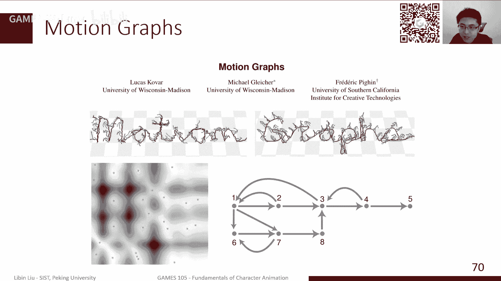

当然前面提到了，其实动作图本身上来说，它就是一个状态机，就是我们每一个节点记录了，我当年是什么动作，然后我该，然后这个动作的下一个动作，可以连接到另外的哪些动作之上，那接下来我们需要做的事情。

就是说我需要在这些动作之间做一个迁移，做一个选择，他就是使用这个动作图来实现，那当然这里最基本的，就是我们动作图的一个基本单元，那么其实就是动作片段，按动作片段来说。

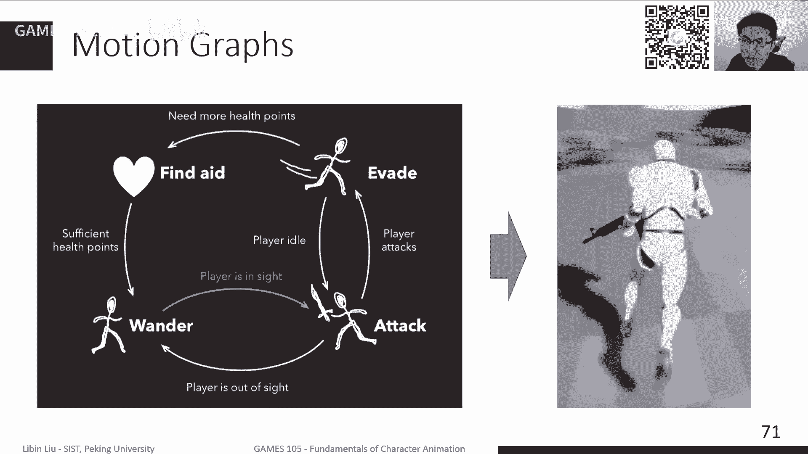

我们之前也提到了，就是像比如说动捕，比如说专门对游戏，我们就要动补一段设备啊，动不动作，那通常来讲这个动作是比较短的，我就是做一小段动作，然后那这个动作起始和结束的，这个真都是比较对齐的，我比较容易用。

那比如说我们，但是很多时候我们是在动捕的时候，我们会不是做这样的动作，而是说我们是希望更加可能这个动物，这个人他在在在厂子里做了就随便走，大概走了很长一段时间，那这个时候我们该怎么去建立一个动物，动物。

其实motion graph这篇paper，当时它主要解决的是这样一个问题，就是我们给了一段很长的动作之后，我们该我没有说怎么办，怎么去自动的创建一个这个动作图，那这里其实最最最简最最基本的这个操作。

最主要的操作就是说，我们该如何对我们很长的一段运动数据，当我输入来进行输入进来之后，我们该怎么对它分割，然后怎么确定，哪些点和哪些点是可以连接在一起的，那么这里，咱们这就是一个非常简单的一个思路啊。

就是说我们要做分割嘛，那么肯定是最近的那个点，就两个姿态相连，最近的那个点，其实是应该是我比较有可能会做这个迁移，做这个动作连接的这个点，所以说呢我其实可以算一个什么呢，可以算一个距离的一个一个图。

那这个图里边每个像素，比如说我这个动作可能有1000帧，那这个图上就是1000x1000，这么一个一个图，然后每一个像素对应的是说第i帧和dj针，他们俩之间动作的距离啊，姿态的距离。

那当然这个姿态的距离，我们有很多种不同的方式了，比如说我可以去就计算一下每个姿态，它的对应关节的旋转的距离，旋转的差别，那这是担任一种距离方式，那还有其他的方式，比如说可以计算算一下那个前线运动学。

然后实际算的是每一个每一帧，它的每个关节的位置的区别，那这也是一种距离方式，当然还有一些其他的距离方式，这个区域我怎么定义呢，比如说我也可以定义一下，比如说关节的速度，或者整体整体这个人的速度。

那可能这个速度本身，我也认为它也是距离的一部分，还有一些其他的，比如说可能关注一下手的位置更重要一些，我身体的其他的位置可能没那么重要，那我可以把根据手的位置来定义这个距离。

那这其实也是另外一种具体方式，但总体来说我们定义了某种距离，定距离的计算方法之后，那我们总是可以做出这样一个距离图来，那这个在这个距离图里边，它的局部极小值，就说这个在这个点上，在这个点上。

他不管往哪个方向移动，那个对应像素的那个那个距离值都比较大，那这个局部最小值，那这些局部最小值，其实比如这个点是局部最小值，那它对应的只是第横的d多少d x像素，纵向的第y个像素。

那就是它是对应的是第一个动作的，x轴和这个division，那这两针有可能是连在一起的，但实际上它会有很多误报了，就说你肯定还是需要很多时候，我们还是需要一些手工的去去处理。

才能把这个做得更加更加好一点，那当然有这个，就实际上这个一方面，我给出了这个对这个动作的分割，比如这一段是一个动作，另外两个任意两个点点之间，是可以确定一个动作，另外以后我也确定了说。

我从这个点应该会联系到哪一个点，就是比如说从这个动作，我可能会连接到哪几个动作，比如说在这这条这条直线上，我们看到的是对应横轴的这一帧，比如x d i j它可以传转移到，比如这个从这个姿态。

它有可能会转移到这个姿态，到这个姿态，到这个姿态，因为他们的距离都是比较小的嘛，所以说这个这这姿态范围内都是可以对应，这几个片段都是可以有可能转移的，那他确定了这些之后呢，其实我们就可以把这个动作图。

给构造出来了，因为它最关键两个部分我们已经有了，第一个部分是说，每一个节点代表了一个动作，然后另外一个就是说两个节点之间，我们有边来有边来连接那个边，其实从我们比如我们会从前面，比如像刚才提到的。

他们只要距离可能小于某个范围，那么其实就是认为这两个边是有呃，这两个点之间有边连接的，当然实际上我们有些时候，可能一个节点不一定代表一个动作，可能代表若干个动作，那这些动作之间可以在可以做一些差值。

怎么差值呢，我们其实就提取出对应的帧，然后这两针之间做一个线性差值，其实就可以做到差值，或者说比如说若干针，那我可能会做一个双线性差值或者类似的，所以每一个节点代表一个动作片段，然后节点之间有。

如果说这个动作和另外一个动作，能够做几个迁移，那我们其实可以可以连一条边，那我们实际上迁移是什么，我们什么时候做迁移呢，一种一种可能是说比如说我们用户控制，比如说这人他正常往前走的时候，我需要去转向。

那我可能走的走完了，这个走完这漫完这半步之后呢，那我马上就开始选，我下一个动作应该转向了，我去看一下，我就是当前走路能够连接那些动作里边，哪一个动作对应的是转向，那这个转向怎么判断呢。

因为我们知道每一个动，每一个节点它的动作是什么，那这个节点它对应的这个动作，从第一帧到最后一帧，我的这个全局位置的偏移，我是可以，我是可以很容易计算的，那这个拼音其实就告诉我。

我接下来这个动作它是做了转向，还是在5g网直着走，就就会这样判断，那根据这些信息呢，那我们就可以去选择一个合适的动作，来去完成我用过的指令，那当然有些时候我们可能会做一些，更深的这样搜索的搜索了。

我们有时可能会做一个，比如说稍微做一些深度优先搜索，然后比如说我知道我未来若干针，我需要完成一个什么动作啊，未来比如说若干秒，比如前面有个台阶，那我需要提前很长一段时间去规划一下，我的。

比如说这个走路的这个落点，来保证我在台阶前面合适的位置，能够启动上台阶的这样一个动作，所以有些时候你可能会需要，稍微做的复杂一点，但总体来说呢，就是我们在动作图的这个基础之上呢。

我们想要实现一个可交互的角色呃，的这样一个动画，那么其实最关键的就是说，我们其实最近可交互嘛，我们需要去检查一下，有实时每隔一帧，比如说每每一帧，我们可能需要去检查一下，用户的输入是什么。

然后检查一下当前环境的一些信息，检查一下，比如场景的其他的角色，我们是不是要跟他互动，然后根据所有这些信息去决定，我们接下来是否需要做这个迁移，是否需要迁移到一个新的动作上。

我们就要去得到下一帧的这个姿态，然后得到下一站姿态之后呢，我们其实可能会做一些后处理，我们上一次的那个实验，lab一其实有一个选做的一个课题，就说这个人在走路的时候，比如说我这个人怎么就他端了一杯水。

那这端着一杯水的这个动作，在我们的动捕数据里是没有的，那我们其实有些时候是需要一些，比如i k来去把握一个动物的，得到一个姿态，来把它变成，比如说端着一杯水的这样一个姿态，然后算完之后呢。

那我们就可以更新角色姿态，然后更新环境的信息，然后更新各种各样的其他的相关信息。

所以整体来说是这么一个这么一个，不断循环的一个过程。

那当然这里其实是一些例子啊，就是一个非常简单的例子，其实还是我们前面的那个这个，跟跟踪这个动作的这样一个例子，就说我们在跟踪这个这个曲线的曲线，跟踪的这样一个例子，就是我们之前那个简其实比较简单。

就是我直接把这个角色的位置，放在这个曲线合适的位置上，但那个缺点就是说，你可以明显的看到脚会打滑，因为本质上来说，我我动作本身是不会严格，按照这个曲线走的，而这个局比如说魔神graph的话。

我们其实可以判断一下，比如说这个这一步走完了之后，那我们就可以判断一下，一个下一步就是这里，其实这个图里面，这个视频里面，每一个这个点，其实就是我们切换的那个位置，那我们其实可以根据我接下来曲线的朝向。

然后在我接下来所有的可连接的，这些动作里面去找哪一个，它的动作的结束的位置。

跟跟我的曲线更加符合，那得到之后呢，我们就可以去做。

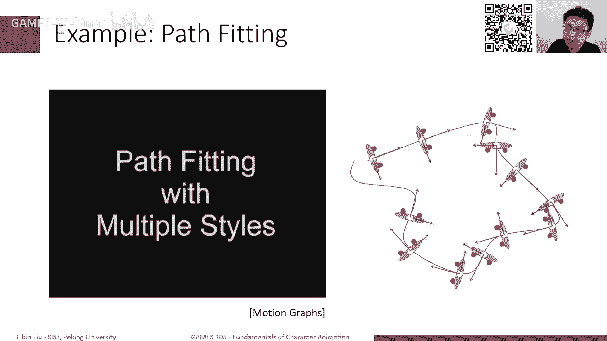

去让这个这个角色去跟着这个轨迹做的，比较比较呃，比较完好的词，比较准确的跟踪这个轨迹，那另外呢比如说我们动作有很多，也可能不一定是走路，我们肯定跑步啊，或者说其他那些动作，那其实也可以加一些其他的命令。

去让这个角色去完成，这也是比较，就是在动这个基于动作图的基础之上，我们可以比较容易实现一些效果，那当动图有一些基本的一些问题啊，就是说我们之前也提到了，首先如果说这个动作很多的话。

那么这个动作图图会变得非常非常的复杂，另外一方面的话，其实动作图本身，它的响应的速度是怎么说呢，因为我们每次都是在一个动作，一个片段播放完之后，我们才会去切换到另外一个片段。

不然的话你会看到明显的差值的误差，所以说它的这个响应速度，有些时候是不够快的，就特别是如果说我的这个呃，动作之间的这个这个这个这个不好意思，有些时候它响应速度可能是不够快的。

就如果说我这动作有一个动作比较长，那可能它需要播放，整个播放完我才能去去做响应，所以这个是比较比较比较比较比，较难做的一个问题，另外就是说为了能够创建这个动作图，我们前面也说到了。

虽然数像motion graph这种，我们可以基于一个距离函数来去判断，哪一个地方是可见一点，但这种判断通常来讲是不是那么准确的，就实际上为了实现很好的效果的话，我们通常还是需要在动捕的阶段。

就把这东西做好，所以这个其实对我们动捕的成本，也是就是也是增加了一些，我们这个动捕方面的成本，所以说总体来说，这个动作图虽然用的很多吧，但是实际上为了把它做好的话，还是有些各种各样的这种这种方法啊。

还有各学校各种各样的这种这种技巧，和各种各样的工程上的实现，才能把它完成完成的比较好。

那所以说实际上现在有新的一些方法，比如说motion match，当然motion making，其实就是说它主要实现的是一个，非常重要的，跟motion graph一个最大的不同点。

就是说它的切换是更加细腻的，就有点相当于什么呢，相当于我每一帧都会去判断，我接下来应该切换到哪一帧，但这个不可能不一定是每一帧了，这个游戏是为了实现效果来说，你可能会隔若干针，比如0。1秒或者零点几秒。

我就再去判断下一帧，但总体来说它的这个切换的频率，切换的力度就不再是一个片段了，而是一个姿态，那这样的话，其实会给我们带来非常好的效果，就是说它对用户控制的响应，会飞更加快速一点。

那另外就是说嗯就它本身从这个算法来说，我们知道这个动motion matin，它基本思路就是说，我每次每一帧结束的时候，我去在我的动态库里边去找找一针，找到哪一针的那一帧跟我当前帧离得最近。

同时又最能满足我，比如说用户控制这个运动运动的方向，我其实还是定义了一个距离函数，这个定义这个距离函数，我用这个距离函数，去在我的整个数据库里边去找一个最近邻，那这个最近邻，就是我下一个需要播放的姿势。

然后这两个姿势之间，因为这个姿势肯定是跟我当天姿势，不完全一致嘛，那么其实这两个之间还是去做一个差值，做一个这个这个平滑混合了，然后来保证我这个姿势连这个比较平滑，比较连续。

那这样的话其实就是刚才我说的，它就是它因为每帧都会做切换的话，其实可以保证我跟你一个更细粒度的，这样的一个这样一个呃生成这样一个切换，另外一方面的话，它其实也是支持说我这个数据本身。

我可以是就是去洞补一下，比如这个人在动捕这个工作室里面，我就做了15分钟左右的动作，他可能做了各种各样的跑步，各种各样的转啊转圈，然后急转弯等等动作，然后我其实可以都不需要，像我们前面那样的。

需要手工去做这样的切分去做对齐，他其实就直接用这样的数据，因为本质上他就在数据库里去找最近零了，那其实对我们这个运动本身的这个呃，这个这个这个成本，或者这个难度也其实也建立了很多。

所以总体来说motion main是一个新的方法，当然缺点就是说嗯它不像motion，motion graph这种动作，有些时候你可能想要的动作，他可能不一定会找到，不一定是最近的。

就是你就是把一个把一个，就是就是为了能够得到这个动作，你可能需要去更加好一点的设计，你的这个距离函数，所以这其实是另外一个方面，就是说一方面他有灵活的一方面，另一方面就可控性上也会有一点。

相对来说有一点欠缺，ok那我们其实再回顾一下，我们今天主要还是讲了一下关于角色，基于数据的角色动画的两个重要的部分，一个是如何获取的数据，我们主要讲运动捕捉的一些基本概念，另外是如何使用数据。

主要是说动作之间如何做连接，如何做对齐，如何做这个转移，然后再继续在这个基础之上呢，我们其实可以实现一个动作图，也就是这个呃状态机，来实现我们可交互的角色动画。

那当然这个还有一些motion matching，这个部分，我们就只是简单的介绍了一下，这个基本概念。

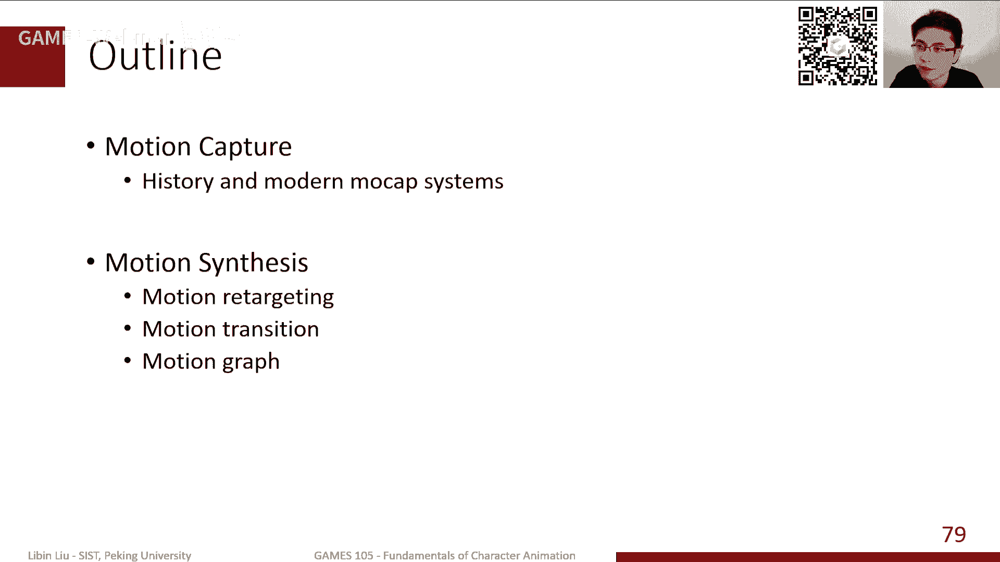

那就是这个就是，以上就是我们今天的主要内容啊，这个很抱歉，我们可能前面这个有点卡呀，因为我们这个同步也有，也有录录录的这个视频啊，所以说大家可能如果实在是卡的不行的话，我觉得也可以回头再去看一下回放。

希望还是能够啊，应该回放，希望是没有问题的，我等会儿等一下我检查一下，ok好，那我觉得可能也没有什么更多的问题了，就是说这个因为今天的课程的内容，相对来说比较容易啊，我相信大家应该听下来。

应该是可以理解的比较好的，然后那个我们下节课会讲一讲，关于这个learning based，然后嗯来总结一下，我们这个就是前面这一半的，关于运动学的这个动作，生成的这些计算机动画的这些技术，好的。

那我们今天的课程就到这里啊，然后那个大家有什么问题的话，我们可以继续在我们的微信群里边，做进一步的交流，我们其实也看到了很多很多同学在里边问，关于上面这个作业的问题啊，这个我们的助教还是很很很很很很。

很认真的，还是会尽量给大家回答好的，那我们今天的课就到这里啊。