# GAMES105-计算机角色动画基础 - P6：Lecture06 Learning-based Character Animation - GAMES-Webinar - BV1GG4y1p7fF

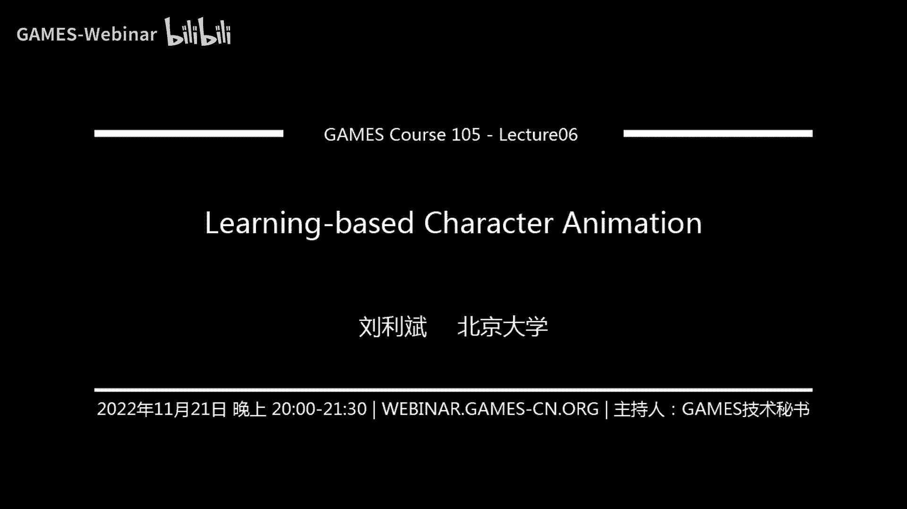

好的那我们就开始上今天的课啊，稍微缓一下，ok ok好的，那这个是我们今天是games 4105，也就是计算机角色动画基础的第六节课，因为本来应该是上周是第六节课，但是不好意思啊，因为有些事情。

所以说耽搁了一下，我们这个啊，我们后面还是会有多出一周来的，应该还是有问了一下那个games的啊，这个负责人他其实说后面还是有充足的时间，在过年之前我们可以慢慢学哈哈，所以说总体来说我们差一周。

我们后面会补起来的，这个大家不用担心，然后我们的那个作业啊，应该是今天截止啊，其实也是给我们这个助教一个一个一个一个时间吧，就是说我们截止之后呢，那主教可能会他会给会会的，然后呢也会给大家一些反馈。

嗯当然记者之后呢，我们的那个作业本身还是一直开放的啊，就是说那个在github上我们还是有作业的这个本体啊，当然如果有兴趣继续做呢，还是可以继续做的，只不过可能今年的这个评分。

这个数学可能就不会再去评分了，因为这个也是也是也是考虑到一些工作量的这个这个这个问题，然后我们的第二次的啊作业我们这周应该能放出来，这个逐渐还是稍微花了点时间去去实现那个那个框架啊。

所以说我们还是稍微缓一缓，但我们这周会放出来，然后跟上一次上上一个这个love一样，我们这个时间大概是三周啊，然后我们形式也是差不多的，那我们今天的主要内容呢，其实按照我们的这个大纲啊。

我们其实主要是讲一讲learning based condemation，这是动画，我们前面上节课讲的是什么，我们上节课讲的是基于数据的角色画啊，数据基于数据的话。

我们主要是说我们怎么去把现有的数据进行连接，进行重组，然后怎么去响应用户的这个交互，在于它并不是直接去啊连接这些数据，而是对这个数据进行一些处理，把它放在一个模型里边。

然后使用这个模型来帮助我们去生成动作，那当然今天我们这个内容来说，实际上还是会稍微回顾一下，当然一方面是因为我们上节课有些东西没有完全讲完，另一方面也是中间隔了一周之后啊，我们也是稍微再回顾一下。

因为这个跟作业，我们那个实验啊，实验二是相关的啊，这个当然也确实是隔了两周，我觉得时间过了也是非常久了，感觉也是希望能够再稍微回顾一下，然后呢第二部分我们主要是讲一讲比较传统的，教传统应该是什么呢。

就是说实际上我们在但角色动画这个领域吧，就是特别是基于运动型的角色动画，在这个领域实际上在怎么说呢，在2016年之前有很长一段时间，其实大家都是在追求一种，就是就是当然是因为这个问题。

本质上来说是我们怎么去对角色这个动作呃，人物的动作进行建模，我们用什么样的模型能够表达他的一个统计上的一个这么一个规律，还是用一些飘，现在看来相对传统一的方法主要是基于这个高斯模型的各种方法。

那当然我们今天呢也只是稍微讲两句，就是提两个跟这个高斯模型相关的两个我觉得比较有意思的工作，但是这个具体的细节上我们可能是没法讲的，因为作为一个比较初级的这个入门课。

我觉得讲的那个地方可能会太过于深入了，而且可能光就是比如说我们讲一讲高斯模型，高斯混合模型或者高斯过程，这个可能就得要一节课了，所以说我觉得这个这可能是我们不是我们最关心的问题，那我们其实稍微提一下。

那最后还有一点learning based model，一个能够生成角色动画的这么一个模型，那这部分内容呢我们今天暂时还讲不到，我们下节课还有时间关系啊，我们下节课会把这个这部分再把它讲完。

首先learning based的模型这边其实呃内容也不是很多的，我们当时也是只是给大家简单回顾一下这2年，因为主要是近5年吧，我这个方面有很大的很大的发展。

那主要是这脸这最近的一些就是里程碑的一些工作，那主要是c graf的一些工作，ok那我们今天主要的内容啊，我其实刚才也说了，就是三部分，第一部分我们还是回顾一下，或者说回顾之外，我们再去额外的再去啊。

讲一讲这个更仔细的讲一讲这个有关这个可交互动画的，可交互角色动画的这样的一个一个我们怎么该实现这样一个问题，时间上节课我们其实已经提到了，就说我们如果说想要去实现一个可交互的角色。

比如说我们加上这个角色，它能够根据用户的一些控制，比如说用户有遥感手柄啊，去控制这个角色的这个动作方向和动作类型，那我们是希望我们的这个角色能够根据这些控制信号，它自动的生成合理的动作。

那这个过流程实际上在大部分物理引擎里其实都是可以，那我们可以抽象化的把它写成一，第一步检查一下，用户的输入，第二步检查一下啊，在我的数据集里边找到一个符合用户输入的这样的一个动呃动作片段。

然后接下来就播放这个动作片段，那这就是一个基本的一个这样一个流程，当然为了支持这样的一个流程，我们实际上也有一种一些非常常用的一些数据结构，那其实这个motion graphs或者动作图或者叫状态机。

其实就是一个非常基本的实现这样的一个功能的这样的一个数据结构，当然这个实现方式上可能有很多种类型的，但大概都是说我们这个节点，还有或者ue哈，它有些插件可以支持类似的功能。

那基本来说你我们都知道就是一个节点或者一个函数，它代表了一个动作，那我们其实就是说在不同的动作之间，我们有若干个可以连接的地方，那我们其实上节课也稍微回顾了一下。

最早在motion graph这个论文当时出来的时候，其实也是说我们是否可以找到一些自动的方法，从比如说给一段数据，这个数据可能是没有做任何预处理的，我们希望能够从里边自动的把这些啊。

就这些连接的位置能够自动的把它提取出来，然后能够实现这样连接，这其实当时我们他们想就是这个工作，其实他本来是想做的事情，那当然实际上我们我我我感觉，其实其实从这个长期以来的这个这个工程实践上来看啊。

其实自动的方法还是相对来说少用一些，就是大部分来说就是还是需要动画师或者技术美工，他们去手工去挑这样的动作，然后其实在动作捕捉的时候也需要专门的去处理，这样才能保证质量，就是靠东靠东那个自动的方法了哈。

其实在很长一段时间的这个这个在质量上还有很大的问题，当然motion graph我们前面也提到了，其实它每一个节点它其实是一个动作片段，所以实际上motion graph相对来说是一个呃。

就是在它其实就相当于在这个动作片段这么一个时间的颗粒度下去，进行这个可交互的动画生成的这样的一个过程，或者再具体来讲，就是说我们每当一个动作，它就它是一个动作片段呢，它其实是一小段这个移动轨迹。

或者是一小段这个呃因姿态的集合，那我们继续在播放这一系列的姿态，当我播放完之后，那这个这个当前这个动作片段结束之后，我再去检查一下我当前是不是有用户的输入，然后接下来根据用户输入。

就选择下一个可以转换过去的这样的一个motion clip，然后接下来就去播放它，那当然这里有些有些有些这个就是说有些问题，就是说我们是不是其实我们是不是可以在这个动作的中间去做切换呢。

因为就是一个基于运动学的控制，比如说基运动鞋的控制，意味着你可以随时改变角色的姿态，而且这个这个这个改变是可以任意的，那这种情况下，实际上就是说你是敢敢是没有问题的，当然带来了一些缺点。

就是说如果说我在这个播放的中途去迁到另外一个动作的话，是有可能带来一个比如说图翻这个动作突变，那可能会带来我这个动作这个不是很流畅，或者是这个这个卡顿啊，或者说突然有些这个奇怪的这个姿势就冒出来了。

这其实是会有这样的问题，所以总的来说为了一个其实也是一个平衡，一个这个啊动作质量和响应的速度啊，就是很多时候我们的这个动作图，它里边的每个动作片段其实相对来说比较短的，比如说走路可能他只走一步。

然后可能比如走路到跑步中间的过渡，可能会有专门的一段动作，可能连接到不同的跑步之上，这样的话其实也是能够上我的这个响应能够更加的更加的及时一些，但是一个具体的例子啊。

就是说比如说我们这里是一个非常简单动作图，那动作是什么，我们就不管了，咱就是走路吧，然后其实有一个直向前走直线的一个一个走路，然后他在这个节时间结束了之后呢，或者说向直走。

那其实可以有很多种不同的这个动作图啊，动作片段，那比如说在当前时刻，我这个角色啊，其实我们上节课其实也回顾了，就是我们其实在对于角色来说，我们通常来讲会有一个参考啊，局部的参考坐标系。

那这个参考坐标系可以有很多种不同的定义方式啊，一般来说他会说他给出了我的当前的角色的一个朝向的方向，那当然这个术语可能在不同的软件里啊，可能不同的场景有不同的叫法。

比如说有些地方好像是叫叫叫root root transtranslation啊，或者root transformation，但其实大概说的是同样一个东西，但总体来说就这个角色他现在正在向前走。

所以他其实这个root或者说这个重心的轨迹大概是这个样子，那么接下来呢比如说我现在想用户是用遥感，我输入了一个转弯的信号，那其实我期望的这个角色，他后面的运动轨迹大概是沿着这样一个转弯的这个方向去移动。

那当然因为用这个用这个角色，现在当前正在走向前走了，所以他其实还是要走完这一个啊，走完这一步之后才去真的去响应这个用户的交互，那在这个过程中，实际上因为每一个转移过去的这样的一个动作。

我们其实都是预先知道的，所以说我们可以把每一个转移过去的这样的动作，接在我们当前这个运动轨迹之后，那其实这里其实需要回想一下，我们上节课提到的，我们该怎么去把一段动作去跟当前的角色的位置。

或者当前角色这个姿态的这个这个轨迹的墨迹，这个末端能够把它连接起来，但其实你需要做一个hiding frame，就是这个朝向坐标系的对齐，然后去做相应的这个坐标转换啊，其实做完之后做完这样坐标转换之后。

我们其实是可以直接得到，就是非常容易计算啊，你其实可以直接计算出来，在每一个呃可能的这样的下一个动作片段结束的时候，这个角色应该在什么位置，那其实从这个角度，从这个因为我们现在只有三个非常简单的动作。

那其实你可以知道，那其实是这样一个，就是这个动作它所对应的或者是这个动作它所对应的这个结束的时候，这个角色的位置跟我的控制器的输入是比较近的，那其实就可以直接选择这样一个动作作为下一个动作进行进行连接。

嗯，但实际上这个东西可以实现就是很自动的，就是我们可以叠加上一些其他的一些这种优化算法，或者说这个啊规矩个叫什么来着，动作估啊，这个叫planning，那叫什么规划算法，对对对。

一些这些规划算法可以实现一些看起来很智能的一些角色，就是说它实际上是说在呃motion graph，就是在动作图这样的一个状态机的基础之上，我们可以叠加上一些这个动态算法，比如说s2 。

它可以实现在场景里边自动寻路或者是自动避障，就等等，类似于这样的这样的一些一些技巧，那当然实际上这个在真正实践上，其实你可以跟其他很多的算这个技术呃相结合的，比如说像一些这种这种叫什么。

那那math这应该叫叫叫导航图还是叫什么，反正就是可以跟这些东西结合起来，可以共同完成一个这样的功能，所以不管怎么样，就说魔神gram它是一个底层的一个一个数据结构。

那我们上面其实可以用各种不同的这种规划算法，来完成更加智能的角色，那当然motion graph刚我们不断地提到了，它其实有一个非常大的问题，就是说我们其实为了实现比较好的效果。

我们一般来说是会在每一个动作的这个动作片段结束的时候，我们才会去做下一帧，下一次的这样一个搜索呀，然后去判断啊，然后去连接啊这样的这样的一个操作，当然这个优点是说我们其实这样的话。

我们可以保证我们动作总体总体来说是这样比较自然的，因为基本来说我们都只要动捕，或者说我们动画师做出来的动画是很很好的，那我们其实这样播放出来的动画应该也是也不会很差的。

但是缺点就是说相对来说它的响应速度会稍微慢一点，就是说我可能用户推了一个摇杆，推了一下摇杆，那可能这个角色其实还是会做完，当前比如他正在向前走，那还是需要走完当前这一步，他才能去找转身。

那这个时候其实是有一点有点响应不及的，那为了能够让用他这个角色能够很快的响应，那也许说我其实还是需要专门去采一个数据，那这个数据可以在中间进行切换来实现一个比较快的响应。

但实际上这个这种方法还是比较麻烦的，主要是因为我如果说随着我这个期待的用户的这个输入很多的情况下，那我们其实需要准备的这样的这个动作片段其实也会非常的多，那动作片段多了之后呢，那如果大家还有印象的话。

我们第一节课，第二节课讲的那个非常大的这个动动作图的这个状态机，它会变得非常非常复杂，也会带来非常非常复，这个容易出的出了bug的这种各种情况，所以实际上我们为了能够想要实现一个更快的这种响应啊。

就是说我们其实还是希望能够把动作图的这个在每一个动作片段结束，就是这样一个级别的这样一个规划，把它进一步的细化到，我们是不是可以在每一帧的结束，你每一帧结束其实就是就是当前帧了。

我们是不是可以把它改成在每一帧的结束里边去，你就直接检查一下用户的输入，然后去选择去寻找下一个这个合适的一个姿态，然后根据这些姿态去更新我的角色，那我其实可能因为整个队真的是我们的。

我们的响应从原来的一个动作，可能是零点几秒，现在变成了每一帧，那就是可能是每秒钟30啊，或者每周60p s，这样其实你的想速更快一点，那当然这个过程其实主要需要解决的问题。

就是我们该如何能够保证我们生成的动作是一个比较好的动作，因为如果说我随便切换的话，那可能这个动作是完全就可以有可能是跑飞的一个状态，当然这种其实就是有一些方法其实就非常有名的。

也是这2年就是大家都是认为可能是一个新的革新式的方法，就是motion matching，应该说是可能没有受到那么多人关注的一个方法，叫motion fails。

这个motion fields是2010年的工作，然后motion martin大概是16年左右的工作，那我当时也是跟这个啊motion matching，他们这个发明人啊，就是其实a b的两个人。

其实当时我们也跟他们这个有过交流啊，基本上是他们其实也是说，其实他们这个方法也是从这个motion files这样一个工作启发得来的，然后加了一些很多很好的工程实现，然后产生很好的效果。

那当然我们今天稍微先讲一讲这个motion fields，因为争这个是一个算是一个比较比较早一点的idea，我们其实前面提到了，我们没有不好意思，我们先其实前面提到了，我们其实每一个动作。

比如说我采了一段动的数据之后，我们其实每一帧我们可以把它看成是一个动作，它本身是一个序列，这个序列里面每一个帧都是一个姿态，运动的速度，然后每个关节的这个旋转等等等等，所以说比如说这是一段向前走的动作。

一段向前走路的动作，那其实我们可以把它拆成，比如说这样有四针，然后每帧有但有这个一个朝向，一个速度这样的一个关系，那如果说我们还有另外一段动作，那我们其实可以同样把它拆成若干针。

那然然后这些针其实也会带有跟之前不太一样的，就是每帧的前进的方向啊，速度啊这些信息，那如果说我们有很多很多动作，这些动作可能比如说我让一个人在一个这个场地里边。

我去走一个大概啊啊比如说20分钟你就随便走，那最终你会得到一大堆的这样一个这样一个针，这样一个不姿态，就是其实整体来说这些姿态每一个姿态都是处于不同的状态，不同的位置，不同的速度不同朝向。

那整体来说它们构成一个非常大的一个field field，意思就是什么呢，是说我对于我这个角色的某一个状态，就是在在这个范围内的这样一个状态，我总是可以在他的这个附近找到一些最近林。

然后这些最近连有跟他相似的这样一个姿态，当然但是呢因为这些最近人来自于不同的动作，来自不同作者，意味着它可能会有不同的前进方向，不同的速度不同的其他的一些，比如说手呀，手要做什么事情。

只要做什么事情这些这些各种信息，那在这种情况下，比如说我需要用户给了一个输入，比如我需要你向左向右走，哎呀不好意思，像你向右走，那这个时候呢我其实需要做的事情呢，就是说因为我最近林里边也有很多动作。

已经有很多这个相当姿态了，那这些相关姿态里边可能有一些，它是对应向右走的这样一个这样一个这样一个动作的，那我们其实我需要做的事情就是把这些向右走，对应向右走的这些姿态给挑出来，然后把它们做一下混合。

做一下bend，那得到的这个姿态，那应该就是对应于我这个向右走这样一个姿态，那我其实就把接下来就是把我的角色更新了，当时那个姿态就可以，那这其实工作这篇工作就是说这个motion field。

它基本来说就是就是这样一个思想，它是那个2010年的sg h的啊，论文啊，motion feels for interactive，carina of emotion，当然这个是比较老的了。

但是这个效果其实还是蛮好的，那基本思想就是说我们不再是根据一个模式clip，就是不再是一个呃一个片段，一个app用的片段去进行处理，而是我们其实而且我们去做这个每一帧的这个这个这个速度啊。

和这个朝向等等这样的这样的参数的这样的一个计算，当然就像我们刚才所说的，实际上对于任何一个点，让我们构造好这样一个motion fields这样一个运动，这个长这样，不好意思，这样运动场之后呢。

实际上对于当前这个状态，比如中间那个圈代表当前这个状态，它在某一个他在一个近邻的范围内，我们是可以找到若干个，那么其实或者说我们就是我们就只要a那个k精灵，我们这里只要前面最离他最近的cake呃。

这个状态叫姿态，那么其实每一个姿态我们刚才也提到了，它是来自于不同的motion clip，来自不同的动作，那其实会朝向不同的这个有不同的速度方向，会有不同的运动这样的一个目标。

那接下来呢motion field这个工作他就收，ok我其实也不用特别关心到底哪一个是往哪个翻走的，我可以根据某种方法去给每一个这样的一个呃，它周围的这个近邻的姿态附上一个权重。

比如说这个有一部分是向上走的，一部分是向右走的，那我给它分别附上一个权重之后，那可能最终它的平均的这个运动方向就是向右上走的这样一个状态，那类似的其实如果说我们给它附上一个不同的权重。

比如说这里边我可以向右走的这些这个姿态，权重大一点，然后向上走的这个姿态，这个权重小一点，那整体的一个平均姿态就平均的速度其实就会变成向右走，ok所以实际上对于这个motion fields来说。

它其实的它整个这个这个这个这个idea，就是说还是我们前面那个框架，我在关键帧，我们在这个动作里面的每一帧，我们在生成动画的每一帧的时候，我们首先检查一下用户的输入。

然后根据当前角色的这个状态去找n个最近的这样的一个这个姿态，但这个姿态是我们的数据集里提供的，然后接下来呢我们根据用户的输入去计算合适的这样的一个混合权重。

然后再用这个混合权重去混合我们这些最近连姿态里边的各种参数，然后接下来呢我们用混合之后的这样一个速度，去更新我角色的这样一个状态，那这就完成了一个这样的一个计算。

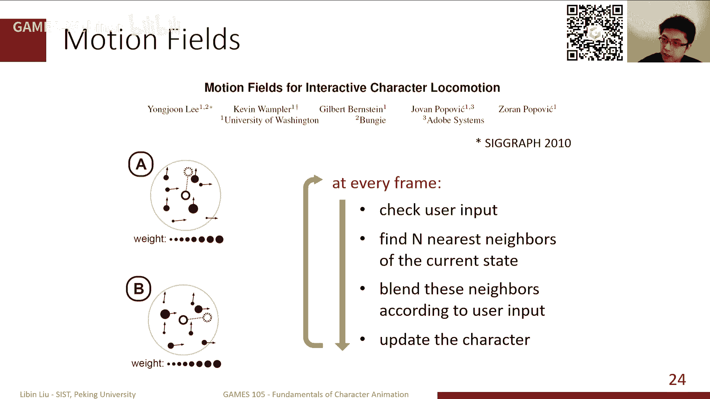

听起来还是比较简单的，但实际效果上也是比较比较不错的，这个其实你可以看到，其实motion graph嘛，就是sorry，motion fields，其实大概也是类似的一个效果。

就是我们其实可以让这个角色非常自由的是，就是跟跟随着用户的控制进行进行这个操作，那当然实现你的控制方式可以有不同的类型，比如你控制可以有定点移动或者是一个定向移动等等等。

那另外其实motion field其实也支持一些外力，就是因为本质上来说，他总是根据当前角色的姿态去寻找一个离他最近的这个姿态，就比如说如果说我需要对推一下这个角色，那我其实可以稍微加一点点物理仿真。

让这个角色的这个被推出了一点点失去平衡的这个状态，那这个状态呢我们其实希望他还是在我们这个motion fields，就是说在我们这个动作的这个范围之内的，那这个时候我还是可以找他跟他最近的一个最近的。

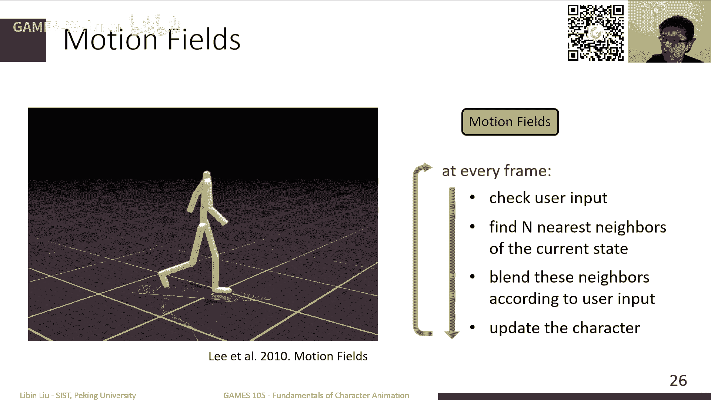

然后从这个最近连来帮助我继续往前走，那其实就是实现了一个怎么说呢。

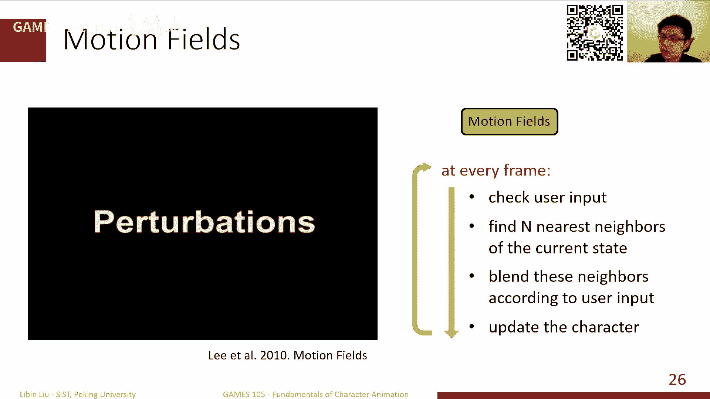

就是有一点点这种根据物理的这个反馈的同时，还能够继续沿着我们原来的目标移动的这样的一个，这样一个这样一个效果，那当然他们之前也做了一些对比啊，就比如说其实确实有些模式graph就是最基本的陌生国up。

因为他总是来说我们总是在一个动作结束的时候，才会去进行下一次动作的这个判断，所以说当我比如说用户不断的去改我们的输入方向的时候。

那实际上我们的人motion graph相对来说它的这个想要速度会稍微慢一点，但这个其实本质上来说也是因为魔神graph它里边的这个transition，就是他这个动作之间的迁移是定死的。

就是我们在设计的时候就已经定好了，而这个motion field这一类的方法，实际上它是一个实时在计算的这样一个过程，也就是相对来说它会它提供更大的自由度。

那同时其实motion field还会些其他好处，就是说在motion graph我其实是要求我的这个起始状态和more结束了，它就每一个动作片段的时候，起始和结束应该是相同的，类似的。

反正是有一个预预定好的一个姿态，这样才能保证我的迁移是平滑的，但是motion fields来说，我其实不需要做这样的预处理，我可以直接拿一段很长的动作进来，它就可以实现这样的控制。

那当然魔术shield看起来这个效果很好，但为什么这么多年没人用呢。

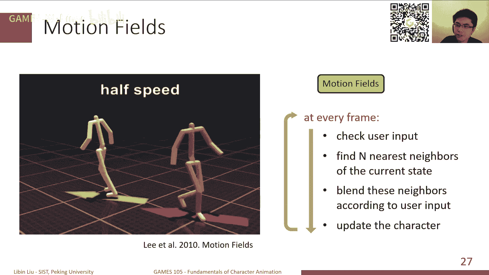

我觉得其实我觉得在这个特别是在角色动画里面的，很多做这个研究的领这个结果都有这样的问题，就是你发现其实效果很好，看起来，但是实际上很难有人用，我其实个人觉得啊，这个只是我自己拍的拍出来的。

但我不知道这个实际上工业界对这些事情是怎么看法，有可能主要是还是什么呢，就是说因为motion fields它里边有一个像就是说我们找到最近林之后呢，我们需要去根据当前的用户输入去计算。

对这个n个近邻的这个呃差值的这样的一个参数啊，这样一个权重，那这里其实很大的一个问题，就这个差值权重该怎么算呢，其实想想这个主要是说。

其实很多时候也许你需要自己design去设计一些规则来计算这个插值函数，但是可能你直接设计它效果可能不一定很好，那这个控制策略可以根据我当前输入的这个姿态啊，用户的输入去去去输出一个对这个n个这个角色。

n个姿态进行混合的这个权重，就是你这东西你能让他弄work，它就work，你能work，那就是很很难work，另外一个问题就是说这个强化信息这个训练很多时候是一个比较啊，跟tx相关的。

就跟我们的这个控制目标相关的，也就是说很难去我换一个目标的话，所以相对来说总体这个方法用起来的话是有一点点难度的，但是motion matching呢，这个前面也提到了。

它其实是从motion fails出发，他就做了一些简化，那这些简化其实还是比较重要的，但第一个简化就是说我们在motion field里边，我们其实是需要去找n格最近点的。

然后motion motion时间是发现我其实不用找了，我找一个就够了，所以它实际上我就只需要找一个最近的，找到一个最近的之后，那我其实就用一个科技零的情况下，我就压根就没有这个不烂的问题了。

就没有这个混合的问题了，我可以直接把这个最近你的这个姿态作为我角色的下一个姿态，那当然这个过程中我直接作为一个角色下一字塔也会带来问题，主要是说我找到这个最近林，他大概率跟我就是很大的概率。

但不是非常大的一个，这个这个是跟根据实践相关吧，就是他有很大的概率是说他的姿态跟我当前的姿态不是同一个动作，上的相邻姿态，这意味着什么呢，意味着如果说我直接把当前的角色换成下一个这个最美的姿态的话。

那我这个角色他的动作会出现一个跳变，那这个其实上面的这个效果其实我们是非常不想要了，所以时间为了为了减少这个问题的话，实际上我们还是在实现上，通常来讲是需要把当前角色的这个姿态这个比较平滑的。

把它给混合到我的目标的姿态里面去，那边平滑怎么混怎么混合，我们其实可以用差值，就比如说用那种线性插值，或者说用一个一个一个移动平均数，没用average这样类似的方法来实现这样的一个差值策略。

当然还有其他的方式，就是总体来说，我们的目标是说能够平滑地从当前这个姿态变到下一个姿态，当然在这里边有两个问题是需要解决的，第一个问题就是说我们因为我们需要去找最近零。

那我们需要有一个距离函数来告诉我们什么是近，就什么什么样的这个哪两个姿态是近的，那我们需要一个函数来衡量任任何两个姿态之间的距离。

那这个距离函数实际上是我们motion match里边非常重要的一个部分，就是这个距离函数如果没有设计好的话，那个效果其实也是比较差的，当然魔术发展其实它最终就是但是这个形式上来说。

这个距离函数还是比较简单的，因为本质上呃，比如最简单的距离函数，我们就直接比较两个姿态的每个关节角的距离，那这其实给我们定义了一个一个距离函数，那当然实际上这个效果其实不是很好，大家可以自己试一下。

这就是我们比如lab那个第二个实验，那个lab two的时候，哪有兴趣可以自己自己实现一下看看，但是呢但是在这个基础上呢，我们其实还可以稍微提取一些特征，就是我们不是直接比较角色关节的旋转。

而是一些在这个角色的关节旋转之上，我们额外记录计算的一些这种特征向量，那算出这个字特征向量之后呢，那我们其实在特征向量之间可以直接做一个，比如说做算一下欧式距离。

就算一下两个特征向量的差的二分数或者一范数，或者什么样的方式都写作，而且这是某一个范数，你总是可以比较这样一个距离，那当然对于这个特征向量啊，其实也许也有很多种不同的定义方式，比如说一种可能的组合。

就比如说我们可以在这个特征线里边，相当于跟关节的位置，就是非常重要的一点，一些比如说这个我未来的的用户的阿sir，未来的角色的位置和常用的信息，这是什么意思呢，就是说比如说我前面有我踩了一段动作。

这个人在这个场地里面绕了可能十分钟，那它可能前后左右移动，然后向向左下转，那么其实我可以大概知道，因为从动作数据里面，我们是可以知道，如果他继续沿着当前这个动作去去去走，从当前某一个位置出发。

然后继续演去研究当前的这个角色，动啊，动捕出去移动，那么它在0。5秒啊，一秒啊，或者1。5秒之后，它会在哪里，那接下来实际上我们可以把用户的输入，把它给这个计算成一个未来的位置和朝向的这样的一个信号。

就比如说我用户输入右摇杆，向右推摇杆，那我其实是希望比如说我可以可以定义成，他是其实希望这个角色在未来，比如0。5秒之后，这个角色是向右朝向的。

那这样呢这样的话其实我们可以这个距离函数其实定义就是什么呢，就是说我在数据里边得到的这个角色，0。5秒之后的这个朝向，应该跟我推摇杆得到的这个输入的这个朝向是一致的，那所以这个其实也是一个定义的。

也是非常重要的一个距离函数，一部分，你说的还有些其他的，比如说我们也许会考虑一下这个啊脚部跟地面接触的这个关系，比如说左脚接触和右脚接触，那肯定这个是应该是就是迈左脚的时候。

迈右脚的时候其实应该是两cha应该距离比较远的，这个其实可能有些额外的信息需要我们加入，但是还有其他的，比如说我们想到的也许是，比如说想让这个角色他走的时候去伸手去抓一个东西。

那这个时候其实也许需要把这个抓这个东西，这件事情也作为你这个具体函数的一部分，所以实际上就相当于我们前面对这个啊这个motion graph。

就这个transition就是运动之间的这个切换关系的这个定义啊，这是这是motion graph那边需要做的事情，但对于motion match来说。

实际上你需要做的就是说我们可以我们需要定义一些这样的，具体的跟我们任务相关的一些特征，然后用这些特征来去帮助我们去寻找一个最近的，那当然找到最近您之后呢。

那我们其实接下来做的事情就是需要把当前的这个姿态，把它平滑的给混合到我们的这个最近的姿态之上，那这个其实有几种方式嘛，就说这种一方面，首先我们知道只要我切换，那肯定有一定的概率就会出现一个一个跳变。

跳变是不好的，所以实际上从从工程实践上角度讲，为了提高我们运动的平滑性，我们其实也不需要真的每一帧去做这个动作，因为用户可能输入并不会一直变化的嘛，所以说我们其实也在这个情。

如果在用户没有输入没有变化的情况下，我们其实可以隔一段时间去重新判断一下，这样减少跳变，另外的话就是说我们其实前面也说了，我们需要这个平滑的把当前的姿态可以让他过渡到我的下一帧的。

找到了这个最近离的这个姿态之上，那这个里边其实有很多可能的技巧，我们前面说的你做一个moving average，这是一种可行可行的方案，还有些其他的技巧，就比如说这个叫nalized。

这叫惯性或者叫带阻尼的这个混合，那这个我们这个这里就不讲细节了，但是如果有兴趣的话，可以参考一下这个du holden他的这个博客啊，但是这个其实好像有些我看到其实也看到一些中文的这个翻译。

整点这个也是一个方法，你的基本思想就是其实是一个平滑的一个混合的这样一个过程，那当然除此之外呢，我们还有一些其他的问题啊，比如说我们想要实现一个很好的一个嗯这个这个这个这个性能，但实际上最基本来说。

因为我们是要做最近的搜索嘛，这如果说我们数据集很大的情况下，那个最近的搜索，我们做一个线性搜索其实是非常慢的，所以实际上通常来讲，我们还是需要一些这种更加有效的这种呃动数据结构。

比如说像ky train，这是一类比较这种比较好，比较有效的数据结构来实现，但是如果说这个实在不行的话，如果数据量不是很大的话，那我做一个线性思维所其实也不是也不是太大的问题。

当然可能限速的太太太那个待太高的情况，它会比较慢，另外就是说其实这个也是玉玉璧呀，他们当时在那个gdc做报告的时候，他们其实也是提出了说他们当时用了一些技巧，比如说叫这个dance card。

其实dance card主要是用来去设计，我在这个motion match里面，因为motion matching我需要需要一堆数据作为我这个搜索的目标嘛，那这一堆数据它其实决定了我这动作输出的质量。

以什么样的动作去响应用户的交互，所以首先我们可以预先做一下计划，比如说保证我这个采集的这些动作能够覆盖到我想要的目标，其实他们当时用的所谓的dance card。

这么一个这么一个东西来指导他们的动作捕捉。

然后这个效果上来说，实际上我们当时已经看过了，这只是其实我觉得这个v6 经翻了好多遍了，但总体来说就是一个非常非常非常这个灵活的一个角色，然后其实它跟前面的motion fields是一样的。

就是其实他也是可以用来去响应一些外界的这种干扰了，比如说我可以去推一下这个角色。

我甚至可以比如说这个场景里边有些啊对像这种这种环境，那其实可以自动的根据啊合适的这种场景的这种变化，来选择合适的动作，那另外一方面，其实如果说我们做的再细一点的话，我们也可以加一点点物理仿真进去。

就是他推的那一瞬间，可能你不是说我跳的这个动图里面数据，而是说我其实这里仿真了一下。

稍微加了一点这个这个rag doll simulation，那是我rag dosimon，我们可以讲就是时间可以让那个face效果更加好一点，但是实际上这个实现起来也不是很复杂啊。

这个我们助教前两天自己自己写了一下，其实也就是也就是花一点时间的这个这个这个功夫，那其实用一个比较相对来说不是很大的数据集，也可以实现比较灵活的走路，当然有一个问题啊。

就是说motion magic本身就是也不能说虽然说他是一个很好的方法，很灵活的方法，但它本身也也是有一些呃基本的缺点，就是它作为一个对它本身并不能自动的去解决像这种滑步这样的问题。

就是说就是我就不能说不能希望这这种一个方法能够能够，非常完美的解决所有的问题啊，所以这实际上为了能够实现更好的效果的话，其实像这种滑步的话，还是需要额外的，比如说用i k有一些ik来帮助我们。

比如说把这个角在需要的时候固定在地面上，就是你可能需要去改变这个腿的位置，这个旋转甚至有可能需要去改变整个角色这个动作的这个幅度，或者速度等等，来来保证这个脚步打滑。

那这个其实本身也是一个比较复杂的问题，ok行，那我们前面其实还是稍微回顾了一下，就是我们在这个角色动画里边用motion graf和motion matching，我们可以可以可以比较是比较好的。

实现一个可交互的这样一个虚拟角色，那就用户只要给一些输入，那我们就可以输出相应的这个，我就可以在我们的数据集里边去重放一些相应的动作，来产生合适的合适的动画，当然这个本质上来说是什么呢。

就是说我们其实还是在重放一些动作，就是说这个这个数字，它的这个质量其实完全是来自于我的输入的这个动作捕捉数据，那当然这里其实长期来一直有一个问题，就是我们的输入数据总是有限的。

我们总是希望能够产生一些新的数据，这些数据可能不在我们动作捕捉里边，但是我希望这个生成的结果能够是一些比较自然的动作，那这里面就是实际上我们该怎么去对，我们根据我们已有的运动数据来对自然这件事情。

自动作自然这件事去把它建模，但实际上这个事情其实是比较比较比较难的，其实对于人来说，我觉得我们判断一下是非常容易的，比如说一看这个这两个动物，这两个动画，这左边这一看就是一个比较正常的人走路。

右边这一看就不是一个正常的人走路，或者说这不是一个人在走路，就甚至右，比如右边，其实右边本质上来说，我只是把它做了一个随机的姿态嘛，就是前面对左边是在播放一个动捕数据，那我们其实可以看到随机姿态。

如果说我们只是随机的产生一些姿态的话，那这些姿态绝大多数都是不真实的，当然偶尔我会产生一两个姿态，看起来好像也是能做出来的，但是其实绝大部分都是不自然的，那其实我们是第一个实验里边，就是我们留作业里边。

其实第一个实验里有一个是关于什么的，关于这个ik其实有些同学也做了，也发现这个i k在做i k的过程中，这个姿态其实也是经常会变得一些很奇怪，完全不像人的一个状态。

所以首先这也就是说明实际上这个这个能够找到这样一个模型，它能够告诉我们什么是好的姿态，什么是自然的姿态，什么是不自然的姿态，这个其实是非常重要的一个问题。

当然实际上我如果说我们再仔细回头看一下我们当时这个动作，比如说走路，其实人的动作或者是一般这个我们常见的动作动物啊，或者很多角色的动物啊，动作它其实是一个有一种所谓的低维结构的这样的一个一个数据。

或者再去点一点什么呢，就是说比如说我们这个一个动作啊，不好意思啊，比如说我们这个角色他可能有比如说20个关节，然后20个关节呢，那可能比如说我们知道每个关节的旋转，我们表示成一个啊奥拉角。

那可能或者欧拉角或者是早认证，我们每个旋转至少需要三个自由三个参数来进行计算，那在这个过程中，我们知道20个参数，20个关节呢其实大概就是60个啊，所谓的这个这个60个自由度。

那当然这个时候作为绝大部分的自由度，其实都是冗余的，因为我刚才也看到了，如果他不是冗余的话，那我们应该随机采一个样，踩一个随机产生一个姿态，它应该就是很好的姿态，但实际上考虑到我们的角色。

比如说人在走路的时候，我们的手和脚，它其实是处于一个协调的状态的，我们正常一般来说如果不加以不特别注意的话啊，其实肯定来说你的手和脚是反向摆动的，为什么要反向摆动呢，因为他们带来手和脚的反向摆动。

可以带来互相抵消的这个角速度来帮助你平衡，要不然的话，其实这个你要需要额外的做一些额外的废掉一些力去保持平衡，这个实际上是人总是要偷懒嘛，所以总是想要找一个这样的姿势去去走，那另外还有一些其他的。

比如说我们的关节骨骼结构也会带来一些问题，也会带来一些这种啊自由度的减少，就比如说一些例子啊，比如说像大家知道我们抬胳膊，比如说抬胳膊，把胳膊抬抬到上面去，首先在这个过程中。

你的身体至少你的肩关节会发生旋转，除此之外呢，其实你的锁骨就是中间那个关节其实也会有一个旋转，这样这两个旋转其实比例关系是比较固定的，还有一些其他例子，比如说手指，我弯手指。

如果说我们这个没有拿东西的话，就是你可以发现我弯手指的时候，就是比如食指和中指啊，这样的你会发现你的这个手指，它两个关节他俩的旋转的角度也是有一个相对比较固定的关系，因为这都是我们的身体结构，来来来算。

不好意思，都是由我们的身体结啊结构来确定出来的，那其实还有一些其他的，比如说这个我们总是在地面上移动嘛，因为这是这是我们的这个这个物理定律来解决来来决定的。

所以说我们其实也是不可能任意的变到一个其他奇怪的姿态姿态上，所以总的来说我们也这就是说我们的这个人的动作，其实是相对来说一个比较低维的结构，或者再具体一点啊，或者再抽象一点的话，其实相当于是什么呢。

或者叫低维的流行，或者叫类似的一个一些一些说法，但总体来说，但这个只是一个非常简单的实例，其实不会是这么简单的一个这个卷饼一样的姿态，其实更加复杂一点的姿态，那当然这里边其实有一个问题。

就是说呃这在这在这里边，sorry，不好意思，那在这里边其实我们可以说比如整个这个空间里边，就是我们整体的这样一个可行的，比如说60维的这么一个姿态空间，那实际上我们可自然的看起来比较真实的动作。

那其实就是在中间里边的这样一个曲面啊，这个曲面可能多少倍我们是不知道的，但总而言之，它是一个它是一个相对的低位的曲面，如果说当我们人在里面走的时候，他可能在这个曲面上就是一条在曲面上面的一个一个曲线。

那当然如何如何去找这样的方式，主要如何去找这样的一个低v局面，那么其实有很多种方法，我们这里这里只是简单介绍其中一种方法就是pc叫叫这个主成分分析，对主成分分析。

但主流分析它主要是一个非常常用的一个技术，就是在数据处理里边，它主要是用来去寻找我们高维数据里边不同维度之间的相相对关系，然后另外一个功能就是说在这在这个基础之上呢，我们可以去做这种呃降维的操作。

这降维可以干什么事情，我刚才提到提到了，为什么要降维，主要是因为我们知道我们的动作应该是在一个低维度的这样一个，空间里面去，那我们其实降维就是在给出一些数据之后。

我们就从这些数据里去学这样的一个地位空间，那比如说这里面这个就是一个简单的例子，假如说我们这里的点，我们这些点我们可以认为每一个点，比如说都是这个走路这个状态里边的一个姿势，我们知道一个姿势是什么。

它代表了每个关节的旋转和root和这个根关节的这个这个位置等等等等，答案这里只是一个示意图了，我就随便点了一些点，但是大体来说你可以想象应该是一个类似的这样的一个东西，当然我们肉眼一看，我们打眼一看。

ok我们可以知道，其实这个这个动作其实是这些数据其实有非常非常有规律的，什么规律呢，就是说实际上比如说我可以找到这么一个轴，我可以找到这么轴，可以在这个轴上发现这个数据是以一个比较比较宽的呃。

就是比较大范围的分布的这样的一个这样一个轴，那通常来讲我们认为这个轴其实它可以提供了我们很多有用的信息，那么除此之外的另外一个轴，相对来说这个数据的分布就比较小，然后比较小。

其实通常来讲我们认为他会说这个这部分信息可能是一方面，可能是一些噪音，就比如说因为动捕嘛，我们其实我有点有，有时候会采集一些噪音，但是有一些其他的，比如说我这人我我闲着没事，我这腿在那乱晃。

那这乱晃这个动作其实对我这个整体动作来说可能没有那么大的影响，那这些这些动作其实可能也会体现在另外一个另外一个轴这个方向上，总的来说这个轴相对来说一些不是特别有，相对来说不是特别有用的信息。

那pc的方法就是说我们是需要去找到一些轴在这个轴上，数据在这些轴上的投影，它能够提供给我们尽可能多的信息，那这其实是pc的这样的一个目的，那当然这种这个东西怎么做呢。

我们其实可以需要给它一个更加这个数据更加准确的一个定义，就比如说我现在有一堆数据了，有一堆数据点，那可能是高维的，我们当然这里只画成二维的，然后我假设有一个空间里边的一条设一条方向。

一个方向它是一个是一个一个向量，当然是一个单位向量，那当然这些所有这些数据点在这个单位向量上的投影，它当然它是一个像一个一个标量，是一个数，这个数其实也是某种程度上。

也是代表了这个这个这些数据点的一个一个一个数值表示，那当然如果说我们把这些知识点做完这个映射之后，我们其实可以看到它在这个这个方向上，它大概所代表的这个分布式是大概是这个样子，当然相对。

如果说我画了另外一条轴，另外一个方向，那我们做同样的操作，我们其实可以发现，其实这个数据点也会也会在这个另外一条轴上有类似的分布，当然你可以比较可以发现，其实在第一个轴这里的分布它散得更开一点。

或者说它的方差更大一点，而在第二个轴，就这条轴，如果我如果每个都做投影的话，你会发现它整体来说更加集中一些，或者它的方差更加小一点，而实际上如果说我们让这个轴在这个空间里绕着某一个方向。

比如说随机转任何一个角度，那其实我们对应的可以算出很多很多不同的轴，都会有对应的不同的方差，那这里边其实我们定义什么，这个因为我们目标是找到它能够在这个轴上的信息，最大的这样的一个一个方向。

那所以说实际上我们是认为这个方差，就代表了它能够多大程度上描述这个数据里面的信息，或者说实际上我们目标pc的目标就是首先我找到一个轴，找到一个轴，这个当这个轴本身是一个单位向量。

我希望我的每一个数据点在这个单位向量上的映射还应该是一个标量，这个标量本身我可以计算，就比如说每比如说有有100个点，那我就算出100个标量，那对这100个标量，我希望能够去算一个方差。

那我希望我找到了这个eu的这个这个方向向量，它能够让这个方差最大化，这是我pc的一个基本目标，但这里我们只找一个整，那这个我们可以稍微再把它稍微这个在写的这个更加紧凑一点。

比如说我可以通常来讲一个啊矩阵x来代表所有的数据，在这里是数据，每个数据点它是一个向量，那因为我们在我们的这个这门课里边，它都是一列向量，所以我把它转置一下，这是行向量，要把所有的好像叠在一起。

构成了一个稍微一个一个扁长的，一个是一个长条的一个矩阵，那横的一般来说，因为主要来说我们通常来讲数据的数据是更多一点的，当然理论，但是也其实也是相对少一点也可以，但是有不同的有类似的方法。

但我们假设如果数据更多一点，数据比为数多，那么其实它是一个瘦长的一个矩阵，那么其实可以证明怎么证，我就不讲了，但是这个我们是可以证明的，这个最好的这样的一个u或者不是最好的u。

就是就是这样的一个u这样的一个方向向量，它是它总是x t乘以x这个矩阵的一个特征值，所以这个u应该是对应于x1 x这个这个矩阵，它是一个方阵，最就是数值最大的一个特征值所对应的这个特征向量。

这是我们就是这种pc的一个一个就就对应的这样的一个层层限量，其实就是我们的这个这个最最大的这个这个叫叫逐个主成分，那当然我们得到u之后呢，我们其实可以知道我们这x我们其实可以反过来写成。

因为我们根据我们这x定义嘛，我们就可以把它反过来写成是x平均值，加上一个呃w一个这个这个数值，然后乘以这个ud这个形式，这是来自于我们的定义，那pc a如果说我们再继续把它扩展一下。

因为我们前面只是讲了，我找到一个轴，让这个轴方向上的这个这个方差最大，那首先pc是可以进一步的定义的，比如说我找到一个轴之后，我把这个轴里边的所有的信息都可以从这个原来的数据集里剪掉。

然后在剩下的一些信息里边，我再找一个新的轴，然后这个新的周易它的方方差能够达到最大，然后依次类推，所以总体来说呢c c就说我们给了数据数据集之后，我们是可以找若干个轴，若干个这个方向。

然后这个原来这个点在每一个方向上都有投影，然后对应的每一个方向的投影的方向呃，都有一个投影的这个这个典藏的这个值，然后我们在这个在pc时说，我找到了一组这样的u k，就这样的这个方向之后呢。

我可以保证对于每一个u k它的这个对应的这个点乘，就是这个硬这个projection，就是这个这个投影的这个方差都能达到当时的最大值，也就是说第一个主元素组成分它是肯定是整体的最大值。

然后第二个主成分它其实是映射之后呢，得到的是去掉了第一个主成分之后的那些信息再去映射，然后他的他的这个方差的最大值，然后依次做类推，总的来说，其实我们可以从这里边是有一些性质的。

就是首先这个u k它的主成分我们其实其实可以类似的，可以推导，我们就可以得到一些什么，就是所有的uk应该都是我们的这个啊这个方差矩阵，协方差矩阵就是x t乘以x，它本身就是对一个斜方差矩阵。

它都是这个斜方差矩阵的啊，特征特征向量，然后这个斜方肌斜方差矩阵，因为本身它是一个对称的，或者至少是这个半正定的，所以它其实是可以保证它是有这个一定有n个特征值的。

那我们其实可以把n个特征值按照从大到小排序排序之后呢，那其实对应的第一个特征值，对应的其实就是我的主成分的第一个主成分，第二个特征值就是对应的第二个主成分，而实际上按照我们前面的这种定义。

第一个主成分上的这个方差，投影的方差肯定是最大的，第二个副主成份投影的方差是次大的，然后依次类推，同时还有一个另外一个性质，就是说所有的主成分，所有的这个主主成分，这个轴这些u应该都是互相垂直的。

就是互相就是所以整体来说，这个如果说把所有的eu写成一个矩阵的话，它应该是一个对一个选一个一个不是旋转角，一个正交矩阵，这是我们这个pc的一个结论。

当然实际上我们可以把比如说我们可以直接对这个我们的这个数据，比如对一段走路这个动作做一下pc，那我们怎么做呢，我们知道这个走路动作它是一系列的这个姿态构成吧，然后每个姿态都是一些关节的旋转来构成。

比如说我们可以把关节旋转转化成一个，比如说这个旋转向量，旋转向量什么，旋转向量是轴乘以角，就是轴角表示，然后这样的话，比如说20 20个关节或者25个关节，那它就对应了一个20 20x20。

sorry 20乘以三的这么一个这么一个向量，然后把这个向量定义成一个数据点啊，比如说这个动作本身，比如说300帧，那它就有300个数据点，那么对这300数据点可以做一下pc。

我们可以看到一些什么结果呢，比如我们可以到第一个主成分，大概长长的是这个样子，看起来其实已经是一个在走路，但是有点有点稍微有点奇怪，第二个主成分其实还是有点类似于走路的一个一个状态。

然后第三个主持人看起来就稍微有点怪了，但他其实还是是就是可以可以看到大家说前两个主成分不能弯，腿，弯的不够，然后第三个主成分主要是处理弯腿上一个姿势，然后第四个主流分其实是除了弯嘴之外。

还可能要处理一下这个这个这个呃宽的这个旋转这样的一些信息，当然回去回到我们前面这个这个这个pc的这个定义啊，就是pc实际上是找到了一系列的啊主成分的方向。

然后实际上我相当于是某种程度上我做了一个这个坐标系机的转换，就说我们其实把原来的一个数据点，它是一个x向量，我们把它转化成，比如你首先这个所有数据点的一个平均值。

加上一个新的在一个新的基底的这样一个表示，就这w其实对应的在新的基底下这样一个坐标坐标的参数，但是如果说我们选择了若干基地，比如说对于这样的一个是刚才我们提到的，比如说这是我们走路，我们选择一个方向。

然后把他的这个这个w算进来，然后再选第二个方向，把对应的这个w和这个矩阵算下来，那我们其实可以发现还有一个什么事情呢，比如说比如说我们目标我们输入的这个动作是一个正常走路。

然后如果说我们只是把平均值加上第一个主成分，那他出来动作大概是这个样子，然后在这个基础之上呢，我再把第二个主成分和香的坐标值加起来，你会发现它会稍微变得更加自然一点，然后类似的。

如果说把第三个主成分再加上去的话，它就变得更加自然一点，我是不是差差错，好ok sorry，我好像这个动画稍微有点问题啊，但是确实总之结论是没有问题，也就是说我们其实加了若干主人文之后。

这个动作就会越来越接近于我们原始的那个动作，从这个其实从这个pc来讲，这个嗯这个就是这个方法本身来说，它其实也是有这样的一个结论的，就是说因为我们前面提到了每一个主成分的方向。

它代表了我这个我在这个方向上的这个投影的方差的，这个总是让这个投影的方差变得最大，那其实另外一个角度讲，它其实也代表了在这个投影方向上，我能够表达我原有数据的多少信息。

那这个信息量我其实是可以用方差来进行一个定义的，所以说一个一个典型的这样的一个pc分析，我们可以看到，比如说这是一个若干涸的pc，我们可以看到它对应每一个主成分方向，或者说对于每一个啊特征值方向。

它的方差是从大到小逐渐减小，而实际上在大部分情况下，因为我们知道我们数据本身它是有一个相对来说是一个dv结构的，所以说通常来讲，你会发现在前面几个方差的这个值是相对来说非常非常大的。

就相对后面来说是相对来说比较大的，然后后面逐渐的逐渐的变得比较小，如果说我们把它累加起来，如果说我们把它方差，把每一个这个特征值或者是每一个主人分对的方差累加起来。

你会发现它可能从一个相对比较小的一个比较大的一个值，一个中等大小的值，然后然后很快的就变成一个非常接近于一的这个范围，所以实际上这也说明什么呢，就是说为了能够或者说就是另外一个角度讲述。

就是实际上这个也代表了我能够以多大的这个呃百分比，能够去恢复我原有的数据，就比如说这个比如说在这个情况下，比如像这样一个图，我们可以看到，比如说在大概在六或者八左右吧，比如在第八。

如果说我用前八个主成分的这个数值加在一起，它其实大概就能恢复90%多的这样的一个原始的数据信息，那剩下还有10% 10%左右那个局我怎么看了，如果说我们也许认为剩下的10%或者5%，可能就是来自于噪音。

我们其实可以忽略掉这些噪音的干扰，我们就只考虑前面这些组成分的部分，所以总体来说我们通常来讲会选择一个一个范围，比如说比如95%，那通常来讲是一个比较好的一个范围的这个95%，它所对应的是多少个主成分。

能够达到达到95%的这个这个方差的这个总和，那其实就代表了我我能能够多大程度上恢复原样的数据，这是一个通常来讲，对于主成分析来说，我们都会选择这样一个阈值，然后只会使用前面的啊若干个主成分。

来进行后面的这个这个后面的这个运算的操作，另外一个问题就是说实际上因为每一个主成分，我们知道它是代表了数据在这个数据点在这个上面的映射的这个方差，实际上在这个对于这样一个分布来说，实际上我们可以看到。

对于一个稍微相对来说更加接近于中心的这样一个点，它所对应的一个姿态，通常来讲它会比一个比较远的点的对应那个姿态，更有可能是一个比较好的姿态，这是一个这个基本的规律，所以实际上另外一个角度讲。

我们其实可以知道是说这个对于一个角色对一个姿态，比如说给出一个这个数据点，我们可以算出它的每一个主成分方向上的投影的这个值，然后我们知道这然后这个值跟方差的比值。

因为我们知道这个呃不同不同主成分让他们的这个方差代是不一样的，而且时间都意味着什么呢，意味着我们在不同组成部分轴上，离原点的距离的这个对应的这个好坏程度的变化速度也是不一样的。

所以说为了这个我们可以把它这个把它做一下这个啊正则化，我们其实可以算一下，当前这个投影值除以我们当前的这个这个对应这个轴上的这个方差值，其实就是做了一个做了一个正规化的操作。

那我们其实可以认为这个值其实它大概是告诉了我们，这个姿态本身是不是一个很好的姿态的这样的一个一个度量，或者说我们当我们给了一个新的姿态，比如它它是一个我们数据集上完全没有的一个姿态。

一个x我们同样的可以先去做一下这个投影，然后投影到每一个朝向上，然后接下来我们其实可以用同样的方式，比如除以它的这个方差，然后可以看到通过这个可以判断一下它有多大多大可能性，是是一个很好的一个姿态。

那这个东西其实可以用到什么地方呢，就比如说我们可以把它作为一种这种先验一个动作的鲜艳，然后跟其他的一些任务来做结合，比如说我们想要做i k，我们前面做i k的时候，其实我们一直提到了。

我们i k其实本质上是一个优化问题，优化问题里边的第一项，那我其实是想要让我的每个末端节点尽可能接近我的目标位置，那其实还有第二项，我们其实刚才那节课里也提过了，就我们其实有第二项。

我们是希望在满足第一项即可满足第一项条件之下呢，我希望我整体的旋转即可能小，其实我给大家也看了一下，我们发在这个我们在群里交流的时候，有些同学发的这个ik的结果，看那个角色的这个动作在不停的转啊。

比如说你用c4 d啊，其实你不太容易去考虑这样的第二项，这个就让让这个整体动作最小这样一个姿势，因为只靠边的话，就是相对来说更更更更加容易一些，这个项其实存在就是说为了能够其实本质来说。

这个我们是基于什么假设呢，基于说我的姿势，每个关节旋转尽可能小的时候，我可能这个姿态是更加容易是真实的一个姿势，就是基于这样一个假设，那当时这个还有更可以稍微改造一下。

因为前面这个假设是要求我这个姿势的每个关节旋转机，能想到其实本质上最小的就是t pose嘛，那t bot这个其实也有时候也是从来讲也不是我们最想要的姿势，所以实际上我们可以再稍微改一改。

我们可以让这个角色的姿态非常跟某一个，比如说可以跟当前的一个状态尽可能的进，那这样的话其实也是给我的这个角色做一下这个呃，做一个正子化，做一个这个啊限制说你在做i k的时候，你不要跑得太远了。

因为跑的太远，你可能就完全不对的一个一个一个状态了，当然这里其实还是说我们只是给了一个啊pose一个姿势作为我们的目标，那如果说我们其实可以进去把它把它替换掉，因为我们前面前面一直用的。

我们其实前面一直提到是说我们其实是可以利用这样的一个距离，就是我在美国某个主成分上的一个一个投影，然后处理对应主成分上的这个方差，这个距离它大概代表了这个角色的姿态，有多大可能性是一个好的姿态。

那我其实可以把这个东西作为我的第三个正则项，那其实也会给多少人能够给我们一些作用，就是说比如说我一直走路，它会出现一个什么效果呢，就比如我们走路就是两个手手和腿，手握脚是这个共用的。

就是一个对侧移动的这样的一个状态，也就是说如果说i k里边把一个手抬起来了，那其实很有可能这个出来结束，他会他会把另外一个手向后摆，就比如说ik是把一个手向前摆。

那其实就这样的一个呃正则向其实会让我另外一只向后摆，同时我的我的两个腿其实也会相应的进行摆动起来，它其实是带来一个全身的一个姿态的一个控制，那如果说我们不是走路，而是另外的一些动作的话呢。

其实它会带来的是类对于那种动作的这种啊，这种这种这种这种动作的效果，单从另外一个角度讲，就是我们前面提到的这些动作啊，就是我们前面比如走路跑步什么各种各样的动作之后。

我们都是我们为什么说我们能够判断这些角色是啊，sorry，这些动作这些姿态应该是自然的，那我们其实是是有一个假设，这个假设是什么呢，就是说我们这些动作总是从一个分布里面。

就是一个概率分布里边去得到了一些样本，我再具体一点，或者另外一句话，换一种方法，就是说我们其实比如说给了一个姿态之后，我们其实可以假设总是有这样一个函数，这样一个概率的一个一个一个函数。

它可以计算出我这个姿态是一个自然的姿态的这样的一个概率，然后那个函数可以非常复杂了，比如说这个非常简单的这种可能是一个高斯分布的这样一个状态，或者可能会更加复杂的，比如说这是一个不是一个单风。

而是一个多风的这样的一个这样一个这样一个非线性的一个函数，可以比较复杂，但是如果说我们知道有这样的一个参数，也有这么一个分布之后呢，我们其实可以在这个分布上进行采样，那我们其实期望的说。

因为它是一个很好的一个一个分布，那我就理论来说，我上面采样这些样本点应该都是对应的是比较好的，这样的一个一个动作啊，比较正气净正气的这样一个角色的姿态，到另外一个角度讲。

就是如果说等创作通常来讲这样一个分布我们通常是不知道的，所以实际上我们能做的事情是什么呢，就是说我们得到了一些数据，我们动不动捕了两个小时，那我就得到大量的这个动作和大量的姿态，那这个姿态。

我们其实如果说我们假设他们都是来自于同样的一个概率分布的话，那我们该如何去计算这样的概率分布，如这其实就是我们的这个所谓这个啊概率模型的，就说我们知道我们有若干个数据之后，我们知道这些数据是我们猜测。

我们假设这些数据是来自同一个分布的，那我们希望能够找到一个方法，能把这个分布给估计出来，那估计出来这个分布之后呢，那我们其实可以用它来去做下一步的，比如说我们做i k呀，或者做各种动作生成这样的工作。

当然怎么估计，那这个其实有很多经典的方法，就比如说最经典的一种方法就是所谓的概率啊，sorry高斯分布，我们其实就假设就没有任何没有任何根据的，我们就假设说假设这个分布就是一个高斯分布。

那高斯分布其实非常简单，它就是一圈一圈一个椭椭圆的这样一个一个形状，但如果说在我们给出这样的假设之后，比如说我们就是假设是靠村部，那高速布里边，我们知道它有几个参数呢。

它的这个平均值和方差其实是两个参数，是我们需要从数据里边去得到的，那这个得到其实我们会有一些方法，比如说用这个基本的方法，就是这个这个最大收益最大最大似然估计，对最大最大私人估计这样的方法。

那我们其实可以得到什么呢，就是我们的平均值应该是刚好是等于我所有数据点的平均，然后我的这个方差应该是这个方差矩阵，就是协方差矩阵，就是x当我们把它写成还是我们那个s定义，对应的这个行向量。

所以说x一个数据的这样一个矩阵，那它这个方差其实应该是这个数据矩阵的转置乘以，它本身它就是一个小一点的方阵这样的一个形式，那p c a实际上我们其实我们知道pc我们的计算时。

我们我们是对刚才这个方差矩阵，对这个矩阵其实对他做了一个特征值分解，那分值分解其实对应的是什么呢，其实分支分解某种程度上也是可以对应于一个坐标转换，或者一个变量代换，在这里就是原来那个变量是x。

我们其实通过变量代换之后，把它变成一个w的这样一个一个函数，而对于w来说，因为这个方差的矩阵它是一个对角阵，对角就是在这个高斯分布式这个方差是对角阵的时候，它其实代表了说什么，代表是说每一个呃。

所以说也就意味着我们前面这个方差这样一个矩阵，这个它的这个概率密度函数，我们是可以写成一个乘积的形式的，然后每一个子乘积都是一个对应的这个一个小的一个一个正态分布，这样的一个形式。

那就在这样的一个定义之下呢，实际上我们可以回头看一下，我们前面就看那个i k里面那个公式啊，我们这个优化公式是说我们前面一项是ik本身的这样一个目标，然后后面一项我们写成了这样一个方式。

实际上我们可以把它稍微变一下形，原来是一个求和的一个形式，我们把它变成一个倒呃对数，然后乘积的一个形式，因为这两个其实是相等的，然后接下来呢其实回顾一下前面关于这个pc的降维之后。

就是做做这个坐标变换之后的这个这个形式，我们其实可以大概可以直接把它可以判断出他其实是前面这个形式，其实刚好是说我们这个呃该为密度函数的这样一个负的，log的这样的一个形式。

所以本质上来说我们前面的i k就是当我们有一个motion prior的时候，我们做i k实际上就是两部分，实际就是两部分，是让我的末端点去移动到某一个位置，然后第二部分是我们的正则项。

他去让我他去来保证我们输出这个动作是比较自然的，那这个过程实际上是说我们是在去最小化food log负的，这个就是这个这个概率密度函数的负对数，那另外一个分法就其实等价于是说我在最大化我这个姿态。

在这个概率密度函数的下载值，或者换句话说是因为我在最大化这个姿态，这个姿态的这个是一个正常的姿势的概率，其实它代表这样的一个作用，所以总体来说实际上在我们如果说我们有一个模型prior。

那可以是一个比如说前面用的pc或者高斯分布，得到这么一个prior之后，不管怎么样，我们其实有一个普尔可能什么形式，然后我们从一些初级点里把它学出来了。

那接下来这个问题我们其实是这个motion和呃运动合成的一个问题，就是说是需要去就等价于说我们去做了这么一个，去优化了这么一个函数，这个函数的第一部分是我的跟动作相关的一些一些信息。

第二部分是一个运动啊，motion prior，就是我们的动作先验的这样一个信息，它来保证我这个角色的姿态是一个比较正常的姿态，总的来说这个样子，当然这是一个非常通用的一个写法了。

当然这里面ex我们前面一直说它x可能是只是代表了一个pose，但实际上我们可以进一步的扩展一下，它其实可能不一定只代表一个pose，它能代表若干个pose，这些pose整体构成一个动作。

一个动作片段或者时间，它也不一定是pose，他可能是任何一个动作相关的一个特征，就比如说pc的这个权重等等等等等等，这些都是一些我们我们会关心的一些一些特征。

然后前面这个跟动作运动相关的这样的一个嗯函数，那其实其实我们要生成什么样的动作，比如说对于i k我们是去实际到末端点的这个位置，然后对于一些比如说我们可以给出一些少量的关键帧。

我需要让这个动作去补全这个关键帧之间的动作，那其实我对应的其实就只是关键帧上算相当算一个loss，而且比如说用户用户控制，我希望我生存的动作能够按照用户的这个手柄控制，向向向左右向向右自由的旋转。

自由的移动，那就是对应的相对来说也是不同形式的，这样的这个这个前面这个这个函数，还有一些其他的，比如说环境有些约束，比如有一个物体或者有个桥，有个悬崖，我希望主角做运动的时候不要跳进去。

那其实这个也可以转化成对应的这样一个优化函数，这个这个这个项目总体来说，但这个形式上本体来说就是就是这么一个常见的一个形式，前面加一个跟任务相关的一个项。

然后加上一个对呃运动先验的这样的一个这样的一个一个一个正则项。

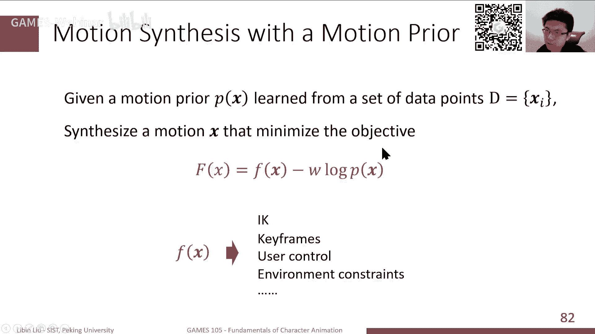

是我们常用的一个形式，然后这个形式其实也是用了很多。

也是在很久很很也是在很长一段时间都是被被使用过的。

不好意思对，就是像比如这是一个嗯04年的一个工作了，就是他其实是就是刚才我们说他其实是基于pc的，比如说我在一个比如少量几个动作开始。

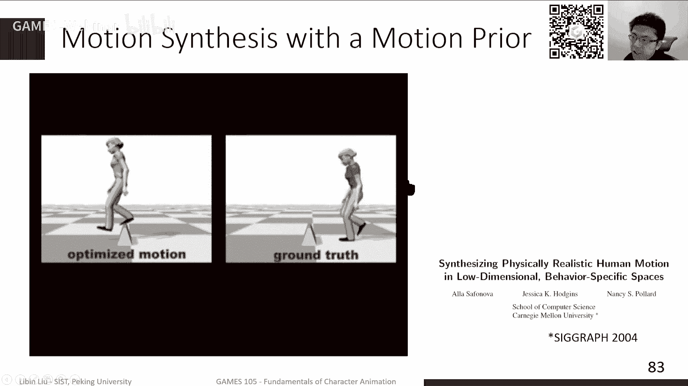

比如可能有三四个动作，三段动作之上，我算了一个pc，那这个pc其实就给了我一个这个动作的这个比如说我在pc做完pc之后。

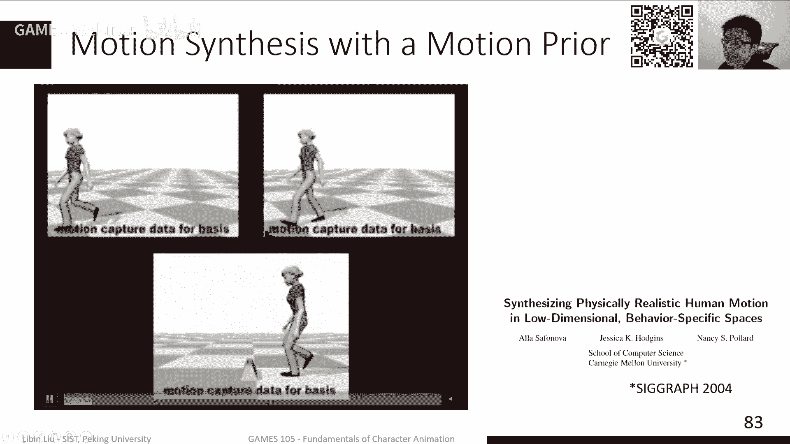

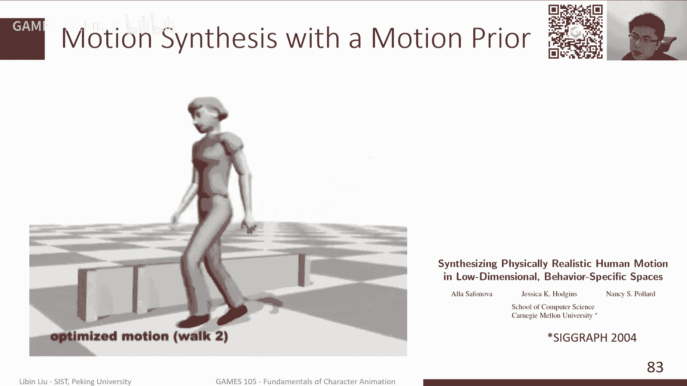

找前面几个主要组成分啊，这些组成分离，这其实就告诉我在什么样一个范围，这个动作是看起来可能是自然的，然后接下来我们就可以给出一些其他的一些约束，比如说这个角我在移动的时候，我希望这个脚抬的更高一点。

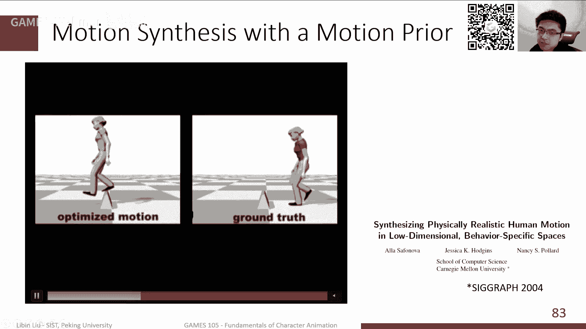

那这个时候其实它会转换到一个对于相对于高度的一个优化变量，然后再加上我pc给出的这个动作经验，那我其实可以保证我在运动过程中生成一个看起来比较自然的动作，同时能够满足我前面这个运动心眼。

其实对应的类似于其实差不多也是ik的这样一个功能。

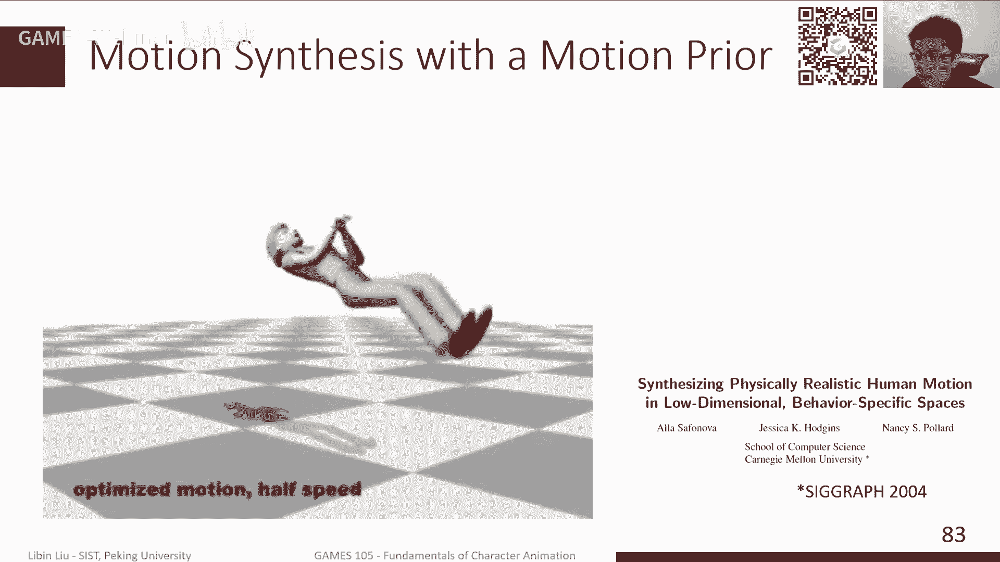

还有其他的，比如说像这种在一个后宫番里边，我们可以调整中间某一个状态时候角色的姿势，那其实我们也可以加上前面的优化的过程之后来实现这样的过程，同时整体来说动作也是相对来说是是是比较自然的。

ok当然前面实际上对于pc或者基于高斯分布的这样的一个先验。

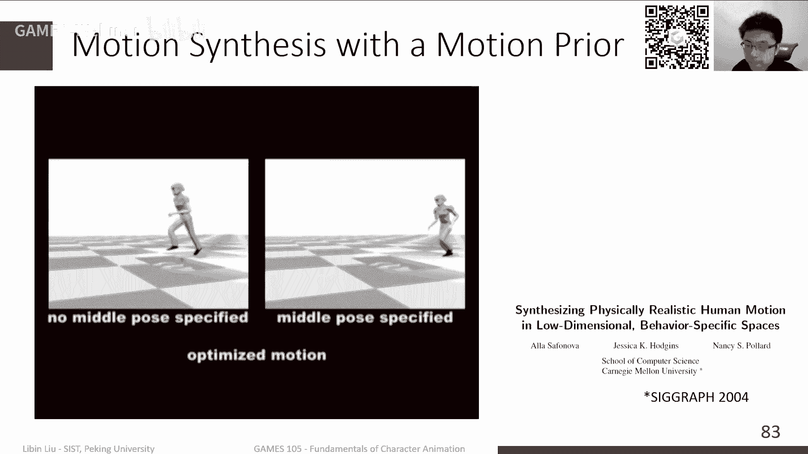

相对来说还是非常非常有局限性的，就是说其实我们看了一些动作，比如走路比较简单，但是稍微复杂一点的，比如说做一个后空翻啊，做一个比如说做一段跳舞，那其实这个靠一个高斯步是很难实现的，因为主要是说我们动作。

其实我们把它假设高斯是一个非常非常大的一个简化，而且实际上我们这个动作他的这个概率，概率密度函数可能是一个非常复杂的概率密度函数，只靠高斯的话可能很难去，比如他可能还有多多个这个多个峰值。

一个高斯只是单风了嘛，他可能很难去踩到其他峰值的这个效果，所以说为了解决这些问题嘛，其实后来也是有很多一些相关的这个研究去想要去把这个高斯的模型，把它用更加复杂一点的高斯模型来来去实现。

就比如说09年的时候，这个我这工作很多了，我只是随便挑了两个，也不是随便就是挑两个比较比较经典的，就比如说这个就是这个以前这个陈建翔老师他们组以前做的一些工作，他们是可以用了一个高斯混合模型。

高斯混合模型它不是一个一个高斯，是一个每一个n代表一个正态分布，它对应的是一个高斯模型，然后高斯混合模型其实是把若干个这样的混合模型，用一个参数给混合起来，实现了一个一个更加复杂的这样一个函数。

然后他们其实把这个模型应用在比如说这个动作编辑上面。

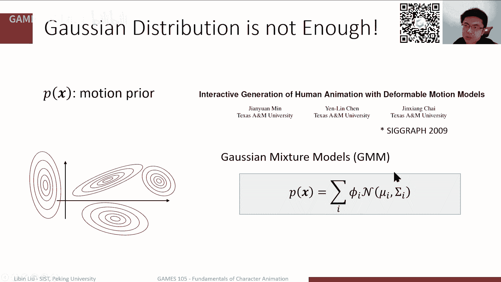

那其实可以得到一些很有意思的效果。

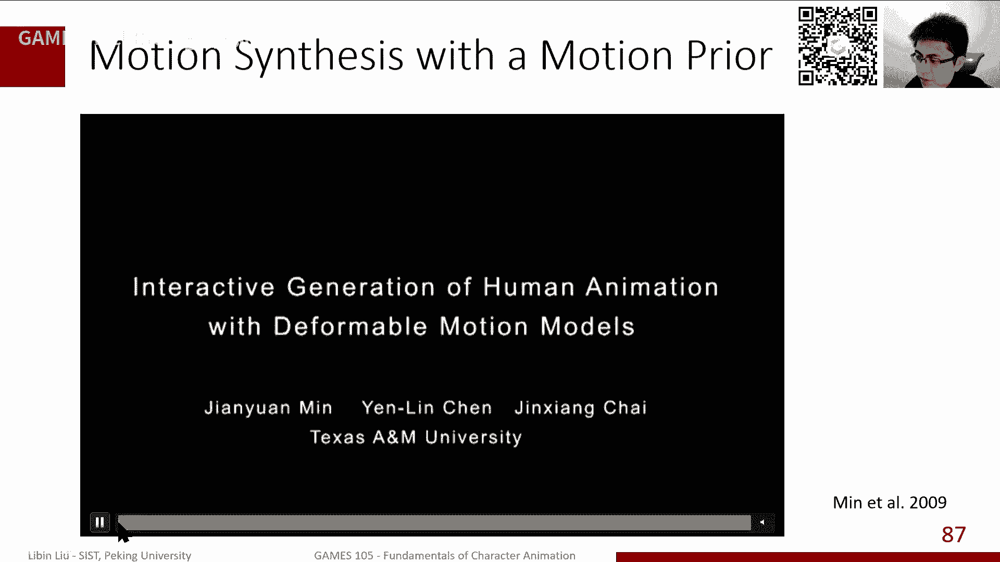

这个模型里边比如说我可以对我这里跟安安，按照我刚才提到了，就是其实motion prior就是我们这个动作先验里边不一定只有一个动作。

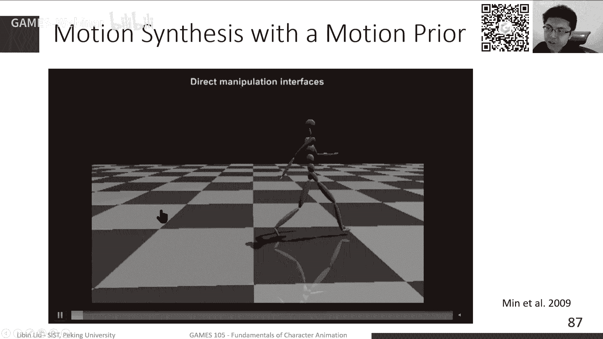

它可能代表了若干个动作。

那这些若干动作合在一起，其实构成了一个完整的。

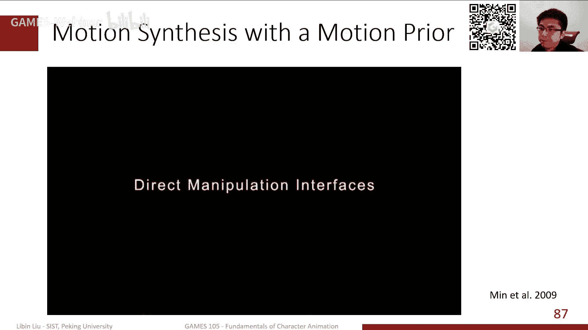

就是比如说我判断相当于我是我我我这个输出这个概率函数，输出其实是整个这一小段动作，它是不是真的动作，那这个其实跟我有什么效果，就比如说我在改这样一个角色，整个这段动作里面某一个某一帧的这个状态的时候。

实际上他是可以因为本它这一帧对应的，其实是说为了让这一帧在整个洞里看起来真实，其他对应的可能整个动作都是需要相当发生一些变化之后，才能让这一帧看起来真实的。

所以产生这样的一个效果，其实还有些其他的，主要是说可以在这方面可以做一些这种动作编辑的操作。

还是非常有意思的。

然后其实都已经，而且实际上比如说你会做做做sorry，你会做动作编辑之后呢，其实自然的一些其他的操作，比如说我们前面提到了基于视频的单视角，视频的动作捕捉，它本身是一个签约签约束的问题。

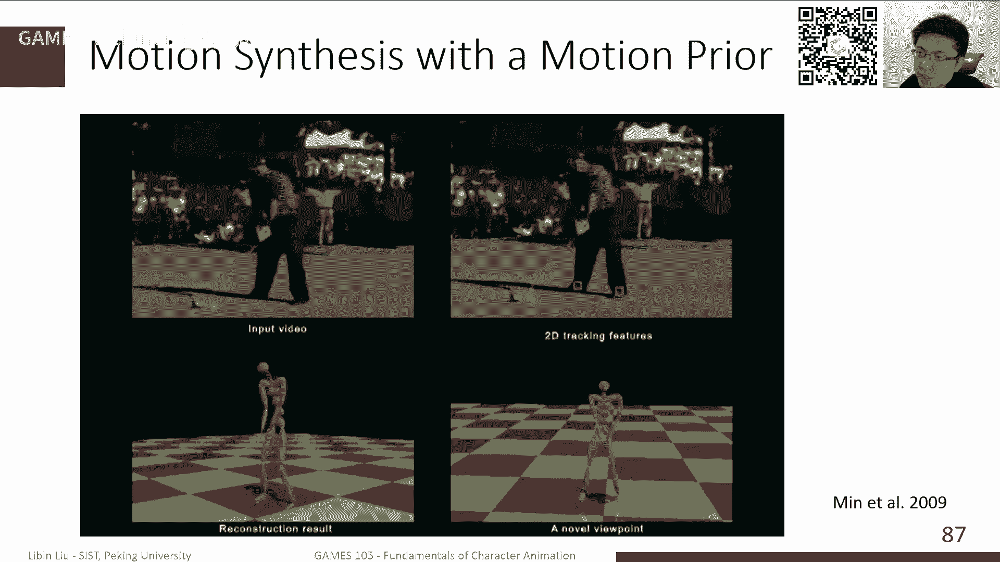

就是说实际上我们不同的姿势，很多种不同的姿势可能都会意识到同样一个二维的平面的效果。

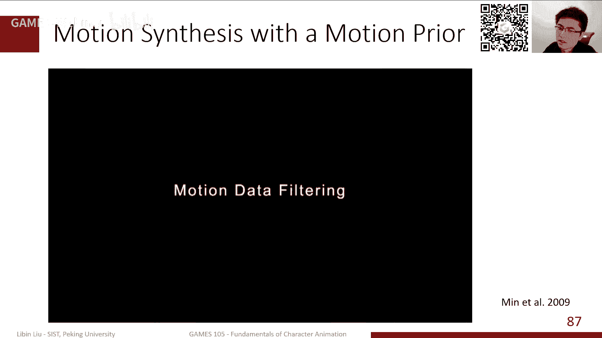

但是如果说我们有这样的动作经验的话，其实我们可以过滤掉很多不正确的姿势，那其实剩下的部分应该就是比较正确的，就是可能是我们想要的这个角色真正的姿势。

然后以此类推，当然还有其他的，比如说更加复杂一些方法，比如说前面的这个高斯混合模型，其实它也是有一些基本的缺陷呢，就说我我我混合的这个数量是需要预先指定的，而且是一个比较比较敏感的一个参数。

还有些其他的方法，比如说12年的时候就是那个circle啊，其实他现在后来不做，他们以前也是做animation的，他们之前也也做了一些尝试，就说把这个高斯不是用高斯混合模型了，而是用高斯过程。

就这个一个这个g p r v m来去实现，我们对我们这个动作的这个鲜艳的这样一个估计，那这个具体的这个这个内容我就不讲了。

但是这个这也是一个很有意思的工作，那实际上也是可以实现非常符自由的。

这样一个受控的这样的一个角色啊，这样一个受控的角色同时也可以生成非常自然的动作。

当然是前面这两种方法，就是不管哪一种方法，其实都是基于一个啊高斯分布，就是高斯过程呀，或者高斯就当是这一类的这个比较传统的这种这种这种概率模型，当然就是虽然效果还是不错的。

但实际上你可以如果你读了他paper论文，或者说你尝试自己实现的话，你会发现其实实现起来非常的麻烦，因为好多参数特别是高斯模型里边，比如说高斯混合模型里边，这个我的这个混合多少个高斯分布，这是一个参数。

或者比如说gpl v m里边，比如说我的这个核空间，我的科目函数该怎么定义，这也是一些非常难得，所以说总体来说，如果说你想实现这个效果是非常麻烦的一个过程，而另外一方面，其实从表现力来讲。

我们其实前面这个函数。

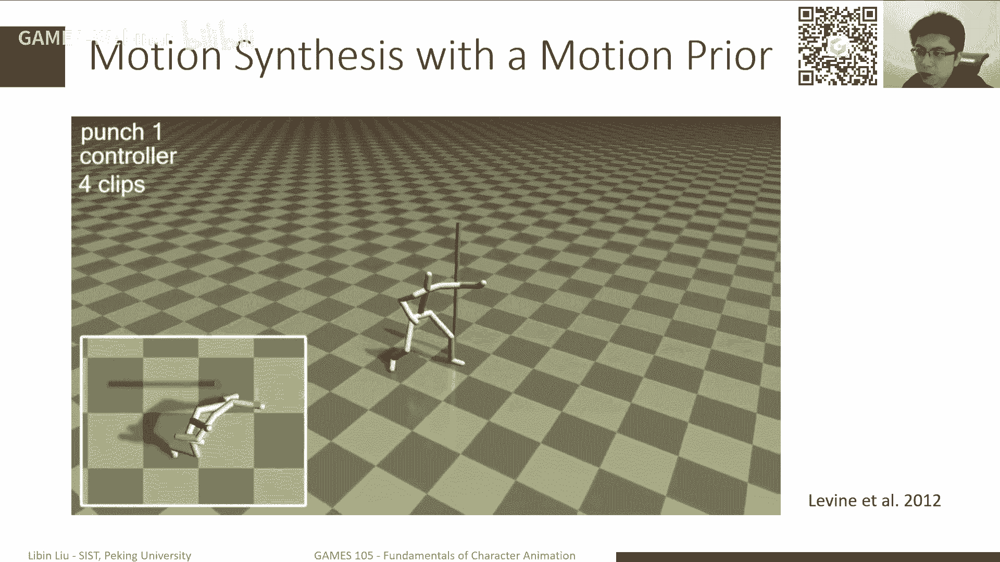

我们整体这个函数实际上是非常非常复杂的，就是他我们前面只是假设它是高斯的，但这件假设其实也不完全是准确的，所以实际上随着后来其实也是近2年近5年的发展，其实大家也发现，特别是生成模型。

其实大家看到生成模型在很多领域，特别是在图像生成方面，图像语音生成方面，我们其实看到非常非常好的效果，特别是这2年看到的，比如说这种stability fusion。

就是可以给一段文字可以生成非常好的这个图像，其实它本质上也是一样的问题，就是我给大量模型训练之后，我学到了一个非常复杂的函数，这个复杂的函数可以估计我这个动作到底这个图像到底是不是真的。

图像对动物来说也是一样的，就是我们其实可以用神经网络，加上这个这个神经网络的这样的方法来代替，我们前面传统这些方法里面用的这种各种各种复杂的高斯混合模型，来实现一个对我们这个运动先验这样的一个估计。

然后在这个估计之上，那我们其实可以生成可以很容易地生成更加复杂的这个动作，但这个我们下节课会会做进一步的介绍，那我们今天只是稍微提一提，我们主要做什么事情，然后反正我们前面也是稍微回顾了一下。

我们关于动作图和motion matching的一些。

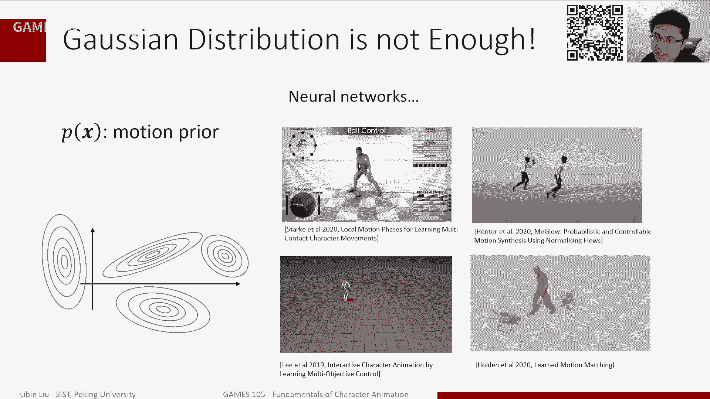

稍微稍微稍微多讲一点时间细节，ok那我们今天的这就是我们今天主要内容了，那我们今天的内容就到这里啊，非常感谢大家。

