# GAMES105-计算机角色动画基础 - P7：Lecture06+ Learning-based Character Animation (cont.) - GAMES-Webinar - BV1GG4y1p7fF

ok好那我们就开始上课了，现在是诶还有一分钟哈哈，不过时间也差不多了，对我们今天是啊games 105的第七节课，虽然是第七节课，但实际上我们讲的还是第六节的内容，因为这个上节课我们还是还是上了111。

一部分内容，虽然说我们这这节标题是learn based learning，based current mation，但是我们上节课讲了大部分内容，其实是相对来说不是基于神经网络的啊，角色文化。

而是主要是基于一些相对来说稍微早一点的，这种工作，主要是基于一些统计模型的，特别是基于高斯模型的这种呃，这种对运动进行建模，然后对运动进行生成的一些一些技术，当然那些工作就是说虽然是在我们展示过程中。

就是我们这个论文的展示，其实有很多比较好的效果呃，但是实际上在真正应用应用方面，其实还是有很多的困难，因为特别是像高斯模型里面有很多超参数，这些超参数在使用的时候，通常很多时候是需要手工去进行设置的。

这个其实会带给我们的使用，带来非常大的一个困难，但我们其实也是近2年啊，看到一些新的工作，其实带来了很就是特别是对动画方面，其实带来很多的这种进步啊，我们也看到一些新的方法，实际上从这个实用性上。

要比以前的这些方法要好很多，因为我们发现a红方只需用那个pytorch，写一个神经网络，然后用一些数据训练一下，然后就能得到还是不错的效果，那这个其实是我觉得是比以前的方法，要好好一点的地方。

当然为什么我们讲前面的方法呢，实际上我们我我个人是觉得，就是实际上像这种方法，就是他的思想就是基于这种基础的这些想法，其实是是一致的，只不过我们换了一种另外的工具，把同样的这样一个东西把它表示出来。

那我们今天主要讲的内容其实是啊，基于这个，动画的这样一个话题啊，当然我们今天主要是稍微多讲一讲，关于这个基于神经网络的呃，一些新的这些这些这些方法的一些简单介绍，那当然我们这个作为这门课的要求来说。

实际上我们也不会说，要求大家去真的去训练一个神经网络，这个其实稍微有点有点有点有点多，但是呢当然如果大家有兴趣的话，我们今天只是讲一讲一些论文的一个呃，大概的想法，但是大家有兴趣的话呢。

其实最好还是去读一下论文啊，当然也可以，其实最近很多的论文，有一些比较好的这种博客呀，或者知乎的这个帖子啊，或者解读啊，其实讲的也是很不错的，我觉得也是可以给大家一个很好的，这样的一个印象啊。

那当然关于我们的第二次实验啊，第二个作业大作业，第一个大作业其实已经交完了，那第二个大作业呢，我其实看到助教今天已经准备好了，我们应该今天晚些时候就会放在了，我们的那个github上。

我们的这个就提醒大家有这样一个作业啊，然后也是欢迎大家继续啊挑战啊，因为这个就是有一部分涉及第一个啊，作业的部分呢，我们可能就直接给答案了，因为呃因为就假设大家已经会写了。

然后当然有一部分新的内容是否涉及到我们，前面，主要是前面前面关于数据的这部分的方法，其实就内容相对少一点，ok那我们开始主要讲今天的内容，我们今天内容其实比较少，就是因为这个预告里我看到了。

另外一部分是关于这个蒙皮啊，但我其实可能因为今天一方面是过时间关系啊，另一方面也是这个进度安排的问题，呃所以说我们今天不会讲蒙皮的部分，然后蒙皮和这个嗯人脸动画的话，我们会放在下一节课去去做简单的介绍。

当然还是说我们这边这门课，主要是讲角色动画的，就是其实主要还是讲骨骼动画嘛，所以说蒙皮的技术相对来说，我们只会介绍一些基础的部分啊，这是下节课的内容，我们这节课，决动画的第二部分。

那时间上节课我们其实也是稍微提了一下，我们的目标是什么，我们其实还有一专门，有一节是讲基于数据的角色动画，那当然这个区分其实没有那么严格了，它其实也是基于数据的，因为我们都从数据里去学一个模型嘛。

那当然我做这个分，我就是在我来说，可能把这两个分成两个不同的部分，主要是在于说基于数据那部分呢，我们着重于是说对于数据的一个重放的一个重，组的这样的一个一个操作。

比如说非常典型的motion graph，它是对一些动作片段的一个重组，那还有像比如说这个motion matching motion martin，其实它也是一个重组，但它重组的力度会更低一点。

它不是一个motion clip，而是一个motion frame，我们其实上节课也是强调过，就是说啊，它不是对数据的一个简单的一个重组连接，这个模型是什么呢，我们可以从统计的角度讲来说。

就说我们给了一些数据，这些数据点，那这些点每一个点代表一个动作或者一段动作，那我们有很多个这样的动作之后呢，我们可以假设这些数据是从就是它分啊，遵从同样的一个概率分布，这个概率分布是什么意思呢。

其实简单理解就是说它代表了一个动作，是真实人能做出来动作的概率，那我们去上节课有一个例子，就是说如果说我们随机做一个动作的话，那其实你这个人会乱飞，就完全看起来不像一个人，或者说我们大家做第一次作业的。

这个love一的那个ik，你会发现，其实好多动作，你看起来不像是一个真的人会做的动作，所以这都是一个不真实的一个结果结果，那我们如何来判断一个真实，那我们是假设真实的动作，它是满足一个概率分布的。

那就是这个概率分布函数，就代表了他这个动作是真实的概率，那当然这个概率分布函数我们是不知道的，我们其实是没有办法，因为它很复杂，给出这样一个东西，那我们就只能通过一些数据，我们给出大量的数据之后。

我们希望能够学到这么一个概率密度函数，这个概率密度函数，当我给出给他一个新的动作之后，比如这个动作用x来表示，那么这gala密度函数能够告诉我们，这个动作是一个真实动作的这个可能性。

其实我们关于概率的部分，这部分的这个用的这个语言，其实是非常不精确的啊，就是说嗯，就是说实际上我们应该我们讲解的过程中，其实主要还是通过一个啊，概念性的这样一个介绍啊，说明说明这是一个问题。

但是实际上这个数学上，其实这个公式可能不是那么精确，只是但这也是稍微提醒大家一下，那当然这里边其实我们刚才也提到，就是说这里边每一个我们给出了若干个数据点，很多数据点，那这里每个点呢。

对于我们这一个特定的问题来说，它其实代表了一段动作，一段动作是什么，一段动作，就是说其实想一想，我们刚刚最开始讲那个b位置，讲那个动作捕捉，讲这个动作的表示，我们其实说动作或者一段动画。

它其实是一系列的真一系列的姿态，在时间上排列起来，形成一个很长的一个这么这么一段序列，那这样一个序列其实每一个这样一个块，就这一个列其实是一个向量，就这基本整整体来说，我们可以看成一个矩阵嘛。

那每一列式也是一个向量，那个向量代表了一个姿态，那这个姿态其实有很多种不同的表示方法，比如说我们常见的，就比如我们在讲变位置的时候，我们把它表示成根关节的位置，加上每个关节的旋转。

或者每个关节的朝向构成的这样一个向量，它朝向我们可以表示成比如说关键旋转啊，比如说可以表示成欧拉角，或者表示成这个轴角，或者表示成6d呃，向量这样的形式，当然还有其实一些其他的形式。

我们其实这个姿态也可以用，只用关节的位置来表示，实际我们看到很多相关的工作，他们其实是用位置来表达一个啊姿态，就比如说我做出一个举手的动作，那么其实我可以算一下我的肩膀，我的手腕每个地方在哪里。

那他整个把这个位置叠在一起，写成一个向量，那其实代表了一个姿态，那当这两个这两个表示其实各有各的优缺点了，其实我觉得主要是像，比如说你基于位置的表示的话，因为比如说我用驱动一个虚拟角色去运动。

比如说用蒙皮绑定上去，那我通常来讲是需要知道关节旋转，我才能把那个角色给驱动起来啊，这样的话如果说我只是计算位置的话，那我们其实还需要算一个ik啊，把我的位置再转化成关节的旋转。

那如果说我们只有关节旋转的话呢，其实关节旋转它没有一个全局的位置信息，大概在什么时候会有一些问题呢，比如说我需要把两个手放在，比如让手拿一个杯子，或者需要你的脚在走路的时候，你需要在地面上。

或者说比如说两个人一块走啊，比如两个人握手，那我需要两个人的手需要在同一个位置，那这个时候你用关节旋转的话，你缺少一个对位置的一个一个很好的一个计量，那这个时候也会带来一些问题，但这个确实不能。

但实际上从效果来说，可能这两种方法呃，在使用上来说可能是差不多的，就只是说他们俩各自有一些可能的优缺点，但不管怎么样，我们把每一个姿势表成一个向量之后呢，那其实一个动作，那其实就是就是一系列向量构成的。

这么一个这么一个这么一个长条的矩阵，那当我们前面提到的，我们的目标目标是学到一个概率，密闭的函数或者概率分布，那这个概率分布呢，它可以对每一个动作表示大写的x，那每一个动作判断它是不是一个合理的。

这样一个一个人能做的一个动作，那当然实际上，因为我们知道这个其实它本质上等价，于是说我判断这样一个呃一组动作，一组姿势的组合是不是一个合理的组合，或者他其实就相当于这个所有这些姿势，因为每一个姿势。

我们可以认为它是一个呃随机变量，那其实我们其实是判断说整个所有这些姿势的，随机变量的一个一个一个一个联合分布，它是不是一个合理的这样一个值，当然这个除此之外呢，我们其实通常还有一些额外的一些条件。

比如说比如说我们想知道一个，比如说告诉一个人，你往左走，那我其实想要知道这个他这个人做出来的动作，是不是在向左走，同时又是满足人的这个这个姿态，那除此之外，其实人还有一些其他的一些一些。

我们无法很明确的表达了一些一些特征，比如说比如说老人走路，你说什么样的，像是老人走路，那其实这个老人走路就是一个老人这件事情，时间是一个是一个约束，就是我们其实是希望我们生存的动作。

是在这样一个条件之下得到了一个很好的动作，所以说实际上这个带来的是一个在统计，概率上来说，是叫一个叫应该是叫做这种条件概啊，就是条件概率密度，就是他的条件是说我们比如说你要向左走，或者说你是一个老人。

或者是一个儿童，那其实他可能走路，或者我高兴的时候，或者是一个悲伤的时候，那我其实可能做同样的动作，我的代表的这个姿势是不太一样的，那这里面其实我们会基于一个条件，那个条件是用一个z来表示。

那等会来讲它可以代表一些需要用户控制的量，比如说告诉你该往哪个方向移动，或者是一些控制用户不是很控制的量，比如说当前角色的一些状态等等等等，ok，那当然我们前面只是说，我们训练了这样一个模型。

那这个模型可以去判断一个动作是不是合理的，那我们知道，其实如果说我们有一个概率密度函数，那我们其实是可以，在这个基于这样一个概率密度函数，它所代表的这个概率分布，我们去采采样。

那我们如果说我们这个概率密度函数，确实训练的很好的话，那我没采到一个样本的动作，应该就是一个合理的动作，并且它能够满足我提出的这些啊前提条件，那在这个时候下嗯，我们的这个这个采样一个过程。

实际上我们可以写成一个函数映射的过程，就是我们给出了一个控制条件，比如说一个控制参数，或者是一个，比如说一些隐含的一些当前角色的状态，那么我通过这个他这个这些条件，去生成一段动作。

那其实它代表了一个函数，它的这个函数就是把这样一个控制信号，映射成一系列的姿态，来形成一系列的动作，那当然这个方向实际上我们前面解释说，ok我们是把一整个动作，把动作的一整体看作成一个变量。

或者看到一个x，但通常来讲，实际上我们可以把它看成，从另外一个角度去看这件问题，就是说我们知道一个一串动作，就是一系列的姿态的这样的一个组合，那实际上我们同时比如我们正常往前走的时候。

我们知道其实我当前的或者我下一个时刻，我的姿态我其实是怎么说呢，我其实是从我基于我当前的这个，或者我过去的一些姿态来决定的，或者怎么说呢，就比如说我当前是在在教室里坐着。

那我下一下一秒肯定不能跑到外面去，因为这个这个有时空的一个距离的限制，那这种情况下实际上就说明什么呢，说明的是为了实现一个比较好的一个，或者比较自然的一个动作，时间是要求什么呢，要求是说我每一个姿态。

在在我们前面已经走过的这些这些姿势之后，他的下一个姿势是一个合理的姿势，所以首先这个从这个条件概率的角度讲述，就是说，实际上我们本质上还是希望，能够让我们每一个姿势，因为我们所有的姿势构成一个动作。

我们让所有的姿势构成一个动作，它整体的一个这个联合分布，是一个合理的一个动作，那这个基础之上呢，实际上我们可以应用一些这种概率，概率论上的一些技巧，比如说我们可以用这个乘法原则，或者叫这个链式法则。

我们可以把它写成改写一下形式，可以成一个大概类似于这样的形式，那这个形式里其实可以看到，就是说除了第一个第一帧这个姿态之外，后面的每一帧就后面每一帧，比如说t第七针，它其实是由前面的若干针共同来决定的。

或者说在具体点，就是说比如说我下一只给我往前走，我下一步的这个状态其实是由我当前这个状态，一定程度上决定了，当然还有一些其他的条件，就比如说我现在往哪走，比如说我们的这个身体的状态等等。

所以对于这后边这部分来说，就是后面这部分其实它告诉我们是一个概率，也是一个概率分布，但是一个条件概率，他条件概率就是说当我们给出了过去若干针，我的这个角色姿态之后，我当前这一帧它是一个合法合理的。

或者是比较自然的一个姿态的这样的一个概率，那同样的，如果说我们要知道这个概率，反过来我们也希望从它里面进行采样啊，其实这个过程我们同样也可以把它表示成，一个啊一个一个一个一个函数的形式。

这个函数就是说它根据它的输入，就是过去若干帧的这样的一个姿态，加上一些我们额外的一些控制变量，或者是一些隐变量，然后呢他们能够去算出，根据所有这些信息，算出我下一帧的这个。

这个下一时刻的我的状态应该是什么，那当然这里其实还有一个条件，就是我们这里在这里，其实这个这个假设是比较泛化的，就是说实际上我说ok，我下一步是跟我过去20年所有的动作都相关。

那这个想想其实完全是不合理的，因为正常来讲我做动作，我往前走，我做一个决策，可能也就两秒之前或者一秒之前到了，就已经非常非常非常非常多，是已经非常多了，所以实际上通常来讲，我们在做这种动作合成的时候呢。

我们其实会假设我们这个动作，它有一定的这个马尔可夫性，就是马尔可夫性的说明是什么呢，就是说马可夫性是一个，就是就是所谓叫无记忆的一个一个性质，就是说我们下一时刻，比如说x t。

他的状态是可以完全由过去一帧的状态来决定，或者再再再再准确点说，就是如果说我们知道了当前x t减一，当前角色这个姿势，那么角色下一时刻的姿势就不会受到过去，任何一个时间则是受到影响。

就是他只跟上一帧的有关，然后他不会跟这个再往前这个时刻有关，那如果说我们假设这个动作有这样的，马可福星的话，那其实这个整个的这个概率密度函数，其实可以再化简一点。

然后而且我们需要去求的这个生成的这个函数，这个f其实它的形式也会更加简单一点，就是这种情况下，我们其实这个时候f它带来的含义，或者这个p代表含义，就是说我给出过去一帧的姿态，我下一帧是什么姿态的。

它是它是真实的这个这个概率，然后或者下面这个这个app其实代表的是说，我根据我当前的一个姿态，加上一些控制的信号，我去计算下一时刻，我的角色的姿势应该是什么样子，那这个过程会不断的叠加了。

因为如果说我们算出下一时刻的姿态之后，如果我们算出下一次他的角色的姿态之后呢，我们可以通过当通过下一时刻继续叠加，算出再下一个时刻的这样的状态，我们就可以不断的叠加下去。

那这样其实可以生成一个完整的动作，ok那当然这其实就是我们这通常来讲，我们会关心的两种不同的这种看法，一种方法就是说我们把动作整体放在一起，我们其实不，我们先暂时就是认为这个就是我我用这个app。

我们给出一些变量之后，它可以一次一次性的生成整个的动作，那这个过程实际上两个动作相邻动作之间，两个相邻帧或者相邻时刻，这个姿态之间的关系，其实是隐含在这个app里边的。

所以时间很现在很多工作有一些工作吧，其实它是基于这样的一个这样的一个表示，他可以直接生成所有动作，另外一种就是刚才我们说到了，就是说我们认为这个动作，可能他只跟过去一些相关。

那我们其实可以把它写成一个这样一个，类似于条件密度函数的一个形式，那接下来呢我们其实可以知道在生成的时候呢，我们可以只根据当前这一帧，然后加上一个条件来生成下一帧，那这个时候f其实相当于是显示的。

对这个相邻两帧之间的关系做了一个，做了一个建模，那这是一个另外一种方式，但其实通常来讲，对于我们这个实时的应用来说，比如在游戏里边，那通常来讲我们其实希望的是后面这一种，为什么呢。

因为用户的输入这个z还是经常会发生变化的，我就推摇杆，我向左推，右向右推，那我其实是用户时它可以随时改的，那这个时候我们需要怎么去生成一个新的动作，那这个其实是希望他能够立刻响应，那就是说我可以。

我可以利用这样的一个形式去上生成，那前面这个在什么地方很有用的，比如说我我我给你一句话，或者我给你个剧本，我希望你爱了个剧本，生成一段表演，那这个时候实际上相当于这个，我其实这个交互是不需要实时进行的。

那这个时候如果这种前面这种表示，其实会更好一些，为什么呢，因为后面这种表示实际上它生成这一帧的时候，他其实完全没有考虑未来的一些状态，这个其实也不完全对的，为什么呢，因为比如说我要往前走。

或者前面我看到前面有地上有个坑，那我其实在这个离那坑很远的时候，我可能就要做一些决定了，比如说我该迈哪条腿，或者说我可能要避开那个坑，那这其实是未来的一些信息，这些信息在这个后面这个模型里。

其实是他自己是不带的，我们需要加一些其他的方式把它引进来，那如果前面这个模型的话，相对来说我们会容易把它放进去，因为它是考虑整体的一个一个表现，那当然后面这个模型呢，实际上我们它我们可以通常可以。

把它叫做一个这个自回归的模型，因为本质上自回归嘛，它其实其实的含义就是说用过去的信息，用过去的若干帧的这样的一个变量，这样的一个状态去预测，去计算下一时刻的这样一个状态，那当然其实我们就是最简单的。

如果说我们考虑这个马可夫性的话呢，其实他的这个函数的表现形式，其实就是这个样子，其实非常简单的，就是刚才我们刚才所说的，我知道当前帧的状态，这样一个变量加上控制信号，然后生成下一帧的状态。

那当然这个控制信号我们刚才提到的，就是它可以是用户输入的控制，也可以是一些我们用户不能很容易去定义的，一些演变量，比如说它的心理状态，他的身体状态等等等等，这些都可能不是用户控制的。

然后呢这个f其实是这样的一个映射，当然我们可以暂时先把这个z忽略掉，我们就只考虑这样一个f的映射，就是它的就是含义，就是说它根据当前的这个x，根据刚才这个x去预测下一帧的这个x。

那这是一个非常基本的一个函数，那刚才我们提到了，实际上我们的这个训练过程是说，我们给了一系列的这样的一个样例动作，那就说让一个人在一个动补空间里，然后我让他自己随便做一些动作吧，你做个20分钟一个小时。

只要你累的不行出来，那我们就是他有了大量的这样一个动作，那这个动作构成了一个集合，代表了我们这个训练集，那当然对于我们现在这个训练来说，实际上我们其实并不关心整个动作是什么样子。

因为我们只关心xt和xt演绎，他们俩两两这一对的这个关系，所以实际上我们关心的是说，我们把所有动作拆开，我们只看前后两帧，那他们其实构成了一系列这个这个这个元组，二元组。

那其实这二元组就是前后两针的这样的，一个关系，那我们是通过希望能够从这里面去，学到一些信息，我记得来说实际上就是说什么呢，这个这个函数f它是能够保证，在这个二元组上保持成立。

也就是对于这个我们所有的一个训练集里面，数据不如我们这所有的采集到这个动作，我都可以保证使得f x t减一等于x t，那在这样的一个基础之上呢，当我们给出了一个新的xt减一。

然后它能够预测出一个合理的xt，这其实是我们的训练的目标，那这个其实看起来很很熟悉啊，回想一下，我们以前之前讲那个关键帧动画的时候，我们其实挺像啊，说到了同样的问题，那关键帧动画我们说到什么问题呢。

就是说我们给出了一系列的关键帧动画师做的，那我们希望能够去在这个关键帧的基础之上呢，算出关键帧之间的那些时刻的姿态，那当时我们其实是用到了一些差值的算法，比如说线性差值，比如说这个样条插值。

比如说这种多项式插值，那当然差值的好处，在当时这个差值就是其实还是挺，用起来是比较方便的，当然有一个前提条件是什么呢，就是说相对来说，因为它的它是在时间上的一个一个一个差值。

比如说实际上我的自变量的维度是比较低的，我其实只有异味，那相对来说，一般来说我用差值其实算起来还是比较方便的，但是对我们现在这个问题来说，我们这个姿态的空间通常来说维度是比较高的。

但是这个比较高其实怎么说呢，看你怎么看了，因为从我们角度来说，因为比如说一个人，那可能你的关节数，我们会控制的关节数可能也就20左右，那你这个整体的自由度可能也就60左右，五五十到60。

那这个其实你要说高吗，其实对我们来说是很高了，但可能从有些领域来看，这个这个作用已经非常低了，特别是比如说做做这种几何处理的啊，他们看这个他们一个模型大概上千个点，那就几万个自由度。

那当然看我们这50多个其实比较低的，但实际上50多其实已经很高了，因为你很难去描述，很难去想象这个50多位它是什么样子的，那当然还有一些其他的方式去去做这种高维的，这种差值的。

就是高或者高维的这种这种fitting，这个这个这个叫拟合对，就比如说我们像高斯过程，我们其实上节课讲了一些关于这个用高斯，高斯分布，就是基于各种比如高斯过程呀，或者是混合高斯呀。

其实本质上他也是在做这种做这种差值操作，其实对应的有点像是ibf这样的东西，但是现在比如说我们很常用的一类方法呢，就是所谓的神经网络来做这个拟合，因为本质上来说，其实它就是一个高维的一个拟合过程。

但神经网络是什么呢，我其实稍微简单介绍一下，但是我相信很多很多很多同学，在其他地方也看到过了呃，那神经网络，实际上它是来自于一个对一个真实的这个，神经的一个，或者大脑的这样的一个一个一个一个描述。

或者基于这样的一个生物学的这样一个结构，的一个一个启发的一个结构，那我们知道一个神经元，那高中生物其实也都学过一个神经元，那其实有很多这种树图，然后会有一个轴突啊，当然这个这个具体名字我也记不太清楚了。

好像是大概这个样子，然后这个数图其实是，比如在大脑里有很多很多神经元，这个神经元的互相之间会通过这个视图进行连，接，我进行传递，然后比如说他隔壁的神经元，会把一些信号传递到某一个视图上。

然后另外的神经元可能把另外的信号，传到另外的视图上，然后这些数都接到这些信号之后呢，其实会这些信号会这些刺激会产生积累，那通常来讲，对于这个中间神经来源来说，当它周围所有的这些数图上的这个刺激。

积累到某一个阈值之后呢，它就会被触发，它会发出一个信号，那这个信号可能是通过数度传出去的，也可能通过这个轴突传到后面去，然后传到另外一个神经元，那这时候神经元这个它的某些数据。

接到了这个神经元前面那个神经传递的信号，然后他再去重复刚才这样一个过程，这其实是这个一个正常正常的一个人啊，就是生物体的这个神经元的一个一个基本性质，那对于我们这个人工神经网络来说。

实际上它的基本单位也是这样一个神经元，那当然这个节神经元它本身就有若干个输入了，每一个数其实是一个片，一个一个一个标量，然后每一个标量其实代表了在这个树突上，对这个神经元进行了刺激，那当这个刺激上。

实际上我们也不是直接把它加进去，而是通过一个权重把它加进去，然后这个阈值其实是由中间这个西格玛这样，一个函数来来给出，也就是说其实sigma是，我们通常很快会把它叫做一个啊，叫一个积极反函数。

他意思就是说可能对于不同的基本函数来说，它会带带带带有不同的性质，但它带一个最基本的就是说当我前面这些量，前面这个总的刺激的这个总和，加群和超过某一个阈值的时候，他会把这个输出给给输出去。

那当然可能有其他的结构函数，可能会他给这边有一些有一些很小的数的时候，也会输出，那这个区我们几个函数是定义的，但总体来说，这么一个神经元，其实代表了一个一个一个具体的函数呢，其实就是前面若干问。

所有输入的一个加权平均和，然后加上一个这个这个bias，这样一个这个叫什么来着，bias应该叫，叫一个偏移向量，然后通过这样一个这个一个激活函数，然后得到最后生成的值，那当然我们其实对于神经网络来说。

我们其实有大量的神经元，然后通常来讲，那么每一个神经元其实代表了一个标量，比如说xy是两个向量，那它其实输入里边是有a就有n个神经元，然后输出哎呀我怎么全是y一了，这个这个这个写错了。

应该是输出是y1 ，然后每一个神经元从输出层的每一个神经元，其实都会跟输入层的所有神经元进行连接，然后它所带来的这个输出时间，是跟前面这个一个神经元的那个结构是相同的，那当然比如这里有n个神经元。

m个神经元，把它总体的这个输出方式，其实我们也可以这个形式化的，写成这样一个形式，就是实际上是因为每一个对每一个神经元，它都是一个加权平均加权求和，那总体来说时间是一个啊。

可以写成一个就是把每一个深渊写的，写一个向量之后呢，那其实是一个举人相承的一个形式，那同样的它每一个向量，我们需要对这个把它加上一个啊激活函数，来去算出真正的这个输出的值。

那当这个神经网络其实我们可以增加很多层了，那全是写成一了，ok我们神经网络其实可以有很多层，然后每一层实际上都是从前一层的，所有的神经元接收一些信息，然后把这个信息的传递给后一层的所有神经元。

那比如说像这样的是，其实一个非常简单的一个三层的一个倾向网络，那其实每一层比如第一层，它对应的神经元的这个权证是w1 ，然后偏移是b1 ，然后第二的这个全称是w2 ，平a是b2 ，然后第三个是以此类推。

那对于这样一个神经网络来说，实际上它所代表的一个函数，它所代表的一个函数，可以写成一个这样的一个形式，就实际上是相当于最后一层，首先最后一层的激活函数，是由前一层的这个输出乘上w，然后加上这个b。

然后前一层的输出呢又是在前一层的这个输出，整个w加上b然后依次往前迭代，所以其实本质上来说，它是一个从后往前的这么一个，这么一个复合函数，那当这个复合复合函数里边，首先这个西格玛就是这里的奇偶函数。

通常来讲是我们预先指定的，而且实际上很多情况下他是选择哪一个呃的，影响没有那么大，就是我用一个rio啊，或者是用一个或者用一个什么sigmoid的，其实影响你说有些是有的，但是影响没有。

那没有那么significant，但是这里面其他的几个部分，这个b和w就是这个w代表什么，代表是从前一层到后一层，我在每一个方向上加了权重，然后再比如说b是我的一个基本的基底，的一个bios。

就是这个偏移向量，那这些参数其实会决定了，我给给出一个自变量x之后，我的输出y应该是多少，或者可以把它再稍微简化一点，就是实际上对于神经网络来说，我们其实先不用关心它具体是一个什么结构。

因为刚才我们说的是一个非常非常基本的一个，前向神经网络的这样一个结构，但是不管哪一种结构的话，神经网络它的基本标准配置，就是我每一层都会有一个w，然后每一层都会有对应的b，哪怕是我们很复杂的。

比如说像是这个cn这种结构，它其实本质上也是一个w和b的这样一个形式，那这些w和b比如这里有三层，那就是三个w1 w2 w3 和三个b，他们共同的决定了，我这个f对于某一个输入x之后，它输出y是多少啊。

其实这些w和b其实就对应，于是这个神经网络的参数，所以再回到我们前面这个问题，这样的一个过程，实际上就是说在我们给出了这样的一些一系列，这样一个训练数据之后，我们如何去确定一些这个参数。

我们把这些所有的参数总体来表示，上一个叫做一个用c来表示，我们其实是想要去确定这个theta，然后这个theta首先它能够保证，对于这我们给出训练数据里的这个xt和xt，x t一和xt。

能够满足满足我们这样的一个输入关系，同时呢对于一个新输入的一个x，我们也能够预测它的这个对应的这个值，但当这个东西怎么训练呢，实际上本质上来说，我们其实还是去求解一个优化问题，那这个优化问题是什么呢。

就是说我们给出了一个这样的一个训练集合，那这个可能是来自于序列的动作，这个动作我们是一个人在，可能在一个地方走了20分钟，然后我们去找到希望，去找这么一组参数，神经网络的每一个每一层的各种参数。

然后这个参数能够使我的在训练集上的误差，尽可能的小，那这个误差表示什么呢，这个是这个前面这段啊，前面这一半代表是用来基于当前的x对，这个s t建议啊，然后这个预测跟我真实的只做一个差，那其实代表了误差。

那这里其实我只是简单写了一个二，一个一个范数，但这个范数是什么，其实很多时候在不同问题有不同的解法，比如很多时候我们可能写成一个二范数的平方，然后很多问题里边可能是一个一范数啊。

有些问题可能也许是一些其他的，比如可以写一个无穷范数也是有可能的，那定义好这样一个优化的问题之后呢，那我们其实回想一下，我们讲ik的时候，其实已经用到了这个优化问题，我们本质上来说是希望去求解，就是现。

但是相对来说这个问题，因为这个app本身是一个很复杂的函数，虽然说我们这个神经网络看起来，这个结构表示比较straight，forward比较直接，好像一眼就能看到去，但是因为它对应的这个函数的形式。

具体这个形式其实会非常非常复杂，所以通常来讲就为了求解这个优化问题呢，我们还是很常用的一类方法，就是用这个所谓的梯度下降方法，然后其实特别是对于这种数据量很大的情况下。

我们一般都采用的是所谓的随机技术下降，所以t度下降，它基本是它本身还是一个循环循环更新，这个fa的这个过程就是有点像我们ik的时候，那个那个那个jcb那a的方法，当然他这个他这个他只是说每一次。

因为我们这个数据集，原来数据集可能是很大的，所以每次我是只从数据里选一个小的子集，那这个子集它一个batch，对我们一般说这个batch size，我们这个这个batch的大小。

其实代表了我从这个子集里面随机选了多少个，多少组这样的数据，然后对于每一组数据的话，我们可以计算一个近似的梯度，因为我们这个区真正的梯度，其实理论来说应该是所有数据的这样一个求和。

但实际上我们只能现在只是取了一部分，所以说我们只能算是他的一个近似的梯度，那这个梯度其实公式是一样的，只不过我们是只是考虑，我们采取这个bg里面的所有的所有的点，那接下来呢实际上我们算出这个梯度之后呢。

因为我们其实梯度的方向代表什么，我们前面也提到了，对于一个连续函数来说，它的梯度的方向代表了它增长最快的方向，所以说为了能够接最小化这样一个啊，以后优化目标，所以说实际上我们是需要减掉一个。

就是沿着梯度的负方向，然后乘上一个步长来进行这样的更新，那通常来讲这不长，一般来说不能太大了，因为这个太大就会带来这个优化不稳定的问题，那当然这里其实一个很关键的部分。

就是说这个其实就是这个这个梯度怎么算啊，我们其实i k这方面的方法里面，最麻烦的一个就是这个亚克比矩阵怎么算，那其实我们刚才接线也提到了牙科比决胜，如果一方面你是可以比对艾克来说。

一方如果你能自己想自己写的话，你可以通过比如用基于这个只要没水，基于这个几何的方法，用那个插值的方式去算，或者你不想写的话，诶，反正我们现在有很好用的这些，他们其实本质上来说就是可以帮你做这个。

自动帮你做这个微分，那对于神经网络来说，实际上我们神经网络其实有很大的一个特点，就是刚才我们也看到了，其实三层的神经网络，或者若干层的一层一层神经网络，它本质上是一个复合函数。

所以说你对这个复合函数里的参数求导，其实你是要用一个链式法则去做这件事情，那这个链式法则其实你再进一步的把它简化，就是那个那个求导过程，再进一步的这个归类一下，它其实就就会变成一个非常有效。

非常高效的一个算法，那这个算法其实就叫这个后向传播，bug provocation，当然我们这里不会讲，就不讲细节了，但是大概其实其实你是可以理解的，就是说back propagation。

就说后向传播，本质上是链式法则的一个直接的一个结论，那就是这里就是说那实际上我们大部分的，比如说这种事情啊，像pytorch torflow啊，其实大家都基本来说都是这些思路，就说你做这个后向传播。

你肯定是就是链式法则的这样一个，一个一个一个效果，ok那其实这样的话，就说我们其实已经给一些数据之后，我们其实可以通过这样的嗯，嗯这样随机随机退出下降，我们其实可以学到一个函数，那这个函数f。

它可以去根据我过去的当前的一个时刻的状态，去预测下一个时刻的这个状态，那这个过程我们其实其实有很多的这个，运动数据作为这个我们的训练数据了，比如说我先踩了一段动作，这个动作是向前走的啊。

这个图看起来很熟悉，我们讲那个motion machine的时候，其实用过这个图，ok那我们其实有一个一个动作数据，这个动作数据向前走的，然后我们其实因为我们这个人在这个房间里，随便的随便的跑动嘛。

那其实可能有另外一个数据，他是向左走的，那还有一个数据是向右走的，那我把所有这些数据都放在这个训练集里去，训练的话，你会发现出现什么问题呢，就说我比如说在某一时刻，这个人在这样一个状态。

那这样一个状态之后，我接下来我在数据里边发现他在接下来的状态，可能是有些数据是向左走的，有些数据是向上走的，有些注意数据是向右走的，那这个时候我的这个训练的结果，应该是向哪个方向移动呢。

其实你是无法判断的，就这事其实是一个一个所谓这个随机性问题，就是你的数据里缺少一些约束，在缺少约束的情况下，你会发现往哪个方向，都是都是数据里存在的一些数据，那这会带来什么问题呢。

就是说你很可能你最后学到的一个结果，是一个平均的一个动作，因为你实际你会发现，比如说你这个方向算了一个梯度，这个方向算了一个梯度，这个方向算了一个梯度，这三个梯度的方向加在一起来发现是个零。

那其实其实你最终学到是一个平均的一个方向，所以为了解决这个问题呢，相声我们还是需要一些，就是我们其实说的是，就说明如果你出现这个问题，就是有一些因素是你没有表现在这个x里边的，就是这些，或者再进一步说。

就说这个时候x t减一的xt不是一个单射，它是一个它需要加上一个额外的变量之后，它才是一个单色，那这个额外的变量是什么呢，其实有些是我们可以控制的，我们刚才提到，比如说我们知道这个角色。

我知道我的这个意识告诉我哎呀，我现在先现在应该向左走，那我接下来就知道了，那些他肯定是，这个才是我真正需要去预测的目标，那如果是向右走的，应该是另外一个是你可以预测的目标，那还有一些其他的一些因素。

我们可能很难去很难去建模，那这里其实关键就是说我怎么去找到一个，合适的这样一个z，这个进行其它，避免说我们这个这个这个啊，这个随机性问题所带来的这种退化的情况，其实有几个方有几类的工作。

其实主要是来它引入了一些额外的变量，来解决这个问题，ok那其实最有名的工作了，也不是最有名的，就是相当于是近2年这一系列工作的一个，最早的这么一个工作。

就是这个p f n就fafunction networks，那你座一座是这个nhold，这个当然是以前是那个他是那个他哭，他哭的这个学生，然后后来也是去了玉璧啊，最近好像又又又又换地方了。

然后当时他这个工作其实效果是非常好的，我可以学一个神经网络，然后这个神经网络，我其实只需要根据当前的状态加上一些呃参数，加上一个face的一个指标，我就可以生成非常好的动作。

但这个动作其实现在看来不一定不是非常好了，但至少从他至少从我们看起来啊，就是感觉这个动作首先看起来是reasonable，是一个可看起来是ok的，可以的，然后同时又可以有些响应，当然其实还有些其他。

它有一些各自有他自己的问题了，但是从那个时间，比如说2017年，这是2017款，2017年的工作，其实说实际上怎么说呢，就是在他这工作之前呢，大家其实也没有想到，或者没有人真正能够做出来。

是用神经网络给我训练一个模型，我就能实现这么好的一个动作，因为我觉得这些公司，其实在那个是非常非常有启发性的一个效果，就是他其实两个两个方面就是两两，其实我觉得当时就两个工作非常好，一个是这个。

一个是那个motion，matching，motion market，是一个非常实用的一个技术，那这个其实是代表了，ok，这个方向，其实是真的是可以可以做出很好的效果。

ok那当然这个我们可以稍微再多讲一点，就是它的一些那个底层的一些技术啊，就是说我们刚才提到了，就是为了能够解决这个随性问题，那我们其实也额外的引入了一些参数，来帮助我们解决这个问题。

那这里面其实有两部分，对于这个模式这个p f n来说，它两部分，第一个部分是一个控制参数，那这个控制参数相对来说比较好理解啊，就说比如说前面这个前面这里边，比如说这个人我推着摇杆。

实际上这个下面这个地面这条线，我从这个基于这个用户的输入来算出来，这个角色，他应该在未来走到什么位置的，这样的一个这样一个计算，那这个计算其实他没有用到任何神经网络，这就是一个啊手动设计的一个规则。

然后他把这个这个这些这个地上这些点，把这些点的位置作为它梳理部分，就是前面那个control parameter这个控制变量这部分，然后另外一部分其实也是非常关键的一部分。

就是所谓的face parameter，就是一个像像参数，就是这个相位参数，那实际上就是说这个思想，其实但这个思想其实也是有也是由来已久了，就是说这个其实在以前，比如在我们在做以前做运动控制的时候。

也有很多时候会用到相位这个概念，就是相位啊，就是说实际上它是一个怎么说呢，一个一个一个类比啊，就是有点像，因为相位，通常来讲，我们是讲三角函数里面的那个那个那个偏移，我们把它叫做相位。

但是很多时候比如人走路，比如一个正常人走路，就如果说你不做这种奇怪的动作，就是就是闲着没事就就在那走，那实际上你的动作是有非常强的这种周期性的，那这个周期性其实就是人走路。

比如说有一个状态是双脚都在地上的，一个状态是这个单脚在地，就是这个单脚支撑，一个状态是双脚支撑力，然后又回到单脚支撑一次，以此类推这样的一个状态，然后这个周期，那我们其实可以把它叫做一个这个不太周期嘛。

get cycle，那这个周期，我们其实它是一个不断重复的一个过程，如果说我们把这个周期本身定义成一个，0~1的这个区间的话，那其实我的相位参数可以定一个参数，来表示我当前处于哪个相位。

会处于哪一个这个比如说哪个，比如说如果说我定义右脚啊，左脚落地这一瞬间是零，然后右脚落地瞬间是0。5，然后再左脚落地的时候又是一，那它等价也是零，那我其实就构成了一个循环，那是循环的每一个比如说给出0。

3，那其实代表的是左脚着地，然后右脚可能在空中，这个这个往前摆的这样一个状态，所以时间如果说我们对于一个比较平稳的走路，那其实每个相位其实就对应好了，一个具体的状态的一个一个姿势，当然稍微小跑个题啊。

其实就是这里有一个收集到一个，走和跑的定义的问题啊，大家知道这个奥运会嘛有一个项目叫竞走，其实竞走一个非常重要的一个违例，就是双脚离地哈哈也就是说其实对于走路来说，其实它定义什么叫走路。

我始终有一个脚在地上，至少有一个脚在地上才叫走路，那什么叫跑步呢，我有一个时刻是双脚都离开了才叫跑步，所以说这个其实是稍微稍微稍微有点意思的，一个话题，ok那就像我刚才我说的。

实际上这样一个相位的这样一个参数，它其实是它这个范围我们是可以自己定义的，有可能是0~1，也可以是0~2，派也是零到派，这个企业我们我们我们从哪个角度去看它，但本质上它的一个性质是不会变的，就总的来说。

它是一个我们设定好的一样一个一个范围，就比如说我们我们可以说左脚着地，那一瞬间是零，然后到右左脚再次着地的时候是一啊，对内也是零，那这样的话构成一个循环，那比如说我们可以把右脚着地的一瞬间，变成0。5。

这个好处是什么呢，就好说，比如说我有些时候不是一个不是一个，一直往前走的状态，我可能一边走一边向转弯，那有可能这个时候，其实你两个脚落地时间可能是不均匀的，那这样的话时间它会带来一个。

就是它会自动的让我的动作，就是说虽然说这个角的落地时间不均匀，但是在这个时间这个这一小段时间之内，我在某一个相位，他的这个姿势是相对来说比较固定的，就是他这样的话，其实可以就是自动去生成我们不同这个啊。

就是就是说可以我们可以通过这个控制，我这个相位在真实，因为这只是相位啊，就是它并不是一个真实的世界，就是他真实的时间有可能是比如说左边走一步，左边这一步快一点，右边那一步慢一点，这是对应真实时间。

但对于下位时间来说，它是一个一个一个固定的时间，所以其实可以我们通过调整这个相位，和真实时间之间的相对关系呢，其实我们也可以调整，我们真正生成这个动作的这个速度啊，其实他某种程度上。

其实也影响了我这个动作的这个啊，这个这个这个类型，所以这是我们这个对于都不这个步子来说，一个相位的定义，但除此之外呢，其实p fn其实也提出了另外一个，非常重要的一个这个网络结构，因为他们也是试过了。

就说我直接把这个相位，比如最简单，我把这个相位就作为这个参数一部分，把它放看成相同的，等价的一个一个一个一个一个地位，然后我就直接训练一个神经网络，他把这两个东西作为输入，然后直接输入下一帧的状态。

其实这是他们就是实际上这个这个，但是他们也是做了一些实验，反正这东西效果不是很好，他们提出了一个新的方法，就是所谓的叫mix expert，其实mix expert这个想思路其实也是比较。

就是在以前也是见过的，他只是说他们把这个东西用起来，发现效果还是很不错的，那什么是mixed expert，就什么是这种混合专家模型，服装的模型，就是说我们正常来讲，这个我们输入是一个x。

然后给出一个通过一个神经网络或者一个函数，我就预测下一时刻的y，这是我们一般的神经网络，但是呢我一，但是如果说我觉得诶这个这一个神经网络，它的能力可能不够强，那我们其实可以考虑考虑另外一个模型。

就是我们可以有若干个这样一个神经网络，每一个神经网络都会做一个预测，或者有点像什么呢，比如说我去看病，我这个身上有个疑难杂症，然后看了1234，我看了十个专家，然后a专家说你是病a。

然后b专家你是个对a专家说，你这个这个就是一个感冒，你就是回家呆着就好了，然后避开b站，一看时你就要进icu了，抓紧时间住院了，然后再看一个c专家，然后可能每个专家会过一个不同的判断。

那么最终我的病是什么，那我可能是把所有专家的这个意见，做一个加权平均，那我可能就是又不住院，又不又不又不又不吃药，反正就是这样一个状态，但总体来说，这个混合状态模型大概就是这个意思。

就是说我们有若干个专家的网络专家的策略，他们分别给出相同的输入之后，他们做出一个不同的预测，然后这些预测呢，我可以通过某种方式把它结合起来，然后最终得到一个新的，这个我们最终的这个结果。

那这是混合专家的一个一个模型，那基本的一个常见的一个方式，就是说我们每一个状态是f，它都它都有不同的参数，非常比如说有了有n个专家，有大n个专家，然后我们可以把每个专家的输出。

用一个权重把家庭平均起来得到的y，这是一种专家过控模型，那混合专家模型当然还有另外一种，这也是p o n他们当时使用的这种方式，就是说叫他们叫这个waited blanded mix expert。

就是说实际上前面这种专家模型，它是把这个专家的输出作为一个模型，那后面这种呢，其实相当于说我把每一个专家的参数，把它做一个混合，混合了之后呢，把混合之后得到那个参数，我认为它定义了一个新的专家。

那这个专家其实相当于我，我我获得了以前所有专家的这个知识，那这样呢，我希望这样一个专家，能够对我当前的状态做一个更好的预测，所以你可以从公式的角度讲来说，它其实跟前面有点不一样。

原来是所有的输出做做混合，现在是说我把专家的参数做了混合，然后用它来进行预测，这是一个啊混合专家模型的这样的一个嗯，这样的一个一个一个形式，那回到我们前面这个pv的这个问题。

就是说它实际上它定义了这样一个face function之后啊，face function时间代表了我当前这个他是在走路，这样的一个这样一个固态的一个循环中的，哪一个状态，那接下来呢。

其实我们会认为我们这个专家的这样一个，混合的权重，它应该是由face来决定的，对当然这也是，那这个也是就只是我们的一个假设，我们认为假设说我们对于某一个状态，他应该就是由这几个专家。

应该用这种方式去混合得到，那当然这个对于这个pf来说，他们其实用了一个cubic plan的一个方式，来计算这样一个专家权重啊，就相当于比如说这是它有四个专家，那如果说比如说face在这样一个，比如0。

25~0。5，这样一个区间之内的时候，那我其实认为我的这个值是由c呃，1234这四个专家做一个cubic plan的这个嗯，kuma ros，就cut rom样条差值得到的就是我认为这四个点。

这四个专家的参数是这个样条，四个样条的这个差值点，那类似如果说这个five在这个位置，在这个位置，那其实他那个这个顺序其实要改变一下，那其实变成2341这样的一个顺序，他在前面的时候1234。

那这个时候2341，然后再往后的时候可能是那个c123 ，以此类推，所以这样的话其实就是构成了一个什么呢，就一方面来说，我这个角色，我当时这个角色，他在这个走路的每一个阶段的时候，我会用不同的专家。

我强制他用不同的专家来预测这个啊，我下一时刻的状态，其实这种相关方式来说，就是相当于让每个专家更加专的去学，这一个特定的这样的一个face，这样的一个这个相位上的，这个它的姿态的变化程度，在某种程度。

也是也是说让这个专家能够更有效地利用数据，也避免了一些这个这个这个啊，前面提到这种随性的问题，诶，这是这是这个这类方法的一个一个特点。

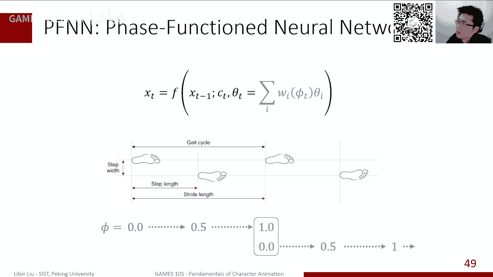

那么效果其实刚才也看到了，其实效果还是相当不错的，当然就是也有一些很大的缺点了，就是说呃虽然说看起来这个动作是ok的嗯，但实际上你要仔细看的话，他有些细节，你是它是没有办法去很好的去复现出来。

就先你可以仔细看，你会看到角度上还是有点滑，其次是比如说我做急转弯的时候，比如正常人他会有一个减速啊，然后掉头啊这样的一个过程，那p fn实际上他就比较cheat了，就比较比较这个比较这个作弊一样。

就他就直接人就转过去了，那你就缺少了一些细节，所以这是也是他的一些一些缺点，但总体来说这个作为这个方向的第一个工作。

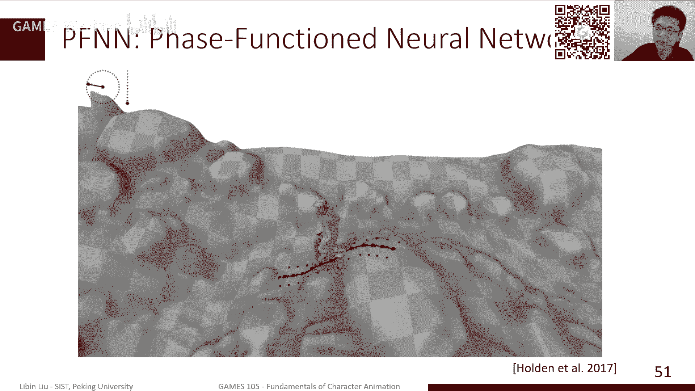

这个其实效果还是还是相当不错的，那当然实际上后面就是这一系列的工作，其实是在这样的一个基础之上做了，进一步的改进呢，就比如说我们前面提到了，其实这一系列他就是这一系列的工作，其实是很大的一个共同点。

就是他都是把一系列的专家的参数混合起来，然后造一个新专家，用这个新专家去做这个预测，那在这个过程中，其实这个专家本身是一个，另外呢这个权重在p fn里边，这个权重是固定的，它是由这个啊相位唯一确定的。

而相位是一个从0~1不停的，这个这个这个前进的这样一个东西，那其实后面其实和大家会发现这样一个权重，就比如说最基本的我这个人来说，人的走路，我们可以定义这样一个fs，这样一个这样一个向量函数。

但如果狗的走路啊，或者马的跑步，那这个face该怎么定义，那就是非常复杂，甚至于人这个走路也是就是人的动作，走路不是可以定义这个face的，但是比如说我要打篮球，那打篮球其实我的脚步跟我这个接触球。

这个时间可能不完全是对应的，或者说还有一些其他的，比如说跳舞啊，那这个动作就更加过真人，可能单单腿跳一跳，那我的face该怎么定义，其实更加更加复杂一些，所以实际上呢就是后面很详细的工作。

大家做的事情就是说我不再去显示的，去定义这样一个确定的一个ph，一个一个相位的这样的一个权重的啊，混合权重的一个计算，而是我希望这个混合群众呢，是根据我角色的这个当前状态。

加上用户的一些输入的参数来去给算出来，那当然实际上那这部分的话，他们就可以去定义一个新的神经网络，叫做gnetwork，叫做门网络，那他最初的做一件事情，比如说给了一个参数之后，我通过一个门网络。

然后去输出，那通常来讲这个对于这期的工作来说，你才会发现其实你不需要很复杂的网络，就是不管是门网络还是有的专家网络，可能只需要两三层的一个，简单的一个前向神经网络，就足够完成这样的计算。

而且效果也是非常不错的，所以说这个其实也是另外一个，就是也是超乎大家意料的一个一个问题，那当然这里后面就很多工作了，就是说其实从17年开始，有一系列的工作来做这件事情，主要在于什么呢。

就是说我们需要给这个门网络，输入什么样的参数，才能让他预测比较好的这个这个交易专家选中，另外一方面其实也是说我应该给这个函数，就是我们前面也提到了，我们动作其实有很多种不同表达方式嘛。

我们是用关节旋转表达，我们是用这个关键位置表达，我们是不是还考虑关节的速度，还考虑一些其他的一些信息，这些信息可能都会影响最终的结果，那这个其实很多时候是来自于，我们怎么去去构造网络结构。

怎么去调我们的输入参数，那他后面有一些工作，比如说18年的时候，这个工作其实做的事情就是说ok我，我除了这个角色的姿态之外，我们还需要考虑一些脚的速度，我认为脚的速度是非常重要的。

那其实发现诶确实对于狗的这个洞来说，是更加好的效果了，然后后来呢其实比如说我们如果说不只是假了，我们还有手，他打球，我们其实可以分别的对每一个，因为比如说像前面那个走路，我们其实是两条腿。

这个交替行为构成了一个相位函数，那我们其实可以进一步的，我们可以把那两个角分别拆开，我们可以分别对两个角分别定义一个向量函数，或者更进一步的，比如说我我可能有手就打个球。

那其实我对这个手上也有另外一个相关函数，那类似我如果有更多的这个交互的话，我会更多的相关函数，我问问这些所有的这些相关函数，分别做这个参数输入进去，这是20年的工作，20年的工作呢，其实再进一步。

就说我这个我都不需要再对每一个手，单独去定义这样一个想法函数了，我希望我可以从这个数据里边去自动的，用复制变换就学到一个下面函数的一个组合，那么它具体代表哪个手，我们是不关心的。

但总体来说我们它代表了一些手，一些一些一些姿势组合，那这些这些整个这个这叫compound，这个东西叫复合纤维函数，那提供了也可以用作为我这个gtwork的输入。

来去算这个专家混合权重的这个这个啊这个值，那所以其实这是一系列的工作，就是它总体来说是说在这样一个基础之上，我们只希望能够去不断的去调整。

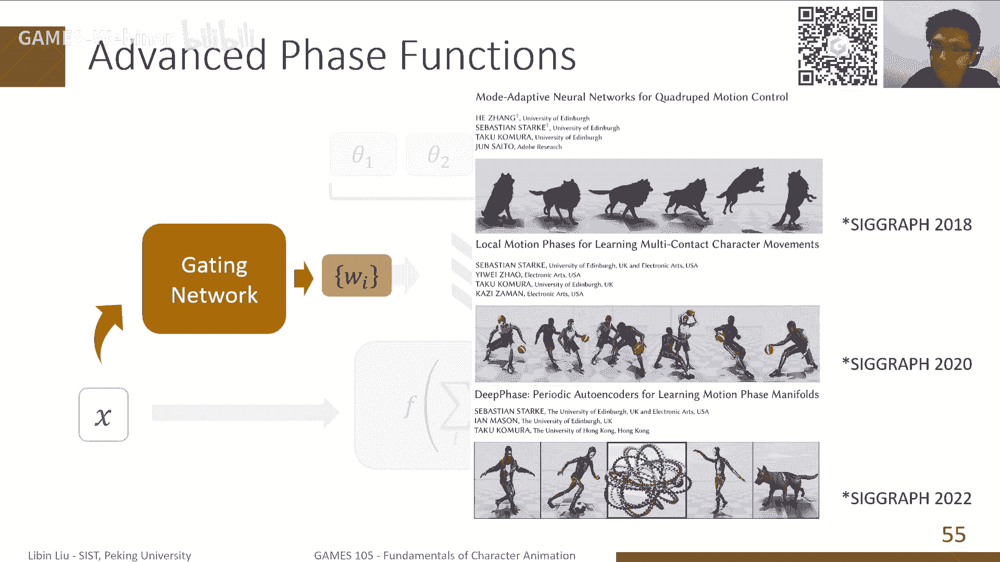

这样的一个参数呢，那它来达到更好的效果，但是今年工作的效果了，其实看来已经非常好了，而且实际上从这个呃，这个这个实际的这个嗯这个啊效果和细节来说。

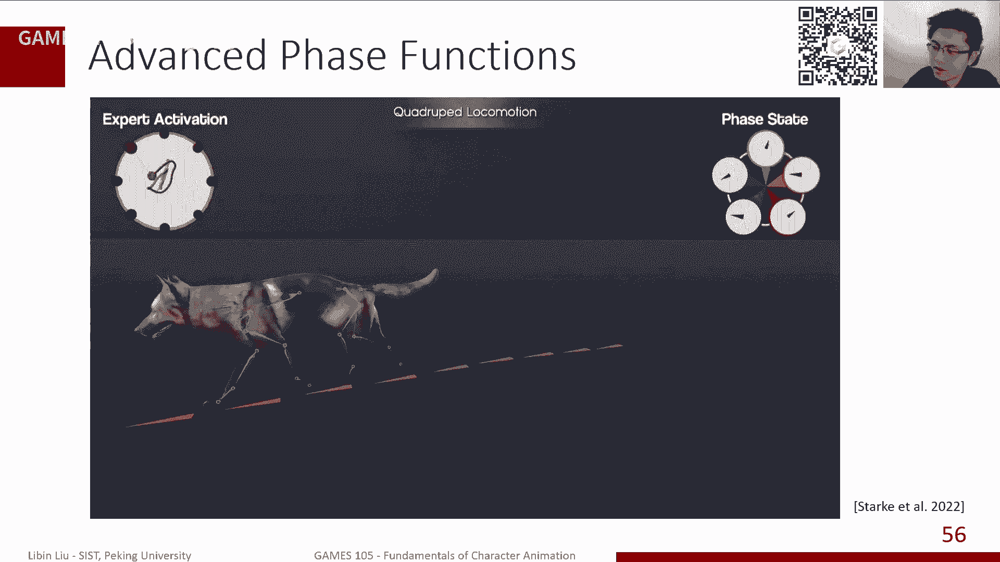

其实都比以前好很多，那当然我们前面提到的，其实是说我们显示着去学一个一个函数，它根据我们当前的状态，加上一些用户参数，去预测下一帧的这样一个状态，这是一个训练的过程，但实际上我们前面也提到了。

那这个概率密度函数可以告诉我，这个动作到底是不是真的，ok那我们前面只是稍微偷懒了一下，我没有学这概率敏函数，而是我就是学了前后两帧的这个转移的，一个一个一个一个函数，但是我们如果想。

我就真的只想就想直接学这概率买了，我该怎么办，当然这里其实就是我们不会讲很多的，那我们只是讲一讲大概的一个想法，据说实际上我们真实的动作，它的概率函数，它的化石的图可能是非常非常复杂的。

我们这里是随便画了一个，但是看起来已经很复杂了，那我目标是什么呢，我目标是说从一些数据里边去把这样一个函数，这样一个东西给给给给学出来，要是说我们不知道这个函数的形式之后。

那我们其实怎么去怎么去定义它参数，这是这是非常非常麻烦的一件事情，所以有一类的方法就是所谓的一个生成模型啊，就是生成模型，实际上是说我就是确实就生成模型的目的，本质上就是说我给一些数据之后。

我去学这个px，我能知道这个数据里是什么，但是生成模型常见的一个形式，就是其实也是代表什么呢，就是说这就如果是，即使是我知道一个偏这个概率的函数，是这样一个形式之后。

我们如何从这样一个概率密度函数里采样，也是一个问题，就是说比如大家想的，比如说我是一个正态分布，我我我我我是说让你去，你去取一个根据正态分布取1000个点，那这个其实是大家总是有办法可以取的。

但如果它不是一个正当的，而是一个奇怪的，我们也没法写清楚，它是一个什么函数的一个东西，你该怎么从里边取1000个点出来啊，这其实也是一个问题，所以一般生产网络，它通常来讲是起到这样一个形式。

就说我可以从一个非常简单的概率分布，比如说一个正态分布，大家都比较知道的，正态分布，就是一个就是一个单峰的一个那么一个曲线，我们知道我们采样的时候，其实越靠中间越越小越近啊，越概率越大，越往外越少。

它是一个差不多是一个球形分布的一个东西，然后呢我从任何一个采样，我可以通过一个函数f z，然后可以把它映射到这个这个p的这个空间，大s这个空间，那我可以如果说我这个f z。

其实f z其实对应于是这个这样一个，条件密度分布啊，就是当我给出z之后的x一和条件密度分数，如果这个f z能够训练的很好的情况下，那我实际就代表了我这里面每一个采样，它其实就相当于。

他可以把这样一个原来一个正态分布的，这样一个圆形的一个一个形状，把它变形成一个真实分布的这么一个奇形怪，这样一个形状，当然不同的这种生成模型，其实他训练这个函数的方法其实是有所不同的。

比如说我们现在常见的，或者过去比较成功的几种，比如说最早的非常成功的这个v e，其实也不能说最早其实他跟干是差不多时间的，就variational auto encoder，变分自编码器这种方法。

他基本想法就是说，我其实我其实，因为我要学的是后面这个概率密度分布，但是我其实没办法，开始时我是不知道它是什么，但是我也有一些数据点，因为我们知道，我们数据点肯定是从这个，概率密度分布来得到的。

所以我可以把这个数据点通过一个编码器，把它编码成我的这个比较简单，这个分布上的一个点，然后呢再把这个点通过一个解码器，就真正的fx把它变成我们真正的一个概率函数，那我通过训练的时候。

其实就想要让这个解码器解出来，这个点给我输入给编码器的这个点，这俩点就可能相同，那就完成了一个训练的过程，那另外一个方法就是也是非常有名的，大家都知道的这个干嘛，就是对抗生成网络。

那对抗生成网络其实它并没有编码器这个环节，它是直接ok我从这个引擎间找了一个点，这个比如从这个根正态分布找了一个点，我就直接通过一个解码器，把它映射到我这个这个这个数据空间，然后带数据空间。

我需要判断一下，它到底是不是属于这个数据的分布，那我再额外训练一个这样一个判别器，那这个判别器根据这个输入来确定它是不是，它是不是真的或是假的，或者说他如果是真，表示它是属于这个分布的，如果是假。

表示他不是这个分布，那这样的话通过我通过不断的那个半圆去，通过不断训练那个app，使得这个判别器无法判断它是真或者是假，那其实就代表这个f已经带，已经能够把这个一个z。

我们原来正态分布变成一个非常复杂的分布，就是这个嗯干的这样的一个结构，那还有一些其他的企业结构，其实像前2年非常有名的，像这个标准化流，normalizing flow，他其实本质上跟那个呃跟v e啊。

其实是很相近的，但是它它是不同点在于什么呢，我们前面variation in coder，我们自变分变分自编码器，它其实是需要训练两个函数，一个编码器函数，一个解码器函数。

来实现这个中间这个震荡分布的这个空间，引空间，z的空间，到我们数据空间的这样的一个这个一个设，那对于novelifo来说呢，实际上这两个函数是同一个函数，只不过我要求这个函数本身是可逆的。

那其实一个一个是编码器，那它的逆函数自动就变成了解码器，然后通过这样的同样用这个唯一的训练，我们其实可以类似于得到一个normalize flow，的一个训练，然后最近的非常火的。

那我们今天也看了很多很多这样的一个新的，非常好的结果，采用了这个diffusion model，所谓的这个扩散模型，它本质上也是一个，其实本质上也是这样一个编码解码的过程，只不过呢像v e这个结构。

我其实是通过一次编码，就到了我们这个正态分布空间，然后对于这个defeat model或者这个扩散模型来说，实际上它是通过若干次编码，每次加一点点的这个噪音，每次一点点的编码，然后逐渐的一切。

比如说通过1000次或者1万次这样的迭代，我最终得到了这个空间，然后再通过1万次的这个去掉这个噪音的过程，这个1万次的解码，然后再回到我这个眼空间，他通过这样的话完成这样一个训练。

那这是high level的，我们大概是这样一个idea，但实际上我觉得动画来说，因为这些东西，就它最终都是学到了一个对应的一个，动作的这样一个分布，实际上我们可以用不同的含不同的这个模型。

可以实现大致上差不多的目标了。

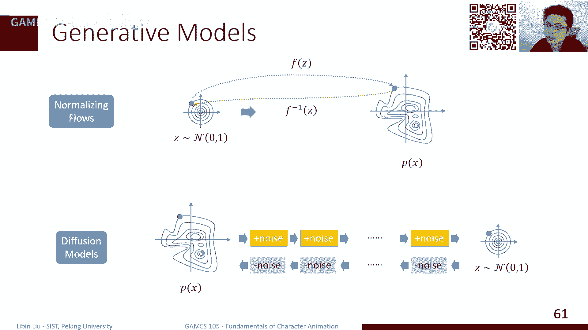

就比如说我们有一些过去，有些比较也是这样的一些经典的工作，比如说像这个用v e那个这个，来实现这样一个控制，然后比如说像这个normalize flow，来去实现这样的一个控制。

那这样的方法其实很好处是什么呢，就是说不管是这样哪一种方法。

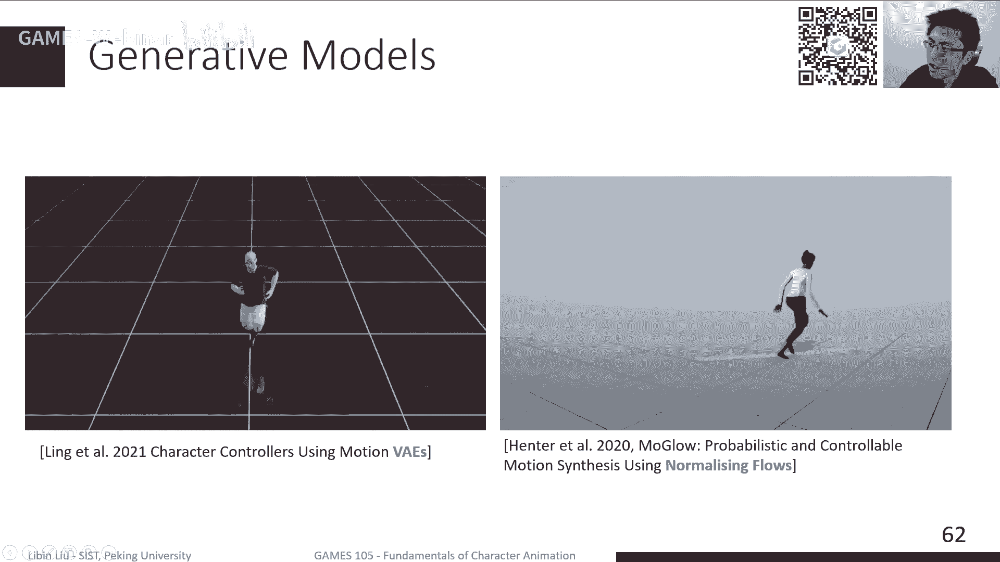

我们其实回到前面的这个这个基本的概念，就是说我们其实是通过这样的，它是通过我可以在这样一个非常简单的，比如说一个高斯分布里去采一个样本，这个样本是一个随机的一个噪音，然后我可以通过一个编码器。

把这个随机的噪音变成一个合理的动作，这是我们这个生成网络的一个，它的非常好的一个性质，那这个性质之上呢，比如说我想控制一个角色向某一个方向移动，那我其实这个目标会变成，我在这个隐空间里的一个一个轨迹。

那时间就出现在反过来，就是当我给出一个目标之后，我可以想办法在引擎里画出一个轨迹出来，那个轨迹通过我的这个解码器，它会变成一个完成这个目标的一个动作，那具体要怎么怎么去实现这个轨迹。

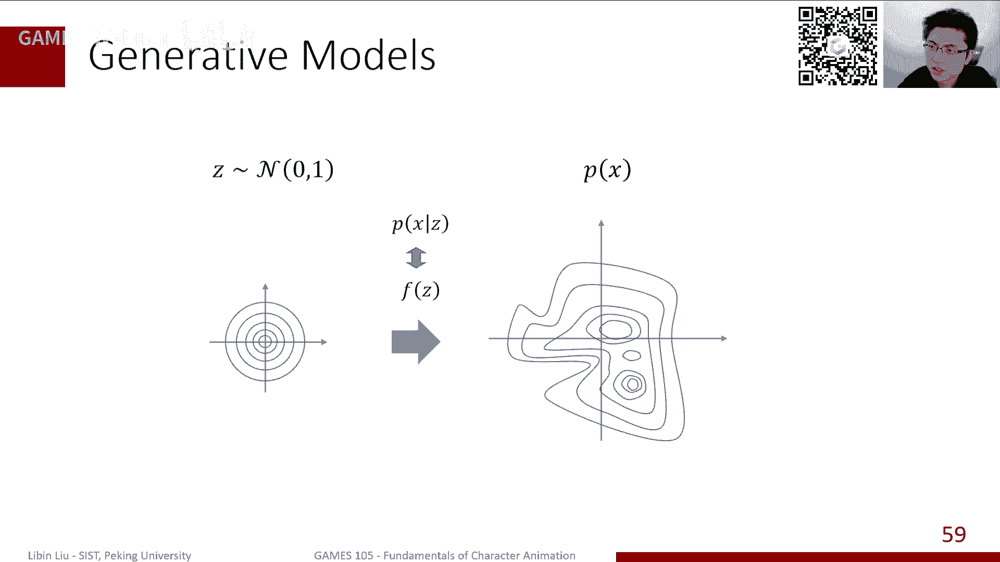

能是另外一个话题的，或者通过一些优化的方式来吧来完成一件事情，那当然这个其实像vae和noslow，其实在这个scraph上我们看到一些很好的结果，但是呢其实很遗憾啊。

就是虽然说我们四种不同的常见的这种啊。

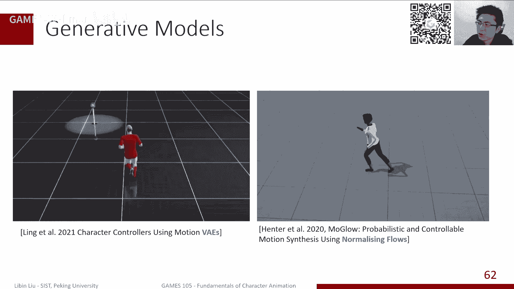

生成模型的这种方式，但是这个干其实好像在动作上面，这个效果一直不是很好，就是大家至少在我没有看到一个像。

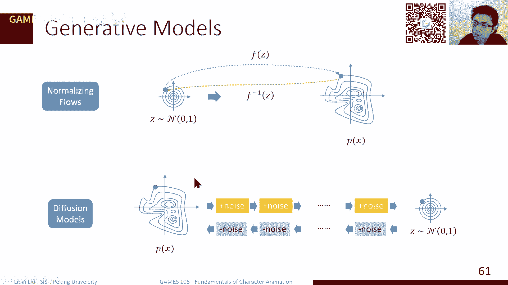

比如像这个像v e啊，像number flow啊，甚至像这个像这个p f n啊，这么好的一个效果，可能也许是干这个模型本身。

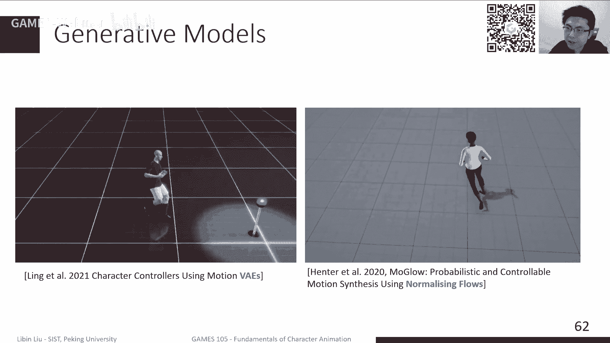

在持续这样一个问题上的一个不稳定性，那当然今年我们看到新的工作了，那就是比如说用这个defi model啊，用这个扩散模型来做动作啊，这大家都是做的非常快的，特别是他们或者扩。

特别是扩散模型在这个呃图像生成上的成功，其实我也是带来了很多的这种新的一些想法，那当然大家最想的方向就是说哎我给你一个洞，给你一个语言，比如我给你一段话，我希望你按照这段话生成一个合适的一个动作。

其实跟我们defense model，在这个图像生成上的一些效果，其实是表就是功能是比较相近的，只不过我们把图像变成了一段动作，实际效果上看起来还是不错的，就是但是这个总体来说还是有很多很多。

可以进一步的进步的空间啊，就是看起来是那么回事了，但是这个整体质量还可以进一步提高，ok那其实我们今天讲的是一个稍微有点难度的，可能不是说我们这个比如说我们大二去听，这，如果如果你是大二的学生的话。

你要听的话，可能会发现有些镜头有些东西会比较吃力，但总体来说我们这门这节课，主要是对我们近些年啊，就是特别是基于神经网络的这些方法，我们做一个简单的回顾，就是大家有兴趣的话。

哎咱们知道我们这里其实有些这类的工作，现在已经可以做到这样的一个程度了，或者说我们有哪些方法可以来来做这件事情，那总体来说我们就是从回顾了一下，然后呢我们其实稍微讲的多一点，就是一个非常经典的一个模型。

叫p f n啊，它是怎么构成的，它怎么去生成一段动作，那我们也是稍微回顾了一下，生成模型，在这个这个动画里面的一些几个，非常经典的工作，那当然后面还有新的新新的工作，也是当然大家有兴趣的话。

可以继续关注，我们这这这这这一系列的这个问题，ok那这个就是我们今天的主要内容啊，看看大家有什么问题，啊对ga maker其实是一个很好的一个例子啊，就是它是一个小样本的一个训练，能够生成很好的结果。

对这个我确实没有放进来，对，确实前面那几个工作，就是特别是不需要生成网络的，就是只是单纯的这个最后一个模型的，其实是以他姑咱们组的为主啊，但是实际上还有一些其他的组，比如说像是。

其实我们这个这个领域的好多这个方向的东西，比如像那个韩国的这个这个jk里，他们也做了一些工作，但是他们是用的是rn的模型，只有这一这一期的工作呃，工业上用的多不多，这个我其实不是很确定。

说实话就是工业项目现在用的最多的，肯定是motion matching，这我很sure，matching来说，你就你就直接调就行了，嗯我相信是有用的，就比如说像很多时候你做这种这种。

比如数字人动作生成舞蹈啊，这些其实可能都是相关的，可能有些应用吧，但我但我不是很确定到底有多大规模，a m p s e，这个我们后面会讲，我们今年这个工作，control v e实际上是一个v e的。

一个在控制上的一个版本，就是物理仿真的版本，像s e m p其实是干的，控制版本就是gal嘛，它其实是干，就是这个生成对抗网络的一个一个扩展，就是纯不用物理的话，就主要问题在于。

你不大容易去定义一个很好的一个，这个这个这个这个reward单时间也有用的，就是我们其实上节课讲了一个motion field，就是我们讲motion matching。

它其实是受到motion field的启发来产生的，那这个过程中，实际上他的这个魔神feel的本身，这样一个训练，其实效果也是不错的，但是除此之外呢，其实好像也没有看到一个其他的工作。

其实实际上做这件事是怎么说呢，就是有点overkill，就是一个regression问题，做这么复杂的任务，虚拟偶像中有应用前景吗，我相信是有的，我觉得特别是像defer model这一类的方法。

逐渐出来之后，就是特别是比如基于语言的，其实也就像我们今年做的一些工作，像是从语言生成一个手势，我们今天之前做了一些工作，就这种跨模态生成，我觉得是在虚拟偶像里面应该也是挺相关的，比如说现在新拟偶像。

大家都是比方说我做一个动捕，然后通过这个动捕来驱动一个新偶像，来去做运动，那这是一个比较直接的方法，那当然其实缺点就是我必须要有一个演员在那，希望我们能够把这个东西变成一个真的，一个人啊。

不需要一个演员，而是靠我们的这个看我们这个模型，他去做这个生成，那我可能有些输入，我的输入可能是语言，可能是，但这个语言哪里来，也许是我写一个脚本，也许是一来自一个是这个语言的，一个对话模型等等。

可能是带来一些效果，给大家一些其他的领域啊，我们其实也说过，因为本质上来说，我们上节课其实提到这件事情，就是比如说我做ik的时候，我有一个先验分布，可以帮助我们去保证我从ik的时候，动作是真实性。

那类似的，比如说我们做这种像是比如说动捕，那如果说比如我们只有一个相机单箭头的动捕，我们之前也提到单箭头动捕，它会有很多这种奇异性问题，他如果说没有很好的鲜艳的话，可以帮助我们解决奇迹的问题。

来达到更好的效果，所以都是一些很好的可能性啊，但是实用性现在还目前真实用的话，落地的话可能还是没有见到什么特别好的，像这种这种这种应用，训练模型，动作模型的数据集，那其实蛮多的呀。

这个开源的动捕数据库倒都是现在比较大的，可能是m吧，max，主要是把它们都统一到那个simple sp l模型的，这样一个结构模型，这样一个数据结构上，那是因为常用的比较大的。

像是cm data set，这个用的很老了，还有这种human 3。6，他们做动那个视频动捕的，其实有一个很好的一个数据库，还有像玉碧他们公开这个这个拉饭数据集，也是很好的一些数据集，还有些其他的。

其实数据集，其实总体来说在越变越多的这样一个状态，robust motion between，其实这个我没有讲啊，其实robust motion between，如果你仔细看它的工作的话。

它其实属于这个auto regressive，它是用一个它是用一个那个rnn，就比如psn这一类，它是直接用一个一个follow the network去算下一帧嘛。

但是那个robust motion between，它其实一个r n来来去做这样一个，来去代替这个f，那当然他主要是说就是它的控制信号，我们前面提到的就是比你这里的f，那这些控制信号是是什么。

其实可以是这个，比如说下一个关键帧的位置，那也可以是你的工作信号，那当然今年还有一些新的工作了，就是我们不是用r n了，也不用这个前下神经网络了，我用transformer。

其实我们前transformer是一个很好的一个例子，就是我们前面这里其实是是假设，我们很多讨论都是假设说ok我只考虑，我只考虑当前这一帧，然后算下一帧，但实际上如果你要更复杂的话。

其实可能我需要考虑前面若干针，那其实很多transformer的这样的结构，它其实是类似于这样的一个情况，那也也有些transformer是说我不是用这种，就不是用这种，只考虑前面那一桌干针。

我其实把后面的若干针也放进来一块考虑，那其实也是这种方，但是那种方式来说，他就不太容易去做这种实时应用了，因为它需要考虑未来的状态，行我觉得时间也差不多了，然后那个我们有什么问题的话呢。

我们也可以继续在我们的群里进行这个讨论啊，然后另外像我们刚才说的，我们今天最晚，明天我们那不就第二个作业的这个内容，我会放在github上，然后也欢迎大家来来共同参与啊，然后也是非常感谢好的。

那我们今天的内容就到这里啊。

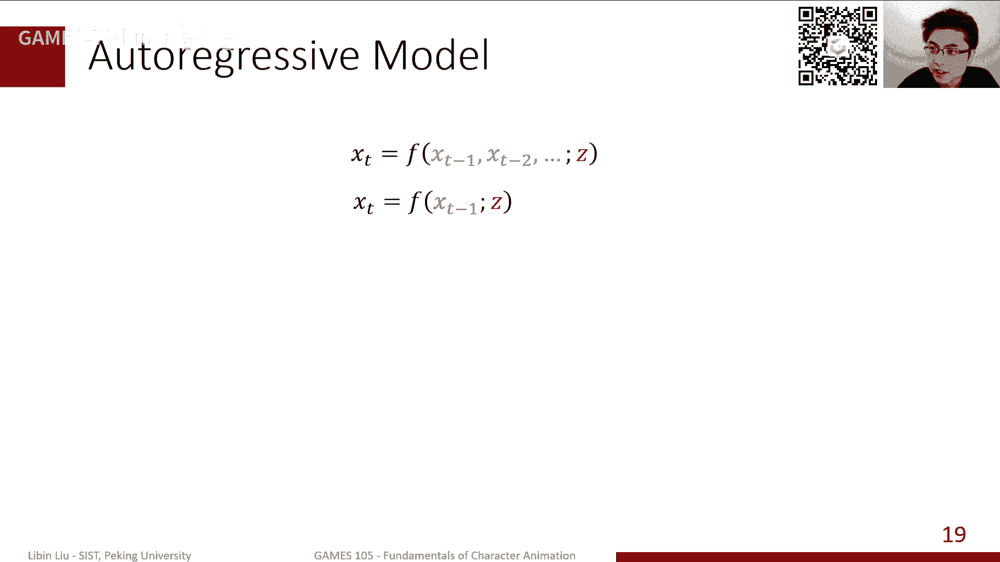