# GAMES105-计算机角色动画基础 - P8：Lecture07 Skinning - GAMES-Webinar - BV1GG4y1p7fF

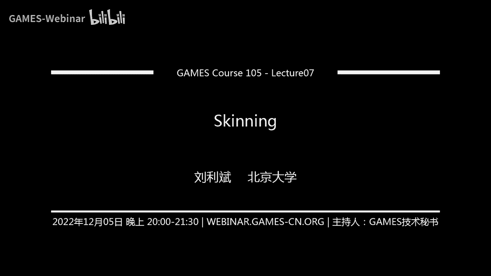

ok好的，那我们就开始上课了，今天是我们game 105的第八节课，当然是啊like是零七啊，因为主要是我们learning with animation，多讲了一点内容啊。

那我们今天主要讲的部分是关于skinny啊，就是说嗯因为我们前面讲的，或者说我们整个这门课主要关注的部分，其实是啊，卷机角色动画里边的，这个就是骨骼动画的这个部分，然后我们这节课，然而作为一个插入。

我们也是为了让我们这个，其实介绍更加完整一些，我们再多讲一点关于skin的部分，就是说我们怎么去用角色动啊，骨骼动画去驱动一个新角色，去啊去展示我们的运动啊，其实我们大部分情况下，我们讲骨骼动画的时候。

其实这个古国应该是一个抽象的一个东西，并不是一个可见的一个这样，一个这样一个这样一个结构，然后我们实际上真正我们在比如说电影里边，或各种应用里边，我们看到的新角色，其实它都是一些就外面这种蒙皮的形变啊。

带来了这种展示的展示的这种效果啊，所以说我们如何能够去让一个骨骼动画，去驱动一个蒙皮，产生我们想要的形变，那这个布其实是由这个skinning就是蒙皮的啊，绑定啊，蒙皮的这个形变啊。

这种啊这一类的技术来共同的完成，当我们今天主要是涉及到一些嗯比较简单的，这个呃就是主要是讲一讲蒙皮的一些基本概念，还有一些我们非常简单的，或者非常常用的一些蒙皮的一些技术。

然后另外呢其实我们也是额外多介绍一些啊，就是说在蒙皮这个技术啊，在一些呃一些具体的例子啊，比如说这个s m p l model，我想可能有些同学比如说知道的，就是可能这个其实是一个非常重要的一个啊。

人体的一个模型，然后另外呢作为这个蒙皮技术的一个应用呢，我们稍微讲一讲facial animation，就是脸部表情的动画是怎么生成的，当然我们不会讲非常复杂的东西，我们也只是作为一个例子讲一讲。

用蒙皮的这种方法来实现，脸部动画的这样一个技术，那当然我们这门课其实也是参考了啊，也是也是山村，其实也是有一点有一点比较经典的这么一个呃，关于蒙皮的一个siggraph的一个课程。

但是他有兴趣的话可以去看一看这个这个主页，他们有几篇啊比较很好的这个cos note啊，还是可以作为参考，那当然我们其实也说到了，其实我们在第一节课的时候介绍过，就是关于这个角色动画的这个啊流程啊。

其实我们这个动画其实主要是分成两部分，一部分是关于这个蒙皮的这个绑定啊，蒙皮的这个变形啊，然后另外一部分是说这个也是最主要的部分，其实就是我们的骨骼动画了啊，只有说我们骨骼动画呃，它会带来这骨骼的运动。

然后用这样的骨骼的运动去驱动一个蒙皮，产生形变，然后最后再把这个产生形变之后的蒙皮，把它渲染出来，这才是我们最终能够看到的动画。

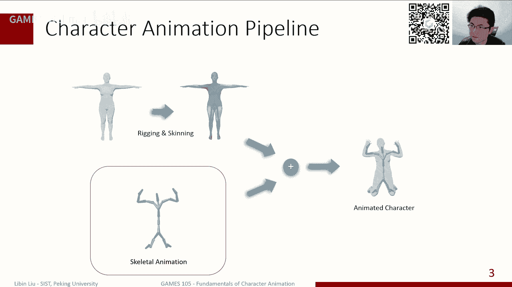

那当然实际上这里面有两个概念啊，也经常会比较容易搞混啊，就是一个是riging，一个是skinning，一个是应该叫什么，一个叫绑定，一个叫蒙皮呃，当然实际上这个就经常来讲，这个，有些时候他会。

他会这种互相交换着来用我这两个词，但通常来讲我们讲rigging，但大部分来说是指的是说，我会创建一个可以控制的这么一个啊啊，这么一个控制器啊，就比如说像左边这个视频里边，成这种脸上这些控制器。

那我同时调整一些控制器，它会带来我这个身体的这个这种形状的，比如脸的表情的变化，或者是皮肤的一种形状的变化，那当然是件蒙皮，通常来讲，它其实应该算是一种特殊的一个reading的，一个一个一个啊特例啊。

就是说可能就只说对于我们一般的，比如身体骨骼上的这种这种蒙皮来说，可能通过一些刷权重啊，或者通过一种线性线性蒙皮技术啊，这些方式来使来利用骨骼来实现对这个啊骨骼，这个人人身体形状的这样一个控制。

当然这个更更广义的这种rigging，就更广义的绑定来说，其实也许这个这个人的动作的形变，可能不一定是通过骨骼来完成的，也可能就是通过比起，比如说我一些额外的，不在谷歌上的一些点的控制器啊。

或者是可能一些这种ban的shape来完成，那这些其实都算是rian的部分，而那个skinning的话，相对来说更加更加。

特指这个骨骼驱动的这件事情，那当然我们在讲蒙皮用，因为我们之前是主要是讲蒙皮的形变，那我们其实还是要稍微回顾一下，关于我们在我们这个蒙皮，或者说我们的这个几何外观该怎么去表示啊。

因为这个就应该说是在games 101，或者说其他的前面几门课里面，应该会不断的提到，我们这里只是简单的提一讲，就是因为我们正常来讲，比如说我们想去看到一个一个一个，一个一个物体。

在这个虚拟世界里看到一个物体，那我们很多比如说我们做渲染的话，我们肯定是需要做，比如说像这种光线追踪啊，或者需要做这种啊这种光栅化呀，它其实主要是对一些几何物体来进行，做这件事情。

然后这个几个物体通常来讲，我们会有一定的表表达的方式，而这里边最常用的一类表达方式，主要还是这种mesh或者是这种点啊，这种叫三角网格或者私媒体网格，或者什么样的某某种特定的网格，这样的表现形式。

那这些网格它主要是啊在我们一个物体的外皮，这个外表面上那放了若干的点，然后直接点之间进行连接，然后直接连接的点构成了一个面，那这些面总体来说构成一个完整的，这样一个物体。

那当然实际上这个可以更加通用化一点，就说网格表示是一种非常常用的表示，但我们也知道，几何表示其实还有很多其他的类型，比如说像nerves这种，像是比如说这种样条曲线差值，或者是基于这种啊。

这种比如说或者甚至一些引致的曲线等等，就是通常来讲，我们一般来说希望我们的这样一个几何表示，它能够提供一些控制点，那这些控制点的位置，也会干预到我这个外形的形状去变化，所以总的来说。

对于这样一个几何的这个嗯表示来说，通常来讲我们会说我们上面会有若干个点啊，这些点它的位置就是所有这些点的位置，共同的去构成了这个物体的形状的一个表示，那反过来其实我们也知道。

实际上为了能够去改变物体形状的，这个直接就造成这样让物理这个形状发生变化，那我们其实也是说我们去改变这些特点的位置，就可以完成这件事情，当然这个就当然对于对于这个网格来说。

那我们其实就改了就是顶点的位置，但是对于一些其他的表示，比如说像是刚才我说的nerves或者贝塞尔曲线，或者样条曲线等等，其实你可能改的是一些控制点，那些控制点不一定直接是在那个表面上。

但实际上他们也会起到改变我们这个形状的，一个作用，那当然我们其实有一个非常从，非常简单的例子来看啊，就是说比如说这是一个人啊，这是一个人的模型，我们就简单的把一个非常小的一段给拿出来。

大家可以表示简单的表达成这样一个形式，那这里面大概我们只有这里有十个点，然后十个点它构成了热干的面，然后呢我们其实在蒙蔽诶，不好意思，然后实际上在我们这个绑定的时候，我们实际上是在里边穿上啊。

在他们这个里面放上一个骨骼，那这个骨骼呢，我一般来说会把它放在这个蒙皮的中间啊，这样的话其实呃其实正常来讲是，因为人也是这样，就是从解剖解剖上也是，其实也是这个样子的。

就是我们一般来说骨骨头肯定是在肉的里边的，那在这个基础之上呢，我们其实是希望这个嗯骨骼，比如说我们在移动手的时候，那其实你的这个身体的这个骨骼，随着我们前面的这种动画的这种啊计算。

那其实这个骨骼的位置会发生一些移动，那蒙皮的变形的这个目标，其实是说，我们希望在这个骨骼发生形变的，这样一个基础之上呢，我们这个他身边的这个骨骼，旁边的这些蒙皮的这个顶点。

也能够随着我对骨骼的移动来产生移动，那这个其实是我们对这样的话，我们可以不断通过驱动骨骼，来改变这个蒙皮的位置，那从而进二人，然后让我们这个真正的角色，他做出我们想要的动作来产生合适的形变。

那当然估计这个过程中，我们其实是有一个就是关于蒙皮的，一个非常从数学表达来说，就是说我是希望能够根据我骨骼的这样的，一个位移啊，所有的这些变换，然后在这个基础之上。

我们该怎么去计算这个随着骨骼移动的这些，这个点就是蒙皮上的点的位置，这其实是我们要要蒙皮啊，skinny需要就是蒙皮蒙皮计算需要做的事情，然后在这个里边，其实我们可以再稍微把它这个变换，再稍微具体一点。

就比如说我们可以假设变换之前，冰箱之前这个角色，他的骨骼大概是这样子一个状态，然后他的这个全局的旋转是q啊，那他们这个骨骼的这段骨骼的关节，是放在一个点o的地方，那通过这个变换之后呢。

他这个关节的位置移动到一个新的点o撇，然后骨骼的这个朝向，那你之前是q那经过一个旋转r之后呢，其实变成q撇，那我们知道其实q撇应该是r乘以q，那对应的这个o撇应该是o加上t，那这样的结构。

那接下来那个x撇，这个计算其实相对来说就比较简单了，因为本质上来说它就是一个坐标变换，那这个坐标变换呢，就是说我是把x原来是在这个b这个移，这个移动之前的，这个谷歌的坐标系下的一个表示呃。

把它转换到一个新谷歌下的，就是就是新的这个谷歌移动之后的，那个坐标系下的一个表示，所以总体来说，我是应该是先把这个x转换到这个，原来谷歌这个q的坐标系的及物坐标系之下啊，通过一个减掉一个圆点。

然后乘以这个朝向的这个这个，need的这样的一个形式，然后呢，在在在外面再乘上这个目标股和这个朝向，然后加上目标骨骼的这个坐标啊，坐标原点的位置，那就完成这样一个变化，那这个其实是非常简单的。

或者我们可以再进一步再把它写啊，写的在这个呃抽象一点，或者是在这个代换一下，我们其实可以用一个r来表示这个点，x就是这个蒙皮上的点，他在这个骨骼的局部坐标系下的一个坐标啊，其实或者说你可以认为是说。

从这个关节点到这个目这个骨骼上，sorry蒙皮上这个点，它的这个向量呢，在局部坐标系的一个表示的位置，那从这个局部坐标系的表示，实际上在我们整个，至少在我们只有一个骨骼的情况下。

这个这个这个局部坐标系的表示，是不会发生变化，不管是我们这个骨骼是怎么移动的，那我们总是可以在一个单谷歌移动，移动到一个新的位置之后呢，我们其实可以再把这个局部坐下的表示。

再把它转化成一个全局坐标系的表示，那就完成了这样的一个计算，那当然这个其实看起来比较简单，比较非常直观，因为本质上就是一个这个就是一个局部坐标系，到全新坐标系的这么一个转换，一个坐标转换的这么一个过程。

那我们为什么要就是在这里稍微强调一下，这件事情呢，主要是因为有一个在那个蒙皮绑定里边，有一个非常重要的一个概念概念，就是ban pose，那有时候也叫reference pose。

有时候也叫这个这个叫什么rest pose，就是类似的各种名字差不多，但是总体来说是表示同一个意思，其实我们之前也提到过，就是说我们其实很多时候我们的骨骼，比如我们经常创建的时候。

可能是在一个t pose或者是一个apos，或者是一个奇怪的pose，这局你有什么软件，然后呢我们的这个角色的模型，很多时候我们会把它创建成一个apples啊，那这样的话因为它模型它总体来说做起来说。

这个人姿势看起来更加自然一些，那所以说通常来讲，为了能够把这两个东西建立联系，我一般来说我们会把这个骨骼，把它旋转到一个跟蒙皮这个蒙皮的这个网格，和这个模型差不多的一个姿势，然后在这个姿势之下呢。

我再去计算这个蒙皮上的每一个点，相对于骨骼的这个关节的这个这个距离，这些位置，然后各种信息，那这些局部的信息呢其实是非常重要的，因为我们后面在不断的在计算，这个蒙皮绑定的时候，其实非是要经常用到的。

因为从刚才我们这个计算也可以看到，实际上我们随着骨骼的移动，这个每一个网格上的点，它的位置，实际上始终，我们是希望是通过用这个这个局部的一个啊，坐标系的表示来做这个转换。

所以说实际上这个ban pose给了我们，给了我们一个什么信息呢，其实就给了我们每一个关节，在每一个这个蒙皮或者这个模型上的点，它应该在这个我每个骨骼下，它的局部较细的表示应该是什么样子的。

就我们就给出ban个pose之后呢，呃bank pose之后呢，我们其实可以通过这个全局到局部，坐标系的转换来完成这个计算，ok这是一个骨骼的一个非常简单的情况，但如果到我们很多时候。

比如说大部分情况下，我们不会考虑一个骨骼，而是考虑很多很多构成了一个整体，那比如说假如说我们现在稍微复杂一点，比如说我们只有两个骨骼，其实大概是可以，比如说大概就是胳膊这样一个这么一个空间。

那这里边这里有整个一个锅子啊，整个胳膊的这样的一个啊蒙皮啊，上面有若干个点，那这里面有两个关节啊，其实前上面这个是这个肩膀，下面这个大概是一个这个肘关节，那在这样的一个基础上呢。

唉那这个基础上我们可以再稍微定义一些量啊，就比如说这个第一个关节，肩膀那个关节我用oe来表示，那整个肩膀其实就是第一个第一个骨骼啊，第二啊，然后整个小臂是这个这个这个b2 ，就是第二个骨头。

然后这时候我们整个胳膊其实是一个整体，那tlb上面有若干个点，那这些点到底其实它既不属于骨骼，也不属于谷二，它可能属于这两个骨骼的这个整体，那我们在这个点上，比如说我们在这个胳膊上。

我取一个点x那这个点其实我们前面说，如果说我们认为当前这个姿势是一个bad bose，的情况下，我们其实可以应用这个姿势来计算这个点，相对于这个上面这个第一个骨骼和，相当于第二个骨头。

他们这两个的这个局部坐标系一下，这个x的表示，那其实也代表了是从这个两个骨骼的原点，分别到这个坐标系的这个这个这个相对的位置，那这个其实可以很容易计算，那在基础之上，如果说我对这个骨骼这一段胳膊。

我让他这两个关节发生了一些旋转，比如说让这个前面那个胳膊往上转一点，然后下面这个胳膊和下面那个关节向下转一点，那其实大概会形成这么一个形状，那那这个就是随便转了一下。

那他原来这两个胳膊在我们绑定的ban pose里边，它的这个朝向分之q2 和q1 ，然后这个原点的位置也都是oeo 2，那我们转换完之后呢，我们经过这个身体的旋转，但是在某一个姿势之下。

他们朝向我们认为现在是带撇的q一撇，q撇，然后还有o一撇和o2 撇等等等等，那在这种情况下，因为我们在整个缸体的啊，如果说我在我这过程中，我们其实是认为这个每个点，就之前这个x这个点在两个坐标系。

两个骨骼坐标系的局部的这个位置是不变的，那么这两个谷歌，因为它两个旋转的方式是不一样的，所以他们将来未来的场向也是不一样的，那在哪这两个不同的朝向坐标系之下呢，你是可以发现原来是同一个点，也是同一点。

x你通过两个不同的这个股的坐标系，这个进行变换，你会发现它会变成了两个点，其中这个点在这个第一个goob坐标系下的位置，在新的位置，我们是可以通过这个坐标变换来计算出来。

那类似的这个点在第二个谷歌的这个，坐标系下的位置，我们也通过同样的，可以通过一个另外一个坐标的变化来进行完成，那当然这里就有一个问题啊，其实这两个点原来是一个点，但是现在分成了两个点，这会带来一些问题。

主要是说如果说这个就是，我们原来mesh应该是一个整体，那我们现在把一个点拆成了两个点，那么就可以直接就可以看到这个这个mesh，就我们这个蒙皮它其实就从中间裂开了，那就不算是一个完整的一个一个形状。

所以实际上那个为了整个正确的计算呢，我们其实还是需要把这两个点，再把它恢复成一个点，那这个时候呢我们通常一种非常简单的方法呢，就是说我因为我用两个骨骼分别计算出了，这个点，在这个动作之后。

它应该在什么位置，但这两个骨骼其实对这个这个关节，就这个点影响的影响力可能是不同的，就比如说这个骨骼一开始的时候，它其实是离这个骨骼这个关节更加近一点，离这个关节更加远一点啊，或者说时间可以想象一下。

这是小b啊，小b上的一个点，应该可能受到这个胳膊的观影响更大一些，那那那为了能够体现这一点，那我们其实就是可以通过一个权重啊，两个w，这个w一代表了这个这个第一个，谷歌对这个点的影响的这个程度。

然后w2 呢代表第二个对这个点明显的程度，那么最终这个点的位置呢，实际上就是两个骨骼分别计算出来的，这个嗯呃目标点的位置，然后通过一个影响力，那最后得到了我们这个点的位置。

那如果说我们这个角色有更多的骨骼，比如说这个一个非常完整的一个角色，那这个可能有有有20多个或者更多的，这样的骨骼结构，那实际上同时这个这个嗯蒙皮上的一个点，那他可能会受到很多不同的啊骨骼的影响。

其实特别典型的就是腰上这个这个点，因为你们知道，比如说我弯腰，那其实我弯腰的时候，可能我整个脊柱都会，脊柱上的所有的关节可能都会弯曲，那这些关这些弯曲呢，都会多少的显影响我肚子上。

这个肚子上点的这个位置，所以说这个在这个过程中，我们如何去当，比如说我们这个角色换了一个新的位置的时候，那我们该如何去计算啊，同样还是这个点，他在这个他在不同的一个姿态之下。

原来这个腰上这个点现在会移动到哪里啊，那这个其实变得比刚才变得更加，复杂一点的问题，但是因为整个计算过程还是一样的，就是说我们如果说我们认为这个姿态，是一个绑定姿态，一个ban pose。

在ban pose下，我们其实大部分情况下，我们ban pose是需要把这个骨骼移动到一个，跟这个蒙皮啊这个对齐的这样的一个位置，那在这个这样的一个位置下呢，我们其实可以比较容易的去计算。

我们这个每个骨骼，每个点sorry蒙皮上，这个点相对于骨骼的每一个关节，那当前的这样一个朝向的下的这个局部，最霸气的这样一个一个一个坐标表达，那算出这个之后呢，那我们把这个橘色的这个关节。

整个这个骨骼系统，把它变化到一个新的姿势之后，那其实我们还是利用刚才的这个这样一个变换，我们是可以得到我们这个点的位置，应该是说每这个原来这个点在每一个关节，他可能会受到所有的关节影响。

他受到在每个关节之下，就是从这个从这样一个姿势，变到另外一个姿势呢，其实我们每一个关节可能都会发生一定的这个，全局上的一个一个位移，一个形变啊，sir一个变换，那在这个变换之下呢。

我们其实每一个就这个点会在每一个变换之下，分别移动到不同的位置，然后把这所有的这些位置通过加权平均，那最终得到的就是这个关节啊，这个点在我们这个新的这个姿态下，这样一个位置。

那当这个过程中其实是非常重要的一个一个量，就是这个所谓的这个蒙皮权重了，因为这个它代表了，说这个点受到了哪些关节的影响，并且这些关节对这个点的影响不大，那当然这个蒙皮权重。

实际上是一个非常是一个额外的话题，就是我们该怎么去定义这样一个蒙皮权重，除此之外呢，其实我们这个角色，他其实其实肯定是上面有很多很多点，同时来讲是可能有几千个点，那每一个点实际上在在ban的pose下。

我们其实原来我们这个下标，只有下面是我们没有下标啊，我们现在如果说我们考虑到所有的点的话，那我们其实可以给每个点一个下标，那这样的情况下，实际上我们需要对每一个点分别计算出这个点。

相对于所有每一个关节它的局部位置，然后在我们去算这个蒙皮，这新的萌新的姿势下的，这个蒙皮点的位置的时候呢，那我们其实也是需要去做很多次的，这样的一个呃坐标坐标的变换，然后最后再加点平均啊。

得到作为每个点的这样一个位置，那当然这样看起来其实计算量还是蛮大的，因为如果说这个点有几千个的话，那我其实前面初始化的时候，需要计算几千个点乘以几十个关节，那就上万个这样的一个参数需要去计算。

当然我后面会看到，其实这件事情啊，我们其实不需要真的去计算这么复杂的一个，这么多的一个量，我们其实可以啊，可以通过一些这个一些变换啊，把这个整个这个计算把它简化很多，ok那其实我们前面提到的这种方法。

就特别是利用啊一个局部坐标，然后在每一通过把每一个点的局部坐标啊，通过把每一个点嗯，让每一所有关节的，这个在不同姿势下的这个变换，把它变换到一个新的位置，然后再把这所有的一个新的位置。

用我的蒙皮权重把它加权平均之后啊，算出这个点的新位置，那只能整个这个过程虽然说起来有点费，比较费劲，但实际上它就是一个这么一个非常简单的，一个公式的一个形式，那这个公式我们可以看到。

这里面所有的变换其实都是线性的，其实也是一个线性的，所以整体来说，这是一个非常简单的一个线性的一个啊，混合的一个方法，这个方法其实有一个非常简单，就是非常常见的一个产品名字，就是这个r b s。

那所谓的这个线性混合蒙皮啊，啊这个这个中文其实有点不太好翻，通常来讲就是l b s，那我们就指的其实就是这种方法，那当我们前面也提到，这个l b s其实有几个非常重要的。

其实主要是有三个非常重要的这个概念啊，第一个是bad pose，bad pose我们也提到了，就是说我们通常讲，要把这个骨骼跟这个蒙皮对齐，然后对齐之后呢，我们其实在这个以这个为基准。

去计算后面的这个这个形变，那这个基准的pose呢就是ban pose，但是bn pose情况下，其实那个骨骼的旋转不一定是零啊，这跟t pose不太一样，我们之前讲t pose的时候。

我们是假设他每个关节的旋转是零，但当然这只是我们这里的假设，当然有些可能你在其他地方看到的名词，可能也不太一样，有可能你看到一个tp，他们实际上抵制的是bad pose嗯，但至少在这里。

其实这个只是说我们是把这个骨骼，旋转到这个姿势，所以它有可能是一个啊旋转不为零的一个状态，那当然它根据段朝向，你总是可以把它转换到一个局部坐标系，来进行表达。

然后另外一个非常重要的部分就是skinning with，就是我们的蒙皮权重，这个其实很大程度上，决定了我们这个蒙皮形变的这样一个质量，那还有最后一个就是skintransformation。

这个实际上是在我们真实的去做形变的时候，比如说我们见到一个新的姿态之后，那我们通过一些计算，特别是通过这样一个加权平均的这样一个计算，实际上最终算到的这个蒙皮上每一个顶点，他的这个变换的这个值啊。

那这个其实就我们这个蒙皮变换的这样一部分，那当然整体来说嗯，我们的这个角色，我们这个这个rbs其实是一个非常非常常用的，一个蒙皮的一个技术，就是说实际上我们大部分的看到的，这个应用里边。

其实基本来说都是lbs，一方面来说这个很简单，另外一方面来说，实际上它也是也是非常的这个高效的，并且对我们gpu也是比较友好的，因为主要是也是因为他整个整体来说是一个，非常线性的一个形片嘛。

我们其实可以比较容易的在，就是非常高效的来实现，那另外一方面呢，其实如果是在考虑到gpu，通常来讲我们在模拟形变的时候，可能会有一些啊约束一些要求，就比如说木，正常来讲，实际上我们这样一个蒙皮。

它是可以，每一个点都可能射到所有的关节的影响啊，所有的骨骼的运动的影响，其实想一想，其实嗯也是，其实想想也是合理的，就比如说我可能比如说摸着我的腰，比如说抬下手，那有可能是我这个腰也是会有受到一些影响。

因为本质上来说你的肌肉，整体人的这样一个肌肉系统是这个互相耦合的，所以说实际上就是真的是哪怕你抬下手，有可能的脚都会发生一些变化，那当然对于这个，但是其实也是一，但是即使这样子的话。

其实我们大部分远离这个当前这个点，比较远的那些关节，对当前点的影响其实相对来说是更小，就是可能会想到不可以忽略的这样一个状态，所以实际上为了能够比较高效的去进行进行，计算呢。

我们其实通常来讲呃可能会有一些约束，就是就是说我可能要求每一个点受到最多啊，比如说四个骨骼的影响，那这样的话其实从gpu的实现上，它更加快一点啊，这其实是，但实际上这个这个r b s其实比较通用的。

那么其实你可以可以受到所有的关键影响。

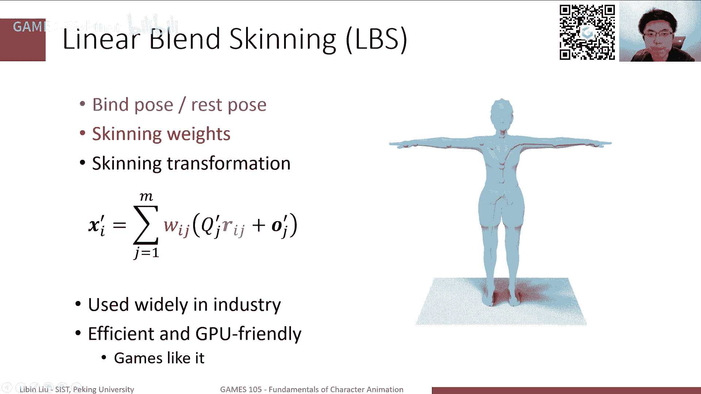

ok那这里当然有一个问题啊，前面也是提到了，我们这个skinning weets就是蒙皮权重啊，这其实是一个非常重要的。

就是他对我们的这个呃最终效果就是形变嗯，蒙皮的效果影响是非常大的。

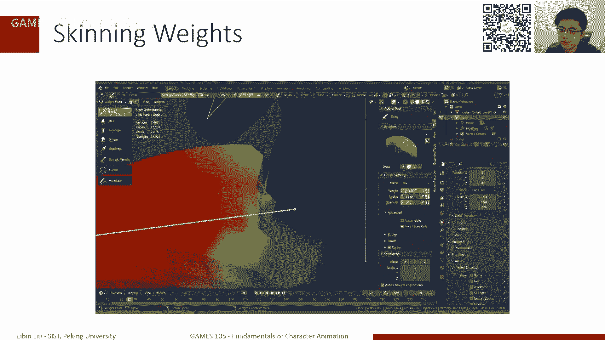

其实这里其实可以看到，因为这是一个就是在一个呃，就是一个动画师正在刷权重的这么一段，这个录屏啊，其实用这个就是说其实可以看到。

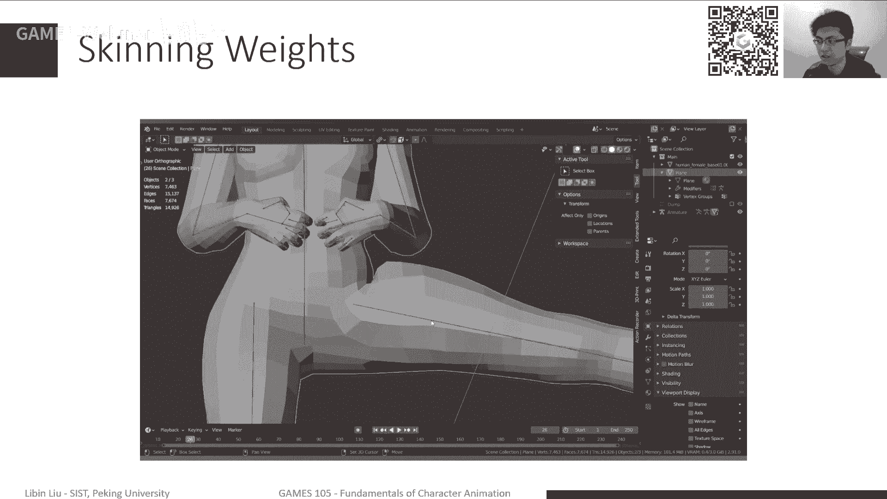

比如像大腿这里，这里其实有一个看起来，现在看起来不太好的一个形变。

那这个其实可以通过这个调整，不断调整权重来找到一组比较合适的这个目标，选中，让它这个形变啊，至少在某一个范围内看起来是比较合理的，但实际上这个刷权重，应该是一个专门的一个工种。

其实它应该是跟绑定是放在一起的，如果能在有些有些地方那沙雕动，其实他很多时候他做的事情，就是说我给一个姿势啊，然后我刷一下我的这个权重。

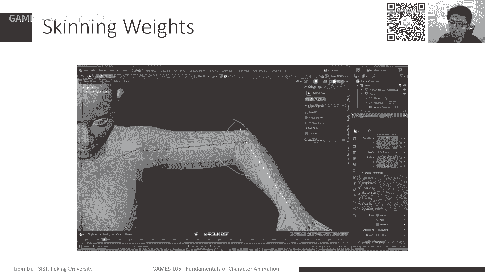

因为我每次去改这个权重，应用前面这个计算，每次我改这个权重，实际上它都会在同样一个姿势之下，我只要改这个权重，其实它会影响我整个蒙皮的形状。

所以说我可以不断的调整我的姿势，然后在每一个姿势下去改一个，去尽量的调整这个权重，使得我当这个整体的形变，再有一些，大部分我们这个需要关心的一些姿势上，他那个看起来是比较自然的。

那这个就是完成这样一个工作，那当然当然这个过程其实是非常麻烦的，因为主要是你首先肯定这个嗯要对，就是这个工画师他需要对审美啊，需要有相当好的审美啊，就是你要还，另外还有相当好的技术。

能保证能够实现他想要实现的效果，另外实际上也说嗯，其实我们每一次计算这个权重，我们知道其实这个权重是某一个顶点，相对于所有骨骼的，那其实反过来就相当于实际上对于每个谷歌，我都要刷一遍权重。

才能让这个整体的这个表达是自然的，所以说整体来说，这个这个这个工作其实是比较比较耗时，比较麻烦的一个一个过程，那当然其实有很多一些想法。

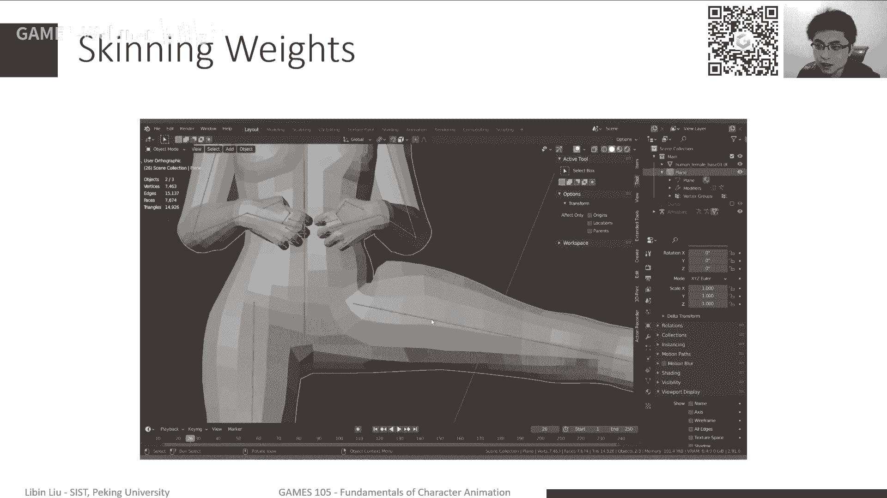

一些研究，就说我们能不能把这个方法简化一下啊，能不能靠自动的方式，然后给出一个骨骼模型之后啊，给我一个蒙皮模型之后，那你能自动把这个权重给我算出来，当然这其实是一个研究问题，就是实际上没有。

现在还没有特别统一的这样一个方法，说哪个方法就一定能解决所有的问题，当一些比较老的方法了，比如说这种像这个pinoco，这其实很很很早的一些工作，现在因为现在blender，就是至少在2。730之前。

就blender，他其实提供了一些这种自动绑定的功能啊，那其实最主要还是基于这种比较老的这个，pinoco这样的这样的方法，那这类方法其实就以前的一些想法，就是说比如说我知道，比如说我这个手臂对吧。

手臂那手臂上比如说小臂上的点，他应该受到我这个小臂整体的影响大一点，但是受到大臂的影响应该小一点，那这个小的，那这个过程其实从影响力其实是相对来说，是从比如小臂，大臂一个比较相对来说比较平滑的一个过渡。

所以说以前一些些方法，就是说那我可以参考一下，有点借鉴一下，比如说热扩散的这种思路啊，就比如说我在小臂上这个骨骼上，这个关节上放一个热源，那这个预热源其实它会它会扩散嘛，那扩散出去之后呢。

那如果说这个相对来说温度比较高的地方，那应该就是受我影响大的地方啊，温度比较低的地方，就是我印象比较小的地方，那其实如果说不在每个关节上分别放一个热源，那我觉得大家可以看到。

那么有关节受它影响的范围大小类似近似，它大概代表了一个骨骼的一个权重的大小，当然这是以前一些这个纯几何的一些思路，那么现在一些新的方法的可能，比如说像这种。

像这个以前这neo skinny 2019年的sram，那主要就是基于数据的，估计这五个权重的这样的一个，一个一个神经网络啊，这个其实也是近2年我们常见的一，些一些研究方向，但这不同的方法里边。

可能我数据的数据集，怎么去这个提取它的特征，那这其实是一些比较复杂的问题，但总体来说，这是一个很很很很非常有用的一个话题，但是确实也没有什么，现在怎么说呢，就是也没有。

现在还是一个非常好的一个研究问题啊，就是也是没有完全被解决掉，那当然这个蒙皮权重是一方面，另外一方面就是说在我们计算好，知道蒙皮权重之后呢，我们需要去计算每一个顶点，它的这个蒙皮的这个形变啊。

那我们其实前面已经已经给出了这样一个公式，l b s这个公式，那他就是说我每一个顶点的位置应该是啊，这个顶点在在绑定字啊，在ban pose下这个局部的表示这局部坐标，然后在一个新的pose下。

把它转化成转化到全局坐标的这样一个位置，然后把这个所有的这个顶点坐标值，得到这样一个新的位置，那这是lbs的一个基本的公式，那当然当然在这个里边，我们知道，因为绑定姿势是一个确定的姿势。

就是他先不管我这个人怎么动啊，他的绑定姿势是固定的，因为一开始我就已经把他定好了，那在这样一个在这样的一个基础之上呢，那我们其实可以稍微做一点代换嘛，比如说把原来这个绑定姿势这个计算公式嘛。

带到我们原来这个这个嗯我们这lbs里面去，然后呢，其实这样代换之后呢，我们其实可以稍微做一下整理，因为可以看到里边，那这里跟i跟x相关，跟a相关的其实只有这一项，那其他的项其实都是跟j相关。

这是我们的骨骼的这样一个位置，那通过这样的变化呢，我们其实可以把它把，比如说这样可以得到q j跟q j t啊，这其实代表了什么，代表是说我在一个新的姿势之下，然后每个骨骼它的全局朝向。

相对于我在绑定姿势下，那个全局朝向的这个差别大概是这么一个东西，然后后面这个也类似，它其实代表了这样一个嗯，这样一个相对的这个位移关系，所以我们可以把它写在一起啊。

这个比如这个前前面那个相对的旋转写成r，然后相对位移写成t，那大概写成这样一个公式，那么可以进一步的把它们进行a不好意思，我们可以进一步把这个稍微把再把变形一下，因为前面这一步，前面这里不。

其实w和r我们去写成这样的一个形式，我们可以利用这个结合律，因为这里面只有xi xi是下标，是跟j无关的嘛，那我们其实可以把它提到外面去，然后把这个公式呢写成这样一个形式，那这样的形式就比较有意思了。

其实你可以看到实际上我们蒙皮绑定啊，就是那个l b s这样一个蒙皮，他实际做的事情是什么呢，他实际做的事情就是说对于我每一个顶点，对于一个每个顶点i，我们想去计算它的新姿势下的一个位置。

那我实际做的事情是什么，我实际做的事情是说我把这个新的姿势下，每个骨骼相对于bad pose下，那个骨骼的这个相对这个旋转，把所有这个旋转，用我的蒙皮旋转做一个加权平均，然后把对应的所有的这些位移。

用蒙皮权重加一个做一个加权平均，那这样的话，其实他们俩分别构成了一个矩阵和一个位移，那这个矩阵乘以我原来绑ban pose下，那个顶点的位置，然后加上这个位移，就得到了新的一个位置。

那这个其实就是我们刚才也提到了，其实我们就说虽然说我们这个公式，一开始公式推导里边我们用了这个局部坐标，那但实际上最终我们在实际计算的时候，我们其实不需要这个局部坐标的，因为这个局部坐标可能会非常多。

因为是每个顶点在每个关节下的局部坐标，那这个数量非常大，那实际上我们最终可以推导得到这样的一个，这样的一个形式，但实际我做的事情就是，只需要把每个关节的这个啊变换做平均，然后再乘以我这个预言。

ban pose下那个那个顶点的位置，就完成这样计算，那这样其实整体来说，计算量还是相对来说不是那么大的，那当然这里就是还是这个稍微再多讲一点，多解释一点时间，就刚才我们是lbs。

其实我们可以把它写成这样一个形式，那这个形式里边这个xi xi那其实是绑定ban pose，对于ban pose下的那个mesh那个蒙皮，它里边每个顶点的位置，全局位置。

然后这里这里的两个这个前面是一个群啊，一个啊矩阵，ok不思，前面是一个矩阵，后面是一个位移，分别是带对应了在两个不同的姿势，那一个是bkpose，一个是我们当前角色的姿势，在这两个姿势之下啊。

我们这个每一个骨骼，它的全局的这个啊，旋转和全局的这个这个这个这个位移啊，然后我的一个家庭平均啊，这其实实现了l b s这样一个效果，那当然这里其实可能有些同学已经发现了，就是实际上我们前面这一版。

后面这一半其实无所谓的，因为它就是一个平移的一个加权平均，但是前面前面这一半其实是很容易出现问题的，因为我们前面讲旋转差值的时候，已经说过这件事情，就是这里r是一个矩阵，一个旋转矩阵。

那如果说这个把旋转矩阵进行线性插值，它是很容易出现差之后结果不是一个旋转矩阵，这样一个问题，就比如说一个非常简单的例子，如果说这个旋转第一个是一个单位阵，那第二个是一个转了180度的一个矩阵。

那这两个矩阵r一和r2 ，如果说我用0。5来进行加权的话，你会发现他们俩的平均值，现在就是用0。5的加权嘛，就是它的平均值，那刚好是一个上面是两个是零啊，最后一个是一的一个它都是一个起一针的。

都不是一个旋转矩阵，都不是一个可可可逆的矩阵，那这样的话，其实前面那个矩阵就会变成一个，不是一个旋转阵，而是一个这个任意的一个矩阵，那这个时候带来什么问题呢，如果带来一个非常经典的就是lbs。

就是线性混合蒙皮的一个非常经典的，一个一个一个走样，就是一个一个区一个一个问题啊，就是这个所谓的candy rapper，就是啊应该叫糖纸啊，或者叫就大概是这种感觉吧。

就是说比如说这样一个东西这么一个形状，这是一个胳膊，如果说把后面这个关节，然后转眼80度，然后在线性蒙皮的这样一个条件下，你会发现它会中间会拧起来，形成一个形成凹陷，那实际上如果在一个震动角色上。

你也可以很容易看到，比如这是一个啊，我就这个找了一个角色，应该是remi，就是那个maximum mixo的一个角色，那这个这里他这个胳膊时间我就不管怎么样，不是不管是不小心也好，还是故意也好。

总之我把它转了1000000度，那就可以看到非常明显的这个这个胳膊肘，这个地方它是凹进去的啊，这个其实是一个不太好的一个效果，那当然为了能够解决这个问题呢，其实就是因为lbs。

这是一个l b s的一个先天的一个缺陷，因为这个其实是本质上就是一个线，因为我们在线性的去插值一个刚性旋转啊，一个刚性变换，或者说那这样一个线性的差值，是不能保证这个得到的结果，还是一个刚性变换的。

那这是一个非常重要的一个，一个就是从原理上就有这样一个缺陷，那当然能够为了能够解决这些问题的，其实就是其实前几年嘛就是可能十哎呀，15~20年前，其实这些这个其实这个领域还是很多人。

就是还是有很多很好的工作的，就比如说我们已经有些工作是说ok，我觉得这个嗯，他这个出现这个这个candy rapper的这个问题，其实可能是，因为我们是做了一个单线性的一个差值。

那我们其实可以进一步的把它改成一个，多线性差值来减少这个变换带来的影响，那当然这个mac linux给你其实有一套的这个嗯，有一系列的工作来解决这个问题，那当然我们这里就不讲了。

大家有兴趣的话可以去读读这个paper，这个这个cosy的课程，还是讲的比较比较详细的，那我们今天主要是提的这个另外一个思路哈，就是一个所谓的非线性变换，或者特别更加重要的是非线性理非线性变换。

里面这个啊基于队友虽然数的啊，这样一个蒙皮技术，那d q s这个其实也是很常用的，一个一个一个蒙皮变换的一个方法，那这里其实实际展示的效果就是，原来这个如果对于一个绑定姿势，是这样的一个一个骨骼啊。

外面的蒙皮如果是l b s，如果是线性变化的话，你知道它转180度，它就会变成这样一个姿势，但如果是d q s的话，你会发现它其实相对来说是更加合理一点，就虽然说我们先不管它是不是真是不是对的。

但至少看起来应该是合理的，就比如说正常来讲，这个东西转180度之后，那我其实应该看到的话，那是我的蒙皮，其实大概也是转悠耳朵啊，那所以说这个其实是更加合理的一种方式，当然这个时间我们还是要回顾一下。

就是回到前面那个问题，我们知道这个问题就是刚才我们说的那个，就是这个退化的情况，就是中间缩成一个点，这个情况他出在哪儿了，其实很大一个成问题是在于前面的部分啊，因为后面这部分因此不管怎么插值。

它都是一个合法的一个一个一个位移，但是前面这个问题我们知道它是一个旋转矩阵，旋转矩阵必须是对称阵啊，sir必须是正定啊，哎呀老臭了，必须是一个正交阵o那这三战是一，其实是一个非常强的一个性质。

就是我随便对他做线性差值的话，它是不再是正常阵，那当我们在那个前面讲啊，旋转的表示的时候啊，首先我们还特别讲过这件事情，就是为了能够解决这个问题啊，那我们其实提出了很多不同的这种，差值的方式啊。

提升有一种一些差距，就比如说sl啊，就是我们知道这个对于旋转矩阵，我们不能直接做线性差值，我们需要在那个query啊上面做slb，那可以完成这个工作，或者说其实可能我可以表示成一些其他的方式。

比如说表示成欧拉角啊，比如说表示成这个轴角，那我就可以直接插值，插值之后也是一个合法的旋转女神，那这样行不行啊，这样对不对呢，只要你试过就知道了，这件事其实是不对的。

就是我只去单独的把这两个部分分别进行插值，特别是前面这部分，我就不管用什么简单的方法，我对它进行插值，时间很有可能出现一个非常非常差的效果啊，就是本来应该是一个，整个就是用lbs算出来的结果。

他这个人还是看起来是一个正常的一个状态啊，就虽然说这个可能有些artifact，有些这个carly rapper的问题，但整体这个角色看起来自然的，但是如果说我只是简单的对这个旋转的部分，进行插值。

那其实经常插出来的结果，就是说你会发现在这个影响在交界的地方，它会出来一个非常奇怪的一个一个位位移，那这个其实出现这样一个姿势的话，本质上是因为这个蒙蔽上的点，被你旋转到一个新的非常非常不对的地方。

但是出现这样的一个效果，那为什么会出现这种情况呢，其实主要问题在于这里有一个概念是什么呢，是那个center rotation，就是旋转中心的这样一个一个概念，就是说我们当我们写一个rx。

比如我们写r乘以x的时候，当我们写r乘以x，如果r是一个旋转矩阵，那实际上我们隐含了一个条件，是说实际上我们是围绕着原点坐标，原点啊，因为如果说我们要对着另外一个点，进行旋转的话。

实际上你需要做的应该是什么，应该是r2 乘以x减掉那个点，那差用r旋转，然后再加上那个点啊，那这才是你的对另外一个点的旋转，所以说实际上前面这一块，我们相当于是对坐标，坐标原点做的一个做了一个旋转。

那在这种情况下，我们简单对它擦差值的话，其实插出来的全都是，相对于坐标原点的这样一个变化，那这种变换实际上大部分情况下，它是跟后面这个位移的差值是不能配合很好的，就是因为这个配合的不好。

就会造成你这个最后这个位移就会乱掉，那这是一个非常重要的问题啊，所以说实际上像比如那个迪克斯啊，其实是为了解决这个问题来提出的一些方法，然后我们这里稍微再啊在这个改一些符号啊。

因为为什么后面这个表达方便，那我们知道这个旋转矩阵r它是一个soo 3的，一个就是所有的旋转矩阵构成群，是一个soo soo 3群啊，这应该是一个啊，应该是一个，哎呀我忘了中文叫什么。

但是就是soo 3这么一个，我们可以用s3 来表示这样一个句，然后类似的我们任何一个位移啊，任何一个变换变换是什么，变换是一个r2 乘以x加上t啊，这样的就相当于把一个就是r。

只是把一个这个点睛旋转的那r加上t，实际上我是把一个东西把它旋转之后，在移动了一点啊，所以说实际上这个移动，我们可以写成一个这样的一个形式，就是写成一个这样一个矩阵，这样一个矩阵乘以x一啊，就是乘以x。

那时间得到效果其实就是r乘以x加上t，那这个矩阵其实应该是一个啊，应该是本来是应该，应该是应该是一个棋子坐标的一个变化，那当这里关键就是说嗯比较重要的部分，就是前面这个旋转矩阵，还有我的位移。

实际上是做了这样一个，先旋转再位移的这样一个操作，那么可以稍微简化一点啊，就只是为了记录方便，我把它写成这样一个形式，那就说记录了我整个这个位移的过程啊，这个变换的过程里边有一部分是旋转。

有一部分是平移啊，能够成为这样一个东西，那这个所有的这些旋转加上平移的组合，构成了一个啊刚性的一个旋转群啊，刚性变换群或者说s3 ，它就是代表了，就是在这样的所有的这种变换之下。

我这个物体比如它原来是一个正方形，我变换之后它还是一个正方形，而且大小不变啊，因为它是就是刚性的变换，构成这样一个区，我们前面提到了在sol 3上的一个差值，就是我们在旋转进行插值。

那我们其实有很多种不同的方式，特别是比如说r是一个旋转矩阵的时候，那我们其实一种一种方式说，我可以直接把旋转矩阵每一项进行插值，拿差值之后，你会就本来我们旋转，应该大概是分布在这么一个圆周上。

才是一个合法的旋转，但是呢我们在中间做个差值的话，你会发现中如果线性差值的话，那中间这个点会不落，不是落在这个圆周上，那这时候可能就是有时候会出现一些问题，那我们前面介绍的像是比如说slp啊。

其实非常重要，就slb他做的事情，其实就是说，我不是在这样两点直接连线上进行插值，而是在这样的一个圆周上进行插值，那这个差值其实可以保证，我这个点始终是落在圆周上啊，并且能保证他这个始终是一个合法的。

一个一个旋转，那类似的时间我们前面做这个差值，其实很出问题的原因也是因为s3 好，我们大家也可以想象，它是一个类似于圆周的这么一个结构，那这个结构上，如果说我们直接做两个变换之间的差值。

那其实它也不能保证啊，这个点是落在这个圆周上的，他肯定不会落在圆周上啊，那这种情况下，实际上这个点这个点会出现一些，特别是比如说两个点，两个变换分别在这个圆锥的两边的时候。

那其实它中间有个点是非常非常退化的，其实就刚好对应的，比如说ky rapper，实际上就大概是这样一种情况啊，它会插值到一个退化的一个点，那我们其实是希望能够做什么样的差值呢。

就是类似于我们对旋转的差值，我们是希望这个差值的方法，是保证是沿着圆周进行差值的啊，这样会可以保证我这个差值点是在这个一，始终是保持在这个圆周上啊，那这样的话是可以始终保证，我在任何一个t时刻啊。

差值的时刻或者混合的方式，可以保证这个混合出来的结果，始终是一个啊合法的一个刚性的宣传，就它还是属于s3 的这样一个范围，那当然这是我们想要做的事情，那当然对于这个旋转来说。

我们当时介绍了一个非常重要的一个量啊，coery就是四元数，然后在四元素基础之上呢，我们其实也介绍了什么，介绍了snp，或者其实不用slp，我们哪怕是先做一个直线差距。

然后再做一个这个一做这个再把它project，再把这个这个投影到圆周上，其实都是一个合合理的一个一个一个解法，当然如果说我们是希望能够把这样一个slurp，和这个coturning的这样一个概念。

把它扩展到一个同时又有旋转又有差值啊，sir同时有旋转又有平移的这么一个啊，这么一个transformer的一个一个，刚性变换的这样一个场景里面去，那这个其实是一个就是一个，就是dq s所做的事情。

所以dcs，那当然全称就是实际上dio dual turning skinny，就是队友四元数的这个磨皮的磨皮技术，dq s，那他其实主要的一个非常重要的一个思路，就是说。

类似于我们可以把一个旋转表达成一个coery，表达成一个四元数，我们其实是可以把一个旋转加平移的，这样一个刚性变换表达成一个dual cut 0，就一个对偶四元数，然后在队友四元数进行所谓的差值的操作。

那其实就可以很容易地实现我们想要的效果，当然我们这稍微多讲一，就是稍微介绍一下什么是对偶四元数，那首先介绍一下什么是对偶数啊，对偶数实际上你可以再回想一下，我们当时怎么最开始说怎么定义一个负数啊。

负数的话我们定义是说一个负数x，它的定义是a加上b乘以i，那i是一个复制单位啊，它单位就是这个i是什么东西，其实我们我们不用特别关心，因为它本质上就是一个标志，我们只是认为这个标志满足一些性什么性质。

这个性质就是i的平方等于-1啊，这是这个复数的定义，那类似的对偶数的定义，它其实也是取了一个标记，一个记号，这absnoon，那我们是要求这absaloon的平方等于零，然后同样把x写成这样的形式。

那这个时候x是一个对偶数，当然这个其实是以大类的这个数学概念，因为整体来说应该叫应该叫应该叫超超负数啊，数啊就是在那个复数之上定义的数，其实都是属于这一类，但是都有数，那定义是特别注意的地方。

就是说这个absence的平方等于零啊，这是一个对偶数的一个基本的一个定义，然后剩下的其他定义，其实可以直接从这个复数进行搬过来了，a加b f也是a加b i那共轭啊，其实就是把这个负数的这部分。

这个有标记的部分主要是正的变成负的，那是共轭，那乘法，那其实原来我们在复述的时候，实际上是是把它展开，然后再合并同类项，那本来还有i的算了，这个写错了，应该是i他还有i的部分，那就是ac啊。

a d加bc啊，然后前面ac是不含i的部分，然后这个负减掉bd是因为b乘以d，然后后面有i方，i的平方等于-1吗，所以说前面这个啊这个是值还要写错了，那前面这部分对于对偶数来说，时间是结果是一样的。

但唯一不同点在于哪呢，原来这个前面这一项是没有那个负数里边负的，bd这一项，因为什么呢，因为i的平方等于-1，但是absent的平方等于零啊，所以说就没有这一项啊，其实可以类似的，可以从这里去推导出来。

那如果说我们考虑到这个嗯，队友的队友输的这样一个这样一个定义，那我们其实可以进一步的，把我们的四元数给扩展一下，那原来四元数的表示就是一个coin啊，就是四个数表示一个啊。

四个四个x y z w表示一个四元数，但它实际上对应的是一个旋转轴，加上一个旋转角这么一个形式，那对于一个四元数来说，我们可以把原来这个对偶数里面的，a和b两个标量，我把它直接代换成两个四元数。

那构成的这个东西就是对偶四元数，那这里边其实q0 和q都是两个四元数，然后只不过在q的前面，我加了一个，加了一个这个队友的这样一个单位啊，那构成了一个队友虽然数，所以首先一个队友四元数。

因为一个四元数里面有四个参数，所以一个队有四元数，时间有八个参数啊，分别是在这个队友的两边，那其实类似于我们前面对于四元数的这样一个，定义的这样一个推导，我们其实对于队友。

虽然书也可以有很多类似的性质啊，乘法其实跟前面的那个对偶数的乘法其实很像，因为主要是就是需要考虑的，就是说我们这个absm的平方等于零，这个性质我们可以很容易地把这个两个数啊，把它写成这个对偶数的形式。

然后做一个乘积作为一个合并同类项目，那其实也可以得到类似于这样的形式，那当然对于队友虽然数来说，其实有一个非常有意思的一个特性，就是说我们一般说负数就是复变负数，它的共轭只有一般来说就是一个。

就是我现在把那个单位那个部分，把它给变成-1啊，就变成公共了，然后四元数的共轭也是也是也是一一对应的，其实因为四元数我们有三个三个这个虚数的积，i j k，然后我们其实讲虽然数共轭的时候。

其实就是i j k或者它的向量的一部分，然后取个相反数来实现它的共轭，但队友虽然说来说，我们一般其实它是有三个共轭的，第一个共轭呢其实是四元数自己的公恶啊，就我只对四元数共轭，这里没有写出来。

但实际上这个q0 的星啊，其实代表着说，我把四元数的这个i j k的部分啊取负啊，其实代表四元素的功能，然后另外一部分是对偶数的共轭啊，那其实就是只是把队友的这个前面去取你啊，取成负数。

然后最后还有一个就是说，同时对对这个对偶数和这个四元数，同时取共轭啊，大概是这么一个形式，但不管哪一种共轭时间可以证明他都会满足啊，有点类似于比如说这种矩阵求啊，矩阵求逆啊，或者矩阵求这个转置啊。

这样一个类似的一个性质，就是q1 q2 的共轭啊，等于q2 的共轭乘以q的共轭，它有这样的一个代换的过程，那到这样一个定义之下，公握的这样的一个定义之下呢，实际上一个四啊。

队友虽然数的长度或者它的这个nm，它的发型啊，范数啊，其实是它对应于次元数的那个共轭，乘以它本身，那得到的是一，其实这个算数本身啊，再开个根号，它其实是对应的是一个对偶数啊，是一个对偶数。

因为前面是一个标量，后面这个其实也是一个标量，它是一个对偶数，这是一个对偶四元数，它的这个nb它的范数或者它的长度，那接下来既然我们已经定义了这个长度，那我们其实可以类似于。

我们定义单位四元数的时候那个概念，我们知道单位四元数其实就是任何一个四元数，除以它的长度，得到的是一个长度等于一的一个四元数，那就是单位四元数，那对于队友四元数来说，我们同时有同样的一个量叫做队友啊。

单位队友虽然数，那其实也就是任何一个四元数除以它本身，或者再或者反过来说，因为我们知道一个次元数，它的长度或者它的范数表示成这样的一个形式，那么为了能够让这个参数的范数等于一，它实际上是要求。

首先前面这个四元数是一个单位四元数，就是这个十，就是时不时先担心担任十部这样一个实数，这样一个角色，这个四元数它应该是一个单位四元数，同时后面这一部分要满足这个队友部分，和这个实数部分。

他俩的点乘应该等于零啊，这是我们这个对有资源数是单位资源啊，单位对有资源数的一个一个要求，那在这样的一个定义之下呢，我们其实是可以知道有另外一个结论啊，也不是我们可以知道我们会有这样一个结论。

就是类似于四元素，我们知道任何一个三维的旋转都可以唯一啊，不是唯一的，都可以转化成一个单位四元数，表示那类似的任何一个刚性变换啊，构成了这样一个变换，任何一个这个变换都是可以转化成一个单位。

对偶四元数啊，这是一个一个结论，那这个变换大概是可以这样子，就是比如说我有这个变换t j x这是我的变换，它等价于是说我对x首先用r做一个旋转，然后之后加上t这样一个平移。

那这个平移其实可以表达成一个队友，也就是实数的部分，以及bq absolon，那这个实数的部分，其实对应的是我这个r就这个旋转，或者说这个前面那个四元数，其实就是r这个旋转所表示的，四元数的那个形式。

那后面这个t在这个队友的部分，其实可以用这样的一个1/2 t，乘以r来算出来，那这里当然这个t是已知的，因为它是一个它是一个这个平移啊，就是xyz的一个向量，那这个向量实际上我们是可以。

表示成一个纯四元数，什么叫纯四元数，就是说w x y z嘛，四元素四个量，其实前面那个w就是它的那个这个，这个标量项应该是零，然后这个时候后面的xyz那构成了一个纯色元素。

所以实际上就是说我们在可以后面这个队友，四元数里的那个队友，像我们是可以通过一个纯t的所对应的，纯四元数乘以r这个四元数啊，通过四元数的乘法来进行得到啊，这是我们这样的话把这个一个旋转的一个变换。

刚性变换r a t把它转换成一个单位都有，虽然说这样一个形式，可以通过这样的方式进行转换，那类似于同样类似于我们四元素的这个，这个应用啊，使用方式啊，我们知道四元数，比如我用四元数去旋转一个向量。

那实际上他是做了一个，类似于那个三明治一样的这个乘法啊，首先是四元数乘以向量，然后再乘以三数的这个公好，那实际上我们是这个虽然数的乘法，那对于队友虽然数来说，其实有一个类似的一个结论。

就是如果说我想对一个向量v啊，对它进行一个刚性的一个变换，那这个刚性变化我们已经表示成一个对偶，虽然数的情况，那这个时候变换之后的这个v啊，其实也是类似于这个虽然数的这样一个这样一，个乘法，不好意思。

那当然这里其实要求是什么呢，就是说这个v啊，就是我们在变换之前，其实在，因为整体的一个计算是都有四元数的运算，所以我们需要把一个向量v转化成一个队伍，四元数啊，这个v所对应的。

原来这个向量v所对应的都有四元数，实际上是一个啊，前面这个十部是一个一啊，后面这个对偶像是一个纯纯啊，虽数这样一个形式，然后这里面那个q这个这个心啊，这其实是一个我们刚才提到的第三个那个工作。

我知道队友队友虽然是有三个工作啊，其实第三个就是说，我同时对这个队友的部分去负，然后同时也对这两个部分的四元数，单独去做它的共轭啊，形成这样的一个东西，所以说如果在这样一个定义之下。

实际上这个它的这个计算过程，其实跟次元顺利算过程是非常一致的，那同时从前面这个表示啊，其实我们可以得到一个跟四元数，一个类似的结论，这个结论是什么呢，就是说四元数里边，我们知道任何一个旋转可以有两种。

可以表达这两个不同的四元数啊，这两个四元数互相为对方的这个相反数就取负，那对于队伍虽然说来说，其实我们可以得到同样的结论，就是任何一个刚性的变换，我们可以表达成两个队友四元数啊。

然后这两个队伍四元数呢又互相是这个相反数，这是我们这样一个这么一个结论，因为这个结论本质上来说是因为r2 的，这个就是四元数本身的那个那个变化来决定，比如说我们比如说q，如果说副q的话。

其实这里就是对应的是负的q0 ，然后和负的q absong，首先负的q0 和q0 应该都是对应于r的，都是一个旋转，那这个，啊ok然后这个这个如果是负的啊，负的q的话，你想想想，ok这个稍微有点麻烦。

从这个角度来看，但实际上如果说你看到前面变换这部分，其实你可以表明一得到，就是如果说前面是一个负q，后面也是一个负q的话，那其实最后乘出来的结果，应该是还是原来这个这个旋转，所以总体来说的话。

我们其实是可以知道这样一个队伍四元数啊，它有同样的一个性质，就是q和副q代表是同样一个它一个变换，那这个时候实际上类似于这个cturing，类似于我们的这个这个四元数，我们其实是有这样一个概念。

就是说实际上这个这种表示，是原来s3 或者soo 3的一个double cover，就实际上我们相当于每一个表示，每一个点就s3 或者s o3 里的每一个变换，我们都有两个互相为相反数的这样的一个。

一个一个队友，虽然数或者虽然书的表示那什么，就是其实其实这种double cover会带来一些好处，就说如果是一个简单的一个cover，就比如说这是这样一个情况，我们知道t一如果和t2 。

它可能是放在一个大圆的两面，那这个时候如果是t1 t2 直接做差值的话，它会差值当中一个点，这个点是说，我们这个点可能是这个整个这个一个，全零的一个点，那这个点实际上是非常退化的。

我们是没办法把它找到一个合理的映射，把它变成一个合法的一个选项，这个一个变换，但是对于这种double cover，就是这种双层的覆盖的情况下，比如说我们如果说q一和q2 ，在这个大圆上离得非常远。

比如说q一在这里，然后q2 在他的对面，正常来讲，如果说在这种情况下，如果q一和q2 直接做线性插值的话，它会穿过零点，那零点附近其实是一个极点，那这个点其实是没有任何意义的。

而且我们也很难把这个零点去，把它映射到一个圆柱上，一个合法的一个点，但是因为考虑到q一和q2 ，他俩是对应点的两个，两个表示，两个点表示的是同一个旋转，或者同一个这个钢琴变换，我们实际在做差值之前。

我们一般来说会把这两个点把它挪到，通过这个求这个对应点，求求求这个求负的这个操作，把它挪到对面的位置上，那这样的话其实可以保证我是任何两个变换，在这个圆周上的距离是小于啊，这样半个圆周的。

甚至右其实可以要求它是小于啊，差不多小于1/4个圆轴，应该是那在这种情况下，我们任何两个这个点进行差值，我们其实是可以把它直接做一个线性差值，然后再把线性插值这个点做一个呃单位单位化。

那就除以它的这个长度，然后把它投影到这个单位这个圆的上面去，这个操作实际上是始终是可始终是合理的，因为这个投影唯一的要求就是，下面这个长度是不等于零的。

而我们前面提到的这个double cover就是双覆盖，它是满，始终可以满足我这两个点的连线，是不会过这个中心点，就是这个零点，这样的话，始终它可以保证这个这个投影是合法的。

但如果是不是一个double cover的这样一个表示的话，它是有可能穿过这个零件，特别是比如说刚刚这个rotation旋转，就是旋转矩阵，其实是非常一个典型的，就是它不是一个double cover。

那这种情况下，你是可以看到它两个点，是你可以穿过一个全零的一个点，那这个点是不可没办法他应收回去的，然后这种情况下就是这所以说就是说非常简单，如果当我们把它表达成一个对偶，四元数的情况下。

我们是可以做这样的一个啊映射啊，做一个投影，把它单位化啊，实现一个简单的差值，那这种差值的方式其实就是dcs啊，当然这个原来那个paper里面，他把这种方法叫做dlb啊。

dual concerning the linear本领，但他是带了一个呃单位化的这样一个方式，那这种情况下，这个整个计算是相对来说比较简单的，就是因为本质上这个所有的前面上面这部分。

其实还是一个线性的线性的这个计算，然后当然除了一个数啊，稍微复杂一点，但总体来说是一个比较简单的一个，一个插值方式，当然有一个问题，就是我们前面讲四元数的这样一个差值的时候，我们其实也提到了。

对于四元数来说，我们是需要就是这种差值，其实是首先是它还是可以的，基本是基本上结果还是不错的，但唯一的问题就是你这个差值的过程，比如说我t从零到变到一这个过程，他在圆周上的这个投影啊，不是均匀。

也就是它这个是有一个角色是不恒定，但是虽然说不恒定，但实际上实际试验的效果，就你在大部分应用里边，其实你可能没有那么大的影响，那其实类似有同样的问题，对于对于队友资源说来说，如果直接简单做这个差值的话。

就用这种方式做这个差值的话，就是效果还是还是很好的，但是有唯一的问题，就是它这个差值的速度可能也不是零，阿sir也不是恒定的，所以这是一个一个非常重要的问题，那当然怎么去把它恒定恒定化呢。

我们知道对于这个虽然数来说，我们一个插值方法叫slb spherical linear，interpolation，它是可以保证这个连续性的，就是这个速度是恒定的，但对于stole虽然数量来说。

其实有一个类似的一个操作，一个计算啊，叫esylp，就是scroll lab，就当这个是基于那个scrose theory的，一个一个一个一个一个理论了，我们在这门课里就不再多介绍了。

大家有兴趣的话可以自己去了解一下，那当我们知道最简单的，我们通常讲ldq s的时候，我们实际上指的就是这种材质，这种材质是比较简单的，唯一的就是说我们只需要把一个刚性旋转啊，特别是回归的钢琴旋转在哪。

刚旋转是来自于我们两个啊，每个关节每个骨骼它在当前姿势下的朝向，相对于它开始的时候，那个朝向的这样的一个朝向的差，那构成了这个旋转啊，以平移把它转换成一个队伍次数，然后把每个关节的队伍虽然数。

分别做一个线性差值啊，再加上单位化，那其实就完成了这个decrease这个计算，当然当然队友虽然说其实他效果最好的，就是这种，就是我们知道lbs那个carly rapper的那个问题。

就是我有一个twist，就是我这个沿着自转轴转眼80度，这种就是非常典型的lbs artifg，但对队伍，虽然说它其实结构看起来是比较合理的啊，至少是比较正常的，但是队友四元数有都有四元数的问题。

他问题是什么呢，它主要问题是说当我做这种，比如说我把胳膊肘弯起来，这种这种这种姿势的时候，你会发现它这个胳膊肘的这个部分，这是其实是对我虽然说一个就d q s。

一个非常经典的也是他的这个artifact，就是它的这个缺陷的一个问题，当然这个问题实际上有些时候还是挺严重的，特别是我这个blending with，这是一个非常非常有意思的一个比较。

就是同样的我对不同的这个布兰妮位置，首先就是说这个这个点它的权重过度有多光滑，你会发现这个过渡越光滑的时候，其实这个artifact会更加明显一点，就是对同样的旋转不同的位置，那linear的不好。

其实可能变化不是那不是那么大，但是这个dcs的时候，它其实这个隆起也会变得比较明显，所以这是其实是队友虽然数的一个一个，特殊的问题，所以不管是lbs还是dk s。

其实它都是都是不能不能完全解决所有的问题，就是它有各种有一定有一些优点，那也有一些缺点啊，这个缺点其实看情况，我们可能也是需要去避免的啊，这是一个这一个另外一个啊问题，但是不管这个哪一种方法。

其实dq s和lbs其实都是什么呢，就是说它是一个不需要额外的信息的啊，那就他唯一需要的就是当前角色姿态，加上一个权重，那这个权重其实是跟字，不好意思，这个权重其实是跟姿态是无关的。

就是他其实在一开始就定义好了，不管我做了什么姿态，他都是这个权重，当然还有些其他的思路啊，就比如说回到我们前面那个问题，我们知道lbs的一个缺陷，这个缺陷是什么呢，是哪里来的呢。

就是说比如说我们原来是原来这样一个蒙皮啊，里面有骨骼，骨骼没有画，这还有两个点p和q，那如果说把这个骨骼把它旋转成这么一个形状，那我们知道p的p的位置，因为被这个骨骼把它转到了一个批片。

被左边这个国赚到了p两片，然后最终那个嗯lbs权重啊，就当这里稍微简化了一下，我们把原来那个r就用t来表示了，做这个混合之后，实际上最终这个点应该是p撇和撇撇撇啊，中间这个位置。

那当然这里其实有些时候出现一些问题，就比如说在这种情况下，你可以看到它它这个点就是比较先进啊，陷进我这个这个胳膊肘里面比较多啊，那这个时候呢，因为这本身是我一个线差值带来一个缺陷。

但如果说我们想要去得到更好的效果，比如说我想让它不要伸进来整，我想把这个p点，我希望差值之后啊，它能够在这个位置可能会更好一些，那这个时候我们该怎么办呢，几种方式就是说因为这个点落在这个位置。

是因为我在原来这个关节顶点上啊，就原来这个蒙皮顶这个顶点分别做了变换，然后差值得到这个点，那如果说我们想要修，那其实一个想法就是说我我不，我我在做变换的时候，我在做这个混合的时候。

我不是对原来蒙皮上的那个点做这个变换，然后再混合，而是把这个原来的蒙皮让让它往外突出一块来，然后突出一个，比如出一个delta，一个一个一个小位移，然后把这个小位移之后的这个点，通过两个骨骼分别变换。

它其实变换到这个位置和这个位置，然后如果说我们就认为，这两个位置的中间的差值点，是我对应于p点的那个蒙皮的插值点，那这个结果看起来就比较光滑了，ok所以这个关键的问题就是说，我是希望能够根据某一个姿势。

初始的这个位置之后，它能够让我比如说最简单的，比如lbs的差值都能得到比较好的效果，它肯定应该是跟我的这个旋转角度是相关的，因为我们知道如果旋转是零的话，没有任何缺陷的。

它只是旋转变大的时候才会产生这个缺陷，然后这个变化应该是随着旋转中变得越来越大，那个区号越来越大，首先通知是跟我这个位置相关，其次是要跟这个fa相关啊，就是跟我这个旋转角相关，这个r b s。

那当然这里有个问题，就是说这个delta这个函数我们该怎么定义啊，这是当然是一个非常重要的一个问题，但是灰烬当然其实有一类方法来定义这个函数，就是所谓example based，基于样例的形变啊。

其实非常简单的一个一个一个思路啊，就比如说我有两个形变的一个两个两个形状啊，一个是这样一个球形，完整的球形，一个是扁的球形，那我们其实这两个形状做一做差值，我们其实可以实现一个从完整的形状。

变成扁的形状了，这样一个这样完整的形变过程啊，其实我们其实可以用它来仿真，一个一个球落地的这样一个动画，因为本质上落地你就是变扁，然后弹起来再变本，类似于这种形式，但这是两个点的差值，两个形状的差值。

我们可以用一个简单的线性函数，我们不断的用这个线性函数进行进行，进行进行构造，那如果点更多一点，比如说这里有五个不同的形状，那实际上我们在这五个不同形状之间，我们同样的可以做一个，比如说简单的线性差值。

当时我就是概念上的写成这样的形式，但实际上这个形式会稍微复杂一点，因为这个取决于这个形状我该怎么定义，比如说可能也许是这个形状上，每个形状都是用五个点来定义它的形状了，那我其实对应的就是这五个点之间。

用一个位置啊做一个线性插值，那如果这五个是一个五个不同的函数，那我可能差值的可能是对应的函数的参数，那以此类似，但总体来说呢，我们其实是可以构造这么一个空间，那这个空间里每一个点。

我们可以用某种方式计算出它的权重，然后用这个权重权重，把这五个不同的形状做一个差值，来得到一个新的形状，那整个这个空间其实就是一个blend space啊，就是一个ban space，它可以实现在里边。

任何一点我都可以对应一个形状，然后这个形状是由这五个点加上这个点的权证，共同确定的，那对于我们当时刚才那个问题，首先我们要完成一个什么功能呢，我们其实是想要知道，因为我们需要在每一个不同的角度啊。

对于一个关节来说，它是这个关节的旋转角度，但是对于我们整个姿势来说，因为我们这个关节上，它有比如说20个不同的关节，那时间大概比如说可能有几十个参数，那这个根据这个几十个参数，在对某一个姿势下。

他效果他那个姿势是这个形变是比较好的，比如说我有若干个不同的这样的一个样例，然后每个样例分别对应一个姿势，那接下来其实就说我是希望根据一个新的姿势，我希望去计算一个对应的，我该去在这个姿势下啊。

那这是一个我们这样一个问题，那这个方法其实也叫pose pose based defamation，就是实际上我们是在那个，我们其实改掉的是bad pose下的那个蒙皮的形状。

然后才让我们比如说一个简单的lbs，都能实现比较好的效果，那当然会回答我们经典的差值问题了，我们其实这个差值问题已经在不断提到了，我们就是上节课讲这个learning with method。

其实它本质上也是一个差值问题啊，就是当时那里面每个点是一个动作，那我们这里每一个点实际上对应的是一个形状，那这个形状，那在这个抽象来说，描述来说就是我给了若干个点啊，若干个点，每个点它的坐标是x。

它的值是y，ok这个x可能是很高维的啊，当然这里我画成一个平面，但它可能是很高维的，但整体来说，这个点对于高本来说是比较sparse的，比较比较稀疏的，那我们其实想要知道，对于空间里一个新的一个点x。

它的对应的y是多少，但这个实际上会比我们前面讲的，这种线性差值啊，lp啊，sorry，这个线性差值啊或者样条差值要复杂很多，主要是因为我们差值，这个对象x它的位数可能比较高。

那这类差值其实也有另外一个名字，叫做scattered data diablation啊，就是我这data是在空间里随便散步的，那我需要去学一个嗯函数，或者我从里边构建一个曲面啊，这个曲面其实定义好了。

可以帮助我们去给出一个新的点，我得到它的值，那当然实际上scatter data，interpolation很多种不同的方法，比如简单的像linear interpolation啊。

其实也是一类型的方法，比如说我可以把一维的lan扩展到二维，扩展到更高为还是其他的，比如说gosh process，我们前面讲那个a learning based animation的时候。

我们也提到以前一些方法用高深process，用高斯过程来给我们建立，这个建立这么一个曲面，还有其他的方法，比如rbf的方法啊，radio basis function，那我们今天稍微讲一讲。

就是rebase方法，其实也是个非常简单，也是非常经典的一个方法，就是说我们前面知道每一个点，我们给出了若干点，每个点有一个空间的位置和一个值，那我们其实可以假设这个点，它的值会从这个点为中心哎。

一个圆周扩散出去啊，一个圆周扩散出去啊，比如说这里有五个啊，六个点啊，其实每个点都会扩散出一系列这个圆周，那我给出一个新的点之后，那这个新的点它受到所有这些点，它扩散出去的这些圆周的这些值影响。

那个值应该是由这些扩散出去的点来共同决定，那这个就怎么决定呢，就rbf是说假设是说这个点对每一个样本点，对这个点的影响，是跟这个点到这个样本点之间的距离啊，有关的这么一个量啊，我们只考虑他们之间的距离。

而不考虑他们之间的相对位置，但实际上你计算了跟每一个点的距离之后，你这个点的位置其实也基本是确定的，那在这个基础之上呢，实际上r b f，它其实是通过这样的一个方式去进行计算啊。

当我们给出了一个新的点x这是我要求值的点，我计算x跟每一个样本点的距离，然后计算要慢点，知距离之后呢，我我用一个预先定义好的一个那radio radio basis。

radio basis就是我的这个呃这个叫什么来着，这么一个奇函数，这个奇函数其实给出的是一个权重啊，虽然说我直接用w，但其实这个才是权重，然后他对一些若干个值啊进行混合。

那最后得到的是我要输出的这个值，那当然这里条件是说这里有什么是不值当的，fi其实是知道的，我们预先第一好的，在给出一个确定的file函数之后，我们该怎么去计算w i啊，能够让我这个计算成立，那怎么算呢。

其实还是用我们前面用过的这个待定系数法啊，就说我们其实是要求这个差值函数，在我们给出的这些点上，它的取值应该等于y那达到这样一个数值，所以实际上我们现在有n个点，那其实有呃对应的有n个方程。

那n个方程我们写成一个矩阵的形式啊，写大概是这样一个东西啊，左边是一个矩阵乘以所有的w，然后呢，啊然后加上所有的y那构成这样一个方程，那当前面这个矩阵其实可以看到，其实每一项其实咱们每一项每一个xy啊。

第第二行，第j列的这个这个数其实刚好是等于f，然后就是i和j之间的距离啊，构成的这样一个函数，那接下来就是比较简单了，因为这是一个线性函数嘛，啊线性线性线性方程我们其实对它求解。

把这左边求逆乘到右边去啊，那其实就得到了w，那得到w之后呢，那我们其实给到一个新的x，我们就可以计算y的值，那当然时间这个rbf就是这个这个basis function，可以有很多种不同的这个定义了。

比如常见的高深啊，高斯函数啊，一个类似于这样的东西，所有这些其实都是求对称的，它只跟r只跟这个距离相关，还有些其他的，比如说这种反对者啊，inverse就是就是这个平方求逆，然后还有一些其他的这种方式。

总体来说可以有不同的不同的r b f，它会带来不同的光滑性啊，还有不同的这种这种卖差的能力，然后如果说我们用rbf结合若干个，那它就可以实现，比如说给出一个新的姿势，那我们就可以得到我在这个姿势下。

我再用这个lbs进行计算他的这个新的位置啊，时间用计算出lbs这个skinny，那这种方式，这个这个就是完成了一个，就是可以让我们帮助我们实现一个更好的一个，形变效果。

那这个方法其实叫pose space defamation啊，这个也是一个很老的方法，也不是很老的一个很经典的一个方法，而其实在很多地方还是在在经常被使用的，那在原始的科论文里边的pd。

其实它是用rbf来实现这个差值的，但是实践我们也知道这个差值方式有很多种，你也不可以不用2b你也可以用，比如说，甚至我可以学一个神经网络来做这些事情啊，只要我给出一些像本点。

那当然这里最重要的是说我们这个效果啊，我们要实现比较好的刹车效果，要求我们必须有比较好的这个样例啊，样例的形状，那这个单位形状，通常来讲我们可以是手工上舰的啊，当然我们也可以通过一些比如三维扫描。

可以扫描一个真的人，它在不同姿势下，他的这个身体表面是什么形状啊，可以根据这个来算一个这样一个插值函数啊，这也是一种方式。

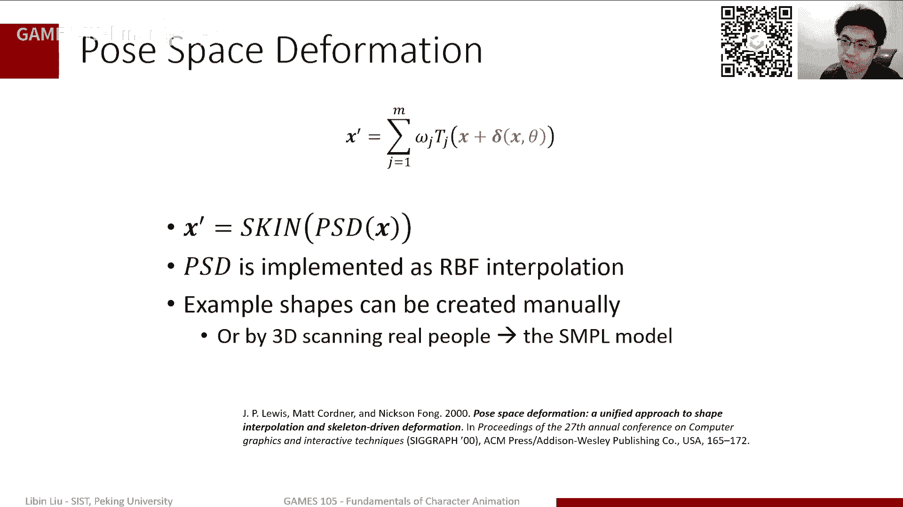

当然这个实际效果，这也是比较当年的论文里的效果，lbs的各种artif。

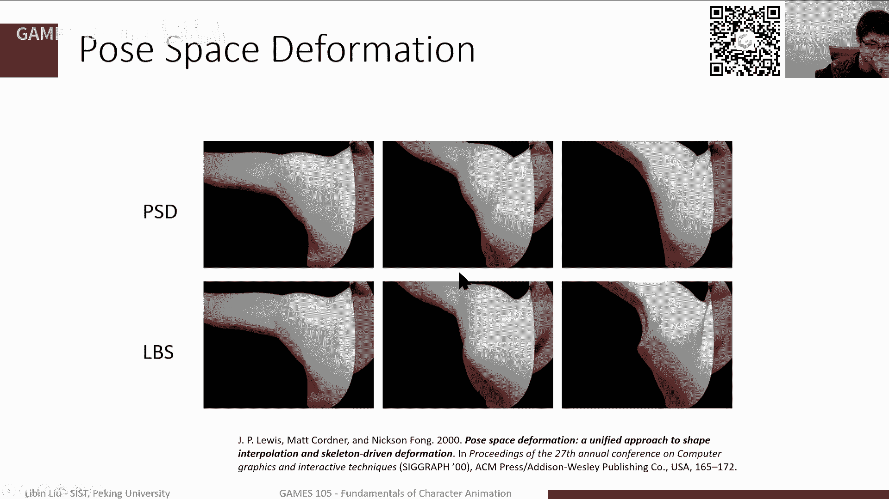

不好意思，当然还有一些就是这个方法本身，可能有些有些问题需要去想，比如说我们是不是需要对每个顶点，就是我们是插值的时候，是不需要插插值整个形状，因为知道我们身体如果我可能一个形状，一个插值点。

一个样例的形状，可能只需要我只要关心他的手臂，而不需要关心他的这个角，那其实可能你可以有些根据情况会做一些调整，另外就是说还是那个问题，就是我们这个形状，我们差值差值的时候，那个x它代表了一个姿势啊。

那这个姿势我是用所有关节的旋转表示，还是需要用，还只需要考虑一个局部，比如说可能只考虑胳膊的时候，我是不需要考虑腿才行这个姿势的，那这个其实也是一个实践上具体的问题，我们用r b f啊。

还是用其他的方式啊，这就不同的这种这种能有不同的实践方法啊，当然相对来说我们其实就p s d这种方法啊，其实我们通常来讲可以把它叫做example based，skinny，就是它有一些样例。

基于这个样例来帮助我们去做这个啊磨皮形变，那另外对于我们labs或者d q s这种方法，其实另外还有一个人也可以被叫做这个，scence of space啊，diation或者s s d。

但这两种方法来说，其实example base的这个方法，那好处就是比容易实现很好的这个quality啊，表容易控制，另外呢就是说比较容易实现这种所谓pose，dependent detail。

什么detail呢，就比如说有手啊，我们知道其实手就是很多人，手和你可能有些比较瘦的啊，这个这个这个人比如你手放下的时候，你可以明显看到这个手上青筋暴起哈哈，就是你的血管呢会会会疼起来。

那这种效果实际上用这个example的方法可以，其实可以很容易实现啊，就是你只要在这个手放下这么一个姿势里边，给他一个嗯这样一个样例的一个形变啊，是这个青筋起来的，那就可以实现这样的效果啊。

当然缺点就是说那我为了实现这个效果，我需要额外的去创建这样的一个样例啊，这其实是比较困难的，另外就是我量力很多的情况下呢，我需要额外的一个啊嗯这样一个存储空间啊，除此之外呢。

其实我们差值这件事情本身也需要计算量，而且就是可能不能插着函数，它的效果可能也不太一样，我们相对来说也需要更一些啊，更加细节的调整，那当然这前面只是介绍了，我们一些关于蒙皮的一些技术啊。

那当然作为两个样例啊，两个例子我们稍微讲一讲嗯，你这个新的方法啊，几个非常有意思的一个工作，一个就是s m p l模型或者叫simple模型，其实simple模型应该是呃好像是一几年哎呀。

忘记了116还是17年左右吧，反正提的提出来了一个嗯，一个人体的一个形变模型，那现在其实可以看到在很多很多场合，在本人主要是可能cv啊，就是特别是做pose mission，做这个人体姿态估计的时候。

很多人用这样一个snpr模型，它是什么，它主要好处是什么呢，它其实是可以自动的生成不同体型的人啊，然后不同动作加上不同体型，这个不同体型其实比较关键，那另外一个方案就是。

这个它的数据其实来自于这个真的人的这样，一个嗯这样一个扫描的数据，它这个模型本身其实就是刚好就是组合了，我们前面提到的几种方法，ssd啊，其实主要是lbs，然后以及ebs就post space啊。

formation啊，这两种方法组合完成这样的工作，当然这个细节我们就不会讲很多了，我们只是讲一讲大概它是怎么用的，那主要问题在于我们该怎么去啊，对一个大量的数据进行建模啊。

能够完成我们想要实现的这种对形状的形体，不同人体啊，形态啊，不同大小不同身体的这个这个大小形状啊，这样的这个这个定义，实际上我们其实上节课已经讲过了啊，或者上节课其实讲过了一个非常重要的技术啊。

就是pc啊，p c是什么技术，就是说我给出一大堆数据点之后，我可以找到这些数据点在某个方向上是最关呃，是这个他的信息是最多的，就是某种组合可能性是最多的，然后另外一方面，他其实也可以帮助。

我们去过滤掉一些噪音的影响啊，实现这种dimensionality，就是这个降维的这样一个操作，那当然pc它定义啊，就是说实际上我是找到一系列的方向uk，然后可以把这个数据，所以数据是映射到这些方向上。

然后我们可以保证映射过去之后啊，在这个方向的投影，它的方差是最大的啊，这是我们pc的一个基本要求，那pc我们其实是可以通过什么的，我们可以通过特征值分解啊，或者说svd这种方法可以很容易地计算出来啊。

这是pca的一个一个基本的一个概念，但如果说我们对这个人体数据做pc的话，那其实也可以看到，其实人他的几个主成分方向啊，分别对应了这种人的体型的不同的变化方式，比如说这像这个例子。

第一个主成分其实代表了很像这个瘦啊，瘦和胖之间的变化，然后另外的解释，可能这个代表这个男性和女性之间的变化，还有一些其他的这种变化方式啊等等等等，所以c s n p l模型啊，就它最主要的就是说。

我们如何用这个模型来建模，不同大小和不同体型的人，他实际做的就是说，我会把不同体型的这个人的这样的一个扫描结，果，把它做一个pc，那其实pc会给你几个量，第一个量代表了一个平均人，或者说一个平均的大小。

那后面若干个量代表的是我这体型，在不同的维度上发生了变化，那最终我在用的时候，我只需要给出我在每一个维度上，它的变化的一个范围啊，一个大小啊，其实整体就构成一个新的人，一个人的一个体型，那在在此之上呢。

其实我们前面提到了，我们需要加一点这种example base bloodsho啊，加一点混合形状来实现比较好的形变，sp i模型实际也是额外加了一个部分，因为本质前面这个t代表了我这个bpse下。

这个形状，它其实还有另外一部分，除了原来这个体型之外，它还加了一个跟姿态，这个theater其实是我们这里是表示是一个姿势，那其实加了一个姿势的一个线性的，一个还一个一个变换，那这个线性变换。

其实整体来说构成了我们的一个啊black sheep，就是我们前面那个那个调整啊，当我们之前前面介绍的post post base defamation的时候，我们其实那个纠正一下。

是用一个r b f来来实现的，但我们其实也提到了，就是说其实对于这种大量的数据来说，我们其实也可以用更加简单的函数，比如说r b啊，一个线性函数来去fit啊，来去这个回归啊，我们所有的点。

那simple model是因这里其实是一个怎么说，它也不是一个完全线性函数，但是也大差不差的是一个线性函数，它对c它是一个线性的，当然c它对于我的姿势参数来说，可能不是一个线性，这是sp l模型。

那它前面这个通过这两个方式，我们其实得到了在某一个体型，橘色的体型以及某一个姿势之下啊，它的原来那个形状，每个点的位置应该是什么样子，那剩下的部分其实我们就是加上一个萌新前重，加上姿势。

我们就可以用用一个一个a一个s d啊，就是我们的一个这个r b s或者一个dk s，来完成这个形变过程，实验就实现了这样一个效果啊，这其实就是散步模型做的事情啊，就他一个说。

我们可以给出一个不同体型的一个参数，加上不同姿势的一个参数，它可以生成一个不同体型的人，做不同姿势的一个非常高，质量比较高的这么一个这样一个角色模型，那另外一个例子其实也是非常重要的。

就是这个facial animation脸的表情啊，其实我在不断说话的时候，大家可以看到我的视频里，我就在不断的做出各种的表情，那这些表情我们在这个动画里面，我们会怎么生成呢。

但这里其实表情甚至有很多种不同的方法，其中一种方法可能就是我在脸上多加一些骨骼，因为本来我是人，其实就是比较下颌骨啊，你的这个这个形变，你的这个移动来产生你的这个嘴嘴巴的形变。

南方其实人脸其实还有一些更丰富的表情，就是它可能是你在骨骼上是看不出来的，它主要是肌肉的收缩带来这些表情，那这些表情一种方法是说，我可以在脸上加几块所谓的新骨骼，那这些骨骼不是真实的骨骼。

而是实际上它就是为了产生这样的形变，我通过调整这些骨骼的位置，来产生我这个脸的形变啊，这是一种方式，那另外一种方式呢，其实也是通过我们前面提到的这种所谓的，bend shape来完成。

就是说我这个脸的嗯，他的一个表情，我们可以认为是一个neutral的，一个无表情的一个脸啊，然后加上不同表情的这个位移，来产生了一个新表情，就比如说我可能就说一个500星点，就是一个人啊，闭着嘴啊。

睁着眼啊，这么一个这么一个这么一个表情，那这种情况下，比如说我可以加上一个左眼，一个闭眼的操作，那其实就相当于是我是把眼睛，左眼的这个这个这个是左眼，对于最左眼上的这些点啊，我加一个向下的偏移量。

那这个偏移量是可调的，从0~1，我分别对应于完全睁开到完全闭上，这样一个过程，那类似的我可以定义一个新，另外一个好black sheep一个形状，它是比如右眼张开，然后另外一个是对应的嘴啊，类似于类推。

然后把这些表情啊通过一些加权平均啊，不是加权平均，就是加权之后加到我最开始的无表情的脸上，脸上，那其实就构成了一个表情，从我们通过调整这些这些权重，我们就可以形成各种丰富不同的一个表现方式。

但从数据上表达，我们可以写成这样的形式，这个x代表我们整个脸每个点的位置，然后x0 代表一个什么，代表一个平均点，或者代表一个模板脸，然后中间这一部分我们可以是说一些可以定义。

可以自己定义的一些一些位移，比如说这种捏脸啊，其实我们其实可以对这个脸的形状做一些调整，然后最后一部分实际上是说我们刚才提到的，在这个调整之上，我们可以加一些偏移来产生不同的表情，那其实有一个问题啊。

就是说这个偏移是不是，就是说我们我们比如说把脸型改了之后，这个偏移是不是还还是不还能用，这个确实有这个问题，理论来说，你这个脸的表情的偏移，如果你想高质量的话，它应该是根据你这个脸型会发生变化。

但实际上我们会发现，其实大部分情况下，其实我们对不同脸型用相同的偏移，效果都可能是差不多的，那就别说闭眼，我不管这个脸长成什么样子，闭眼可能就是眼睑，眼睛眼皮上的点往下挪挪两公分啊，就闭挪一公分。

那就闭闭好了，那所以说这个其实可能跟脸型，反而就可能实际上并没有那么大的关系。

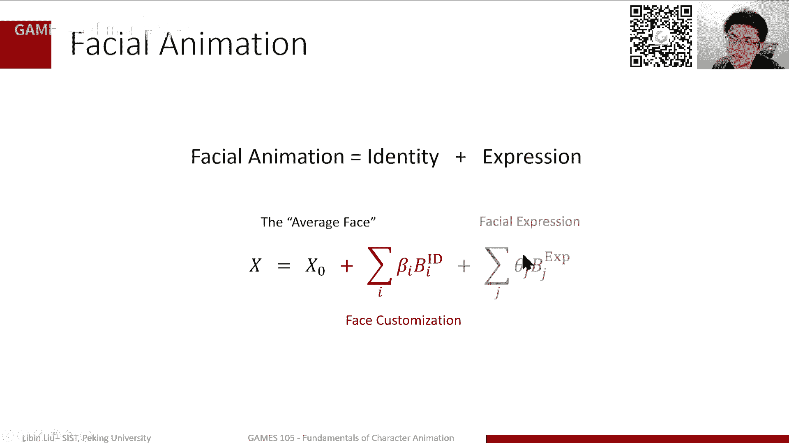

当然了，如果说你想实现更好的效果的话，那当然有关系是更好，所以实际上我们一般来说，做这个脸的动画的时候，我们都是需要这么一系列的bloodships啊，就是混合模型啊，每一个混合模型分别对应于不同的。

比如说这个表情，那首先记录的是说，我们总是会记录这个混合模型，相对于我一个平均脸，好标准脸他俩的偏差，那这个时间是我记录下来的，那实际我用的时候，时间是把这个偏差乘上我要加的一个权重。

这个权重表达了我要做这个表情的程度，然后把所有这些表情的权重加权。

然后加到这个平均脸上，那最终得到我这个新表情，但实际上其实大家也是发现，有一些系列表情是比较好用的啊，可以去用它来实现很多种不同的，这个非常复杂的这个种，或者比较好的一些效果啊。

其实这是一个一个简单的列表，那这个就是大家可以很容易，如果大家用的时候可以很容易找得到，就是那个啊应该是苹果哪个ark的，它在默认的这个表情好像是50数量，我忘了，反正是反正是这么多个表情。

就相当于如果说你给每一个表情定义好，比较合适的banshee，有点类似于这种，那它就可以驱动这样的一个啊角色啊，做出不同的表现，那当然具体来说，我们其实本来还有不同的方式了，刚才我们说的这种方式。

比如说眼皮是一个方，一个控制一个black ship，然后比如说嘴巴啊，向左撇也是一个shape，向右撇也是一个shape，那时间有点类似于前面这种效果，就是每一个shape，那实际上我最终混合的时候。

调一个每一个都要调一个参数，来实现一个完整的效果，那其实还有些其他的方式啊，就说我确实可以减用比这更加少一点的example，一个靓丽，比如说可能一个脸代表的是生气，另外一个点代表了悲伤。

然后另外一个点代表了什么，什么高兴之类之类的，然后我们在这些点之间做一个差值啊，那其实也是可以实现这种表情的变化，那当然这个取决于我这个脸的样例的数量了，就是有点数的数量比较少的时候。

那可能实际上我做不了特别精细的操作，其实只能在这几个表情之间做个切换的啊，那如果说我这个压力给的足够多，那时间可以同样可以实现，非常复杂的这个动作啊，这个这个这个嗯人脸的这个表情动画。

那当然类似于我们前面提到的，像是s n p r模型，那我们其实可以对应不同的身体的形状啊，不同的身体的姿态啊，其实这个脸的研究其实还是更早一点，其实很长一段时间之前就已经有，这种可以变成不同形状的啊。

脸的这样的一个这种叫叫multiple，就可变形的这个脸的模型，其实这个公式还能数学底层的公式，实际上跟我们前面提到的三pr模型啊，或者其实很相似啊，就是实际上就是第一部分我们刚才提到了。

它是一个基本的脸基准脸平均脸，那第二部分通常来讲我们可以用一个pca，然后给出一堆人脸啊，作为一个pca可以找到这么一个线性的模型，那第三部分其实就是我的表情模型，它其实就是benship。

这个其实相当于更容易控制一点，当然这个第三模型如果想用了，我们也可以用pc来进行实现，当然这个脸的模型圈有很多其他的问题啊，因为除了形状之外啊，我们其实还有人脸的这个比如肤色啊，比如说想做精细一点。

比如说我们要想比如像mata human，那其实他做的很精细啊，跟年龄可能会有不同的变化，然后另外还有其他的，就是我们本来是不大容易实现的，其实像比如说现在也一般，就是也是有些人会用。

比如像这种基于物理仿真的脸的这个动画，其实他因为你的脸的肌肉嘛，你发现最终还是其实你肌肉的形变，带来脸的变化，那么肌肉收缩收缩肌肉它会蓬起来嘛，它会给你的脸型发生些变化。

那同时肌肉的形变会带动你的皮肤啊，产生各种褶皱，比如说皱纹啊，比如这个演讲的各种纹路啊，这些其实你要就靠建模的，放在bansheep，实现所有的这些细节其实很麻烦的。

特别是你想建立让这个模型变到不同的年龄上，那这个其实你可能需要一些更更多的一些建模，的一些数学上的一些技巧来完成这样的操作，那最后呢就是我们如何去让这个脸动起来啊，那这里其实有一些基本的技术。

我们前面提到了reading，这rian有很大的一个功能，就是说我怎么让我的动画师，可以通过一系列像这种的简单的ui操作，去控制一个脸，那我其实可以简单的，就比如说我就可以给每一个点控制一个bansh。

然后通过调这个点的位置，那就产生了一系列的动画，那它还有一些其他的方式，比如说常见的一些方式，我们想要通过采集一个人的脸的动作啊，然后就把这个动作映射到一个虚拟角色之上。

那这就是face tracking所做的事情，那当然face tracking，它本身也是一个很很经典的一个研究问题啊，那这个问题比如说有一类比较成熟的一类方法，就是说我其实我直接去追踪人脸有点麻烦。

因为主要人脸的话，他现在这个有些光滑的地方，其实它这个特征点不太容易找到，那很多时候我们做人脸跟踪的时候，我是跟我是在这些比如眉毛呀或者嘴唇呀，或者眼皮，就是眼睑啊，这些地方它会有非常强的特征点。

所以说我们常用的方式就是说我通过这个脸，我会去检测这些特征点的位置，然后得到这些特征点的位置呢，因为这些特征点本质上是我做表情的时候，他会带动我的肌肉，带动我的面面部的这些那个模型啊，做出这样的表情。

所以实际上我可以通过求解一个什么呢，这个其实也是一个ik问题啊，当然这个ik不是关节了，而它的参数是一系列的这个banship，这个参数我们同样可以求解i k问题啊，比如说用一个优化的方式求解。

那就可以得到一系列的比较合理的表情的参数，那个参数可以刚好对应到我采集到这个眉毛，眼睛的这些特征点的位置，那实现了这样一个驱动啊。

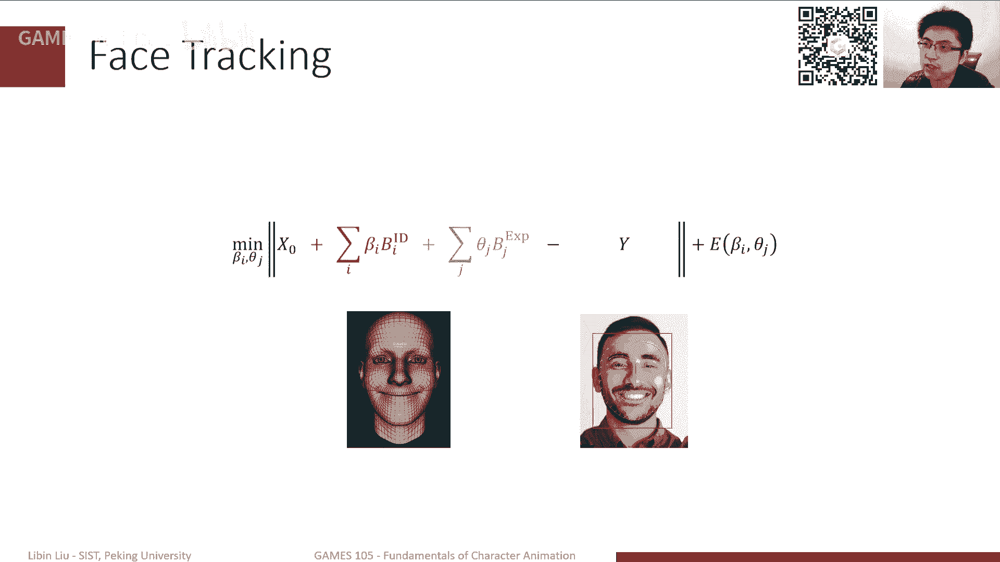

这是一个也是一个类的方法，还有一些其他的方法，比如说呃基于语音的驱动，那这个其实也是近2年，非常也是非常这个热点的一些研究问题啊，当然这个madam这个是不是语音的，我我我我觉得大概率不是。

但是这个问题本身是一个很是一个很好的问题，那当然语音其实有很多种不同的解法，一种解法是说我们还是基于bansh，就是类似于我们前面那个公式，我们去改每一个表情的参数，来去生成一个合理的这个人的表情啊。

当然其实我们今天也看到很多工作，最近就是他就完全不需要任何ban的shade，我就直接输出一个人脸，每个点的位置效果其实也挺好啊，但这个其实还有一些其他的问题，比如放化性的问题啊。

或者是这种怎么去训练啊，跨语言啊，各种各种问题需要解决，但就是不管怎么样，这其实这也是一个非常重要的思路啊，既然在游戏里，其实一些游戏已经在用了，特别是近2年的3a大作，比如说可以跨语跨语。

就不同语言他的角色可以用不同的，比如中文也好，用英文的也好啊，可以去说话啊，那就可以看到他嘴型大概是对的啊，其实这种方式其实也在不断的，这个在我们平时这个见到的这些应用里面出现。

ok那总结一下，那今天其实讲的内容还是比较多的，比我想的要多啊，总体来说我们还是讲一讲这个skinny蒙皮，要从最简单的线性蒙皮lbs讲到dcs，然后讲了一点black sheep啊。

作为example呢，我们其实也是回顾了一下s m p l模型，以及这个fish animation，其实它主要还是基于这个blood shape加上lbs啊。

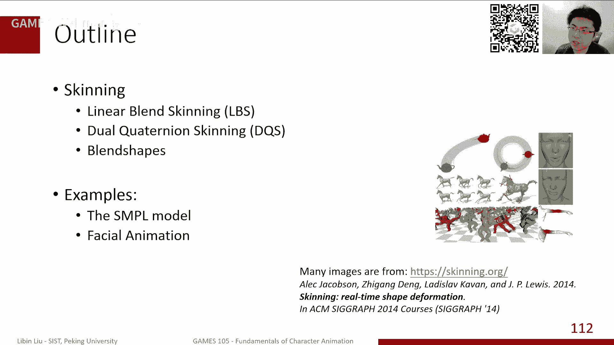

实现了一些动画的效果，ok那我们今天的主要内容就是这些，那看看大家有什么问题，语音驱动嘴型的最优方法是什么，哇塞这个其实是一个很好的问题，但实际上我是觉得现在哪种方法都有可能。

因为主要是如果说你用bansheep的话，相对来说，你的表情的这个自然程度是更容易有保障的啊，但是相对来说，本来shift其实也限制了一些细微的，这种脸的形变的出现，因为你建立benship。

你可能没有考虑所有的可能这个嘴型的状态，所以说如果说我直接生成脸的这个mesh的话，那可能这个更容易产产生这种微小的特征，那当然哪一种更好呢，其实我觉得我觉得最理想的话，简直是另外就是如果直接生成麦。

是可能是最好的，当然你需要解决怎么去啊，怎么去加这个正则项，让他这个效果看起来好一点，这个问题就是经常现在有很多问题，你可以看到这脸如果直接生成mesh的话，他有可能脸会有点抖啊，这这这挺挺重要的问题。

啊我们那个语音驱动人体动作的论文，那个我们近期要开源啊，这个会开源的，然后我们还需要整理一下代码，对于穿衣服，人体的蒙皮有什么办法，我觉得嗯，这个我觉得好像很常见的方法，都是说我再加一些骨骼。

然后这些骨骼是专门给衣服加的，那这样一股可能你不控制它，会加一点仿真去随动啊，这可能是一些比较方便的方法，那除此之外的话可能就是如果说不关心啊，这种随动效果的话，那其实就像一其他的这个蒙皮一样。

我就直接绑定就可以了，但如果想要加的话，那可能还是需要加一些放针啊，或者加一些额外骨骼这种方法，其他的还没有什么特别好的想法，但是有些可能有些研究上的这个方法是说，也许可以。

那部分地方我是用一个神经网络来预测，它该是什么动作，其实这个我知道米哈游啊，还有之前我看到一些人他做了一些工作，其实也是用类似的方法，但这不完全是绑定了这个，实际上是这个实际上是仿真的。

就是用神经网络来做仿真啊，这其实也是一个很好的问题，ok行我觉得时间关系啊，我们也就不再，我们可以下就是下面在这个这个群里啊，或者在其他地方进行交流啊，另外就是说我们第二次的作业啊。

我们已经放在github上了，其实上周上周一上周二就已经放出来了啊，也是欢迎大家有兴趣的同学，可以去这个研究一下啊，也就是我觉得还是蛮有意思的，ok好，那我们今天的课就到这里啊。

