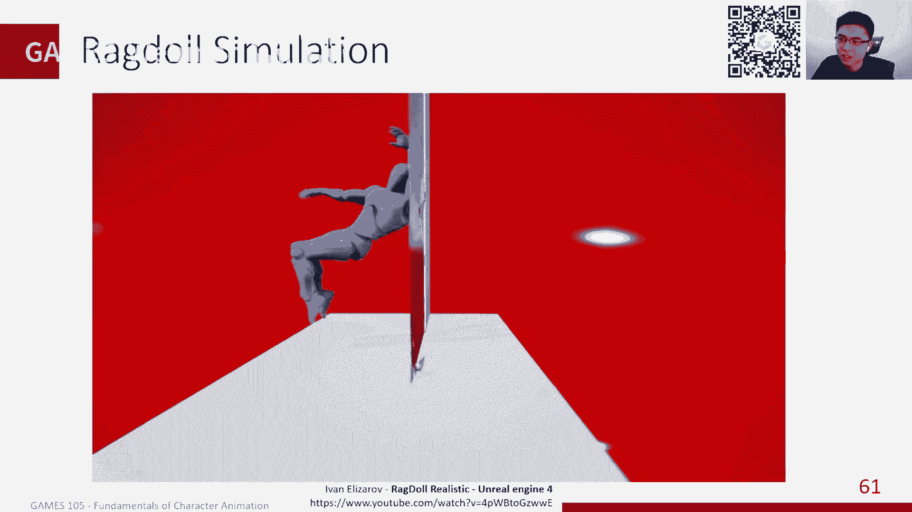
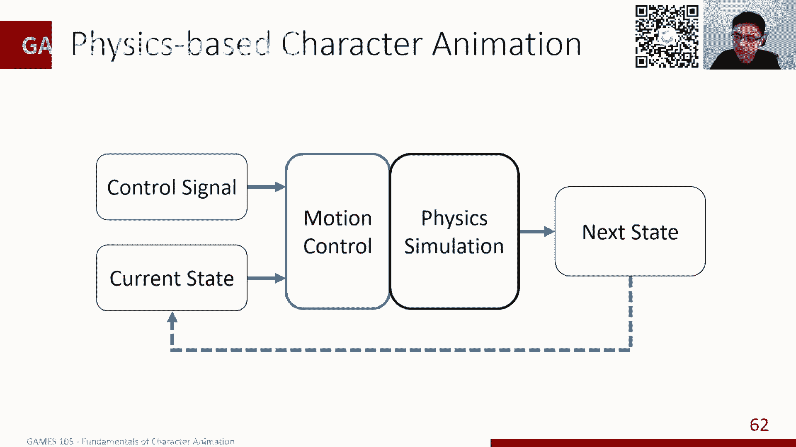

# GAMES105-计算机角色动画基础 - P1：Lecture01 角色动画导论 🎬

在本节课中，我们将要学习计算机角色动画的基础概念、主要技术分类以及该领域的发展脉络。课程旨在为初学者提供一个清晰的概览，理解如何让虚拟角色“动”起来。

## 课程与讲师介绍

大家好，欢迎参加GAMES105课程。本课程名为“计算机角色动画基础”。与其他GAMES系列课程类似，我们主要关注三维计算机角色动画，而非二维动画。课程会涉及二维内容，但核心研究对象是三维角色动画。

我是刘立宾，现任北京大学智能学院助理教授。我的研究方向主要是基于物理的角色动画，特别是如何控制角色运动。在加入北大之前，我曾在迪士尼研究院工作。右下角的二维码是我们北京大学可视计算实验室的公众号，欢迎大家关注，我们会通过公众号发布相关活动信息。

课程主页位于GitHub。上课时间为每周一晚上八点到九点，持续约12周，从今天开始到12月底或1月初结束。

**前置要求**：学习本课程需要了解线性代数、微积分和基本的编程技巧。课程作业将主要使用Python完成，我们会提供简单的代码框架。作业提交将通过专门的网站进行，课程邀请码已显示在屏幕上。此外，我们有一个课程交流群，二维码长期有效。

## 什么是计算机角色动画？

首先，我们需要明确什么是计算机角色动画，以及我们关注其中的哪些内容。

提到角色动画，大家可能会想到动画电影，如《疯狂动物城》、《寻梦环游记》等。虽然动画电影是重要的应用领域，但当前电影制作中使用的计算机角色动画技术比例其实很小。本课程讲解的许多技术尚未在电影中广泛应用，但随着AI生成技术的进步，未来可能会有更多应用。

实际上，角色动画技术应用最广泛的领域是游戏。因为游戏需要根据用户输入实时生成可交互的内容，这与一次性渲染的电影不同。游戏的需求直接推动了角色动画技术的进步与发展。

近年来，我们也看到许多新应用，例如虚拟偶像、虚拟主播、VR社交、VR游戏，以及大场景人群仿真等。这些都属于计算机图形学的组成部分。

## 角色动画的核心组成部分

如果想让电影中的一个角色运动起来，至少涉及三个领域：建模、动画和渲染。
*   **建模** 关注静态外观或某一帧的表现。
*   **渲染** 负责将外观展示出来。
*   **动画** 则解决相邻帧之间如何生成的问题，它建模的是时间序列上的规律。

这与**物理仿真**有显著不同。物理仿真（如刚体、软体、流体仿真）的目标是模拟客观物理现象的时间演变。而**角色动画**更关注行为建模，例如人或动物的动作。

两者之间存在联系。在我看来，**物理仿真加上控制，就构成了动画**。纯粹的物理仿真是被动的，而控制引入了主观意愿。物理仿真通常有精确的数学描述（如微分方程），而动作行为很难用单一数学公式完全描述，往往需要通过大量观察进行统计建模。

角色动画关注的对象是“角色”，通常具有数十到上百个关节参数。理论上，几乎所有动作都可以由动画师手动“K帧”（逐帧调整姿态）完成，从而得到高质量动画。但这使得角色动画在需要交互的场景（如游戏）中成为一种劳动密集型技术。

因此，计算机角色动画的研究目标，是**理解人和动物产生动作的规律并建立模型**。一方面，这能提供更智能的动画编辑工具；另一方面，可以生成全新的动作。简而言之，我们的目标是将角色动画从劳动密集型转变为计算密集型。

## 角色动画的生成流程

如何生成一段动画或让一个虚拟形象动起来？通常流程如下：
1.  **几何建模**：获得虚拟形象的模型（通过雕刻、扫描等方式）。
2.  **骨骼绑定**：将模型绑定到骨骼上。这涉及骨骼设置和计算蒙皮权重。
3.  **运动生成**：驱动骨骼运动，从而带动外部模型形变。**如何生成骨骼的运动，是本课程主要关注的内容**。

在真实世界中，人做一个动作（如伸手）的过程是：大脑想法 -> 神经信号 -> 肌肉脉冲 -> 肌肉收缩 -> 施加力/力矩于骨骼系统 -> 在物理规律下产生运动。

计算机角色动画技术可以根据**是否对物理过程进行建模**来区分。

## 两大技术分类：运动学 vs. 动力学

### 基于运动学（关键帧）的方法
这类方法不模拟物理过程，而是隐含了从意图到姿态的转换。它直接更新角色的状态（如姿势、速度）。角色可以实现瞬移等不符合物理规律的动作。这是工业界应用非常广泛的一类方法。

### 基于动力学（物理）的方法
这类方法希望复现真实的物理过程。它会对物理仿真进行建模，通过仿真生成最终动作。在此过程中，不能直接干预角色姿态，因此瞬移并非其目标。

**总结**：角色动画方法大致分为两类：使用物理仿真的**基于物理的角色动画**，和不使用物理仿真、直接改变姿态的**基于运动学（关键帧）的方法**。

## 控制维度：低级与高级

控制角色动作还可以从不同维度进行：
*   **低级控制**：像动画师一样，逐帧调整每个关节的旋转。优点是可以精确控制每个细节；缺点是效率低、成本高。
*   **高级控制**：给角色一个高级目标（如“去拿杯水”），角色自动生成完整动作序列。优点是用很少的信息生成复杂动画；缺点是无法精确控制细节。

角色动画的发展趋势，正是从低级控制逐渐向高级控制过渡。

接下来，我们将简要介绍角色动画各个方向的基本技术。

## 基于运动学的方法

上一节我们介绍了角色动画的两大分类，本节中我们来看看基于运动学（关键帧）方法的具体技术。

### 关键帧动画与迪士尼12准则

关键帧动画是最基础的动画技术。早在计算机图形学出现之前，动画师就通过逐帧绘制来制作动画（如1917年的《猫和老鼠》）。他们总结出了著名的**迪士尼动画12准则**，部分准则是为了模仿真实物理过程，部分则与艺术夸张和叙事相关。

在三维计算机图形学时代，同样的技术可以应用于三维领域。动画师使用Maya、Blender等软件，一帧一帧地调整角色姿态，连接起来形成动画。制作高质量的关键帧动画需要相当的训练和技术。

从算法角度看，有两个非常重要的技术：

### 前向运动学与逆向运动学

*   **前向运动学**：给定每个关节的旋转角度，计算末端（如手）的位置。
    *   公式：`末端位置 = FK(关节1角度, 关节2角度, ...)`
*   **逆向运动学**：给定末端（如手）的目标位置，反推需要改变每个关节多少旋转角度。
    *   公式：`(关节1角度, 关节2角度, ...) = IK(末端目标位置)`
    IK是角色动画中的关键技术，它让姿态调整变得直观。

### 补间动画

制作关键帧动画时，通常只制作几个关键姿态，然后通过算法自动生成中间的过渡帧，即**补间动画**。基本思路是使用不同的**插值方法**来生成平滑的动画。

然而，关键帧动画需要逐帧控制，是一种非常低效的低级控制方法。

## 动作捕捉与数据重用

为了解决关键帧动画效率低的问题，动作捕捉技术被广泛应用。

### 动作捕捉技术

*   **光学动捕**：使用专用设备（如Vicon），在身体上贴反光标记点，通过多视角相机捕捉。质量高，用于电影制作。
*   **惯性动捕**：使用便携的惯性传感器。价格更亲民，常用于虚拟偶像直播。
*   **视频动捕**：从普通视频中估计动作。使用范围广，但目前质量难以与前两者相比。

无论哪种动捕，都会面临一个问题：如何将捕捉到的动作映射到不同的虚拟角色上？这需要**动作重定向**技术。

### 动作重定向

动作重定向是将一个动作适配到骨骼结构、尺寸可能完全不同的新虚拟角色上的技术。

动作捕捉本质上只是记录和回放动作，无法生成新动作。为了在交互式应用（如游戏）中重用数据，产生了以下技术：

### 状态机与运动图

一个简单的想法是使用**状态机**。例如，角色有“奔跑”和“攻击”两个动作，用户按下攻击键时，从奔跑状态切换到攻击状态，再切回奔跑。大部分游戏引擎都支持状态机模型。

学术上，2002年提出的**运动图**技术与此类似。它从运动数据中自动构建状态机，允许在不同动作片段间切换。后续工作对其进行了改进，例如在状态节点内进行动作插值以实现更精确控制，或在其上训练AI来完成更高级任务。

运动图的优点是能重用现有数据生成新运动。缺点是构造复杂，随着动作数量增加，图会变得非常庞大且容易出错。

### 运动匹配

运动匹配是育碧公司在2016年左右提出的技术。其核心思想不是播放完整动作片段，而是在更细粒度（如每一帧）进行控制。每一帧结束时，通过最近邻搜索找到一个新姿态，该姿态既要满足控制目标（如移动方向），又要与当前状态连贯。

运动匹配很大程度上是工程实现，需要精心设计损失函数和动作库。它简单实用，现已集成到一些游戏引擎中。它同样解决了运动图的难点，并能提供高级控制。

## 生成模型与跨模态生成

我们提到，角色动画的目标是理解动作的内在统计规律。生成模型为计算机角色动画带来了巨大进步。

### 生成模型

生成模型可以从大量动作数据中学习规律，根据用户输入自动生成下一帧姿态。例如，可以学习控制指令（如摇杆输入）与动作之间的关系。

常见的生成模型包括GAN、VAE、标准化流，以及最新的扩散模型。这些模型只需收集原始动作数据（如让人随意走动两小时）进行训练即可生成动作，而传统方法（如运动图）需要手动分割和构建状态机。

### 跨模态生成

当前的研究前沿是实现**跨模态生成**，即用高级的、其他模态的指令来控制角色动作。
*   **音乐生成舞蹈**：输入一段音乐，生成对应的舞蹈动作。
*   **语音生成动作**：输入一段语音（如演讲），生成对应的肢体语言和动作。
*   **文本生成动作**：输入一句话，生成与之匹配的动作。

这非常接近我们“通过高级控制生成复杂动作”的原始目标。

## 基于运动学方法的局限性

尽管基于运动学的方法取得了很大进展，但它仍有相当大的局限性：
1.  **物理准确性不足**：容易产生穿模、脚底打滑等问题。
2.  **动作范围受限**：本质上是现有动作的重放或组合。当环境变化需要全新的交互时（如被绊倒、完成危险特技），如果动作库中没有类似数据，则很难生成。

为了解决这些问题，我们需要回到基于物理仿真的方法。

## 基于物理仿真的方法

上一节我们探讨了基于运动学方法的优势与局限，本节我们将深入基于物理仿真的角色动画。

基于物理的方法旨在在虚拟世界中复现真实世界产生动作的完整过程。回想一下，基于运动学的方法是：输入信号 + 当前姿态 -> 运动模型 -> 下一帧姿态。而基于物理的方法多了一步：运动模型输出的不是直接姿态，而是控制量（如力），这些力通过物理仿真最终改变姿态。

### 布娃娃仿真

最基本的物理仿真应用是**布娃娃仿真**，即关闭角色的控制，只让其在物理规律下运动。这常用于表现角色死亡、失去意识或被绊倒瞬间的反应。此时生成的动作是无意识的。

### 物理仿真的应用场景

*   **VR/AR交互**：在VR环境中，用户可能从任意方向击打角色，只有物理仿真能生成真实的受力反馈。
*   **VR社交**：在只有头显和手柄的情况下，通过物理仿真可以合理估计出下半身的运动，实现全身虚拟形象。
*   **精细操作**：如使用筷子，物理仿真能逼真地生成手指的细微动作。

### 物理控制的基本技术：PD控制

在物理仿真中，我们通常将角色简化为由关节力矩驱动的多刚体系统，而非复杂的肌肉模型。

一类常用方法是**PD控制**。例如，我想把手从A高度举到B高度，需要施加多少力？一个粗略的计算是：`力 = k_p * (目标位置 - 当前位置) + k_d * (目标速度 - 当前速度)`。通过给出目标轨迹并使用PD控制，可以生成关节力矩，驱动角色运动。

这项技术很早（1995年）就已出现，但至今未在游戏中大规模应用，主要原因在于**控制非常困难**。

### 轨迹优化与简化模型

为了设计出合理的控制轨迹，产生了其他方法：
*   **轨迹优化/时空优化**：通过数学优化自动计算出合适的控制轨迹。它允许高级输入（如指定脚部落点），但求解高维非线性优化问题非常困难且缓慢。
*   **简化模型**：借鉴机器人学思路，使用高度简化的模型（如倒立摆）来描述和指导动作。这种方法非常稳定，能抵抗外力干扰，但生成的动**作缺乏细节**，且通常只针对特定动作（如行走）设计，难以实现复杂动作（如后空翻）。

### 强化学习

强化学习为物理角色动画带来了突破。智能体通过与环境不断交互（试错）来更新运动策略，最终学会某种动作。2015年DeepMind在雅达利游戏上的突破鼓舞了该方向。

通过强化学习，可以实现**运动跟踪控制**，即在物理仿真环境下复现给定的运动数据。在此基础上，可以进一步结合状态机、运动匹配等思想，完成更复杂的技能组合。

### 控制生成模型

与基于运动学的生成模型类似，在物理仿真领域，我们可以学习**控制生成模型**。它学习的是角色在产生大量数据时，其控制策略的规律。我们可以在这个生成模型的状态空间中进行采样，每个采样都会产生不同的动作，同时也能响应高级指令和环境干扰。

基于生成模型的物理控制，正在将基于物理的角色动画推向“通过高级控制生成动作”的目标。未来，跨模态生成（如语言、音乐驱动）也有望在物理仿真中实现。

## 课程总结与展望

本节课我们一起回顾了计算机角色动画领域过去30年的主要研究方向。

基于运动学的方法（如运动匹配、生成模型）已逐渐在真实场景中落地。而基于物理的方法，虽然30年来一直被寄予厚望，但直到最近，随着控制生成模型等技术的出现，才真正接近可用的状态。我们可能正处在一个转折点，基于物理的方法有望在虚拟世界中更真实地还原动作产生过程。

## 课程安排与信息

最后，重申一下本课程的相关信息。

**课程定位**：本课程不会教授具体软件（如Maya、Unreal Engine）的使用，也不会培养动画师。我们将从科学和技术的角度，探讨角色动画背后的方法、理论和算法，特别是角色运动学、动力学、物理仿真与控制。最终目标是让大家能自己实现一个可交互的虚拟角色。

**课程大纲**：共12次课。今天为第一次。后续将从基础数学开始，先介绍基于运动学的方法，中间涉及蒙皮绑定基础知识，后半部分专注于物理仿真与基于物理的角色动画。大纲可能根据反馈调整。

**课程项目**：共有5个小项目，其中4个关于关节角色动画（每2-3周一个），1个关于模型绑定。

**实现方式**：所有项目主要使用Python实现。我们会使用一些Python下的物理引擎，并在其上实现仿真、控制和动画效果。

**前置课程**：本课程内容自成体系，但建议大家有时间可以学习前面的GAMES系列课程（101-104），它们提供了计算机图形学、几何、建模、仿真和游戏引擎方面的良好基础。本课程会在特定点上进行更深入的探讨。

**课程资料**：本课程没有指定教材，主要资料是课件和授课PPT。对物理仿真或机器人学相关背景的了解会对学习有所帮助。

---

好的，我们今天的课程就到这里。下周我们将从数学基础和前向运动学相关内容开始讲起。谢谢大家，我们下周再见！

