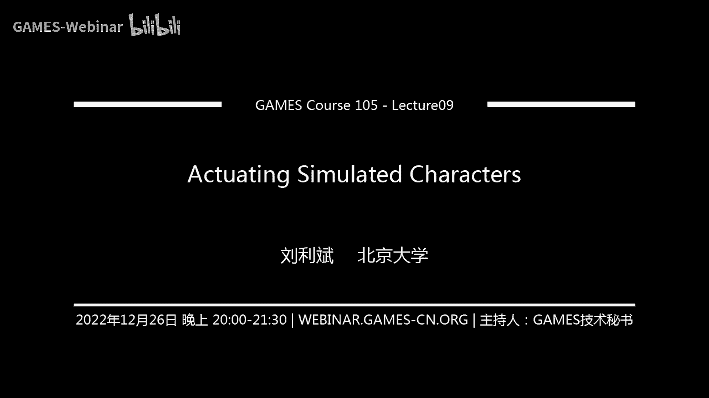

# GAMES105-计算机角色动画基础 - P10：Lecture09 驱动仿真角色 🎮

在本节课中，我们将学习如何驱动一个物理仿真中的虚拟角色，使其产生我们期望的动画。我们将从回顾刚体仿真的基本概念开始，然后深入探讨如何通过施加力和力矩来控制角色，并重点介绍一种基础且重要的控制方法——比例微分（PD）控制。

---

## 回顾：刚体仿真基础

上一节我们介绍了如何对一个虚拟角色进行物理仿真。在计算机角色动画中，我们处理的虚拟角色通常由不会变形的刚性肢体（刚体）通过关节连接而成。

为了计算这样一个系统的运动，我们需要求解其运动方程。对于一个质点，牛顿第二定律 `F = m * a` 描述了力、质量和加速度的关系。通过积分加速度，我们可以更新质点的速度和位置。

然而，刚体比质点更复杂，因为它具有形状和朝向。朝向（旋转）是一个非线性量，这带来了计算上的挑战。刚体的运动状态由位置、朝向、线速度和角速度共同描述。

为了改变刚体的运动，我们需要施加外力（F）和外力矩（τ）。线力改变线速度，力矩改变角速度。刚体的“惯性”由质量（m，抵抗线运动变化）和惯性张量（I，抵抗旋转运动变化）描述。惯性张量与物体的质量和形状分布有关。

多个刚体通过关节连接时，关节会施加约束力，确保连接点不会分离。整个多刚体系统的运动方程可以写成一个紧凑的矩阵形式：
`M(q) * v̇ + C(q, v) = τ_ext + J_c^T * λ`
其中 `M` 是质量矩阵，`q` 和 `v` 是状态和速度，`C` 包含科里奥利力和离心力，`τ_ext` 是外部广义力（包括我们施加的控制力），`J_c^T * λ` 代表约束力。

在物理引擎中定义角色时，我们需要为每个刚体提供质量、惯性张量、初始状态（位置、朝向、速度、角速度）以及用于碰撞检测的简化几何形状（如胶囊体、立方体）。同时，需要定义连接刚体的关节类型和初始位置。

仿真器的核心流程是一个前向动力学过程：根据当前状态和所有外力（包括控制力和约束力），求解运动方程得到加速度，然后通过积分更新速度和状态，从而得到下一时刻的动作。

---

## 如何驱动角色：施加力与力矩

上一节我们介绍了仿真系统如何运作，本节中我们来看看如何主动地驱动角色运动。如果不对角色施加任何控制力，它只会在重力作用下瘫倒在地，这种状态称为“布娃娃”（Ragdoll）仿真。

为了让角色按照我们的意愿运动，我们需要施加控制力。对于单个刚体，我们可以在其质心上施加合力和合力矩。对于由关节连接的多刚体系统（如人形角色），有两种主要的驱动方式：

1.  **直接对每个刚体施加力和力矩**：这种方式自由度高，但控制复杂。
2.  **施加关节力矩**：这是更常见和直观的方式。关节力矩模拟了生物关节处肌肉或机器人关节处电机产生的扭矩效果。

**关节力矩的本质**：当我们在一个关节上施加力矩 `τ` 时，其物理效果等价于在该关节连接的两个刚体上分别施加一个大小相等、方向相反的力矩。通常，在子刚体上施加 `+τ`，在父刚体上施加 `-τ`。这样，两个刚体会产生相对的旋转趋势，而整个系统的总力矩和为零，不会影响系统整体的质心运动。

**控制器的作用**：控制器是一个模块，它根据角色当前的状态（位置、速度等）以及我们期望的运动目标（如目标姿势或路径），实时计算出每个关节需要施加的力矩 `τ`，然后交给仿真器执行。这个过程可以看作是一个逆向动力学问题：已知期望的运动（或加速度），求解需要施加的力。

---

## 核心控制策略：比例微分（PD）控制 🎯

为了计算具体的关节力矩，我们需要一个控制策略。比例微分控制是一种基础、强大且广泛应用的反饋控制方法。

### 什么是比例微分控制？

我们可以通过一个简单例子来理解：控制一个沿竖直杆滑动的物块，使其到达并停留在目标高度 `x_d`。

*   **比例（P）控制**：施加的力与当前位置和目标位置的误差成正比。`F_p = k_p * (x_d - x)`。`k_p` 称为刚度系数。误差越大，施加的力越大。
*   **问题**：仅使用比例控制，物块会在目标位置附近持续振荡，无法稳定停下。
*   **微分（D）控制**：引入与速度成正比的阻尼力。`F_d = -k_d * v`。`k_d` 称为阻尼系数。速度越大，反向的阻尼力越大，用于消耗能量、抑制振荡。
*   **比例微分（PD）控制**：结合两者。`F = k_p * (x_d - x) - k_d * v`。

对于关节控制，公式是类似的。对于某个关节，我们希望其角度 `θ` 跟踪目标角度 `θ_d`：
`τ = k_p * (θ_d - θ) - k_d * θ̇`
其中 `τ` 是需要施加的关节力矩，`θ̇` 是当前角速度。

### 参数的影响

以下是 `k_p`（刚度）和 `k_d`（阻尼）两个参数对控制效果的影响：

*   **刚度 `k_p` 过小**：角色显得“柔软无力”，难以到达目标姿势。
*   **刚度 `k_p` 过大**：角色显得“非常僵硬”，能快速跟踪目标，但可能引发数值不稳定，动作不自然。
*   **阻尼 `k_d` 过小**：角色在跟踪目标时会产生明显的、持续的振荡。
*   **阻尼 `k_d` 过大**：角色运动“缓慢迟滞”，需要很长时间才能到达目标姿势，但最终能够到达。

### 全身控制与轨迹跟踪

对于全身角色，我们对每一个关节都独立地使用PD控制器。我们为每个关节设计一条随时间变化的目标角度轨迹 `θ_d(t)`。在每一仿真时刻，控制器读取当前所有关节的状态 `[θ, θ̇]` 和对应的目标 `[θ_d(t), θ̇_d(t)]`，通过PD公式计算出所有关节的力矩 `τ`，驱动角色运动。

---

## 欠驱动系统与“上帝之手” ✋

然而，直接使用PD控制跟踪运动捕获数据或关键帧动画时，效果往往不理想，角色很容易失去平衡摔倒。其根本原因在于：人形角色是一个**欠驱动系统**。

*   **完全驱动系统**（如固定基座的机械臂）：控制力的自由度 ≥ 系统状态自由度。理论上可以精确控制每一个状态。
*   **欠驱动系统**（如自由站立的人形角色）：控制力的自由度 < 系统状态自由度。关节力矩的总和为零，因此无法直接控制整体的质心位置和全身朝向这些全局状态。

在欠驱动系统中，微小的跟踪误差（如质心稍微偏离）会因为没有直接的控制手段去修正而不断累积，最终导致失控摔倒。

为了解决这个问题，一个常见但取巧的方法是引入**根节点力**（Root Force），或称“上帝之手”。即在角色的根刚体（如骨盆）上直接施加一个额外的、虚拟的PD控制力，用于跟踪根节点的目标轨迹。

```
F_root = k_p_root * (p_d - p) - k_d_root * v
```

这种方法能有效帮助角色保持平衡、跟踪复杂动作，但其物理代价是：这个力在真实世界中不存在（没有施力者），会使角色的运动看起来像被无形的线牵引着，略显不自然。许多使用物理仿真的游戏（如《Party Animals》、《人类一败涂地》）都采用了类似的技术来保证角色的可控性。


---


## 应用：混合动画与布娃娃

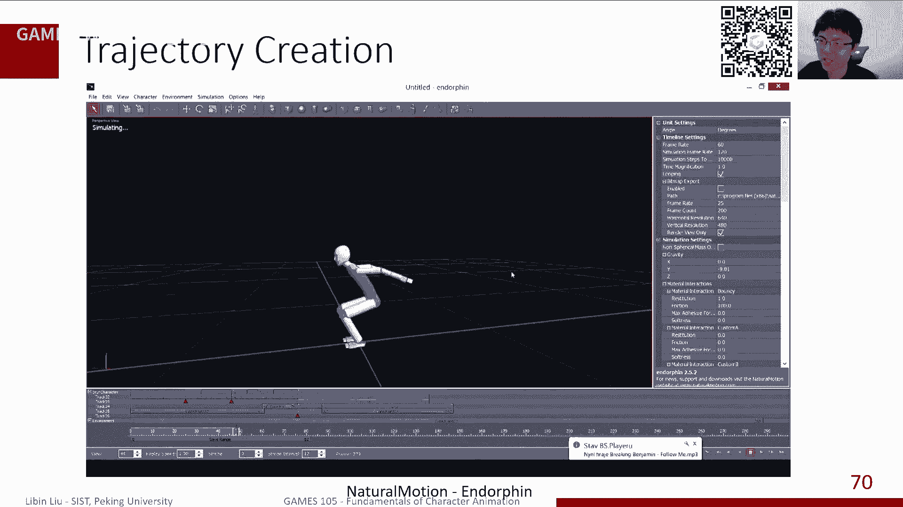


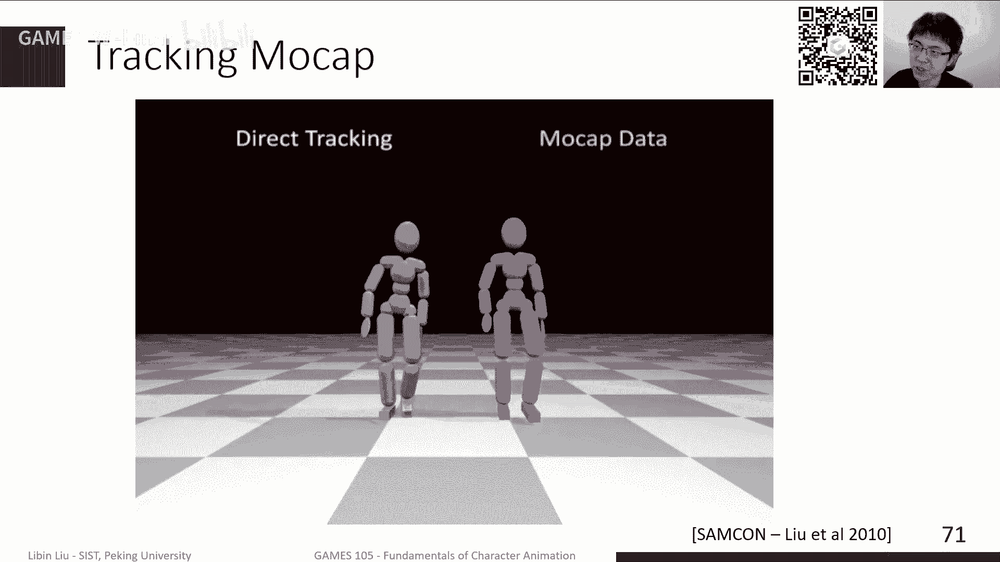

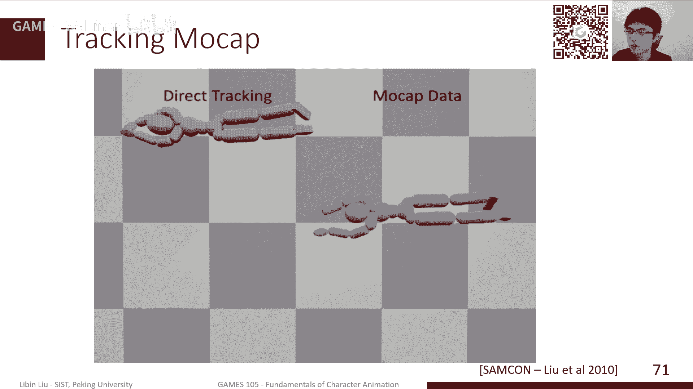


物理仿真驱动技术除了用于生成全新动画，还可以与传统的关键帧动画结合：

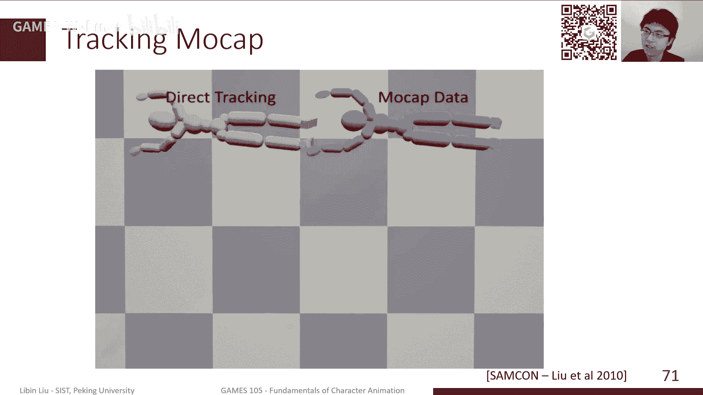


1.  **布娃娃（Ragdoll）**：当角色被击倒、失去意识时，撤去所有控制力，进入纯物理仿真状态，产生自然、随机的摔倒效果。
2.  **动画混合**：在游戏动画中，可以在关键帧动画（如攻击动作）和物理仿真动画（如受击摔倒）之间进行平滑过渡。例如，角色被击中时，从关键帧动画切换到布娃娃仿真，再混合到一段站起来的关键帧动画。这样既能保留动画的艺术性，又能增加物理交互的真实感和多样性。

---


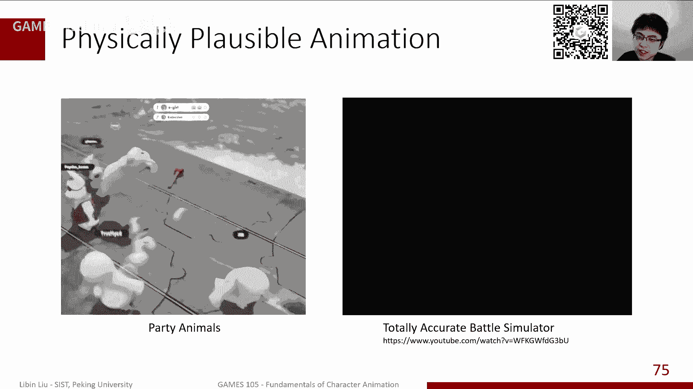

## 总结


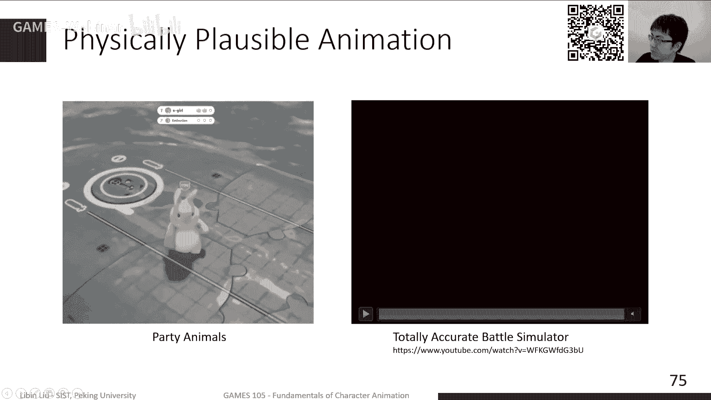

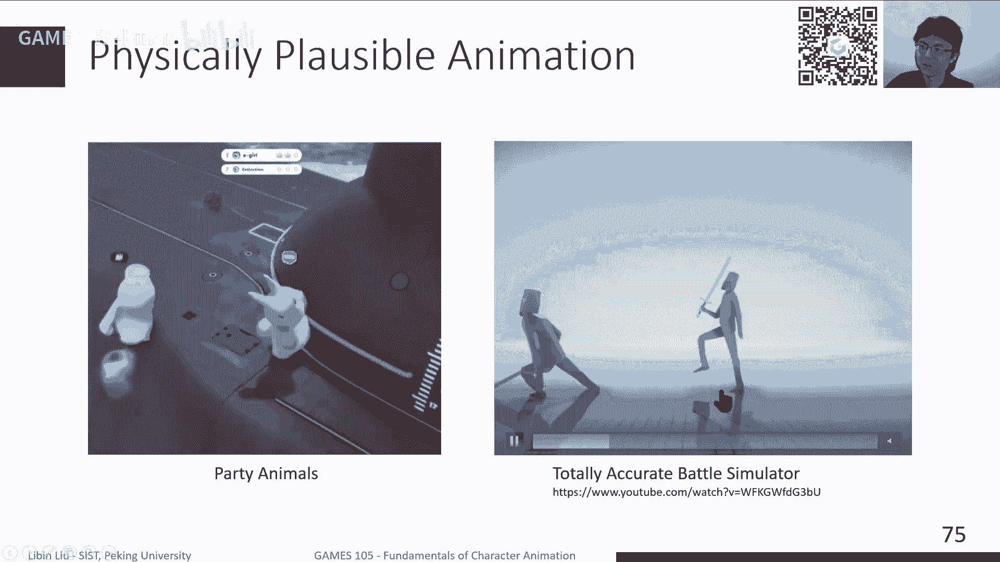


本节课中，我们一起学习了驱动仿真角色的核心知识。我们首先回顾了刚体仿真的运动方程，理解了力与运动的关系。接着，我们探讨了如何通过施加关节力矩来驱动角色，并深入介绍了**比例微分（PD）控制**这一基础控制方法，了解了其公式 `τ = k_p * (θ_d - θ) - k_d * θ̇` 以及参数 `k_p` 和 `k_d` 对动作效果的影响。


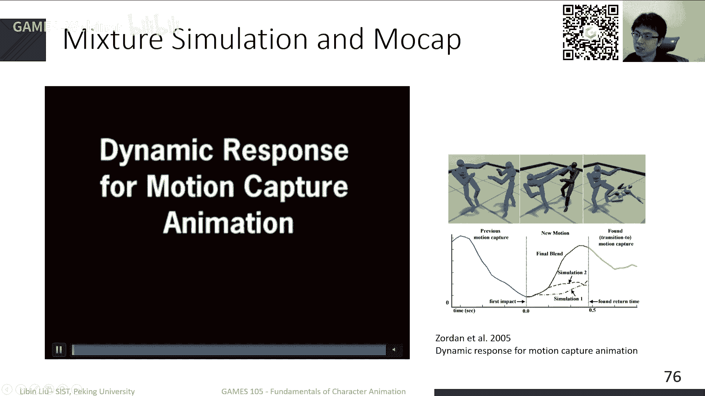

我们认识到人形角色是一个**欠驱动系统**，仅用关节力矩难以稳定控制全局状态，因此实践中常借助**根节点力**（“上帝之手”）来辅助平衡。最后，我们看到了物理仿真驱动在布娃娃效果和动画混合中的应用。

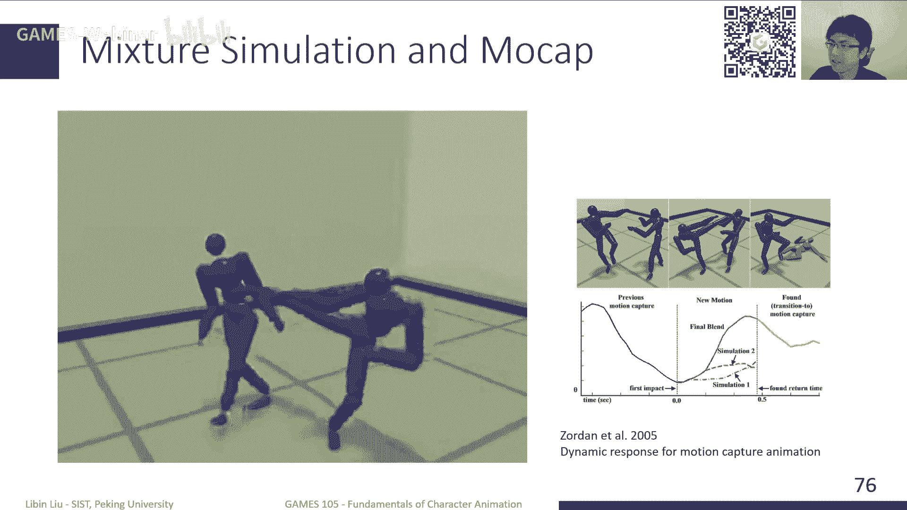

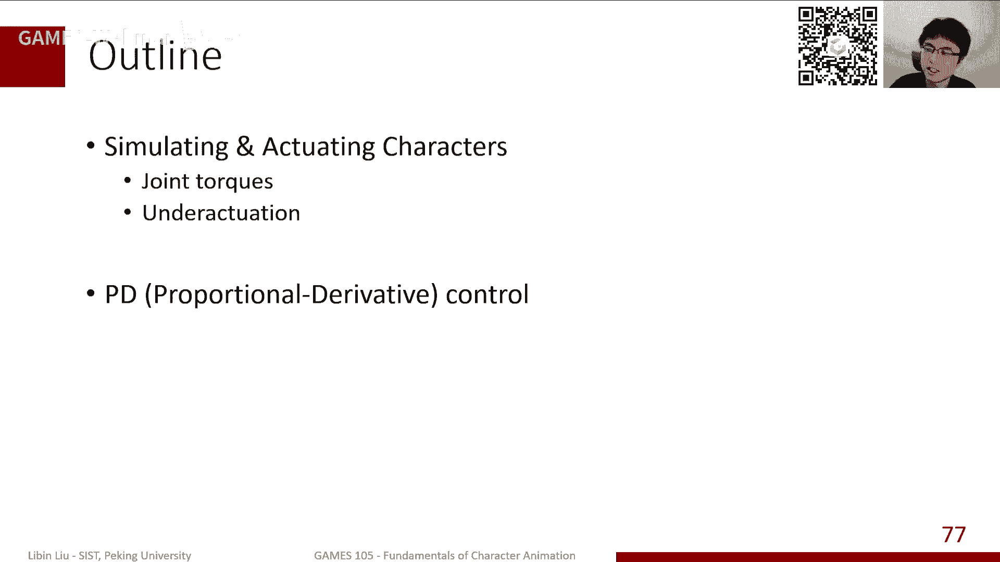

下节课，我们将探索更高级的技术，学习如何在不依赖“上帝之手”的情况下，设计控制器让角色自主保持平衡并完成复杂的运动任务。