# GAMES105-计算机角色动画基础 - P11：Lecture10 Controlling Character - GAMES-Webinar - BV1GG4y1p7fF

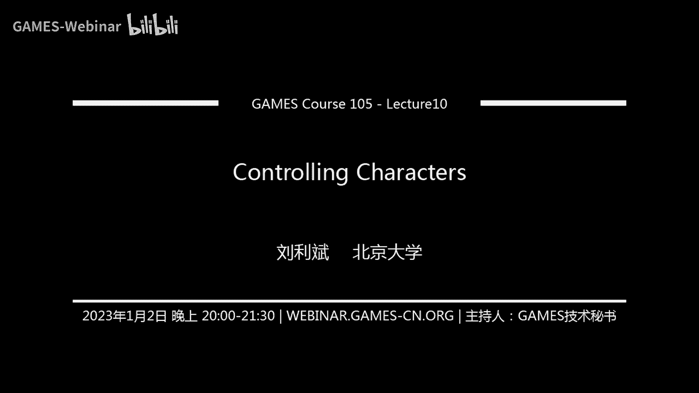

好的那欢迎大家来参加我们这个games 105啊，这是应该是我们的第11次课啊，我们其实这次课跟上节课课是一个，就是连接比较紧密的一个两节课，其实主要是讲一讲角色动画里边，特别是基于物理角色动画里边。

我们该如何去驱动角色啊，我们的这个仿真角色去做一些事情啊，当然这个上节课我们主要是讲了一部分，这个控制方面的，就pd control的一些基本知识，我们今天这节课呢，会接着我们上一节课的内容啊。

就是把我们pd control的一些更加细节的一些啊话题，我们今天再稍微多讨论一下，另外呢我们其实上节课也讲到了pd control，我们简单直接去track track一个motion。

我们其实很难去实现一个物理准确的，就是呃我们必须要加一些，比如说virtual false，这个这个hand of god，就这种在柱子上多加一些力，这种方式来实现这个角色的平衡。

但是这种力呢会带来一些不好的效果，那我们其实今天这节课我们会讲一讲，该如何去把这个例去掉，能够让我们的角色生成一个完整的这个啊，就是物理准确的，物理真实的这样的一个动作，那当然我们今天主要是讲两个。

比较简单的方法啊，一个是这个开环控制，也就是feforward控制方面的一些内容，然后另外我们简单讲一些这个feedback控制嗯，就是这个这个如何通过一些简单的策略来实现。

一个原地保持平衡的这么一个控制器，好我们今天主要是讲这些内容，那我们上节课其实已经提到了，关于这个关于这个啊pd control啊，就是所谓的这个比例微分控制器，就是说当我们需要去让一个角色啊。

比如说我一个胳膊，我想让我的这个肘关节转动到某一个角度，那我们通常来讲可以是在，就是我们为了驱动角色运动，我们总是需要加再加一个关节力矩，然后这个关节力矩我们可以通过一个啊。

这么一个简单的一个线性公式来进行计算，那首先前面一部分是我的这个目标的，目标的位置啊，比如说我要把这个肘关节转成90度，那我其实有一个目标的目标的这个角度，就是90度。

然后第二部分呢这个q是我当前的这个角度，然后这两个之间其实代表了，我到我们目标之间的这个偏差，然后用这个偏差成一个比例系数，那其实就得到了我的一个啊需要加多少的力啊，做下来加多少例举这么一个计算。

那另外呢，其实也是为了能够让我们这个跟踪过程能够，更加的这个平瓦啊，更加的这个嗯，因为如果说我们只是单纯的加，根据这个啊偏差去算这个false的话，那我们其实这个角色啊这个胳膊会不可避免的。

它会在那个目标位置附近去震荡，然后为了能够减弱这种震荡的话，通常来讲我们会有一个阻尼项，那就是第二部分，它会根据我当前的速度来减少啊，我需要加的这个大小，那当然pd控制应该是说我们在控制力领域。

这个非常非常简单，而且也是非常非常常用的一类控制策略，其实不只是在角色动画里面，其实想想，就是大家可能已经看到很多这种奇怪的问题，比如说一边放水，一边进水，然后这个时候我们再怎么该。

该怎么去保持这个水位的高度啊，这其实也是可以用pd控制来实现的，另外实际上在工程领域的话，其实大好多好多，我们常见的这种这种机器人，或者感觉更复杂的一些机械，它其实本质上最终还都是pd控制。

然后就是就是说皮筋膜虽然很简单嘛，但是就是一方面很实用，另一方面，其实很多时候我们想要去实现更加复杂的，这种控制的话，我们通常要求我们对这个目标的这个，比如机器人啊，对他的整个动力系统啊。

对它整个的跟环境交互啊，这整个过程我们要足够的了解，才能让我们的模型变得比较精确，但我们在不了解的情况下呢，其实我们很不可避免的要做一些近似，那如果说我们近似到这个某种，这个极限的程度的话。

那其实它就还原成一个一个pd control了，所以说实际上pd control是一个就是很常用的一个，一个一个一个一个控制策略，那当然pd控制其实还有很多的，这个本身还有一些很大的问题。

其实我们上节课也讲到了一个那个，用一个非常简单的一个一个toy model啊，去介绍了一下，就是一个最最最基本的问题，就是pd control，它本质上来说我们需要去计算一个力。

那这个力是是这个跟我当前就是我当前的状态，跟我的目标状态之间的偏差产生一个比例系数，也就意思是说他必须要有这样一个偏差啊，才有这样一个力，假如也就是说没有人没有偏差了，就没有力，那这种情况下。

就在很多情况下，会有一个叫这个稳态误差的这么一个东西，就比如说刚才还是我们那个例子，比如说我这个胳膊，我这胳膊是这样一个状态，我想把这个胳膊这个小臂把它端平，把它端平，但是这个时候我们只要有重力的。

比如这个小臂是在一个水，这个垂直方向上转动的，这样一个嗯这样一个状态，那么因为重力的作用，重力会在这个重心上加一个力矩，那这个力矩会让这个这个小b啊，它会向下去下垂，那为了能够对抗这个力矩的话。

我们必须要加一个关节力矩，那这个关节力矩需要至少在平衡的时候，需要跟这个重力的力矩是保持是一致的，是相同的，那这样才能保持这样一个稳定的状态，但是呢因为我们关节力矩。

我们知道用pd control的时候，如果是我这里出现了力，它大于零，那就说明我的误差一定是一定是大于零的啊，这这是因为我们这个比例公式就是这么定义的，所以实际上，如果说我们把目标位置设置在水平状态。

那么我啊跟踪这个水平状态，因为pd control就跟踪跟踪啊，算了跟踪这个水平状态的话，那这个大小b是肯定不会啊水平的啊，这是其实是一个也是p bd control，一个非常重要的一个一个特点。

那还有另外一个特点呢，其实本质上来说跟第一个特点是相同的，是同样的一个问题啊，就是说因为我总是要有偏差之后，我才能计算力，那计算力之后呢，这个力才会驱动这个角这个物体啊，或者这个角色去产生运动。

所以实际上比如说我这是一个正弦曲线，这个这个点线的这个曲线是一个正弦曲线，如果说我用pd控制，把这个这个曲线上，这个轨迹作为我的这个控制目标，然后用pd控制的话，你通过仿真仿这个生成的这个曲线。

你会发现它通常来讲会比我这个输入的曲线，有一个延后，有时候可以看到，比如说我的输入曲线已经到了一个最高点了，然后我这个仿真的曲线其实会延后一段时间，到达这个最高点，所以总会有这样的一个相位的一个偏差。

当然如果说对一个简单的系统的话，这个相位偏差是多少，我们是可以算出来的，当然这个属于大家有兴趣的话，可以更加了解一些，比如说控制论领域的一些技术知识，当然这里我们只是一个定性的。

就知道这个事情就就可以了，那回到这个回到前面这个问题就是这两种，不管是这个啊所谓的稳态误差，还是我们的这个啊这个相位啊，相位这个这个池岩这个问题，其实本质上都是，因为这个我们是需要根据误差来计算。

我们的这个这个false，所以说从另外一个角度讲，如果说我们知道kb k d control里边前面这一项，前面这一项它其实是一个所谓的这个steffens，所谓的刚性，或者说我们的这个这个增益啊。

就是这个game这一项，他其实在稳态的时候，我们上节课其实也算过，就是包括我们其实就是刚才这个例子，也是很容易得到的，因为这个套在稳态的情况下，它要平衡重力，那重力其实是恒定的对吧，然后为了实现这个套。

我这个误差实际是跟这个，如果在相同的套的情况下，误差跟我的kp是乘这个就他俩乘积一致嘛，所以他俩其实是一个反比关系，有时候如果说我用一个更大的一个kp hien啊。

这种pd control就是kb很大的一个pd control的情况下，那么它在稳态的时候，它其实这个误差会小一点，那从另外一个角度讲，就是包括我们前面提到的，关于这个啊跟踪一个轨迹的时候。

带来这个相位偏差的问题，他其实也是说在我这个kp比较大的时候，这个相位偏偏差也会相对减小一些，但是呢，虽然说感觉好像我们把这个kb调大一点好，就什么问题都解决了，但其实不是这样。

首先是说其实上节课如果大家还有印象的话，我们当时有一个视频啊，我其实播放了一下哎，如果说用不同大小的kp去跟踪一个t pose啊，让这个角色去做t po，你会发现当kb很大的时候。

这个角色动作会显得非常的僵硬啊，就感觉一直挺挺的啊，就是这个这看起来就不是很自然，另外一方面从这个仿真的角度讲，然后比较大的一个kp呢，会带来一些呃仿真上的这个稳定性问题，就比如说我们还是举一个例子啊。

就比如说我们前面在讲这个仿真的时候，我们用了这个例子，就是一个弹簧啊，弹簧有一个进度系数k p那同，但是我们这个在这里边，我其实在这个弹簧车，在额外的多加了一个阻尼的一个东西。

就说这个弹簧除了这个弹性之外呢，它还会根据我这个速度啊，会有一个阻尼力，所以说本质上来说，这个系统它就是一个kpd control，就是一个pd控制器，那当然p控制理器里边。

就是第一项里边的目标值是零啊，我们是假设它是零啊，其实不是零，我们可以同样讨论，只不过把它设成零，相对简单一点，如果说这个东西这样一个物体，它受到pd控制啊的这个控制。

那么实际上我们知道它的false计算是一个，就可以通过这样的一个简单的一个，比例微分的公式来进行计算，那在这样的力的影响之下，那整个系统如果说我要计算这个按它的运动，那我们其实可以通过仿真来实现。

那这个仿真啊，我们其实可以通过离散化，然后用欧拉积分来实现这个仿真的计算啊，比如说我们这里用一个半隐式欧拉，那扮演社拉的特点是什么呢，就是说这个速度更新啊，是根据力和当前时，就是这个力是用当前时刻算的。

当前时刻状态算的力，然后用这个来更新我的速度，然后呢用更新之后的速度啊去更新我的位置啊，这是一个这个扮演收拉或者是新欧拉啊，silesileo欧拉的这样的一个一个积分公式。

那当然这里其实我们这个首先做再说，稍微做做一下简化，因为这里力除以质量才是加速度嘛，我们可以再简化一点，我们认为质量就是一啊，那其实就可以把这个公式稍微写的简单一点，那当然不等于一，其实无所谓的。

这个其实同样的讨论，那当然这个地方因为f是一个pd control，是一个pd控制，然后按照我们一开始的假设啊，就是这里的力，都是根据当前时刻的状态去计算的。

也就是说这里的pd controls算出来的这个力啊，他应该是用x n，它就是当前时刻的这个位置，和当前时刻的速度来进行计算，ok所以说实际上我们可以得到这样一个公式。

那这里其实就是v和x其实都是我们的要求的，这个状态量，那当然这个公式我们可以稍微整理一下，整理成一个矩阵的形式啊，其实这两个是一样的，我就只是做一下一项，做一下代换啊。

然后最后变成一个变成一个矩阵的形式啊，首先就是因为这里边啊，是是跟x n和vn相关的，所以这里面其实没有其他多余的线，我们就是简单的就可以写成一个啊，如果说把vn和x n写成一个向量的话。

那其实它本质上就是一个矩阵乘以上一阵啊，上瘾，就当前时刻的v n和x n乘上一个线性矩阵，然后它等于下一时刻的v n x n，而且其实对这个简单的这个问题来说，实际上这个矩阵还是常数项啊。

它不会随着时间变化，那这里其实h我一直没说啊，就是h实际是我们这个啊时间不长啊，就是回想一下我们当时讲这个积分的时候，我们知道我们是把这个时间给离散化，那我们一种非常简单的方式，就把它均匀的离散化。

那个均匀离散化的过程中，相邻两个时间点之间的这个长度距离，那就是我们的时间不长，那这个其实是我们在仿真中，是一个非常重要的一个量，那如果说我们知道上一帧和下一帧，就是下一个时刻，和尚和当前时刻的关系啊。

是一个a矩阵乘上去啊，得到这样的关系，那如果这个其实我们可以进一步的展开，因为sn加一等于a乘以sn，那sn又等于a乘以sn减一啊，也就是sn等于a的平方乘以sn减一，然后我们继续不断迭代。

那么最终迭代，如果说s一是我整个系统的初始状态的话，那sn加一就等于a的n次方啊，a是一个矩阵啊，矩阵呢这a的n次方乘以s一啊，得到这么一个这么一个，有时候说从s11 固定的s一开始。

我觉得可以用这样一个通项公式啊，去直接计算出每一个状态下，我的sn的这个这个这个状态这个值，那当然这里其实我们可以进一步的做一些假设，就因为这个a实际上是一个22的矩阵吧，就是它是一个方，是一个方阵。

然后呢，我们实际上就是其实a的性质，很多时候是相对来说好一点，是比较好的，我们其实可以比较安全的，假设a是有两个啊特征值的啊，当然它没有的话，那可能这个这个讨论会更加复杂一点，可能我们需要去考虑。

就说当标准型那一类的这个跟这个代数的知识，当然这个实际结论上不会有太大的区别，就是从简单起见，我们只是假设一个简单的情况，a是有两个特征值的啊，同时有两个特征向量，那特征值和向量向量是什么意思。

我们知道特征值啊，就是特征向量a乘以v一啊，等于lada乘以v一啊，就是说在特征值和特征向量的意思，代表了在a作用，在特征值和特征向量上，它不会改变特征向量的方向啊，只会改变特征向量的长度。

这个长度的缩放大小，是由la就是特征值来给出的，那这是特征，这是那个矩阵的特征值的这样一个概念，那当然在这种情况下呢，其实如果说我们把v一和v2 ，它是两个向量，两个向量。

而且实际上我们其实可以很容易地搞，就是这个证明这两个东西是不共线的啊，我们可以把它写成一个矩阵p o，然后呢，其实a按照我们其实回想一下代数的知识，那他其实可以跟这个一个对角阵进行是相似的。

那其实是也就是a可以写成一个p，乘以一个对角阵，然后乘以p的逆的这样一个形式，ok然后这个p啊v1 v2 是一个固定的，因为a是一个已知的量嘛，所以v1 v2 是固定的，那这种情况下。

我们前面写到这sn加一啊，sn a等于a乘以sn，然后把这个格式行方式带进去，那就可以得s n加一等于p乘，以一个对角阵乘以p的逆乘，以sn好形成这样一个公式，那在这种情况下呢，我们可以做一个代换。

我们让z等于p的逆乘，以s也就是z n等于p的逆乘，以啊sn或者z n加一等于p逆乘，以s n s n加一，以此类推，因为这个p是固定的嘛，所以说时间这个代换是可以是可以可以，我们可以确定的把它写出来。

那在这个代换之下，那前面这个这样一个公式，我们可以直接带得到这样一个公式，比如说一个z它它的变化，首先可以发现就是它是完全是一个对角站，乘以z n的这样一个形式啊，我们其实也知道。

对角阵其实就是因为这是一个2x2，一个二乘以一个向量，所以实际上相当于是把第一个，它的第一个component就第一个数乘以lv 1，然后第二个数乘以ln 2，然后时间就完成了这样的一个计算。

那如果说回到前面，如果说我们想用通项公式，我们知道z n加一，如果z一的话是初始状态，其实这个在如果s一是知道的情况下，那z一我们是可以很容易计算的，因为本质上就是p的逆乘，以s一啊。

就得到了这个z1 ，那z n加一实际上就是a矩阵的啊，这现在变成了一个只是简单的一个lambda，就是一个对角阵，然后这个矩阵的n次方乘以z1 ，那其实这个矩阵的n次方，因为对角阵嘛。

所以它其实本质上是里边两个对角线上，也就是2a的两个特征值的n次方，构成一个对角阵，然后乘以z1 ，那这里其实我们可以可以得到一些性质，实际上如果说啊，因为这个首先a矩阵的两个特征值。

首先它不一定是实数啊，他可能是个负数，然后但是负数呢我们是有知道它是负数，有长度的，就是它不管它是实数还是负数，我们总是可以计算一个它的长度，对于负数来说长度，那就是实部的平方加上虚部的平方啊。

得到这么一个东西，那这里其实可以发现一件事情，就是当这个任意一个我这只是简单举例起来，兰姆达一，但实际上可以是朗姆达一或者栏杆二，任意中的任意一个如果它大于一的话，它的长度大于一的话。

我们可以发现是什么事情呢，就是说因为这个东西大于一，所以因而然后这个landa的n次方，它的长度，他这个lana一的长度的n次方啊，就一个数的平n次方是一个负数的，这个长度的n次方。

等于这个负数的n次方的长度啊，有这样的一个关系，所以说你就可以知道，如果说朗姆达大于一的话，那我们知道当n去，因为我们从零开始嘛，我不断的向后仿真，这n是不断增大的，所以让n就像无穷大，就增长的时候。

我们发现这个z n的长度也会变成无穷大，那自然是什么，z n是我们前面做了一个代换吧，z n本质上是p乘以s一啊，p乘以s，sp乘以s，所以实际上如果z的长度增大，那其实等价于我们也知道s相。

等价是s的长度也在增大，就这意味着什么呢，就是如果说有一个任何一个特征值，那它它的长度大于一的话，会导致我在仿真过程中，我的速度，我的这个位置啊，因为在本质上是这个速度和位置的一个线性，线性线性组合。

那这个东西会变得越来越大，越来越远离我的这个中心，越来越远，这个其实代表什么，代表这个系统就不稳定，实际上我们看到的时候，就相当于这个这个这个这个物体，在这里左右震动，左右震动，越震动越大，越震动。

最后飞的飞到无穷远去了，那就这是一个非常不稳定的一个反制系统，所以实际上为了能够保证仿真系统稳定的话，我们是需要一个什么情况呢，我们是需要保证所有的这个lad，就是a的所有特征值的长度都要小于等于一啊。

其实最理想应该是小于一，因为等于一其实也不是非常稳定的，那这种情况下，我们可以比如说我们给出一个值，比如说我当kp啊，kp等于五五百，然后kd等于20，这个时候我们把h它是时间不长。

我们把h作为一个变量啊，作为横坐标，然后纵坐标是什么呢，纵坐标是这个a的这个啊特征值的长度，的最大值啊，是这么一个东西，然后你可以看到这条蓝色的曲线，这条蓝色的曲线就是kp等于500k的20。

然后我的步长从一个很小的值逐渐变大，这个过程中它的特征值的大小的变化，那你可以看到这个，因为我们要求如果说我们这个系统是稳定的，那这个特征值的长度，最大的长度是不能大于一的。

大家可以看到将这个它们是小于，越来越小的时候，它其实是接近于，但是远小于的这个这个看起来好像大于，但实际上是小于一的，就是只是比较接近一而已，然后这一段可以看到大概在零点啊，0。040。0005左右吧。

大概这么一个位置，它它就已经到了一了，然后再增大它就会很快的很快的超过超过一，而且这个是单调上升的，不会再下去了，也就意味着什么呢，也就意味着，如果说我的h在我kp和kd给出这样一个范围，知识情况之下。

我这个h这个时间不长的取值不能小于啊，不能不能大于，不能大于这么一个零点点五，0。05左右的这么一个时间不长，00：00：05左右的这样时间不长，而你会发现，如果说我把这个kp增大，我把kp增大。

你会发现这个一一的这个点会更要求，会更加小一点啊，比如说kp等于500的时候，他是0。05kb等于5000的时候，那就必须是0。02左右啊，以下才能保持它的稳定，然后如果说类似的，如果说把kd调大。

那其实也可以看到这个要求，这个零点会更加偏右，也就是说实际上kb和kd这两个值特别是kp啊，就是虽然说我们知道kb调大的时候，我们会让这个系统这个误差更小，但是相对来说呢。

一方面它会让我的动作更更加僵硬，另一方面他会要求我使用一个更加小的一个，时间不长来进行仿真，但这是一个非常简单的例子，这是一个只是一个简单的木块，然后质量是一，然后只有这一个只有一个单单个变量。

但如果说对于一个更加复杂了，比如说人我们的人体啊，人体我们知道它有，首先这是一个旋转，是一个非线性的一个一个东西啊，然后另外一方面呢人呢其实关节很多，自由度也很高，然后在这种情况下。

如果说我们用pd control去控制整个这个角色的话，那我会面临一些问题，首先第一个问题就是说，我们知道pd control里面两个参数啊，kp和kd这两个参数呢，其实很大程度上会影响我这个角色。

他运动起来这个感觉这个状态啊，回想一下我们上节课讲的那个例子，就是kb大的时候他会很僵硬啊，但是kb小的时候呢，他又跟踪不上，就感觉非常无力，所以这个时候我们该怎么去设置这个kp和kd。

其实是一个比较考验经验的一个，一个这么一个过程，就是实际上这个没有什么特别好的办法，基本来说就是靠手调啊，就是我们调到一个感觉比较舒服的一个状态，就是一就可以一直用它，当然这个其实范围它调整的范围。

通常来讲你差一个，只要不差一个数量级，其实不会有非常大的偏差啊，就比如我们常用的一种方式，就是说kp是200啊，就因为它是计算关节力矩，就相当于每个关节对任何每个关节来说，它的kp是200。

然后kd是20，但这是其中一个可可行的一种方案，当然如果说你角色比较重的话，那你相信k b k的也要调大一点，当然这只是一个一种方案了，实际上这个范围也可以更大一点，其实我们常见的。

比如说我要做一个更加快一点的动作，比如说我要跳高啊，或者我要做一个后空翻，那其实可能这样的200，可能会你会发现他跳不起来，因为这个力量不够，所以你可能需要调大一点，另外呢就是说一些比较新的一些关节。

一些一些肢体啊，比如说这个脚趾或者说手，其实相对来说手其实很轻的，手手手只有几百克重，所以通常来讲，比如说我这个腕关节啊，我可能会kpu调小一点，所以这个其实只是一些经验之谈，就只说我们手工调整一下。

然后调整一个大家觉得满意的这样一个范围，但另外一个其实非常正需要这个强调的东西呢，就是说pd gas就是pd的参数，p k b和kd都是会容易造成我的仿真的不稳定，就像我们刚才这个举的这个例子。

那个那个木块那个例子，当然对于木块来说，我们发现好像也不会差很多嘛，0。01和100Hz每秒也可以啊，但是对于人来说，比如说这样一个角色，一个50kg的一个人，然后如果把k b k b设了200和20。

你会发现呢，这个很有可能你这个角色在100啊，在我这个反正牧场是准备1%秒的时候，他会非常不稳定，甚至你调到1‰秒都可能不稳定，就是我们我们很久以前大家用的时候，可能就是你看到以前很多的工作。

说我的仿真步长多少，还有仿真步长是1/1000秒，或者1/2000秒，也就是0。5或者1ms，这样一个量级，才能保持在这样一控制下的稳定性，然后如果说我把这个k pk调得更大的话。

那你可能会发现这个要求的不长会更加小一点，那不长想会带来什么问题呢，因为我每计算以每一步我都是要做一次，这个嗯那个运行啊，运动方程的一个求解，所以说每一个时间步，我都需要以相当一个相对来说比较。

固定的一个计算量，就这些算量基本来说，可能是跟我的这个时间的不长是不是很相关的，也就意味着什么呢，也就意味着如果说步长很小的话，我仿真一秒钟，那就需要更多的时间，不然后因为每一个时间步。

所花的时间是差不多的，那所以说如果说不长小的话，那我仿真一秒钟所需要的计算的时间就要更长，所以这其实是很大的一个问题，就是说因为我们知道在一些实时的应用里边，比如说游戏，我们这里边这个时间。

每一个我们需要保证这个连续性嘛，通常讲至少有60f p s吧，那就在这个1/60秒的过程中，我们需要跑仿真，需要考考我们的这个渲染啊，这要渲染是一个非常慢的一个过程，然后还有需要做一些这个逻辑计算啊。

这个特别是一些比较老的游戏，比如单用gpu来算，那其实如果这个里面东西很多的话，你会算的非常慢，那这个时候，如果说我们仿真本身还要占一大块空间的话，那其实这个其实对于这个实时应用来说。

也不是非常非常有意思，当然看你做什么了，比如说我们是做一个机器人控制设计，那这种时候，其实我们仿真步长确实应该放小一点，这样的话其实也是一方面，也是让我们这个计算更精确啊，那另外一方面。

他其实也没有这个这个这个实质性要求，但相对来说也好做一点，但不管怎么样，实际上对于我们一般普通的这样一个，kpd control来说，这个时间不长啊，通常来讲是不能放的太大的，你放稍微放大一点。

你就可以就会崩，就会这个系统就会崩溃，但这个大家可以，我们在下一个实验里边，会会会有这样的相关的练习，大家可以尝试一下，那如何能解决这个问题呢，那当然时间这个也是一个怎么说呢，就是就是需要一些改动。

对对仿真器做一些改动的一些技巧，就说是我们前面提到了我们这个半引收了啊，半也收了，我们是通过这样的计算啊，用当前时刻的状态啊，当前当前时刻状态来计算力啊，然后用这个计算出来力来更新速度。

然后然后再做后面的更新，那这里其实有一个什么问题呢，就是我们前面讲仿真的时候，知道一显示欧拉和斑也是欧拉，都是可能会不稳定的，就数值上可能是不稳定的，但是呢也是欧拉是稳定的，什么是野兽拉呢。

与肉拉就是表示我在计算这个力的时候，不是用当前时刻的状态去计算，而是用下一个时刻的状态去计算，然后下一个时刻因为他是不知道的，所以本质上来说它会变成一个方程，那我们需要解这个方程去获得下一时刻的状态。

那就代表什么呢，因为这里x n应该换成x n加一，就下一时刻的位置，然后v也应该换成vn加一，但是这里有一个问题在于x n加一，因为我们如果还回想一下，我们当时讲这个旋转的积分啊。

旋转我们如何从一个角速度变到旋转，变到这个cut in，首先这一步的计算，通常来讲是一个非线性的一个计算，那这个非线性会带来我们在求解的时候，会带来一些麻烦，就是会让我们的求解速度变慢，然后另一方面。

我们不能通过简单的这种这种矩阵，矩阵矩阵求逆一样就可以得到了，就冲来讲，我们还需要解一个非线性的，它会把这个方程变成一个非线性的方程，所以说会让我们求解变得非常复杂，所以呢其实有另外一种。

稍微啊比原始的这个这个pd要稍微好一点的，方法呢，就说我们是只是把这个pd control里边的一部分，变成影视的，也就是说这里边xn就是位置的部分，因为它很很经常它是一个非线性的，那就它不好算。

但是速度项啊，大部分情况下来说，速度像是一个线性的关系，因为主要是为什么，因为速度是导数，我们一旦求了导数的话，就很多东西这个非线性的就会变成线性的东西，那这种情况下呢，我们只是对速度。

就是还是比原来这个这个pd control里比，在原来是pd control，我们是速度是当前时的速度，然后我们改进一下，把这个速度换成下一时刻的速度，那这种情况下呢，我们其实刚才的这个啊。

我们这个这个迭代公式，或者我们这个系统方程就从原来稍微简单些，稍微变得复杂了一点，但这个其实也很容易解决，因为本质上vn加一是在这一行的，你可以很容易把它挪过来，然后除掉啊，就变成了这样的一个公式。

那这个公式实际上我们可以应用，我们前面刚才的那个那个技巧，我们还是可以画一个图，那这个图里边我们可以看到这个蓝色的，就是普通的pd control，原始的pd control啊，然后他的那个时间啊。

就是这个特征值的长度，跟这个时间不长的这样一个曲线，我们可以知道大概是在这个地方啊，它超过了一，那他就会就会失败啊，就不能所说的步长是必须小于0。01的，然后呢这个啊是我的这个新的这个控制啊。

就是我就是我pc control，是用下一时刻的这个vn计算，你可以发现他所需要的这个时间不长啊，最大的时间不长，可以相当大比接近于一这样的一个范围，就这两个大概可以差几十倍。

所以这其实这么一个简单的技巧，其实可以很大大大的加强啊，我们这个控制过程中，我们这个仿真的稳定性，就是本质上它还是个pd控制，但是只是说我们在这个仿真上加了一个，这个实现上加了一点trick啊。

来实现这个效果，那当然这个效果就是说我们通常来讲，我们在仿真器里边，就是因为这一步啊，其实相当于我去干预了这个仿真器或者，物理引擎的内部的这个运算，所以说实际上这个通常来讲，我们是需要自己去实现一下。

就它可能这个仿真物理引擎本身，可能不一定提供这样的功能，但是实际上呢就是当我们这个，这不就是稍微提一句啊，就是实际上另外一个方向的话，你是可以通过仿真器的一些啊，具体实现啊。

可以可能用一部分纺织机的功能，比如说我们可以采用什么呢，可以采用所谓的这个motor啊，velocity motor就是速度控制器来实现类似的效果，那这个就不是我们我们这里就不多，不多计较细节了。

但是总体来说大家了解是这样的，一个通过把这个速度变成这个隐隐式表达，就是下一个速度进行表达，可以很可以，很大程度上提高我们这个pd控制稳定性。

那当然这个其实也是一个他在这个节动画里边，我们经常会把它叫做stable pd control啊。

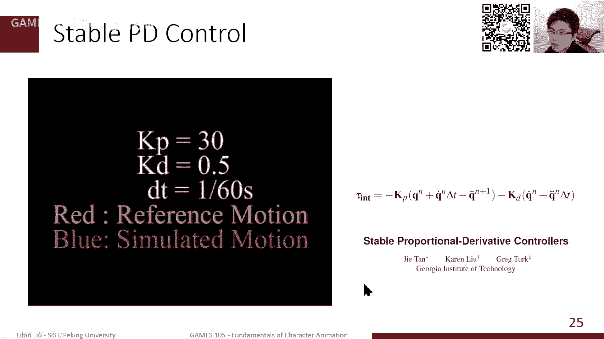

但这其实最早是这个啊，这个这这个这篇工作提出了一个方法，但本质上来说实验就是我们刚才提到。

他只是把这个这个稳定性最关键的一部分，其实后面这部分啊。

就是说我们用下一时刻的速度来计算，那这个其实就是个例子了，如果说没有这个bgan。

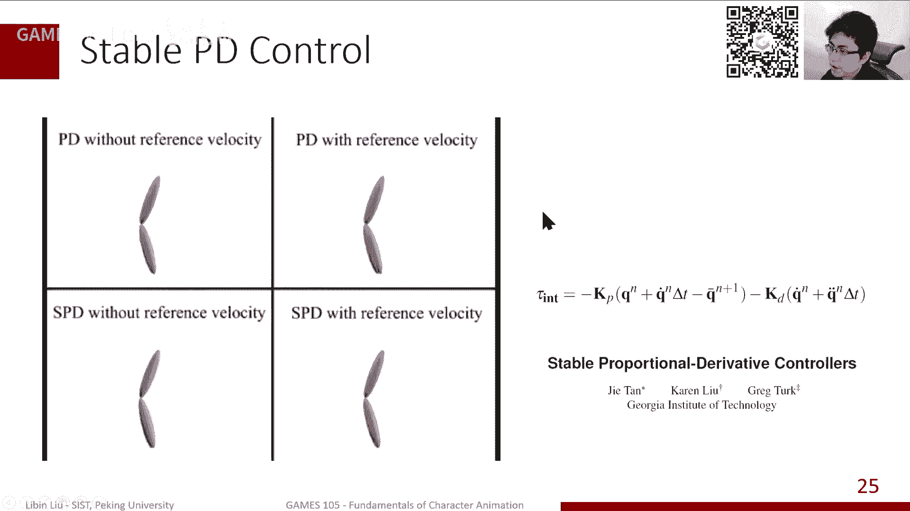

没有刚才我们这的这个情况的话，如果说有pd啊，kp比较大。

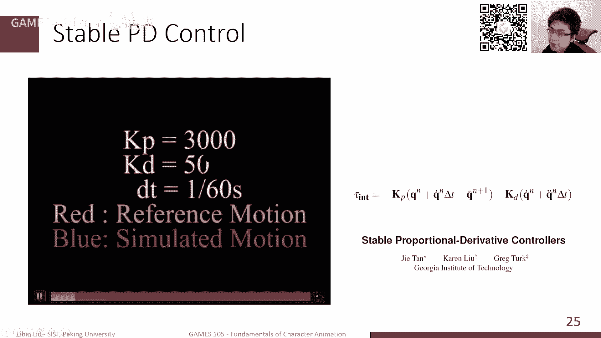

kb比较大，你可以看到这个仿真就很不稳定，这个转着转就飞掉。

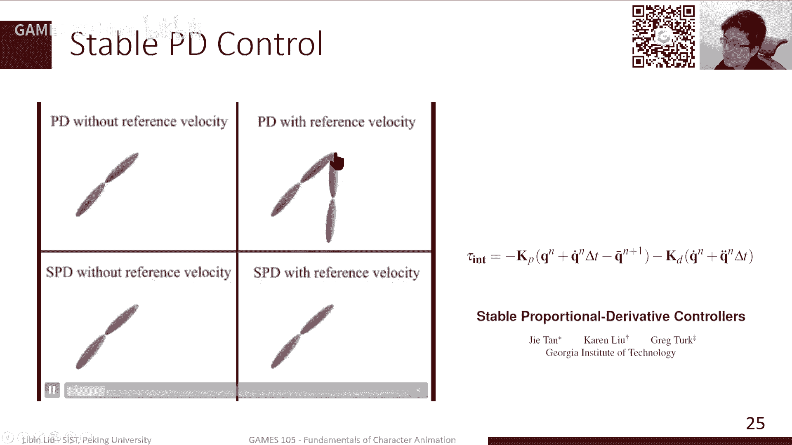

但如果说用用这个stable pd，也就是说我们就加上这个in polish的单品啊。

就是加上这个啊v n加一的计算k p，那这个仿真会相对来说稳定很多啊。

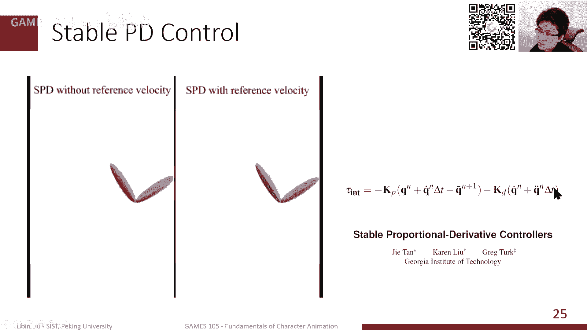

特别是在这个步长比较大的时候，其实可以看到我们其实在这种情况下。

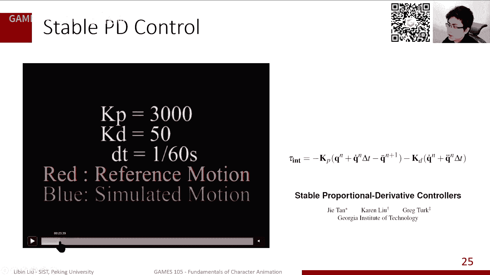

你可以用1/60的补偿啊，1/60秒，如果说不用的话，那你同样要更小一点，比如说这个简单的两个两个这个关节的物体啊，这样一个角色你可能需要一个，比如说可能1/600是稳定的，那这个需要实际去测试一下。

ok所以这是stable d，所以回到我们前面这个这个嗯我们这个例子，我们这个结论啊，就说通常来讲，如果说我们用显示的pd的话，那么可能需要很大的一个很小的一个部长啊。

就比如说可能2000 1/1000秒，1ms或者0。5ms，这样的时间不长，但如果说我们用step pd的话，相对来说会小一点，就比如说我们现在看到很多工作啊，他说诶。

我们我现在其实可以仿真在在120Hz，同时，那意味着其实我们是使用了这种stoppd的，这样的这样的做法。

ok那回答我们之前讲的，就是说我们只是简单的用pd去跟踪一个。

比如说我们把动捕数据啊，作为我们pd控制器的这个目标的轨迹啊，我们直接去跟踪，那通常来讲它是不work啊。

这个结果肯定是不对的，为什么呢，其实我们刚才也提到了，就是pd控制有两个问题。

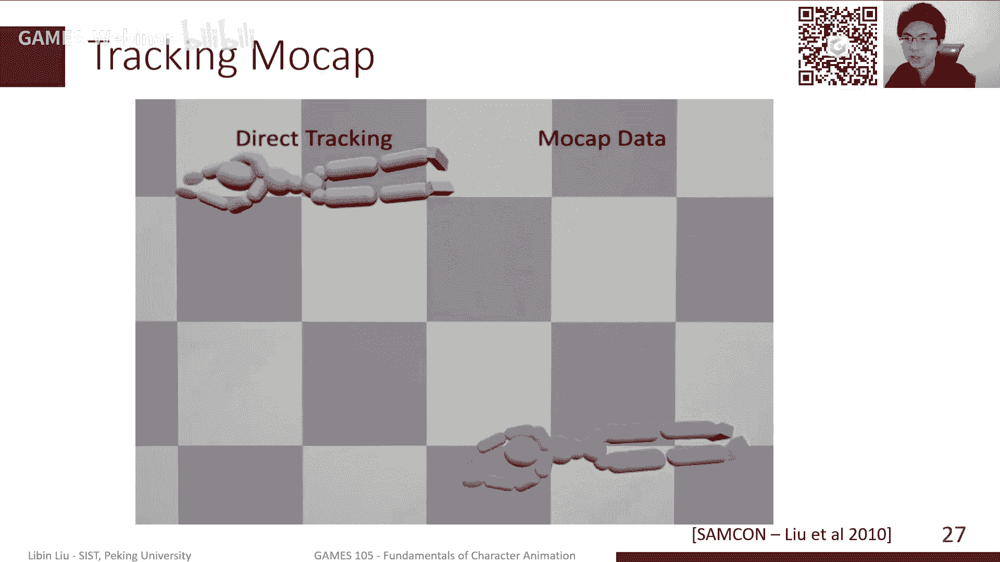

一个是那个不好意思。

一个是就是啊这个稳态误差啊。

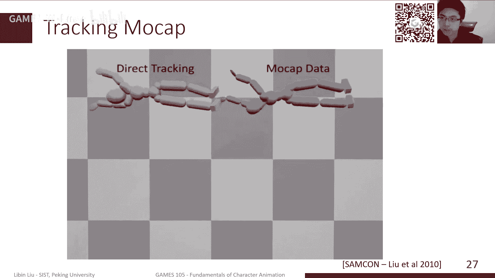

另外一个就是相位延迟，其实随时时间本质上来说，因为这个一下位的延迟，会导致我们比如说正常讲我往前走路，我需要身体和脚配合起来才不会摔倒。

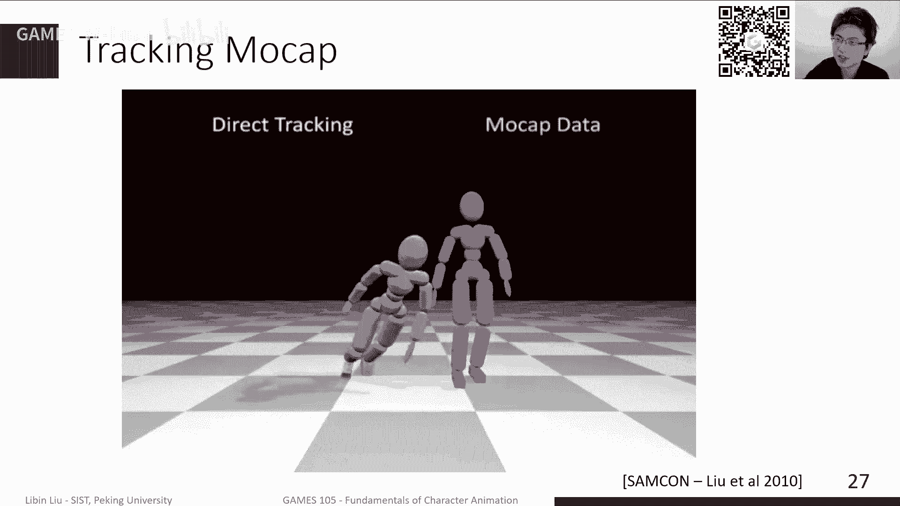

但是一旦我这个身体和脚之间有个有个延迟，那我就这个平衡就很容易失就失掉了。

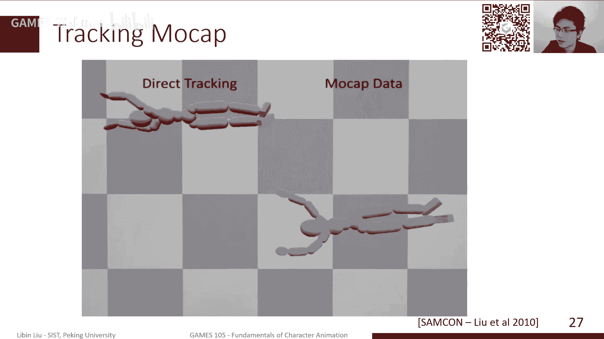

所以说就很容易就无法跟踪的很准确。

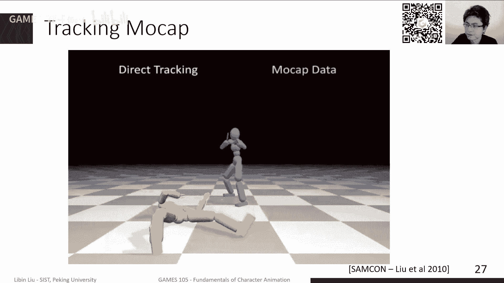

所以说我们之前讲a为了能够让它跟踪的准确，那我们在根节点上加一个力，但是这个力很大的一个问题在于什么呢，就是说我们关节的例句，我们上一个提到我们怎么加在这个角色身上的。

我们通常来讲我们是会在他的这个其中一个啊，肢体啊，一个body上加上一个力啊例句，然后在另外一个body上加上一个反向的例句，那这样两个例句，他其实是保持一个总合力为零的，这样一个状态啊。

就是说我们没有一个外来的一个一个一个力，来对它做功，但是这个根关节的这个例句，它是只是在一个关节，一个就是它根节点上，就跟的这个包上加了一个力，然后这个力是没有实例对象的。

就前面我们为什么要在另外一个body上加一个，反向的例句，是因为我们等价于认为这个例句是这个body，这个肢体啊，这个骨骼应到另外一个骨上了，那当然另外一个骨骼，要对这个骨骼有一个反作用力。

那这个根节点这里是没有反作用力的啊，所以说这个根节点它就是一个境外力啊。

就是它有一个非零的一个外力，那这个外力会带来一些特殊的效果，就是像比如说提线木偶一样啊，就是说相当于一个人撑着这个这个人的腰带啊。

趁着这个腰带，然后让它不会摔倒，但是整个动作看起来奇奇怪怪的，因为主要是因为，因为你因为大家习惯一个，这个正常真实世界中的人，他是不会有人揪着你的腰带往前走啊，就是这个这个看起来很不自然，很不自然。

所以说时间阶段的问题，就是说我们该如何去找到这么一个控制轨迹，那这个控制轨迹，我们不需要去根据点去来帮助我们。

那我们知道直接用，直接用这个动捕数据是不行的，我们刚才也提到了动捕数据，它直接就直接跟踪，会有这个跟踪不上的问题。

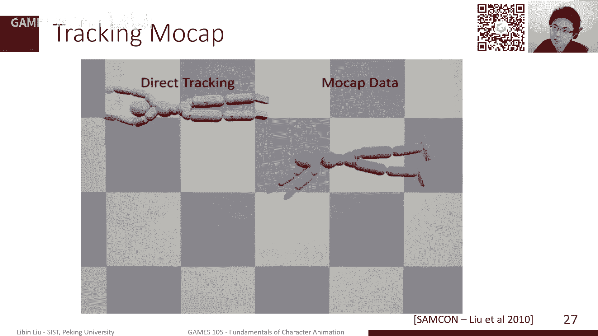

那我们该怎么去找到这么一个轨迹，让我能够跟踪上，就这个轨迹其实本质上来说是什么呢，就是说我们前面提到了。

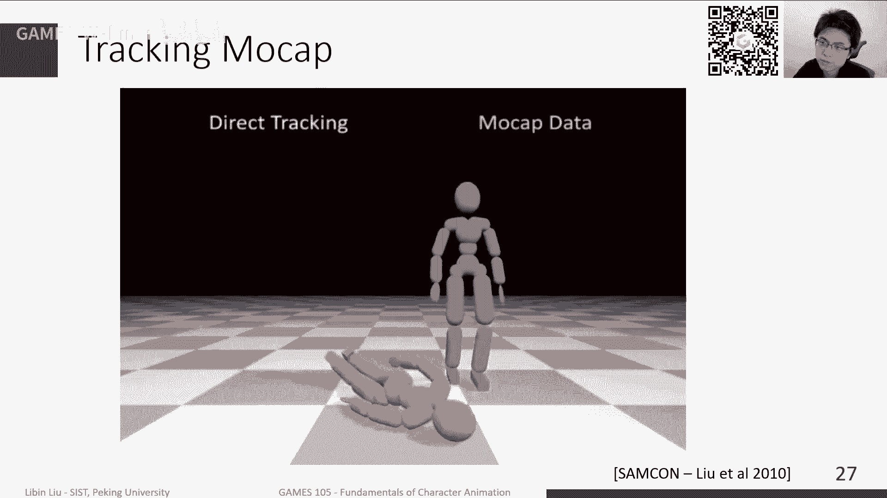

为了让一个角色的这个胳膊啊能够伸平。

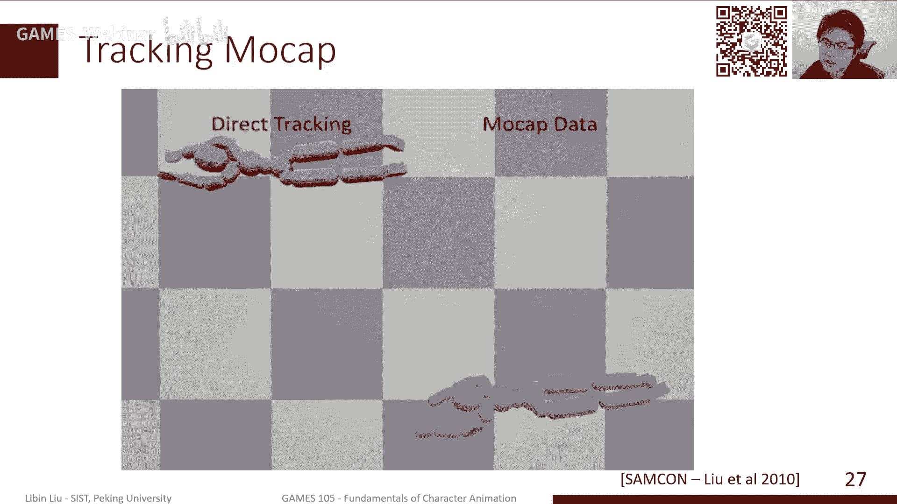

我们的目标状态，如果是正好是升平的状态的话，那我这个pd control是肯定不能让这个胳膊伸平的。

因为他总是要有一个偏差，所以为了能让能够让各位伸平，我需要把我的目标位置稍微设置的。

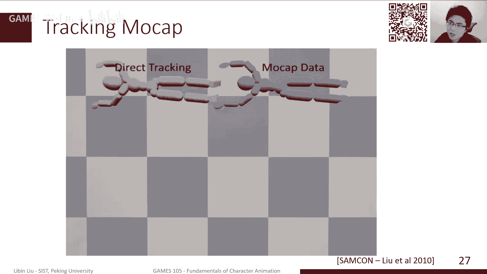

比这个伸平靠上一点，那这样的话这个误差会让我这个胳膊能够，能够保持平衡，所以实际上我们这个做轨迹的设计的时候。

其实也是同样的目标，就是说我们知道我要让这个角色，比如说看这个蓝色小人一样啊。

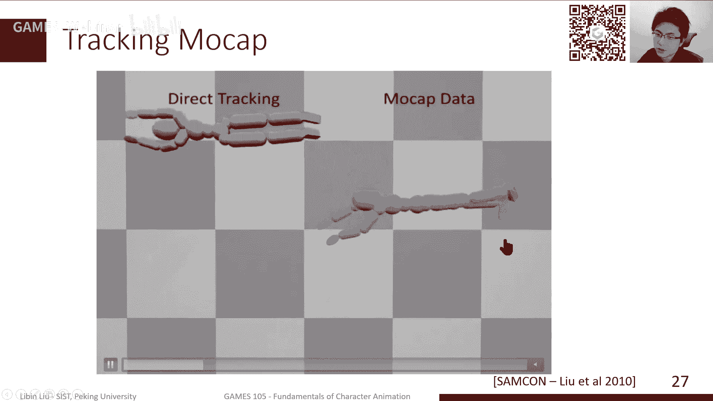

去做就去做滚动，或者去这个走路，或者坐到这个后后滚翻，那我们实际上是不能直接去跟踪，这个蓝色小人动作的。

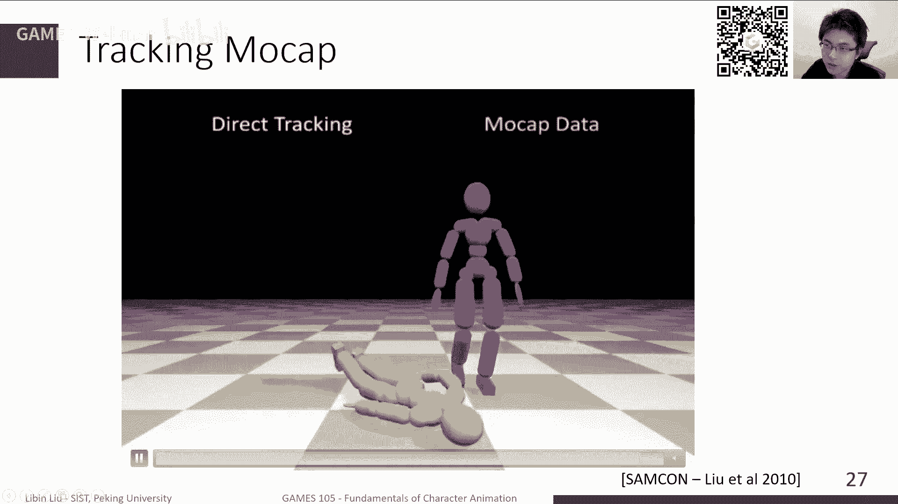

或者就在这个记录这个之上去找一个轨迹，去跟踪那个轨迹才能去生成啊。

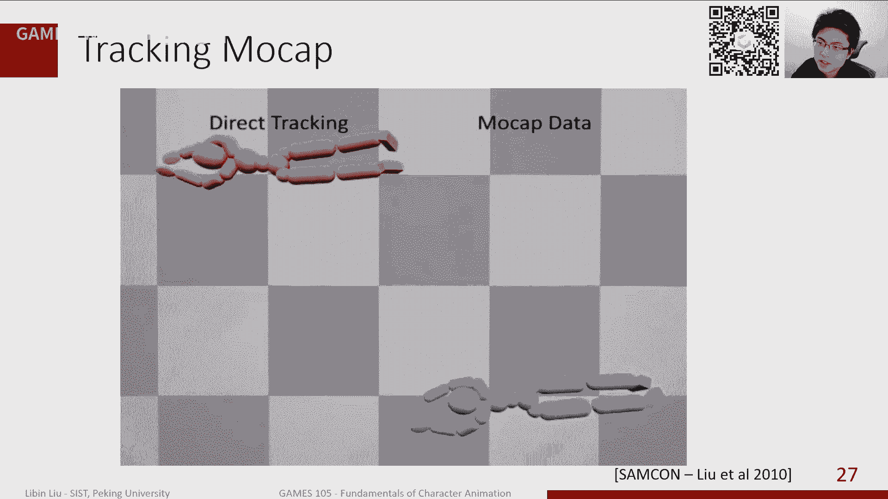

通过仿真来生成这个蓝色小人的动作。

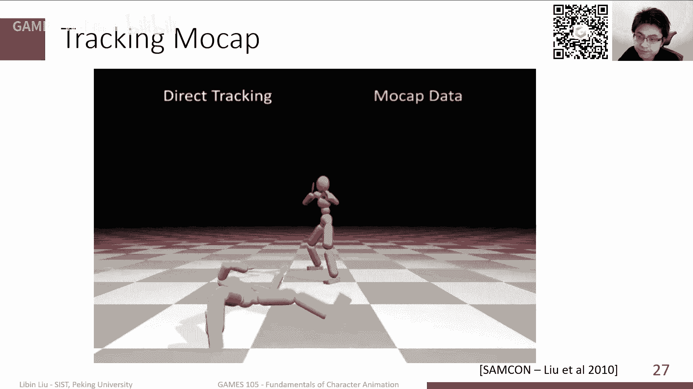

那这个过程时间就有很多种不同的方法了，我们前面也提到了，之前有个公司啊，natural motion啊，他们做了一个软件，可以自动手工去设计这样的一个轨迹，当然这个手工设计是一种方式，但是会非常困难。

但实际上我们这个我们通常来讲，还是希望能算机做些事情吧，我们就希望能够让他自己去找到这样一套轨迹，那其中一种方法，比如所谓的轨迹优化啊，但是有时候我们也会叫其他的名字。

比如叫space time constraints啊，或者space time optimization，叫时空优化，但其实本质上做的都是一样的事情，就是就是轨迹优化。

那有一句话我们可以这个比较通用的描述一下，就是说比如说我们目标是找到什么呢，我目标是优化一个仿真的轨迹啊，其实我们知道我们把时间离散化之后，那它其实就是每一个时间角色的状态，包括角色的位置，角色速度。

角色的朝向，角色的角速等等这些状态，然后呢同时我也去优化一个控制轨迹，那这个控制轨迹可以是我的target rejection，我的目标轨迹啊，有有目标轨之后呢，那我们就可以用pd控制。

来计算每一时刻的关节力矩，然后把这个关节力矩施加在这个角色之上，它会动起来，那在这个过程中呢，我们需要去让我们这个啊优化嘛，我们需要去去优化一个目标函数，那这个目标函数呢。

我们可以这个泛化的写诗写成这样一个形式啊，它包括哪两部分，一部分是我这个轨迹结束的时候，那个状态，根据这当时那个状态算的一个目标函数，然后以及根据每一时刻我加了多少力，和我加了多少。

这个这个当前的状态来算的一个标函数，然后同时呢，我们还需要在优化过程中满足一些约束，这个约束是什么呢，首先就是主要是我们的这个运动学方程的约束，因为我们知道这个仿真的或者这个角色运动。

它的状态时间是因为是根据当前的状态加上我，比如说我当时给这个角色加例句加利，它会根据这个力通过仿真得到下一步的状态，所以说这两个状态和这个力之间，其实是有一个非常固定的关系的。

那这个关系就是我的这个equation motion，就是运动系统的运动方程，那在这种情况，其实可能还有一些其他的这个约束，比如说关节约束啊，比如说一些其他的，比如说可能要求这个角色不能走到。

比如说这个这个悬崖的边上，不然你会掉下去，那当然这其实也是一个对位置的一个约束，那把所有这些放在一起，那就变成一个优化问题，那我们就通过求解这个优化问题，来得到我们所需要的这个运动轨迹。

那当然这个其实右边，这是一个比较老的一个工作了，也是这个方向的一个就是比较早的一个，属于这个就是属于奠基性的一个工作了啊，就是一些188年的这个，这个这个也是发在西瓜上的，那他做的事情就是一个。

这是那个pika皮克斯的那个那个灯泡啊，他其实目标是说哎我想我想优化一个这个灯泡，跳起来到这里，这个动作，那这里其实你的这个状态其实就是一个灯泡，每个关节的位置和每个关节的这个朝向啊，角度啊。

和这个基座的位置，然后以及它们的速度，然后呢其实我还有一些力，这个力是我这里没有画出来，我就直接是需要加在这个每个关节上的，然后能够动起来，然后通过不断的优化这些位置和这个我施加力。

最终让它生生成这样的一个动画，当然我们可以有一个再具体一点的例子，其实还是上节课我们用到这个非常简单的一个，一个杆上穿着一个物体，然后我可以在这个物体上加一个力，然后这个路由体能够抵抗重力。

然后并且在这个目标目标高度这里，随着目标高度起移动，那如果说我们也知道这个f是一个pd控制的话，那我们这pd控制在有目标位置，减掉当前的位置啊，乘以k p，然后速度乘以kd。

然后这接下来的目标就是什么呢，我想去计算一个目标轨迹啊，一个这个这个pd控制的这个目标轨迹，使得我这个在这个控制下，我的仿真结果，这个s和x和t是一个sin函数，比如说这个。

我想让我想让我的仿真结果是这个sin函数，那这个x，我的目标轨迹应该是一个什么样的东西，那这个其实就是刚才我们说的，我们可以把它写成一个非常直观的一个，优化问题，那这个优化问题里边。

首先我的目标函数是什么，我目标函数是说x n，因为我需要xn的这个轨迹，是一个是一个sin函数，那所以我其实就相当于这个三三角函数，在t n时刻的值，应该跟xn在这个时刻的值是相同的，那这个相同。

我们可以写成一个这个啊，最小二乘的这么一个啊，这这个这个平方的差的平方这样一个形式，那同时呢我们知道这里边x n和v n啊，它是要满足我们的这个运动方程的，对这个例子来说，运动方程非常简单。

其实就是我们的简单，这个啊，这个也半隐身半隐式积分的这样一个过程啊，其实就是我们的运动方程，因为力的平时我们是知道的，所以它其实是这样的一个东西，ok那通常来讲呢，我们其实除了这个两个运动方式之外呢。

我们可能还会加一些额外的约束啊，就比如说我们希望如果说没有约束的话，那其实可能这个s它会变得非常大，或者说就是有些时候，可能我们这个系统约束不够的情况下，那可能s可能有很大的自由。

他可以选择一些大的电池或者小a的值，那我们可以加额外的加一些这种这种约束量啊，比如说这个正则项，比如说我要求我这ax必须是比较接近于零的，这样的话可以让我整个的这个输出的，这个轨迹会比较平滑。

会比较这个比较正常，ok那这种情况下，其实我们其实这是一个优化问题啊，它有两个约束，那这两个约束呢在这种情况下，如果说我们写成这样的形式的话，我们等会冲上来以后，我们会把它叫做硬约束啊，什么叫硬约束呢。

就是说这个约束是必须会满足的啊，因为它是放在下面这个约束相，我们不管用哪个求解器，它是一定会尽可能的满足这样一个约束，那应该是会带来一些什么问题呢，就是它可能会让我这个问题变得比较难解。

另外封面的话可能这个问题变得不是很稳定，条件是会变差之类的问题，所以有些时候我们也会把这个硬约束呢，变成一个软约束啊，其实本质上是相当于在音乐书里边，我要求他们俩，这这个这个左边和右边必须是相等的。

但是呢在如果说若人是软约束的情况下呢，我说这两个东西尽可能相等，但是也就是说他们俩的差应该尽可能小，但是呢我允许一定程度上的不等于零啊，随时转移数，所以这两个形式其实可以互相转化的。

就是我这里w代表了我这个软约束的，这个软的程度，如果它很大的话，表示我要求这个这个x等于零，是尽可能要一定要满足，那就说明这个这个就要进行更加硬一些，那我们可以通过调节这样的这个软约束。

这个权重来平衡啊，我这个约束的满足程度，以及这个我的目标函数的这样一个程度，那通常来讲我们这样一个软约束呢，它这个方程啊，就这个优化问题求解起来更加简单一点，那另外还有一些其他的问题啊，相关的一些技巧。

就是说比如说我们这里优化了目标，这个优化目标实际上是以这个离散化的轨迹，上面每一个时刻啊，这个角色的状态，那比如说我们的仿真步长是比如说1‰秒，那我仿真一秒钟的长度，那我就需要1000个状态。

那这1000个状态，比如说每个状态两个参数，那就是那就是可能是啊这里是6000个参数，那这个那这个这个整个问题就是参数，这个参数量会非常大啊，其实也会给我们的这个优化带来很大的问题。

所以实际上还有一些其他的方法，比如说所谓的collocation methers啊，就是名字其实叫这个有点有点有点嗯，有点有点怪啊，但实际上这个想法是非常简单的，就是说我们这里有1000个参数吧。

这个6000个参数，这个这个优化的问题太难了太大了，那我们其实可以让认为可以做一些简化，比如我们知道我们认为这个x v和xn，它是满足某些预定义好的这个参数曲线的，就比如说我认为x n vn和sn 8。

就它的这个目标轨迹，他们都是来自于某一个啊三个啊，三个不同的相应的这个比如说cubic plan，我们三次样条曲线，或者来自于比如说一个一个一个多项式啊，多项式函数，那在这种情况下呢。

我们优化这6000个参数，我们可以把它简化为优化我这些曲线的参数，那通来讲这个曲线的参数，我们肯定是比我这个完整的参数要多很多啊，少少很多的，那这样的话，其实会让我的这个优化问题变得简单一点啊。

这是这个所谓的collocation methods啊，实际就是这样的一个近似，通过近似的方法来减少我的这个优化的变量啊，这是一种一种技巧，但不管哪一种方法，我们最终还是需要去优化这样一个函数。

那优化这个函数实际上就有很多方法可以用，比如常用的一类方法，就是所谓的这个gradient based approach，就是基于这个嗯梯度的理性的方法，比如说大家比较熟悉的这种梯度下降。

然后还有比如说牛顿法，或者你牛顿法，顿法里面最常用的那个l b f q s a l b f啊，sorry那个词我忘了，就这类方法其实都是挺常用的方法，而实际上对于我们这个简单的问题来说。

其实可以很我们可以看到它是什么呢，它是一个目标函数，是一个二次函数啊，是二次函数，然后约束是一个线性的等式约束，所以这个是非常简单的一个q币问题，就是二次规划问题，那这个问题其实是有有有唯一解的。

我们其实可以很容易就算出它的解，那其实如果说我们不知道它的解的话，我们其实也是可以通过我们前面提到的，比如说梯度下降，我们讲i k的时候已经讲过这个问题了，其实i k我们是可以把它给转化成一个。

优化问题，那这个优化问题，我们可以通过比如说这种qq加呃，这个迭代的这种下降方式，我们不管是用gradient descent还是用比如ccd啊，cd其实本身也是一个当然不是梯度了。

它其实还是一个迭代的一个下降方法，然后一些其他的比如说牛顿法，或者是这个这个尼牛尼罗法，你牛的法啊，像是l m法等等方方法我们都可以找到的解，就是这样一个简单的一个例子。

我们其实是可以比较容易的找到它的根的啊，找到它的一个解，而且这个解是唯一的，可以比较比较效果比较好，然后如果是更加复杂一点的，比如说一个人啊，比如说我想让这个人这个角色跑步，那回到我们前面的例子。

如果说我们直接跟踪一个目标轨迹的啊，动补轨迹的话，那动捕动作的话，那它是跑不起来的，所以说我们通常需要在这个动物鬼把这个洞补，作为英国的这个初始解，然后用优化的方式去找到一个合理的，这个控制轨迹。

控制轨迹能够让这个角色能够跑起来，那这个过程中呢这个目标函数啊，其实写起来也比较简单，其实就是说我当前的仿真的状态，跟我的这个目标的这个轨迹之间做一个偏，做一个差，那这个差我们可以用什么方式衡量呢。

啊好多种不同方法，比如说我们可以算一下，两个pose之间的角度的偏差，那这是一种方式，还有一种其他的方式呢，比如说我算一算关节的，每个关节的全局的绝对位置，那这个位置它之间有个偏差。

我可以用它来计算这两个姿势之间的，这个这个误差，那看到还有一些其他的，比如说我们可能需要考虑一些，比如说角的啊，比如说每个关节的速度啊，比如说这个这个角色至新的相对关系啊。

那其实都是可以做我们的这个轨迹，优化的目标的，但是呢对于一个人来说，对于这个全身的一个复杂的一个角色来说呢，当我们定义了这样的一个优化方程之后，我们会发现，因为这个首先这个角色我们优化目标。

最终是它的姿态啊，它的这个关节的旋转，关节的旋转，我们知道它就是一个非线性的东西，另外呢整个这个问题这个角色的自由度啊，他身上这个关键的数量，它的参数都是非常高的，所以说如果说我们把这个函数啊。

就是这个优化目标函数的这个曲线，其实这时候就应该高于一个高维曲面了，这样一个曲面如果说我们把它画出来的话，你会发现它是一个非常非常非线性的高度，非线性，并且这个其实是。

甚至于这个曲面本身都是在不停的震荡的，这样一个状态，它有无穷多的这个局部最优解，那这种情况下呢，我们会发现，首先我们想要去计算它的gradient，通常来讲。

这个gradient是这个它的这个质量是比较差的，因为它总是离哪个，它总是指向某一个局部最优解，但是这个局部自由也就特别多，所以你接下来说这grading指向的方向，很有可能是不太对的，另外一方面呢。

很多时候我们的仿真啊，我们先是一个黑盒子，黑盒子意味着什么呢，意味着我们前面那个公式里边，其实这里其实是我们整个系统的，它的这个这个这个系统系统函数啊，系统system dynamics。

这是一个问我们知道的，但是对于一般系统，比如说一个机器人，它怎么动，我们很多时候是无法准确的去建模的，就比如说我们前面提到了一个最基本的问题，碰撞我们该怎么建模啊，这个其实就是一个很难的问题了。

比如说一个一个球球掉在地上，他该弹多高，那这种情况下我们其实很难，就是这个碰撞模型，很多都是一个非常非常粗略的近似，然后另外一个比如说我这个是系人，他他比如说我手人的手，人的手是软的。

我用人的这个软这个手去捏一个笔，比如说我捏起了一支笔，那这个其实是非常容易，它这个软的会会带来非常非常稳定的，这样一个接触点，但如果说我们仿真的角色里边这个手是硬的，你可以想象我用这个硬的笔。

或者你可以想象我用筷子夹这个笔，它会非常难的，但是这个这种男的这种这种情况下，他又跟我真实的这个人，这个捏这个笔这个过程又是完全不一样了，其实很多时候我们是很难去准确的去建模，我们这个角色啊。

他的这个整个运动过程，但是没有建模的情况下呢，那我们其实也没法算它的这个梯度啊，它是gradient，因为模型我都不知道我该怎么算梯度，所以这其实也是这种gradient base。

就是我们基于梯度方法的局限性，因为它必须要一个梯度嘛，但是很多时候梯度是我没法算，其实很多时候我们在这个角色动画里面，就是当我们需要去做古籍化的时候，其实也不一定，不过不光是角色动画。

其实很多这种就是控制领域也都同样的问题，就我们需要去做古籍化的时候，我们就会碰到这样的一个非常差的这么一个啊，这么一个这个所谓的landscape，就是这个优化函数。

那我们这个gradient board的话呢，我们就是希望能找到一些这种不需要gradient，derivative frame，optimization methods啊，这我们不需要梯度的方法。

那不想提的方法，通常来讲是一些所谓的启发式的方法，或者是基于这个随机这个随机的方法，或者基于采样的方法，就他们是通过什么呢，他们是通过若干样本点的信息来去更新，我最最最价值的一个估计，当然好处是什么呢。

好处是不需要这个梯度，坏处是什么呢，坏处是这个因为不需要梯度，所以我很难，一方面很慢，我只能估计嘛，所以估计的过程就是就是比我直接用函数算，要慢的，另外一方也不是很精确啊，所以总是有些有些优缺点。

然后通常来讲我们这是简单的写的，就这一类的方法大概都是这样的一个流程，就是目标是什么，目标是我找到一个函数，一个变量x，它能够让我的某一个目标函数最小化，那在这个过程中呢。

首先我需要用某种方式去有一个初步的估计啊，但这个估计比如说对于我们这个跟踪来说，比如说想要一个角色就跟踪一个动捕数据，那其实动捕数据本身就可以作为这样一个初始，初始的这样一个估计。

那接下来是一个迭代过程，那这个迭代过程首先我从根据当前的这个估计，我去这个生成一些样本点，然后呢，再对每一个样本点上去计算我的一个目标函数，那我可以计算计算出来每个样本点上，这个函数的值。

然后呢我再根据每一个函数的值，哎我再去更新我的x的估计啊，当然这个只是一个框架，是这样子，但实际这个细节上不能方法会会区别比较大，那当然很多很多相关的方法了，比如说贝斯优化啊，比如说这个这个遗传算法啊。

就是这个这个这个叫叫进化算法，然后像比如说我们之前的这个，在机器里非常常用的这种随机梯度下降，其实本质上也是一类方法，有些其他的，比如说基于采样的方法等等，当然这里我们只介绍两种啊。

比较也算是效果比较好的方法，其中一种就是所谓的这个c m e s啊，这个这个covious mission expectation，evolutionary strategy，它其实还是一个进化算法啊。

就是他就是其实本质上还是我们刚才说的，就是我撒一些点，然后根据一些点来更新，我的这个我对最优最优质的估计，那当然对于c m e s来说，它其实是把这个撒点的过程啊，就是就是估计的过程，估计这个点啊。

所以所以有几日的过程，我把它转化成一个估计啊，一个高斯分布的这样一个过程啊，就是说我是假设，我是假设呢就说我的点，每次我需要采一些样样本点，然后然后根据这些样本点去更新我的这个估计，那这些样本点呢。

我是总是从一个高斯分布里边啊，这个就是高斯就是正态分布啊，一个高维的一个正态分布里边去踩这些点，所以说整个这个过程就是说，我首先初始化一个高斯分布，高斯分布可能就是一个圆形的一个分布。

然后接下来呢我比如说我踩100个点啊，撒100个点，然后我对每一个点去计算一下，我的目标函数的值，当然还是这里提到，就是说我们前面也提到目标函数是什么，目标函数是一个在每一个状态下。

它的这个函数的值是求和，所以时间本质上来说对这个函数进行求值，我其实相当于什么，相当于做了一个仿真啊，仿真生成了一个比如几秒钟的一个轨迹，然后在这个轨迹的这个上面，我算了一下我的这个函数值。

比如我根据我需要，它这个轨迹跟我的这个某个参考动作相近，或者比如说这个轨迹里边我要求比如踢球，我要你这个脚必须碰到球的上面，那可能有一个一个一个目标函数来做这件事情，那得到这些轨迹之后呢。

我可以算出每一个点，每一个参数，每一个x所对应的这个参数值，然后c m c m e s做的事情，就说我我对这个参数值做一个排序，有些这个参数这个这个app比较小，也是比较大的，那我其实知道这个比较是。

因为我目标是最小化这个f嘛，所以说我就是从最小往上找，我保留n个，但这n其实是一个可以算的一个参数，比如我才100个，那我可能从里边只从里面拿，比如说20个啊作为更新的这个点。

然后接下来呢我更新我这个高斯分布的mu啊，就平均值和西格玛就是我的这个方差，然后呢去然后接下来下一步的时候，我就从这个更新之后的这个高层布里面去采样，所以整点u c m s它的过程大概是这个样子啊。

就是说这个我开始是一个圆形的高斯，正一个初始化的高斯分布，然后你会发现有个有些点，它会非常相对来说比较小啊，力气比较短，比较大，它会逐渐的向比较小这个方形移动，而在移动的过程中。

开始的时候它的这个方差会逐渐增大，然后这个代表了，其实我在正在去向外去去探索更小的方向，然后呢，当然后当我这个方向逐渐集中了之后呢，这个方差异会逐渐变小，最后收敛到这个最优解附近啊。

这是cm e s这样一个特点，当然这种方法的好处是什么呢，就是首先它是一个比较稳定的方法，就是相对来说这个对一些很复杂的函数呢，这个实际效果也是蛮好的，另外方面就是确实它也是一个没有基啊。

dirty free，就是就是不是基于这个梯度的方法啊，所以说如果哪怕是非常复杂的这个系统啊，或者这个黑盒子系统，我们也可以直接把它应用起来，但是之前有一些工作。

比如说这是一个呃这是那个09年的一个工作，那这个其实他做的事情是什么呢，就是说我给出一些就是比如人走路嘛，你总是左右脚左脚着地，右脚着地，我可以给出一些预测的这个落地点的位置。

然后接下来呢我靠着轨迹优化啊，去找到能够满足每次落地点的这样的一个，走路的这样一个形态，所以首先这个效果还是蛮好的，就是说比如我开始就给左右左右左右，随便给一些这样的一个位置。

它可以根据这些位置生成一个走路，而实际上如果说我这给的位置的这个距离，还有这个这个速度有不同的话呢，其实他这走路的姿态也会不同，而且甚至yes，sorry，不好意思，而实际上如果说我们的这个角色的这个。

比如说这个关键的数量不一样，那它它不像真人一样，那这种方法上，其实也是能够找到一个比较合理的，这个走走路的这样的一个过程，那另外还有一些其他的工作，就比如说我们刚才那个方法实际上是做什么的。

他是同时去优化我的仿真的轨迹，以及我的控制变量，那实际上我们知道pd control，如果说我们只是把，就如果说我们认为这个嗯，就是这里边最这个需要去控制量。

其实就是我们的目标轨迹，当我们给中目标轨迹之后，剩下的部分其实是仿真，直接直接可以得到。

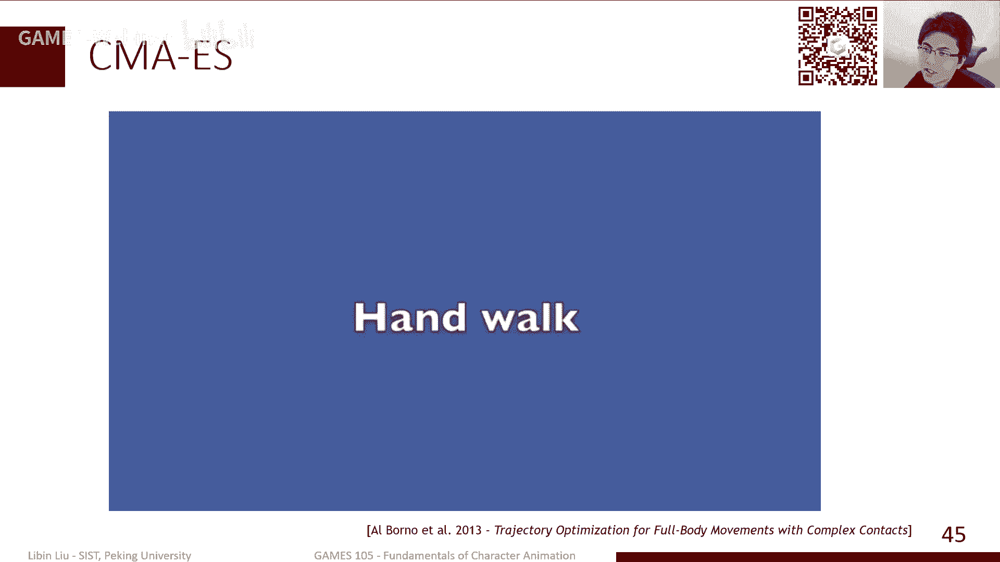

所以实际上另外一方另一另外一种方法，就是我们只去优化这个仿真轨迹，而不是去优化我的这个，这个只只去优化这个pd的这个目标轨迹，而不需要去优化我们的这个仿真轨迹，仿真轨迹我们可以直接通过仿真来实现。

所以这种方法其实也是可以得到一些控制的啊，就是比如这也是一个一些方法，我们可以做一通过一些非常简单的目标，比如说我就想让这个角色绞尽可能提高，然后是同时身体身体有一个旋转，那它就可能生成这样的一个。

比如这种这种街舞一样的动作，那这其实也是3m e加上我们的这个仿真控制，能够啊，加上我们这轨迹化能够实现的效果，那除此之外呢，还有一些其他的方法，就比如说c m c m e s做一个非常特点。

就是说每次我打一个这个给出一个样板参数，我们都需要做若干个这个从头到尾做一下仿真，然后呢再去更新这个参数，那这个整个过程其实是比较漫长的，而且另外一方面呢，其实如果说我们这个仿真的轨迹比较长。

实际上它会带来更多的啊，这个局部最优解，就是让我的仿真的目标函数变得更加，难难难收敛，所以之前还有一些其他的方法，比如说sam港啊，这其实我们在10年前这个提出的一类方法，他主要是说我们它主要就是说。

如果说我们有一个动捕数据啊，我们需要去找到这么一个目标轨迹，然后我们能够跟踪这个魔鬼目标轨迹，还原那个动捕数据，就是解决这样一个问题，其实本质上跟前面3m s，那个优化问题是相同的。

但是跟那个三vs不同点在于什么呢，就是说每次我们做采样，我们只考虑下一帧，就是我们每次只是优化一步，然后通过这一步来决定，我们后面该去怎么去更新我们的这个这个状态。

我们我们这个这个这个轨迹的拖着轨迹的值，当然这个其实本质上是一个sequence，圣母这个系列蒙特卡拉蒙特卡罗方法，就这个方法一个特点是什么呢，就是我可以从一些初始状态开始，我采一些若干个样本点。

然后向这个页面点击仿真，仿真完之后呢，我们其实像是像c m e s一样，我们可能只是从这一仿真之后的结构里面，拿出一小部分样板点作为新的出发点，然后再去采更多的样本，然后依次这样类推。

直到我们把整个这个踩完，但对于我们现在这个具体的例子来说，就比如说这是一个动捕数据啊，这是我们需要去跟踪的一个轨迹，也许是比如说这个动画师建的一段动作啊，也许是一些其他的一些控制。

然后这里我们有一个初始初始的一个状态，比如这个人往前走，那肯定他是从一个站着的状态开始，我们知道这个本来如果说我们直接用pd控制，去跟踪这个轨迹，那么他肯定是博尔啊，他肯定是会偏差比较大的。

然后呢为了能够跟踪的比较准确，我们实际上是需要在这个轨迹上去加一个偏离，然后跟踪一下那个加了偏移之后的轨迹，那么它就更应该就会有一部分，会跟这个轨迹比较接近了啊，这是一个基本这样一个优化目标。

但这个优化过程呢，就是说我们其实还是把这个轨迹给分割开啊，我每次只是优化一小段，然后在这个小段里边，我们要求是什么呢，就是说我们可以因为我们前面提到，我们是需要在这个轨迹之上加一个偏移。

然后跟踪这个偏移之后的轨迹啊，来来产生这个优化这个仿真轨迹，那这个我们可以这个偏移，因为我们不知道嘛，所以说我们可以在一个根据一个高斯分布，去对这个偏移进行采样啊，当然这个不一定是高斯本布隆。

其实也可以用一些其他的，比如说这种这种这种这个均匀分布，其实也是可以的，在采样之后呢，其实我就采，比如说采1000个样本，那每个样本都对应了一个偏移啊，对这个原来这个动作，这样一个动轨迹的一个偏移。

然后接下来呢我对这个每一个偏移量，我都可以去做一次仿真，诶，不好意思，那一每对于每一个片段，让我反正之后的结果它会生成一个新的状态啊，那这个状态其实有一些呢，会跟我们的这个轨迹比较近。

另外一些呢可能跟我的轨迹比较远，那我们其实可以保留一些跟这个轨迹比较近的，那当然我们不会只保留一个，因为只保留一个会有什么问题呢，这一个可能是一个局部最优解，局部最优解可能会在后面的。

后面的这个仿真过程中，会变成一个非常差的一个一个解，所以说我们可以多保存一些，比如保存这个一，比如1000个，我们可能比如保存100个点，那作为你这100个点，会作为下一个阶段的起始状态。

那接下来呢其实我们还是产生若干个样本啊，比如也是1000个，然后这1000个里边都是就是会随机的，从这个我们上一次保留下来这个起始点出发啊，去做进一步的仿真，然后同样的这些仿真。

有一部分离这个轨迹比较近啊，有一部分比较远，我们这远的就是失败了，我们就不再留他了，然后我们只是留一下比较近的那一次，可以可以不断的这样进行下去，我们最终会找到一个一组轨迹，那这组轨迹里边有相当一部分。

会离这个这个目标轨迹比较近，那我们就可以把这里边最接近的那个找出来，那这个其实就是我们最终的这个解，但这个过程时间本质上是什么呢，本质上来说就是虽然说我们只考虑了一步啊，这可能是一个非常局部的一个问题。

就是非常local，非常容易陷入局部最优解，但是因为我们通过保留多个state，在多个这个状态，可以一定程度上让我们就每一个点，每一个局，每一个这个局部自由点，都会这个延迟到后面若干步之后。

再去判断这个绝对数学界是不是真的最优解啊，通过这种方式的话，其实也是说让我们这个每一步的判断，能够更加的这个这个不不局限于当前这个局部，其实也是让我们稍微这个啊优化过程，会更加的这个嗯更加的有效率一点。

那当然这就是一些这个这种方法的结果了。

其实也是就是说，首先我们可以很容易对任何一个动作，只要我们有他的这个动捕数据，那我们基本是肯定可以找到一个控制轨迹，能够还原这个动捕数据的。

那另外其实在这个过程中呢，我们其实可以做些什么事情呢，我们可以把这个环境做一些变化。

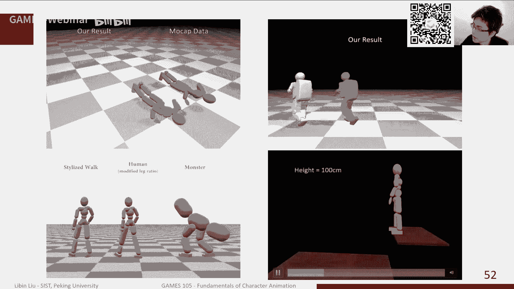

比如说这个比，或者把这个这个角色本身做一些变化，我们前面提到了什么问题，就是这个retargeting，当我们需要把一个动作去，把它重归向另外一个动作，觉得这样的时候，我们会不可避免出现什么呢。

比如说穿模，比如说这个角色跟d跟这个环境会有一些碰撞，会有一些接触，那这些问题的话，我们可以在这个优化的过程中呢，而且会产生一些，比如这地上有一些鹅卵石或者一个冰面。

那个角色就会自动的会受到这个环境的影响，而产生一些动作的变化啊。

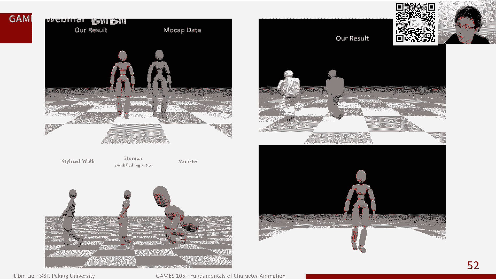

这其实是整个这种方法可以得到的一些效果，那当然这种方法其实本质上是什么呢，就是我们最终得到的是一个啊face forward control啊，叫前馈控制，或者说叫开环控制，什么意思呢。

就是我们前面得到的其实就是一个控制轨迹，这个控制轨迹呢我们用pd control，用这个pd控制去跟踪这个轨迹，它会得到一个仿真轨迹，这是我的这个目标，但是这个过程中呢，我们必须要求这个跟踪过程里边。

我的起始状态，或者说仿真过程中的每一个状态，都是在我获取这个轨迹过程中能够得到的状态，你的意思是什么呢，比如说在一开始的时候，我对这个角色加了一些扰动，比如说我推了这个角色一把。

那如果说我们继续跟踪原来这个轨迹的话，你会发现这个角色他很快就会摔倒了，就会这个状态就会偏离很远，所以这是前馈控制的一个一个很大的问题，但为了能够解决这个问题呢，我们还是需要去引入所谓的反馈控制。

反应控制做的是什么呢，就是我们每一时刻会有一个反馈的一个，一个策略，这个策略它会自动的根据当前的状态，比如说我经过一些扰动之后，这个从s0 变成了s1 ，那它会根据s一跟s0 之间这个偏差。

这个片场它会自动计算出一个更新啊，就更正就在原来轨迹上加了一个更正，然后这个更正加到原来轨迹上之后，我再用pd control跟踪它，那这样的话，这个s机会越跑越远了，它其实会，我会希望他会回到这个。

原来我们目标的轨迹附近，但是它不会完全的精确地回到这个这个轨迹上，他总是会在附近，那这样的话，我们可以每一步都会有相应的这个反馈策略，来去加上去，那可以保证，虽然说我不跟跟原来标轨迹是不重合的。

但是我在整个访谈过程中，他都是跟这个目标轨迹啊，在这目标可以附近啊，不会离得很远啊，这是我反馈控制能够实现的一些效果，当然如果说我这个比如说一个跟踪控制之上，加上加上反馈了，那这个角色比如说可以推他啊。

他其实可以看到这个动作，他其实会受到相当的影响啊，但是最终这个啊角色还是可以保持平衡的，单质只是反馈控制的一个基本概念啊，那我们该怎么去实现这个反馈控制，我们今天这期只讲一个非常简单的一个例子。

就是所谓的这个静态平衡，我们知道这个pd control，嗯实际上节课我也举的这个例子，就是说比如说我让pd control的目标是一个pose，一个t pose，比如说那这种情况下。

其实这个peoples本身是没有任何平衡控制的，就是一个pose，那如果说我直接做这个，比如说他其实会比rog好一点，rag out是完全没有控制，这个人就瘫在一起了，但是在这种情况下呢。

比如说我就跟踪一个单一的姿势，跟这个单一的知识姿势呢，你会发现这个角色他虽然没有，他虽然能撑住自己保持这个姿势，但是它会逐渐的摔倒，对这是就是说我们其实是缺少了一个反馈控制。

能够在他将要摔倒的时候把它给更正回来，那我们继续下，那我目标是什么呢，就是说所谓的static balance，我们其实讲的是什么，就是在我不发生移动的情况下，就比如说我这个脚是原地站着。

站在那里的时候，我可以通行通过一些非常简单的这个控制策略，让这个角色呢，比如说让它左右稍微摇晃一晃，或者说在这个我可以推它一下，让它发生这些扰动，但它不会摔倒，甚至我可以让这个角色。

比如做一些什么原地下蹲啊，或者原地的这个这个晃晃肩啊，这种动作，然后能保证不摔倒啊，这其实是一个static控制，但这个其实是一个非常基础的控制，就是在这个之上，我们其实可以可以做一些很fancy的。

一些一些一些效果，那这里其实一个最基本要有问题，就说怎么什么是平衡，或者说什么是static平衡啊，其实我们可以想象一下，比如说这是一个立方体啊，不是这是一个一个圆柱体，一个是墩子，然后把它放在地上。

我们可以想象它非常稳定啊，怎么推它都是都都，就是我们只是一般就推一般的去推，他的话是推不倒的啊，甚至你把它稍微推起一点来，他也会在自重的作用下又回到这样一个状态，那我们其实可以站，为什么它要平衡呢。

其实可以看到它这个首先这个物体啊，它有一个质心啊重心，然后这个重心在地面上有个投影，ok然后呢整个这个圆柱体啊，它在地面上就是它底面是一个圆嘛，这个圆实际上我们可以把它叫support polygon。

就是支撑面，人们会发现这个角这个固体它的重心在地面上，投影，是在这个支撑面内部中心的，而实际上我们是可以知道可以比较容易的，这样有这样的一个感觉，就是说只要我的这个3d max，就是首先这个物体。

如果是一个基本一个一个准静状态啊，就是基本不动的一个状态，没有速度，在没有速度的情况下呢，我的set of max又在我的至亲子polygon，就是我的支撑面之内，那这个物体就是稳定的啊。

就哪怕他抬起一点，我也会把他拉回来，落在这个中间，那对于人来说其实也是类似的，比如说人，比如我人站在这里，那人其实也有智心，那中心那中心怎么算啊，其实我们一直没讲，但其实这个重心这个概念也是比较简单的。

因为这个每一个钢铁的重心，我们知道它是每一个小的这个质点的质量，乘以位置，然后然后然后再除以总质量啊，得到他这个缸体的直接对人来说也是一样的，我就相当于每一个缸体啊，每一个肢体它的重量。

它的质量乘以它的位置，然后再除以整个人的质量，就相当于就是我我对他的位置用啊，加上用质量来做一个加权平均，得到的位置就是重心，ok那这个人其实我的重心我站在那里的时候，实际上我的重心在地面上。

也是有这样的一个投影，然后在这个过程中，比如我两个角很平稳的站在地上，那这个两个角之间构成了一个立方体啊，平一个一个多面体，一个平面，那这个多面体啊，就是所谓的我的这个支撑平面啊，就比如两个脚站在地上。

它是非常稳定的，就是这两个角的脚面，然后呢连这个凸包啊，其实构成了一个支撑平面，然后当我保持平衡的时候呢，我只需要保证我这个3d max，我至今它的投影始终在这个支撑平面内部，那这个角色就不会摔。

他就没有处于这个正在摔倒状态，或者他就不会摔倒，所以说为了实现这样一个static balance，就是一个静态平衡，所谓静态平衡是什么呢，就是这个角色不动或者说动这个运动非常小。

就是速度很慢的时候得到这样一个静态平衡，那这个静态平衡我们该怎么实现呢，就是说首先我是需要跟踪一个静态的平衡的，这样的一个姿势啊，比如说确实就是这样一个姿势，这个人站在那里两个角。

两个角这个水平就是非常立立正一样啊，站在地面上，那这样的姿态本身它是一个，我们其实人感觉一下它应该是平衡的，它不是一个单腿，比如单腿站立的姿势，感觉就是不平衡的，那个就很难去实现这样一个静态平衡。

其实主要音也是因为单独站立的时候，你的这个support polygm就只有一只脚那么大，所以说你要想让你的重心始终在这个support，polygon的这个上面，相对来说会比两个角扎的时候要难很多。

就两个脚站立的时候，它是两个角中间的这个图包，他其实比一只脚大很多的，所以说你控制起来更加容易，比如首先我需要跟踪一个比较稳定的这样一个，自然站立的姿势，除此之外呢。

我还是希望去调整实时的调整我身体的控制好，使得我的这个质心在水平面的这个投影，始终是在这个sport polygon啊，就这个支撑平面的中间啊，这是我的目标啊，通过这种方式的话。

我们其实就可以保持平衡了，那这其实我们还是就是，在我不知道该怎么办的时候，其实最简单的方法就是拿一个pd控制，来来来干这件事情，就比如说我们可以用pd控制的方式，去计算一个反馈的例句。

就是说首先我们有一个例，就这个角色本身他需要保持这个姿势，我们已经有一个例句了，这就是pd控制去跟踪这个姿势得到力矩，然后在这个列举之上，我还在一些关节上加上额外的一个例句。

那这个例句的目标是去保证我的这个智心，始终是跟我的一个目标的执行位置比较接近，那当这个目标的执行位置，实际上我们通常来讲，可以把它认为就是这个ort polygon啊，就是这个支撑平面的中间。

或者说再简单一点，我其实就是两个角，两个角中心的连线的那个中间，那就是我的我的知心需要保持的位置啊，这可是也是一种近似，那pd控制就可以这么实现了，首先是一个目标目标位置啊，就是ort polygon。

就是支撑平面的中心，剪掉当前最新的这个投影位置，然后做一个比例系数，然后呢减掉我知心的速度啊，执行速度是什么，就是每一个关节啊，每个肢体，每个body它的速度用质量去加强平均啊，那这个东西得到了一个十。

我认为是一个例句，那这个例句该加在哪里呢，实际上来说啊，除了除了除了我们前期目标之外呢，我们其实还有两个重要的参数，就是kb和kd了，就是这个pd control的这个参数啊，当这两个参数呢。

我们其实通常来讲也只能通过首调的方式，就是或者就是这种方式，就是很多时候你需要多尝试几个手工，去尝试几个值就可以得到比较好的，因为这个相对来说这个控制还是比较简单的，那当然这个计算这个例句之后呢。

我们需要把它去加在一些关节上，那常用来说我们是可以把它夹在这个踝关节上，就夹在这个脚后跟上，是一种思路，或者也可以加在我的这个髋关节上，也是一种思路，其实大家可以想象一下，比如说你站在平面上。

我就是保持平衡，我稍微让自身身体向后倾斜一下，你会感受一下你到底是哪里来的，用力，基本来说是脚踝或者是这个hip，就是你的这个大腿根这个关节在用力，所以其实也是这样的思路。

就是你可能就是加一个就可以不用，不需要两个都讲，然后另外呢就是比如说我有两个hips，或者两个uncle，那时间那个套可以是两个，根据两个不算的，是可以采可以采用不同的参数啊，这也没有问题。

当然实际上这个区别可能不是很大，所以这是一种方式，就是通过这种方式的话，我们可以很简单的实现一个static balance，就是一个pd控制单柱子，这边还有一些其他的方法。

那这里我们其实稍微再多讲一个，多介绍一个控制策略，就是所谓的这个雅克比啊，这个这个转制这coin transpose很重要啊，感觉这个名字很熟悉啊，我们当时讲i k的时候，有一个方法。

就是就是就是就是jacoin transpose啊，还可实际上本质上，这两个东西是有非常大的联系的，就比如说我们这样有这样的例子，比如说这个人站在这里，然后我想我在这个手上加了一个力f。

ok然后呢就说我是当然这个app我没有真的加，我，就只是说这个，如果说如果说我要在这里加一个力的话，那这个力其实会让我这胳膊向上移动对吧，那这个向上移动我们可以等价的，等价的通过什么实现呢，等价的时候。

我这个向上移动这个过程，我可以反过来是通过我这个每个关节进行例举，加一个力矩，让它旋转，产生一个向上移动的这样的一个动作，o然后接下来的问题就是说，如果说我想让这些关键例句啊。

这个和我加一些合适的关键例句，它能够产生一个动作，那这个动作呢刚好跟我等价的，跟我在这个手手指上加一个力，产生动作相同，那这个是这个那这个这种计算啊，就这时候得到的这个套啊。

其实就是这个我们其实本质上是展开分差错，更重要就是这个jacky transports control的这个目标，其实就是计算这位这么一套，能够完成这个等价的这个这个力的效果，那当然这里特别要注意的。

就是说，我们是要用套用关键例句来等价的实现一个力，但这个力并没有真的加在这个物体这个肢体上，它只是说我们想要实现这么一个力的效果，所以这个力通常也叫water false，也就虚力啊。

就是他没有真的加上去，它就只是这个我们目标是要实现它的效果，那这个效果该怎么定义呢，我们通常来讲是说我们我们想要这个效果，我们可以通过做功来进行定义来进行衡量，也就是说我想让比如说我加了一个套。

加一些关键例句，我是希望这些关键例举所做的功啊，跟这个力这个虚拟的力他会做的功，他可能会做的功相同，或者再进一遍，其实我们其实更加考虑一个顺带的一个状态吧，所以实际上是要求是这两个力，一个是虚拟的力。

一个是真实的这个关节力矩，我要他们俩就这个真实的关键例举，他做的功的功率，跟这个我要目标要实现这个力的功率，应该是相同的，那这是我的这个计算目标，那功率是什么呢，功率其实是这个力乘以速度啊。

其实力点乘速度是一个转置乘以这个速度向量，这样一个形式，那这个这个地址来说，实际上是这个力矩的转置乘以这个角度的变化，得到功率，那接下来呢，其实这个因为我这个力是加在一个点上的。

那这个点它都有全局坐标的位置，我们知道它是有一个这个前向运动学的过程，也就是说它其实是x，是每个关节转角的一个函数，那这个函数是一个非线性函数啊，当然我们只是简单的写成一个gx，那有这样的环境函数之后。

那我自然知道x的导数，也就是说这个这个点的速度，应该是每个关节的旋转的速度啊，乘上一个雅克比矩阵得到的，那有这样的关系之后呢，其实把这个x等于j fa点啊，带入了上面这个公式。

那我们就可以得到这个这样的一个形式，就是f t乘以j z的点，等于tall乘以t乘以c点，当然这个公式我们是要求，对任意一个c点都是成立的，那其实就是要求什么呢。

要求这个套的转置等于f t f的转置乘以乘以，甲壳比小比真或者说两边都转置一下，那就是要求我的套，它必须等于这个亚比矩阵的转置乘以f，那这个其实就是japan transpose control。

它本质上做的事情，你的目标是什么呢，就是说我想让这些关键例举，它能够实现跟这个力加在x上得到同样的效果，那我就相当于我需要计算一个这个加力点，这个x啊，他的这个前线运动学函数的这个。

亚比矩阵的转置乘以得到这样一个关系，啊回去回忆一下，我们其实这个东西本质上来说就是ik问题，因为ik的时候，我们本质我们其实也做了同样的事情啊，我们其实就是需要对这个前向运动学这个。

这个函数去求导得到的雅克比矩阵，然后对，然后这个亚比阵其实本质上就是gradient嘛，我们可以根据gradient做各种事情啊，从梯度下降啊，或者机或者一些夹克变成pose的方法。

那这个雅克比矩阵其实有很多种，不同的计算方式啊，啊比如说如果说我们这个嗯，比如说对于hina hunt或者一个ball joht来说，我们其实是可以通过这种差成的方式来计算出，雅克比矩阵里的每一列。

这是回忆一下我们讲ik那一节讲的内容，当然实际上你可以发现这个就是j t乘以f啊，如果是我们top，其实就是如果说我们套，他就是我们把它分解到每一个旋转轴上的话，因为套本质上是一个在。

它是它是沿着某一个轴的旋转，我们其实可以认为是沿着三个不同的，旋转轴的一个叠加，但实际上我们可以从这个差成这个关系，我们其实可以做一些推导，那当然这个推导我这就不再仔细做了。

但是实际上我们可以推导出什么结论呢，就实际上对于亚克trans pose的情况来说，我们可以得到什么结，就是这个每一个关节它的关节力矩，实际上呢可以写，可以直接从这个点到这个关节之间的。

那个向量叉乘我这个app啊，得到我需要加的这个例句啊，其实我们是可以得到这样一个结论，那在这样的结论之下呢，那我们其实前面提到的这个static balance，就是静态平衡，我们前面提到。

ok我可以去算一个false，算一个例句啊，这个例句直接加到hp上，这是一种方式，但是这个只能做非常简单的这个平衡控制，但是说我们可以在这之上，在除此之外呢，我们可以我们可以换一种方式。

我们可以通过这个virtual false，这个蓄力的方式来实现类似的效果，就是什么呢，就是我还是用pd控制去计算一个东西，那这个东西就不再是一个例举了，而是一个例，ok这是一个力。

而且更加直观的是什么呢，就是我假设这个力是什么，这个力是加在质心上的，然后他的目标是把至今推到目标目标方向的，这个执行目标的啊，目标至新位置，那当然其实这个知佳丽在质心上这件事情。

本质是没有任何这个真实的这种可能性的，所以本质，所以它本质这个因为它是一个vtual false，我们是假设有一个力加在质心上，但是这个力不是真的加了，而且时间也加不了。

我是说我通过一些关节力矩来实现类似的效果，ok有时候我需要计算一些关键例举，用这个甲亢病transpose的方法，去计算一系列的冠军列举，它能够实现一个类似于把一个虚拟的力，那怎么算的呢。

其实本质上跟前面一样，就是说你是可以用质心简单，你对应关节的位置，然后叉乘啊，这是一个向量吧，差成这个f，那就是得到了那个关节所需要加的例句，当然其实你有些时候还是需要注意一下，这个顺序的。

就是方向问题，因为如果说你比如从root向下和root向上，你这个加了例子top的方向可能是不一样的，这是要特别注意一下，那通常来讲呢我们可以通过在这个力啊，就这我们其实上半身的关系可以。

一般来说不用关心，因为主要是下半身保持平衡，我们其实主要关心这个腿上这几个关节啊，就是hip nee，就是这个大腿根这个髋关节，然后膝关节和脚踝关节，通过这几个关节不就六个关节吧。

当然就是在每个国家加相应的这个例句啊，就ja in transpose算例句，就大概可以实现这样的一个平衡的效果，那除了这个平衡之外，实际上我们还可以实现更复杂的效果，比如说这个它可以是一个什么呢。

不只是一个这个平面的这个projection的这个这个差，我们可以比如说这个c目标函数，可能是一个有高度的，比如像这个角色，他就站起来蹲下，站起来蹲下，我们可以怎么实现的，我们可以通过通过这种方式实现。

我就把这个目标的c啊，它的高度稍微调一调，比如一会儿高，一会儿低，他把这个目标高度调低的时候，但实际上就下来这个局他会慢慢蹲下去啊，然后调高了还要慢慢站起来，会有这样的效果，甚至我可以加一些其他的东西。

比如说我除此之外可以加一些朝向的控制，就是我在这个这个这个这个virtual false之外呢，我们还可以用pd control，就算一些，比如说跟着这个角色左右转一转呃，这个talk。

那这个top也可以额外加的这些腿上的关节，会让这个角色稍微产生一些，选这个稍微转一转身体，所以这都是可以通过这种方式来实现的，ok这是一个非常简单的实现static balance的一个方式。

那当然这个这种方式实现这个balance是非常弱的，就比如说我可以首先能够很稳的站住，这个没有问题，然后比如说我可以，甚至这个角色可以微微的晃动，可以前后左右稍微转一转，但是呢如果说我推一下这个角色。

推的小的时候是没有问题的，就他可能让这个角色看看，来往前往前往前清洗了一下又回来啊，大概会有这种效果，但是呢我稍微推得大一点，比如说这个角色必须要这个往前走保持平衡了。

那这种情况下这个这个这种控制就不work了，我就需要其他的方式来控制的，当然这方面其实还有一些更fancy的一些，更加这个漂亮的一些工作啊，就比如这09年的一个非常有意思的一个文章。

他就是说除了这个平衡之外，我们前面这个控制时间，是假设这个角色是不动的啊，就是它是没有速度的，但是我这个觉得有速度，我们其实可以额外的控制什么呢，就是除了控制我的这个质心的位，置和这个位置之外。

我们还可以控制这个最新的这个，动量和角动量啊，就是就是其实本质上来说角动量，比如我想让角动量尽可能尽可能小，那它其实会有相应的效果，其实想象一下，人在很多时候走路的时候。

你也是在尽可能的保持这个角光量比较小，比如想想走路，就是人正常自然的走路的时候，你会不由不由自主的摆手啊，左右去这晃动手臂，为什么呢，其实本质上来说，你是在补偿你走脚的，这个走路的带来的角度大的变化。

比如说比如说我脚，这个就是不在没有顺拐的情况下，你会计算会发现手手的摆动所带来的角动量，跟脚的摆动带来的角动量，会多少会有一些这个count balance，那他会互相抵抗一部分。

这话整个身体的角度量是比较小，那这样的话更加稳定。

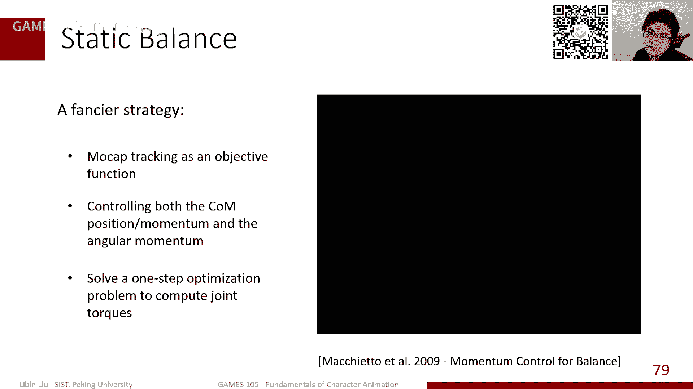

那如果说比如说我走顺拐或者把手揣在兜里，时间你会有额外的能量去去，去去控制一个角动量，那当然这个这个方法具体的细节我就不讲，我只是说就是说这个从思路上来说，它可以在控制，通过控制角动量来实现一下，更加。

比如说这个人在很动作幅度比较大的情况下，也可以保持原地平衡这样的一个效果，但除此之外呢，他还是去求解了一步优化问题，我们前面讲的轨迹优化时间是，我们是优化了一整个轨迹，那这个轨迹可能一秒钟长。

那其实在这个方法里边，其实我们实际上那个轨迹我们可以优化一步，那通过这优化一步，我们可以得到我在下一时刻需要加多少力，来实现，我的目标是这个对这个角动量，动量和角动量的一个目标控制。

那通过结合这些方法呢，我们其实它是可以实现一个，非常看起来非常稳定的，一个一个不倒翁的这么一个效果，但本质上来说还是一个static balance，就是说他其实还是一个静态的。

一个一个局部战力不动的一个平衡，但实际上很多时候，我们很多动作实际上是不是一个static balance，就static balance的意思是什么，就是我们总是希望我的3d max。

它是在sport的这个支撑点的这个这个下边的啊，这通过这样控制，我们，我们实现整个控制过程都是保持这个这个状态，它是一个静态平衡，但是我们很多时候，比如说走路或者跑步，或者很多其他动物。

其实走路是一个非常典型的，人的走路其实不是一个static balance，人走路的时候，你是不停的把你的质心再往下落，就是你在不断摔倒的这样一个过程，但是你摔倒的时候。

你刚好把你的脚移动到一个合适的地方，又让它停止出来的，所以这些人走路，因为人人总是要偷懒嘛，就是因为摔倒这样一个过程，实际是可以帮助你利用这个重力势能啊，来来增加你的速度。

来减少你的使用的这个这个这个力的消耗，所以它是一个非常典型的一个动态屏，它不是一个静态屏，那这种情况下，我们该怎么控制一个角色去保持平衡，那这其实是一个另外一个问题，那我们这今天的课程就不会讲这些。

我们会在下一个下一节的课程做进一步的介绍，ok那回顾一下，其实我们今天还是说按照衔接，我们上节课的内容，我们把我们pd控制，就是比例微分控制的这个一些性质啊，我们把它讲去讲完。

另外呢讲了一些关于这个轨迹优化的，一些基本知识啊，通过轨迹优化啊，包括c m e s这样的一个啊directive free的方法，我们可以优化非常复杂的这种运动控制啊，开环运动控制。

那为了能实现更稳定的控制呢，我们通常还是需要一些这种闭环的，也就是这个啊反馈控制，那防御控制它会根据角色当前的状态和目标，去实时更改啊，我的这个控制的参数，那当然我们其实也是一个做一个，非常简单的例子。

我们讲了一讲如何通过一个pd控制啊，加上一些比如说virtual false或者jctranspose control，来实现一个原地平衡的这样一个效果，那我们还有一个理吧啊，我们下一个会把这个讲完啊。

就是我们通如何去实现一个走路的控制啊，通过这种因为走路是一个动态平衡的过程，该如何去实现一个动态平衡。

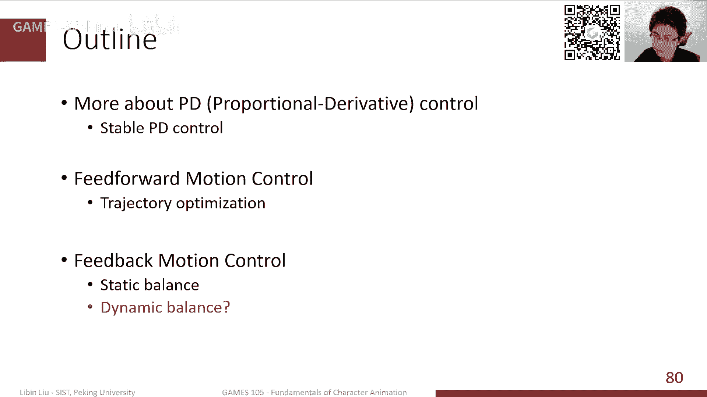

ok那以上就是我们今天的主要内容，那我们今天的课程就上到这里啊。