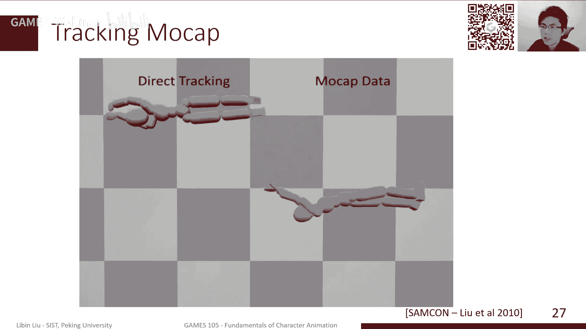

# GAMES105-计算机角色动画基础 - P11：Lecture10 角色控制 🎮

在本节课中，我们将学习如何驱动基于物理的角色动画。我们将深入探讨PD控制器的细节，并介绍如何通过轨迹优化和反馈控制策略，让角色生成物理准确且稳定的动作。

---

## 回顾与引言

上一节我们介绍了PD控制的基本概念及其在角色动画中的应用。本节中，我们将继续探讨PD控制的更多细节，并学习如何去除“上帝之手”般的虚拟外力，生成完全物理真实的动作。主要内容包括：PD控制的稳定性改进、开环控制（前馈控制）以及一个简单的反馈控制策略。

---

## PD控制的深入探讨 🔍

PD控制，即比例微分控制，是驱动角色运动的核心方法之一。其基本思想是通过计算目标状态与当前状态之间的偏差，来施加相应的关节力矩。

### PD控制公式

对于一个关节，其控制力矩 `τ` 的计算公式如下：

```
τ = kp * (θ_target - θ_current) - kd * ω_current
```

其中：
*   `θ_target` 是目标角度。
*   `θ_current` 是当前角度。
*   `ω_current` 是当前角速度。
*   `kp` 是比例增益，决定了对位置偏差的反应强度。
*   `kd` 是微分增益，起到了阻尼作用，能减少系统震荡。

### PD控制的两个核心问题

PD控制虽然简单有效，但也存在两个固有缺陷：

1.  **稳态误差**：由于控制力矩 `τ` 由误差 `(θ_target - θ_current)` 产生，若要保持一个非零的恒定力矩（如对抗重力），则必须存在一个非零的误差。这意味着角色无法精确到达目标姿态。
2.  **相位延迟**：PD控制是一种反应式控制，它根据当前误差计算力矩，这会导致生成的轨迹相对于目标轨迹存在时间上的滞后。在需要精确时序配合的动作（如走路）中，这种延迟极易导致角色失去平衡。

### 参数调整与仿真稳定性

`kp` 和 `kd` 参数的选择至关重要。


*   **参数影响**：较大的 `kp` 能减小稳态误差和相位延迟，但会使动作显得僵硬，并可能引发仿真数值不稳定。
*   **稳定性分析**：对于一个简化的PD控制系统，我们可以通过分析其离散积分后的状态转移矩阵的特征值来判断稳定性。特征值的模必须小于1，系统才能稳定。
*   **时间步长限制**：过大的 `kp` 会要求更小的仿真时间步长 `h` 来保持稳定，这将显著增加计算成本。


以下是调整PD控制参数的经验：




*   通常从 `kp=200`, `kd=20` 开始尝试。
*   对于较重的肢体或需要爆发力的动作（如跳跃），需要调大 `kp`。
*   对于较轻的肢体（如手腕），可以调小 `kp`。
*   参数调整主要依靠手动调试和经验。


---


## 提升稳定性：Stable PD Control ⚙️


为了解决标准PD控制在较大 `kp` 下仿真不稳定的问题，我们可以采用一种改进方法：Stable PD Control。

### 核心改进

其核心思想是将速度阻尼项的计算从“显式”（使用当前时刻速度 `v_n`）改为“隐式”（使用下一时刻速度 `v_{n+1}`）。

**标准（显式）PD的力计算：**
```
F_n = kp * (x_target - x_n) - kd * v_n
```

**Stable PD（半隐式）的力计算：**
```
F_n = kp * (x_target - x_n) - kd * v_{n+1}
```

### 优势

通过这一改动，系统的稳定性对时间步长 `h` 的容忍度大幅提高。原本可能需要 `1/1000` 秒的步长才能稳定，现在使用 `1/60` 秒的步长也能保持稳定，这对于实时应用（如游戏）至关重要。

---

## 开环控制：轨迹优化 🛤️

直接使用动作捕捉数据作为PD控制的目标轨迹，由于相位延迟和稳态误差，角色无法保持平衡。我们需要找到一条“可跟踪”的目标轨迹，使得PD控制器跟踪它时，能生成我们期望的、物理准确的动作。这个过程称为轨迹优化。

### 问题定义

轨迹优化可以被形式化为一个约束优化问题：
*   **优化变量**：控制轨迹（即PD控制器的目标角度序列 `s(t)`）。
*   **目标函数**：最小化仿真生成的轨迹 `x(t)` 与期望轨迹 `x_desired(t)`（如动捕数据）之间的差异。
*   **约束条件**：生成的轨迹必须满足物理运动方程（即仿真动力学）。


### 求解方法

由于角色动力学高度非线性，优化问题的“地形”非常复杂，存在大量局部最优解。

1.  **基于梯度的方法**：需要知道系统动力学的梯度，对于黑盒仿真器或复杂接触模型难以实现。
2.  **无梯度优化方法**：更适合本问题。其中，协方差矩阵自适应进化策略（CMA-ES）是一种有效的方法。
    *   **流程**：从一个参数的高斯分布开始，采样一组候选解（控制轨迹），进行仿真并评估其目标函数值（与期望动作的匹配度）。保留表现好的样本，并以此更新高斯分布的均值和方差，使其向更优解区域移动。迭代此过程直至收敛。

### 应用与结果


通过轨迹优化，我们可以：
*   为给定的动捕数据找到对应的、物理可执行的控制轨迹。
*   将动作适配（Retargeting）到不同体型或不同环境的角色上，自动处理平衡和接触问题。
*   仅给定高级目标（如“跳得更高”），生成全新的动作。

---

## 闭环控制：简单静态平衡 🤸

开环控制（轨迹优化得到的固定控制序列）无法应对扰动。一旦角色被推一下，就会偏离轨迹并摔倒。我们需要引入反馈控制（闭环控制），根据当前状态实时调整控制指令。

### 静态平衡原理

静态平衡指角色在支撑面内基本保持静止的平衡状态。其关键条件是：角色质心在水平面上的投影，必须落在支撑多边形（Support Polygon，即所有支撑点构成的凸包）内部。

### 实现方法：PD控制 + 虚拟力

一个简单的静态平衡控制器可以这样构建：

1.  **姿态维持**：用一个PD控制器跟踪一个稳定的站立姿态（如T-Pose），产生基础关节力矩 `τ_pose`。
2.  **平衡补偿**：计算质心投影与支撑多边形中心（如两脚连线中点）的偏差。对此偏差再使用一个PD控制器，计算出一个想要施加在质心上的虚拟力 `F_virtual`，目的是将质心拉回目标位置。
3.  **力矩分配**：虚拟力 `F_virtual` 并非直接施加。我们使用雅可比转置控制（Jacobian Transpose Control），将这股虚拟力等效地分配到相关关节（通常是踝关节和髋关节）上，产生补偿力矩 `τ_balance`。
    *   **公式**：`τ_balance = J^T * F_virtual`，其中 `J` 是质心位置相对于关节角度的雅可比矩阵。
4.  **最终控制**：将两部分力矩相加，施加给角色：`τ_total = τ_pose + τ_balance`。

通过这种方式，角色可以在站立时抵抗小幅度的推力扰动。通过调整质心目标位置的高度，甚至可以实现简单的下蹲和站起动作。

---

## 总结 📚


本节课中，我们一起学习了基于物理的角色控制的核心内容：

1.  **PD控制**：深入分析了其稳态误差和相位延迟问题，以及参数调优和仿真稳定性的关联。
2.  **稳定性增强**：介绍了Stable PD Control，通过隐式速度阻尼提高仿真稳定性，允许更大的时间步长。
3.  **开环控制**：讲解了轨迹优化的概念，即通过优化（如使用CMA-ES算法）寻找一条能使PD控制器生成期望动作的目标轨迹。
4.  **闭环控制入门**：以实现静态平衡为例，介绍了反馈控制的基本思路。结合PD控制和雅可比转置方法，设计了一个能抵抗扰动、保持原地平衡的简单控制器。


下一节课，我们将探讨更复杂的动态平衡控制，例如如何实现一个自然行走的控制器。