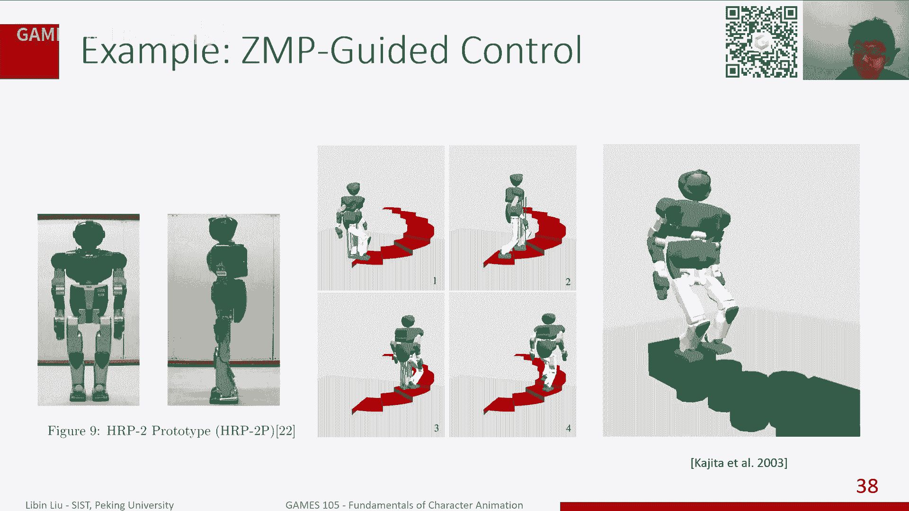
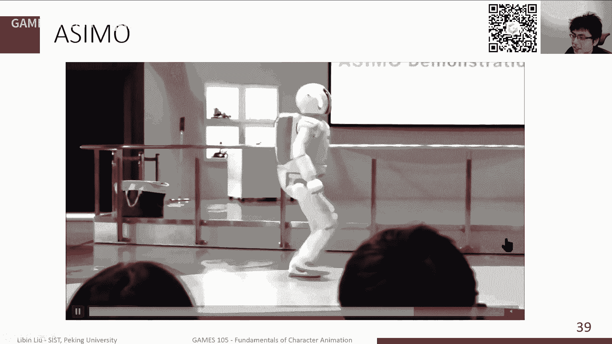
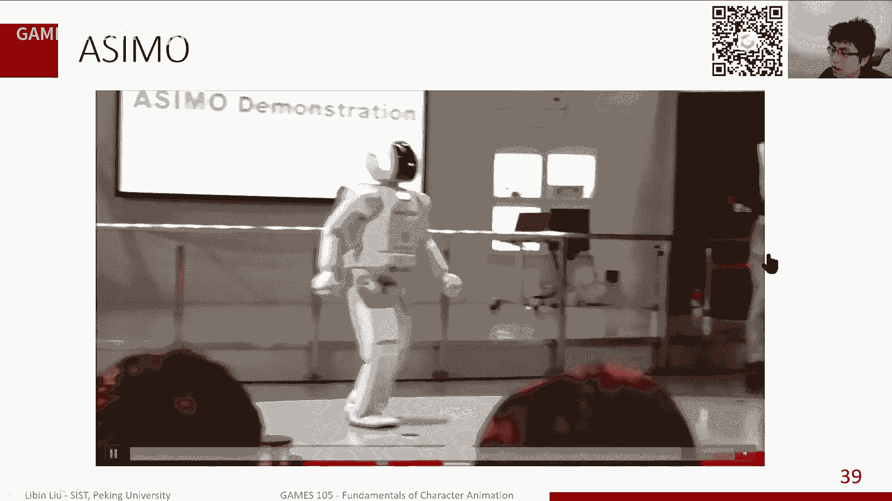
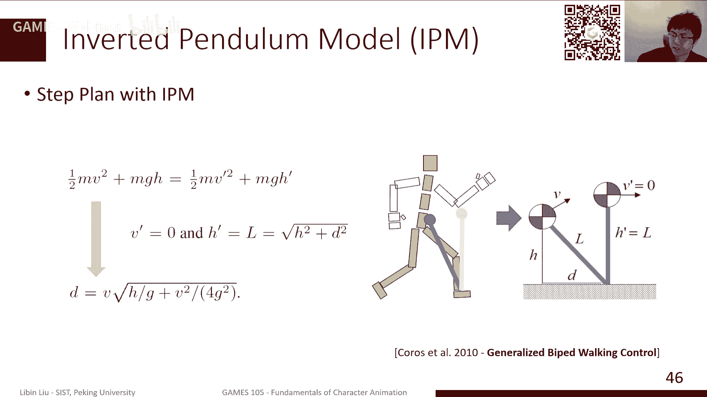
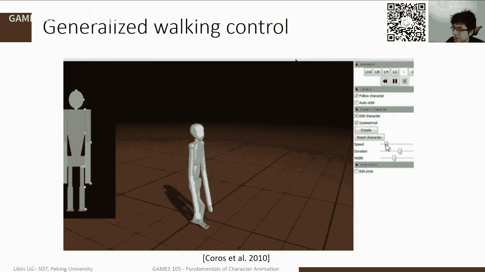
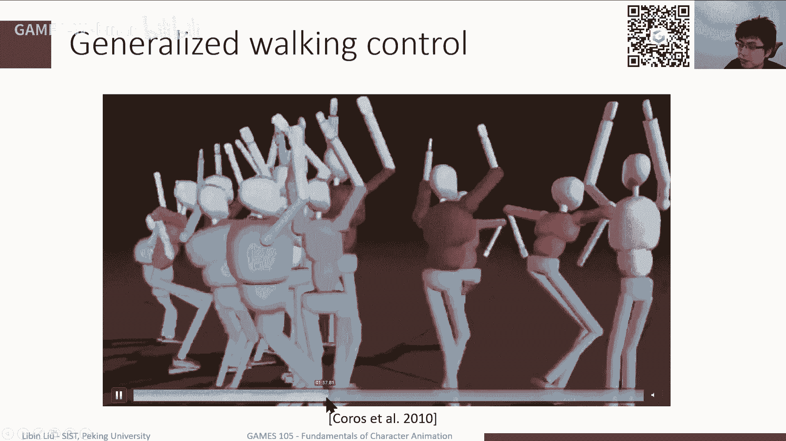
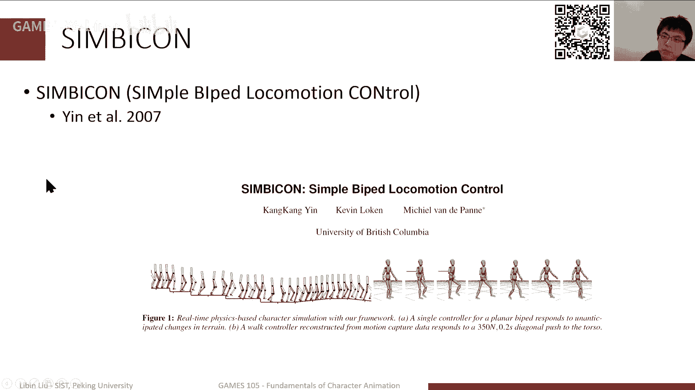

# GAMES105-计算机角色动画基础 - P12：Lecture11 Learning to Walk - GAMES-Webinar - BV1GG4y1p7fF

好的，那么回到我们今天的这个这个内容啊，刚才的刚才我们说的，其实我们今天我们上节课讲，就是前两节课讲的主要的内容，第一节课我们主要是讲了一下这个物理仿真，那就是我们如何来仿真一个虚拟角色。

那接下来第二节课呢，我们主要讲了一下如何去控制一个虚拟色，就是如何让一个虚拟角色能够保持一个姿势，那上节课其实我们主要是讲的是，在这个基础之上呢，稍微讲了一点反馈控制。

那反应控制我们当时实现的是一个什么呢，是一个静态的原地平衡的这样的一个控制器，当然这个原力平衡其实呃可以完成一些工作，就比如说结合我们前两节课讲的一些内容，比如说我们的跟踪控制啊。

我们可以让呃控制器去跟踪一些，比如说这个上半身，比如手肢体的一些移动，那在下半身的话，我们可以使用我们上节课讲的，比如说这种啊利利用比如说这个啊雅克比啊。

在后面transpose control来实现的一个平衡控制器，那其实可以让这个角色呢一边平衡，一边能做一些动作，当然这个其实大家想想也好，像我们这个工作这样一个非正半天劲，其实做的就是一个平衡的。

一个，就是其实还本作家好像就是一个就是一个跟踪，一个动捕数据这样的一个效果，但实际上呢如果大家当然我们是作业，其实也会有类似的内容，大家可以看到，其实在这个过程中，实际上比如你可以看到一些额外的细节啊。

这些细节的话，你用这个纯粹的动作数据的话，就是基于运动学的方法的话，可能是不太容易实现的，就比如说这个人在挥手的时候，其实你的身体会不会有一些这个摇晃，因为它需要去保持这个。

其实对抗这个这个这个这个平衡带来的，这个就是说比如挥手，可能带来一些这个角度的变化，那么其实身体也要随着这个这个反作用嘛，它也会向他摇晃，那这些细节的话，其实是会带来一些更加真实的这个。

那这个这个这个动作的动作的这个感觉啊，那当然今天呢我们其实在那个昨天那个基础上，我们再稍微多讲，再进一步啊，就是说我们其实只学会了，如何能够站在原地平衡，但是与原地平衡的话。

其实这个还是能做的事情太少了，我们其实很多时候是希望，至少这个角色能够能在这个场景里移动，那这其实是我们对这个角动画的一个可控，角色的一个基本要求，当然移动这件事呢，其实对于一个啊基于运动学的方法。

就是比如说我们前面讲这个运动合成，那移动这件事情非常简单，因为我们直接在它的关节上，在这个人的这个身体上啊，我把它设置成一个比较合适的一个位置啊，比较合适的一个姿态，那个角色就自然就移动了。

当然我们要特别注意的是，我们不要把这个位置射的不射射射射的太差啊，射的太远，那你可能就看到这人就在不停的瞬移啊，那这就肯定显然就不是真实，但是对于物理学他来说，其实很大的一个问题在于什么呢。

就是说我们不能直接去控制一个角色的，全局的位置，那我们其实只能通过让这个角色，比如它跟地面有一个交互，他给地面一个力，那这个地面会给他一个反作用，反作用力，那这个反作用力能推这个角色向前移动。

那这个过程时间就很多时候，就在于我们该怎么去规划这样一个反思，这样一个全身的这样一个控制，能够让角色能够动起来，a不思，那我们今天其实主要内容还是稍微相对来说，不是呃比较少的。

我们只是首先简单讲一下这个走路啊，实际上在过去的啊，应该说在深度学习起来之前啊，就是说在这个过去20年，其实从零呃，应该是从2000年左右吧，2000年的前10年或者2000年前15年。

就是在物理仿真这个角色中，就是基于仿真的角色动画这个方向，其实大家主要研究内容还是走路啊，就是实际上走路这件事是非常难以实现的，其实这不只是觉得动画啊，其实就像我们常见的像这种机器人。

特别是人形机器人啊，其实最近马斯克这个他们不是搞了一个公司，然后然后最后还有一个，最近还有一个新的机器人，这个这个发布啊，其实还有一些其他大家非常非常熟悉的，像是这个boston dynamics。

不是那不是在努力的这个机器人，其实还有再早一点的，其实现在红的那个本田啊，红打啊，本田的这个asio啊，10年时代是2000年，走2年之后到2007年左右吧，其实也是非常知名的。

这样的一个双足的人形的一个机器，那当然现在其实这个商做商人机器人，这个工资也蛮多的啦，比如像国内有一些像ub选啊，其实也是做的这个相当不错的，这样的一些一些工作，那当然其实我们在深度学习之前啊。

就是实际实际上是在深度学习之后，其实这是这两个领域，其实也是有很大的相关性的，应该在深度学习之前呢，我们见到的很多情况都是我角色动画，因为本质上来说我们是在仿真一个虚拟角色。

但这个虚拟角色比起真的机器人来说，他的约束啊会更加少一点，但是我们大部分情况下，其实还是希望还是采用了很多在机器人里面，特别是双足机器人领域啊，使用的一些技术，然后把这些机术拿过来。

去驱动一个这个仿真的虚拟角色，那当然现在其实，因为我们这个在特别在深度学习这个这段记，这个是这段发展之后呢，其实我们看到这绝动画，大家可能很多方法都是来自于比如深度学习，深度学校学习这种方向。

相对来说对于这个传统机器人领域的这个控制，会就是控制控制策略的这个使用呢，就相对来说稍微少一点，但是呢我觉得其实作为我们这门课嘛，我其实也是觉得这样一个机会，我们稍微讲一讲机器人控制。

这边的一些一些基本内容啊，可能也是对我们这方面的了解会更有好处，难道我们今天主要是讲了一些，讲讲这个以下几个方面内容啊，首先是关于这个走路啊，以及这个走路的一些相关的一些一些这个分啊。

比如说我们如果分割如何去定义平衡，然后另外呢我们就举三个例子来讲一下，我们在过去一段时间怎么使用这个简化模型啊，怎么使用简化模型来实现一个走路的控制，那当然这个工作相对来说比较早。

都是都是零几年到10年左右的工作，那当然我们其实这个啊，对我们本来计划的这个lap 3和p4 啊，就说我们这个仿真里面会有两个这个作业，那这两个作业呢我们其实因为时间的关系啊。

我们可能会把它合成一个实验啊，但本但时间总体内容不会差很多的，那其实我们其中一个实验，就是希望能够作为一个挑战任务呢，希望大家能够实现一个啊能够步行的机器人，那当然你不一定使用这节课讲的方法。

也许可以用下节课讲的继续想要学习的方法，也可以同样的完成这样的工作，ok其实走路应该说我们大家都是非常熟悉的，因为啊因为这个差不多是每个人都会走路，然后走路实际上从因为毕竟来说。

这是大家都了解的这样一个一个动作，而另外一方面，其实走路整体来说是一个相对来说比较稳定的，一个一个动作，没什么稳定呢，因为它比较慢啊，就是很多时候慢的情况下，我们可以有更多的时间去控制。

所以实际上不管是在啊生物学，生物学，医学啊，机器人其实对走路的研究都是蛮多的，但总体来说呢我们可以简简单的去把一个走路，就是如果说我们不加任何的，比如说像这种风格化呀这样的一个约束。

那走路它其实就是一个啊左右左右腿啊，两条腿交替移动的这么一个过程，那在这个过程中，我们其实通常来讲会把它定义一些这个量，比一些一些一些这个名词啊，就比如说像这种single support。

就是我一个脚在空中摆动的时候，另外一个角落在地上，其实那个角就是由他自己来进行，这个就是支持这个整个身体啊，其实有时候也叫single stance，因为他也是一个脚去去站在那里。

然后呢走路其实会有一个特定的，就是特殊的一个时间，就是其实在某一个瞬间，会有两个脚同时在地上啊，这是其实走路的一个特点，就是这个这段时间是double dance，就是两个脚都是在地面上。

然后走路其实是不断的重复，这样的一个这样的一个交替的过程，然后就是每个角分别成能成为一个single stance啊，这个这个支撑脚啊，另外一角是一个摆动脚啊，以此类推。

当然如果说我们把这个走路的这个时间啊，我们就是把左右脚接与地面接触的时间，和右脚与地面接触时间，那这样画出来的话，那你可以看到，其实从时间上来说，他肯定是有一定的重合的地方。

重合的地方呢其实就对应的这个single stdouble，stance的，这个就是双腿支撑的这样一个，这样这样一个阶段，那如果说只有一条，如果不下不接啊，不接触的地方。

其实就是这个所谓single stance的这个阶段，那其实有另外一种就是跟走路相对的，其实就是跑步，其实跑步就是就是实际上我们从定义上来讲，什么是走路，什么时候跑步，就是跑步是没有这个重合的。

就是没有有一个fly的face，就是一个飞行时间，那这个时停时间就是说我有一瞬间，我的左腿和左脚和右脚同时离地，那这个时间他是那这种动作，其实就可以就他就不再是走路了。

可以把它定义成跑步或者一些其他的动作，其实大家如果是对这个比如说奥运啊，比如田径感兴趣的话，大家知道有一个项目叫竞走，那竞走其实有一个非常主要的规则，那规则是什么呢，就是说不允许啊。

有这个肉眼可见的哈哈就是飞行时间啊，就是说你必须要保持至少有一个角呃，跟地面接触，那你才是走路完了，否则你就不是走路，你是跑步了，所以实际上大家比如看节奏比赛，你可以经常看到这种犯规。

很多都是对这种犯规啊，就是其实因为走相对来说肯定是跑跑的更快，但是这个你要是在这个，尽可能接近跑的状态下去走，那这其实是竞走他们做的事情，那当然我们这节课我们不会研究跑步，我们其实主要还是研究走路。

我们上节课其实就比如我们在走路的时候，就是我们及时走路，就是两个角，我们总是交替的向前移动啊，其实虽然说我们是一会儿一个角直升力，一会另外一个角直升，但总体来说两个角是在不断的交替向前移动。

那在这个过程中呢，实际上我们其实上节课讲了一些内容，比如说我们要想实现平衡，其实一种策略去实现走路，就是利用我们上节课讲的，关于这个静态平衡的这样的一个方式，其实静态平衡。

我们上节课没有做一个详细的定义了，就说我们其实可以可以简单的认为啊，静态平衡就是说这个人啊，这个这个东西，这个对象它在基本上不动的情况下啊，我可以怎么放，他怎么怎么样才能保持平或者叫静力平衡。

因为它可以的，至少我可以保证我的，比如说我的这个3d max，我的质心啊，跟我的这个旋转，就是可能会导致我旋转这个这个这个这个轴啊，我总是在它这个旋转轴上，或者在这个在我的polygon的里边。

能保持我的平衡，那比如走路的时候，我们其实可以类似于类似于一个风格，就比如说我在double a single dance这样一个瞬间，在三个时段的时间，我可以我知道我一只脚着地啊。

那这个脚本身就是我的这个polo polygon啊，它是我的支撑支撑的这个面，那我其实可能在我的控制过程中，我们是需要我的3d max，我的知心啊，始终保持在这个在地面的投影。

始终保持在这个这个sport polygon的上边，那接下来在double down的时候，其实就是这就是走路，为什么我们讲就double stance是一个比较呃简单的。

就是可以帮助我们去实现这个走路呢，就是因为double stars实际上两个脚同时落地的时候，我们有一个更大的这样的一个swap polyon，就是这个这个支撑的这样的一个区域。

这个区域其实包括了两个角的一个背包啊，就是它的凸包的这样一个空间，而在这种空间呢，其实在，如果说我们要通过这种方式来实现走路的话，我们其实是需要通过这段时间，把我们的这个3d max啊。

从从从原来这个角，然后通过这样一个double sponse的fdouble support啊，double stance的这个这个这个这个阶段，然后移动到另外一只脚上，那这在另外一只脚，他在实习。

他在这个single stance的时候，那我们其实这个这个支线就可以保持，一直保持这样一个平衡，那当然这是一种实现走路的策略，而且实际上，如果其实你是真的是可以，通过这种方式来实现走路的。

但是这个策略上的需要可能需要做一下，做一下这个做一下改变啊，做做一下这个设计，当然这个最大的问题在于什么呢，在于这个static balance啊，如果大家大家将来做这个实验的时候，大家可以去尝试一下。

也就是发现其实它是非常不稳定，因为它只能减，就是勉勉强强啊，保持这个这个角色姿态的一个一个平衡，但是呢就是因为本质上来说，它是假设啊，这个角色是处于一个不动的状态，那么如果说我只觉得正在动。

那其实这个假设是被破坏的，就是因为正态动会带来什么问题呢，就是会带来除了你的这个这个，就是它会带来一些这个动量的变化，特别是角动量的变化，比如说我这个人正在向前移动，我只能一个脚站在地上。

那我其实移动会对，相对来说这个角旋转之后会有一个角动量，那这个角动量我们该，如果说我们不能很好的去平衡这个角动量的话，那我其实也很难去啊保持我的身体的平衡，所以实际上我们通常来讲就是think us。

就是static balance，我们可以实现一个非常慢的，就是非常慢速的，一点点的去向前移动的这样的一个走路，但如果想实现更加看起来更加这个灵活的，这个走路，那么通常需要更加仔细的。

就除了对我们知心的位置这样一个空之外，我们还需要对一些其他的，比如这个对这个动量的，这或者角动量的这样的一个控制，那当然这个其实也是后来我们很多嗯，这个机器人领域就是这assim。

就是其实在20 2000年左右的之前，其实很长一段时间，双足机器人我们怎么实现走路，其实很多时候都是通过对这样的一个一个，一个啊动量的这样的一个控制，来来来完成一件事情。

那当然这里其实有一个非常重要的概念，就是所谓的zero momentum point啊，就是我们后面其实很多好几个非常成功的啊，这种啊这个双足七人啊，这个这个这个角色，他其实是指主要还是通过啊。

对这个zero momentum point的控制，来实现一个比较稳定的走路，那什么是zero，我们的炮这个叫零，应该叫零动量点啊，这是一个机器人学习的一个，就是这个双足机器人里面的。

一个非常重要的概念，我们这里可以举一个例子啊，就说这个比如说这是一个人啊，这是我们一个虚拟角色，他其实有很多钢铁，那现在他正处于走路的状态啊，当然看起来像跑步，但是我们认为他是在走步。

那他走路在在这一个瞬间，比如它是一个单脚支撑的这样一个状态，那在这样一个状态下面，我们可以看到，就是我们可以对这个人整体做一个，简单的受力分析，我们可以知道，首先这个人要受重力影响。

其次呢这个角落在地面上啊，这个地面需要给他一个支持力，然后同时这个人又在移动啊，比如这个人可能我有一个加速度，这个加速度可能是我的，因为我正常来讲，比如人往那走路的话，实际上我的速度是不均匀的。

我总是会处于一个这个这个加速和减速的，这样一个状态，那这些时候实际上能够提供这个加速度的，其实是完全是这个gf，就是地面的这个reactor false，这个电源是false，包括什么呢。

包括我们前面讲的这个，或者说它其实本质上就是我们前面讲到的，比如说这个支持力，比如说一个物体放在地面上的，地面会给他一个支持力，那同时如果这个物体有一个移动的趋势呢，那我地面会给他一个摩擦力。

那这两个力合在一起，其实就是我的这个地面，给我的这个啊知识点的这样一个嗯这样一个gif，就是这个这个这个应该叫反作用力，地面反作用力，那当然我们可以为了其实整体这个人的动作啊，就是整个身体的动作。

其实我们比如我们前面可以简单的使用，比如pd pd控制，来实现这个让这个角色去跟踪某一个控制器啊，去跟踪某一个某某一个轨迹，那它就是就是产生了相应的动作，那这里其实在做这个动作过程中呢。

其实我们关心的是说，我们该如何去能够让这个这个控制这个ji，它能够让我们保持平衡，那这个时候我们可以做一个简化，就是我们其实可以把这个上半身整个人啊，把这个上半身所有的动作，把它给这个桶总合起来啊。

就是因为不管怎么样，如果说我们只关心这个角，这里因为它不是一个缸体，它跟上半身通过关节来连接的，那么其实我可以完全可以把上半身，就是整个身体其他的部位对这个角的影响，因为他总是通过这个角跟这个腿之间的。

这个关节进行连接的，所以所有的比如说这个这个，其实上面关节的这个它的运动，其实总最终都是通过这个关节的一些移动啊，关节的这个嗯通过关节施力和施加力和力矩，来影响到最后这个这个肢体的移动啊。

这实际上是一个非常简单的一个非常这样一个，应该叫应该叫这个啊，应该叫isolate啊，就是说我们把这一部分把它给独立出来，来进行分析，来进行受力分析，那当然这个其实如果大家可以回想一下。

其实也是可以想象，比如说我们当时讲过一个两个钢铁，然后中间用一个关节点连接起来，那这个钢铁运动的时候，其实关节点它是作为一个约束，那这个约束呢会给分别给两个缸体一些力啊，当然这个力是会大相等。

方向相反的啊，然后这个力呢能够保证，这两个钢铁在移动过程中不会分开啊，就当他一旦有分开的趋势，我就加一个力把它给拽回来，那这个过程中实际上在我计算完这个力啊，比如说我们通过某种方式。

已经把这个力计算好了，那实际剩下的仿真过程呢，就是我们完全可以不需要关心，另外一个缸体是什么样子，我就只关心这个钢铁，我知道他在这个时候受到这样的一个力，那我只要关心，只要这个观点啊。

缸体按照这个力的方向移动，那其实它就不会分开，所以说其实刚才我们就是就是，就是刚才我们这个这个嗯，就是这个回到我们刚才这个例子啊，就是实际上本质上我们这个人啊上面多复杂，其实都无关紧要。

因为它最终能够跟这个角，就是只要对角进行交互，其实就只能通过这个关节上面加的力和力矩，来进行完成，所以说假设的时候我们已经知道了，在这个关节上，比如这个是一个踝关节啊，我们在这踝关节上加了其他的。

身体的其他部分啊，部位给这个环节加了一个力，加了一个力矩，那这个力可能怎么算呢，我们可以通过解的运动方式来得到，那同时地面会给这个环环节一个力，这个力我们认为它是施加在一个点上。

但实际上地面给他力并不是持加在一个点上，因为我们想象一下，比如说我们正常来讲走路或者站在那里，其实我们脚比如脚是平平平的，这个站在地上，那实际上你这个你跟地面接触，脚跟地面接触是一个面。

那这个面上其实每一个点，都会受到地面的接触力啊，或者说同时你也是会受到地面的摩擦力，那这种情况其实我们可以，比如说我们可以假设我们有若干个点啊，然后每个点上都有一个力，都有一个这个力。

但是力的大小我们就不关心了，我们就是知道这有这么一个力，然后这个力每个力啊，是施加在对应的这个这个某一个点上，就是立fi，那我是加在pi上，那当然这个利他总是很就是由两部分构成。

一部分是地面给我的支持力啊，总是竖直向上的，另外一部分是我的摩擦力，那摩擦力永远是跟这个基础面是平行的，那这样呢是一个，那这是基于我们的这个摩擦模型，那这是我们这个力的这样的一个一个一个构成。

那这样的基础之上呢，如果说我们因为这这这里有很多力嘛，而这是一个钢琴，所以对于钢铁来说有一个什么好处呢，就是说不管我加多少力，这个我总是可以认为这些力是一是这样，不好意思。

我总是可以认为这些力呢是等价的，施加在某一个点上啊，比如说这个点p啊，这个点p在哪里其实都不重要，但是我是总是说我认为这个力是等价的，加在这个历史啊，加到一个点p上啊。

那这个等价需要是这带来什么样的效果呢，就是说我可以认为这个这个接触面上，所有的力的的这个和啊，是是加在这个点上的这个力，然后同时呢因为每个力原来是只有力的作用，但如果说我们把它集合这个集成到一个点的话。

那我们其实先就是应该说是每一个力啊，每一个原始的这个力其实都会对这个物体，比如说相当于它的，至今都会有一个有一个这个啊力矩，那如果说我们把所有力合在一起的话，那其实相当于在这个点上。

我们也会有一个合力矩啊，加在这个点上，所以这样的话，其实我们回想一下，我们以前讲力和力矩的这样的一个公式啊，就是例呢这个总得利，那其实就是立的这个每个力的这个求和，那力矩的话。

其实是每个力矩相对于我这个，我认为他施加力的这个点啊，然后他的一个差成来进行求和，得到这样一个关系，那当然这里其实我们可以进一步的假设，就是实际上如果作为了简单起见，我们可以假设这个地面是水平的。

就是同时是水平的，并且是平坦的，那在这种情况有什么有什么结果呢，就是说我们可以啊，比如这个p啊，就是这个这个施嘉丽的这个点，那我们其实也可以，也可以认为它就是在地面上啊。

就是说这里所有的施加力的点和每一个f，它最应等于施加力的点都是在平面上，同时我们也可以假设这个p是在这个地面上，那这种时候下这个p和p i和p之间的连线啊，那肯定是跟地面是平行的啊。

这是一个这是我们的一些假设，但这个假设其实也是非常非常常见的，因为我们知道我们一般大部分常见的场景，我们在房间里走路，但是在这个基础上呢，我们可以把前面这个公式做一下简单的变形啊，就首先前面一步fy啊。

它是代表了一个竖直向上的力，然后fx z它是代表着一个水平方向的力，它水平方向具体应该是竖直方向，是一个确定的方向，但水平的话，那其实是整个水平平面里边任何一个方向，这个我们其实是不是这个不能确定的。

那我们可以把它做一个简单的这个合并啊，这个嗯所以下分配啊，其实可以前面这一项，因为p减去pi啊，pi减p它是跟地面平行的，然后fy啊是一个跟地面垂直，其实只要是f d y跟地面垂直。

我们就知道这个插成肯定是水平的，然后第二项呢就是因为前面一项是平行，跟地面完全平行的，后面一项呢它也是跟地面完全平行的，所以他们两个差成，我们用六手定则可以知道，他肯定是在竖直竖直面上。

所以说实际上我们相当于是什么呢，我们相当于是把一个地面的总的，这样的一个例句啊，gr和例句，那我们可以把它分解成沿着地面平行的部分，就是在水平面上的部分，和这个跟地面垂直的部分。

当然特别大大有要有一个印象，有一个想有一个概念，就是说当我说它在地面垂直的时候，它其实是沿着垂直那条直线啊，那个轴的一个力矩，它是一个旋转的，就相当于我我带的效应是沿着那个轴旋转。

然后这个x y x z就是在平面上一个例子，比如说这个比说一个例句，是这个方向是沿着这个边沿的这个方向，那实际带来的效果是什么，是沿着这个轴进行旋转，那可能就是把这个这个角向上翻转，那达到这样一个效果。

那我们可以进一步的这个做一个这个变形啊，达达到这样的公式啊，其实就是把前面这个pi减p，因为p是一个共用的，我们可以把这个p提取到这个球号，求和号外面来了，就得到了，sorry，得到这样一个公式。

那这里有一个问题啊，就是这样一个公式，因为这个p是一个随机选取的，也不是随机选，就是我们是在可以在这个平面上，随便选任何一个地方选的一个参考点，那我们是不是可以找到一个参考点，那这个参考点之下呢。

在这个平面的这部分这个力矩啊，相对于这个参考点力矩是零，有没有可能找到这样一个点，但实际上你可以大概从这样一个公式的，这个形式，大概也可以也可以看得出来啊，就是似乎是有可能的。

只要前面这一半跟后面这一半相等，那它就是零，所以实际上这个点是有一个确定的点，这个点通常来讲我们可以把它叫做这个center pressure，就是这个脚踩地上那个那他这个压力的重心啊。

就是center pressure，那它定义上来说可以就是我们每一个点啊，跟正心呢跟质心的其实定义很像，至今我们怎么定义的，我们是每一个缸体的位置乘以它的质量，然后加权平均得到的重心。

那这里其实就相当于，比如说每个点它的位置上有一个力啊，那这个力其实我只关心这个竖直方向啊，输入方向的压力，因为那另外一部分是摩擦力，那我我用这个压力的大小，那这个平均值啊。

就是对应的我这个这个这个center pressure，压力中心的这样一个位置，那如果说p是选了这样一个点嗯，选了这么一个点，那我把这个带入到上面这个公式，那我们其实可以比较容易的得到。

最终这个也就是先绕着这个点，就所有的力，所有的这个支持力，我加上摩擦力啊，绕着这个点，它的这个啊在水平方向的这个例句啊，是零啊，这是一个非常有意思的点嗯，那在这种情况下呢。

实际上首先这个这个合力的大小啊，这个是不会变的，它就是所有力的笔壳，那如果说我选这个嗯这个质心为参考点啊，这个这个center pressure啊作为参考点的话，那实际上所有的力的力矩啊。

相对于这个参考的例句，它是没有水平分量啊，它只有一个数值分量，那数值分量就是说，它只能让它会让这个物体进行旋转，所以这是一个很特殊的点啊，就ser pressure，他有这样的一个性质。

那接下来呢就说我们，假如说刚才假设这个这个角色在这个状态呢，他是处于一个stance face啊，就是说这个是一个角啊，落在地上那个脚其实在stance face里边，其实大家想想我走路的时候。

我支撑那个脚是一般来说是不会动的啊，就是我只是这个这个摆动腿啊，在向前摆动，但支撑腿在这整个过程中是基本是保持一个，跟地面接触的这样一个状态啊，那我们可以进一步的假设，它就是一个始终是保持一个水平。

跟地面完整接触的这样一个状态，ok那在这种情况下，就是通常来讲，这个其实我们我们是说我们是把这样力啊，把这个力把把这个地面给他这个所有的接触力，我们认为是施加在某一个点上，那这个点他是这个嗯。

那这个点我们可以随便选，但是它比如说在一些特殊情况下，我们可以选center pressure，但是如果说我们想这样一个点，就saber有什么性质呢，它就是能够让这个在这个点已然是这个点的，这个例句啊。

他的这个和是零啊，水平水平分成零，但是如果说我们无法测量，无法现在没有办法测量这个每个点，因为他如果要算算的pressure，我需要算每个点上，那到底是加了多少力，但如果这个点我们这个没法测。

我们只知道一个总的力，那这个那就是这种情况下，这个具体这个center pressure它在哪里，我们其实是暂时是不知道的，但是我们可以是可以假设，我们有一个点是满足这样一个条件的。

那么在如果说我们认为所有的这个，所有的这个gr f都是实在这个点的情况下，那gr f相对于这个点这个talk，那他应该是这样一个关系，ok那接下来不好意思，因为这个点啊，因为这个物体就这个角在这一时间。

虽然说他受到了很多力啊，就是说不管身体是什么状态，他总是最终会变成一个，在这个点上加了一些力和力矩o，那这些力和力矩，所有这些力共同作用的效果是什么，是在我是说这个角啊始终在地面上保持不动。

那说明这个角处于一个平衡状态，它在所有一堆力的作用下，就是首先我要求你的力的大小啊，所有的力加在一起应该等于零，另外一方面呢就是说我还要求你所有的力啊，沿着任何一个某一个啊，其实是任选一个参考点啊。

比如说o点沿着它所有的力和力矩啊，也参相当于这个参考点的总的例句和总的moment，总的这个这个这个这个嗯重量啊，哎应该叫什么来着，总的这个moment是零啊，这也是我们这个平台条件。

因为如果不是零的话，就说明这个东西会旋转啊，就是我们的镜静力矩不为零，那它就会旋转，那它它就不再是一个平衡的一个状态，当然这个这个相当于这个参考点，那我们其实可以算出它的总总的这样一个力矩，是多少呢。

其实是就是说我们可以用每个点示例的，到这个参考点的连线差成这个力，就得到了这样的一个一个一个公式，得到这样一个公式呢，我们可以进一步的这个做一下，做一下这个判断啊。

就是说实际上我们可能只关心这个水平方向啊，因为这个东西本质上是一个合力矩啊，是一个合理举，但是合力矩其实如果是它等于零的话，说明他的水平方向啊，就x x z方向的这个分量和它竖直方向。

就是y方向的分量应该都等于零啊，都分别等于零啊，才能保持它等于零，所以说如果说我们只是先，如果说我们只关心这个水平方向的分裂的话，我们其实可以看到一些，我们可以只把这个上面这个左边部分好的。

这个xz方向的这个分量给拿出来，那这里其实要注意的是说什么呢，就是说嗯我在我们这个假设之下啊，就是我们的地面只有一个竖直方向的力矩啊，经历，那如果说我们只考虑水平方向的话，那这个例句就是没有了。

我们其实最终就是引发原来这里是五项，现在只有四项，因为这个这项被丢掉，ok那另外一个特别注意的是就是什么呢，因为mg就是重力始终是垂直向下的，直接向下的呢，其实它的水平分量其实跟数值分诶。

他其实就没有数值分量，就它所以竖直向下跟一个东西跟一个做叉乘啊，那他其实肯定是跟它垂直的，他那个水平方向，所以说整体来说是这样的一个这样一个公式，那有这样一个公式呢，实际上这里蕴含了两个方程啊。

因为本质上来说这是一个sz嘛，我其实相当于把左边的这个二次二维的部分，就是只有x这两个两个坐标，然后它相当于是这两个坐标的值分别等于零，那在这里边呢，如其实u的位置我们是知道的，o的位置是我们自己选的。

所以说其实也是知道的，这个ex也是知道的，因为它是这个质心啊，就这个腿的这个就这个脚的这样一个质心，然后这个力的大小，如果说都假设我们知道的情况下，那我们唯一不知道就是p了。

但是p呢又是在我们知道它是在水平面上，所以它其实只有两个未知数，所以这个方程里面我们是可以把p解出来的，理论上来说，就是我们可以通过解这个方程，来算出这个p点的位置，那这个时候找到这个p点啊。

其实这个就是一个非常重要的点，就是它就叫做这个zero momentum point啊，就是我们的z m p zz m p为什么叫z m p呢，因为它实际上是在我们假设，有这样的关系的情况下。

我们算出来的p的位置，也就是说时间，另外另外一个角度来说是p是满足，使得我这样的一个旋转的力矩，等于零的这样的一个状态，那另外一方同时呢，它也其实也是让我这个水平分量，就是总的合力矩的水平分量等于零。

那满足这样的关系，所以说我们这为什么讲这p叫零立据点啊，零零zero one的point啊，这个中文我还真不知道怎么翻译啊，就是这样一个000力矩，灵力灵力局点的这样的一个，这样一个这样一个东西。

但是呢领略显为它是成立的条件是什么，它是条件是说p是在sport polyon里面，比如说这个p点是一定是在这个角的内部，它才它才是有意义的，但是有意义的，因为实际上我们在求解这样一个方程的时候。

在写这个方程的时候，实际上我们只是做了一个假设，我们只是假设说这个地方等于零啊，但这个东西它有可能不是真的，这个假设也许不一定是真的满足的，但是我在这个假设之下呢，我们是可以求出一个p。

就是这个p应该是说什么呢，这个p是能够满足我们这个假设的，一个点的位置，但是呢如果说我这个力啊，比如说我这个人可能处于一个正在倾倒的状态，正在往前摔倒的这样一个状态，那这个时候你是依然能够用。

通过这个方程算出一个p的位置，那这个p的位置，你会发现它是在我这个角的外边啊，就是本来来说，比如正常来讲没有平衡的，没有摔倒的时候呢，其实这个p是在那中间的，那如果说你某一时刻发现诶。

我算上这个p是在角的外边，这个说明什么呢，这个说明这个p是不在，在这个情况下，他不是我们前面提到center pressure，因为center pressure从定义来说它是我力啊。

外力加在这个是这个力矩上啊，加在这个角上，他这个所有的外力的这个这个家庭平均点，那如果说不管怎么样，因为所有的脸都是加在角的内部吧，那所以说你加权平均点肯定不可能跑到外面去。

所以说如果他如果算上p在外面，那它肯定不是cnpsh，但因为它不是ser pressure，那所以其实我们知道就说我们所有的力啊，就真实我们家的力相对于这个点，它的合外力应该是不为零。

因为只有sd branch才为零，所以是这样一个条件，或者在进或者另外一个角度讲说，如果说我们有另外一个点p撇，那这个撇是这个真实的这样一个center pressure，那我们可以得到什么呢。

因为p是能够让这一这个东西等于零的一个点，然如p撇跟p是不相等的，那我们其实可以可以推断出，那在p点的情况下呢，这个上面这个公式就不等于零，那上面的公式是什么呢，上面这个公式实际上是我们家的这个腿上的。

这个这个合外力矩，那它不等于零代表什么意思呢，代表了这个这个角在这一瞬间，它的合外力矩不为零，那合外力矩带来就是水平方面的合外力矩啊，他带来什么问题，就是说因为水平方向会让这个角色这个角啊。

沿着这个平面的某一个轴进行移动，但实际就相当于这个角会往前翻转啊，但我现在因为我这个有一个静力矩，它会让这个角去这个比如说抬起来啊，其实抬起来之后呢，其实经常来说他会更加变得更加的不稳定。

就虽然是小就翻就翻过去了，其实对应的人就是其实就摔倒，所以总的来说呢，就是说我们其实z mp其实是在那个运动，就是双足机器人啊，就是机器人控制领域，这是一个非常重要的一个概念。

就它是一个非常重要的一个啊指标啊，就是告诉我们这个现在这个这样一个角色，他是不是处于一个动态平衡的状态，就是它是不是同时，又能满足我的这个力的平衡啊，又能满足我的这个角动量，就是动量上就是动量和力矩啊。

是互相平衡的，这样的话他不会进不会进一步的翻转，所以你从另外一个角度讲呢，就是其实作为一个指标，我们其实可以从某种程度，某种程度上来说，如果说我们在让在控制这个角色的时候。

我始终能够保持我的这个z m p，处于我的这个这个支撑的sport polygon的里边，那我其实就相当于保证了这个角色是不平衡的，那这里就问题就是说，我们该如何实现这样的一个平衡。

当然这其实是一个非常非常复杂的问题了，就说我们前面只是讲了一个cmp这样一个概念，但是如何控制它啊，这竟然是一个相当于是另外专门有一，专门可以用111门课啊，来进行介绍的一个一个内容。

当然我们这里只是讲的简单的讲一讲，就是说从思路上我们该怎么实现啊，就这里其实是一个问题，就是说嗯如果说这是只是一个嗯，只是一个物体啊，或者说一个物体上面可能加了一些外力，那我们其实相对来说是这个东西。

是相对来说比较好，比较容易分析的，我们可以很密，比较可以很很很很容易的写出这个物体，它本身的这个力学方程，然后通过这个力学方程，我们可以比如使用优化啊，或者使用这个我们下节课会讲的这样。

比如说这个最优化的控制啊，这样的一些方法来实现对它的控制，但是呢对于人来说，人通常是一个非常复杂的一个系统，上面有一大块，比如上面有二三十个不同的这个缸体，然后这些缸体它每一个受到的空受到干扰。

可能都会影响我的力力的控制，所以整体来说，如果说我们只对整个人进行分析啊，进行控制的话是非常困难的，所以很多时候就是在，为了能够让这个问题更加可控，通常来讲呢，我们会使用一些所谓的简化模型的方法。

简化模型做的是什么呢，就是其实他是从人啊，或者一个非常复杂的这样一个角色，比如人或者一个双足机器人啊，因为他可能这个身体有很多状态，或每个关节的位置啊，每个关节的旋转速度等等。

其实都会有非常都会影响我控制这个状态，那从这些基础之上呢，我们是希望能够找到最关键的，最影响我们这个运动这个平衡性的一些量好，然后把这些量单独拿出来，建立一个简化的模型啊，通常来讲呢。

我们会不会把这个知心啊，因为质心的位置和这个这sport polygm，就是我们这个支撑面的这个位置，其实或者支撑点的这个位置，它们的相对关系其实是非常相关的，所以很多时候我们会把这两个部分拿出来。

然后可能加一些其他的一些信息来构成一个好，基于这些信息的一个简化模型，或者一个抽象模型，那这个车开门就好，有很多种不同的方式的，我们真的只是画了几个图，是一些一些一些一些经典的一些抽象模型，那接下来呢。

实际上我们建了一个抽象模型之后呢，它是一个虽然它是它是一个简化的模型，但它本身其实是满足一些这个物理规律的有规，那我们其实可以仿真它的运动，我们甚至可以仿真这个东西，在一些外界的控制之下。

比如说我加一个力啊，在这个减号模型上加一些力，那这个力它会影响这个简化模型运动，从而带着个减号模型产生一些新的轨迹，那这种情况下呢，我们可以通过去控制啊，去规划这些力，来使得我这个减号模型生成一些轨迹。

那这些轨迹可能需要满足我的一些要求啊，比如说我希望这个知心啊，因为这之前是通常这种简化模型的一部分，我希望知心的轨迹啊是向前移动的，那就相当于我其实现，因为之前是这个角色的一部分嘛。

其实相当于角色其实会会相移动，那当然这个简化模型只会告诉你，至心是怎么移动的，但是呢，你最终还是需要把简化模型所规划出来的，这样一个执行轨迹，再用这个机器人去啊，这个释放出来啊，就使用出来。

那这个其实有很多种不同的方式呢，比如说最简单的方法，我们可以用inverse kinematics啊，我们可以用i k去根据，比如这个至今的位置加上我，比如我这个腿和脚的位置，那我可以反三。

我可以这个用ak就算一个腿的一个姿势，或者全身的姿势，然后再用pd控制去跟踪这样一个姿势，那就大概上可以实现这样的效果，那其实还有一些更加复杂一点的。

比如说我可以通过id inverse limit的计算，来，从我这个至今的移动来估计，我全身该需要加多少力矩啊，这其实是一些一些这个，简化模型的一个使用方法，当然一个比较简单，也是一个非常经典的例子啊。

其实这是应该是003年的一篇工作，那他其实就是说我建立了这样一个简化模型，就是他是正常的，他控制键控制是一个机器人啊，是一个这样的一个机器人，但是呢这个机器人它很复杂，所以我可以把它简化成什么呢。

简化成一个桌子，一个桌子，桌子上面放了一个物体，然后放了一个小车，那这个桌子本身有一个腿儿啊，那个腿其实是我的支撑脚，那这个支撑角其实我们可以算他，因为每个地面会给它机制力嘛。

所以它其实有一个嗯有电这个sa pressure，有z m p我们可以听，就整个这个系统，我们可以计算它的z m p在哪里，那这个时候呢其实我们会发现呢，我因我前面也看到z m p的计算里边。

其实也会有这个系统里边外力，就比如说这个桌子看这个系统，那其实我们需要知道这个车对这个桌子，它的试驾力和力矩，那同样的这个桌子对他施加的力和力矩，其实反过反过来说，其实对桌子啊，对这个车。

对上面这个小车也有相当的这个总体反重力，所以说这种某种就是相当于在这种情况下呢，就是说对于这样一个简化模型，我可以通过控制这个小车在这个桌面上的，这个运动来实现对地面上这个力矩啊，cmp的一个控制。

当然这个这个我们是可以，通过这样一个简化模型，我们可以写出他的这个运动方程的啊，就是你可以做一个具具体分析，来写出这样一个运动方程，那有这样的运营方式之后呢，我们目标是说什么呢。

目标是说希望这个z m p，它满足一些预定义的轨迹，就比如说我们这个这个角色正在向前移动啊，正在两个角之间不停的向前移动，那那相当于什么呢，因为我们的z m p始终是希望他能够保持在sport。

polygon里面的，那回去想一想，我们前面讲的那个两个角，人在向前移动的时候，你的polygon实际上先从这个角，然后逐渐移动另外一个角，然后再移动回这个角，所以说你会看到。

比如说我一个目标的z m p的轨迹，可能是在两个角之间不停的切换的，那接下来呢，实际上我可以通过一些优化的方式去得到，我在这个力这个小车上，它需要采取什么样的加速度，在这个桌面上移动。

才能够使得我的这个z mp满足我这个要求，那因为这个小车本身它有质量，其实相当于这个整体来说，这个小车其实相当于就是我整个这个机器人，它的质心了，然后这个你会发现它之心会根据我。

因为在我跟踪这个z m p的这个过程中，我的知心会产生产生出一个轨迹啊，这个其实就是我的这个规划的轨迹，那在这个过程中你会发现呢，就是先质心的位置啊，其实在这对于机器人来说。

你至心通常来讲是在比较偏重于这个这个，这个人的中心嘛，就是机身中心，比如说可能是我的root关节的，比如说我的这个腰啊那样的一个节点的位置，那这个z m p因为它代表了support polygm啊。

那就是sport polyon呢就是我的脚的位置，所以通过这两个位置呢，我可以通过i k，那可以算出一个这个关节的位置啊，关节的姿势，然后呢，这关于姿势。

我就可以用pd control去让这个角色做出这样的姿势，从而能够跟踪我这个运动的轨迹，就感觉好像是有点有点有，就就这个东西其实就是我们所谓的简化模型了，就是它其实并不是一个非常真实的模型啊。

它实际上是我们为了能够我们可以假设，真实模型是按照这个简化模型是移动的，然后我们通过控制，简化模型来为真实的模型的控制，提供相应的信号，那其实就是我们这个用这种方式，我们可以实现一个比较复杂的一些运动。

比如说这个我可以让这个角色上楼梯啊，我可以让这个角色去走一些更复杂的这个场景，当然这是其实也是这个z m p方向，这工作一个比较相对来说，一个比较经典的工作了，这个也是很早的一些工作。

但实际上用z m p的方法，我们可以实现一个相对来说比较，就是很很自由的。

就是就是很很灵活的一个机器人啊，这个其实也是非常有名的，就是s m啊，刚才也提到了，就是这个本田honda公司，之前做了一个一个一个一个产品，当然这个产品也是很遗憾，我们其实之前也是在很多展会了。

他就是干，就是他其实在各个展会都有些有些这种展示，但是呢好像这个项目现在已经停止了，就是说这个东西最终也没有真的就是商业化，其实可能这个从机器人的角度讲，可以某种程度上来说也是嗯。

就像这个不是波顿动力啊，他的机器人虽然说它非常灵活，但是也是经常会有一些，就是我们可以看到这个嗯，就是商业化还是多少有些困难啊，但这个其实就可以很明显啊，就是说其实可以这样一个步态啊。

就可以很可以很明显的看参数，它是一个z m p控制，就3p控制有什么特点呢，就先我们是假设这个角。

基本上是跟地面平行的啊，因为我们是只是要求这个地看，那它跟地面完整接触嘛，我们前面的所有的控制都是基于这样一点，另外一点呢其实为了进一步的保持平衡，其实很多时候比如这个角色同他一样。

腿是一个弯弯弯曲的这样一个状态，然后整体移动速度相对来说也是比较缓慢的，因为它实际上总是还是需要保持，我的3d max跟sport polygon支持。

相当于只能说在sport polygon这样一个内部啊。

就是你可能到边缘，但不能跑得更远，当然时间s assal，其实除了这个嗯z m p控制外，还有其他其他其他很多的东西了，就是这个实际上是就是我们前面讲的zm p，这个控制时。

应该说只是这个一个非常简单的一个例子，就是当真实机器人里面，其实他用的东西更多一点。

就因为他除了自m p控制之外，它其实还有一些，比如说像是foot plan啊。

就是这个脚步控，脚步规划这样的方式来保持平衡啊，但这是一个之前的一些工作，那当然我们也提到了，其实这种动作你放在机器人上很自然，因为大家想想这就是机器人，但是其实人走路不会是这个样子啊。

就是人走路是什么情况呢，就是人其实相当于始终处于一个。

不平衡的状态啊，就大家可以其实想象一下，就是人是相当于什么呢，就是我们始终啊就我们经常在走路的时候呢，我们的set of max，我们的质心会移出我们角的范围。

或者实际上我们现在max其实始终的就是很真，很少一段时间是在角的上面的，然后再移动，只要你移出了这个角的范围，那就相当于，其实你的人会向前向某一个方向倾倒，那这个时候呢其实你会迈腿啊。

我会把我的脚放在一个合适的位置，这样的话我倾倒一下，我会这个比如我会加一下速，那正好我那个腿的位置能够让我在进行减速，正好是也始终保持这个我我的质心，始终在这两个角之间保持这样一个可控。

所以实际上就是其实这也是一个具有一些，这个生物学啊，基础的一些一些一些一些一个状态，就是实际上从生物学的角度讲，就是人其实是很很喜欢偷懒的，就是说他除了啊像走路啊，或者原地站在那里啊。

就是实际上很多时候，你都是处于这样一个不平衡的状态，就为大家可以想象一下，你在站在地上，站在原地，站在那儿保持平衡啊，就是就是前面是站在那儿的时候，实际上你是属于始终一个，比如说你在轻微的失去平衡。

然后就把自己推回来这样一个状态，但实际上从生物学那边的研究，他们也是说这种方式其实更加省力啊，就比我始终不一直保持我的一个质心和这个脚，保持这样一个非常仔细的平衡状态下。

就是我们这种始终这样一种在降落啊，不停的这个湿气平衡就又恢复成这样，反而是更省力的这样一个状态，那当然这里其实是一个很有意思的一个，一个研究了，就是说实际上我们前面这个讲的一个角色。

实际上都是我们需要一个电机啊，去驱动这个角色去移动，但实际上呢因为刚我们提到，其实走路本质上就是一个不停的摔倒啊，sir不停的在往下往下摔的这样一个趋势啊，同时又在不停的去重新规划。

我下一个角的下一步脚的姿势这样一个状态，所以实际上如果我们把这个结合起来的话，我们其实是可以让这个角色生成一个设，计个机器人，那这个机器人是什么呢，他可以始终在自己重力下，重力的状态下向前摔倒啊。

同时又在不停的就是，把这个角移到合适的位置啊，实际上就实现了一个某种，一种简单的一个走路状态，那当然这个叫passive demwork啊，这个其实不是我们我们这节课会会会，具体事情的内容。

但是他很有意思的一点，就是他们其实还有另外一个视频啊，我临时没有找到，就是说他们其实是就是亮点是什么呢，就是说实际上这个角色，这个机器人在下坡这段时间，他是不需要任何额外的，比如电啊去驱动这个角色。

因为它完全就是靠重力自身的运动往前移动，所以时间他们后来有一个工作，就是说我可以在这上面加一点点驱动啊，让这个角色可以用非常非常少的能量，就一直往前走啊，他们那我记得当时那个那个视频。

就是他们让这个机器人在操场上走圈啊，可以走很多很多圈啊，但是其实我们只是用它来做一个例子，就是我们其实走路啊，除了我们z m p空之外呢，其实我们可以它本质上来说就是一个，我们可以放任它摔倒。

但是在摔倒之后，我们需要去合理的去规划我的这个脚步的位置，来实现这个进一步的呃，来保证我最后后面是能够平衡起来。

但在这个过程中，我们其实就是说还有接下来问题，就是说如果说我们在基于这样的模型的话，我们该怎么去规划我们的这个脚步的位置，那当然这里其实也有一些相关的这种简化模型，来帮助我们完成这件事情。

比如说啊常用的一种模型就是所谓的ip m模型，模型就是inverted pendulum，就是到了一版模型，那什么什么是到了100，就首先什么是摆啊，摆其实是说我们大家知道百中，那就是上面一根啊。

就是上面有个轴啊，有一个有一根杆或者一个线连下来，然后下面有个重物，那个重物就是会在这个轴啊，会被这个这个线或者或者这个轴限制，它在下面进行摆动啊，这是这是正版啊，就是正常的摆。

那倒立板呢其实是反过来啊，是说我们这个轴在底下，我们轴在底下，然后上面一个物体，那上面有物体呢，就是说比如这个物体开始有个初速度啊，比如说像这边有个初速度，那这个在这个初速的情况下呢。

这个物体会向这边移动，那同时呢这个物体本身又受重力的影响，这个重力其实在这个轴旋转轴上，这个中心会有一个力矩，那这个力力矩呢会阻碍这个物体啊，这个小球发生移动，那时间我们其实可以自己做简单的推导啊。

就是说在这样一个，如果说没有其他的外力的情况下呢，那这个c档就是我这个中心角啊，和这个物体当前的位置啊，其实有这样的一个关系啊，就是这个加速度，这个角的这个加速度，其实是跟我这个重力大小是相关的啊。

跟我的重力和这个杆的长度是相关的，那当然这个i p m通常来讲，我们就是很多时候我们是有更复杂，因为如果说只是这样一个杆的话，那它其实没有太大的意义，因为我摆上去结果就掉下来了，那就没有任何控制了。

但是我当所以时间很多，控制问题呢是所谓这个ip m sorry，就是这个就是inverted pgoron cart，i p i p c啊，应该叫这样一个东西，就是实际上就是除了这杆之外。

我们下面是一个小车的，所以时间很我们控制的是这个小车啊，他在上面，比如说这个这个物体，这个杆儿啊，这个重物比如向右边倾倒了，还有这样青岛趋势，那我这个小车就向右向左边，不好意思向左边倾倒。

那个小车就向左边快速移动一下，那就保持这个这个物体在上面，其实我觉得这可能就是，我相信我们以前这个打扫卫生啊，经常大家玩了一些游戏，就比如说把扫帚放在手指上啊，那可以让那个扫帚不会摔倒。

这本质上就是这样一个东西，当然这个i p m。

这个i p c是一个控制领域的一个，非常经典的问题啊，就是时间有很多控制的方法，能够实现一个非常稳定的这样的一个控制啊，就是比如说像这其实像比如说我想去做这种，比如说自由控制。

这其实是一个非常经典的一个问题啊，包括比如像这个这个强化学习啊，或者动态规划呢，其实都是经常会把这个东西作为一个，非常经典的一个一个一个模型来进行，来进行分析，但当这些东西可以有更复杂的。

比如说双倒立摆啊，脸上面两个杆，然后是三道理，反正就更加复杂一些，那当然我们讲道理板呢。

实际上我们是可以使用刀类板这样一个模型，来去规划啊，我们这个脚的落点啊，等会从而能吃能够让我这个角色往前移动啊，同时你要保持平衡，那当然这里其实也是这个同学里面，这个这边一个就是动画里边。

一个比较经典的工作啊，我个人觉得是比较经典的一个工作，就是2010年的就是generalized by porn control，它实际就是使用这样一个思路啊，使用倒立板来规划我的这个脚步的位置。

当然这个思路也非常简单，就是首先这个角色我们知道它有个中心啊，它有一个重心，然后这重心呢到支撑脚的连线啊，那其实构成了一个倒立板，就是我我相当这个我这个摆的这个重量，就是我这个角色的重量。

这个这个这个摆球的位置呢，就是我这个角色重心的位置，那这个摆这个轴的这个位置，其实就是我的角度，这个关节的位置判断，就是因为本质上来说，我在这个single stance的位置的时候。

我这个脚是不会动的，所以它其实差不多就是一个倒立摆的，这样一个状态，那接下来呢，首先我是需要把这个角色状态呢，映射到这样一个倒立的模型啊，这我只知道这个角色之心在哪里，知道他的脚在哪里。

我也知道这个知心的速度，因为人在向前移动了，然后呢他其实这个他提了一个思路呢，就是说我其实始终是希望我，因为我正常人正在摔倒嘛，比如我在向前走，我其实没有失去平衡之后，我需要摔倒。

那我其实速度会越来越大，那我希望去找到一个什么呢，我希望去找到我这个记一个角的落点，使得我当前这个角色他的质心啊，这构成了一个倒立板，他现在有个速度，他在这个角落点之后。

它会逐渐逐渐摆动到我这屋这个角的正上方，那我希望他能够在脚的正上方的时候，他刚好能把这个达到这个稳定的状态啊，就是达到速度有零的状态啊，就这样通过这样的方式的话，我可以控制我这个角色。

这个速度始终是在一个这样一个范围内，就是每次我都让他这个角色在最高点上得到零，然后再走下一步的时候，他会又下稍微稍微加速一下，然后又在下一步回到零啊，就像这样一个状态，那在这过程中呢。

实际上我们可以通过这个当前时刻，我执行的速度好，来计算出我下一步这个角应该放在哪里啊，使得这个构成的这个倒立摆能够实现，我转到摆到顶端的时候，它是速度是零，那我可以算出这个速度之后，这个位置之后呢。

那其实是我就可以从我角当前的位置，到这个目标位置，我们可以做一个轨迹，做一个插值，或者或者做一个啊样条，那它就是一个角的轨迹，那接下来呢有角的轨迹之后呢，我们其实就可以用i k啊。

通过这个质心的位置加上角的位置，那么可以算出一个目标姿态，然后又加上pd控制，我们就可以实现对这个角色的控制，那当然这个最主要的目标就是说，我们是希望能够找到一个点啊，找到一个下一个这个摆。

这个就是落地点啊，其实也就是我这个摆球的这个旋转，那个轴这个位置，那这该怎么算呢，其实也是非常简单的，因为本质上来说，如果说我们在某一时刻，这个这个球它的速度是v，然后呢。

这个球相对于比如我已经找到了一个位置，那这个球相当到这个位置之间，其实构成了一个一个倒立摆，那个摆摆摆的这个呃杆的长度是l，那接下来其实可以我们可以用动量守恒，动能守恒。

能量守恒就是这个摆它在往下摆动过程中，它其实是它的动能在逐渐不断的变化，转化成势能啊，如果说我们知道摆到最顶点的时候，它动能是零，那它势能其实是达到最大，然后这个它在这个高度其实刚好等于摆的长度。

那那这种，如果说在我们知道当前的这个速度的情况下，我们要知道未来的高度和速度，那我们其实可以知道这个杆的长度啊，应该是多少啊，进一步的我们可以知道这个杆儿相，相对于我当前这个点啊。

至今就未来这个这个这个这个嗯，大略版的这个轴点，相信我的知心啊，我需要移动多少距离，那把这个距离加上我的心，其实就是我的脚的位置，那这样的话我得到这个破烂之后，我们就可以做进一步后面的这样的一些操作。

那当然这个方法其实还是非常经典的，其实还是非常非常的这个通用的，或者非常的这个其实效果也是非常好的，就是首先他其实对很多角色都可以使用啊，就是我腿的长度可以变化，我是角色这个大小都可以变化啊。

那除此之外呢，其实他也是非常这个叫非常鲁棒的啊，就这个角色可以可以让上半身比会做很多动作。

我也可以去改变，比如说我可以让这个角色，比如说它互相碰撞。

那其实可以也会保持这个平衡，其实主要也是因为这个倒立板，它会实实时的根据我当前的这个状态啊，去规划我下一次的状态，那其实这样的话，不管我有什么，比如说像这个角色向左边推一下。

那其实它会自动改变他的脚的位置，去向左边去多移动一些，去保持了平衡啊，这是一种一种方法，除此之外呢，比如说我这个角色发生一些这个姿态的变化，或者让这个角色去推一些东西，或者拿一些东西。

其实都是可以通过这个方式来实现的，所以这是一种就是通过倒立板啊。

就是一个非常简单的一个简化模型，来实现步行的这样一个这样一个方法，那当然相对来说这个方法还是稍微复杂一点，因为主要是说虽然说我计算到了，用大维板来计算我的这个关节的位啊，落点的位置相对来说比较简啊。

不是太复杂，但是我们把这个位置，比如说我们转化成ak啊，转化成这个控制姿势，这一步其实其实是需要需要花一点功夫的，所以实际上还有一些更简单的方法啊。

这个是更加稍微早一点的工作啊，就是说叫sim卡啊，叫simple by pad log模式，很tro啊，这个是这个你康康老师07年的这个工作，应该说这个工作也是这个领域，非常经典的一份工作。

应该说而且是说什么呢，就是在这边工作，因为他是第一个实现了比较鲁棒的啊，这种步行控制的这样的一个工作啊，就是在这个决断化领域，可以通过一个非常简单的反馈，实现一个鲁邦的这个这个这个不行控制。

那当然我其实也建议大家有兴趣的话，可以读一读这啊这几篇工作，但这个东西是怎么实现呢，这个这个工作呢，就首先它其实是一个有点像我们上节课讲到的，比如说跟踪控制器基础之上我加一个反馈。

就回想一下上节课我们讲的内容，我们讲跟踪控制啊，不是就是我们讲开环控制，我们可以去优化一个控制，测控制轨迹啊，我用pd控制器去跟踪这个控制轨迹，它可以生成一段动作，但是呢这里有个问题。

就是如果说我在生成这个仿真过程中，如果说这个角色受到了一些扰动，除了一些扰动，那在扰动的情况下，如果说继续跟踪原来的开环的这个控制，控制轨迹的话，那它就会摔倒，因为开关控制的是不能根据我当前状态进行。

进行进行反馈的啊，我们需要一些反馈策略啊，非bank非ban policy，那所以说这个sim卡啊，它其实本质上就是前面这种方法的一个嗯，一个实例啊，一个一个一个特例，就是它其实包括两部分啊。

三部分或者是其实就是两副，就是第一部分，或者其实主要，其实本质上就是一个跟踪控制器啊，当然其实这个论这个方法原来刚提出的时候，它其实是用了一个啊状态机来实现，但其实本质上就是跟踪控制器。

它其实定义了四个不同的姿态，然后这个角色分别在这四个自动，四四个或若干个不同的姿态之间进行切换，就是我每次跟踪的目标，你pd control啊，pd控制器跟踪目标就是在这几个自带之间切换。

但实际上如果不是这个，我们完全可以用一段比如说运动轨迹啊，一段动捕数据来代替我的状态机，那其实本质上来说它就是这样一个开关控制，那这里除了除了这一点之外呢，其实这个sama其实提出了就使用了一些技巧啊。

就是说因为我们知道人保持平衡，其实很大程度上我们是需要保持上半身的，它需要处于一个竖直的状态啊，如果不是出状态的话，那其实很容易这个人就会就会摔倒，其实总体来说，数值状态是一个更加容易稳定状态。

所以说它实际上为了控制上半身的状态呢，其实它是通过啊两个大腿关节啊，大腿根的这个黑关节协作啊，加上这个腰部这个关节，这些关节协作，来实现对我这个整个上半身这样的一个控制，就是具体来说就是什么呢。

就是说我们认为上半身我的这个ta，对我的这个直躯干这个关节，我希望它的它使用保持数值，在这个全局位置上保持数值，那我们其实可以用pd控制来计算一个例，举这个例句，应该如果说这个例句加在我这个堡垒上的话。

那它是需要保持数值的，但是呢这个例句因为我们整体来说，我们这个合力矩就是整个物这个角色本身，它的竞合力矩应该是零啊，其实我们之前也讨论过这件事情，如果说不是零的话，那这个角色看起来就不真实。

就他而且他也是这个物理不准确的，因为从物理的角度讲来说，我每个力都会有一个反作用力，那这样的话其实会保证我的这个合理，举个例，所以实际上它是通过什么呢，就是说首先我通过保持水平啊，保持数值。

我可以计算一个上半身啊，就这个这个就直躯干这个关节它的力矩，然后呢另外一方面呢我这个摆动这条腿，摆动这条腿，我们会通过某一个目标转目标的旋转，加上pd控制，我也会算出一个例举。

这两个例句是我希望能够实现的，那这两个力矩，因为它它才我们是可以知道的嘛，那这两个力矩的和应该是跟另外一条腿的力矩，所以说如果说这两个力就算出来了，那这条腿的例句，其实我也可以直接通过一个。

就是他们三个求和等于零这样的一个方程，简单的方程可以求和求求出来，所以这样的话就是从就是从simon的这个方法里面，它其实第二步就是就是说，我可以通过就是这个计算来保证啊，我这个root啊。

就是躯干那个旋转啊，它能够这个处于一个水平的数值的状态，那第三部分其实也是最重要的部分，就是我们这个sa max就是质心的这个平衡啊，我们前面提到了，就是实际上我们后面这几种方法呢。

目标并不是说让我保持我的质心，在我的当前的这个support polyon有支撑面的上面，而是说我们是希望去估计下一个脚步的位置啊，能让这个脚步的位置能刚好让我的至今始终，它的移动始终处于一个可控的。

这样一个控制范围，所以sim卡其实使用了一个，非常简单的一个思路啊，就是说我们要控制至心，我们其实是相当于什么呢，是相当于我需要，大概是根据我当前至亲的速度啊，和当前最新的位置去计算，去估计一个。

下一次脚步需要落在哪里的这样一个状态，就前面我们用ipm其实也是同样的，只不过ip我们是使用了一个这个大力版，这个模型来进行这个估算，那如果说我们想再再简化，再偷点懒啊。

那我们其实可以进一步的就认为我我这个脚，比如说我这些向前倾倒的，比我往前摔了，那我肯定只卖多卖一点来保持平衡，其实大家可以想象就是大家凭生活中，生活中的经验是类似的，比如我脚被绊倒了。

那我其实正在向前跌倒，那我肯定是脚迈大一步一点才能保持，才能让我这个很容易恢复平衡，那如果说相对来说，比如说人有人有人向后推了我一把，那我其实我的之前的速度是更加小一点，那为了能保持平衡的话。

其实下一步呢会相对来说会往后收一点，甚至往后甚至向后退一步来保持平衡，所以实际上它有一个什么关系呢，就是说如果说向前的速度越大，那我其实这个脚啊向前移动的也要也要越快，摆动腿，那其实反相反的有类似的。

所以说这个速度啊，3d max的速度和位置其实跟我这个角的移动啊，就是我下一步落点其实有一些关系的，但这关系呢我其实很很可能很复杂啊，对我很难去分析出来，那为了能够实现这样一个控制了，我们可以解。

可以进一步的做一个非常非常大的一个简化，或者近似，我就认为我的这个3d max和sa啊，sa mass position，sa max of osty，他们两个跟我的脚向前摆动的速度，是呈一个线性关系。

可生成一个线性关系，那这个线性关系其实或者最近目来说，其实因为这是二维角色来说，它其实就是300万position，就是一个一维的一个量，vlose是是也是一个意味的量，所以实际上就是一个嗯。

就是两个参数加在一起的关系，那这个因为我们是希望，如我们比如说三代max向前摔倒的时候，我们是希望这个摆动腿能够尽可能地，快速地向前移动来去保持，我保证我能下一步能够及时落地，能够保持平衡。

那这种情况下呢，就是我我是根据我这个3d max position和velocity，乘上一些系数，目标的这个角度上，那大概是什么意思呢，就是说如果说我发现这两个比如速度过快了，速度过快了。

可能是我正在摔倒，那意味着我这个摆动腿需要摆得更快一点，那这样因为我们摆动腿是用pd控制来控制的，所以也就是说我这个摆动腿的目标的角度，应该再往上一点啊，就可以保证我这个g在pd控制情况下摆动更快。

如果因为本来我这个角色是在跟踪一个轨迹嘛，这样的一个速度和这个线性的这件事儿，这些速度和位置的一样一个线性关系啊，那当然这里其实有个这个基础的，就是我们这个参考的这个轨迹啊，就是我们当前的跟踪轨迹。

那后面的部分就是我们的非bug的这个反馈量，当然这是一个非常简单的策略，就是实际上你可以手动的去调这两个参数，找到一个组合适的参数，那这个参数可以让这个角色能够，比较稳定的走起来。

那这其实是当时这个非常有意思的例子例子呃，但是对二位角色其实来说，这两个参数还相对来说是比较容易，比较容易实现的，但是这个这里其实有一些例子，其实你可以看到我如果说我给让了一个角色。

这个二维角色去去跟踪不同的轨迹啊，加上一些这个相应的，这个我们的这个反馈的参数，因为这反馈参数其实对，其实跟前面的那个ipm不太一样，就这个这种线性反馈是更加简单，简单粗暴的一些方法，就是实践性很简单。

但是相对来说呢，它的这个啊反馈的这个鲁棒性相对弱一些啊，比如说实际上你相当于不同的动作，你需要专门去设置这样的反馈参数，但另一方面呢，就是说其实作为一个比较早期的工作，就是说这个他其实也能控制三位角色。

就是对三位角色来说，你前面这里这一条公式是，因为它代表的只是一个方向上的，这个这个这个这个旋转啊，对于三维来说，实际上我同时需要控制这个方向旋转，就向前移动和向侧面移动。

所以它其实会是两个这个单独的这个，反馈控制策略，那另外一方面就是说，其实作为一个非常简单的控制器呢，就是他这个动作质量上稍稍稍微稍微有一点，不是很尽如人意啊，因为看起来还是比较像一个。

像一个机器人的这样一个状态，但总的来说呢，通过这种这是一个非常简单的一个啊方法啊，能够实现一个这个比较稳定的这样的一个，这个步行控制，ok行，那我其实我们今天主要大概，就是讲了这样的一些内容。

那首先是我们要讲一下，这走路这么一个非常经典的例子啊，就是我们在过去就是在这个领域里边，我们是怎么去分析它，怎么去控制它的啊，特别是说我们基于减号模型的方法，其实简化模型这方面其实还有很多工作。

除了我们这里提这三个工作之外，还有一些其他的工作，能够实现相对来说更好的效果，但总体来说简化模型的思路呢，就是把一个角色啊，把他给，比如我就把他最重要的部分，跟觉得跟这个运动最终相关最高相关的部分。

比如说知心啊，比如说这个支撑脚的位置，这些信息拿出来构成一个简化模型，然后通过在这个简化模型上进行计算啊，进行规划，我们可以实现一个简化模型的，一个运动的估计啊，运动的这个计算。

然后呢再去根据这个简化模型的计算呢，我们再去还原到这个完整模型啊，让我们这个角色能够动起来，那这是这一些方法的思路，但是缺点是什么呢，就是缺点就是我们前面用的这些简化模型。

其实很多时候都是来自于我们大量的对走路，这么一个特定动作的一些分析啊，就是时间很多，这几套模型它是特化的，基本就只能做走路，如果说我们用它来做一些其他的动作啊，比如说做一个后空翻。

那其实你是没有一个相关相应的这样简化模型，能够让你很容易地实现，当然近年来我们也看到一些一些方法，就是很复杂的方法，比如说我可以通过ip来实现一些，比如像后宫番啊，或者像这种啊，像是侧手翻啊这些动作。

但总体来说这个是那个系统会非常非常复杂，就是这个时间起来更加困难一些，所以一个很大的问题，就是说我们该如何把这些控制啊，去泛化到更多的motion，或者说如果说对于其他的motion啊。

或者说对于这个更广泛的动作，我们该如何实现控制，其实这个实际上在深度学习或者深度强化学习，这个兴起之前呢，其实一旦这个我们就是，其实这个啊学界其实也没有特别好的方法。

我觉得大家其实还是从这个机器人控制这一方，这一类的方法来进行来进行设计，那如那在机器学习出现之后呢，其实我们可以发现很多时候，我们这个前面这个方法我们可以通过优化啊，可以通过学习强化学习啊。

通过各种各种设计来实现啊，就是我们只要我们给一些这个参考数据，或者给一些更更更确定的指标，那我们就可以训练啊，得到一些像相的控制策略，但是不管怎么样，虽然说我们后面这些方法，比如基于学习方法。

我们可以实现更复杂的控制，但是呢相对来说它的解释性也更差一点，就是说我们不太容易去很容很明，很轻松的去计算，比如这个角色他现在平衡，但他到底多平衡啊，它能承受多大力啊。

那这个其实对于我们这个基于学习的方法来说，通常是一个短板，但是对于前面就用这种比如z m p base的方法，或者是这种简化模型的方法，很多时候你是可以有具具啊，具体的这样的一个计算的。

就是我是可以大概算出来，这个角色当前它有多平衡啊，或者它可以承受多大的外力而不摔倒，那这个其实对机械类来说是更加就是很差异的，就是其实更加更加友好，不管怎么说，就是作为一种非常经典的方法。

我觉得也是非常，也是非常值得这个进一步的了解。

ok那我们以上就是我们今天的主要内容啊，也是非常感谢大家这个春晚的时间来，还是来参与我们今天的这个这个活动好，那现在参与我们今天的这个课程啊，我们就像刚才我说的，我们其实还有最后一次作业啊。

就是这个我们会在下周上课啊，这个我们之前我们今天我们会把它，这个发布在这个，还有发布在我们这个这个github上，然后也是希望大家能够，这个兴趣同学可以来进一步的挑战，那另外呢就是说下节课啊。

是我们这次这个整个game 305的最后一节课，当然其实主要内容会涉及到相对来说，比较多的一部分啊，就是涉及到这个嗯，就是会相对一些强化学习和自由控制的一些，就是基于摩恩啊。

其实模型的一些方法的一些知识，好的啊，那我们也是因为时间的关系啊，我们今天的课就到这里了，大家有什么问题呢，我们可以在微信群里边做进一步的讨论啊。

