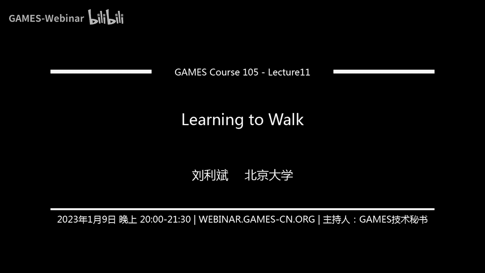

# GAMES105-计算机角色动画基础 - P12：Lecture11 学习行走 🚶‍♂️

在本节课中，我们将学习如何让一个基于物理仿真的虚拟角色实现行走。我们将从静态平衡控制出发，探讨实现动态行走的挑战，并介绍几种经典的简化模型控制方法。

## 概述

在前两节课中，我们学习了物理仿真基础以及如何通过反馈控制让角色保持原地平衡。本节课，我们将在此基础上更进一步，探讨如何让角色在场景中移动，特别是实现行走这一基本动作。

## 从静态平衡到动态行走

上一节我们介绍了如何实现静态的原地平衡控制。这种控制器可以结合动作跟踪，让角色在保持平衡的同时完成上半身的一些动作。然而，原地平衡能做的事情非常有限。

对于基于运动学的方法，移动角色非常简单，只需直接设置关节位置即可。但对于物理仿真，我们不能直接控制角色的全局位置，只能通过角色与地面的交互力（地面反作用力）来推动角色移动。因此，如何规划全身控制以实现行走，是物理仿真角色动画的核心挑战之一。

## 行走的定义与分析 🦶

行走是每个人都非常熟悉的动作。从控制角度看，行走是一个相对稳定、速度较慢的过程，这为我们提供了更多的控制时间。

一个标准的行走周期可以分解为以下几个阶段：
*   **单腿支撑期**：一只脚在空中摆动，另一只脚支撑身体。
*   **双腿支撑期**：在步态转换的瞬间，双脚同时接触地面。

行走与跑步的关键区别在于是否存在“腾空期”。行走要求至少有一只脚始终与地面接触。竞走比赛的规则正是基于此点。

以下是行走步态周期的可视化说明：

## 实现行走的策略

一种直观的策略是利用上节课的静态平衡原理。在单腿支撑期，我们需要确保角色的质心投影始终落在支撑脚构成的支撑多边形内。在双腿支撑期，我们则利用更大的支撑区域，将质心从一个支撑脚转移到另一个支撑脚。

然而，静态平衡策略存在局限性。它假设角色处于准静止状态，而实际行走会产生动量和角动量。若不能很好地控制这些量，角色很容易失去平衡。因此，要实现更自然、灵活的行走，需要引入动态平衡控制。

## 核心概念：零力矩点

在双足机器人领域，一个非常重要的概念是**零力矩点**。它是指地面上满足水平方向合外力矩为零的一个点。

我们可以通过受力分析来理解ZMP。考虑角色处于单腿支撑状态，地面给脚的反作用力可以等效为施加在某一点 `P` 上的一个合力 `F` 和一个力矩 `τ`。通过力学公式推导，我们可以找到一个特殊的点 `P`，使得相对于该点的水平方向力矩为零。这个点就是ZMP。

`τ_horizontal(P) = 0`

ZMP的位置可以通过当前角色的状态（如质心位置、速度、外力等）计算出来。它的物理意义在于：
*   如果计算出的ZMP位于支撑多边形**内部**，说明角色处于动态平衡状态。
*   如果ZMP位于支撑多边形**外部**，则意味着角色正在失去平衡（例如即将摔倒）。

因此，ZMP可以作为一个关键的平衡指标。在控制角色时，如果我们能始终将ZMP保持在支撑多边形内，就能维持角色的动态平衡。

## 简化模型控制方法

直接控制具有数十个自由度的复杂人体模型非常困难。因此，常见的思路是使用**简化模型**。即从复杂模型中提取出与平衡和移动最相关的关键变量（如质心、支撑点），构建一个更简单的物理模型，并在这个模型上进行轨迹规划和控制器设计。最后，再将简化模型的结果映射回完整的人体模型。

接下来，我们将介绍三种经典的基于简化模型的行走控制方法。

### 方法一：ZMP跟踪与桌子-小车模型

这是一种在机器人领域非常经典的方法。它将复杂的双足机器人简化为一个“桌子-小车”模型：
*   **桌子**：代表机器人的支撑脚。
*   **桌上的小车**：代表机器人质心的水平运动。

该模型的目标是：通过控制小车的运动，使得整个系统的ZMP能够跟踪一条预设的轨迹。这条预设轨迹通常是在双脚支撑区域之间平滑移动的曲线，对应着行走中重心转移的过程。

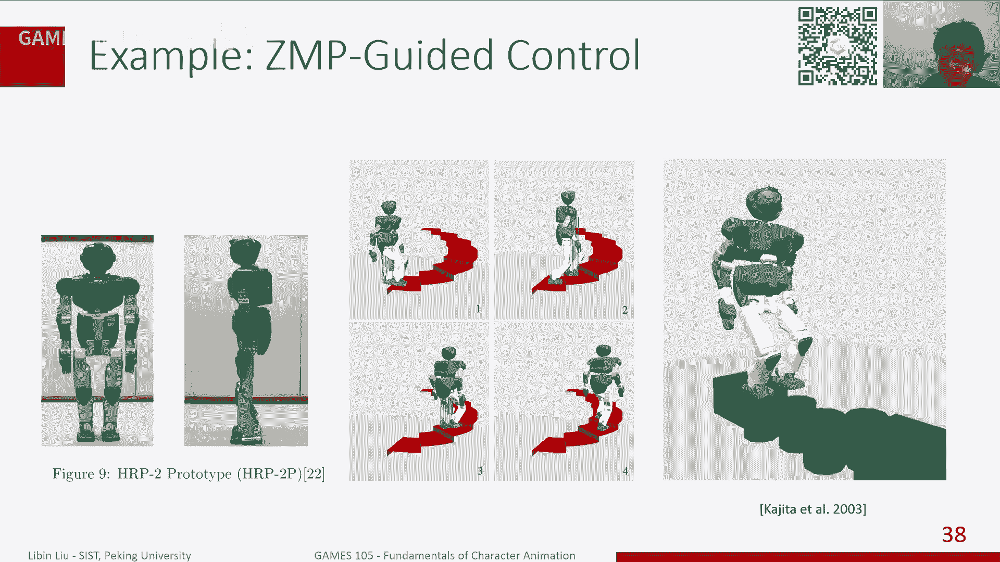

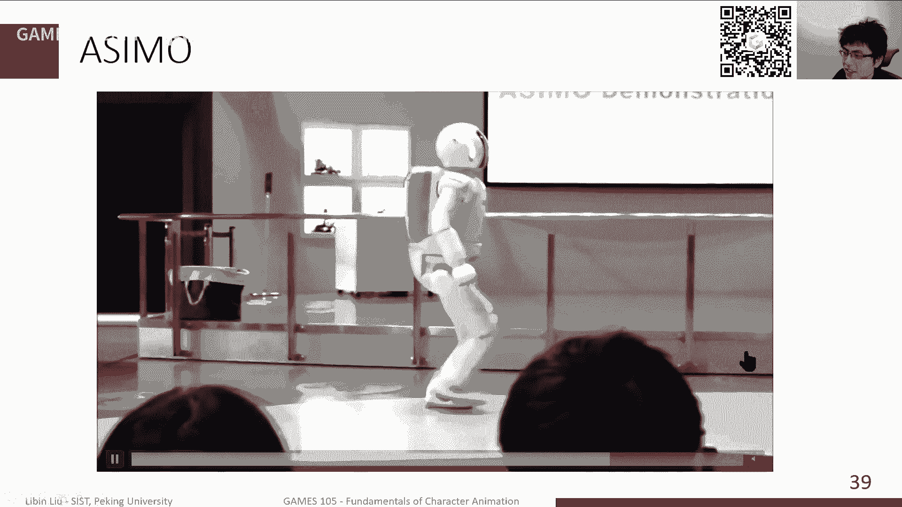

通过优化计算，我们可以得到小车（即质心）应该遵循的轨迹。然后，利用逆向运动学，根据规划出的质心轨迹和脚部位置，计算出全身关节的目标姿态，最后通过PD控制器进行跟踪。

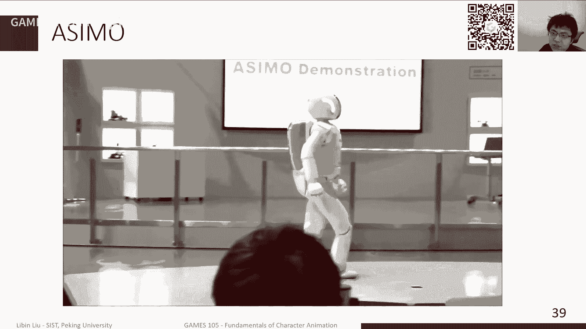

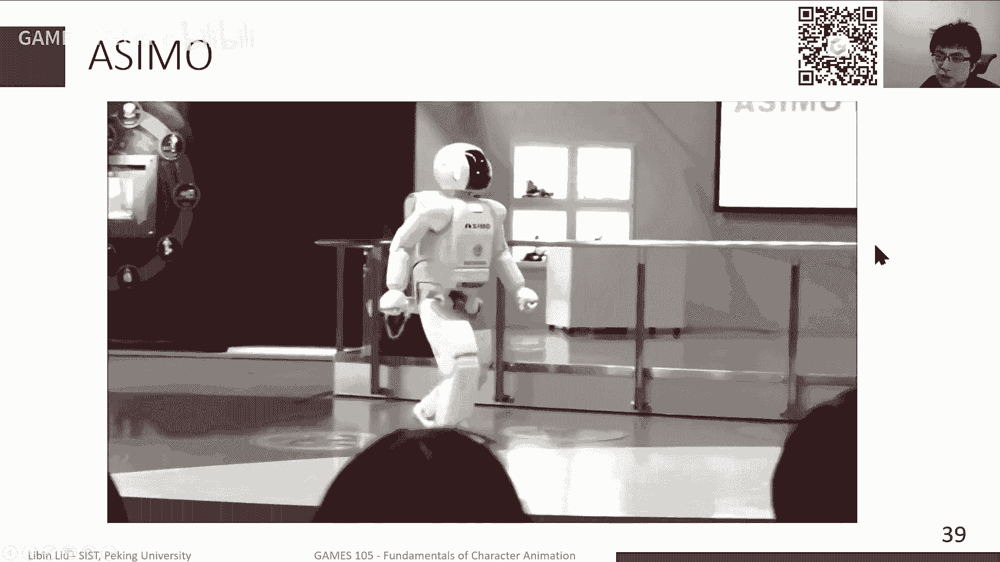

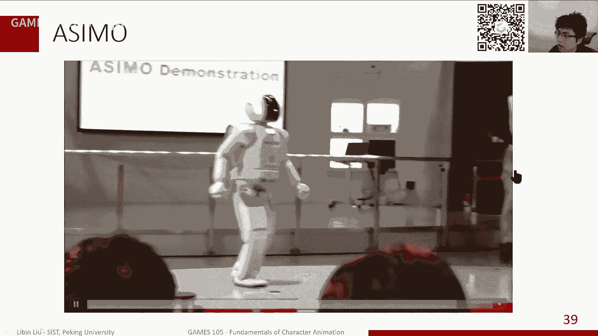

这种方法可以实现稳定、拟人化的行走，甚至能应对上楼梯等复杂场景。本田公司的ASIMO机器人就是应用此类技术的代表。

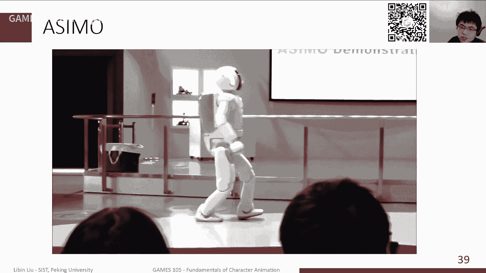

### 方法二：倒立摆模型与步态规划

生物学研究表明，人类行走其实更像一个受控的摔倒过程。我们并非时刻保持完美平衡，而是允许质心前移失去平衡，然后通过迈出下一步来重新获得支撑。

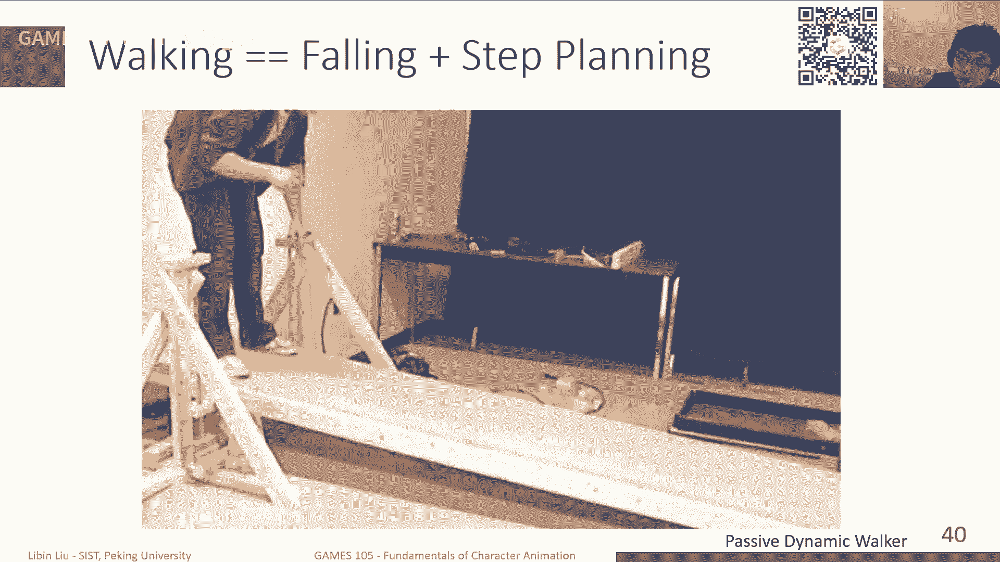

**倒立摆模型**非常适合描述这种动态。在单腿支撑期，我们可以将角色简化为一个倒立摆：
*   **摆锤**：角色的质心。
*   **支点**：支撑脚与地面的接触点。

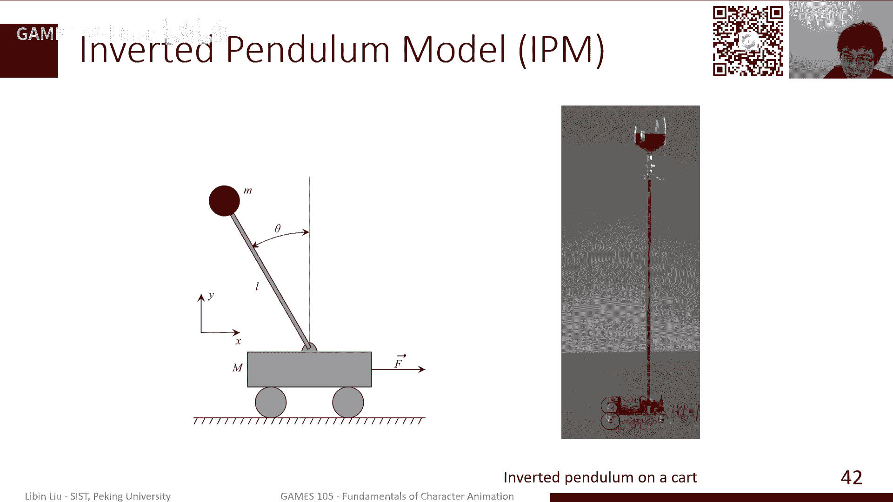

基于此模型的一个经典工作是“广义倒立摆控制”。其核心思想是：根据当前质心的位置和速度，计算下一步的落脚点，使得质心在迈步后能像倒立摆一样，恰好摆动到新支撑点的正上方时速度降为零。

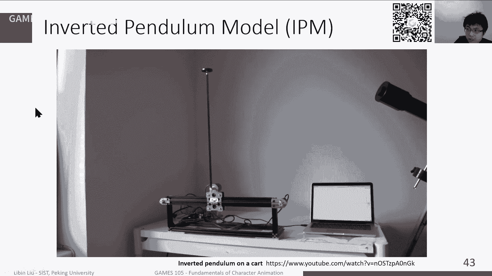

具体而言，利用能量守恒定律，可以根据当前质心的动能，推算出它能到达的最大高度（对应摆杆长度），从而确定下一步的落脚位置。得到落脚点后，再通过轨迹插值和逆向运动学生成全身动作。

这种方法非常鲁棒，角色可以在受到推挤、搬运物体或地形变化时，通过实时调整落脚点来保持平衡。
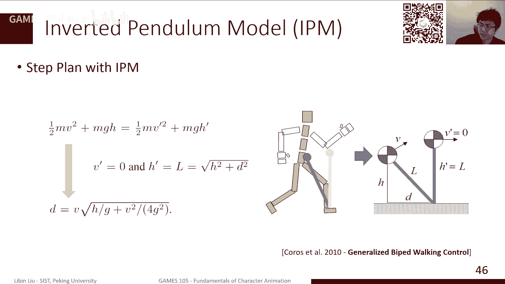
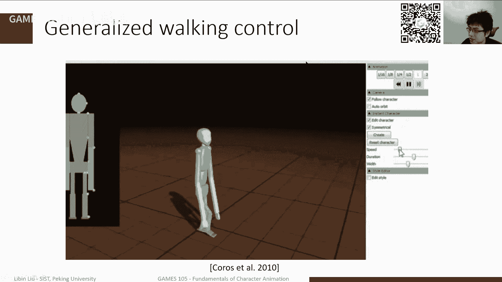

### 方法三：线性反馈控制

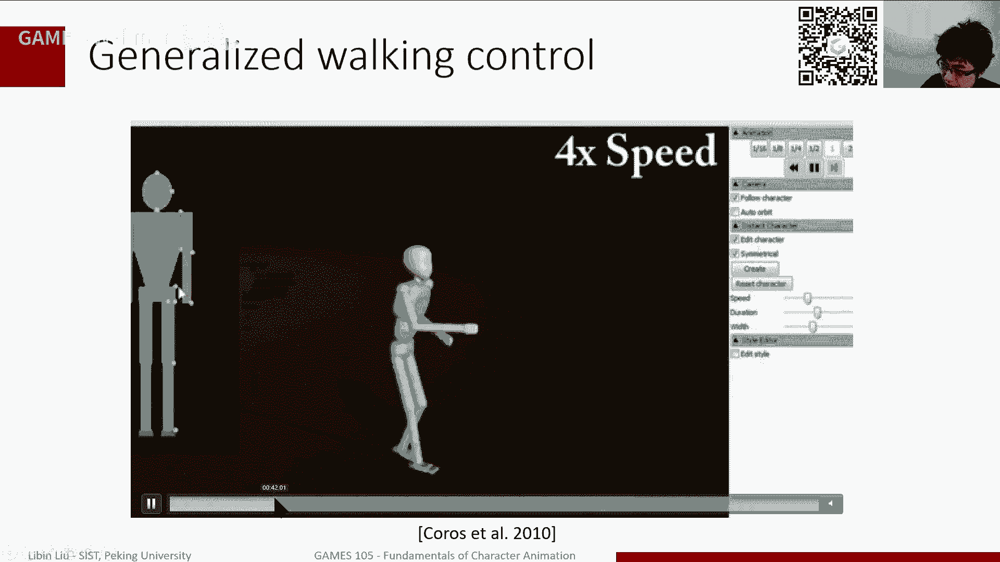

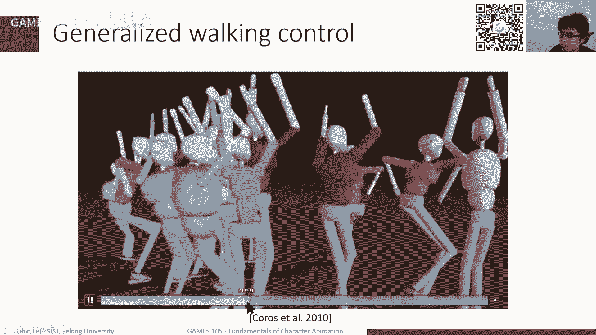

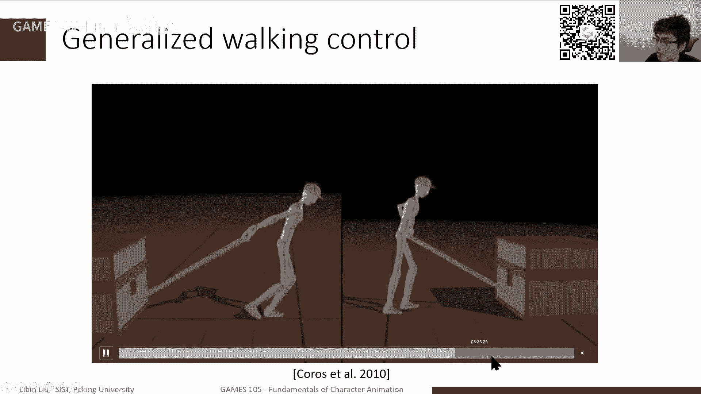

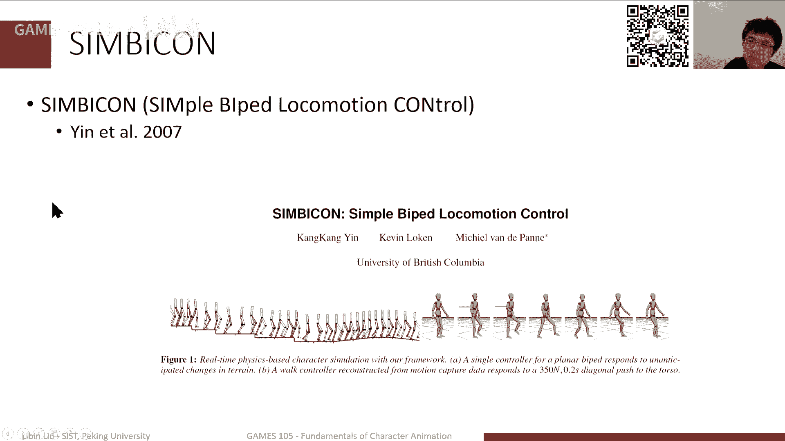

这是一个更早但非常经典的工作，旨在用最简单的反馈实现鲁棒的行走控制。该方法主要包含三部分：

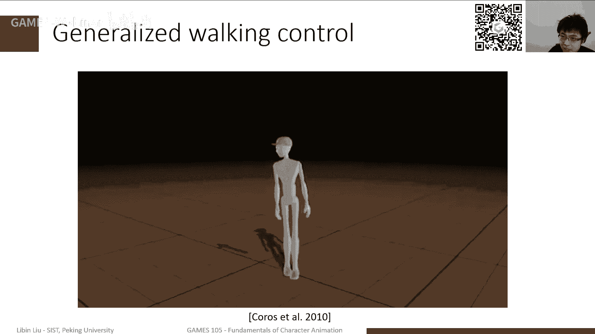

1.  **开环轨迹跟踪**：使用PD控制器跟踪一个预设的步行周期姿态序列（或动作捕捉数据）。
2.  **躯干姿态控制**：通过协调髋关节和腰部力矩，控制上半身躯干保持竖直，这是一个稳定的姿态。
3.  **质心速度反馈**：这是实现平衡的关键。它建立一个非常简单的线性反馈规则，根据当前质心的位置和速度偏差，调整摆动腿的目标姿态。

`Δθ_swing = k_p * (x_com - x_desired) + k_d * (v_com - v_desired)`

其中 `k_p` 和 `k_d` 是手动调节的参数。其直觉是：当质心向前摔倒的速度过快时，就命令摆动腿更快地向前摆动，以更快地落下提供支撑；反之则减慢摆动。

这种方法虽然简单，但首次在角色动画中实现了较为鲁棒的二维及三维步行控制。不过，其动作质量略显机械，且反馈参数需要针对不同动作进行调节。

## 总结

本节课我们一起学习了基于物理仿真的角色行走控制。我们首先分析了行走的步态周期和动态平衡的挑战，并引入了**零力矩点**这一核心概念作为平衡指标。

接着，我们重点介绍了三种基于**简化模型**的经典控制方法：
1.  **ZMP跟踪**（桌子-小车模型）：通过控制质心运动来精确跟踪ZMP轨迹，实现稳定、拟人的步行。
2.  **倒立摆模型**：将行走建模为受控的摔倒过程，通过能量守恒实时规划落脚点，鲁棒性很强。
3.  **线性反馈控制**：在开环跟踪基础上，增加简单的线性反馈来调节步态，实现简单而有效的平衡。

这些传统方法具有较好的可解释性，能够定量分析角色的平衡状态。然而，它们通常针对特定动作（如行走）设计，难以泛化到更复杂的动作。在下节课中，我们将探讨基于机器学习（如强化学习）的方法，这些方法能够学习更广泛、更复杂的运动技能。

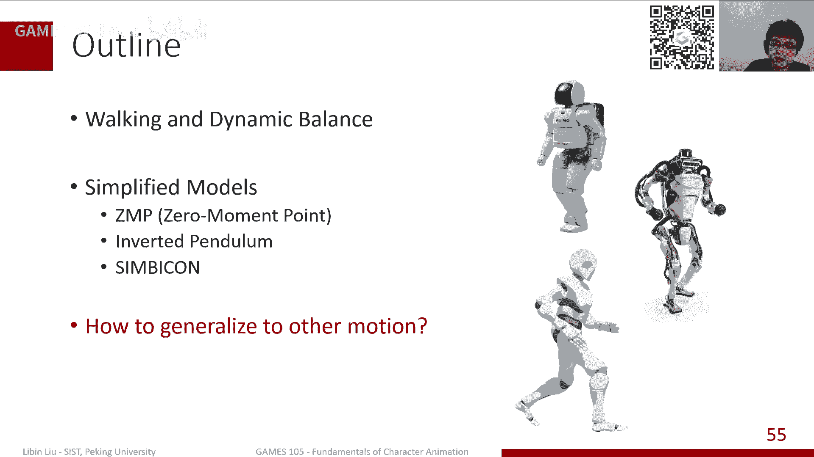

---
*本节课是GAMES105课程的第十一讲，主要介绍了实现物理角色行走的传统控制方法。这些经典思想为后续的智能控制奠定了重要基础。*