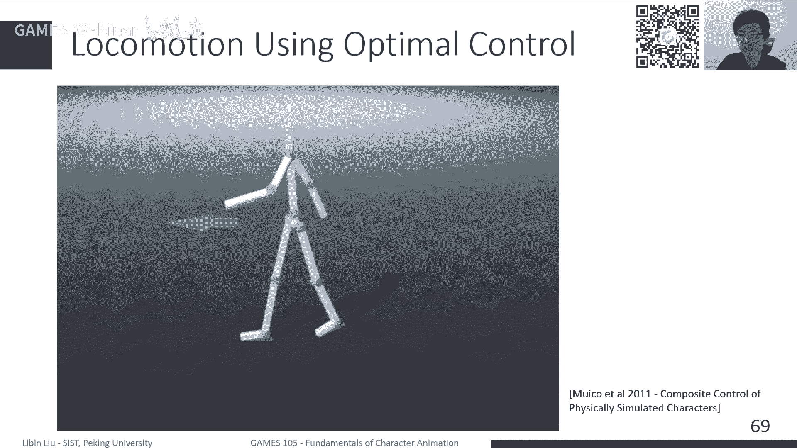

# GAMES105-计算机角色动画基础 - P13：Lecture12 最优控制与强化学习 🎯🤖

在本节课中，我们将学习最优控制与强化学习的基本概念，并探讨它们在计算机角色动画中的应用。我们将从最优控制理论出发，理解其与强化学习的联系与区别，并介绍一些基于这些技术的经典工作。

---

## 概述

上一节我们介绍了基于物理的角色动画控制方法。本节中，我们将深入探讨两类更高级的控制理论：最优控制与强化学习。最优控制为我们提供了在已知系统模型下寻找最优控制信号的数学框架，而强化学习则能在模型未知或复杂的情况下，通过与环境的交互来学习控制策略。我们将看到，这两种方法在实现复杂、鲁棒的角色动画方面都扮演着重要角色。

---

## 最优控制基础

最优控制是控制理论中的一个重要分支，旨在为动态系统寻找一个控制信号，使得某个性能指标（如能量消耗、跟踪误差）达到最优。在角色动画中，这通常意味着寻找施加在角色关节上的力矩序列，以驱动角色完成特定动作。

### 问题建模

我们如何实现控制？只能通过在角色身体上施加力（主要是关节力矩）来驱动角色。例如，如果我们想让角色执行一个后空翻，我们希望自动找到一系列控制策略（通常表现为PD控制的目标值），使得仿真轨迹与期望的运动轨迹相匹配。

为了找到这一系列轨迹，我们可以将控制建模为一个优化问题。在每一仿真步，我们计算当前步与参考运动数据的偏差，并将所有步的偏差累加起来，构成优化目标。优化的对象是每一步所施加的力。

这里有一个关键问题：优化时需要满足物理规律。在仿真中，物理规律是真实规律的简化，但本质上仍由一系列带约束的方程（如刚体动力学方程）描述。

### 开环控制与反馈控制

我们之前提到了开环控制（或前馈控制）和反馈控制。
*   **开环控制**：根据起始状态和目标状态，直接计算出一条控制信号轨迹。执行这条轨迹即可从起点到达终点。其优点是只需计算控制信号，问题相对简单；缺点是若轨迹中途受到扰动，系统很可能无法达到目标。
*   **反馈控制**：计算一个控制策略函数，该函数根据角色当前的状态（即使受到扰动后）实时计算控制信号。这相当于在状态空间中定义了一个“场”，能将任何起始状态逐渐推向目标状态。这个问题比开环控制更难，因为它需要考虑整个状态空间。

这两种方式都可以描述为优化问题，但优化对象不同：轨迹优化优化的是每个时刻的控制信号；反馈控制优化的是控制策略函数本身。它们统称为最优控制问题。

---

## 轨迹优化与庞特里亚金极大值原理

本节我们来看看如何求解开环控制问题，即轨迹优化。

### 带约束优化与拉格朗日乘子法

轨迹优化是一个带约束的优化问题：我们希望在满足运动方程约束的前提下，最小化目标函数。处理等式约束优化问题的常用方法是**拉格朗日乘子法**。

对于一个简单问题：最小化 `f(x)`，约束为 `g(x)=0`。其极值点满足的必要条件是，`f(x)` 和 `g(x)` 在该点的梯度方向平行。我们可以构造拉格朗日函数 `L(x, λ) = f(x) + λ * g(x)`。原问题的最优解 `(x*, λ*)` 可通过求解 `∇_x L = 0` 和 `∇_λ L = 0` 得到。

对于我们的轨迹优化问题，目标函数是沿时间累积的代价和，约束是离散时间的运动方程。我们可以类似地写出其拉格朗日函数，并对所有状态变量、控制变量和拉格朗日乘子求导。

### 庞特里亚金极大值原理

通过求导和整理，我们可以得到一组刻画最优轨迹的必要条件，这被称为**庞特里亚金极大值原理**：
1.  **状态方程**：系统的动力学方程，描述状态如何向前演化。
2.  **协态方程**：一个逆向演化的方程，描述了拉格朗日乘子（或称协态）的变化。
3.  **控制方程**：一个优化条件，用于根据当前状态和协态计算最优控制量。

这几个条件合在一起，构成了求解最优开环控制轨迹的基础。

### 求解方法：打靶法

一种基于PMP求解轨迹优化的直接方法是**打靶法**。其流程如下：
1.  **前向过程**：猜测一个初始控制序列，执行仿真，记录下产生的状态轨迹。
2.  **后向过程**：利用记录的状态轨迹，从最后一帧开始，逆向积分协态方程，得到每一时刻的协态值。
3.  **更新过程**：利用当前状态和协态，根据控制方程计算梯度，并更新控制序列。

通过不断迭代这三个步骤，可以逐渐找到最优的控制轨迹。然而，对于像人体运动这样高度非线性的复杂问题，目标函数可能存在大量局部极值，使得基于梯度的方法（如打靶法）难以收敛。因此，实践中常结合无梯度优化方法（如CMA-ES）或多重打靶等技术。

---

## 反馈控制与动态规划

上一节我们介绍了开环控制的优化理论。本节中，我们转向反馈控制，其核心是**动态规划**和**贝尔曼最优性原理**。

### 贝尔曼最优性原理

考虑一个经典的最短路径问题：在一个图中，找到从起点到终点的最短路径。我们可以将其视为一个控制问题：每个节点是一个状态，从节点出发选择哪条边是控制动作。

对于一个最优的反馈控制策略 `π`，贝尔曼最优性原理指出：**无论从哪个状态开始，也无论第一步选择了哪个动作，在到达新状态后，剩余部分所遵循的策略，必须是从这个新状态出发到达目标的最优策略。**

这意味着最优策略具有“最优子结构”性质。

### 价值函数与贝尔曼方程

基于贝尔曼原理，我们可以定义**价值函数** `V(s)`，它表示从状态 `s` 出发，遵循最优策略到达目标所能获得的最小总代价。

价值函数满足一个重要的递归关系，即**贝尔曼方程**：
`V(s) = min_a [ cost(s, a) + V( next_state(s, a) ) ]`
其中，`cost(s, a)` 是执行动作 `a` 的即时代价，`next_state(s, a)` 是执行动作后的下一个状态。

如果我们知道了最优价值函数 `V*(s)`，那么最优策略 `π*(s)` 就很简单：选择能使 `cost(s, a) + V*( next_state(s, a) )` 最小的动作 `a`。

### Q函数

为了更方便地表达策略选择，我们定义**Q函数**（或称状态-动作价值函数）：
`Q(s, a) = cost(s, a) + V( next_state(s, a) )`
它表示在状态 `s` 下执行动作 `a`，并随后遵循最优策略所得到的总代价。那么最优策略就是：`π*(s) = argmin_a Q*(s, a)`。

因此，求解反馈控制问题的核心之一就是学习价值函数 `V` 或 Q函数 `Q`。

---

## 线性二次型调节器：一个特例

前面讨论的反馈控制问题通常很难得到闭式解。但对于一类特殊问题——**线性二次型调节器**（LQR），我们可以得到解析解。

LQR问题满足两个条件：
1.  **系统是线性的**：状态转移方程 `s_{t+1} = A * s_t + B * a_t`。
2.  **代价函数是二次的**：目标函数是状态和控制量的二次型。

对于LQR问题，可以证明：
*   最优价值函数 `V_t(s)` 是状态 `s` 的二次型。
*   最优控制策略是状态的**线性反馈**：`a_t = -K_t * s_t`。
*   反馈增益矩阵 `K_t` 和代价函数中的矩阵 `P_t` 可以通过一个从后向前的递推公式（Riccati方程）高效计算。

LQR为我们在简单线性系统下设计最优反馈控制器提供了强大工具。对于非线性系统（如人体运动），一种思路是在参考轨迹附近进行线性化，将问题近似为一系列LQR问题来求解，这衍生出iLQR（迭代LQR）和DDP（微分动态规划）等算法。

---

## 从最优控制到强化学习

最优控制（尤其是反馈控制）与强化学习有着深刻联系。它们的目标通常是相似的：最大化（或最小化）长期累积的回报（或代价）。主要区别在于：
*   **最优控制**：通常是**基于模型**的。我们假设系统的动力学方程 `f(s, a)` 是已知且精确的。
*   **强化学习**：通常是**无模型**的。我们不假设知道精确的动力学模型，而是通过智能体与环境的交互试错来学习策略。

在角色动画中，真实的物理仿真或机器人往往存在模型不精确、传感器噪声等问题，这使得无模型的强化学习方法更具吸引力。

### 强化学习基础：马尔可夫决策过程

强化学习问题通常被建模为**马尔可夫决策过程**。一个MDP由以下要素定义：
*   **状态空间 S**：所有可能状态的集合。
*   **动作空间 A**：所有可能动作的集合。
*   **状态转移概率 P(s'|s, a)**：在状态 `s` 执行动作 `a` 后，转移到状态 `s'` 的概率。
*   **奖励函数 R(s, a, s')**：在状态 `s` 执行动作 `a` 并到达 `s'` 所获得的即时奖励。

目标是找到一个策略 `π(a|s)`，最大化期望累积折扣奖励：`E[ Σ γ^t * R_t ]`，其中 `γ` 是折扣因子。

### 强化学习算法分类

以下是两类主要的强化学习算法：

1.  **基于价值的方法**：
    *   **核心思想**：学习最优价值函数 `V*(s)` 或 `Q*(s, a)`，然后通过 `π*(s) = argmax_a Q*(s, a)` 导出策略。
    *   **特点**：通常用于离散动作空间。经典算法包括Q-Learning、DQN（深度Q网络）。
    *   **在动画中的应用**：可用于高级决策，例如在复杂地形中选择何时切换不同的底层运动控制器。

2.  **基于策略的方法**：
    *   **核心思想**：直接参数化策略 `π_θ(a|s)`（例如用神经网络），并通过梯度上升来优化参数 `θ`，以最大化期望回报。
    *   **特点**：天然适用于连续动作空间。为了降低方差，通常会同时学习一个价值函数作为基线（评论家），形成**演员-评论家**框架。
    *   **经典算法**：REINFORCE, TRPO, PPO。**PPO** 因其良好的稳定性和性能，在物理角色动画领域应用非常广泛。

通过结合强化学习（如PPO）和轨迹优化提供的初始解，我们现在可以为角色学习出非常复杂的运动控制器，并且能够适应不同的角色体型、运动速度等参数。

---

## 前沿与展望

近年来，生成模型（如VAE, GAN, 标准化流，扩散模型）与强化学习的结合，为生成多样化、可控的角色运动开辟了新方向。这些方法能够从随机噪声生成连贯的动作，或根据用户指令（如文本描述）生成相应运动。

未来可能的发展方向包括：
*   **大规模预训练“运动基础模型”**：类似于语言模型，从海量运动数据中学习一个通用的“运动知识”模型，作为各种下游运动任务的基础。
*   **跨模态生成与控制**：结合语言、音频、视觉等多模态信息，驱动数字角色进行更智能、更逼真的交互与表演。
*   **更精细的生理模型**：从当前的关节力矩控制，发展到基于肌肉模型的更生物逼真的控制。
*   **群体动画与交互**：研究多角色之间的协作、竞争等复杂交互行为的生成与控制。

---

## 总结

本节课中，我们一起学习了最优控制与强化学习的基本原理及其在计算机角色动画中的应用。
*   我们从**最优控制**理论出发，介绍了**轨迹优化**（开环控制）的庞特里亚金极大值原理，以及**反馈控制**的贝尔曼最优性原理和价值函数概念，并探讨了线性二次型调节器（LQR）这一特例。
*   我们探讨了最优控制与**强化学习**的联系与区别，指出强化学习作为一种无模型方法，在解决复杂、非线性系统控制问题上的优势。
*   我们简要介绍了强化学习的**马尔可夫决策过程**框架，以及**基于价值**和**基于策略**的两类主要算法。
*   最后，我们展望了结合生成模型、大规模预训练等前沿技术，为角色动画未来带来的可能性。

最优控制与强化学习为创建物理上真实、行为上智能的虚拟角色提供了强大的理论工具，是连接运动学动画与真正自主交互式数字角色的关键桥梁。