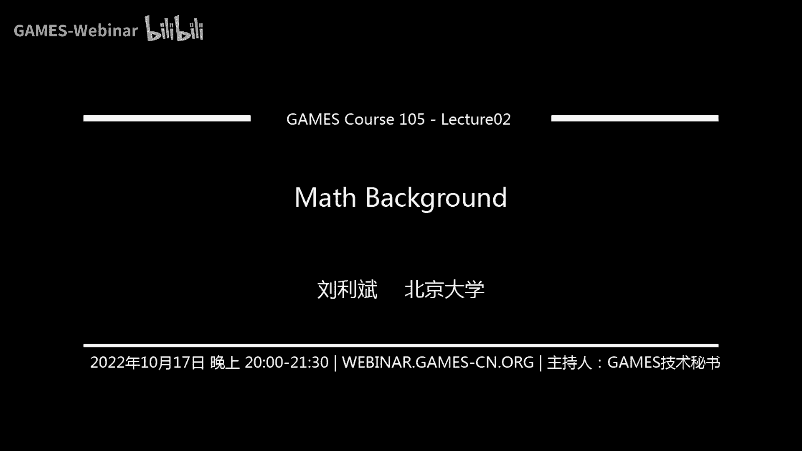

# GAMES105-计算机角色动画基础 - P2：Lecture02 数学基础 📐

在本节课中，我们将学习角色动画中至关重要的数学背景知识。主要内容包括线性代数的核心概念回顾，以及三维旋转的多种表示方法。掌握这些基础知识是理解后续运动学算法的关键。

## 线性代数回顾 🔢

上一节我们介绍了课程的整体框架，本节中我们首先回顾线性代数中与角色动画紧密相关的核心概念。

### 向量

向量是同时具有大小和方向的量。在角色动画中，向量可以用来表示位置、速度、加速度等物理量。

*   **定义与表示**：一个 n 维向量 **a** 可以表示为一组有序数字，通常写作列向量形式：**a** = [a₁, a₂, ..., aₙ]ᵀ。其长度（模）为：||**a**|| = √(a₁² + a₂² + ... + aₙ²)。
*   **单位向量**：长度为 1 的向量，可通过 **a** / ||**a**|| 得到。
*   **基本运算**：
    *   **加法**：**a** + **b** = [a₁+b₁, a₂+b₂, ..., aₙ+bₙ]ᵀ，满足交换律。
    *   **数乘**：k**a** = [ka₁, ka₂, ..., kaₙ]ᵀ。

### 向量的乘积运算

向量之间有两种重要的乘积运算：点乘和叉乘。

**点乘（内积）**
点乘的结果是一个标量，定义为：**a** · **b** = Σᵢ aᵢbᵢ = a₁b₁ + a₂b₂ + ... + aₙbₙ。
在三维欧式空间中，它具有明确的几何意义：**a** · **b** = ||**a**|| ||**b**|| cosθ，其中 θ 是两向量间的夹角。因此，点乘常用于计算夹角或一个向量在另一个向量方向上的投影。

**叉乘（外积）**
叉乘是三维空间特有的运算，结果是一个新的向量。其分量定义为：
**a** × **b** = [a₂b₃ - a₃b₂, a₃b₁ - a₁b₃, a₁b₂ - a₂b₁]ᵀ。
叉乘的几何意义是：结果向量 **c** = **a** × **b** 同时垂直于 **a** 和 **b**，方向由右手定则决定，其长度等于以 **a** 和 **b** 为边的平行四边形的面积：||**c**|| = ||**a**|| ||**b**|| |sinθ|。
叉乘不满足交换律（**a** × **b** = -**b** × **a**）和结合律。

### 矩阵

矩阵是一个二维数组，是表示线性变换和坐标变换的有力工具。

*   **基本运算**：
    *   **转置**：将矩阵的行列互换，记作 **A**ᵀ。
    *   **乘法**：若 **C** = **AB**，则 Cᵢⱼ = Σₖ Aᵢₖ Bₖⱼ。矩阵乘法满足结合律，但不满足交换律。
    *   **逆**：若 **AB** = **I**（单位矩阵），则 **B** 是 **A** 的逆矩阵，记作 **A**⁻¹。性质：(**AB**)⁻¹ = **B**⁻¹**A**⁻¹。
*   **特殊矩阵**：
    *   **正交矩阵**：满足 **A**ᵀ**A** = **AA**ᵀ = **I**，即 **A**⁻¹ = **A**ᵀ。正交矩阵的行列式为 ±1。
    *   **反对称矩阵**：满足 **A**ᵀ = -**A**，主对角线元素为 0。
*   **向量运算的矩阵形式**：
    *   点乘：**a** · **b** = **a**ᵀ**b**。
    *   叉乘：**a** × **b** 可以表示为矩阵乘法 [**a**]× **b**，其中 [**a**]× 是由向量 **a** 构造的反对称矩阵。

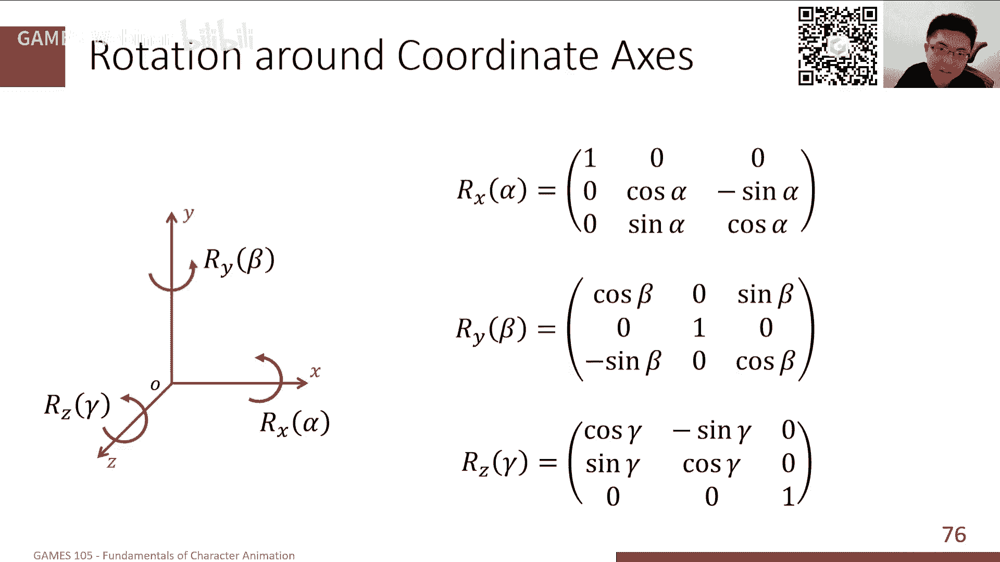

### 坐标基与变换

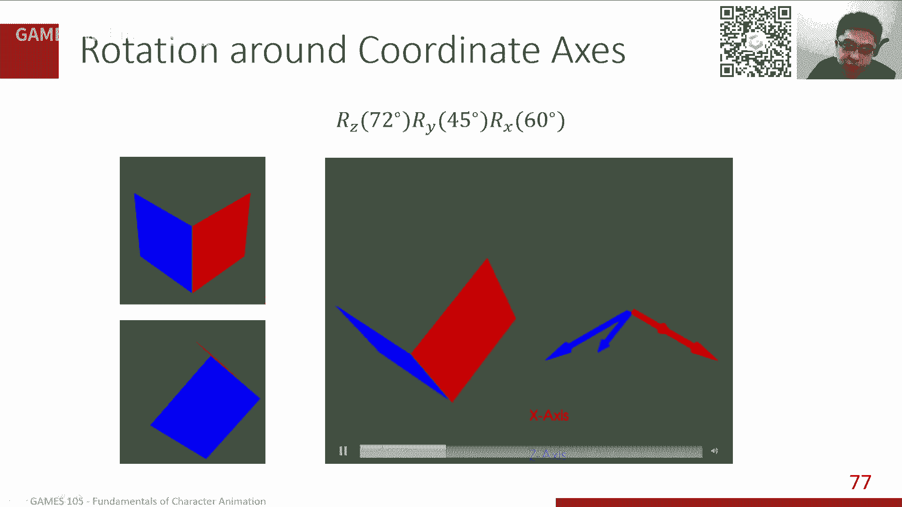

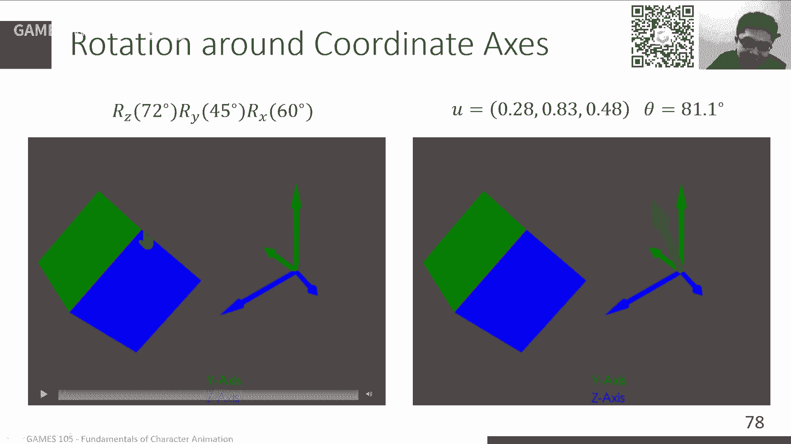

在三维空间中，我们通常使用一组标准正交基 {**e**_x, **e**_y, **e**_z}（即 x, y, z 轴的单位向量）来描述向量。任何向量 **v** 都可以表示为这组基的线性组合：**v** = v_x **e**_x + v_y **e**_y + v_z **e**_z，系数 (v_x, v_y, v_z) 就是其坐标。

变换描述了如何将一个坐标系下的点或向量转换到另一个坐标系下。我们主要关注刚性变换，它包括旋转和平移，不改变物体的形状和大小。

*   **平移变换**：非常简单，**p'** = **p** + **t**。
*   **旋转变换**：可以用一个 3x3 的旋转矩阵 **R** 表示，**p'** = **R****p**。旋转矩阵是行列式为 +1 的正交矩阵。

组合变换时，顺序至关重要。例如，先旋转 **R** 再平移 **t**，变换为 **p'** = **R****p** + **t**。从局部坐标系到世界坐标系的变换常采用这种形式。

## 三维旋转的表示方法 🔄

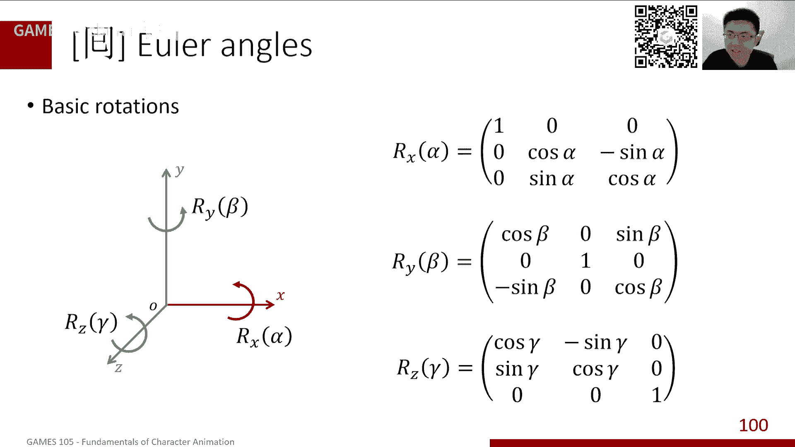

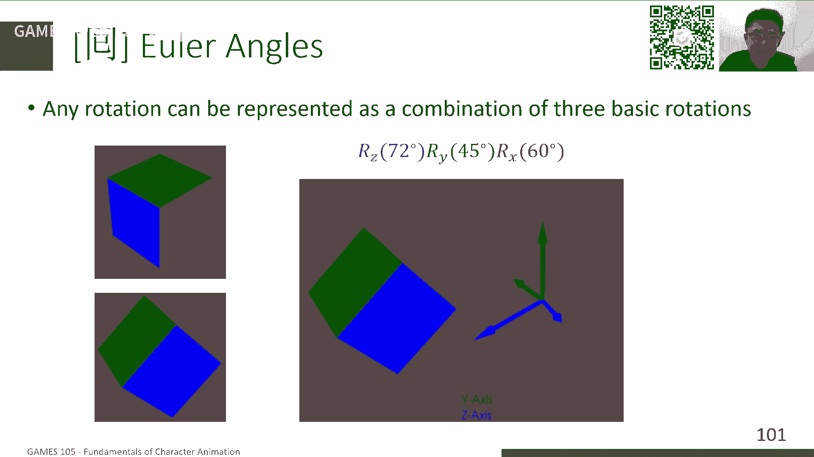

上一节我们回顾了线性代数基础，本节中我们深入探讨三维旋转的多种表示方法。由于旋转是非线性的，其表示和插值都比平移复杂得多。

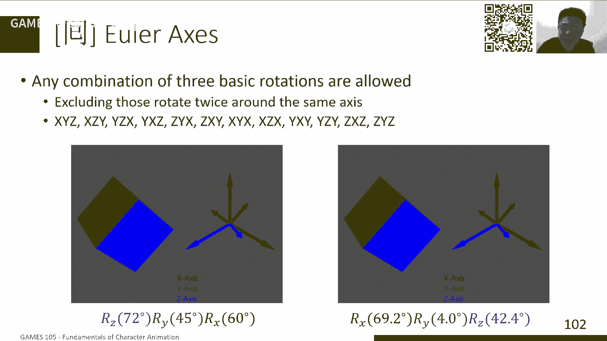

### 旋转矩阵

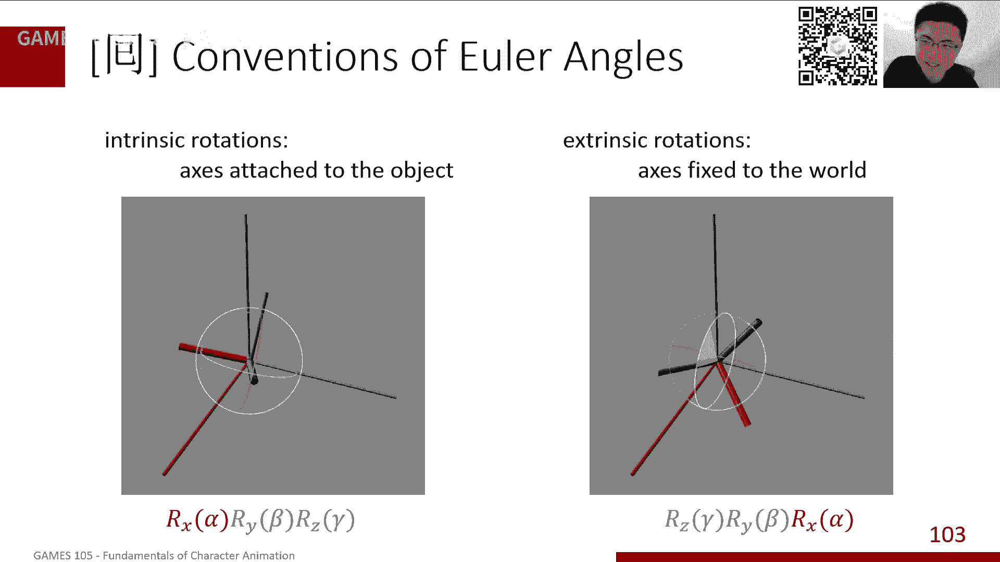

这是最直接的表示，用一个 3x3 正交矩阵 **R** ( **R**ᵀ**R** = **I**, det(**R**) = +1) 表示旋转。

*   **优点**：旋转向量非常方便（**v'** = **R****v**）；组合旋转只需矩阵乘法。
*   **缺点**：9 个参数带有 6 个约束（正交性），不直观；直接对矩阵元素进行线性插值无法得到合法的旋转矩阵，会导致物体扭曲。

### 欧拉角

欧拉角用三个绕特定坐标轴连续旋转的角度 (α, β, γ) 来表示任意旋转。旋转顺序至关重要（例如 XYZ, ZYX 等），并且有“内旋”（绕物体自身轴）和“外旋”（绕固定世界轴）两种约定。

*   **优点**：非常直观，易于人类理解和使用（在三维软件中广泛使用）；三个参数无约束。
*   **缺点**：
    *   **万向节死锁**：当中间轴的旋转使某两个轴对齐时，会失去一个自由度，导致表示不唯一和插值路径奇异。
    *   **插值问题**：角度存在周期性（如 0° 和 360° 等价），直接线性插值可能导致不必要的“绕远路”。

### 轴-角表示

任何旋转都可以表示为绕一个单位轴向量 **u** 旋转角度 θ。这可以紧凑地表示为旋转向量 **r** = θ**u**。

*   **优点**：几何意义清晰；四个参数（3维单位向量+1角度），带一个约束（||**u**||=1）。
*   **缺点**：旋转运算不方便（需用 Rodrigues 公式转化为矩阵）；组合旋转困难；插值（对 **r** 线性插值）不能保证恒定的角速度。

### 四元数

四元数是对复数在三维空间的扩展，一个单位四元数 **q** = [w, **v**] = [cos(θ/2), sin(θ/2)**u**] 可以表示绕轴 **u** 旋转角度 θ。

*   **优点**：
    *   **紧凑且无奇异性**：4个参数带1个约束（||**q**||=1），无万向节死锁。
    *   **高效组合**：旋转组合对应于四元数乘法，比矩阵乘法更快。
    *   **最佳插值**：可以在单位四元数构成的四维球面上进行**球面线性插值 (Slerp)**，得到平滑、角速度恒定的插值结果。公式为：
        **Slerp**(**q**_0, **q**_1; t) = (sin((1-t)Ω) / sin Ω) **q**_0 + (sin(tΩ) / sin Ω) **q**_1，
        其中 cos Ω = **q**_0 · **q**_1。
    *   **旋转向量**：对于向量 **v**，其旋转结果为 **v'** = **q** **v** **q**⁻¹（将 **v** 视为纯四元数 [0, **v**]）。
*   **缺点**：概念较抽象，不直观；存在双倍覆盖（**q** 和 **-q** 表示同一个旋转），插值时需注意选择最短路径。

以下是四种表示方法的对比总结：

| 表示方法 | 参数数量 | 约束条件 | 直观性 | 组合旋转 | 插值难度 | 主要用途 |
| :--- | :--- | :--- | :--- | :--- | :--- | :--- |
| **旋转矩阵** | 9 | 6 (正交+行列式=1) | 差 | 容易（矩阵乘） | 困难（不能直接线性插） | 底层计算、变换表示 |
| **欧拉角** | 3 | 无 | **优秀** | 困难（顺序依赖） | 中等（需处理周期和死锁） | **用户交互、动画关键帧** |
| **轴-角** | 4 (3+1) | 1 (轴为单位向量) | 好 | 困难 | 中等（线性插值不恒定） | 物理模拟、旋转差 |
| **四元数** | 4 | 1 (单位四元数) | 差 | **容易（四元数乘）** | **容易（Slerp）** | **动画插值、旋转累积** |

## 总结 📝

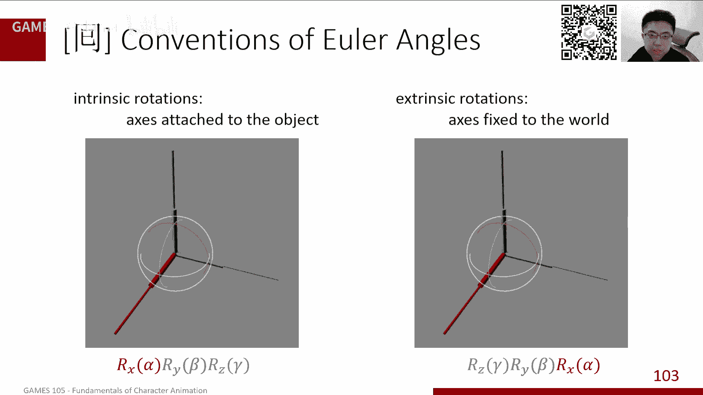

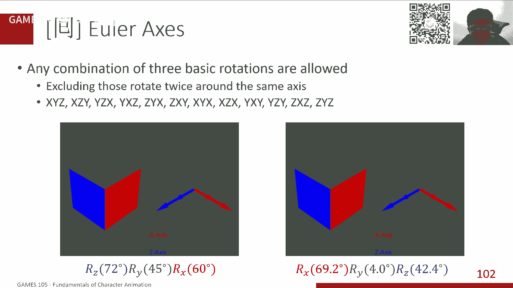

本节课中，我们一起学习了角色动画所需的数学基础。

1.  我们首先回顾了**线性代数**的核心工具：**向量**（表示与运算）、**矩阵**（运算与特殊类型）以及**坐标变换**（特别是旋转与平移的表示）。
2.  随后，我们深入探讨了**三维旋转的四种主要表示方法**：旋转矩阵、欧拉角、轴-角表示和四元数。我们分析了每种方法的**优点、缺点和适用场景**。
    *   旋转矩阵适用于底层计算。
    *   欧拉角因其直观性，最适合**用户编辑和设置关键帧**。
    *   四元数因其在**插值和组合旋转方面的卓越性能**，成为**动画引擎内部进行旋转插值和累积运算的首选**。
    *   轴-角表示则在某些物理和几何计算中很有用。

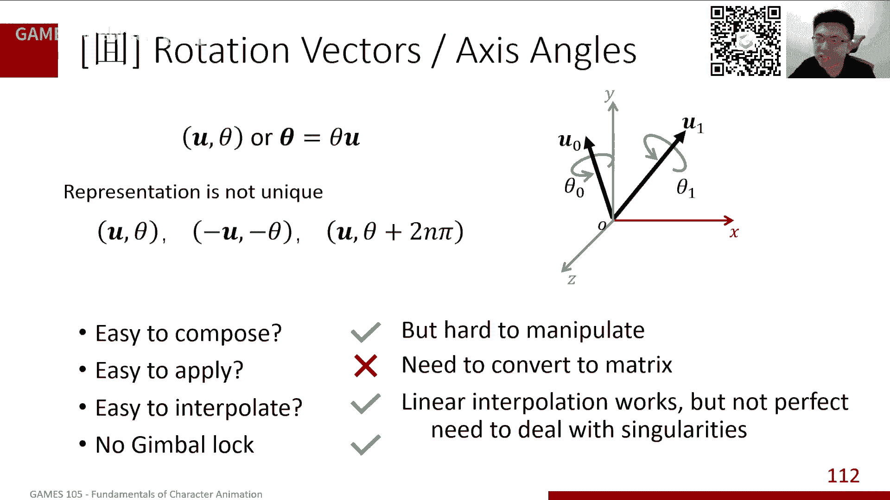

理解这些数学概念，特别是不同旋转表示之间的转换与取舍，是构建和实现角色动画算法的基石。在下节课中，我们将基于这些知识，开始学习**前向运动学**，了解如何通过关节旋转来计算末端效应器的位置。