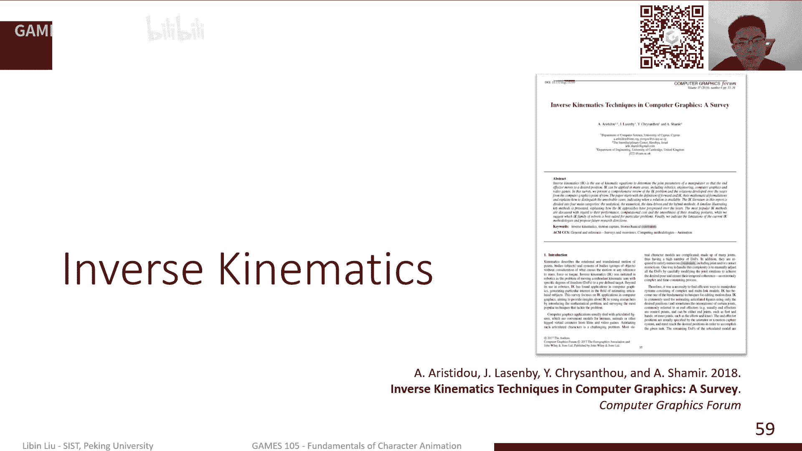
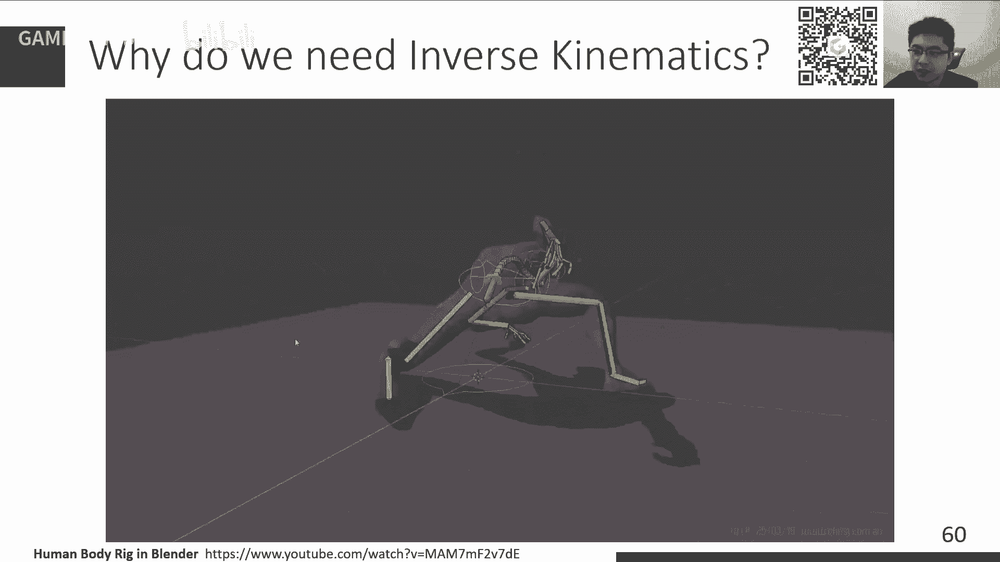

# GAMES105-计算机角色动画基础 - P3：Lecture03 角色运动学：前向与逆向运动学 🦾

在本节课中，我们将要学习角色运动学的基本知识，包括前向运动学与逆向运动学。这是构建和控制虚拟角色动画的核心基础。

前两节课中，我们介绍了计算机角色动画的主要技术和近年进展，并回顾了线性代数与三维旋转的表示方法。三维旋转比二维复杂，有多种表示方式，如旋转矩阵、四元数、轴角等，这些在物理引擎和游戏引擎中广泛应用。

从本节课开始，我们将引入课程作业。作业提交网站现已开放，需要注册码进行注册。作业代码库将在本周内更新，内容主要围绕本节课及下节课的知识点，难度适中，提交周期约为2-3周，助教会进行评分。

## 什么是运动学？📚

上一节我们回顾了数学基础，本节中我们来看看运动学的定义。运动学是研究物体运动的学科，但有一个重要前提：它不考虑物体的质量、力等外在物理性质。如果考虑这些因素，就进入了动力学的范畴。基于物理仿真的角色动画是后续课程的重要内容，但在现阶段，我们只关注物体本身的运动。

“角色”的范围很广，不仅包括人，也涵盖机器人、机械臂等。角色动画与机器人领域在此有大量共享技术。这些角色通常有一个共性：身体由刚性部件（骨骼/连杆）构成，部件之间通过关节连接，并且运动主要表现为绕关节的旋转。当然，也存在柔性角色，但可以通过扩展刚性模型来实现。

## 角色的抽象建模 🧍

为了理解运动，我们首先需要将角色抽象成一个可计算的模型。一个常用的抽象是：将身体视为由若干骨骼（Bone/Link）组成的集合，每两块骨骼之间通过一个关节（Joint）连接。关节的作用是确保相连的骨骼在运动时不会分离，只能围绕关节进行相对旋转。

在动画软件中，虚拟角色内部都有一套这样的关节骨骼系统。对于动画师而言，通常更关心关节的位置和旋转如何改变角色的整体姿态，而不太关注骨骼的具体形状参数。

## 前向运动学计算 🔄

当我们把角色定义为一个由关节和骨骼构成的系统后，要创建一个姿势，就需要旋转各个关节。为了确保在旋转过程中整个角色保持连接、不发生撕裂，我们必须精确计算每个关节旋转后，其自身以及子关节的位置和朝向。这个计算过程就是**前向运动学**。

我们可以用一个简单的机械臂链条为例。假设链条有多个关节，每个关节上都绑定了一个局部坐标系。关节的旋转会改变其局部坐标系的朝向。

初始时，所有局部坐标系与世界坐标系平行（即旋转为单位矩阵）。如果我们旋转最后一个关节，它只会影响自身的朝向，假设变为 `R4`。接着，如果我们旋转它的父关节，这个旋转会同时影响父关节自身及其所有子关节的朝向。根据旋转的组合规则，旋转后的子关节朝向变为 `R3 * R4`。

以此类推，从根关节开始，依次施加旋转，最终每个关节的朝向等于从根关节到该关节路径上所有旋转的连续乘积。用公式表示，对于关节 `i`，其世界朝向 `Q_i` 与其父关节朝向 `Q_parent(i)` 及自身局部旋转 `R_i` 的关系为：
`Q_i = Q_parent(i) * R_i`

反之，如果知道父子关节的朝向，也可以反推出局部旋转：`R_i = Q_parent(i)^{-1} * Q_i`

### 位置计算

我们进一步假设每个局部坐标系的原点就位于关节的旋转中心。那么，骨骼的长度就体现为子关节在父关节局部坐标系中的一个固定偏移向量 `L_i`。

当父关节旋转时，这个局部偏移向量在世界坐标系中的表示会发生变化。要计算子关节在世界坐标系中的位置 `P_i`，需要进行坐标变换：
`P_i = P_parent(i) + Q_parent(i) * L_i`

这是一个迭代过程：从根关节（其位置和朝向已知）开始，可以依次计算出链条上每一个关节的位置和朝向。

### 点的变换

如果我们想知道附着在某个关节上的一个点 `X_local`（在其局部坐标系中）的世界坐标，只需应用同样的变换：
`X_world = Q_i * X_local + P_i`

总结来说，前向运动学是一个从根节点到末端节点的迭代过程，通过连续的坐标变换，更新每个关节的朝向和位置。我们也可以进行逆向计算，将一个世界坐标点逐步转换回某个关节的局部坐标系中。

## 角色模型与自由度 🎭

前面介绍了单链条的例子，但对于一个完整角色，我们通常将其建模为一个**树形结构**。这个树只有一个根节点（通常位于角色的腰部），从根节点出发，到左手、右手、左脚、右脚分别形成不同的运动学链条。

根节点的选择会影响角色的表现。例如，根节点在腰部时，抬腿会影响全身姿态；而若将右脚设为根节点，同样的腿部旋转指令会产生不同的整体朝向效果。

### 关节类型与自由度

从解剖学或机械原理来看，关节有不同的类型和属性。在角色动画中，我们通常简化建模，主要考虑两种：

1.  **铰链关节**：也称为旋转关节。它只有一个旋转自由度，只能绕一个固定轴旋转。例如人的手肘和膝盖。
    *   自由度 = 1
2.  **球窝关节**：像一个球体在碗中转动，可以在任意方向旋转。例如人的肩关节和髋关节。
    *   自由度 = 3

**自由度** 是指唯一描述一个系统状态所需的最少参数个数。对于一个在三维空间中无约束的刚体，它有6个自由度（3个平移，3个旋转）。关节通过连接骨骼，限制了平移自由度，通常只保留旋转自由度。

关节还有其他属性，如**角度限制**。例如，膝盖不能向后弯曲，其旋转范围通常被限制在0到某个角度之间。

### 姿态的参数化表示

一个角色的姿态可以用所有关节的状态来参数化表示：
*   **根节点**：包含位置 (x, y, z) 和朝向（3个参数），共6个自由度。
*   **内部关节**：每个关节根据其类型，用1个（铰链）或3个（球窝）参数表示其旋转。

整个角色的自由度是根节点自由度与所有内部关节自由度之和。在存储和计算时，我们通常让父节点的索引小于子节点，这样只需顺序遍历列表一次，就能完成整个树的前向运动学计算，非常高效。

常见的动作文件格式（如BVH）就是基于这种思想：文件头定义骨骼树结构（父子关系、初始偏移），文件体则是一帧帧的数据，记录每个关节在每个时刻的旋转参数。

## 逆向运动学 🤔

前向运动学是已知关节旋转，求末端位置。而**逆向运动学**正相反：**给定末端执行器（如手、脚）的目标位置和/或朝向，反求所有关节的旋转**。

IK在动画制作中应用更广泛，因为动画师直接调整每个关节的旋转来摆姿势非常繁琐且不直观。通过IK控制器，动画师只需拖动末端效应器，算法就能自动计算出合理的关节旋转，效率高得多。

从数学上看，前向运动学是一个相对直接的计算过程（函数求值），而逆向运动学则是一个**逆向问题**，通常更复杂。IK问题通常是非线性的，可能存在多解、无解的情况，且求解困难。

### 两连杆IK问题

最简单的IK问题是两连杆（两个关节）系统，这在角色动画中很常见（如手臂从肩到肘到腕可简化为两连杆）。对于两连杆IK，我们可以用几何法直接求解：

1.  首先，旋转第一个关节，使得第一个关节到末端点的距离等于两连杆长度之和。这可以通过解三角形（余弦定理）计算出第一个关节的旋转角。
2.  然后，旋转根关节（或第一个关节），使得末端点与目标点重合。这等价于将一个向量旋转到另一个向量的方向，可以通过叉积得到旋转轴，点积得到旋转角来计算。

### 通用IK问题与优化视角

对于更通用的多关节IK问题，我们将其形式化为一个优化问题。设 `θ` 为所有关节旋转参数的向量，`f(θ)` 为前向运动学函数，计算末端点位置。目标位置为 `x_target`。

IK问题即寻找 `θ`，使得 `f(θ) = x_target`。这等价于最小化误差函数：
`E(θ) = ½ || f(θ) - x_target ||²`

我们从一个初始姿态 `θ₀` 开始，通过迭代优化来降低误差 `E(θ)`。

#### 1. 循环坐标下降法

CCD是一种启发式方法。它依次对每个关节进行优化（固定其他关节），每次只调整一个关节，使末端点尽可能靠近目标点。

**算法步骤**：
1.  从末端关节开始，向根关节方向循环。
2.  对于当前关节 `i`，计算当前末端点位置 `e` 和目标点 `t`。
3.  计算向量 `a`（关节i到当前末端点）和向量 `b`（关节i到目标点）。
4.  旋转关节 `i`，使向量 `a` 与向量 `b` 对齐。这个旋转可通过计算旋转轴 `axis = a × b` 和旋转角 `angle = arccos((a·b)/(|a||b|))` 得到。
5.  更新所有子关节的位置和朝向。
6.  处理下一个关节，重复步骤2-5。
7.  循环整个过程，直到误差足够小或达到迭代次数上限。

CCD实现简单、计算快，但可能收敛慢，且解可能不稳定（抖动）。旋转顺序会影响结果，通常从末端向根节点进行。

#### 2. 雅可比矩阵转置法

这是一种基于梯度下降的优化方法。误差函数 `E(θ)` 的梯度为：
`∇E(θ) = J(θ)ᵀ * (f(θ) - x_target)`
其中 `J(θ)` 是前向运动学函数 `f(θ)` 关于参数 `θ` 的雅可比矩阵（一阶导数矩阵）。

梯度方向是误差上升最快的方向，因此我们沿负梯度方向更新参数：
`θ_{new} = θ_{old} - α * J(θ)ᵀ * (f(θ) - x_target)`
其中 `α` 是学习率（步长）。

这种方法被称为 **雅可比转置法**。关键在于计算雅可比矩阵 `J`。对于旋转关节，雅可比矩阵的每一列有几何解释：对于第 `i` 个旋转关节，其对应的雅可比矩阵列向量等于该关节旋转轴在世界坐标系中的向量 `axis_i` 与从该关节到末端点的向量 `r_i` 的叉积：
`J[:, i] = axis_i × r_i`

#### 3. 伪逆法

将前向运动学在当前点 `θ₀` 处线性化（一阶泰勒展开）：
`f(θ) ≈ f(θ₀) + J(θ₀) * (θ - θ₀)`
代入优化目标，并令其导数为零，可推导出参数更新公式。根据雅可比矩阵的形状（行数多于列数“高瘦”，或列数多于行数“矮胖”），需要使用**伪逆**来求解。

常用的阻尼最小二乘法（DLS）或Levenberg-Marquardt算法通过引入阻尼因子 `λ` 来稳定求解：
`Δθ = Jᵀ (J Jᵀ + λI)⁻¹ * (x_target - f(θ))`
或等价形式
`Δθ = (Jᵀ J + λI)⁻¹ Jᵀ * (x_target - f(θ))`

阻尼因子 `λ` 确保了矩阵可逆，且当 `λ` 很大时，方法退化为梯度下降；当 `λ` 很小时，接近高斯-牛顿法。这种方法也称为 **雅可比伪逆法**。

### 全身IK与约束

对于完整的角色，IK问题通常涉及多个末端效应器（双手、双脚、头部等）同时达到目标，这构成了一个多目标优化问题。误差函数变为各末端点误差的加权和：
`E(θ) = Σ w_i * ½ || f_i(θ) - x_target_i ||² + R(θ)`
其中 `R(θ)` 是正则项，用于惩罚不自然的大幅度关节旋转，或引入关节角度限制。

通过调整不同目标的权重 `w_i` 或正则项，可以控制优化行为的偏好，例如：让手臂多动，躯干少动。

## 总结 🎯

本节课中我们一起学习了角色运动学的核心内容：

1.  **前向运动学**：通过从根节点开始的迭代坐标变换，由关节旋转计算得出每个关节的位置和朝向。公式核心为 `P_i = P_parent(i) + Q_parent(i) * L_i` 和 `Q_i = Q_parent(i) * R_i`。
2.  **角色建模**：将角色抽象为树形结构的关节骨骼系统，理解关节类型（铰链、球窝）和自由度的概念。
3.  **逆向运动学**：给定末端目标，反求关节旋转的优化问题。我们介绍了几种主要解法：
    *   **CCD**：循环坐标下降法，启发式，简单快速。
    *   **雅可比转置法**：基于梯度下降的优化方法。
    *   **伪逆法**：基于线性化模型和阻尼最小二乘的优化方法，更稳定高效。

IK算法是角色动画中实现自然运动的关键工具。除了上述基于优化的方法，还有如FABRIK等其他启发式算法。掌握这些基础，将为后续学习更复杂的动画控制技术打下坚实基础。

本节课的作业将围绕这些知识点展开，请关注课程代码库的更新。