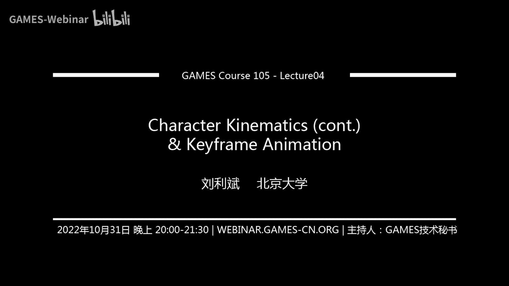
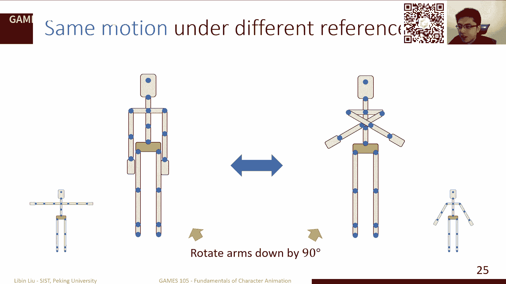
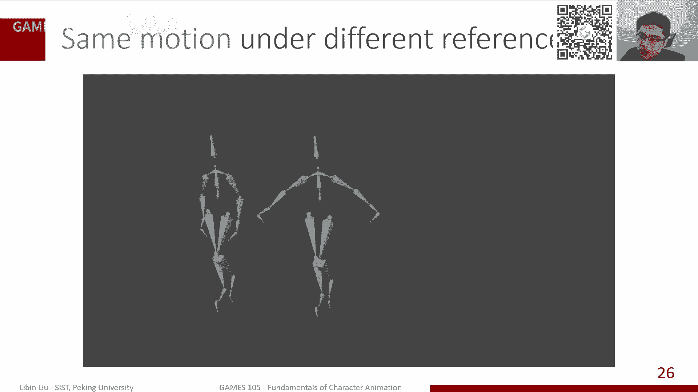
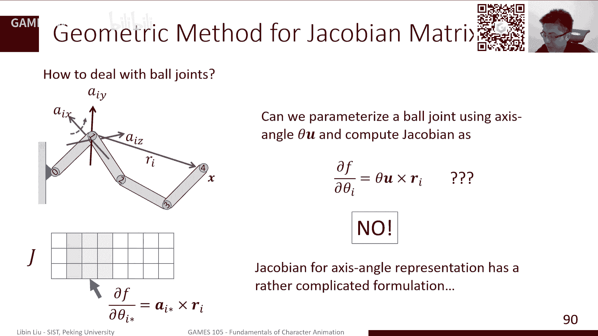
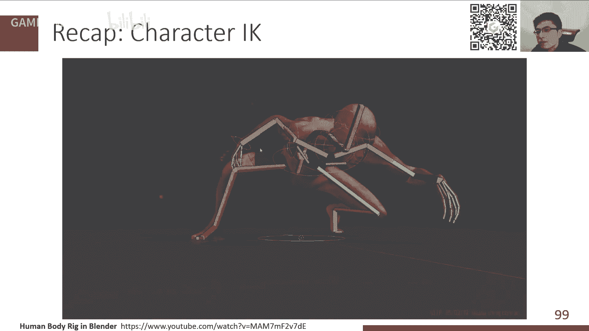
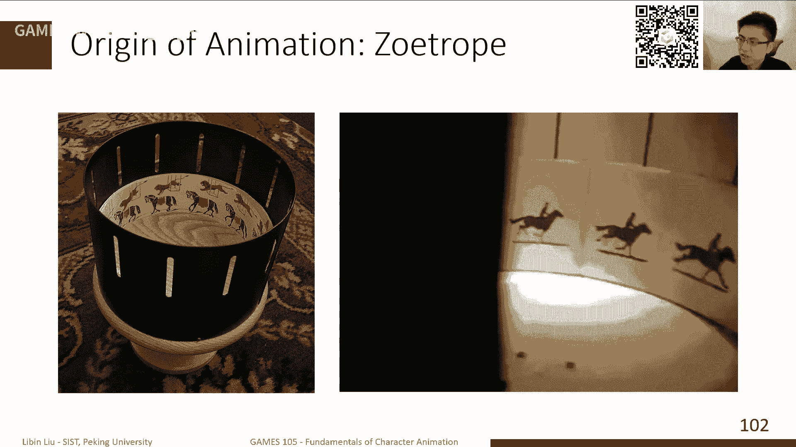
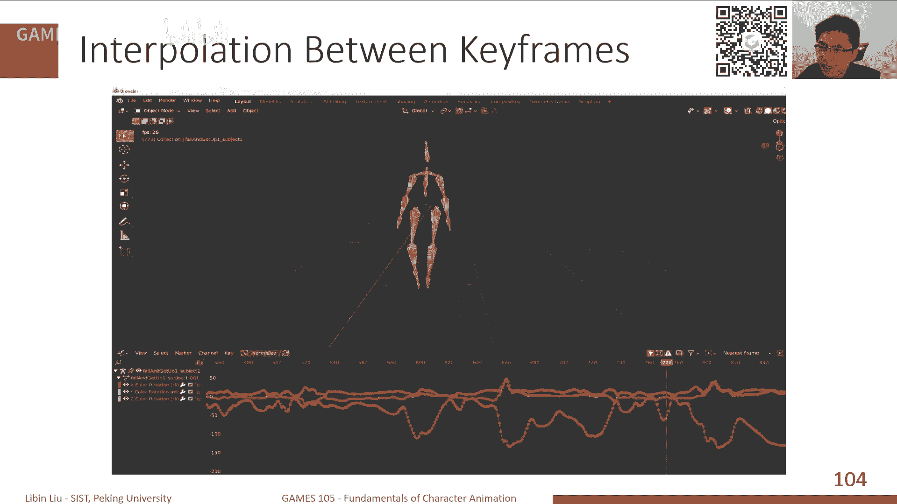
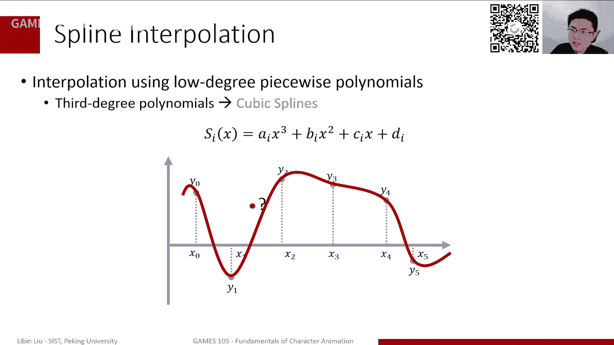
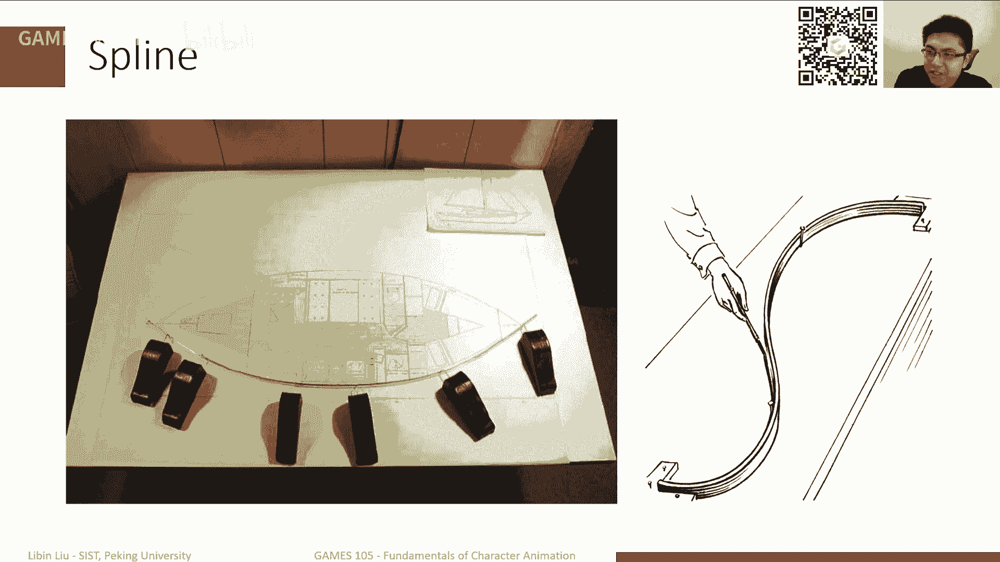
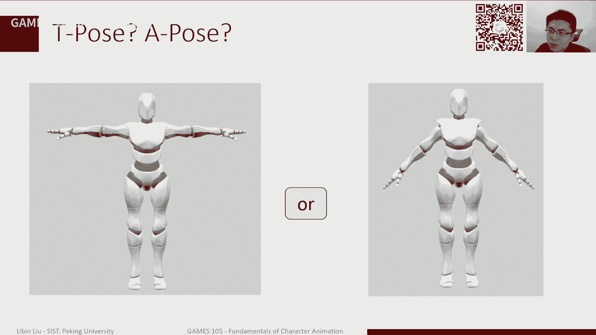

# GAMES105-计算机角色动画基础 - P4：角色运动学（续）与关键帧动画 🎬

在本节课中，我们将学习角色运动学的进阶内容，特别是动作重定向和全身逆向运动学，并深入探讨关键帧动画中的核心技术——插值算法。

---

## 第一部分：角色运动学回顾与进阶 🦴

上一节我们介绍了正向运动学和逆向运动学的基本概念。本节中，我们将进一步探讨动作重定向问题，并了解如何处理更复杂的全身逆向运动学。

### 正向运动学与参考姿势





正向运动学是从已知的关节旋转计算每个关节位置的过程。一个角色通常被抽象为由关节和骨骼构成的树形结构，从根节点（如臀部）出发，形成多条运动学链。

每个角色都有一个初始姿势，即所有关节旋转为零时的姿态，通常称为 **T-pose** 或 **A-pose**。

*   **T-pose**：角色双臂水平伸展，双脚并拢站立，形似字母“T”。
*   **A-pose**：角色双臂自然下垂一定角度，形似字母“A”。动画师在角色绑定时更倾向于使用A-pose，因为它更接近自然站立姿态，能减少皮肤和肌肉在后续动画中的形变失真。

**核心概念**：一个姿势由根节点的位置/朝向以及每个关节的旋转定义。对于给定的姿势参数，关节的全局朝向 `Q_i` 可以通过其父关节的朝向 `Q_{parent(i)}` 和自身的局部旋转 `R_i` 迭代计算得出：
`Q_i = Q_{parent(i)} * R_i`

### 动作重定向

动作重定向的核心问题是：如何将一个角色（源角色）的动作迁移到骨骼结构不同或参考姿势不同的另一个角色（目标角色）上？

我们从一个简单模型开始：两个不同的刚体，它们的初始朝向（旋转为0时）不同。假设刚体A旋转 `R_A` 后达到目标姿态。如果刚体B的初始朝向与A相差一个旋转 `R_{A->B}`，那么要让B达到相同的目标姿态，所需的旋转 `R_B` 为：
`R_B = R_A * R_{A->B}^T`
其中 `R_{A->B}^T` 是 `R_{A->B}` 的逆（转置）。

将这个思想扩展到骨骼链上，对于目标角色B的某个关节，要使其摆出与源角色A相同的姿态，其所需的旋转 `R_B` 与A的旋转 `R_A` 存在如下关系：
`R_B = Q_{parent(B)}^T * R_A * Q_{A->B}`
这里 `Q_{parent(B)}` 是B关节父节点的全局朝向，`Q_{A->B}` 是A、B两角色在该关节初始全局朝向的差异。

**总结**：通过计算并应用每个关节上源角色与目标角色在初始参考姿势下的朝向差异，可以实现动作在不同角色间的迁移。对于骨骼数量或命名不同的情况，通常需要额外的手动映射。

### 逆向运动学与全身IK



逆向运动学是已知末端效应器（如手、脚）的目标位置，反求各关节旋转的过程。这可以表述为一个优化问题：最小化末端位置 `f(θ)` 与目标位置 `x̃` 的误差。
`min_θ 1/2 || f(θ) - x̃ ||^2`


**循环坐标下降法** 是一种启发式解法：按顺序依次优化每个关节，每次旋转当前关节，使得末端点更靠近目标点。对于旋转关节，最优解是让末端点、当前关节和目标点三点共线。

**雅可比矩阵方法** 提供了更数学化的解法。雅可比矩阵 `J` 描述了末端位置 `f(θ)` 对关节参数 `θ` 的变化率。
*   **雅可比转置法**：`Δθ = α * J^T * (x̃ - f(θ))`，其中 `α` 是步长。
*   **阻尼最小二乘法（伪逆法）**：`Δθ = J^† * (x̃ - f(θ))`，其中 `J^†` 是雅可比矩阵的伪逆。


对于铰链关节，雅可比矩阵的每一列可以通过旋转轴与关节到末端向量的叉乘得到。






**全身IK** 是指角色有多个末端约束（如双脚固定，手需到达某点）的情况。这可以构建为一个包含多个约束的复合优化问题。实践中，常采用启发式方法，例如：
1.  将多个末端约束视为多个独立IK链。
2.  按优先级顺序或交替迭代求解各条IK链。
3.  将根节点视为特殊关节进行处理，并注意旋转方向在父子关系中的转换。




---

## 第二部分：关键帧动画与插值技术 🎞️

关键帧动画是手工制作动画的基础。动画师只需定义动作中关键时间点的姿态（关键帧），中间过渡的帧（过渡帧）则由计算机通过插值自动生成。

插值问题可以抽象为：给定一组离散的数据点 `(x_i, y_i)`，求一个函数 `f(x)`，使其经过所有给定点，并能计算任意新 `x` 对应的 `f(x)` 值。

以下是几种常见的插值方法：





### 1. 阶梯插值
这是最简单的插值，函数值在到达下一个关键点之前保持不变。它不连续，会产生跳跃感。

### 2. 线性插值
在两个关键点之间用直线连接。给定点 `(x1, y1)` 和 `(x2, y2)`，以及参数 `t ∈ [0, 1]`，插值公式为：
`f(t) = (1 - t) * y1 + t * y2`
线性插值连续，但一阶导数（速度）不连续，动画可能显得生硬。

### 3. 多项式插值
使用一个高阶多项式穿过所有数据点。但高阶多项式容易在边缘产生剧烈震荡（龙格现象），且缺乏局部性（修改一个点会影响整个曲线）。

### 4. 三次样条插值
为了克服高阶多项式的问题，采用分段三次多项式进行插值，并保证连接点处函数值、一阶导数甚至二阶导数连续。这能产生非常平滑的曲线。但求解全局的三次样条需要解一个大型方程组，计算量大且缺乏局部控制性。

### 5. 三次埃尔米特插值
这是更实用且高效的方法。它也是分段三次多项式，但每一段只由该段起点和终点的 **位置** (`y`) 和 **切线斜率** (`m`) 决定。因此，每一段可以独立计算，具有局部性。

给定一段的起点 `(0, y1, m1)` 和终点 `(1, y2, m2)`，其三次多项式系数 `[a, b, c, d]^T` 可以通过求解以下矩阵方程得到：
```
[0, 0, 0, 1;  // f(0) = y1
 1, 1, 1, 1;  // f(1) = y2
 0, 0, 1, 0;  // f'(0) = m1
 3, 2, 1, 0] * [a, b, c, d]^T = [y1, y2, m1, m2]^T
```
解出系数后，插值函数可写为四个埃尔米特基函数的加权和：
`f(t) = y1*H1(t) + y2*H2(t) + m1*H3(t) + m2*H4(t)`
其中 `H1(t)...H4(t)` 是特定的三次多项式。

**卡塔默-罗姆样条** 是埃尔米特插值的一个特例，它不直接指定切线斜率 `m`，而是通过相邻控制点的位置来隐式定义切线方向（例如，`P1` 点的切线方向为 `P2 - P0`），使得用户只需操作位置点即可控制曲线。


### 旋转插值

对于关节旋转的插值，需要特别注意旋转的表示方法：
*   **欧拉角/轴角**：可以直接对三个参数进行线性或三次样条插值。但需处理角度环绕问题（例如，从350度到10度，应插值为0度附近，而非180度）。
*   **四元数**：使用球面线性插值可以保证恒定的角速度。其公式为：
    `SLERP(q1, q2, t) = (q1 * sin((1-t)θ) + q2 * sin(tθ)) / sin(θ)`，其中 `θ` 是 `q1` 与 `q2` 之间的夹角。
    对于更平滑的非线性插值，可以将贝塞尔曲线等构造方法中的线性插值步骤替换为 `SLERP`，从而生成四元数样条曲线。

在实践中，如果关键帧足够密集，使用不同的旋转表示和插值方法产生的视觉效果差异可能并不明显。通常，正确处理角度环绕并使用 `SLERP` 或三次样条插值就能获得不错的效果。

---

## 总结 📚

本节课中我们一起学习了：
1.  **动作重定向**：通过计算并补偿不同角色间参考姿势的差异，实现动作数据的迁移。
2.  **全身逆向运动学**：处理多约束IK问题的方法，包括构建复合优化问题和使用启发式迭代求解。
3.  **关键帧插值**：从简单的阶梯、线性插值，到平滑的三次样条和埃尔米特插值，理解了它们如何生成连续的过渡动画。
4.  **旋转插值**：了解了针对欧拉角、轴角和四元数等不同旋转表示的特有插值方法及其注意事项。



这些技术是构建计算机角色动画系统的基石，从动作数据的处理到最终动画序列的生成都离不开它们。