# GAMES105-计算机角色动画基础 - P6：Lecture06 基于学习的角色动画 🎓

在本节课中，我们将学习基于学习的角色动画方法。我们将回顾上节课关于可交互动画的内容，并深入探讨如何实现它。接着，我们会介绍一些传统的、基于高斯模型的运动建模方法。最后，我们会简要展望使用神经网络等现代方法生成角色动画的未来方向。

## 课程回顾与作业安排 📅

上一节课我们介绍了基于数据的角色动画，主要讨论了如何连接、重组现有数据以响应用户交互。其核心并非直接拼接数据，而是将数据放入一个模型中，利用模型来生成动作。

由于上周课程调整，本次课程会先进行一些回顾，这部分内容也与实验二作业相关。

关于作业，第一次作业已于今日截止。截止后，助教会进行批改并提供反馈。作业本身在GitHub上会保持开放，有兴趣可以继续完成，但将不再参与本年度评分。第二次作业将于本周发布，形式与第一次类似，周期约为三周。

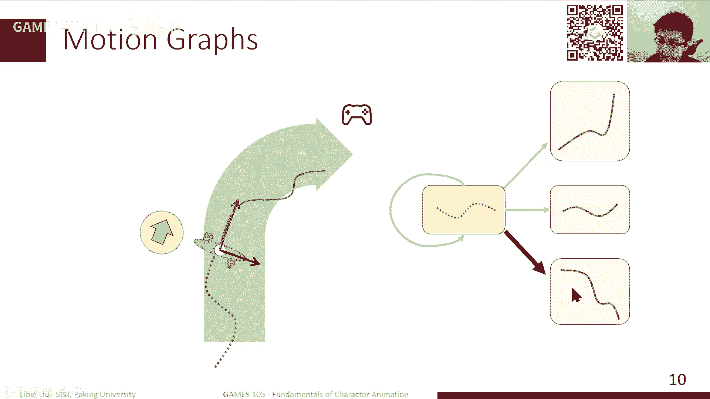

## 实现可交互的角色动画 🎮

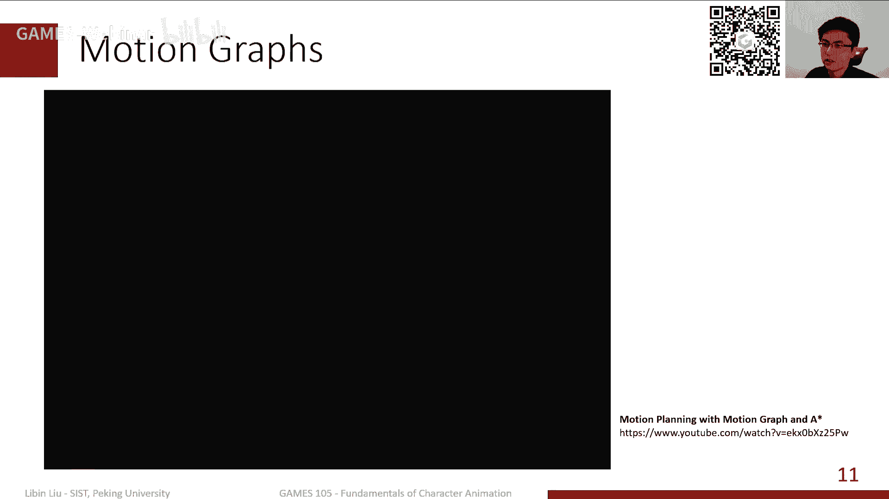

上一节我们回顾了基于数据的动画，本节中我们来看看如何具体实现一个可交互的角色动画系统。

我们希望角色能根据用户输入（如摇杆控制）自动生成合理的动作。在物理引擎中，这个过程通常可以抽象为三步：
1.  检查用户输入。
2.  在数据集中找到符合输入的动作片段。
3.  播放该动作片段。

为了支持这一流程，常用“动作图”或“状态机”这类数据结构。其基本思想是：每个节点代表一个动作片段，在不同动作的特定时刻（连接点）可以进行切换。

### 动作图的工作原理

动作图中的每个节点是一个动作片段，即一小段连续的姿态序列。播放完当前片段后，系统检查用户输入，并选择下一个可切换的片段进行播放。

一个关键问题是如何平滑连接两个片段。这通常需要对两个片段的局部坐标系进行对齐和变换，使得新片段的起始姿态与当前片段的结束姿态自然衔接。

为了平衡动作质量和响应速度，动作图中的片段通常较短（例如，走路只包含一步）。这样可以在片段结束时更快地响应用户的新指令。

**以下是一个简单的动作图示例：**
*   假设角色当前正在播放“向前直走”的片段。
*   用户输入“向右转”指令。
*   系统会在“向前直走”片段结束后，从可切换的片段中（如“向右走一步”）选择一个，并通过坐标对齐平滑地连接播放。

在动作图的基础上，可以叠加A*等路径规划算法，实现自动寻路、避障等更智能的行为。动作图是底层数据结构，上层可以应用多种算法。

### 动作图的局限性与Motion Fields

动作图的主要缺点是响应速度受限于片段长度。为了更快响应，需要准备大量能在中间切换的短片段，这会使状态机变得复杂且难以维护。

因此，研究者希望将规划频率细化到每一帧，即在每一帧都根据当前状态和用户输入寻找下一个合适的姿态。这引出了 **Motion Fields** 方法。

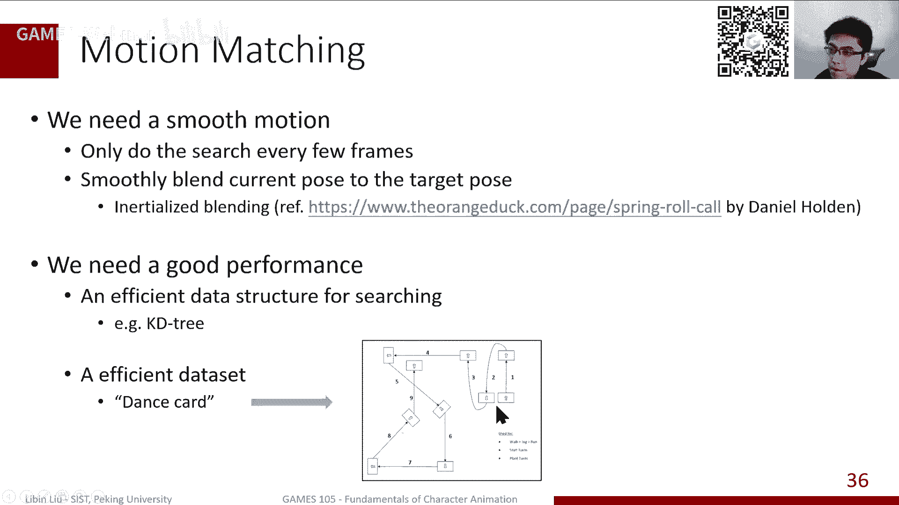

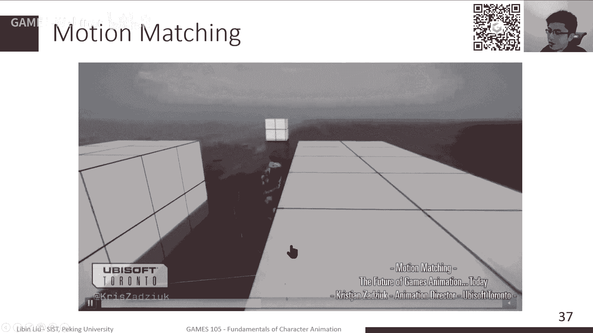

Motion Fields 将动作数据库中的每一帧视为一个独立的状态点，每个点包含姿态、速度、朝向等信息。所有帧构成一个高维的“运动场”。

**以下是其工作流程：**
1.  在每一帧，根据角色当前状态（姿态、速度等），在运动场中寻找K个最邻近的状态点。
2.  根据用户输入（如目标方向），为这K个邻近点计算混合权重。
3.  使用混合权重，对这些邻近点对应的姿态、速度等参数进行插值，得到下一帧的目标状态。
4.  更新角色状态。

这种方法能实现更即时的响应，且无需对动作数据做严格的片段化预处理。但它需要设计规则来计算混合权重，这在实际应用中可能比较困难。

### Motion Matching：更实用的实时方法

Motion Matching 是对 Motion Fields 的简化和改进。其核心思想是：每一帧只在数据库中寻找**一个**最邻近的后续帧，作为下一帧的目标。

**需要解决两个关键问题：**
1.  **距离函数**：如何定义两个姿态之间的“距离”或相似度？简单的关节角距离效果不佳。通常需要设计特征向量，包含未来轨迹、脚部接触状态等信息，再计算特征向量间的距离。
2.  **平滑过渡**：直接切换到非连续帧会导致动作跳变。因此需要将当前姿态平滑地混合到目标姿态，例如使用线性插值或带阻尼的混合方法。

为了提高性能，对大规模数据库需要使用KD-Tree等高效数据结构进行最近邻搜索。同时，可以通过精心设计动作捕捉方案（如使用“舞蹈卡片”）来提升生成动作的质量和覆盖范围。

Motion Matching 能产生非常灵活、响应迅速的角色动画，并能结合简单的物理仿真（如布娃娃系统）来应对外力干扰。但它本身不解决滑步等问题，通常需要结合逆向运动学进行后期调整。

## 动作建模与概率先验 📊

上一节我们介绍了实时响应的动画生成技术，本节中我们来看看如何对动作本身的“自然性”进行建模。

我们的动作数据是有限的，但希望生成无限的新动作，并保证其自然。人类动作具有明显的低维结构，并非所有随机姿态都是自然的。例如，走路时手脚协调摆动有助于保持平衡。

### 主成分分析

主成分分析是一种常用的降维技术，用于发现高维数据中的主要变化方向。

**其核心思想是：**
1.  寻找一个单位向量方向，使得所有数据点在该方向上的投影方差最大。这个方向称为第一主成分，包含了数据中最多的信息。
2.  在与第一主成分正交的子空间中，继续寻找方差最大的方向，得到第二主成分，依此类推。

对于动作数据，每个姿态可表示为一个高维向量。进行PCA后，前几个主成分往往能解释绝大部分的数据变化。这意味着可以用少数几个主成分的线性组合来近似表示一个自然姿态。

PCA得到的模型可以作为一个**动作先验**。例如，在逆向运动学中，除了让末端效应器到达目标位置，还可以增加一个正则项，要求生成姿态在PCA空间中的坐标尽可能“正常”（即接近训练数据的分布），从而得到更自然的解。

### 基于概率模型的运动先验

更一般地，我们可以将“自然动作”视为从一个复杂的概率分布中采样得到的。我们的目标是：给定动作捕捉数据，估计出这个潜在的分布 \( p(x) \)，其中 \( x \) 可以是一个姿态或一段动作。

有了这个分布，许多动画生成问题（如IK、动作补全、受控生成）都可以表述为一个统一的优化问题：
`最小化：任务损失(姿态) - λ * log( p(姿态) )`
其中，第一项确保满足任务要求（如手到达某位置），第二项（即负对数似然）确保生成的动作看起来自然，\( λ \) 是权衡参数。

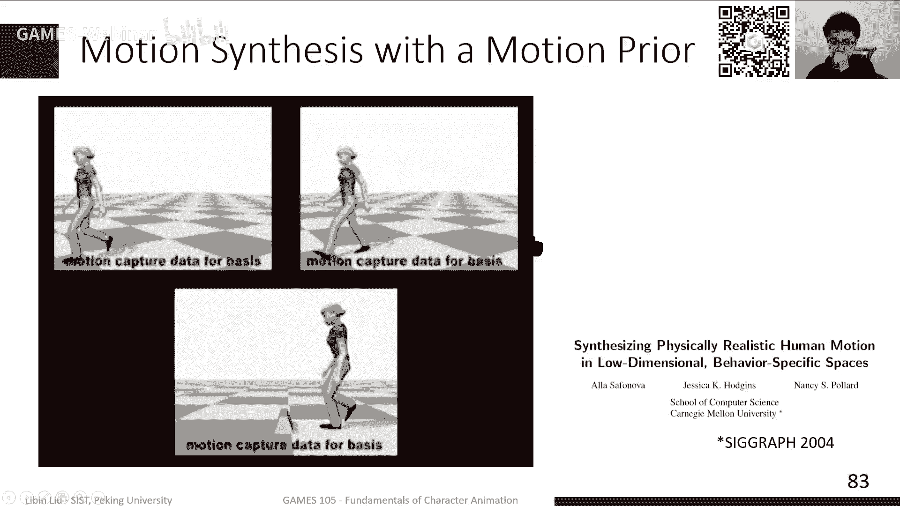

**传统方法**使用相对简单的概率模型来拟合 \( p(x) \)：
*   **单一高斯分布**：过于简单，无法刻画复杂动作的多模态分布。
*   **高斯混合模型**：用多个高斯分布的加权和来建模，能表现更复杂的分布，但混合数量等参数需要预设。
*   **高斯过程隐变量模型**：更为灵活，但核函数等设计较为复杂。

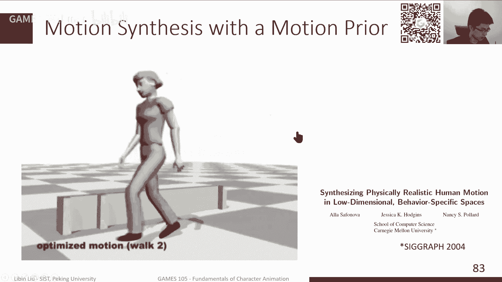

这些基于高斯模型的方法在2016年之前被广泛研究，能够实现一定程度的动作编辑和生成，但模型表达能力有限，且实现和调参较为繁琐。

## 总结与展望 🚀

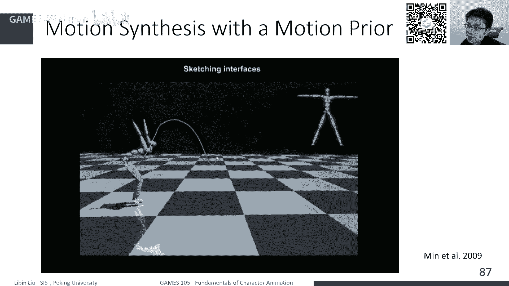

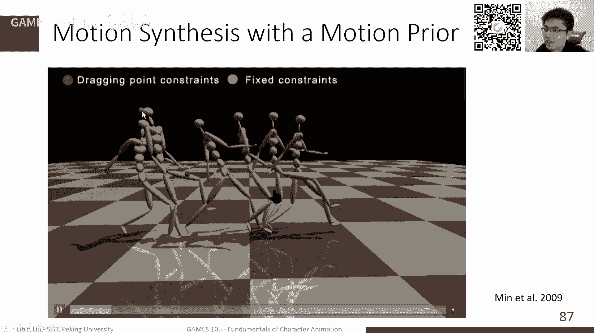

本节课我们一起学习了基于学习的角色动画的基础知识。

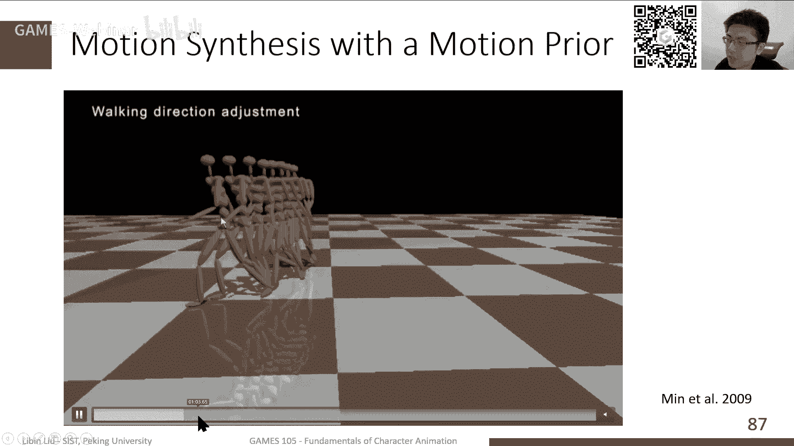

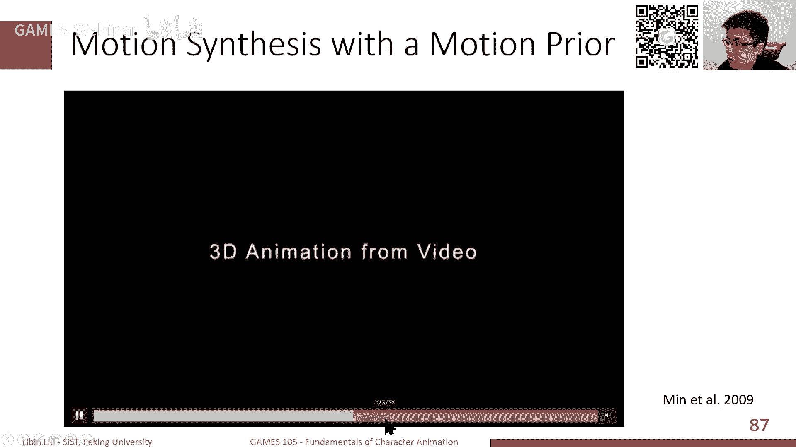

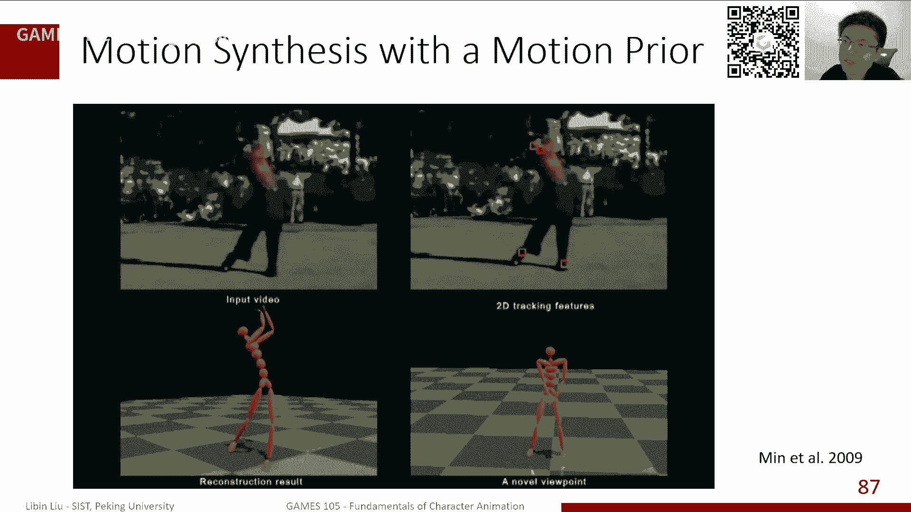

我们首先深入探讨了实现可交互动画的两种主要数据驱动方法：**动作图**和**Motion Matching**。动作图在动作片段级别进行规划，响应速度较慢但质量稳定；Motion Matching 则在每一帧进行最近邻搜索，实现了更即时的响应，是目前工业界广泛应用的技术。

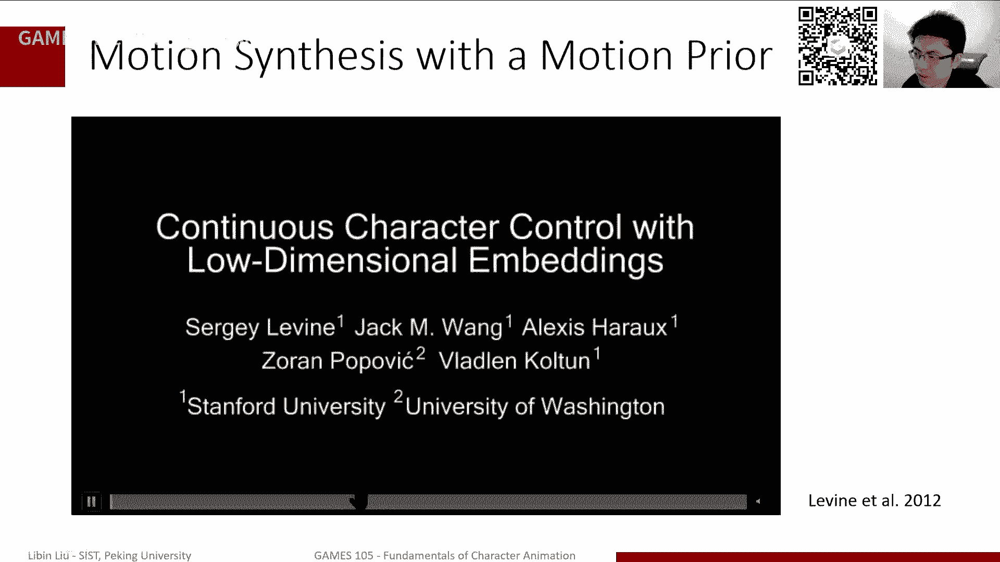

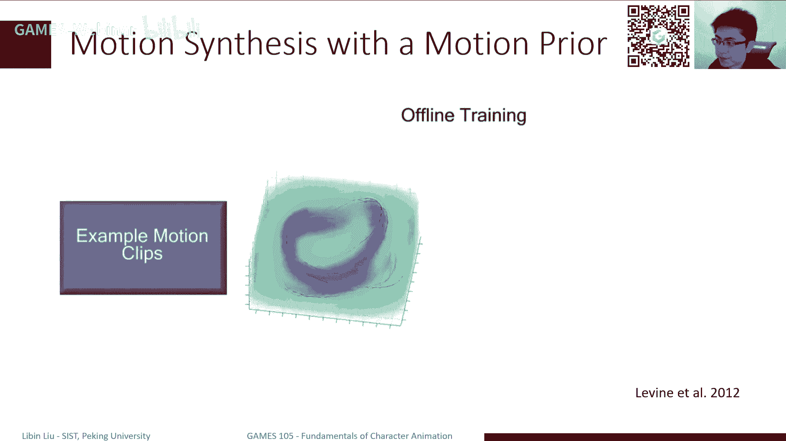

接着，我们探讨了如何对动作的“自然性”进行建模。从**主成分分析**这种简单的降维与先验模型，到**高斯混合模型**、**高斯过程**等更传统的概率模型，这些方法为生成符合物理规律和人体工学的动作提供了数学基础。

然而，传统的概率模型表达能力有限，难以捕捉复杂动作的细节和多样性。近年来，随着深度学习的发展，特别是生成模型（如VAE、GAN、扩散模型）的突破，使用**神经网络**来学习复杂的动作分布 \( p(x) \) 已成为新的趋势。这些方法能够从大量数据中自动学习更强大、更通用的动作先验，从而生成更丰富、更逼真的角色动画。这将是下节课重点介绍的内容。