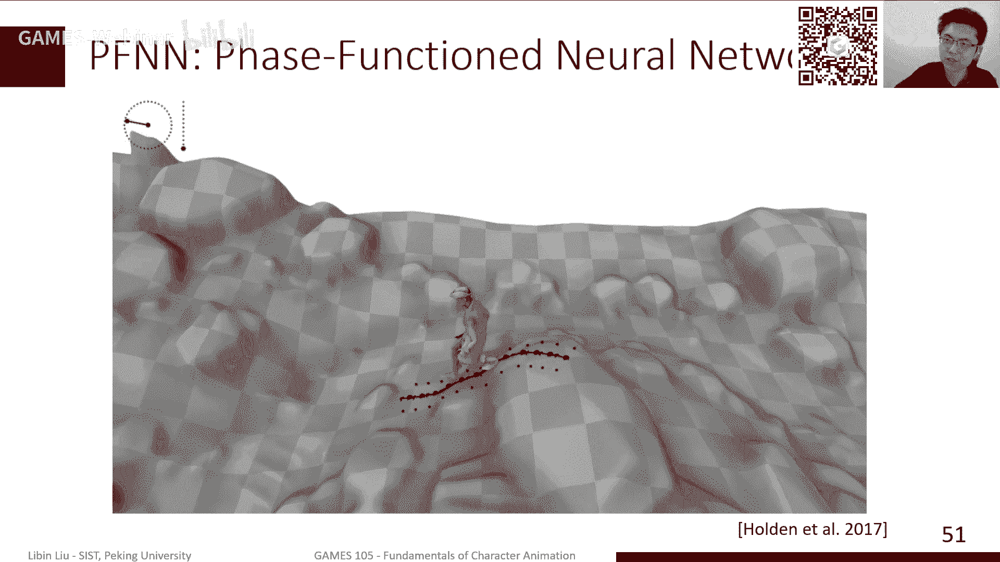
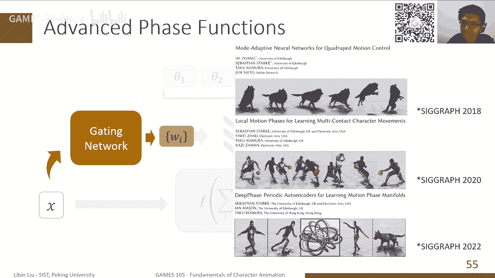
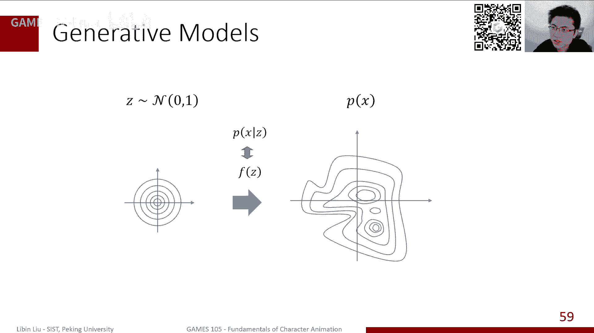
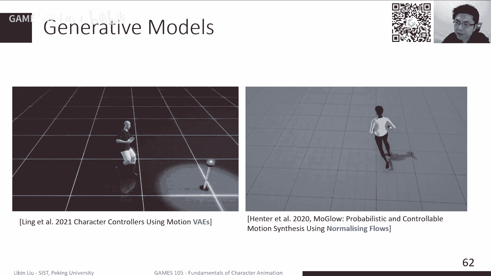

# GAMES105-计算机角色动画基础 - P7：Lecture06 基于学习的角色动画（续）🎬

在本节课中，我们将继续探讨基于学习的角色动画方法，特别是聚焦于近年来兴起的基于神经网络的技术。我们将从概率建模的角度理解动作生成，并介绍几种核心的神经网络模型及其应用。

---

## 概述

上节课我们介绍了基于统计模型（如高斯模型）的角色动画方法。本节课，我们将转向基于神经网络的方法。这类方法的核心思想是：从大量动作捕捉数据中学习一个模型，该模型能够根据当前状态（可能加上一些控制信号）预测下一个合理的姿态，或者直接生成一段完整的、符合要求的动作序列。

我们将首先从概率角度形式化这个问题，然后介绍两种主要的建模视角，最后深入讲解一个经典工作——相位函数网络（PFN）及其后续发展。

---

## 从概率视角看动作生成

上一节我们介绍了基于数据的动作重组技术。本节中，我们来看看如何从概率生成的角度来创造新动作。

我们的目标是学习一个概率模型。假设真实的、自然的动作服从一个复杂的概率分布 \( P(X) \)。给定一个动作序列 \( X \)，\( P(X) \) 的值代表了该动作是“自然”的可能性。我们拥有大量动作捕捉数据，可以看作是从这个真实分布 \( P(X) \) 中采样得到的样本。我们的任务就是利用这些样本，去近似（学习）出这个未知的分布 \( P(X) \)。

### 动作的表示

一个动作序列 \( X \) 由一系列姿态在时间上排列而成。每个姿态可以用一个向量表示，常见的有两种方式：
*   **基于关节旋转**：包含根关节位置和各关节的旋转（如用四元数、6D向量表示）。
*   **基于关节位置**：直接使用各关节在空间中的三维坐标。

两种表示各有优劣。基于旋转的表示便于直接驱动蒙皮角色，但缺乏全局位置信息；基于位置的表示更直观，但驱动角色时需要额外的逆向运动学（IK）计算。

### 条件生成与自回归模型

在实际应用中，我们通常希望进行**条件生成**。例如，给定指令“向左走”，生成向左走的动作。这对应条件概率分布 \( P(X | Z) \)，其中 \( Z \) 是控制条件（如移动方向、角色状态等）。

对于序列数据，一个常见的简化是使用**链式法则**将联合分布分解：
\[ P(X) = P(x_1) \prod_{t=2}^{T} P(x_t | x_{1:t-1}) \]
这意味着每一帧的姿态 \( x_t \) 依赖于之前所有帧 \( x_{1:t-1} \)。

为了进一步简化并实现实时生成，我们通常假设序列具有**马尔可夫性**，即下一帧只依赖于当前帧：
\[ P(x_t | x_{1:t-1}) \approx P(x_t | x_{t-1}) \]
这样，动作生成过程就变成了一个**自回归模型**：从初始姿态 \( x_0 \) 开始，反复应用一个函数 \( f \)，根据当前帧 \( x_{t-1} \) 和控制信号 \( z \) 预测下一帧 \( x_t \)。
\[ x_t = f(x_{t-1}, z; \theta) \]
其中 \( \theta \) 是模型参数。我们的目标就是利用训练数据（大量的 \( (x_{t-1}, x_t) \) 对）来学习这个函数 \( f \)。

---

## 用神经网络拟合映射函数

现在，我们面临的核心问题是：如何学习这个复杂的映射函数 \( f \)？这正是神经网络的用武之地。

### 神经网络简介

神经网络受到生物神经元启发，其基本单元是人工神经元。一个神经元接收多个输入 \( x_i \)，计算加权和并加上偏置，最后通过一个非线性**激活函数** \( \sigma \) 产生输出。
\[ y = \sigma(\sum_{i} w_i x_i + b) \]
将大量神经元分层连接，就构成了深度神经网络。一个 \( L \) 层的前馈神经网络可以表示为一系列复合函数：
\[ f(x; \theta) = \sigma_L(W_L \sigma_{L-1}(... \sigma_1(W_1 x + b_1)...) + b_L) \]
其中 \( \theta = \{W_1, b_1, ..., W_L, b_L\} \) 是所有层的权重和偏置参数。

### 训练神经网络

我们的目标是找到一组参数 \( \theta \)，使得神经网络 \( f \) 在训练数据上的预测误差最小。这定义了一个优化问题：
\[ \min_{\theta} \sum_{(x_{t-1}, x_t) \in \mathcal{D}} \mathcal{L}(f(x_{t-1}, z; \theta), x_t) \]
其中 \( \mathcal{L} \) 是损失函数（如L2范数），衡量预测值与真实值的差距。

求解此优化问题的标准方法是**梯度下降**，特别是适用于大数据集的**随机梯度下降（SGD）**。其核心是迭代更新参数：
\[ \theta \leftarrow \theta - \alpha \nabla_{\theta} \mathcal{L} \]
其中 \( \alpha \) 是学习率，\( \nabla_{\theta} \mathcal{L} \) 是损失函数关于参数的梯度。

计算梯度的高效算法称为**反向传播**，它本质上是链式法则在计算图上的应用。现代深度学习框架（如PyTorch, TensorFlow）都提供了自动微分功能，使得我们可以轻松计算梯度并训练神经网络。

---

## 解决歧义性：引入控制与相位

直接训练一个网络根据当前姿态预测下一姿态会遇到一个关键问题：**歧义性**。例如，一个站立姿态之后，下一个动作可能是迈左腿、迈右腿或原地不动。如果训练数据中包含所有这些可能性，网络可能会学会输出一个“平均”的、模糊的次优结果。

为了解决这个问题，我们需要在输入中引入额外的信息来消除歧义。这通常包括两部分：
1.  **显式控制参数（Control Parameter）**：如用户输入的摇杆方向，决定角色移动的目标。
2.  **相位参数（Phase Parameter）**：特别是对于周期性运动（如走路、跑步），相位描述了运动周期中所处的阶段（如左脚刚着地、右脚摆动到最高点等）。

以下是引入这些参数的一系列经典工作。

### 相位函数网络（PFN）

PFN是一个里程碑式的工作，它首次展示了用神经网络可以生成高质量、可控的角色动画。

PFN的核心创新是**相位驱动的专家混合模型**。它定义了一个相位函数 \( \phi(t) \)，将时间映射到运动周期（如0到1）。网络由多个“专家”子网络组成，每个专家擅长预测特定相位区间的姿态。在每一帧，根据当前相位 \( \phi \)，通过三次样条插值的方式混合这些专家的参数，形成一个“瞬时专家”，用于预测下一帧。

**专家混合（MoE）模型公式**（参数混合）：
\[ \theta_{blend} = \sum_{i=1}^{N} w_i(\phi) \theta_i \]
\[ x_t = f_{MoE}(x_{t-1}, z; \theta_{blend}) \]
其中 \( w_i(\phi) \) 是由相位 \( \phi \) 决定的、归一化的混合权重。

这种方式强制每个专家专注于学习运动周期的一个特定部分，从而提高了学习效率和动作质量。

### PFN的后续发展

PFN的相位权重是手工定义（基于三次样条）的，这限制了其泛化到非周期性或复杂运动的能力。后续工作主要围绕如何自动学习这个混合权重展开。

*   **门控网络（Gating Network）**：用一个小的神经网络（门网络）来代替手工定义的权重计算。门网络以当前状态和控制参数为输入，输出各个专家的混合权重。
    \[ \mathbf{w} = G(x_{t-1}, z) \]
*   **复合相位变量**：对于更复杂的运动（如打球），可以定义多个相位变量（分别对应腿、手等），并一起输入门网络。
*   **从数据中学习相位**：最新的方法尝试直接从数据中学习出有意义的相位表示，而不是手工设计。

这一系列工作通过改进网络结构和输入表征，持续提升了生成动作的质量和多样性。

---

## 生成模型在动画中的应用

除了上述直接学习映射函数 \( f \) 的方法，另一条技术路线是直接学习动作数据的概率分布 \( P(X) \) 本身，这类模型称为**生成模型**。学会分布后，我们可以通过从中采样来生成新动作。

生成模型的核心思想是：学习一个映射 \( G \)，将一个简单分布（如标准正态分布 \( \mathcal{N}(0, I) \)）中的随机噪声 \( z \)，变换成复杂真实数据分布中的样本 \( x \)。
\[ x = G(z; \theta) \]
这样，通过从简单分布中采样 \( z \)，再经过 \( G \) 变换，就能得到逼真的动作数据 \( x \)。

以下是几种主要的生成模型在角色动画中的应用：

*   **变分自编码器（VAE）**：同时学习一个编码器 \( E \) 将数据 \( x \) 压缩到隐空间 \( z \)，和一个解码器 \( D \) 将 \( z \) 重建为 \( x \)。训练目标是使重建误差最小，并让隐变量 \( z \) 的分布接近标准正态分布。可用于动作生成和控制。
*   **标准化流（Normalizing Flow）**：通过一系列可逆变换，将简单分布精确地转换为复杂数据分布。其优势是能精确计算数据的概率密度。
*   **扩散模型（Diffusion Model）**：通过逐步向数据中添加噪声（前向过程），再训练一个网络学习逐步去噪（反向过程），从而学会从纯噪声生成数据。这是当前图像和动作生成领域最火热的方法之一，在文本驱动动作生成等任务上展现出强大潜力。

**生成对抗网络（GAN）** 虽然在图像生成上非常成功，但在角色动画序列生成中，由于训练不稳定等问题，效果相对不如上述几种模型。

---

## 总结

本节课我们一起学习了基于神经网络的角色动画方法。

我们首先从概率建模的角度，将动作生成问题形式化为学习一个条件分布或状态转移函数。接着，我们介绍了如何利用神经网络强大的函数拟合能力来解决这个问题，并简述了神经网络的训练原理。

针对简单神经网络在动作预测中遇到的歧义性问题，我们深入讲解了**相位函数网络（PFN）** 及其核心思想——通过引入**相位变量**和**专家混合模型**来提供更强的时序约束，从而生成高质量周期性运动。我们也概述了PFN后续的一系列改进工作。

最后，我们拓宽视野，简要介绍了**生成模型**（如VAE、标准化流、扩散模型）在角色动画中的应用。这些模型直接学习动作数据的分布，为更灵活、更富创造性的动作生成开辟了道路。

基于学习的方法，特别是神经网络，正在迅速改变角色动画的制作方式，让数据驱动、可控、高质量的动作生成变得越来越触手可及。