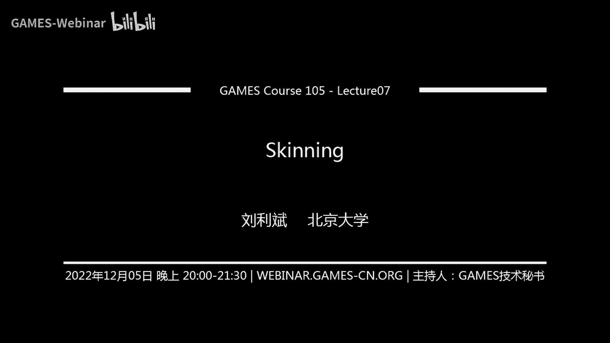

# GAMES105-计算机角色动画基础 - P8：Lecture07 蒙皮技术 🎭

## 概述

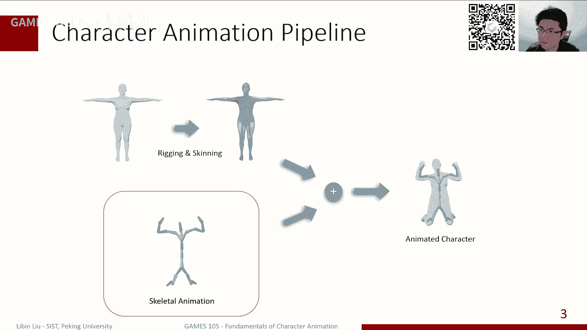

在本节课中，我们将学习计算机角色动画中的核心环节——蒙皮技术。我们将了解如何利用骨骼动画驱动角色模型产生形变，从而生成我们最终在屏幕上看到的动画效果。课程将从最基本的线性蒙皮开始，逐步深入到更高级的技术，并结合实际应用案例进行讲解。

---

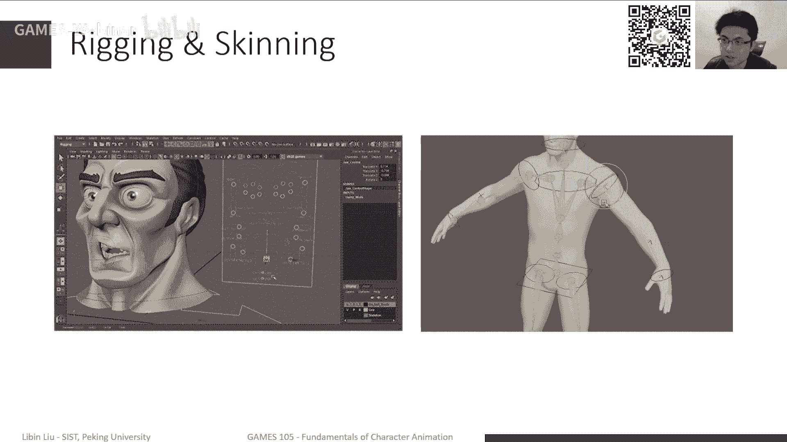

## 蒙皮技术简介

我们之前课程主要关注骨骼动画。骨骼本身是一个抽象结构，并非直接可见。在实际应用（如电影、游戏）中，我们看到的角色外观是由外层的“蒙皮”经过形变后展示出来的。蒙皮技术（Skinning）的核心目标，就是让骨骼的运动能够正确地驱动蒙皮网格产生预期的形变。

整个角色动画流程主要分为两部分：一部分是蒙皮的绑定与变形，另一部分则是骨骼动画本身。骨骼动画驱动骨骼运动，再利用蒙皮技术将运动传递给蒙皮网格，最终渲染出动画。


---

## 绑定与蒙皮的概念区分

这里有两个容易混淆的概念：Rigging（绑定）和Skinning（蒙皮）。

*   **Rigging（绑定）**：通常指为角色创建一套可控制的“控制器”系统。例如，面部动画师通过调整脸上的控制器点来改变角色的表情或皮肤形状。广义的绑定不限于骨骼驱动，也可能通过额外的点控制器或混合形状来完成。
*   **Skinning（蒙皮）**：通常特指由骨骼驱动网格形变的这一过程。它是一种特殊的绑定技术，主要通过刷权重或线性混合等方式，利用骨骼来控制身体形状的变化。

简而言之，蒙皮是绑定的一种具体实现方式，专注于骨骼与网格的关联。


---

## 几何表示与蒙皮基础

在讨论蒙皮形变前，需要回顾几何体的表示方式。最常用的表示是网格（Mesh），它由物体表面的顶点（Vertices）和连接这些顶点的面（Faces，通常是三角形）构成。改变物体的形状，本质上就是改变这些顶点的位置。

考虑一个简单例子：一段手臂的蒙皮网格，内部放置了骨骼。我们希望当骨骼（例如肘关节）移动时，其周围的网格顶点也能随之移动，从而让整个角色做出动作。

从数学上描述，我们希望根据骨骼的位移和旋转变换，计算出蒙皮上每个顶点的新位置。

### 单骨骼情况

假设变换前，骨骼关节位于点 **O**，全局旋转为 **q**。变换后，关节移动到 **O'**，旋转变为 **q'**（**q' = R * q**），位移为 **T**（**O' = O + T**）。

对于蒙皮上的一个顶点 **x**，其新位置 **x'** 的计算是一个坐标变换：先将 **x** 转换到原骨骼的局部坐标系下，再转换到新骨骼的全局坐标系下。

更抽象地，我们可以定义一个量 **r**，它表示顶点 **x** 在骨骼局部坐标系下的坐标（即从关节点指向该顶点的向量在局部坐标下的表示）。在单骨骼情况下，无论骨骼如何移动，**r** 在其局部坐标系下的表示保持不变。当骨骼移动到新位置后，只需将这个局部坐标表示再转换回全局坐标系，即可得到顶点的新位置。

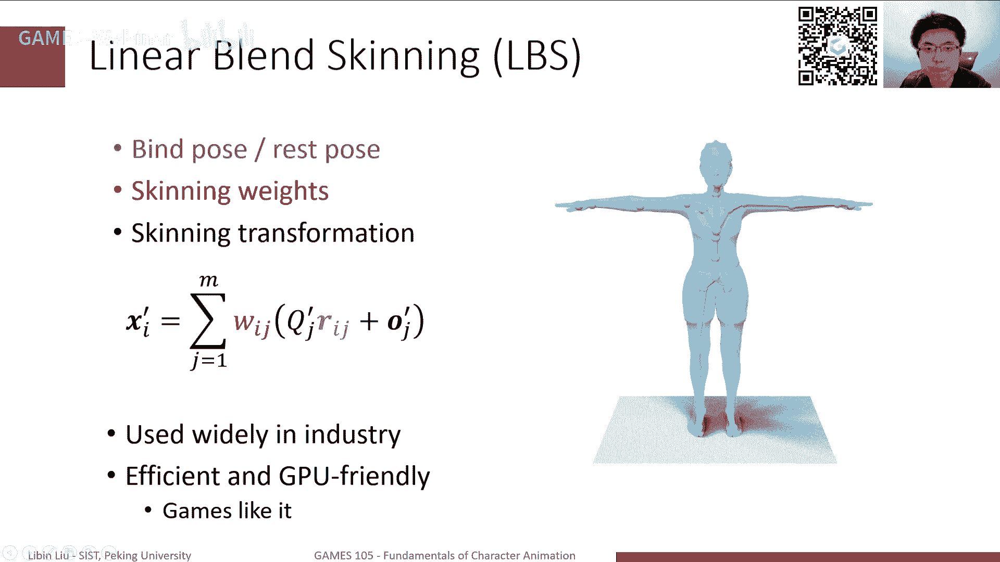

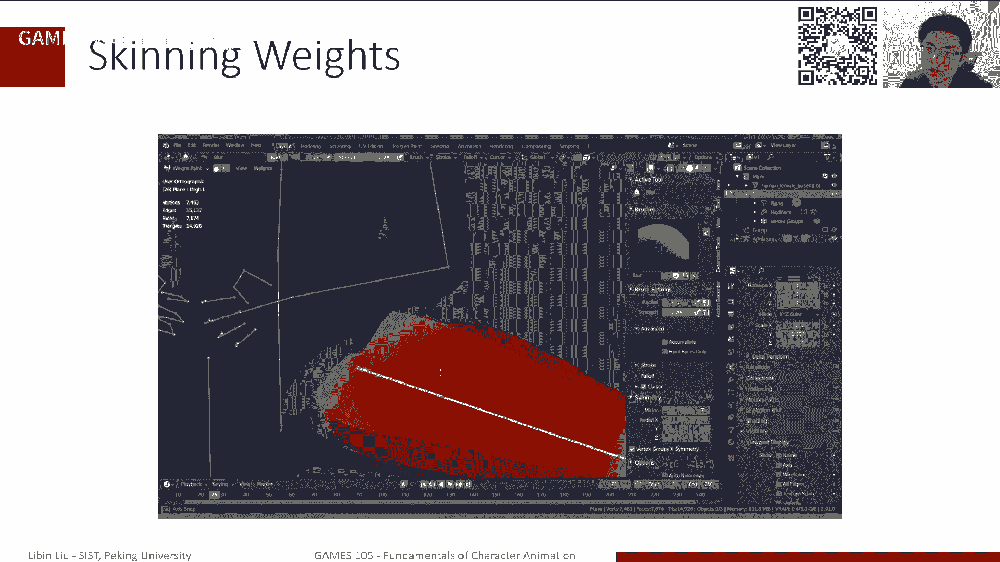

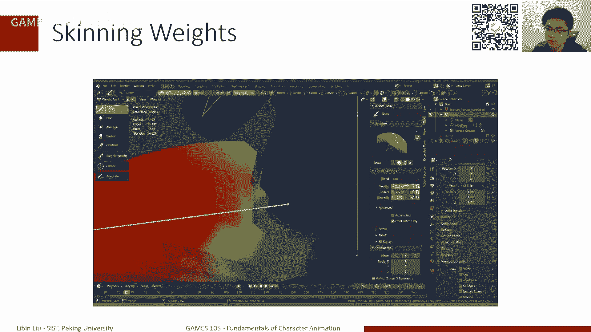

这个过程引出了一个重要概念：**绑定姿势（Bind Pose）**，有时也称为参考姿势（Reference Pose）或静止姿势（Rest Pose）。

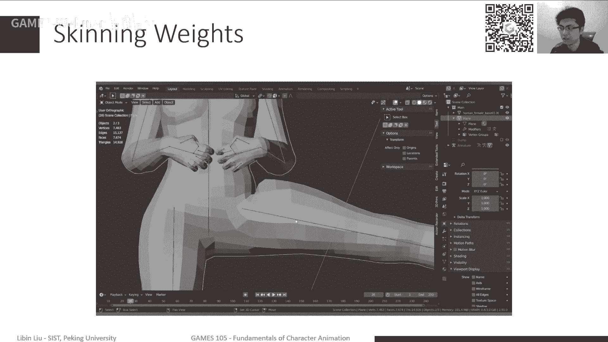

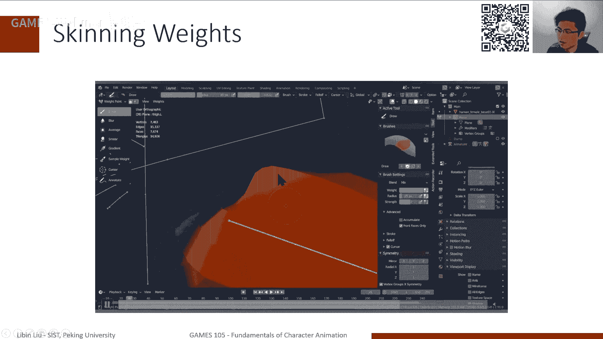


### 绑定姿势（Bind Pose）

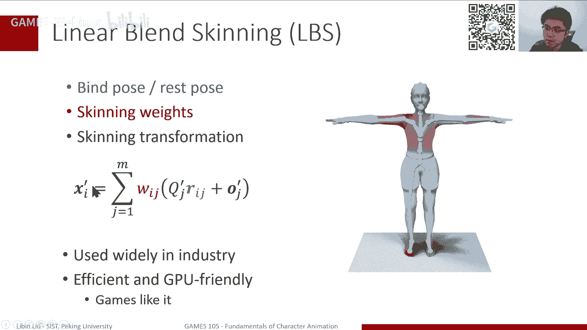

我们通常在创建骨骼和模型时，会让它们处于一个特定的、对齐的姿势（如T-Pose或A-Pose）。这个姿势就是绑定姿势。在此姿势下，我们可以计算每个蒙皮顶点相对于每个骨骼关节的局部坐标 **r**。这个局部坐标信息至关重要，因为在后续的任何姿势下，我们都假设这个局部关系保持不变，并以此为基础进行坐标变换来计算顶点的新位置。

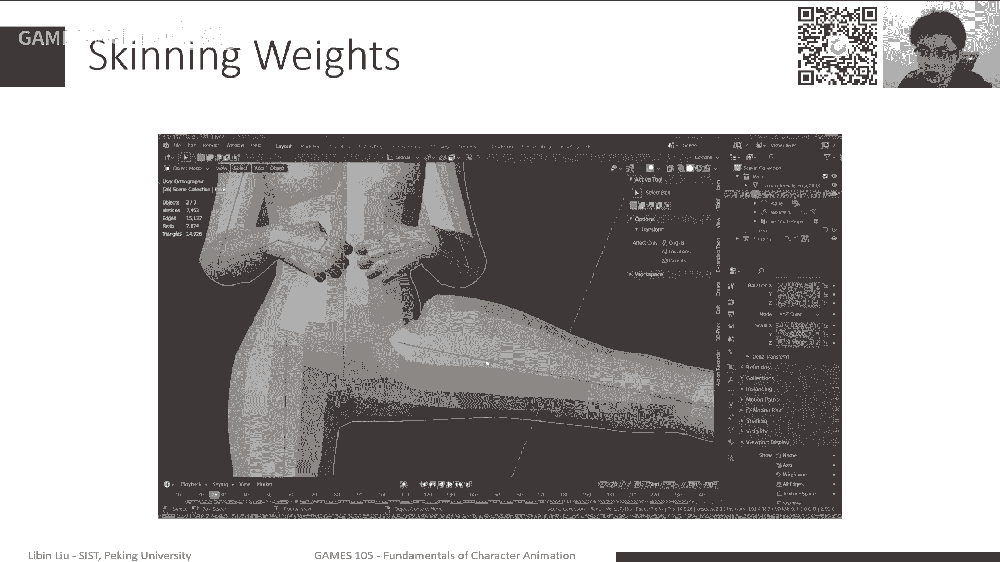


---

## 多骨骼与线性混合蒙皮（LBS）

实际情况中，角色拥有多个骨骼。考虑有两个骨骼（如大臂和小臂）的胳膊。一个蒙皮顶点可能同时受到多个骨骼的影响。

在绑定姿势下，我们可以计算顶点 **x** 相对于骨骼1和骨骼2的局部坐标 **r1** 和 **r2**。当骨骼运动到新姿势后，分别用两个骨骼的变换对 **r1** 和 **r2** 进行坐标变换，会得到两个新的全局位置 **x1'** 和 **x2'**。但顶点本身只有一个，不能分裂。

为了解决这个问题，我们为每个骨骼对该顶点的影响分配一个**权重（Weight）**。最终顶点的位置是各个骨骼计算出的位置，按其影响权重进行加权平均的结果。

对于一个拥有众多骨骼的完整角色，一个顶点（如腹部）可能受到多个脊柱关节的影响。蒙皮计算就变为：在绑定姿势下计算顶点相对于所有关节的局部坐标；在新姿势下，用每个关节的变换计算出该顶点的一个候选位置；最后将所有候选位置按权重加权平均，得到该顶点的最终位置。

这个权重就是**蒙皮权重（Skinning Weights）**，它定义了每个骨骼对每个顶点的影响程度。

### 线性混合蒙皮（LBS）公式

上述方法被称为线性混合蒙皮（Linear Blend Skinning, LBS）。其核心公式可以概括如下：

对于一个顶点 **i**，其在姿势 **p** 下的位置 **v_i'** 由以下公式计算：

```
v_i' = Σ_j ( w_ij * T_j(p) * T_j(bind)^(-1) ) * v_i
```

其中：
*   **v_i** 是顶点 **i** 在绑定姿势下的全局位置。
*   **w_ij** 是骨骼 **j** 对顶点 **i** 的蒙皮权重（满足 Σ_j w_ij = 1）。
*   **T_j(bind)** 是骨骼 **j** 在绑定姿势下的变换矩阵（将局部坐标变换到全局坐标）。
*   **T_j(p)** 是骨骼 **j** 在当前姿势 **p** 下的变换矩阵。
*   **T_j(p) * T_j(bind)^(-1)** 代表了从绑定姿势到当前姿势，骨骼 **j** 的相对变换。

这个公式是线性的，计算高效，对GPU友好，因此被广泛应用。在实践中，通常会对每个顶点设置影响骨骼数量的上限（如最多4个），以优化性能。

---

## 蒙皮权重（Skinning Weights）

蒙皮权重极大地影响着最终形变的质量。权重的设定通常由动画师通过“刷权重”工具手动完成。这是一个需要经验和审美的耗时过程，动画师需要在各种关键姿势下调整权重，使得形变看起来自然。


也有研究致力于自动计算蒙皮权重，例如基于热扩散的几何方法（如Pinocchio）或基于数据学习的神经网络方法。但这仍是一个开放的研究问题，没有普适的解决方案。


---

## LBS的缺陷与对偶四元数蒙皮（DQS）

LBS有一个著名的缺陷，称为“糖果纸扭曲（Candy Wrapper）”或“肘部塌陷”问题。当骨骼绕其轴旋转较大角度（如180度）时，线性插值旋转矩阵会导致中间状态不是一个合法的旋转，从而产生不自然的塌陷或扭曲形变。

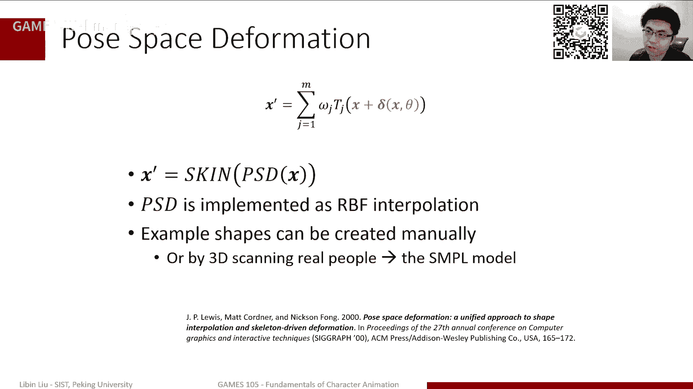

问题的根源在于：对刚性变换（旋转+平移）进行线性插值，无法保证插值结果仍是刚性变换。我们需要一种能在刚性变换空间（特殊欧几里得群 SE(3)）中进行正确插值的方法。

**对偶四元数蒙皮（Dual Quaternion Skinning, DQS）** 正是为了解决这个问题而提出的。

### 对偶四元数简介

*   **对偶数（Dual Number）**：形式为 **a + bε**，其中 **ε** 是对偶单位，满足 **ε² = 0**。
*   **对偶四元数（Dual Quaternion）**：将对偶数中的 **a** 和 **b** 替换为四元数，形式为 **q0 + qε**，其中 **q0** 和 **q** 是普通四元数。
*   **单位对偶四元数**：可以唯一地表示一个刚性变换（旋转+平移）。

类似于用单位四元数表示三维旋转，单位对偶四元数可以表示三维刚性变换。并且，它也具有“双倍覆盖”性质，即 **Q** 和 **-Q** 表示同一个变换，这保证了在插值时可以避免穿过奇异点。

### DQS 插值

DQS的核心思想是：将每个骨骼从绑定姿势到当前姿势的刚性变换表示为对偶四元数。然后，对于每个顶点，将其所受影响的骨骼对应的对偶四元数，按照蒙皮权重进行线性混合，最后将混合结果**单位化**（投影回单位对偶四元数空间），得到一个合法的刚性变换。将此变换应用到顶点在绑定姿势下的位置，即可得到新位置。

这种插值（称为DLB，Dual Quaternion Linear Blending）简单有效，能很好地解决LBS的糖果纸扭曲问题。也有更精确的球面线性插值版本（ScLERP），但DLB在实践中更常用。

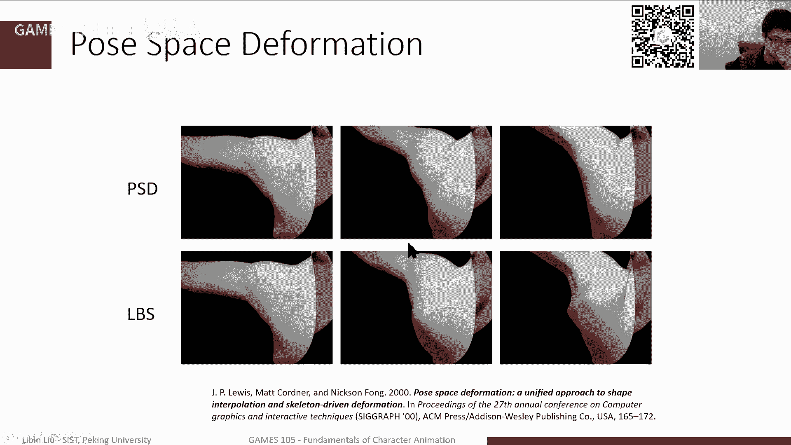

### DQS的优缺点

*   **优点**：解决了LBS在关节大角度自转时的扭曲问题。
*   **缺点**：在关节弯曲（如肘部）时，可能会产生“肘部膨胀（Bulging）”的瑕疵。权重过渡越平滑，此问题可能越明显。

因此，LBS和DQS各有优劣，需要根据具体情况选择。

---

## 基于样例的形变与姿态空间形变

另一种提升蒙皮质量的方法是**基于样例的形变（Example-Based Deformation）**。其思路是：预先为角色制作一系列在不同关键姿势下的高质量形变样例。对于一个新的输入姿势，通过插值这些样例的形变，来获得当前姿势下的蒙皮形状。

这引出了**姿态空间形变（Pose Space Deformation, PSD）** 的概念。我们将姿势参数（如各关节旋转角）作为输入空间，将顶点偏移量作为输出。通过采集的样例（姿势-偏移量对），我们可以学习或构建一个映射函数。当输入一个新姿势时，通过此函数计算出顶点所需的修正偏移量，将其加到LBS计算的结果上，从而得到更自然的形变。

### 径向基函数（RBF）插值

对于散乱数据（样例姿势在姿态空间中可能是稀疏且不规则分布的）的插值，**径向基函数（Radial Basis Function, RBF）** 是一种常用方法。

基本思想是：每个样例姿势对其周围姿态空间的影响，随距离增加而衰减（由基函数 φ(r) 定义）。对于新姿势 **x**，其顶点偏移 **y** 由所有样例的加权影响决定：

```
y = Σ_i ( w_i * φ( ||x - x_i|| ) )
```


权重 **w_i** 通过要求该函数在所有样例点 **x_i** 上的值等于已知偏移 **y_i** 来求解（解一个线性方程组）。常用的基函数 φ 包括高斯函数、逆二次函数等。

通过结合LBS和基于RBF的姿态空间形变，可以显著改善蒙皮质量，并实现姿态相关的细节（如肌肉凸起、皮肤褶皱）。

---

## 应用案例一：SMPL人体模型

SMPL（Skinned Multi-Person Linear model）是一个重要的人体形变模型，广泛应用于计算机视觉和图形学。它结合了前面提到的多种技术：

1.  **体型形状（Shape）**：通过对大量不同体型的人体扫描数据做主成分分析（PCA），得到一个平均人体形状和一组主成分向量。通过调整这些向量的系数，可以生成不同体型（高矮胖瘦）的人体。
2.  **姿态混合形状（Pose Blend Shapes）**：为了纠正LBS在不同姿态下产生的瑕疵，SMPL引入了一组与姿态相关的线性混合形状。这些形状是姿态参数的函数，作为修正项加到基础形状上。
3.  **蒙皮**：最后使用LBS（或类似方法）将调整后的形状根据骨骼姿态进行变形。

SMPL模型能够仅用少量参数（体型系数和关节角度）就生成高质量、多样化的三维人体网格。

---

## 应用案例二：面部动画

面部表情动画是蒙皮技术的另一个重要应用领域。常见方法是使用**混合形状（Blend Shapes）**。

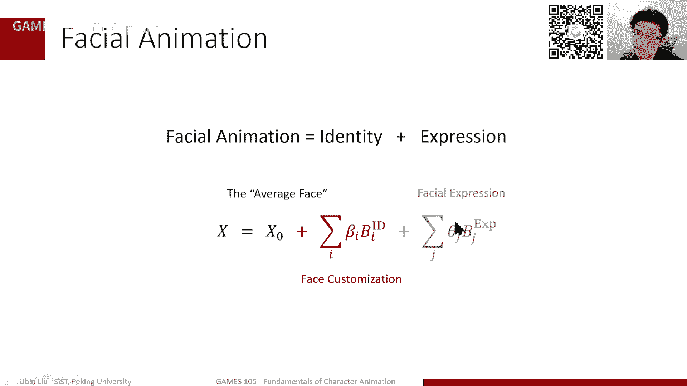

1.  **中性脸**：定义一个无表情的基础面部模型。
2.  **混合形状**：定义一系列基本表情目标形状（如微笑、皱眉、张嘴），每个形状记录了相对于中性脸的顶点偏移。
3.  **线性组合**：通过调整每个基本表情的权重（系数），将这些偏移量加权组合后加到中性脸上，从而合成出复杂的面部表情。

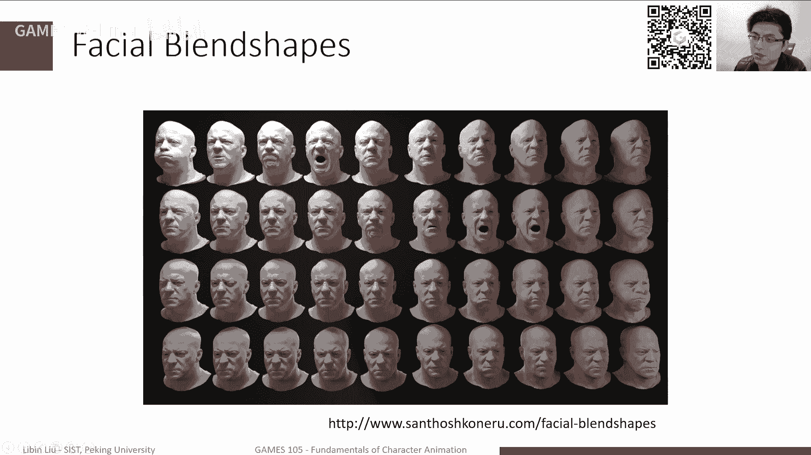

```
FinalFace = NeutralFace + Σ_k ( weight_k * BlendShape_k )
```

这种方法易于控制和实现。更高级的系统可能会使用PCA从扫描数据中获取表情基，或者结合基于物理的肌肉仿真来产生更真实的皮肤细节（如皱纹）。

### 面部动画驱动

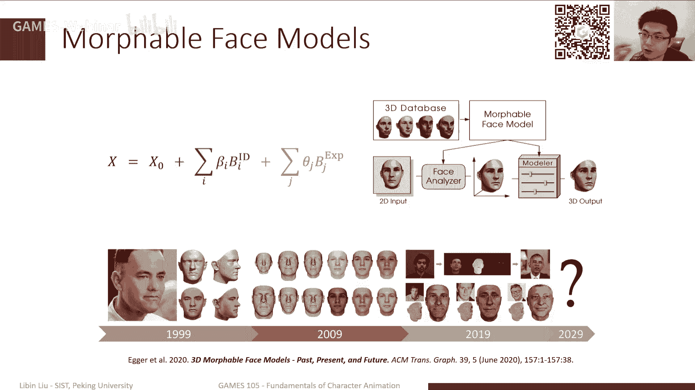

如何驱动这些混合形状的权重？常见方法有：
*   **手动关键帧**：动画师直接调整权重。
*   **面部特征点跟踪**：通过摄像头捕捉真人面部的特征点（如眼角、嘴角）运动，求解一个逆问题（IK）来反推出最优的混合形状权重，从而驱动虚拟角色。
*   **语音驱动**：根据输入的语音信号，直接预测或生成对应的口型与面部表情权重，这是一个活跃的研究领域。

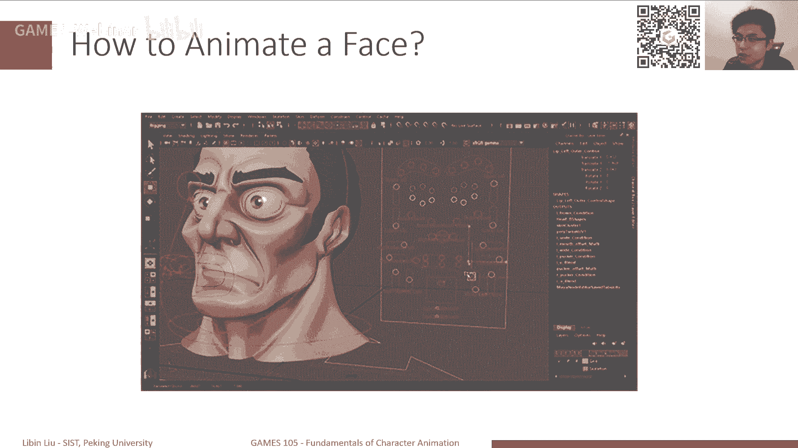


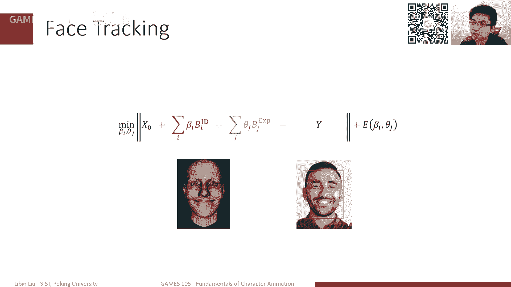
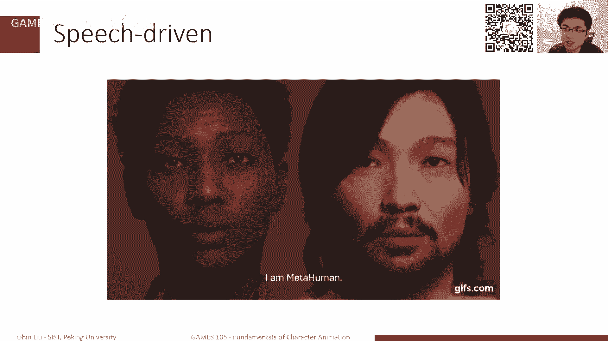


---

## 总结


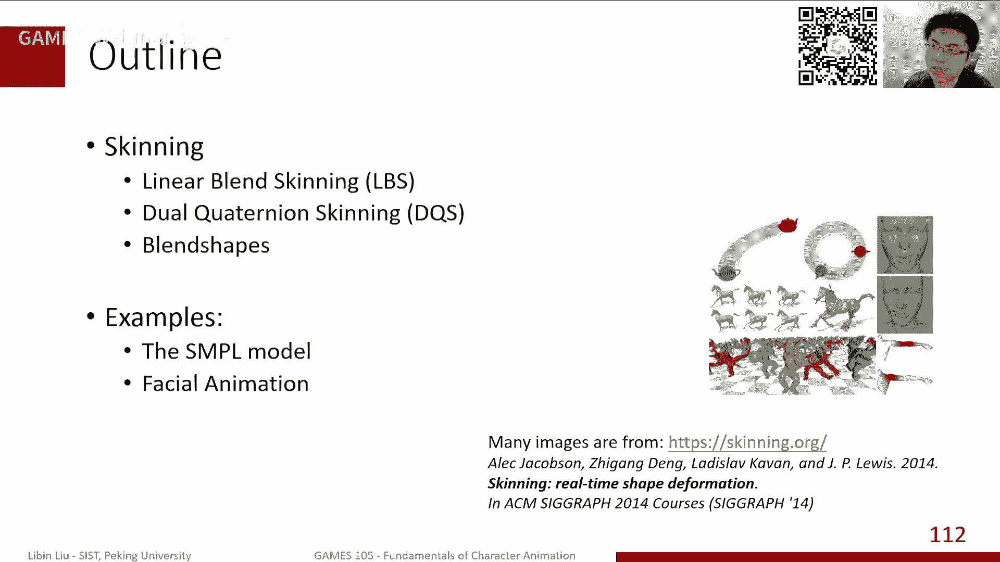

本节课我们一起学习了角色动画中的蒙皮技术。我们从最简单的线性混合蒙皮（LBS）出发，了解了其原理、公式以及固有的“糖果纸扭曲”缺陷。为了克服这个缺陷，我们介绍了对偶四元数蒙皮（DQS）技术。接着，我们探讨了通过基于样例的姿态空间形变（如使用RBF插值）来进一步提升蒙皮质量的方法。最后，我们通过SMPL人体模型和面部表情动画这两个具体案例，看到了蒙皮技术在实际中的强大应用。

蒙皮是连接抽象骨骼与可视外观的桥梁，是生成逼真角色动画不可或缺的一环。

