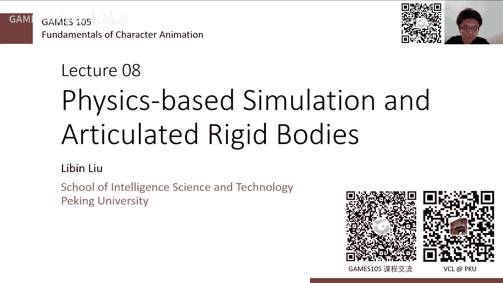
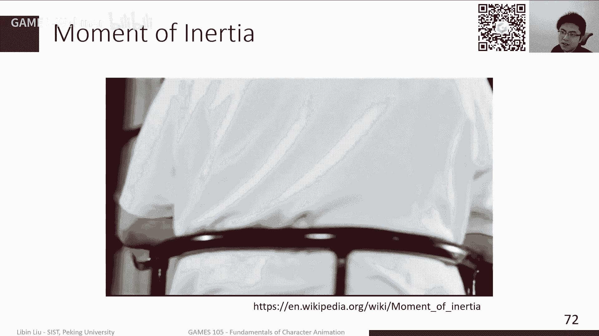
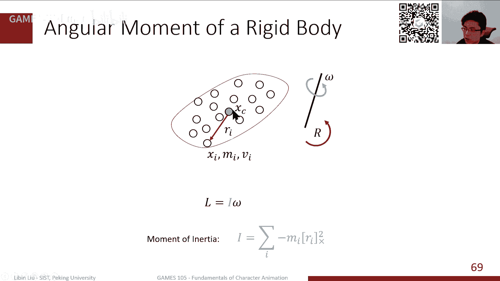
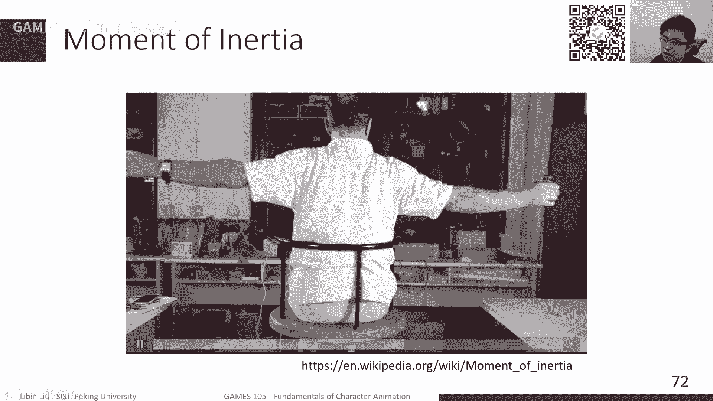
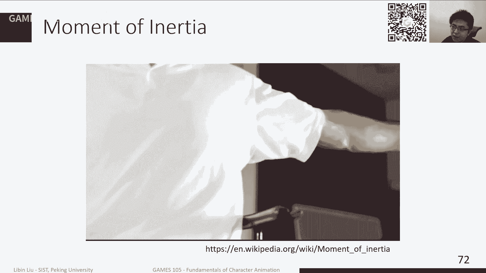
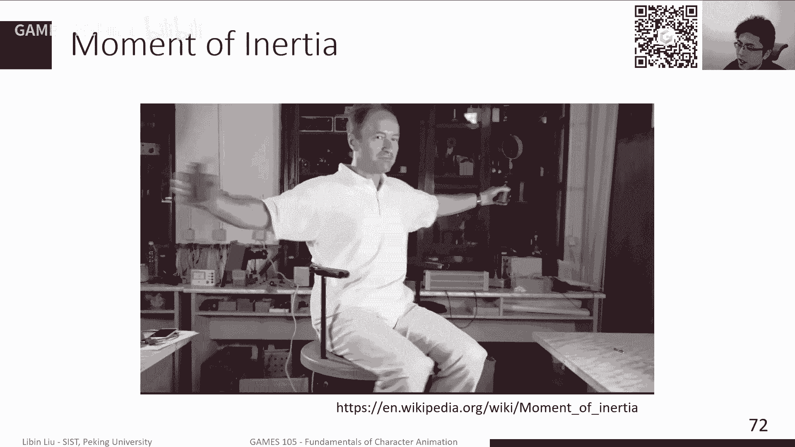

# GAMES105-计算机角色动画基础 - P9：Lecture08 Physics-based Simulation and Articulated Rigid Bodies - GAMES-Webinar - BV1GG4y1p7fF

那我们就开始上课啊。

非常感谢大家来参加我们game 165的啊，现在现在应该是第九周的课，所以说我们这里写的是lucture 08，那实际上我们是第九周的课程啊，当然我们今天的主要内容是关于啊物理仿真。

以及这个特别是啊刚体仿真的这块的内容，我们前面一直到上节课，我们其实讲的主要还是所谓的，基于运动学的方法，就是基于运动学的方法是什么呢，就是说我可以直接去改变角色的，比如一个虚拟角色。

他的每个关节的角度啊，每个关节的位置啊，然后这样的话可以去直接生成一个动画，那当然这个应该是我们现在见到的，绝大部分的这种啊，实际的应用里边啊，基本都是所谓的基于运动学的方法，当然其运动学方法。

其实很多时候可以再稍微扩展一点啊，就是说可能我也许不是直接设置一个角色的啊，位置，比如说我就可以去设置一个角色的这个速度，但如果说我直接设置角色的速度的话，这个本质上还是一个基于运动学的方法。

它其实并没有无理仿真，那我们这节课会讲一讲，这两种方法到底在什么地方会有些联系，或者他们之间有什么不同点啊，这可能是我们需要关注的地方，达人基于物理的阿拉斯，也不好意思。

但我们为什么要说，我们要研究基于物理仿真的方法，因为我们知道基于基于这个印度学的方法，其实有很大的一个问题，在于它无法或者他很难去生成一些跟环境啊，交互比较强烈的这些动作，就是很多时候。

比如说特别是比如说我的环境的交互呃，环境的这些参数会影响我的运动这个形式，而同时比如说可能有些没没有这个unexpected，就是我们可能在预先设计的时候，并没有出现这样的这样的这个呃交互。

那这些时候的话，我们用基于运动学的方法的话，你是很难去比较合理的生成这些动作的，就比如说比如说我们做动捕，比如说我们很多时候，可能比如说有些时候是一个啊格斗游戏啊，那其实比如说我就是两个角色。

那比如说这一拳打过去，那个人那个角色安全了，那其实要要做一些这种挨打的动作，这些动作其实都是预先设计好的，那你如果你要动捕的时候，包括你的动画师去做，你总是要这个有一个有一个规划，那比如说我要在神啊。

这这个角色被怎么打啊，怎么击打了，那他肯定要做出相应的动作，那如果说比如说一个vr场景，如果说我想让这个角色，因为在在vr场景里，其实我是无法去控制这个这个用户，到底他会用什么方式。

去跟这个这个虚拟角色进行交互的，那在这种情况下，其实很多时候，他击打这个方式是我无法预先去估计的，无法去先去准备的，那这种时候我们只用基于运动学的方法，是很难去生成一个合理的这样的反馈，而另外一种场景。

比如说像这里这些动画啊，其实已经已经replay了好多遍了，就比如说这个叫力大滑，那这种东西其实你是完全无法估计的，无法判断的，那这个时候我们该怎么去生成这样的动作。

那其实我们后面包括从这学期开这节课开始，一直到我们这学期的课程的结束呢，我们其实后面还有五六节课，那我们主要关注的是一类新的这个方法，叫做什么呢，叫做物理，基于物理的角色动画。

那physis based carnivation，其实基物理的角色动画，我们在第一节课时期也介绍过了，就是说其实这个历史还是很久远的，其实你可以从这个九几年啊，就已经开始有很多工作来做这件事情。

但是直到最近1~2年，特别是从deep妹妹开始到我们后面，其实我们这边也做了一些工作，比如像我们今年的srah的这个这个control v e。

我们其实逐渐的把这样一个呃phs base carnivation，现在感觉是已经越来越啊，更加有希望能够去真正的用，在去代替我们在这个基于运动学的方法，来实现我们这个这个比较好的一些效果。

那当然这个其实我们前面也提到了，他跟运动学的方法之间最大的不同点是什么呢，就是基于unix的方法，我们是直接去设置角色的姿态啊，但在这个过程中，我们比如说环境有些变化，我们这个用户有些交互。

比如这里有个就是这个这个地上有个箱子，那我就贴在箱子上，我该做出什么动作，那这种情况下，就是我们完全是依靠数据，来给我们这些这些内容的，但是基于物理仿真的角色动画呢，它其实是另外一种思路。

他是说我可以比如人在外世界里走路的时候，我们总是去驱动，靠我的这个骨骼，肌肉系统来驱动我的这个身体产生运动，那这时候比如地上有个箱子，或者地上有个门槛，他帮忙半漏一下。

那这个时候其实整个我身上身体的这个反馈，我的这个运行方式啊，其实是受到这个，比如说这个重力啊，或者受到这个这个经典力学的这个影响，那我可能要摔倒，那其实为了避免这个摔倒，我可能需要做一些动作。

那这个其实自然而然产生这样的响应，其实这个过这里边其实最难的地方啊，其实两部分，一部分是仿真，就是我们需要用一个物理在电脑里边，在我们的这个计算机里边来计算出来，实现出啊草。

或者能模拟出我们在真实世界里，这个世界各个这个物理世界的运行方式，那另外一个方式就是另外一个问题，就是就是控制我们该怎么去生成，怎么去创造一个控制器，那能够让这个角色一方面做出动作来。

一方面能够去反应啊，去响响应我们外界的各种，比如说推他一下。

或者是这个环境的变化等等等，那当我们这节课，其实是从一个非常简单的地方啊，其实也不能算简单，应该说这两部分中的第一个部分，就是关于如何进行仿真这件事情，来做一个简单的介绍啊，这个其实关于仿真的课程。

我们其实其实前面已经有几门课讲的非常好了，包括包括呃比如说game 102啊，sorry，103，还有game 301，当然实际上在前面几门课里面，可能介绍的很大一部分是说，一方面是物理反射针的基础啊。

另一方面是说这个关于流体啊，液体还有软体，这些仿真其实会介绍很多这样的内容，但是呢我们做角色动画的时候，实际上我们大部分情况或者是找在现阶段啊，现阶段我们其实关心的还主要是缸体的方针啊。

特别是这种角接的多钢铁的这种仿真，因为毕竟人嘛人和动物其实大家都是骨骼系统，骨骼基本是刚性，它不会剪，不会轻易形变，当然你也可以说形变，比如说破碎啊，那这个其实就比较比较危险了，所以在这种情况下。

我们其实今年今天这么这节课，主要是简单回顾一下我们仿真的一些基础知识，以及在额外的介绍一下，这个多缸体仿真的一些简单的这个技巧，那当然实际上现在我们在很多的这种，真正的角色动画里边。

我们其实就是会特殊物理角色动画，我们通常来讲不会特别关心仿真是怎么实现的，通常来讲我们拿一个物理引擎，那这个都可以就做一个黑盒在实现，但实际上这件事情就是，我们其实后面也可以看到。

其实这里边还是有相当多的一些方法，它是基于我们对仿真的这样的一个，数学的这样一个表达的这样一个理解啊，其实以前有很多方法是基于这样的产生的，那当然比如说最新的一些，比如基于深度学习的方法。

比如基于这个强化学习的方法，那我们其实也有各种写各种不同的思路啊，一种思路就是说我们可以完全当成黑盒子，另外一种方式就是说，我们其实也可以把它作为一个白盒子，就是model based。

所以就基于模型的方法来实现这个运动控制，所以说我们这个仿真的这个过程，还是相对来说还是有必要去了解的，ok那什么是仿真呢，或者说其实我们就是想一想，一个非常非常简单的例子，就是一个物体，一个例子。

或者我们可以想象它可能是一个小球，那这个小球有它有一个质量啊，质量通常用用m来表示，然后它在空间里的一个位置，然后是有一个速度，位置是x，速度是v，然后我在这个球上加了一个false。

加了一个这个常数的，就是不变的一个力，那我接下来问你，那这个就这个球该怎么运动，那这个其实是一个非常简单的题了，我相信大家在高中的时候，这个这个高考之前类似的提起人做过，做过无数多啊，很多很多。

那时间我们本质上来说，我们想做的是什么事情呢，就是说我其实告诉你一些信息，这个信息是说这个局物体在当前时刻，它的位置和速度啊，通常来讲，当前时刻我们认为就是t等于零的时刻。

那接下来呢我希望能够去找到一个方法，去计算未来一个时刻，比如说t等于十秒，那这个时候他的位置是多少，它的速度它在哪里，它的速度多少啊，大概是这样的一个信息，那这个过程中我们其实知道了。

比如说这个简单问题来说，我知道这个力啊，它是始终恒定不变的，一直在这个加上去，那这边怎么算呢，那其实大家在高中这个做做作业的时候啊，高考高考的时候肯定是做过类似的题的。

你们觉得首先想一想牛顿第二定律f等于ma，这个其实是非常非常经典的这个牛顿定律，那这里边其实a是什么，a是加速度，那加速度是什么，加速度是速度的导数，那速度是什么呢，速度是这个位置的导数。

其实就是说我们这个物体在移动过程中，让它移动的这个轨迹的这个对时间的导数，那肯定就是速度，那这速度其实它也是一个轨迹，它的这个大小是随时间变化的，那它导数是加速度，那有了这样导数关系之后呢。

那我们其实可以自然的去想，去做这样一个导数的这样反运算，其实就是求积分嘛，也就是说我们首先算一个加速度，由牛顿第二定律我们可以到a等于f除以m，然后一知道a了之后呢，那我们其实对这个对这个v啊。

因为v的导数等于a嘛，所以对它求一个积分，那其实可以得到这个v的这个这个函数的关系，然后如果说知道v的情况下，我们在对v进行进行进行求求这个积分，那么其实得到了x，比如说位置的这个一个函数关系。

那当这个函数关系非常简单了，因为我们知道这个在a是一个常数的，一个情况之下，那我们其实求求积分啊，求一次积分和求两次积分呢，其实都是非常容易的，我们其实是非常熟悉的这个公式。

x0 等于这个啊x0 加上v0 ，t加上二分之t方啊，这个大家经常做的这个自由落体运动，所以本质上是这样一个公式的一个特例，那在这种情况下呢，我们其实很容易知道，如果说我知道x0 d0 时刻。

它的位置在x0 ，然后这个速度是v0 ，那么在t等于十的十秒的时候，那它的位置在哪里呢，那其实可以直接套用这个公式啊，直接直接套用这个啊，最后这个公式我们可就可以得到这个这个，这个x0 的位置。

那这是一个非常简单的情况，为什么呢，因为我们这里是非常啊告诉大家，这个是一个常数，也就是说它随着时间是不会变化的，随着这个积分呢就从上一步，从这个积分到这一步的这个积分的这个结果。

我们是可以很容易计算的，它是有一个解析的解，或者一个closed form的一个解，或者说这个所以它其实可以很容易地写出公式，可以让我们做这样的一个计算，但是大部分情况下。

我们这个f它通常来讲是一个比较复杂的函数，那当然这里其实我只是只是简单的写成这样，一个形式的，但实际上它通常来讲是一个比较复杂的函数，那可能是一个各种各样奇怪的函数，混在一起的一个函数，在这种情况下。

你要做这个积分基本来说是很难的，其实我们知道能够显示的啊，能够写成一个解析的一个积分形式的，这种函数的范围是比较小的，其实只有少数几种函数能这么干，稍微复杂一点，函数生成的结构，函数的一些复合。

你都没法去把它写成一个直接解析的，写成一个公式，那在这种情况下，如果是我还是想要制计算，比如说t等于十秒的时候，你的这个积分的值啊，就说你这个位置的值是多少，那我们直接积分这件事就不就不成立了。

就没办法做，那为了解决这个问题呢，我们其实就是仿真，其实做的事情就经常是做的是这样的啊，什么事情呢，就是说我把我本质上求仿真，我就是为了去求这个公式啊，因为我从一个初始解开始，我去找到一个方法。

去计算这个时间的这个值位置，那这其实就是一个仿真的过程，但是因为这个解析的公式我们是得不到的，也就是说实际上对于任何一个t啊，就是我无法对任任意一个t去求这个值，那为了能够解决解决解决这个问题呢。

通常来讲，我们在仿真里面会做一个，非常重要的一个离散化，也就是在时间上做一个离散化，时间离散化就是说什么呢，就是说本来这是一个t，是一个连续取值的一个一个变量，那么就是2x应该是在连续的任何一个t上。

有一个值，但是呢我们其实因为我们知道这个解析的公式，我们没法计算啊，所以通常来讲我们会把t给离散掉，就说我不是在一个连续任意时间去找这个值，而是在一些离散的时间上，比如说t一的一个n个tn。

这样的一个这一系列的tn的这个点上，去计算它的位置，一般来说比如说我们在仿真里面，我们通常会让这个tn的选取是一个均匀的，也就是说我们可以比如说有一个不长h，我们通常把它叫做这个仿真的这个不长。

然后呢这个tn，那其实就是第n个这个h这样的一个这样，一个不长之后的那个点，那个时间点我计算一下它的位置，这是一个非常重要的一个时间，第三话，那当然我们选举了tn之后呢，其实际上比如说我们前面这个计算。

本来我们是需要做这样的积分，要做一个连续的积分，那我们其实可以把它放在一个比赛，到时间上之后呢，我们可以只需要去计算什么呢，我们只需要根据当前某一个时刻，n这个时刻的速度和位置。

我们去计算下一个时刻的速度和位置，那我不我们不断去迭代着，去完成这样的一个计算，那实际上逐渐逐渐，我们就会达到我们想要去计算的那个位置的，那个那个时间时刻的那个那个那个位置，那个他的状态。

那当然实际上这个转换到目前，这个转换其实是精确的，比如说我因为我这个积分我可以把它，我就知道我们这个这个连续的积分，我们可以把它拆成一系列区间的积分的求和嘛，所以说实际上这样一个公式。

我们是可以直接精确到这里面来，但这里还是有一个问题，就是这里，其实我本质上虽然说我把时间离散化了，但是这里我还是需要计算这个积分值打开，但是这个积分的值，因为a是由f来算出来的，但是f是一个不可积分的。

就没法直接去积分的这样一个函数，所以造成这个小积分其实还是无法计算的，或者再去一些，比如说我们就是一个x我们知道它的导数，它导数的曲线是这样一个曲线，那个曲线形式是什么，我就不关心，我不是很关心。

但至少我知道这个曲线，这个函数我是没有办法直接积分的，ok咱们在刚才我们说的这种离散的啊，空时间的离散这个这样一个条件之下呢，那我们需要知道，比如说我知道t5 时刻x的位置。

然后我需要计算t60 个x的位置，那时间t60 个打字位置，应该是t5 时刻来位置，加上5~6中间这个函数下面这块面积啊，就是这段的积分，但是因为这个函数形式我不知道无法表达。

所以说我只能近似去计算这一块的面积，然后用这一块近似的这块面积，来代替这个积分的值，那当然这个近似，我们有好几种不同的方式来近似的，比如说因为要计算这一个小块的面积对吧，他这边有个起点，有终点。

那么可以认为这一小块的面积可以用一个，可以用一个t，用一个正方形来近似，当然这些其实多了会有一些误差了，因为这个误差是我正方形无法去弥补上的，那这个正方形的面积等于多少呢。

等于这个它的宽度是我的时间的间隔就是h，然后它的高度是在n时刻的这个速度的值，x导数的值，那这样的话我就可以实现了一个近似的，这样一个计算啊，就是在他跟前面这个这是一个精确的一个公式。

但是这个公式我算不了，所以说我用一个近似啊，用这个上一时刻的这个这个速度，乘以这个时间间隔啊，得到了这样的一个估计，当然这是一种近似方式了，那么其实还有另外一种近似方式。

就是说我其实可以用下一时刻的速度，我认为是这一区间整个的速度，那这也是另外一种计算方式，所以不管哪一种近似方式，实际上我们都是可以完成这样的一个，对前面这个比较比较难算的。

这个这个积分的一个数值的一个估计啊，的一个计算，那当然这个过程实际上也叫数值数值积分啊，叫数值计算，它其实是用一些近似的方式来去来替代，我们的对这个积分的计算，那么这两种方式刚才也说了。

它最大的区别是什么，最大的区别在于第一种方式，我比如说我要先从x n算x n加一，第一种方式我是用了对应的xn的速度，n时刻的速度来代替，这一小框格的这个整体的速度，那第二种方式呢。

是我认为是为了算x n的这个更新，我用xn加一的这个速度来去作为整体的速度，那就是两种不同的，这种这种啊啊这种这种祭祀的方式，那当然你要说可能有其他的方式，比如我是不是搞成一个梯形啊。

是不是改成一个中间的这个这个这都可以，但这都是不同的计算方式，但是为什么要讲这两种，因为这两种刚好是对应于两种不同的欧拉，积分方法，就前面这种就是用第一用，且就是当前时刻的速度。

或者说它这个速度值叫做前向欧拉，或者叫显示欧拉，那反过来第二种用后面这个来做计算的，那叫隐式欧拉啊，也叫也叫逆向欧拉，就这是两种不同的欧拉的这个方式，其实公式很像，唯一的区别就是说前面都是一从当前速度。

当前的位置和速度计算下一时刻的位置和速度，只不过呢这个加速的部分，积分的部分对于显瘦拉来说，我用的是当前的值，对于野兽来说，我用的是下一时刻的值，但这其实有一个问题，特别是对于野兽拉来说。

这个下一时刻的这个加速度，其实是某种程度上它是一个未来的信息，就是我现在还不知道的一个信息，为什么呢，因为主要是说下一时刻的速度，就是我们这个力，很多时候我们表示他是跟我这个物体。

当前的位置和当前的速度相关的，那就比如说我们知道万有离万万有引力啊，非常典型，万有引力的话，你离得这星球越近，那他这个力就越大，离得越远，力就越小，那它当然跟位置相关，那其实有其他的，比如说风阻啊。

风的阻力它其实跟速度相关的，你跑的越快，你的风阻越大，所以说其实经常来讲它是跟这个这两个相关的，而为了能够计算这个力，我需要知道下一时刻我的位置和速度，但是呢在当前这个计算这个力的时候。

我下意识和力和速度我又不知道，所以说这里其实有一个问题啊，就是它需要一些future information，那为了求解的话，我们就需要解方程了，那这个解方程通常来讲会变得比较复杂一点。

因为这个f是一个非线性函数，那其实去求解这个方向会比较会比较麻烦，那另外还有一种方法，就是这两种方法的一个混合的方法啊，叫这个simpletic，或者叫新欧拉，或者叫这个半隐式欧拉。

但其实看到有其他的名字，它实际上是说，因为我们同时需要关心一个速度量啊，和一个未知量，那这对于我们其实因为速度量的更新，我们需要这个加速度，然后加速度通常来讲他可能会需要，如果说我们有隐身欧拉的话。

它是需要未来的一些信息的，所以说我们可以把这个加速的部分，改成当前时刻啊，这个这这一行，其实就跟你这个显显效欧拉是相同的了，但是从速度来更新位置，我们其实是可以用这个对于这个新欧拉来说啊。

或者半隐式欧拉来说，它其实是用的，我已经计算好的新的速度去更新这个位置，当然写手拉的话，它是用当前的，而不是已经更新好了，所以这是另外一种欧拉方式，这种欧拉方式实际上在我们的这个仿真器里面，是最常见的。

而前面这种其实相对来说呃，就稳定性上就是和这个它有一些不太好，就是性质来说不如这个这种积分器要好一点，但不管这两种哪种积分器，就不管是前向欧拉还是这种影射啊，半隐式欧拉它的所有的信息都是已知的。

就不需要解方程，就可以直接进行计算，那当然这个也引兽拉的话，它是需要解方程的，因为它有一个未来的信息，当一个具体的例子，比如说弹簧啊，这是一个弹簧质点系统，就是一个弹簧，然后一个木块放在这里。

然后这个时候假如没有摩擦的话，然后这个物体的话，它放在原点，那在这种情况下，这个物体受到力，我们知道混合定律嘛，这也是高中大家比较熟悉的内容，它可以告诉我，我定会告诉我们，这个弹簧给这个物体的力大小。

应该是这个负的k啊，进度系数乘以x那在这种情况之下，我们可以比较容易，比如知道f之后，那我们知道它的加速度，加速度是f除以m就是负的k乘以二，然后乘以x n，比如用显示欧拉的话。

我们可以写成这样的形式啊，就是根据当前的x n计算出这个速度加速度，然后做一个做一个数值积分，然后用当前的速度作为数值积分，得到下一个时刻的位置，然后类似的这个半隐式啊，唯一的区别是这里啊。

但是更新的速度时间不一样，然后还有另外一个这种野兽拉，其实你稍微复杂一点，就野兽拉，因为我需要借用下一时刻的位置，去计算这个加速度，所以说这里其实是一个x加一，在这里，当然我们可以比较容易的。

把它写成一个矩阵的形式，那也是欧拉写受欧拉是这样子的，然后半隐式欧拉写成这样子，然后野兽啦其实要特别注意是说，其实你会发现前面两种写出来，写成矩阵形式的话，其实xn和xn加一就是直接是在左边。

他们前面没有系数，但是也是奥拉号前面有个系数矩阵，其实本质上来说，就是因为我需要一个未来的信息，导致了我这个这个系数矩阵在这边，我其实做一个需要做一个求解，最终得到的是说下一个位置。

需要是把这个矩阵矩阵求逆啊，从这边去走到这样的一个公式，但这三种方式啊，如果说我们直接对它做仿真，因为本质来说我是每一时刻，从当前时刻我可以去乘上一个系数，得到下一时刻的这个这个位置和速度。

那如果说我们把每一种方式不断做这样迭代，那得到了这个速度和位置的关系，我们把它画成图啊，这里横坐标是位置，纵坐标速度，那其实你可以发现对于饮食啊显瘦拉来说，他其实是当然可以先看一下这个坐标，坐标范围啊。

这个其实已收啦，其实我反正了若干步之后，他其实是逐渐逐渐在往外扩大，这意思是什么呢，就是说我的这个随着我不断的仿真，那这个木块会抖动的越来越快，越来越快，并且抖动的越来越远啊，这是一显瘦了。

他从一开始的一个距离开始，它会抖动的越来越慢，越来越慢，最后逐渐收敛到零，就收敛到完全不动，而这个中间我们说这个新郎或者半夜收了，它基本来说是一个比较稳定的一个简谐振子，这样一个效果，所以说实际上就是。

这也说明了这三种不同的这种仿真啊，就是求积分的公式的性质，对于学生来说，它通常来讲经常会导致不稳定，就是这个系统会不断的从虚空中拿出能量来，但这个能量其实是不真实的，是假的。

就是这是一个数值上带来的能量，它会让这个系统越来越不稳定啊，这个不稳定会导致这个这个角色，物理这个角色可能突然就飞掉了，然后突然就是这个本来是一个整体啊，突然就散开了，然后就飞到这个道都是。

所以这是一个写手了，它竟然会有些数值不稳定的问题，然后也是欧拉是肯定可以保证数值稳定的，但是呢它就会有一些能量，会不断的从系统中被耗散出去，但是有些时候对于我们仿动画来说，可能不是一个特别严重的问题。

因为这些能量耗散，你可能肉眼并不能直观的感受到，但是另外一个问题是说也是欧拉，就是野兽，欧拉实际上是说它因为它需要去求解一个方程，你前面提到的，其实对于这样一个弹簧振子来说，还是相对比较简单。

就是一个二维的一个矩阵，二阶一个矩阵，但如果说我这系统比较复杂，比如说我可能是一个人，那可能是60多个自由度，那这么多自由度每次需要每个时间都要求逆，那可能是比较复杂的，那如果是再大一点行动。

比如说有些时候，我们常常经常看到一些一些这个，一些这个例子啊，比如说可能有有1000个方块，1000个小球同时丢到一个场地里面去，那对应的那个那个矩阵会非常非常巨大，所以说这个隐身拉。

通常来讲它会有一个求解速度这个问题，所以总体来说呢就是说啊，然后就是中间我们这个稀有啦，这个其实是可以证明的，但我们这里就不再做介绍了，就是你可以证明它是可以在这样的。

至少在这还用质子这样一个线性系统的情况下，它是可以保证我这个能量是守恒的，那当然这个如果是非线性系统的话，其实他这个也不是严格守恒的，因为主要是非线性系统，你做线性化，本质上我们是在做一个非线性系统。

做线性化嘛，那这个时候其实内部呢会带一些误差，这会造成一点点这个不守恒的因素，但总体来说呢，就是说我们不管是显瘦欧拉还是半隐兽拉，或者新优拉，它是相对来说比较快的，因为我们不需要去解封城。

但是不管哪一种，特别是显瘦了，稍微大一点的这个纺织布就会非常不稳定，当然这个新又来了，就是虽然说是他是在这个弹簧质点，这么一个系统里，它是稳定的，但是更复杂的系统啊，通常来讲它也是不稳定。

特别是这个反正不大的时候，然后野兽了，因为它是可以保证，反正是肯定是稳定的，那当然缺点就是慢，而且虽然收入虽然说稳定，只是说他这个公式本身数学还是稳定的，但数值上通常来讲也可能是不稳定的。

取决于我前面去求解那个方程的，那个那个矩阵啊，那个矩阵如果它是一个奇异阵，或者是接近于奇异阵的一个条件，是非常差的一个矩阵，那它也会不稳定，所以说这也是这个不同积分方法的一个应用，就像我们前面所说的。

其实很多时候我们常用的这种仿真引擎，比如说bullet，比如说o d e啊，比如说还有什么mojo，其实大部分都是属于这种信用拉的方式，在这种方式多一点，当然还有一些其他的，比如说我们想要更精确的这种。

或者更加稳定这种积分方式，那其实还有一些其他的方法，比如说这个rk啊，常见的r k for这个龙格库塔法，然后还有一些这种变分法，变温积分器，那变分积分计是另外一类的方法，就是首先能够互打法。

这个是其实相当于他是比欧拉法更加精确一些，所以它比如说我即使不稳定，我其实这个崩得也慢，但是本质上来说，它可能还是如果除非我用隐士啊，不然的话，他其实还是一个，不能保证稳定性的一个基本方法。

然后这个variational integration就是变分计分器啊，它本质上来自于什么呢，来自于比如大家有可能有些同学，有些同学这个了解过，比如说悬链线或者最速降线啊。

我们知道这个小球沿着什么样的轨道下降最快，那其实这个求解的方式其实它用了变分法，那这里其实它基于一个什么呢，就是最小作用量原理，就大自然总是想偷懒的，我们总是想要让一个作用量这么一个量。

走这样的量增量最小的轨迹，所以这个变温积分，其实基本来说从那个方式去推导的一些公式，当然缺点是它不太容易去处理这个碰撞，这个膨胀一般来说不是一个，它是一个耗散的一个一个过程，所以说不太容易去处理。

还有另外一类非常差，也是最近非常这个应用非常多的，就是position based dynamics，就是基于位置的啊，这个物理，那当然这个我们就这门这节课就不讲了，就是这门课我们就不会讲。

但是有兴趣的话可以自己去了解一下，因为现在一些很快的仿真器，特别是非常高高度并行的仿真器，大部分是就是不是，大部分就是很多是基于这种啊，p p t或者x p p t。

就是这种基于位置的这种物理仿真的方法，比如非常典型的像是这个嗯啊，这这不只是个人的一些了解啊，就比如说像是nvidia的一些这种，可以跑在gpu上的这些这些，反正期其实还是以这个p p t的方法为主啊。

它可以实现很快的并行，可以很快去这个在这个嗯gpr使用，那当然这是一些其他的一些防尘器。

那当然前面只是简单介绍了，我们只是一个质点啊，作为例子，我们介绍了一下这个我们怎么去进行积分啊，怎么去这个一些基本的一些基本积分的，这个方法，那我们其实这门课啊主要关心的是什么，我们关心的是钢铁。

那什么是钢铁，那缸体实际上是一个物理学上的一个，非常抽象的一个概念，它只是说我一个物体，它在运动过程中不会发生形变，不好意思，它就是一个钢铁，那比如说一个石头啊，非常典型的缸体。

那很多时候比如说一个桌子呀或者一个乐高块，那都是钢铁，但是实际上真正的钢铁在自然界是不存在的，因为本质上来说，如果说一个东西完全不会形变，那就意味着这个东西它可以以光速超过光速的。

就是无限大的速度进行进行传递信息啊，那这个当然是首先这个相对论是不允许的，其次也相当于这个材料的这个钢筋，它的强度是无限大的，那这个材料学也是不允许的，所以说真正的管理是不存在的。

其实本通常来讲只是一个近似，就我们在认为在有我们常见的这些交互里边，它的形状是不改变的，这是一个钢铁，那当然对于钢铁来说呢。

我们其实前面也是也是经常会讲一些，就是很多其实也多少也设计过啊，就对于钢铁来说，它一个非常重要的性质，因为它它形状不会改变，意味着什么呢，意味着里边任何两个点的相对位置关系，是不会发生改变的。

就是相对在局部坐标系的相对位置关系，是不会发生改变，这也意味着我对于钢铁来说，我只要确定这个钢铁上一个点，比如说x这个点的位置，然后以及这个缸体在视觉坐标系的朝向r，那我就可以为唯一的啊。

完全确定好这个缸体的性质，就是它的它的位置，每个点的位置我能给同样算出来，就比如说这钢铁上另外一个点xp，它跟x在缸体局部坐标系的相对，这个相对关系是r0 ，那我知道x和r之后。

那我其实可以直接写出来这个这个x撇，它的位置应该是x加上r乘以r0 啊，其实就是做一个坐标转换的这样一个过程，那其实这个r好，r乘二零，我们可以稍微写写写，写成一个r就不带不带不带零的这个r。

那在这种情况下，就是如果说我们想再进一步的，比如我讲，因为我们知道这个缸体它在运动过程中，他其实每个点在空中，空气在空中都会有一个轨迹在空间中，那这个轨迹我们可以对这个x。

对这每个点进行一个求对时间进行求导啊，比如说对这个x x表对x p的这个移动啊，对对时间求导应该是什么，其实应该是x撇的速度，那它的速度应该是多少的，应该是什么呢，所以我们知道这个。

其实我们可以从x表这个表达公式，我们可以直接对它求，比如最多这个x撇的公式，左右两边对时间求导，那左边是x p r x撇的角啊啊一点啊，那其实是这个速度，然后右边其实是xx的一点。

x我们一开始参考的那个点，然后以及r的旋转矩阵的导数乘以二零，其实因为r0 是一个固定不变的，它是一个局部的一个向量，它的运动过程它是不变的，所以说这个求导，后面这个求导只需要对r进行求导来完成。

那当我们前面已经知道了，这个x点其实对应的是x，就这个参考点在空间中的速度，然后呢这里清另外一个问题，这个r点应该是什么r点，什么r什么r是一个朝向，它本质上是一个旋转矩阵，所以旋转矩阵的话。

我们知道我们就是第二节课的时候，讲数学的时候，我们知道旋转矩阵有一个非常基本的要求，那就是说他本身是正交的，就是x r2 乘以r t等于i，那如果是占满，我们要因为我们这不管我这个角色啊，sorry。

我这个缸体怎么运动，这r其实是可以在不断时间不断的变化，但在变化过程中，我们需要始终保持r2 乘以r t等于i，这样一个公式是不变的，它是一个常量，那如果说那这样一种情况下。

我对两边可以对时间同时对时间求导，然后左边对时间求导是这样一个公式，右边i是一个常数啊，它是一个长矩阵，单位阵嘛，长矩阵，所以他对时间的导数应该是零，那左边这个其实我们可以应用一下。

我们这个乘积的导数等于这个导数的乘积啊，分别导数的乘积啊，可以写成这样的一个公式啊，其实本质上是前面这个导数乘以右边，然后在前面乘以右边的导数，那其实可以看到，这两个其实有比较明确的这个对称性啊。

就看起来好像是这个形式比较相似，所以实际上我们也确实它是对称性的，就是前面这个公式右边r乘以r。t，它其实是r点乘以r t的转置，那其实这里可以发现，r这个前面是r点乘以r的转置。

右边是r点乘r的转置的转置，所以说一个这是一个矩阵，这是另外一个矩阵，一个矩阵乘以加上它的转置等于零，那就说明这个矩阵是一个反对称阵啊，就所以是r点乘以r t它是一个反对称阵。

那反对阵我们其实前面也提到了，我们是反对，就反对称阵它具有什么样的形式呢，它可以写成这样的一个方式，那就对角线肯定是零，这是反对称的一个基本要求，然后这个另外其他两个这个对应的这个点上啊。

对应位置是互相为相反数，那另外说我们我们前面也提到了一个，任何一个反对称阵啊，总是会跟一个差乘矩阵，它本质上就是一个差成矩阵，它其实跟一个差乘是对应的，那这个叉乘就是我们可以从这个反对称这里边。

去提取这个差成的这个前面的那个向量，那这个向量我们就把它叫做角速度，也就是本质上r点它等于什么呢，它等于这个角速度这个向量所对应的差乘矩阵，然后再乘以r就是数据上可以执成这个样子。

然后然后就是如果带入到上面去，其实可以把这个x撇的导数，可以写成这样的一个形式，那时间我们再稍微这个代换一下，因为它这个叉乘矩阵嘛，我们总是可以写成叉乘的形式，那其实就是比较熟比较熟悉的这个公式了。

比如说我们再把它解写，把r r乘以r0 ，对我直接写成r2 ，那其实就是这样的公式，那这个公式是，可能大家可能比如在物理课上也可能见过，或者在其他地方也可以，建议可能也见过，就说这个x点。

就是就是这个钢铁下另外一个点x撇，它的位置啊是x加上2x20，然后它的速度是这个x的速度，加上这个角速度叉乘，我们变个插上r，那当然其实就是刚才我们说的这个x点，二等于v啊，就是这个x的速度。

然后r的点就整个这缸体旋转的这个朝向的，时间的这个对时间的导数等于角速的，插上去转乘以二，但这里其实有一个问题啊，就是我们只是说我们这个omega，实际上本质上是由前面这样一个关系，从这里提取出来的。

那为什么是讲速度呢，就是说实际上我们总是想象，因为我开始看到这个公式，当然是这个公式v加上r我们应该差了二，那为什么它是角速度呢，就这俩都有什么关系呢，这些东西都稍微多讲一句，就是说其实回想一下。

我们当时讲过那个罗德里格斯罗德里公式，就是比如说我这个只有一个空间上，有一个方，有个向量x我希望它能够绕着一个轴，一个轴旋转，那比如旋转角c塔，那旋转之后呢，这个点的位置，x撇的位置和x之间的差啊。

其实可以写成这样的一个公式形式，如果你没有印象的话，可以去看一下我们第二节课的一个推导，那如果说我们这个轴，实际上如果说这是一个刚体啊，这x是刚体这一点，然后我们当天刚体正在沿着这个轴做旋转。

那旋转的角速度是omega，那这个旋转我们其实可以得到什么呢，就是说在这个旋转过程中，这个x这个点这个向量，因为它在旋转过程中，这个x点这个向量它的它会沿着圆周会移动吗，在移动过程中。

这个向量的坐标值啊，对于时间的导数，我们可以用一个这个链式链式法则啊，我们可以写成这样的一个形式，那这里其中这个dx比d feat，其实我们知道这个dx本质上是deltx。

在这个fa趋近于零的时候的一个极限值，这是导数的定义，所以说你其实可以很容易得到dx d dx比cdc的，你可以用比如说洛必达法则，你可以去得到它其实应该等于u差乘x，我们其实之前用过这个关系。

就是说在我们计算i k的那个，雅克比矩阵的时候，我们其实已经用过了这个关系，本质上他俩是同样的东西，然后这个d c和d比dt其实就是旋转的速度嘛，那我们知道旋转沿着一个轴的旋转的速度。

那本质上就是角沿着这个轴就是角速度，这实际上在这样一个旋转过程中，我们知道这个一个向量，x在一个角度进行旋转的时候，它的坐标值的变化绿啊应该是欧米伽插上x，这是我们从这个可以得到一个公式。

那因为另外一方面，我们知道一个旋转矩阵，r那几个旋转矩阵它本身就是一个，它对应的是什么，是一个钢铁的朝向，那刚那个朝向，其实本质上来说是一个缸体上的三个坐标轴，在世界坐标系下的这个表示。

所以r其实每一列都是一个向量，对应的是对应坐标轴的那个嗯，那个坐标那个轴的这个向量的方向，那其实比如说ex我们看这个向量，它在这样一个欧米伽这个角速度下旋转，ok那这个旋转之后，或者它的旋转的变化率。

那其实按照我们刚才那个推导，应该是欧米伽x1 x，那类似的e y和ez有同样的关系，那也就是说如果说进一步，比如说x的点啊，r的点r的这个导数对时间导数，时间本质上是它里面每一个元素，对时间的导数啊。

或者说可以说是他每一列分别对时间的导数，因为每一列的时间导数分别是，我们应该差成这一列，那第一列是我们应该查成第一列，第二列是我们应该查成第二列，那以此类推，那我们其实可以把这个这三个。

这三个差成这个形式，我们可以把这个w给提出来，它本质上就是说我前面乘上一个w的旋转矩阵，其实可以同样的得到这个公式，所以实际上就是说角速度和，就这就回到我们前面这个这个关系嘛，所以说就是r它是一个旋转。

是这个缸体的朝向，那这个缸体的朝向，因为它是随时间变化的，我们可以计算它的导数，看他对时间的导数，就是角速度的差乘矩阵乘上r的这样的形式，那这是一个非常重要的一个关系，ok那我们知道这样的关系之后。

我们可以做什么事情呢，比如说我在这个缸体在某一时刻，ok我现在它当前的位置是x，然后它的朝向是r，然后呢比如说现在这个缸体是它有一个角速度，是沿着某一个轴啊，一个方向的角速度，然后同时它有一个速度v。

然后他在这样的速度之下，角速度和速度之下，我运行了一个dott的这样一个时间，离线之后呢，我这个刚体旋转了一个新的位置，移动了一个新的位置x表，同时呢我这个朝向啊稍微转了，转到了一个r撇。

那我接下来就问我该怎么去计算x撇和r撇，x表其实是比较简单，就是实际上我们也就是说实际上这个这个v啊，就这个角速度，这个速度我们前面也知道它本质上是一些导数，所以我们知道x的导数。

x导数应该是这个v的值，然后刚才其实我们也推导过了，r对这个朝向矩阵的导数，它是omega的差乘向量和差乘矩阵，乘以r r的这样一个形式，那知道导数之后呢，其实就相当于我知道了这个角速度和速度。

我就同时知道了这个x和r对时间的导数，那主角导数呢我们就可以做积分啊，求出这个下一时刻x撇和r撇的位置，那其实xp那很简单，它就是达到t乘以v啊，这是我们做了一个简单的欧拉积分。

另外这个r撇其实也是一样的，本来是r撇，应该是r撇等于r2 ，加上w t乘以r点，ok但是r的导数r点等于这个欧米伽差乘以r，所以说时间r撇就是我在下一时刻，这个旋转矩阵，注意这是一个矩阵。

他应该是上一时刻，这个旋转矩阵，加上dot乘以这样一个这么一个dot的形式，那这其实本质上就是完成了一个对旋转矩阵，对这个朝向矩阵的一个更新，那当然这里有一个问题就是这个更新本身啊。

因为这是一个本来如果说这个时间是无限小的，那我们是可以保证这个加完之后，这r还是一个正交矩阵，但是呢我们如果说这个dot不是非常小，通常来讲，比如说我们用1‰秒，1%秒，那这其实不算很小了。

那这种情况下这个东西的会有一点点误差，他会让我的r撇不再是一个正交矩阵，但这个正常解决，这个本质上来说不是这个公式错了，而是因为我，我们现在其实是在用一个线性的一个函数，去近似一个非线性的函数。

它会有误差，那这个误差会导致r撇不再是一个正交阵啊，他其实同时也就是它不再是一个学生矩阵了，所以说为了能够让这个就这个其实问题很大的，通常来讲你你迭代个十十几部或者100步。

那这个r就已经变成完全不完全不对的东西，它可能是一个一个奇怪的，就是可能是一个让这个东西发生形变的，一个一个矩阵了，它不是一个正交阵，所以为了能够让这个稳定下来，我们其实相当于每一步之后呢。

我们通常是需要对这r做一个正交化的，那怎么做正价化呢，那当然是这个大家这个大一的时候，这高大肯定是讲过的，比如说这个格莱姆斯格莱姆史密史密特正交化，你总是可以做的，有各种不同的方式。

那其实这个正交化虽然说是可以做吧，但是总体来说还是比较麻烦的，计算量比较大，那就回到了我们前面用的非常好用的，这个四元数，我们知道这个前面这个矩阵，我们用九个数来表示，但是用四元数我们只用四个数。

相对来说会容易很多，然后另外一个非常好的一个问题，就是说四元数的正交啊，因为单位四元数代表一个旋转吗，单位化比这个矩阵的这个正正交化啊，要简单很多啊，要算出来简单很多，所以实现类似的问题。

比如说我这个缸体，它的位置是x这个没有什么问题，它的朝向不用q来表示，那如果说它能通过同样的这样一个角速和速度，的这样一个啊移动，那这个位置变成x撇啊，实际上我们这个积分的公式我们是非常熟悉的。

其实关键就是说我如何去计算x撇，x的导数和q的导数，如果这两个算出来了，那其实后面这个积分，我就只需要把新的导数乘以达到t，然后加到那个q上就就就成立了，然后这个对于前面这r的情况下。

我们知道r的导数还是可以写成这样的关系的，对于q来说，就对一个四元数来说，那其实这个关系也是相对来说不是特别复杂的，就q它的导数是角速度乘以当前的速度啊，当前的这个q当前的这个orientation啊。

它的长线，然后1/2，当然这里这个乘法是一个四元数乘法啊，不是矩阵乘法，也不是这个点乘，它是一个四元数乘法，那这个过程中这个omega我们写成omega bar，那它时间是一个纯四元数，意思就是什么呢。

就是说它的实部啊，这个标量是零啊，然后这个向量的部分是当前这个角速度，然后知道这个点之后啊，这个q点之后，那么其实可以用一步积分，可以更新我的一个物体的朝向。

那当然同样的我们其实这里需要做normalization，做这个正交换，而不是正交正则化，那不然的话这个q也很快，因为我们要求他必须是单位置嘛，或者叫单位换，不是叫单换。

那如果说我们如果不做这个单元话的话，你也会发现这个q可能很快就会变成一个，变成一个这个差了很多的，一个一个一个四元数了，就不再是一个旋转，所以这是这个嗯求积分的方式，所以实际上比如说我知道了一个钢铁。

一个box，比个七一个一个方块，它在不停的旋转，那这个旋转比如我要仿真这个动画的话，我其实需要不断的去计算出它的每一时刻，他的这个位置和朝向，那我其实本质上就是可以通过这样的公式啊，去不断的迭代。

因为我因为我知道它角速度不是它的速度，那我其实可以不断的进行迭代，就可以得到他每一时刻的位置，和它的每一时刻的朝向，然后再画出来，你就能看到这个物体在旋转了，就是这样一个公式，那前面其实提到了。

就是说实际上到目前为止啊，我们其实介绍的还都是运动学的部分，就运动学其实关心的是什么，就是说比如说物这个物体的位置，那它的朝向，然后位置和朝向的一阶导数就是速度和角速度，然后二阶导数加速度和角加速度。

那可能甚至我们还有可能很好的更多了，比如说三阶导数和四阶导数，四阶导数等等等等，这些其实都是这个运动学，那另外一个方向是动力学，动力学关心的是什么呢，关心的比如说动量，比如说角动量，比如说力。

比如说力矩，那这是动力学需要关心的东西，但实际上更加具体来说，其实动力学关心的是什么呢，是这些量和这个运动学这些量的这个相互关系，那这个和相互关系最大的一个，或者是最主要的一些这种这种它的这个要素啊。

factor它是什么呢，其实主要是质量，你觉得实际上我应该说可能嗯，但是我可能这个说法也不一定是最最最正确的，但是从我的角度来呃，这个观点来看的，就是说实践运动学和动力学。

就是cinematics dynamics，其实就看你有没有考虑到这个角色的质量，那如果说你考虑到角色的质量，那你就是在研究一个运动力学，那没有的话，那其实就是运动学，因为质量是什么。

质量其实代表了惯性，惯性就代表了你不可能从一个地方去，直接瞬移到另外一个地方啊，因为这是这个这个这个，这是一个惯性所不允许的，我必须要缓慢的去变过去，所以这是一个非常大的一个不同点。

那当然我们讲到动力学，就有很多动力学的一些特性，一些属性，比如说最主要的最基本的两个属性啊，就是这个动量，角动量啊，线性动量和这个角动量，那从定义上来说呢，线性动量就是m乘以v啊。

如果一个粒子它的速度是啊，这个例子sorry，这速度是v，那它的动量就是m乘以v质量乘以速度，那对应它的角动量，角动量我们总是要有一个参考点，你比如说这个三点是o，然后从o到这个这个粒子的距离是r。

向量是r，那这个角动量要沿着这个相当于o的，这个角动量是这个m啊，m h r x乘以v这样的一个形式，就是这个粒子啊，这个粒子的这个动量和角动量，那相应的呢其实对于这个例子来说，我可以在上面加一个力。

加一个力，比如加一个f，那这个f呢比如说这个在这个app，它其实有两种性，两个效应，一个效应是让这个物体粒子产生移动，另外一个项目，也就是说比如说我选择了一个物体，选择了一个点，空中一个点。

比如说o其实这个物体x移动的时候呢，它其实是相会带来一个相对于o的一个旋转，你可以从o来看的话，那其实就x在你知道它转，但这个转可能同时也走远了，那这个旋转其实力，其实本质上也带来了这个旋转。

那带了这个旋转，我们用什么来衡量呢，这个其实我们用一个套就是力矩来衡量，所以说力矩是什么，例举其实是一个力啊，产生这个旋转的效应的这么一个这么一个衡量，那定义上来说。

它就是差这个gr叉乘i来构成这个例句，那就是实际上那我们前面提到了几个量，首先动量和角动量，然后力和力矩啊，其实是对于这个角度角度的部分，我们知道就是r就是它这个旋转的这个轴啊。

就这个参考点和这个呃质点这个相对的，具体这个r其实起到很关键的作用，就是我必须要有一个参考点，我才能去说我这个例啊，我这个角动量是什么和这个例句是什么啊，必须要有一个参考点，那这个公式指的就是这个样子。

当然这里前面说的都是一个质点啊，那我知道钢铁钢铁通来讲，我们可以认为它有无限多啊，大量的质点构成一体，构成了这么一个东西，那是因为缸体它是保证什么的，因为保证形状，或者说最近进一步来说。

它是保证缸体里边的，所有的这些质点的相对位置关系，是不发生变化的，就是钢铁的性质，那比如说这个钢铁，那么就可以看成它里面有若干个啊，无限很多很多个大量的质点构成，那每一个质点的质量是mi啊，位置啊。

然后所有质点的这个质量总和啊，其实就是缸体的这个质量，那这样的话这个对于每个位置，每个点的位置用质量做一个加权平均，那其实得到了一个点，这个点就通常被叫做知心啊，3d max之心。

然后最速度做一个加权平均，还会得到一个平均速度，那这个平均速度我们通常也叫做执行速度，那如果说我取了一个参考点，o这个o在哪无关紧要，反正就是就是一个参考点，在这种情况下呢。

比如说首先这个所有的速度的做动用质量，做一个加权求和，得到的这东西，其实是整个缸体的一个线性的惯量，sorry线性的这个动量，然后对于这个相对于这个参考点o来说，我们其实每一个点都可以算。

它相对于这个o的一个角速度角动量，然后把所有的这些角动量加起来，那其实就得到了整个缸体，相对于这个点的角动量，其实通常来讲动量是p嘛，然后脚跟是l，它是代表了整个缸体的这个角动量，原来角动量。

其实我们可以稍微再在这个改一下形式，因为我们知道这个因为xx就是我们的质点，我们是可以计算出来的，那我们其实是对这个才对，对于这点来说，这个质点到任何一个点它也有一个距离，我们可以写成r。

实际上因为对于钢铁来说，因为它形状不变，所以这个质点在钢铁中的位置，其实也是相对来说不会发生变化，那这样的情况下，每一个点，钢铁里面每一个点跟质点之间的连线的方向，也是基本不会发生变化的。

那也然后那样这样的话，其实我是可以把一个相当于一个任意的一个，参考点的一个角速度啊，我们是可以把它写成什么呢，写成一个这个质点相对于这个参考点的角速度，加上刚提的每一个点，相对于这个质点的角速度的。

这样一个这样一个这样一个啊求和啊，其实大概是这样的一个形式，那当然这里边，其实因为这个参考点是可以随便取的，那我们其实最佳最最简单的情况下，我们是可以把这个参考点就直接取在支点的。

这个世界标坐标系的位置，那在这种情况下，其实我们可以把这个角速度的这个表现，表达形式再简化一下，因为前面这一半这个r c啊，r c是代表什么，代表这个xc到这个o的三和点的距离。

那如果是把o的取在x c的话，那r c就等于零了呀，所以前面这项就没有了，所以说对于质点来说，我们其实可以计算一个相当于质点的角速度，角动量，那它其实是每个点相对于质点的相对位置。

然后插成每个点自己的这个速度啊，这其实是这样一个关系，那其实可以比如这个质点系统，可以因为质点系是一个非常重要的，一个通常非常常用的一个系，一个非常重要的一个参考系。

所以我们通常来讲我们后面我们再不加这个，不加这个强调的时候，那我们其实都是说我们的参考点，就永远是这个支点啊，就这个质心点啊，就知心的位置啊，这样的话是一个比较比较简单的一些形式。

那如果特别是如果说我们同时知道这个钢琴，它的旋转的速度omega，那其实我们知道这个v他应该是写成什么呢，这个v其实应该等于它的相对质点的速度，相当于质点，这个速度应该是欧米伽插上r这样的一个方式。

那这个其实因为看起来这三个连乘连续的差乘，我们可以把这r和欧米伽交换一下顺序，那前面带一个负号，再稍微整理一下，比如说把r写成它的这个插成矩阵的形式，但实际上前面这个l它的角速度。

角动量我们是可以写成每一个的r，那到执行的到每个点到直线的相对位置，然后呢这个叉乘矩阵的平方，然后乘以omega，然后乘以角度，乘以当前每个点的位置啊，质量啊，这样的求和的形式。

那么这个球和里面其实可以看到，omega是对所有质点相同的啊，所以可以把这个求婚这个做一个硅啊，做一个这个结合啊，就把前面这一块就把omega提出来，然后把前面这块作为一个整体，那这个这个东西是什么呢。

这个东西是转动惯量啊，i我们从来不用i来表示，它本质上来说就是前面每一个质点啊，相对于质心的位置的差乘矩阵的平方，然后乘以每个点的这个啊质量，然后求复啊，就这么一个东西，我们叫米德，是转动惯量啊。

或者叫转动张量，那惯量张量矩阵啊，就大概是各种名字吧，但总的来说它其实是一个3x3的矩阵啊，它不是一个标量，不像不像质量，质量是一个一个数，但是转动惯量是一个3x3的矩阵。

然后它其实是可以通过这种方式计算出来的，当转动惯量其实代表了什么呢，代表了惯性啊，其实我们知道，质量其实本质上是惯性的一个横梁，就我推一个重的物体，它很难去推动，那动起来之后就很难停下来。

那这个这个这个量就这个能这个能力，其实用这个质量来衡量来衡量，它代表了惯性，那类似的，如果一个物体它旋转，它是否比较容易地被转动，然后以及它转动之后，是否变得能够容易地停下来。

那其实由这个转动惯量来衡量，所以实际上转动惯量其实本质上是质量，在角速度上的一个类比，那这里其实是那个维基上找了一个例子啊，就是说这五个物体形状是一样大的，但是呢这个这个物体转动惯量最小。

依次往那边转动惯量增大啊，可以看到这个颜色最右边那个那个那个球啊，这个圆柱它的转动关联是这边的六倍啊，其实可以看到在同样的起始状态之下，主要能关联小的这个物体，它会更加容易去旋转啊。

这是一个非常正能关联的。

另一个非常重要的一个性质，另外呢还有一些比较，就比如大家可能上午课也经常看到一些实验，比如大家看滑冰啊，滑冰里边做这种高速的自旋啊。

其实这个速度你是可以控制的，因为知道我们前面提到的转动惯量。

它实际是这个每个质点啊。

每个质点相对于质心的这样一个距离的平方。

差不多是这样一个东西，所以实际上来说，如果说比如像这个例子，如果说我这个手伸开，那其实就相当于我增大了这个距离，其实相当于增大了我的转动惯量，那这个时候转动惯量其实会影响我的速度。

就是转动惯量大增大的时候啊，当然这里其实是一个角动量守恒的，一个一个一个一个展示。

就是专门关联大的时候，我相相对来说这个速度减小啊。

才能保持我的脚能守恒啊，所以说你看他伸手伸开的时候啊，手放在这个中心的时候，其实是转动比较比较快的，但一旦手分手放开。

它就速度一下降下来啊，这其实是以转动惯量带来的变化，那当然转动惯量我们前面提到了，它是一个3x3的矩阵，而且实际上我们前面的计算里边，是要求这个那个求和啊，它是一个位置相对于质心的这样一个方向的。

这个叉乘矩阵的平方，那这个方向是世界坐标系的方向，所以这意味着什么呢，意味着转动惯量，在随着我这缸体发生旋转的时候，它的大小，它的值会发生变化，那怎么变呢，其实这个比较简单的关系啊。

就是说比如说我在零时刻，我的专业关联是i0 ，他当时是这个旋转是r啊，到另外一个时刻啊，旋转比如说i吧，就是比如说他当前是时刻是啊，旋转是一个什么量，我先不管，然后从这个形状啊，这个状态到这个状态。

我旋转了r啊，这样一个旋转，那在这个过程中呢，首先质量是不会发生变化的啊，因为质量是所有点的这个本身的位置，在它跟柜子无关啊，所以它本身质量是不会发生变化，但是转动惯量呢他其实原来是i0 啊。

通过r的旋转之后呢，它会出现一个这样一个类似于夹心三明治的，这样一个结构啊，就是r乘以i0 j r的转置啊，这样的一个方式，那当这个公式其实它其实是比较容易推倒的，因为本质上是使用了这个叉乘啊。

对上的一个坐标转换的关系啊，其实可以很容易得到这样一个关这样一个公式，那另外一个就是，其实前面这也是告诉我们是什么呢，就是说随着这个旋转好，我们可以找到一个找到一个旋转。

然后使得这个在那个旋转朝向之下啊，这个转动惯量可以有不同的表达方式，那另外一方面其实我们知道这个转动惯量，那从它的定义里边，我们可以很容易得到一个结论呢，就这个转动惯量肯定是一个对称阵，正定对称的。

所以说它我们可以把它做一个这个正交化，对角化，我们可以也就是说我们可以找到一个旋转r，在这个旋转之下，我们这个一个任何一个这样的一个转动惯量啊，我们可以把它变成一个对角阵，那实际上这也说明什么呢。

说明实际上转动惯量，虽然说我们马上写了一个矩阵，但实际上我们关心的其实是里边，我们其实只关心三个数字啊，这个三个数字其实是这个特征值分解之后啊，在这个特征值分解之后，它对应的这个特征值。

那这个特征值所对应的特征向量，或者对应这个r其实也叫做这个惯动转的主轴，所以对任何一个三维物体的话，其实我要定义它的正能惯量，我只需要定义三个数字，代表它在三个主轴上的这个这个，转动惯量的这个大小。

其实就就知道这个物体在这三个方向上，大概有多么，这个就是转动上的这个这个阻抗能力有多大了，但是这样的一个性质，对当然我们前面也提到了，就是我们后面很多的这个计算，都是基于这个质心的坐标系。

就是质心坐标系，它本质上是一个以质心为参考点的一个坐标系，那当然实际上大家要特别注意一下，就是我们在说质心坐标系的时候，实际上只是对当前时刻啊这个物体的这个状态，我们假设有一个坐标系是放在至今的。

它这个治标系坐标系本身它是不会移动的，就是下一时刻，我可能要重新定义一个新的坐标系，也就是它不会带来一些什么，不会带来一些可能有些想想，一说到这个相对性原理啊，比如说可能这个会不会有这个离心力啊。

会不会带来这种这种这种惯性力啊，这不会的，就是本质上来说，这个知心系只是当前时刻的一个固定的一个，一个一个系，它只是位置放在知心上，让我们计算变得容易一些，那比如说这是一个缸体啊。

我们可以定义这样一个执行系，那如果说我们对这个钢铁上加了一个力啊，加了一个f，我不知道我这个钢铁如果加一个力的话，那其实是一方面会拉动钢铁去移动，另一方面呢它其实是钢铁，因为它不在质心嘛啊。

我知道知至亲它其实是一个比较重要的东西，他如果不在之前，它会带来一个旋转效应，它让这个物体沿着这个质心发生旋转，所以实际上对于这样一个力，它实际上在质心上会产生两个效果，一个效果是让这个质心产生移动。

另外一个效果是让这个物体沿着质心发生旋转，那其中这个让物体产生移动的这个效果，实际上它是有这个相当于等价，于是把这个力直接作用到质心上产生的效果，那同时呢让这个物体发生旋转的这部分呢等价。

于是说我在这个物体上加了一个例句啊，这个力矩的大小是等于原来这个力的位置，这个r叉乘力的大小来得到这个力矩，当然这里还有一些其他的问题啊，这通常我们有些经常会有一些情况，就是说我没有加一个力。

我直接加了个力矩，那这个力矩肯定它会带来一些效果了，这个效果就是让这个缸体发生旋转了，那这里其实有一个问题啊，可能就是说那这个例句到底是怎么加上去的呢，就是在数值上数据上比较好加。

我就说你这加了一个多的东西，这没问题，但是在真实世界里边，我们是怎么实现这个例句的呢，其实可以比较容易想到，就是说因为本质上来说一个例句，最终的所有的例句，其实本质上都是由利益来产生的对吧。

所以在这种情况下，我们其实是相当于是什么呢，我们相当于是加了在两个点上，在这个钢铁的两个不同的点上，加了一个大小相反啊，大小相同，方向相反的力，当然不一定，这是两不一定，两个力可能也更多了啊，总而言之。

就是说这三个力是没问题，就是说你你这三个力的这个向量的和肯定是零，这其实保证了什么呢，保证了他们三个力，所有这些力在中间那个点，因为本质上这个质心是否移动，或者质心上的这个移动的平移。

这个效果是所有力的这个求和得到的，所以说如果说这些力就大小相等，求和等于零，那就代表着他这这这中心点是没有力的效果，但是呢因为每个点都会对，中心点有个有个力矩的效果。

那每个点的力矩叠加会产生一个所谓的尽力局，就是就是一个就是一个诶，不好意思，就是一个只有例句没有力的这么一个例句啊，所以本质上来说我们这个只要看了一个例句，我们可以近似的就想象啊。

它其实是有一对或者很多个互相平衡的力，作用在不同的位置上产生的这样一个力矩，那类似的如果说比如说这个缸体上，我们其实可以在不同的点加很多不同的力，然后又加很多不同的例句，那所有的这些不管我加多少。

对于钢铁来说，我最终总是可以用一个力作用在质心上的，一个理和作用，在质心上，相对于这个至今的一个这个转的惯量来表达，我们前面这么多力和力矩，这个相对相对作用啊，这是一个这样一个关系，也就是说。

这个我们可以认为是所有力的这样一个求和，然后力啊套是所有的力矩的这样一个求和，那接下来呢，我们其实也需要了解一个非常重要的关系了，就我们知道这个动力学和运动学，动力学的量啊，力啊，方向位置啊。

位置方向速度，角速度，动力学的量啊，惯量角动量，然后力和力力矩，首先这个过程中，首先这个转动惯量啊，就是角动量和动量，和这个前面的角速的这个关系，我们是比较明确的，因为我知道m i之后。

这样可以直接得到了，但是其实这些关键就是说我们要知道f和套，就这样两个力跟我的这个冠啊，这两个动量之间的关系，那这个关系通常叫做equation motion啊，叫这个运动学公式。

其实我们最常用的非常理，大家非常熟悉的这个f等于ma，它其实是一个应用学公式，但他只关心物体的平动，就不关心这个旋转，比如例我当时写成f等于ma这样的形式，但是我们知道这个嗯，因为a嘛。

因为这个角动量p等于m除以v，然后a又是v的导数啊，所以说我们其实可以写，知道这个f其实应该等于dp，就是就是线线动量，就是动量对时间的导数等于f，那其实也是牛顿第二定律另外一种形式。

那另外一个对于旋转的这样的一个公式，有另外一个公式叫做那个欧拉运动定律，实际上牛顿第二定律，这个形式也是你欧拉运动的第一个，第一个公式就拉欧拉运动能力其实有两个公式，第一个公式其实就是牛牛顿第二定律。

第二个公式，时间是欧拉这个旋转的这样一个角动量定律，这样的一个形式，那在这个形势之下啊，我们知道这个，呃首先这个牛顿第二定律啊，dp就是动量的导数等于力，欧拉定律告诉我们，角动量的导数等于力矩。

所以这两个公式合在一起，就构成了刚体的运动公式，那我们可以进一步的因为这个p啊，动量是m乘以v嘛，那我们其实对它求导，可以知道m乘以v的导数等于f，因为f是不动的，m是一个质量。

质量是一个这个随时间不会变化的这么一个量，ok当然如果说你说要变化的话，那就不是钢铁，然后对这个角动量导数会复杂一点，复杂在哪里呢，因为主要是这个转动惯量，我们前面提到了，它随着我这个物体的朝向不同。

它的这个数也不同，所以说实际上物体的过程中，运动过程中，它的这个转动惯量也是会发生一发生变化，所以实际上这个你对l的求导，相当于对欧米伽的求导，加上对专门过量的求导这样的一个形式。

那当然从转动惯量的公式呢，我们其实可以进一步的稍作推导，我们其实可以得到这样一个形式，就是说对l的求导，对角动量的求导，它其实是i乘以欧米伽的导数，加上欧米伽叉乘i乘以欧米伽啊，这样的一个形式。

然后这两个公式联立嘛，我们通常来讲可以把它写成一个矩阵的形式，就是把v和omega啊写成一个向量，向量代表当前物体的这个速度的状态，然后前面是这个惯量动量啊，sorry质量和转动惯量。

然后中间是一个这个这个inertifalse，其实是转动惯量的这个导数的这个值，然后右边是我加的外力，也就是说，如果说我在这个物体上加了这两个外力，那这个外力所产生的这个加速度啊，在速度这个现象。

线线加速度和角加速度啊，其实它满足这样的一个关系，那这关系我们前面提到了，它是以窥视motion啊，就是运动公式，那同时呢这个方程也叫什么，叫合在一起叫牛顿欧拉方程，因为上一行是牛顿，下面一行是欧拉啊。

欧拉一声牛顿欧拉方程，那实际上我们可以进一步的，因为这里是一个v的导数嘛，v的导数我们知道我们前面用欧拉公式的时候，我们知道这个vn加一等于vn，加上v导数乘以h，那其实可以反过来。

可以把v的导数写成vn加一减，vn除以h这样的形式，那接下来类似的我们也可以写成这个样子啊，其实这个公式呢可以把前面这个东西写成下，但这个特别注意啊，其实这个离散化的过程，这个其实就是一个离散化的工程。

这里边这个加速度这一项啊，我用的是vn加一减vn啊，但是这个i特别注意i其实是一个怎么说呢，它是一个转动惯量，它跟这个当前的状态有关啊，当然理论上你可以写成i n加一，但它就变成这个求解变得非常复杂了。

所以通常来讲这个iphone当前时刻来写，那类似这个omega x成i omega n也是当前时刻啊，这是一个运动模式的一个一个矩阵的一个形式，离散化的一个形式，那再进一步的。

其实整个的对一个单个缸体的一个，仿真的流程啊，大概就是这个样子，那首先呢我其实是根据当前钢铁的朝向，加上单缸体本身的一个初始的转动惯量，来构造这样一个方程，挂到这个方程之后呢，我们可以求解啊。

这本质是一个比非常简单的线性方程了，我们可以解除v和omega就是加速度和角加的解释，速度和角速度在下一个时刻啊，这样一个速度的值，那接下来做再做一部欧拉积分，那就可以更新我当前这个缸体的位置。

和这个朝向，那做成动画的话，你就可以看到这个钢铁在那旋转了，那产生这样的一个效果，那当然这是一个缸体，啊但如果是两个钢铁该怎么办，其实两个钢铁很简单，如果说是两个钢铁，质量就是刚才我们所说的那几个量嘛。

质量张灯光亮位置朝向速度角速度啊，如果说我们知道这两个缸体分别的这个量的话，我们可以很容易把前面这个把这个公式，它其实是一个钢铁啊，我可以很容易地把它扩展成两个缸体。

因为如果说这两个缸体没有任何关系的话，它就是两个独立的钢铁，我们总是可以写成，就是相当于把这个原来是两行，我直接扩展成四行啊，写成这样一个公式，但这个公式太大了，不太好记，我就再简化一点。

这个v时间是代表什么，代表这四个量啊，v的导数，然后这个代表了前面这一大串这个这个矩阵，no sorry，然后这个c啊其实是是中间这一块，当然c是同时是x和v的矩阵函数，因为v是比较好理解。

因为包括了欧米伽那x s，那这个x体现在哪里呢，x t是体现在i里面，我们知道转动惯量里边是需要这个朝向的，然后朝向其实是xr的这两个东西，所以说实际上我们可以写成这样的一个，简单的写成记记录。

是这样的一个方式，那这个实际上是后面这一坨啊这样一个公式，那这样其实就相当于我是总之实现了，写出了这两个缸体的这样的一个旋转公式啊，他这个equation motion运动公式，那如果说我做一次积分。

那就发现诶这两个物体分开了，因为确实分开了，因为我们对染物体没有任何的约束嘛，它们它们就是两个互不相干的物体，只是我们硬把它放在了一块，那当然这个东西怎么说呢，我们通常来讲觉得他不是特别有意思。

我们更加关心的是什么呢，我们更加关键的是说，这两个缸体中间有一个关节，关节是一个什么东西呢，它其实相当于是一个约束，它会禁止啊，禁止这两个物体分开，它运动过程中，他总是会不能把这个关关键给破坏掉。

该怎么禁止的啊，我其实实际上对于我们这个至于世界来说，我们为了能够禁止一件事发愁，我们肯定要加一点力呀，不加力的话，你怎么能把它禁止掉，所以实际上本质上来说，这个关节它在这个运动过程中会产生一对。

比如说他会在这个物体上加一个fg，然后在另外一个物体上呢加一个，因为你问第三定律嘛，他会加一个负向的f j，然后这两个分别作用在对应的物体上，导致这个物体在旋转过程中是不会分开的，所以说本质上来说。

本来原来这个没有任何约束的这样一缸体，它其实公式是这样子，我外面加这个力f是我随便加的，但是呢对于如果说我这里加了一个dt，加了一个关节，这个关节呢会出在我这个自己啊，外面外加这个力f之外。

我又额外加了一个约束力f g，他这个fg会跟这个f共同作用，让这两个物体产生移动，那同时又不会分开，这是一个问题，那当然这里问题有什么问题，有一个什么情况呢，就是说这里我们是知道的。

那肯定是我问我这个外面加的嘛，我是知道我加了多少，但是这个fj我是不知道的，因为它本质上来说是这个关节，根据我这个缸体的状态啊，以及我外面加的这个力来算出来来提供的啊，所以说这个fg是不知道。

那或者我们再简单再进一步的简化一下，这个问题，再简化一下这个问题，就比如说我要求这个物体，我们先不管关节，我觉得空间里有一个曲线啊，平面上有个曲线，别空间了，平面上一个曲线。

这个曲线的方程是gx等于c啊，但是其实是x是二维的一个量，g2 等于c，然后一个小球啊，是一个平面的小球，我要它必须是沿着这个曲线进行移动，那这个代表什么呢，代表这个小球，它每一时刻它的位置都是要满足。

gf等于c这样的一个关系，在这样一个条件下呢，实际上因为它每一时刻都满足嘛，那我们其实可以两边对时间求导，那就可以得到这个小球的位置呃，这个左边那个导数是这样子，右边是因为c是一个常量。

所以右边导数是零，那左边这个应链应用链式法则，我们就可以把它写成什么呢，写成g相当于x，因为g是一个x的函数，它是一个曲线，然后以及x的导就是速度这样的一个形式，那可以把它再简化一下，不是简化。

就是换一个形式，就是又又把我们当年这个非常熟悉的这个，雅克比矩阵捞回来，比如说这个左边那个打求导，我们其实可以写成一个甲壳b矩阵，一个j乘以v，然后等于零的这样一个形式。

那这个g其实是一个价格比雅克比矩阵啊，它是g的梯度的这个转置啊，可以写成这样的一个形式，也就是说这个这其实就代表了一个什么，代表了一个约束，约束是什么，就是在任何一个时刻，我们的这个物体高管在哪。

它的速度一定要满足这个公式啊，这是我们这个约束的一个定义，那当然呢为了能够让他满足这个公式呢，我们必须啊就这轨道嘛，这相当于是一个轨道，这个轨道肯定要给这个小物体一个力的，如果不给力的话。

那就物理就飞了呀，根据牛顿第一定律啊，它就飞掉了，所以说为了为了能够让它沿着轨道移动，我一定要加一个力，那这个力叫做约束力，但实际上对于在物理上来说呢，其实约读出了一个非常基本的要求。

就是它不会产生能量，其实想象一下，如果他产生能量会出现什么问题，能量吧就相当于带了速度，就是这个物体放在这不动，我就往上范围，没有加力，它就自己加速了，这肯定是不对的，所以实际上约束力啊。

从物理的角度讲来讲，它是不会产生能量的，不会产生能量意味着什么呢，意味着约束力始终跟物体移动的方向是垂直的，这是这是不会产生能量的一个必要条件，比如说这个约束力它是一个向量，他点乘这是就是谁的点乘啊。

点乘这个v应该始终等于零，这是我的这个没有能量的这样一个基本要求，那在这个压缩之下，其实回到结合我们前面的叫g乘以v也等于零，首先这两个是看起来形式是很像的，首先j是什么，这是雅克比矩阵。

对于一个这样一个二维来说，它其实是一个向量，所以一个向量点乘一个v等于零，然后会作为另外一个向量，它点成v也等于零，然后v又是一个任意一个量，那其实说明什么呢，说明实际上f和g就是至少它是共线。

其实这里应该是点乘啊，这里其实没有写，应该是点乘，所以实际是f t乘以v等于零，所以你是可以得到什么呢，可以跟fc呢应该等于g的转置乘以lond啊，代表london是一个数，这是一个方向。

他这个代表的是说我这个fc，因为它肯定是跟j是共线的，当然共啊跟gt是贡献的，贡献之后呢，当然这个贡献我只是个表的方向，那个大小是多少，我是不知道的，所以说这个大小我用ladder来表示。

所以整体这个代表了我的约束力，当我们前面提到了，约束率大小是需要根据当前物体移动的状态，然后以及外力等等共同结合起来计算的，那这个问题就是说我们怎么算啊，这是一个非常重要的问题，那怎么算呢。

比如说我们现在这个状态下，比如这个还是刚才那个问题，这个小球上呢它的质量我知道，然后位置和速度都知道，然后呢在小钱上我加了另一个力f，那我们其实知道对于这个角色做事例分析啊。

我们知道时间他也肯定是至少受两个力啊，一个是我给出的外力f，另外一个是一个不知道大小的一个约束力，但是方向我是知道的，所以实际上这个应应用这个牛顿公式，我们只考虑这个位置的情况下的话。

那其实可以ma等于f，f等于ma嘛，然后f里面有两部分，一个是外力加上一个约束力，约束力的方向是gt大小是london london，我不知道，同时呢，我要求我的速度必须满足这样的一个。

gv等于零的这样一个要求，ok，那我们可以把这个公式，其实是一个连续的一个公式，我们可以把它离散化，离散化是什么呢，把v点啊写成欧拉欧拉求和的这样一个，就是用欧拉求和来代替这个v点啊。

其实可以写成这样的一个关系，然后呢我是要求下一时刻的，因为当前时刻肯定是满足的，这是在我的这个假设之下，我是要求下一时刻的，也要满足g一乘以v等于零，这样一个约束关系啊。

其实写成这样的一个g一分加1=0，的这样一个形式，那可以看一下这个方程，那这个方程里谁是不知道呢，lambda是不知道的，vn加一是不知道的，这两个量不知道，但是vn我是知道的，随着时间。

我是通过这两个方程联立去求解，vn加一个兰达，ok当然这个其实求解就比较简单，它是一个线性方程，我们可以直接写成矩阵的形式，然后求逆啊就可以完成这个计算，当然这个过程中有几个问题啊，一个问题就是说。

我其实是假设，当前时刻的是满足这个g v加1=0的，这样的要求，但这个其实并不难实现了，但是呢我们最初的要求，我们最早的那个约束，其实是想让这个物体始终在这个轨迹上。

也要求g x等于c这件事情有可能是不整理的，为什么呢，因为还是那个问题，这是一个非线性的函数，我们总是在用一个线性的东西去逼近它，它会有误差的，所以你会发现这个物体在移动过程中呢。

虽然它的速度满足这个要求，但是呢物体会逐渐的离远离了这个这个轨道，因为我只约束速度，我不能就对他那个位置上会有点误差，所以为了解决这个问题呢，我们通常来讲这个速度这边并不是零，这个是什么呢。

这个是说我会把这个零替换成什么呢，我说要求我这个物体下一时刻的速度啊，应该满足是说如果它偏离的轨道，它需要把他拉回来啊，它会有一个把它拉回来的速度，那这个拉回来时间是以写成这样的方式。

就是我要求的一个c啊，减掉我当前它已经偏离了轨道之后呢，它它会它这个用g，他的gx的这个值会跟c不同啊，那这两个其实有偏差，那这个偏差乘一个系数，就代表了我需要用多快的速度把它拉回来。

那这个系数那配置有一个名字，那通常有一个叫做e r p啊，叫error reduction parameter，其实这个在很多地方都可以见到，那叫e r p，它本质上是做这个做这个作用。

ok那我们可以简单把这东西写成一个b啊，有的为了简单起见，那这个函这个方程我们可以进一步求解啊，就比如说可以用前面那个把，因为m是一个质量矩阵吗，它是可逆的，我可以把这个m的逆乘到右边去。

然后可以把vn加一写成右边这一坨的形式，然后再把vn加一代入到下面这个公式，大家可以自己下去自己算一下，它最终可以大概的形成这样的一个形式，就是说把这个原因vn加一已经替换掉了。

所以现在只是lambda的一个一个一个函数啊，只是lada的一个一个啊公式，一个切线方程k大概是gmt逆乘以g t，这是非常非常容易经常看到的一个形式，那为了求解下面这个方程啊，前面是已知的。

lambda是未知的，所以我本质上来说是要把gm逆乘以g t，这东西是一个矩阵对它进行求逆啊，乘到右边去，但这里有个问题，我们每次求逆的时候都需要特别小心，因为那个矩阵有可能是奇异的，它可能不可逆。

或者他这个数值条件非常差，会给我们这个求解带来一些困难，所以为了解决这个问题呢，我们可以在这个请问这个，其实我们前面讲的那个x数，已经用过这个trick了，就是这个东西可能它不是不可逆的。

那我们加上一个小的一个贝塔，乘以一个对称阵啊，sorry成一个单位阵，那加上完之后这东西肯定是可逆的，那这个时候右边这个贝塔怎么说呢，就是它一方面可能让我的求解不是很精确。

但另一方面它能改善我的数值误差，那实际有这样的效果，那这个贝塔其实也有个名字叫cfm，the constraint false mixing，那就是另外一个参数，也是我们在这个物理仿真。

实现物理仿真器的实现过程中，也非常重要的另外一个参数，那通常来讲这个cfm这个b应该是比较小，本的话这个误差会非常大，ok那其实我们就讲完了这个关于这个constrain，这个约束的这样一个定义。

那实际上刚开始是非常简单的，我是在一个线上做一个这样的一个，约束的一个计算，但实际上对于我们这个john的来说，我们其实可以做类似的一个方式，因为dt一个关节，他是有什么要求呢，就是我们在旋转过程中。

这个点是不能分开的，不能分开意味着什么呢，因为这个点相对于两个两个钢铁中心啊，质心这个相对位置，在局部坐标系肯定是保持不变的，然后呢我从这边一个坐标系啊，这个缸体从它的执行加上这个相对位置。

可以算出这个缸体啊这个关节的位置，然后从这边也可以算一个关键的位置，如果说他那个没有分开的话，那说明这两次计算的关节的位置应该是相同的，如果不相同，说明就分开了，所以实际上这个这个矩阵啊，扫这个约束啊。

其实本质上来说是从左边计算的关节的位置，和从右边计算的关键位置应该是相同的啊，这其实刚才我的那个gx等于c，那对这个求导啊，求导我们其实可以就直接可以得到一个很简单，很容易得到一个差成的一个形式。

是左边那个位置啊，乘以欧米伽x r，然后右边那个速度加上欧米伽二插上r，那这个再整理一下，那其实可以写成这样一个东西，这是一个矩阵，这是一个3x12的一个矩阵，那i是一个单位阵，3x3的单位阵。

然后这个r是这个叉乘的矩阵，其实可以从这个差成获得，然后呢，接下来是接下来这个，然后接下来右边是我们还是我们非常熟悉的，这个v的啊，速度那些项目，那这个其实我可以把它再简化一点。

就是符号化写成g乘以waiting，就前面这个就是我的假牙科比矩阵了，右边是我的速度，那这个就得到了我们的这个约束的，这个这个方程公式，所以进一步的就是跟我们前面提到的，那个是那个两个缸体的运动方程。

加上我的这个关节的约束方程合在一起啊，那其实合在一起，或者我们把它其实前面就这样一个形式，合在一起，那其实就构成了我这样一个两个缸体，加上一个关节啊，这么一个小的一个系统。

它所构成的一个完整的运动方程啊，运动方程加上约束方程，那这个东西求解，我就可以得到约束力的大小，lander是约束力嘛，约束力大小以及下一时刻的每一个钢铁的速度，可以保证我在运行过程中它不会分开。

那当然这个约束是一个非常简单的约束了，本质上来说它是这个bgt的约束啊，就说我不关心这两个，这两个缸体之间的相对的朝向关系，我只关心这个位置啊，它不能分开，但是对于前面那两种。

比如说这个universal啊，对于那个hinge上的hdht黑照呢，它的约束其实要再多一点，就是除了我这个关关节的位置不能分开之外呢，我其实还是要求这两个物体的角速度，必须是满足这个性质关系。

比如这两个角速度，只有在这个轴方向上的速度可以不一样，在另外两个轴必须相同，所以相应的我下面会多两行啊，为了为了实现这个角色的匹配，那类似这个universal joint也是类似的。

我们可以分析一下到底哪两个，哪两个轴应该是对称和对应的，那我们可以把它约束掉，也可以写成类似的方程啊，等于就是不同的关节，可能还有其他的关节，比如说一个平面关节，它只能在平面上移动。

那其实对应的也是另外一类不同的一个，亚科比矩阵，那怎么去实现呢，你总是可以写出这个这个约束本身的方程，然后求导啊，它总是一个类似于叉乘，和这个类似于这样的一个形式啊，大家可以自己去想。

当你知道这些约束之后呢，那我们就知道一个完整的，比如说一个人，一个虚拟角色，那通常来讲我身上比如20个钢琴好，19个关节，把所有这些东西放在一起，就是跟前面两个关节，两两个钢铁关节本质没有本质区别。

就只是说我这个运动方程前面这个会更大一点，然后下面那个矩阵呢这个行数更多一点啊，所以说构成一个更大的这样一个方式，但是本质上它的数学推导是相同的，当然我们前面提到的，就是说这个东西还是在天空中啊。

随便乱动啊，但是通常有一个很大的一个常用的，常见的一个新问题，就是我这个人怎么站在地上，因为我站在地上的时候，地面肯定是要给我一个支撑力吧，那这里其实有一个问题，就是说我跟地面，就我站在地上的时候。

我肯定是跟地面有一个接触，那这个接触的力，肯定是在这个接触的这个位置上产生的，所以这里其实有几个问题，就说我们对这个接触该怎么处理，就是怎么让怎么处理好这个接触，能够让我这个人站在地面上。

难道这里其实有两部分需要解决的问题，第一个问题是碰撞检测，接触点检测，那这个其实是一个，相对来说是一个几何的问题的，就比如说是根据我的这个接触的，那个物体的形状，比如它是球形啊，或者他是一个正方形。

长方形啊，或者一个mesh啊，或者是一个曲线曲面，那我们可以用它的相应的方程啊，加上地面的方程来去寻找啊，来去检测到底有没有点进行碰撞，然后以及这个碰撞的深度啊，这个深度是一个非常关键的一个量。

因为为什么有这个深度呢，其实主要是因为我们这个整体，我们的积分是离散的，离散的意味着什么呢，比如他在上一时刻，他可能连一个地面有点距离，但是有一个很大的速度，然后在下一时刻隔了00：00：01之后呢。

因为这个速度呢会导致它移动一个距离，这个距离会导致我在下一时刻，它落到了这个地面之下，那你说说他其实本质上来说，是在这两个时刻中间去碰撞的，但是因为我们检测的时候。

我因为我们并没有去计算中间的这个点的位置，所以时间它会带来一个穿入啊，就有一点这个进入深度这样一个一个点，那单只是因为我们是做在做离散的碰撞检测，但实际上我们知道有另外一个方法，做所谓的连续碰撞检测。

它其实是会使真实去计算出，我到底在这两个点之间哪一时刻发生碰撞，那当然这种就更加复杂一点，就是我们很多时候它带来的这个效率，可能跟它带来的好处，就是你可能就需要一个平衡。

就是很多时候我们做不需要做很精确的，仿真的时候，这个碰撞关系我们是可以不用关系的，我们都只是允许它有一些这种陷，陷进地面的这样一个效果，当碰撞检测我们就不关心，就总而言之，我们总是可以找到一个办法。

可以算出这个碰撞点的位置，那当然我们算出高点的位置之后呢，那碰撞点那肯定要加一些力，才能保证这个物体不会继续陷进去，或者说至少把这个人正能够站在地面上，那这个力的大小该怎么算。

但这个大小其实也是有几种不同的计算方法，其实对应了什么呢，就是每一种计算方法，对应了一种所谓的碰撞模型，最简单的碰撞模型就是所谓的penalty base，就是法向的这个碰撞模型。

其实它本质上来说是什么呢，因为我知道这个物体，比如我的脚跟他已经陷进地面里了，那我呢可以是根据我跟线进地面的这个深度，比如陷得越深，那我就加的力就大一点，避免他陷得更深，那线的不是很深的话。

那相对小一点，就是这个总体来说是这样一个关系，所以我这个力可以写上一个，有点类似于弹簧的形式，大概就是我在这里加了一个弹簧，弹簧，把这个物体拽上去，这个拽的大小是说是一个弹簧劲度系数乘以。

我陷进去的深度啊，这么一个值当然要特别注意，说深度大于零的时候，而且深度小于零的时候，比如说我这个物体没有碰撞的时候，这个f项也是零，应该是零，就它有一个它是就是你如果没有碰到地面的话。

你是不应该有这个象的，所以实际上只是说只有当深度大于零的时候，才会有这个力，但只有前面这个力是不够的，它会带来什么效果，但是这个这个弹簧像一个蹦床一样，一落地就被弹飞了。

所以实际上其实还是为了为了能够让这个力啊，让这个弹就是地面，其实说落地之后，因为比如我知道我穿鞋嘛，或者我的皮肤它是软的，它就会吸收这个力量，它会有一点好散性，所以说第二部分其实是一个阻尼项。

它代替了代表这个耗散作用，就是我落进去之后呢，我会越漏越慢，而不是说会被弹飞啊，它会根据我的当前的速度来更改我的力的值，那这个其实代表了我的一个，对他其实提供了什么效果，就是这个人弄在地上。

他会有一些的penetration，会有一些的这个陷入，但是呢这个它不会陷入太多啊，取决于我这个刚度系数，但另外一个方向呢就是说时间，这只是我的支持力的大小，但是我们知道我们地面总是有摩擦力的。

因为不是光滑的，因为不光滑的皮表面，你总是互相会有摩擦，但带来一个相应的效果，然后摩擦力的大小我们知道虎克定律，虎克摩擦定律啊，sorry，不好意思，不是虎克库伦摩擦定律。

它其实是给我告诉我们一个经验的一个关系，就是相对的一个经验公式，就是说这个动摩擦动摩擦，动摩擦的大小是等于支持力的大小，乘以一个摩擦系数，当然我们通常来讲摩擦系数是小于一的啊，大部分情况下可能用0。

8或者一，就就就足够模拟大部分的情况，那所以说对于我们前面这个penalty base contact，我们其实前面两分成两部分，一部分是计算出地面给它的支持力，这是跟它的限制镜的深度以及它的速度相关。

另外一个就是它的动摩擦的带来的摩擦力，就摩擦力的方向跟我的速度方向是相反的，同时呢大小应该是这个力的方向啊，支持力乘以一个系数，单只是动摩擦，但是我们知道大部分情况下我们是静摩擦，静摩擦是什么呢。

就是说这个物体是没有发生任何移动的，但我依然要有一个摩擦力，但这个摩擦力大小是可以指零的，但是从0~1个静摩擦系数这样一个范围内，可以，它的大小是可以变化的，但在这个情况下，我们该怎么去建模呢。

那个劲空空架复杂一点，因为panel的base方法就是说你没有移动就没有力，你有了移动才有力，所以这种情况下它不但容易去建模这个静摩擦，但是要建模的话，其实也有一些方法去做了。

但是这个相对来说是一个比较比较，这个这个怎么说呢，比较这个at hot就是拍脑袋拍出来的一些想法，但你多少还是能够模拟一些这个静脉上的效果，但另外一种方式啊，其实这种panel的被子方式。

一个最大的问题是什么，是这个k啊，这个kb啊，还有kd，就这两个东西通常来讲是要调的非常大的，如果不是很大的话，你会发现，就好像一个真的，就是像一个泥泥船或者b蹦床啊，这个脚踩上去之后就陷就很深。

所以为了能让这个角，比如我踩在地面上的时候，不要线就很深，我需要这个kb非常大，才能保证我线距的深度是比较小的，但是非常大会带来一个什么问题呢，会带来我们前面仿真的数值不稳定啊，他会非常容易就崩。

所以时间这个这个为了能够让它稳定的话，我们通常来讲是需要一个比较小的，一个一个不长时间不长才能保证稳定性啊，或者是甚至有啊，我们是没有办法，就是这个东西其实很难去使用，那个影视的方法去计算的。

对普通人来讲是一个很小的步长，所以说这个其实也是一个，也是一个需要非常小心去调调整的一个问题，因为步长太小的话，我计算量就会很大，所以另外一个方式呢，就是说我其实是如果说我能够把这个摩擦啊。

不是能够把这个contact把它建模成一个约束，因为本质上就是一个约束嘛，它禁止我这个物体跟地面进行碰撞啊，进行这个接触，甚至甚至往接触下面的下面进行移动，所以说另外一种方式呢。

就是说常用的就是把一个contact，把一个接触点把它建模成一个约束啊，有点像关节约束一样这么一个东西，那当然约束其实我们这个方程是什么呢，这个方程其实跟冠军很像，就本质上来说我是要求我在移动的过程中。

这个点其实更关心的是，应该说是这个点在竖直方向，就跟这个跟接触面垂直的这个方向啊，它的位置，要满足有关系的啊，就是实际上我们可以算出来，这个这个点在整个缸体移动的过程中，它在竖直方向的这个速度啊。

我们可以写成写出这样的一个关系来，可以写出这样的一个关系来，但在过程中呢我们是要求什么呢，我们我们的约束是要求，我在竖直方向的速度必须是大于等于零的，那意味着什么呢，就是说它可以向上移动，向上移动。

因为向上移动我就离开了接触点，而不能向下移动，因为向下移动会造成这个接触更加厉害，所以它是一个单边的，就跟前面那个关节约束不一样，关节约束说我这个点必须在这个位置，所以他那边是等于零。

但是呢我现在这个对于接触点来说呢，你是可以向一个方向离开，你不是一定要在这个位置，但是你不能向另外一个方向移动，所以它是一个单点，它是大于等于零，同时呢这个接触力的大小应该也是大于零的，因为接触力嘛。

地面我踩在地上，这个地面应该只能把我推开地面，而不能把我拉向地面，拉向地面，就是万有引力，这不再是一个接触力了，所以说对应那个力大小，也应该是大于等于零的啊，所以说这个构成了一个完整的一个约束。

那除除此之外呢，其实还有一些另外一个条件就是什么呢，如果说我这个物体在这个点，他已经开始向外移动了，因为它已经开始脱离接触了，那在这个情况下呢，我就不应该再给他额外的加一个力了，为什么呢。

因为这个物体已经在向外移动的过程中，如果再加力的话，那这个力就会产生就会做功了对吧，就是说如果说这个力，比如我在这个点上加了一个力，然后这个点就像了连着力的方向产生了移动，那这个力就做功了。

但是我们知道这个约束力是不做功的，所以他就要求必须是说什么呢，就这个点如果再开始移动了，就它速度大于零了，我的力必须要等于零，这才能保证它不做功，那相反的，如果说这个点呢当时的力是大于零的。

那这个时刻下它一定是不能移动的，那否则他这个力也做功，所以说其实有这样的一个要求，那这两个整体来说，这所有的这些约束合在一起，构成了一个更加复杂的一个方程，这个方程呢叫做线性互补方程啊，线性互补问题。

lcp问题他吃，这是另外一种，我们通常会把这个啊碰撞，进行建模的一个方式啊，就是说首先速度要大于零啊，必须要离开，不能深入，第二呢力只能拉啊，只能推不能拉，就用力是要大于等于零的。

那另外呢就是为了避免做功，那力和速度不能同时不等于零啊，必须有一个等于零，这是一个线性互补条件，当然这个方程比较难解了，通常来讲有各种不同的方法去求解，比如说像o d e啊或bullet。

用的是是那个嗯单词的方法，单词其实是一个单纯形的，一个单纯形法的一个实现，那当然还有一些其他的方法，那我们这里就不多介绍了，总而言之，就是通常来讲，我们的物理引擎会给我们提供这样的功能。

那当然这里只是支持力量，但是如果说你想讲解摩擦力的话，其实会更加复杂一点，大家有兴趣的话，可以去看一些这个tutorial或者是paper啊，比如这个非常经典的194年的一个paper。

那就是机可以用一个非常快的方法去实现，这样一个动摩擦的，静摩擦的这样一个啊约束的一个建模啊，其实我们后面很多的仿真的引擎都是采用的，就是ba啊，david ba他们当年的这些很多工作。

在我们后面常见的引擎里都会都会被使用到，那最后其实我们就是完整的介绍完了，我们这一个比如说我想一个放一个人，那这个人该怎么仿真呢，我们把这个人设成关节这种骨骼，那骨骼其实对应的就是钢体。

因为骨骼不会发生形变，那骨骼它有它的质量啊，它有它的转动惯量，它的速度有它的角速度，然后同时呢关节有一个约束，它会静止，骨骼会发生分开啊分离，那再接下来呢这个人站在地上，那地面需要给他一个支持力。

那这个仿真过程大概就是这个样子，首先这是一个人啊，看起来非常抽象，它包括了我们上面说的所有这些信息，那通常来讲，首先我需要做一些简单的初始化的运算，比如说需要根据当前的每一个骨骼的朝向。

计算这个骨骼的这个嗯转动惯量啊，过量矩阵，然后以及如果说我用这个penalty base contact的话，那我需要计算这个contact false，比如支持力。

那接下来呢我们其实要构造这么一个运动学，方程里面最关键的是这个关节的这个约束，然后对这个运动是方程求解啊，我们可以得到下一时刻的速度，和下一时刻的角速度啊，这就是包括在里面了。

然后呢我再做一次这个对速度对位置的积分啊，对速度积分得到位置，然后再把角速度呢，通常来讲，比如说我是一个用cturning，用四元数来表示旋转的话，那我可以用这个公式来更新我的四元数的值。

那这样的话我们不断进行迭代，时间就完成了对一个人啊，对一个钢铁系统这样的一个仿真，但这里其实有一个非常重要的部分是什么呢，是这个呀，这里没有写啊，其实还有一个主动力f我在每个关节上加的力。

这个力其实是一个非常关键的因素，它是这个立本最终能推动这个角色产生运动，那这个力该怎么计算呢，那其实是我们后面几几节课会讲的内容，所以今天回顾一下我们今天主要讲什么，我们其实主要是讲的内容比较多嘛。

但是公式也很多，主要是讲的是一些仿真的一些基础，特别是钢铁，运动学和动力学的各种参数啊，各种属性以及它们相应的之间的关系，以及钢铁的运动学公式，也就是牛顿欧拉公式，但是钢铁其实有其他种不同的这个嗯。

表示方式啊，但我们这里就不讲了，比如说非常典型的这个牛顿公式，其实本质上牛顿欧拉方程，其实对应的是所谓的这个最大坐标啊，表示maxim coron，就是它其实相当于是说，我需要显示着去算每个缸体的位置。

速度等等等等，同时加上关节的约束，那就还有另外一套这个，建立这个运动学方程的方法，就是所谓用的拉格朗日力学啊，那个其实相当于我就不用关心这个关节约束了，因为它变成了一个参数的一部分，它自动满足这个约束。

当然拉格朗日力学有他拉格朗日力学的问题，那另外呢就是我们稍微讲了一下，关于这个碰撞模型，这个其实讲的比较简单，就是大家可能有这样一个概念，就碰到是怎么回事啊，应该就完成，就就是我们主要的要求。

那最后呢如果大家有兴趣呢，一个比较老的这个西瓜的这个course，这个课程很老了，但其实也有一些新的课程，就是可能会讲的更多一点，就是关于这个刚体运动学的，这个基本的一些方法啊。

大家有兴趣的话可以去看一看，好的，那我们今天其实进内容比较多呀，所以讲的比较时间比较久啊，看看大家有什么问题，嗯p p t我应该就不讲了，因为时间不够了，还有兴趣的话，我觉得可能其他专门讲仿真的课程。

会讲的更多一点，牛顿欧拉公式现在有什么进展，我觉得这个公式应该是比较怎么说呢，就好像学数学一样，我们学的基本都是八九十年代，几十年代这个几十年之前的这个工作，应该说从这个缸体仿真来说。

这个很多年来没有特别大的变化，因为钢铁这个问题，基本就是，基本来说钢铁仿真算是一个solve problem，但是很多问题来自于哪呢，其实contact怎么处理啊，这是一个挺复杂的问题啊。

其实后面有些工作是做这件事情的，就说我我比如说一堆小球，它们之间碰撞和连续不有有碰撞，我怎么实现稳定的这样的碰撞，比如对称的碰撞，就是必须满足的一些要求，那这是可能需要做的事情，然后还有一些就是说。

比如说可能是根据不同的表示，比如缸体跟软体啊，怎么混合仿真，那其实是另外一些问题的，就是可能单纯纯钢铁这边嗯，可能这个学术上的相对来说，可能就是就是就是大的问题，可能是不是太不是太多了，应该是。

啊刚体运动学怎么和骨骼动画联系，我们其实一开始就说了嘛，我们刚体运动学里边，我们前面这个公式里边的这个缺少的这部分，右边这一项我们需要再加一个力的那角色动画，其实本质上是去算这个力加在右边。

来推动整个钢力系统移动，那这个力该怎么算呢，其实是我们决动画需要研究的内容，呃影视积分是否需要改引擎，那这个至少现在我们看到的引擎，大部基本来说你是要改的啊，这或者你自己写一个。

就是基本来说现在常见的引擎是不支持饮食，主要也是积分，是否为什么呢，因为钢铁的饮食积分，你学下求解啊，求解一个方程，这个方程里边特别是影视这个c，这里边c和是一个非线性函数。

这个j其实本质上也是非线函数，就你要求解的话，其实这个非线性非常强的一个一个球根，这是很麻烦的，他可能跟那个软体仿真还不太一样，就是软体或者流体，相对来说它只是就是系统比较大，但是但是很多时候。

我的这个方程可能不是线性的，就只是规模大而已，或者方程本身的体验都很差，但是这个但是本身还是一个线性方程，但是钢铁麻烦的地方在于旋转，一碰到旋转就是就是非线性，一非线性就特别麻烦啊，这是一个很难的问题。

嗯刚体动力学的话，实际上其实我们讲的很多内容都是什么呢，本质上如果说你去学物理四大力学吗，有几个力学，理论力学其实主要是讲这个讲这个缸体呀，啊就是各种方程的，就这种是很相关的。

我们其实是讲了非常非常简化了一点，理论力学的知识，比如后面如果要写这个物理引擎的话，你肯定要了解更多的，比如说这种拉格朗日力学啊，甚至哈密顿力学的各种表达方式，那个其实会更容易一些。

服装动画仿真我们应该不会讲了，因为服装动画是软体，我们这边这节这门课不接触软体，ok行啊，我觉得时间也差不多了，今天其实时间比较久啊。

那我们今天的这个课程就到这里对，然后那个我们的作业啊，当然也是欢迎大家继续来完成，我们其实中间还有一次作业，是关于关于这个这个skinning的，就是蒙皮的，我们也会尽快的把它发布出来。

好的那我们今天的课就上到这里。