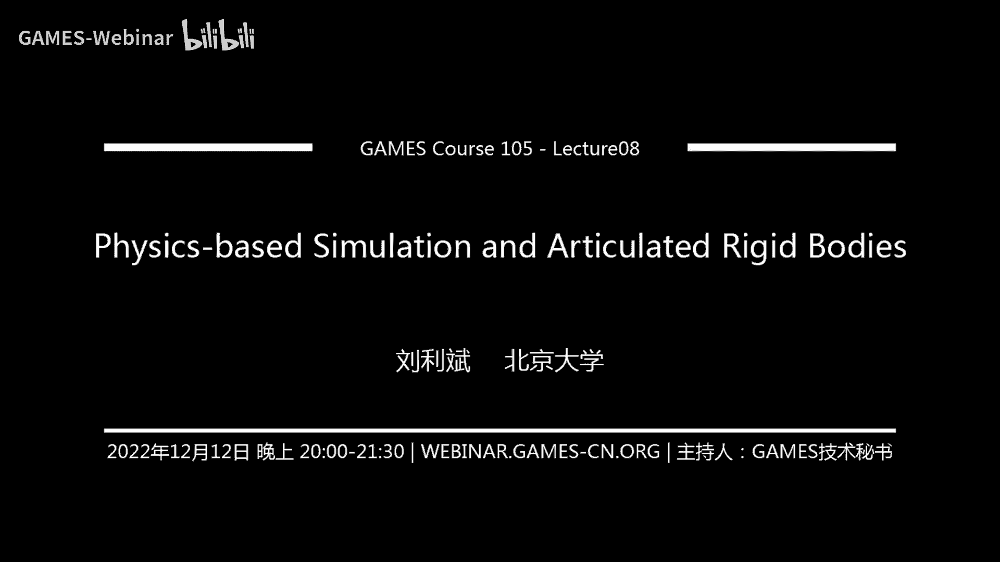

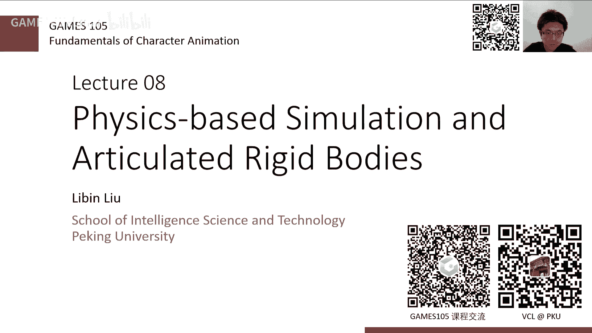

# GAMES105-计算机角色动画基础 - P9：Lecture08 基于物理的仿真与铰接刚体 🎮

在本节课中，我们将要学习基于物理的角色动画仿真的核心基础，特别是关于刚体仿真的原理与方法。我们将从简单的质点运动方程开始，逐步深入到复杂的铰接多刚体系统，并探讨如何通过数值积分和约束求解来模拟角色的物理运动。

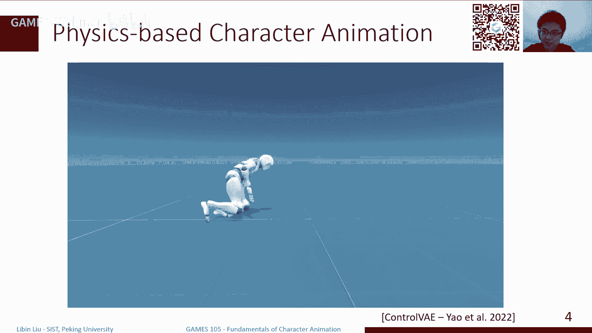

---

## 概述

前面几节课我们主要讲解了基于运动学的方法，即通过直接设置角色的关节角度或位置来生成动画。然而，这种方法难以处理与环境交互强烈或未预先规划的动作。本节课，我们将转向**基于物理的角色动画**。其核心思路是模拟角色在物理规律（如重力、碰撞）下的真实运动响应，这需要两个关键部分：**物理仿真**和**运动控制**。本节将重点介绍物理仿真的基础知识，特别是刚体系统的仿真。

---

## 从质点运动到数值积分

上一节我们介绍了运动学与物理仿真的区别，本节中我们来看看如何从最基本的物理定律出发，进行数值仿真。

对于一个质量为 `m` 的质点，其位置为 `x`，速度为 `v`。根据牛顿第二定律，施加力 `F` 会产生加速度 `a`：
```
F = m * a
```
其中，加速度是速度的导数 (`a = dv/dt`)，速度是位置的导数 (`v = dx/dt`)。我们的目标是：已知当前时刻 (`t=0`) 的位置 `x0` 和速度 `v0`，以及力 `F`，计算未来某个时刻 `t` 的位置和速度。

当力 `F` 是常数时，我们可以通过解析积分得到精确解（如自由落体公式）。然而，在大多数情况下，`F` 是位置和速度的复杂函数，无法直接解析积分。此时，我们需要借助**数值积分**方法。

数值积分的核心是**时间离散化**。我们将连续时间 `t` 离散为一系列步长 `h` 的时刻 `t0, t1, ..., tn`。目标变为：根据当前时刻 `tn` 的状态，计算下一时刻 `tn+1` 的状态。

以下是两种基础的欧拉积分方法：

*   **显式欧拉（前向欧拉）**：使用当前时刻的速度来更新位置。
    ```
    v_{n+1} = v_n + a_n * h
    x_{n+1} = x_n + v_n * h
    ```
*   **隐式欧拉（后向欧拉）**：使用下一时刻的（未知）加速度来更新，需要求解方程。
    ```
    v_{n+1} = v_n + a_{n+1} * h
    x_{n+1} = x_n + v_{n+1} * h
    ```

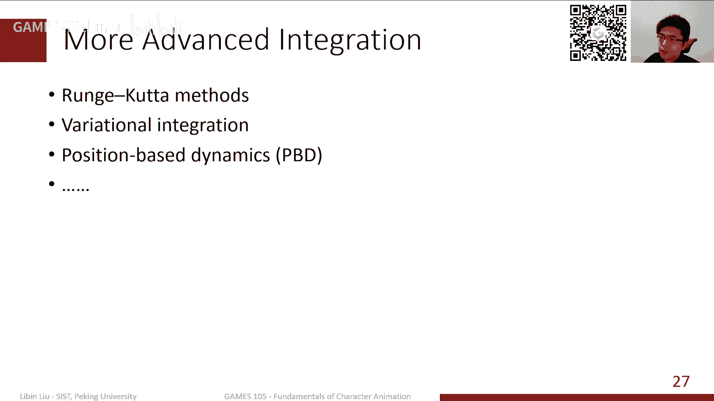

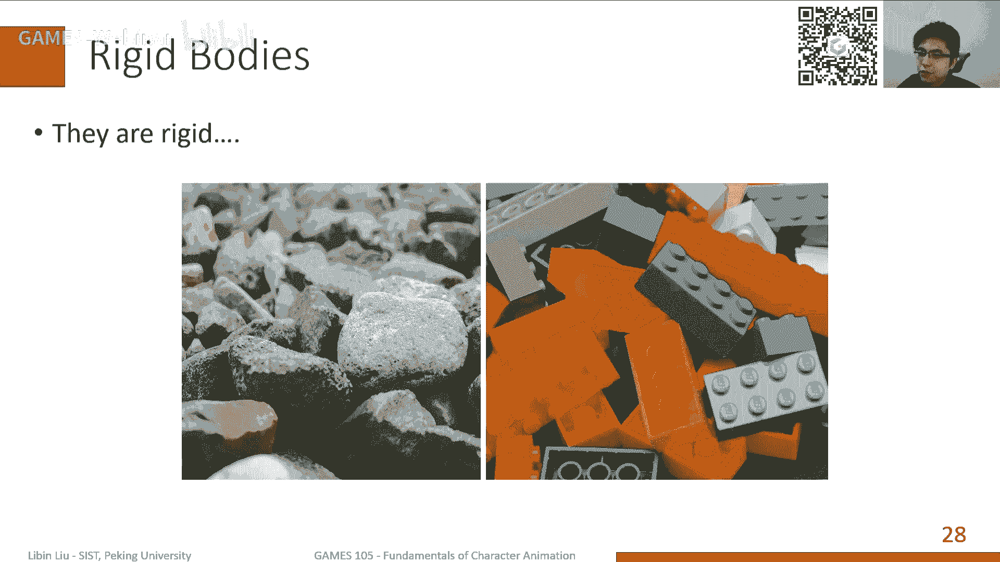

显式欧拉计算简单但容易数值不稳定（系统能量增加，物体可能飞散）。隐式欧拉数值稳定但计算复杂，需要求解方程。在实践中，**半隐式欧拉（或辛欧拉）** 是常用的折中方案，它在许多情况下能保持能量近似守恒且计算高效：
```
v_{n+1} = v_n + a_n * h
x_{n+1} = x_n + v_{n+1} * h
```

---

## 刚体的运动学描述

上一节我们讨论了质点的仿真，本节中我们来看看构成角色骨骼的基本单元——刚体。

刚体是指在运动过程中形状和大小都不发生变化的物体。描述一个刚体的状态需要两部分信息：
1.  **位置**：刚体上某个参考点（通常为质心）在世界坐标系中的坐标 `x`。
2.  **朝向**：刚体局部坐标系相对于世界坐标系的旋转，可以用旋转矩阵 `R` 或四元数 `q` 表示。

有了 `x` 和 `R`，刚体上任意一点 `p_local`（在局部坐标系中）的世界坐标 `p_world` 可以通过变换得到：
```
p_world = x + R * p_local
```

刚体的运动速度也分为两部分：
*   **线速度** `v`：质心位置 `x` 的变化率 (`v = dx/dt`)。
*   **角速度** `ω`：描述刚体旋转的快慢和方向。旋转矩阵 `R` 的变化率与角速度有关：
    ```
    dR/dt = [ω]× * R
    ```
    其中 `[ω]×` 是由角速度向量 `ω` 构成的叉乘矩阵。如果使用四元数 `q` 表示朝向，其导数关系为：
    ```
    dq/dt = (1/2) * ω_bar * q
    ```
    这里 `ω_bar` 是实部为零、虚部为 `ω` 的四元数，`*` 表示四元数乘法。

在仿真中，我们根据当前的速度和角速度，通过积分来更新刚体的位置和朝向。

---

## 刚体的动力学属性

仅仅知道运动学如何更新还不够，我们需要理解力是如何影响刚体运动的，这涉及到动力学。

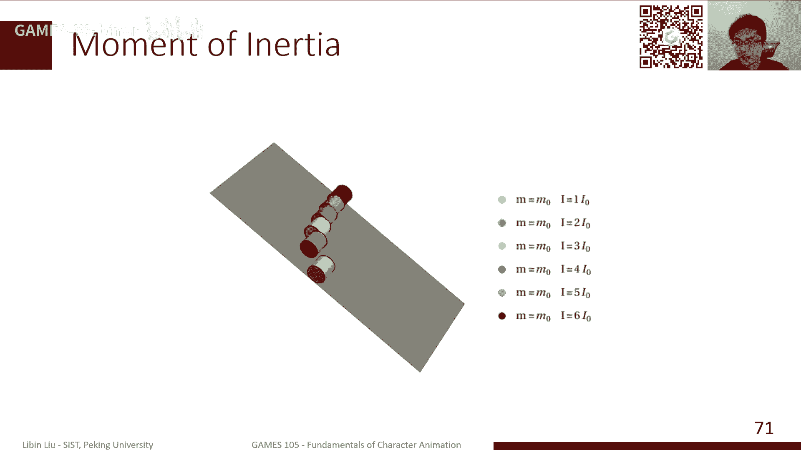


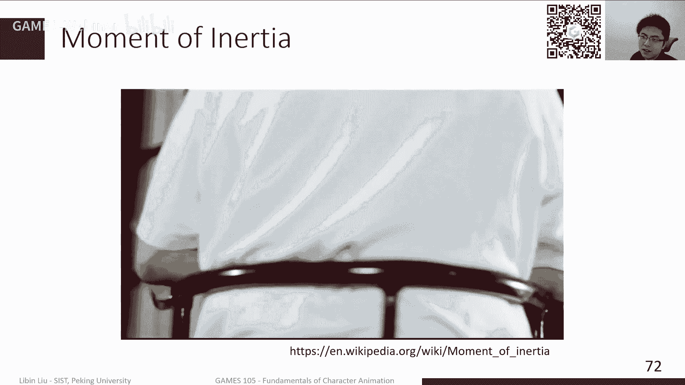

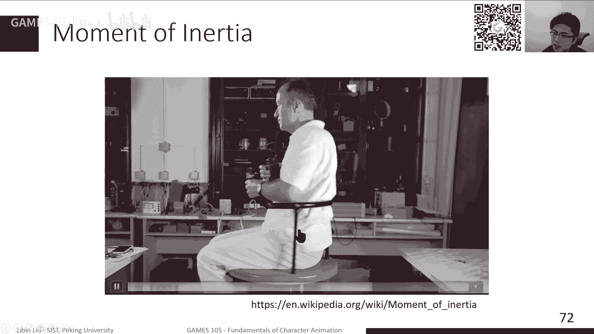

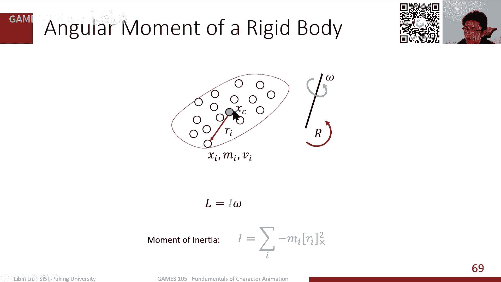

与质点类似，刚体也有动量和角动量，但它们与质量分布有关：
*   **质量** `m`：所有质点质量之和，衡量平动惯性。
*   **质心**：质量分布的平均位置。
*   **转动惯量** `I`：一个3x3的矩阵（惯性张量），衡量绕不同轴旋转的惯性。它取决于质量分布和朝向。在主轴坐标系下，`I` 可简化为对角矩阵。

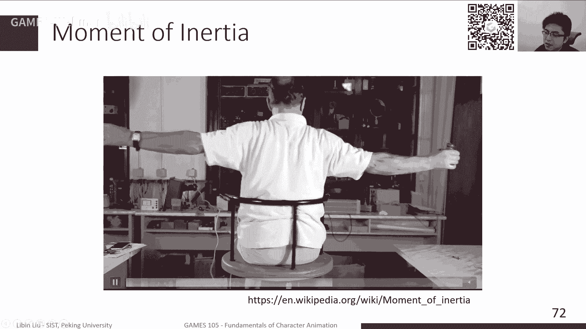

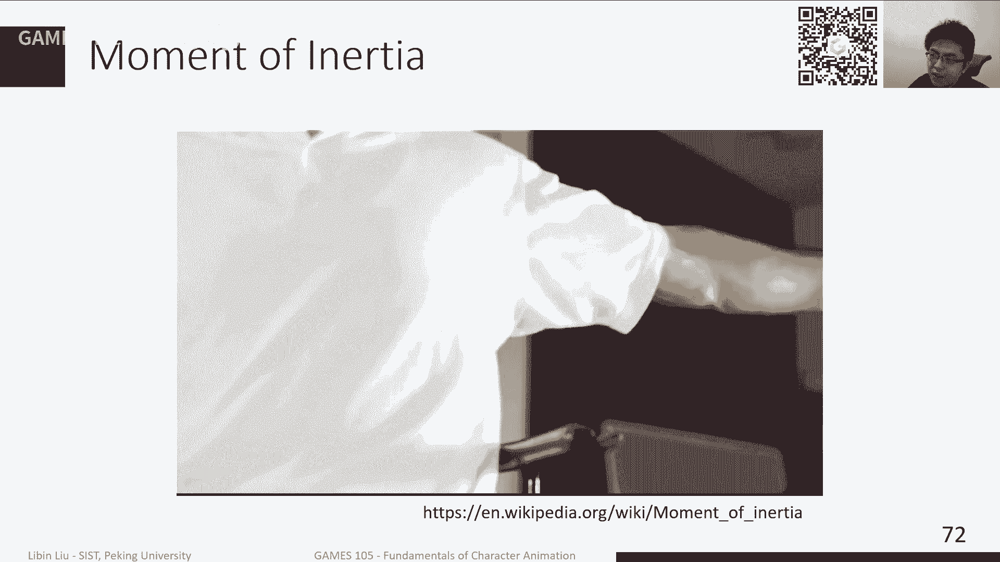

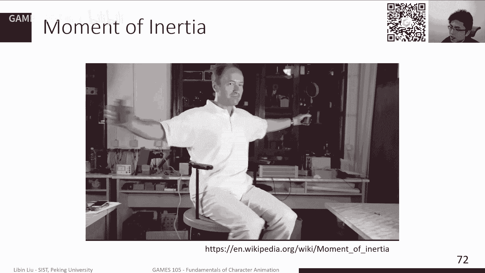

作用在刚体上的力 `F` 和力矩 `τ` 会产生运动变化：
*   **线动量** `p` 的变化率等于合外力：
    ```
    dp/dt = F, 其中 p = m * v
    ```
*   **角动量** `L` 的变化率等于合外力矩：
    ```
    dL/dt = τ, 其中 L = I * ω
    ```

将这两个方程结合，就得到了描述刚体运动的 **牛顿-欧拉方程**：
```
[ m*I,    0 ] * [ dv/dt ] = [ F ]
[   0,    I ]   [ dω/dt ]   [ τ - ω × (I*ω) ]
```
其中 `ω × (I*ω)` 项是由于旋转引起的陀螺效应。这个方程告诉我们，给定外力和外力矩，如何计算刚体线速度和角速度的变化率（即加速度）。

---

## 铰接刚体系统与约束

单个刚体的仿真只是基础，角色动画需要多个刚体（骨骼）通过关节连接起来。本节我们来看看如何仿真这样一个铰接系统。

对于多个独立刚体，我们可以简单地将它们的运动方程堆叠起来。但关节的存在意味着刚体之间不能自由运动，它们之间存在**约束**。例如，一个铰链关节只允许绕一个轴相对旋转。

约束在数学上表示为对系统状态（位置、速度）的限制方程。例如，一个球窝关节要求连接点 `P1` 和 `P2` 在世界坐标系中始终重合：
```
C(x, R1, R2) = (x1 + R1 * r1) - (x2 + R2 * r2) = 0
```
其中 `r1` 和 `r2` 是连接点在各自刚体局部坐标系中的位置。对这个约束方程求导，可以得到速度层面的约束（雅可比矩阵 `J`）：
```
J * v = 0
```
这里 `v` 包含了所有刚体的线速度和角速度。

为了满足约束，关节会产生内部的**约束力**。根据虚功原理，理想的约束力不做功，其方向与约束的雅可比矩阵行空间一致。因此，约束力可以表示为 `F_c = J^T * λ`，其中 `λ` 是待求的拉格朗日乘子（约束力大小）。

现在，完整的铰接系统运动方程变为：
```
M * dv/dt = F_ext + J^T * λ
J * v = 0 (或用于稳定化的修正项)
```
这是一个微分-代数方程。通过离散化（例如使用半隐式欧拉），我们可以将其转化为每个仿真步中需要求解的线性系统，从而同时解出下一时刻的速度 `v_{n+1}` 和约束力大小 `λ`。

---

## 接触与碰撞处理

角色要站在地面上，就必须处理刚体与环境的接触和碰撞。这是物理仿真中最具挑战性的部分之一。

接触处理通常分为两步：
1.  **碰撞检测**：检测哪些刚体发生了接触，并计算接触点的位置、法向和穿透深度。
2.  **碰撞响应**：计算接触力，阻止物体相互穿透并模拟摩擦。

一种简单的方法是**惩罚力法**，将接触建模为很硬的弹簧和阻尼器：
```
F_contact = -k * penetration - d * (relative_velocity · normal)
```
其中 `penetration` 是穿透深度。`k` 需要很大才能减少穿透，但这会导致数值不稳定，需要很小的仿真步长。

更稳健的方法是将接触建模为**速度层面的约束**。与关节约束不同，接触约束是**单边的**：物体可以脱离接触（速度为正），但不能侵入（速度不能为负）。同时，接触力只能是推力（不能为拉力）。这形成了一个**线性互补问题**：
```
v_n >= 0,   λ_n >= 0,   v_n * λ_n = 0
```
求解 LCP 可以得到满足物理规律的接触力。现代的物理引擎（如 Bullet, ODE）都包含了高效的 LCP 求解器来处理接触和摩擦。

---

## 总结

本节课中我们一起学习了基于物理的角色动画仿真的核心数学与计算基础。

我们首先回顾了数值积分方法，理解了显式、隐式和半隐式欧拉的区别。接着，我们探讨了如何描述和更新单个刚体的运动（位置、朝向、速度、角速度）。然后，我们深入到刚体动力学，学习了质量、转动惯量、动量、角动量等概念，以及核心的牛顿-欧拉运动方程。

为了构建角色模型，我们将多个刚体通过关节连接，引入了约束的概念，并学习了如何通过求解带约束的运动方程来仿真铰接系统。最后，我们简要探讨了使角色能站立于地面的关键——接触与碰撞处理的两种主要思路：惩罚力法和基于约束的LCP方法。

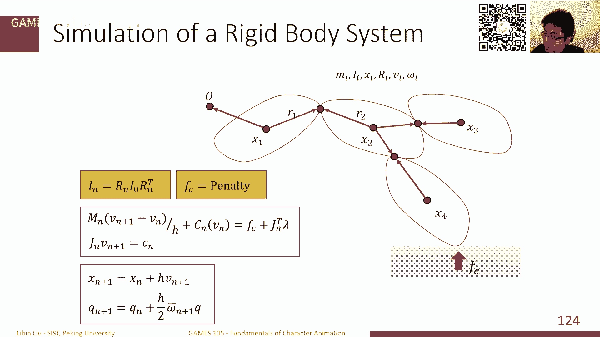

物理仿真为角色动画提供了模拟真实物理交互的强大能力。然而，仿真的最终目的是为了控制角色做出我们期望的动作。如何生成施加在刚体上的力或力矩（即控制策略），将是后续课程的重点。