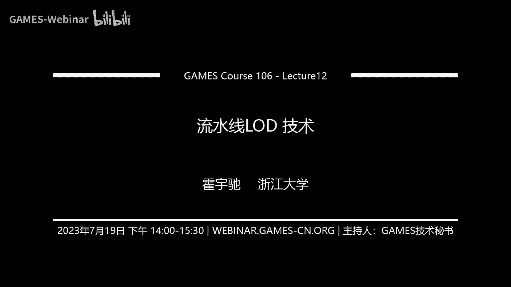
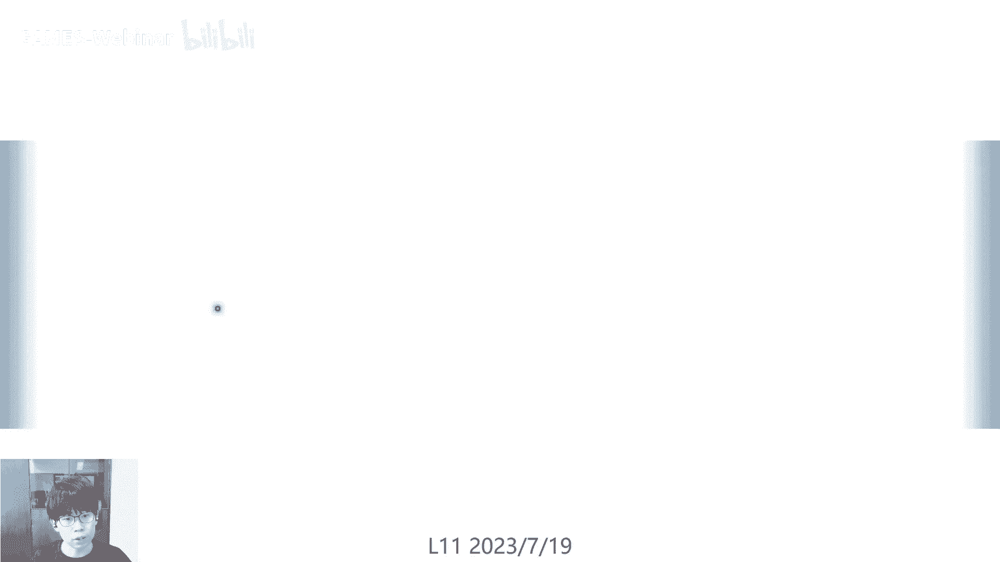
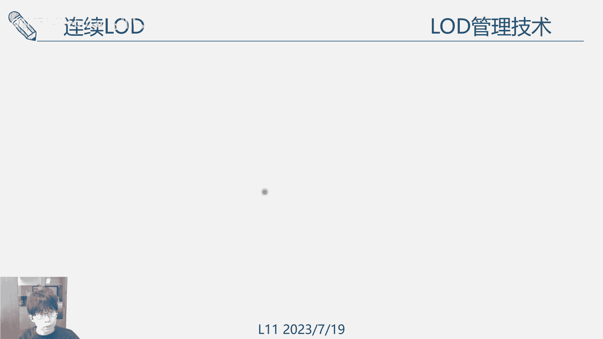
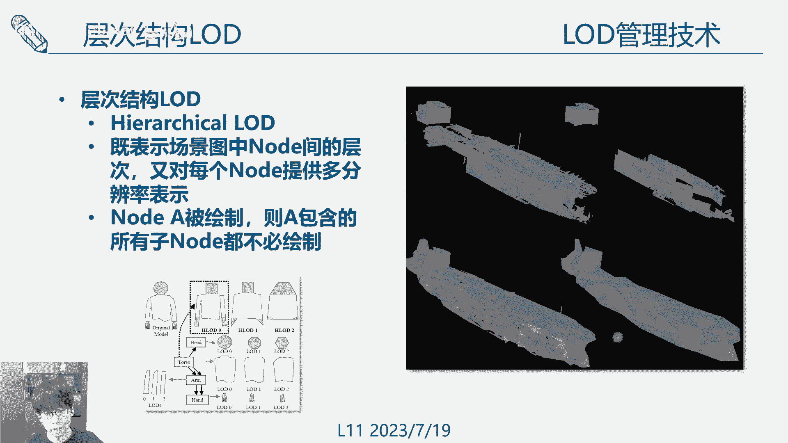
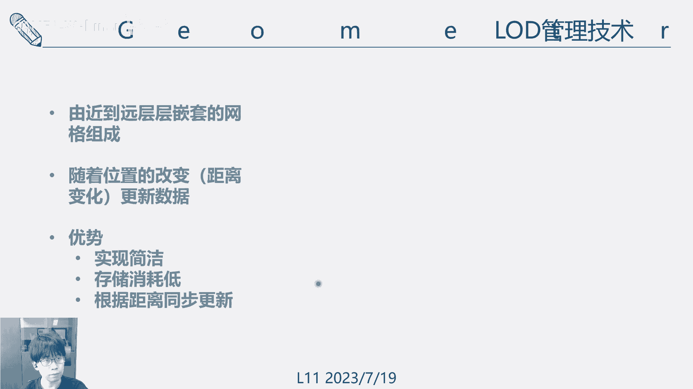

# GAMES106-现代图形绘制流水线原理与实践 - P12：12 流水线LOD 技术 - GAMES-Webinar - BV1Uo4y1J7ie

这个题目是流水线的led技术，这个是呃我们更接近一些。

我们在整个流水线的一个简化，去看看，是在呃整个框架里面去怎么去简化这个东西嗯，首先是回顾一下之前我们已经上过的一些课，一个是流水线的优化技术，像这个几何的LD几何的简化，这个我们讲过了。

有一些中间设计一些简便的算法，一些几何距离和网格简化的这些方法啊，就是怎么要把一个非常复杂的几何，去用一些非常小的三角面片来表达，然后啊我们又也讲了这个关于纹理的压缩，包括一些纹理的滤波啊。

纹理map map算法，还有一些呃压缩算法，这个是对一些纹理，还有一些材质进行压缩和LD，然后我们还讲了这个着色器的LD啊，包括给到一个着色器代码，怎么去简化这个着色器的代码，使它在运行得更快。

然后怎么样去预测这个着色器的质量，绘制质量，还要怎么样去做一个着色器的自动优化，这些都是之前的内容，然后啊今天的话呢就主要是讲一些。

在整个呃流水线里面去，怎么样去用上这些LD的东西啊，各类的资产，去让我们达到一个最终的一个加速效果。

所以这里面首先我们去讲一下这个，就说我们在啊，不管是几何的LD或者是纹理的LD，但总的来说这些LD啊都可以有这些分类，像是离散的连续的视角相关的，还有一些层次结构的，这些都是一些主要的一些分类。

像理想LD的话，就是有一些啊不同的框架，也就是说我们会有不同层级LD0，L d e l d r3，这些东西都是分散的嗯，他的话一个好处呢，就是说不管是纹理和几何，它的通用性比较好。

因为我们只需要每个LD之间，他不一定要有一个连续的关系，所以他做什么样的人，资产都可以用这个理想LD表示，但是他的这个缺点就是它会有一个popping的问题，可以看到这个框里面。

不同的LED层级切换的时候，其实是这些啊，模型也好，材质也好，它是会不断的跳变的啊，这些都可以看到，所以为了理想L第一个最关键的一个问题呢，就是说什么96ping的效果常用的几种方法吧。

有些是第一个是延迟这个绘制效果出现，就是不要在这个距离到达这个距离啊，关键点的地方直接就跳变，稍微延缓一些，然后还有一个就是用一些几何motion的方法，下面这个字图，最左上角这个是一个LD1。

然后最右下角是一个LD2，这两个中间的MING是可以通过一个顶点的差值啊，做一个集合的MORING，当然还有一些其他的一些几何mo，另外一种呢就是透明度的混合，像LD0到D2中间的有不同的层级。

根据它们距离的变化去做一个阿尔法布ending，这是另一个比较常见的处理技术，然后呃，下一个的话就是，我们如果有了一些离散的LD去，怎么样去在这个离散LD之间切换切换，这个需要去寻找一些准则嗯。

在真正啊绘制的过程中的每一帧，我们其实要对每一个模型，每一个物体都要去独立的选择它的一个LD呃，常见的一些方法是根据代表点，就是我们在这个LD，在这个模型上选取一个代表点啊。

然后这个代表点跟我们camera的距离啊，由他这个距离的变化去选择不同的，然后另外呢就是还有一种是啊，找一个包围球去代替这个模型，将包围球它的一个面积，在这个屏幕空间做一个投影。

根据它这个面积的缩放去选择对应的一个呃，另外呢还有一种是嗯根据模型的一个包围盒，包围盒的话就是一个四四方框的形状，它可能会比这个包围球更准确，那关于包围盒的投影的话就会有很多种啊，言五花八门的算法了。

因为这个包围盒本身也不是一种，它也可以有很多的呃简化的方法，最后一种是基于面片数，就说我们如果想要维持一个游戏，在一段时间内的一个稳定帧数，那我们可以去给定一个目标的一个面片数啊。

然后根据这个面片数来选择D，这样的话整个的帧率是可以保证的，但是有时候质量就没法保证，会出现一些artifact。

呃第二类的话就是连续LD，连续LD跟理想LD这个顾名思义，就是说它这个每个节点之间，每个LD节点之间，它是可以通过一个啊，一定的算是一定的公式去做一个离散的差啊，连续的差值，这样子的话。

比如像在这种地形的过渡的过程中，不管我怎么走啊，我都不会有这个popping的问题，在每一个position，每一个distance它都会有一个合适的混合嗯，这个离连续LD的话。

它的一些好处是真实感更高，过渡更自然啊，很平顺，而且理论上你走到非常近的时候，它也可以通过一个算式的方式去解，析的方式是给到你一个非常好的D层级，然后下一类就是试点相关的呃。

设计相关的LD是说我对这个LOD的划分，不一定是对整个模型或者整个材质都是统一的，是根据我们视线的方向相关的呃，像这个典型的一个是这个兔子，就说我们从正面去观测这个兔子，那由于它啊跟我们在正面的地方。

我们不需要太复杂的，由于它的几何变形啊，对跟视角相关的这个深度的变化比较低，所以我们的正面地方不需要很啊很细节的几何，但是在这个边缘过度平滑，形成蹩脚的地方，我们需要一个更光滑的一个几何过渡。

所以在这个地方去用一个更高层级的D表达，所以从一个如果我们把这个，从一个俯视的角度看这个模型，那我们看到的就是呃跟这个camera垂直的camera，从这边过来，这个垂直的这一部分。

它的那个啊LD比较粗，然后在这些边缘的地方D过渡会比较平啊，比较细致，这样的话可以自适应的分配给一个物体，分配不同的细节，对于一些大型的物体，像一些呃地形啊，还有一些占据整个空间的一些物体。

这种方法是非常友好的，还有一种就是层次结构LD存储结构，LD的话呃也叫HIROTICALHD，就是说我们对一个场景的表达是首先去分层，比如像一个人的话，我们可以啊对头身体。

手四肢这个分别去做不同的hierarchy，然后手的话再去对他的那个手掌啊，手臂做一下hierarchy，这样子当我们去选择了一个行，这些HIERARK会形成一个竖的柱状的结构。

我们表达我们使用了一个头部，就是我们头部使用一个比较素的，AD表达的时候，那他所有的子note都不会再被绘制，但是如果这个头部我们觉得不够细致，那我们可能去把这个头部做一个划分，去把他的眼睛。

鼻子啊各个部分再分别用一个更细致的表达，这是一个层次的结构啊，这边是一个层次结构，LLED的一个效果图像，这些电缆上面两个是做了层cl d的，所以它可以在一些窗口，或者一些比较细致的细节的地方。

会有一些更好的表达，然后在一些平板的地方，他会可以选择一些比较粗犷的一些LD，但是如果我们啊没有这个层级化的表示，对整个船做，那在相同面片数下啊，这个一些面就会变啊，弄得呃一些平面就没办法保持了。

特别是它会有一些桅杆之类的一些小物体，去引进这些物体啊，会造成整个几何的变形。

真正在我们用的时候呢，上面几个连续的离散的视角相关的，或者是hierarchy d其实是呃会混起来用的，这些技术其实并不是有一个并不可，它并不需要一个非常明确的边界。

那像最常见的一个呃应用场景就是地形LD，因为地形是你可以理解成，他这个mesh是非常大的，它整个模型是非常大的，而且它的那个可视范围也很大，我可能我们在近的地方看到的，就可以看到它的一些树和草。

但是远的地方呢我们只能看到一个轮廓，对这个变化这么剧烈的一个模型，要去画这个模型，那D就是一个非常重要的技术，那它这个呃一些常见的技术包括了room，只有meat maps，Chk l d。

还有一些呃cue maps，我们这个后面都会去讲一讲，像这个room，它其实啊全称是real time optiary adaptive mesh，它就是一种既是视角相关的，又是一个连续的LD啊。

就是两者的一个混杂，它的真正的数据呢，裸的数据是用一个高度图来表达，它这个地形的变化，然后根据这个高度长，每一个点的高度，跟相机的距离去自适应的去构建创建这个网格，像这个啊网格。

你可以看到在这些变化比较剧烈的地方，高度变化比较剧烈的地方，对试点也产生比较重大影响的地方，它可能会有一些非常细密的呃LD表达，然后像这些呃不容易观测到高度变化的地方。

它会用一些比较粗糙的三角面片来表达，而在我们视角变换的时候呢，这些面片会部队不停的细分或者合并，来实时的做一个连续的变化，下面有一些比较更细致一点的一些划分，比如说像这个啊啊这个是一个面片。

它是怎么样做划分的，他会选择一个长边不断的切分，那合并其实也一样，他把他把两个把这个边拿掉啊，那就会合并成一个更大的三角形，这样一个三角形就可以分解出很多，然后每一个顶点的高度。

其实是根据它这个高度图来做一个决定，然后他再去计算这个，确定这个三角面片的合并和拆分的过程中呢，一般就会把这个三角面片所对应的这些，这个区域投影到我们相机的这个呃，相机的这个平面空间。

然后去计算这个平面空间的一个误差，他一个近似后的一个啊，area和他的那个期望的那个高度啊，这些东西是可以直接算出一个啊，误差的一个估计，根据这个来去确定它的分不分裂和合并好，第二类啊，常见的GD啊。

D型LD是two mix maps，它是呃一个视角相关的一个离散调低，他呃他这个东西继承了这个图像，就是那个纹理的一个Mac技术，他对美它会对整个地形做一个分块。

然后每一小块呢它会有一个不同的hierarchy，根据这个地方的细节，还有跟我们相相机的一个距离，去确定我在每一小块上去选择哪一个层次，细节啊，同样的他也会用一些几何变形的技术啊。

motion技术去避免这个popping的问题。

嗯第三类是truman to clip，max climax呢，呃像是一个环状的一个结构啊，就是我距离我们最近的是一个环，然后根据距离的啊，更远的地方变成一个层次，层层嵌套号的一个网格形状。

基本的一个原则就是越近的话，他用更更密集的一个表达啊，随着它这个距离的增加，它会变得更表达更稀疏，然后到了远的地方，如果是说像这种平面空间距离啊，它变成了一个接近边缘的地方，它这些高度啊会有更大的。

对这个视线有更大的影响，这个地方又会选择一些更密集的表达呃，它的一个好处是说他实践非常简单，它不要一个很复杂的一个嗯数据模型啊，数据给结构表达，所以它是比较容易管理啊，我们只要随着这个距离的变化。

移动的变化去做一个整块整块的更新就好了，所以他对这个硬件，还有这个串流，这些东西都会比较嗯友好，对存储的消耗也会比较低，嗯最后一个就是trunk l d，这个是用一个80啊四叉树啊。

用一个层次的四叉树去存储更多的细节，就说我们在最上层的时候呢，啊我们可能是用这个粗的四叉树，然后下一层的话我们就把它划分，然后用一个更细的一个四叉树啊，依次表达，所以它在接近叶节点的时候呢。

它的细节其实是非常丰富的，最右边是一个接近叶节点的地方，它的好处最大的好处就是它啊，不同的区域它有不同的一个密度表达，这样子的话呢，呃其实本质上它可以避免掉，对同一个区域做一个均匀的划分啊。

它只可可能只是根据一个需要，在这个在这某个区域需要的时候，去做一个层次划分啊，然后他在划分之后，它这个本身也有一个密度的一个变化，所以他可以呃更比较大的，应该是是比较好的降低这个面片的数量啊。

减低这个无效的一个渲染，就是窗口的，OK我们刚才讲的是LD1些常见的led技术，就呃总结到这里，然后下面我觉得一个比较重要的，也是近期啊研究的热点呢，就是这个可悲的绘制流水线。

然后可悲的绘制流水线为什么跟我们相关呢。

就是我们先来讲一下这个背景啊，所以是可微的绘制流水线，那首先就要去讲一个，正向绘制和逆向绘制的一个区别，抽象绘制的话是说我们有一个模型，有光照，有摄像机，有纹理，我们去用一个forward的方法。

就是我们的绘制流水线啊，过一边绘制六线，得到一个最后的一个绘制结果，这是正向绘制，那逆向绘制呢指的是我有了一个绘制结果，然后我把这个绘制流水线逆过来啊，我去得到它原始的几何光照，还有纹理。

还有camera位置，这个事情这是逆向绘制，然后可谓绘制呢，呃其实可以认为是逆向绘制的一个变种，或者是一个呃特殊特殊的类型，他是他就把这个正向过程它认为它是一个函数。

那逆向过程就是这个正向函数的一个逆函数，所以有了这个逆函数呢，就可以去求解各种各样的梯度啊，用一个梯度反向传播去把这个正向结果的一个，比如说一个pixel的颜色啊，他对每一个参数不管是材质也好。

几何也好，它这个导数关系就可以直接求出来，那如果说我最后这个地方是一个error，是个image space的error，那这个我把这个image space error，通过这个导数的形式传递回来。

那我就可以去减小这个我去通过这个梯度下降，我减小这个error啊，这这能够减少这个error的一个image space，error的一个方向去改变我的参数量，那这样的话就达到了一种优化这个。

一些场景参数的这么一个目的，所以它用在我们这个呃LD的case呢，就说啊，我如果是说我可以构建一个完全可微的一个，绘制流水线啊，我让这个绘制流程步步可危，那我就可以去通过给定一个budget啊。

给定一个比如三角面片的数量，给定一个纹理的分辨率啊，或者给定一个shading后的，然后我去用这个反向传播的方式，使得啊我这个简化后的这些材质，画出来的结果和我国初始材质画出来的结果，去更可能的逼近。

以此来优化我这个简化后的这些资产，所以呢他这就是另一种形式的获得这个LD啊，啊或者是这种简化资产的另一种形式呃，我们通过可谓绘制流水线呢，目前常见的两种是优化它的纹理，优化的几何。

有时候也会优化它中间那些同main函数，但目前呢通过这个可谓绘制流水线，去直接去优化它的那个水顶扣的，还是一个在研究的内容，因为这个水顶扣的那个变化是比较啊，这个它本身是一个非连续的。

它是一个离散的coding空间，所以它的一个直接优化是比较困难的，但目前主要是用在纹理和基本的优化呃，另外的一个呃，就是呃我们一般来说做这个东西的时候，会给定一个固定的压缩率。

然后啊去尽可能最小化它的这个简化后的优化，不差啊，而不是去这个是它的一个拍卖，最后嘛再申请一个LD资产，然后这个LD资产得到之后，就是用我们刚才提到的一些LD管理技术。

切换技术去在这个游戏或者是实惠之中啊，用上来要做这个全流水线的口碑呢，啊可谓绘制流水线，那就涉及到这个流水线的逆过程，这个是正过程，我们比较熟悉了，就是从一个几何DOTFA到光栅化啊。

到这个FRAMESH的，到color blending做出来图片，那逆过来呢叫做图片一路往回走，在图片呢，当我们有一张图片的时候，这个绘制出的图片的时候，这个逆过程一般是会在这个图片上去计算。

它跟那个广出去图片，就是一个简化后的一个素材，还有一个原始的素材，那个高分辨率的素材，同时画出两张图片，减一减得到一个L误差，会用L2或者SSM，我们要把这个误差往回传到这个color，布兰定之后呢。

一般是会去做这个pass的那个啊混合啊，这个是比较容易讲啊，理解就是说如果说我们有两个不同的，从不同的pass这些东西是要blend起来的，它是一个也是一个解析的操作，所以它的梯度也是可以往回传的。

那传到这一步呢，就要去通过拆这个着色器，去做这个到纹理和光照的一个映射啊，这个着色器的可微，我们待会会介绍一下，咱们在这个着色器语言里面去做一个可微啊，把这个梯度传分别传回去，然后再往上一步呢。

就是这个光栅化的科威画插画的口碑的话，也会有一个A小于PPT来讲这个事情，然后再往前也是一个主色系的口碑和test shader，或者绝对去SHADER，这个跟fragment。

SHADER的这个主色系可微是类似的，最后是通过一个啊一些几何的可微，去返还到这个顶点的优化上面来，这就是整个PIPINE，下面我们来去分别的拆开来讲一讲，首先是这个最后一个阶段了。

就是这个image loss啊，它的监督信息，这个整个优化过程的监督信息怎么来的，在这个我们啊一般来说会得到两张图片，一个是reference，一个是render的音乐剧。

然后我们这个reference是固定的啊，在给定了一个视角，给定了一个嗯场景参数之后，这个就是我们的目标，然后这个是随着我被这些match texture lighting camera啊。

在它的过程中在不断被优化，所以它的render的英语句也是在被优化的，这两个东西可以算一个loss啊，这个loss啊在对这些梯度会在这个阶段，这个貌似是啊，没办法对这些梯度求导，但是他可以往回传在后面。

在一些可谓SHADER的阶段，它是可以去针对这个parameter做一个优化，那我们现阶段只需要得到一个loss，常见的一些lost形式呢，嗯像一些啊L1L2，这个是呃大家可能都知道。

就是然后SSIMSSM是一个结构性的相似性，也是一个常用的东西，然后到了网上传一步就是到这个blending层，blending这个地方呢就会做一些不同pass，不同通道的一个混合嗯。

这个混合呢一般是用一个权重混合了，像这个S的一个权重，再乘上一个低的权重，这个S加D通常等于一，就是一个阿尔法不能定嗯，根据这个，我们得，如果我们可以先，甚至计算到各pass的一个混合系数SD。

那我们就把这个loss乘上这个S和D，因为我前面这个C，然后我用这个东西对这个cs CD做一个偏导，那其实就是得到一个混合的系数，把这个混合系数乘上这个loss。

就可以把这个梯度往回传到不同的pass上面去，第三步呢就来到了这个着色器，着色器是一堆coding组成的一个着色器，所以的话我们首先要把这个coding去解析成，一个图，一个graph图啊。

这个跟我们之前讲到这个呃，coding的变成STR之类的，这些东西其实是相似的，他这个只是这个地方把一些语言变成了更啊，数学的一些符号，做这个computer graph这个计算图的一个依赖那些。

比如说像有一个Y等于DE啊，如果我们要对这个D做求导，那它的导数就是E，如果要对这个呃反过来要对E求导，那它导数是D啊，就可以，然后D又可以在另一个函数里面，可以找到他地点A加B。

然后就继续去做这个求导啊，就可以一步一步的把这个导数传进去，这个是比较啊容易理解的，但是呢呃真正在这个呃自动微分呢，在这个嗯绘制税的程序里面呢，它其实有些特别，因为税的程序呢有很多这种嗯。

非连续的函数或者非连续的OP，所以用自动微分呢就要去考虑这些非连续的OP，这里有一篇工作也是非常新的一个工作，西部数量2022的就是奥托蒂夫，怎么样做一做一个水的一个语言，做一个自动微分哦。

下面几个PPT我会去讲一下，然后除了这个自动微分呢，当然也可以手动微分啊，手动备份的，那就是需要啊，这个程序员去挨个的对每一个算子啊，去做一个拆解，去给出一个显示的一个求导表达式。

他对这个coding或者计算的要求啊，数学的要求会更高一些，但是它的效率会很高，而自动微分的话，因为它啊要用这个工具去搜索整个呃计算图，所以说所以说它通常它的那个内存消耗啊，还有一些啊计算消耗代价。

这些是比较大的，你只能在离线的状态去做这个事情，然后我们接下来啊，继续讲这个奥特蒂夫这个工作，奥特蒂夫这个工作，它是专门去做这个啊SHADER的一个自动微分，他一个因为之前嘛包括一些呃有像我们刷分啊。

D啊，还有有已经有DVG，已经有各种各样的那个啊微分器啊，自动微分器这些自动微分器呢，为什么说它还要提出一个新的自动微分器，就是说他认为这个呃，这些现有的变频器都处理不了这个C的。

或者说这个绘制过程中的一些OP的不连续性，比如说像这AD是一个啊，它最常用的，像那些PYTORCH类似的，一些反向梯度传播的发育性最强，但是它其实是对这个连续的部分，它是没有做一个很好的处理。

呃很难用于水的扣，然后DF是FD是有限差分嘛，这个是他对于连续部分比较好，但是呃它在这个它的非连续部分，它有一定的性能表现，但是非啊在连续部分，它的性能其实是呃比较低的，然后呃像这TGDVG嗯。

还有都是针对特定问题的，就TPT呢，这个自动微分器是针对这个pass racing的，然后跟SHADER的code也不太一样，所以他在这个他们定义了一个DSL，用这个语言去啊，涵盖了这个税的扣。

里面常用的一些算术表达式啊，包括一些变量，常量的变量，还有微分的目标参数啊，加法乘法操作，三角函数啊，原子操作这些东西，这个是具体来讲呢，呃它的一个核心的思想，就是他要去解决这个事的扣。

程序语言里面的不连续函数的一个积分问题啊，对于呃因为我们对于这个SHADER来说，trading来说它是一个积分问题啊，这是跟普通函数啊不太一样的地方呃，它对于不连续的它的一个核心的一个处理原则。

就是对于这种heavy side，这种不连续的跳变的地方，要去解决这咖啡赛的一个积分，那他去用了一个D啊，box微波和，用这样的一个积分去替代掉这样的积分，这两个东西，如果说我们做一个梯度啊。

这个heavy side这种突然跳变的地方，它的积分就是一个无穷大的值，因为它的这个跳变的范围是无限逼近零，然后相反他这个我们做了一个ed box滤波之后，这个地方的梯度就会变成一个有一定范围的。

一个finite，一个啊一个一段一个聚一个分段函数，所以在这个区间内，这个整个滤波就是积分就是可以进行的，包括这梯度的积分，这样子的话，他这个梯度的传播就可以，这个积分函数的梯度传播啊。

就可以往传播下去啊，上一步去进行进一步传播，嗯然后是他这个整个工作里面，他的一些定义的一些梯度的法则吧，有几样啊，像这个地方啊，G和小大G，小G和小H表示这个自动微分程序的一个入口。

然后这个party k表示吊塔A和AD，两套不同的积分的求导规则，这个第一项，第一项的话，就是刚才我们上面讲的这个分段函数啊，或者是这个跳跃函数的积分的表达呃，他的积分规则已经列在这里了，对于传统的话。

他直接就变成零，但是对于这个呃一个处理过的函数，有一个boss滤波之后，这一段它是有梯度的，然后第二个OP就是对于这个呃加法的一个求道，java求导，因为积分的加法跟那个呃。

把那个拿出来之后再做积分它是不变的，所以它的积分规则跟这个AD也是一致，然后对于乘法法则呢啊有一些不同啊，它是由于它要考虑两个连续两个函数，比如G和H都不连续的这么一个可能性，呃。

如果不考虑这个会产生一些呃累计误差，所以他这个地方就用了一个跟第一个函数接近，它就有个H啊，用一个正负，用一个呃ed box去逼近，在整个对整个做函数域所逼近，这个是对跟这个AD的一个不同啊。

它其实就是你可以认为就是这个东西的，进一步泛化，它考虑了呃，在这个H是一个分段的，或者是G是一个分段的，分别考虑了这个case，然后对最后一个地方呢呃就是函数的求导法则。

函数的求导法则其实就是跟那个AD相似的，他只是说前面有一个H的一撇，他有个这个H的一撇，他又要考虑这个H1撇，如果是不连续的case了，所以对于这个H1撇的梯度，它是用了类似于上面这种方法。

去做这个H1撇的一个梯度，用一个啊可以连续的一个方法，然后刚才我们讲的都是D的case，就是一维的一些非连续函数的一些处理方法，他对于二维的话，他的处理法则啊，就是说像一杯的时候啊。

我们做一个D的box滤波是这样的啊，2D的时候，2D的话，理想的话呢就是要做一个2b box的一个滤波，一个核函数滤波，那它在但是呢真正在啊工程化的时候呢，这个东西效率会比较低。

所以他们用了一个近似的啊，一地绿波荷，就是说在某一段选择对X轴对Y轴立波，然后某一段选择对X轴滤波，然后取它的一个最大啊最优，所以这个是一个工程上的一个实现，除了这个我们现在刚才已经讲完了。

这个C的扣的一个流水的扣的一个口味，那税得扣再往前一步呢，就是这个光栅化，光栅化同样需要做口碑，如果我们记得一些光栅化的过程的话呢，就是说我们有三角面片啊，三角面片做一个乘上它的一些变化矩阵之后。

往这个屏幕空间做一个投影啊，得到这个像素的颜色，是一个从三维和几何空间，投影到这个屏幕空间的这么一个过程，那反过来呢啊口碑的光栅化就是要解决，从这个屏幕空间我有了一个颜色。

然后去怎么映射到这个三维空间的，这么一个过程，当前呢已经有了不少啊，不同公司公司还有一些研究机构，其实都会做过各式各样的一些呃，可微光栅化工具，像soft raptsd啊，Deep r。

然后emd rust就是media的这些都有，但是他们在一个性能上，还有一些实现，细细节上都会有一些呃细微的差别，但我们这里就选一个啊，去讲一下他这个代表性的，去讲一下它这个基本的原理就可以了。

呃像这个地方就是一个呃公式化啊，对那光栅化的话是呃他要去做这个东西的话呢，就是说呃我每个三角形，我分别去投影到这个camera plan的一个投影。

然后这camera plan的投影得到一个pixel pizza，然后做一个blending啊，final做这个不同的plan之间的final gai，那逆过来的话呢，就是说我从这个东西往前走啊。

我知道了他在这个走这一步呢，他要去，因为这一步其实是根据深度去做混合的，前面这几步呢都是直接可微，从这个投影啊投影，然后变成pixel这些东西，是这前面这几步是非常容易的，直接可危啊。

但是他的比较复杂的部分呢，就是最后面做这个GAI，把不同plan的一个image混合起来的时候，他就要去做一个深度的混合，它要做一个啊，每个颜色，每个像素都是取离我这个屏幕位置最接近的，一个像素。

就是找一个啊Z值深度值最小的值去赋值，所以这个地方就是一个不连续的函数了，它因为是一个if else，所以他在这个地方要去做解决这个问题呢，他呃一种方法就是其实就是类似于有限差分。

他去嗯得到这三个平面之后呢，他去他去做这个做震荡啊，他去做这个深度的微小的一个扰动，然后这个微小的扰动呢就会得到不同的一个啊，混合的一个值啊，不同的这个像素不同平面blend出来的一个值。

然后根据这个值呢，他去啊，它就可以计算不同三角面片，关于这个深度的一个梯度，因此去得到它最终的一个，把整个啊为这个三角面片的微分啊，把它口碑化呃，它的一个所需要的一个结果。

其实就是这个smooth aggregated map，有质的aggregated map，其实就像就可以当像我们刚才做alpha blending一样，去把这个屏幕空间的像素颜色啊。

倒船回到每一个具体的三角面片上，这这个是类似一个阿尔法blending的一个嗯过程，他在优化的过程中啊，在计算这个梯度的时候就去啊，每个学画一遍，然后得到friend buffer。

Friend buffer，再做一个扰动啊，深度上的一个扰动，去把这个啊关于这个深度的一个梯度啊，给它求出来，这是它的一个核心的idea，得到了这个光栅化之后呢，再往前。

那我们就已经可以把这个所有的数据，倒推回到一个具体的三角面片上了，那我们得到三小片片呢，呃就可以就已经把这个error，从像素回归到顶点上了，然后最后一起做一个顶点上的电话，或者平移也好。

或者loss也好，这个就是啊比如说我把这个三角片片缩小放，把没把它边缩小，或者把它顶点呃挪动一下啊，如果是挪动边的话呢，就要去算这个编的loss，关于这个边边的话，之后对这个颜色的啊。

关于这个像素的error loss顶点的话呢，同理就说我这个做一个顶点啊，在各个方向上平移做它的微分，对于这个像素a loss的这个微分啊，同样也可以得到它的一个嗯啊梯度，有了这些东西之后。

就可以通过这个loss去改变这个三角面片了，那整个嗯刚才要介绍的这个pine就打通了，呃，目前呢这个关于这个又通过这个可谓，绘制流水线呢，做这个啊D资产的生成，也是近一两年才开始兴起的一个话题。

但是呢在这个像那些腾讯啊啊一些，还有一些是呃比较aggressive的一些公司上面呢，其实已经开始用起来了啊，也会取得比较好的效果，今年的话GDC2023的话，这个呃也会有一个专门的top。

如果大家有兴趣的，可以去做进一步了解。

OK那我们去讲这个最后的一个呃，今天最后一个topic是基于图像的一个简化，他这个同样也是一种D。

而且是它是一种非常极限的LD呃，大家可能听过一个技术知识，广告牌，广告牌它既不是优化几何，也不是优化纹理，它把几何纹理一起拿来优化，我最后就是用一张图片替代了几何加纹理的。

整一加SHADER的一个整的一个绘制结果，所以它是一种最简单粗暴的，最暴力的最极端的一个方法，呃常见的一些呃侧脸，像这个呃RTIBS，image ibs表达的是image base的啊。

学历啊啊简化simplification，有些BB啊，Image cat imposter，这跟我们回头再依次的分开来讲一讲，首先是这个广告牌，bb b boss可能是大家最熟悉的。

如果是对这些游戏技术有一些熟悉的话，这个东西在我们2000年初，或者更早一些时候就已经有了，它主要是用来表达一些户外场景，像一些树啊，云啊这些东西，尤其是云啊，因为BB的话它所产生的物体它只有一个面嘛。

然后这个面那你们知道如果他只有一个面的话，我的相机从这里走到这里的时候，那可能他这个面，我就可以看到它侧边的一个边缘了，那就露露馅儿了，那所以呃他这个语言呢，这个广告牌呢其实是说我们在走的时候。

他也在转，他始终面向着我们这个观察的相机啊，相机走到这儿，它就转到这儿，嗯这样的话呢就造成一个问题，就是说他其实对于一些呃有两个，一个是说如果这个物体离我们这个视线比较远。

那我们走动的时候呢啊假设是无穷远，那我们走动的时候呢，它的方向基本就不会变，所以他对一个远处的物体，它的表达会比较好，不会不容易露馅，另外呢就是说呃，他对于这种人这种比较模糊的物体呢，啊他你看一下别人。

有时候你不会知道他那个正面侧面，反面的一个区别啊，主要是一团啊比较模糊的一个表达，这种东西的话也适合用，就就算他跟着我转，那我也容易不容易露馅，所以说对这种云雾这种东西是效果比较好的，然后再进阶一些呢。

就说如果我一个面表达它容易穿帮，那就用多个面来表达两个面啊，甚至是N多个变N多个面叠加起来之后，我在走的过程中，它就会在走到不同的角度，它就会显示这个广告牌。

就会给我们显示不同角度上观测到这个image啊，以此来增加它这个细节的，这个啊随方向变化的这个细节，通常就是多边形越多，效果越好，也随着这个视角变化呢，它可以在视角之间做一个差值，呃gbt bot啊。

进阶的一个技术就是BCD他啊跟那个BB不同，它并不是用一块板去表达整个物体，它这个地方呢会去把物体做分块，每一个区域每个零部件啊，它分别都用一个BBB去表达，提供了很多很多块板。

所以这些板在结合起来之后嗯，在某些特定的视角下，它的啊跟原始的物体其实相差就很小了，而且由于这些板，它啊也提供了一定的视差的变化的一个容忍性，因为我在这一面，我看到的是他这个啊相机脚架的这个板。

然后但是我在上面看，然后这个板可能就会被其他的板遮住，所以这样子的话就提供了一定的那个，视差变化的一个哦可能性，这个是比广告牌更精度更高的一种方法，下一种需要讲的是新曲cash。

英文学cash呢就通常是用在一些大物体，像地铁地图，它对整个场景，但是它也不仅仅限于地图了，它可能包括地形上面的一些各种物体啊，背景都会去，可以用这个BSP数据catch的方法去做。

它对于它对整个空间啊，根据物体的密度，还有各种事情做一个啊，四差数或者八叉树的一个划分，然后随着我距离的变化，我在这个这是我的一个camera的观测位置，我在最距离的地方，最近的一些节点上呢。

我是用一些真实的几何去绘制这个部分的区域，然后在远地方呢会这些红块所包裹的地方，它会用一个广告牌，像这些黑色的横线来表达，用这种RGBA的图像，广告牌图像去替代掉整个模型。

最后去做这个广告牌之间的阿尔法blending，得到为远景的一个效果啊，他在真正用的时候呢，随着这个镜头的不断移动，一些红的地方会变成黄的，然后一些黄的地方会变成红的，像这种蓝色的地方呢。

就是说被我的视线直接卡掉了啊，不需要进行绘制的地方，所以他是做这么一个层次化的一个嗯，毕竟，最后是讲到一个image poster，因为ge poster是最近更新代的一种技术啊。

也是非常常用在真实的游戏，现在我们常见的一些U15啊，U14啊，这里面这种会比广告牌更常用一些，它呃不容易露馅，他会做一个球啊，半球或者球吧，这是一个常用的方法，然后我们在球的每一个顶点去下一个摄像机。

去把在每个顶点上观测到这个物体存下来，存成这么一张纹理，不同角度，那我这种纹理的话，其实你可以认为它就包含了对从360度，每一个角度去观测这个物体，所能看到的一个形状，那我们真正在画的时候。

在用的时候呢，就直接去做这个啊，这些预计算好的一些结果的一个差值，混合和读取，就替代掉它的一个真实物体了，你可以看到下面是一些呃示意图啊，像这个这边这个树是一个真实的。

然后这边是一个EPOST的一个差值混合，它在不同的角度，不同的angle上，他因为都记录了一个对应的一个视视觉信息，所以它是可以混出来，通过一些up blending啊，或者是某一些混合基数去混合出来。

但中间呢其实会有一些跳变，这个是可以看到啊，细微跳变，然后下面是两张图吧，啊像这个使用了传统的HLD，还有使用这个imposter impose，看起来这个数的话是会更圆滑一些，效果会更啊平顺一些。

另外呢还要讲一种就是texture depth map啊，Tetra desmap，就是呃我会把一些远的一些distant dream群，像一些头一一些楼全部都呃。

根据他的一些depth map去做这个几何的合并，把这些把一些离散的模型去变成一个连续的快，然后把它的一些烘培的结果，一些衰减的结果烘培到这个连续的块上面去，最后形成一个完整的一个。

最后把这个再把这些depth map做一个三角化啊，得到一个类似于IMPOSTER，但其实它不是IMPOSTER了，它你可以认为是一个简化后的几何加纹理，这么一个东西，用这个来去替代远景。

这个是啊今天讲的这个texture depth man，最后一个技术可嗯，所以今天整理时间差不多啊，因为今天我们开始直播稍微有点晚，所以中间过程讲的稍微快一点，所以刚好是三点结束啊，差不多给大家看一下。

有什么问题要提的，我们可以讨论一下，K我们soc再坐一会儿到那个三点钟，三点钟，如果是大家没有什么问题的话，那我就结束这个直播，回放是有的，上一节课也会有回放的，呃这些是这些今天讲的这些内容呢。

就是真正我们在啊游戏公司，或者是说在实际开发中，会真正用到的比较常见的一些技术，但是你可能需要去联系前面几节课，前面几节课是讲这些材质的混合啊，这些LD材质的一些资产的一些生成，然后到了这节课的话。

最终我们其实也会有一个作业，希望大家把前面学到的内容都整合起来去做，这个前面我们会有一些纹理，还有一些税的，还有一些呃几何的LD之后，我们希望都在一个统一的系统里，让大家去做这些LD的切换。

去优化整个绘制管线，这些这个就是真正在啊一些实际的应用中，最常见常用的一种技术了，实时绘制里面，好的嗯，看来就可能没有太多的问题，那我们今天就先到这里。

