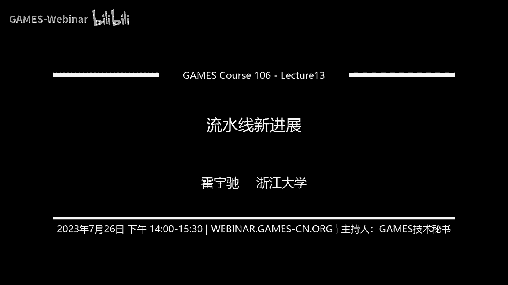
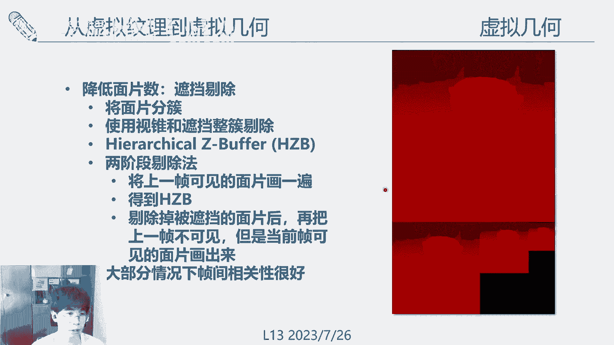
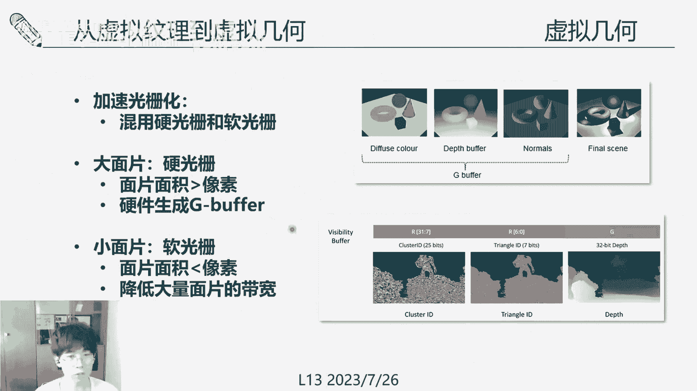
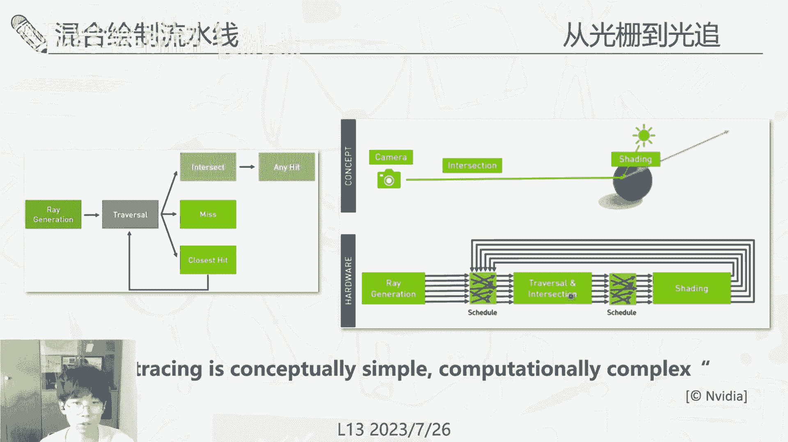
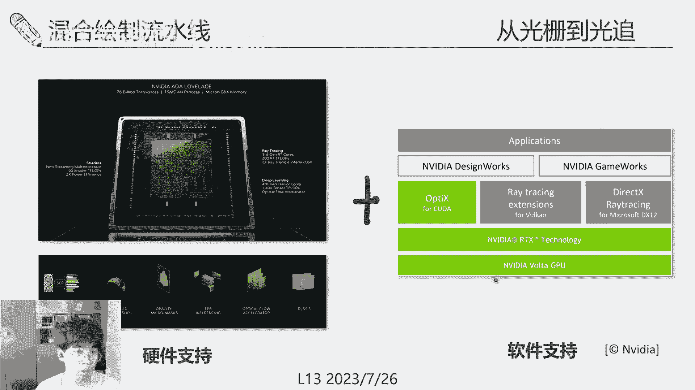
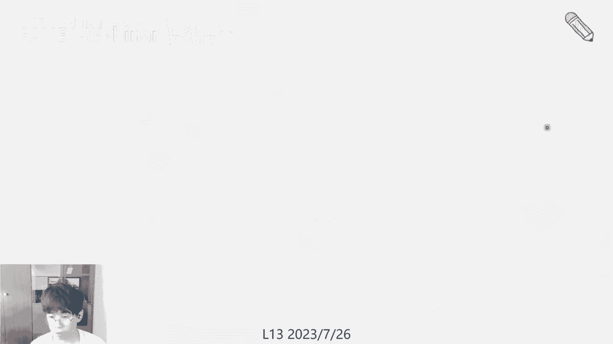
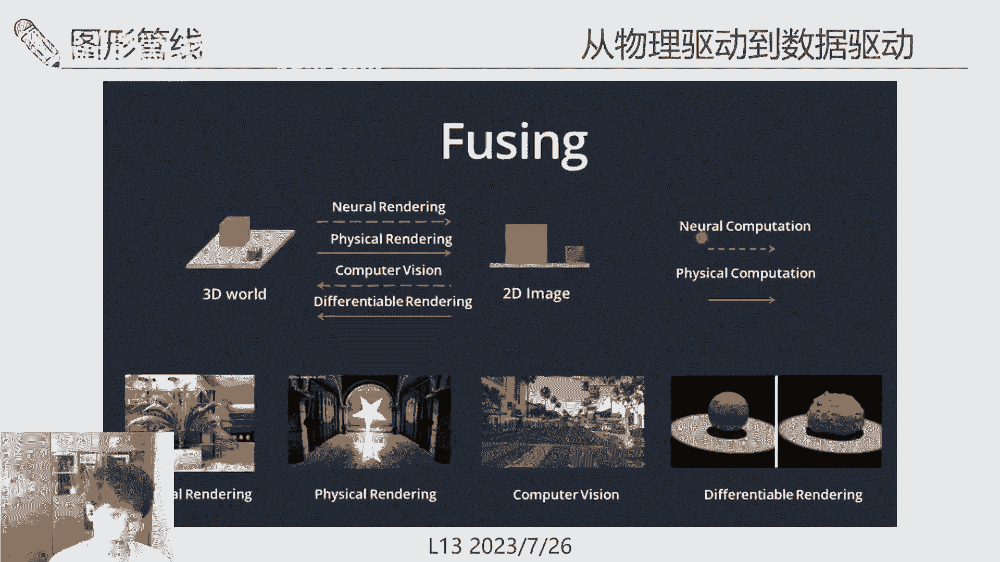

# GAMES106-现代图形绘制流水线原理与实践 - P13：13. 流水线新进展 - GAMES-Webinar - BV1Uo4y1J7ie

嗯我们今天的课就开始吧，嗯今天是最后一节课了，就是我们要练最后一节课，所以啊我们的不会有太多一些技术的问题了，我们真正的在实践中用到的一些技术，从上节课你给LD之后基本上就讲完了。

这节课更多的是讲一些啊，可以研究下的一些新的动态，一些新的发展趋向的一些问题啊，所以是对一些新工作的一些介绍会比较多一些，这个题目是这个样子，就是一些新进展，然后呢嗯一步步来，首先是第一个是先看一下。

就是现在我们用的多的一些行业的标准啊，比较传统的就是这个实时绘制流水线，这个是基于光栅化来做一个绘制，它的主要的思想就是把这个面片啊，投影到这个屏幕空间，然后再去逐像素的去做一个上色。

然后呢另外一个比较重要的一个行业标准呢，就是或者是一个常用的一个范式，就是这个啊延迟绘制，我们会用两个pass把这个东西画出来，第一个pass先去把这个几何的GBA画出来啊。

第二个bus再从这个几何的G8分呃，几何材质的本地去做这个lighting的计算嗯，它当然也是有一些缺陷了，就是它只包含一些空间的信息，那当前的话会有一些方法去做这个补救啊。

比如说像那些light pro啊，还有一些VUE的全局光啊，当然这种东西都不是一个，质量特别高的一些方法，所以我们我们会在后面去讲到一下啊，有别于这两个非常重要的范式，一些其他的在实时绘制。

还有在这个光栅化啊，在流水线里面去做绘制的一些方法。

首先第一个是我们来讲一下，这个一个比较重要的趋向吧，就是这个虚拟纹理和虚拟几何呃。

虚拟本领的话其实是一个更早的事情，在已经好多年了好几年了，它的最初的一个inspiration，就是从这个虚拟内存来的，那虚拟内存大家知道，就是说我在真实的内存或者显存，我没有这么大的一个空间。

但我想要去做一个很大的一个文件，或者是一个算法，它需要很大的空间，那就开一个虚拟的memory的空间，然后他去映射到这个physical memory，如果hit的话，那当然就可以直接取回来。

如果不hit的话，那就去从这个地方再去找硬盘，把这个相应的配置啊换进来，这就是虚拟内存，但这个虚拟内存的想法，然后就延伸到了这个虚拟纹理，因为在我们现在3A游戏里面啊，很多大的游戏，特别是大的场景。

其实是需要一个无线一个，比如说一个场景，一个城市，那它的纹理是无穷大的，然后我们想在作为一个游戏开发者，或者一个程序开发员，想去取这些纹理的时候，如果是一个个是分散的话，那就不好取，一个是不好取。

第二个是呢啊，我说所能用到的一些纹理的大小会受到限制，所以就产生了这个虚拟纹理这个东西，虚拟纹理的话它会有一个virtual test啊，一个非常大的，其实会超过我们的那个GPU的显存。

然后再加上一个啊page table，然后我们去游戏或者引擎里面，去访问这个虚拟显存啊，虚拟纹理，虚拟门店去查这个表，如果是有个hit到的话，那就直接取出来，不信得到的话，再到这个不管是内存还是几何啊。

硬盘里面再去把这个具体的取出来，它有几个好处，一个是支持一些高清的大规模纹理，然后在动态的去调度啊，按需调度，这样子可以减少到他这个内存和带宽的消耗，而且统一去访问这个虚拟纹理的话。

就可以避免很多零散的分块的一些小纹理啊，这个有意义和拼啊利益并行，然后呢他的一些虚拟文类的几个重要的点，首先是它的一个概念啊，就是说虚拟纹理它是有一个LOD结构的，它跟虚拟内存不一样啊。

它像这个是啊分辨率小的mp，然后就是分布率高的mp，他们是相互对应的，但是它在每一块里面它都是分配置啊，像这个地方的配置跟这个地方的配置，它的size是一样的。

所以可以用一个呃page table去做一个索引，这边是一个啊适应的一个东西，像这个每一个虚拟的配置table里面，它会对应一个具体的物理配置啊，再去通过这个虚拟的配置table去索引。

然后呢不管是rookie tt，主要是这个虚拟这个配置table，它都是有个D结构的，而且不同层次之间可以互相的去做一个啊查找，所以这样的话就很方便的，在我们呃实际使用的时候去做这个LD。

而且当我们找一个低层级的呃虚拟纹理，它如果我们在这个物理纹理没有加载进来，我们可以很方便的去找它的上层LD，用一个低分辨率的纹理先去替代掉啊，这个是它的一个用的时候的一个方便的东西。

嗯但是呢虚拟门里就有一个啊小小的缺点吧，就是说他需要去做这个啊是用到的内存，做一个用到的纹理，做一个提前的预加载，因为像一个呃一个这是一个快，它这是我们实际要渲染的一个画面。

然后它每一个区域都可以是一个虚拟纹理，这个虚拟纹理它有没有存在在菲斯克，在这个GPU里面其实不知道的，那个时候呢，我们就要去先去做一个啊debug rendering，先去尝试去用一个pass。

先去尝试取一下这个纹理，如果不存在的话呢，它会自动的去到那个硬盘里面去取啊，这样子作为各种加载的事情，然后啊最后再去把它画出来，所以就多了一个啊feedback gry的一个pass。

但是这个pass呢因为带宽其实很低，所以对我们实际性能影响也很低，但我们真正使用的时候呢，啊虚拟纹理啊，刚才我们提到的还是一些软件的虚拟纹理，然后近几年的话，这个硬件的虚拟纹理。

其实都已经被厂商去集成在了我们的API里面，open gl meta都有一个对应的一些接口，去直接去做这个虚拟纹理，我们只要在里面用就行了，呃它的用法其实也差不多啊，那个实现的方法其实也差不多。

也是有一个先去找一个配置，然后再去怎么样去把那个物理的具体的一个test，再加载进来，但是具体的实现方法，在硬件层面上的实现方法啊，各个厂商都会有一个自己的差异，这些也不是完全公开的嗯。

我们最后再来看一下这虚拟纹理的话，一些这是给到的一些example啊，你看在这个视角变化啊，每一小块就表示一个虚拟纹理，所以在从由远到近，这个它的一个LD或者它实际加载的快，是不在在不断变化的。

你可以观察到在非常远的地方，它有可能是一些远啊，有一些纹理它是一个固定的块，然后我们走近了之后，这些块会被分成一个小的东西啊，这个时候不断的去变换，左边的话，这个是一个啊id啊，对对，但是意思是一样的。

右边这东西好看一点，这就是虚拟纹理的一些概念，然后虚拟纹理啊，基于虚拟纹理的一个概念呢，近景近一两年呢，最重要的一个事情就是虚拟几何，也就是U15的NO that the night。

这个事情呢啊说起来很简单，他就是说OK我们之前是能力很大，现在纹理通过虚拟纹理，我们可以把这个游戏里的纹理做的很大了，那下一步就是说我们要把几何也做的很大，也有很大的三角面片。

这样子我就不需要去加载一些很高清的，Normal map，而且我们在啊是那个艺术家做出来的ZBRUSH，画出来的一些高清的集合，我也可以直接垫一些素材，我也能直接加载到游戏里面。

那是一个非常理想的一个状况，所以就产生了这个虚拟几何啊，虚拟面片啊，串流这么一个概念，它的一个基本的idea，其实跟那个虚拟纹理会有点像，但是它实现起来会复杂很多，因为几何的合并啊，几何的存储啊。

这些东西会比纹理更复杂，嗯比如说第一个缺点缺啊，第一个区别像虚拟纹理的话，他可以用一个那个呃呃feedback pass，去确定看哪些部分要加载起来，但是呢虚拟几何啊，我要真正的做一个光栅化。

把东西都投影过去，我才知道哪些地方是要的，哪些地方是不要的啊，啊才能产生这个非如果我走这么一个pass的话，才能得到啊，我想要加载的东西，那在理论上如果说我用这个fee for的pass。

那我就先要把所有的几何都已经放到JP里面，画一遍，那整个虚拟几何的意义就失去了，所以做虚拟几何的一个啊，配置的加载是通过这个主要是通过一些遮挡，剔除剔除的一些方法，就说我前面有一个depth map。

假设我有个depth map，然后我可以通过depth map，直接去对这个物体级的，对每个物体做的bounding box做一个快速的剔除，这样子，如果这一个物体或者是这一块的一个一群mesh。

它的距离都小于这个DEP，肯定他就是被遮挡，就不需要去再做了，呃，所以在UE5里面，他们真正做的是这么一个结构，它是用了一个hierarchical的zz buffer啊，去做这个遮挡剔除。

他会把那个面片分成一簇一簇的啊，用一些视锥还有遮挡，去把一些这些粗快速的剔除，而不用去处理具体小的面片呃，他的剔除还用到了针尖的连续性啊，他做了两次，首先是他把上一帧可见的。

它是假设我们大部分移动呢都是两针，之间是有一个关联性的，所以上一针可见的面片呢，大部分大概率这一帧也是可见的，所以先把上一帧的面片在这一帧都重新画一遍，产生一个啊z buffer。

用这个DEBUFFER先去把那个整体的那个嗯，大大部分的面片都给剔除掉，然后剩下之后呢，再把剩下的一些面片啊再画出来，这样子啊作为一个补充，把一些新增加的细节补充上去，由于他相当部下之间的相关性很好。

所以他这个catching的这个catch heat的准确理解，是在实践中是非常高的啊，在另外一个重要的一个技术点呢，他们就是去啊做了一个光栅化的一个加速嗯。

由于光栅化，我们知道它是一个跟那个面片的数量相关的，一个事情啊，那假设是说啊如果有很多小面片的话，那我买个小面片都往那个friend buffer里面去，那个写一份的那个g buffer。

那他这个带宽会非常大，所以他这个地方用的一个策略，就是对一些小面片呢，他我不去具体的写他的那个G8粉，像这种传统的G8粉啊，他的call他的那个呃通道太多了，我去写他的一个id，传言狗id。

一个class id，再加上一个depth，我的那个我在他那个国啊光栅化的时候，我写出来的东西很少降低它带宽，然后我在那个真正绘制阶段呢，我再去通过这些ID去读取这个具体的GPER。

所以这个就是一个软光栅的一个做法呃，他用的是一个混合的技术，在大面片呢还是用一个传统的光栅，因为这个效率硬件做车八粉丝效率还是更高，然后对一些小面片呢用了一个软光栅啊，效率会比这个大面片啊。

会比硬光山啊更高，用这种符合的方式，然后第三个比较重要的点呢，就是说啊，他会把这个啊还是保留了一个几何的高低。

他这个几何dd啊，他还做了一个比较复杂的一个串流的机制，去把这些东西啊，非常大的一些几何场景去实时的串联进来，它会根据一些class一个错误，去做这个做这个面片的划分，然后促之间呢。

它会再去构造一个LOD的一个结构，和ARCHICALLD，那所以像右边这个地方啊，它就会形成一个数啊，像这个复节点，它包含两个子节点，但是呢就是说这个复节点像一块面片。

或者是可以认为这个复节点可能就是整个兔子，然后它的子节点呢就是它的两部分啊，这样子依次划分，最后面我们看到的是一些叶的块块，所以我们真正在画的时候呢，如果我画了附节点。

那它对应的子节点其实肯定就不需要画了嘛，因为都是表达的是同一个东西，只是说他用了不同的那个mesh数量去表达啊，所以他会去根据他的一个事情的变化，去维持一个cut。

它确保它在那个显存里面有这么一个cut，这个cut的话啊，所以在如果说我们随着属性变化啊，这个cut我们走到了最右下角的直接点，需要去画一个附节点的子节点的时候，那在加载的过程中。

它就可以用这个复节点去暂时的替代，它的子节点，这样子的话就可以保证，在任何时刻都能画出一些东西啊，正确的一个东西来，虽然细节可能不对，然后再去用一些我们之前讨论到的一些呃方法。

去做一些呃popping的几何，popping的一些blending，这里主要是类似于一些ta的策略啊，这个可能不是靠ta，是类似于ta，它就是做一些针尖的一个复用啊，Blending。

然后这个是虚拟纹理啊和虚拟几何，那下一个呃比较重要的点呢。

就是大家值得关注，就是这个从光山到光追的这个变化，首先是我们看一下这个光追和光栅的区别啊，光栅化我们讲了大概很久了。

然后剩下的是光锥，光锥呢是一个更物理的方法，它不是把这个面片往这个相机上投影，它是直接从相机上去发射光线，去对场景的面片或者是它的几何做求教，然后求交之后呢，有预知的是一个光线吧，我知道了来的方向。

那我就可以算出它它反射的方向，折射的方向就可以在场景里面做豆子棒子，然后直接找到这个，直到找到这个LISOURCE，这就是一个更物理的一个计算方法，所以啊他这个棒子的过程中呢。

收集了整个场景的多次BS的，一些功能的传输的变化啊，可以更好地描述这个全局光照呃，可以看到上面这个是传非常简单的报销号了，当然现在我们会有一些方法，去在这个光栅化的方法里面啊，流水线里面加入JI。

但是这些呢通常是需要大量的艺术家去调，而且它的物理真实性呢并不一定准确，像这种反射折射的东西，像这种镜面反射，其实就是啊在这个光栅化的方法里面，是很难去做到的，呃。

retracing呢它可以或者pass tracy呢，可以保证所有的feature都是尽可能的，逼近我们真实世界物理的一个结果，我们这个地方提一个呃，稍等我在地方提一个。

就是Python tracing或者retracing，其实他也不是所有feature都能做啊，像有一些COSTA，还有一些啊类似的效果，其实它也是需要一些更进一步的啊，特殊的一些算法才能做。

所以但是对于我们大部分游戏场景来说呢，啊，pass transon产生的一个结果会比这个lost rization，这个传统流水线产生的效果要好很多，这些是一个一些效果图吧，像这个是啊。

没有一个pass racing guy或者retracing的一个结果，然后加上retracing之后，可以看一下这个效果的变化啊，像这种光泽度都出来了，然后有一些阴影的过渡也出来了。

就整个真实感或者是写实感就会好了很多，所以呢基于这个现象啊，但是呢呃工商化为什么我们现在用，然后呢RETURING用的少一些，就是因为工商化快，但是RETURING慢啊。

所以人们就想办法去把这两个东西混合起来，有一些啊，有一些effect效果，它是用光栅化才能做的比较快，那就用光栅化做，然后有一些效果呢必须算retracing才能做啊，只能做得好。

所以就用retracing，所以就产生了这个和绘制流水线，也是现在一些相当于游戏啊，会把两个技术混到一块不同，很多人用不同的技术去做，这个是最主流的一个方法，这些直接光如果是阴影的话。

那个光栅化可以做的很好啊，软的话呢它可以做一些逼近，但是也没有这个retracing好，然后进阶啊，lighting其实可以，我觉得更多的是用这个realization。

Global information，global information呢就是用这个光线追踪等等啊，还有一些呃nb inclusion，还有一些透明的，还有一些post processing。

Reflection，这些都有不同的啊，component做一个混合，然后就看一下这个它们的实现啊，上面是一些方法啊，KONO混合很简单，但是真正去做这个管线的混合就很复杂了。

因为retracing的他整个硬件的管线呢，跟这个rust horization是完全不一样的，rotary gj啊，这个rust horization是啊光栅化，然后做那个举报9man只睡的。

然后fragment shader是这么一个PIPINE，但光是追踪呢是发射一些光线啊，就是光线去放到硬件里面去做一个整病，然后重新调节，然后去跟这个场景求交啊。

然后得到一些焦点去做一个计算trading，然后在棒子做一个迭代，这两个东西是完全不一样的，这个retracing的这个PAPI，是没办法放到现在的rust，RIZATION的这个框架里面的。

嗯具体说来就是这么一个过程，它的逻辑很简单，就是生成锐，然后去场景的便利啊，它有三个case，碰撞到或者没碰到，如果碰撞到的话呢，它会有两个case，就是说他找任意一个碰撞，或者是找最近的那个碰撞点。

然后这个做一些对应的处理，这个是它的逻辑逻辑很简单，但是它的这个计算非常复杂，它的计算是因为所有的瑞在场景里的便利，还有它的方向，这些都是啊各异的，尤其他在场景里面去做求教的时候呢。

SGI其实还是属于那个传统的嗯，s gr它是在school en space去做了一些GI的东西，但他并没有真正去做到这个全局光照嗯，然后做主要是这个ray的SCHEERING。

还有做这个merging啊，这个东西在硬件上同步是非常复杂的啊，这里要做这个硬件的，要做光线跟窗口的香蕉，还有这个BBH的那个便利，这个是很难做并行的，所以啊在实现上NVIDIA去做了大量的努力。

也是搞了十几年。

他们做这个optics，其实从10年就已经提出来了，之前有一些更早的预言，那就不清楚了，但是经过这么多年努力吧，现在终于是能用上了，在我们民用市场，但是它的实现上其实也还是非常复杂啊。

一部分是要去硬件上的支持，一部分是要去软件上的支持，包括硬件上的支持，它像内心的这个ADA架构里面的话啊，要做一个真正的这个实时的光线追踪，需要用到天使扣，用到article，还用到了一些特殊的一些呃。

像那个micro mask，micro mashes这些特殊的一些硬件啊，他也是专门为这个光追加加速的，一些定制的硬件，它具体实现了目前是还不可知，再加上软件的支持，软件的支持呢。

目前常用的一些API的话是像啊optics，然后这个van directx，他们都有一些做光追的一些接口，这些我们可以直接调用，然后厂商再根据这个东西。

不管是media art media的卡还是AMD的卡，他们都可以直接去做这个，直接的做一个软件接口和硬件的一个结合，季节我们就不需要去关心了，但总的来说这个是一个很大的发展，呃。

但是呢这个光栅化或者是光栅化，加这个光线追踪这个混合流水线呢。

目前呢还是有很多的不足，首先就是这个即使有了硬件加速，光线追踪还是太慢啊，像这个这张图去说明一个问题，就是说因为光学追踪啊，它的那个呃它是一个蒙特卡洛积分，它这个积分过程呢就要采样。

采样积分的话就一定会产生这个noise呃，像这个如果是有ESPP啊，那这个noise就非常的大啊，DSPP的时候也很大，然后这个越黑的地方，就直接光越难接触到的地方，它的noise嗯就更大。

所以这种结果是没办法直接去，放到我们游戏画面啊，或者是拿到任何的应用场景里面去的，那就去产生了很多用AI的方法去做一些后处理，或者去做一些加速的东西。

那个呃micro mesh这个东西目前我们还不知道啊，要AVIA的一些做一些细节的，他自己他其实呃，密达对他这个包括天字库它的实现哦，RT库它的实现他还是比较保密的，没有任何的一些paper的东西啊。

这是他们的一些核心的什么核心技术吧，核心竞争优势，然后的话回到我们做一些AI的，我们做一些AI的一些东西，就说降噪一个基本的技术是做降噪，就是说嗯我给到一个nose的图像，但是我有他的g buffer。

我可以做一些鲜艳，然后去把它像就像一些平滑做滤波啊，然后就多带一个光滑的东西，30SPP就是noisy的结果，然后滤波后就可以导给个光滑的东西，这个就是一个很promising的一个技术。

我这地方会去介绍一些非常啊，重要的景点的一些工作吧，大家如果有兴趣的话，去可以接着这些工作去挖掘啊，去看到一些他的一个脉络，但由于时间关系呢，我们这个地方就笼统的过一下，给大家一个印象，像这个啊。

这个是17年这个迪啊，迪士尼啊做的一个这个corner prediction，他会去用神经网络去预测，为每个像素去预测一个这个滤波和，然后啊，它这个预测神经网络的输入是我们的G8分啊。

这样子的话一个基本的筛选，就是说啊，如果这个物体是或者是一些颜色空间上，它本身就有一定的连续性，那它这个我们这个filter，可能就会去更好的去拟合这个物体的内部啊。

就比如说这个车就是跟车内部的pixel，作为一个滤波去做一个卷积啊，车外部的就不要去卷了，然后再加上呢他还输入了一个noisy的input，也是作为这个滤波后的预测啊，有了这个boss的预测之后啊。

他们在对这个noisy的import做一个卷积，就可以得到一个nose的结果，然后他在他这个run，他在这个网络里面它有两部分啊，component是分开的，它有一个它是可以跟LBL去解耦开来啊。

把一些高频的颜色给拿出来，直接重回去，不需要这个神经网络去学这个lb do，这是可以自由的拆解的这个lb do的component，所以就不需要这个神经网络去学了，然后用了大量的一些预训练的呃。

配合对像一些noise的image，加上那个高SPP的无noise的image，这两个东西学一下，做神经网络可以学的很好，这个是一个图像玉的一个降噪，然后图像与降噪。

那肯定会延伸到一个路径空间的一个降噪了，就是说因为每一个pixel它不仅是pixel嘛，它那个其实有很多棒子的这个boss的啊，就是我们的这个所谓的光线的路径啊，然后路径的话由于它这个路径空间太高了。

他比如说boss一次它就有啊，Normal，有这个test，然后有这个颜色，有position，这个维度太高，我没办法放到神经网络里面去，所以这个大概21年的时候，就会有一个工作去做这个pass。

把这个路径的信息，想办法用到了这个DEMING上面去，那就是他对这个路径做了一个embedding啊，找了一个流行这个高位的路径空间，找个流行，然后去对这个feature做一个特征学习啊。

math的学习，去让这个这个是学习后的一个特征空间啊，这个是学习之前的，学习之前的，你可以看到学术前的话，他那个同一个pixel，就是同一个像素紫色上面的一些呃一些特征，它是很零散的。

是没有一个相似性的，但是在做这个特征在这个空间学习之后呢，嗯math的学习之后，他整个特征空间就变得更SMOS，所以这个也是在路径空间降噪，然后另外的一些策略就是做采样，在采样想办法在采样上去做文章。

就是我们啊像刚才的滤波，那时候我们采样完了，有一个noise的结果了之后去做后处理，那我们也可以在想办法去让它采样的sample，去更符合一个能得到一个更好的结果，这个地方就讲到一个摩托卡拉采样。

就是蒙特卡洛采样的话，他需要我们采用的这个sample，如果越接近他的那个重要PDF，越接近他真实的那个积分，那他这个积分的noise就越低，所以就会有一些不同的方法。

用神经网络的方法去想办法去逼近这个采样呃，像这个09年的这个top是UINPUT的separate，它是用神经网络去分段啊，做一个分段的那个啊PDF函数去拟合这个函数，然后这个函数就是我们所需要的那个。

真正的这个呃，他就假设这个神经网络拟合的这个函数，可以去不断的优化，不断去逼近我们的这个光truth的PDF啊，或者国truth的啊，入射时辐射度嗯，所以它的一个核心思想就在这。

那除了用这个神经网络去逼近这个，概率函数之外呢，嗯另外的话还有一些就是说用一些啊sample，就是用一些智能的方法去做一些sample。

就是说用一个强化学习的，这个是20年的一个工作，其实用一些强化学习的方法去像，比如说大家可能会有一个比较直观的，就是这个呃那个呃阿尔法go啊，阿尔法go其实就是一个策略。

用强化学习的方法去做一个策略的选择啊，投资吧，那在这个做这个separate的时候，其实你也可以去理解成类似的一个事情，就是说我有一个很大的一个采用空间，那我往哪里踩，可以达到一个最高的效率。

那这个其实也可以去封面成一个强化学习，这是一个策略啊追溯的这个问题，那所以就会啊这个方法就是去训练一个q network，一个价值网络，还有一个策略去做一个策略的一个选择。

不断的在这个这个非常大的钱空间里面去投点，这是另一种另一个经典的一个工作，然后到了啊在下一个东西呢就是这个combiner，就说我们前面的一些录播的结果啊，就是这个DNOSE的结果。

可能它那个结果它是有偏的，然后在DSTP下他效果好，那高s app下，那可能pass racing，这个不偏的结果本身就已经更好了，已经就比这个node noise过的结果误误差更低了。

那这个时候他就没法收敛啊，在高斯pp下滤波的结果就没法收敛，制片工作就提出了一个是combining，把这个滤波前啊，把这个摩托卡罗降噪前的这个呃，按bias的结果和这个降噪滤波后的BS结果。

再用一个神经网络去把它混合起来，做一个加权混合啊，得到一个最终的output，这个方法的话在一种像这种非常光泽的玻利亚，还有一些GRISPEUA的一些东西上呢，它啊可以保证它这个整个最后结果的更好的。

收敛性质量更高，而且理论上它可以做到这个consistent，就是说你在SP无限增加之后，它最终可以收敛到这个数学上正确的一个结果，然后呢还有就是时空样本重用，施工样本重用呢。

就是说啊我们真和simple啊，它就两个地方，一个是时间重用，一个是空间重用，时间重用就是针与针之间啊，一些我们上一帧彩蛋的样本，这一帧其实也可以拿来用一下啊，来增加我们这一帧的这个呃样本的密度啊。

然后空间成就是相邻像素之间的样本，也可以去做一个借用啊，就这样子同样去为了增加我们这个样本的密度，所以他做了一个池子啊，他把这个空域和时域的sample，一个像素旁边的simple都放到一个池子里面去。

然后我们正正在去从这个池子里面去random的，重采样一部分sample，来增加这个嗯，我们得到的这个noisy input的一个质量，然后这个东西呢啊重用完之后呢。

还可以跟这个D东西呢结果做一个混合啊，作为comb最后得到一个结果，然后这个其实也是呃，AMIA也这个东西也是AMIA在推进，所以很大概率上他也会用到了他的DNS啊，或者是降噪的一些东西上面去呃。

另外的再往下就是有一些工作像真预测，就是说我们换一帧太慢，那我们其实就可以用上一帧直接去预测下一帧，下一帧我就不会了，嗯这个东西其实不仅仅用在这个retracing或者，PEETRATING的结果。

对光栅化的结果啊，也是可以同样去做一个预测的，嗯跟那个图像预的，你我们知道在视频上呢其实也有一些真预测啊，或者是侦查值这些工作，但是啊跟他们不一样，在绘制的过程中呢，我们有我们可以用很低的代价去获取。

下一帧的那个g buffer，所以我可以去基于下一帧的G8粉，去跟上一帧的绘制结果，去预测下一帧的那个绘制结果，这样的话预测出来的结果质量呢，其实会比原来的video的那个会好很多，呃。

中间呢还加上了一些呃，像那些用上了些motion vector啊，去做这个peace键的win，还有这个逆时针的两三针的一个连续重用啊，这就是真真预测嗯，OK这里有一个小小的bug。

那到时候我再修这个东西，然后最后还有一个就是这个超分辨率啊，神经超分辨率的话，就是同样的我们可以画一张小图啊，分数很低的小图，然后我们去把它做一个上采样，用的也是用神经网络的方法啊。

这个也比较容易理解了，就像上面这些是低分辨率的，然后上采样之后，他会把这些断裂的一些东西啊，怎么样啊，还有和一些细节不足的东西都给补全了，这篇的话主要是用了这个历史针啊，若干针的一个信息去做一个叠加啊。

这样子的话他以他的想法是说，可以去把这个通过历史，用食欲的一个信息去填补，他空域信息的一个缺失这么一个东西，然后这个分辨率超分辨率呢啊用的很多啊，像在这工业上的话，现在DNS还有非常FX。

他们都会用到一些插帧，和超分辨率的一些混合啊，这些是工业级的一些应用，但是呢DLS是没开源的，所以它的具体实现呢是没办法去讨论，这个是混合绘制，然后在下一个趋向呢，我觉得可以我们来讨论一下。

就是这个从一个物理驱动到一个数据驱动，的这么一个变化嗯，半影视gber bin是g buffer，你可以这样理解。

就是他对那个g buffer做了一个encoding啊，之后再去用来预测。

所以是是这个意思，然后回到我们这个问题啊，物理驱动到数据驱动，物理驱动我们知道这是一个图形管线啦，就说我们一直在说这话吧，在rendering rendering的话呢。

是从那个数字空间往这个虚拟空间里面去啊，画就是把这个数字资产画出来，那真正我们在在一个图形的完整的管线里面，我们还要考虑这个数字空间的资产怎么来啊，他有可能是从那个真实世界里面来的。

通过一些啊CP的方法感知或者重建过来，也有可能是啊人手动建出来，但是在我们真正的一些符合的应用，相当于自动驾驶啊，什么东西，他其实需要去从这个真实世界到数字空间，到虚拟空间，我们的理想的状态是。

整个pi都是去通过计算机来自动的完成，不需要人的太多的一个概念，嗯那就涉及到这个cg和CV啊，先行和感知和绘制它们中间的一个关系，就说好像我们刚才讲了很多啊，Rendering。

我们讲了整个课程的rendering，其实都是一个偏啊，物理驱动的一个计算，它和我们有个物理模型啊，我们去真实的去做这个场景中的光线啊，或者什么样的一些其他的物理的一些过程，的一些呃追溯。

然后打到物体上的时候呢，要去对这个部位的物体的表面材质，BRD建模啊，把这个过程搞出来，这是一个知识驱动的一个过程，然后呢他们做感知或者是CV作者感知呢，其实现在更多的是有一个巨数据驱动。

就是我我不知道中间这个模型怎么建啊，那我可以有很多数据集，有很多标签，我把这个数据集和标签，让一个神经网络去自动去拟合一个规则，这就是一个数据数据驱动的一些过程，呃原来这两个东西是比较泾渭分明的。

是区域区别是非常明显，每期的嗯，在最近呢，其实这两年这个东西混合的啊，这个趋势也是非常的明显，尤其是在这个一些影视表达，神经影视表达内核出来之后，我们这个两个东西有不断的有很多交融。

比如说像这个一些影视表达，那就是用一些神经网络的方法，去做一个呈现的任务啊，然后像这种defence inverse rendering，Differentiable rendering。

其实就是用一个神经网络的方法去建模，反过来，所以会产生各种各样的一个不同的pet，在这个里面呢，我们可以提到一些比较重要的事情啊，就说我觉得，可能将来我们对这个传统的图形管线呃。

可能会做一些fundamental的变化，就是说我们原来都是用一些显示的面片，几何去做这个啊物体的表达，然后把它绘出来，但是最近的话就是有一些乐福这些工作啊，同样可以画东西，它的一个原理是说嗯。

我用的神经网络去表达，这个物体或者一个场景的这个啊辐射场，然后我在任意的XYZ位置，我去输一个XYZ，还要加上一个方向的位置啊，这个几个坐标查询，丢掉这个神经网络去查询，可以返回一个这个位置的一个颜色。

就是它的密度，所以那最后有了颜色和密度，我就可以用一个volume render，一个我一个光线，我用一个volume rendering的方式去积分，这个光线上的一些呃密度和颜色。

就得到它最终的color，这个跟那个体会制啊，或者是那个医学图像显示的体会制结，原理是非常的类似的，然后它这个好处就是说，它最终优化这个呃矿场的表达，他直接用我们拍到的图片照片去做表达。

所以它就可以画出一些真实感极强的一些画面，这种如果说我们要用一个艺术家去做一个模型，重建小，然后各种调色，就画出真实感这么强的一个场景啊，做这么一个建模其实是很困难的，但是对于一些影视表达来说。

他就很容易啊，而且呢它可以直接对啊现实场景的东西，直接去把它做一个模型的转换啊，做一个演示表达的一个转换，这样的话就极大的丰富了我们这个素材库啊，现在有很多引擎，包括UE5啊。

unity其实都已经提供了，把这个NF这种影视表达，直接在这个场景里画出来的一些功能，那以后我觉得他会对这个管线，还会产生更多的一些影响，然后就是介绍另一个重要的工作吧，就是NGP嗯。

NGP的话跟刚才那个NFT呢，在他在体积分那一块其实是一样的，只是说他他在这个表达上它会有一个区别，他不是他对这个影视需求的表达呢，他不是去用整个VMP去做啊，他是搞了很多hash breed啊。

做一个小块小块的一个表达，然后在每一个位置，一个局部空间的那个breed呢，呃是做这个做这个pixel的，U15的话是可以直接画的，他没有转那个外旋转，卖水的话是SDF啊，我会后面会讲到。

因为note转卖转卖水是质量是很差的，然后的话它是用一些局部的feature做一个产值，然后再去解绑，所以它这个是更有一个局部性，得到这个影视的feature之后。

通过一个非常小的mp就可以去解码出来了，它那个颜色和密度了，这就是这个伊斯坦NGP的一个好处，由于它在更新的过程中呢，他只需要去更新一个局部的参数，所以它的速度非常快啊，再加上其他的一些工程优化。

所以基本上有了NGP之后，这个NFT的绘制和训练就可以接近事实啊，像这种，你可以看到这个像一个物品级的重建的话，那几秒钟就可以做好，这也是一个比较重要的一个进展，然后呃接下来就是说到SDF吧。

就是SDF跟那个NF会稍微有些区别，呃NF的话它是表达的是密度场，然后SDF呢他也是用神经网络，但是它神经网络表达的是一个SDF厂距离差，这个距离就是每一点每一个pixel，每个survive位置。

它可以查到，查询到从这个点到最近的一个surface的距离，那它的一个好处就是说啊，这个是一个可视化的一个呃SDF厂厂啊，等势面，它的好处就是说我可以找到这个临时面，然后去用那些match cube啊。

这种方式去把这个几何的面抽出来，这就是说我们重建完之后，我重建之后，重建的过程中，我还是用volume rendering啊，去做这个可微的体的优化，那么优化完之后，我有就有了一个SDF厂。

我可以直接把这个面抽出来，那所以就有了几何，那就可以跟现在的一些工程化啊，一些传统的管线就直接搭上去了，这就是sdf base方法的一些好处嗯，然后除这个东西呢。

一个好最重要的就是说他手工建模的做工建模，那现在可以用一些扫一些照片，然后就直接把这个卖水溅出来了，这个就是一个很fancy的一个事情，同样的也有一些方法。

这个是啊physical base inverse rendering，他是不去优化这个surface厂，他不去优化这个SDF厂，他直接优化这个面片，也是用过通过一些可微的这个啊光线追踪。

去把这个导数传回到这个具体的面片上来，去改变这个面片的位置啊，然后同时呢也能去改变它的面片的那些纹理啊，材质这些东西，这些都是可以优化的，那最后就是他像捏小球一样，一开始是有一个初始化的这个小球。

一些大量三角面片，然后他就不断优化优化优化，根据一些图像去优化，得到各种各样的一个shift，这就是另一个方向啊，自动建模或者自动场景优化的另一个方向，然后下一个我觉得很重要的是这个IPC呃。

刚才说的东西还是一些2D到3D的em，九多妹的这个视觉抖妹的一些转换，那ABC啊，横祸，他其实已经可以做到些跨模态的一些，资产生成和资产转化，像是这个准确，他说一段文字啊去描述一个东西。

我有一个兔子在一堆这个啊松饼上啊，在在一个盆子上，然后它就可以生成一些啊卖血呃，这个其实还不是mesh，它其实是一些影视的啊，场景和物体表达，当然这个东西可以最终可以转成mesh。

这个是另一个topic，所以这个东西啊AIJC，那你这个就有很大的想象空间了，那也许说将来我们建场景或者建一个东西，我们直接去做一个描述，或者给一些照片做一个参考，我就可以把整个场景建出来。

然后画出来这个游戏其实不仅是游戏，虚拟现实，还有我们大量的应用，都会产生很多的想象空间，除了模型生成呢，其实我们注意到就是还有一些其他的像啊，纹理啊，模型有了，那就是纹理，就是说有一个模型啊。

那我怎么把这个纹理贴出来，这个也是一个最新的工作，好用一些文字描述，然后这个白膜是需要给定的，然后它直接产生的是这个上面的test啊，这样的话就更适合我们的管线啊，在游戏里面的管线啊。

或者各种各样的case下，我们啊这白膜可能好搞，然后再去优化它的这个纹理，去做一个很精致的贴图，这个是很费劲的一个事情，但是我们能自动生成，这就是一个很好的，第三个呢啊我这地方漏了一个东西啊。

第三个就是灯光生成啊，灯光生成我们前面讲了模型，讲伦理，那灯光现在也是有一个最新的工作，也是可以做到它的一个自动生成，就是说这个是坐在一个室内场景的一个，更多设计呃，给了那个场景之后。

然后就用神经网络去不断的生成，除了生成灯光的亮度之外，它还生成灯光的样式啊，不同的位置它应该摆什么灯啊，摆什么样的，像这个室内场景的话，它是有一些装修的规范的，像屋顶上去摆吊灯嘛，你不能屋顶上摆开灯。

这些都是一些规范，但是神经网络可以帮我们去做掉，呃下一个进行最后一个事情了，就是AI计算啊，从图形计算转化到AI计算，这个是呃我觉得是一个挺明确的一个东西，就是我们现在传统的做一个绘制，还是用GPU啊。

还是基于GPU啊，主要的两个核心的计算单元是谁的，就是computer啊，Computer shader，然后再加上这个如果是出光追的话，就是用article啊，但是呢啊这种东西GPU嘛。

其实还是一个专用硬件，那有没有办法直接用一个更通用的，更简单的一个结构，就是NPU去直接画图啊，做一个全局公告的绘制，那最近也是有些工作把这个事情啊做出来的，就是他把流水线的逻辑去改了一下。

穿透流水线呢它是基于面片化啊，像光追光栅化是基于面片去画，然后基于光追的话呢，它是以光线为单位去化，所以这些是比较物理的一些呃，力度比较细的一些啊，绘画单元，然后这个工作的是把这个流水线变成了。

按物体去画啊，先去画一个背景，然后我在上面就画一个物体，然后再把这个物体对这个场景的那个影响啊，预测出来啊，不断的叠加，所以就像一个流水线一样啊，每一个每一个层次，每一步骤去增加一个物体。

那最终去把整个场景画出来这么一个框架，那它的核心的一个难点，就是说要去找一个啊方法，神经化的方法去把这个物体对这个场景的，他这个光能传输变化啊，这么一个抽象的一个函数区，把它存下来啊。

这就是这个物体做到一个事情，嗯那基本上啊今天就刚好50分钟，那我们基本上就讲完了几个事情，然后可能稍微总结一下，就是今天讲了几个事情，一个是这个从虚拟的纹理啊，到虚拟几何，做这个一些虚拟化的事情啊。

做这些大高精度的材质的一些载入的事情，然后另外就是讲了这个呃，光栅化到这个光线追踪这么一个趋势，然后最后面就是这个啊，有一些物理驱动，到更多的AI驱动这么一个事情啊。

然后这也是我们这个106的最后一节课，然后谢谢大家一直以来的一些观赏。

接下来是一些可能是一些讨论的时间，好不对，看看大家有什么问题啊，今天的话题其实比较发散啊，没有讲的很细，都是一些嗯方向性的一些讨论，嗯那现在人比较多嘛，然后再顺便提一下那个助教那边。

好像是说那个到了几何优化这一部分，大家上传的作业就相对数量就变少了很多啊，是不是会有一些难度啊，或者是需要一些解答，这个东西可以拿出来我们探讨一下，然后的话如果说在某些作业不感兴趣，或者是不想做的话。

其实也可以去跳掉啊，去做后面比较感兴趣的一些作业啊，这些都是OK的，看一下OK，没有其他问题的话，那我们在等个几分钟，那我们就结束掉今天的直播，好的嗯，OK那今天的话我们就先到这里吧。

