# GAMES106-现代图形绘制流水线原理与实践 - P2：2. 图形绘制流水线的基本原理与实践(一) - GAMES-Webinar - BV1Uo4y1J7ie

好，那么时间也差不多了，这边就开始正式上课吧。

首先，我也非常感谢能够有机会来参与上Games106现代图形绘制流水原理与实践这个课程。我先自我介绍一下，我毕业之后一直在，声音太小了，我看看，我的麦应该已经放到最大了，那我讲的大声一点。

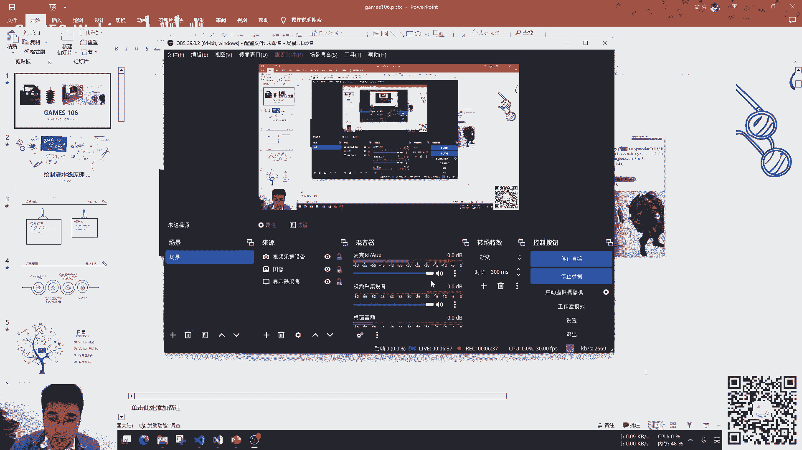

我毕业之后一直在，在相亲科技这边工作，我跟上一节课的霍老师不太一样，我一直在工业界里面待着，所以我讲的东西会更注重实践一点。OK，然后下面我们就正式开始了，然后绘制流水线原理的第一课时。我来大概讲一下。

我这个第一课时主要应该是从Woken这个API，大家想要通过我学习Woken，然后来可以实践上手来学习。这个课一开始来上的时候，跟我说有个目标就是说，我们之前上了很多课，有点高见龄。

想要更从实际的角度来让大家学习到如何学习绘制，如何实际的从RTI接口来学习。然后，这样子的话，我也大概以这个目标吧，设计了一下我的课程安排。然后，首先我来讲一下，大概是谁比较适合这门课。

就是一个是刚刚开始接触学习RTI的初学者，比如说你之前可能已经有过了解了OpenGL或者第三第11或者别的什么之类的，你对于这整个绘制的东西，你还想要更深入的了解这个是对的。然后。

假如说你对于Woken这个东西其实已经比较熟悉了，对绘制管线什么之类的都非常熟悉了，这门课可能，我觉得可能意义就没有特别大了。然后，第二个的话，我们是有一个前置的要求，就是你必须首先要学会C和C++。

然后，这门课在我上的时候，你可以收获的东西，一个是Woken API的一个基本使用，第二个是对于Woken的绘制管线的一个相对来说全面一点的一个理解。最后。

是因为我一直在从事的都是移动端上的一些应用开发，然后会讲一些针对，可能会提起一些针对移动端的优化的实践。然后，我为什么区分移动端跟那个桌面端这个事情呢？

是因为RHI接口其实是一个面向硬件开发的一个一种接口吧，也就是说你的同样的代码，你在不同的平台，他们的硬件给你设置的那个bar是什么样子，其实不一样的，这个就类似于那个木桶理论，你的木桶。

影响你速度最高的木桶是那个最短的那块板，然后PC端上的一些就移动端上可能是一些问题，在PC上可能它就不是问题了，比如说移动端它的我相信GPU的那个计算性能其实还是可以的。

现在但是移动端上的它的瓶颈是在于带宽上面，所以说我们在PC上可能会很容易的用一些算法，可能跑得非常好，但跑到移动端上就发现就特别的卡。原因也是出于这种东西，所以说在，OK。

然后所以说这个东西可能要区分不同的硬件平台，哪怕同样是移动端你安卓ios，或者你哪怕是安卓，你是高通的卡，还是说是华为的那个麒麟或者联发科的，其实对他们都要做有可能有不一样的那个针对性的优化。

那么你这个才是一个高性能的一个东西了。OK，然后下面我再讲一下我们的课程安排，然后我的课程安排呢，总共是有三节课，那个。第一个呢，是我可能基础架构，然后它的汇集流程，然后基本上大概这门课的安排。

就是说我大概会讲一下你这个我可能会去怎么去架构它，然后怎么去处理化一个我可能的。我可能一个application，然后第二个课呢，是我们我肯定我们最关键的一部分，你要去绘制它。

然后怎么去创建我可能会是对象，然后内存管理以及最重要的事情是它出问题了，你要怎么去调试，你要还有一些工具的使用，我们离不开这个我可能工具，然后最后一节课会有一个我肯就是我们所说的现代图。

新管线的一个很重要的一个事情就是多新的同步，然后还会一些基于移动端的一些场景的优化，还有实践，然后最后是看一下那个作业还有反馈。OK，然后这个是我们的这个课程的一个目录。然后第一个我可能的简介吧。

我可能他跟OpenGL比较类似，毕竟一开始在提出我可能这个东西的时候，他的名字不叫我可能是叫既有next，就是下一代的OpenGL，然后所以说他也跟OpenGL一样。其实是有一个官方的标准。

我们定好了一个统一的接口，统一的标准，那么具体的实现OK，你们每个硬件厂商自己去实现，并没有一个组织去审核你的这个硬件实现的能力。

然后这个区分于苹果的Metal或者D3D1112不一样的地方就在这个地方，你在D3D1112当你的文档标准里面说他支持这个功能，或者说当你query出你的硬件，你的设备，你的系统能够支持这个功能的时候。

那么他一定是有的。但是在我可能的或者OpenGL我可能的那一套里面其实不一定的，这个事情是要打个问号的，就是说他们可能很深层了我支持了我可能现在是1。3吧，可能他们可能深层了自己深层了我可能1。1，1。

2的核心功能，但是他并不是真的所有的核心功能他都实现了。你只能去经过一些测试，他才可能某些功能是OK的，某些功能其实是不OK的，然后还有一个是我可能相对于那个他做一个开源的那个。

他做一个开源的那个框架的话，主要还有一个特征就是扩展，每个平台会有一个自己的扩展，比如说在rejection刚出来的时候，就在N卡上，我可能N卡有一个rejection的扩展。

然后这个扩展在AMD上面你是用不了的，你在手机端上也是用不了的，因为他是针对于那个N卡的扩展，然后在后续的你的扩展可能就会被吸收掉。可能就会被吸收到了那个那个我可能核心的功能里面。

所以我们在看到我可能很多函数的时候会经常看到一些后缀，两个函数几乎长得一样的，就是VKXXXXX，然后NV或者VKXXXXX华为OK，这个是华为做的扩展，然后VKXXXXAMDOK，这是AMD的扩展。

然后VKXXXANDROID是安卓上的一个扩展，所以说我们我可能在开发的时候，这个是需要注意一下。你想用他的某些功能，那个功能其实跟你的那个硬件设备或者说你的跟你的显示平台是非常强相关的一个事情。OK。

然后后面我们要看一下，首先我们去Wacom的话，学习的话，首先我们要去下载。OK，首先我们去Wacom的这个平台上，我们去下载他的SDK，这个SDK的话，我们可以看到Windows，Linux跟Mac。

Windows跟Linux都是官方出的一些版本，但是Mac并不是苹果出的，是那个V色做的一个。

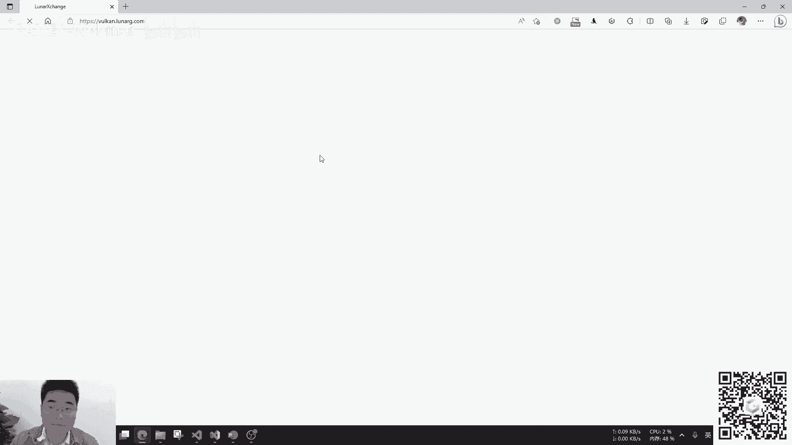

是V色做的一个功能。OK，弹幕有人说是KHR是什么后缀？这个KHR其实就是那个可以制造Wacom的那个官方组织做的一个扩展的一个后缀。你可以把它理解成一个类似于官方的扩展功能吧。对下面有弹幕有说。

就是对，这是就是这个组织做的一个。你可以把它理解成一个官方的后缀，OK，我们接下来聊一下，然后我们安卓的那个那个功能的话，Wacom是那个是是谷歌提供的，然后跟你的NTK，随着你的NTK。

然后附带的数据，然后最后的实现了，但是根据你不同手机硬件来实现。

这个这个事情会有一个，那个大家可能会在桌面端开发，我可能时候会体验，可能会更好一点，为什么呢？因为我可能桌面上只有三家那个驱动厂商，NVIDIA，AMD，INTEL，只有这三家，然后这三家呢。

我的经验是大家尽量如果后面的作业啊，大家尽量如果手头上有独立的显卡，那么尽量用独显来实现来去完成这个作业啊，不要用那个。INTEL的核显。如果大家的作业有兴趣的话，也可以在移动端上跑安卓或者ios。

然后安卓的话，我的经验是。呃，会有录屏的。对后面会上传的，然后安卓的。有人问那个老师有录屏吗？这个会有会有录屏的。然后那个安卓的那个。那个驱动化就是每个手机厂商会有的不同的的实现。

你华为手机就是华为实现的，OPPO手机就是OPPO，但是有些像小米可能也是小米实现的，然后高通的手机小米OPPO他们使用的高通手机，高通会有一个提供那个一个大概的一个驱动，然后华为跟高通就不一样。

然后我的实践就是可能高通的手机，它的兼容性，鲁巴性会更强一点。华为或联发科他们的这种支持可能就会弱一点，就是会出现我说的那种核心是支持了，但是其实他手机并不支持，比如说，呃，有一个叫msa的功能。

你在我们开了msa，你会发现很多比较低端的什么高通六系四系手机可能就跑不起来了，直接就崩溃了，但是你把这个msa一关OK了，那么他只能说我只能是理解成他的驱动对这个知识是有有有一点问题的。OK。

然后我们下面是讲一下对比那个传统的HI跟现在的HI，因为我可能data v12跟mantle我们可以按照说是现代的HI，然后传统的HI呢，其实他们会有一个叫做上下文的一个概念，他们是一个状态机。

这个context可能有像openGL会有个影视的context，它说你的现成是保定的，然后第三第三地呢会有一个显示的context有个叫什么第三地divorcecontext的这么一个对象。

那个最对象里面呢，他也是一个状态机，当你改了一个什么东西呢，他就会有个状态会记录在这个里面，这个状态机的这个东西有什么不好呢？我可以举一个例子，比如说我们开发了一个SDK开发的功能。

用openGL开发的功能，OK，我们自己去管理了一些设备，管理一些图片的纹理，我们自己去建了，然后假如他刚好有个图片纹理，他的就是字母12，因为openGL他那个图片对象，他就是一个整形嘛。

我们就是12，然后呢，外面在对我们这个SDK的人呢，他们就外面会也会有的，也会有他们的对应的图片资源，那么假如运气非常不好，他的代码写的有问题，他们很久以前就是有一个纹理ID叫12的这么一个纹理。

已经释放掉了，但是他并没有把这个12这个给置为0，然后等到后面呢，他再想去回收资源的时候发现，哎，我有个纹理12，好，我想去把它给释放掉，然后他以为释放的是外面的对象。

但是真正释放的是我们提供的一个SDK内部的一个纹理，然后就会发生一些不可控的或者无法预期的问题了，可能程序会崩溃，或者是黑屏，或者怎么样，然后对接我们的SDK的人就会觉得，哎，你这个SDK有问题。

你看我用了你的SDK，你看我的这个程序就崩溃了，那么好吧，这个问题你要去解决了，然后这种东西我们我们也知道这个很难查，因为这个逻辑并不是我们能够控制的，是外部的错误调用来导致的。

然后这个就是传统RHIOpenGL会带来的一方面的这种问题，它的状态机管理，你外部如果修改了，我内部其实是无法感知的，然后第二个事情是驱动会帮你干很多事情，传统RHI的驱动，它会帮你做同步。

比如说你想OpenGL你想从那个文理里面去把贴图读出来，那么这个时候呢就会有个隐私的同步，它会让把那个所有跟输出到这张贴图的渲染相关的所有的命令都结束了之后，OK。

那我再去从这样贴图里面把这个东西给读出来，然后这些事情都是驱动帮你干了，你在写的时候你会感觉好像这个那个那个函数我没记错叫GeoRedPixel，这个函数会特别的慢，但这个慢并不是它卡住了。

或者说这个函数很慢，只是因为CPU在等GPU在干活，就是CPU在喊，GPU你快点干啊，我就等着要你的结果呢，然后GPU说好好好，你慢慢等，你慢慢稍微再等一等，我马上就好了，OK，然后等到GPU干完活了。

然后CPUOK，再把这个你干出来的结果给拿出来，这种东西呢，好处呢，就是说当然你在写代码的人，开发这个功能当然是非常开心的，因为保证的结果是正确的嘛，但另一个方向你想要写的非常高效，你就没有任何手段了。

然后所以说呢，所有OpenGL的驱动呢，一般来说就会比较重，他们或者第三第11的驱动就会很重，因为他要保证你的所有的功能都是完善的，所有的东西都是OK的，然后所以他帮你做好多事情，包括同步啊，竞争啊。

比如说你这个东西你谁先用，然后又有谁先读之类的，假如你还有了写的多线程，那我们OpenGL也是可以写多线程的啦，之类的事情，他驱动都要帮你把这些事情都解决掉。

那么当一家驱动的公司的软件开发能力比较弱的时候，比如说个别的显卡，他们的表现可能就不太美妙了，然后当一家公司的软件开发能力驱动写的非常好，然后他们的表现就会非常棒，你会觉得。

然后这个时候对于用户的感觉就好像，嗯，你这个设备就不太行，这个设备就可以，我不同的同一个游戏，我在这个显卡上，明明你的算力更强，但是好像我跑起来会更慢，大概就是这种原因，然后我们的现在的RHA呢。

这个东西就是说驱动层会做的非常的薄，驱动只做最核心最核心的事情，然后呢，就会依赖于你的开发人员，需要你对这个你的程序是非常清楚的，你想要干什么，你这个你这样图，你比如说你画了一张图出来。

张图后面你是否会需要再被复用，你这样图后面会是怎么样，然后你这样图是不是画好了之后，直接画到屏幕上去，你都是得清楚这个事情，包括我们的那个更新机制，然后然后再包括你这个东西是否要多线程同步，还什么的。

这些都是需要那个开发人员是知道就知道了非常清楚，你的各种依赖关系，也都是需要开发资源的依赖关系，然后包括你的那个资源分配，嗯，OK，这个讲的资源分配，的话，这也是我可能和他12需要一个做的事情。

你在写第三第11或者欧明杰的时候，可能是永远没有思考过，当我去开，就是开辟一块纹理的时候，我还要去思考这个纹理的内存是怎么管的，一般来说，我就直接开起来，是你快空间，就像牛的一块空间一样，OK。

这样就可以了，但我可能他不行，我可能一般操作是你首先要申请一个足够大的一块内存，然后呢，你自己去分配，这块内存的哪块区域给这张图，这块区域给另外一张图，OK，第三张区域给第三张图，OK，所以说。

我可能的话，你需要去这种内存分配的事情，你要自己去考虑，自己去管理，当然这种东西是会有一些比较友好的第三方库，然后他对于多线程也是友好的，因为他的接口的话就是是基于command buffer。

就是一条所谓的command buffer，其实就是把所有的GPU的命令，我扔到了一个对列里面去，这个对列，你在往里面塞的时候，那个GPU其实是并不知道的，然后等到我对列我都已经定义完了之后。

我再去扔给GPU，他是通过这个方式，然后可以实现多线程友好，然后我们再回到回头看传统的IHI的时候，因为有一个上下文的概念，有个状态机，那个时候我如果要实现那个多线程的话，就会很麻烦。

比如说OpenGL，我可能有三个线程，每个线程我都会需要绑定一个context，然后每个context之间他们资源的那个需要做共享，然后还需要，嗯。

最后想然后每个context我还要去管理好他们的生命周期，每个context他们有一个自己的状态机维护，这个就会非常的不友好，然后这两个区别的话是现在IHI驱动，其实等于说不帮你，不会帮你干任何事情。

然后是你要自己去理解你的程序是要干什么，你才能够写出更好的东西，然后第二个是你如果用现在IHI你可以很容易的就写出高性能的，不是很容易写的高性能程序，是你有能给他提供了一个你可以写出高性能程序的能力。

但是你要真的写出的高性能能力，你是需要一个非常强的一个熟练的情况，你对你需要对你的硬件，包括你的程序运行的逻辑都非常了解，你才能够写出一个非常高性能的一个东西，所以说熟练的程序。

你就可以体验那种掌握雷电的感觉，你可以充分调配你的那个GPU的硬件的资源，然后还有一个比较大实现的就是说当你的程序卡在了CPU调用上面，而不是GPU上面的话。

那么你用现在的IHI的这个情况就可以非常好的提升，我刚才提到的一个Component Buffer，Woken的Component Buffer是能够复用的，这个什么意思呢？

就是说有的时候我们每一帧画的东西是一模一样的，你OpenGL的话，每一帧你都会去调用那些绘制的这些东西，每一帧都要重新重复去调用一遍，那个OpenGL的命令，然后Woken的话。

你只要建好那条Component Buffer，你如果确定你后面的所有的调都一样的，那你就把那条Component Buffer你复用就可以了，你每次都是把那条Component Buffer给扔进去。

然后我这边的话，推荐的学习的曲线的话，我是不太推荐直接上来，就是你什么都没有学习过的话，就用Woken来学习，或者DXD12，我是不太推荐的，因为他们的概念太多了，你需要知道的事情就很多。

特别是Woken的初始化，这个你去理解一下，我觉得就挺费时间的，不像OpenGL，你只需要有一个库，比如说GWFW，或者什么之类的，你的上下文就直接建了。这个我提一下。

OpenGL的上下文其实也是每个平台是有一个自己的实现，你Windows上有个Windows的实现是WGL，你手机上的是EGL，然后苹果上就是EAGL，然后什么Linux是。

Linux我有点不记得那个叫什么了。所以说我觉得上手你们可能最好的选择是OpenGL，因为它真的非常简单，而且上手特别容易快，特别快，你可以很容易的去写出你想要做的各种效果，这个只是学习的状态。

当然你想要更深入的时候，你想要做一些效果更好的事情，OpenGL其实就显得有点薄弱了。然后第二个是我想要推荐的是D3D11，我是蛮推荐大家学习的时候是从D3D11的来入口。

因为D3D11虽然说也是有个状态机的概念，但是它接口基本上都是基于OOP的，所以说你对于它的汇职管线的理解起来会更容易，你直接看它接口就知道了，OK，我的汇职管线是长这样子的，不像OpenGL。

OpenGL每个都是状态机。曾经我在初学OpenGL的时候，我的老师就有这样子一句我觉得非常有趣的话，就是说当你学习OpenGL的时候，你去看OpenGL的教程，它实现这个功能。

可能会按照OpenGL的函数一行一行的写下来，在你不太理解的时候，你就一行一行的抄下来，不要觉得某一行是没有用的，然后把那一行把它关掉，都是有用的。这个我举个例子，最近我有个同事在做的一个工作呢。

就是Wacom转换成OpenGL，就Wacom的一个图片转换成OpenGL在手机上，它的路径就是Wacom转换成一个叫Adobe Buffer，一个安卓的一个对象。

然后再把Adobe Buffer转换绑定到一个OpenGL的对象，这个听起来挺容易的，对吧，但是呢，它就是一直在手机上一直都画不上去，它也很奇怪。而且画不上去呢，也不是所有手机都画不上去。

是那个小米手机是OK的，能画上去，但是华为的就不行，然后就去查，查了后来之后呢，看了之后呢，结果呢，是它OpenGL在创建纹理的时候，就省掉了那个教程中的一些设置采样期的这一步，它就没有设置了。

然后它觉得这个好像你设置或不设置总有个默认值吧，它会觉得，但其实不是的。这个完全是看驱动的，华为的驱动就没给你设置默认值了，那么就画不上去了，但是那个小米的高通芯片就帮你做了这个事情，就可以画上去了。

这个就是我说的，可能这个真正的实现很依赖于你的硬件设备，所以说当你要写Working的时候，尽量按照标准的方式去实现，按照标准的流程去实现，不要去省略一些东西，然后当你想要某种扩展的时候。

你从硬件里面query出来说，Working支持这个功能扩展，其实是不一定的，这个是要打个问号的，你需要一些别的手段来去验证，它是否支持，这个问题在OpenGL中存在，Working中也是存在的。OK。

然后下面我来讲一下这个课程的主要的内容，第一个是处理化部分，然后第二个是渲染的组成环，然后最后渲染完了之后，我们要推出一个推出程序，这个是我们可以看到我们的作业，我们作业homework1。

homework0的我们汇集的一个三角形。

OK，三角形，然后它里面其实也是，这个就是我们的一个初始化，这个是我们的初始化，设置窗口，然后创建资源的对象，这是我们的初始化的一个阶段，然后这个就是我们的组成环的阶段，OK。

然后我们对应的代码部分是这样子的。

然后后面我们初始化的话，首先就是要做三个东西的初始化，一个是创建窗口，创建窗口的话，我们一般来说会用那个GoFW或者SDO之类的一种第三方库来做吧。

我相信应该没有人会愿意用Win32的Native API或者Linux的那个什么叫VLAN的或者是X11去来创建窗口，那个太复杂了，然后OK，第二个是我们要初始化Vulkan。

初始化Vulkan其实是等于说你程序，我要跟，首先我要去载入Vulkan的这个驱动这个库，然后第二个是我Vulkan，我要跟我的显示设备来取得联系，告诉我这些命令得让哪个硬件设备来帮我渲染。

然后最后我渲染完了，计算好了，最后的结果我要呈现到屏幕上去，这个就是我们的第三步，要创建一个叫SwapChain的一个对象，这个SwapChain就可以让Vulkan跟显示的窗口取得联系。

让我最后的东西汇集在窗口上，这个是初始化的部分，OK，然后后面呢再是渲染的组成环，我们要渲染呢，我们可以把我们的渲染想象成一个函数，函数的输入是什么呢，几何信息，还有一些Uniform。

Uniform其实就是CPU端传给GPU的那个参数，我们的想要的，我们程序想要输出呢，就是屏幕中显示的画面，然后我们的这个逻辑呢，就是着色器，着色器就是之前那个霍尔之，霍老师应该有简单的提过，OK。

然后我们的组成环呢，大概就会有三个阶段，第一阶段是更新CPU端的业务逻辑，一般假如说大部分游戏，可能就是游戏的业务逻辑，我们这边可能就非常简单，可能只是一些UI逻辑，或者一些鼠标。

比如说控制相机之类的这种逻辑，第二个阶段就是你要把你的CPU更新好的数据拷贝到GPU中，OK，然后第三个阶段就是你要生成的你的Command Buffer，把你的渲染任务扔给GPU。

然后让GPU在屏幕中显示出来，OK，然后后面最后当你这个组成完结束了，你现在要退出程序，OK，然后把所有的资源释放，然后关闭你的程序窗口，这样子就结束了我们的整个流水线，就像这个。

这个我就跟我们可以对照着我们的Homework1的Hello全口来对比一下这个流程，OK，然后首先是初始化我们的Worker，第一个我们要用，调用API来实现窗口。

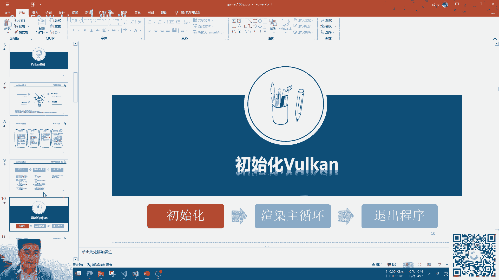

这个地方其实跟OpenGL不太一样的地方就是你的窗口类型Worker是需要知道的，比如说你的窗口是Win32建的，还是XCB建的，还是VLAN建的，还是Mac上的那个什么东西建的。

因为Worker后续在创建Swapchain的时候是需要这个信息，然后来选择对应的扩展，才能建出我们想要的Swapchain，然后比较好消息的就是SDO，GFW这些窗口的窗口可以很方便的获得这些信息。

包括窗口的类型，然后包括怎么去建Swapchain之类的，它都可以帮你去实现好这些功能，可以帮助你去初始化Worker，这个就像GFW里面去初始化OpenGL的上下文一样。

其实你真的去看一下它的OpenGL上下文创建的话，其实还是挺复杂的。

然后我们再来看一下我们的Worker的一个整体的一个概念，我们的Worker的话，我们先看我们这个右边这张图，有一个应用程序，建了两个Worker实例，第一个Worker实例建了两个物理设备。

然后第一个物理设备有一个叫逻辑设备，然后第二个物理设备建了两个逻辑设备，然后每个逻辑设备有一些对列，然后我们的汇字命令就CMD的buffer是扔到了对列里面去了。

然后这个是一个相对来说非常复杂的一个Worker的使用情况，很多时候并没有那么复杂，很多时候我们只有一个实例，一个物理设备，一个逻辑设备，然后对列可能也只有一个或者是多个。

但通常情况下其实一个大部分情况就是够弄了，但是呢我们要回头想一下，我们Worker它在设计的时候为什么要设计的这么复杂，其实你想一下也比较容易理解，就是说当你有四块4090，你想玩游戏的时候。

就是我们以前说的四路泰坦，现在就是四路4090，你怎么去操控，让这块显卡干这部分的活，这块显卡干这个事情，让另外一个显卡干另外一个事情，让每个显卡都能够尽可能的去充分利用这个事情，你怎么做到呢？

OpenGL告诉你，很困难，但是Worker呢，你可以对应的物理设备，当你有四块4090的时候，其实你一个实例能够query出四个物理设备，然后你这个实例可以去选择这个物理设备，比如第一块显卡。

第二块显卡，第三块显卡，第一块显卡，只用来做物理模拟，我拿它物理模拟结果扔给了第二块物理设备，第二块物理设备纯粹做渲染的某一部分，然后第三块再去做某一些事情，然后最后的一张显卡，那张显卡专门只做渲染。

把那个渲染出来的结果给画上去，那么这个时候你所有的显卡都会丢了。然后有人问为什么一个物理设备会出现多个逻辑的Working Device，这个一个逻辑设备你可以想象成其实是对于一个对立的实例化。

或者说我们真正的API其实传输给的是逻辑设备，并不是物理设备，所以说你的逻辑设备的时候它会去，后面我会提到它那个对立其实是有不同类型的，我这个逻辑设备的对立只用来计算图形管线。

那么OK我所有的图形管线命令我得扔给它，我后面的对立假如我只是用来计算computer shader，就是那个什么计算注册器，就类似于CUDA之类的这样子的东西，那么我所有的命令可以扔给它。

但通常情况下我们并不需要去做这种事情，因为我们只需要有一个这样的多个就可以了，也有人问有多个Working实例的用处是啥呢？这个目前我也不是很清楚，因为我也没有遇到过我需要多个实例的情况。

大部分人来说游戏场景或者人类场景OK我一个实例就足够了，不需要那么多的实例了，所以说我们只需要考虑这种情况就可以了，但是Worker呢我们要明确知道Worker它是设计的，可以让你来做这种事情。

然后有个说那个一个逻辑设备有一个逻辑设备不是可以有多个对立吗？对这是可以有多个对立的，但是每个对立它会有它的功能的限制，不是所有的功能都可以在所有对立里面去运行，对立跟对立其实不一样的。

这个我下面的PPT会讲，然后我们再来初始化Worker，然后初始化Worker呢这个会有一个比较重要的概念叫layer，就是层，我们一个application。

然后我们要去载入Worker的库会有个load的过程，然后这个load的过程不是直接载到那个驱动上，而是要一层layer一层layer，然后载下来，然后最后再到驱动层。

然后所以说我们见到Worker instance这个东西其实是初始化Worker库跟我们的程序之间沟通的一个桥梁，然后我们需要指定的一个通常我们需要指定的是swipe chain的一个类型，这是个扩展。

有些时候其实你的Worker是一个离线渲染的功能，其实你就不需要这个功能了，然后第二个比如说你有些扩展你想要去做调试，你想要给每个Worker起一个大家能懂的一个名字，比如说它叫纹理一。

这个纹理叫颜色纹理，另外一种叫什么法线贴图，当我想要给它们设置这种功能的时候我们就需要开启一个可调试的一层，然后最后是比如说我检查我的Worker调用错误了，在OpenGL下面就非常麻烦。

只会通过一个GL error去猜你可能调了什么错误，Worker它会有一个错误调用的回调，然后这个回调函数也不是Worker的核心驱动中的一部分，它也是一个外置的一个检查的层。

然后这个地方比如说我们可以看到Worker将很多功能拆到了不同的层里面了，然后我这边下面举了两个例子，一个是用于检查错误的一层，它的名字叫这个，然后第二个是renderDocker。

它是一个Worker的一个GPU的调试工具，它不光能调试Worker了，它的第三DOpenGL它都是可以调试的，然后这个是它自己做的一个层的名字，那么换句话说，其实我们每个程序你如果可以的话。

你都可以自定义一个自己的一层layer，然后把那个layer让你的Worker程序跑起来，然后这边是我们的相关的API跟作业代码。

后面大家如果课后大家有兴趣的话可以去关注一下Worker的这些API跟它的命令，然后我们刚才说了层，那么这个层到底是干什么的呢，我们的想要初始化Worker有一个函数。

比如我们这边要读那个function ABCDE，那么layerA它是重写了ABC三个函数，layerB它是重写了CDE三个函数，然后最后我们的接口肯定也是有ABCDE这五个函数。

那它的意思是当我loader我去调用了worker function A的时候，我还是取C吧，它调用了worker function C的时候，它会首先调用layerA的function C。

然后layerA的function C它的程序结束之后呢，它会去调用layerB的function C，然后再去调用最后真正的接口的那个function C。

换句话说其实我们可以把这个layer当做函数重载来理解，它其实是提供了一个函数重载的一个方式，或者叫hook，对，OpenGL的hook会很麻烦，对吧，然后WorkerOK，你们都喜欢hook，好。

我提供一个官方的方式让你们去hook，这样子你们所有调试工具，你们就可以很自由自在的去hook了，你们调用的所有的Worker命令都可以记录下来，你们自己想做任何检查都可以了。

以前在OpenGL调试的时候，经常喜欢干的事情把你所有的OpenGL的命令把它打印出来，包括时间，线程什么之类的，这个时候如果你有兴趣，你就可以自己建一个自己的layer。

然后把所有的OpenGL的命令把它hook做，根据线程，根据时间戳，然后把所有的Worker的调用给打印出来，当然官方是有提供这样的一个方法，这个就是Worker的一个layer的一个概念，OK。

然后下面我们Worker的instance，我们已经跟Worker的驱动区的联系了，后面我们就要跟显卡，我们真正的硬件设备区的联系，这个时候Worker需要有一个去query出我们硬件设备的一个功能。

然后Worker可以去query出我们硬件设备的名字，你这是什么显卡，什么显卡，然后你的能力是能干嘛，能干嘛，然后比如说我的电脑是两块显卡，一块是AMD的显卡，一块是英伟达的显卡，OK。

那么我现在直接运行一下。

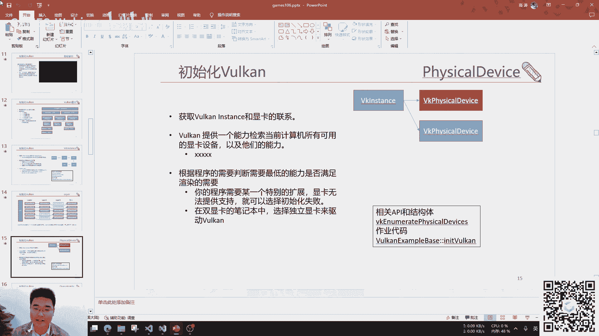

好，这个时候我们query出了我们的第一个显卡，这个就是我们第一个显卡的名字，一张3070的显卡，然后这个limits这个对象就是它的所有的限制，它有多少张，它图片的分辨率最多是多少。

或者是所有的vertex的输出是多少，这个每个的限制一般来说会不太一样，然后官方会有一个就是会要求你的驱动支持的最低，就是最低的限制是多少，不过这个最低限制呢，话说回来也是看驱动实现的。

不是每个驱动都老老实实的按照这个最低限制来做的，有些它声称它实现了，其实并没有，然后我们再去query出我们的第二张显卡，好，我们query出了我们第二张显卡，第二张显卡是AMD的一张核心显卡。

如果你仔细去对比的这个限制的话，你会应该可以看到它这个限制是会比那张独立显卡会小很多，也就是说它的能力会更弱，然后我们在程序提供的时候。

我们要根据我们的能力然后选择合适的显卡，当然我们在做游戏的时候通常会喜欢去调用那张独立显卡，但也并不是所有的都是想要调用独立显卡的，比如说我的程序比较轻量级，为了节约能耗我可能就无所谓。

我可以选择一个我的核心显卡也是可以的，然后刚才有一个同学就问，有去问那个这个对立，明明我一个我一个实际化也能用很多对立，那么为什么我还需要有这种有不同的那个逻辑的，是因为对立的那个它会有一个处。

它那个或者叫做quick family，这个处呢，它会它的能力是不一样的，然后每个对立处呢，只能允许部分的这的操作，比如说它可以实现那个渲染功能，实现计算折射器相关的功能。

它这个可以支持复制复制buffer，就做拷贝的这个功能，然后并不是每一个对立都能够实现所有的功能，有些对立只能实现部分，有些对立可能是另外一部分，有些对立是另外一部分。

也有可能它这个硬件实现就没有一个对立能够实现所有的部分，这个时候你就需要根据这个对立不同，然后来做这个操作，然后包括你的那个swap buffer，就你汇集到东西画到屏幕上去。

也需要那个对立处来实现这个它能够支持的功能，你才能够用那把这个命令扔到那个对立处的那个对联里面去，OK，然后我们这边可以看一下我们的对立处。

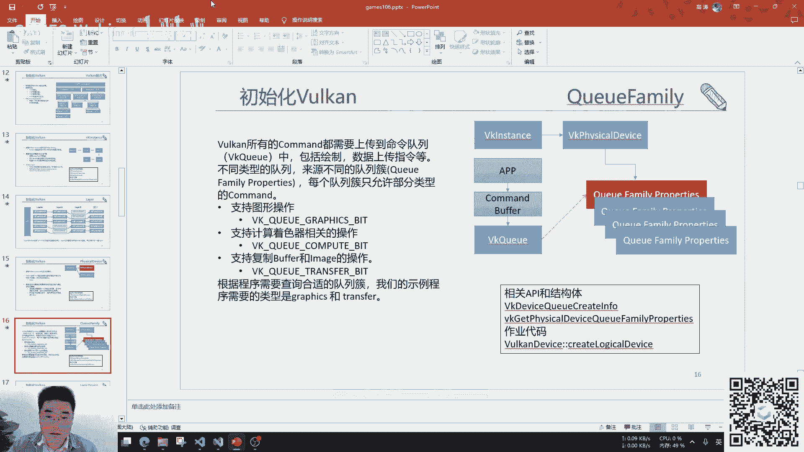

接触。嗯。嗯。嗯。(自言自語中)，(自言自語中)，(自言自語中)，(自言自語中)，(自言自語中)，(自言自語中)，(自言自語中)。

(自言自語中)，(自言自語中)，(自言自語中)，(自言自語中)，(自言自語中)，(自言自語中)，(自言自語中)，(自言自語中)，(自言自語中)，(自言自語中)，(自言自語中)，(自言自語中)。

(自言自語中)。

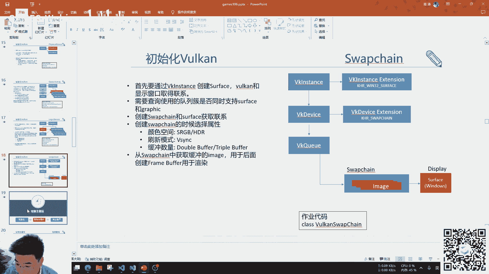

(自言自語中)。

(自言自語中)，(自言自語中)，(自言自語中)，(自言自語中)，(自言自語中)，(自言自語中)，(自言自語中)，(自言自語中)，(自言自語中)，(自言自語中)，(自言自語中)，(自言自語中)。

(自言自語中)，(自言自語中)，(自言自語中)，(自言自語中)。

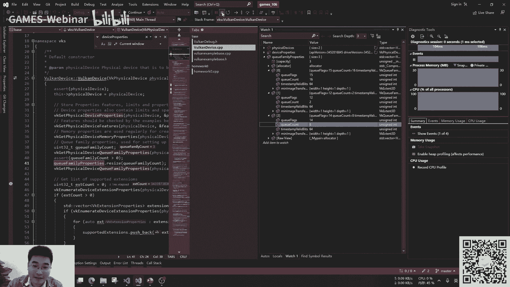

(自言自語中)。

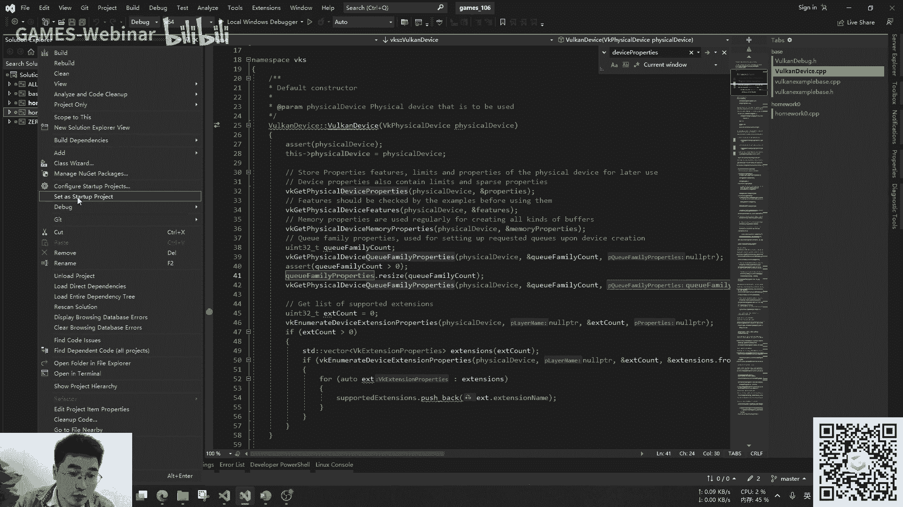

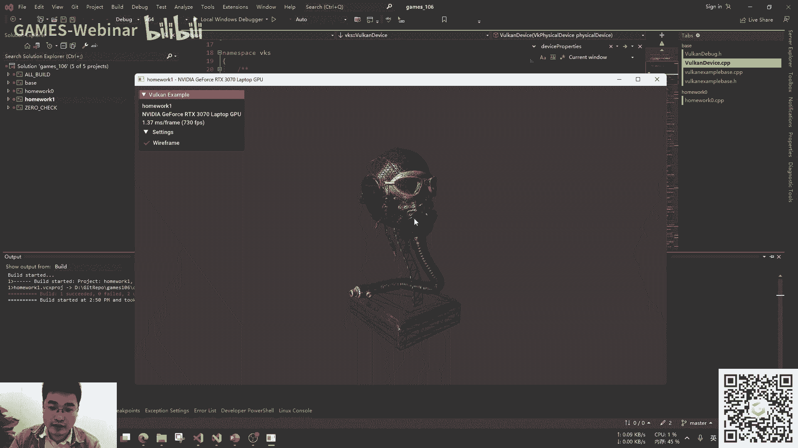

(自言自語中)，(自言自語中)，(自言自語中)，(自言自語中)，(自言自語中)，(自言自語中)，(自言自語中)，(自言自語中)，(自言自語中)，(自言自語中)，(自言自語中)，(自言自語中)。

(自言自語中)，(自言自語中)，(自言自語中)，(自言自語中)。

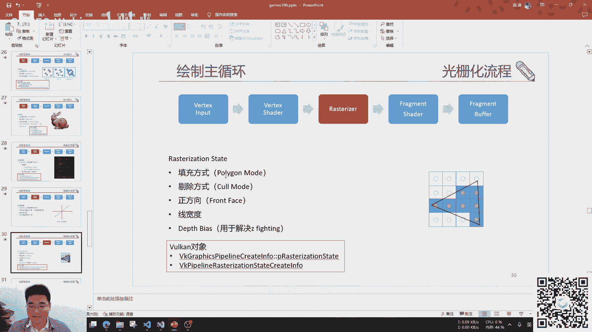

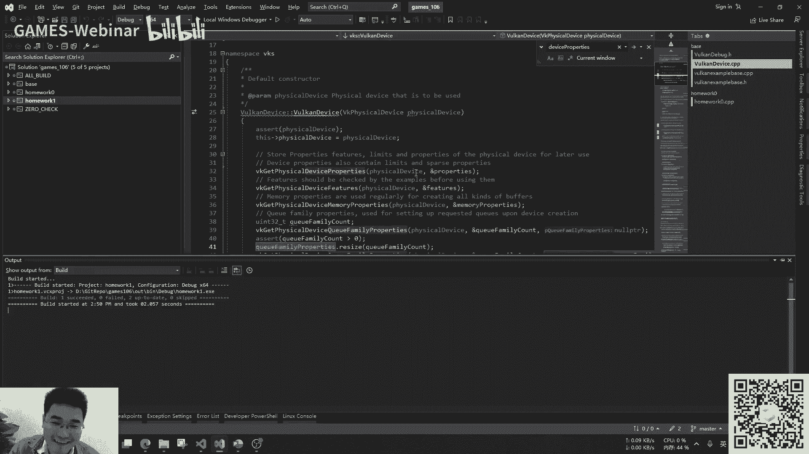

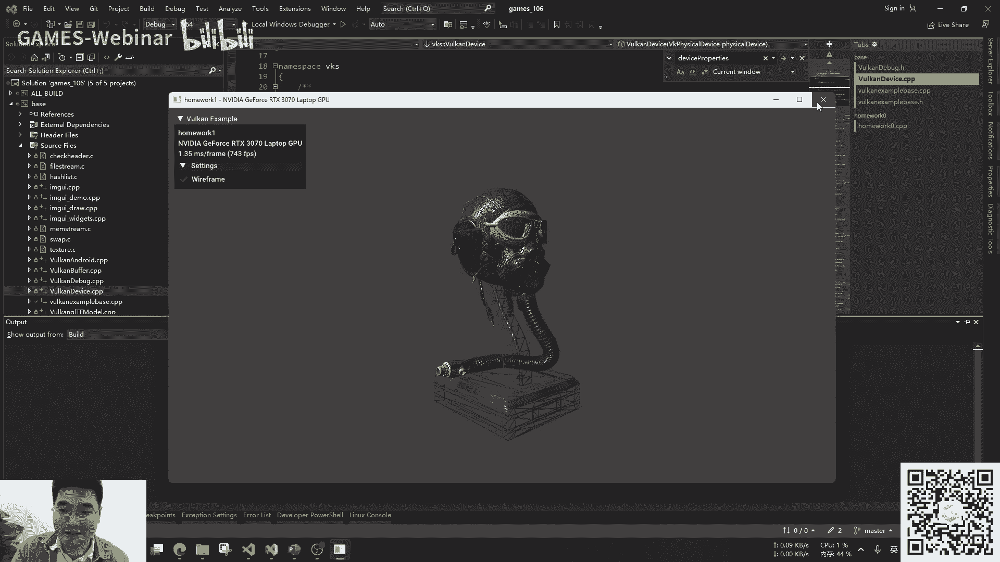

(自言自語中)，(自言自語中)，(自言自語中)，(自言自語中)，(自言自語中)，(自言自語中)，(自言自語中)，(自言自語中)，(自言自語中)，(自言自語中)，(自言自語中)，(自言自語中)。

(自言自語中)，(自言自語中)，(自言自語中)，(自言自語中)，(自言自語中)，(自言自語中)，(自言自語中)，(自言自語中)，(自言自語中)，(自言自語中)，(自言自語中)，(自言自語中)。

(自言自語中)，(自言自語中)，(自言自語中)，(自言自語中)，(自言自語中)，(自言自語中)，(自言自語中)，(自言自語中)，(自言自語中)，(自言自語中)，(自言自語中)，(自言自語中)。

(自言自語中)，(自言自語中)，(自言自語中)，(自言自語中)，(自言自語中)，(自言自語中)，(自言自語中)，(自言自語中)，(自言自語中)，(自言自語中)，(自言自語中)，(自言自語中)。

(自言自語中)，(自言自語中)，(自言自語中)，(自言自語中)，(自言自語中)，(自言自語中)，(自言自語中)，(自言自語中)，(自言自語中)，(自言自語中)，(自言自語中)，(自言自語中)，[终结]。

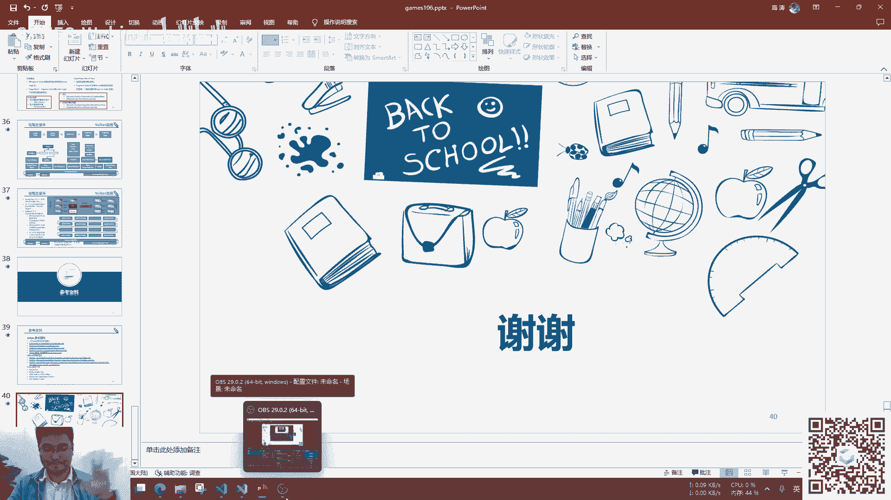