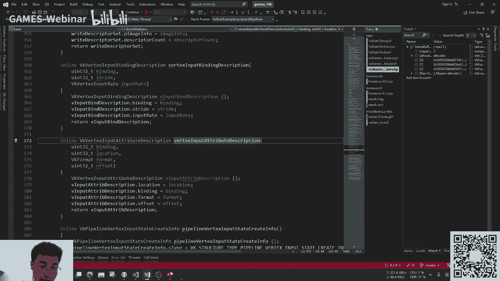

# GAMES106-现代图形绘制流水线原理与实践 - P3：3. 图形绘制流水线的基本原理与实践(二) - GAMES-Webinar - BV1Uo4y1J7ie

我们进入到那个会诊流学原理的第二课时，然后我们来回顾一下我们的课程安排。

我们的第一课时是讲那个working的，基础架构和流程绘制，然后第二课时就讲working的创建对象，对象创建内存管理以及调试的方法和工具，然后我在下周三的这个时候，会讲那个walk的多线程同步。

还有一些基于移动端的一些常见优化和实践，ok然后现在呢我在群里面看到有反馈，大家对于这个作业会有点疑问，然后我现在就把那个作业讲一下，我们的这个第一个作业吧。

然后大家可以看一下我们的作业框架，啊，大家记得在下载那个呃代码仓库的代码的时候，记得把那个敲一下。

那个git的时候，把这个sone video也一起拉一下，就是git 3红酒update，把这个我们的那个有些第三方库，是以那个3v6 的方式然后拉下来的。

然后我们来看一下那个homework一的那个作业要求，然后这个要注意一下，是我们要去下载一个这个文件，这个文件应该有有同学在那个有同学在那个games，那个我已经在qq群里面已经放了，ok已经放了。

大家把这个东西解压到这个data文件夹里面去，然后就可以了，然后呢，我也把那个我们需要做的模型给倒了进来，大家可以看一下这个模型，如果真的乱起来的话，大概是会有一个这样的动画，这个模型是带骨骼带动画的。

ok然后大家如果有兴趣的话。

也可以看一下这个模型的原作者是在呃，然后在这个网站上会放一个页面，我等下再来看吧，这里网速好像有点慢。

然后我们的作业要求呢是有那么几个，第一个是我们的homework，一只是读了一个g o t f，但是个静态的，而且只有颜色作为那个材质，而且他的那个比亚迪f也不是pr的，比亚迪f实现也是有点问题的。

只有一个一个有一个方向光，所以说我们这个作业要求呢，第一个是嗯，一个是jo tf已经上传到我们这个地方去了，然后我们的代码也是有。

然后我们运行一下我们的代码，我们看一下，现在我们运行起来的是，是一个怎么样的效果。

ok我站的是个静态的，大家可以看到这个动画低帧的那个效果，然后这个贴图也是不正确的。

因为我们的这个材质里面是，就没有实现对应的功能，它的写着，我们可以看到，它只实现了一个非常简单的一个嗯，应该是个缝魔性吧，对看起来应该只是个简单的缝模型。

然后所以说我们这个要支持gtf的那个，骨骼动画，然后第二个呢我们要支持就tf的pp r材质，包括他的那个法线法线贴图，还有一些p8 的那个贴图，然后这个作业要求呢。

一定要在那个homework一的基础上做修改，然后不要提交其他框架或怎样的代码啊，这个我呃毕竟这个是个课程作业嘛，我因为我们在第一个课时提交作业的时候，就发现有同学上交代码，其实是来自于其他框架的。

那啥框架，可能有一些框架已经做了这个事情，但是嗯我还是不建议大家去直接用吧，然后然后直接上来就可以了，然后最后呢这是一个进阶的作业，增加一个一个tom map tomap函数，就是下面写的一个函数。

输入是一个颜色，输出是一个颜色，ok然后函数是直接在这里已经有了，大家就增加一个额外的一个lpass来实现，不要把这个函数写在我们的这个fragment，shader的最后面。

就不要在我们的这个函数shader里面去去实现，就这里增加一个通，对，不要通过这种形式，一定要。

然后我来增加一个pass，ok。

这个就是就是这个模型真正产之后的样子，就是他用了pp材质之后，还加上黄金光，有一些必要的方向光，然后有阴影，但我们作业没有要求有阴影，有兴趣的话，大家也可以做一下，ok然后。

可以啊，然后下面的一些是一些实现这个东西的，一些资料，大家可以在这些一个人口里面去找到，找到我们的代码，看一下对啊，找到我们的示例代码，然后这个jo tf skin，就是那个如何读骨骼的一个示例代码。

然后有个p p r base，是基于那个方向光的一个p r的实现，然后还有一个example的p b r i d l，是实现那个p br的那个环境光嗯，然后怎么运行这个代码呢。

可以在我们的这个作业框架里面。

把这行注释给解掉，那么它就会可以出现，那么我们的那个座椅框架里面，就会就会出现有对应的那个sample，然后运行对应的sample就可以了，在这边会有对应的sample。

我们去运行对应sample就可以了，ok，我再把它改回来嗯。

大家可以在这边有些截图，可以看到一个p bi的i b o环境光，一个是p bi的那个方向光，它这边是做了四个方向光，然后还有geo tf的skin骨骼动画，ok那么这样子的话。

我们的课程作业就基本上完整了。

然后你还增加一个额外的一个pass，专门用于颜色的那个线性颜色的转换，ok这个就是我们的那个作业的安排。

跟那个作业的那个要求对了，然后关于g o t f里面的那个骨骼动画的描述，我们可以在那个p br里面的。

我们可以去看下，极有天赋的官方文档，里面有关于那个谷歌相关的描述，这里就是谷歌相关的描述，还有关于材质相关的描述，嗯所以说我们下面的作业要求，其实就是在这个地方一个载入，就贴服里面的骨骼相关的。

然后发现自发光，还有等一些批量的贴图，然后再次扩展一下我们之前的那个渲染的shader，然后再扩展加一个额外的pass，ok这就是我们那个嗯homework 1。

这个homework一工作量应该是有一点大的，我觉得但是嗯大家如果是写一遍，再有就知道这个working的具体代码怎么来实现了，ok然后再回到我们的这次的课程，然后这些课程是创建working对象。

然后walk内存管理，第二部分，第三部分就是working的绘制，然后第四个就是相关的调试工具，还有一些方法，然后我们来看一下working的对象创建，这个是上一个课时就会已经讲了。

我们整一条那个渲染管线，然后这个渲染管线呢，我们每一个阶段呢，其实都会有对应的那个working的对象，就可以主要是这些对象，一个是free buffer，一个是buffer和image的。

一个给那个线绘制管线的输入，一个叫pipeline，是用来定义你的嗯，你的这个绘制管线，还有一个提高标的叫做描述及describe，described set，这个东西就是用来传递你的uniform。

给那个绘制管线的，ok然后我们来看一下walking的这个函数接口，working，后面所有的函数基本上都是这样的一个风格，比如说嗯他们一般来说你要创建一个对象。

那个函数都是vk create object，object，可能是个buffer，可能是一个memory，也可能是可能是个buffer，可能是个tag，image，可能是个pipeline。

所有的都是有可能的，然后然后在我们创建的时候呢，它会需要有一个描述符，然后来定义你，你去声明好，你聊创建的资产的内容跟一些信息，然后它的倒数第二个参数，一般来说就是一个自定义的一个。

allocal的一个对象，这个不同于open 9，open 9，你去申请了一个对象之后，这个对象的管理其实是驱动帮你做的，然后worker呢你可以用一个默认的一个，就是我可提供一个默认的那个构造器。

就是你传一个空指针进去了，就是在这个地方，就是这个你可以传一个空指针，那么它就是一个默认的一个一个对象方法，当然你也可以自定义和内存管理，那么所有的worker的总体内存的创建和释放。

都是由你自定义来的，然后下面这个流程是我可能如何创建一个buffer，的一个流程，然后创建image跟buffer那个流程是一样的，只不过image他会稍微复杂一点，因为image有miss map。

有一层一层一层的这种概念，ok，然后我们这边的buffer呢是建了一个uniform buffer，大家可以看到嗯，啊大家可以看到一个是uniform buffer，然后然后还有buffer的大小。

这个其实是声明你这个buffer是干什么用的，然后你这个buff想要多大，然后这样子去获得了一个buffer的句柄，然后它的返回也是把那个buffer对象的指针，作为最后一个参数传进来，也就是说。

其实一般来说，你所有的worker的创建者对象的函数，都是基于这样子，第一个参数是呃，local device，就是vk device，然后第二个是你要创建对象的那个结构，描述它的结构体。

然后再是一个自定义的那个构造器，然后说自定义的内存分配器，然后第三个就是你真正要创建那个对象的，那个句柄的地址，ok然后我们在这样子创建了一个buffer之后，然后第二步我可能是需要你去知道你这块内存。

可能会占用了多少，这个我为什么要说可能呢，那有同学就会问，我明明已经在buffer里面声明了，你这块buffer要有多大，那么为什么welcome这个地方会还是需要去，或许他真正需要占用的很多时候。

其实是因为我可能为了一些嗯，优化它那个内存是需要对齐的，一般来说像uniform buffer，至少是四个浮点数对齐呃，也就是说你的这个办法，可能只是一个浮点数的大小，比如size of 5。

一个一个float，那么真正申请到的其实是四个flow的一块大小，当然这个也是有可能，只是可能具体实现要看working的，具体的驱动的实现，ok然后第三块，当你获得了这块buffer。

需要创建的内容有多大的时候，第三个就是你要去分配这个内容内存，然后你去分配内存的话，你要去实现好你的那个分配内存的大小是多少，这大小就通过那个vk memory呃，呃requestment的。

它的返回的结果告诉你这块内存有多大，然后后面的第三第四个参数，可能暂时大家不知道，后面我会来详细解一下，在后面的那个内存分配那个模块，我详细写一下这个语音是什么意思，然后这个知道了要分配多大内存之后。

我们就可以用walker的这个命令去分，去创开辟这么一块内存，然后最后是把我这块内存跟你的那个buffer，去做绑定，这里的最后一个参数是offset，因为这边的内存跟那个八核大小是一一对应的。

所以说这边是零，ok这个就是working创建一个对象的一个方法，在他的这个逻辑下面，就说他返回的这个relt，是跟类似于open geo的g o check error，以及它如果这个函数调用成功了。

他会告诉你这个他的result是成功了，如果有错误，他会告诉你对应的错误，然后他们所有的返回，都是通过你的那个句柄的指针对象，给它塞到最里面去，然后作为返回的结果，然后所有的对象的创建。

你都可以自定义那个内存和微信，也就是所有的内存你都可以自己来管理，这边我说的内存是指的是cpu的内存，并不是gpu的内存，因为gpu的内存我们可以看到在这个地方。

他并他的是他这边的gpu的四方申请的时候，我们用到了这个内存分配器，其实指的还是指的是这个walking divorce memory，这个对象的创建和释放，并不是gpu的那块。

然后gpu那块我们会在后面讲到，我可是有一套的一个方法，ok然后接下来我们看我们的第一部分，我们的render pass，然后我们render pass这个这个对象其实主要是混乱，pass。

这个定义的是描述的这个pass中，绑定的learn target有哪些，然后有哪些绘制阶段，然后需要值，然后让pass需要执行哪些操作，比如说就是上节课时我们讲到的这个，我要会知道哪些纹理上去。

这个我是否要写进去，然后纹理出来的东西我是否要漏的。

或者discuss掉，ok我们现在可以回过来看一下我们的代码，我们直接运行我们的homework 1，我们homework一的那个prepare，the working example。

prepare里面有一个这个set up和repass，这个阶段就是嗯初始化learn pass的地方。

我们可以看到嗯，我们看到我们render pass 7主要是定义了两个东西，一个是attachment describe，然后一个是定义的那个south past descript。

然后attachment described，其实它定义的就是你的输出的，你的输出通道的格式是什么，到底是rgba的还是什么深度还是什么y u v，然后你的输出是load的还是还是嗯是要漏的。

还是store还是discut，还是要clear，然后在渲染开始前后的一个布局，这边会有个概念比会比较重要，叫working vk，imajor layout，这个布局它其实是一个内存的布局。

就说我这个我这张图在不同的纹理，不同的作用下面，我的内存布局其实是不一样的，嗯但是我但是我们在作为一个初学者的时候，我们就可以简单的把它当做一个状态来考虑，就可以了，比如说我现在在绘制。

那么我在绘制是有个布局的，我现在要做内存的拷贝，我在内存拷贝下面我是有一个状态的，有个布局，然后我现在要把它画到屏幕上去，ok那么它又是一个一个状态，一个一种一种layout。

然后sub pass described呢，它是指像具体的你的这个shader的pass，它的输出到底是多少，它这边会有个指针指向了那个通道，纹理通道的输出的数组，指向这个纹理通道的输出的数组。

然后然后他soul pass呢，其实那么它的名字叫soul pass，其实理论上来说它是以他也是一个数组，它可以有多一个pass，我们在一个乱的pass下面有多少pass。

好多xcel pass之间呢其实是有依赖的，你嗯是我可能有些依赖，我可以自己算有些work，依赖呢我可不能自己算，那么这个时候呢就需要有一个依赖关系，用它来证明，来用它来声明那个working。

多个pass之间的互相的依赖，嗯当然我们现在我们的课程的homework 1，每个learn pass里面只有一个操作pass，所以说这个其实并不需要，只要设置一个nn就可以了。

ok我们回到我们的代码，我们的那个homework一它里面的会有两个，我们可以看到它，attachment是设置了两个attachment，这两个attachment。

第一个attachment它是个颜色，也就是我们画到屏幕上的一个颜色，就是swab chen的颜色，其实是我们可以直接看到他这边，swab chen的颜色是rgba的。

然后第二个是它那个深度的一个颜色是d，32呃，s float s8 u int，然后我们可以看到他对于定义了一个load，op是clear，意味着我这张图我在会之前，我什么什么都不要，然后stop。

我要把它写回去，当那个深度也是这样子的，然后他这边就会有一个叫做layout lout，这个东西，就是说我在这张图的状态，进入到我这个lunpass之前，它是个什么状态。

然后我扔了80之后又是一个sevi的状态，ok我们这可以大概的吕布下，这是我的所有的image的状态，这是利奥特叫做其实布局，但是我建议大家以一个状态的概念去理解，这个这个东西啊，不要去布局。

事实上它不同的状态，它的内存的排列方式是不一样的，但是我还是非常建议大家，以状态的方式去理解它，而不要用我可真正的那个他设定的，那个官方说的那个布局去设定，因为我觉得这个布局设定太太复杂了。

大家要需要walking的概念已经很多了，需要化繁为简一点，ok然后我们这边定好了我们的attachment，然后再定义sao pass，然后sao pass呢。

他们这边呢我们有一个颜色的attachment，它就会引用我们的sao pass的数组第零个，然后绑定作为颜色，然后深度的the attachment，绑定了我们数数组里面的。

是下标为一的一个attachment，然后它的深度就是一个深度的一个一个选项delete，然后我们再位置好差pass之后，我们再把它可以绑到我在pass里面，这个learn the pass的创建里面。

ok然后他这边也定义了一个相互依赖，但事实上我们这个pass其实非常简单，其实可以不用设定，然后但是我的框架是写了这个，这个相互依赖的一个关系嗯，ok然后这样子我们就可以去创建。

我们的walker creator ra pass，我们可以看到它也是一样的，第一个参数是logical device，第二个参数是那个创建的那个描述符，第三个是内存分配器。

你可以设置为空用默认内存分配器，第四个就是你想要那个创建的对象的句柄。

ok，这个就是我们的render pass，这个概念呢在open g下面，其实就是我们的render target是羊杂，然后第二个就是我们的缓冲区，呃这个呃不对，run pass，这个东西。

只是讲的是我这个pass的输入的一个格式，但不是真正的那张输出的东西，然后framebuffer，它定义的是你真正需要输出的那个东西，它定义的其他蛮简单的，就是说我的输出的那个真正输出是谁。

image view，然后我想要输出的宽高layer，这个layer其实是指的是多少层，这个东西在2d的话，一般这个layer就是一层，假如说是张3d纹理，那么它可能是有多层的一张3d纹理或者qq吧。

立方体纹理，那么它的内页就是六层，ok我们再来看一下我们的代码是如何去建立。

我们的，是如何建立我们的lpath，如何创建我们的free buffer，ok他这边就我看的非常简单，然后他这个free buffer里面，如果有一个在switch里面本身就有的一个深度图。

一个一个深度的那个texture，然后绑定上去，然后设置好宽高，然后设置好你对应的runpass，这个run pass，就是一般来说可以用，我们刚才创建的那个render pass。

ok然后你再把那个颜色根据那个深度，就是swap chain里面的那个，一般来说是双缓存或者多缓存的方式，然后把它绑上去，然后我们这边可以看到这份实现的话，所谓chain里面的他image有三张图。

也就是说我们swap chain里面是个三款存，然后所以它会有个三个framebuffer，然后每个framebuffer的绑定了attachment的，第一章的image，就是颜色，那张图。

就是对应着每一个swap chain的每一张图，那么我们这边对应的也是有三个free buffer，我们在这边成功创建之后，会有三个free buffer的一个大小，ok大家可以直接就可以看到。

在这边会创建出三个free buff的句柄对象嗯。

ok然后下一个下一个是我们要下一个阶段，我们要绑定wett跟index buffer，那么这个操作时候，我们就会用到一个叫做八分的概念缓冲区，那个缓冲区区，然后缓冲区如果创建，我们在刚才已经有提到了。

就刚才在这块区域区域里面有提到，如可能创建一块buffer的一般的流程，然后呢，你这个buffer呢，有的时候要真正的被用到的时候呢，它需要有创建一个叫buffer view的一个东西。

buffer view就是巴赫的视图，就是说你这个东西buffer其实是一个数据块嘛，但是你这个数据块要如何在被着色器中被使用，就需要一个view，它是同样一个数据库内存，你可以把它当做。

比如说都是r g b a8 位，你可以把它当成一个八位的整数来看待，你可以把它们当做归一化过的整数，就是说呃0~255对应的，0~1这么一个概念，0~25对应0~1点零。

这个就是归一化过的一个一个buffer，当然你也可以这样子去作为一个试图去看，然后这个事情呢在纹理image上也是同样的的的的，方法，可以去你去去去做，然后他还可以去定义说你这个buffer。

只是说我在shader中作为一个输入，uniform，还是说我作为一个输出，还是可以作为输出，一般来说输出的话，在我们的图形绘制管线是不会有的，一般来说是在那个计算绘制管线里面会用到，可能它是一个输出。

然后最后最麻烦的，最后一块是我们的working的pipeline的创建，ok这个walking pipeline，我这个图我不知道大家能不能看得到这个图，我是直接从西瓜那边去拉了，就就没有自己做了。

太太麻烦了一点，大家可以看到他就是我，我在上一个课时就讲到了，我们的整个绘制管线有这么多阶段，有这么多描述，那么你的papa里面，要把所有的这些描述都定义清楚，包括你的那个你的vertex的输入。

包括你的这个vertex输入，然后包括你怎么做光栅化的这个深度，怎么检测，怎么颜色混合，然后你的papa layout，就是你的那个uniform是要怎么设置的，你的render pass。

你的这个pass的格式是什么，这里我给大家提醒一下，我肯拍拍案里面的learn pass，虽然说他这个对象，但是其实他并没有用到这个pap rpath里面，所有的属性。

比如说run pass里面会定义那个，你经过这个pass里面的纹理的layout，然后你的这个呃load operate或stooperate，你的load operate或stoperate。

然后然后去去就是你的这个进入这pass里面，在文笔的撩的是那个布局是什么样子的，结束这个pass之后，你在文理的布局是什么样子的，这些都是会忽略掉的，这些不会侵入到我们run pass里面。

ok然后我们来看一下我们的代码，我们来回看一下我们的pipeline，ok我们来看一下我们的pipeline，这个是怎么实现的，放大一点，呃其实基本上就是说把cc所有的状态，你都要写下来。

然后你得清楚的知道这些状态是干什么的，然后根据你的那个pass的需求，然后来设置好你的状态，然后这边它定义了是呃，有那么几个可能我之前没有讲过的，一个是你的这个顶点顶点的排布。

这边它定义了有四个顶点属性，然后每个顶点属性都是绑到了第零个，然后我们可以直接看我们的实现的shader，这定制了四个点属性，分别是位置，然后法线uv，然后颜色分别是三个三个两个浮点数，三个浮点数。

ok然后就是在这边会定义是rgb rgb rgb rgb，那么有同学就会问了，你的那个uv明明是只有两个浮点数，为什么你这边需要三个浮点数呢对吧，这个，对吧，这个，嗯这个东西的话其实是没有那么严格。

其实就是只要你声明了是这样子的，然后告诉你这个偏移是多少，然后然后你我们的这个shader，只要是能够对它做兼容的那个其实就可以了，并并没有说我那么严格，我外面cpu端写了两个字。

再说里面也一定要是两个，它它它并不是这样子的，你外面可以写三个浮点数，然后你现在里面写了四个浮点数，它们对应的其实也也是可可可以的，ok然后下面的你我们定义好了，这个vtx的输入样板。

然后我们再编译我们的shader，定义好了shader之后，定义好我们的shader stage，就是我们的vertex shader跟我们的那个flavender。

这两个shader呢是他已经是那个翻译好的，那么就呃有没有翻译好，这个是等于说它编译好的一个系的呃，但是我们自己要改了我们的代码，我们框架呢是没有，这个就是生成这个新的binary的这个流程的。

然后我这个时候要，哦有同学这个问了offset不会歪吗，这个地方我大概也好，我得我得详细的说一下，这后面的offset其实指的是你的cpu端的offset，只要你cpu端的数据。

他告诉你这边是三个浮点数，三个浮点数，两个浮点数，三个浮点数，至于你的那个嗯，他这边是第三参数是什么呀。

你的formula其实是关系没有特别大，你只要是对得起的，其实就可以了，嗯然后我来看一下大家怎么去呃。

怎么去编译这些的，然后大家应该都已经装了那个worker的，呃walking sdk，我们在working sdk的这个32位。

64位，我们在64位，这个地方可以找到我们的新的编译器，ok这个地方我们有一个叫做d xc，这个是听名字就知道他是一个direct x的编译器，h l s l，它是一个微软开发的那个地差的一个编译器。

但是呢我们也可以用它来编译那个walker，然后我们就拿我们的作业一的这个，这个写的来编译一下，然后这个写的是一个d差的h o s o，然后我们只需要d叉c，然后声明那个入口函数。

我们这边的入口函数是may，没然后再把路径给打进来，然后再是一个t告诉你这个是个什么，写的是我们这边是用的pixel，然后用sm 60的标准，这个标准其实是一个那个d差的一个标准，然后我们再加选项。

spi告诉他，我们是需要编译一个working的一个shader，ok这样子出来我们就可以看到了，我们编译出来的working的这个蝎子，这个蝎子看上去这是它的那个嗯，当然我们真正要用到的是个二进制的。

但这个是一个文本的方式，然后来展现给我们，然后这个写的看起来就不是给人类阅读的对吧，其实它跟汇编很相似，它每一行是表示一个命令，基本上你可以把它当做一个汇编来看待了，然后我们这个时候呢。

我们要升级成二进制对fo，然后，ok那这样子，这个就是我我现在生成的一个walking的binary，我们可以二进制看一下，其实这个就是我新生成的那个。

用h o s l c生成了一个shift的binary，然后我们再来看一下我们那个vtec学的，怎么去生成呢，也是一样的，我们把那个打开我们的vtec的，它的入口函数呢是叫也是may。

所以我们这里就不用改了，我把这个改成mtt杠t，然后是是个vs，我才学的，ok然后这个就是我们根据他的这个系统，生成vtx的，然后呢我们在这个工具里面呢。

其实还有几种新的编译器，一个是g o s o c嗯，还有一个是gsl了，这两个系列的编译器的话。

大家是编译h o s j s l的，有兴趣大家可以看一下他的那个文档，它的文档怎么看呢，其实你只要把它编辑器拉出来，然后杠也取一下，哎，我操杠一去下就可以看到它这个是怎么使用的，一般来说也是这样子。

你要定义好它的函数入口，然后定义好它的那个是个什么状态的写的，然后定义好它的输出，一般就可以了。

ok然后我们提交作业的时候，要记得把你编译好些的也带上，然后这个时候呢，我们就把我的这个papi给创建了，这个拍拍烂呢，我这边就不细讲了，因为课时的原因，大家具体有什么状态。

完全可以照着这个walking的这个结构体去查看，反正他有这么多状态，每个状态里面又会有，每每个每个结构体里面又会有，包含着别的其他的结构体。

但是一层套一层的套娃吧，我觉得这个呃太复杂了，但是嗯实时汇集就是这么复杂，ok然后这个是图片，然后图片的时候创建的这个图片呢，跟那个buffer创建是一样的，是类似的，你要去描述好。

你要去创建这个图片的emit，包括它的格式图层，然后图片的用途是只是在shader中被采样，还是说可以作为颜色作为一个tk的输出，还是说是张深度图，然后你在用的时候，也是需要定义图片的那个布局。

然后这个图片布局跟那个pua的布局，其实是一样的，它在内存中确实是排列是不一样的，就是同样的一张rgb的图，你在不同的布局下面，它的内存排布是不一样的，然后呢，但是嗯我建议大家按照中台的方式去理解。

比如说我现在这个这个image，我是要作为一个颜色输出，那么它就是一个颜色输出的状态，我这个image我要做一次拷贝，另外一张图拷贝到你，但我的这张图的时候，它就应该是个拷贝的状态，然后他要被采样。

那么他就是应该是个被采样的状态，用这种方式去理解这个布局，我觉得会更容易一点，然后最后是然后我们开辟的memory，跟那个颜色的图要去绑定，然后呢我们这个颜色图片呢也是有个视图。

叫做wordk的image view，它呢也是需要你可以定义你这个被采样的范围，比如说我这张图的米卡是有个16级呃，409，比如说我这样是4096的图，可能有个十几级，但我并不需要那么多。

后面几集我不需要，我只需要采前三集前三等级就可以了，或者说呃我的这个图片我定义的是一个嗯，rgb a8 ，用int，但是呢我去卸的采样的时候呢，我想去踩的是它是个整数，我想用这个整数的方式去采样。

这种时候呢就可以通过那个image view的方式，然后image view呢，然后一般来说会有两种image view，一个叫s r v，s r v就是shader resource view。

它就是作为一个输出，然后呢还有一个叫u a v u v v，他的这个视图的意思呢，就是说我是可以做一个输入，当u v这个东西在绘制管线，gravc的排放量里面，一般来说是不会被是没有要求的。

他们一般来说是在计算管线会被用到，ok然后最后呢是管线布局，然后管线布局这个东西呢具体是干嘛的呢，就是说我们要去呃传一些数据给working，传给worker的shader。

我在外面我要定义好你的管线的set，就是一个lt它下面有好多个set，好多个set，然后每个set里面呢又有好多个好多个，每个set里面又有好多料，就是它有个好多个槽位，每个槽位呢会需要有一个呃。

描述说我这个槽位放的是什么东西。

然后我们直接看我们的我们的代码，我们的vertex学的嗯，比如我们这边vtec的他就绑了两个uniform，第一个uniform，它是一个一个场景的相关的一个uniform，他的set是零。

然后绑的也是零，然后就是说我是第一个描述符的set，然后绑定了的示意啊，它的下标就是槽位是零，然后第二个是就是push constant，它不是通过通过squier set去来更新数据的。

然后我们再来看那个，呃在哪里啊，ok我们第二个的uniform，他这个set的下边就是一describe set是一了，然后他的绑定的那个槽位是零。

那么这个时候大概的视图就是像这样子，我们有一个pipeline的lt，它要定义好美不同的描述符集，然后描述符集呢对应的可能是个第一个槽位，可能是个图片，也可能是缓冲区，也可能是个采样器。

然后第二个描述也是图片，也是缓冲区，那么就同学可能就会有疑问，为什么我这个管线要区分描述符集呢。

呃我们回过来看一下我们这两个东西的性质，其实是有点偏差的，第一个叫做那个相机相关的一个uniform，它包含了灯光位置，然后你的相机位置，还有你的project矩阵矩阵，那么这一切都是场景相关的属性。

那么我把这些属性设计成一个描述符集，那么我在更新的时候，我只要更新这一个描述符集，我这个描述符集可以绑定给我们拍拍line，所有的对象使用，然后第二个描述腹肌呢是材质相关的，这个材质相关的。

我这个材质相关的，这个跟我这个mesh的呃，它的一个呃我们的一个mesh其实是有好多个啊，这个场景里面好多子mesh，每个子mesh里面呢会有很多不同的材质，每个不同的材质呢我会有一个不同的材质附件。

那么我mesh会就是我们的那个叫tf 5的模型，会维护一个材质，一个一个那个负，一个那个我的模型会维持一个那个描述符极，然后我们的场景也会有个描述符节，那么我们再来看我们的代码。

在我们的代码也是有这个体现的，找错地方，ok在这个地方他在创建command buffer的时候，他这边的j它绑定了第一个描述符极，我们看到它描述负极零，这边他的第一个描述符集就是是uniform。

就是场景相关的，相相机相关的所有的那个uniform，ok然后在jo tf里面照的时候，它会有很多节点，其实对应的很多不同的材质嘛，然后每一个不同的材质，它就要去绑定不同的材质相关的描述腹肌。

那么这个也是更有利于我们去做更新，因为很多时候我们的材质这个东西，其实很多时候是不会变的，我们也知道我们玩游戏或者怎么样，你的材质一般是固定的，但是呢它会跟着不同的模型走。

我们的相机属性呢一般来说是会每帧都会变化，但是它又是一个全局的描述负极，所以我们通过这个他的描述无极拆分的方式，然后我们可以更友好的去构建我们的这个东西。

ok然后最后呢我们再我不去，然后接下来我们要看那个walk的内存管理，我们刚才讲到了wk在创建对象的时候，你是可以呃去实现一个自己的那个那个内存分。

配，内存的分配器，当然我们的working也是我的gpu内存，其实working也是提供了你这个能力了，你这块内存你其实想见到哪个里面，然后我们现在看一下我的working的内存分配。

当然离不开我们的那个硬件结构，硬件结构呢我们一般来说是有块cpu，有个gpu，然后我们一般的台式机会通过一个pci e的总线，然后去连接他们两个，当然如果是你是呃苹果m1 。

或者手机的一些s o c demi 4，把gpu和cpu做到一起，然后共享的内存，那么这个内存池可能会有点偏差，其实他们共享同一份内存池，并没有明显的cpu跟cpu的访问的速度的区别。

但是在台式机其实这个区分是很明显的，我们的gpu的内存就是放在gpu里面的，cpu内存就是放在cpu里面的，然后下面就是一个简单的一种情况，比如说我一个内存，我要从cpu拷贝到gpu，然后我要从cpu。

我要从cpu拷贝到这个gpu端，然后gpu再读回到cpu，然后下面大家会有有点好奇，我这边写了什么叫host visibility，什么叫什么divorce local什么的。

这些东西其实是内存的一个属性的一个，一个flag，然后这个flag会决定了，你这块内存的那个使用的速度，跟你该如何使用这个姿势，然后我们的gpu的地方会有一个什么vtest buffer。

index buffer的什么cos，然后run target，然后什么深度u a v，什么s r v，这个文件写的我该打错了，这个是这应该是个s r v，然后ok然后呢这个项目下面我们再来。

我当然是个比较抽象的内存的一个情况，我们直接来回过来找一个直接的例子吧，左边这张是我的3070的电脑跑出来的，这个内存分配的情况，大家可以看到呃，他告诉我有五种内存的情况，第一种嗯什么选项。

什么flag都没有，第二种他告诉我这个是个divorce lolocal，就是gpu的，然后第三个他告诉我他是一个host visibility。

然后host这边的host指的其实是cpu device，指的就是gpu，然后host你可以去访问是一致的，然后他告诉我第三个就是一个这样的一个情况，然后第四个是一个这样的情况，然后这比较特殊的。

大家可以看到二这个内存，然后下面我们再看一下，我们具体的真正的内存的情况，然后第一块内存块是一个divorce local的，其实就是gpu内存派，他大概这个数据呢是个八个g。

然后第二个内存块呢它是没有任何的flag，其实是一块cpu的内存块，他这边的内存呢其实也是八个g，那并不是说我的ccpu端显卡，是不是cpu内存条给我插了八个g啊。

嗯应该呃有同学问c b v是costa 8分，其实应该不是const buffer，这个是我打错了，应该是s r v，呃然后呃就是我我我我我，我的原意是想打那个sr v的对。

然后那个然后大家会可能会疑问，那么我的第三块内存，它叫明明叫divorce local，而且也不大，大概只有200多兆，那它是用来干嘛的呢，它其实是我们可以看到它的属性。

divorce local表示一个gpu可以用的host visibility，也就是说我cpu呢可以对它做读写，然后第三个属性保证了那个cpu，跟那个gpu的内存一致，我可以不用做同步。

那么大家想一下这个内存cpu能读写，gpu也能读写，而且他们内存可以快速访问，也就是我cpu写完之后可以马上，gpu马上就能呈现到了，我不用做一次跑pci e总线的这个流程，那么它能干嘛呢。

当然是可以给我们非常快速的同步数据，从cpu同步到gpu上去，那它的作用就是这个，当然这个是我的3070的桌面显卡，并不是每台显卡都是这样子的啊。

这个我可以讨好我现在用的笔记本，虽然说也是3070的，但嗯我看一下他在哪里啊，我看一下它query出来的这个内存是是什么。

可它快乐出来了一个快内存，这个是gpu的8g，然后这个是16g的，我的cpu，这16级确实是我的cpu的那个那个存储的，我的内存条，但我的内存条是x 16 g的，这是我们的共享gpu内存。

这共享gpu内存，其实你可以把它理解成是一块内存条上的，然后我的一个专用的gpu的内存8g，然后16g的那个共享的gpu的的内存，就总的gpu可使用的内存是23个g，23g。

然后上面呢就是说我每块内存呢，它的所有的属性能干什么干什么。

然后我来给大家解释一下，这些每个属性是干嘛的，divorce local就很简单，能够被gpu访问，你就可以理解成他就gp访问的特别快，然后host visibility就比如说它能够被cpu访问。

但速度怎么样呢，不一定，然后第三个呢就是保证了我cpu把这块内存写到，把这个数据memory copy到这块内存上去，我gpu马上能够做到同步，然后还有个cash，cash的话，它的类型其实就是说。

我的这个cpu会被缓缓存这个内容，然后经常会用来做cpu读取，比如说我从数据从cpu到cpu的时候，从那个divorce到后host的时候，我需要这样的属性的内存来去获取。

然后还有一个叫还有一个是比较lazy的是呃，就是说你的working，你在开辟这个内存的时候，我不会马上开辟，等到后续我会去使用，我真正需要它的时候，我再去去分配，那么这种东西呢，这种设定呢。

一般来说会在那个内存不足的设备上，比如说移动端一些手持设备上会这么做，一般pc电脑可能是并没有这样的，这样的的内存款，然后然后我们再来回顾一下，我们刚才的那个申请内存的一个结构体。

我们需要定义你申请的gpu的大小，然后呢，你也需要定义你申请的那个你的那个memory的类型，诶这里我又做错了，其实是这样子的，他的memory类型我们这边有五个，那么你要去申请到哪块类型里面的。

哪种类型里面的那个内存内存池里面去申请，然后但是呢我们这边会有个限制，那个walking申请内存次数是有限的，它一般来说，working的标准是要求你不小于4096次呃，那么我们会想一下。

我们绘制一个场景的时候，我们的所有的buffer或者image对象，真的只有4096个吗，当然不是，我们可能会有几万张图或者几万个小的办法，都是可能的，那么我可能这个是什么意思呢，就是说我很希望你自己。

尽量减少申请内存的次数，你申请完了之后，基于这块内存，你是给哪个buffer用，那么你自己来解决这个问题，你自己来判断，我们回过来我们看一下。

我们绑定其实有个叫做walker帮顶buffer memory这个操作，他的操作就是我申请好的这块gpu内存，我跟我的buffer要做怎样的绑定，我这个buffer要做跟这个申请好了。

这个gpu做怎样绑定，那么working的gpu的管理其实是这样子的，那么大家现在想一下这个流程是不是很复杂，我得知道清楚的知道我的每一块buffer，它是被干什么的，然后呢我还得去根据它的使用用途。

我得去找我的需要的flag，然后呢我根据我需要的那那些flag，然后我再去从硬件里面query出来的，那个内存池的类型里面，去找对应的那个memory的tap，然后找完之后呢。

他在我可能再帮我去从那个memory的hips里面，去申请对应的内存，这样子我才能创建，那么这个事情我觉得嗯过于复杂，我觉得应该我觉得每个人上来都会非常迷惑，我到底怎样的buffer。

我该用怎样的flag，怎样的东西，比如我只是一张图，一张纹理图，我该用什么样子呢，直接用divorce logo是不是可以，还是说host v的编写是否有，是不是也可以，然后这个比较好的。

但是呃md感谢md，他做了一个叫walker memory alloco的一个库，他可以用更容易理解的方式来管理内存，它甚至帮你做好了内存分配，也就是说你并不需要自己去管理你的这块，开辟出来的内存。

给你哪块buffer用在这个库已经帮你做好了，包括它的使用途径，他也帮你做了，它大致区分为了123456，这么六种使用途径，我们再对比一下之前的这些flag，它的六种使用途径，相对来说就更容易理解了。

一个是gpu only就非常简单，就是在gpu中读写，我在gpu中读写，一般来说可能初始化的时候，会从cpu端拷贝一次数据到gpu，那么你就用fm格式类型就可以了，那么什么会用呢，一般来说图片就是这种。

然后第二种呢是cpu only，就这个图片我可以被cpu端频繁的读取拷贝，然后第三种就是我这块新厂，我这块内存就是用于cpu拷贝到gpu的，然后下面是gpu拷贝到cpu的，哦有同学问老师。

为什么前面ppt为啥是不少于呃，4096次，这个4096次呢是working的标准，working的标准提供了，说你知就是说你申请的次数是有限的，但是你申请的次数到底是多少，靠驱动实现，然后呢。

这个working它定义的标准是，你这个申请次数的最小值是4096次，就是说你的申请次数，这个东西不小于申请，也就是说你申请次数最大值的最小值，最多申请次数的最小值，是这个意思。

然后下面就是cpu copy，其实就是你要需要频繁的把gpu，数据拷贝到cpu端重用，然后最后一个就是slazy了，那么就是后续连续分配，这个比较好理解，然后我们讲一些常用的情况，大概哪种东西会需要。

然后gpony我们的run target，我们的输出一般来说就是gpu only，因为它只是gpu中做独显，然后cpu到gpu，我们的一般来说uniform image，vertex buffer。

这种呢需要偶尔的一次从cpu拷贝到gpu，也就是我们材质，当然我们的image你可以根据使用情况，我的image呢你可以根据使用情况，有的时候呢你这个image其实不更新，也就是说只需要读一次就可以了。

那么你可以用gpu y也可以，然后呢像a test buffer，如果你们也是一样的，只是一次，后面不会更新了，那么ok我也用gpu only，但是呢像uniform buffer。

基本上可能每帧都会更新，或者是偶尔有变动的时候，它会更新一下或者若干帧跟你讲，那么你需要申请类型就是cpu gpu，ok然后呢这边呢会有一个叫做cpu only的这种类型。

专门用于创建叫stage buffer，cg buffer，就可以更高效的来，来做那个cpu跟gpu端的内存拷贝，然后下面我们来看一下switch buffer是怎么用的啊，左边这块，左边这块呢。

就是我们一般来说你要创建的一个类型，就是cpu to cpu，然后cpu拷数据呢通过map on map再写入，map的操作是把gpu的内存块映射到cpu端，然后cpu端就能读写了。

on map呢是把cpu我写进去的数据呢，然后再原封不动的把它拷回到gpu，所以armp是一个同步的操作，然后这个memory跟那个working buffer做绑定。

然后再把这working buffer做渲染，这个就是我们一般意义上的那个那个uniform。

的一种更新，我们的课程其实他也是这么实现的，我们可以看一下我们的课程里面的渲染，有个update uniform buffers，ok这个数据直接拿过来，然后这个是八核的对象指针。

然后直接把这个数据直接就拷拷贝上去了。

嗯然后接下来呢就是我们的那个渲染，嗯然后我们的switch ber是怎么做的呢，一般来说我们的去建一个gpu的buffer，是gpu里的，也就是它不能最好不能被cpu读写。

但是呢我们去额外的去建一个stage buffer，然后switch buffer用于那个那个用于cpu读写，那么这款stg buffer就是我们之前对了，我们这块显卡的quite nature。

其实指的是，那么这块内存可以被cpu gpu同时非常高效的使用，虽然它比较小，那switch buffer就是开在那块区域里面的一块buffer，然后我们cpu端去读。

去读写这块switch版本就非常高效，然后所以说我们一般来说，如果是每帧都要更新的一些高频操作的，数据更新，就会通过一个stage buffer。

我们先把tv端的数据拷贝到stage buffer里面去，然后switch版本呢通过那个worker的那个copy命令，拷贝到那个gpu的buffer里面去，然后gp的buffer。

然后再真正的去到渲染，然后再做有什么优势呢，第一个是可以减少cpu跟gpu之间的传输次数，那同学就问了，明明每帧都是要传啊，为什么说减少传输次数呢，是因为你的不同的内存块。

中间的那个cpu端对它的读取次数是不一样的，我们的c9 buffer，其实是直接就写回到我们的gpu那块了，然后gpu去访问它也很快，但是如果用一般的更新根据方方式呢，其实它是需要一个同步的操作的。

你吸pu端把它写进去的时候，其实gpu并没有马上同步，你要对它调一个强制同步的方式，它才会同步上去，然后第二个呢是减少提高性能，减少cpu和gpu等待，第三个是可以简化你的代码，减少异步导致的问题。

这个异步导致的问题呢也嗯也非常容易理解，比如说我的这块buffer，我目前我的办法正在绘制gpu和cpu是异步的吗，gpu和cpu是异步操作的，然后我这个buffer在渲染的时候呢正在被使用。

那么这个时候，假如说我外面有一个cpu不诚实的cpu，我正在渲染，正在被使用中，然后外面有个cpu就把这个数据给改了，那么我在真正绘制的时候，他就可能会变成一个中间状态，或者说是一个不太确定的。

是跟时序相关的一个状态，你的这块bug的数据就变得不一致了，我cpu要保证它不被使用的时候，我再去拷贝，那么他才是不会出现问题的，然后我引入了stitch buffer之后呢，就可以避免这个问题。

stage buffer的所有的那个写入都是独立的，跟我渲染没有关系，因为我是新建了一个y的buff，然后这个web buffer我要拷贝到gpu。

这个事情呢是在gpu的一条command buffer里面做的，所以说这个时候也会保证了它的渲染是有序的，我们在一条ctrl buffer里面的，所有的命令调用都是同步的。

ok我们再回到那个working的绘制，呃，这边有同学问on map不是结束映射吗，呃是的，arma是结束映射，其实结束映射你就可以理解成，就是我cpu的数据要考到，通过pci e总线拷贝到gpu中。

然后working的绘制，这个就我们刚才讲了，有那么多的那个流程，那么working的绘制其实大致也可以概括成这样，简单的一个是绑begin command buffer。

我们新建一条ctrl n buffer，然后要begin command buffer，然后要有个你给一个专注pass，然后专注pass一个learn pass的作用域，下面要有个end。

然后下面要有个end of command buffer，在做作用域里面，我们可以设置你的那个视图，一些裁剪空间什么之类的，然后绑定的set，就是绑定你的uniform的那个描述符。

然后绑定你的pipeline，然后绑定你的vertex buffer。

index buffer，然后再去绘制，ok这个地方我们可以看一下，我们这边的command buffer，这里build camera buffer就是，我们把所有的v k command相关的接口。

把它高亮出来，我们所有的command相关的接口，都会有一个v k command这个前缀，他就是先，他这边的呃，首先我先要begin一下那个command buffer，然后再绑定我们的p s o。

然后绑定你的视图，然后绑定你的第一个相机，场景矩阵相关的那个描述，负极矩阵相关的uniform，然后我们这边的材质只有一个写的，所以我们这边直接绑定了一个papi，然后这边是画线框还是不非线框的。

一个拍拍的区别，然后再接下来是我们的模型机和tf美，我们的一个模型呢，它这边的模型呢是只有一块五test buffer，然后一块index buffer，然后我们再去看一下它的每一个模型里面。

它是分材质区域的，那个材质区域指的是我这块vertex buffer，中间的一部分是一个材质，然后后面再加一段offset names，第三个of，第三个片段是第三个offset。

然后这个绘制材质区域呢先是一个constant，push constant，这push constant指的就是它这个矩阵，如果这种非常频繁的更新的东西呢。

大家最好是使用这个push constant啊，不要用uniform的方式来更新它，然后preconter，然后再绑定那个材质相关的那个那个scribe set，然后再次绘制。

然后再是我们的中国index方式绘制，然后这颗那个叫tf是个场景数嘛，所以看我们还要递归的去绘制它的那个节点，可以我们可以通过那个只有tf的这个框架，大致的就流程就知道了。

我们的worker是怎么绘制的。

然后这个会有一个非常有趣的地方，大家可以看到我们在初始化的阶段，ok我们刚才的代码是绿的，command buffer是在初始化的阶段去调值调用的，但是我们真正的绘制的时候呢。

ok我们只是summit掉，把这条command buffer submit下，我们并没有每帧的渲染都去重建，这个是command buffer，这个也是working。

可以提高cpu端效率的一个重要的原因，因为我们的cpu端的command buffer，把所有的命令调用都收集起来了，ok了，那么我们在gpu特色渲染的时候，当你的卡牌buffer并没有被修改掉。

或者你的逻辑上就是可以一直复用的，那么我对他做不用做任何的cpu的修改，那么这张我的cpu的命令就完全省省掉了，然后只需要把它给扔到我们的队列去就可以了，嗯如果是哦，我们回忆一下。

如果是open gl的话，我们每次交考，我们都得把open gl的状态机重新设置一遍，重新调教考，那么这个cpu端的调的命令，其实就影响到了我们的gpu的渲染，因为gpu可能会在等你cpu再跑。

然后我们这样子做，我可能这样操作呢，也可以把我们的有限的cpu的资源也用用来拷贝，更做更有用的事情，比如说你要去做模拟啊，或者做别的计算，就而不是说其实只是在整理你的那个调用队列。

这个也是walking一个嗯比较有优势的。

它可以减少你的cpu的一个地方，我们说我很高效，就高效的在这种地方。

可以，然后下面我们来看一下那个调试工具和方法，调试工具方法呢这边有一个调试，我就没有讲了，就是walking是可以设置你的那个那个错误的回，调，那个东西大家可以一样的。

可以看一下我们的作业框架里面是有实现的，大家可以找到对应的代码，然后自己去看一下它是怎么来实现的，这个功能就可以了，我这边主要讲一些一些工具吧，这个是我一直在用，我觉得非常美妙的一个工具。

就是la docker。

他你要使用也非常简单，你在p3 的话，你只需要把你的那个可执行命令放进去，然后你的工作路径如果有编辑选项，就加编辑选项。

ok我lag起来，然后就可以通过lash起来。

按下f 12就可以抓帧了，然后呢他还有一些操作，比如我只想要抓地零针，就是前三针，我也可以通过这种方式去去一起来的时候，我就可以去绘制前三针前面的三针，然后每一帧表示你这一帧用到的内存，可能是多少。

记录下这一帧的内存是多少。

然后我们可以看到它所有的working的命令，然后这边呢我们可以做筛选，把所有的word命令做一个筛选，这个因为是第一针了，所以说它有些初始化的调用就不在这边了。

我们直接看一下第零帧吧，它所有的初始化的命令，包括创建对象都会在这边有体系体现，然后每一个dequest set，其实你是可以设置它的名字的，当然如果你不设置名字，就跟open 91样。

是102341个自增的一个东西，然后我们一般来说我们用它呢。

比较关心我们的交扣，我很我们可以看到你的输入的纹理是什么，输出的纹理是什么，然后我们在papi data里面可以看到每一个阶段。

你的vertex shader，你的输入的uniform，你的矩阵view，然后你的那个就是push constant，然后还有你的写的是什么样子的，甚至你还可以修改你的shader。

你把你的shader在那边做一些修改，可以马上体现在那个地方啊，我们来试一下啊，比如说我在pc手写的，我修改我的切的，把最后的颜色我们改成uv，然后一下哦发现编译错误了，因为我们忘写了个封号好。

我们再apply一下好，编译成功，这时我们再来看我们输出好，这个中期就是我们的uv的状态了，那么这个时候聪明的小伙伴就会发现了，那我们调试的时候不是很方便吗，对啊就是变得这么方便。

你只要去可以通过改写的方式去调试，很多时候，我们没有办法去单步的去调试这个命令，但是呢我们可以通过这种方式去，去做这个事情，然后其实你后面的话也是可以单独去去运行的，对其实甚至可以对它做单部的运行。

但是单步运行呃，我的经验是大家不要太依赖于它，因为只是嗯毕竟是有偏差的，他是一个模拟的gpu的，也也不是模拟吧，反正是gpu可以提供这个命令，就可以提供这样的接口。

但是往往有时候特别是在做一个并行的计算，比如说计算组合器的时候，其实它并不准确，然后你也可以看到你的这个像素的历史，比如说你在这个时候是颜色是黑的，我做了一次beginning的时候做一次clear。

然后把clear成了一个呃浅一点的黑色，然后再经过一次交换，它变成了绿色，这个工具是我觉得我推荐大家去做调试，结果正确与否的一个非常推荐的工具，但是它也有个缺陷，就是它对于你的那个那个耗时。

就是你迅速做profile它其实不太准确，而且效果也不太好。

ok哎呀，我的风扇在疯狂作响，然后第二个我比较推荐的一个工具呢是n set。

他这个优势呢，就是说第二个我可以看到那个扔lock 75，因为我们的客户work比较内存比较小，所以感觉感觉不出来，其实它占用的内存是蛮大的，当你的场景一复杂之后。

然后分赛场呢它的占用内存比较小，而且它的profile功能会比那会比pro那个会好很多，我给大家演示一下，但他普罗非要大家以那个管理员权限打开。

然后一样的把这个working的启动起来。

然后抓一下capture，抓一帧，ok然后基本上跟这个是一样的，然后它会有一个我们这个run pass，大概是我们会看到我pass，然后多少时间多少多少毫秒，以毫秒为算。

然后包括我们这个每次交换之间的cpu端的差距，跟我们的那个gpu的时间，它都会有一个非常准确的分析，包括在你的时间轴上，因为它的精确到小数点后两位的毫秒，所以精度要比那个乱刀和高很多。

然后最重要的是呢，你可以对你的这个命令做性能分析。

呃做你的性能分析，然后一般来说我们做性能分析只需要看这个图，其实就可以了，一般来说你的性能分析可能是某一个阶段，某一个地方卡住了，当这个绿色的能量条它被吃满了，那么证明你的这个阶段是性能瓶颈。

那么你就要考虑一下如何去降低的这个命令，然后下面会有很多的呃l2 ，包括你的那个shader，然后你的shader也是可以做你的profile，这个有有兴趣大家可以自己去研究研究嗯，如果要做性能分析啊。

恰好你的显卡呢是个英伟达显卡，那么这个工具是。

我觉得目前是最好的一个工具了，然后还有一些是高通的snp，可dragon profile，它是当时也是一样的，你得是个高通的手机，你才能去对它做性能分析，然后这边我时间有限。

我也就不演示了，还有一个是arm studio，absurd的那个graphic classic的这一部分，它也是可以，它不能像那个insight非常精确的说，每一个交错它占有多少。

它的好处是可以记录下你的用端的，从开始下面所有的命令他都会帮你记记录下来，然后arm studio它也有一个，一个专门用于做与性能分析的，它的性能分析呢跟这边会不太一样。

它是记录下你的那个传感器的那个占用的多少，然后，他会记录下你的传感器占用多少，然后最后会以你的那个你要自己去根据，那个传感器反馈给你的结果，你去看一下你的那个是怎么样，你的这个性能到底是怎么样的。

嗯当然这种东西我觉得没那么直观了，你是一个非常有经验的程序员，你才可以选择用它们，然后去对你的东西做性能的判断，ok然后今天的课就到此为止，谢谢然后我留五分钟吧，大家有什么想问的。

可以在评论区直接弹幕上直接发，留，留几分钟，大家有什么想问的，可以直接在弹幕上发一下，我，我回答一下，哦作业里那个模型没有skin这个同学那个模型。

你把你的代码再更新一下，因为我已经改改过了。

我原来的这个作业呢是根据这边的gtf的sample，改的，只有tf loading loading的，原来是于通过这个模型来做的，所以说你会看不到它，然后，我不知道这位同学看到的是不是这个这个模型。

所以这个模型是没有是没有骨骼，是没有动画，因为它是静态模型，然后我们的homework我已经做了修改了，现在我们的homework，homework一用到的是这个模型，这个模型是由骨骼有动画的可以。

所以同学不用担心这事情，然后最终的效果呢要做成什么样子呢，大家可以在，我们的作业要求里面去看一下。

它是有一个哦，对最终渲染出来得是个这样的东西比较好。

哦这个应该是个刚体动画吧，这个我也没有仔细去看过这个模型，我只是看了一下，他好像有动画吧，然后可能只是个刚体动画哦，有同学说只是个刚体的话，那应该就是个刚体的话，那没有关系，那大家就按照刚体动画来做吧。

这个没有关系，只要最后能够显示出这个这样的东西就可以了。

或者说能够按照这样子的最后显示出有自发光。

然后pp r材质正确，然后就可以了啊，有同学问amd有没有gpu调试工具也是有的，其实大家只需要在working的官网上去搜索一下，嗯amd也有它的工具，因为我的显卡不是amd的，所以我这边就没装了。

大家可以在那个working的官网上去看一下，有没有m也会有amd的cpu调试呃，但我这边好像上不去了，这个网站。

哦对大家可以看一下，emd的就是这个他的有个gpu profile。

呃有同学问这个模型有透明材质吗，这个我还真没有看过，看起来可能是看起来应该是没有的，但我不知道他的这个叶子，是他这个风扇是不是透明材质做的，还是说直接用模型做的，这我就没有仔细看过。

ok好那我们今天的课程就到这里了。

然后我们下个课时会讲walking的同步，还有基于用端的一些常见的优化和实践。

