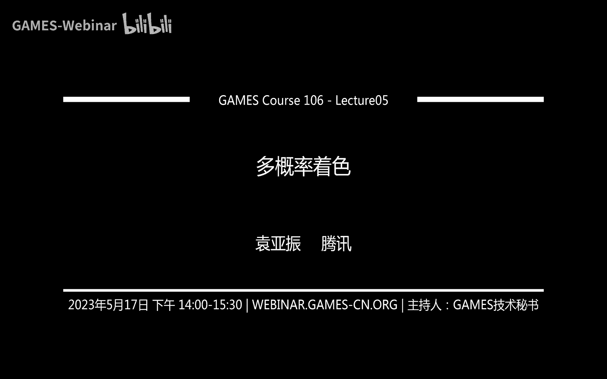
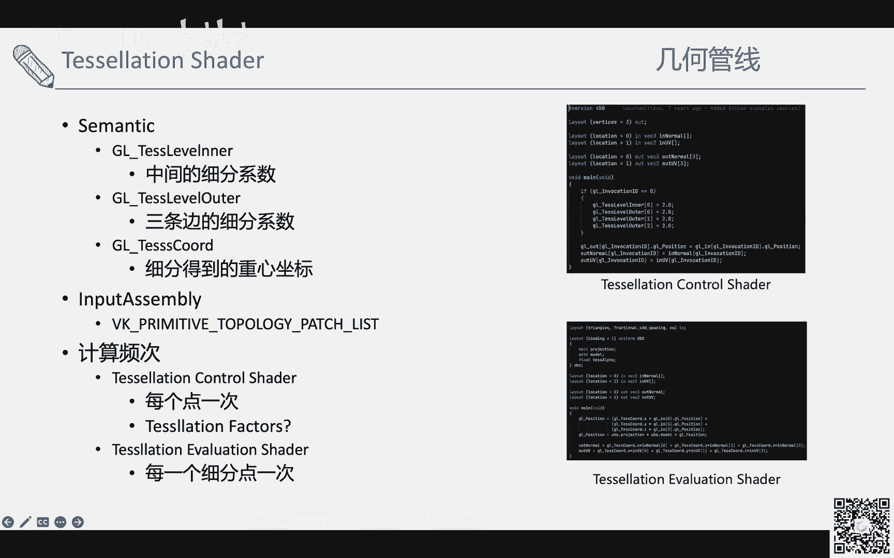
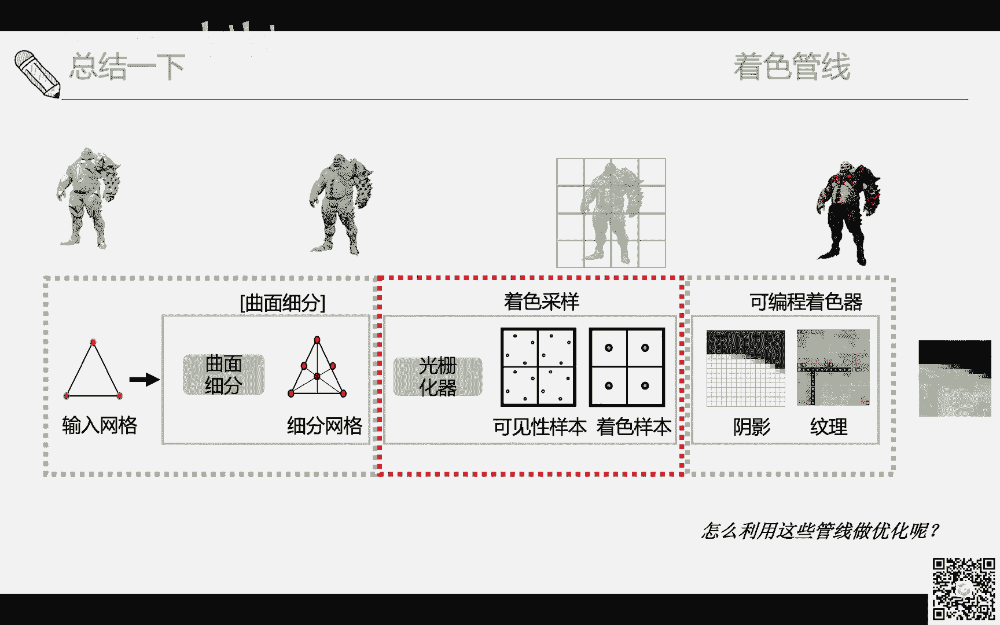
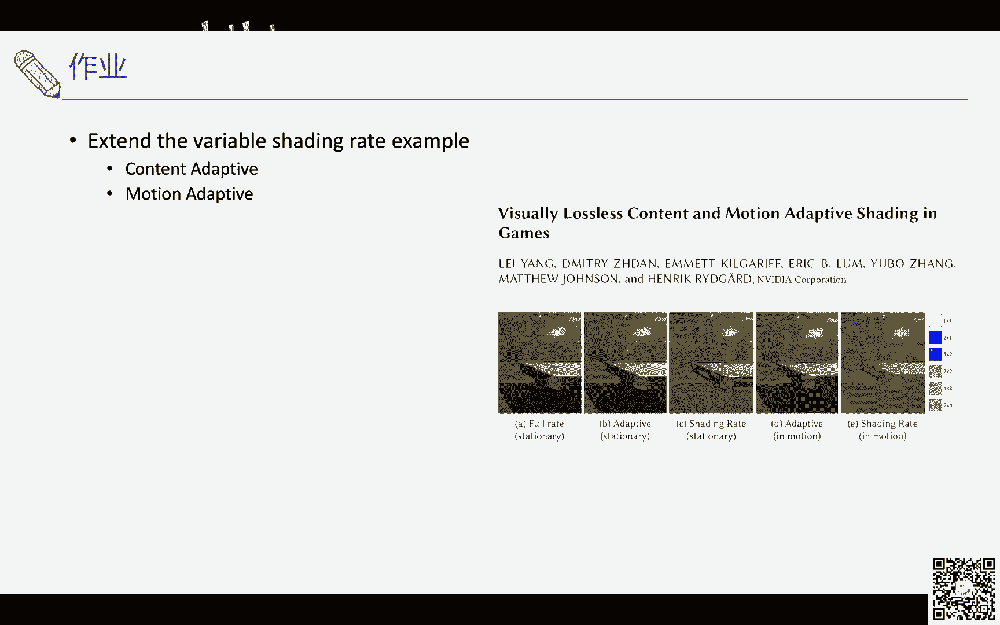

# GAMES106-现代图形绘制流水线原理与实践 - P5：5. 多概率着色 - GAMES-Webinar - BV1Uo4y1J7ie

那我们现在开始那个呃，大家好，那是我那个我先自我介绍一下。

我要是袁家镇，然后我之前是在cd这边做实时渲染，都需要简化这些东西会比较多，用这管线这些位置，管线优化这些，今天可能给大家讲一下，这个多频率着色的一些事情，然后首先讲一下这个整个的这个。

今天的课程的整个的目录，然后先会大概介绍一下绘制管线里面，大概的计算频率是什么样子的，然后会因为我们要讲一下啊，顺便讲一下整个绘制管线里面，之前没有看到这部分，我我这里面其实会把它分为几何管线。

着色管线这边来介绍一下，会带着大家过一遍，这个word里面一些现代的这种shader，或者说这些管线大概是什么样子的，然后后面最后面其实会讲一下，比较新的这种的多频率着色优化，大概是什么样的概念。

或者说在实践中会有哪些运用，那么首先讲一下这个绘制管线中的计算频率，其实最简单的计算频率其实可能大家都知道，就what is shader来看，大家的理解是全构思，每个顶点执行一次。

那fram shader呢每个像素执行一次，那那些在定义全口的时候呢，先每个顶点，然后执行一遍v圈之后进入光栅化，不然这些其实大家都非常了解，但其实真实的情况其实会远远比这个要复杂。

那你可以看到这个整个的管线，其实是从这刚才说的是dx 9，其实管线之后已经越来越变得越来越复杂了，你从输入网格开始有曲面细分，虚拟细分到过生化七之后呢，其实又分为可见性样本，注册样本，那这些东西。

那这些着色样本计算完之后呢，其实可编程着色器里面呢，其实又可以做很多很多的事情，你包括各种效果的计算，其实本身也是各种各样的频率，计算频率和缓存频率也都是不一样的，那这里面其实这节课。

其实大家就是把这些东西给他过一遍，然后然后看一下怎么优化，然后我们来讲一下几何管线，在介绍这个这个现代的绘制管线之前，我们来介绍一下最早的时候，影视制作里面使用的管线是怎么做的。

那其实之前这个地方其实我们之前会叫他rise，也就是说render，render，everything，you ever see，其实这个是非常老，1987年的时候的东西了，那这个时候。

他们大部分时候是为了影视制作使用的，这时候大部分只做制作的时候呢，是其实还是用的参数曲面，然后参数曲面的时候呢，它为了就是要导致这种呃，就是要因为你在大大荧幕上看嘛，所以你看到的人物其实都应该是连续的。

如果是只用三角形表示的话，那其实还看出很高的曲面，而且所以它其实包括我们之前同学课里面，可能学到了什么各种各样的细分啊，cut mos，clk subdivision呢，其实这些都是都为了自主的。

为了这些东西准备的，也就是生成的时候生成更平滑的曲面，那它大概的概念是什么样子呢，其实就是就是它整个架构是这个spit and death，split and dice架构，就space的时候呢。

其实是将输入的参数图源splish更小的primiti，也就是说你本来是个大参数曲面，来适合计算机去做，然后大四的时候呢，是这个时候还是参数的那个参数曲面，大s的时候呢，是将参数曲面细分成更小的多边形。

那这个时候其实就是多边形的价格，比如三角形iphone call的这种东西，那其实每个多边形呢大概是一个像素大小，然后那有了这样一个多边形，发了屏幕之后呢，然后这个时候呢，其实你每个多边形。

其实每个顶点其实你是可以做displacement，你就是把一些更多的几何细节加上去啊，这种东西，然后这时候他开始在顶点上着色，注意这个时候是在顶点上，一般是会在顶点上去做这种颜色的计算的。

你包括求交或者包括光照计算，其实都在这上面做的，然后在顶点计算之后，最终三破的时候呢，其实是根据像素点在顶点的差值得到，所以这里面其实就是你可以看到有些一样，有些不一样的。

比如说一些或者说现代的管线里面，很多概念也是从这里面逐渐衍生的，因为我们最终其实时绘制的管线，其实最终我们还是希望尽量的去逼近，达到影视的影视的质量效果，那有了这样的一个基础之后。

我们看后面的现代管线大概是怎么样录眼镜的，那最简单的还是之前的话，通过在shader开始走pic shader这种概念，然后在因为这个时候呢，在只有voice的靴子和peter靴子呢。

其实你会发现几何是非常受限的，也就是说你基本上只有input是什么，output才是什么，那这个时候呢其实在d差时差不多d差时，这个时代因为我比较相对低差，比较熟悉的时代呢。

呃会引入jomp shader，geomshader呢，其实呃就是提供了非常一个相对非常自由的，这种这个那个等于说几何管线的构造，但是这个dx 10的是在引入gmc的，其实不算成功，因为他太过自由了。

那我们看一下，那后面他就再加删，dx 11差不多能引入了teslan shader，那work里面可能test或者open ji test，control或者techevaluation谁的。

那这个东西呢，它的概念其实就很接近那个我们的spt大s那，种，就是不断的细分这种架构的，但实时管线本身的发展，其实还是受需求驱动发展的，就是我需要越来越快，或者说我现在那个引擎。

或者说游戏里面常用什么技术，我需要做什么样的，需要什么样的东西，那其实以一项非常常用的技术，其实是代替30引来的computer的，computer推出之后，其实大家其实非常喜欢这个东西。

那其实就引入了一些gpu driven pipeline，那其实那为了这种特化的需求呢，其实就会引入一些txt，就是所谓的mesh shade这样的架构，task shadomesh。

my saination and meader，那我们把统称我现在是这样统称的，把钱光栅画集前面的一部分，其实都当做几何管线来定义，也就是说它其实整个的修改都是在修改，整个管线的几何部分。

然后再看一下这个，我们开始一步的过这个这个管线本身的，因为之前的前面已经介绍了一些，整个walking的这个大致的概念，那么其实我们就看一下这个这个概念，其实第一个是我们会在管线里面会有这input。

assembly，what is shader，那这个相对比较简单，那其实呃你你其实只需要定义好，你你这个整个的buff大概都拖不了机，top top top是怎么样的。

比如说我们最常用的其实就是全国list，其实有些特别需要，你可能需要line呀，或者纯和fan这些东西你去看，但是最最常用的其实还是出angle list，然后你定好拓扑之后。

你提供water input data，water input data呢其实我们最常用，比如说你有可能只提供water buffer。

但是一般常用的也会提供index buffer里面去water buffer，双层fin，双层索引，也就是the index buffer里面往motel就是gpu。

会从index buffer里面找到对应的这个顶点的，数据是什么样子的，那这里面其实在这个阶段呢，其实不光除了povertex的定点，其实还会有，比如说我们如果做instancing。

它其实也会有insbuffer，那这里面都会通过这种thematics，what is id，或者或者因此id来做这样的事情，那这些id本身其实也就是有管线定义的，这个这个顶点顺序是多少。

这些顺序其实本身是可以给我们提供，做很多别的事情，比如说我们如果想要把顶点动画被，其实void这个东西可以用，那定义了这些的输入的结构之后呢，其实gpu在执行的时候呢，其实就会根据顺序。

每一个比如说每个顶点我就会呃拿到对应的，比如说没，比如说这个012这三角形，那我其实就按照顺序，比如说零这个vs我就会去执行一遍water shader。

然后水写入到vice out of buffer里面，然后一会会写一个2号，写一个按照顺序的剧组，这个时候在这个这个时刻，或者说在water这是在执行的时候，其实这个时候还是没有太多。

primitive的概念在这里面的，然后这里面其实就会有一个地方是说，比如共享顶点会怎么办，其实因为gpu本身，它其实是一个非常流水线的架构，其实在读的时候，其实本身它是会有一个顶点的开始。

也就是说我如果执行过后的这个顶点，其实我本身gpu是能开的住的，就是我不用再重新再执行一遍water shader，才能拿到这个water spot，那ok那我们开始来讲geometry shader。

那我what is，shader的一个最大的问题，其实是它是只能在cpu端设的几何，也就是说你cpu跟cpu端，你你输入给他什么东西，他吐出来的就是什么东西，那其实这个里面的灵活性其实达到降低了。

因为你如果什么东西都在cp上做的话，性能其实有点，如果做可变的东西，可能扛扛扛不太住，而且你也没法给我编编起来，怎么没必要麻烦，所以在其他时代时代，其实就引入了g mhc的这个东西。

那gm cc的它的好处呢，其实就是非常自由的修改几何，你可以在gm trade里面，虽然它有一定义，比如说我最多一个shader里面可能只能输出多少，1024个三角形，或者这样的一个限制。

因为它有八个一个一个数数据存储量的限制，但是它其实你可以通过ai vtex或n primitive，这种的，你去重新构造出，比如说你一个三角形进来，我重新构造出一个normal。

或者重新构造出多个三角形，甚至你居然是直接做细分也是没问题的，但是比如说你下面我们右边看到一个示例，就是你通过这个节目衰的趋势，每个顶点你输出它的法线图可视化，这个其实都没问题，然后其他的问题在于。

就是说因为你在这个jm trade里面，可以随便改几何，我一个三角形进来，我可能输出十个三角形，也可能输出五个三角形，甚至改变我的这个这个拓扑结构都改变了，都可以，那其实这样的一个问题是。

因为你gpu整个大量还是大量吞吐，所以其实你这样自由之后，反而gpu是不好，我知道怎么调度，因为你比如说你这个这个水果你生成了十个，那个同学们分成三个，其实你这个速度是提不起来的。

而且因为我预先不知道你会生成多少个，所以我其实也是不好做调度的，所以其实geisha的推出其实算是一个失败吧，因为呃用到的地方还是相对少很多，还是主要的原因其实还是没速度，那有了gmp c的这个东西的。

作为一个作为一个怎么说呢，作做一个过渡之后，其实d差11时代，其实大家会推出这个tech的那teslation，最简单其实是给一个三角形之后，经过tesn control。

那这里面其实就会设置说细分参数，细分参数比如以三角形举例呢，其实就是大概是三个三个边，就是三个边，每个边有个细分参数，然后中间会有个细分数，那经过硬件的曲面细分器之后呢，我生成了更多的顶点。

就是我比如说现在一个点，现之前是三个点，现在变成了六个点，那这个点更多了，然后每个点会去执行一些section evaluation，谁的，那这个shader呢你们其实是说呃在这里面呢。

其实就是有点类似，做之前vs学的这个这部分的事情，其实本质上就是把因为我的点的位置，就是我点做细分更多，那我点的位置得到的结果其实也不一样，所以要把通过插值插出来，然后经过弹射eventure的时候。

我的几何数量就变多了，比如说这里面可能一个三角形，现在就变成了六个三角形，然后以右下角其实可以看到图，它其实每一张图，每一个每一个边，或者说每一个边的这个tn factor是不一样的。

这样的话提供了一定的自由度，然后然后我们来控制一个三角形，被细分成图三角形，它的pattern或者它的细分参数不一样，这样的话比如说我们做地形的时候，其实做这个事情是可以做一些。

类似于l o d这样的效果，然后这里面tetris里面其实最重要的一些就是，主要是你你要控制你怎么使用，怎么样的算法去写这三个就几个tan factor，那是tnt里面。

其实就会有一个是主要的是说tion level inner，就中间的这种细分参数是什么样子的，就是你你你一个是就是你中心，比如说三角形内部，你要细分成多少多少个三角形要控制好。

那第二个是说比三角边的细分参数，你你这条边裂分裂分成几个呃，另一条边它细分成几个，那这个边其实的细分参数主要是a控制什么呢，就是你和你的邻近三角形应该怎么样，怎么样做这个事情。

你和你的邻近三角形有没有这种匹配，这种那test cos呢其实是在财政evaluation 里面，其实会做的比较，那个就是因为你的点细分了，那你的点细分，因为你不是原来的点的，那你的点数据从哪来。

你的数据从哪来，其实你还是需要有一些数据，是要从原本的三角形，原本的小就是稀疏三角形里面拿到的，这系数三角形拿到的时候，其实这里面就是一个东西，是三角形的重心坐标，用这个中心坐标可以做细分差值。

差值数要不插值出你原来的那个，就是你新的点对所对应的顶点属性是多少，那其中一个改变呢，其实除了除了这种改变之外呢，其实你的input simply，因为我们大家如果可以刚刚回想一下。

我们叫rise里面里面叫参数曲面，叫patch，一个参数曲面，patch，其实在test shade里面其实也是可以做这种事情的，然后包括triangle其实都是也就是全tology。

tology的话也要改成patch list，那你除了这种三角，普通的这种三角形的细分之外，其实你也可以在三角形在这用的做propercel，曲面细分，这些都是ok的，呃不其实还不怎么见得见得到这种对。

然后其实这里面就还是刚才提到的，计算频次是什么呢，titan control rider，哦不对，这里面可能写的有一个，每一个concern control shift的时候呢。

其实就是基本上每一面一次啊，这里面写的可能有点问题有点问题，然后tethern factor的呢，其实是你基本上每个面为就没这个里面写的，就是写的问题，就是每个面为每个每个面位。

每个边设设定一次才能是factor，然后tension factors的话，那你其实需要你自己控制这个东西是什么，就是到底挤压或者if这种的对，你可以看到它这个筛子里面。

其实有个g o g l e vocation等于零，这种这种地方，其实这里面就是因为每个每个面设置，这个那个呃怎么说，就是为平面设置那个tan factors。

然后设置tesn control shader的时候，其实你这里面其实会有一点open wen和dex不同，dx可能会提供一个每个平面一次的，就是每个面一次的这种hoshi的这种的入口。

去控制每一个config图，而在open gl里面的，可能，直接就是说每个点都要把顶点属性去复制一遍，这样的话能够给出给出，这样直接就能给出dmc里面去用。

然后其实它的用途更多的时候，其实比如说最最最最简单常用的事例，比如说pn tragos，能够用到更平滑的几何这些东西，但其实pcl在真正的这种游戏引擎里面，其实用的反而不那么多，其实增加几组和几何细节。

比如说dispace mat其实反而用的会多，而且用的还是用的比较多的地方，可能是细分呃，可能是地形这种地方，但是即便是现在为止的话，其实用的地形有很多，但是其实现在为止。

因为我们有更好的computer之后，其实很多时候顶点buffer，或者说这个出过这个东西，其实反而是可以直接在那个用commission的，来生成出来，然后其实你但是你用在用台词开车的时候。

其实就会遇到一些问题，就是你price就是有一些裂缝，或者说是这种细的low这种东西，那第一个第一个点其实就是tan vector的，这边的才是yy的问题，那其实就是说如果因为我们刚才介绍。

我们pressor factors里面会有就是new a编的test factor，和由于inner test factor，test factor，那英的tefactor呢是参选权内部的。

那边的factor呢是三角形三条边的，那这个edge factor呢，主要其实影响的就是你共享的这边的地方，怎么办，举个例子说，比如说两个相邻三角形，左边的一个是比如说像图示的展示了两个展示。

细分了两次，也就是说我这条边上有三个顶点，那另一个三角形的没有细分，细分参数还是还是一的话，那其实你可以看到这个整个三角形，其实变成了一个t joins的这种方式，那他有可能在观察它的时候。

就会产生一些很细微的这种裂缝，那这个是一定要以后要注意的一个点，就是你你是否使用了这个匹配的，相互匹配的这种editor factors，第二个是说呢，其实就是因为我们刚才说我们用tt factor。

经常遇到的一个情况，是说那个是说你可能需要做，what is displacement，那我做voice test placement呢，其实就会遇到一个问题，你匹不匹配，也就是说你的normal。

因为你你一般来说是沿着normal方向，做一定的偏移，也就是说如果你的本来是两个点，应该是同一位，原来两个点三角形呢，在原来的非细分三角形上的，原来点的位置是一样的话，你现在往上往上移了。

那你如果normal或者office的b费，其实也会产生这种裂缝，也就是原来看起来是没问题的，max现在变得有裂缝，那这种呢一般一般会几种处理方式呢，第一个是说，如果你最核心的其实要用共享的顶点数据。

也就是说用或者共享或者说一样的顶点数据吧，那比如说第一个是说我们说normal，normal的问题，如果你这个点是共普通的一个点，是共享阶段，你应该share同样的normal。

比如说我们左边看一个a b c这样的一个平，a b c这样的一个平三角形吧，你正常的normal，其实我们最简单就是cross a b a c，你就算出了一个这个这个面的法线，如果这是一个非常普通的。

这个就是一个三角形的话，你可以看到这个b点的法线，应该就是这个分就算出来的，这个cos但是实际上因为你你算的是整个mesh嘛，那其实这里面mesh里面其实会有很多的，这种的共享的这点。

比如说a b c这个三角形，那b c d也是三角形，那么其实b这个点其实就被多个三角形共享了，那这个bb这个点对于多多来讲共享呢，其实b就是一个shell的vtx，那其实如果比如说我如果这个时候。

你一个是在做的时候，比如说你在导入的时候，我就是把b拆开，变成了两个b1 b2 b一属于a b c的，b2 是属于a b c d的，那这样的话如果各自算normal。

那其实整个的首先第一个是光照上面就不平了，因为你的normal不一致了，就光照上面不平滑，但光照不平滑可能也是一个一个问题不大，但是核心如果是你做几次map displmap的时候，你相互移。

那么b4 b和c之间两个点其实就会出现，这个就是quex裂缝，其实一般会做的时候，导入的时候，如果确认bc比如都是共享点的话，那b这个或者说b c这两个点，其实就会变成两个法线。

就是两个面片法线的那个均均值或者normalize，或者说你怎么做，根据面积啊，或者做做平做，我加权都没问题，那其实这个就会保证一个是smooth water normal。

也就是bc使用了同样的normal数据，那这样你在比如说细分的时候，我用的，因为bc用的是同样的出去，那我挪的位置如果是一样的话，也没问题嗯，但是这个刚才说的。

你需要保证bc是一定是它逻辑上是属于共享的，这种顶点，那其实有一种情况是说我一定不能共享，比如说我用比如说光滑组，比如美术在做的时候做了光滑组，保证了说我这个地方的normal，它一定是不一样的。

虽然我的位置上是连续，但我的normal就是不一样，比如说刚才这个cube这个q本来就是各个面，就是法线就是不一样，每个顶点上面我就是这个字的发型不一样，那这个时候就是走的hh或者这是一种情况。

比如说我就是没错，就要做这种呃，那么不不一致的情况，不平滑的情况，还有一种是什么呢，就是正常的mesh，它其实整个其实会拆开的，那拆开了之后呢，那同一个点他normal可能一样，就是我我拆开之后。

我因为我这边可能就会有uv的这个uuv，这个uv导的边界，u的边界就是我的position虽然一样，我normal甚至几何也一样，但是我uv踩到顶点不一样，那这里其实会有一个问题。

就是首先它的就是你拆的时候，可能就会认为哦这不是一个共享点，那我可能是不是第一个是时候是不是就猜错了，就是normal本来就是不一样，或者normal一样的时候u不一样。

但是哪怕是normal一样的情况呢，我uv不一样的时候，那怎么办呢，我踩despason贴图的时候，也会导致我踩的地方不一样，因为你dv不一样了，你可能踩到同样性都可能踩到不同的地方去了。

那这里面其实就会第一个点，其实就是生成一个dominal vertex，也就是说你还要还是要强制的保证说，你如果要做细分或者做test ram的话，要保证他们的顶点所有的事情是完全一样的。

那即便是做了做了这样的事情之后呢，其实有时候你包包括实践中，其实也会遇到一些鼠标精度的问题，其实但是整个核心来说，你如果要做得做得对，你还是要保证使用，比如说你你你遇到这种问题，就是使用的时候是什么。

tx factor是不是类似一致，第二个是你使用顶点数据是不是一致，顶点数据除以致外面的normal和uv是不是一致，这些一致，才能保证说你最后tec出来的结果是没有cx，那讲完了tec shader。

其实会讲一下最新的这种my shader，不过这个就属于相对比较进阶的作用，可能就不会太去讲这个事情，然后techer里面其实用的刚才说了，其实用的已经相对比较多了。

但是它最大的问题就是fixed pattern，也就是说我的pattern就一定固定的，那我怎么改，其实大虽然我有些调整，fraction ooder，这东西其实呃本质上差别三角形差别不大。

而且生成的这个比如说你拆成三个，一定会变成六个三角形，整个的这个尺度还增加的力度还是很大的，现在的逐渐的d31 的时候，因为除还赢了computer shader，computer。

就是类似于coda这种的通用计算这种东西了，那这样的话它的自由度会大很多，但很多其实大家就是做引擎的人，就把这种computer玩出花了，其实最最出名的其实其实qq用的牌牌。

它最核心的其实还是说把lash切割成很多小的，这种caster，就是64个或183角形，有了这样的卡特，以这样的力度去做并发的时候，我就可以去做一些柯林啊这些东西，那这些是吉普追问的时候。

你学的更多还是做颗粒，但其实computer也可以写出，我可以生成，不光可以做颗粒，我还可以生成更多的mesh，这些人也是可以的，那其实就会对在几何管线里面，其实在最新的这台12里面。

其实就会引入这种的mesh的这种东西，就是它包括一个裁缝学的，其实包括格林这种呃，就是可以调动更多的任务，然后有了更多的任务之后，其实在卖身子里面也可以建立更尖锐，更多的三角形出来。

你不会生成三角形和克制三角形，其实都ok，那oo的来说呢，其实核心还是说计算力度都不一样，然后并行计算力度都不一样，比如说你这个what is shader的话。

那基本上在刚才也介绍了vs shader里面，其实在执行的时候其实是不太知道，不太能知道这个呃怎么说，他那边叫connectivity，其实就是拓扑，其实不是每个顶点呢，就是每个顶点。

每个顶点就是也就是执行一次，那节目chat里面的呢，其实就是说他的那个因为太自由了，所以他的输出的可变的这种参数，其实在硬件里面调动下面其实不太适合那它，但是它的好处是什么呢，它是我输入。

我是能知道这primitive，也就是我能知道我这个top是什么样子的，呃，什么什么东西，那我这样的话可以就是调度会，就是按照拓扑的走掉，我就可以知道零件还有东西。

然后teention呢其实最大的问题就是fix function，这些介绍费就是固定的拓扑了，那它会其实速度还是会比较快，因为它整个顶点输出去的时候，其实在材料上，pc里面其实整个还是按片上的。

其实我们之前测过，其实相对来说相比于直接拿vtx来说，其实整个还是可以从tation来获得一些，这种locket的加速，对，那mesh其实本身其实就是沿着computer。

这种shader的走法其实是会更自由，但带了一定的，虽然带了一定的限制，但它其实自由度因为带了几次，其实internet core这种这种shader之后呢，其实带的自由度会更高，嗯相对来说。

因为越提供了越高的自由度呢，你你程序员可能能做的事情就会更多，那其实最核心的其实还是要找到适合的应用，就是你需要做什么样的应用的时候，你做什么事情，那有了这样的几何管线之后呢。

其实我们看一下左侧管线这块，那着写管线我们讲个最最简单的例子，比如说这个全国划到这个这个这个，比如在想这个4x4这个像素上面，就会执行的像素的时候，那么其实问题是给大家一个问题。

就是哪些像素会执行pk谁的哪些像素会写入，那其实真正的像piece shader的执行，其实以扩的单位为执行的，就是虽然我这个比我们看到那个右边的这个呃，右边右三角形尖部分是指只touch了。

比如说两个pixel的这个中心点，但实际上整个的这四个cod其实都会执行，peter header，因为这个主要是这个，这个的主要问题是为了做做差分，也就是说我比如说d d x d d y这种东西。

这种指令就是因为我需要跟临界的做对比，只要知道我这个这个梯度是什么样的，就是我这个三角形的梯度，那这个梯度有什么好处呢，其实最多的或者说最长最实用的一个用，其实就是三角形的边贴图的mmap。

有了贴图mamap之后呢，其实你可以对应的做这个纹理的这种的方程，这种的抗锯齿，或者说更好跟更好的这个locality一样的，那这里面其实说的是pizc的执行。

但pic的写入其实确实只会写入你coverage的分，也就是说你carriage的写入了这样的一个，你只有覆盖的是像素中心，才会写入到这个像素的对比，因为你会有深度测试啊这些东西。

但是引入的一个问题是什么呢，就是说锯齿就是本来好好的一个三角形，现在变成了这种奇怪的形状，那这是普通的光栅化一个大的问题，那msn就是markpsample，angelzing呢。

其实它的核心理念其实是什么呢，就是其实它它的名字就说了，就多个样本点，这个sample可能我们就叫它可见性样本，其实你可以简单的理解为就是depth可见性对，那其实这个大夫的好处呢，它会比如说不同的。

比如这边是四倍m4 c它会固定的samples，会固定一个pad pattern，那这个deft的好处，这个多了可定性要么好，重的是我们近似的知道这个三角形，cover了这个像素多少比例的面积。

你比如说那个所有的shader都会提供，类似于这种thematic，就courage the semantics，然后这种coverage的话，其实就会告诉你哪个样本点被cover了。

哪个样点没有被cover，然后他在在算的时候呢，其实我我做错了，做了可见性判断之后呢，其实也一样的，就是我这个时候其实会是在像素，但是我刚才是说样本点是在屏幕的，这个就是在一个像素的各个位置。

比如说刚才的四个pattern，那其实计算的计算shader，还是会在像素的中心来算，那我算一次颜色，但其实这个也是可以调的，比如说如果你在dragon shade里面写好，我这个东西，我不希望它越界。

因为如果在像素中心，比如说我们刚刚看到你，你比如说右边的这种右边的像素这块的话，它其实会有一些这个看一下哪几个，然后如果比如说这种地方，如果他因为他只靠了上上面的人上呃，上半部分的两个项目。

两个sample，但其实计算的时候是计算在项目中，通通常是在相对中心，在这里面其实会有一个问题，就是一个它整个的属性值会外差，其实你也可以通过定义这个定义，这个fmc里面定义这个东西。

centroy的差值，来保证这个sample差值一定是，比如说在某个像素里，某个在这个primitive内部来保证会出库线外差，这样熟悉，说不过一般情况下，可能你直接用默认的也没问题，那如果是这样的话。

比如说这样的话，那就我比如说我现在就cover了所有的像素，其实那右下角的这个之前的四个像素，之前布执行的，其实现在也会执行，因为我cover了这个这个这个一个sample点。

这个三破点导致了我这个像素必须要执行，因为这个像素执行了之后呢，导致我这个扩的本身也会来执行，那就现在就执行了这么多的像素，在像素中心颜色得到了c之后呢，会写入的时候会怎么样呢，因为我知道了。

我首先计算出了颜色c，然后我知道了这个对应的这个颜色，c对应的在这个像素上面的覆盖比例，所以我能出得出一个比例，就是我c除以我的carriage，这个颜色就得到了，最终我输入的颜色是什么样子的。

但是可能我现在的示意图画的没有，那么呃就是抗菌的效果那么好，那这样的话你在现在对比起来，就是以前可能只是非常粗糙的这种结构，现在可能得到结果梯度啊，就是单眼的梯度可能会更连续一点，那我们对比一下。

这种普通的reservation和这个mc的情况下，这个代价是什么，首先是普通diation，其实带来的，就第一个带来的就是说可能还是dex，样本是16个，那如果是你四倍m c a的话。

你的样本数量可能就是16x4，首先是深度测试的样本，深度测试的这个成本就增加了，第二个peter shader的直线数量，p4 确定之前，我们刚才数了是，其实是12次，就是三个三个cod。

三cod是12次，但是因为我们现在带了mc，所以我们其实执行了，因为这个这个像素其实也会被判断，判断到覆盖到，所以整个的阔度会变多，p c6 会执行16次，那写入的颜色个数呢其实之前是七个。

现在变成了十个，所以整个来说其实代价还是会增加一些，那其实我们总结一下，其实就是mc其实就是其实变多了更多的样本点，你可以调整通过这种参数。

比如说你通过van的pvn samples create info里面去，通过参数有多少个来生成呃，比如说两倍的四倍的，或者说是更多倍的，其实一般硬件可能的八倍差不多就结束了嗯。

有了这样八倍结束了之后呢，其实你可以控制这种，比如说你抗锯齿啊或者的效果，然后简单来说其实就是说mc一个最核心的，相比于就是我更大分辨率来说，其实我减少的其实是拼图shader的执行，直执行数量。

相对相比于这种更很粗暴的，这种粗大的这种分辨率来说事情，因为我这样的话，一个像素只执行了一次的pic shader，但是其实这里有种情况是什么呢，就是如果我有多个三角形覆盖了同一个像素。

但是我覆盖了都是部分覆盖的吧，其实每其实是每个它核心，其实是每个三角形覆盖了每个像素，我最多只是其不能说最多也就执行一次，执行一次，那这样的话等于说，如果是很多细很细碎的三角形，因为你你可以可以考虑。

如果是在三角形的边界处，如果是多个三角形同时覆盖图像素，其实三角整个的像素执行数量，其实也还是会变多，那中间接口，其实work里面其实最大的一个是三波数量，比三波数量需要控制。

其实本身现在绘制管线也提供了很多，很多这种的控制了，比如说就是更细致的控制，比如sample shading，我刚才说就是大的概念是说你每一个就是mc，虽然有四个带四个可清晰样本。

但是我其实可以只做一次q，但其实你仅可以是可以做到posample shading的，就是我我执行我四个depth sample，但我也可以执行四次shading。

或者说按照一定比例做sample shading，就是说我四次，比如说我最多执行多少，这里面有min sample，shading或者种东西来控制你，比如声破两次，甚至三破两次，这些都都可以。

然后其实本科硬件也提供了simple mask来证明，来来判断是说你有多少三破，真正通过了测试居命，我比如说四倍的话，那一定是sample，但是其实我可以通过carriage，通过这个这个mask来说。

我说把一些samples就是可见性的sample给去除掉，或不写或怎么样，那除了mc这种状态接口之外，其实核心里面，这里面其实还有一个就是硬件的resolve呃，其实呃也就是说现在我们有如果有多个三破。

那最终我们是输出需要输出一个抗锯齿的结果，那这个resolve本身其实就需要你，你你就是有一个是硬件提供的，就是普通的来说，我们刚才其实讲的就是最普通的average，那其实也还会有更多的。

比如mamax sample，比如depth的时候，可能你会需要这个东西，比如minmax，你你选择最深的depth，或者最远最最大的depth，然后也可以保证。

比如说我使用全部默认使用sample 0，这种是硬件自动result，也就是说你在画的时候，你可以通过提供resul attachment，就是硬件自动帮你做，就是我你虽然绑定了一张四倍m s的搭配。

然后再提供一张ebay，比如说的普通的这种buffer，他硬件会自动做好吧，结果写进去，这是一种，还有一种是手动的vk的resolve image，就是你自己手动调这个v k的指令。

这样的话你输入你可以得到一张ma，就是mc的buffer，也可mc tech也可以自动收到，得到一张普通的这种特权，那再一个其实你可以手动选谁的这种自由度，其实你可以随着working版本越来提升，1。

01。2，1。3其实是会越来越多的，你可以手动自己写去读这个test，2d m s就是一个mc版本的culture，你可以自己做自己的事情，比如说你自己随意丢弃。

或者你自己不愿意做这种普通的mix restore，或做自己做很多事情，这里面是mc，但是mc就会导致其实它比像素更小，其实还会有个东西是比像素更大，就sha，其实它的核心概念。

其实就是说现在分辨率涨太快了，我们需要少画一些像素，那你可以看到p4 水顶，那就是一个pixel，ok我有一个一个像样本点，m c c就是一个拼色，我可能有四个样本点，比如四倍m c a的。

在比像素更小的尺度上进行可研计算，那我我river re，就是我可以做到比像素更大的尺度上，进行着色计算，就是比如说我这里面就是，比如说2x2的像素来进行一次读的计算，wb确定rate呢。

其实呃常用的其实会有，你可以设定的这种的basis，就是你可以说我这个物体，这个物体就是说用用一个1x2x2，或者这样的pd也可以用shure image这种的，你可以看到右边的画面的时候，你可以看到。

就是说就是它可以根据画面内容来生成不同的，这种比例，就是说如果我我如果不设成了2x2，那就也就是说，我如果跟刚才的这种那个mc的原理类似，如果我这个画面涉及到的每22个像素。

其实我才会执行一次shading，那其他的通过差值就可以得到，也就是说我这个东西会不会会更模糊，嗯如果是object tag呢，就是puja basis呢，其实我是可以说我这个东。

这个物体本身就希望他他本身就没那么精细，我让他shading着色少一点，我给他给他打个tag，那一般做的时候给我打个tag，那这样的材质上面就可以说我就是2x2，shading，确定的时候。

它就会更执执行的数量更少一点，那还有一种呢是说我这是物体本身的，比如你可以做标记，或者还有一种是tvt image呢，是说那我根据屏幕本身，我物体不受控制，因为物体控制让没出来做，可能还是比较麻烦。

那我整个屏幕本身我自己根据内容来做，那一种是这种shadowmage，就是说引擎不不我可能会提供这种，你会提供这种接口，就是你输入一个chandrate image，16x16比一个一个tile来来做。

你认为这16个ti，16x16的ti应该用什么样的 rate，那这样的话你去做这样的，就是给他出了一张图片，就是就是modern texture，那这样的话你其实就会得到，就是硬件会自动帮你说。

在这个这个区域，我就会比如说2x2的强度来做，2x2的这个srt来做，那其他地方各种各自不同，那其实这里面其实也会分成static cheatman，就是我就是场景就固定的，就是我就是这个区域。

就是就是应该用高的那个区域，用低的，也可以通过根据场景内容来做这个事情，你本身但是呃就是adapted the shrate，而且整个的wherever trading rate呢。

其实也可以和mc结合的，那我们看一下这个static shrate呢，其实就是这种其实主要是利用人的视觉来说，你一般会挂关注画面中心的细节会更多，比如说你中间你又会觉得这个地方呃，我需要更精细一点。

那旁边的其实不太注意得到，那没事呃，所以它会提高中间相对折射率，然后降低降低那个旁边的，其实这种呢其实一般会用在vr里面，会用的比较多，就是vr的话，因为一个是因为有透镜。

第二个是你的整个转动幅度也不大，所以还是会非常fox在中心，那其实这里面其实就是，如果是你要你要adaptive吧，你可以看到那如果做成这样的话，其实走这个尤其是这种shine rate比较低的地方。

其实整个的这个画面图片质量加用的比较少，那就是那其实adaptive后我们后面会讲到，就是说你怎么样通过让互互相质量加，用的少一点，其实这个是一个问题，那就总结一下的话，其实着色管线。

其实就是说你其实可以看到它会有，在这个着色管线里面，就是其实包含了着色采样和别人着色器这块，你整个的这个你的sample rate应该怎么样去做，你如果你在看我的整个多一点呢，其实你整个绘制管线呢。

其实会变得就是有很多很多计算频率，因为计算频率解决决定的性能和调度，调度和性能，第二个是着色频率呢解决的是图像质量，你怎么样去利用这种计算频率和这种着色性能，着色这个质量之间的平衡做做优化。

其实是一直可能是个问题，所以那下面其实就介绍，大概是如果是多频率着色这样的优化的情况下。

应该怎么去做这样的事情，那其实你一开始其实就是你做多频率着色优化，其实你得知道视频逐字的频率是什么样子，其实如果几何来说的话呢，就是什么是高频的，认为什么是高频的，什么是低频呢，就是法线变化多。

几何细节多的地方，我们认为是高频的，那低频的区域呢可能一般是平滑，平坦或光滑的这种区域，这种的话，那就是其实一个简单一个简单的其实就会定义，就是说如果这个几何的高速曲率表，这个点的高速区域比较高。

那其实认为这个细节比较多的地方，那其实几何的多频率的话，其实不强调高多频率主动优化，但其实这种频率优化这种的思想，其实用了各种方向，比如说你做简化或者说是做内，其实就是把那些高频的区域保留下来。

平坦的地方用的，比如说这个地方很平，我就不用那么三角形了这种东西，然后还有一种是什么呢，我就比如说生成display map或者no map，都是把以前几何细节的部分往big tech上面去。

我剩下的这种呃就是gta bacon，就是剩下的base base mesh是个lo，就是低频的，这种东西那么高频的细节啊，这些东西全放在这种天梯图上面，那这样的绘制的本身的时候呢。

其实是可以提供恢复出来，这种那个就是高密度mesh中的细节，这里面可能下后面几节课会讲讲几何，这方面就会做更讲的更多一点，然后如果说着色频率信息呢，就是比如说屏幕信号，一般来说会认为什么是光照变化剧烈。

或者纹理细节丰富的地方是中高频的地方，低频的情况就是光照平缓，纹理比较一致，而且或者说比较远的地方，我们认为都是低频，都是低频的这种地方，那其实这里面其实在vs里面。

其实会有一篇paper会用的比较多的，其实这个visually lose less content，and motion adapt to shading in games，这里面其实也是因为大家做的。

为了自己的vr s做了一些一些东西，然后其实它的核心其实就是说，如果ok我们假设我们做半分辨率的采样，它是什么样的，半分辨率的采样，它其实通过推导就算出了，如果你你相对的就是全分辨率和半，分辨率的误差。

其实等价于约等于这种这种下面推导出的公式，就是像素之间的差别是什么样子的，因为这个里面只是半分辨率的，有了半分钟这种推导之后呢，其实就是像素之间的差了对吧，那其实通过频谱分析，我对应得到了一个预计算。

得到了一个多，我半分辨率和1/4分辨率差别是什么，也就是说通过通过，而且这个它通过频谱分析发现，这个四分辨率可以完全通过半分辨率的计算，得到约等于的结果，这个k本身还是可以。

这个就等于说是一个常量值或者预计算，得到的值，那有了这样一个等式公式之后呢，我就可以通过我的这个我这个着色的结果，或不差来得到，说我如果得要降低误差到一定程度以下，我应该用半分辨率还是用全分辨率。

还是用1/4分别来做这个事情，然后除了这种之外呢，其实就这种事，比如说这就是像呃比较学术界的这种，在其实真实的游戏里面其实也会用这种东西，那这个是其实是那个好duty，2020年做的东西。

不过他们可能更在乎的是说他们有两个，第一个是他们未必要用vs来做的，我们刚才说vs是硬件支持的shining rate，就是但是这种设定瑞思想，其实不仅仅是可以用v v r s这个硬件来做。

其实m c c也是可以理解为是对设定的分解，因为他把等于说把shading分成了，shading和with the beach两个rate，那它其实就是m4 a这个东西来做changate的。

做可变的旋律，然后在判断可不是raid，他可能更在乎的是什么呢，temple的口黑，temple的影响的影响，就是他认为我不仅仅是画面的本身的梯度，我可能可能更多的是针尖一帧一帧帧的梯度。

因为你其实整个画面除了这种音，这种motion之外呢，其实还会带什么呢，就是你你画面的，尤其是游戏过程中任务也有，就是移动的这种disco，就是说移动的时候带来的遮挡的问题，或者说是你各个帧之间的gt。

为你现在ta用的非常多，那其实它会保留更多针，更多针线的区别来算出，你这个就等于说呃像素之间的gradient，就是其实gradient，就是你可以简单理解为就是像素之间的差别。

用用这个差别来指导这个child rate应该怎么样做，那这里面其实还是着色信号，就是我如果就是拿到一张就画画好的图片，我认为它里面哪个区域是应该高频，哪个区域是低频，其实做的更细的话，其实还会有。

比如说你着头像本身，就是你的shader里面怎么想的，比如说diffuse的阴影inspector defuse呢，一般来说认为如果是normal变化不大的话，就是假如说这个平面的defuse。

一般认为是低频的，但如果normal变化很大，那就是高频的，那其实如果是shadow的话呢，其实就是你如果英语，你学英语的话，其实半影区半影区就刚好是明暗交界处，它其实这频率变化非常大。

就这地方也会认为是高频的，其他地方是低频的，那specular呢其实一般是除了logo之外，lobe知名的secular很强，他的高光值可能很高，数值变化很大，其实非log区域的话。

其实变化其实反而没那么大，其实这种其实我们会叫matt rate，也就是说你不同的设定项，我都可以用不同的这种呃，着色率来进去做这种事情，那这里面其实是adaptitude。

这个是一个就是何勇在2014年做的这个，这个东西，其实就是说我除了因为之前刚讲的是像素，怎么追，那我其实shader的某些part，我也可以在不同的地方执行，以不同的频率执行。

那这个不过这个就可能是更新的学术界，更新的这种硬件进展了，然后但是其实这种东西呢，其实在现代分引擎里面其实也有很多这种应用，你举例说a o我刚说你你vo，比如说为了这种那个举个例子说。

可能ao如果低频的地方，我用半分辨率通过模糊这种东西，因为你本身a的频率频率不高，或者说ji的时候用半分辨率，其实这个都是这种思想的一种显示的应用，那其实本身除了这个之外呢，你c的本身。

其实说方程其实还可以做很多的事情，比如说你着方程可以做到这个你你你的shader，本来比如说是在那个正常是在vs里面写，peace trade里面写的，其实你可以把完全可以把它挪到顶点。

或者teslt里面，因为你像素多了之后，你像素多了之后，你所有的代价基本上都是像素代价的话，那你如果你这个频率很低，比如说你diffuse或者怎么样，或者比亚迪本身就不高，你把它挪到vertex。

通过差值来得到，也是可以做正式，其实包括我们我们之前的这篇工作，也是类类似于这种思想的应用，然后matt瑞就刚才也介绍了matt瑞的一个shader呢，其实也会有一些学术界的进展在做这个事情。

比如说你做这个cosplace shader，其实类似于这种vs这种的也可以做，比如object match reshading，包括湖的工作，包括2014年做这种培根，就mc情况。

下面就是mc的情况下，大家做很多的时候，你应该怎么样去做这种mtv的shading，其实都是对这种思想的应用，那整个讲下来，其实就是说整个的这个课，其实更多的是说，从一个是说。

绘制管线本身提供了不同的计算力度，那这些计算力度是怎么样子的，你心里要有数，你你给个mesh，你要知道他大概怎么样执行的，每个地方计算多少次区，而且这个现在自由度计算力度之后呢，其实越来越自由了。

那几何管线和专属管线里面，其实都有足够的自由度来做这样的事情，第二个是说你要需要正确理解的是，那个着色信号的产生过程做出合理的优化选择，因为你你在你在工作过程中，其实你就会遇到各种各样的问题。

就是几何过于复杂和像素过多，或者是不管是alizing，或者说还是说那个呃怎么说，就是嗯就是性能的问题，其实这里面都会带来一个永远的问题，就是画面质量和性能之间的这种平衡，你怎么样利用这种。

你可以正确理解你这种画面信号是怎么样的，他为什么出这种问题来理解，你做更多的优化选择和这种东西来去解决，比如几何过于复杂还是像素过多，还是着色信号过于高品质的问题，来做出你自己的优化选择。

今天作业可能其实就是，因为公开的东西还是很多，那有有有这种资料资料展示的，就是资料辅导呢，其实这篇paper我觉得是会比较适合大家做一些理，解，大概的概念，其实就是希望大家能够。

比如说完成这种这个以及这篇片尾为基础，去完成一个是vs的这种东西，那就是content adaptive是什么样子的，就是你怎么样通过画面内容来决定你的设定，同时又保证画面质量。

第二是因为在motion的情况下运动的情况，因为因为一般有运动模糊啊，这些东西有运动模型的情况下，怎么样更进一步的说我减少这个运动模糊，或者说动变动动画比较剧烈的时候，这个rate来更高的提高这个注册。

更高的减少这个着色频率吧。

