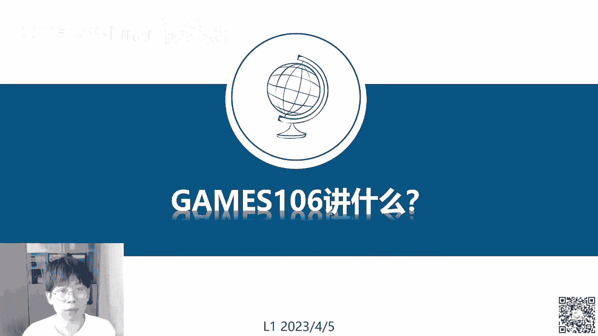
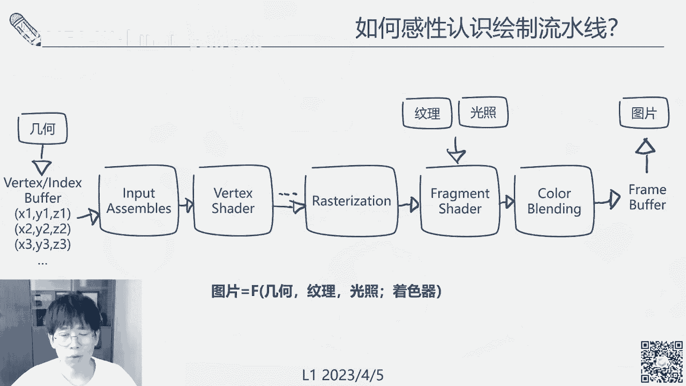
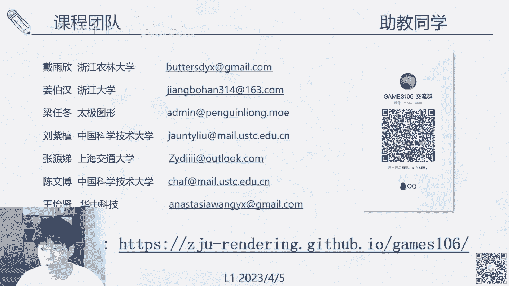

# GAMES106-现代图形绘制流水线原理与实践 - P1：1. 现代图形绘制流水线导论 - GAMES-Webinar - BV1Uo4y1J7ie

好的嗯，大家好，今天是我们games 106的第一节课，首先是跟大家介绍一下，这个课是叫做现代图形学的一个现代图形，绘制流水线的一个原理和实践，然后的话我本人叫惠池。

现在是浙江大学的一个cad的一个老师啊，还先介绍一下我们这个团队，就是说我们这次授课的话是有一个团队来授课，一共有五个主讲的老师呃，我本人是cad的霍雨池，然后也在光线云，还有一个浙江实验室做一些任职。

另外的话呢呃我们还邀请了袁娅镇，高新峰，胡一伟和高涛啊，另外四位老师来一起讲这个课程，由于这个课程啊就是题目所说的是说，我们希望是强调一些理论和实践并重，所以的话邀请了很多一线的。

正在做相关研究和相关开发的一些人员，直接参与了讲课，那其中像我的话呢，我主要是做图形绘制出身的，然后包括一些啊真实感绘制，实时绘制，还有神经绘制等等，还有口碑绘制，基本上都会涉及，然后由于一些个人兴趣。

还有一些其他的原因吧，我也做一些机器设计视觉，做一些计算光学相关的研究，相关的一些入门的话会在呃top啊，西格cpr啊，nc啊，各个方面，还有np啊，乱七八糟的，其实都会有一些发布。

这里就不去进一步的呃细讲了，然后袁娅证的话，他是在腾讯游戏任职啊，现在的话它主要是做一些实时绘制，还有绘制管线方面的一些研究，高西风是啊，老师是在那个北美，腾讯光子的一个资深研究员啊。

他是做几何部分的几何计算，网格处理相关的研究，然后胡立伟的话，胡斌老师现在是在耶鲁拉，耶鲁大学即将毕业，已经啊马上就要入职adobe，他主要是做一些纹理，还有一些可微绘制相关的一些呃工作。

然后还有我们的这个整个课业的一个主程序，高涛同学啊，高涛老师啊，现在是他是在向新科技，目前在做一个跨平台的一个绘制引擎的研发，所以的话啊，其实我们就每一个人都会是，在自己的相关的领域发过。

不仅是做一些呃开发，而且是发过很多配合吧，我们整个团队加起来我估计百来篇呃，然后各种顶配啊什么其实还是有的，所以这个地方就没必要去很详细的去往下讲了，然后除此之外呢，我们啊这个课。

首先要感谢一下我们一些助教的同学，这就是我们目前啊招聘，招聘到的一些助教的团队啊，来我就不一一细讲了，大家有兴趣的话可以去添加他们的呃，发邮件去跟他们联系啊，可以扫码入群，最后设计下方是我们的一个主页。

整个课程的一个主页，包括一些课程的介绍，还有一些那个相关的呃作业啊等等，其实都会在网上发布，这个是欢迎各位同学去添加。

然后的话我们今天的第一个问题啊，就是开宗明义，就是说games 106这个课要讲什么，而后我们为什么要讲这个东西。

其实总的来说嘛，这个我们还是做一个图形绘制的东西，图形绘制的话可能因为我想大家都很熟悉了，包括这个前面101集，一零几其实都是有很多的，很多课程就是讲图形绘制的，包括这个101对吧。

然后图形绘制的应用在我们现在其实很多啊，像这个工业设计，就是说设计一个车，设置一个房子，现在都是要用计算机先去把它绘出来，在用通过设计师，还有工程师做一些技术和美学上的一些呃交流，这个是必不可少的。

然后呃另外一个就是艺术创作，艺术创作的话，像现如今的话，这个电子艺术其实已经登堂入室了，就在很多电子博物馆啊，还有各种收啊，还有正式的线下的博物馆，其实都会有一些收藏。

那这个电子艺术家或者是这些cg艺术家，创作这些艺术的平台，就是或者技术支撑，就是计算机图形学，然后的话就是可视化，可视化的话呃，就用途就非常广泛了，就是我们t还有各种mt医学的。

还有天气的各类各类的数据，都需要通过一个图形学的方式去把它呃，可视化出来，帮助这个后续人员的研发和分析啊，另外的话影视影视的话包不管是真人电影吧，上面那些对影特效还是说动画电影。

动画电影的话就是一个完整整个动，整个电影，每一帧其实都是计算机图形学画出来的，绘制出来的，那还有游戏，游戏的话，这个也不用多讲，但主要是一些3a大作的话啊，他多了一个比电影还有其他类型用多得多。

他更多的还是多了一个可交互的一个过程，并且它主要是做一些实时绘制的东西，所以在这几个里面呃，其实跟我们这个嗯绘制流水线，可能更相关的是游戏，因为游戏的话它需要一个实时的performance。

对这个效率的要求会比较高啊，然后那下一个问题就是说这些广泛的应用场景，去支撑这些应用场景的一个呃引擎，就叫绘制引擎，其实绘制引擎那个范围会很广啊，它其实不仅仅包括呃游戏引擎，也还有其他的各种离线引擎啊。

还有各种啊，包括甚至我们在那个操作系统啊，还有各种手机上面，其实都需要有一套绘制引擎，可以做这些图形元素的一些可视化呈现呃，比如说像什么呃，离线的，像b瑞啊，这些都是用一些光线追踪。

然后unity and real这些的话就是会用一些呃，呃光栅化的及光栅化的一些绘制流水线，那其实呃会是引擎，还有或者是一个引擎吧，其实还不还不是跟那个流水线还不一样，因为引擎的话。

他要处理的其实是一个很综合的一个业务，包括像角色的ai动画，还有这个跟用户的一些业务和一些交互呃，甚至包括一些网络的传输啊，安全啊，怎么存储啊，怎么样去做一些编辑啊，这些都是那个引擎要考虑的一个问题。

而引擎里面最核心的就是说，把这个引擎跟其他的一些普通的啊，非图形的程序区分开来的，其实最核心的就是其中的一个图形部分，图形部分的支撑就是我们今天要讲的，就是说引擎呃，我们是怎么把这个东西真正画出来的。

一个引擎，有可能我们做一个应用的时候，直接调用这个引擎就画东西了，这个引擎要是具体是怎么去连接这个硬件的呢，就是说呃比如说硬件有cpu，gpu，还有现在的npu啊，还有可能还有一些显示端的。

像一些vr眼镜，ar眼镜，还有一些c r t l e d，各种各样的显示器，甚至mob，这个东西其实都会都不是，我们在游戏引擎会，或者是绘制引擎去直接操纵的中间，其实如果大家去调用过那个游戏引擎。

或者游戏里面的一些设置，它里面还有一个叫后端的东西，就是像一个open gl，或者是direct x或者是open这些东西，就是所谓的啊绘制引擎的后端，这个后端就是我们今天要讲的内容啊，绘制流水引线。

这个绘制流水线呢，它呃其实是一个你可以认为是一个抽象层，它有它不仅仅是包含了一个软件，它还是包含了一套硬件规范，也就是说呃不同的硬件厂商，包括显示器，还有一个gpu的厂商。

他会做一个工业的流水线的标准去build up啊，然后基于这个标准，还有这些过程式的东西，我们再去做一个统一的一个规范化啊，总结出了一个图形api来，所以这个规范化的一个绘制过程。

硬件绘制过程加上这个图形api加起来，才是我们的一个绘制流水线，那绘制流水线，它因为在网上他就直接承接了算法，在和一个具体的数据相对，几何三角面片文理这些数据往下呢，直接就连接了这个gpu和显示。

所以它可以你可以认为是这个绘制流水线，就是我们做各种图形绘制，还有各种啊，真正画图的这么一个抓手和一个控制的点，如果说我们从那个呃把这个图形业界，现在的一个生态去画一个图吧，大概就是这么一个生态链。

就是说最上层有大量海量的应用，包括像什么vr ar，虚拟现实游戏等等等等，然后再往下一面呢，一层就是有很多大量的绘制引擎，当然因为一个绘制引擎它可以支撑很多的应用。

所以的话呢这个绘制引擎的数量其实会比呃，会是一个相对比较少的呃，但是呢绘制引擎，它其实还没办法直接连接这个硬件了，所以它中间会通过一个后端a b啊，一个后端具有若干的流水线标准。

这些是都是对业界的一些统一的规范，这个流水线标准往下之后才会连接，又会连接五花八门的硬件啊，其实就是通过它的api，其实具体来说就是通过硬件的驱动来去连接，控制的一些硬件。

那所以说啊如果说我们呃描述一下这个图形学，业界的现在这个生态的话，其实它就是一个杠铃的形态，杠铃的上边就是各种引擎，各种面向应用层的东西，然后啊下端就是各种硬件，就是一些实现层的东西。

然后这个流水线就是这个杠铃，中间的一个啊杠杆，所以呢就很自然嘛，如果是说我们在做一些新算法，然后去做一些引擎，做一些特效啊，各种各样的去优化一些规则程序，做科研啊，做各种事情的时候。

那这些东西啊一般来说就会去考虑，首先考虑就会在这个绘制流水线上，出面去做开发，因为嗯这很自然吧，就是说我如果需要去一一的匹配不同的引擎，不同的应用，然后要去一匹匹配不同的硬件，那是一个非常麻烦的事情。

所以就会去汇聚成啊这么一个形态，那所以呃这很自然，就是说如果我们想不管是想做程序啊，在产业界的一些需求啊，或者是想做科研啊，想去进入这个学术界，如果要去掌握一个比较核心的一个，绘制的一个技术。

可能一个比较好的出发点，就是先去来学习这个绘制流水线，也是我们开这门课的一个目的啊，那我们后面会去接下来会去举一个例子吧，举一些例子，就是说为什么我们会把这个灰色流水线，它既不是206，也不是二零几啊。

三零几它是一个106，它是一个基础课程，就是说嗯我们认为把这个图形学，它其实是一个实践科学了，就不论是要去搞学术还是搞产业，那我们其实都是基于一些硬件，和一些当前可以用的一些啊算力去设计算法的。

就每一个东西，其实我们每一个算法，每个引擎的开发啊，都是在带着这个硬件的镣铐去做这个舞蹈，那如果是如果说像是我们完全脱离了硬件，去设计一些算法，那这些算法设计出来，其实是没有太多的实用价值。

它就变成一些纯理论研究了，那所以说的话呃我们做不管是做引擎吧，做算法首先就要考虑这个硬件，那考虑硬件，学习硬件，那就要去了解这个绘制流水线啊，然后要举一个很早很古早的例子。

就是说那个如果有的同学比较年纪大的同学，或者是说对这个历史比较感兴趣的同学，其实会知道这个是红白机fc呃，当年那个呃，任天堂的一个很有名的一个游戏平台，当时这个也可能就是说我们现在大家接触到的。

呃绘制引擎最早的一个形态，也因为当时那红白机的一些呃硬件的限制吧，它显示的时候都是通过一些胎儿，就是8x8的一些像素块，去把这个图像整个图像去拼接起来的，而且在这个整个场景里面。

我们他没办法去同时去刷新所有的tr，它只能一块一块的去刷新，那么有一些连续的动作游戏，它就会需要去不断的变换场景了，比如说像这个很经典的洛克人，他一直往前横版过关游戏，它一直在动啊。

所以说当时的技术人员和当时的那个啊，任天堂的引擎开发人员，就在这个根据这些技能的限制，去设计的这么一个卷轴式的一个场景刷新方法，那个像上面这个图，绿线的部分是我们实际能看到的。

然后但是在我们啊把这个画面展示给玩家之前，它实际上在前面一块一块的，去把这个场景给刷新出来了，这个就是一个非常典型的根据呃，是根据引擎或者是根据硬件去做绘制。

引擎开发的一个例子，那另外一个比较重要的例子就是说啊，我们在做一些产业，做一些公司的时候呃，经常可以老板叫你去ok，要今天要开发一个新特效，要把这个粒子系统啊，要把这些某某某某效果啊给做出来。

那这些新的效果怎么做呢，比如说像一个例子，要做一个天气，要做一个广告牌，做一些曲面积分。

你去做一些全局光照效果，这个怎么办，那你还是得去通过硬件，首先你去看一下这个硬件到底能够支撑，然后再去根据这硬件去做一些相应的开发呃，比较经典的一个例子，像近期的话就是这个rtx光线追踪这个事情。

光线追踪或者是这个全局光照，其实在学术界就研究了，研究了十几20年了，这个东西一点都不新鲜，但是为什么最近几年才去，真正在这个民用市场上去有一些落地呃，一个很关键就是说现在硬件支撑了。

就是那个vidia的这个rt扣rtx这个事情，支撑了这个我们真正在引擎端去部署这个事情，去实现这个特效啊，说明这个图你看一下，就是这个全局光照跟传统的绘制的传统光照，一些局部光照的区别。

就是说全局光照可以去通过一些多次的光射的，光线的折射去仿真更自然的一些光照变化，更符合我们人啊物理过程的一些光照变化，比如说像在左边这个就一些灰阶，一些过渡就会更自然，然后再如果我们把这个在右边这一块。

如果我们把这个光线追踪关了，那他就只能去呃，由于每缺少这种多次的全局的光照，它这个游戏设计师就只能去把这个场景给一些，比较灰白的呃，ambient polite去做的啊，这样的话失去了很多一些动态。

一些真实的效果，第三个关键呢就是说我们要回去，流水线可以做的事情呢，就是说我们可以去优化性能，因为呃就是我们所说嘛，就是说你要去优化一段绘制程序，或者一个绘制效果的一个性能，那比如跑到多少帧。

然后那你首先想到的应该是去去啊，调整这个会跟流程绘制流水线相关的一些代码，都和它一些控制代码，还有它的一些衰的着色器代码，因为呃这个这个我们到后面再细讲啊，然后这个同样去举一个例子。

就是说为什么说优化图形程序，需要去跟那个硬件相关，呃这个是一个非常有名的例子，就是在那个雷神之锤里面，那个我不知道你们知不知道那个卡马克反转啊，这个就是用一个快速的算这个呃。

倒数平方根的一个快速逼近算法，这个东西其实就是一个津津乐道的，就是一个话题，就是说你如果是不了解这个硬件，你去做这个事情，然后你真的让他那个gpu cpu去做一个平方根，然后再做一个倒数哦。

这是quick，sorry，好像这个截图是有问题，这个都回头我再查证一下，这个没关系嗯，anyway，然后的话呃平方增刚才讲到这个是，所以的话如果是真的去做这个东西的话，可能会有个大的问题。

就是说呃我们g p u，c p u里面其实是没有这么多运算资源，没有这么多的可以做一个倒数和开根的运算啊，op，那所以的话他呃这个核心算法，就是找了一个牛顿迭代法，去把这个作为一个泰勒展开去求解。

这个近似的求解这个事情，嗯具体的话在这个地方我就不展开了，因为网上其实蛮多这个讨论的，还有一些paper专门去研究，为什么一些magic number可以产生，有兴趣的同学可以继续找一找。

然后如果下面的课程里面有机会的话，我也会去再展开说一下，然后到了科研部分，就是说绘制流水线，其实是呃支撑了各类图形绘制的一些算法呃，我们做这个图形绘制，或者是这个图形绘制算法的开发的时候，其实是用。

其实是要在大部分是在这个流水线做开发的，不管是实时的还是这个离线的呃，因为你在一个引擎，引擎是一个非常抽象的一个封装了，大部分他已经面向的是一些引擎的使用，其实大部分是面向一些呃脚本语言。

还有一些艺术家，一些亲类别的一些面向应用层的一些开发人员，那我们真正要去做这个图形算法的开发，那自然需要去走到更下一层，也就是这个汇率引擎的支撑层，走这个绘制流水线，当然你更下一层也会有一些。

现在有一些比较牛逼的程序员，他会直接去搞这个driver，去搞中非编，但是这个东西有要求有点高，所以我们作为一个平民开发员的话，或者平民科员科研人员，我们就大部分还是，在这个绘制流水事件上去做开发。

另外一个呢，就是说这个废水流水线，本身也是一个很重要的研究对象，因为他绘制流水线在工业里面用途很广泛，包括各种引擎，各种硬件呃，算法都要去跟这个绘制流行啊流水线打交道。

那怎么去提升绘制流水线的一个效能嗯，就是一个本身就是一个很重要的科研问题了，比如说像去有些工作去优化它的那个io，有些工作去优化它的能耗呃，有些去优化它的那个并行度，还有一些呃去羽化成代码。

要在这个流水线做一些可悲的分析啊，去做一个全局的优化，这些在我们后续有机会的时候，我们再去更详细的介绍，呃另外一个再下一个重要的例子，就是说这个绘制流水线，去支撑一些科研数据集的一些生成。

呃比如说像一些交通仿真啊，或者是一些呃实际绘制的一些算法，那这些因为这些数据的生成，其实都是非常定制化的，一般的游戏引擎很难去产生，这种啊特意的定制化的数据，所以的话这个我们去做一些呃。

机器学习相关的开发的时候，也会用到一些绘制流水线的一些相关的知识，在下的话就是做一些我们不管是做流体啊，做物理啊，各种东西，你把这些科研结果最终呈现出来，可视化出来，也需要一个支撑工具。

这个也是我们绘制流水线可以做的一个事情啊，这个就先简单的讲，所以啊那我们总结一下，就是绘制流水线这个事情，它其实是一个支撑，不管是工业需求还有学术需求的一个杠杆，一个入门砖。

那我们这个课程主要就是讲这个事情啊，怎么用，然后他的一些背后的理论，还有是硬跟硬件相关的一些原理，是怎么发展过来的啊。

这就是我们回答第一个问题，然后来到第二个问题，就是说我们首先呃讲了他这个背景，然后我们想一想，为怎么样去认识这个绘制流水线，这绘制流水线到底是什么东西。

嗯流水线我们先说一个流水线的概念吧，就是说到这三个字，你可能最容易想到就是工业流水线，这个工厂里面有很多工人啊，一个接一个的排着去做一些特定的操作，那么a a操作员他接受一堆物料做。

这就是物料做了一个操作，然后把这个结果啊留给b操作员，然后b操作员的接到a的输入，然后再做一些输出，基本上就是一个嗯顺序的一个操作，那当然这个真实的流水线，或者是包括这个图形绘制流水线。

中间有很多工序的啊，交交叉，还有一些互相的协作，这个我们不用管，但是从那个非常抽象或者高层的呃角度来理解，绘制流水线或者是流水线，它就是一个给一堆物料，然后产生一个结果。

这么一个工序化的step by day的一个过程啊，具体到我们这个图形领域，图形绘制领域，那我们给进了物料，就有在主要的物料就是三个，一个是几何，一个纹理，一个光照，因为啊外观我们给到一个物体的形状。

给到一个物体的外观嗯，再给到一个当前场景的一个光照环境，然后我们做一些计算，产生图片，这个是一个固定的绘制流水线，写成一个函数，或者写成一个方程的话，就是下面这个f就是这个。

你可以认为f就是这种绘制流水线，然后它的输入啊，几何纹理光照，然后在左边是它输出一个图片，然后到后期呢，呃我们就会涉及到一个可编程的绘制，流曲线就发展出来了，就是说嗯嗯我们现在这个工厂吧。

不仅希望说我们可以去生产一些固定的东西，我们希望可以把里面的一些操作员给替换掉，可以做一些各种各样的一些操作，去对这个流水线产生的结果做一些变化，定制化的一个变化，那所以在这个可编程的绘制流水线里面呢。

就多了一个新的输入，叫做着色器语言，这个着色器的话其实就是用一堆程序代码呃，他去控制这种或者个性化，这个绘制流水线的中间的一些过程，产生更丰富的一些效果，把整个图形的绘制流水线画出来。

大概就是长这么个样子啊，就是首尾相连，一块连一块的一个个不同的模块，然后这个每一个模块都会有相应的硬件支撑，然后我们要去调用这些模块的时候呢，就要去给定一些啊正确的输入，从左边的话。

比如说我们先去给另一个几何，就是这个流水线的入口，一般是先给一些几何的表达，这个场景的几何表达，900多呢，一般是用一些顶点，还有一些索引来表示，就是说每个三角面片，在这个世界位置的哪个位置啊。

然后他会然后再用一些index索引，这些顶点去形成一个三角面片带，嗯然后这些在装配好之后呢，这些顶点会被送进这个顶点啊，着色器里面最顶点着色如tax税的这个东西，顶点着色器会对这些啊三角面片做一些转换。

像play一些相机坐标啊，各种作用啊，把它做一个形状啊，或者是视图的一个转换，但中间这里有几个省略号吧，就是说呃中间是因为它可能还有一些呃，几何着色器，这个地方是一个可选项。

所以我在这个地方不去深入的细讲，那第三部分就是说呃，我们把这个呃顶点送到了这个光栅化，光栅画的话，我想之前的课程一些101啊，或者是其他的课程应该有去提到这个事情，就是把这些三角面片。

往这个屏幕空间做一个投影，把它像素化啊，然后的话呢呃下一部分的话，这个时候这个顶点就已经变成了一个嗯，呃像素了，就所有的计算都跑到像素来啊，好的我们这个ppt崩了，稍等一下，一个小小的插曲。

我也顺便喝口水的，ok所以我们经过了一个光圈化之后，这流水线的一个输出就会变成了一堆，堆在每个像素上的一堆啊资产了，这是win 10哦，anyway，然后的话到了fragment shade这个阶段。

就是这个这个时候我们会有一些新的呃，材料输入输入进来，一个叫做纹理，一个叫做光照，这两个材料是在这个fragment水的阶段啊，输进来的，然后所以这个光照计算就在这个地方。

几何和纹理和光照去做一个trading，去计算这个三角面片，或者每个像素，最终应该是呈现一个什么样的颜色，那最后的话就把这些不同的图层啊叠加起来，跟包括跟背景什么的叠加起来。

最后输到了一个frame buffer，这个这个friend buffer就真缓冲，就直接就可以跟我们的显示图片，显示设备做一对接，就产生了最后的一个图片了，嗯行这个就是一个呃总的一个pine。

那其中呢这个pipeline里面呢有些地方是固定的，有些地方是可编程的，像这个呃图蓝图绿的，这些地方就是一些固定的固定的管线，这个是厂商运行，或者是这整个工业标准就把这个地方固定住了。

认为不需要太多的一个定制化操作，所以它把它用一些非常高效的方法，把它给实现掉，然后中间的vertex shader和那个fragment shader呃，这两个部分的话是可以做各种各样的一个编程。

这个时候我们往上面去输送一些着色器，就可以做各种各样的操作，那所以说第四个元素啊，fragment shader，还有这个shader program也放进来了，那总体的看一下这个整个绘制流水线。

那对应的就是说我们刚才这个函数下面有呃，ok，下面它其实就是有一个f，一个管线本身有一个几何，有个纹理，有个光照，有个着色器，那我们就根据这几个不部分的不同，把这个对这个课程进行了一个划分。

那首先呢我们去有一个课程零吧，就是说我们一个准备部分，我们去主要是讲怎么样去做这个api，这个api相关的一些东西，然后这个主要是由高超啊来讲，然后的话第二部分就是那个呃，我们这里写错一啦。

就是我们要讲这个f这个管线管线对象，管线对象的话，就是说我们怎么去配置这个管线了，或者是管线的输出，呃就是重新，有可能你可以认为是对一些管线，做一个重新的组合啊，各种排列啊，各种调制优化。

这个地方是由原亚正来讲，然后第三呃，再接下来呢我们有那个高晓峰来讲这个几何，就说我们怎么样去对几何做一些处理和优化，来产生更好的一个效率，然后最后是文理，文理是由胡一伟来讲。

他这个胡一伟一直是在做这个纹理相关的工作，然后我会来讲一下这个着色器，语言相关的一些东西，着色器的话会跟光照一起讲吧，因为这个光照是本来是一个比较简啊，就是说他输入的形式会比较简单。

所以的话并且他跟那个着色器语言，有时候是耦合比较紧密的，他也要正视它的大部分情况下，它会直接作为一个参数，直接就给到那个着色器语音去了，所以这个地方我一起来讲嗯，那个其中呢去做一个感性的分解。

就是说我们会在这个图形语言的部分呢，我们主要是做一些加法，做一些就是怎么样去把这个东西，把一个场景build up起来啊，怎么去用这个东西，比如给你一些呃原始的物料，然后你怎么把这个东西给生产出来。

然后到了后面的管线对象，几何纹理着色器的部分，我们主要是做一些减法，就是说你给到一个管线，然后生产出一个东西，但这些东西其实啊有时候是在这个计算机，或者是在一个给定的硬件上，它是跑不起来的。

然后我们去怎么去对每一部分做一个，对应的优化，去做一个对应的嗯啊各种分析，然后得到他这个呃，每一个部分都可以得到一个很好的效率，所以呃最终的话这个东西就是，大概大概是这么一个东西。

我们希望这个前面这个构建部分，或者是我们向你们产生一个非常呃复杂的，或者不能说复杂，但是就是说一个非常fancy的一个场景啊，相对不是那么toy的，然后我们在这个优化部分呢。

我们在对这些先进的一些技术做一些拆解，然后让你们去可以去了解对每一部分，对这个复杂的绘制过程的每一部分，绘制管线的每一部分可以做哪些操作，哪些研究啊，哪些检索大体就是这个样子嗯。

ok所以这个又回到我们的一个答案，就是这个绘制流水线，第二个问题，这个东西是怎么样的一个结构啊，就有很多模块，step by step的一个输入，我们输入几个重要的输入，几何纹理光照，还有一个c的语言。

然后最终我们输出一个图片，这么一个呃标准化的一个流程。

然后今天的课程呢，第三部分呢就呃讲一些比较轻松的话题，就是说这个因为我们今天主要是一个，introduction的部分，就是说这个我们讲一下，这配置流水线，是怎么去一步步演变成今天这样的。

它背后的一个驱动力，或者是说呃是也是跟其实也是跟硬件和软件，还有对产业界的需求紧密相连，然后才一点点地发展成今天这个样子。

首先来讲一个呃背景，就是这个经典绘制流水线，就是绘制流水线是怎么产生，或者为什么产生呢，就是我们刚才提到了很多像那个嗯光栅化呃，我不知道大家有没有做过一些，软光栅化的一个东西。

就是用一个cpu程序去啊做这个三角面片的投影，还有g8 t的t，除去实际上产生一个个像素的颜色啊，这个东西其实不需要gpu，在cpu上也可以做呃，那cpu gpu最大区别是什么，就cpu顺序执行啊。

更像一个传统的就是我们想象中的流水线，如gpu并行执行，就是说我们这个流水线不是一条线，我们上面有很多很多的工人，可以同时有很多并行的流水线，然后可以同时一把就把整个呃几百万，几千万的那个三角面片啊。

三三角顶点去给处理掉了，画出来这个就是gpu和cpu最大的区别，然后那很自然就是说我们这个绘制进入了，最初是在一个专用市场，但是他想要进入民用市场，他必须提速，那这个或者是进入更多的应用领域。

它必须提速，这个时候就有了gpu去做一个并行的一个东西啊，图形的图源的一个绘制，那想到的一个方法就是说我们用cpu去，因为这些数据吧，这个gpu上其实不太容易去做编程的有很多啊，呃这特别是在最早期。

相对还没有一些标准化的gpu编程语言的时候，那你只能够通过cpu去你，你你最好的一个比较好的方法，就是把gpu的一个啊绘制的过程固定下来，做成一个标准化的东西，然后让cpu去控制gpu。

那cpu只要去把这些呃要处理的数据，还有面片啊，纹理啊什么的，打包好啊，gp一发，然后gpu就按顺序执行了，这个就是最早的一个固定绘制流水线，精湛的绘制流水线呃，这个大概是要追溯到这个上世纪啊。

就是1990年代了，那个时候，这个图形学其实还没有进入消费级市场，它主要是在一些高端的图形工作站上去，有应用啊，在产业界用的比较多，但是比较一个比较有名的公司就叫s g i啊，他是有地位。

有点类似于今天nba啊，他那个啊它主要是用sgi做一个图形工作，s3 主要是做一些啊图形工作站，去做一些影视级的一个绘制，比如说这个很早很古早的一个经典电影，侏罗纪公园，那就是sgi的工作站去做出来的。

sgi它不仅做硬件了，他还去做一些图形的api，为了让这个方便编程，他自己有一个专利性的一个图形app，叫做啊i i i s g2 ，后来呢这个spi他就觉得啊这个api我们自己用。

可能对这个产业界的影响太小，他就会觉得啊，如果这个api我们统一个工业界的api，可以在跨硬件，跨平台去使用，那对推动整个业界的发展，甚至是推动这个东西的民用化，应该是一个很大的帮助。

所以他基于这个自己的一个呃graphic language，就做成了一个开放的标准，推动了一个开放标准的诞生，这个就是最早的open主要一点版本，但是1992年，然后这个呃open gl的话。

它并不是由一个stratt的公司自己推动的，他其实去成立了一个叫open drill呃，r a r b啊，architecture review ball的一个成员啊一个。

然后这个里面的初始成员包括很多大公司，就是像嗯康柏，ibm，intel，微软dc，还有包括之后惠普啊，media t i啊，都加入这个啊，open tra 2 b，这个op制药呢其实就是第一个跨跨平台。

跨语言的一个啊，其实不能说跨语言了，就反正是一个跨平台的这么一个，跨硬件的这么一个编程接口，它去来归，把整个呃图形绘制这个过程给规范化了，它不仅仅是用于三维图形的绘制，它还可以做一些呃二维图形的绘制。

那所以说有时候我们在一些操作系统和一些呃，ui里面做的一些各种各样的2d的一些工作，其实也是可以通过o o g l来做的，所以呃它其实那在很大程度上，推动了这个图形化界面的。

还有一些图形化应用的一个发展吧，它支撑的平台包括什么windoi，unix linux，mac os啊，还有手机啊，这些手机的话主要是open gl e x，这个我们会有稍后再讲。

他们啊去做一个跨平台的支持，那所以我们用户只需要去，或者说我们程序员就只需要开发一套啊，针对open gl的一个算法，就可以在所有的硬件上去run，这就是一个非常美好的事情了。

右边的话其实这个图是它的一个简单的框架吧，像这个没啥3d，他因为open主要定义的是一个标准，然后这个其实它会有很多具体的实现，那个mate 3 d就是一个开源的。

一个非常有名的一个开源的open gl实现，那他会再去对接下面的系统层的一些color，和一些driver去产生各种各样具体的呃操作，然后这些china啊，这些driver再去驱动一个各种显示设备。

还有各种计算设备的，还有一个呃ram的一个使用，然后又到了这个呃93年底吧，就是这个呃有一些比较重要的，像什么动漫，一些很牛逼的游戏就开发出来了，然后这个3d游戏就变得一时之间变得很火爆。

那sgi的一些工程师的时候就去离开了这个，去重新创办了一个创业公司叫3d fx，然后他这个东西推出了一个巫毒卡，就是一个叫3d加速卡，专门叫做巫毒，这个如果是我们当年做一呃，还有一些电脑报啊。

或者是那个什么电脑之家那些老用户，其实乌托卡应该是比较呃熟悉的一个名词了，但是这个3d x呢这个退出的过度卡它很牛逼，技术上很牛逼，但是它又很封闭，他不想用open gl。

所以他去推出了一个叫做德莱的一个图形api啊，这个glide图片啊api它只能用在自己的显卡上，但是所以说他虽然硬件很牛逼吧，但是就引起了一些图形学界的一些呃，重量级大脑，比如说像一些呃约翰卡马克。

他就会觉得ok我们还是图形学，他希望这个图形学和谈硬件，还是有一个呃规范化公开化的一个标准，可以让大家可以更好地去促进整个东西的发展，所以呃ok所以这个在他就搞了这个gal quick吧。

因为当时quick是一个非常火的一个东西，它这个机制jo jo quick呃，它只支持那个open gl，那乌度卡不支持这个，所以这个最后乌度卡也很尴尬，就只能灰溜溜的就在自己的呃。

那个api上面又加了一层来去兼容这open gl，但是这个刀的时候呢其实就已经比较晚了，因为他这个支持兼容的东西也很，也不是一时半会儿的事儿，最后等他们真正支持的时候，这个已经啊啥都凉了呃。

3d f o x最后就呃失去了大部分市场，到200年，2000年的时候左右就已经被那个media收购了，media继承了很多，这个3d f的那个乌图卡的一些技术了，包括他现在用的是xl i这些显卡。

多联啊，吉林的技术其实都是，当时那个乌读卡就已经推出了，同年嘛就是95年，这个当时不太被看好的一个东西，就是dk x是由微软推出的，dx的话，他呃有这个cg加去实现，然后还遵循去扣不要犯。

所以说的话呃它主要最大的一个问题呢，就是说它只能够用于microsoft的windows xbox 360啊，还有一些呃什么嗯，polla就等等，这些他自己自身生态的一些硬件和软件系统。

而且呃当时的话这个东西，它的影响力还没有今天这么大，所以的话呃，当时业界的话也不是特别的去重视这个东西，但是我们还是说看现在再看回来他这个第二，但在他的一点的时代呢，就已经支持了3d呃。

direct 3 d，然后并且包了很多先进的特性，呃并且有一个很重要的点，就是说微软，它其实啊执行效率是非常高的一个机构，而且他研究水平也很强，包括今天的微软亚研呢啊，到今天还是这个全球这个。

图形学的一个领先的研究机构，嗯呃那他经过了几年的开发之后，到了大概到了97年，他发布到了这个directx五点的时候，它就已经包含了很多后发先制，就已经包含很多那个分区，要包含那些特效了。

然后这个时候那个业界才开始反应过来，就是说这个德3d可能会变成一个真正领先的，一个图形api或者图形标准，包括一些卡马克啊，这些东西都会，大佬就其实不想看到这种三私有的3d api了。

所以就会呃在一些公开信上面去啊，去质疑这个事情啊等等，不过这个最终都没有什么办法，因为微软的当时那个操作系统，32这个东西是当时正到了，已经到了他的一个巅峰时期吧。

基本上基啊我们小时候玩的一个各种电脑游戏，都是在这个windows上面去玩的啊，渐渐的这个德尔塔x就变成了这个业界的一些，领先技术，领先平台的一个代言词了，到了2000年左右呃，这个德瑞克3d八点。

率先去推出了这个可编程绘制流水线，去支撑了这个可编程的啊，呃这个可定制化的这个绘制，那个当时最初早的版本的话，他们是只能够用一些汇编去做这个shader，但是仅仅2年之后，把2022年，2002年。

他们就推出了一个高级的一个飞的编程语言，h l g啊，h l s l，我看这个地方是不是写错了嗯，anyway，回头我们会再校准一下呃，然后的话这个东西，所以这个编可编程的绘制语言写出呃，弄出来之后。

就其实对光照或者整个画面效果，就会有一个颠覆性的变化，下面的地方看到这个是左边是标准绘制fix的，你可以，当然这个不是啦，这个因为是一个mc的东西，我们只是拿这个东西啊来做个例子。

就是说如果是一个标准的绘制流水线，那我们只能做一些简单的光照，然后啊，我们没办法体现出这个程序员的牛逼在哪里，然后后面的话会去引入了这个可编程，绘制流水线之后，就啊就可以去真正的去做一些带全局光照。

或者是基于物理的，还有一些基于各种fancy特效的一些绘制了，就包括一些高光阴影，各种东西就非常容易做了，嗯这个年代比较经典的游戏的话，就是像那个魔兽啦，所以大家如果稍微回忆一下。

大概可以看到这个绘制流水线，可编程绘制流水线，对这个整个画面的提升有多大，就是从前面的一些古早的，像一些像素一样的东西，就直接一口气奔啊，走到了这个，已经有我们今天现代游戏的一些雏形了。

open g2 呢，就是在这个阶段的open gl其实是就全面落后了，他这个一直到2004年了，就才推出了自己的一个编程语言，整整比达的3d去晚了2年。

所以就是因为你media包括a media t i这些啊，公司都想去把自己的一些技术，还有一些先进的东西，技术强项，还有一些东西加到这个标准里面，那自然就会有很多哎有很多宫斗了。

那这个扯皮过程啊还要怎么样去集成啊，就会变得非常低效，那比起来，微软这个当然就会有一些距离上的差距，所以到了这个2006年的时候，这个open gl a r b这个open gl的这个官方组织。

就把整个的控制权交给了一个新的一个呃，呃呃呃norr cho chronos的这个组织，chronos，这个组织其实也是一个由很多大公司组成的，一个呃标规范化的一个组织，它也是非盈利的。

嗯然后这个组织rose啊，做做一个比较牛逼的一个事情呢，就是说他后来去发布了一个呃一个叫做open追，要yes的东西，中国分jl yes，就是完全面向那个嵌入端，就是手机端的一个图形开发。

然后这个东西就啊终于为这个open出道吧，回家颜面吧，因为微软在这个移动端，并没有很强的一个控制力，所以这open gl es就沿用了十几20年，一直是作为这个手机端开发的一个很重要的。

跨平台的api标准啊，然后到了这个第三个阶段，大概是到了嗯06年啊，其实这个这个阶段，其实你看到这个呃技术的更新迭代非常快，我们这个来到了open gl三点的时代，这个或者是呃d差十。

这里面比较重要的一个呃标准诶，一个比较有名的一个东西，就是这个引入了几何着色器，这个时候就不仅仅是对于光照做边界了，我们还可以做一些几何，做一些定制化的编辑了，因为就是在这个绘制的时候。

这个管线绘制流水线，它首先是接触一些3d坐标嘛，在这个顶点着色器里面做几何变换，然后这些顶点数据在装配完之后，变成一个几何形状，就称为图源，像三角形啊啊点啊线啊，这些东西其实是有那个程序员来指定的。

那个几何着色器呢，现在就可以接受这些图片作为一个输入，然后去做一个新的输出，那当然就诞生了很多新的玩法了啊，他就可以去通过新的零啊，构建新的或者其他的图片或者其他的形状，然后这一个比较典型的应用。

就是说这个实现了这个物体的l d就是level of details，呃，就是说我们那个物体，其实如果每个物体都用一个很筋膜啊，那其实在这个图形绘制里面是没办法。

这个gpu是没办法支撑这样大规模的绘制的啊，面片太多，然后绘制太复杂，那所以的话通过这个l d的话，这个场景里面就可以通过近大远小远的，我就用一些粗模，比如说相机比较远的东西，我用一个粗模来表示。

近的用一些筋膜来表示嗯，所以到了这个阶段，像这个孤岛危机二一个比较经典的系列，当时是技术上非常惊艳的一个东西呃，就可以支持很多同频的大场景了，这个时候我看那个模型精度其实也做了，有了大量的提升嗯。

到了另一个重要的阶段是到了曲面细分啊，到了open gl就是到了10年代，这个因为计算机其实本身是不能直接产生曲线，也不能产生曲面的，所以说我们的计算机上看到的一些曲线，曲面实际上是由很多多边形构成啊。

那多边形越多，这个展现的曲面就越真实越光滑，所以这个时候呃，这些业界就引入了一个，在现有的模型顶点之间去嵌入新顶点，自动插入新顶点的一个技术，这些模型可以被分得非常细腻，看上去很平滑，很紧致。

之前这些东西可以用啊，在这个teslation这个东西出来之前啊，这些东西一般是由cpu做，但是cpu性能有限，所以之前的游戏还是有点非常粗糙的，一些非常棱角分明的东西。

这个tablation引入了之后嘛，就gpu来参与这个工作，把这个在图形芯片内部去创造，自动创造顶点是模型细化嗯，最后就可以获得一些非常好的画面效果，一些比较重要的，像一些做毛发，还有一些做这个呃材呃。

自然景物的一些呃，细节优化就支撑了，我们，已经非常接近现在这些3a大作的一些结果了，像有名的巫师三这些野外的场景，其实嗯还有他的一些飘逸的，这头飘逸的长发，都是通过一些群众细分。

还有相关的一些技术去做出来的，呃所以说在这个open gl四点，其实就是我们现今的open gl最高的就四点多了，就是这个大版本是四点啊，就是我们现在呃最主流的，或者现阶段我们主要发展的一个嗯。

所达到的一个位置，在这二三十年的发展时间里面呢，其实这个open gl整个家族他不仅说en gl，它还有一个非常庞大的体系了，首先是有一个叫open cl的东西。

open cl其实当初是有点对标cod呃做的一个东西，他想做的是一个跨平台的，通用的并行编程的一个开放标准，嗯这个东西也啊，他不仅仅其实他当时的野心非常大，它不仅仅是想去做这个gpu上的一个并行开发。

做一个通用开发，他还想去跨做一些呃cpu的并行，然后cell类型的并行还选择这些disappear并行啊，像在所有的跨平台上面去做多做这个事情，而且它在实际上也产生了一定的影响吧，在这个游戏啊，娱乐啊。

科研医疗就是很多地方都有一个应用，不过这个东西最初是苹果公司开发，但是后来苹果公司也不维护了，这个东西就转移到了啊，coronos的这个组织里面去，而且最终又并到了open里面去了。

呃另外一个比较重要的东西就是open gl es，就是我们当初提过的一个东西啊，这个主要是面对了一个，它是一个喷制药的一个子集啊，针对一个手机pda，还有游戏啊，这些主机的做一些开发，它的性能。

一般说认为它的功能性上，它是一个open trial的一个集嗯，但是呢它是因为是免费的跨平台的，而且呃这个东西怎么说呢，呃我们做手机的适配，可能要比这个电脑的适配还要复杂。

因为手机的有各种各样的呃配置环境，有更甚至一些私有的gpu啊等等等等，所以的话这个open gl es，1度是最有具有非常大的影响力，所以就超过了open gl啊。

然后的话另一个比较重要的事情就是web，主要web制药的话，其实它是一个把这个html和和这个open gl，给结合起来了，它是一个通过一个javascript的一个东西，把这两个东西呃。

中n g l e s跟那个呃js不是绑定，然后他直接可以用tm的cameras去提供，在上面去做一些3d加速的一个渲染，这样这个bb开发人员，就可以直接在浏览器里面去画这种3d。

复杂的3d场景和3d模型，它甚至可以做一些啊，非常复杂的导航和数据的视觉化了，那并且这个开发的时候就免去了，做出各种渲染插件的安装，那我们基本上就是啊只要像现在一些先进的啊。

five fox saf chrome等等这些，只要是主流的浏览器，你都可以直接去调用底层的gpu，去做各种分析的东西，那就不用去下各种奇怪的东西，各种奇怪的图形插件。

这个所以他对这个3d互联网的开发或者产生，其实是产生了很大的助力，嗯基本上这个open gl家族就是这么一个现状，但是这个open gl家族呢呃随着现代游戏啊，现在的同屏物体越来越多。

然后这个越来越复杂，open之药渐渐的也开始力不从心，那现在所以基本上就进入了，这个所谓的现代绘制流水线了，就是说我们现在正在开发的正在用的东西，就是以vocal为主，这个中间经历的事情还蛮多的。

就是说这个是在13年就amd首先是开发了mental，mental是做这个3d游戏，它是面向3d游戏开发，去做了一个新的新一代的途径，飞车api，所以让这个开发人员直接去操作这个gpu，硬件底层。

他把这个java层弄得很小啊，然后这个把application层弄的很大是吧，所以让你们直接去控制这个事情啊，来提升效率，然后的话呃mental的话，他的发布，然后就带动了那个微软。

还有一些那个苹果它的一些跟风啊，也不叫跟风啊，就跟跟住，所以说是amd那个微软的话，在这个2014就推出了dx 12，然后这个苹果是推出了meta，然后这个a amd嘛，然后他原本的这个manta。

因为他这个amd，他当时已经对这个图形界的一个影响力，已经下降了，他没有办法去进一步推动，所以他退出，然后把这个呃维护的一些东西全部交给chronos，chromos的话，在这个基础上就推出了van。

在1年呃，他才首先就是这个功劳，他本身就是open gl的这个管理者，我去直接推出一个新的open，这个其实也是有一些可以理解的原因，就是open gl嘛，它已经其实一个存在了20年的一个东西了。

他对这个软件开发者友好，他因为当初的话，我们呃以前的gpu是不支持，直接去对这个硬件做了一个开发的，所以他对于软件友好，对软件开发友好，然后做那个硬件封装，做了一个很厚很复杂的硬件封装。

那就造成他这个东西driver层越来越庞大，而且他要去做各种兼容，这样的话这个不需要显示驱动，要维护一些啊状态啊，要对这个api调用进行检查呀，运行检查，然后等等等一系列的这些overhead。

造成他的负担越来越大，嗯所以最后中的话他只能快刀转乱码转了啊，转乱麻，把这些东西把一些历史的包袱全部丢掉，开发了这个open，这里呃简单的去做一些啊这两个东西的对比吧，但是主要是主要说明g和wen。

就是目前这个op gl都已经不开发了，而且open cup open啊主要一起合并成了这个嗯，这个我看基本上就是我们现在说的，就是下一代或者下一代的这个呃图形接口，主要是用来跟那个dx 12做一个竞争。

它的一个最重要的一些东西啊，就是说它可以直接控制这个gpu的底层驱动，然后程序员啊需要直接去控制底层的一些状态，队列，线程管理，然后内存，然后渲染队列等等，并且它一个比较重要的是。

它可以支持一个多线程序调度，所以的话它既有好的地方，就是说我们提供更大的优化空间，但相对的其实对这个开发人员要求会更高，你必须去了解这个底层的硬件的一些架构，你才能够去比较好的去做这个vocal的开发。

所以这里有一个小小的video去去看一下，这个性能的比较，没关系吧，我们跳过吧，好像最大二级，ok最后的话就是啊这个是目前的一个状况了，就是低差d32 ，然后mama还有一个vocal 3大块。

然后我们这个wen是兼容性最好的，也就是我们games 106，想要去重点去介绍的一个东西，嗯再往下的话我们看一下，就说我们当前是做了一些meta，是现在时现在进行时，我们在看一些将来时。

就是说呃将来或者是正在前沿发展的一些东西，可能会对我们整个汇聚流水线，会产生一些什么样的变化，首先就是一个最近比较火热的，一个是混合绘制流水线，这个是随着这个rt cor啊media去做的推出的。

这个article去流行起来的一个东西，就我们会一个东西，可以去包含了光栅化和那个光线追踪，两种技术的一个结合呃，这样的话做一些镜面反射，还有一些折射，这些东西原来做包装盒很难处理的，现在就可以支撑了。

而且加入了一些rt扣天色扣之后呢，我们可以做一些全局光照的计算啊，去产生非常fancy的绘制结果，这个是一个呃大的一个很重要的一个趋势，然后另外一个我们觉得可能会呃需要讲的就是。

这个ai对这个绘制流水线，还有整个绘制流程的一些推动，其中就包括一些常见的应用，像插针啊，还有像d l s的，还有些采样蒙特卡洛，采样蒙特卡罗降噪，还有一些做超分，把一个低分贝的物体变成高更高分嘛。

这些都是一些很重要的应用嗯，第三个比较可能会对这个整个绘制流水线的发，展会产生比较大影响的呢，就是这个影视神经厂的一个诞生，就是我们所做的乐死，我发现我这个地方所有的b调都放不了啊，没关系。

就是简单的讲的话，就是说呃我们做这个3d嗯，是做这个点到了一个数字模型，然后就把它呈现出来，但是呢在一个有个前端的地方，就是说计算机视觉是把一个看到的东西，转换成一个数字模型。

那就是这个感知或者是重建的部分，然后这个懦夫或者是这个一时间场表达的话，用过一个通过一个可悲的全可分，全可悲的一个场神经厂，把这两个事情连起来了，所以他再去做这些具有真实感的。

或者是呃真实场景的重现或者汇聚上面，它会有非常好的优势，它像这些场景都是用一些照片直接去生成，创建出来，然后就直接进行绘制呃，所以我觉得这个东西对将来的也会整个绘制，流水线的变化也会有很大的发展吧。

包括最近有一些已经把这些弄斧啊，或者影视场的东西放到一些实时的引擎啊，或者是离线的引擎里面去了，然后另外一个比较呃重要的一个发展，可能性的话就是一些神经绘制的权力光照嗯，这个传统的话。

现有的绘制管线还是要借助一些像光穿啊，谁等啊，还有一些阿提库啊，这些定制化的一些图形加速硬件去做这些啊，光照的计算，去做一些绘制的实现，那现在有一些工作就想去直接把这些东西拿掉。

就是说我们只用一些通用的m p u啊，做一个纯神经的计算，去达到一个全局光照的一个动态，绘制的一个效果，嗯这个我们最近也有一些工作去做相关的事情，大家有兴趣的话可以去到时候了解一下。

目前还在那个ready to publication，然后的话还有一些就是a i p c这个词很火呃，就是说我们现在这些trash gp t，还有stable fusion这些大模型出来之后。

可以去重生成非常方便的方法，去让用户定制和生成各种各样的呃，3d数字资产，像右边这个话其实是一个呃一个是可动的，体重上的，应该是可动的一个3d模型，直接去用text生成的3d模型，他对于这个我们以后。

我觉得对于我们后的一些呃场景的生成，还有整个绘制管线的一个过程，可能也会产生一个非常大的影响，嗯所以呃总结一下，就是最后呃这个绘制流水线的演变史吧，从90年代的固定绘制流水线，到2000年可编程。

然后几何着色器，然后到这个现代的一些呃多线程的绘制流水线，然后到将来可能我们还会迎来一波新高峰，包括一些ai和一些神经技术的引入，至于是怎么样去发展这个事情，我们可能只能拭目以待了。

ok啊所以基本上我们今天的课程，第一个课程入门课程就到这个地方，最后是来了一个小小的作业啊。

首先是我们介绍一下我们这个game，1106，可能会给大家留下一个什么样的一个课程，架构吧，嗯我们呃希望做的是这个一个，系统性的一个东西，就是说我们首先去给定一些简单的资源。

一些包括这个a language设定language，然后一些呃模型，一些纹理，一些光照，我们希望大家去学习这个api，把这个场景b出来，然后我们去分析这些场景里面的io啊啊指令啊。

各种部分所造成的一些消耗，去了解它到底是呃，他跟那个在硬件实现画出来的时候，它会产生一些什么样的影响，会产生什么样的事情，然后我们希望去从这个管线对象，结合纹理着色器这四个部分去尝试。

对这个呃我们b出来的这个场景做一个优化，那最后去得到一个high performance的，比较好的一个结果，呃，那这个所以呢我们先来一个homework 0，就是一个hello world的东西。

就是说要先让大家画一个三角形，配一个环境，然后这个梗图是我们一个助教同学，强烈要求我们放上来，所以我就放了，所以是一个老梗，然后有点不同，我们希望大家在win上面去做配置，在win上面去画呃。

那个作业的链接放到了呃，右上方那个左上方，sorry呃如果大家嗯感兴趣的话，欢迎大家把这个作业提交上来，我们后续的话也会有一些打分，还有一些呃后续的一个看看，我看看能不能找几个赞助商。

给大家讲的一些东西，ok ok好行啊，这就是我们第一课提交作业的链接啊，这个网站上面会有一个你直接进进这个网站，它上面会有一些说法，ok，呃它上面会有一些具体的要求，然后你不懂的话。

也可以去问我们的助教同学，有个有还有扫码进群，我应该把我那个全链接放到最后来，我们重新来一下，把群链接放出来，大家有什么问题都可以到群里去搞，啊，ok那我不知道我们这有没有答疑的环节啊，应该是没有的。

如果没有的话，没有的话，那就结束了啊，我们可以在群里做一些课后交流，如果好吧行，谢谢大家，然后下周我说一下，就是下周同样还是从这个周三，我们现在是每周三的下午两点开始讲这个课。

因为我们有一些在北美的同事啊，所以要照顾一下他们的时间表啊，所以会在你选择一个对我们两边都会比，较友好的时间，周三下午两点，接下来的话会有那个重点，先讲一下一些api啊，满人了，那个群，sorry。

那个群后来嗯我确认一下啊，如果应该是扩了，扩群了没有，如果是我们还可以继续扩的话，我就会把这个群扩一下，如果没有办法扩的话，我们会再开一个二群，现在是2000人群还是1000人群呢，我先问一下。

这个一拳是已经扣过了吗，嗯有没有大家知道的，就是一群现在是2000人群，ok那一群的话，我们还可以再过一次形态，这个是教那个图形学绘制的图形，绘制的一个东西，ok啊，看看有什么新问题，二泉的话。

如果我们一群能容纳进来的话，那就大家都在一拳解决吗，阿权阿权，他因为我估计是因为都是一个呃助教开的，他没有那个他没有那个vip账户吧，所以说他一拳开的时候能给1000人，二全开了就只剩800啊。

只剩500人了，所以我们可能得换一个人来开第一节课，1000行代码量嗯，这个我跟我们的高超同学反映一下啊，让他加大一下代码量，对我们全部都会用open，ok那高潮听到了，我希望高潮看了一下。

这个是1000行三角形，准备起来我们做一个呃课外作业，就是一个加分项，嗯看来还有其他，呃多线程线程也会讲，有不肯，现在其实开始啊越来越多了，不肯从我们这里学就挺好的，然后那个高涛他那个我们的那个主城说。

希望大家去学一下这个ban编程指南这个书呃，我倒没有列出来，因为这个等佳佳先看完他的课再去看吧，就是说我希望是说我们在这个地方，因为三有可能课程的上没办法去讲的非常细，因为我可能要讲很细的话。

可能本身就要十几20节课了，那是没办法去讲的，所以我们希望给大家把这个锅可能做什么，它有些哪些特性，把这个事情首先给大家理清楚，然后有一些vocal编程指南的东西啊，其实可以作为一个工具书。

大家需要的时候去查就可以了，包括我们其实我们也不可能去把握，每一个非常细节都记得很清楚，那关键是说你要对它，整个模型有一个非常感性的认识，要去自己做一个重新的理解，那最终你要用到的时候。

再去查那些具体的api就好了，这个会讲到时候会说啊，讲一下的，大家会去提一下，但是最终的话不同的版本的区域啊区别，这个都是都要讲的，open g l e s我们准备就略过了。

因为一个是网上有很多成熟的教程，而且的话因为他这个我们觉得呃，就是说我们还是讲一些新的东西吧，而且其实开始讲波肯不肯也不算是特别新的了，我们在后面会会讲一些混合绘制啊，一些那个呃各种光栅光。

追一些甚至一些神经绘制的东西，这个可能在后面我们会陆续的加入一些业界，比较前沿的一些研究型的东西嗯，open gl其实是可以作为一个上手的东西，呃，我但是他那个working gil的话。

你会对这个历史或者看一些遗留算法，会比较有帮助，就是理性他一些过程，但我觉得对未来的话，肯定是van的占比会越来越大的，因为open gl本身那个呃业界，它已经停止对他的一个更新了。

啊会会讲光追哦对其实那个我们之前讨论过，可能会有一两节课去扩展的，jo g l e s就是那个手机端的开发嗯，行的我看看还有什么要讲的，嗯呃我们这个其实跟motion tutory。

我想象应该是不太一样的，因为我们这个votion的api讲解，其实只占了1/5的章节吧，大概我们后面要讲一些呃，像一些d，像一些几何压缩，几何优化，还有一些纹理压缩。

还有包括一些shader language优化，自动优化，还有一些那个什么啊，matt resolution啊等等一些，这些其实是在业界真正会用的一些技术，还有说我们在学术界会真正去做开发的。

关注的一些问题，而不仅仅是api，所以这个api应该只是一个入门啊，是让大家可以去做这个事情，这个就要你要你得去问那个van的那个，chronos组织的组织了，但是我觉得会有，因为这个web主要。

他本来web主要也是那个coronos组组织，去开发的嘛，那他既然说他已经全面倒向了loken，那他将来应该会去做一个相应的事情，目标平台主要是pc的，嗯因为大家我想象大家的主要的平台，应该都是pc。

所以的话我我们还是基于pc来做讲解，然后并且pc的话比较方便去讲一些呃，比较方便大家做作业，l d的话有包括其实l d很多了，就包括一些啊纹理l d几何l d，还有甚至是一些c的l o d这些都会去讲。

就是我们把这个本身是把这个呃，流水线做了一个呃，从信号处理的角度去做一个划分，它会有几个输入，一个是呃几何纹理啊shader，然后这些输入我们去每一个部分都去讲，嗯有不同的老师教数学要学到什么程度啊。

我觉得你们这个线性代数会一些就好了，ai会ai主要是ai其实会讲讲很多穿插的讲，因为现在不管是做那个几何也好，做那个呃纹理也好，还是做那个shader也好，呃前沿的技术都会大量的用到ai。

然后所以在这几个主课程里面，我们都会讲ai在精神分，然后ai节这几个主课程完了之后，我们最后会有专门的一个section，一个很大的一个章节去讲一些前沿技术。

对操作系统现在主要是你用windows肯定是可以的，云渲染的话，我们主要就是介绍一下好了，因为云渲染现在其实没有非形成非常系统的呃，学术界上没有一个非常系统的一个东西，作业咋交啊，对就是作业的话。

我们还是你可以到这个主页上去，上面会有包括这个作业地址，还有相关的一些说明，如果现在没更新的话，我们今天下去之后会去把它更新出来，看一下还有其他的问题吗，o麦克呃，我去跟那个mac，你可以用那个虚拟机。

但是我想应该是可以的，因为vocal本身支持，我们如果要支持两个平台的话，会支持mac和那个windows mac，我之前的话他们沟通的时候是正在支持，然后目前已经支持了没有，我要去呃，确认一下对的。

linux的话可能不会去特别的支持了，但是理论上这个代码都是通用的，就是说你需要自己配环境，你配好环境之后，这个代码后啊，后面的代码其实可能相差不大，好的，那我们可能呃再等一会，如果没有新的问题的话。

ai渲染是个加分项目，ai渲染会用的越来越多，因为这个t p u现在每年他的那个性能还在提，升，他提升速度其实会比gpu还快，ai现在最主流的最标准化的是在那个d i s，就是我们呃用户可以接触到的。

然后另外的话据我了解很多大厂都在背后推ai，但是这个是不会直接在这个客户机上就run ai，它主要是在做一些资源的生成，还有一些前期的优化上面去，下面看这个有的不用你们写他那个配好了。

有mesh shader会有的，mesh shader其实也不是新内容了，注册课程的验证码，这个是什么东西啊，我们我不太这个我不太清楚，可以在那个之后，在这个教练群里问一下调试工具。

这个时候到时候我们会去呃，介绍对调试工具很重要的，ok好像没有特别新的问题了，那我们今天到这里吧，今天哎祝大家今天也是休假嘛，谢谢大家来观看啊。

