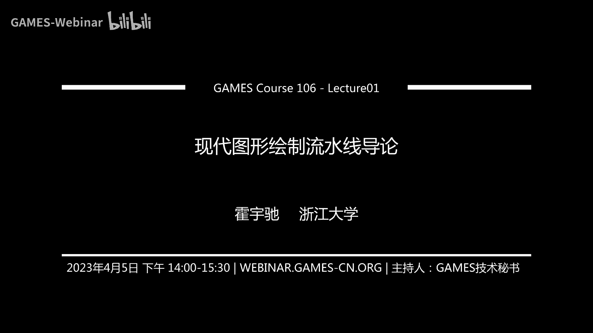
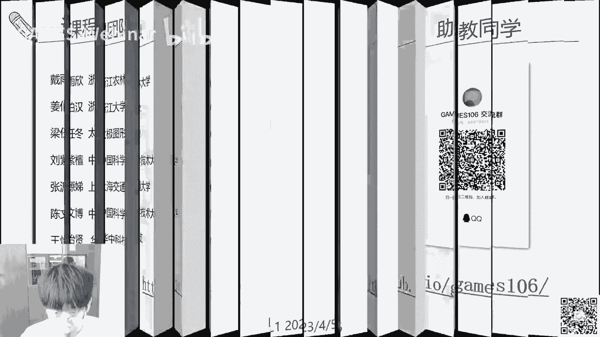
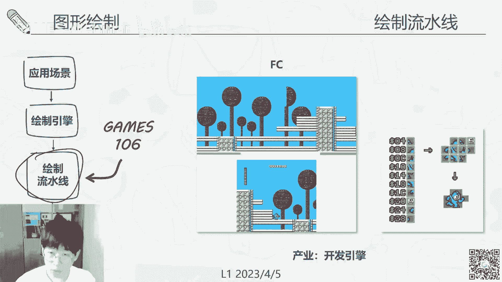
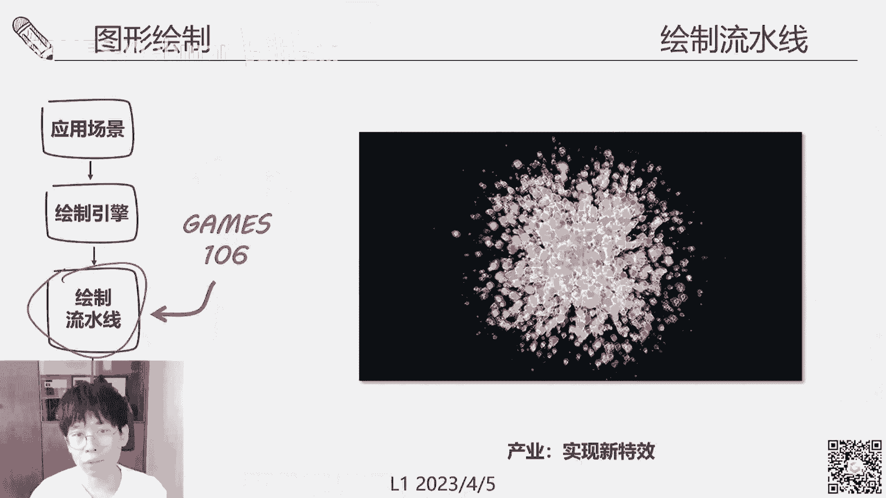
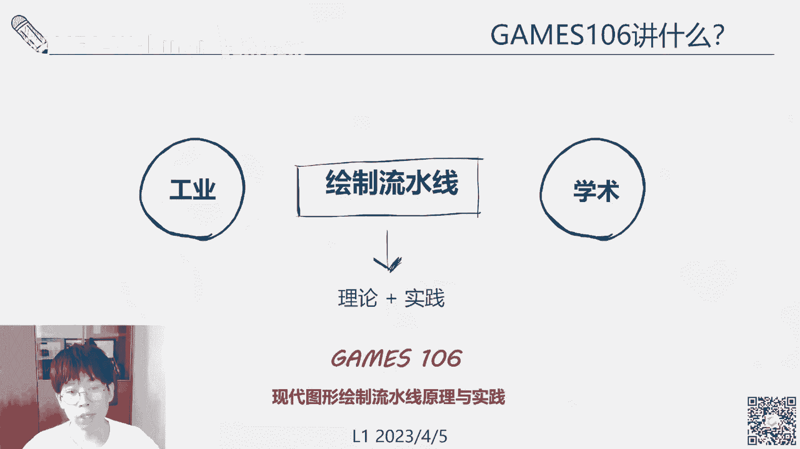
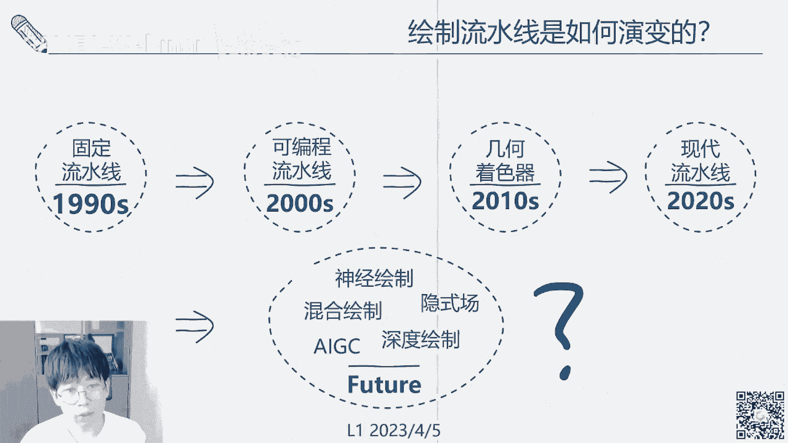

# GAMES106-现代图形绘制流水线原理与实践 - P1：1. 现代图形绘制流水线导论 🎬


大家好，今天是GAMES106的第一节课。首先介绍这门课程，课程名称是“现代图形绘制流水线的原理与实践”。我是惠池，现任浙江大学CAD方向的教师。




介绍我们的授课团队。本次课程由团队授课，共有五位主讲老师。我是CAD方向的霍雨池，同时在光线云和浙江实验室任职。我们还邀请了袁娅镇、高新峰、胡一伟和高涛四位老师共同授课。由于课程强调理论与实践并重，我们邀请了许多从事相关研究和开发的一线人员直接参与讲课。

我主要研究图形绘制，包括真实感绘制、实时绘制、神经绘制和GPU绘制等领域。由于个人兴趣和其他原因，我也从事机器设计视觉和计算光学相关的研究。相关成果发表在TOG、SIGGRAPH、CVPR、NeurIPS等会议和期刊上。

袁娅镇在腾讯游戏任职，主要研究实时绘制和绘制管线。高新峰是腾讯光子（北美）的资深研究员，从事几何计算和网格处理相关研究。胡一伟即将从耶鲁大学毕业并入职Adobe，主要研究纹理和可微绘制相关工作。高涛在向新科技工作，负责跨平台绘制引擎的研发。

我们团队在各自领域不仅进行开发，也发表了大量论文，总计约百篇，涵盖各类顶级会议和期刊。此外，我们还要感谢助教团队。有兴趣的同学可以通过邮件与他们联系或扫码入群。课程主页提供了课程介绍、作业等相关信息，欢迎各位同学访问。


今天第一个问题是开宗明义：GAMES106这门课要讲什么，以及为什么要讲这些内容。


总的来说，这门课是关于图形绘制的。图形绘制大家可能很熟悉，之前的GAMES101等课程也讲过。图形绘制的应用现在非常广泛。

在工业设计中，设计汽车或房屋都需要先用计算机绘制出来，供设计师和工程师进行技术和美学上的交流。艺术创作方面，电子艺术现已登堂入室，许多电子博物馆和线下博物馆都有收藏。CG艺术家创作电子艺术的技术支撑就是计算机图形学。

可视化用途非常广泛，包括IT、医学、气象等各类数据都需要通过图形学方式可视化，以辅助后续研发和分析。影视方面，无论是真人电影的特效还是动画电影，每一帧都由计算机图形学绘制出来。

游戏方面，3A大作比电影等其他类型多了一个可交互的过程，并且主要进行实时绘制。因此，游戏与绘制流水线更相关，因为它对实时性能要求较高。





支撑这些广泛应用场景的是绘制引擎。绘制引擎范围很广，不仅包括游戏引擎，还有其他各种离线引擎，甚至在操作系统和手机上都需要一套绘制引擎来可视化图形元素。例如，Blender等离线引擎使用光线追踪，Unity和Unreal等使用光栅化绘制流水线。

绘制引擎或引擎与流水线不同。引擎处理的是非常综合的业务，包括角色AI、动画、用户交互、网络传输、安全和存储等。引擎中最核心、将其与其他非图形程序区分开的部分是图形部分。图形部分的支撑就是我们今天要讲的内容：引擎是如何将东西真正画出来的。

当我们开发应用时，直接调用引擎来绘制。引擎如何连接硬件呢？硬件包括CPU、GPU、现在的NPU以及显示端的VR眼镜、AR眼镜、CRT、LED等各种显示器。绘制引擎并不直接操纵这些硬件。如果调用过游戏引擎或游戏设置，会发现其中还有一个后端，如OpenGL、DirectX或Vulkan。这就是所谓的绘制引擎后端，也是我们今天要讲的内容：绘制流水线。

绘制流水线可以认为是一个抽象层，它不仅包含软件，还包含一套硬件规范。不同的硬件厂商，包括显示器和GPU厂商，会建立工业流水线标准。基于这个标准和过程化的东西，我们进行统一的规范化，总结出图形API。因此，规范化的硬件绘制过程加上图形API，共同构成了我们的绘制流水线。

绘制流水线向上直接承接算法和具体数据（如几何三角面片、纹理），向下直接连接GPU和显示器。因此，可以认为绘制流水线是进行各种图形绘制、真正画图的抓手和控制点。

如果为当前图形业界的生态画一张图，大概是这样的：最上层有大量海量应用，包括VR、AR、虚拟现实、游戏等。下一层是许多绘制引擎。一个绘制引擎可以支撑很多应用，因此绘制引擎的数量相对较少。然而，绘制引擎无法直接连接硬件，所以中间需要通过一个后端API，即若干流水线标准。这些是业界的统一规范。流水线标准再往下连接五花八门的硬件，具体来说是通过硬件的驱动来连接和控制硬件。

因此，描述当前图形学界的生态，它是一个杠铃形态。杠铃的上端是各种引擎和面向应用层的东西，下端是各种硬件实现层的东西。流水线就是这个杠铃中间的杠杆。




很自然，当我们在开发新算法、制作引擎、实现特效、优化图形程序或进行科研时，首先会考虑在绘制流水线上进行开发。因为一一匹配不同的引擎、应用和硬件是非常麻烦的事情，所以汇聚成了这种形态。

因此，无论是想在产业界满足程序需求，还是想在学术界进行科研，如果想掌握比较核心的绘制技术，一个比较好的出发点就是先学习绘制流水线。这也是我们开设这门课的目的。

接下来举一些例子，说明为什么绘制流水线是GAMES106这样的基础课程，而不是更高级的课程。我们认为图形学是一门实践科学，无论是搞学术还是产业，都是基于当前可用的硬件和算力来设计算法。每个算法、每个引擎的开发都是在硬件的限制下“跳舞”。如果完全脱离硬件设计算法，这些算法设计出来没有太多实用价值，就变成了纯理论研究。因此，无论是做引擎还是算法，首先要考虑硬件。学习硬件，就要了解绘制流水线。

举一个很早的例子：红白机FC，任天堂当年一个很有名的游戏平台。这可能是我们现在接触到的绘制引擎最早的形态。由于红白机的硬件限制，显示时通过8x8的像素块（Tile）拼接整个图像，并且在整个场景中无法同时刷新所有Tile，只能一块一块地刷新。一些连续的动作游戏需要不断变换场景，比如经典的横版过关游戏《洛克人》。当时的技术人员和任天堂的引擎开发人员根据这些技能限制，设计了卷轴式的场景刷新方法。如上图，绿线部分是实际能看到的，但在将画面展示给玩家之前，实际上已经在前方一块一块地刷新了场景。这是一个非常典型的根据硬件进行引擎或绘制开发的例子。

另一个重要的例子是，在产业界或公司中，老板可能要求开发一个新特效，比如粒子系统、天气效果、广告牌或曲面积分，以实现全局光照效果。这该怎么办？还是得通过硬件。首先看硬件能否支撑，然后根据硬件进行相应的开发。一个近期的经典例子是RTX光线追踪。光线追踪或全局光照在学术界已经研究了十几年，但为什么最近几年才在民用市场真正落地？一个关键原因是现在的硬件支持了，即NVIDIA的RT Core（RTX）支持了我们在引擎端部署这项技术，实现这个特效。

看这张图，全局光照与传统的局部光照的区别在于，全局光照可以通过光线的多次折射来模拟更自然的光照变化，更符合物理过程。例如，左边图像的灰阶过渡更自然。如果在右边关闭光线追踪，由于缺少多次全局光照，游戏设计师只能用比较灰白的环境光来填充场景，失去了很多动态和真实的效果。

第三个关键是，绘制流水线可以用于优化性能。优化一段绘制程序或一个绘制效果的性能（例如帧率），首先应该调整与绘制流水线相关的代码、控制代码以及着色器代码。后面会详细讲。

同样举一个例子说明为什么优化图形程序需要与硬件相关。这是一个非常有名的例子：《雷神之锤》中的“卡马克反转”，即快速计算倒数平方根的逼近算法。如果不了解硬件，直接让GPU/CPU计算平方根再求倒数，可能会有大问题，因为GPU/CPU没有这么多运算资源来做倒数和开根运算。该核心算法使用牛顿迭代法进行泰勒展开来近似求解。具体细节在此不展开，网上有很多讨论，也有论文专门研究为什么一些“魔法数字”能产生效果。有兴趣的同学可以查找，后续课程有机会也会展开讲。

在科研部分，绘制流水线支撑了各类图形绘制算法。我们进行图形绘制或图形绘制算法开发时，大部分是在流水线上进行的，无论是实时还是离线。因为引擎是一个非常抽象的封装，大部分面向脚本语言、艺术家和面向应用层的开发人员。真正进行图形算法开发，自然需要走到更下一层，即绘制引擎的支撑层——绘制流水线。当然，更下一层也有一些程序员直接搞驱动、搞汇编，但要求较高。作为普通开发人员或科研人员，我们大部分还是在绘制流水线上进行开发。

另外，绘制流水线本身也是一个重要的研究对象。因为绘制流水线在工业中用途广泛，包括各种引擎、硬件和算法都要与绘制流水线打交道。如何提升绘制流水线的效能本身就是一个重要的科研问题。例如，有些工作优化其I/O，有些优化能耗，有些优化并行度，还有些在流水线上进行可微分析以实现全局优化。这些在后续有机会时会详细介绍。


另一个重要的例子是，绘制流水线支撑科研数据集的生成。例如，交通仿真或实际绘制算法。因为这些数据的生成非常定制化，一般的游戏引擎很难产生这种特意定制化的数据。所以，在进行机器学习相关开发时，也会用到绘制流水线的相关知识。此外，无论是做流体、物理还是其他研究，最终将科研结果可视化出来也需要支撑工具，这也是绘制流水线可以做的事情。


简单总结：绘制流水线是支撑工业需求和学术需求的杠杆和入门砖。我们这门课程主要就是讲这个事情：怎么用，以及它背后的理论和与硬件相关的原理是如何发展过来的。


以上回答了第一个问题。接下来是第二个问题：我们首先讲了背景，现在想一想，如何认识绘制流水线，它到底是什么东西。


先说“流水线”的概念。提到这三个字，最容易想到工业流水线：工厂里有很多工人，一个接一个地执行特定操作。A操作员接收一堆物料进行操作，然后将结果交给B操作员，B操作员接收A的输入再进行操作。基本上是一个顺序操作。当然，真实的流水线包括图形绘制流水线，中间有很多工序交叉和互相协作。但从非常抽象或高层的角度理解，流水线就是给一堆物料，然后产生一个结果，这样一个工序化、按步骤进行的过程。

具体到图形绘制领域，我们输入的主要物料有三个：几何、纹理和光照。我们给一个物体的形状、外观以及当前场景的光照环境，然后进行计算，产生图片。这是一个固定的绘制流水线。写成一个函数或方程的话，如下：

```
Image = Pipeline(Geometry, Texture, Lighting)
```

其中，`Pipeline` 代表绘制流水线，输入是几何、纹理和光照，输出是图片。

到了后期，我们涉及可编程的绘制流水线。就是说，我们现在不仅希望生产固定的东西，还希望可以替换里面的“操作员”，进行各种操作，对流水线产生的结果进行定制化变化。因此，在可编程的绘制流水线中，多了一个新的输入：着色器语言。着色器是一段程序代码，用于控制或个性化绘制流水线的中间过程，产生更丰富的效果。

将整个图形绘制流水线画出来，大概长这个样子：首尾相连，一块连一块的不同模块。每个模块都有相应的硬件支撑。调用这些模块时，需要给定正确的输入。

从左边开始，流水线的入口一般是先给一些几何表达，即场景的几何表达。几何通常用顶点和索引来表示：每个三角面片在世界中的位置，然后用索引将这些顶点连接成三角面片带。

装配好之后，这些顶点被送入顶点着色器。顶点着色器对这些三角面片进行转换，例如模型变换、视图变换等，改变其形状或视图。

中间有一些省略号，因为可能还有几何着色器等可选部分，此处不深入细讲。

第三部分，我们将顶点送到光栅化阶段。光栅化在之前的课程（如GAMES101）中应该提到过，即将三角面片投影到屏幕空间，将其像素化。

下一部分，此时顶点已经变成了像素，所有计算都转到像素上进行。

经过光栅化后，流水线的输出变成了一堆在每个像素上的“资产”。

到了片元着色器阶段，此时会有新的材料输入进来：纹理和光照。这两个材料在片元着色器阶段输入。光照计算就在此处进行，结合几何、纹理和光照，计算每个三角面片或像素最终应呈现的颜色。

最后，将不同的图层（包括背景）叠加起来，输出到帧缓冲区。帧缓冲区直接与显示设备对接，产生最终的图片。

在这个流水线中，有些地方是固定的，有些地方是可编程的。图中蓝绿色的地方是固定管线，由厂商或工业标准固定下来，认为不需要太多定制化操作，因此用非常高效的方法实现。中间的顶点着色器和片元着色器部分可以进行各种编程。我们向这些部分输送着色器程序，就可以进行各种操作。

因此，第四个元素——着色器程序也加入了进来。

总体看一下整个绘制流水线，对应刚才的函数，管线本身（`Pipeline`）加上几何、纹理、光照和着色器。我们根据这几个部分的不同，对课程进行了划分。

首先，课程0是准备部分，主要讲如何配置API相关的东西，这部分由高涛主讲。

第二部分是管线对象，讲如何配置管线或对管线输出进行重新组合、排列和调制优化，这部分由袁娅镇主讲。

第三部分，高新峰主讲几何部分，即如何对几何进行处理和优化以提高效率。

最后是纹理部分，由胡一伟主讲，他一直从事纹理相关工作。

我会主讲着色器语言部分。着色器会与光照一起讲，因为光照输入形式相对简单，并且与着色器语言耦合比较紧密，大部分情况下会直接作为参数给着色器语言。

进行一个感性的分解：在图形API部分，我们主要做“加法”，即如何将一个场景构建起来，如何使用这些工具，给定原始物料后如何生产出来。到了后面的管线对象、几何、纹理、着色器部分，我们主要做“减法”，即给定一个管线生产出东西，但这些东西在计算机或给定硬件上可能跑不起来。我们如何对每一部分进行对应的优化和分析，使每个部分都达到很好的效率。

最终，我们希望在前面的构建部分产生一个非常精美（虽然不是特别复杂）的场景。在优化部分，对这些先进技术进行拆解，让大家了解对这个复杂绘制过程的每一部分、绘制管线的每一部分可以进行哪些操作、研究和检索。大体就是这个样子。

回到第二个问题的答案：绘制流水线是怎样的结构？它有很多模块，按步骤输入几个重要的输入（几何、纹理、光照和着色器语言），最终输出一张图片，这是一个标准化的流程。





今天课程的第三部分讲一些比较轻松的话题。因为今天是导论部分，我们讲一下绘制流水线是如何一步步演变成今天这样的，它背后的驱动力其实也是与硬件、软件以及产业界的需求紧密相连，才逐渐发展成今天这个样子。


首先讲一个背景：经典绘制流水线是如何产生或为什么产生的？我们刚才提到了很多像光栅化的东西。不知道大家有没有做过软光栅化，即用CPU程序做三角面片的投影和插值，实际产生每个像素的颜色。这个东西不需要GPU，在CPU上也可以做。

CPU和GPU的最大区别是：CPU顺序执行，更像传统想象中的流水线；GPU并行执行，即流水线不是一条线，上面有很多“工人”，可以同时有很多并行的流水线，一把处理掉几百万、几千万个三角顶点，画出来。这就是GPU和CPU的最大区别。

很自然，绘制最初是在专用市场，但要进入民用市场或更多应用领域，必须提速。这时就有了GPU进行并行图元绘制。想到的一个方法是：用CPU控制GPU，因为在早期，特别是还没有标准化的GPU编程语言时，GPU不太容易编程。一个比较好的方法是将GPU的绘制过程固定下来，做成标准化的东西，然后让CPU控制GPU。CPU将要处理的数据、面片、纹理等打包好，一发指令，GPU就按顺序执行。这就是最早的固定绘制流水线。

这大概要追溯到上世纪90年代。那时，图形学还没有进入消费级市场，主要在一些高端图形工作站上应用，在产业界用得比较多。一个比较有名的公司是SGI，地位有点类似于今天的NVIDIA。SGI主要做图形工作站，用于影视级绘制，比如很早的经典电影《侏罗纪公园》就是用SGI工作站做出来的。

SGI不仅做硬件，还做图形API。为了方便编程，它有一个专利性的图形API叫做IRIS GL。后来，SGI觉得这个API自己用对产业界影响太小，认为如果统一工业界的API，可以在跨硬件、跨平台上使用，对推动整个业界发展甚至民用化会有很大帮助。所以，它基于自己的Graphic Language，做成了一个开放标准，推动了开放标准的诞生。这就是最早的OpenGL 1.0版本，于1992年发布。

OpenGL并非由SGI一家公司推动，而是成立了一个叫OpenGL ARB（Architecture Review Board）的成员组织。初始成员包括康柏、IBM、Intel、微软、DEC等大公司，之后惠普、Media TI等也加入。OpenGL实际上是第一个跨平台、跨硬件的编程接口，它将整个图形绘制过程规范化。它不仅用于三维图形绘制，还可以做二维图形绘制。因此，有时在操作系统和UI中进行的各种2D工作也可以通过OpenGL完成。它在很大程度上推动了图形化界面和图形化应用的发展。

它支持的平台包括Windows、Unix、Linux、Mac OS以及手机（主要是OpenGL ES）。用户或程序员只需要开发一套针对OpenGL的算法，就可以在所有硬件上运行，这是一件非常美好的事情。

右边这张图是它的简单框架。OpenGL定义了一个标准，它有很多具体实现。Mesa 3D就是一个非常有名开源的OpenGL实现。它会对接下面的系统层的一些调用和驱动，产生各种具体操作。这些驱动再去驱动各种显示设备、计算设备以及内存的使用。

到了93年底，一些重要的游戏开发出来，3D游戏一时之间变得很火爆。SGI的一些工程师离开公司，创办了创业公司3Dfx，推出了Voodoo卡，即3D加速卡。如果是当年看电脑报或电脑之家的老用户，应该对Voodoo卡比较熟悉。


3Dfx推出的Voodoo卡技术很牛逼，但也很封闭，不想用OpenGL。它推出了一个叫做Glide的图形API，只能用于自己的显卡。虽然硬件很牛逼，但引起了图形学界一些重量